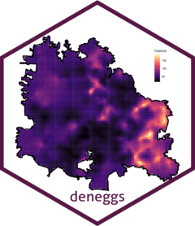

<!-- README.md is generated from README.Rmd. Please edit that file -->

```{r, include = FALSE}
knitr::opts_chunk$set(
  collapse = TRUE,
  comment = "#>",
  fig.path = "man/figures/README-",
  out.width = "100%"
)
```

# **deneggs**

[](https://travis-ci.org/pages-themes/cayman) [](https://badge.fury.io/rb/jekyll-theme-cayman)[]()
[](https://app.netlify.com/sites/chic-shortbread-cffbbf/deploys)



**deneggs is a package developed in the department of prevention and control of diseases transmitted by vector of the [Secretary of Health of Veracruz](https://www.ssaver.gob.mx/) and with colaboration of the [CENAPRECE](https://www.gob.mx/salud/cenaprece)**


## **overview**

**deneggs** is a package to generate predictive maps of the number of eggs or adults in areas where it is not collected.The predictive maps are generated using geostatistical analysis in the [INLA](http://www.r-inla.org/) framework. 

  - **`deneggs::spde_pred_map()`** generate the predictive mapand calculate the hotspots. Run the models with six distributions.
  - **`deneggs::eggs_hotspots()`** generate the predictive map and calculate the hotspots. Run the model with one distribution.
  - **`deneggs::animap_vector_hotblocks()`** generate the animated map of hotblocks of eggs abundance.
  - **`deneggs::ovitraps_read()`** reads current ovitramp databases and historical.
  - **`deneggs::eggs_map()`** generates an entomological risk map or an egg density map.
  - **`deneggs::loc_grid_points()`** It is a complementary function that helps in the creation of grid of the locality in the prediction stack in [INLA](http://www.r-inla.org/).
  - **`mesh()`** It is a complementary function that helps in the creation of mesh.

## Instalation

``` r
# The easiest way to get deneggs is to install:
install.packages("deneggs")
```

### Development version

To get a bug fix, or use a feature from the development version, you can
install deneggs from GitHub.

mac
``` r
# install.packages("devtools")
devtools::install_github("fdzul/deneggs")
``` 

linux fedora
``` r
# install.packages("devtools")
remotes::install_github("fdzul/deneggs")
```

## Authors

List of [contributors](https://github.com/fdzul/deneggs/contributors) who participated in this project.

## License

This project is licensed under the MIT License - see the [LICENSE.md](LICENSE.md) file for details


## Inspiration

The package was inspired by the need to contribute to making decisions in the dengue prevention and control program, specifically to identify dengue vector hotspots and use the entomological information generated by the program.

## Getting help

If you encounter a clear bug, please file a minimal reproducible example
on [github](https://github.com/fdzul/deneggs/issues). For questions
and other discussion, please feel free to contact me (felipe.dzul.m@gmail.com)

-----

Please note that this project is released with a [Contributor Code of
Conduct](https://dplyr.tidyverse.org/CODE_OF_CONDUCT). By participating
in this project you agree to abide by its terms.
