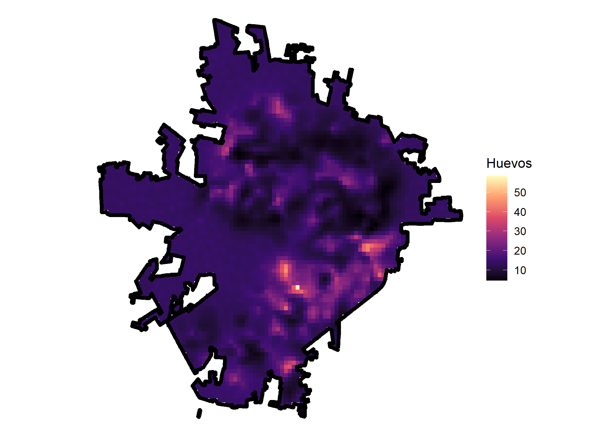

<!-- README.md is generated from README.Rmd. Please edit that file -->

# **deneggs**

[](https://travis-ci.org/pages-themes/cayman)
[](https://badge.fury.io/rb/jekyll-theme-cayman)[]()

**deneggs is a package developed in the department of prevention and
control of diseases transmitted by vector of the [Secretary of Health of
Veracruz](https://www.ssaver.gob.mx/) and with colaboration of the
[CENAPRECE](https://www.gob.mx/salud/cenaprece)**

## **overview**

**deneggs** is a package to generate predictive maps of the number of
eggs or adults in areas where it is not collected.The predictive maps
are generated using geostatistical analysis in the
[INLA](http://www.r-inla.org/) framework.

-   **`deneggs::spde_pred_map()`** generate the predictive mapand
    calculate the hotspots. Run the models with six distributions.
-   **`deneggs::eggs_hotspots()`** generate the predictive map and
    calculate the hotspots. Run the model with one distribution.
-   **`deneggs::animap_vector_hotblocks()`** generate the animated map
    of hotblocks of eggs abundance.
-   **`deneggs::ovitraps_read()`** reads current ovitramp databases and
    historical.
-   **`deneggs::eggs_map()`** generates an entomological risk map or an
    egg density map.
-   **`deneggs::loc_grid_points()`** It is a complementary function that
    helps in the creation of grid of the locality in the prediction
    stack in [INLA](http://www.r-inla.org/).
-   **`mesh()`** It is a complementary function that helps in the
    creation of mesh.

## Instalation

``` r
# The easiest way to get deneggs is to install:
install.packages("deneggs")
```

### Development version

To get a bug fix, or use a feature from the development version, you can
install deneggs from GitHub.

mac

``` r
# install.packages("devtools")
devtools::install_github("fdzul/deneggs")
```

linux fedora

``` r
# install.packages("devtools")
remote::install_github("fdzul/deneggs")
```

### **`deneggs::spde_pred_map()`** return a list with six object:

-   **`data`** is the original dataset of the ovitrap.
-   **`pred`** is the predicction dataset of *the Ae. aegypti* eggs.
-   **`dics`** is a dataframe with the dics of six distribution
    (poisson, zeroinflatedpoisson0, 1, zeroinflatedpoisson1, nbinomial,
    nbinomial2, zeroinflatednbinomial0, zeroinflatednbinomial1).
-   **`hotspots`** a dataset with the eggs prediction and the hotspots
    eggs.
-   **`loc`** is the loclaity limit.
-   **`map`** is the map prediction.

``` r
# Step 1. define the paths 
library(magrittr)
library(sf)
path_lect <- "D:/Users/OneDrive/datasets/SI_Monitoreo_Vectores/subsistema_vigilancia_dengue/2020/12_Guerrero"
path_coord =  "D:/Users/OneDrive/datasets/SI_Monitoreo_Vectores/subsistema_vigilancia_dengue/2020/12_Guerrero/DescargaOvitrampasMesFco.txt"

acapulco <- deneggs::spde_pred_map(path_lect = path_lect,
                                   cve_ent = "12",
                                   locality  = c("Acapulco de Juárez"),
                                   path_coord =  path_coord,
                                   longitude  = "Pocision_X",
                                   latitude =  "Pocision_Y",
                                   aproximation = "gaussian",
                                   integration = "eb",
                                   k = 20,
                                   palette_vir  = "magma",
                                   leg_title = "Huevos",
                                   week = lubridate::epiweek(Sys.Date())-1,
                                   plot = TRUE,
                                   var = "Huevecillos",
                                   cell_size = 1000,
                                   alpha = .99)
```


``` r

knitr::kable(head(acapulco$data), "simple")
```

|      | Clave.x           | Entidad.x   | Jurisdiccion  | Municipio.x        | Localidad.x        | Sector | Manzana |   Ovitrampa | Huevecillos | No.Lectura | Fecha.Lectura | Fecha.Recoleccion.Papeleta | Semana.Epidemiologica | Usuario  | Fecha.Captura | RFC.del.Operador | CAMEX | Clave.y           | Entidad.y   | Municipio.y            | Localidad.y             | Pocision\_X | Pocision\_Y | FechaGeo   |
|------|:------------------|:------------|:--------------|:-------------------|:-------------------|-------:|--------:|------------:|------------:|:-----------|:--------------|:---------------------------|----------------------:|:---------|:--------------|:-----------------|:------|:------------------|:------------|:-----------------------|:------------------------|------------:|------------:|:-----------|
| 6411 | 12001000103010298 | 12 Guerrero | 1207 Acapulco | Acapulco de Juárez | Acapulco De Juárez |    301 |     298 | 12001017264 |           0 | 32         | 04/12/2020    | 04/12/2020                 |                    49 | C1207:02 | 07/12/2020    | OECJ870108KK8    | SI    | 12001000103010298 | 12 Guerrero | 001 Acapulco de Juárez | 0001 ACAPULCO DE JUÁREZ |   -99.81421 |    16.83524 | 20/04/2018 |
| 6412 | 12001000103010298 | 12 Guerrero | 1207 Acapulco | Acapulco de Juárez | Acapulco De Juárez |    301 |     298 | 12001017265 |           0 | 32         | 04/12/2020    | 04/12/2020                 |                    49 | C1207:02 | 07/12/2020    | OECJ870108KK8    | SI    | 12001000103010298 | 12 Guerrero | 001 Acapulco de Juárez | 0001 ACAPULCO DE JUÁREZ |   -99.81427 |    16.83550 | 20/04/2018 |
| 6413 | 12001000102940155 | 12 Guerrero | 1207 Acapulco | Acapulco de Juárez | Acapulco De Juárez |    294 |     155 | 12001017266 |           0 | 31         | 30/11/2020    | 30/11/2020                 |                    49 | C1207:02 | 01/12/2020    | AAAL860731HL3    | SI    | 12001000102940155 | 12 Guerrero | 001 Acapulco de Juárez | 0001 ACAPULCO DE JUÁREZ |   -99.80778 |    16.83621 | 20/04/2018 |
| 6414 | 12001000102940155 | 12 Guerrero | 1207 Acapulco | Acapulco de Juárez | Acapulco De Juárez |    294 |     155 | 12001017267 |           2 | 31         | 30/11/2020    | 30/11/2020                 |                    49 | C1207:02 | 01/12/2020    | AAAL860731HL3    | SI    | 12001000102940155 | 12 Guerrero | 001 Acapulco de Juárez | 0001 ACAPULCO DE JUÁREZ |   -99.80782 |    16.83604 | 20/04/2018 |
| 6415 | 12001000102940155 | 12 Guerrero | 1207 Acapulco | Acapulco de Juárez | Acapulco De Juárez |    294 |     155 | 12001017268 |           0 | 31         | 30/11/2020    | 30/11/2020                 |                    49 | C1207:02 | 01/12/2020    | AAAL860731HL3    | SI    | 12001000102940155 | 12 Guerrero | 001 Acapulco de Juárez | 0001 ACAPULCO DE JUÁREZ |   -99.80676 |    16.83585 | 20/04/2018 |
| 6416 | 12001000102940155 | 12 Guerrero | 1207 Acapulco | Acapulco de Juárez | Acapulco De Juárez |    294 |     155 | 12001017269 |           1 | 31         | 30/11/2020    | 30/11/2020                 |                    49 | C1207:02 | 01/12/2020    | AAAL860731HL3    | SI    | 12001000102940155 | 12 Guerrero | 001 Acapulco de Juárez | 0001 ACAPULCO DE JUÁREZ |   -99.80671 |    16.83599 | 20/04/2018 |

``` r
knitr::kable(head(acapulco$pred), "simple")
```

|         x |        y | pred\_mean | pred\_sd | pred\_ll | pred\_ul | ws\_mean | ws\_sd | week | fam                    |     dic |
|----------:|---------:|-----------:|---------:|---------:|---------:|---------:|-------:|-----:|:-----------------------|--------:|
| -99.70839 | 16.71783 |   8.318508 | 3.685817 | 3.316328 | 3.316328 |       NA |     NA |   49 | zeroinflatednbinomial0 | 23826.6 |
| -99.71302 | 16.72005 |   8.296969 | 3.614828 | 3.359264 | 3.359264 |       NA |     NA |   49 | zeroinflatednbinomial0 | 23826.6 |
| -99.71764 | 16.72228 |   8.224431 | 3.371201 | 3.514488 | 3.514488 |       NA |     NA |   49 | zeroinflatednbinomial0 | 23826.6 |
| -99.71533 | 16.72228 |   8.243241 | 3.436640 | 3.471199 | 3.471199 |       NA |     NA |   49 | zeroinflatednbinomial0 | 23826.6 |
| -99.71302 | 16.72228 |   8.320136 | 3.685880 | 3.317524 | 3.317524 |       NA |     NA |   49 | zeroinflatednbinomial0 | 23826.6 |
| -99.72226 | 16.72451 |   8.406972 | 3.934505 | 3.182243 | 3.182243 |       NA |     NA |   49 | zeroinflatednbinomial0 | 23826.6 |

``` r
knitr::kable(head(acapulco$dics), "simple")
```

|      dic | fam                    |
|---------:|:-----------------------|
| 60626.10 | poisson                |
| 43101.53 | zeroinflatedpoisson0   |
| 43104.48 | zeroinflatedpoisson1   |
| 24172.43 | nbinomial              |
| 24934.48 | nbinomial2             |
| 23832.66 | zeroinflatednbinomial0 |

``` r
knitr::kable(head(acapulco$hotspots), "simple")
```

|         x |        y | pred\_mean | pred\_sd | pred\_ll | pred\_ul | ws\_mean | ws\_sd | week | fam                    |     dic | z\_score    | hotspots    |
|----------:|---------:|-----------:|---------:|---------:|---------:|---------:|-------:|-----:|:-----------------------|--------:|:------------|:------------|
| -99.70839 | 16.71783 |   8.318508 | 3.685817 | 3.316328 | 3.316328 |       NA |     NA |   49 | zeroinflatednbinomial0 | 23826.6 | -0.05498901 | No Hotspots |
| -99.71302 | 16.72005 |   8.296969 | 3.614828 | 3.359264 | 3.359264 |       NA |     NA |   49 | zeroinflatednbinomial0 | 23826.6 | -0.14175733 | No Hotspots |
| -99.71764 | 16.72228 |   8.224431 | 3.371201 | 3.514488 | 3.514488 |       NA |     NA |   49 | zeroinflatednbinomial0 | 23826.6 | -0.14237606 | No Hotspots |
| -99.71533 | 16.72228 |   8.243241 | 3.436640 | 3.471199 | 3.471199 |       NA |     NA |   49 | zeroinflatednbinomial0 | 23826.6 | -0.15257546 | No Hotspots |
| -99.71302 | 16.72228 |   8.320136 | 3.685880 | 3.317524 | 3.317524 |       NA |     NA |   49 | zeroinflatednbinomial0 | 23826.6 | -0.05124080 | No Hotspots |
| -99.72226 | 16.72451 |   8.406972 | 3.934505 | 3.182243 | 3.182243 |       NA |     NA |   49 | zeroinflatednbinomial0 | 23826.6 | -0.07364651 | No Hotspots |

``` r
# The locality limit of Acapulco
plot(sf::st_geometry(acapulco$loc))
```


``` r
# prediction of the number of Ae. aegypty eggs in the metropolitan area of Acapulco
acapulco$map
```


``` r
# prediction of the number of eggs in the metropolitan area of Monterrey 
deneggs::eggs_hotspots(path_lect = "D:/Users/OneDrive/datasets/SI_Monitoreo_Vectores/subsistema_vigilancia_dengue/2020/19_NuevoLeon",
                       cve_ent = "19",
                       locality  = c("Ciudad General Escobedo", "Ciudad Apodaca",
                                     "Guadalupe", "Monterrey", "Ciudad Santa Catarina",
                                     "San Pedro Garza García", "Ciudad Benito Juárez",
                                     "San Nicolás de los Garza", "Montebello"),
                       path_coord =  "D:/Users/OneDrive/datasets/SI_Monitoreo_Vectores/subsistema_vigilancia_dengue/2020/19_NuevoLeon/DescargaOvitrampasMesFco.txt",
                       longitude  = "Pocision_X",
                       latitude =  "Pocision_Y",
                       aproximation = "gaussian",
                       integration = "eb",
                       fam = "zeroinflatednbinomial1",
                       k = 30,
                       palette_vir  = "magma",
                       leg_title = "Huevos",
                       plot = FALSE,
                       hist_dataset = FALSE, #####
                       sem = lubridate::epiweek(Sys.Date())-1,
                       var = "eggs",
                       cell_size = 1000,
                       alpha = .99)$map
```


``` r
# prediction of the number of eggs in the metropolitan area of Merida
deneggs::eggs_hotspots(path_lect = "D:/Users/OneDrive/datasets/SI_Monitoreo_Vectores/subsistema_vigilancia_dengue/2020/31_Yucatan",
                       cve_ent = "31",
                       locality  = c("Mérida"),
                       path_coord =  "D:/Users/OneDrive/datasets/SI_Monitoreo_Vectores/subsistema_vigilancia_dengue/2020/31_yucatan/DescargaOvitrampasMesFco.txt",
                       longitude  = "Pocision_X",
                       latitude =  "Pocision_Y",
                       aproximation = "gaussian",
                       integration = "eb",
                       fam = "zeroinflatednbinomial1",
                       k = 30,
                       palette_vir  = "magma",
                       leg_title = "Huevos",
                       plot = FALSE,
                       hist_dataset = FALSE, #####
                       sem = lubridate::epiweek(Sys.Date())-1,
                       var = "eggs",
                       cell_size = 1000,
                       alpha = .99)$map
```



``` r
# prediction of the number of eggs in the metropolitan area of Guadalajara
deneggs::eggs_hotspots(path_lect = "D:/Users/OneDrive/datasets/SI_Monitoreo_Vectores/subsistema_vigilancia_dengue/2020/14_Jalisco",
                       cve_ent = "14",
                       locality  = c("Guadalajara", "Tlaquepaque", "Zapopan", "Tonalá"),
                       path_coord =  "D:/Users/OneDrive/datasets/SI_Monitoreo_Vectores/subsistema_vigilancia_dengue/2020/14_Jalisco/DescargaOvitrampasMesFco.txt",
                       longitude  = "Pocision_X",
                       latitude =  "Pocision_Y",
                       aproximation = "gaussian",
                       integration = "eb",
                       fam = "zeroinflatednbinomial1",
                       k = 40,
                       palette_vir  = "magma",
                       leg_title = "Huevos",
                       plot = FALSE,
                       hist_dataset = FALSE, #####
                       sem = lubridate::epiweek(Sys.Date())-1,
                       var = "eggs",
                       cell_size = 1000,
                       alpha = .99)$map
```


## Authors

-   **Felipe Antonio Dzul Manzanilla** -**<https://github.com/fdzul>** -
    Packages developed in github:

    1.  [denhotspots](https://github.com/fdzul/denhotspots).
    2.  [boldenr](https://github.com/fdzul/boldenr).
    3.  [dendata](https://github.com/fdzul/dendata).
    4.  [rgeomex](https://github.com/fdzul/rgeomex).

-   **Fabian Correa Morales**

-   **Luis Hernández Herrera**

-   **Arturo Baez-Hernández**

See also the list of
[contributors](https://github.com/fdzul/deneggs/contributors) who
participated in this project.

## License

This project is licensed under the MIT License - see the
[LICENSE.md](LICENSE.md) file for details

## Inspiration

The package was inspired by the need to contribute to making decisions
in the dengue prevention and control program, specifically to identify
dengue vector hotspots and use the entomological information generated
by the program.

## Getting help

If you encounter a clear bug, please file a minimal reproducible example
on [github](https://github.com/fdzul/deneggs/issues). For questions and
other discussion, please feel free to contact me
(<felipe.dzul.m@gmail.com>)

------------------------------------------------------------------------

Please note that this project is released with a [Contributor Code of
Conduct](https://dplyr.tidyverse.org/CODE_OF_CONDUCT). By participating
in this project you agree to abide by its terms.
