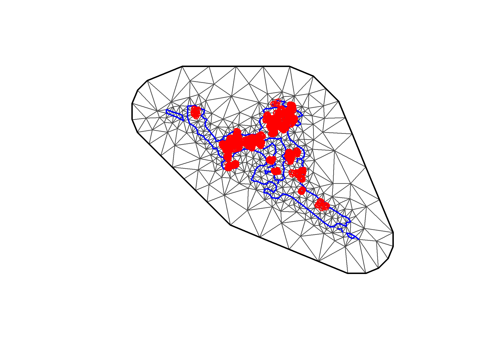

<!-- README.md is generated from README.Rmd. Please edit that file -->

# **deneggs**

[](https://travis-ci.org/pages-themes/cayman)
[](https://badge.fury.io/rb/jekyll-theme-cayman)[]()

**deneggs is a package developed in the department of prevention and
control of diseases transmitted by vector of the [Secretary of Health of
Veracruz](https://www.ssaver.gob.mx/) and with colaboration of the
[CENAPRECE](https://www.gob.mx/salud/cenaprece)**

## **overview**

**deneggs** is a package to generate predictive maps of the number of
eggs or adults in areas where it is not collected.The predictive maps
are generated using geostatistical analysis in the
[INLA](http://www.r-inla.org/) framework.

-   **`spde_pred_map()`** generate the predictive map.
-   **`eggs_map()`** generates an entomological risk map or an egg
    density map.
-   **`loc_grid_points()`** It is a complementary function that helps in
    the creation of grid of the locality in the prediction stack in
    [INLA](http://www.r-inla.org/).
-   **`mesh()`** It is a complementary function that helps in the
    creation of mesh.

## Instalation

``` r
# The easiest way to get deneggs is to install:
install.packages("deneggs")
```

### Development version

To get a bug fix, or use a feature from the development version, you can
install deneggs from GitHub.

mac

``` r
# install.packages("devtools")
devtools::install_github("fdzul/deneggs")
```

linux fedora

``` r
# install.packages("devtools")
remote::install_github("fdzul/deneggs")
```

## Example

``` r
# Step 1. define the paths 
library(magrittr)
#> Warning: package 'magrittr' was built under R version 4.0.3
path_lect <- "D:/Users/OneDrive/datasets/SI_Monitoreo_Vectores/subsistema_vigilancia_dengue/2020/12_Guerrero"
path_shp <- "D:/Users/OneDrive/datasets/MG_sep_2019/12_guerrero/conjunto_de_datos/12l.shp"
path_coord =  "D:/Users/OneDrive/datasets/SI_Monitoreo_Vectores/subsistema_vigilancia_dengue/2020/12_Guerrero/DescargaOvitrampasMesFco.txt"

acapulco <- deneggs::spde_pred_map(path_lect = path_lect,
                 path_shp = path_shp,
                 locality  = c("Acapulco de Juárez"),
                 path_coord =  path_coord,
                 longitude  = "Pocision_X",
                 latitude =  "Pocision_Y",
                 aproximation = "gaussian",
                 integration = "eb",
                 k = 20,
                 palette_vir  = "magma",
                 leg_title = "Huevos de Ae. aegypti",
                 week = lubridate::epiweek(Sys.Date())-2,
                 plot = TRUE,
                 var = "Huevecillos",
                 cell_size = 1000,
                 alpha = .99)
#> Warning in scan(file = file, what = what, sep = sep, quote = quote, dec = dec, :
#> embedded nul(s) found in input
#> Warning in scan(file = file, what = what, sep = sep, quote = quote, dec = dec, :
#> embedded nul(s) found in input
#> although coordinates are longitude/latitude, st_intersects assumes that they are planar
#> although coordinates are longitude/latitude, st_intersects assumes that they are planar
#> Warning in proj4string(sp): CRS object has comment, which is lost in output
#> although coordinates are longitude/latitude, st_intersects assumes that they are planar
#> 
#>      PLEASE NOTE:  The components "delsgs" and "summary" of the
#>  object returned by deldir() are now DATA FRAMES rather than
#>  matrices (as they were prior to release 0.0-18).
#>  See help("deldir").
#>  
#>      PLEASE NOTE: The process that deldir() uses for determining
#>  duplicated points has changed from that used in version
#>  0.0-9 of this package (and previously). See help("deldir").
```



``` r
knitr::kable(acapulco$data, "simple", caption = "An example table caption.")
```

|       | Clave.x           | Entidad.x   | Jurisdiccion  | Municipio.x        | Localidad.x        | Sector | Manzana |   Ovitrampa | Huevecillos | No.Lectura | Fecha.Lectura | Fecha.Recoleccion.Papeleta | Semana.Epidemiologica | Usuario  | Fecha.Captura | RFC.del.Operador | CAMEX | Clave.y           | Entidad.y   | Municipio.y            | Localidad.y             | Pocision\_X | Pocision\_Y | FechaGeo   |
|-------|:------------------|:------------|:--------------|:-------------------|:-------------------|-------:|--------:|------------:|------------:|:-----------|:--------------|:---------------------------|----------------------:|:---------|:--------------|:-----------------|:------|:------------------|:------------|:-----------------------|:------------------------|------------:|------------:|:-----------|
| 5597  | 12001000102150095 | 12 Guerrero | 1207 Acapulco | Acapulco de Juárez | Acapulco De Juárez |    215 |      95 | 12001015390 |           3 | 29         | 23/11/2020    | 23/11/2020                 |                    48 | c1207:17 | 24/11/2020    | EADA0209114T8    | SI    | 12001000102150095 | 12 Guerrero | 001 Acapulco de Juárez | 0001 ACAPULCO DE JUÁREZ |   -99.84975 |    16.88086 | 11/08/2015 |
| 5598  | 12001000102150095 | 12 Guerrero | 1207 Acapulco | Acapulco de Juárez | Acapulco De Juárez |    215 |      95 | 12001015391 |          16 | 29         | 23/11/2020    | 23/11/2020                 |                    48 | c1207:17 | 24/11/2020    | EADA0209114T8    | SI    | 12001000102150095 | 12 Guerrero | 001 Acapulco de Juárez | 0001 ACAPULCO DE JUÁREZ |   -99.84999 |    16.88040 | 11/08/2015 |
| 5599  | 12001000102150095 | 12 Guerrero | 1207 Acapulco | Acapulco de Juárez | Acapulco De Juárez |    215 |      95 | 12001015392 |          28 | 29         | 23/11/2020    | 23/11/2020                 |                    48 | c1207:17 | 24/11/2020    | EADA0209114T8    | SI    | 12001000102150095 | 12 Guerrero | 001 Acapulco de Juárez | 0001 ACAPULCO DE JUÁREZ |   -99.84993 |    16.87995 | 11/08/2015 |
| 5600  | 12001000102150095 | 12 Guerrero | 1207 Acapulco | Acapulco de Juárez | Acapulco De Juárez |    215 |      95 | 12001015393 |          24 | 29         | 23/11/2020    | 23/11/2020                 |                    48 | c1207:17 | 24/11/2020    | EADA0209114T8    | SI    | 12001000102150095 | 12 Guerrero | 001 Acapulco de Juárez | 0001 ACAPULCO DE JUÁREZ |   -99.84956 |    16.87996 | 11/08/2015 |
| 5601  | 12001000101120053 | 12 Guerrero | 1207 Acapulco | Acapulco de Juárez | Acapulco De Juárez |    112 |      53 | 12001015402 |           0 | 29         | 23/11/2020    | 23/11/2020                 |                    48 | c1207:18 | 24/11/2020    | MOLJ680425165    | SI    | 12001000101120053 | 12 Guerrero | 001 Acapulco de Juárez | 0001 ACAPULCO DE JUÁREZ |   -99.82800 |    16.92169 | 11/08/2015 |
| 5602  | 12001000101120053 | 12 Guerrero | 1207 Acapulco | Acapulco de Juárez | Acapulco De Juárez |    112 |      53 | 12001015403 |           0 | 29         | 23/11/2020    | 23/11/2020                 |                    48 | c1207:18 | 24/11/2020    | MOLJ680425165    | SI    | 12001000101120053 | 12 Guerrero | 001 Acapulco de Juárez | 0001 ACAPULCO DE JUÁREZ |   -99.82761 |    16.92173 | 11/08/2015 |
| 5603  | 12001000101120053 | 12 Guerrero | 1207 Acapulco | Acapulco de Juárez | Acapulco De Juárez |    112 |      53 | 12001015404 |           7 | 29         | 23/11/2020    | 23/11/2020                 |                    48 | c1207:18 | 24/11/2020    | MOLJ680425165    | SI    | 12001000101120053 | 12 Guerrero | 001 Acapulco de Juárez | 0001 ACAPULCO DE JUÁREZ |   -99.82757 |    16.92149 | 11/08/2015 |
| 5604  | 12001000101120053 | 12 Guerrero | 1207 Acapulco | Acapulco de Juárez | Acapulco De Juárez |    112 |      53 | 12001015405 |           0 | 29         | 23/11/2020    | 23/11/2020                 |                    48 | c1207:18 | 24/11/2020    | MOLJ680425165    | SI    | 12001000101120053 | 12 Guerrero | 001 Acapulco de Juárez | 0001 ACAPULCO DE JUÁREZ |   -99.82791 |    16.92143 | 11/08/2015 |
| 5605  | 12001000101120072 | 12 Guerrero | 1207 Acapulco | Acapulco de Juárez | Acapulco De Juárez |    112 |      72 | 12001015406 |          18 | 29         | 23/11/2020    | 23/11/2020                 |                    48 | c1207:18 | 24/11/2020    | MOLJ680425165    | SI    | 12001000101120072 | 12 Guerrero | 001 Acapulco de Juárez | 0001 ACAPULCO DE JUÁREZ |   -99.82794 |    16.92077 | 11/08/2015 |
| 5606  | 12001000101120087 | 12 Guerrero | 1207 Acapulco | Acapulco de Juárez | Acapulco De Juárez |    112 |      87 | 12001015410 |           0 | 29         | 23/11/2020    | 23/11/2020                 |                    48 | c1207:18 | 24/11/2020    | MOLJ680425165    | SI    | 12001000101120087 | 12 Guerrero | 001 Acapulco de Juárez | 0001 ACAPULCO DE JUÁREZ |   -99.82969 |    16.91994 | 11/08/2015 |
| 5607  | 12001000101120087 | 12 Guerrero | 1207 Acapulco | Acapulco de Juárez | Acapulco De Juárez |    112 |      87 | 12001015411 |          16 | 29         | 23/11/2020    | 23/11/2020                 |                    48 | c1207:18 | 24/11/2020    | MOLJ680425165    | SI    | 12001000101120087 | 12 Guerrero | 001 Acapulco de Juárez | 0001 ACAPULCO DE JUÁREZ |   -99.82954 |    16.92018 | 11/08/2015 |
| 5608  | 12001000101120087 | 12 Guerrero | 1207 Acapulco | Acapulco de Juárez | Acapulco De Juárez |    112 |      87 | 12001015412 |           3 | 29         | 23/11/2020    | 23/11/2020                 |                    48 | c1207:18 | 24/11/2020    | MOLJ680425165    | SI    | 12001000101120087 | 12 Guerrero | 001 Acapulco de Juárez | 0001 ACAPULCO DE JUÁREZ |   -99.82904 |    16.92000 | 11/08/2015 |
| 5609  | 12001000101120087 | 12 Guerrero | 1207 Acapulco | Acapulco de Juárez | Acapulco De Juárez |    112 |      87 | 12001015413 |           0 | 29         | 23/11/2020    | 23/11/2020                 |                    48 | c1207:18 | 24/11/2020    | MOLJ680425165    | SI    | 12001000101120087 | 12 Guerrero | 001 Acapulco de Juárez | 0001 ACAPULCO DE JUÁREZ |   -99.82916 |    16.91977 | 11/08/2015 |
| 5610  | 12001000101120044 | 12 Guerrero | 1207 Acapulco | Acapulco de Juárez | Acapulco De Juárez |    112 |      44 | 12001015414 |           4 | 29         | 23/11/2020    | 23/11/2020                 |                    48 | c1207:18 | 24/11/2020    | MOLJ680425165    | SI    | 12001000101120044 | 12 Guerrero | 001 Acapulco de Juárez | 0001 ACAPULCO DE JUÁREZ |   -99.83092 |    16.91919 | 11/08/2015 |
| 5611  | 12001000101120044 | 12 Guerrero | 1207 Acapulco | Acapulco de Juárez | Acapulco De Juárez |    112 |      44 | 12001015415 |           5 | 29         | 23/11/2020    | 23/11/2020                 |                    48 | c1207:18 | 24/11/2020    | MOLJ680425165    | SI    | 12001000101120044 | 12 Guerrero | 001 Acapulco de Juárez | 0001 ACAPULCO DE JUÁREZ |   -99.83013 |    16.91901 | 11/08/2015 |
| 5612  | 12001000101120044 | 12 Guerrero | 1207 Acapulco | Acapulco de Juárez | Acapulco De Juárez |    112 |      44 | 12001015416 |           9 | 29         | 23/11/2020    | 23/11/2020                 |                    48 | c1207:18 | 24/11/2020    | MOLJ680425165    | SI    | 12001000101120044 | 12 Guerrero | 001 Acapulco de Juárez | 0001 ACAPULCO DE JUÁREZ |   -99.83086 |    16.91895 | 11/08/2015 |
| 5613  | 12001000101120044 | 12 Guerrero | 1207 Acapulco | Acapulco de Juárez | Acapulco De Juárez |    112 |      44 | 12001015417 |          11 | 29         | 23/11/2020    | 23/11/2020                 |                    48 | c1207:18 | 24/11/2020    | MOLJ680425165    | SI    | 12001000101120044 | 12 Guerrero | 001 Acapulco de Juárez | 0001 ACAPULCO DE JUÁREZ |   -99.83035 |    16.91929 | 11/08/2015 |
| 5614  | 12001000101120117 | 12 Guerrero | 1207 Acapulco | Acapulco de Juárez | Acapulco De Juárez |    112 |     117 | 12001015426 |          14 | 29         | 23/11/2020    | 23/11/2020                 |                    48 | c1207:18 | 24/11/2020    | MOLJ680425165    | SI    | 12001000101120117 | 12 Guerrero | 001 Acapulco de Juárez | 0001 ACAPULCO DE JUÁREZ |   -99.82964 |    16.91846 | 11/08/2015 |
| 5615  | 12001000101120117 | 12 Guerrero | 1207 Acapulco | Acapulco de Juárez | Acapulco De Juárez |    112 |     117 | 12001015427 |           0 | 29         | 23/11/2020    | 23/11/2020                 |                    48 | c1207:18 | 24/11/2020    | MOLJ680425165    | SI    | 12001000101120117 | 12 Guerrero | 001 Acapulco de Juárez | 0001 ACAPULCO DE JUÁREZ |   -99.82906 |    16.91851 | 11/08/2015 |
| 5616  | 12001000101120117 | 12 Guerrero | 1207 Acapulco | Acapulco de Juárez | Acapulco De Juárez |    112 |     117 | 12001015428 |           0 | 29         | 23/11/2020    | 23/11/2020                 |                    48 | c1207:18 | 24/11/2020    | MOLJ680425165    | SI    | 12001000101120117 | 12 Guerrero | 001 Acapulco de Juárez | 0001 ACAPULCO DE JUÁREZ |   -99.82899 |    16.91827 | 11/08/2015 |
| 5617  | 12001000101120117 | 12 Guerrero | 1207 Acapulco | Acapulco de Juárez | Acapulco De Juárez |    112 |     117 | 12001015429 |           0 | 28         | 23/11/2020    | 23/11/2020                 |                    48 | c1207:18 | 24/11/2020    | MOLJ680425165    | SI    | 12001000101120117 | 12 Guerrero | 001 Acapulco de Juárez | 0001 ACAPULCO DE JUÁREZ |   -99.82965 |    16.91824 | 11/08/2015 |
| 5618  | 12001000101120115 | 12 Guerrero | 1207 Acapulco | Acapulco de Juárez | Acapulco De Juárez |    112 |     115 | 12001015430 |           0 | 29         | 23/11/2020    | 23/11/2020                 |                    48 | c1207:18 | 24/11/2020    | MOLJ680425165    | SI    | 12001000101120115 | 12 Guerrero | 001 Acapulco de Juárez | 0001 ACAPULCO DE JUÁREZ |   -99.82988 |    16.91723 | 11/08/2015 |
| 5619  | 12001000101120115 | 12 Guerrero | 1207 Acapulco | Acapulco de Juárez | Acapulco De Juárez |    112 |     115 | 12001015431 |          10 | 29         | 23/11/2020    | 23/11/2020                 |                    48 | c1207:18 | 24/11/2020    | MOLJ680425165    | SI    | 12001000101120115 | 12 Guerrero | 001 Acapulco de Juárez | 0001 ACAPULCO DE JUÁREZ |   -99.82957 |    16.91740 | 11/08/2015 |
| 5620  | 12001000101120115 | 12 Guerrero | 1207 Acapulco | Acapulco de Juárez | Acapulco De Juárez |    112 |     115 | 12001015432 |           7 | 29         | 23/11/2020    | 23/11/2020                 |                    48 | c1207:18 | 24/11/2020    | MOLJ680425165    | SI    | 12001000101120115 | 12 Guerrero | 001 Acapulco de Juárez | 0001 ACAPULCO DE JUÁREZ |   -99.82981 |    16.91751 | 11/08/2015 |
| 5621  | 12001000101120115 | 12 Guerrero | 1207 Acapulco | Acapulco de Juárez | Acapulco De Juárez |    112 |     115 | 12001015433 |           0 | 29         | 23/11/2020    | 23/11/2020                 |                    48 | c1207:18 | 24/11/2020    | MOLJ680425165    | SI    | 12001000101120115 | 12 Guerrero | 001 Acapulco de Juárez | 0001 ACAPULCO DE JUÁREZ |   -99.83029 |    16.91742 | 11/08/2015 |
| 5622  | 12001000102630001 | 12 Guerrero | 1207 Acapulco | Acapulco de Juárez | Acapulco De Juárez |    263 |       1 | 12001015450 |          38 | 29         | 24/11/2020    | 24/11/2020                 |                    48 | c1207:17 | 25/11/2020    | EADA0209114T8    | SI    | 12001000102630001 | 12 Guerrero | 001 Acapulco de Juárez | 0001 ACAPULCO DE JUÁREZ |   -99.85950 |    16.87123 | 11/08/2015 |
| 5623  | 12001000102630001 | 12 Guerrero | 1207 Acapulco | Acapulco de Juárez | Acapulco De Juárez |    263 |       1 | 12001015451 |           0 | 29         | 24/11/2020    | 24/11/2020                 |                    48 | c1207:17 | 25/11/2020    | EADA0209114T8    | SI    | 12001000102630001 | 12 Guerrero | 001 Acapulco de Juárez | 0001 ACAPULCO DE JUÁREZ |   -99.85976 |    16.87115 | 11/08/2015 |
| 5624  | 12001000102630001 | 12 Guerrero | 1207 Acapulco | Acapulco de Juárez | Acapulco De Juárez |    263 |       1 | 12001015452 |           0 | 29         | 24/11/2020    | 24/11/2020                 |                    48 | c1207:17 | 25/11/2020    | EADA0209114T8    | SI    | 12001000102630001 | 12 Guerrero | 001 Acapulco de Juárez | 0001 ACAPULCO DE JUÁREZ |   -99.86011 |    16.87067 | 11/08/2015 |
| 5625  | 12001000102630001 | 12 Guerrero | 1207 Acapulco | Acapulco de Juárez | Acapulco De Juárez |    263 |       1 | 12001015453 |           9 | 29         | 24/11/2020    | 24/11/2020                 |                    48 | c1207:17 | 25/11/2020    | EADA0209114T8    | SI    | 12001000102630001 | 12 Guerrero | 001 Acapulco de Juárez | 0001 ACAPULCO DE JUÁREZ |   -99.86001 |    16.87041 | 11/08/2015 |
| 6672  | 12001000102560114 | 12 Guerrero | 1207 Acapulco | Acapulco de Juárez | Acapulco De Juárez |    256 |     114 | 12001013976 |           2 | 28         | 25/11/2020    | 25/11/2020                 |                    48 | c1207:17 | 26/11/2020    | PIOC770502DT5    | SI    | 12001000102560114 | 12 Guerrero | 001 Acapulco de Juárez | 0001 ACAPULCO DE JUÁREZ |   -99.88515 |    16.87002 | 10/02/2015 |
| 6673  | 12001000102560114 | 12 Guerrero | 1207 Acapulco | Acapulco de Juárez | Acapulco De Juárez |    256 |     114 | 12001013977 |           5 | 28         | 25/11/2020    | 25/11/2020                 |                    48 | c1207:17 | 26/11/2020    | PIOC770502DT5    | SI    | 12001000102560114 | 12 Guerrero | 001 Acapulco de Juárez | 0001 ACAPULCO DE JUÁREZ |   -99.88519 |    16.87028 | 10/02/2015 |
| 6674  | 12001000102560114 | 12 Guerrero | 1207 Acapulco | Acapulco de Juárez | Acapulco De Juárez |    256 |     114 | 12001013978 |           0 | 28         | 25/11/2020    | 25/11/2020                 |                    48 | c1207:17 | 26/11/2020    | PIOC770502DT5    | SI    | 12001000102560114 | 12 Guerrero | 001 Acapulco de Juárez | 0001 ACAPULCO DE JUÁREZ |   -99.88546 |    16.87044 | 10/02/2015 |
| 6675  | 12001000102560114 | 12 Guerrero | 1207 Acapulco | Acapulco de Juárez | Acapulco De Juárez |    256 |     114 | 12001013979 |           4 | 28         | 25/11/2020    | 25/11/2020                 |                    48 | c1207:17 | 26/11/2020    | PIOC770502DT5    | SI    | 12001000102560114 | 12 Guerrero | 001 Acapulco de Juárez | 0001 ACAPULCO DE JUÁREZ |   -99.88563 |    16.87033 | 10/02/2015 |
| 6676  | 12001000102560077 | 12 Guerrero | 1207 Acapulco | Acapulco de Juárez | Acapulco De Juárez |    256 |      77 | 12001013980 |           5 | 28         | 25/11/2020    | 25/11/2020                 |                    48 | c1207:17 | 26/11/2020    | PIOC770502DT5    | SI    | 12001000102560077 | 12 Guerrero | 001 Acapulco de Juárez | 0001 ACAPULCO DE JUÁREZ |   -99.88261 |    16.86833 | 10/02/2015 |
| 6677  | 12001000102560077 | 12 Guerrero | 1207 Acapulco | Acapulco de Juárez | Acapulco De Juárez |    256 |      77 | 12001013981 |           0 | 28         | 25/11/2020    | 25/11/2020                 |                    48 | c1207:17 | 26/11/2020    | PIOC770502DT5    | SI    | 12001000102560077 | 12 Guerrero | 001 Acapulco de Juárez | 0001 ACAPULCO DE JUÁREZ |   -99.88276 |    16.86817 | 10/02/2015 |
| 6678  | 12001000102560077 | 12 Guerrero | 1207 Acapulco | Acapulco de Juárez | Acapulco De Juárez |    256 |      77 | 12001013982 |          15 | 28         | 25/11/2020    | 25/11/2020                 |                    48 | c1207:17 | 26/11/2020    | PIOC770502DT5    | SI    | 12001000102560077 | 12 Guerrero | 001 Acapulco de Juárez | 0001 ACAPULCO DE JUÁREZ |   -99.88266 |    16.86799 | 10/02/2015 |
| 6679  | 12001000102560077 | 12 Guerrero | 1207 Acapulco | Acapulco de Juárez | Acapulco De Juárez |    256 |      77 | 12001013983 |           2 | 28         | 25/11/2020    | 25/11/2020                 |                    48 | c1207:17 | 26/11/2020    | PIOC770502DT5    | SI    | 12001000102560077 | 12 Guerrero | 001 Acapulco de Juárez | 0001 ACAPULCO DE JUÁREZ |   -99.88257 |    16.86815 | 10/02/2015 |
| 6680  | 12001000102560008 | 12 Guerrero | 1207 Acapulco | Acapulco de Juárez | Acapulco De Juárez |    256 |       8 | 12001013984 |           5 | 28         | 25/11/2020    | 25/11/2020                 |                    48 | c1207:17 | 26/11/2020    | PIOC770502DT5    | SI    | 12001000102560008 | 12 Guerrero | 001 Acapulco de Juárez | 0001 ACAPULCO DE JUÁREZ |   -99.88465 |    16.87316 | 10/02/2015 |
| 6681  | 12001000102560008 | 12 Guerrero | 1207 Acapulco | Acapulco de Juárez | Acapulco De Juárez |    256 |       8 | 12001013985 |           3 | 28         | 25/11/2020    | 25/11/2020                 |                    48 | c1207:17 | 26/11/2020    | PIOC770502DT5    | SI    | 12001000102560008 | 12 Guerrero | 001 Acapulco de Juárez | 0001 ACAPULCO DE JUÁREZ |   -99.88425 |    16.87349 | 10/02/2015 |
| 6682  | 12001000102560032 | 12 Guerrero | 1207 Acapulco | Acapulco de Juárez | Acapulco De Juárez |    256 |      32 | 12001013986 |           0 | 28         | 25/11/2020    | 25/11/2020                 |                    48 | c1207:17 | 26/11/2020    | PIOC770502DT5    | SI    | 12001000102560032 | 12 Guerrero | 001 Acapulco de Juárez | 0001 ACAPULCO DE JUÁREZ |   -99.88251 |    16.87047 | 10/02/2015 |
| 6683  | 12001000102560032 | 12 Guerrero | 1207 Acapulco | Acapulco de Juárez | Acapulco De Juárez |    256 |      32 | 12001013987 |           4 | 28         | 25/11/2020    | 25/11/2020                 |                    48 | c1207:17 | 26/11/2020    | PIOC770502DT5    | SI    | 12001000102560032 | 12 Guerrero | 001 Acapulco de Juárez | 0001 ACAPULCO DE JUÁREZ |   -99.88232 |    16.87041 | 10/02/2015 |
| 6684  | 12001000102560032 | 12 Guerrero | 1207 Acapulco | Acapulco de Juárez | Acapulco De Juárez |    256 |      32 | 12001013988 |           0 | 28         | 25/11/2020    | 25/11/2020                 |                    48 | c1207:17 | 26/11/2020    | PIOC770502DT5    | SI    | 12001000102560032 | 12 Guerrero | 001 Acapulco de Juárez | 0001 ACAPULCO DE JUÁREZ |   -99.88206 |    16.87044 | 10/02/2015 |
| 6685  | 12001000102560032 | 12 Guerrero | 1207 Acapulco | Acapulco de Juárez | Acapulco De Juárez |    256 |      32 | 12001013989 |           9 | 28         | 25/11/2020    | 25/11/2020                 |                    48 | c1207:17 | 26/11/2020    | PIOC770502DT5    | SI    | 12001000102560032 | 12 Guerrero | 001 Acapulco de Juárez | 0001 ACAPULCO DE JUÁREZ |   -99.88212 |    16.87055 | 10/02/2015 |
| 6686  | 12001000101200093 | 12 Guerrero | 1207 Acapulco | Acapulco de Juárez | Acapulco De Juárez |    120 |      93 | 12001014108 |           0 | 16         | 23/11/2020    | 23/11/2020                 |                    48 | c1207:17 | 24/11/2020    | GUPL660620A86    | SI    | 12001000101200093 | 12 Guerrero | 001 Acapulco de Juárez | 0001 ACAPULCO DE JUÁREZ |   -99.82752 |    16.91714 | 12/02/2015 |
| 6687  | 12001000101200093 | 12 Guerrero | 1207 Acapulco | Acapulco de Juárez | Acapulco De Juárez |    120 |      93 | 12001014109 |          13 | 16         | 23/11/2020    | 23/11/2020                 |                    48 | c1207:17 | 24/11/2020    | GUPL660620A86    | SI    | 12001000101200093 | 12 Guerrero | 001 Acapulco de Juárez | 0001 ACAPULCO DE JUÁREZ |   -99.82792 |    16.91719 | 12/02/2015 |
| 6688  | 12001000101200093 | 12 Guerrero | 1207 Acapulco | Acapulco de Juárez | Acapulco De Juárez |    120 |      93 | 12001014110 |           0 | 16         | 23/11/2020    | 23/11/2020                 |                    48 | c1207:17 | 24/11/2020    | GUPL660620A86    | SI    | 12001000101200093 | 12 Guerrero | 001 Acapulco de Juárez | 0001 ACAPULCO DE JUÁREZ |   -99.82798 |    16.91690 | 12/02/2015 |
| 6689  | 12001000101200093 | 12 Guerrero | 1207 Acapulco | Acapulco de Juárez | Acapulco De Juárez |    120 |      93 | 12001014111 |           0 | 16         | 23/11/2020    | 23/11/2020                 |                    48 | c1207:17 | 24/11/2020    | GUPL660620A86    | SI    | 12001000101200093 | 12 Guerrero | 001 Acapulco de Juárez | 0001 ACAPULCO DE JUÁREZ |   -99.82750 |    16.91684 | 12/02/2015 |
| 6690  | 12001000101190093 | 12 Guerrero | 1207 Acapulco | Acapulco de Juárez | Acapulco De Juárez |    119 |      93 | 12001014120 |          10 | 35         | 25/11/2020    | 25/11/2020                 |                    48 | c1207:18 | 26/11/2020    | PEPG7408087D3    | SI    | 12001000101190093 | 12 Guerrero | 001 Acapulco de Juárez | 0001 ACAPULCO DE JUÁREZ |   -99.82376 |    16.91551 | 12/02/2015 |
| 6691  | 12001000101190093 | 12 Guerrero | 1207 Acapulco | Acapulco de Juárez | Acapulco De Juárez |    119 |      93 | 12001014121 |           3 | 35         | 25/11/2020    | 25/11/2020                 |                    48 | c1207:18 | 26/11/2020    | PEPG7408087D3    | SI    | 12001000101190093 | 12 Guerrero | 001 Acapulco de Juárez | 0001 ACAPULCO DE JUÁREZ |   -99.82401 |    16.91586 | 12/02/2015 |
| 6692  | 12001000101190093 | 12 Guerrero | 1207 Acapulco | Acapulco de Juárez | Acapulco De Juárez |    119 |      93 | 12001014122 |           0 | 35         | 25/11/2020    | 25/11/2020                 |                    48 | c1207:18 | 26/11/2020    | PEPG7408087D3    | SI    | 12001000101190093 | 12 Guerrero | 001 Acapulco de Juárez | 0001 ACAPULCO DE JUÁREZ |   -99.82384 |    16.91612 | 12/02/2015 |
| 6693  | 12001000101190093 | 12 Guerrero | 1207 Acapulco | Acapulco de Juárez | Acapulco De Juárez |    119 |      93 | 12001014123 |           7 | 35         | 25/11/2020    | 25/11/2020                 |                    48 | c1207:18 | 26/11/2020    | PEPG7408087D3    | SI    | 12001000101190093 | 12 Guerrero | 001 Acapulco de Juárez | 0001 ACAPULCO DE JUÁREZ |   -99.82401 |    16.91560 | 12/02/2015 |
| 6694  | 12001000101200095 | 12 Guerrero | 1207 Acapulco | Acapulco de Juárez | Acapulco De Juárez |    120 |      95 | 12001014132 |          14 | 16         | 23/11/2020    | 23/11/2020                 |                    48 | c1207:17 | 24/11/2020    | GUPL660620A86    | SI    | 12001000101200095 | 12 Guerrero | 001 Acapulco de Juárez | 0001 ACAPULCO DE JUÁREZ |   -99.82635 |    16.91652 | 12/02/2015 |
| 6695  | 12001000101200095 | 12 Guerrero | 1207 Acapulco | Acapulco de Juárez | Acapulco De Juárez |    120 |      95 | 12001014133 |           9 | 16         | 23/11/2020    | 23/11/2020                 |                    48 | c1207:17 | 24/11/2020    | GUPL660620A86    | SI    | 12001000101200095 | 12 Guerrero | 001 Acapulco de Juárez | 0001 ACAPULCO DE JUÁREZ |   -99.82586 |    16.91679 | 12/02/2015 |
| 6696  | 12001000101200095 | 12 Guerrero | 1207 Acapulco | Acapulco de Juárez | Acapulco De Juárez |    120 |      95 | 12001014134 |           3 | 16         | 23/11/2020    | 23/11/2020                 |                    48 | c1207:17 | 24/11/2020    | GUPL660620A86    | SI    | 12001000101200095 | 12 Guerrero | 001 Acapulco de Juárez | 0001 ACAPULCO DE JUÁREZ |   -99.82544 |    16.91667 | 12/02/2015 |
| 6697  | 12001000101200095 | 12 Guerrero | 1207 Acapulco | Acapulco de Juárez | Acapulco De Juárez |    120 |      95 | 12001014135 |           0 | 16         | 23/11/2020    | 23/11/2020                 |                    48 | c1207:17 | 24/11/2020    | GUPL660620A86    | SI    | 12001000101200095 | 12 Guerrero | 001 Acapulco de Juárez | 0001 ACAPULCO DE JUÁREZ |   -99.82534 |    16.91693 | 12/02/2015 |
| 6698  | 12001000101130111 | 12 Guerrero | 1207 Acapulco | Acapulco de Juárez | Acapulco De Juárez |    113 |     111 | 12001014140 |           0 | 16         | 23/11/2020    | 23/11/2020                 |                    48 | c1207:17 | 24/11/2020    | GUPL660620A86    | SI    | 12001000101130111 | 12 Guerrero | 001 Acapulco de Juárez | 0001 ACAPULCO DE JUÁREZ |   -99.82598 |    16.91770 | 12/02/2015 |
| 6699  | 12001000101130111 | 12 Guerrero | 1207 Acapulco | Acapulco de Juárez | Acapulco De Juárez |    113 |     111 | 12001014141 |           3 | 16         | 23/11/2020    | 23/11/2020                 |                    48 | c1207:17 | 24/11/2020    | GUPL660620A86    | SI    | 12001000101130111 | 12 Guerrero | 001 Acapulco de Juárez | 0001 ACAPULCO DE JUÁREZ |   -99.82573 |    16.91786 | 12/02/2015 |
| 6700  | 12001000101130111 | 12 Guerrero | 1207 Acapulco | Acapulco de Juárez | Acapulco De Juárez |    113 |     111 | 12001014142 |          16 | 16         | 23/11/2020    | 23/11/2020                 |                    48 | c1207:17 | 24/11/2020    | GUPL660620A86    | SI    | 12001000101130111 | 12 Guerrero | 001 Acapulco de Juárez | 0001 ACAPULCO DE JUÁREZ |   -99.82584 |    16.91799 | 12/02/2015 |
| 6701  | 12001000101130111 | 12 Guerrero | 1207 Acapulco | Acapulco de Juárez | Acapulco De Juárez |    113 |     111 | 12001014143 |           8 | 16         | 23/11/2020    | 23/11/2020                 |                    48 | c1207:17 | 24/11/2020    | GUPL660620A86    | SI    | 12001000101130111 | 12 Guerrero | 001 Acapulco de Juárez | 0001 ACAPULCO DE JUÁREZ |   -99.82606 |    16.91785 | 12/02/2015 |
| 6702  | 12001000101130082 | 12 Guerrero | 1207 Acapulco | Acapulco de Juárez | Acapulco De Juárez |    113 |      82 | 12001014155 |           0 | 16         | 23/11/2020    | 23/11/2020                 |                    48 | c1207:17 | 24/11/2020    | GUPL660620A86    | SI    | 12001000101130082 | 12 Guerrero | 001 Acapulco de Juárez | 0001 ACAPULCO DE JUÁREZ |   -99.82654 |    16.91973 | 12/02/2015 |
| 6703  | 12001000101130082 | 12 Guerrero | 1207 Acapulco | Acapulco de Juárez | Acapulco De Juárez |    113 |      82 | 12001014156 |           6 | 16         | 23/11/2020    | 23/11/2020                 |                    48 | c1207:17 | 24/11/2020    | GUPL660620A86    | SI    | 12001000101130082 | 12 Guerrero | 001 Acapulco de Juárez | 0001 ACAPULCO DE JUÁREZ |   -99.82672 |    16.91998 | 12/02/2015 |
| 6704  | 12001000101130082 | 12 Guerrero | 1207 Acapulco | Acapulco de Juárez | Acapulco De Juárez |    113 |      82 | 12001014157 |           0 | 16         | 23/11/2020    | 23/11/2020                 |                    48 | c1207:17 | 24/11/2020    | GUPL660620A86    | SI    | 12001000101130082 | 12 Guerrero | 001 Acapulco de Juárez | 0001 ACAPULCO DE JUÁREZ |   -99.82692 |    16.92023 | 12/02/2015 |
| 6705  | 12001000101130082 | 12 Guerrero | 1207 Acapulco | Acapulco de Juárez | Acapulco De Juárez |    113 |      82 | 12001014158 |           3 | 16         | 23/11/2020    | 23/11/2020                 |                    48 | c1207:17 | 24/11/2020    | GUPL660620A86    | SI    | 12001000101130082 | 12 Guerrero | 001 Acapulco de Juárez | 0001 ACAPULCO DE JUÁREZ |   -99.82671 |    16.91964 | 12/02/2015 |
| 6706  | 12001000103040023 | 12 Guerrero | 1207 Acapulco | Acapulco de Juárez | Acapulco De Juárez |    304 |      23 | 12001014225 |           9 | 28         | 27/11/2020    | 27/11/2020                 |                    48 | c1207:17 | 30/11/2020    | ROEM700915466    | SI    | 12001000103040023 | 12 Guerrero | 001 Acapulco de Juárez | 0001 ACAPULCO DE JUÁREZ |   -99.83390 |    16.82584 | 16/02/2015 |
| 6707  | 12001000103040023 | 12 Guerrero | 1207 Acapulco | Acapulco de Juárez | Acapulco De Juárez |    304 |      23 | 12001014226 |          13 | 28         | 27/11/2020    | 27/11/2020                 |                    48 | c1207:17 | 30/11/2020    | ROEM700915466    | SI    | 12001000103040023 | 12 Guerrero | 001 Acapulco de Juárez | 0001 ACAPULCO DE JUÁREZ |   -99.83372 |    16.82610 | 16/02/2015 |
| 6708  | 12001000103040023 | 12 Guerrero | 1207 Acapulco | Acapulco de Juárez | Acapulco De Juárez |    304 |      23 | 12001014227 |           4 | 28         | 27/11/2020    | 27/11/2020                 |                    48 | c1207:17 | 30/11/2020    | ROEM700915466    | SI    | 12001000103040023 | 12 Guerrero | 001 Acapulco de Juárez | 0001 ACAPULCO DE JUÁREZ |   -99.83395 |    16.82627 | 16/02/2015 |
| 6709  | 12001000103040023 | 12 Guerrero | 1207 Acapulco | Acapulco de Juárez | Acapulco De Juárez |    304 |      23 | 12001014228 |           1 | 28         | 27/11/2020    | 27/11/2020                 |                    48 | c1207:17 | 30/11/2020    | ROEM700915466    | SI    | 12001000103040023 | 12 Guerrero | 001 Acapulco de Juárez | 0001 ACAPULCO DE JUÁREZ |   -99.83417 |    16.82609 | 16/02/2015 |
| 6710  | 12001000103040086 | 12 Guerrero | 1207 Acapulco | Acapulco de Juárez | Acapulco De Juárez |    304 |      86 | 12001014229 |           0 | 28         | 27/11/2020    | 27/11/2020                 |                    48 | c1207:17 | 30/11/2020    | ROEM700915466    | SI    | 12001000103040086 | 12 Guerrero | 001 Acapulco de Juárez | 0001 ACAPULCO DE JUÁREZ |   -99.83517 |    16.82746 | 16/02/2015 |
| 6711  | 12001000103040086 | 12 Guerrero | 1207 Acapulco | Acapulco de Juárez | Acapulco De Juárez |    304 |      86 | 12001014230 |          18 | 28         | 27/11/2020    | 27/11/2020                 |                    48 | c1207:17 | 30/11/2020    | ROEM700915466    | SI    | 12001000103040086 | 12 Guerrero | 001 Acapulco de Juárez | 0001 ACAPULCO DE JUÁREZ |   -99.83474 |    16.82707 | 16/02/2015 |
| 6712  | 12001000103040086 | 12 Guerrero | 1207 Acapulco | Acapulco de Juárez | Acapulco De Juárez |    304 |      86 | 12001014231 |           8 | 28         | 27/11/2020    | 27/11/2020                 |                    48 | c1207:17 | 30/11/2020    | ROEM700915466    | SI    | 12001000103040086 | 12 Guerrero | 001 Acapulco de Juárez | 0001 ACAPULCO DE JUÁREZ |   -99.83430 |    16.82723 | 16/02/2015 |
| 6713  | 12001000103040086 | 12 Guerrero | 1207 Acapulco | Acapulco de Juárez | Acapulco De Juárez |    304 |      86 | 12001014232 |           3 | 28         | 27/11/2020    | 27/11/2020                 |                    48 | c1207:17 | 30/11/2020    | ROEM700915466    | SI    | 12001000103040086 | 12 Guerrero | 001 Acapulco de Juárez | 0001 ACAPULCO DE JUÁREZ |   -99.83454 |    16.82791 | 16/02/2015 |
| 6714  | 12001000103040103 | 12 Guerrero | 1207 Acapulco | Acapulco de Juárez | Acapulco De Juárez |    304 |     103 | 12001014257 |          11 | 28         | 27/11/2020    | 27/11/2020                 |                    48 | c1207:17 | 30/11/2020    | ROEM700915466    | SI    | 12001000103040103 | 12 Guerrero | 001 Acapulco de Juárez | 0001 ACAPULCO DE JUÁREZ |   -99.83853 |    16.82592 | 16/02/2015 |
| 6715  | 12001000103040103 | 12 Guerrero | 1207 Acapulco | Acapulco de Juárez | Acapulco De Juárez |    304 |     103 | 12001014258 |          26 | 28         | 27/11/2020    | 27/11/2020                 |                    48 | c1207:17 | 30/11/2020    | ROEM700915466    | SI    | 12001000103040103 | 12 Guerrero | 001 Acapulco de Juárez | 0001 ACAPULCO DE JUÁREZ |   -99.83878 |    16.82574 | 16/02/2015 |
| 6716  | 12001000103040103 | 12 Guerrero | 1207 Acapulco | Acapulco de Juárez | Acapulco De Juárez |    304 |     103 | 12001014259 |          12 | 28         | 27/11/2020    | 27/11/2020                 |                    48 | c1207:17 | 30/11/2020    | ROEM700915466    | SI    | 12001000103040103 | 12 Guerrero | 001 Acapulco de Juárez | 0001 ACAPULCO DE JUÁREZ |   -99.83914 |    16.82586 | 16/02/2015 |
| 6717  | 12001000103040103 | 12 Guerrero | 1207 Acapulco | Acapulco de Juárez | Acapulco De Juárez |    304 |     103 | 12001014260 |           0 | 28         | 27/11/2020    | 27/11/2020                 |                    48 | c1207:17 | 30/11/2020    | ROEM700915466    | SI    | 12001000103040103 | 12 Guerrero | 001 Acapulco de Juárez | 0001 ACAPULCO DE JUÁREZ |   -99.83889 |    16.82602 | 16/02/2015 |
| 6723  | 12001000103470047 | 12 Guerrero | 1207 Acapulco | Acapulco de Juárez | Acapulco De Juárez |    347 |      47 | 12001014294 |          11 | 34         | 23/11/2020    | 23/11/2020                 |                    48 | c1207:18 | 24/11/2020    | PEPG7408087D3    | SI    | 12001000103470047 | 12 Guerrero | 001 Acapulco de Juárez | 0001 ACAPULCO DE JUÁREZ |   -99.83305 |    16.93229 | 16/02/2015 |
| 6725  | 12001000103470047 | 12 Guerrero | 1207 Acapulco | Acapulco de Juárez | Acapulco De Juárez |    347 |      47 | 12001014296 |           0 | 34         | 23/11/2020    | 23/11/2020                 |                    48 | c1207:18 | 24/11/2020    | PEPG7408087D3    | SI    | 12001000103470047 | 12 Guerrero | 001 Acapulco de Juárez | 0001 ACAPULCO DE JUÁREZ |   -99.83538 |    16.93141 | 16/02/2015 |
| 6726  | 12001000101110015 | 12 Guerrero | 1207 Acapulco | Acapulco de Juárez | Acapulco De Juárez |    111 |      15 | 12001014356 |           9 | 14         | 25/11/2020    | 25/11/2020                 |                    48 | c1207:17 | 26/11/2020    | GUPL660620A86    | SI    | 12001000101110015 | 12 Guerrero | 001 Acapulco de Juárez | 0001 ACAPULCO DE JUÁREZ |   -99.83555 |    16.91649 | 16/02/2015 |
| 6727  | 12001000101110015 | 12 Guerrero | 1207 Acapulco | Acapulco de Juárez | Acapulco De Juárez |    111 |      15 | 12001014357 |           3 | 14         | 25/11/2020    | 25/11/2020                 |                    48 | c1207:17 | 26/11/2020    | GUPL660620A86    | SI    | 12001000101110015 | 12 Guerrero | 001 Acapulco de Juárez | 0001 ACAPULCO DE JUÁREZ |   -99.83553 |    16.91693 | 16/02/2015 |
| 6728  | 12001000101110015 | 12 Guerrero | 1207 Acapulco | Acapulco de Juárez | Acapulco De Juárez |    111 |      15 | 12001014358 |           0 | 14         | 25/11/2020    | 25/11/2020                 |                    48 | c1207:17 | 26/11/2020    | GUPL660620A86    | SI    | 12001000101110015 | 12 Guerrero | 001 Acapulco de Juárez | 0001 ACAPULCO DE JUÁREZ |   -99.83572 |    16.91712 | 16/02/2015 |
| 6729  | 12001000101110015 | 12 Guerrero | 1207 Acapulco | Acapulco de Juárez | Acapulco De Juárez |    111 |      15 | 12001014359 |          NA | 14         | 25/11/2020    | 25/11/2020                 |                    48 | c1207:17 | 26/11/2020    | GUPL660620A86    | SI    | 12001000101110015 | 12 Guerrero | 001 Acapulco de Juárez | 0001 ACAPULCO DE JUÁREZ |   -99.83572 |    16.91661 | 16/02/2015 |
| 6730  | 12001000102710090 | 12 Guerrero | 1207 Acapulco | Acapulco de Juárez | Acapulco De Juárez |    271 |      90 | 12001014701 |           3 | 27         | 25/11/2020    | 25/11/2020                 |                    48 | c1207:18 | 26/11/2020    | OUAL000806U65    | SI    | 12001000102710090 | 12 Guerrero | 001 Acapulco de Juárez | 0001 ACAPULCO DE JUÁREZ |   -99.87343 |    16.87182 | 21/02/2015 |
| 6731  | 12001000102710090 | 12 Guerrero | 1207 Acapulco | Acapulco de Juárez | Acapulco De Juárez |    271 |      90 | 12001014702 |           0 | 27         | 25/11/2020    | 25/11/2020                 |                    48 | c1207:18 | 26/11/2020    | OUAL000806U65    | SI    | 12001000102710090 | 12 Guerrero | 001 Acapulco de Juárez | 0001 ACAPULCO DE JUÁREZ |   -99.87339 |    16.87184 | 21/02/2015 |
| 6732  | 12001000102710090 | 12 Guerrero | 1207 Acapulco | Acapulco de Juárez | Acapulco De Juárez |    271 |      90 | 12001014703 |           2 | 27         | 25/11/2020    | 25/11/2020                 |                    48 | c1207:18 | 26/11/2020    | OUAL000806U65    | SI    | 12001000102710090 | 12 Guerrero | 001 Acapulco de Juárez | 0001 ACAPULCO DE JUÁREZ |   -99.87339 |    16.87180 | 21/02/2015 |
| 6733  | 12001000102710090 | 12 Guerrero | 1207 Acapulco | Acapulco de Juárez | Acapulco De Juárez |    271 |      90 | 12001014704 |           3 | 27         | 25/11/2020    | 25/11/2020                 |                    48 | c1207:18 | 26/11/2020    | OUAL000806U65    | SI    | 12001000102710090 | 12 Guerrero | 001 Acapulco de Juárez | 0001 ACAPULCO DE JUÁREZ |   -99.87336 |    16.87182 | 21/02/2015 |
| 6734  | 12001000102610039 | 12 Guerrero | 1207 Acapulco | Acapulco de Juárez | Acapulco De Juárez |    261 |      39 | 12001014726 |           4 | 28         | 27/11/2020    | 27/11/2020                 |                    48 | c1207:18 | 30/11/2020    | OUAL000806U65    | SI    | 12001000102610039 | 12 Guerrero | 001 Acapulco de Juárez | 0001 ACAPULCO DE JUÁREZ |   -99.87056 |    16.87309 | 21/02/2015 |
| 6735  | 12001000102610039 | 12 Guerrero | 1207 Acapulco | Acapulco de Juárez | Acapulco De Juárez |    261 |      39 | 12001014727 |           0 | 28         | 27/11/2020    | 27/11/2020                 |                    48 | c1207:18 | 30/11/2020    | OUAL000806U65    | SI    | 12001000102610039 | 12 Guerrero | 001 Acapulco de Juárez | 0001 ACAPULCO DE JUÁREZ |   -99.87048 |    16.87341 | 21/02/2015 |
| 6736  | 12001000102610039 | 12 Guerrero | 1207 Acapulco | Acapulco de Juárez | Acapulco De Juárez |    261 |      39 | 12001014728 |           6 | 28         | 27/11/2020    | 27/11/2020                 |                    48 | c1207:18 | 30/11/2020    | OUAL000806U65    | SI    | 12001000102610039 | 12 Guerrero | 001 Acapulco de Juárez | 0001 ACAPULCO DE JUÁREZ |   -99.87032 |    16.87372 | 21/02/2015 |
| 6737  | 12001000102610039 | 12 Guerrero | 1207 Acapulco | Acapulco de Juárez | Acapulco De Juárez |    261 |      39 | 12001014729 |          30 | 28         | 27/11/2020    | 27/11/2020                 |                    48 | c1207:18 | 30/11/2020    | OUAL000806U65    | SI    | 12001000102610039 | 12 Guerrero | 001 Acapulco de Juárez | 0001 ACAPULCO DE JUÁREZ |   -99.87028 |    16.87290 | 21/02/2015 |
| 6738  | 12001000102610083 | 12 Guerrero | 1207 Acapulco | Acapulco de Juárez | Acapulco De Juárez |    261 |      83 | 12001014732 |           2 | 28         | 27/11/2020    | 27/11/2020                 |                    48 | c1207:18 | 30/11/2020    | OUAL000806U65    | SI    | 12001000102610083 | 12 Guerrero | 001 Acapulco de Juárez | 0001 ACAPULCO DE JUÁREZ |   -99.87043 |    16.87206 | 21/02/2015 |
| 6739  | 12001000102610083 | 12 Guerrero | 1207 Acapulco | Acapulco de Juárez | Acapulco De Juárez |    261 |      83 | 12001014733 |          NA | 28         | 27/11/2020    | 27/11/2020                 |                    48 | c1207:18 | 30/11/2020    | OUAL000806U65    | SI    | 12001000102610083 | 12 Guerrero | 001 Acapulco de Juárez | 0001 ACAPULCO DE JUÁREZ |   -99.87061 |    16.87204 | 21/02/2015 |
| 6740  | 12001000101190062 | 12 Guerrero | 1207 Acapulco | Acapulco de Juárez | Acapulco De Juárez |    119 |      62 | 12001014831 |           0 | 29         | 23/11/2020    | 23/11/2020                 |                    48 | c1207:18 | 24/11/2020    | CATA880201GFA    | SI    | 12001000101190062 | 12 Guerrero | 001 Acapulco de Juárez | 0001 ACAPULCO DE JUÁREZ |   -99.82775 |    16.91198 | 03/03/2015 |
| 6741  | 12001000101190062 | 12 Guerrero | 1207 Acapulco | Acapulco de Juárez | Acapulco De Juárez |    119 |      62 | 12001014832 |           0 | 29         | 23/11/2020    | 23/11/2020                 |                    48 | c1207:18 | 24/11/2020    | CATA880201GFA    | SI    | 12001000101190062 | 12 Guerrero | 001 Acapulco de Juárez | 0001 ACAPULCO DE JUÁREZ |   -99.82719 |    16.91196 | 03/03/2015 |
| 6742  | 12001000101190062 | 12 Guerrero | 1207 Acapulco | Acapulco de Juárez | Acapulco De Juárez |    119 |      62 | 12001014833 |           1 | 29         | 23/11/2020    | 23/11/2020                 |                    48 | c1207:18 | 24/11/2020    | CATA880201GFA    | SI    | 12001000101190062 | 12 Guerrero | 001 Acapulco de Juárez | 0001 ACAPULCO DE JUÁREZ |   -99.82747 |    16.91210 | 03/03/2015 |
| 6743  | 12001000101190062 | 12 Guerrero | 1207 Acapulco | Acapulco de Juárez | Acapulco De Juárez |    119 |      62 | 12001014834 |           0 | 29         | 23/11/2020    | 23/11/2020                 |                    48 | c1207:18 | 24/11/2020    | CATA880201GFA    | SI    | 12001000101190062 | 12 Guerrero | 001 Acapulco de Juárez | 0001 ACAPULCO DE JUÁREZ |   -99.82765 |    16.91223 | 03/03/2015 |
| 6744  | 12001000100330034 | 12 Guerrero | 1207 Acapulco | Acapulco de Juárez | Acapulco De Juárez |     33 |      34 | 12001014863 |           5 | 30         | 27/11/2020    | 27/11/2020                 |                    48 | c1207:18 | 30/11/2020    | CAMC770425BL5    | SI    | 12001000100330034 | 12 Guerrero | 001 Acapulco de Juárez | 0001 ACAPULCO DE JUÁREZ |   -99.91888 |    16.86795 | 04/03/2015 |
| 6745  | 12001000100330034 | 12 Guerrero | 1207 Acapulco | Acapulco de Juárez | Acapulco De Juárez |     33 |      34 | 12001014864 |           2 | 30         | 27/11/2020    | 27/11/2020                 |                    48 | c1207:18 | 30/11/2020    | CAMC770425BL5    | SI    | 12001000100330034 | 12 Guerrero | 001 Acapulco de Juárez | 0001 ACAPULCO DE JUÁREZ |   -99.91906 |    16.86775 | 04/03/2015 |
| 6746  | 12001000102620015 | 12 Guerrero | 1207 Acapulco | Acapulco de Juárez | Acapulco De Juárez |    262 |      15 | 12001014869 |          28 | 29         | 24/11/2020    | 24/11/2020                 |                    48 | c1207:17 | 25/11/2020    | EADA0209114T8    | SI    | 12001000102620015 | 12 Guerrero | 001 Acapulco de Juárez | 0001 ACAPULCO DE JUÁREZ |   -99.86475 |    16.87179 | 04/03/2015 |
| 6747  | 12001000102630043 | 12 Guerrero | 1207 Acapulco | Acapulco de Juárez | Acapulco De Juárez |    263 |      43 | 12001014870 |           2 | 29         | 24/11/2020    | 24/11/2020                 |                    48 | c1207:17 | 25/11/2020    | EADA0209114T8    | SI    | 12001000102630043 | 12 Guerrero | 001 Acapulco de Juárez | 0001 ACAPULCO DE JUÁREZ |   -99.85992 |    16.86871 | 04/03/2015 |
| 6748  | 12001000102630004 | 12 Guerrero | 1207 Acapulco | Acapulco de Juárez | Acapulco De Juárez |    263 |       4 | 12001014871 |           0 | 29         | 24/11/2020    | 24/11/2020                 |                    48 | c1207:17 | 25/11/2020    | EADA0209114T8    | SI    | 12001000102630004 | 12 Guerrero | 001 Acapulco de Juárez | 0001 ACAPULCO DE JUÁREZ |   -99.85744 |    16.87014 | 04/03/2015 |
| 6749  | 12001000100410038 | 12 Guerrero | 1207 Acapulco | Acapulco de Juárez | Acapulco De Juárez |     41 |      38 | 12001014873 |          12 | 28         | 26/11/2020    | 26/11/2020                 |                    48 | c1207:17 | 27/11/2020    | PIOC770502DT5    | SI    | 12001000100410038 | 12 Guerrero | 001 Acapulco de Juárez | 0001 ACAPULCO DE JUÁREZ |   -99.90648 |    16.86739 | 04/03/2015 |
| 6750  | 12001000100410038 | 12 Guerrero | 1207 Acapulco | Acapulco de Juárez | Acapulco De Juárez |     41 |      38 | 12001014874 |           4 | 28         | 26/11/2020    | 26/11/2020                 |                    48 | c1207:17 | 27/11/2020    | PIOC770502DT5    | SI    | 12001000100410038 | 12 Guerrero | 001 Acapulco de Juárez | 0001 ACAPULCO DE JUÁREZ |   -99.90704 |    16.86727 | 04/03/2015 |
| 6751  | 12001000100410038 | 12 Guerrero | 1207 Acapulco | Acapulco de Juárez | Acapulco De Juárez |     41 |      38 | 12001014875 |           0 | 28         | 26/11/2020    | 26/11/2020                 |                    48 | c1207:17 | 27/11/2020    | PIOC770502DT5    | SI    | 12001000100410038 | 12 Guerrero | 001 Acapulco de Juárez | 0001 ACAPULCO DE JUÁREZ |   -99.90710 |    16.86704 | 04/03/2015 |
| 6752  | 12001000100410038 | 12 Guerrero | 1207 Acapulco | Acapulco de Juárez | Acapulco De Juárez |     41 |      38 | 12001014876 |           8 | 28         | 26/11/2020    | 26/11/2020                 |                    48 | c1207:17 | 27/11/2020    | PIOC770502DT5    | SI    | 12001000100410038 | 12 Guerrero | 001 Acapulco de Juárez | 0001 ACAPULCO DE JUÁREZ |   -99.90676 |    16.86708 | 04/03/2015 |
| 6753  | 12001000102160065 | 12 Guerrero | 1207 Acapulco | Acapulco de Juárez | Acapulco De Juárez |    216 |      65 | 12001014881 |           0 | 29         | 23/11/2020    | 23/11/2020                 |                    48 | c1207:17 | 24/11/2020    | EADA0209114T8    | SI    | 12001000102160065 | 12 Guerrero | 001 Acapulco de Juárez | 0001 ACAPULCO DE JUÁREZ |   -99.85440 |    16.87808 | 04/03/2015 |
| 6754  | 12001000102160065 | 12 Guerrero | 1207 Acapulco | Acapulco de Juárez | Acapulco De Juárez |    216 |      65 | 12001014882 |          10 | 29         | 23/11/2020    | 23/11/2020                 |                    48 | c1207:17 | 24/11/2020    | EADA0209114T8    | SI    | 12001000102160065 | 12 Guerrero | 001 Acapulco de Juárez | 0001 ACAPULCO DE JUÁREZ |   -99.85449 |    16.87794 | 04/03/2015 |
| 6755  | 12001000102160065 | 12 Guerrero | 1207 Acapulco | Acapulco de Juárez | Acapulco De Juárez |    216 |      65 | 12001014883 |          26 | 29         | 23/11/2020    | 23/11/2020                 |                    48 | c1207:17 | 24/11/2020    | EADA0209114T8    | SI    | 12001000102160065 | 12 Guerrero | 001 Acapulco de Juárez | 0001 ACAPULCO DE JUÁREZ |   -99.85446 |    16.87772 | 04/03/2015 |
| 6756  | 12001000102160065 | 12 Guerrero | 1207 Acapulco | Acapulco de Juárez | Acapulco De Juárez |    216 |      65 | 12001014884 |           0 | 29         | 23/11/2020    | 23/11/2020                 |                    48 | c1207:17 | 24/11/2020    | EADA0209114T8    | SI    | 12001000102160065 | 12 Guerrero | 001 Acapulco de Juárez | 0001 ACAPULCO DE JUÁREZ |   -99.85440 |    16.87786 | 04/03/2015 |
| 6757  | 12001000102150102 | 12 Guerrero | 1207 Acapulco | Acapulco de Juárez | Acapulco De Juárez |    215 |     102 | 12001014894 |           2 | 29         | 23/11/2020    | 23/11/2020                 |                    48 | c1207:17 | 24/11/2020    | EADA0209114T8    | SI    | 12001000102150102 | 12 Guerrero | 001 Acapulco de Juárez | 0001 ACAPULCO DE JUÁREZ |   -99.84990 |    16.87908 | 04/03/2015 |
| 6758  | 12001000102150102 | 12 Guerrero | 1207 Acapulco | Acapulco de Juárez | Acapulco De Juárez |    215 |     102 | 12001014895 |           0 | 29         | 23/11/2020    | 23/11/2020                 |                    48 | c1207:17 | 24/11/2020    | EADA0209114T8    | SI    | 12001000102150102 | 12 Guerrero | 001 Acapulco de Juárez | 0001 ACAPULCO DE JUÁREZ |   -99.84984 |    16.87930 | 04/03/2015 |
| 6759  | 12001000102150102 | 12 Guerrero | 1207 Acapulco | Acapulco de Juárez | Acapulco De Juárez |    215 |     102 | 12001014896 |          16 | 29         | 23/11/2020    | 23/11/2020                 |                    48 | c1207:17 | 24/11/2020    | EADA0209114T8    | SI    | 12001000102150102 | 12 Guerrero | 001 Acapulco de Juárez | 0001 ACAPULCO DE JUÁREZ |   -99.84949 |    16.87931 | 04/03/2015 |
| 6760  | 12001000102150102 | 12 Guerrero | 1207 Acapulco | Acapulco de Juárez | Acapulco De Juárez |    215 |     102 | 12001014897 |          12 | 29         | 23/11/2020    | 23/11/2020                 |                    48 | c1207:17 | 24/11/2020    | EADA0209114T8    | SI    | 12001000102150102 | 12 Guerrero | 001 Acapulco de Juárez | 0001 ACAPULCO DE JUÁREZ |   -99.84941 |    16.87904 | 04/03/2015 |
| 6761  | 12001000102150005 | 12 Guerrero | 1207 Acapulco | Acapulco de Juárez | Acapulco De Juárez |    215 |       5 | 12001014898 |           0 | 29         | 23/11/2020    | 23/11/2020                 |                    48 | c1207:17 | 24/11/2020    | EADA0209114T8    | SI    | 12001000102150005 | 12 Guerrero | 001 Acapulco de Juárez | 0001 ACAPULCO DE JUÁREZ |   -99.84824 |    16.87913 | 04/03/2015 |
| 6762  | 12001000102150005 | 12 Guerrero | 1207 Acapulco | Acapulco de Juárez | Acapulco De Juárez |    215 |       5 | 12001014899 |           0 | 29         | 23/11/2020    | 23/11/2020                 |                    48 | c1207:17 | 24/11/2020    | EADA0209114T8    | SI    | 12001000102150005 | 12 Guerrero | 001 Acapulco de Juárez | 0001 ACAPULCO DE JUÁREZ |   -99.84817 |    16.87956 | 04/03/2015 |
| 6763  | 12001000102150005 | 12 Guerrero | 1207 Acapulco | Acapulco de Juárez | Acapulco De Juárez |    215 |       5 | 12001014900 |          11 | 29         | 23/11/2020    | 23/11/2020                 |                    48 | c1207:17 | 24/11/2020    | EADA0209114T8    | SI    | 12001000102150005 | 12 Guerrero | 001 Acapulco de Juárez | 0001 ACAPULCO DE JUÁREZ |   -99.84734 |    16.87965 | 04/03/2015 |
| 6764  | 12001000102150005 | 12 Guerrero | 1207 Acapulco | Acapulco de Juárez | Acapulco De Juárez |    215 |       5 | 12001014901 |           8 | 29         | 23/11/2020    | 23/11/2020                 |                    48 | c1207:17 | 24/11/2020    | EADA0209114T8    | SI    | 12001000102150005 | 12 Guerrero | 001 Acapulco de Juárez | 0001 ACAPULCO DE JUÁREZ |   -99.84716 |    16.88012 | 04/03/2015 |
| 6765  | 12001000100400003 | 12 Guerrero | 1207 Acapulco | Acapulco de Juárez | Acapulco De Juárez |     40 |       3 | 12001014906 |           8 | 27         | 26/11/2020    | 26/11/2020                 |                    48 | c1207:18 | 27/11/2020    | OUAL000806U65    | SI    | 12001000100400003 | 12 Guerrero | 001 Acapulco de Juárez | 0001 ACAPULCO DE JUÁREZ |   -99.89947 |    16.86663 | 04/03/2015 |
| 6766  | 12001000100400003 | 12 Guerrero | 1207 Acapulco | Acapulco de Juárez | Acapulco De Juárez |     40 |       3 | 12001014907 |           7 | 27         | 26/11/2020    | 26/11/2020                 |                    48 | c1207:18 | 27/11/2020    | OUAL000806U65    | SI    | 12001000100400003 | 12 Guerrero | 001 Acapulco de Juárez | 0001 ACAPULCO DE JUÁREZ |   -99.90000 |    16.86646 | 04/03/2015 |
| 6767  | 12001000100400003 | 12 Guerrero | 1207 Acapulco | Acapulco de Juárez | Acapulco De Juárez |     40 |       3 | 12001014908 |           2 | 27         | 26/11/2020    | 26/11/2020                 |                    48 | c1207:18 | 27/11/2020    | OUAL000806U65    | SI    | 12001000100400003 | 12 Guerrero | 001 Acapulco de Juárez | 0001 ACAPULCO DE JUÁREZ |   -99.89947 |    16.86664 | 04/03/2015 |
| 6768  | 12001000100400003 | 12 Guerrero | 1207 Acapulco | Acapulco de Juárez | Acapulco De Juárez |     40 |       3 | 12001014909 |           0 | 27         | 26/11/2020    | 26/11/2020                 |                    48 | c1207:18 | 27/11/2020    | OUAL000806U65    | SI    | 12001000100400003 | 12 Guerrero | 001 Acapulco de Juárez | 0001 ACAPULCO DE JUÁREZ |   -99.89954 |    16.86694 | 04/03/2015 |
| 6769  | 12001000100560038 | 12 Guerrero | 1207 Acapulco | Acapulco de Juárez | Acapulco De Juárez |     56 |      38 | 12001014911 |           2 | 27         | 26/11/2020    | 26/11/2020                 |                    48 | c1207:18 | 27/11/2020    | OUAL000806U65    | SI    | 12001000100560038 | 12 Guerrero | 001 Acapulco de Juárez | 0001 ACAPULCO DE JUÁREZ |   -99.90014 |    16.86278 | 04/03/2015 |
| 6770  | 12001000100560038 | 12 Guerrero | 1207 Acapulco | Acapulco de Juárez | Acapulco De Juárez |     56 |      38 | 12001014912 |           0 | 27         | 26/11/2020    | 26/11/2020                 |                    48 | c1207:18 | 27/11/2020    | OUAL000806U65    | SI    | 12001000100560038 | 12 Guerrero | 001 Acapulco de Juárez | 0001 ACAPULCO DE JUÁREZ |   -99.90097 |    16.86259 | 04/03/2015 |
| 6771  | 12001000100560038 | 12 Guerrero | 1207 Acapulco | Acapulco de Juárez | Acapulco De Juárez |     56 |      38 | 12001014913 |           0 | 27         | 26/11/2020    | 26/11/2020                 |                    48 | c1207:18 | 27/11/2020    | OUAL000806U65    | SI    | 12001000100560038 | 12 Guerrero | 001 Acapulco de Juárez | 0001 ACAPULCO DE JUÁREZ |   -99.90131 |    16.86248 | 04/03/2015 |
| 6772  | 12001000100560038 | 12 Guerrero | 1207 Acapulco | Acapulco de Juárez | Acapulco De Juárez |     56 |      38 | 12001014914 |           0 | 27         | 26/11/2020    | 26/11/2020                 |                    48 | c1207:18 | 27/11/2020    | OUAL000806U65    | SI    | 12001000100560038 | 12 Guerrero | 001 Acapulco de Juárez | 0001 ACAPULCO DE JUÁREZ |   -99.90157 |    16.86218 | 04/03/2015 |
| 6773  | 12001000102330009 | 12 Guerrero | 1207 Acapulco | Acapulco de Juárez | Acapulco De Juárez |    233 |       9 | 12001014916 |           2 | 27         | 25/11/2020    | 25/11/2020                 |                    48 | c1207:17 | 26/11/2020    | NAOS880121GI8    | SI    | 12001000102330009 | 12 Guerrero | 001 Acapulco de Juárez | 0001 ACAPULCO DE JUÁREZ |   -99.89548 |    16.87470 | 05/03/2015 |
| 6774  | 12001000102330015 | 12 Guerrero | 1207 Acapulco | Acapulco de Juárez | Acapulco De Juárez |    233 |      15 | 12001014917 |           2 | 27         | 25/11/2020    | 25/11/2020                 |                    48 | c1207:17 | 26/11/2020    | NAOS880121GI8    | SI    | 12001000102330015 | 12 Guerrero | 001 Acapulco de Juárez | 0001 ACAPULCO DE JUÁREZ |   -99.89391 |    16.87500 | 05/03/2015 |
| 6775  | 12001000102330015 | 12 Guerrero | 1207 Acapulco | Acapulco de Juárez | Acapulco De Juárez |    233 |      15 | 12001014918 |           6 | 27         | 25/11/2020    | 25/11/2020                 |                    48 | c1207:17 | 26/11/2020    | NAOS880121GI8    | SI    | 12001000102330015 | 12 Guerrero | 001 Acapulco de Juárez | 0001 ACAPULCO DE JUÁREZ |   -99.89407 |    16.87545 | 05/03/2015 |
| 6776  | 12001000100810075 | 12 Guerrero | 1207 Acapulco | Acapulco de Juárez | Acapulco De Juárez |     81 |      75 | 12001015061 |          10 | 21         | 26/11/2020    | 26/11/2020                 |                    48 | c1207:17 | 27/11/2020    | EADA0209114T8    | SI    | 12001000100810075 | 12 Guerrero | 001 Acapulco de Juárez | 0001 ACAPULCO DE JUÁREZ |   -99.90314 |    16.85199 | 20/03/2015 |
| 6777  | 12001000100400056 | 12 Guerrero | 1207 Acapulco | Acapulco de Juárez | Acapulco De Juárez |     40 |      56 | 12001015112 |          17 | 30         | 26/11/2020    | 26/11/2020                 |                    48 | c1207:18 | 27/11/2020    | CAMC770425BL5    | SI    | 12001000100400056 | 12 Guerrero | 001 Acapulco de Juárez | 0001 ACAPULCO DE JUÁREZ |   -99.89797 |    16.86433 | 24/03/2015 |
| 6778  | 12001000100400056 | 12 Guerrero | 1207 Acapulco | Acapulco de Juárez | Acapulco De Juárez |     40 |      56 | 12001015113 |           4 | 30         | 26/11/2020    | 26/11/2020                 |                    48 | c1207:18 | 27/11/2020    | CAMC770425BL5    | SI    | 12001000100400056 | 12 Guerrero | 001 Acapulco de Juárez | 0001 ACAPULCO DE JUÁREZ |   -99.89714 |    16.86457 | 24/03/2015 |
| 6779  | 12001000102420049 | 12 Guerrero | 1207 Acapulco | Acapulco de Juárez | Acapulco De Juárez |    242 |      49 | 12001015118 |           0 | 28         | 27/11/2020    | 27/11/2020                 |                    48 | c1207:18 | 30/11/2020    | OUAL000806U65    | SI    | 12001000102420049 | 12 Guerrero | 001 Acapulco de Juárez | 0001 ACAPULCO DE JUÁREZ |   -99.86629 |    16.87715 | 24/03/2015 |
| 6780  | 12001000102420049 | 12 Guerrero | 1207 Acapulco | Acapulco de Juárez | Acapulco De Juárez |    242 |      49 | 12001015119 |           0 | 28         | 27/11/2020    | 27/11/2020                 |                    48 | c1207:18 | 30/11/2020    | OUAL000806U65    | SI    | 12001000102420049 | 12 Guerrero | 001 Acapulco de Juárez | 0001 ACAPULCO DE JUÁREZ |   -99.86605 |    16.87734 | 24/03/2015 |
| 6781  | 12001000102420049 | 12 Guerrero | 1207 Acapulco | Acapulco de Juárez | Acapulco De Juárez |    242 |      49 | 12001015120 |           2 | 28         | 27/11/2020    | 27/11/2020                 |                    48 | c1207:18 | 30/11/2020    | OUAL000806U65    | SI    | 12001000102420049 | 12 Guerrero | 001 Acapulco de Juárez | 0001 ACAPULCO DE JUÁREZ |   -99.86592 |    16.87732 | 24/03/2015 |
| 6782  | 12001000102420049 | 12 Guerrero | 1207 Acapulco | Acapulco de Juárez | Acapulco De Juárez |    242 |      49 | 12001015121 |           7 | 28         | 27/11/2020    | 27/11/2020                 |                    48 | c1207:18 | 30/11/2020    | OUAL000806U65    | SI    | 12001000102420049 | 12 Guerrero | 001 Acapulco de Juárez | 0001 ACAPULCO DE JUÁREZ |   -99.86568 |    16.87725 | 24/03/2015 |
| 6783  | 12001000102620101 | 12 Guerrero | 1207 Acapulco | Acapulco de Juárez | Acapulco De Juárez |    262 |     101 | 12001015126 |           9 | 27         | 26/11/2020    | 26/11/2020                 |                    48 | c1207:17 | 27/11/2020    | NAOS880121GI8    | SI    | 12001000102620101 | 12 Guerrero | 001 Acapulco de Juárez | 0001 ACAPULCO DE JUÁREZ |   -99.86050 |    16.87029 | 26/03/2015 |
| 6784  | 12001000101720078 | 12 Guerrero | 1207 Acapulco | Acapulco de Juárez | Acapulco De Juárez |    172 |      78 | 12001015131 |          22 | 26         | 23/11/2020    | 23/11/2020                 |                    48 | c1207:17 | 24/11/2020    | ROEM700915466    | SI    | 12001000101720078 | 12 Guerrero | 001 Acapulco de Juárez | 0001 ACAPULCO DE JUÁREZ |   -99.84319 |    16.89272 | 10/06/2015 |
| 6785  | 12001000101720078 | 12 Guerrero | 1207 Acapulco | Acapulco de Juárez | Acapulco De Juárez |    172 |      78 | 12001015132 |           0 | 26         | 23/11/2020    | 23/11/2020                 |                    48 | c1207:17 | 24/11/2020    | ROEM700915466    | SI    | 12001000101720078 | 12 Guerrero | 001 Acapulco de Juárez | 0001 ACAPULCO DE JUÁREZ |   -99.84290 |    16.89275 | 10/06/2015 |
| 6786  | 12001000101720078 | 12 Guerrero | 1207 Acapulco | Acapulco de Juárez | Acapulco De Juárez |    172 |      78 | 12001015133 |           0 | 26         | 23/11/2020    | 23/11/2020                 |                    48 | c1207:17 | 24/11/2020    | ROEM700915466    | SI    | 12001000101720078 | 12 Guerrero | 001 Acapulco de Juárez | 0001 ACAPULCO DE JUÁREZ |   -99.84282 |    16.89292 | 10/06/2015 |
| 6787  | 12001000101720078 | 12 Guerrero | 1207 Acapulco | Acapulco de Juárez | Acapulco De Juárez |    172 |      78 | 12001015134 |           9 | 26         | 23/11/2020    | 23/11/2020                 |                    48 | c1207:17 | 24/11/2020    | ROEM700915466    | SI    | 12001000101720078 | 12 Guerrero | 001 Acapulco de Juárez | 0001 ACAPULCO DE JUÁREZ |   -99.84333 |    16.89287 | 10/06/2015 |
| 6788  | 12001000100810075 | 12 Guerrero | 1207 Acapulco | Acapulco de Juárez | Acapulco De Juárez |     81 |      75 | 12001015138 |           1 | 21         | 26/11/2020    | 26/11/2020                 |                    48 | c1207:17 | 27/11/2020    | EADA0209114T8    | SI    | 12001000100810075 | 12 Guerrero | 001 Acapulco de Juárez | 0001 ACAPULCO DE JUÁREZ |   -99.90388 |    16.85231 | 24/06/2015 |
| 6789  | 12001000102510008 | 12 Guerrero | 1207 Acapulco | Acapulco de Juárez | Acapulco De Juárez |    251 |       8 | 12001015156 |           6 | 27         | 26/11/2020    | 26/11/2020                 |                    48 | c1207:18 | 27/11/2020    | OUAL000806U65    | SI    | 12001000102510008 | 12 Guerrero | 001 Acapulco de Juárez | 0001 ACAPULCO DE JUÁREZ |   -99.89449 |    16.87112 | 26/06/2015 |
| 6790  | 12001000102510001 | 12 Guerrero | 1207 Acapulco | Acapulco de Juárez | Acapulco De Juárez |    251 |       1 | 12001015157 |           3 | 27         | 26/11/2020    | 26/11/2020                 |                    48 | c1207:18 | 27/11/2020    | OUAL000806U65    | SI    | 12001000102510001 | 12 Guerrero | 001 Acapulco de Juárez | 0001 ACAPULCO DE JUÁREZ |   -99.89553 |    16.87171 | 26/06/2015 |
| 6791  | 12001000102390019 | 12 Guerrero | 1207 Acapulco | Acapulco de Juárez | Acapulco De Juárez |    239 |      19 | 12001015176 |           1 | 34         | 23/11/2020    | 23/11/2020                 |                    48 | c1207:17 | 24/11/2020    | MAVA820903F77    | SI    | 12001000102390019 | 12 Guerrero | 001 Acapulco de Juárez | 0001 ACAPULCO DE JUÁREZ |   -99.87068 |    16.87760 | 10/07/2015 |
| 6792  | 12001000102390019 | 12 Guerrero | 1207 Acapulco | Acapulco de Juárez | Acapulco De Juárez |    239 |      19 | 12001015177 |          16 | 34         | 23/11/2020    | 23/11/2020                 |                    48 | c1207:17 | 24/11/2020    | MAVA820903F77    | SI    | 12001000102390019 | 12 Guerrero | 001 Acapulco de Juárez | 0001 ACAPULCO DE JUÁREZ |   -99.87110 |    16.87757 | 10/07/2015 |
| 6793  | 12001000102390019 | 12 Guerrero | 1207 Acapulco | Acapulco de Juárez | Acapulco De Juárez |    239 |      19 | 12001015178 |           9 | 33         | 23/11/2020    | 23/11/2020                 |                    48 | c1207:17 | 24/11/2020    | MAVA820903F77    | SI    | 12001000102390019 | 12 Guerrero | 001 Acapulco de Juárez | 0001 ACAPULCO DE JUÁREZ |   -99.87120 |    16.87717 | 10/07/2015 |
| 6794  | 12001000102390019 | 12 Guerrero | 1207 Acapulco | Acapulco de Juárez | Acapulco De Juárez |    239 |      19 | 12001015179 |          18 | 34         | 23/11/2020    | 23/11/2020                 |                    48 | c1207:17 | 24/11/2020    | MAVA820903F77    | SI    | 12001000102390019 | 12 Guerrero | 001 Acapulco de Juárez | 0001 ACAPULCO DE JUÁREZ |   -99.87131 |    16.87665 | 10/07/2015 |
| 6795  | 12001000101380030 | 12 Guerrero | 1207 Acapulco | Acapulco de Juárez | Acapulco De Juárez |    138 |      30 | 12001015180 |           4 | 35         | 27/11/2020    | 27/11/2020                 |                    48 | c1207:18 | 30/11/2020    | PEPG7408087D3    | SI    | 12001000101380030 | 12 Guerrero | 001 Acapulco de Juárez | 0001 ACAPULCO DE JUÁREZ |   -99.83334 |    16.90433 | 10/07/2015 |
| 6796  | 12001000101380030 | 12 Guerrero | 1207 Acapulco | Acapulco de Juárez | Acapulco De Juárez |    138 |      30 | 12001015181 |           2 | 35         | 27/11/2020    | 27/11/2020                 |                    48 | c1207:18 | 30/11/2020    | PEPG7408087D3    | SI    | 12001000101380030 | 12 Guerrero | 001 Acapulco de Juárez | 0001 ACAPULCO DE JUÁREZ |   -99.83319 |    16.90458 | 10/07/2015 |
| 6797  | 12001000101380030 | 12 Guerrero | 1207 Acapulco | Acapulco de Juárez | Acapulco De Juárez |    138 |      30 | 12001015182 |           7 | 35         | 27/11/2020    | 27/11/2020                 |                    48 | c1207:18 | 30/11/2020    | PEPG7408087D3    | SI    | 12001000101380030 | 12 Guerrero | 001 Acapulco de Juárez | 0001 ACAPULCO DE JUÁREZ |   -99.83292 |    16.90462 | 10/07/2015 |
| 6798  | 12001000101380030 | 12 Guerrero | 1207 Acapulco | Acapulco de Juárez | Acapulco De Juárez |    138 |      30 | 12001015183 |          17 | 35         | 27/11/2020    | 27/11/2020                 |                    48 | c1207:18 | 30/11/2020    | PEPG7408087D3    | SI    | 12001000101380030 | 12 Guerrero | 001 Acapulco de Juárez | 0001 ACAPULCO DE JUÁREZ |   -99.83301 |    16.90425 | 10/07/2015 |
| 6799  | 12001000102710083 | 12 Guerrero | 1207 Acapulco | Acapulco de Juárez | Acapulco De Juárez |    271 |      83 | 12001015258 |           4 | 27         | 25/11/2020    | 25/11/2020                 |                    48 | c1207:18 | 26/11/2020    | OUAL000806U65    | SI    | 12001000102710083 | 12 Guerrero | 001 Acapulco de Juárez | 0001 ACAPULCO DE JUÁREZ |   -99.87377 |    16.87079 | 18/07/2015 |
| 6800  | 12001000102710083 | 12 Guerrero | 1207 Acapulco | Acapulco de Juárez | Acapulco De Juárez |    271 |      83 | 12001015259 |           0 | 27         | 25/11/2020    | 25/11/2020                 |                    48 | c1207:18 | 26/11/2020    | OUAL000806U65    | SI    | 12001000102710083 | 12 Guerrero | 001 Acapulco de Juárez | 0001 ACAPULCO DE JUÁREZ |   -99.87376 |    16.87079 | 18/07/2015 |
| 6801  | 12001000102710083 | 12 Guerrero | 1207 Acapulco | Acapulco de Juárez | Acapulco De Juárez |    271 |      83 | 12001015260 |           3 | 27         | 25/11/2020    | 25/11/2020                 |                    48 | c1207:18 | 26/11/2020    | OUAL000806U65    | SI    | 12001000102710083 | 12 Guerrero | 001 Acapulco de Juárez | 0001 ACAPULCO DE JUÁREZ |   -99.87378 |    16.87080 | 18/07/2015 |
| 6802  | 12001000102710083 | 12 Guerrero | 1207 Acapulco | Acapulco de Juárez | Acapulco De Juárez |    271 |      83 | 12001015261 |           0 | 27         | 25/11/2020    | 25/11/2020                 |                    48 | c1207:18 | 26/11/2020    | OUAL000806U65    | SI    | 12001000102710083 | 12 Guerrero | 001 Acapulco de Juárez | 0001 ACAPULCO DE JUÁREZ |   -99.87376 |    16.87080 | 18/07/2015 |
| 6803  | 12001000102610083 | 12 Guerrero | 1207 Acapulco | Acapulco de Juárez | Acapulco De Juárez |    261 |      83 | 12001015262 |           1 | 28         | 27/11/2020    | 27/11/2020                 |                    48 | c1207:18 | 30/11/2020    | OUAL000806U65    | SI    | 12001000102610083 | 12 Guerrero | 001 Acapulco de Juárez | 0001 ACAPULCO DE JUÁREZ |   -99.87053 |    16.87205 | 18/07/2015 |
| 6804  | 12001000102610083 | 12 Guerrero | 1207 Acapulco | Acapulco de Juárez | Acapulco De Juárez |    261 |      83 | 12001015263 |           3 | 28         | 27/11/2020    | 27/11/2020                 |                    48 | c1207:18 | 30/11/2020    | OUAL000806U65    | SI    | 12001000102610083 | 12 Guerrero | 001 Acapulco de Juárez | 0001 ACAPULCO DE JUÁREZ |   -99.87038 |    16.87188 | 18/07/2015 |
| 6805  | 12001000101220027 | 12 Guerrero | 1207 Acapulco | Acapulco de Juárez | Acapulco De Juárez |    122 |      27 | 12001015292 |           0 | 16         | 23/11/2020    | 23/11/2020                 |                    48 | c1207:18 | 24/11/2020    | AIJM671205EG3    | SI    | 12001000101220027 | 12 Guerrero | 001 Acapulco de Juárez | 0001 ACAPULCO DE JUÁREZ |   -99.84540 |    16.91687 | 30/07/2015 |
| 6806  | 12001000101220027 | 12 Guerrero | 1207 Acapulco | Acapulco de Juárez | Acapulco De Juárez |    122 |      27 | 12001015293 |           3 | 16         | 23/11/2020    | 23/11/2020                 |                    48 | c1207:18 | 24/11/2020    | AIJM671205EG3    | SI    | 12001000101220027 | 12 Guerrero | 001 Acapulco de Juárez | 0001 ACAPULCO DE JUÁREZ |   -99.84566 |    16.91703 | 30/07/2015 |
| 6807  | 12001000101220027 | 12 Guerrero | 1207 Acapulco | Acapulco de Juárez | Acapulco De Juárez |    122 |      27 | 12001015294 |           4 | 16         | 23/11/2020    | 23/11/2020                 |                    48 | c1207:18 | 24/11/2020    | AIJM671205EG3    | SI    | 12001000101220027 | 12 Guerrero | 001 Acapulco de Juárez | 0001 ACAPULCO DE JUÁREZ |   -99.84574 |    16.91684 | 30/07/2015 |
| 6808  | 12001000101220027 | 12 Guerrero | 1207 Acapulco | Acapulco de Juárez | Acapulco De Juárez |    122 |      27 | 12001015295 |           1 | 16         | 23/11/2020    | 23/11/2020                 |                    48 | c1207:18 | 24/11/2020    | AIJM671205EG3    | SI    | 12001000101220027 | 12 Guerrero | 001 Acapulco de Juárez | 0001 ACAPULCO DE JUÁREZ |   -99.84568 |    16.91661 | 30/07/2015 |
| 6809  | 12001000101140037 | 12 Guerrero | 1207 Acapulco | Acapulco de Juárez | Acapulco De Juárez |    114 |      37 | 12001015325 |           0 | 35         | 25/11/2020    | 25/11/2020                 |                    48 | c1207:18 | 26/11/2020    | PEPG7408087D3    | SI    | 12001000101140037 | 12 Guerrero | 001 Acapulco de Juárez | 0001 ACAPULCO DE JUÁREZ |   -99.82096 |    16.91699 | 04/08/2015 |
| 6810  | 12001000101140037 | 12 Guerrero | 1207 Acapulco | Acapulco de Juárez | Acapulco De Juárez |    114 |      37 | 12001015326 |          22 | 35         | 25/11/2020    | 25/11/2020                 |                    48 | c1207:18 | 26/11/2020    | PEPG7408087D3    | SI    | 12001000101140037 | 12 Guerrero | 001 Acapulco de Juárez | 0001 ACAPULCO DE JUÁREZ |   -99.82069 |    16.91647 | 04/08/2015 |
| 6811  | 12001000101140037 | 12 Guerrero | 1207 Acapulco | Acapulco de Juárez | Acapulco De Juárez |    114 |      37 | 12001015327 |           3 | 35         | 25/11/2020    | 25/11/2020                 |                    48 | c1207:18 | 26/11/2020    | PEPG7408087D3    | SI    | 12001000101140037 | 12 Guerrero | 001 Acapulco de Juárez | 0001 ACAPULCO DE JUÁREZ |   -99.82047 |    16.91658 | 04/08/2015 |
| 6812  | 12001000101140037 | 12 Guerrero | 1207 Acapulco | Acapulco de Juárez | Acapulco De Juárez |    114 |      37 | 12001015328 |           3 | 35         | 25/11/2020    | 25/11/2020                 |                    48 | c1207:18 | 26/11/2020    | PEPG7408087D3    | SI    | 12001000101140037 | 12 Guerrero | 001 Acapulco de Juárez | 0001 ACAPULCO DE JUÁREZ |   -99.82111 |    16.91680 | 04/08/2015 |
| 6813  | 12001000102430091 | 12 Guerrero | 1207 Acapulco | Acapulco de Juárez | Acapulco De Juárez |    243 |      91 | 12001015352 |           2 | 29         | 24/11/2020    | 24/11/2020                 |                    48 | c1207:17 | 25/11/2020    | EADA0209114T8    | SI    | 12001000102430091 | 12 Guerrero | 001 Acapulco de Juárez | 0001 ACAPULCO DE JUÁREZ |   -99.86485 |    16.87304 | 05/08/2015 |
| 6814  | 12001000102430091 | 12 Guerrero | 1207 Acapulco | Acapulco de Juárez | Acapulco De Juárez |    243 |      91 | 12001015353 |           4 | 29         | 24/11/2020    | 24/11/2020                 |                    48 | c1207:17 | 25/11/2020    | EADA0209114T8    | SI    | 12001000102430091 | 12 Guerrero | 001 Acapulco de Juárez | 0001 ACAPULCO DE JUÁREZ |   -99.86462 |    16.87325 | 05/08/2015 |
| 6815  | 12001000102430091 | 12 Guerrero | 1207 Acapulco | Acapulco de Juárez | Acapulco De Juárez |    243 |      91 | 12001015354 |           2 | 29         | 24/11/2020    | 24/11/2020                 |                    48 | c1207:17 | 25/11/2020    | EADA0209114T8    | SI    | 12001000102430091 | 12 Guerrero | 001 Acapulco de Juárez | 0001 ACAPULCO DE JUÁREZ |   -99.86449 |    16.87323 | 05/08/2015 |
| 6816  | 12001000102430091 | 12 Guerrero | 1207 Acapulco | Acapulco de Juárez | Acapulco De Juárez |    243 |      91 | 12001015355 |           6 | 29         | 24/11/2020    | 24/11/2020                 |                    48 | c1207:17 | 25/11/2020    | EADA0209114T8    | SI    | 12001000102430091 | 12 Guerrero | 001 Acapulco de Juárez | 0001 ACAPULCO DE JUÁREZ |   -99.86471 |    16.87307 | 05/08/2015 |
| 6817  | 12001000102620058 | 12 Guerrero | 1207 Acapulco | Acapulco de Juárez | Acapulco De Juárez |    262 |      58 | 12001015356 |           9 | 29         | 24/11/2020    | 24/11/2020                 |                    48 | c1207:17 | 25/11/2020    | EADA0209114T8    | SI    | 12001000102620058 | 12 Guerrero | 001 Acapulco de Juárez | 0001 ACAPULCO DE JUÁREZ |   -99.86303 |    16.87155 | 05/08/2015 |
| 6818  | 12001000102620058 | 12 Guerrero | 1207 Acapulco | Acapulco de Juárez | Acapulco De Juárez |    262 |      58 | 12001015357 |           0 | 29         | 24/11/2020    | 24/11/2020                 |                    48 | c1207:17 | 25/11/2020    | EADA0209114T8    | SI    | 12001000102620058 | 12 Guerrero | 001 Acapulco de Juárez | 0001 ACAPULCO DE JUÁREZ |   -99.86265 |    16.87191 | 05/08/2015 |
| 6819  | 12001000102620058 | 12 Guerrero | 1207 Acapulco | Acapulco de Juárez | Acapulco De Juárez |    262 |      58 | 12001015358 |           0 | 29         | 24/11/2020    | 24/11/2020                 |                    48 | c1207:17 | 25/11/2020    | EADA0209114T8    | SI    | 12001000102620058 | 12 Guerrero | 001 Acapulco de Juárez | 0001 ACAPULCO DE JUÁREZ |   -99.86349 |    16.87151 | 05/08/2015 |
| 6820  | 12001000102620058 | 12 Guerrero | 1207 Acapulco | Acapulco de Juárez | Acapulco De Juárez |    262 |      58 | 12001015359 |           1 | 29         | 24/11/2020    | 24/11/2020                 |                    48 | c1207:17 | 25/11/2020    | EADA0209114T8    | SI    | 12001000102620058 | 12 Guerrero | 001 Acapulco de Juárez | 0001 ACAPULCO DE JUÁREZ |   -99.86256 |    16.87172 | 05/08/2015 |
| 6821  | 12001000102630063 | 12 Guerrero | 1207 Acapulco | Acapulco de Juárez | Acapulco De Juárez |    263 |      63 | 12001015360 |          22 | 29         | 24/11/2020    | 24/11/2020                 |                    48 | c1207:17 | 25/11/2020    | EADA0209114T8    | SI    | 12001000102630063 | 12 Guerrero | 001 Acapulco de Juárez | 0001 ACAPULCO DE JUÁREZ |   -99.85871 |    16.86796 | 05/08/2015 |
| 6822  | 12001000102630063 | 12 Guerrero | 1207 Acapulco | Acapulco de Juárez | Acapulco De Juárez |    263 |      63 | 12001015361 |           9 | 29         | 24/11/2020    | 24/11/2020                 |                    48 | c1207:17 | 25/11/2020    | EADA0209114T8    | SI    | 12001000102630063 | 12 Guerrero | 001 Acapulco de Juárez | 0001 ACAPULCO DE JUÁREZ |   -99.85824 |    16.86806 | 05/08/2015 |
| 6823  | 12001000102630063 | 12 Guerrero | 1207 Acapulco | Acapulco de Juárez | Acapulco De Juárez |    263 |      63 | 12001015362 |           0 | 29         | 24/11/2020    | 24/11/2020                 |                    48 | c1207:17 | 25/11/2020    | EADA0209114T8    | SI    | 12001000102630063 | 12 Guerrero | 001 Acapulco de Juárez | 0001 ACAPULCO DE JUÁREZ |   -99.85887 |    16.86808 | 05/08/2015 |
| 6824  | 12001000102630063 | 12 Guerrero | 1207 Acapulco | Acapulco de Juárez | Acapulco De Juárez |    263 |      63 | 12001015363 |          26 | 29         | 24/11/2020    | 24/11/2020                 |                    48 | c1207:17 | 25/11/2020    | EADA0209114T8    | SI    | 12001000102630063 | 12 Guerrero | 001 Acapulco de Juárez | 0001 ACAPULCO DE JUÁREZ |   -99.85801 |    16.86814 | 05/08/2015 |
| 6825  | 12001000102560081 | 12 Guerrero | 1207 Acapulco | Acapulco de Juárez | Acapulco De Juárez |    256 |      81 | 12001015547 |           0 | 28         | 25/11/2020    | 25/11/2020                 |                    48 | c1207:17 | 26/11/2020    | PIOC770502DT5    | SI    | 12001000102560081 | 12 Guerrero | 001 Acapulco de Juárez | 0001 ACAPULCO DE JUÁREZ |   -99.88421 |    16.86816 | 22/02/2016 |
| 6826  | 12001000102560081 | 12 Guerrero | 1207 Acapulco | Acapulco de Juárez | Acapulco De Juárez |    256 |      81 | 12001015548 |           0 | 28         | 25/11/2020    | 25/11/2020                 |                    48 | c1207:17 | 26/11/2020    | PIOC770502DT5    | SI    | 12001000102560081 | 12 Guerrero | 001 Acapulco de Juárez | 0001 ACAPULCO DE JUÁREZ |   -99.88483 |    16.86804 | 22/02/2016 |
| 6827  | 12001000102560081 | 12 Guerrero | 1207 Acapulco | Acapulco de Juárez | Acapulco De Juárez |    256 |      81 | 12001015549 |           9 | 28         | 25/11/2020    | 25/11/2020                 |                    48 | c1207:17 | 26/11/2020    | PIOC770502DT5    | SI    | 12001000102560081 | 12 Guerrero | 001 Acapulco de Juárez | 0001 ACAPULCO DE JUÁREZ |   -99.88434 |    16.86760 | 22/02/2016 |
| 6828  | 12001000102560081 | 12 Guerrero | 1207 Acapulco | Acapulco de Juárez | Acapulco De Juárez |    256 |      81 | 12001015550 |           5 | 28         | 25/11/2020    | 25/11/2020                 |                    48 | c1207:17 | 26/11/2020    | PIOC770502DT5    | SI    | 12001000102560081 | 12 Guerrero | 001 Acapulco de Juárez | 0001 ACAPULCO DE JUÁREZ |   -99.88393 |    16.86728 | 22/02/2016 |
| 6829  | 12001000102560065 | 12 Guerrero | 1207 Acapulco | Acapulco de Juárez | Acapulco De Juárez |    256 |      65 | 12001015551 |           7 | 28         | 25/11/2020    | 25/11/2020                 |                    48 | c1207:17 | 26/11/2020    | PIOC770502DT5    | SI    | 12001000102560065 | 12 Guerrero | 001 Acapulco de Juárez | 0001 ACAPULCO DE JUÁREZ |   -99.88241 |    16.86928 | 22/02/2016 |
| 6830  | 12001000102560065 | 12 Guerrero | 1207 Acapulco | Acapulco de Juárez | Acapulco De Juárez |    256 |      65 | 12001015552 |           4 | 28         | 25/11/2020    | 25/11/2020                 |                    48 | c1207:17 | 26/11/2020    | PIOC770502DT5    | SI    | 12001000102560065 | 12 Guerrero | 001 Acapulco de Juárez | 0001 ACAPULCO DE JUÁREZ |   -99.88208 |    16.86940 | 22/02/2016 |
| 6831  | 12001000102560065 | 12 Guerrero | 1207 Acapulco | Acapulco de Juárez | Acapulco De Juárez |    256 |      65 | 12001015553 |          14 | 28         | 25/11/2020    | 25/11/2020                 |                    48 | c1207:17 | 26/11/2020    | PIOC770502DT5    | SI    | 12001000102560065 | 12 Guerrero | 001 Acapulco de Juárez | 0001 ACAPULCO DE JUÁREZ |   -99.88195 |    16.86949 | 22/02/2016 |
| 6832  | 12001000102560065 | 12 Guerrero | 1207 Acapulco | Acapulco de Juárez | Acapulco De Juárez |    256 |      65 | 12001015554 |           2 | 28         | 25/11/2020    | 25/11/2020                 |                    48 | c1207:17 | 26/11/2020    | PIOC770502DT5    | SI    | 12001000102560065 | 12 Guerrero | 001 Acapulco de Juárez | 0001 ACAPULCO DE JUÁREZ |   -99.88216 |    16.86948 | 22/02/2016 |
| 6833  | 12001000102560022 | 12 Guerrero | 1207 Acapulco | Acapulco de Juárez | Acapulco De Juárez |    256 |      22 | 12001015555 |           4 | 28         | 25/11/2020    | 25/11/2020                 |                    48 | c1207:17 | 26/11/2020    | PIOC770502DT5    | SI    | 12001000102560022 | 12 Guerrero | 001 Acapulco de Juárez | 0001 ACAPULCO DE JUÁREZ |   -99.88147 |    16.87129 | 22/02/2016 |
| 6834  | 12001000102560022 | 12 Guerrero | 1207 Acapulco | Acapulco de Juárez | Acapulco De Juárez |    256 |      22 | 12001015556 |           0 | 28         | 25/11/2020    | 25/11/2020                 |                    48 | c1207:17 | 26/11/2020    | PIOC770502DT5    | SI    | 12001000102560022 | 12 Guerrero | 001 Acapulco de Juárez | 0001 ACAPULCO DE JUÁREZ |   -99.88143 |    16.87168 | 22/02/2016 |
| 6835  | 12001000102560022 | 12 Guerrero | 1207 Acapulco | Acapulco de Juárez | Acapulco De Juárez |    256 |      22 | 12001015557 |           2 | 28         | 25/11/2020    | 25/11/2020                 |                    48 | c1207:17 | 26/11/2020    | PIOC770502DT5    | SI    | 12001000102560022 | 12 Guerrero | 001 Acapulco de Juárez | 0001 ACAPULCO DE JUÁREZ |   -99.88180 |    16.87146 | 22/02/2016 |
| 6836  | 12001000102560022 | 12 Guerrero | 1207 Acapulco | Acapulco de Juárez | Acapulco De Juárez |    256 |      22 | 12001015558 |          11 | 28         | 25/11/2020    | 25/11/2020                 |                    48 | c1207:17 | 26/11/2020    | PIOC770502DT5    | SI    | 12001000102560022 | 12 Guerrero | 001 Acapulco de Juárez | 0001 ACAPULCO DE JUÁREZ |   -99.88180 |    16.87118 | 22/02/2016 |
| 6837  | 12001000101110063 | 12 Guerrero | 1207 Acapulco | Acapulco de Juárez | Acapulco De Juárez |    111 |      63 | 12001015603 |           2 | 14         | 25/11/2020    | 25/11/2020                 |                    48 | c1207:17 | 26/11/2020    | GUPL660620A86    | SI    | 12001000101110063 | 12 Guerrero | 001 Acapulco de Juárez | 0001 ACAPULCO DE JUÁREZ |   -99.83822 |    16.91876 | 10/03/2016 |
| 6838  | 12001000101110063 | 12 Guerrero | 1207 Acapulco | Acapulco de Juárez | Acapulco De Juárez |    111 |      63 | 12001015604 |          11 | 14         | 25/11/2020    | 25/11/2020                 |                    48 | c1207:17 | 26/11/2020    | GUPL660620A86    | SI    | 12001000101110063 | 12 Guerrero | 001 Acapulco de Juárez | 0001 ACAPULCO DE JUÁREZ |   -99.83839 |    16.91840 | 10/03/2016 |
| 6839  | 12001000101110063 | 12 Guerrero | 1207 Acapulco | Acapulco de Juárez | Acapulco De Juárez |    111 |      63 | 12001015605 |          16 | 14         | 25/11/2020    | 25/11/2020                 |                    48 | c1207:17 | 26/11/2020    | GUPL660620A86    | SI    | 12001000101110063 | 12 Guerrero | 001 Acapulco de Juárez | 0001 ACAPULCO DE JUÁREZ |   -99.83859 |    16.91805 | 10/03/2016 |
| 6840  | 12001000101110063 | 12 Guerrero | 1207 Acapulco | Acapulco de Juárez | Acapulco De Juárez |    111 |      63 | 12001015606 |          21 | 14         | 25/11/2020    | 25/11/2020                 |                    48 | c1207:17 | 26/11/2020    | GUPL660620A86    | SI    | 12001000101110063 | 12 Guerrero | 001 Acapulco de Juárez | 0001 ACAPULCO DE JUÁREZ |   -99.83865 |    16.91852 | 10/03/2016 |
| 6845  | 12001000101640016 | 12 Guerrero | 1207 Acapulco | Acapulco de Juárez | Acapulco De Juárez |    164 |      16 | 12001015725 |           7 | 16         | 24/11/2020    | 24/11/2020                 |                    48 | c1207:17 | 25/11/2020    | GUPL660620A86    | SI    | 12001000101640016 | 12 Guerrero | 001 Acapulco de Juárez | 0001 ACAPULCO DE JUÁREZ |   -99.84772 |    16.89895 | 29/08/2016 |
| 6846  | 12001000101640016 | 12 Guerrero | 1207 Acapulco | Acapulco de Juárez | Acapulco De Juárez |    164 |      16 | 12001015726 |           3 | 16         | 24/11/2020    | 24/11/2020                 |                    48 | c1207:17 | 25/11/2020    | GUPL660620A86    | SI    | 12001000101640016 | 12 Guerrero | 001 Acapulco de Juárez | 0001 ACAPULCO DE JUÁREZ |   -99.84805 |    16.89879 | 29/08/2016 |
| 6847  | 12001000101640016 | 12 Guerrero | 1207 Acapulco | Acapulco de Juárez | Acapulco De Juárez |    164 |      16 | 12001015727 |           0 | 16         | 24/11/2020    | 24/11/2020                 |                    48 | c1207:17 | 25/11/2020    | GUPL660620A86    | SI    | 12001000101640016 | 12 Guerrero | 001 Acapulco de Juárez | 0001 ACAPULCO DE JUÁREZ |   -99.84840 |    16.89882 | 29/08/2016 |
| 6848  | 12001000101640016 | 12 Guerrero | 1207 Acapulco | Acapulco de Juárez | Acapulco De Juárez |    164 |      16 | 12001015728 |           2 | 15         | 24/11/2020    | 24/11/2020                 |                    48 | c1207:17 | 25/11/2020    | GUPL660620A86    | SI    | 12001000101640016 | 12 Guerrero | 001 Acapulco de Juárez | 0001 ACAPULCO DE JUÁREZ |   -99.84812 |    16.89900 | 29/08/2016 |
| 6849  | 12001000101460082 | 12 Guerrero | 1207 Acapulco | Acapulco de Juárez | Acapulco De Juárez |    146 |      82 | 12001015729 |           9 | 16         | 24/11/2020    | 24/11/2020                 |                    48 | c1207:17 | 25/11/2020    | GUPL660620A86    | SI    | 12001000101460082 | 12 Guerrero | 001 Acapulco de Juárez | 0001 ACAPULCO DE JUÁREZ |   -99.84676 |    16.89899 | 29/08/2016 |
| 6850  | 12001000101460082 | 12 Guerrero | 1207 Acapulco | Acapulco de Juárez | Acapulco De Juárez |    146 |      82 | 12001015730 |           0 | 16         | 24/11/2020    | 24/11/2020                 |                    48 | c1207:17 | 25/11/2020    | GUPL660620A86    | SI    | 12001000101460082 | 12 Guerrero | 001 Acapulco de Juárez | 0001 ACAPULCO DE JUÁREZ |   -99.84676 |    16.89877 | 29/08/2016 |
| 6851  | 12001000101460082 | 12 Guerrero | 1207 Acapulco | Acapulco de Juárez | Acapulco De Juárez |    146 |      82 | 12001015731 |           5 | 16         | 24/11/2020    | 24/11/2020                 |                    48 | c1207:17 | 25/11/2020    | GUPL660620A86    | SI    | 12001000101460082 | 12 Guerrero | 001 Acapulco de Juárez | 0001 ACAPULCO DE JUÁREZ |   -99.84639 |    16.89884 | 29/08/2016 |
| 6852  | 12001000101460082 | 12 Guerrero | 1207 Acapulco | Acapulco de Juárez | Acapulco De Juárez |    146 |      82 | 12001015732 |          16 | 16         | 24/11/2020    | 24/11/2020                 |                    48 | c1207:17 | 25/11/2020    | GUPL660620A86    | SI    | 12001000101460082 | 12 Guerrero | 001 Acapulco de Juárez | 0001 ACAPULCO DE JUÁREZ |   -99.84642 |    16.89904 | 29/08/2016 |
| 6853  | 12001000101460017 | 12 Guerrero | 1207 Acapulco | Acapulco de Juárez | Acapulco De Juárez |    146 |      17 | 12001015737 |           4 | 16         | 24/11/2020    | 24/11/2020                 |                    48 | c1207:17 | 25/11/2020    | GUPL660620A86    | SI    | 12001000101460017 | 12 Guerrero | 001 Acapulco de Juárez | 0001 ACAPULCO DE JUÁREZ |   -99.84554 |    16.89958 | 29/08/2016 |
| 6854  | 12001000101460017 | 12 Guerrero | 1207 Acapulco | Acapulco de Juárez | Acapulco De Juárez |    146 |      17 | 12001015738 |           8 | 16         | 24/11/2020    | 24/11/2020                 |                    48 | c1207:17 | 25/11/2020    | GUPL660620A86    | SI    | 12001000101460017 | 12 Guerrero | 001 Acapulco de Juárez | 0001 ACAPULCO DE JUÁREZ |   -99.84507 |    16.90022 | 29/08/2016 |
| 6855  | 12001000101460017 | 12 Guerrero | 1207 Acapulco | Acapulco de Juárez | Acapulco De Juárez |    146 |      17 | 12001015739 |           3 | 16         | 24/11/2020    | 24/11/2020                 |                    48 | c1207:17 | 25/11/2020    | GUPL660620A86    | SI    | 12001000101460017 | 12 Guerrero | 001 Acapulco de Juárez | 0001 ACAPULCO DE JUÁREZ |   -99.84508 |    16.89980 | 29/08/2016 |
| 6856  | 12001000101460017 | 12 Guerrero | 1207 Acapulco | Acapulco de Juárez | Acapulco De Juárez |    146 |      17 | 12001015740 |           9 | 16         | 24/11/2020    | 24/11/2020                 |                    48 | c1207:17 | 25/11/2020    | GUPL660620A86    | SI    | 12001000101460017 | 12 Guerrero | 001 Acapulco de Juárez | 0001 ACAPULCO DE JUÁREZ |   -99.84541 |    16.89906 | 29/08/2016 |
| 6857  | 12001000101620033 | 12 Guerrero | 1207 Acapulco | Acapulco de Juárez | Acapulco De Juárez |    162 |      33 | 12001015745 |           8 | 16         | 24/11/2020    | 24/11/2020                 |                    48 | c1207:17 | 25/11/2020    | GUPL660620A86    | SI    | 12001000101620033 | 12 Guerrero | 001 Acapulco de Juárez | 0001 ACAPULCO DE JUÁREZ |   -99.84360 |    16.89911 | 29/08/2016 |
| 6858  | 12001000101620033 | 12 Guerrero | 1207 Acapulco | Acapulco de Juárez | Acapulco De Juárez |    162 |      33 | 12001015746 |           1 | 16         | 24/11/2020    | 24/11/2020                 |                    48 | c1207:17 | 25/11/2020    | GUPL660620A86    | SI    | 12001000101620033 | 12 Guerrero | 001 Acapulco de Juárez | 0001 ACAPULCO DE JUÁREZ |   -99.84348 |    16.89968 | 29/08/2016 |
| 6859  | 12001000101620033 | 12 Guerrero | 1207 Acapulco | Acapulco de Juárez | Acapulco De Juárez |    162 |      33 | 12001015747 |           1 | 16         | 24/11/2020    | 24/11/2020                 |                    48 | c1207:17 | 25/11/2020    | GUPL660620A86    | SI    | 12001000101620033 | 12 Guerrero | 001 Acapulco de Juárez | 0001 ACAPULCO DE JUÁREZ |   -99.84313 |    16.89985 | 29/08/2016 |
| 6860  | 12001000101620033 | 12 Guerrero | 1207 Acapulco | Acapulco de Juárez | Acapulco De Juárez |    162 |      33 | 12001015748 |           0 | 16         | 24/11/2020    | 24/11/2020                 |                    48 | c1207:17 | 25/11/2020    | GUPL660620A86    | SI    | 12001000101620033 | 12 Guerrero | 001 Acapulco de Juárez | 0001 ACAPULCO DE JUÁREZ |   -99.84340 |    16.89931 | 29/08/2016 |
| 6861  | 12001000101450088 | 12 Guerrero | 1207 Acapulco | Acapulco de Juárez | Acapulco De Juárez |    145 |      88 | 12001015806 |           4 | 29         | 23/11/2020    | 23/11/2020                 |                    48 | c1207:18 | 24/11/2020    | MOCL800208MJ7    | SI    | 12001000101450088 | 12 Guerrero | 001 Acapulco de Juárez | 0001 ACAPULCO DE JUÁREZ |   -99.84779 |    16.90131 | 31/08/2016 |
| 6862  | 12001000101450088 | 12 Guerrero | 1207 Acapulco | Acapulco de Juárez | Acapulco De Juárez |    145 |      88 | 12001015807 |           0 | 29         | 23/11/2020    | 23/11/2020                 |                    48 | c1207:18 | 24/11/2020    | MOCL800208MJ7    | SI    | 12001000101450088 | 12 Guerrero | 001 Acapulco de Juárez | 0001 ACAPULCO DE JUÁREZ |   -99.84795 |    16.90160 | 31/08/2016 |
| 6863  | 12001000101450088 | 12 Guerrero | 1207 Acapulco | Acapulco de Juárez | Acapulco De Juárez |    145 |      88 | 12001015810 |           0 | 29         | 23/11/2020    | 23/11/2020                 |                    48 | c1207:18 | 24/11/2020    | MOCL800208MJ7    | SI    | 12001000101450088 | 12 Guerrero | 001 Acapulco de Juárez | 0001 ACAPULCO DE JUÁREZ |   -99.84805 |    16.90124 | 31/08/2016 |
| 6864  | 12001000101450088 | 12 Guerrero | 1207 Acapulco | Acapulco de Juárez | Acapulco De Juárez |    145 |      88 | 12001015812 |           0 | 29         | 23/11/2020    | 23/11/2020                 |                    48 | c1207:18 | 24/11/2020    | MOCL800208MJ7    | SI    | 12001000101450088 | 12 Guerrero | 001 Acapulco de Juárez | 0001 ACAPULCO DE JUÁREZ |   -99.84775 |    16.90104 | 31/08/2016 |
| 6865  | 12001000100290020 | 12 Guerrero | 1207 Acapulco | Acapulco de Juárez | Acapulco De Juárez |     29 |      20 | 12001015857 |          10 | 29         | 27/11/2020    | 27/11/2020                 |                    48 | c1207:18 | 30/11/2020    | NUSY860710HF7    | SI    | 12001000100290020 | 12 Guerrero | 001 Acapulco de Juárez | 0001 ACAPULCO DE JUÁREZ |   -99.91829 |    16.87110 | 31/08/2016 |
| 6866  | 12001000100290020 | 12 Guerrero | 1207 Acapulco | Acapulco de Juárez | Acapulco De Juárez |     29 |      20 | 12001015858 |           6 | 29         | 27/11/2020    | 27/11/2020                 |                    48 | c1207:18 | 30/11/2020    | NUSY860710HF7    | SI    | 12001000100290020 | 12 Guerrero | 001 Acapulco de Juárez | 0001 ACAPULCO DE JUÁREZ |   -99.91829 |    16.87110 | 31/08/2016 |
| 6867  | 12001000100290020 | 12 Guerrero | 1207 Acapulco | Acapulco de Juárez | Acapulco De Juárez |     29 |      20 | 12001015859 |           1 | 29         | 27/11/2020    | 27/11/2020                 |                    48 | c1207:18 | 30/11/2020    | NUSY860710HF7    | SI    | 12001000100290020 | 12 Guerrero | 001 Acapulco de Juárez | 0001 ACAPULCO DE JUÁREZ |   -99.91879 |    16.87086 | 31/08/2016 |
| 6868  | 12001000100290020 | 12 Guerrero | 1207 Acapulco | Acapulco de Juárez | Acapulco De Juárez |     29 |      20 | 12001015860 |           4 | 29         | 27/11/2020    | 27/11/2020                 |                    48 | c1207:18 | 30/11/2020    | NUSY860710HF7    | SI    | 12001000100290020 | 12 Guerrero | 001 Acapulco de Juárez | 0001 ACAPULCO DE JUÁREZ |   -99.91879 |    16.87086 | 31/08/2016 |
| 6869  | 12001000101960020 | 12 Guerrero | 1207 Acapulco | Acapulco de Juárez | Acapulco De Juárez |    196 |      20 | 12001015877 |           0 | 28         | 24/11/2020    | 24/11/2020                 |                    48 | c1207:17 | 25/11/2020    | NAOS880121GI8    | SI    | 12001000101960020 | 12 Guerrero | 001 Acapulco de Juárez | 0001 ACAPULCO DE JUÁREZ |   -99.85963 |    16.88198 | 01/09/2016 |
| 6870  | 12001000101960020 | 12 Guerrero | 1207 Acapulco | Acapulco de Juárez | Acapulco De Juárez |    196 |      20 | 12001015878 |          15 | 28         | 24/11/2020    | 24/11/2020                 |                    48 | c1207:17 | 25/11/2020    | NAOS880121GI8    | SI    | 12001000101960020 | 12 Guerrero | 001 Acapulco de Juárez | 0001 ACAPULCO DE JUÁREZ |   -99.85983 |    16.88234 | 01/09/2016 |
| 6871  | 12001000101960020 | 12 Guerrero | 1207 Acapulco | Acapulco de Juárez | Acapulco De Juárez |    196 |      20 | 12001015879 |           3 | 28         | 24/11/2020    | 24/11/2020                 |                    48 | c1207:17 | 25/11/2020    | NAOS880121GI8    | SI    | 12001000101960020 | 12 Guerrero | 001 Acapulco de Juárez | 0001 ACAPULCO DE JUÁREZ |   -99.85979 |    16.88186 | 01/09/2016 |
| 6872  | 12001000101960020 | 12 Guerrero | 1207 Acapulco | Acapulco de Juárez | Acapulco De Juárez |    196 |      20 | 12001015880 |           8 | 28         | 24/11/2020    | 24/11/2020                 |                    48 | c1207:17 | 25/11/2020    | NAOS880121GI8    | SI    | 12001000101960020 | 12 Guerrero | 001 Acapulco de Juárez | 0001 ACAPULCO DE JUÁREZ |   -99.85953 |    16.88158 | 01/09/2016 |
| 6873  | 12001000101960016 | 12 Guerrero | 1207 Acapulco | Acapulco de Juárez | Acapulco De Juárez |    196 |      16 | 12001015881 |           0 | 28         | 24/11/2020    | 24/11/2020                 |                    48 | c1207:17 | 25/11/2020    | NAOS880121GI8    | SI    | 12001000101960016 | 12 Guerrero | 001 Acapulco de Juárez | 0001 ACAPULCO DE JUÁREZ |   -99.85895 |    16.88103 | 01/09/2016 |
| 6874  | 12001000101960016 | 12 Guerrero | 1207 Acapulco | Acapulco de Juárez | Acapulco De Juárez |    196 |      16 | 12001015882 |           4 | 28         | 24/11/2020    | 24/11/2020                 |                    48 | c1207:17 | 25/11/2020    | NAOS880121GI8    | SI    | 12001000101960016 | 12 Guerrero | 001 Acapulco de Juárez | 0001 ACAPULCO DE JUÁREZ |   -99.85904 |    16.88083 | 01/09/2016 |
| 6875  | 12001000101960016 | 12 Guerrero | 1207 Acapulco | Acapulco de Juárez | Acapulco De Juárez |    196 |      16 | 12001015883 |           9 | 28         | 24/11/2020    | 24/11/2020                 |                    48 | c1207:17 | 25/11/2020    | NAOS880121GI8    | SI    | 12001000101960016 | 12 Guerrero | 001 Acapulco de Juárez | 0001 ACAPULCO DE JUÁREZ |   -99.85909 |    16.88064 | 01/09/2016 |
| 6876  | 12001000101960016 | 12 Guerrero | 1207 Acapulco | Acapulco de Juárez | Acapulco De Juárez |    196 |      16 | 12001015884 |          21 | 28         | 24/11/2020    | 24/11/2020                 |                    48 | c1207:17 | 25/11/2020    | NAOS880121GI8    | SI    | 12001000101960016 | 12 Guerrero | 001 Acapulco de Juárez | 0001 ACAPULCO DE JUÁREZ |   -99.85960 |    16.88067 | 01/09/2016 |
| 6877  | 12001000102190011 | 12 Guerrero | 1207 Acapulco | Acapulco de Juárez | Acapulco De Juárez |    219 |      11 | 12001015885 |           2 | 28         | 24/11/2020    | 24/11/2020                 |                    48 | c1207:17 | 25/11/2020    | NAOS880121GI8    | SI    | 12001000102190011 | 12 Guerrero | 001 Acapulco de Juárez | 0001 ACAPULCO DE JUÁREZ |   -99.86310 |    16.87977 | 01/09/2016 |
| 6878  | 12001000102190011 | 12 Guerrero | 1207 Acapulco | Acapulco de Juárez | Acapulco De Juárez |    219 |      11 | 12001015886 |          19 | 28         | 24/11/2020    | 24/11/2020                 |                    48 | c1207:17 | 25/11/2020    | NAOS880121GI8    | SI    | 12001000102190011 | 12 Guerrero | 001 Acapulco de Juárez | 0001 ACAPULCO DE JUÁREZ |   -99.86359 |    16.87971 | 01/09/2016 |
| 6879  | 12001000102190011 | 12 Guerrero | 1207 Acapulco | Acapulco de Juárez | Acapulco De Juárez |    219 |      11 | 12001015887 |           0 | 28         | 24/11/2020    | 24/11/2020                 |                    48 | c1207:17 | 25/11/2020    | NAOS880121GI8    | SI    | 12001000102190011 | 12 Guerrero | 001 Acapulco de Juárez | 0001 ACAPULCO DE JUÁREZ |   -99.86352 |    16.87970 | 01/09/2016 |
| 6880  | 12001000102190011 | 12 Guerrero | 1207 Acapulco | Acapulco de Juárez | Acapulco De Juárez |    219 |      11 | 12001015888 |          10 | 28         | 24/11/2020    | 24/11/2020                 |                    48 | c1207:17 | 25/11/2020    | NAOS880121GI8    | SI    | 12001000102190011 | 12 Guerrero | 001 Acapulco de Juárez | 0001 ACAPULCO DE JUÁREZ |   -99.86315 |    16.87965 | 01/09/2016 |
| 6881  | 12001000102190042 | 12 Guerrero | 1207 Acapulco | Acapulco de Juárez | Acapulco De Juárez |    219 |      42 | 12001015889 |           3 | 28         | 24/11/2020    | 24/11/2020                 |                    48 | c1207:17 | 25/11/2020    | NAOS880121GI8    | SI    | 12001000102190042 | 12 Guerrero | 001 Acapulco de Juárez | 0001 ACAPULCO DE JUÁREZ |   -99.86254 |    16.87828 | 01/09/2016 |
| 6882  | 12001000102190042 | 12 Guerrero | 1207 Acapulco | Acapulco de Juárez | Acapulco De Juárez |    219 |      42 | 12001015890 |           6 | 28         | 24/11/2020    | 24/11/2020                 |                    48 | c1207:17 | 25/11/2020    | NAOS880121GI8    | SI    | 12001000102190042 | 12 Guerrero | 001 Acapulco de Juárez | 0001 ACAPULCO DE JUÁREZ |   -99.86248 |    16.87910 | 01/09/2016 |
| 6883  | 12001000102190042 | 12 Guerrero | 1207 Acapulco | Acapulco de Juárez | Acapulco De Juárez |    219 |      42 | 12001015891 |          14 | 28         | 24/11/2020    | 24/11/2020                 |                    48 | c1207:17 | 25/11/2020    | NAOS880121GI8    | SI    | 12001000102190042 | 12 Guerrero | 001 Acapulco de Juárez | 0001 ACAPULCO DE JUÁREZ |   -99.86267 |    16.87875 | 01/09/2016 |
| 6884  | 12001000102190042 | 12 Guerrero | 1207 Acapulco | Acapulco de Juárez | Acapulco De Juárez |    219 |      42 | 12001015892 |           9 | 28         | 24/11/2020    | 24/11/2020                 |                    48 | c1207:17 | 25/11/2020    | NAOS880121GI8    | SI    | 12001000102190042 | 12 Guerrero | 001 Acapulco de Juárez | 0001 ACAPULCO DE JUÁREZ |   -99.86290 |    16.87807 | 01/09/2016 |
| 6885  | 12001000103040129 | 12 Guerrero | 1207 Acapulco | Acapulco de Juárez | Acapulco De Juárez |    304 |     129 | 12001015917 |           4 | 28         | 27/11/2020    | 27/11/2020                 |                    48 | c1207:17 | 30/11/2020    | ROEM700915466    | SI    | 12001000103040129 | 12 Guerrero | 001 Acapulco de Juárez | 0001 ACAPULCO DE JUÁREZ |   -99.83276 |    16.82432 | 01/09/2016 |
| 6886  | 12001000100300056 | 12 Guerrero | 1207 Acapulco | Acapulco de Juárez | Acapulco De Juárez |     30 |      56 | 12001012597 |           3 | 27         | 27/11/2020    | 27/11/2020                 |                    48 | c1207:18 | 30/11/2020    | NUSY860710HF7    | SI    | 12001000100300056 | 12 Guerrero | 001 Acapulco de Juárez | 0001 ACAPULCO DE JUÁREZ |   -99.92017 |    16.87180 | 14/05/2014 |
| 6887  | 12001000100300056 | 12 Guerrero | 1207 Acapulco | Acapulco de Juárez | Acapulco De Juárez |     30 |      56 | 12001012598 |           2 | 27         | 27/11/2020    | 27/11/2020                 |                    48 | c1207:18 | 30/11/2020    | NUSY860710HF7    | SI    | 12001000100300056 | 12 Guerrero | 001 Acapulco de Juárez | 0001 ACAPULCO DE JUÁREZ |   -99.91998 |    16.87186 | 14/05/2014 |
| 6888  | 12001000100300056 | 12 Guerrero | 1207 Acapulco | Acapulco de Juárez | Acapulco De Juárez |     30 |      56 | 12001012599 |           0 | 27         | 27/11/2020    | 27/11/2020                 |                    48 | c1207:18 | 30/11/2020    | NUSY860710HF7    | SI    | 12001000100300056 | 12 Guerrero | 001 Acapulco de Juárez | 0001 ACAPULCO DE JUÁREZ |   -99.92007 |    16.87159 | 14/05/2014 |
| 6889  | 12001000100290035 | 12 Guerrero | 1207 Acapulco | Acapulco de Juárez | Acapulco De Juárez |     29 |      35 | 12001012600 |           8 | 29         | 27/11/2020    | 27/11/2020                 |                    48 | c1207:18 | 30/11/2020    | NUSY860710HF7    | SI    | 12001000100290035 | 12 Guerrero | 001 Acapulco de Juárez | 0001 ACAPULCO DE JUÁREZ |   -99.92043 |    16.87093 | 14/05/2014 |
| 6890  | 12001000100290001 | 12 Guerrero | 1207 Acapulco | Acapulco de Juárez | Acapulco De Juárez |     29 |       1 | 12001012604 |           0 | 29         | 27/11/2020    | 27/11/2020                 |                    48 | c1207:18 | 30/11/2020    | NUSY860710HF7    | SI    | 12001000100290001 | 12 Guerrero | 001 Acapulco de Juárez | 0001 ACAPULCO DE JUÁREZ |   -99.91802 |    16.87015 | 14/05/2014 |
| 6891  | 12001000100290001 | 12 Guerrero | 1207 Acapulco | Acapulco de Juárez | Acapulco De Juárez |     29 |       1 | 12001012605 |           6 | 29         | 27/11/2020    | 27/11/2020                 |                    48 | c1207:18 | 30/11/2020    | NUSY860710HF7    | SI    | 12001000100290001 | 12 Guerrero | 001 Acapulco de Juárez | 0001 ACAPULCO DE JUÁREZ |   -99.91872 |    16.86988 | 14/05/2014 |
| 6892  | 12001000100290001 | 12 Guerrero | 1207 Acapulco | Acapulco de Juárez | Acapulco De Juárez |     29 |       1 | 12001012606 |          10 | 29         | 27/11/2020    | 27/11/2020                 |                    48 | c1207:18 | 30/11/2020    | NUSY860710HF7    | SI    | 12001000100290001 | 12 Guerrero | 001 Acapulco de Juárez | 0001 ACAPULCO DE JUÁREZ |   -99.91833 |    16.86979 | 14/05/2014 |
| 6893  | 12001000101190038 | 12 Guerrero | 1207 Acapulco | Acapulco de Juárez | Acapulco De Juárez |    119 |      38 | 12001012637 |           0 | 29         | 23/11/2020    | 23/11/2020                 |                    48 | c1207:18 | 24/11/2020    | CATA880201GFA    | SI    | 12001000101190038 | 12 Guerrero | 001 Acapulco de Juárez | 0001 ACAPULCO DE JUÁREZ |   -99.82104 |    16.91357 | 23/05/2014 |
| 6894  | 12001000101980038 | 12 Guerrero | 1207 Acapulco | Acapulco de Juárez | Acapulco De Juárez |    198 |      38 | 12001012667 |           9 | 28         | 24/11/2020    | 24/11/2020                 |                    48 | c1207:18 | 25/11/2020    | OUAL000806U65    | SI    | 12001000101980038 | 12 Guerrero | 001 Acapulco de Juárez | 0001 ACAPULCO DE JUÁREZ |   -99.85516 |    16.88346 | 29/05/2014 |
| 6895  | 12001000102260056 | 12 Guerrero | 1207 Acapulco | Acapulco de Juárez | Acapulco De Juárez |    226 |      56 | 12001012728 |           0 | 28         | 26/11/2020    | 26/11/2020                 |                    48 | c1207:17 | 27/11/2020    | EANL8701035I6    | SI    | 12001000102260056 | 12 Guerrero | 001 Acapulco de Juárez | 0001 ACAPULCO DE JUÁREZ |   -99.88311 |    16.87794 | 20/06/2014 |
| 6896  | 12001000102260056 | 12 Guerrero | 1207 Acapulco | Acapulco de Juárez | Acapulco De Juárez |    226 |      56 | 12001012729 |          20 | 28         | 26/11/2020    | 26/11/2020                 |                    48 | c1207:17 | 27/11/2020    | EANL8701035I6    | SI    | 12001000102260056 | 12 Guerrero | 001 Acapulco de Juárez | 0001 ACAPULCO DE JUÁREZ |   -99.88291 |    16.87792 | 20/06/2014 |
| 6897  | 12001000102260056 | 12 Guerrero | 1207 Acapulco | Acapulco de Juárez | Acapulco De Juárez |    226 |      56 | 12001012730 |          17 | 28         | 26/11/2020    | 26/11/2020                 |                    48 | c1207:17 | 27/11/2020    | EANL8701035I6    | SI    | 12001000102260056 | 12 Guerrero | 001 Acapulco de Juárez | 0001 ACAPULCO DE JUÁREZ |   -99.88297 |    16.87770 | 20/06/2014 |
| 6898  | 12001000102260056 | 12 Guerrero | 1207 Acapulco | Acapulco de Juárez | Acapulco De Juárez |    226 |      56 | 12001012731 |           5 | 28         | 26/11/2020    | 26/11/2020                 |                    48 | c1207:17 | 27/11/2020    | EANL8701035I6    | SI    | 12001000102260056 | 12 Guerrero | 001 Acapulco de Juárez | 0001 ACAPULCO DE JUÁREZ |   -99.88290 |    16.87781 | 20/06/2014 |
| 6899  | 12001000100530051 | 12 Guerrero | 1207 Acapulco | Acapulco de Juárez | Acapulco De Juárez |     53 |      51 | 12001012760 |          19 | 27         | 23/11/2020    | 23/11/2020                 |                    48 | c1207:17 | 24/11/2020    | NAOS880121GI8    | SI    | 12001000100530051 | 12 Guerrero | 001 Acapulco de Juárez | 0001 ACAPULCO DE JUÁREZ |   -99.91502 |    16.86112 | 27/06/2014 |
| 6900  | 12001000100530051 | 12 Guerrero | 1207 Acapulco | Acapulco de Juárez | Acapulco De Juárez |     53 |      51 | 12001012761 |           2 | 27         | 23/11/2020    | 23/11/2020                 |                    48 | c1207:17 | 24/11/2020    | NAOS880121GI8    | SI    | 12001000100530051 | 12 Guerrero | 001 Acapulco de Juárez | 0001 ACAPULCO DE JUÁREZ |   -99.91495 |    16.86135 | 27/06/2014 |
| 6901  | 12001000100530051 | 12 Guerrero | 1207 Acapulco | Acapulco de Juárez | Acapulco De Juárez |     53 |      51 | 12001012762 |           0 | 27         | 23/11/2020    | 23/11/2020                 |                    48 | c1207:17 | 24/11/2020    | NAOS880121GI8    | SI    | 12001000100530051 | 12 Guerrero | 001 Acapulco de Juárez | 0001 ACAPULCO DE JUÁREZ |   -99.91484 |    16.86162 | 27/06/2014 |
| 6902  | 12001000100530051 | 12 Guerrero | 1207 Acapulco | Acapulco de Juárez | Acapulco De Juárez |     53 |      51 | 12001012763 |          17 | 27         | 23/11/2020    | 23/11/2020                 |                    48 | c1207:17 | 24/11/2020    | NAOS880121GI8    | SI    | 12001000100530051 | 12 Guerrero | 001 Acapulco de Juárez | 0001 ACAPULCO DE JUÁREZ |   -99.91563 |    16.86156 | 27/06/2014 |
| 6903  | 12001000101600011 | 12 Guerrero | 1207 Acapulco | Acapulco de Juárez | Acapulco De Juárez |    160 |      11 | 12001012808 |           5 | 29         | 23/11/2020    | 23/11/2020                 |                    48 | c1207:17 | 24/11/2020    | PIOC770502DT5    | SI    | 12001000101600011 | 12 Guerrero | 001 Acapulco de Juárez | 0001 ACAPULCO DE JUÁREZ |   -99.83528 |    16.89330 | 02/07/2014 |
| 6904  | 12001000101600011 | 12 Guerrero | 1207 Acapulco | Acapulco de Juárez | Acapulco De Juárez |    160 |      11 | 12001012809 |           8 | 29         | 23/11/2020    | 23/11/2020                 |                    48 | c1207:17 | 24/11/2020    | PIOC770502DT5    | SI    | 12001000101600011 | 12 Guerrero | 001 Acapulco de Juárez | 0001 ACAPULCO DE JUÁREZ |   -99.83563 |    16.89352 | 02/07/2014 |
| 6905  | 12001000101600011 | 12 Guerrero | 1207 Acapulco | Acapulco de Juárez | Acapulco De Juárez |    160 |      11 | 12001012810 |           3 | 29         | 23/11/2020    | 23/11/2020                 |                    48 | c1207:17 | 24/11/2020    | PIOC770502DT5    | SI    | 12001000101600011 | 12 Guerrero | 001 Acapulco de Juárez | 0001 ACAPULCO DE JUÁREZ |   -99.83576 |    16.89346 | 02/07/2014 |
| 6906  | 12001000101600011 | 12 Guerrero | 1207 Acapulco | Acapulco de Juárez | Acapulco De Juárez |    160 |      11 | 12001012811 |           0 | 29         | 23/11/2020    | 23/11/2020                 |                    48 | c1207:17 | 24/11/2020    | PIOC770502DT5    | SI    | 12001000101600011 | 12 Guerrero | 001 Acapulco de Juárez | 0001 ACAPULCO DE JUÁREZ |   -99.83543 |    16.89316 | 02/07/2014 |
| 6907  | 12001000101600090 | 12 Guerrero | 1207 Acapulco | Acapulco de Juárez | Acapulco De Juárez |    160 |      90 | 12001012820 |           0 | 29         | 23/11/2020    | 23/11/2020                 |                    48 | c1207:17 | 24/11/2020    | PIOC770502DT5    | SI    | 12001000101600090 | 12 Guerrero | 001 Acapulco de Juárez | 0001 ACAPULCO DE JUÁREZ |   -99.83387 |    16.89567 | 02/07/2014 |
| 6908  | 12001000101600090 | 12 Guerrero | 1207 Acapulco | Acapulco de Juárez | Acapulco De Juárez |    160 |      90 | 12001012822 |           5 | 29         | 23/11/2020    | 23/11/2020                 |                    48 | c1207:17 | 24/11/2020    | PIOC770502DT5    | SI    | 12001000101600090 | 12 Guerrero | 001 Acapulco de Juárez | 0001 ACAPULCO DE JUÁREZ |   -99.83387 |    16.89605 | 02/07/2014 |
| 6909  | 12001000101600090 | 12 Guerrero | 1207 Acapulco | Acapulco de Juárez | Acapulco De Juárez |    160 |      90 | 12001012823 |          12 | 29         | 23/11/2020    | 23/11/2020                 |                    48 | c1207:17 | 24/11/2020    | PIOC770502DT5    | SI    | 12001000101600090 | 12 Guerrero | 001 Acapulco de Juárez | 0001 ACAPULCO DE JUÁREZ |   -99.83411 |    16.89568 | 02/07/2014 |
| 6910  | 12001000101600008 | 12 Guerrero | 1207 Acapulco | Acapulco de Juárez | Acapulco De Juárez |    160 |       8 | 12001012824 |           0 | 29         | 23/11/2020    | 23/11/2020                 |                    48 | c1207:17 | 24/11/2020    | PIOC770502DT5    | SI    | 12001000101600008 | 12 Guerrero | 001 Acapulco de Juárez | 0001 ACAPULCO DE JUÁREZ |   -99.83431 |    16.89651 | 02/07/2014 |
| 6911  | 12001000101600008 | 12 Guerrero | 1207 Acapulco | Acapulco de Juárez | Acapulco De Juárez |    160 |       8 | 12001012825 |           9 | 29         | 23/11/2020    | 23/11/2020                 |                    48 | c1207:17 | 24/11/2020    | PIOC770502DT5    | SI    | 12001000101600008 | 12 Guerrero | 001 Acapulco de Juárez | 0001 ACAPULCO DE JUÁREZ |   -99.83536 |    16.89717 | 02/07/2014 |
| 6912  | 12001000101600008 | 12 Guerrero | 1207 Acapulco | Acapulco de Juárez | Acapulco De Juárez |    160 |       8 | 12001012826 |           6 | 29         | 23/11/2020    | 23/11/2020                 |                    48 | c1207:17 | 24/11/2020    | PIOC770502DT5    | SI    | 12001000101600008 | 12 Guerrero | 001 Acapulco de Juárez | 0001 ACAPULCO DE JUÁREZ |   -99.83521 |    16.89682 | 02/07/2014 |
| 6913  | 12001000101600008 | 12 Guerrero | 1207 Acapulco | Acapulco de Juárez | Acapulco De Juárez |    160 |       8 | 12001012827 |           4 | 29         | 23/11/2020    | 23/11/2020                 |                    48 | c1207:17 | 24/11/2020    | PIOC770502DT5    | SI    | 12001000101600008 | 12 Guerrero | 001 Acapulco de Juárez | 0001 ACAPULCO DE JUÁREZ |   -99.83441 |    16.89635 | 02/07/2014 |
| 6914  | 12001000101600083 | 12 Guerrero | 1207 Acapulco | Acapulco de Juárez | Acapulco De Juárez |    160 |      83 | 12001012832 |           0 | 29         | 23/11/2020    | 23/11/2020                 |                    48 | c1207:17 | 24/11/2020    | PIOC770502DT5    | SI    | 12001000101600083 | 12 Guerrero | 001 Acapulco de Juárez | 0001 ACAPULCO DE JUÁREZ |   -99.83505 |    16.89616 | 02/07/2014 |
| 6915  | 12001000101600083 | 12 Guerrero | 1207 Acapulco | Acapulco de Juárez | Acapulco De Juárez |    160 |      83 | 12001012833 |           5 | 29         | 23/11/2020    | 23/11/2020                 |                    48 | c1207:17 | 24/11/2020    | PIOC770502DT5    | SI    | 12001000101600083 | 12 Guerrero | 001 Acapulco de Juárez | 0001 ACAPULCO DE JUÁREZ |   -99.83498 |    16.89594 | 02/07/2014 |
| 6916  | 12001000101600083 | 12 Guerrero | 1207 Acapulco | Acapulco de Juárez | Acapulco De Juárez |    160 |      83 | 12001012834 |           9 | 29         | 23/11/2020    | 23/11/2020                 |                    48 | c1207:17 | 24/11/2020    | PIOC770502DT5    | SI    | 12001000101600083 | 12 Guerrero | 001 Acapulco de Juárez | 0001 ACAPULCO DE JUÁREZ |   -99.83466 |    16.89615 | 02/07/2014 |
| 6917  | 12001000101600083 | 12 Guerrero | 1207 Acapulco | Acapulco de Juárez | Acapulco De Juárez |    160 |      83 | 12001012835 |           7 | 29         | 23/11/2020    | 23/11/2020                 |                    48 | c1207:17 | 24/11/2020    | PIOC770502DT5    | SI    | 12001000101600083 | 12 Guerrero | 001 Acapulco de Juárez | 0001 ACAPULCO DE JUÁREZ |   -99.83464 |    16.89596 | 02/07/2014 |
| 6918  | 12001000101600051 | 12 Guerrero | 1207 Acapulco | Acapulco de Juárez | Acapulco De Juárez |    160 |      51 | 12001012844 |           4 | 29         | 23/11/2020    | 23/11/2020                 |                    48 | c1207:17 | 24/11/2020    | PIOC770502DT5    | SI    | 12001000101600051 | 12 Guerrero | 001 Acapulco de Juárez | 0001 ACAPULCO DE JUÁREZ |   -99.83887 |    16.89749 | 02/07/2014 |
| 6919  | 12001000101600051 | 12 Guerrero | 1207 Acapulco | Acapulco de Juárez | Acapulco De Juárez |    160 |      51 | 12001012845 |           0 | 29         | 23/11/2020    | 23/11/2020                 |                    48 | c1207:17 | 24/11/2020    | PIOC770502DT5    | SI    | 12001000101600051 | 12 Guerrero | 001 Acapulco de Juárez | 0001 ACAPULCO DE JUÁREZ |   -99.83865 |    16.89724 | 02/07/2014 |
| 6920  | 12001000101600051 | 12 Guerrero | 1207 Acapulco | Acapulco de Juárez | Acapulco De Juárez |    160 |      51 | 12001012846 |           9 | 29         | 23/11/2020    | 23/11/2020                 |                    48 | c1207:17 | 24/11/2020    | PIOC770502DT5    | SI    | 12001000101600051 | 12 Guerrero | 001 Acapulco de Juárez | 0001 ACAPULCO DE JUÁREZ |   -99.83784 |    16.89691 | 02/07/2014 |
| 6921  | 12001000101600051 | 12 Guerrero | 1207 Acapulco | Acapulco de Juárez | Acapulco De Juárez |    160 |      51 | 12001012847 |           5 | 29         | 23/11/2020    | 23/11/2020                 |                    48 | c1207:17 | 24/11/2020    | PIOC770502DT5    | SI    | 12001000101600051 | 12 Guerrero | 001 Acapulco de Juárez | 0001 ACAPULCO DE JUÁREZ |   -99.83747 |    16.89648 | 02/07/2014 |
| 6922  | 12001000102510079 | 12 Guerrero | 1207 Acapulco | Acapulco de Juárez | Acapulco De Juárez |    251 |      79 | 12001013348 |           0 | 27         | 26/11/2020    | 26/11/2020                 |                    48 | c1207:18 | 27/11/2020    | OUAL000806U65    | SI    | 12001000102510079 | 12 Guerrero | 001 Acapulco de Juárez | 0001 ACAPULCO DE JUÁREZ |   -99.89266 |    16.87264 | 27/11/2014 |
| 6923  | 12001000102510079 | 12 Guerrero | 1207 Acapulco | Acapulco de Juárez | Acapulco De Juárez |    251 |      79 | 12001013349 |          14 | 27         | 26/11/2020    | 26/11/2020                 |                    48 | c1207:18 | 27/11/2020    | OUAL000806U65    | SI    | 12001000102510079 | 12 Guerrero | 001 Acapulco de Juárez | 0001 ACAPULCO DE JUÁREZ |   -99.89255 |    16.87304 | 27/11/2014 |
| 6924  | 12001000102510079 | 12 Guerrero | 1207 Acapulco | Acapulco de Juárez | Acapulco De Juárez |    251 |      79 | 12001013350 |           2 | 27         | 26/11/2020    | 26/11/2020                 |                    48 | c1207:18 | 27/11/2020    | OUAL000806U65    | SI    | 12001000102510079 | 12 Guerrero | 001 Acapulco de Juárez | 0001 ACAPULCO DE JUÁREZ |   -99.89250 |    16.87367 | 27/11/2014 |
| 6925  | 12001000102510079 | 12 Guerrero | 1207 Acapulco | Acapulco de Juárez | Acapulco De Juárez |    251 |      79 | 12001013351 |           3 | 27         | 26/11/2020    | 26/11/2020                 |                    48 | c1207:18 | 27/11/2020    | OUAL000806U65    | SI    | 12001000102510079 | 12 Guerrero | 001 Acapulco de Juárez | 0001 ACAPULCO DE JUÁREZ |   -99.89291 |    16.87290 | 27/11/2014 |
| 6926  | 12001000102330002 | 12 Guerrero | 1207 Acapulco | Acapulco de Juárez | Acapulco De Juárez |    233 |       2 | 12001013690 |          18 | 27         | 25/11/2020    | 25/11/2020                 |                    48 | c1207:17 | 26/11/2020    | NAOS880121GI8    | SI    | 12001000102330002 | 12 Guerrero | 001 Acapulco de Juárez | 0001 ACAPULCO DE JUÁREZ |   -99.89249 |    16.87410 | 09/02/2015 |
| 6927  | 12001000102330002 | 12 Guerrero | 1207 Acapulco | Acapulco de Juárez | Acapulco De Juárez |    233 |       2 | 12001013691 |           3 | 27         | 25/11/2020    | 25/11/2020                 |                    48 | c1207:17 | 26/11/2020    | NAOS880121GI8    | SI    | 12001000102330002 | 12 Guerrero | 001 Acapulco de Juárez | 0001 ACAPULCO DE JUÁREZ |   -99.89225 |    16.87432 | 09/02/2015 |
| 6928  | 12001000102330002 | 12 Guerrero | 1207 Acapulco | Acapulco de Juárez | Acapulco De Juárez |    233 |       2 | 12001013692 |           0 | 27         | 25/11/2020    | 25/11/2020                 |                    48 | c1207:17 | 26/11/2020    | NAOS880121GI8    | SI    | 12001000102330002 | 12 Guerrero | 001 Acapulco de Juárez | 0001 ACAPULCO DE JUÁREZ |   -99.89202 |    16.87464 | 09/02/2015 |
| 6929  | 12001000102330002 | 12 Guerrero | 1207 Acapulco | Acapulco de Juárez | Acapulco De Juárez |    233 |       2 | 12001013693 |           2 | 27         | 25/11/2020    | 25/11/2020                 |                    48 | c1207:17 | 26/11/2020    | NAOS880121GI8    | SI    | 12001000102330002 | 12 Guerrero | 001 Acapulco de Juárez | 0001 ACAPULCO DE JUÁREZ |   -99.89189 |    16.87494 | 09/02/2015 |
| 6930  | 12001000102330029 | 12 Guerrero | 1207 Acapulco | Acapulco de Juárez | Acapulco De Juárez |    233 |      29 | 12001013694 |           4 | 26         | 25/11/2020    | 25/11/2020                 |                    48 | c1207:17 | 26/11/2020    | NAOS880121GI8    | SI    | 12001000102330029 | 12 Guerrero | 001 Acapulco de Juárez | 0001 ACAPULCO DE JUÁREZ |   -99.89200 |    16.87601 | 09/02/2015 |
| 6931  | 12001000102330029 | 12 Guerrero | 1207 Acapulco | Acapulco de Juárez | Acapulco De Juárez |    233 |      29 | 12001013695 |          21 | 27         | 25/11/2020    | 25/11/2020                 |                    48 | c1207:17 | 26/11/2020    | NAOS880121GI8    | SI    | 12001000102330029 | 12 Guerrero | 001 Acapulco de Juárez | 0001 ACAPULCO DE JUÁREZ |   -99.89235 |    16.87570 | 09/02/2015 |
| 6932  | 12001000102330029 | 12 Guerrero | 1207 Acapulco | Acapulco de Juárez | Acapulco De Juárez |    233 |      29 | 12001013696 |           0 | 27         | 25/11/2020    | 25/11/2020                 |                    48 | c1207:17 | 26/11/2020    | NAOS880121GI8    | SI    | 12001000102330029 | 12 Guerrero | 001 Acapulco de Juárez | 0001 ACAPULCO DE JUÁREZ |   -99.89258 |    16.87580 | 09/02/2015 |
| 6933  | 12001000102330029 | 12 Guerrero | 1207 Acapulco | Acapulco de Juárez | Acapulco De Juárez |    233 |      29 | 12001013697 |           9 | 27         | 25/11/2020    | 25/11/2020                 |                    48 | c1207:17 | 26/11/2020    | NAOS880121GI8    | SI    | 12001000102330029 | 12 Guerrero | 001 Acapulco de Juárez | 0001 ACAPULCO DE JUÁREZ |   -99.89265 |    16.87612 | 09/02/2015 |
| 6934  | 12001000102300105 | 12 Guerrero | 1207 Acapulco | Acapulco de Juárez | Acapulco De Juárez |    230 |     105 | 12001013702 |          11 | 27         | 25/11/2020    | 25/11/2020                 |                    48 | c1207:17 | 26/11/2020    | NAOS880121GI8    | SI    | 12001000102300105 | 12 Guerrero | 001 Acapulco de Juárez | 0001 ACAPULCO DE JUÁREZ |   -99.89246 |    16.87823 | 09/02/2015 |
| 6935  | 12001000102300105 | 12 Guerrero | 1207 Acapulco | Acapulco de Juárez | Acapulco De Juárez |    230 |     105 | 12001013703 |           9 | 27         | 25/11/2020    | 25/11/2020                 |                    48 | c1207:17 | 26/11/2020    | NAOS880121GI8    | SI    | 12001000102300105 | 12 Guerrero | 001 Acapulco de Juárez | 0001 ACAPULCO DE JUÁREZ |   -99.89238 |    16.87871 | 09/02/2015 |
| 6936  | 12001000102300105 | 12 Guerrero | 1207 Acapulco | Acapulco de Juárez | Acapulco De Juárez |    230 |     105 | 12001013704 |          14 | 27         | 25/11/2020    | 25/11/2020                 |                    48 | c1207:17 | 26/11/2020    | NAOS880121GI8    | SI    | 12001000102300105 | 12 Guerrero | 001 Acapulco de Juárez | 0001 ACAPULCO DE JUÁREZ |   -99.89268 |    16.87831 | 09/02/2015 |
| 6937  | 12001000102300105 | 12 Guerrero | 1207 Acapulco | Acapulco de Juárez | Acapulco De Juárez |    230 |     105 | 12001013705 |           7 | 27         | 25/11/2020    | 25/11/2020                 |                    48 | c1207:17 | 26/11/2020    | NAOS880121GI8    | SI    | 12001000102300105 | 12 Guerrero | 001 Acapulco de Juárez | 0001 ACAPULCO DE JUÁREZ |   -99.89252 |    16.87877 | 09/02/2015 |
| 6938  | 12001000102300015 | 12 Guerrero | 1207 Acapulco | Acapulco de Juárez | Acapulco De Juárez |    230 |      15 | 12001013706 |           0 | 27         | 25/11/2020    | 25/11/2020                 |                    48 | c1207:17 | 26/11/2020    | NAOS880121GI8    | SI    | 12001000102300015 | 12 Guerrero | 001 Acapulco de Juárez | 0001 ACAPULCO DE JUÁREZ |   -99.89408 |    16.87882 | 09/02/2015 |
| 6939  | 12001000102300015 | 12 Guerrero | 1207 Acapulco | Acapulco de Juárez | Acapulco De Juárez |    230 |      15 | 12001013707 |          16 | 27         | 25/11/2020    | 25/11/2020                 |                    48 | c1207:17 | 26/11/2020    | NAOS880121GI8    | SI    | 12001000102300015 | 12 Guerrero | 001 Acapulco de Juárez | 0001 ACAPULCO DE JUÁREZ |   -99.89429 |    16.87854 | 09/02/2015 |
| 6940  | 12001000102300015 | 12 Guerrero | 1207 Acapulco | Acapulco de Juárez | Acapulco De Juárez |    230 |      15 | 12001013708 |           5 | 27         | 25/11/2020    | 25/11/2020                 |                    48 | c1207:17 | 26/11/2020    | NAOS880121GI8    | SI    | 12001000102300015 | 12 Guerrero | 001 Acapulco de Juárez | 0001 ACAPULCO DE JUÁREZ |   -99.89450 |    16.87861 | 09/02/2015 |
| 6941  | 12001000102300015 | 12 Guerrero | 1207 Acapulco | Acapulco de Juárez | Acapulco De Juárez |    230 |      15 | 12001013709 |           2 | 27         | 25/11/2020    | 25/11/2020                 |                    48 | c1207:17 | 26/11/2020    | NAOS880121GI8    | SI    | 12001000102300015 | 12 Guerrero | 001 Acapulco de Juárez | 0001 ACAPULCO DE JUÁREZ |   -99.89421 |    16.87893 | 09/02/2015 |
| 6942  | 12001000102300018 | 12 Guerrero | 1207 Acapulco | Acapulco de Juárez | Acapulco De Juárez |    230 |      18 | 12001013710 |           9 | 27         | 25/11/2020    | 25/11/2020                 |                    48 | c1207:17 | 26/11/2020    | NAOS880121GI8    | SI    | 12001000102300018 | 12 Guerrero | 001 Acapulco de Juárez | 0001 ACAPULCO DE JUÁREZ |   -99.89504 |    16.87865 | 09/02/2015 |
| 6943  | 12001000102300018 | 12 Guerrero | 1207 Acapulco | Acapulco de Juárez | Acapulco De Juárez |    230 |      18 | 12001013711 |           1 | 27         | 25/11/2020    | 25/11/2020                 |                    48 | c1207:17 | 26/11/2020    | NAOS880121GI8    | SI    | 12001000102300018 | 12 Guerrero | 001 Acapulco de Juárez | 0001 ACAPULCO DE JUÁREZ |   -99.89502 |    16.87943 | 09/02/2015 |
| 6944  | 12001000102300018 | 12 Guerrero | 1207 Acapulco | Acapulco de Juárez | Acapulco De Juárez |    230 |      18 | 12001013713 |           1 | 27         | 25/11/2020    | 25/11/2020                 |                    48 | c1207:17 | 26/11/2020    | NAOS880121GI8    | SI    | 12001000102300018 | 12 Guerrero | 001 Acapulco de Juárez | 0001 ACAPULCO DE JUÁREZ |   -99.89504 |    16.87805 | 09/02/2015 |
| 6945  | 12001000102300018 | 12 Guerrero | 1207 Acapulco | Acapulco de Juárez | Acapulco De Juárez |    230 |      18 | 12001013714 |           0 | 27         | 25/11/2020    | 25/11/2020                 |                    48 | c1207:17 | 26/11/2020    | NAOS880121GI8    | SI    | 12001000102300018 | 12 Guerrero | 001 Acapulco de Juárez | 0001 ACAPULCO DE JUÁREZ |   -99.89523 |    16.87877 | 09/02/2015 |
| 6946  | 12001000102330009 | 12 Guerrero | 1207 Acapulco | Acapulco de Juárez | Acapulco De Juárez |    233 |       9 | 12001013719 |          28 | 26         | 25/11/2020    | 25/11/2020                 |                    48 | c1207:17 | 26/11/2020    | NAOS880121GI8    | SI    | 12001000102330009 | 12 Guerrero | 001 Acapulco de Juárez | 0001 ACAPULCO DE JUÁREZ |   -99.89549 |    16.87540 | 09/02/2015 |
| 6947  | 12001000102330009 | 12 Guerrero | 1207 Acapulco | Acapulco de Juárez | Acapulco De Juárez |    233 |       9 | 12001013720 |           9 | 27         | 25/11/2020    | 25/11/2020                 |                    48 | c1207:17 | 26/11/2020    | NAOS880121GI8    | SI    | 12001000102330009 | 12 Guerrero | 001 Acapulco de Juárez | 0001 ACAPULCO DE JUÁREZ |   -99.89515 |    16.87479 | 09/02/2015 |
| 6948  | 12001000102330009 | 12 Guerrero | 1207 Acapulco | Acapulco de Juárez | Acapulco De Juárez |    233 |       9 | 12001013721 |           4 | 27         | 25/11/2020    | 25/11/2020                 |                    48 | c1207:17 | 26/11/2020    | NAOS880121GI8    | SI    | 12001000102330009 | 12 Guerrero | 001 Acapulco de Juárez | 0001 ACAPULCO DE JUÁREZ |   -99.89535 |    16.87537 | 09/02/2015 |
| 6949  | 12001000102330024 | 12 Guerrero | 1207 Acapulco | Acapulco de Juárez | Acapulco De Juárez |    233 |      24 | 12001013722 |           2 | 27         | 25/11/2020    | 25/11/2020                 |                    48 | c1207:17 | 26/11/2020    | NAOS880121GI8    | SI    | 12001000102330024 | 12 Guerrero | 001 Acapulco de Juárez | 0001 ACAPULCO DE JUÁREZ |   -99.89535 |    16.87417 | 09/02/2015 |
| 6950  | 12001000102330024 | 12 Guerrero | 1207 Acapulco | Acapulco de Juárez | Acapulco De Juárez |    233 |      24 | 12001013723 |           0 | 27         | 25/11/2020    | 25/11/2020                 |                    48 | c1207:17 | 26/11/2020    | NAOS880121GI8    | SI    | 12001000102330024 | 12 Guerrero | 001 Acapulco de Juárez | 0001 ACAPULCO DE JUÁREZ |   -99.89610 |    16.87392 | 09/02/2015 |
| 6951  | 12001000102330024 | 12 Guerrero | 1207 Acapulco | Acapulco de Juárez | Acapulco De Juárez |    233 |      24 | 12001013724 |           8 | 27         | 25/11/2020    | 25/11/2020                 |                    48 | c1207:17 | 26/11/2020    | NAOS880121GI8    | SI    | 12001000102330024 | 12 Guerrero | 001 Acapulco de Juárez | 0001 ACAPULCO DE JUÁREZ |   -99.89610 |    16.87392 | 09/02/2015 |
| 6952  | 12001000102330024 | 12 Guerrero | 1207 Acapulco | Acapulco de Juárez | Acapulco De Juárez |    233 |      24 | 12001013725 |          16 | 27         | 25/11/2020    | 25/11/2020                 |                    48 | c1207:17 | 26/11/2020    | NAOS880121GI8    | SI    | 12001000102330024 | 12 Guerrero | 001 Acapulco de Juárez | 0001 ACAPULCO DE JUÁREZ |   -99.89610 |    16.87392 | 09/02/2015 |
| 6953  | 12001000102330015 | 12 Guerrero | 1207 Acapulco | Acapulco de Juárez | Acapulco De Juárez |    233 |      15 | 12001013727 |          16 | 27         | 25/11/2020    | 25/11/2020                 |                    48 | c1207:17 | 26/11/2020    | NAOS880121GI8    | SI    | 12001000102330015 | 12 Guerrero | 001 Acapulco de Juárez | 0001 ACAPULCO DE JUÁREZ |   -99.89416 |    16.87432 | 09/02/2015 |
| 6954  | 12001000102330015 | 12 Guerrero | 1207 Acapulco | Acapulco de Juárez | Acapulco De Juárez |    233 |      15 | 12001013729 |           0 | 27         | 25/11/2020    | 25/11/2020                 |                    48 | c1207:17 | 26/11/2020    | NAOS880121GI8    | SI    | 12001000102330015 | 12 Guerrero | 001 Acapulco de Juárez | 0001 ACAPULCO DE JUÁREZ |   -99.89416 |    16.87432 | 09/02/2015 |
| 6955  | 12001000101690066 | 12 Guerrero | 1207 Acapulco | Acapulco de Juárez | Acapulco De Juárez |    169 |      66 | 12001013810 |           2 | 14         | 26/11/2020    | 26/11/2020                 |                    48 | c1207:18 | 27/11/2020    | AIJM671205EG3    | SI    | 12001000101690066 | 12 Guerrero | 001 Acapulco de Juárez | 0001 ACAPULCO DE JUÁREZ |   -99.89883 |    16.88573 | 09/02/2015 |
| 6956  | 12001000101690066 | 12 Guerrero | 1207 Acapulco | Acapulco de Juárez | Acapulco De Juárez |    169 |      66 | 12001013811 |           7 | 14         | 26/11/2020    | 26/11/2020                 |                    48 | c1207:18 | 27/11/2020    | AIJM671205EG3    | SI    | 12001000101690066 | 12 Guerrero | 001 Acapulco de Juárez | 0001 ACAPULCO DE JUÁREZ |   -99.89849 |    16.88578 | 09/02/2015 |
| 6957  | 12001000101690066 | 12 Guerrero | 1207 Acapulco | Acapulco de Juárez | Acapulco De Juárez |    169 |      66 | 12001013812 |           3 | 14         | 26/11/2020    | 26/11/2020                 |                    48 | c1207:18 | 27/11/2020    | AIJM671205EG3    | SI    | 12001000101690066 | 12 Guerrero | 001 Acapulco de Juárez | 0001 ACAPULCO DE JUÁREZ |   -99.89886 |    16.88602 | 09/02/2015 |
| 6958  | 12001000101690066 | 12 Guerrero | 1207 Acapulco | Acapulco de Juárez | Acapulco De Juárez |    169 |      66 | 12001013813 |           5 | 14         | 26/11/2020    | 26/11/2020                 |                    48 | c1207:18 | 27/11/2020    | AIJM671205EG3    | SI    | 12001000101690066 | 12 Guerrero | 001 Acapulco de Juárez | 0001 ACAPULCO DE JUÁREZ |   -99.89824 |    16.88639 | 09/02/2015 |
| 6959  | 12001000101690076 | 12 Guerrero | 1207 Acapulco | Acapulco de Juárez | Acapulco De Juárez |    169 |      76 | 12001013814 |           1 | 14         | 26/11/2020    | 26/11/2020                 |                    48 | c1207:18 | 27/11/2020    | AIJM671205EG3    | SI    | 12001000101690076 | 12 Guerrero | 001 Acapulco de Juárez | 0001 ACAPULCO DE JUÁREZ |   -99.89776 |    16.88585 | 09/02/2015 |
| 6960  | 12001000101690076 | 12 Guerrero | 1207 Acapulco | Acapulco de Juárez | Acapulco De Juárez |    169 |      76 | 12001013815 |           9 | 14         | 26/11/2020    | 26/11/2020                 |                    48 | c1207:18 | 27/11/2020    | AIJM671205EG3    | SI    | 12001000101690076 | 12 Guerrero | 001 Acapulco de Juárez | 0001 ACAPULCO DE JUÁREZ |   -99.89774 |    16.88559 | 09/02/2015 |
| 6961  | 12001000101690076 | 12 Guerrero | 1207 Acapulco | Acapulco de Juárez | Acapulco De Juárez |    169 |      76 | 12001013816 |           3 | 14         | 26/11/2020    | 26/11/2020                 |                    48 | c1207:18 | 27/11/2020    | AIJM671205EG3    | SI    | 12001000101690076 | 12 Guerrero | 001 Acapulco de Juárez | 0001 ACAPULCO DE JUÁREZ |   -99.89745 |    16.88557 | 09/02/2015 |
| 6962  | 12001000101690076 | 12 Guerrero | 1207 Acapulco | Acapulco de Juárez | Acapulco De Juárez |    169 |      76 | 12001013817 |           7 | 14         | 26/11/2020    | 26/11/2020                 |                    48 | c1207:18 | 27/11/2020    | AIJM671205EG3    | SI    | 12001000101690076 | 12 Guerrero | 001 Acapulco de Juárez | 0001 ACAPULCO DE JUÁREZ |   -99.89757 |    16.88582 | 09/02/2015 |
| 6963  | 12001000101920088 | 12 Guerrero | 1207 Acapulco | Acapulco de Juárez | Acapulco De Juárez |    192 |      88 | 12001013818 |           8 | 14         | 26/11/2020    | 26/11/2020                 |                    48 | c1207:18 | 27/11/2020    | AIJM671205EG3    | SI    | 12001000101920088 | 12 Guerrero | 001 Acapulco de Juárez | 0001 ACAPULCO DE JUÁREZ |   -99.89812 |    16.88480 | 09/02/2015 |
| 6964  | 12001000101920088 | 12 Guerrero | 1207 Acapulco | Acapulco de Juárez | Acapulco De Juárez |    192 |      88 | 12001013819 |           3 | 14         | 26/11/2020    | 26/11/2020                 |                    48 | c1207:18 | 27/11/2020    | AIJM671205EG3    | SI    | 12001000101920088 | 12 Guerrero | 001 Acapulco de Juárez | 0001 ACAPULCO DE JUÁREZ |   -99.89796 |    16.88449 | 09/02/2015 |
| 6965  | 12001000101920088 | 12 Guerrero | 1207 Acapulco | Acapulco de Juárez | Acapulco De Juárez |    192 |      88 | 12001013820 |           0 | 14         | 26/11/2020    | 26/11/2020                 |                    48 | c1207:18 | 27/11/2020    | AIJM671205EG3    | SI    | 12001000101920088 | 12 Guerrero | 001 Acapulco de Juárez | 0001 ACAPULCO DE JUÁREZ |   -99.89783 |    16.88408 | 09/02/2015 |
| 6966  | 12001000101920088 | 12 Guerrero | 1207 Acapulco | Acapulco de Juárez | Acapulco De Juárez |    192 |      88 | 12001013821 |          15 | 14         | 26/11/2020    | 26/11/2020                 |                    48 | c1207:18 | 27/11/2020    | AIJM671205EG3    | SI    | 12001000101920088 | 12 Guerrero | 001 Acapulco de Juárez | 0001 ACAPULCO DE JUÁREZ |   -99.89820 |    16.88395 | 09/02/2015 |
| 6967  | 12001000101690054 | 12 Guerrero | 1207 Acapulco | Acapulco de Juárez | Acapulco De Juárez |    169 |      54 | 12001013822 |           0 | 14         | 26/11/2020    | 26/11/2020                 |                    48 | c1207:18 | 27/11/2020    | AIJM671205EG3    | SI    | 12001000101690054 | 12 Guerrero | 001 Acapulco de Juárez | 0001 ACAPULCO DE JUÁREZ |   -99.89953 |    16.88485 | 09/02/2015 |
| 6968  | 12001000101690054 | 12 Guerrero | 1207 Acapulco | Acapulco de Juárez | Acapulco De Juárez |    169 |      54 | 12001013823 |           6 | 14         | 26/11/2020    | 26/11/2020                 |                    48 | c1207:18 | 27/11/2020    | AIJM671205EG3    | SI    | 12001000101690054 | 12 Guerrero | 001 Acapulco de Juárez | 0001 ACAPULCO DE JUÁREZ |   -99.89985 |    16.88472 | 09/02/2015 |
| 6969  | 12001000101690054 | 12 Guerrero | 1207 Acapulco | Acapulco de Juárez | Acapulco De Juárez |    169 |      54 | 12001013824 |          11 | 14         | 26/11/2020    | 26/11/2020                 |                    48 | c1207:18 | 27/11/2020    | AIJM671205EG3    | SI    | 12001000101690054 | 12 Guerrero | 001 Acapulco de Juárez | 0001 ACAPULCO DE JUÁREZ |   -99.90028 |    16.88467 | 09/02/2015 |
| 6970  | 12001000101690054 | 12 Guerrero | 1207 Acapulco | Acapulco de Juárez | Acapulco De Juárez |    169 |      54 | 12001013825 |           8 | 14         | 26/11/2020    | 26/11/2020                 |                    48 | c1207:18 | 27/11/2020    | AIJM671205EG3    | SI    | 12001000101690054 | 12 Guerrero | 001 Acapulco de Juárez | 0001 ACAPULCO DE JUÁREZ |   -99.90063 |    16.88498 | 09/02/2015 |
| 6971  | 12001000101690097 | 12 Guerrero | 1207 Acapulco | Acapulco de Juárez | Acapulco De Juárez |    169 |      97 | 12001013826 |           8 | 14         | 26/11/2020    | 26/11/2020                 |                    48 | c1207:18 | 27/11/2020    | AIJM671205EG3    | SI    | 12001000101690097 | 12 Guerrero | 001 Acapulco de Juárez | 0001 ACAPULCO DE JUÁREZ |   -99.89991 |    16.88593 | 09/02/2015 |
| 6972  | 12001000101690097 | 12 Guerrero | 1207 Acapulco | Acapulco de Juárez | Acapulco De Juárez |    169 |      97 | 12001013827 |          11 | 14         | 26/11/2020    | 26/11/2020                 |                    48 | c1207:18 | 27/11/2020    | AIJM671205EG3    | SI    | 12001000101690097 | 12 Guerrero | 001 Acapulco de Juárez | 0001 ACAPULCO DE JUÁREZ |   -99.89987 |    16.88557 | 09/02/2015 |
| 6973  | 12001000101690097 | 12 Guerrero | 1207 Acapulco | Acapulco de Juárez | Acapulco De Juárez |    169 |      97 | 12001013828 |           7 | 14         | 26/11/2020    | 26/11/2020                 |                    48 | c1207:18 | 27/11/2020    | AIJM671205EG3    | SI    | 12001000101690097 | 12 Guerrero | 001 Acapulco de Juárez | 0001 ACAPULCO DE JUÁREZ |   -99.89966 |    16.88547 | 09/02/2015 |
| 6974  | 12001000101690097 | 12 Guerrero | 1207 Acapulco | Acapulco de Juárez | Acapulco De Juárez |    169 |      97 | 12001013829 |           5 | 14         | 26/11/2020    | 26/11/2020                 |                    48 | c1207:18 | 27/11/2020    | AIJM671205EG3    | SI    | 12001000101690097 | 12 Guerrero | 001 Acapulco de Juárez | 0001 ACAPULCO DE JUÁREZ |   -99.89971 |    16.88581 | 09/02/2015 |
| 6975  | 12001000101690061 | 12 Guerrero | 1207 Acapulco | Acapulco de Juárez | Acapulco De Juárez |    169 |      61 | 12001013830 |          14 | 14         | 26/11/2020    | 26/11/2020                 |                    48 | c1207:18 | 27/11/2020    | AIJM671205EG3    | SI    | 12001000101690061 | 12 Guerrero | 001 Acapulco de Juárez | 0001 ACAPULCO DE JUÁREZ |   -99.90087 |    16.88567 | 09/02/2015 |
| 6976  | 12001000101690061 | 12 Guerrero | 1207 Acapulco | Acapulco de Juárez | Acapulco De Juárez |    169 |      61 | 12001013831 |          21 | 14         | 26/11/2020    | 26/11/2020                 |                    48 | c1207:18 | 27/11/2020    | AIJM671205EG3    | SI    | 12001000101690061 | 12 Guerrero | 001 Acapulco de Juárez | 0001 ACAPULCO DE JUÁREZ |   -99.90063 |    16.88586 | 09/02/2015 |
| 6977  | 12001000101690061 | 12 Guerrero | 1207 Acapulco | Acapulco de Juárez | Acapulco De Juárez |    169 |      61 | 12001013832 |           0 | 14         | 26/11/2020    | 26/11/2020                 |                    48 | c1207:18 | 27/11/2020    | AIJM671205EG3    | SI    | 12001000101690061 | 12 Guerrero | 001 Acapulco de Juárez | 0001 ACAPULCO DE JUÁREZ |   -99.90073 |    16.88596 | 09/02/2015 |
| 6978  | 12001000101690061 | 12 Guerrero | 1207 Acapulco | Acapulco de Juárez | Acapulco De Juárez |    169 |      61 | 12001013833 |          10 | 14         | 26/11/2020    | 26/11/2020                 |                    48 | c1207:18 | 27/11/2020    | AIJM671205EG3    | SI    | 12001000101690061 | 12 Guerrero | 001 Acapulco de Juárez | 0001 ACAPULCO DE JUÁREZ |   -99.90116 |    16.88579 | 09/02/2015 |
| 6979  | 12001000101690070 | 12 Guerrero | 1207 Acapulco | Acapulco de Juárez | Acapulco De Juárez |    169 |      70 | 12001013834 |           6 | 14         | 26/11/2020    | 26/11/2020                 |                    48 | c1207:18 | 27/11/2020    | AIJM671205EG3    | SI    | 12001000101690070 | 12 Guerrero | 001 Acapulco de Juárez | 0001 ACAPULCO DE JUÁREZ |   -99.90118 |    16.88496 | 09/02/2015 |
| 6980  | 12001000101690070 | 12 Guerrero | 1207 Acapulco | Acapulco de Juárez | Acapulco De Juárez |    169 |      70 | 12001013835 |          17 | 14         | 26/11/2020    | 26/11/2020                 |                    48 | c1207:18 | 27/11/2020    | AIJM671205EG3    | SI    | 12001000101690070 | 12 Guerrero | 001 Acapulco de Juárez | 0001 ACAPULCO DE JUÁREZ |   -99.90149 |    16.88466 | 09/02/2015 |
| 6981  | 12001000101690070 | 12 Guerrero | 1207 Acapulco | Acapulco de Juárez | Acapulco De Juárez |    169 |      70 | 12001013836 |           0 | 14         | 26/11/2020    | 26/11/2020                 |                    48 | c1207:18 | 27/11/2020    | AIJM671205EG3    | SI    | 12001000101690070 | 12 Guerrero | 001 Acapulco de Juárez | 0001 ACAPULCO DE JUÁREZ |   -99.90153 |    16.88484 | 09/02/2015 |
| 6982  | 12001000101690070 | 12 Guerrero | 1207 Acapulco | Acapulco de Juárez | Acapulco De Juárez |    169 |      70 | 12001013837 |           0 | 14         | 26/11/2020    | 26/11/2020                 |                    48 | c1207:18 | 27/11/2020    | AIJM671205EG3    | SI    | 12001000101690070 | 12 Guerrero | 001 Acapulco de Juárez | 0001 ACAPULCO DE JUÁREZ |   -99.90137 |    16.88504 | 09/02/2015 |
| 6983  | 12001000101690093 | 12 Guerrero | 1207 Acapulco | Acapulco de Juárez | Acapulco De Juárez |    169 |      93 | 12001013838 |           6 | 14         | 26/11/2020    | 26/11/2020                 |                    48 | c1207:18 | 27/11/2020    | AIJM671205EG3    | SI    | 12001000101690093 | 12 Guerrero | 001 Acapulco de Juárez | 0001 ACAPULCO DE JUÁREZ |   -99.90063 |    16.88386 | 09/02/2015 |
| 6984  | 12001000101690093 | 12 Guerrero | 1207 Acapulco | Acapulco de Juárez | Acapulco De Juárez |    169 |      93 | 12001013839 |           3 | 14         | 26/11/2020    | 26/11/2020                 |                    48 | c1207:18 | 27/11/2020    | AIJM671205EG3    | SI    | 12001000101690093 | 12 Guerrero | 001 Acapulco de Juárez | 0001 ACAPULCO DE JUÁREZ |   -99.90089 |    16.88377 | 09/02/2015 |
| 6985  | 12001000101690093 | 12 Guerrero | 1207 Acapulco | Acapulco de Juárez | Acapulco De Juárez |    169 |      93 | 12001013840 |           0 | 14         | 26/11/2020    | 26/11/2020                 |                    48 | c1207:18 | 27/11/2020    | AIJM671205EG3    | SI    | 12001000101690093 | 12 Guerrero | 001 Acapulco de Juárez | 0001 ACAPULCO DE JUÁREZ |   -99.90063 |    16.88350 | 09/02/2015 |
| 6986  | 12001000101690093 | 12 Guerrero | 1207 Acapulco | Acapulco de Juárez | Acapulco De Juárez |    169 |      93 | 12001013841 |          14 | 14         | 26/11/2020    | 26/11/2020                 |                    48 | c1207:18 | 27/11/2020    | AIJM671205EG3    | SI    | 12001000101690093 | 12 Guerrero | 001 Acapulco de Juárez | 0001 ACAPULCO DE JUÁREZ |   -99.90053 |    16.88371 | 09/02/2015 |
| 6987  | 12001000101920057 | 12 Guerrero | 1207 Acapulco | Acapulco de Juárez | Acapulco De Juárez |    192 |      57 | 12001013842 |           0 | 14         | 26/11/2020    | 26/11/2020                 |                    48 | c1207:18 | 27/11/2020    | AIJM671205EG3    | SI    | 12001000101920057 | 12 Guerrero | 001 Acapulco de Juárez | 0001 ACAPULCO DE JUÁREZ |   -99.89928 |    16.88396 | 09/02/2015 |
| 6988  | 12001000101920057 | 12 Guerrero | 1207 Acapulco | Acapulco de Juárez | Acapulco De Juárez |    192 |      57 | 12001013843 |          12 | 14         | 26/11/2020    | 26/11/2020                 |                    48 | c1207:18 | 27/11/2020    | AIJM671205EG3    | SI    | 12001000101920057 | 12 Guerrero | 001 Acapulco de Juárez | 0001 ACAPULCO DE JUÁREZ |   -99.89892 |    16.88379 | 09/02/2015 |
| 6989  | 12001000101920057 | 12 Guerrero | 1207 Acapulco | Acapulco de Juárez | Acapulco De Juárez |    192 |      57 | 12001013844 |           0 | 14         | 26/11/2020    | 26/11/2020                 |                    48 | c1207:18 | 27/11/2020    | AIJM671205EG3    | SI    | 12001000101920057 | 12 Guerrero | 001 Acapulco de Juárez | 0001 ACAPULCO DE JUÁREZ |   -99.89888 |    16.88362 | 09/02/2015 |
| 6990  | 12001000101920057 | 12 Guerrero | 1207 Acapulco | Acapulco de Juárez | Acapulco De Juárez |    192 |      57 | 12001013845 |           9 | 13         | 26/11/2020    | 26/11/2020                 |                    48 | c1207:18 | 27/11/2020    | AIJM671205EG3    | SI    | 12001000101920057 | 12 Guerrero | 001 Acapulco de Juárez | 0001 ACAPULCO DE JUÁREZ |   -99.89930 |    16.88352 | 09/02/2015 |
| 6991  | 12001000101920082 | 12 Guerrero | 1207 Acapulco | Acapulco de Juárez | Acapulco De Juárez |    192 |      82 | 12001013846 |           3 | 14         | 26/11/2020    | 26/11/2020                 |                    48 | c1207:18 | 27/11/2020    | AIJM671205EG3    | SI    | 12001000101920082 | 12 Guerrero | 001 Acapulco de Juárez | 0001 ACAPULCO DE JUÁREZ |   -99.89902 |    16.88259 | 09/02/2015 |
| 6992  | 12001000101920082 | 12 Guerrero | 1207 Acapulco | Acapulco de Juárez | Acapulco De Juárez |    192 |      82 | 12001013847 |          10 | 14         | 26/11/2020    | 26/11/2020                 |                    48 | c1207:18 | 27/11/2020    | AIJM671205EG3    | SI    | 12001000101920082 | 12 Guerrero | 001 Acapulco de Juárez | 0001 ACAPULCO DE JUÁREZ |   -99.89919 |    16.88214 | 09/02/2015 |
| 6993  | 12001000101920082 | 12 Guerrero | 1207 Acapulco | Acapulco de Juárez | Acapulco De Juárez |    192 |      82 | 12001013848 |           1 | 14         | 26/11/2020    | 26/11/2020                 |                    48 | c1207:18 | 27/11/2020    | AIJM671205EG3    | SI    | 12001000101920082 | 12 Guerrero | 001 Acapulco de Juárez | 0001 ACAPULCO DE JUÁREZ |   -99.89880 |    16.88233 | 09/02/2015 |
| 6994  | 12001000101920082 | 12 Guerrero | 1207 Acapulco | Acapulco de Juárez | Acapulco De Juárez |    192 |      82 | 12001013849 |           4 | 14         | 26/11/2020    | 26/11/2020                 |                    48 | c1207:18 | 27/11/2020    | AIJM671205EG3    | SI    | 12001000101920082 | 12 Guerrero | 001 Acapulco de Juárez | 0001 ACAPULCO DE JUÁREZ |   -99.89904 |    16.88210 | 09/02/2015 |
| 7308  | 12001000101120134 | 12 Guerrero | 1207 Acapulco | Acapulco de Juárez | Acapulco De Juárez |    112 |     134 | 12001012928 |           6 | 29         | 23/11/2020    | 23/11/2020                 |                    48 | c1207:18 | 24/11/2020    | MOLJ680425165    | SI    | 12001000101120134 | 12 Guerrero | 001 Acapulco de Juárez | 0001 ACAPULCO DE JUÁREZ |   -99.83025 |    16.92133 | 08/07/2014 |
| 7309  | 12001000101120134 | 12 Guerrero | 1207 Acapulco | Acapulco de Juárez | Acapulco De Juárez |    112 |     134 | 12001012929 |           3 | 29         | 23/11/2020    | 23/11/2020                 |                    48 | c1207:18 | 24/11/2020    | MOLJ680425165    | SI    | 12001000101120134 | 12 Guerrero | 001 Acapulco de Juárez | 0001 ACAPULCO DE JUÁREZ |   -99.82969 |    16.92121 | 08/07/2014 |
| 7310  | 12001000101120134 | 12 Guerrero | 1207 Acapulco | Acapulco de Juárez | Acapulco De Juárez |    112 |     134 | 12001012930 |          12 | 29         | 23/11/2020    | 23/11/2020                 |                    48 | c1207:18 | 24/11/2020    | MOLJ680425165    | SI    | 12001000101120134 | 12 Guerrero | 001 Acapulco de Juárez | 0001 ACAPULCO DE JUÁREZ |   -99.83030 |    16.92107 | 08/07/2014 |
| 7311  | 12001000101120134 | 12 Guerrero | 1207 Acapulco | Acapulco de Juárez | Acapulco De Juárez |    112 |     134 | 12001012931 |           5 | 29         | 23/11/2020    | 23/11/2020                 |                    48 | c1207:18 | 24/11/2020    | MOLJ680425165    | SI    | 12001000101120134 | 12 Guerrero | 001 Acapulco de Juárez | 0001 ACAPULCO DE JUÁREZ |   -99.82983 |    16.92144 | 08/07/2014 |
| 7312  | 12001000101310132 | 12 Guerrero | 1207 Acapulco | Acapulco de Juárez | Acapulco De Juárez |    131 |     132 | 12001012969 |           0 | 26         | 24/11/2020    | 24/11/2020                 |                    48 | c1207:18 | 25/11/2020    | CATA880201GFA    | SI    | 12001000101310132 | 12 Guerrero | 001 Acapulco de Juárez | 0001 ACAPULCO DE JUÁREZ |   -99.83903 |    16.91186 | 11/07/2014 |
| 7313  | 12001000101310037 | 12 Guerrero | 1207 Acapulco | Acapulco de Juárez | Acapulco De Juárez |    131 |      37 | 12001012970 |          14 | 26         | 24/11/2020    | 24/11/2020                 |                    48 | c1207:18 | 25/11/2020    | CATA880201GFA    | SI    | 12001000101310037 | 12 Guerrero | 001 Acapulco de Juárez | 0001 ACAPULCO DE JUÁREZ |   -99.83901 |    16.91244 | 16/07/2014 |
| 7314  | 12001000102560082 | 12 Guerrero | 1207 Acapulco | Acapulco de Juárez | Acapulco De Juárez |    256 |      82 | 12001012992 |           7 | 28         | 25/11/2020    | 25/11/2020                 |                    48 | c1207:17 | 26/11/2020    | PIOC770502DT5    | SI    | 12001000102560082 | 12 Guerrero | 001 Acapulco de Juárez | 0001 ACAPULCO DE JUÁREZ |   -99.88509 |    16.87124 | 16/07/2014 |
| 7315  | 12001000101600013 | 12 Guerrero | 1207 Acapulco | Acapulco de Juárez | Acapulco De Juárez |    160 |      13 | 12001013029 |           6 | 35         | 27/11/2020    | 27/11/2020                 |                    48 | c1207:18 | 30/11/2020    | PEPG7408087D3    | SI    | 12001000101600013 | 12 Guerrero | 001 Acapulco de Juárez | 0001 ACAPULCO DE JUÁREZ |   -99.83236 |    16.89778 | 16/07/2014 |
| 7316  | 12001000101600013 | 12 Guerrero | 1207 Acapulco | Acapulco de Juárez | Acapulco De Juárez |    160 |      13 | 12001013030 |           0 | 35         | 27/11/2020    | 27/11/2020                 |                    48 | c1207:18 | 30/11/2020    | PEPG7408087D3    | SI    | 12001000101600013 | 12 Guerrero | 001 Acapulco de Juárez | 0001 ACAPULCO DE JUÁREZ |   -99.83232 |    16.89808 | 16/07/2014 |
| 7317  | 12001000101600013 | 12 Guerrero | 1207 Acapulco | Acapulco de Juárez | Acapulco De Juárez |    160 |      13 | 12001013031 |           9 | 35         | 27/11/2020    | 27/11/2020                 |                    48 | c1207:18 | 30/11/2020    | PEPG7408087D3    | SI    | 12001000101600013 | 12 Guerrero | 001 Acapulco de Juárez | 0001 ACAPULCO DE JUÁREZ |   -99.83266 |    16.89777 | 16/07/2014 |
| 7318  | 12001000101600013 | 12 Guerrero | 1207 Acapulco | Acapulco de Juárez | Acapulco De Juárez |    160 |      13 | 12001013032 |           2 | 35         | 27/11/2020    | 27/11/2020                 |                    48 | c1207:18 | 30/11/2020    | PEPG7408087D3    | SI    | 12001000101600013 | 12 Guerrero | 001 Acapulco de Juárez | 0001 ACAPULCO DE JUÁREZ |   -99.83273 |    16.89746 | 16/07/2014 |
| 7319  | 12001000101600015 | 12 Guerrero | 1207 Acapulco | Acapulco de Juárez | Acapulco De Juárez |    160 |      15 | 12001013033 |           2 | 35         | 27/11/2020    | 27/11/2020                 |                    48 | c1207:18 | 30/11/2020    | PEPG7408087D3    | SI    | 12001000101600015 | 12 Guerrero | 001 Acapulco de Juárez | 0001 ACAPULCO DE JUÁREZ |   -99.83495 |    16.89821 | 16/07/2014 |
| 7320  | 12001000101600015 | 12 Guerrero | 1207 Acapulco | Acapulco de Juárez | Acapulco De Juárez |    160 |      15 | 12001013034 |           6 | 35         | 27/11/2020    | 27/11/2020                 |                    48 | c1207:18 | 30/11/2020    | PEPG7408087D3    | SI    | 12001000101600015 | 12 Guerrero | 001 Acapulco de Juárez | 0001 ACAPULCO DE JUÁREZ |   -99.83453 |    16.89797 | 16/07/2014 |
| 7321  | 12001000101600015 | 12 Guerrero | 1207 Acapulco | Acapulco de Juárez | Acapulco De Juárez |    160 |      15 | 12001013035 |           1 | 35         | 27/11/2020    | 27/11/2020                 |                    48 | c1207:18 | 30/11/2020    | PEPG7408087D3    | SI    | 12001000101600015 | 12 Guerrero | 001 Acapulco de Juárez | 0001 ACAPULCO DE JUÁREZ |   -99.83424 |    16.89795 | 16/07/2014 |
| 7322  | 12001000101600015 | 12 Guerrero | 1207 Acapulco | Acapulco de Juárez | Acapulco De Juárez |    160 |      15 | 12001013036 |           8 | 35         | 27/11/2020    | 27/11/2020                 |                    48 | c1207:18 | 30/11/2020    | PEPG7408087D3    | SI    | 12001000101600015 | 12 Guerrero | 001 Acapulco de Juárez | 0001 ACAPULCO DE JUÁREZ |   -99.83464 |    16.89836 | 16/07/2014 |
| 7323  | 12001000100600017 | 12 Guerrero | 1207 Acapulco | Acapulco de Juárez | Acapulco De Juárez |     60 |      17 | 12001013069 |           1 | 30         | 25/11/2020    | 25/11/2020                 |                    48 | c1207:18 | 26/11/2020    | CAMC770425BL5    | SI    | 12001000100600017 | 12 Guerrero | 001 Acapulco de Juárez | 0001 ACAPULCO DE JUÁREZ |   -99.89584 |    16.86343 | 30/07/2014 |
| 7324  | 12001000100600017 | 12 Guerrero | 1207 Acapulco | Acapulco de Juárez | Acapulco De Juárez |     60 |      17 | 12001013070 |           9 | 30         | 25/11/2020    | 25/11/2020                 |                    48 | c1207:18 | 26/11/2020    | CAMC770425BL5    | SI    | 12001000100600017 | 12 Guerrero | 001 Acapulco de Juárez | 0001 ACAPULCO DE JUÁREZ |   -99.89468 |    16.86382 | 30/07/2014 |
| 7325  | 12001000100600017 | 12 Guerrero | 1207 Acapulco | Acapulco de Juárez | Acapulco De Juárez |     60 |      17 | 12001013071 |          24 | 30         | 25/11/2020    | 25/11/2020                 |                    48 | c1207:18 | 26/11/2020    | CAMC770425BL5    | SI    | 12001000100600017 | 12 Guerrero | 001 Acapulco de Juárez | 0001 ACAPULCO DE JUÁREZ |   -99.89571 |    16.86375 | 30/07/2014 |
| 7326  | 12001000100600017 | 12 Guerrero | 1207 Acapulco | Acapulco de Juárez | Acapulco De Juárez |     60 |      17 | 12001013072 |           9 | 29         | 25/11/2020    | 25/11/2020                 |                    48 | c1207:18 | 26/11/2020    | CAMC770425BL5    | SI    | 12001000100600017 | 12 Guerrero | 001 Acapulco de Juárez | 0001 ACAPULCO DE JUÁREZ |   -99.89497 |    16.86395 | 30/07/2014 |
| 7327  | 12001000100400009 | 12 Guerrero | 1207 Acapulco | Acapulco de Juárez | Acapulco De Juárez |     40 |       9 | 12001013073 |          19 | 30         | 26/11/2020    | 26/11/2020                 |                    48 | c1207:18 | 27/11/2020    | CAMC770425BL5    | SI    | 12001000100400009 | 12 Guerrero | 001 Acapulco de Juárez | 0001 ACAPULCO DE JUÁREZ |   -99.89849 |    16.86736 | 30/07/2014 |
| 7328  | 12001000100400009 | 12 Guerrero | 1207 Acapulco | Acapulco de Juárez | Acapulco De Juárez |     40 |       9 | 12001013074 |           4 | 30         | 26/11/2020    | 26/11/2020                 |                    48 | c1207:18 | 27/11/2020    | CAMC770425BL5    | SI    | 12001000100400009 | 12 Guerrero | 001 Acapulco de Juárez | 0001 ACAPULCO DE JUÁREZ |   -99.89819 |    16.86798 | 30/07/2014 |
| 7329  | 12001000100400009 | 12 Guerrero | 1207 Acapulco | Acapulco de Juárez | Acapulco De Juárez |     40 |       9 | 12001013075 |           6 | 30         | 26/11/2020    | 26/11/2020                 |                    48 | c1207:18 | 27/11/2020    | CAMC770425BL5    | SI    | 12001000100400009 | 12 Guerrero | 001 Acapulco de Juárez | 0001 ACAPULCO DE JUÁREZ |   -99.89891 |    16.86783 | 30/07/2014 |
| 7330  | 12001000100400009 | 12 Guerrero | 1207 Acapulco | Acapulco de Juárez | Acapulco De Juárez |     40 |       9 | 12001013076 |          17 | 30         | 26/11/2020    | 26/11/2020                 |                    48 | c1207:18 | 27/11/2020    | CAMC770425BL5    | SI    | 12001000100400009 | 12 Guerrero | 001 Acapulco de Juárez | 0001 ACAPULCO DE JUÁREZ |   -99.89870 |    16.86834 | 30/07/2014 |
| 7331  | 12001000101980038 | 12 Guerrero | 1207 Acapulco | Acapulco de Juárez | Acapulco De Juárez |    198 |      38 | 12001013151 |          22 | 28         | 24/11/2020    | 24/11/2020                 |                    48 | c1207:18 | 25/11/2020    | OUAL000806U65    | SI    | 12001000101980038 | 12 Guerrero | 001 Acapulco de Juárez | 0001 ACAPULCO DE JUÁREZ |   -99.85503 |    16.88320 | 30/07/2014 |
| 7332  | 12001000100300056 | 12 Guerrero | 1207 Acapulco | Acapulco de Juárez | Acapulco De Juárez |     30 |      56 | 12001013167 |           1 | 29         | 27/11/2020    | 27/11/2020                 |                    48 | c1207:18 | 30/11/2020    | NUSY860710HF7    | SI    | 12001000100300056 | 12 Guerrero | 001 Acapulco de Juárez | 0001 ACAPULCO DE JUÁREZ |   -99.92023 |    16.87241 | 31/07/2014 |
| 7333  | 12001000100290035 | 12 Guerrero | 1207 Acapulco | Acapulco de Juárez | Acapulco De Juárez |     29 |      35 | 12001013168 |          12 | 29         | 27/11/2020    | 27/11/2020                 |                    48 | c1207:18 | 30/11/2020    | NUSY860710HF7    | SI    | 12001000100290035 | 12 Guerrero | 001 Acapulco de Juárez | 0001 ACAPULCO DE JUÁREZ |   -99.92027 |    16.87093 | 31/07/2014 |
| 7334  | 12001000100290001 | 12 Guerrero | 1207 Acapulco | Acapulco de Juárez | Acapulco De Juárez |     29 |       1 | 12001013170 |           5 | 29         | 27/11/2020    | 27/11/2020                 |                    48 | c1207:18 | 30/11/2020    | NUSY860710HF7    | SI    | 12001000100290001 | 12 Guerrero | 001 Acapulco de Juárez | 0001 ACAPULCO DE JUÁREZ |   -99.91794 |    16.86984 | 31/07/2014 |
| 7335  | 12001000101990064 | 12 Guerrero | 1207 Acapulco | Acapulco de Juárez | Acapulco De Juárez |    199 |      64 | 12001013179 |           4 | 29         | 24/11/2020    | 24/11/2020                 |                    48 | c1207:17 | 25/11/2020    | RACA760804CN6    | SI    | 12001000101990064 | 12 Guerrero | 001 Acapulco de Juárez | 0001 ACAPULCO DE JUÁREZ |   -99.85195 |    16.88153 | 31/07/2014 |
| 7336  | 12001000101600090 | 12 Guerrero | 1207 Acapulco | Acapulco de Juárez | Acapulco De Juárez |    160 |      90 | 12001013214 |           8 | 29         | 23/11/2020    | 23/11/2020                 |                    48 | c1207:17 | 24/11/2020    | PIOC770502DT5    | SI    | 12001000101600090 | 12 Guerrero | 001 Acapulco de Juárez | 0001 ACAPULCO DE JUÁREZ |   -99.83360 |    16.89606 | 31/07/2014 |
| 7984  | 12001000100350032 | 12 Guerrero | 1207 Acapulco | Acapulco de Juárez | Acapulco De Juárez |     35 |      32 | 12001011889 |           8 | 27         | 27/11/2020    | 27/11/2020                 |                    48 | c1207:17 | 30/11/2020    | NAOS880121GI8    | SI    | 12001000100350032 | 12 Guerrero | 001 Acapulco de Juárez | 0001 ACAPULCO DE JUÁREZ |   -99.91474 |    16.86679 | 29/01/2014 |
| 7985  | 12001000100350032 | 12 Guerrero | 1207 Acapulco | Acapulco de Juárez | Acapulco De Juárez |     35 |      32 | 12001011890 |           4 | 27         | 27/11/2020    | 27/11/2020                 |                    48 | c1207:17 | 30/11/2020    | NAOS880121GI8    | SI    | 12001000100350032 | 12 Guerrero | 001 Acapulco de Juárez | 0001 ACAPULCO DE JUÁREZ |   -99.91499 |    16.86664 | 29/01/2014 |
| 7986  | 12001000100350032 | 12 Guerrero | 1207 Acapulco | Acapulco de Juárez | Acapulco De Juárez |     35 |      32 | 12001011891 |           0 | 27         | 27/11/2020    | 27/11/2020                 |                    48 | c1207:17 | 30/11/2020    | NAOS880121GI8    | SI    | 12001000100350032 | 12 Guerrero | 001 Acapulco de Juárez | 0001 ACAPULCO DE JUÁREZ |   -99.91467 |    16.86654 | 29/01/2014 |
| 7987  | 12001000100350032 | 12 Guerrero | 1207 Acapulco | Acapulco de Juárez | Acapulco De Juárez |     35 |      32 | 12001011892 |           0 | 27         | 27/11/2020    | 27/11/2020                 |                    48 | c1207:17 | 30/11/2020    | NAOS880121GI8    | SI    | 12001000100350032 | 12 Guerrero | 001 Acapulco de Juárez | 0001 ACAPULCO DE JUÁREZ |   -99.91425 |    16.86669 | 29/01/2014 |
| 7988  | 12001000100350003 | 12 Guerrero | 1207 Acapulco | Acapulco de Juárez | Acapulco De Juárez |     35 |       3 | 12001011893 |           7 | 27         | 27/11/2020    | 27/11/2020                 |                    48 | c1207:17 | 30/11/2020    | NAOS880121GI8    | SI    | 12001000100350003 | 12 Guerrero | 001 Acapulco de Juárez | 0001 ACAPULCO DE JUÁREZ |   -99.91412 |    16.86761 | 29/01/2014 |
| 7989  | 12001000100350003 | 12 Guerrero | 1207 Acapulco | Acapulco de Juárez | Acapulco De Juárez |     35 |       3 | 12001011894 |           9 | 27         | 27/11/2020    | 27/11/2020                 |                    48 | c1207:17 | 30/11/2020    | NAOS880121GI8    | SI    | 12001000100350003 | 12 Guerrero | 001 Acapulco de Juárez | 0001 ACAPULCO DE JUÁREZ |   -99.91414 |    16.86736 | 29/01/2014 |
| 7990  | 12001000100350003 | 12 Guerrero | 1207 Acapulco | Acapulco de Juárez | Acapulco De Juárez |     35 |       3 | 12001011895 |          10 | 27         | 27/11/2020    | 27/11/2020                 |                    48 | c1207:17 | 30/11/2020    | NAOS880121GI8    | SI    | 12001000100350003 | 12 Guerrero | 001 Acapulco de Juárez | 0001 ACAPULCO DE JUÁREZ |   -99.91361 |    16.86735 | 29/01/2014 |
| 7991  | 12001000100350003 | 12 Guerrero | 1207 Acapulco | Acapulco de Juárez | Acapulco De Juárez |     35 |       3 | 12001011896 |           2 | 27         | 27/11/2020    | 27/11/2020                 |                    48 | c1207:17 | 30/11/2020    | NAOS880121GI8    | SI    | 12001000100350003 | 12 Guerrero | 001 Acapulco de Juárez | 0001 ACAPULCO DE JUÁREZ |   -99.91338 |    16.86762 | 29/01/2014 |
| 7992  | 12001000100350020 | 12 Guerrero | 1207 Acapulco | Acapulco de Juárez | Acapulco De Juárez |     35 |      20 | 12001011897 |           0 | 27         | 27/11/2020    | 27/11/2020                 |                    48 | c1207:17 | 30/11/2020    | NAOS880121GI8    | SI    | 12001000100350020 | 12 Guerrero | 001 Acapulco de Juárez | 0001 ACAPULCO DE JUÁREZ |   -99.91277 |    16.86659 | 29/01/2014 |
| 7993  | 12001000100350020 | 12 Guerrero | 1207 Acapulco | Acapulco de Juárez | Acapulco De Juárez |     35 |      20 | 12001011898 |           2 | 27         | 27/11/2020    | 27/11/2020                 |                    48 | c1207:17 | 30/11/2020    | NAOS880121GI8    | SI    | 12001000100350020 | 12 Guerrero | 001 Acapulco de Juárez | 0001 ACAPULCO DE JUÁREZ |   -99.91274 |    16.86638 | 29/01/2014 |
| 7994  | 12001000100350020 | 12 Guerrero | 1207 Acapulco | Acapulco de Juárez | Acapulco De Juárez |     35 |      20 | 12001011899 |          13 | 27         | 27/11/2020    | 27/11/2020                 |                    48 | c1207:17 | 30/11/2020    | NAOS880121GI8    | SI    | 12001000100350020 | 12 Guerrero | 001 Acapulco de Juárez | 0001 ACAPULCO DE JUÁREZ |   -99.91231 |    16.86637 | 29/01/2014 |
| 7995  | 12001000100350020 | 12 Guerrero | 1207 Acapulco | Acapulco de Juárez | Acapulco De Juárez |     35 |      20 | 12001011900 |           7 | 27         | 27/11/2020    | 27/11/2020                 |                    48 | c1207:17 | 30/11/2020    | NAOS880121GI8    | SI    | 12001000100350020 | 12 Guerrero | 001 Acapulco de Juárez | 0001 ACAPULCO DE JUÁREZ |   -99.91187 |    16.86642 | 29/01/2014 |
| 7996  | 12001000100460024 | 12 Guerrero | 1207 Acapulco | Acapulco de Juárez | Acapulco De Juárez |     46 |      24 | 12001011901 |           5 | 30         | 27/11/2020    | 27/11/2020                 |                    48 | c1207:18 | 30/11/2020    | CAMC770425BL5    | SI    | 12001000100460024 | 12 Guerrero | 001 Acapulco de Juárez | 0001 ACAPULCO DE JUÁREZ |   -99.91581 |    16.86571 | 29/01/2014 |
| 7997  | 12001000100460024 | 12 Guerrero | 1207 Acapulco | Acapulco de Juárez | Acapulco De Juárez |     46 |      24 | 12001011902 |           7 | 30         | 27/11/2020    | 27/11/2020                 |                    48 | c1207:18 | 30/11/2020    | CAMC770425BL5    | SI    | 12001000100460024 | 12 Guerrero | 001 Acapulco de Juárez | 0001 ACAPULCO DE JUÁREZ |   -99.91512 |    16.86572 | 29/01/2014 |
| 7998  | 12001000100460024 | 12 Guerrero | 1207 Acapulco | Acapulco de Juárez | Acapulco De Juárez |     46 |      24 | 12001011903 |           0 | 30         | 27/11/2020    | 27/11/2020                 |                    48 | c1207:18 | 30/11/2020    | CAMC770425BL5    | SI    | 12001000100460024 | 12 Guerrero | 001 Acapulco de Juárez | 0001 ACAPULCO DE JUÁREZ |   -99.91508 |    16.86540 | 29/01/2014 |
| 7999  | 12001000100460024 | 12 Guerrero | 1207 Acapulco | Acapulco de Juárez | Acapulco De Juárez |     46 |      24 | 12001011904 |          10 | 30         | 27/11/2020    | 27/11/2020                 |                    48 | c1207:18 | 30/11/2020    | CAMC770425BL5    | SI    | 12001000100460024 | 12 Guerrero | 001 Acapulco de Juárez | 0001 ACAPULCO DE JUÁREZ |   -99.91575 |    16.86528 | 29/01/2014 |
| 8000  | 12001000100460017 | 12 Guerrero | 1207 Acapulco | Acapulco de Juárez | Acapulco De Juárez |     46 |      17 | 12001011917 |          14 | 30         | 27/11/2020    | 27/11/2020                 |                    48 | c1207:18 | 30/11/2020    | CAMC770425BL5    | SI    | 12001000100460017 | 12 Guerrero | 001 Acapulco de Juárez | 0001 ACAPULCO DE JUÁREZ |   -99.91492 |    16.86226 | 29/01/2014 |
| 8001  | 12001000100460017 | 12 Guerrero | 1207 Acapulco | Acapulco de Juárez | Acapulco De Juárez |     46 |      17 | 12001011918 |           6 | 30         | 27/11/2020    | 27/11/2020                 |                    48 | c1207:18 | 30/11/2020    | CAMC770425BL5    | SI    | 12001000100460017 | 12 Guerrero | 001 Acapulco de Juárez | 0001 ACAPULCO DE JUÁREZ |   -99.91543 |    16.86272 | 29/01/2014 |
| 8002  | 12001000100460017 | 12 Guerrero | 1207 Acapulco | Acapulco de Juárez | Acapulco De Juárez |     46 |      17 | 12001011919 |           8 | 30         | 27/11/2020    | 27/11/2020                 |                    48 | c1207:18 | 30/11/2020    | CAMC770425BL5    | SI    | 12001000100460017 | 12 Guerrero | 001 Acapulco de Juárez | 0001 ACAPULCO DE JUÁREZ |   -99.91486 |    16.86279 | 29/01/2014 |
| 8003  | 12001000100460017 | 12 Guerrero | 1207 Acapulco | Acapulco de Juárez | Acapulco De Juárez |     46 |      17 | 12001011920 |           7 | 30         | 27/11/2020    | 27/11/2020                 |                    48 | c1207:18 | 30/11/2020    | CAMC770425BL5    | SI    | 12001000100460017 | 12 Guerrero | 001 Acapulco de Juárez | 0001 ACAPULCO DE JUÁREZ |   -99.91462 |    16.86243 | 29/01/2014 |
| 8004  | 12001000100450030 | 12 Guerrero | 1207 Acapulco | Acapulco de Juárez | Acapulco De Juárez |     45 |      30 | 12001011921 |           5 | 27         | 27/11/2020    | 27/11/2020                 |                    48 | c1207:17 | 30/11/2020    | NAOS880121GI8    | SI    | 12001000100450030 | 12 Guerrero | 001 Acapulco de Juárez | 0001 ACAPULCO DE JUÁREZ |   -99.91273 |    16.86301 | 29/01/2014 |
| 8005  | 12001000100450030 | 12 Guerrero | 1207 Acapulco | Acapulco de Juárez | Acapulco De Juárez |     45 |      30 | 12001011922 |          13 | 27         | 27/11/2020    | 27/11/2020                 |                    48 | c1207:17 | 30/11/2020    | NAOS880121GI8    | SI    | 12001000100450030 | 12 Guerrero | 001 Acapulco de Juárez | 0001 ACAPULCO DE JUÁREZ |   -99.91246 |    16.86247 | 29/01/2014 |
| 8006  | 12001000100450030 | 12 Guerrero | 1207 Acapulco | Acapulco de Juárez | Acapulco De Juárez |     45 |      30 | 12001011923 |           2 | 27         | 27/11/2020    | 27/11/2020                 |                    48 | c1207:17 | 30/11/2020    | NAOS880121GI8    | SI    | 12001000100450030 | 12 Guerrero | 001 Acapulco de Juárez | 0001 ACAPULCO DE JUÁREZ |   -99.91311 |    16.86219 | 29/01/2014 |
| 8007  | 12001000100450030 | 12 Guerrero | 1207 Acapulco | Acapulco de Juárez | Acapulco De Juárez |     45 |      30 | 12001011924 |           9 | 27         | 27/11/2020    | 27/11/2020                 |                    48 | c1207:17 | 30/11/2020    | NAOS880121GI8    | SI    | 12001000100450030 | 12 Guerrero | 001 Acapulco de Juárez | 0001 ACAPULCO DE JUÁREZ |   -99.91333 |    16.86257 | 29/01/2014 |
| 8008  | 12001000102250061 | 12 Guerrero | 1207 Acapulco | Acapulco de Juárez | Acapulco De Juárez |    225 |      61 | 12001012005 |           0 | 29         | 25/11/2020    | 25/11/2020                 |                    48 | c1207:17 | 26/11/2020    | RACA760804CN6    | SI    | 12001000102250061 | 12 Guerrero | 001 Acapulco de Juárez | 0001 ACAPULCO DE JUÁREZ |   -99.88110 |    16.87709 | 29/01/2014 |
| 8009  | 12001000102250061 | 12 Guerrero | 1207 Acapulco | Acapulco de Juárez | Acapulco De Juárez |    225 |      61 | 12001012009 |           0 | 29         | 25/11/2020    | 25/11/2020                 |                    48 | c1207:17 | 26/11/2020    | RACA760804CN6    | SI    | 12001000102250061 | 12 Guerrero | 001 Acapulco de Juárez | 0001 ACAPULCO DE JUÁREZ |   -99.88101 |    16.87673 | 29/01/2014 |
| 8010  | 12001000102250061 | 12 Guerrero | 1207 Acapulco | Acapulco de Juárez | Acapulco De Juárez |    225 |      61 | 12001012024 |           0 | 29         | 25/11/2020    | 25/11/2020                 |                    48 | c1207:17 | 26/11/2020    | RACA760804CN6    | SI    | 12001000102250061 | 12 Guerrero | 001 Acapulco de Juárez | 0001 ACAPULCO DE JUÁREZ |   -99.88109 |    16.87693 | 30/01/2014 |
| 8011  | 12001000102250061 | 12 Guerrero | 1207 Acapulco | Acapulco de Juárez | Acapulco De Juárez |    225 |      61 | 12001012025 |           2 | 29         | 25/11/2020    | 25/11/2020                 |                    48 | c1207:17 | 26/11/2020    | RACA760804CN6    | SI    | 12001000102250061 | 12 Guerrero | 001 Acapulco de Juárez | 0001 ACAPULCO DE JUÁREZ |   -99.88070 |    16.87704 | 30/01/2014 |
| 8012  | 12001000102760069 | 12 Guerrero | 1207 Acapulco | Acapulco de Juárez | Acapulco De Juárez |    276 |      69 | 12001012035 |          10 | 21         | 26/11/2020    | 26/11/2020                 |                    48 | c1207:18 | 27/11/2020    | MOCL800208MJ7    | SI    | 12001000102760069 | 12 Guerrero | 001 Acapulco de Juárez | 0001 ACAPULCO DE JUÁREZ |   -99.87558 |    16.86459 | 31/01/2014 |
| 8013  | 12001000102760069 | 12 Guerrero | 1207 Acapulco | Acapulco de Juárez | Acapulco De Juárez |    276 |      69 | 12001012036 |           9 | 21         | 26/11/2020    | 26/11/2020                 |                    48 | c1207:18 | 27/11/2020    | MOCL800208MJ7    | SI    | 12001000102760069 | 12 Guerrero | 001 Acapulco de Juárez | 0001 ACAPULCO DE JUÁREZ |   -99.87671 |    16.86419 | 31/01/2014 |
| 8014  | 12001000102760069 | 12 Guerrero | 1207 Acapulco | Acapulco de Juárez | Acapulco De Juárez |    276 |      69 | 12001012037 |           3 | 21         | 26/11/2020    | 26/11/2020                 |                    48 | c1207:18 | 27/11/2020    | MOCL800208MJ7    | SI    | 12001000102760069 | 12 Guerrero | 001 Acapulco de Juárez | 0001 ACAPULCO DE JUÁREZ |   -99.87665 |    16.86387 | 31/01/2014 |
| 8015  | 12001000102760069 | 12 Guerrero | 1207 Acapulco | Acapulco de Juárez | Acapulco De Juárez |    276 |      69 | 12001012038 |           9 | 21         | 26/11/2020    | 26/11/2020                 |                    48 | c1207:18 | 27/11/2020    | MOCL800208MJ7    | SI    | 12001000102760069 | 12 Guerrero | 001 Acapulco de Juárez | 0001 ACAPULCO DE JUÁREZ |   -99.87704 |    16.86387 | 31/01/2014 |
| 8016  | 12001000102140022 | 12 Guerrero | 1207 Acapulco | Acapulco de Juárez | Acapulco De Juárez |    214 |      22 | 12001012144 |           5 | 27         | 25/11/2020    | 25/11/2020                 |                    48 | c1207:18 | 26/11/2020    | MOCL800208MJ7    | SI    | 12001000102140022 | 12 Guerrero | 001 Acapulco de Juárez | 0001 ACAPULCO DE JUÁREZ |   -99.84090 |    16.88176 | 06/02/2014 |
| 8017  | 12001000102140022 | 12 Guerrero | 1207 Acapulco | Acapulco de Juárez | Acapulco De Juárez |    214 |      22 | 12001012145 |           8 | 27         | 25/11/2020    | 25/11/2020                 |                    48 | c1207:18 | 26/11/2020    | MOCL800208MJ7    | SI    | 12001000102140022 | 12 Guerrero | 001 Acapulco de Juárez | 0001 ACAPULCO DE JUÁREZ |   -99.84058 |    16.88174 | 06/02/2014 |
| 8018  | 12001000102140022 | 12 Guerrero | 1207 Acapulco | Acapulco de Juárez | Acapulco De Juárez |    214 |      22 | 12001012146 |           3 | 27         | 25/11/2020    | 25/11/2020                 |                    48 | c1207:18 | 26/11/2020    | MOCL800208MJ7    | SI    | 12001000102140022 | 12 Guerrero | 001 Acapulco de Juárez | 0001 ACAPULCO DE JUÁREZ |   -99.84082 |    16.88144 | 06/02/2014 |
| 8019  | 12001000102140022 | 12 Guerrero | 1207 Acapulco | Acapulco de Juárez | Acapulco De Juárez |    214 |      22 | 12001012147 |          29 | 27         | 25/11/2020    | 25/11/2020                 |                    48 | c1207:18 | 26/11/2020    | MOCL800208MJ7    | SI    | 12001000102140022 | 12 Guerrero | 001 Acapulco de Juárez | 0001 ACAPULCO DE JUÁREZ |   -99.84126 |    16.88138 | 06/02/2014 |
| 8020  | 12001000102140010 | 12 Guerrero | 1207 Acapulco | Acapulco de Juárez | Acapulco De Juárez |    214 |      10 | 12001012149 |          14 | 27         | 25/11/2020    | 25/11/2020                 |                    48 | c1207:18 | 26/11/2020    | MOCL800208MJ7    | SI    | 12001000102140010 | 12 Guerrero | 001 Acapulco de Juárez | 0001 ACAPULCO DE JUÁREZ |   -99.84312 |    16.88147 | 06/02/2014 |
| 8021  | 12001000102140010 | 12 Guerrero | 1207 Acapulco | Acapulco de Juárez | Acapulco De Juárez |    214 |      10 | 12001012150 |           0 | 27         | 25/11/2020    | 25/11/2020                 |                    48 | c1207:18 | 26/11/2020    | MOCL800208MJ7    | SI    | 12001000102140010 | 12 Guerrero | 001 Acapulco de Juárez | 0001 ACAPULCO DE JUÁREZ |   -99.84270 |    16.88149 | 06/02/2014 |
| 8022  | 12001000102140010 | 12 Guerrero | 1207 Acapulco | Acapulco de Juárez | Acapulco De Juárez |    214 |      10 | 12001012151 |           4 | 27         | 25/11/2020    | 25/11/2020                 |                    48 | c1207:18 | 26/11/2020    | MOCL800208MJ7    | SI    | 12001000102140010 | 12 Guerrero | 001 Acapulco de Juárez | 0001 ACAPULCO DE JUÁREZ |   -99.84243 |    16.88170 | 06/02/2014 |
| 8023  | 12001000102140010 | 12 Guerrero | 1207 Acapulco | Acapulco de Juárez | Acapulco De Juárez |    214 |      10 | 12001012152 |           3 | 27         | 25/11/2020    | 25/11/2020                 |                    48 | c1207:18 | 26/11/2020    | MOCL800208MJ7    | SI    | 12001000102140010 | 12 Guerrero | 001 Acapulco de Juárez | 0001 ACAPULCO DE JUÁREZ |   -99.84322 |    16.88170 | 06/02/2014 |
| 8024  | 12001000100540026 | 12 Guerrero | 1207 Acapulco | Acapulco de Juárez | Acapulco De Juárez |     54 |      26 |   120019543 |          10 | 27         | 23/11/2020    | 23/11/2020                 |                    48 | c1207:17 | 24/11/2020    | NAOS880121GI8    | SI    | 12001000100540026 | 12 Guerrero | 001 Acapulco de Juárez | 0001 ACAPULCO DE JUÁREZ |   -99.91157 |    16.86198 | 12/02/2013 |
| 8025  | 12001000100540026 | 12 Guerrero | 1207 Acapulco | Acapulco de Juárez | Acapulco De Juárez |     54 |      26 |   120019544 |           5 | 26         | 23/11/2020    | 23/11/2020                 |                    48 | c1207:17 | 24/11/2020    | NAOS880121GI8    | SI    | 12001000100540026 | 12 Guerrero | 001 Acapulco de Juárez | 0001 ACAPULCO DE JUÁREZ |   -99.91116 |    16.86171 | 12/02/2013 |
| 8026  | 12001000100540007 | 12 Guerrero | 1207 Acapulco | Acapulco de Juárez | Acapulco De Juárez |     54 |       7 |   120019545 |           0 | 27         | 23/11/2020    | 23/11/2020                 |                    48 | c1207:17 | 24/11/2020    | NAOS880121GI8    | SI    | 12001000100540007 | 12 Guerrero | 001 Acapulco de Juárez | 0001 ACAPULCO DE JUÁREZ |   -99.91228 |    16.86047 | 12/02/2013 |
| 8027  | 12001000100540007 | 12 Guerrero | 1207 Acapulco | Acapulco de Juárez | Acapulco De Juárez |     54 |       7 |   120019546 |          15 | 27         | 23/11/2020    | 23/11/2020                 |                    48 | c1207:17 | 24/11/2020    | NAOS880121GI8    | SI    | 12001000100540007 | 12 Guerrero | 001 Acapulco de Juárez | 0001 ACAPULCO DE JUÁREZ |   -99.91250 |    16.85981 | 12/02/2013 |
| 8028  | 12001000100540007 | 12 Guerrero | 1207 Acapulco | Acapulco de Juárez | Acapulco De Juárez |     54 |       7 |   120019547 |           0 | 27         | 23/11/2020    | 23/11/2020                 |                    48 | c1207:17 | 24/11/2020    | NAOS880121GI8    | SI    | 12001000100540007 | 12 Guerrero | 001 Acapulco de Juárez | 0001 ACAPULCO DE JUÁREZ |   -99.91295 |    16.86005 | 12/02/2013 |
| 8029  | 12001000100540007 | 12 Guerrero | 1207 Acapulco | Acapulco de Juárez | Acapulco De Juárez |     54 |       7 |   120019548 |          17 | 27         | 23/11/2020    | 23/11/2020                 |                    48 | c1207:17 | 24/11/2020    | NAOS880121GI8    | SI    | 12001000100540007 | 12 Guerrero | 001 Acapulco de Juárez | 0001 ACAPULCO DE JUÁREZ |   -99.91278 |    16.86052 | 12/02/2013 |
| 8030  | 12001000100530022 | 12 Guerrero | 1207 Acapulco | Acapulco de Juárez | Acapulco De Juárez |     53 |      22 |   120019553 |          21 | 27         | 23/11/2020    | 23/11/2020                 |                    48 | c1207:17 | 24/11/2020    | NAOS880121GI8    | SI    | 12001000100530022 | 12 Guerrero | 001 Acapulco de Juárez | 0001 ACAPULCO DE JUÁREZ |   -99.91401 |    16.85833 | 12/02/2013 |
| 8031  | 12001000100530022 | 12 Guerrero | 1207 Acapulco | Acapulco de Juárez | Acapulco De Juárez |     53 |      22 |   120019554 |           0 | 27         | 23/11/2020    | 23/11/2020                 |                    48 | c1207:17 | 24/11/2020    | NAOS880121GI8    | SI    | 12001000100530022 | 12 Guerrero | 001 Acapulco de Juárez | 0001 ACAPULCO DE JUÁREZ |   -99.91355 |    16.85885 | 12/02/2013 |
| 8032  | 12001000100530022 | 12 Guerrero | 1207 Acapulco | Acapulco de Juárez | Acapulco De Juárez |     53 |      22 |   120019555 |          36 | 27         | 23/11/2020    | 23/11/2020                 |                    48 | c1207:17 | 24/11/2020    | NAOS880121GI8    | SI    | 12001000100530022 | 12 Guerrero | 001 Acapulco de Juárez | 0001 ACAPULCO DE JUÁREZ |   -99.91358 |    16.85955 | 12/02/2013 |
| 8033  | 12001000100530022 | 12 Guerrero | 1207 Acapulco | Acapulco de Juárez | Acapulco De Juárez |     53 |      22 |   120019556 |           0 | 27         | 23/11/2020    | 23/11/2020                 |                    48 | c1207:17 | 24/11/2020    | NAOS880121GI8    | SI    | 12001000100530022 | 12 Guerrero | 001 Acapulco de Juárez | 0001 ACAPULCO DE JUÁREZ |   -99.91404 |    16.85898 | 12/02/2013 |
| 8034  | 12001000100530024 | 12 Guerrero | 1207 Acapulco | Acapulco de Juárez | Acapulco De Juárez |     53 |      24 |   120019557 |           0 | 26         | 23/11/2020    | 23/11/2020                 |                    48 | c1207:17 | 24/11/2020    | NAOS880121GI8    | SI    | 12001000100530024 | 12 Guerrero | 001 Acapulco de Juárez | 0001 ACAPULCO DE JUÁREZ |   -99.91286 |    16.86100 | 12/02/2013 |
| 8035  | 12001000100530024 | 12 Guerrero | 1207 Acapulco | Acapulco de Juárez | Acapulco De Juárez |     53 |      24 |   120019558 |           3 | 27         | 23/11/2020    | 23/11/2020                 |                    48 | c1207:17 | 24/11/2020    | NAOS880121GI8    | SI    | 12001000100530024 | 12 Guerrero | 001 Acapulco de Juárez | 0001 ACAPULCO DE JUÁREZ |   -99.91264 |    16.86187 | 12/02/2013 |
| 8036  | 12001000100530024 | 12 Guerrero | 1207 Acapulco | Acapulco de Juárez | Acapulco De Juárez |     53 |      24 |   120019559 |           6 | 27         | 23/11/2020    | 23/11/2020                 |                    48 | c1207:17 | 24/11/2020    | NAOS880121GI8    | SI    | 12001000100530024 | 12 Guerrero | 001 Acapulco de Juárez | 0001 ACAPULCO DE JUÁREZ |   -99.91305 |    16.86175 | 12/02/2013 |
| 8037  | 12001000100530024 | 12 Guerrero | 1207 Acapulco | Acapulco de Juárez | Acapulco De Juárez |     53 |      24 |   120019560 |           2 | 27         | 23/11/2020    | 23/11/2020                 |                    48 | c1207:17 | 24/11/2020    | NAOS880121GI8    | SI    | 12001000100530024 | 12 Guerrero | 001 Acapulco de Juárez | 0001 ACAPULCO DE JUÁREZ |   -99.91322 |    16.86133 | 12/02/2013 |
| 8038  | 12001000100530043 | 12 Guerrero | 1207 Acapulco | Acapulco de Juárez | Acapulco De Juárez |     53 |      43 |   120019564 |           0 | 27         | 23/11/2020    | 23/11/2020                 |                    48 | c1207:17 | 24/11/2020    | NAOS880121GI8    | SI    | 12001000100530043 | 12 Guerrero | 001 Acapulco de Juárez | 0001 ACAPULCO DE JUÁREZ |   -99.91425 |    16.86075 | 12/02/2013 |
| 8039  | 12001000100530043 | 12 Guerrero | 1207 Acapulco | Acapulco de Juárez | Acapulco De Juárez |     53 |      43 |   120019565 |           1 | 27         | 23/11/2020    | 23/11/2020                 |                    48 | c1207:17 | 24/11/2020    | NAOS880121GI8    | SI    | 12001000100530043 | 12 Guerrero | 001 Acapulco de Juárez | 0001 ACAPULCO DE JUÁREZ |   -99.91456 |    16.86005 | 12/02/2013 |
| 8040  | 12001000100530043 | 12 Guerrero | 1207 Acapulco | Acapulco de Juárez | Acapulco De Juárez |     53 |      43 |   120019566 |           0 | 27         | 23/11/2020    | 23/11/2020                 |                    48 | c1207:17 | 24/11/2020    | NAOS880121GI8    | SI    | 12001000100530043 | 12 Guerrero | 001 Acapulco de Juárez | 0001 ACAPULCO DE JUÁREZ |   -99.91478 |    16.86019 | 12/02/2013 |
| 8041  | 12001000100530043 | 12 Guerrero | 1207 Acapulco | Acapulco de Juárez | Acapulco De Juárez |     53 |      43 |   120019567 |           7 | 27         | 23/11/2020    | 23/11/2020                 |                    48 | c1207:17 | 24/11/2020    | NAOS880121GI8    | SI    | 12001000100530043 | 12 Guerrero | 001 Acapulco de Juárez | 0001 ACAPULCO DE JUÁREZ |   -99.91454 |    16.86073 | 12/02/2013 |
| 8042  | 12001000101140176 | 12 Guerrero | 1207 Acapulco | Acapulco de Juárez | Acapulco De Juárez |    114 |     176 |   120019616 |           0 | 35         | 24/11/2020    | 24/11/2020                 |                    48 | c1207:18 | 25/11/2020    | PEPG7408087D3    | SI    | 12001000101140176 | 12 Guerrero | 001 Acapulco de Juárez | 0001 ACAPULCO DE JUÁREZ |   -99.81201 |    16.92413 | 12/02/2013 |
| 8043  | 12001000101140176 | 12 Guerrero | 1207 Acapulco | Acapulco de Juárez | Acapulco De Juárez |    114 |     176 |   120019617 |           0 | 35         | 24/11/2020    | 24/11/2020                 |                    48 | c1207:18 | 25/11/2020    | PEPG7408087D3    | SI    | 12001000101140176 | 12 Guerrero | 001 Acapulco de Juárez | 0001 ACAPULCO DE JUÁREZ |   -99.81191 |    16.92425 | 12/02/2013 |
| 8044  | 12001000101140176 | 12 Guerrero | 1207 Acapulco | Acapulco de Juárez | Acapulco De Juárez |    114 |     176 |   120019618 |           0 | 35         | 24/11/2020    | 24/11/2020                 |                    48 | c1207:18 | 25/11/2020    | PEPG7408087D3    | SI    | 12001000101140176 | 12 Guerrero | 001 Acapulco de Juárez | 0001 ACAPULCO DE JUÁREZ |   -99.81165 |    16.92384 | 12/02/2013 |
| 8045  | 12001000101140176 | 12 Guerrero | 1207 Acapulco | Acapulco de Juárez | Acapulco De Juárez |    114 |     176 |   120019619 |           0 | 35         | 24/11/2020    | 24/11/2020                 |                    48 | c1207:18 | 25/11/2020    | PEPG7408087D3    | SI    | 12001000101140176 | 12 Guerrero | 001 Acapulco de Juárez | 0001 ACAPULCO DE JUÁREZ |   -99.81181 |    16.92373 | 12/02/2013 |
| 8046  | 12001000101140196 | 12 Guerrero | 1207 Acapulco | Acapulco de Juárez | Acapulco De Juárez |    114 |     196 |   120019624 |          21 | 35         | 24/11/2020    | 24/11/2020                 |                    48 | c1207:18 | 25/11/2020    | PEPG7408087D3    | SI    | 12001000101140196 | 12 Guerrero | 001 Acapulco de Juárez | 0001 ACAPULCO DE JUÁREZ |   -99.81026 |    16.92445 | 12/02/2013 |
| 8047  | 12001000101140196 | 12 Guerrero | 1207 Acapulco | Acapulco de Juárez | Acapulco De Juárez |    114 |     196 |   120019625 |           7 | 35         | 24/11/2020    | 24/11/2020                 |                    48 | c1207:18 | 25/11/2020    | PEPG7408087D3    | SI    | 12001000101140196 | 12 Guerrero | 001 Acapulco de Juárez | 0001 ACAPULCO DE JUÁREZ |   -99.81019 |    16.92470 | 12/02/2013 |
| 8048  | 12001000101140196 | 12 Guerrero | 1207 Acapulco | Acapulco de Juárez | Acapulco De Juárez |    114 |     196 |   120019626 |           6 | 35         | 24/11/2020    | 24/11/2020                 |                    48 | c1207:18 | 25/11/2020    | PEPG7408087D3    | SI    | 12001000101140196 | 12 Guerrero | 001 Acapulco de Juárez | 0001 ACAPULCO DE JUÁREZ |   -99.81056 |    16.92507 | 12/02/2013 |
| 8049  | 12001000101140196 | 12 Guerrero | 1207 Acapulco | Acapulco de Juárez | Acapulco De Juárez |    114 |     196 |   120019627 |          12 | 33         | 24/11/2020    | 24/11/2020                 |                    48 | c1207:18 | 25/11/2020    | PEPG7408087D3    | SI    | 12001000101140196 | 12 Guerrero | 001 Acapulco de Juárez | 0001 ACAPULCO DE JUÁREZ |   -99.81051 |    16.92487 | 12/02/2013 |
| 8050  | 12001000101140119 | 12 Guerrero | 1207 Acapulco | Acapulco de Juárez | Acapulco De Juárez |    114 |     119 |   120019632 |           0 | 35         | 24/11/2020    | 24/11/2020                 |                    48 | c1207:18 | 25/11/2020    | PEPG7408087D3    | SI    | 12001000101140119 | 12 Guerrero | 001 Acapulco de Juárez | 0001 ACAPULCO DE JUÁREZ |   -99.81075 |    16.92605 | 12/02/2013 |
| 8051  | 12001000101140119 | 12 Guerrero | 1207 Acapulco | Acapulco de Juárez | Acapulco De Juárez |    114 |     119 |   120019633 |           0 | 35         | 24/11/2020    | 24/11/2020                 |                    48 | c1207:18 | 25/11/2020    | PEPG7408087D3    | SI    | 12001000101140119 | 12 Guerrero | 001 Acapulco de Juárez | 0001 ACAPULCO DE JUÁREZ |   -99.81113 |    16.92681 | 12/02/2013 |
| 8052  | 12001000101140119 | 12 Guerrero | 1207 Acapulco | Acapulco de Juárez | Acapulco De Juárez |    114 |     119 |   120019634 |           4 | 35         | 24/11/2020    | 24/11/2020                 |                    48 | c1207:18 | 25/11/2020    | PEPG7408087D3    | SI    | 12001000101140119 | 12 Guerrero | 001 Acapulco de Juárez | 0001 ACAPULCO DE JUÁREZ |   -99.81134 |    16.92682 | 12/02/2013 |
| 8053  | 12001000101140119 | 12 Guerrero | 1207 Acapulco | Acapulco de Juárez | Acapulco De Juárez |    114 |     119 |   120019635 |           3 | 35         | 24/11/2020    | 24/11/2020                 |                    48 | c1207:18 | 25/11/2020    | PEPG7408087D3    | SI    | 12001000101140119 | 12 Guerrero | 001 Acapulco de Juárez | 0001 ACAPULCO DE JUÁREZ |   -99.81068 |    16.92566 | 12/02/2013 |
| 8054  | 12001000101140128 | 12 Guerrero | 1207 Acapulco | Acapulco de Juárez | Acapulco De Juárez |    114 |     128 |   120019640 |           5 | 34         | 24/11/2020    | 24/11/2020                 |                    48 | c1207:18 | 25/11/2020    | PEPG7408087D3    | SI    | 12001000101140128 | 12 Guerrero | 001 Acapulco de Juárez | 0001 ACAPULCO DE JUÁREZ |   -99.81203 |    16.92494 | 12/02/2013 |
| 8055  | 12001000101140128 | 12 Guerrero | 1207 Acapulco | Acapulco de Juárez | Acapulco De Juárez |    114 |     128 |   120019641 |          16 | 34         | 24/11/2020    | 24/11/2020                 |                    48 | c1207:18 | 25/11/2020    | PEPG7408087D3    | SI    | 12001000101140128 | 12 Guerrero | 001 Acapulco de Juárez | 0001 ACAPULCO DE JUÁREZ |   -99.81222 |    16.92531 | 12/02/2013 |
| 8056  | 12001000101140128 | 12 Guerrero | 1207 Acapulco | Acapulco de Juárez | Acapulco De Juárez |    114 |     128 |   120019642 |           8 | 34         | 24/11/2020    | 24/11/2020                 |                    48 | c1207:18 | 25/11/2020    | PEPG7408087D3    | SI    | 12001000101140128 | 12 Guerrero | 001 Acapulco de Juárez | 0001 ACAPULCO DE JUÁREZ |   -99.81267 |    16.92568 | 12/02/2013 |
| 8057  | 12001000101140128 | 12 Guerrero | 1207 Acapulco | Acapulco de Juárez | Acapulco De Juárez |    114 |     128 |   120019643 |           9 | 34         | 24/11/2020    | 24/11/2020                 |                    48 | c1207:18 | 25/11/2020    | PEPG7408087D3    | SI    | 12001000101140128 | 12 Guerrero | 001 Acapulco de Juárez | 0001 ACAPULCO DE JUÁREZ |   -99.81235 |    16.92513 | 12/02/2013 |
| 8058  | 12001000101140135 | 12 Guerrero | 1207 Acapulco | Acapulco de Juárez | Acapulco De Juárez |    114 |     135 |   120019648 |           0 | 35         | 24/11/2020    | 24/11/2020                 |                    48 | c1207:18 | 25/11/2020    | PEPG7408087D3    | SI    | 12001000101140135 | 12 Guerrero | 001 Acapulco de Juárez | 0001 ACAPULCO DE JUÁREZ |   -99.81368 |    16.92444 | 12/02/2013 |
| 8059  | 12001000101140135 | 12 Guerrero | 1207 Acapulco | Acapulco de Juárez | Acapulco De Juárez |    114 |     135 |   120019649 |           4 | 35         | 24/11/2020    | 24/11/2020                 |                    48 | c1207:18 | 25/11/2020    | PEPG7408087D3    | SI    | 12001000101140135 | 12 Guerrero | 001 Acapulco de Juárez | 0001 ACAPULCO DE JUÁREZ |   -99.81404 |    16.92479 | 12/02/2013 |
| 8060  | 12001000101140135 | 12 Guerrero | 1207 Acapulco | Acapulco de Juárez | Acapulco De Juárez |    114 |     135 |   120019650 |          31 | 35         | 24/11/2020    | 24/11/2020                 |                    48 | c1207:18 | 25/11/2020    | PEPG7408087D3    | SI    | 12001000101140135 | 12 Guerrero | 001 Acapulco de Juárez | 0001 ACAPULCO DE JUÁREZ |   -99.81375 |    16.92419 | 12/02/2013 |
| 8061  | 12001000101140135 | 12 Guerrero | 1207 Acapulco | Acapulco de Juárez | Acapulco De Juárez |    114 |     135 |   120019651 |          23 | 35         | 24/11/2020    | 24/11/2020                 |                    48 | c1207:18 | 25/11/2020    | PEPG7408087D3    | SI    | 12001000101140135 | 12 Guerrero | 001 Acapulco de Juárez | 0001 ACAPULCO DE JUÁREZ |   -99.81350 |    16.92414 | 12/02/2013 |
| 8062  | 12001000100810012 | 12 Guerrero | 1207 Acapulco | Acapulco de Juárez | Acapulco De Juárez |     81 |      12 |   120019816 |           3 | 21         | 26/11/2020    | 26/11/2020                 |                    48 | c1207:17 | 27/11/2020    | EADA0209114T8    | SI    | 12001000100810012 | 12 Guerrero | 001 Acapulco de Juárez | 0001 ACAPULCO DE JUÁREZ |   -99.90311 |    16.85399 | 15/02/2013 |
| 8063  | 12001000100810012 | 12 Guerrero | 1207 Acapulco | Acapulco de Juárez | Acapulco De Juárez |     81 |      12 |   120019817 |           1 | 21         | 26/11/2020    | 26/11/2020                 |                    48 | c1207:17 | 27/11/2020    | EADA0209114T8    | SI    | 12001000100810012 | 12 Guerrero | 001 Acapulco de Juárez | 0001 ACAPULCO DE JUÁREZ |   -99.90297 |    16.85340 | 15/02/2013 |
| 8064  | 12001000100810075 | 12 Guerrero | 1207 Acapulco | Acapulco de Juárez | Acapulco De Juárez |     81 |      75 |   120019847 |           7 | 21         | 26/11/2020    | 26/11/2020                 |                    48 | c1207:17 | 27/11/2020    | EADA0209114T8    | SI    | 12001000100810075 | 12 Guerrero | 001 Acapulco de Juárez | 0001 ACAPULCO DE JUÁREZ |   -99.90329 |    16.85229 | 15/02/2013 |
| 8065  | 12001000100660057 | 12 Guerrero | 1207 Acapulco | Acapulco de Juárez | Acapulco De Juárez |     66 |      57 |   120019862 |          16 | 27         | 26/11/2020    | 26/11/2020                 |                    48 | c1207:17 | 27/11/2020    | ROEM700915466    | SI    | 12001000100660057 | 12 Guerrero | 001 Acapulco de Juárez | 0001 ACAPULCO DE JUÁREZ |   -99.91081 |    16.85655 | 21/02/2013 |
| 8066  | 12001000100660057 | 12 Guerrero | 1207 Acapulco | Acapulco de Juárez | Acapulco De Juárez |     66 |      57 |   120019863 |          NA | 27         | 26/11/2020    | 26/11/2020                 |                    48 | c1207:17 | 27/11/2020    | ROEM700915466    | SI    | 12001000100660057 | 12 Guerrero | 001 Acapulco de Juárez | 0001 ACAPULCO DE JUÁREZ |   -99.91122 |    16.85628 | 21/02/2013 |
| 8067  | 12001000100660057 | 12 Guerrero | 1207 Acapulco | Acapulco de Juárez | Acapulco De Juárez |     66 |      57 |   120019864 |           4 | 27         | 26/11/2020    | 26/11/2020                 |                    48 | c1207:17 | 27/11/2020    | ROEM700915466    | SI    | 12001000100660057 | 12 Guerrero | 001 Acapulco de Juárez | 0001 ACAPULCO DE JUÁREZ |   -99.91017 |    16.85585 | 21/02/2013 |
| 8068  | 12001000100660057 | 12 Guerrero | 1207 Acapulco | Acapulco de Juárez | Acapulco De Juárez |     66 |      57 |   120019865 |          13 | 27         | 26/11/2020    | 26/11/2020                 |                    48 | c1207:17 | 27/11/2020    | ROEM700915466    | SI    | 12001000100660057 | 12 Guerrero | 001 Acapulco de Juárez | 0001 ACAPULCO DE JUÁREZ |   -99.90980 |    16.85689 | 21/02/2013 |
| 8532  | 12001000101280076 | 12 Guerrero | 1207 Acapulco | Acapulco de Juárez | Acapulco De Juárez |    128 |      76 | 12001010050 |          20 | 26         | 23/11/2020    | 23/11/2020                 |                    48 | c1207:18 | 24/11/2020    | OUAL000806U65    | SI    | 12001000101280076 | 12 Guerrero | 001 Acapulco de Juárez | 0001 ACAPULCO DE JUÁREZ |   -99.84551 |    16.91012 | 15/03/2013 |
| 8533  | 12001000101280076 | 12 Guerrero | 1207 Acapulco | Acapulco de Juárez | Acapulco De Juárez |    128 |      76 | 12001010051 |           0 | 26         | 23/11/2020    | 23/11/2020                 |                    48 | c1207:18 | 24/11/2020    | OUAL000806U65    | SI    | 12001000101280076 | 12 Guerrero | 001 Acapulco de Juárez | 0001 ACAPULCO DE JUÁREZ |   -99.84571 |    16.90987 | 15/03/2013 |
| 8534  | 12001000101280076 | 12 Guerrero | 1207 Acapulco | Acapulco de Juárez | Acapulco De Juárez |    128 |      76 | 12001010052 |           0 | 26         | 23/11/2020    | 23/11/2020                 |                    48 | c1207:18 | 24/11/2020    | OUAL000806U65    | SI    | 12001000101280076 | 12 Guerrero | 001 Acapulco de Juárez | 0001 ACAPULCO DE JUÁREZ |   -99.84562 |    16.90955 | 15/03/2013 |
| 8535  | 12001000101280076 | 12 Guerrero | 1207 Acapulco | Acapulco de Juárez | Acapulco De Juárez |    128 |      76 | 12001010053 |           0 | 26         | 23/11/2020    | 23/11/2020                 |                    48 | c1207:18 | 24/11/2020    | OUAL000806U65    | SI    | 12001000101280076 | 12 Guerrero | 001 Acapulco de Juárez | 0001 ACAPULCO DE JUÁREZ |   -99.84541 |    16.90980 | 15/03/2013 |
| 8536  | 12001000101380002 | 12 Guerrero | 1207 Acapulco | Acapulco de Juárez | Acapulco De Juárez |    138 |       2 | 12001010095 |           4 | 35         | 27/11/2020    | 27/11/2020                 |                    48 | c1207:18 | 30/11/2020    | PEPG7408087D3    | SI    | 12001000101380002 | 12 Guerrero | 001 Acapulco de Juárez | 0001 ACAPULCO DE JUÁREZ |   -99.82895 |    16.90326 | 02/04/2013 |
| 8537  | 12001000101380002 | 12 Guerrero | 1207 Acapulco | Acapulco de Juárez | Acapulco De Juárez |    138 |       2 | 12001010096 |           1 | 35         | 27/11/2020    | 27/11/2020                 |                    48 | c1207:18 | 30/11/2020    | PEPG7408087D3    | SI    | 12001000101380002 | 12 Guerrero | 001 Acapulco de Juárez | 0001 ACAPULCO DE JUÁREZ |   -99.82985 |    16.90384 | 02/04/2013 |
| 8538  | 12001000101380002 | 12 Guerrero | 1207 Acapulco | Acapulco de Juárez | Acapulco De Juárez |    138 |       2 | 12001010097 |          15 | 35         | 27/11/2020    | 27/11/2020                 |                    48 | c1207:18 | 30/11/2020    | PEPG7408087D3    | SI    | 12001000101380002 | 12 Guerrero | 001 Acapulco de Juárez | 0001 ACAPULCO DE JUÁREZ |   -99.82880 |    16.90380 | 02/04/2013 |
| 8539  | 12001000101380002 | 12 Guerrero | 1207 Acapulco | Acapulco de Juárez | Acapulco De Juárez |    138 |       2 | 12001010098 |           5 | 35         | 27/11/2020    | 27/11/2020                 |                    48 | c1207:18 | 30/11/2020    | PEPG7408087D3    | SI    | 12001000101380002 | 12 Guerrero | 001 Acapulco de Juárez | 0001 ACAPULCO DE JUÁREZ |   -99.82802 |    16.90319 | 02/04/2013 |
| 8540  | 12001000101380062 | 12 Guerrero | 1207 Acapulco | Acapulco de Juárez | Acapulco De Juárez |    138 |      62 | 12001010103 |           6 | 35         | 27/11/2020    | 27/11/2020                 |                    48 | c1207:18 | 30/11/2020    | PEPG7408087D3    | SI    | 12001000101380062 | 12 Guerrero | 001 Acapulco de Juárez | 0001 ACAPULCO DE JUÁREZ |   -99.83068 |    16.90538 | 02/04/2013 |
| 8541  | 12001000101380062 | 12 Guerrero | 1207 Acapulco | Acapulco de Juárez | Acapulco De Juárez |    138 |      62 | 12001010104 |           2 | 35         | 27/11/2020    | 27/11/2020                 |                    48 | c1207:18 | 30/11/2020    | PEPG7408087D3    | SI    | 12001000101380062 | 12 Guerrero | 001 Acapulco de Juárez | 0001 ACAPULCO DE JUÁREZ |   -99.83120 |    16.90572 | 02/04/2013 |
| 8542  | 12001000101380062 | 12 Guerrero | 1207 Acapulco | Acapulco de Juárez | Acapulco De Juárez |    138 |      62 | 12001010105 |           2 | 35         | 27/11/2020    | 27/11/2020                 |                    48 | c1207:18 | 30/11/2020    | PEPG7408087D3    | SI    | 12001000101380062 | 12 Guerrero | 001 Acapulco de Juárez | 0001 ACAPULCO DE JUÁREZ |   -99.83077 |    16.90586 | 02/04/2013 |
| 8543  | 12001000101380062 | 12 Guerrero | 1207 Acapulco | Acapulco de Juárez | Acapulco De Juárez |    138 |      62 | 12001010106 |           4 | 35         | 27/11/2020    | 27/11/2020                 |                    48 | c1207:18 | 30/11/2020    | PEPG7408087D3    | SI    | 12001000101380062 | 12 Guerrero | 001 Acapulco de Juárez | 0001 ACAPULCO DE JUÁREZ |   -99.83051 |    16.90588 | 02/04/2013 |
| 8544  | 12001000101380021 | 12 Guerrero | 1207 Acapulco | Acapulco de Juárez | Acapulco De Juárez |    138 |      21 | 12001010107 |           0 | 35         | 27/11/2020    | 27/11/2020                 |                    48 | c1207:18 | 30/11/2020    | PEPG7408087D3    | SI    | 12001000101380021 | 12 Guerrero | 001 Acapulco de Juárez | 0001 ACAPULCO DE JUÁREZ |   -99.82988 |    16.90722 | 02/04/2013 |
| 8545  | 12001000101380021 | 12 Guerrero | 1207 Acapulco | Acapulco de Juárez | Acapulco De Juárez |    138 |      21 | 12001010108 |          16 | 35         | 27/11/2020    | 27/11/2020                 |                    48 | c1207:18 | 30/11/2020    | PEPG7408087D3    | SI    | 12001000101380021 | 12 Guerrero | 001 Acapulco de Juárez | 0001 ACAPULCO DE JUÁREZ |   -99.83028 |    16.90725 | 02/04/2013 |
| 8546  | 12001000101380021 | 12 Guerrero | 1207 Acapulco | Acapulco de Juárez | Acapulco De Juárez |    138 |      21 | 12001010109 |           0 | 35         | 27/11/2020    | 27/11/2020                 |                    48 | c1207:18 | 30/11/2020    | PEPG7408087D3    | SI    | 12001000101380021 | 12 Guerrero | 001 Acapulco de Juárez | 0001 ACAPULCO DE JUÁREZ |   -99.83045 |    16.90754 | 02/04/2013 |
| 8547  | 12001000101380021 | 12 Guerrero | 1207 Acapulco | Acapulco de Juárez | Acapulco De Juárez |    138 |      21 | 12001010110 |           4 | 35         | 27/11/2020    | 27/11/2020                 |                    48 | c1207:18 | 30/11/2020    | PEPG7408087D3    | SI    | 12001000101380021 | 12 Guerrero | 001 Acapulco de Juárez | 0001 ACAPULCO DE JUÁREZ |   -99.83012 |    16.90748 | 02/04/2013 |
| 8548  | 12001000101390011 | 12 Guerrero | 1207 Acapulco | Acapulco de Juárez | Acapulco De Juárez |    139 |      11 | 12001010119 |          21 | 31         | 23/11/2020    | 23/11/2020                 |                    48 | c1207:18 | 24/11/2020    | CAMC770425BL5    | SI    | 12001000101390011 | 12 Guerrero | 001 Acapulco de Juárez | 0001 ACAPULCO DE JUÁREZ |   -99.83552 |    16.90700 | 02/04/2013 |
| 8549  | 12001000101390011 | 12 Guerrero | 1207 Acapulco | Acapulco de Juárez | Acapulco De Juárez |    139 |      11 | 12001010120 |          63 | 31         | 23/11/2020    | 23/11/2020                 |                    48 | c1207:18 | 24/11/2020    | CAMC770425BL5    | SI    | 12001000101390011 | 12 Guerrero | 001 Acapulco de Juárez | 0001 ACAPULCO DE JUÁREZ |   -99.83576 |    16.90707 | 02/04/2013 |
| 8550  | 12001000101390011 | 12 Guerrero | 1207 Acapulco | Acapulco de Juárez | Acapulco De Juárez |    139 |      11 | 12001010121 |           6 | 31         | 23/11/2020    | 23/11/2020                 |                    48 | c1207:18 | 24/11/2020    | CAMC770425BL5    | SI    | 12001000101390011 | 12 Guerrero | 001 Acapulco de Juárez | 0001 ACAPULCO DE JUÁREZ |   -99.83611 |    16.90651 | 02/04/2013 |
| 8551  | 12001000101390011 | 12 Guerrero | 1207 Acapulco | Acapulco de Juárez | Acapulco De Juárez |    139 |      11 | 12001010122 |           0 | 31         | 23/11/2020    | 23/11/2020                 |                    48 | c1207:18 | 24/11/2020    | CAMC770425BL5    | SI    | 12001000101390011 | 12 Guerrero | 001 Acapulco de Juárez | 0001 ACAPULCO DE JUÁREZ |   -99.83579 |    16.90641 | 02/04/2013 |
| 8552  | 12001000102560082 | 12 Guerrero | 1207 Acapulco | Acapulco de Juárez | Acapulco De Juárez |    256 |      82 | 12001010830 |           2 | 28         | 25/11/2020    | 25/11/2020                 |                    48 | c1207:17 | 26/11/2020    | PIOC770502DT5    | SI    | 12001000102560082 | 12 Guerrero | 001 Acapulco de Juárez | 0001 ACAPULCO DE JUÁREZ |   -99.88702 |    16.87130 | 06/08/2013 |
| 8553  | 12001000102560082 | 12 Guerrero | 1207 Acapulco | Acapulco de Juárez | Acapulco De Juárez |    256 |      82 | 12001010831 |           5 | 28         | 25/11/2020    | 25/11/2020                 |                    48 | c1207:17 | 26/11/2020    | PIOC770502DT5    | SI    | 12001000102560082 | 12 Guerrero | 001 Acapulco de Juárez | 0001 ACAPULCO DE JUÁREZ |   -99.88614 |    16.87113 | 06/08/2013 |
| 8554  | 12001000102560082 | 12 Guerrero | 1207 Acapulco | Acapulco de Juárez | Acapulco De Juárez |    256 |      82 | 12001010832 |           0 | 28         | 25/11/2020    | 25/11/2020                 |                    48 | c1207:17 | 26/11/2020    | PIOC770502DT5    | SI    | 12001000102560082 | 12 Guerrero | 001 Acapulco de Juárez | 0001 ACAPULCO DE JUÁREZ |   -99.88522 |    16.87091 | 06/08/2013 |
| 8555  | 12001000102560007 | 12 Guerrero | 1207 Acapulco | Acapulco de Juárez | Acapulco De Juárez |    256 |       7 | 12001010842 |           4 | 28         | 25/11/2020    | 25/11/2020                 |                    48 | c1207:17 | 26/11/2020    | PIOC770502DT5    | SI    | 12001000102560007 | 12 Guerrero | 001 Acapulco de Juárez | 0001 ACAPULCO DE JUÁREZ |   -99.88616 |    16.87231 | 06/08/2013 |
| 8556  | 12001000102560007 | 12 Guerrero | 1207 Acapulco | Acapulco de Juárez | Acapulco De Juárez |    256 |       7 | 12001010843 |           0 | 28         | 25/11/2020    | 25/11/2020                 |                    48 | c1207:17 | 26/11/2020    | PIOC770502DT5    | SI    | 12001000102560007 | 12 Guerrero | 001 Acapulco de Juárez | 0001 ACAPULCO DE JUÁREZ |   -99.88579 |    16.87221 | 06/08/2013 |
| 8557  | 12001000102560007 | 12 Guerrero | 1207 Acapulco | Acapulco de Juárez | Acapulco De Juárez |    256 |       7 | 12001010844 |          11 | 28         | 25/11/2020    | 25/11/2020                 |                    48 | c1207:17 | 26/11/2020    | PIOC770502DT5    | SI    | 12001000102560007 | 12 Guerrero | 001 Acapulco de Juárez | 0001 ACAPULCO DE JUÁREZ |   -99.88541 |    16.87211 | 06/08/2013 |
| 8558  | 12001000102560007 | 12 Guerrero | 1207 Acapulco | Acapulco de Juárez | Acapulco De Juárez |    256 |       7 | 12001010845 |           3 | 28         | 25/11/2020    | 25/11/2020                 |                    48 | c1207:17 | 26/11/2020    | PIOC770502DT5    | SI    | 12001000102560007 | 12 Guerrero | 001 Acapulco de Juárez | 0001 ACAPULCO DE JUÁREZ |   -99.88563 |    16.87232 | 06/08/2013 |
| 8559  | 12001000102560008 | 12 Guerrero | 1207 Acapulco | Acapulco de Juárez | Acapulco De Juárez |    256 |       8 | 12001010846 |           8 | 28         | 25/11/2020    | 25/11/2020                 |                    48 | c1207:17 | 26/11/2020    | PIOC770502DT5    | SI    | 12001000102560008 | 12 Guerrero | 001 Acapulco de Juárez | 0001 ACAPULCO DE JUÁREZ |   -99.88500 |    16.87306 | 06/08/2013 |
| 8560  | 12001000102560008 | 12 Guerrero | 1207 Acapulco | Acapulco de Juárez | Acapulco De Juárez |    256 |       8 | 12001010847 |           0 | 28         | 25/11/2020    | 25/11/2020                 |                    48 | c1207:17 | 26/11/2020    | PIOC770502DT5    | SI    | 12001000102560008 | 12 Guerrero | 001 Acapulco de Juárez | 0001 ACAPULCO DE JUÁREZ |   -99.88425 |    16.87325 | 06/08/2013 |
| 8561  | 12001000102560059 | 12 Guerrero | 1207 Acapulco | Acapulco de Juárez | Acapulco De Juárez |    256 |      59 | 12001010854 |           0 | 28         | 25/11/2020    | 25/11/2020                 |                    48 | c1207:17 | 26/11/2020    | PIOC770502DT5    | SI    | 12001000102560059 | 12 Guerrero | 001 Acapulco de Juárez | 0001 ACAPULCO DE JUÁREZ |   -99.88277 |    16.86998 | 06/08/2013 |
| 8562  | 12001000102560059 | 12 Guerrero | 1207 Acapulco | Acapulco de Juárez | Acapulco De Juárez |    256 |      59 | 12001010855 |           5 | 28         | 25/11/2020    | 25/11/2020                 |                    48 | c1207:17 | 26/11/2020    | PIOC770502DT5    | SI    | 12001000102560059 | 12 Guerrero | 001 Acapulco de Juárez | 0001 ACAPULCO DE JUÁREZ |   -99.88351 |    16.86996 | 06/08/2013 |
| 8563  | 12001000102560059 | 12 Guerrero | 1207 Acapulco | Acapulco de Juárez | Acapulco De Juárez |    256 |      59 | 12001010856 |          14 | 28         | 25/11/2020    | 25/11/2020                 |                    48 | c1207:17 | 26/11/2020    | PIOC770502DT5    | SI    | 12001000102560059 | 12 Guerrero | 001 Acapulco de Juárez | 0001 ACAPULCO DE JUÁREZ |   -99.88349 |    16.86988 | 06/08/2013 |
| 8564  | 12001000102560059 | 12 Guerrero | 1207 Acapulco | Acapulco de Juárez | Acapulco De Juárez |    256 |      59 | 12001010857 |           0 | 28         | 25/11/2020    | 25/11/2020                 |                    48 | c1207:17 | 26/11/2020    | PIOC770502DT5    | SI    | 12001000102560059 | 12 Guerrero | 001 Acapulco de Juárez | 0001 ACAPULCO DE JUÁREZ |   -99.88280 |    16.86987 | 06/08/2013 |
| 8565  | 12001000101450005 | 12 Guerrero | 1207 Acapulco | Acapulco de Juárez | Acapulco De Juárez |    145 |       5 | 12001010989 |           9 | 29         | 23/11/2020    | 23/11/2020                 |                    48 | c1207:18 | 24/11/2020    | MOCL800208MJ7    | SI    | 12001000101450005 | 12 Guerrero | 001 Acapulco de Juárez | 0001 ACAPULCO DE JUÁREZ |   -99.84729 |    16.90214 | 08/08/2013 |
| 8566  | 12001000101450005 | 12 Guerrero | 1207 Acapulco | Acapulco de Juárez | Acapulco De Juárez |    145 |       5 | 12001010990 |           0 | 29         | 23/11/2020    | 23/11/2020                 |                    48 | c1207:18 | 24/11/2020    | MOCL800208MJ7    | SI    | 12001000101450005 | 12 Guerrero | 001 Acapulco de Juárez | 0001 ACAPULCO DE JUÁREZ |   -99.84732 |    16.90166 | 08/08/2013 |
| 8567  | 12001000101450005 | 12 Guerrero | 1207 Acapulco | Acapulco de Juárez | Acapulco De Juárez |    145 |       5 | 12001010991 |           0 | 29         | 23/11/2020    | 23/11/2020                 |                    48 | c1207:18 | 24/11/2020    | MOCL800208MJ7    | SI    | 12001000101450005 | 12 Guerrero | 001 Acapulco de Juárez | 0001 ACAPULCO DE JUÁREZ |   -99.84700 |    16.90171 | 08/08/2013 |
| 8568  | 12001000101450005 | 12 Guerrero | 1207 Acapulco | Acapulco de Juárez | Acapulco De Juárez |    145 |       5 | 12001010992 |           2 | 29         | 23/11/2020    | 23/11/2020                 |                    48 | c1207:18 | 24/11/2020    | MOCL800208MJ7    | SI    | 12001000101450005 | 12 Guerrero | 001 Acapulco de Juárez | 0001 ACAPULCO DE JUÁREZ |   -99.84695 |    16.90218 | 08/08/2013 |
| 8569  | 12001000101460095 | 12 Guerrero | 1207 Acapulco | Acapulco de Juárez | Acapulco De Juárez |    146 |      95 | 12001011001 |          11 | 29         | 23/11/2020    | 23/11/2020                 |                    48 | c1207:18 | 24/11/2020    | MOCL800208MJ7    | SI    | 12001000101460095 | 12 Guerrero | 001 Acapulco de Juárez | 0001 ACAPULCO DE JUÁREZ |   -99.84466 |    16.90297 | 08/08/2013 |
| 8570  | 12001000101460095 | 12 Guerrero | 1207 Acapulco | Acapulco de Juárez | Acapulco De Juárez |    146 |      95 | 12001011002 |           5 | 29         | 23/11/2020    | 23/11/2020                 |                    48 | c1207:18 | 24/11/2020    | MOCL800208MJ7    | SI    | 12001000101460095 | 12 Guerrero | 001 Acapulco de Juárez | 0001 ACAPULCO DE JUÁREZ |   -99.84481 |    16.90242 | 08/08/2013 |
| 8571  | 12001000101460095 | 12 Guerrero | 1207 Acapulco | Acapulco de Juárez | Acapulco De Juárez |    146 |      95 | 12001011004 |           8 | 29         | 23/11/2020    | 23/11/2020                 |                    48 | c1207:18 | 24/11/2020    | MOCL800208MJ7    | SI    | 12001000101460095 | 12 Guerrero | 001 Acapulco de Juárez | 0001 ACAPULCO DE JUÁREZ |   -99.84467 |    16.90234 | 08/08/2013 |
| 8572  | 12001000101460095 | 12 Guerrero | 1207 Acapulco | Acapulco de Juárez | Acapulco De Juárez |    146 |      95 | 12001011005 |           5 | 29         | 23/11/2020    | 23/11/2020                 |                    48 | c1207:18 | 24/11/2020    | MOCL800208MJ7    | SI    | 12001000101460095 | 12 Guerrero | 001 Acapulco de Juárez | 0001 ACAPULCO DE JUÁREZ |   -99.84433 |    16.90276 | 08/08/2013 |
| 8573  | 12001000101620035 | 12 Guerrero | 1207 Acapulco | Acapulco de Juárez | Acapulco De Juárez |    162 |      35 | 12001011010 |           1 | 29         | 23/11/2020    | 23/11/2020                 |                    48 | c1207:18 | 24/11/2020    | MOCL800208MJ7    | SI    | 12001000101620035 | 12 Guerrero | 001 Acapulco de Juárez | 0001 ACAPULCO DE JUÁREZ |   -99.84317 |    16.90143 | 08/08/2013 |
| 8574  | 12001000101620035 | 12 Guerrero | 1207 Acapulco | Acapulco de Juárez | Acapulco De Juárez |    162 |      35 | 12001011011 |          11 | 29         | 23/11/2020    | 23/11/2020                 |                    48 | c1207:18 | 24/11/2020    | MOCL800208MJ7    | SI    | 12001000101620035 | 12 Guerrero | 001 Acapulco de Juárez | 0001 ACAPULCO DE JUÁREZ |   -99.84332 |    16.90111 | 08/08/2013 |
| 8575  | 12001000101620035 | 12 Guerrero | 1207 Acapulco | Acapulco de Juárez | Acapulco De Juárez |    162 |      35 | 12001011012 |           4 | 29         | 23/11/2020    | 23/11/2020                 |                    48 | c1207:18 | 24/11/2020    | MOCL800208MJ7    | SI    | 12001000101620035 | 12 Guerrero | 001 Acapulco de Juárez | 0001 ACAPULCO DE JUÁREZ |   -99.84269 |    16.90089 | 08/08/2013 |
| 8576  | 12001000101620035 | 12 Guerrero | 1207 Acapulco | Acapulco de Juárez | Acapulco De Juárez |    162 |      35 | 12001011013 |           0 | 29         | 23/11/2020    | 23/11/2020                 |                    48 | c1207:18 | 24/11/2020    | MOCL800208MJ7    | SI    | 12001000101620035 | 12 Guerrero | 001 Acapulco de Juárez | 0001 ACAPULCO DE JUÁREZ |   -99.84231 |    16.90111 | 08/08/2013 |
| 8577  | 12001000102260027 | 12 Guerrero | 1207 Acapulco | Acapulco de Juárez | Acapulco De Juárez |    226 |      27 | 12001012264 |           6 | 28         | 26/11/2020    | 26/11/2020                 |                    48 | c1207:17 | 27/11/2020    | EANL8701035I6    | SI    | 12001000102260027 | 12 Guerrero | 001 Acapulco de Juárez | 0001 ACAPULCO DE JUÁREZ |   -99.88415 |    16.87750 | 10/02/2014 |
| 8578  | 12001000102260027 | 12 Guerrero | 1207 Acapulco | Acapulco de Juárez | Acapulco De Juárez |    226 |      27 | 12001012265 |           0 | 28         | 26/11/2020    | 26/11/2020                 |                    48 | c1207:17 | 27/11/2020    | EANL8701035I6    | SI    | 12001000102260027 | 12 Guerrero | 001 Acapulco de Juárez | 0001 ACAPULCO DE JUÁREZ |   -99.88434 |    16.87738 | 10/02/2014 |
| 8579  | 12001000102260027 | 12 Guerrero | 1207 Acapulco | Acapulco de Juárez | Acapulco De Juárez |    226 |      27 | 12001012266 |          13 | 28         | 26/11/2020    | 26/11/2020                 |                    48 | c1207:17 | 27/11/2020    | EANL8701035I6    | SI    | 12001000102260027 | 12 Guerrero | 001 Acapulco de Juárez | 0001 ACAPULCO DE JUÁREZ |   -99.88464 |    16.87750 | 10/02/2014 |
| 8580  | 12001000102260027 | 12 Guerrero | 1207 Acapulco | Acapulco de Juárez | Acapulco De Juárez |    226 |      27 | 12001012267 |          11 | 28         | 26/11/2020    | 26/11/2020                 |                    48 | c1207:17 | 27/11/2020    | EANL8701035I6    | SI    | 12001000102260027 | 12 Guerrero | 001 Acapulco de Juárez | 0001 ACAPULCO DE JUÁREZ |   -99.88459 |    16.87776 | 10/02/2014 |
| 8581  | 12001000102260025 | 12 Guerrero | 1207 Acapulco | Acapulco de Juárez | Acapulco De Juárez |    226 |      25 | 12001012268 |           1 | 28         | 26/11/2020    | 26/11/2020                 |                    48 | c1207:17 | 27/11/2020    | EANL8701035I6    | SI    | 12001000102260025 | 12 Guerrero | 001 Acapulco de Juárez | 0001 ACAPULCO DE JUÁREZ |   -99.88323 |    16.87720 | 10/02/2014 |
| 8582  | 12001000102260025 | 12 Guerrero | 1207 Acapulco | Acapulco de Juárez | Acapulco De Juárez |    226 |      25 | 12001012269 |           4 | 28         | 26/11/2020    | 26/11/2020                 |                    48 | c1207:17 | 27/11/2020    | EANL8701035I6    | SI    | 12001000102260025 | 12 Guerrero | 001 Acapulco de Juárez | 0001 ACAPULCO DE JUÁREZ |   -99.88290 |    16.87735 | 10/02/2014 |
| 8583  | 12001000102260025 | 12 Guerrero | 1207 Acapulco | Acapulco de Juárez | Acapulco De Juárez |    226 |      25 | 12001012270 |          14 | 28         | 26/11/2020    | 26/11/2020                 |                    48 | c1207:17 | 27/11/2020    | EANL8701035I6    | SI    | 12001000102260025 | 12 Guerrero | 001 Acapulco de Juárez | 0001 ACAPULCO DE JUÁREZ |   -99.88261 |    16.87711 | 10/02/2014 |
| 8584  | 12001000102260025 | 12 Guerrero | 1207 Acapulco | Acapulco de Juárez | Acapulco De Juárez |    226 |      25 | 12001012271 |          10 | 28         | 26/11/2020    | 26/11/2020                 |                    48 | c1207:17 | 27/11/2020    | EANL8701035I6    | SI    | 12001000102260025 | 12 Guerrero | 001 Acapulco de Juárez | 0001 ACAPULCO DE JUÁREZ |   -99.88297 |    16.87695 | 10/02/2014 |
| 8585  | 12001000102260020 | 12 Guerrero | 1207 Acapulco | Acapulco de Juárez | Acapulco De Juárez |    226 |      20 | 12001012275 |          10 | 28         | 26/11/2020    | 26/11/2020                 |                    48 | c1207:17 | 27/11/2020    | EANL8701035I6    | SI    | 12001000102260020 | 12 Guerrero | 001 Acapulco de Juárez | 0001 ACAPULCO DE JUÁREZ |   -99.88371 |    16.87615 | 10/02/2014 |
| 8586  | 12001000102260020 | 12 Guerrero | 1207 Acapulco | Acapulco de Juárez | Acapulco De Juárez |    226 |      20 | 12001012276 |           8 | 28         | 26/11/2020    | 26/11/2020                 |                    48 | c1207:17 | 27/11/2020    | EANL8701035I6    | SI    | 12001000102260020 | 12 Guerrero | 001 Acapulco de Juárez | 0001 ACAPULCO DE JUÁREZ |   -99.88359 |    16.87605 | 10/02/2014 |
| 8587  | 12001000102260020 | 12 Guerrero | 1207 Acapulco | Acapulco de Juárez | Acapulco De Juárez |    226 |      20 | 12001012277 |          13 | 28         | 26/11/2020    | 26/11/2020                 |                    48 | c1207:17 | 27/11/2020    | EANL8701035I6    | SI    | 12001000102260020 | 12 Guerrero | 001 Acapulco de Juárez | 0001 ACAPULCO DE JUÁREZ |   -99.88368 |    16.87576 | 10/02/2014 |
| 8588  | 12001000102260020 | 12 Guerrero | 1207 Acapulco | Acapulco de Juárez | Acapulco De Juárez |    226 |      20 | 12001012278 |           8 | 28         | 26/11/2020    | 26/11/2020                 |                    48 | c1207:17 | 27/11/2020    | EANL8701035I6    | SI    | 12001000102260020 | 12 Guerrero | 001 Acapulco de Juárez | 0001 ACAPULCO DE JUÁREZ |   -99.88355 |    16.87577 | 10/02/2014 |
| 8589  | 12001000101330046 | 12 Guerrero | 1207 Acapulco | Acapulco de Juárez | Acapulco De Juárez |    133 |      46 | 12001012289 |           8 | 35         | 26/11/2020    | 26/11/2020                 |                    48 | c1207:18 | 27/11/2020    | PEPG7408087D3    | SI    | 12001000101330046 | 12 Guerrero | 001 Acapulco de Juárez | 0001 ACAPULCO DE JUÁREZ |   -99.82763 |    16.91111 | 14/02/2014 |
| 8590  | 12001000101330046 | 12 Guerrero | 1207 Acapulco | Acapulco de Juárez | Acapulco De Juárez |    133 |      46 | 12001012290 |           6 | 35         | 26/11/2020    | 26/11/2020                 |                    48 | c1207:18 | 27/11/2020    | PEPG7408087D3    | SI    | 12001000101330046 | 12 Guerrero | 001 Acapulco de Juárez | 0001 ACAPULCO DE JUÁREZ |   -99.82743 |    16.91119 | 14/02/2014 |
| 8591  | 12001000101330046 | 12 Guerrero | 1207 Acapulco | Acapulco de Juárez | Acapulco De Juárez |    133 |      46 | 12001012291 |           3 | 35         | 26/11/2020    | 26/11/2020                 |                    48 | c1207:18 | 27/11/2020    | PEPG7408087D3    | SI    | 12001000101330046 | 12 Guerrero | 001 Acapulco de Juárez | 0001 ACAPULCO DE JUÁREZ |   -99.82689 |    16.91087 | 14/02/2014 |
| 8592  | 12001000101330046 | 12 Guerrero | 1207 Acapulco | Acapulco de Juárez | Acapulco De Juárez |    133 |      46 | 12001012292 |          21 | 35         | 26/11/2020    | 26/11/2020                 |                    48 | c1207:18 | 27/11/2020    | PEPG7408087D3    | SI    | 12001000101330046 | 12 Guerrero | 001 Acapulco de Juárez | 0001 ACAPULCO DE JUÁREZ |   -99.82704 |    16.91077 | 14/02/2014 |
| 8593  | 12001000101330102 | 12 Guerrero | 1207 Acapulco | Acapulco de Juárez | Acapulco De Juárez |    133 |     102 | 12001012297 |           6 | 35         | 26/11/2020    | 26/11/2020                 |                    48 | c1207:18 | 27/11/2020    | PEPG7408087D3    | SI    | 12001000101330102 | 12 Guerrero | 001 Acapulco de Juárez | 0001 ACAPULCO DE JUÁREZ |   -99.82522 |    16.90954 | 14/02/2014 |
| 8594  | 12001000101330102 | 12 Guerrero | 1207 Acapulco | Acapulco de Juárez | Acapulco De Juárez |    133 |     102 | 12001012298 |           4 | 35         | 26/11/2020    | 26/11/2020                 |                    48 | c1207:18 | 27/11/2020    | PEPG7408087D3    | SI    | 12001000101330102 | 12 Guerrero | 001 Acapulco de Juárez | 0001 ACAPULCO DE JUÁREZ |   -99.82525 |    16.90937 | 14/02/2014 |
| 8595  | 12001000101330102 | 12 Guerrero | 1207 Acapulco | Acapulco de Juárez | Acapulco De Juárez |    133 |     102 | 12001012299 |           2 | 35         | 26/11/2020    | 26/11/2020                 |                    48 | c1207:18 | 27/11/2020    | PEPG7408087D3    | SI    | 12001000101330102 | 12 Guerrero | 001 Acapulco de Juárez | 0001 ACAPULCO DE JUÁREZ |   -99.82491 |    16.90921 | 14/02/2014 |
| 8596  | 12001000101330102 | 12 Guerrero | 1207 Acapulco | Acapulco de Juárez | Acapulco De Juárez |    133 |     102 | 12001012300 |          NA | 35         | 26/11/2020    | 26/11/2020                 |                    48 | c1207:18 | 27/11/2020    | PEPG7408087D3    | SI    | 12001000101330102 | 12 Guerrero | 001 Acapulco de Juárez | 0001 ACAPULCO DE JUÁREZ |   -99.82497 |    16.90943 | 14/02/2014 |
| 8597  | 12001000101190136 | 12 Guerrero | 1207 Acapulco | Acapulco de Juárez | Acapulco De Juárez |    119 |     136 | 12001012305 |           1 | 34         | 25/11/2020    | 25/11/2020                 |                    48 | c1207:18 | 26/11/2020    | PEPG7408087D3    | SI    | 12001000101190136 | 12 Guerrero | 001 Acapulco de Juárez | 0001 ACAPULCO DE JUÁREZ |   -99.82621 |    16.91230 | 14/02/2014 |
| 8598  | 12001000101190136 | 12 Guerrero | 1207 Acapulco | Acapulco de Juárez | Acapulco De Juárez |    119 |     136 | 12001012306 |           0 | 34         | 25/11/2020    | 25/11/2020                 |                    48 | c1207:18 | 26/11/2020    | PEPG7408087D3    | SI    | 12001000101190136 | 12 Guerrero | 001 Acapulco de Juárez | 0001 ACAPULCO DE JUÁREZ |   -99.82639 |    16.91209 | 14/02/2014 |
| 8599  | 12001000101190136 | 12 Guerrero | 1207 Acapulco | Acapulco de Juárez | Acapulco De Juárez |    119 |     136 | 12001012307 |           2 | 34         | 25/11/2020    | 25/11/2020                 |                    48 | c1207:18 | 26/11/2020    | PEPG7408087D3    | SI    | 12001000101190136 | 12 Guerrero | 001 Acapulco de Juárez | 0001 ACAPULCO DE JUÁREZ |   -99.82682 |    16.91228 | 14/02/2014 |
| 8600  | 12001000101190136 | 12 Guerrero | 1207 Acapulco | Acapulco de Juárez | Acapulco De Juárez |    119 |     136 | 12001012308 |           7 | 34         | 25/11/2020    | 25/11/2020                 |                    48 | c1207:18 | 26/11/2020    | PEPG7408087D3    | SI    | 12001000101190136 | 12 Guerrero | 001 Acapulco de Juárez | 0001 ACAPULCO DE JUÁREZ |   -99.82633 |    16.91230 | 14/02/2014 |
| 8601  | 12001000101190058 | 12 Guerrero | 1207 Acapulco | Acapulco de Juárez | Acapulco De Juárez |    119 |      58 | 12001012313 |           4 | 29         | 23/11/2020    | 23/11/2020                 |                    48 | c1207:18 | 24/11/2020    | CATA880201GFA    | SI    | 12001000101190058 | 12 Guerrero | 001 Acapulco de Juárez | 0001 ACAPULCO DE JUÁREZ |   -99.82721 |    16.91341 | 14/02/2014 |
| 8602  | 12001000101190058 | 12 Guerrero | 1207 Acapulco | Acapulco de Juárez | Acapulco De Juárez |    119 |      58 | 12001012314 |           0 | 29         | 23/11/2020    | 23/11/2020                 |                    48 | c1207:18 | 24/11/2020    | CATA880201GFA    | SI    | 12001000101190058 | 12 Guerrero | 001 Acapulco de Juárez | 0001 ACAPULCO DE JUÁREZ |   -99.82771 |    16.91292 | 14/02/2014 |
| 8603  | 12001000101190058 | 12 Guerrero | 1207 Acapulco | Acapulco de Juárez | Acapulco De Juárez |    119 |      58 | 12001012315 |           5 | 29         | 23/11/2020    | 23/11/2020                 |                    48 | c1207:18 | 24/11/2020    | CATA880201GFA    | SI    | 12001000101190058 | 12 Guerrero | 001 Acapulco de Juárez | 0001 ACAPULCO DE JUÁREZ |   -99.82806 |    16.91245 | 14/02/2014 |
| 8604  | 12001000101190058 | 12 Guerrero | 1207 Acapulco | Acapulco de Juárez | Acapulco De Juárez |    119 |      58 | 12001012316 |           6 | 29         | 23/11/2020    | 23/11/2020                 |                    48 | c1207:18 | 24/11/2020    | CATA880201GFA    | SI    | 12001000101190058 | 12 Guerrero | 001 Acapulco de Juárez | 0001 ACAPULCO DE JUÁREZ |   -99.82832 |    16.91232 | 14/02/2014 |
| 8605  | 12001000101190078 | 12 Guerrero | 1207 Acapulco | Acapulco de Juárez | Acapulco De Juárez |    119 |      78 | 12001012322 |           9 | 29         | 23/11/2020    | 23/11/2020                 |                    48 | c1207:18 | 24/11/2020    | CATA880201GFA    | SI    | 12001000101190078 | 12 Guerrero | 001 Acapulco de Juárez | 0001 ACAPULCO DE JUÁREZ |   -99.82498 |    16.91322 | 14/02/2014 |
| 8606  | 12001000101190078 | 12 Guerrero | 1207 Acapulco | Acapulco de Juárez | Acapulco De Juárez |    119 |      78 | 12001012323 |           0 | 29         | 23/11/2020    | 23/11/2020                 |                    48 | c1207:18 | 24/11/2020    | CATA880201GFA    | SI    | 12001000101190078 | 12 Guerrero | 001 Acapulco de Juárez | 0001 ACAPULCO DE JUÁREZ |   -99.82552 |    16.91360 | 14/02/2014 |
| 8607  | 12001000101190078 | 12 Guerrero | 1207 Acapulco | Acapulco de Juárez | Acapulco De Juárez |    119 |      78 | 12001012324 |           0 | 29         | 23/11/2020    | 23/11/2020                 |                    48 | c1207:18 | 24/11/2020    | CATA880201GFA    | SI    | 12001000101190078 | 12 Guerrero | 001 Acapulco de Juárez | 0001 ACAPULCO DE JUÁREZ |   -99.82531 |    16.91334 | 14/02/2014 |
| 8608  | 12001000101190078 | 12 Guerrero | 1207 Acapulco | Acapulco de Juárez | Acapulco De Juárez |    119 |      78 | 12001012325 |           2 | 29         | 23/11/2020    | 23/11/2020                 |                    48 | c1207:18 | 24/11/2020    | CATA880201GFA    | SI    | 12001000101190078 | 12 Guerrero | 001 Acapulco de Juárez | 0001 ACAPULCO DE JUÁREZ |   -99.82514 |    16.91285 | 14/02/2014 |
| 8609  | 12001000101310001 | 12 Guerrero | 1207 Acapulco | Acapulco de Juárez | Acapulco De Juárez |    131 |       1 | 12001012326 |          18 | 26         | 24/11/2020    | 24/11/2020                 |                    48 | c1207:18 | 25/11/2020    | CATA880201GFA    | SI    | 12001000101310001 | 12 Guerrero | 001 Acapulco de Juárez | 0001 ACAPULCO DE JUÁREZ |   -99.83611 |    16.91178 | 14/02/2014 |
| 8610  | 12001000101310001 | 12 Guerrero | 1207 Acapulco | Acapulco de Juárez | Acapulco De Juárez |    131 |       1 | 12001012327 |          11 | 26         | 24/11/2020    | 24/11/2020                 |                    48 | c1207:18 | 25/11/2020    | CATA880201GFA    | SI    | 12001000101310001 | 12 Guerrero | 001 Acapulco de Juárez | 0001 ACAPULCO DE JUÁREZ |   -99.83647 |    16.91119 | 14/02/2014 |
| 8611  | 12001000101310001 | 12 Guerrero | 1207 Acapulco | Acapulco de Juárez | Acapulco De Juárez |    131 |       1 | 12001012328 |           0 | 26         | 24/11/2020    | 24/11/2020                 |                    48 | c1207:18 | 25/11/2020    | CATA880201GFA    | SI    | 12001000101310001 | 12 Guerrero | 001 Acapulco de Juárez | 0001 ACAPULCO DE JUÁREZ |   -99.83632 |    16.91105 | 14/02/2014 |
| 8612  | 12001000101310001 | 12 Guerrero | 1207 Acapulco | Acapulco de Juárez | Acapulco De Juárez |    131 |       1 | 12001012329 |           0 | 26         | 24/11/2020    | 24/11/2020                 |                    48 | c1207:18 | 25/11/2020    | CATA880201GFA    | SI    | 12001000101310001 | 12 Guerrero | 001 Acapulco de Juárez | 0001 ACAPULCO DE JUÁREZ |   -99.83609 |    16.91141 | 14/02/2014 |
| 8613  | 12001000101310003 | 12 Guerrero | 1207 Acapulco | Acapulco de Juárez | Acapulco De Juárez |    131 |       3 | 12001012335 |           5 | 26         | 24/11/2020    | 24/11/2020                 |                    48 | c1207:18 | 25/11/2020    | CATA880201GFA    | SI    | 12001000101310003 | 12 Guerrero | 001 Acapulco de Juárez | 0001 ACAPULCO DE JUÁREZ |   -99.83705 |    16.91176 | 14/02/2014 |
| 8614  | 12001000101310003 | 12 Guerrero | 1207 Acapulco | Acapulco de Juárez | Acapulco De Juárez |    131 |       3 | 12001012336 |           4 | 26         | 24/11/2020    | 24/11/2020                 |                    48 | c1207:18 | 25/11/2020    | CATA880201GFA    | SI    | 12001000101310003 | 12 Guerrero | 001 Acapulco de Juárez | 0001 ACAPULCO DE JUÁREZ |   -99.83720 |    16.91185 | 14/02/2014 |
| 8615  | 12001000101310003 | 12 Guerrero | 1207 Acapulco | Acapulco de Juárez | Acapulco De Juárez |    131 |       3 | 12001012337 |           0 | 26         | 24/11/2020    | 24/11/2020                 |                    48 | c1207:18 | 25/11/2020    | CATA880201GFA    | SI    | 12001000101310003 | 12 Guerrero | 001 Acapulco de Juárez | 0001 ACAPULCO DE JUÁREZ |   -99.83710 |    16.91216 | 14/02/2014 |
| 8616  | 12001000101310003 | 12 Guerrero | 1207 Acapulco | Acapulco de Juárez | Acapulco De Juárez |    131 |       3 | 12001012339 |           0 | 26         | 24/11/2020    | 24/11/2020                 |                    48 | c1207:18 | 25/11/2020    | CATA880201GFA    | SI    | 12001000101310003 | 12 Guerrero | 001 Acapulco de Juárez | 0001 ACAPULCO DE JUÁREZ |   -99.83688 |    16.91206 | 14/02/2014 |
| 8617  | 12001000101310072 | 12 Guerrero | 1207 Acapulco | Acapulco de Juárez | Acapulco De Juárez |    131 |      72 | 12001012347 |          26 | 26         | 24/11/2020    | 24/11/2020                 |                    48 | c1207:18 | 25/11/2020    | CATA880201GFA    | SI    | 12001000101310072 | 12 Guerrero | 001 Acapulco de Juárez | 0001 ACAPULCO DE JUÁREZ |   -99.83827 |    16.91102 | 14/02/2014 |
| 8618  | 12001000101310072 | 12 Guerrero | 1207 Acapulco | Acapulco de Juárez | Acapulco De Juárez |    131 |      72 | 12001012348 |           0 | 26         | 24/11/2020    | 24/11/2020                 |                    48 | c1207:18 | 25/11/2020    | CATA880201GFA    | SI    | 12001000101310072 | 12 Guerrero | 001 Acapulco de Juárez | 0001 ACAPULCO DE JUÁREZ |   -99.83813 |    16.91147 | 14/02/2014 |
| 8619  | 12001000101310072 | 12 Guerrero | 1207 Acapulco | Acapulco de Juárez | Acapulco De Juárez |    131 |      72 | 12001012349 |          17 | 26         | 24/11/2020    | 24/11/2020                 |                    48 | c1207:18 | 25/11/2020    | CATA880201GFA    | SI    | 12001000101310072 | 12 Guerrero | 001 Acapulco de Juárez | 0001 ACAPULCO DE JUÁREZ |   -99.83854 |    16.91111 | 14/02/2014 |
| 8620  | 12001000101310072 | 12 Guerrero | 1207 Acapulco | Acapulco de Juárez | Acapulco De Juárez |    131 |      72 | 12001012350 |           8 | 26         | 24/11/2020    | 24/11/2020                 |                    48 | c1207:18 | 25/11/2020    | CATA880201GFA    | SI    | 12001000101310072 | 12 Guerrero | 001 Acapulco de Juárez | 0001 ACAPULCO DE JUÁREZ |   -99.83841 |    16.91153 | 14/02/2014 |
| 8621  | 12001000101310132 | 12 Guerrero | 1207 Acapulco | Acapulco de Juárez | Acapulco De Juárez |    131 |     132 | 12001012351 |          32 | 26         | 24/11/2020    | 24/11/2020                 |                    48 | c1207:18 | 25/11/2020    | CATA880201GFA    | SI    | 12001000101310132 | 12 Guerrero | 001 Acapulco de Juárez | 0001 ACAPULCO DE JUÁREZ |   -99.83884 |    16.91178 | 14/02/2014 |
| 8622  | 12001000101310132 | 12 Guerrero | 1207 Acapulco | Acapulco de Juárez | Acapulco De Juárez |    131 |     132 | 12001012352 |          11 | 26         | 24/11/2020    | 24/11/2020                 |                    48 | c1207:18 | 25/11/2020    | CATA880201GFA    | SI    | 12001000101310132 | 12 Guerrero | 001 Acapulco de Juárez | 0001 ACAPULCO DE JUÁREZ |   -99.83908 |    16.91140 | 14/02/2014 |
| 8623  | 12001000101310132 | 12 Guerrero | 1207 Acapulco | Acapulco de Juárez | Acapulco De Juárez |    131 |     132 | 12001012353 |           0 | 26         | 24/11/2020    | 24/11/2020                 |                    48 | c1207:18 | 25/11/2020    | CATA880201GFA    | SI    | 12001000101310132 | 12 Guerrero | 001 Acapulco de Juárez | 0001 ACAPULCO DE JUÁREZ |   -99.83911 |    16.91167 | 14/02/2014 |
| 8624  | 12001000101310037 | 12 Guerrero | 1207 Acapulco | Acapulco de Juárez | Acapulco De Juárez |    131 |      37 | 12001012354 |          11 | 26         | 24/11/2020    | 24/11/2020                 |                    48 | c1207:18 | 25/11/2020    | CATA880201GFA    | SI    | 12001000101310037 | 12 Guerrero | 001 Acapulco de Juárez | 0001 ACAPULCO DE JUÁREZ |   -99.83894 |    16.91231 | 14/02/2014 |
| 8625  | 12001000101310037 | 12 Guerrero | 1207 Acapulco | Acapulco de Juárez | Acapulco De Juárez |    131 |      37 | 12001012355 |           5 | 26         | 24/11/2020    | 24/11/2020                 |                    48 | c1207:18 | 25/11/2020    | CATA880201GFA    | SI    | 12001000101310037 | 12 Guerrero | 001 Acapulco de Juárez | 0001 ACAPULCO DE JUÁREZ |   -99.83933 |    16.91217 | 14/02/2014 |
| 8626  | 12001000101310037 | 12 Guerrero | 1207 Acapulco | Acapulco de Juárez | Acapulco De Juárez |    131 |      37 | 12001012356 |          61 | 26         | 24/11/2020    | 24/11/2020                 |                    48 | c1207:18 | 25/11/2020    | CATA880201GFA    | SI    | 12001000101310037 | 12 Guerrero | 001 Acapulco de Juárez | 0001 ACAPULCO DE JUÁREZ |   -99.83936 |    16.91228 | 14/02/2014 |
| 8627  | 12001000101310022 | 12 Guerrero | 1207 Acapulco | Acapulco de Juárez | Acapulco De Juárez |    131 |      22 | 12001012361 |          21 | 26         | 24/11/2020    | 24/11/2020                 |                    48 | c1207:18 | 25/11/2020    | CATA880201GFA    | SI    | 12001000101310022 | 12 Guerrero | 001 Acapulco de Juárez | 0001 ACAPULCO DE JUÁREZ |   -99.84000 |    16.91422 | 14/02/2014 |
| 8628  | 12001000101310022 | 12 Guerrero | 1207 Acapulco | Acapulco de Juárez | Acapulco De Juárez |    131 |      22 | 12001012362 |          24 | 26         | 24/11/2020    | 24/11/2020                 |                    48 | c1207:18 | 25/11/2020    | CATA880201GFA    | SI    | 12001000101310022 | 12 Guerrero | 001 Acapulco de Juárez | 0001 ACAPULCO DE JUÁREZ |   -99.83918 |    16.91401 | 14/02/2014 |
| 8629  | 12001000101310022 | 12 Guerrero | 1207 Acapulco | Acapulco de Juárez | Acapulco De Juárez |    131 |      22 | 12001012363 |           2 | 26         | 24/11/2020    | 24/11/2020                 |                    48 | c1207:18 | 25/11/2020    | CATA880201GFA    | SI    | 12001000101310022 | 12 Guerrero | 001 Acapulco de Juárez | 0001 ACAPULCO DE JUÁREZ |   -99.83929 |    16.91367 | 14/02/2014 |
| 8630  | 12001000101310022 | 12 Guerrero | 1207 Acapulco | Acapulco de Juárez | Acapulco De Juárez |    131 |      22 | 12001012364 |           3 | 26         | 24/11/2020    | 24/11/2020                 |                    48 | c1207:18 | 25/11/2020    | CATA880201GFA    | SI    | 12001000101310022 | 12 Guerrero | 001 Acapulco de Juárez | 0001 ACAPULCO DE JUÁREZ |   -99.83956 |    16.91385 | 14/02/2014 |
| 8631  | 12001000101990064 | 12 Guerrero | 1207 Acapulco | Acapulco de Juárez | Acapulco De Juárez |    199 |      64 | 12001012366 |           8 | 29         | 24/11/2020    | 24/11/2020                 |                    48 | c1207:17 | 25/11/2020    | RACA760804CN6    | SI    | 12001000101990064 | 12 Guerrero | 001 Acapulco de Juárez | 0001 ACAPULCO DE JUÁREZ |   -99.85160 |    16.88131 | 20/02/2014 |
| 8632  | 12001000101990064 | 12 Guerrero | 1207 Acapulco | Acapulco de Juárez | Acapulco De Juárez |    199 |      64 | 12001012367 |          10 | 29         | 24/11/2020    | 24/11/2020                 |                    48 | c1207:17 | 25/11/2020    | RACA760804CN6    | SI    | 12001000101990064 | 12 Guerrero | 001 Acapulco de Juárez | 0001 ACAPULCO DE JUÁREZ |   -99.85226 |    16.88169 | 20/02/2014 |
| 8633  | 12001000101990064 | 12 Guerrero | 1207 Acapulco | Acapulco de Juárez | Acapulco De Juárez |    199 |      64 | 12001012368 |          20 | 29         | 24/11/2020    | 24/11/2020                 |                    48 | c1207:17 | 25/11/2020    | RACA760804CN6    | SI    | 12001000101990064 | 12 Guerrero | 001 Acapulco de Juárez | 0001 ACAPULCO DE JUÁREZ |   -99.85159 |    16.88155 | 20/02/2014 |
| 8634  | 12001000101990078 | 12 Guerrero | 1207 Acapulco | Acapulco de Juárez | Acapulco De Juárez |    199 |      78 | 12001012369 |           2 | 29         | 24/11/2020    | 24/11/2020                 |                    48 | c1207:17 | 25/11/2020    | RACA760804CN6    | SI    | 12001000101990078 | 12 Guerrero | 001 Acapulco de Juárez | 0001 ACAPULCO DE JUÁREZ |   -99.85059 |    16.88199 | 20/02/2014 |
| 8635  | 12001000101990078 | 12 Guerrero | 1207 Acapulco | Acapulco de Juárez | Acapulco De Juárez |    199 |      78 | 12001012370 |          10 | 29         | 24/11/2020    | 24/11/2020                 |                    48 | c1207:17 | 25/11/2020    | RACA760804CN6    | SI    | 12001000101990078 | 12 Guerrero | 001 Acapulco de Juárez | 0001 ACAPULCO DE JUÁREZ |   -99.85084 |    16.88202 | 20/02/2014 |
| 8636  | 12001000101990078 | 12 Guerrero | 1207 Acapulco | Acapulco de Juárez | Acapulco De Juárez |    199 |      78 | 12001012371 |           2 | 29         | 24/11/2020    | 24/11/2020                 |                    48 | c1207:17 | 25/11/2020    | RACA760804CN6    | SI    | 12001000101990078 | 12 Guerrero | 001 Acapulco de Juárez | 0001 ACAPULCO DE JUÁREZ |   -99.85085 |    16.88220 | 20/02/2014 |
| 8637  | 12001000101990078 | 12 Guerrero | 1207 Acapulco | Acapulco de Juárez | Acapulco De Juárez |    199 |      78 | 12001012372 |          23 | 29         | 24/11/2020    | 24/11/2020                 |                    48 | c1207:17 | 25/11/2020    | RACA760804CN6    | SI    | 12001000101990078 | 12 Guerrero | 001 Acapulco de Juárez | 0001 ACAPULCO DE JUÁREZ |   -99.85087 |    16.88242 | 20/02/2014 |
| 8638  | 12001000101990073 | 12 Guerrero | 1207 Acapulco | Acapulco de Juárez | Acapulco De Juárez |    199 |      73 | 12001012373 |          NA | 29         | 24/11/2020    | 24/11/2020                 |                    48 | c1207:17 | 25/11/2020    | RACA760804CN6    | SI    | 12001000101990073 | 12 Guerrero | 001 Acapulco de Juárez | 0001 ACAPULCO DE JUÁREZ |   -99.85162 |    16.88211 | 20/02/2014 |
| 8639  | 12001000101990073 | 12 Guerrero | 1207 Acapulco | Acapulco de Juárez | Acapulco De Juárez |    199 |      73 | 12001012374 |           0 | 29         | 24/11/2020    | 24/11/2020                 |                    48 | c1207:17 | 25/11/2020    | RACA760804CN6    | SI    | 12001000101990073 | 12 Guerrero | 001 Acapulco de Juárez | 0001 ACAPULCO DE JUÁREZ |   -99.85234 |    16.88213 | 20/02/2014 |
| 8640  | 12001000101990073 | 12 Guerrero | 1207 Acapulco | Acapulco de Juárez | Acapulco De Juárez |    199 |      73 | 12001012375 |           0 | 29         | 24/11/2020    | 24/11/2020                 |                    48 | c1207:17 | 25/11/2020    | RACA760804CN6    | SI    | 12001000101990073 | 12 Guerrero | 001 Acapulco de Juárez | 0001 ACAPULCO DE JUÁREZ |   -99.85197 |    16.88250 | 20/02/2014 |
| 8641  | 12001000101990073 | 12 Guerrero | 1207 Acapulco | Acapulco de Juárez | Acapulco De Juárez |    199 |      73 | 12001012376 |           0 | 29         | 24/11/2020    | 24/11/2020                 |                    48 | c1207:17 | 25/11/2020    | RACA760804CN6    | SI    | 12001000101990073 | 12 Guerrero | 001 Acapulco de Juárez | 0001 ACAPULCO DE JUÁREZ |   -99.85168 |    16.88242 | 20/02/2014 |
| 8642  | 12001000101990115 | 12 Guerrero | 1207 Acapulco | Acapulco de Juárez | Acapulco De Juárez |    199 |     115 | 12001012377 |          19 | 29         | 24/11/2020    | 24/11/2020                 |                    48 | c1207:17 | 25/11/2020    | RACA760804CN6    | SI    | 12001000101990115 | 12 Guerrero | 001 Acapulco de Juárez | 0001 ACAPULCO DE JUÁREZ |   -99.85221 |    16.88318 | 20/02/2014 |
| 8643  | 12001000101990115 | 12 Guerrero | 1207 Acapulco | Acapulco de Juárez | Acapulco De Juárez |    199 |     115 | 12001012378 |           2 | 29         | 24/11/2020    | 24/11/2020                 |                    48 | c1207:17 | 25/11/2020    | RACA760804CN6    | SI    | 12001000101990115 | 12 Guerrero | 001 Acapulco de Juárez | 0001 ACAPULCO DE JUÁREZ |   -99.85233 |    16.88299 | 20/02/2014 |
| 8644  | 12001000101990115 | 12 Guerrero | 1207 Acapulco | Acapulco de Juárez | Acapulco De Juárez |    199 |     115 | 12001012379 |           9 | 29         | 24/11/2020    | 24/11/2020                 |                    48 | c1207:17 | 25/11/2020    | RACA760804CN6    | SI    | 12001000101990115 | 12 Guerrero | 001 Acapulco de Juárez | 0001 ACAPULCO DE JUÁREZ |   -99.85249 |    16.88308 | 20/02/2014 |
| 8645  | 12001000101990115 | 12 Guerrero | 1207 Acapulco | Acapulco de Juárez | Acapulco De Juárez |    199 |     115 | 12001012380 |           0 | 29         | 24/11/2020    | 24/11/2020                 |                    48 | c1207:17 | 25/11/2020    | RACA760804CN6    | SI    | 12001000101990115 | 12 Guerrero | 001 Acapulco de Juárez | 0001 ACAPULCO DE JUÁREZ |   -99.85238 |    16.88333 | 20/02/2014 |
| 8646  | 12001000101990069 | 12 Guerrero | 1207 Acapulco | Acapulco de Juárez | Acapulco De Juárez |    199 |      69 | 12001012381 |           0 | 29         | 24/11/2020    | 24/11/2020                 |                    48 | c1207:17 | 25/11/2020    | RACA760804CN6    | SI    | 12001000101990069 | 12 Guerrero | 001 Acapulco de Juárez | 0001 ACAPULCO DE JUÁREZ |   -99.85302 |    16.88365 | 20/02/2014 |
| 8647  | 12001000101990069 | 12 Guerrero | 1207 Acapulco | Acapulco de Juárez | Acapulco De Juárez |    199 |      69 | 12001012382 |           4 | 29         | 24/11/2020    | 24/11/2020                 |                    48 | c1207:17 | 25/11/2020    | RACA760804CN6    | SI    | 12001000101990069 | 12 Guerrero | 001 Acapulco de Juárez | 0001 ACAPULCO DE JUÁREZ |   -99.85316 |    16.88353 | 20/02/2014 |
| 8648  | 12001000101990069 | 12 Guerrero | 1207 Acapulco | Acapulco de Juárez | Acapulco De Juárez |    199 |      69 | 12001012383 |           2 | 29         | 24/11/2020    | 24/11/2020                 |                    48 | c1207:17 | 25/11/2020    | RACA760804CN6    | SI    | 12001000101990069 | 12 Guerrero | 001 Acapulco de Juárez | 0001 ACAPULCO DE JUÁREZ |   -99.85336 |    16.88367 | 20/02/2014 |
| 8649  | 12001000101990069 | 12 Guerrero | 1207 Acapulco | Acapulco de Juárez | Acapulco De Juárez |    199 |      69 | 12001012384 |           7 | 29         | 24/11/2020    | 24/11/2020                 |                    48 | c1207:17 | 25/11/2020    | RACA760804CN6    | SI    | 12001000101990069 | 12 Guerrero | 001 Acapulco de Juárez | 0001 ACAPULCO DE JUÁREZ |   -99.85326 |    16.88385 | 20/02/2014 |
| 8650  | 12001000101990006 | 12 Guerrero | 1207 Acapulco | Acapulco de Juárez | Acapulco De Juárez |    199 |       6 | 12001012390 |          11 | 29         | 24/11/2020    | 24/11/2020                 |                    48 | c1207:17 | 25/11/2020    | RACA760804CN6    | SI    | 12001000101990006 | 12 Guerrero | 001 Acapulco de Juárez | 0001 ACAPULCO DE JUÁREZ |   -99.85092 |    16.88319 | 20/02/2014 |
| 8651  | 12001000101990006 | 12 Guerrero | 1207 Acapulco | Acapulco de Juárez | Acapulco De Juárez |    199 |       6 | 12001012392 |           0 | 29         | 24/11/2020    | 24/11/2020                 |                    48 | c1207:17 | 25/11/2020    | RACA760804CN6    | SI    | 12001000101990006 | 12 Guerrero | 001 Acapulco de Juárez | 0001 ACAPULCO DE JUÁREZ |   -99.85044 |    16.88274 | 20/02/2014 |
| 8652  | 12001000101990006 | 12 Guerrero | 1207 Acapulco | Acapulco de Juárez | Acapulco De Juárez |    199 |       6 | 12001012393 |           4 | 29         | 24/11/2020    | 24/11/2020                 |                    48 | c1207:17 | 25/11/2020    | RACA760804CN6    | SI    | 12001000101990006 | 12 Guerrero | 001 Acapulco de Juárez | 0001 ACAPULCO DE JUÁREZ |   -99.84995 |    16.88263 | 20/02/2014 |
| 8653  | 12001000101990006 | 12 Guerrero | 1207 Acapulco | Acapulco de Juárez | Acapulco De Juárez |    199 |       6 | 12001012394 |           4 | 29         | 24/11/2020    | 24/11/2020                 |                    48 | c1207:17 | 25/11/2020    | RACA760804CN6    | SI    | 12001000101990006 | 12 Guerrero | 001 Acapulco de Juárez | 0001 ACAPULCO DE JUÁREZ |   -99.84990 |    16.88285 | 20/02/2014 |
| 8654  | 12001000101140067 | 12 Guerrero | 1207 Acapulco | Acapulco de Juárez | Acapulco De Juárez |    114 |      67 | 12001012411 |           0 | 35         | 25/11/2020    | 25/11/2020                 |                    48 | c1207:18 | 26/11/2020    | PEPG7408087D3    | SI    | 12001000101140067 | 12 Guerrero | 001 Acapulco de Juárez | 0001 ACAPULCO DE JUÁREZ |   -99.82027 |    16.91758 | 20/02/2014 |
| 8655  | 12001000101140067 | 12 Guerrero | 1207 Acapulco | Acapulco de Juárez | Acapulco De Juárez |    114 |      67 | 12001012412 |          24 | 35         | 25/11/2020    | 25/11/2020                 |                    48 | c1207:18 | 26/11/2020    | PEPG7408087D3    | SI    | 12001000101140067 | 12 Guerrero | 001 Acapulco de Juárez | 0001 ACAPULCO DE JUÁREZ |   -99.81980 |    16.91796 | 20/02/2014 |
| 8656  | 12001000101140067 | 12 Guerrero | 1207 Acapulco | Acapulco de Juárez | Acapulco De Juárez |    114 |      67 | 12001012413 |           0 | 35         | 25/11/2020    | 25/11/2020                 |                    48 | c1207:18 | 26/11/2020    | PEPG7408087D3    | SI    | 12001000101140067 | 12 Guerrero | 001 Acapulco de Juárez | 0001 ACAPULCO DE JUÁREZ |   -99.81925 |    16.91760 | 20/02/2014 |
| 8657  | 12001000101140067 | 12 Guerrero | 1207 Acapulco | Acapulco de Juárez | Acapulco De Juárez |    114 |      67 | 12001012415 |           0 | 35         | 25/11/2020    | 25/11/2020                 |                    48 | c1207:18 | 26/11/2020    | PEPG7408087D3    | SI    | 12001000101140067 | 12 Guerrero | 001 Acapulco de Juárez | 0001 ACAPULCO DE JUÁREZ |   -99.81837 |    16.91825 | 20/02/2014 |
| 8658  | 12001000101140207 | 12 Guerrero | 1207 Acapulco | Acapulco de Juárez | Acapulco De Juárez |    114 |     207 | 12001012429 |           5 | 16         | 23/11/2020    | 23/11/2020                 |                    48 | c1207:17 | 24/11/2020    | GUPL660620A86    | SI    | 12001000101140207 | 12 Guerrero | 001 Acapulco de Juárez | 0001 ACAPULCO DE JUÁREZ |   -99.81856 |    16.92170 | 20/02/2014 |
| 8659  | 12001000101140207 | 12 Guerrero | 1207 Acapulco | Acapulco de Juárez | Acapulco De Juárez |    114 |     207 | 12001012430 |          12 | 16         | 23/11/2020    | 23/11/2020                 |                    48 | c1207:17 | 24/11/2020    | GUPL660620A86    | SI    | 12001000101140207 | 12 Guerrero | 001 Acapulco de Juárez | 0001 ACAPULCO DE JUÁREZ |   -99.81844 |    16.92152 | 20/02/2014 |
| 8660  | 12001000101140207 | 12 Guerrero | 1207 Acapulco | Acapulco de Juárez | Acapulco De Juárez |    114 |     207 | 12001012431 |           6 | 16         | 23/11/2020    | 23/11/2020                 |                    48 | c1207:17 | 24/11/2020    | GUPL660620A86    | SI    | 12001000101140207 | 12 Guerrero | 001 Acapulco de Juárez | 0001 ACAPULCO DE JUÁREZ |   -99.81890 |    16.92118 | 20/02/2014 |
| 8661  | 12001000101140207 | 12 Guerrero | 1207 Acapulco | Acapulco de Juárez | Acapulco De Juárez |    114 |     207 | 12001012432 |           4 | 16         | 23/11/2020    | 23/11/2020                 |                    48 | c1207:17 | 24/11/2020    | GUPL660620A86    | SI    | 12001000101140207 | 12 Guerrero | 001 Acapulco de Juárez | 0001 ACAPULCO DE JUÁREZ |   -99.81881 |    16.92151 | 20/02/2014 |
| 8662  | 12001000101140048 | 12 Guerrero | 1207 Acapulco | Acapulco de Juárez | Acapulco De Juárez |    114 |      48 | 12001012433 |          12 | 16         | 23/11/2020    | 23/11/2020                 |                    48 | c1207:17 | 24/11/2020    | GUPL660620A86    | SI    | 12001000101140048 | 12 Guerrero | 001 Acapulco de Juárez | 0001 ACAPULCO DE JUÁREZ |   -99.81992 |    16.92169 | 20/02/2014 |
| 8663  | 12001000101140048 | 12 Guerrero | 1207 Acapulco | Acapulco de Juárez | Acapulco De Juárez |    114 |      48 | 12001012434 |           0 | 16         | 23/11/2020    | 23/11/2020                 |                    48 | c1207:17 | 24/11/2020    | GUPL660620A86    | SI    | 12001000101140048 | 12 Guerrero | 001 Acapulco de Juárez | 0001 ACAPULCO DE JUÁREZ |   -99.81961 |    16.92129 | 20/02/2014 |
| 8664  | 12001000101140048 | 12 Guerrero | 1207 Acapulco | Acapulco de Juárez | Acapulco De Juárez |    114 |      48 | 12001012435 |          16 | 16         | 23/11/2020    | 23/11/2020                 |                    48 | c1207:17 | 24/11/2020    | GUPL660620A86    | SI    | 12001000101140048 | 12 Guerrero | 001 Acapulco de Juárez | 0001 ACAPULCO DE JUÁREZ |   -99.81934 |    16.92093 | 20/02/2014 |
| 8665  | 12001000101140048 | 12 Guerrero | 1207 Acapulco | Acapulco de Juárez | Acapulco De Juárez |    114 |      48 | 12001012436 |           0 | 16         | 23/11/2020    | 23/11/2020                 |                    48 | c1207:17 | 24/11/2020    | GUPL660620A86    | SI    | 12001000101140048 | 12 Guerrero | 001 Acapulco de Juárez | 0001 ACAPULCO DE JUÁREZ |   -99.82037 |    16.92069 | 20/02/2014 |
| 8666  | 12001000101140045 | 12 Guerrero | 1207 Acapulco | Acapulco de Juárez | Acapulco De Juárez |    114 |      45 | 12001012438 |           0 | 16         | 23/11/2020    | 23/11/2020                 |                    48 | c1207:17 | 24/11/2020    | GUPL660620A86    | SI    | 12001000101140045 | 12 Guerrero | 001 Acapulco de Juárez | 0001 ACAPULCO DE JUÁREZ |   -99.81918 |    16.91972 | 20/02/2014 |
| 8667  | 12001000101140045 | 12 Guerrero | 1207 Acapulco | Acapulco de Juárez | Acapulco De Juárez |    114 |      45 | 12001012439 |          17 | 16         | 23/11/2020    | 23/11/2020                 |                    48 | c1207:17 | 24/11/2020    | GUPL660620A86    | SI    | 12001000101140045 | 12 Guerrero | 001 Acapulco de Juárez | 0001 ACAPULCO DE JUÁREZ |   -99.81930 |    16.91950 | 20/02/2014 |
| 8668  | 12001000101140045 | 12 Guerrero | 1207 Acapulco | Acapulco de Juárez | Acapulco De Juárez |    114 |      45 | 12001012440 |           4 | 16         | 23/11/2020    | 23/11/2020                 |                    48 | c1207:17 | 24/11/2020    | GUPL660620A86    | SI    | 12001000101140045 | 12 Guerrero | 001 Acapulco de Juárez | 0001 ACAPULCO DE JUÁREZ |   -99.81969 |    16.91955 | 20/02/2014 |
| 8669  | 12001000101140045 | 12 Guerrero | 1207 Acapulco | Acapulco de Juárez | Acapulco De Juárez |    114 |      45 | 12001012441 |           0 | 16         | 23/11/2020    | 23/11/2020                 |                    48 | c1207:17 | 24/11/2020    | GUPL660620A86    | SI    | 12001000101140045 | 12 Guerrero | 001 Acapulco de Juárez | 0001 ACAPULCO DE JUÁREZ |   -99.82024 |    16.91943 | 20/02/2014 |
| 8670  | 12001000101210062 | 12 Guerrero | 1207 Acapulco | Acapulco de Juárez | Acapulco De Juárez |    121 |      62 | 12001012462 |          14 | 35         | 26/11/2020    | 26/11/2020                 |                    48 | c1207:18 | 27/11/2020    | PEPG7408087D3    | SI    | 12001000101210062 | 12 Guerrero | 001 Acapulco de Juárez | 0001 ACAPULCO DE JUÁREZ |   -99.83701 |    16.91427 | 20/02/2014 |
| 8671  | 12001000101210062 | 12 Guerrero | 1207 Acapulco | Acapulco de Juárez | Acapulco De Juárez |    121 |      62 | 12001012463 |          NA | 35         | 26/11/2020    | 26/11/2020                 |                    48 | c1207:18 | 27/11/2020    | PEPG7408087D3    | SI    | 12001000101210062 | 12 Guerrero | 001 Acapulco de Juárez | 0001 ACAPULCO DE JUÁREZ |   -99.83678 |    16.91485 | 20/02/2014 |
| 8672  | 12001000101210062 | 12 Guerrero | 1207 Acapulco | Acapulco de Juárez | Acapulco De Juárez |    121 |      62 | 12001012464 |           6 | 35         | 26/11/2020    | 26/11/2020                 |                    48 | c1207:18 | 27/11/2020    | PEPG7408087D3    | SI    | 12001000101210062 | 12 Guerrero | 001 Acapulco de Juárez | 0001 ACAPULCO DE JUÁREZ |   -99.83653 |    16.91475 | 20/02/2014 |
| 8673  | 12001000101210062 | 12 Guerrero | 1207 Acapulco | Acapulco de Juárez | Acapulco De Juárez |    121 |      62 | 12001012465 |           4 | 35         | 26/11/2020    | 26/11/2020                 |                    48 | c1207:18 | 27/11/2020    | PEPG7408087D3    | SI    | 12001000101210062 | 12 Guerrero | 001 Acapulco de Juárez | 0001 ACAPULCO DE JUÁREZ |   -99.83668 |    16.91417 | 20/02/2014 |
| 8674  | 12001000101210016 | 12 Guerrero | 1207 Acapulco | Acapulco de Juárez | Acapulco De Juárez |    121 |      16 | 12001012478 |           6 | 34         | 26/11/2020    | 26/11/2020                 |                    48 | c1207:18 | 27/11/2020    | PEPG7408087D3    | SI    | 12001000101210016 | 12 Guerrero | 001 Acapulco de Juárez | 0001 ACAPULCO DE JUÁREZ |   -99.83398 |    16.91480 | 20/02/2014 |
| 8675  | 12001000101210016 | 12 Guerrero | 1207 Acapulco | Acapulco de Juárez | Acapulco De Juárez |    121 |      16 | 12001012479 |           5 | 34         | 26/11/2020    | 26/11/2020                 |                    48 | c1207:18 | 27/11/2020    | PEPG7408087D3    | SI    | 12001000101210016 | 12 Guerrero | 001 Acapulco de Juárez | 0001 ACAPULCO DE JUÁREZ |   -99.83353 |    16.91490 | 20/02/2014 |
| 8676  | 12001000101210016 | 12 Guerrero | 1207 Acapulco | Acapulco de Juárez | Acapulco De Juárez |    121 |      16 | 12001012480 |           3 | 34         | 26/11/2020    | 26/11/2020                 |                    48 | c1207:18 | 27/11/2020    | PEPG7408087D3    | SI    | 12001000101210016 | 12 Guerrero | 001 Acapulco de Juárez | 0001 ACAPULCO DE JUÁREZ |   -99.83348 |    16.91473 | 20/02/2014 |
| 8677  | 12001000101210016 | 12 Guerrero | 1207 Acapulco | Acapulco de Juárez | Acapulco De Juárez |    121 |      16 | 12001012481 |           0 | 34         | 26/11/2020    | 26/11/2020                 |                    48 | c1207:18 | 27/11/2020    | PEPG7408087D3    | SI    | 12001000101210016 | 12 Guerrero | 001 Acapulco de Juárez | 0001 ACAPULCO DE JUÁREZ |   -99.83399 |    16.91465 | 20/02/2014 |
| 8678  | 12001000100810075 | 12 Guerrero | 1207 Acapulco | Acapulco de Juárez | Acapulco De Juárez |     81 |      75 | 12001012501 |           2 | 21         | 26/11/2020    | 26/11/2020                 |                    48 | c1207:17 | 27/11/2020    | EADA0209114T8    | SI    | 12001000100810075 | 12 Guerrero | 001 Acapulco de Juárez | 0001 ACAPULCO DE JUÁREZ |   -99.90417 |    16.85194 | 07/05/2014 |
| 8679  | 12001000102160001 | 12 Guerrero | 1207 Acapulco | Acapulco de Juárez | Acapulco De Juárez |    216 |       1 | 12001012504 |           2 | 29         | 23/11/2020    | 23/11/2020                 |                    48 | c1207:17 | 24/11/2020    | EADA0209114T8    | SI    | 12001000102160001 | 12 Guerrero | 001 Acapulco de Juárez | 0001 ACAPULCO DE JUÁREZ |   -99.85195 |    16.87744 | 07/05/2014 |
| 8680  | 12001000102160001 | 12 Guerrero | 1207 Acapulco | Acapulco de Juárez | Acapulco De Juárez |    216 |       1 | 12001012505 |           8 | 29         | 23/11/2020    | 23/11/2020                 |                    48 | c1207:17 | 24/11/2020    | EADA0209114T8    | SI    | 12001000102160001 | 12 Guerrero | 001 Acapulco de Juárez | 0001 ACAPULCO DE JUÁREZ |   -99.85155 |    16.87754 | 07/05/2014 |
| 8681  | 12001000102160001 | 12 Guerrero | 1207 Acapulco | Acapulco de Juárez | Acapulco De Juárez |    216 |       1 | 12001012506 |           3 | 29         | 23/11/2020    | 23/11/2020                 |                    48 | c1207:17 | 24/11/2020    | EADA0209114T8    | SI    | 12001000102160001 | 12 Guerrero | 001 Acapulco de Juárez | 0001 ACAPULCO DE JUÁREZ |   -99.85143 |    16.87750 | 07/05/2014 |
| 8682  | 12001000102160001 | 12 Guerrero | 1207 Acapulco | Acapulco de Juárez | Acapulco De Juárez |    216 |       1 | 12001012507 |           1 | 29         | 23/11/2020    | 23/11/2020                 |                    48 | c1207:17 | 24/11/2020    | EADA0209114T8    | SI    | 12001000102160001 | 12 Guerrero | 001 Acapulco de Juárez | 0001 ACAPULCO DE JUÁREZ |   -99.85156 |    16.87723 | 07/05/2014 |
| 8683  | 12001000102160101 | 12 Guerrero | 1207 Acapulco | Acapulco de Juárez | Acapulco De Juárez |    216 |     101 | 12001012512 |           8 | 29         | 23/11/2020    | 23/11/2020                 |                    48 | c1207:17 | 24/11/2020    | EADA0209114T8    | SI    | 12001000102160101 | 12 Guerrero | 001 Acapulco de Juárez | 0001 ACAPULCO DE JUÁREZ |   -99.85318 |    16.87942 | 07/05/2014 |
| 8684  | 12001000102160101 | 12 Guerrero | 1207 Acapulco | Acapulco de Juárez | Acapulco De Juárez |    216 |     101 | 12001012513 |           0 | 29         | 23/11/2020    | 23/11/2020                 |                    48 | c1207:17 | 24/11/2020    | EADA0209114T8    | SI    | 12001000102160101 | 12 Guerrero | 001 Acapulco de Juárez | 0001 ACAPULCO DE JUÁREZ |   -99.85265 |    16.87915 | 07/05/2014 |
| 8685  | 12001000102160101 | 12 Guerrero | 1207 Acapulco | Acapulco de Juárez | Acapulco De Juárez |    216 |     101 | 12001012514 |           0 | 29         | 23/11/2020    | 23/11/2020                 |                    48 | c1207:17 | 24/11/2020    | EADA0209114T8    | SI    | 12001000102160101 | 12 Guerrero | 001 Acapulco de Juárez | 0001 ACAPULCO DE JUÁREZ |   -99.85272 |    16.87959 | 07/05/2014 |
| 8686  | 12001000102160101 | 12 Guerrero | 1207 Acapulco | Acapulco de Juárez | Acapulco De Juárez |    216 |     101 | 12001012515 |           4 | 29         | 23/11/2020    | 23/11/2020                 |                    48 | c1207:17 | 24/11/2020    | EADA0209114T8    | SI    | 12001000102160101 | 12 Guerrero | 001 Acapulco de Juárez | 0001 ACAPULCO DE JUÁREZ |   -99.85260 |    16.87999 | 07/05/2014 |
| 8687  | 12001000101450044 | 12 Guerrero | 1207 Acapulco | Acapulco de Juárez | Acapulco De Juárez |    145 |      44 | 12001012550 |          66 | 31         | 24/11/2020    | 24/11/2020                 |                    48 | c1207:18 | 25/11/2020    | CAMC770425BL5    | SI    | 12001000101450044 | 12 Guerrero | 001 Acapulco de Juárez | 0001 ACAPULCO DE JUÁREZ |   -99.84921 |    16.90342 | 12/05/2014 |
| 8688  | 12001000101450044 | 12 Guerrero | 1207 Acapulco | Acapulco de Juárez | Acapulco De Juárez |    145 |      44 | 12001012551 |           0 | 31         | 24/11/2020    | 24/11/2020                 |                    48 | c1207:18 | 25/11/2020    | CAMC770425BL5    | SI    | 12001000101450044 | 12 Guerrero | 001 Acapulco de Juárez | 0001 ACAPULCO DE JUÁREZ |   -99.84961 |    16.90361 | 12/05/2014 |
| 8689  | 12001000101450044 | 12 Guerrero | 1207 Acapulco | Acapulco de Juárez | Acapulco De Juárez |    145 |      44 | 12001012552 |          42 | 31         | 24/11/2020    | 24/11/2020                 |                    48 | c1207:18 | 25/11/2020    | CAMC770425BL5    | SI    | 12001000101450044 | 12 Guerrero | 001 Acapulco de Juárez | 0001 ACAPULCO DE JUÁREZ |   -99.84903 |    16.90358 | 12/05/2014 |
| 8690  | 12001000101450044 | 12 Guerrero | 1207 Acapulco | Acapulco de Juárez | Acapulco De Juárez |    145 |      44 | 12001012553 |           7 | 31         | 24/11/2020    | 24/11/2020                 |                    48 | c1207:18 | 25/11/2020    | CAMC770425BL5    | SI    | 12001000101450044 | 12 Guerrero | 001 Acapulco de Juárez | 0001 ACAPULCO DE JUÁREZ |   -99.84952 |    16.90382 | 12/05/2014 |
| 8691  | 12001000102620101 | 12 Guerrero | 1207 Acapulco | Acapulco de Juárez | Acapulco De Juárez |    262 |     101 | 12001012560 |           2 | 28         | 26/11/2020    | 26/11/2020                 |                    48 | c1207:17 | 27/11/2020    | NAOS880121GI8    | SI    | 12001000102620101 | 12 Guerrero | 001 Acapulco de Juárez | 0001 ACAPULCO DE JUÁREZ |   -99.86089 |    16.87037 | 12/05/2014 |
| 8692  | 12001000102630043 | 12 Guerrero | 1207 Acapulco | Acapulco de Juárez | Acapulco De Juárez |    263 |      43 | 12001012561 |           6 | 29         | 24/11/2020    | 24/11/2020                 |                    48 | c1207:17 | 25/11/2020    | EADA0209114T8    | SI    | 12001000102630043 | 12 Guerrero | 001 Acapulco de Juárez | 0001 ACAPULCO DE JUÁREZ |   -99.85986 |    16.86853 | 12/05/2014 |
| 8693  | 12001000102180044 | 12 Guerrero | 1207 Acapulco | Acapulco de Juárez | Acapulco De Juárez |    218 |      44 | 12001012563 |           4 | 28         | 24/11/2020    | 24/11/2020                 |                    48 | c1207:17 | 25/11/2020    | NAOS880121GI8    | SI    | 12001000102180044 | 12 Guerrero | 001 Acapulco de Juárez | 0001 ACAPULCO DE JUÁREZ |   -99.85719 |    16.87830 | 12/05/2014 |
| 8694  | 12001000101440040 | 12 Guerrero | 1207 Acapulco | Acapulco de Juárez | Acapulco De Juárez |    144 |      40 |   120017755 |           0 | 31         | 24/11/2020    | 24/11/2020                 |                    48 | c1207:18 | 25/11/2020    | CAMC770425BL5    | SI    | 12001000101440040 | 12 Guerrero | 001 Acapulco de Juárez | 0001 ACAPULCO DE JUÁREZ |   -99.85268 |    16.90269 | 01/02/2013 |
| 8695  | 12001000101440040 | 12 Guerrero | 1207 Acapulco | Acapulco de Juárez | Acapulco De Juárez |    144 |      40 |   120017756 |           0 | 31         | 24/11/2020    | 24/11/2020                 |                    48 | c1207:18 | 25/11/2020    | CAMC770425BL5    | SI    | 12001000101440040 | 12 Guerrero | 001 Acapulco de Juárez | 0001 ACAPULCO DE JUÁREZ |   -99.85228 |    16.90315 | 01/02/2013 |
| 8696  | 12001000101440003 | 12 Guerrero | 1207 Acapulco | Acapulco de Juárez | Acapulco De Juárez |    144 |       3 |   120017769 |          72 | 31         | 24/11/2020    | 24/11/2020                 |                    48 | c1207:18 | 25/11/2020    | CAMC770425BL5    | SI    | 12001000101440003 | 12 Guerrero | 001 Acapulco de Juárez | 0001 ACAPULCO DE JUÁREZ |   -99.85033 |    16.90465 | 01/02/2013 |
| 8697  | 12001000101440003 | 12 Guerrero | 1207 Acapulco | Acapulco de Juárez | Acapulco De Juárez |    144 |       3 |   120017770 |           6 | 31         | 24/11/2020    | 24/11/2020                 |                    48 | c1207:18 | 25/11/2020    | CAMC770425BL5    | SI    | 12001000101440003 | 12 Guerrero | 001 Acapulco de Juárez | 0001 ACAPULCO DE JUÁREZ |   -99.85038 |    16.90500 | 01/02/2013 |
| 8698  | 12001000101440003 | 12 Guerrero | 1207 Acapulco | Acapulco de Juárez | Acapulco De Juárez |    144 |       3 |   120017771 |          11 | 31         | 24/11/2020    | 24/11/2020                 |                    48 | c1207:18 | 25/11/2020    | CAMC770425BL5    | SI    | 12001000101440003 | 12 Guerrero | 001 Acapulco de Juárez | 0001 ACAPULCO DE JUÁREZ |   -99.84984 |    16.90455 | 01/02/2013 |
| 8699  | 12001000101440003 | 12 Guerrero | 1207 Acapulco | Acapulco de Juárez | Acapulco De Juárez |    144 |       3 |   120017772 |           6 | 31         | 24/11/2020    | 24/11/2020                 |                    48 | c1207:18 | 25/11/2020    | CAMC770425BL5    | SI    | 12001000101440003 | 12 Guerrero | 001 Acapulco de Juárez | 0001 ACAPULCO DE JUÁREZ |   -99.84998 |    16.90435 | 01/02/2013 |
| 8700  | 12001000101450021 | 12 Guerrero | 1207 Acapulco | Acapulco de Juárez | Acapulco De Juárez |    145 |      21 |   120017781 |          14 | 31         | 24/11/2020    | 24/11/2020                 |                    48 | c1207:18 | 25/11/2020    | CAMC770425BL5    | SI    | 12001000101450021 | 12 Guerrero | 001 Acapulco de Juárez | 0001 ACAPULCO DE JUÁREZ |   -99.84908 |    16.90297 | 01/02/2013 |
| 8701  | 12001000101450021 | 12 Guerrero | 1207 Acapulco | Acapulco de Juárez | Acapulco De Juárez |    145 |      21 |   120017782 |          14 | 31         | 24/11/2020    | 24/11/2020                 |                    48 | c1207:18 | 25/11/2020    | CAMC770425BL5    | SI    | 12001000101450021 | 12 Guerrero | 001 Acapulco de Juárez | 0001 ACAPULCO DE JUÁREZ |   -99.84914 |    16.90268 | 01/02/2013 |
| 8702  | 12001000101450021 | 12 Guerrero | 1207 Acapulco | Acapulco de Juárez | Acapulco De Juárez |    145 |      21 |   120017783 |           0 | 31         | 24/11/2020    | 24/11/2020                 |                    48 | c1207:18 | 25/11/2020    | CAMC770425BL5    | SI    | 12001000101450021 | 12 Guerrero | 001 Acapulco de Juárez | 0001 ACAPULCO DE JUÁREZ |   -99.84882 |    16.90251 | 01/02/2013 |
| 8703  | 12001000101450021 | 12 Guerrero | 1207 Acapulco | Acapulco de Juárez | Acapulco De Juárez |    145 |      21 |   120017784 |           0 | 31         | 24/11/2020    | 24/11/2020                 |                    48 | c1207:18 | 25/11/2020    | CAMC770425BL5    | SI    | 12001000101450021 | 12 Guerrero | 001 Acapulco de Juárez | 0001 ACAPULCO DE JUÁREZ |   -99.84869 |    16.90281 | 01/02/2013 |
| 8704  | 12001000100400056 | 12 Guerrero | 1207 Acapulco | Acapulco de Juárez | Acapulco De Juárez |     40 |      56 |   120017802 |           0 | 30         | 26/11/2020    | 26/11/2020                 |                    48 | c1207:18 | 27/11/2020    | CAMC770425BL5    | SI    | 12001000100400056 | 12 Guerrero | 001 Acapulco de Juárez | 0001 ACAPULCO DE JUÁREZ |   -99.89769 |    16.86474 | 04/02/2013 |
| 8705  | 12001000100400056 | 12 Guerrero | 1207 Acapulco | Acapulco de Juárez | Acapulco De Juárez |     40 |      56 |   120017803 |          NA | 30         | 26/11/2020    | 26/11/2020                 |                    48 | c1207:18 | 27/11/2020    | CAMC770425BL5    | SI    | 12001000100400056 | 12 Guerrero | 001 Acapulco de Juárez | 0001 ACAPULCO DE JUÁREZ |   -99.89831 |    16.86456 | 04/02/2013 |
| 8706  | 12001000100400011 | 12 Guerrero | 1207 Acapulco | Acapulco de Juárez | Acapulco De Juárez |     40 |      11 |   120017804 |           2 | 30         | 26/11/2020    | 26/11/2020                 |                    48 | c1207:18 | 27/11/2020    | CAMC770425BL5    | SI    | 12001000100400011 | 12 Guerrero | 001 Acapulco de Juárez | 0001 ACAPULCO DE JUÁREZ |   -99.89856 |    16.86576 | 04/02/2013 |
| 8707  | 12001000100400011 | 12 Guerrero | 1207 Acapulco | Acapulco de Juárez | Acapulco De Juárez |     40 |      11 |   120017805 |           1 | 30         | 26/11/2020    | 26/11/2020                 |                    48 | c1207:18 | 27/11/2020    | CAMC770425BL5    | SI    | 12001000100400011 | 12 Guerrero | 001 Acapulco de Juárez | 0001 ACAPULCO DE JUÁREZ |   -99.89767 |    16.86604 | 04/02/2013 |
| 8708  | 12001000100400011 | 12 Guerrero | 1207 Acapulco | Acapulco de Juárez | Acapulco De Juárez |     40 |      11 |   120017807 |           2 | 30         | 26/11/2020    | 26/11/2020                 |                    48 | c1207:18 | 27/11/2020    | CAMC770425BL5    | SI    | 12001000100400011 | 12 Guerrero | 001 Acapulco de Juárez | 0001 ACAPULCO DE JUÁREZ |   -99.89822 |    16.86625 | 04/02/2013 |
| 8709  | 12001000100400011 | 12 Guerrero | 1207 Acapulco | Acapulco de Juárez | Acapulco De Juárez |     40 |      11 |   120017808 |           0 | 30         | 26/11/2020    | 26/11/2020                 |                    48 | c1207:18 | 27/11/2020    | CAMC770425BL5    | SI    | 12001000100400011 | 12 Guerrero | 001 Acapulco de Juárez | 0001 ACAPULCO DE JUÁREZ |   -99.89890 |    16.86609 | 04/02/2013 |
| 8710  | 12001000102560123 | 12 Guerrero | 1207 Acapulco | Acapulco de Juárez | Acapulco De Juárez |    256 |     123 |   120017965 |           4 | 28         | 25/11/2020    | 25/11/2020                 |                    48 | c1207:18 | 26/11/2020    | NUSY860710HF7    | SI    | 12001000102560123 | 12 Guerrero | 001 Acapulco de Juárez | 0001 ACAPULCO DE JUÁREZ |   -99.87815 |    16.86929 | 04/02/2013 |
| 8711  | 12001000102560123 | 12 Guerrero | 1207 Acapulco | Acapulco de Juárez | Acapulco De Juárez |    256 |     123 |   120017966 |           7 | 28         | 25/11/2020    | 25/11/2020                 |                    48 | c1207:18 | 26/11/2020    | NUSY860710HF7    | SI    | 12001000102560123 | 12 Guerrero | 001 Acapulco de Juárez | 0001 ACAPULCO DE JUÁREZ |   -99.87843 |    16.86962 | 04/02/2013 |
| 8712  | 12001000102560123 | 12 Guerrero | 1207 Acapulco | Acapulco de Juárez | Acapulco De Juárez |    256 |     123 |   120017967 |           3 | 28         | 25/11/2020    | 25/11/2020                 |                    48 | c1207:18 | 26/11/2020    | NUSY860710HF7    | SI    | 12001000102560123 | 12 Guerrero | 001 Acapulco de Juárez | 0001 ACAPULCO DE JUÁREZ |   -99.87821 |    16.86968 | 04/02/2013 |
| 8713  | 12001000102560123 | 12 Guerrero | 1207 Acapulco | Acapulco de Juárez | Acapulco De Juárez |    256 |     123 |   120017968 |           9 | 28         | 25/11/2020    | 25/11/2020                 |                    48 | c1207:18 | 26/11/2020    | NUSY860710HF7    | SI    | 12001000102560123 | 12 Guerrero | 001 Acapulco de Juárez | 0001 ACAPULCO DE JUÁREZ |   -99.87798 |    16.86943 | 04/02/2013 |
| 8714  | 12001000100440014 | 12 Guerrero | 1207 Acapulco | Acapulco de Juárez | Acapulco De Juárez |     44 |      14 |   120018883 |           2 | 26         | 27/11/2020    | 27/11/2020                 |                    48 | c1207:17 | 30/11/2020    | NAOS880121GI8    | SI    | 12001000100440014 | 12 Guerrero | 001 Acapulco de Juárez | 0001 ACAPULCO DE JUÁREZ |   -99.91077 |    16.86243 | 07/02/2013 |
| 8715  | 12001000100440014 | 12 Guerrero | 1207 Acapulco | Acapulco de Juárez | Acapulco De Juárez |     44 |      14 |   120018886 |           7 | 26         | 27/11/2020    | 27/11/2020                 |                    48 | c1207:17 | 30/11/2020    | NAOS880121GI8    | SI    | 12001000100440014 | 12 Guerrero | 001 Acapulco de Juárez | 0001 ACAPULCO DE JUÁREZ |   -99.91022 |    16.86266 | 07/02/2013 |
| 8716  | 12001000100440014 | 12 Guerrero | 1207 Acapulco | Acapulco de Juárez | Acapulco De Juárez |     44 |      14 |   120018888 |           4 | 26         | 27/11/2020    | 27/11/2020                 |                    48 | c1207:17 | 30/11/2020    | NAOS880121GI8    | SI    | 12001000100440014 | 12 Guerrero | 001 Acapulco de Juárez | 0001 ACAPULCO DE JUÁREZ |   -99.91030 |    16.86314 | 07/02/2013 |
| 8717  | 12001000100440014 | 12 Guerrero | 1207 Acapulco | Acapulco de Juárez | Acapulco De Juárez |     44 |      14 |   120018889 |          28 | 26         | 27/11/2020    | 27/11/2020                 |                    48 | c1207:17 | 30/11/2020    | NAOS880121GI8    | SI    | 12001000100440014 | 12 Guerrero | 001 Acapulco de Juárez | 0001 ACAPULCO DE JUÁREZ |   -99.91080 |    16.86323 | 07/02/2013 |
| 8718  | 12001000100440005 | 12 Guerrero | 1207 Acapulco | Acapulco de Juárez | Acapulco De Juárez |     44 |       5 |   120018892 |           3 | 26         | 27/11/2020    | 27/11/2020                 |                    48 | c1207:17 | 30/11/2020    | NAOS880121GI8    | SI    | 12001000100440005 | 12 Guerrero | 001 Acapulco de Juárez | 0001 ACAPULCO DE JUÁREZ |   -99.91110 |    16.86454 | 07/02/2013 |
| 8719  | 12001000100440005 | 12 Guerrero | 1207 Acapulco | Acapulco de Juárez | Acapulco De Juárez |     44 |       5 |   120018893 |           9 | 26         | 27/11/2020    | 27/11/2020                 |                    48 | c1207:17 | 30/11/2020    | NAOS880121GI8    | SI    | 12001000100440005 | 12 Guerrero | 001 Acapulco de Juárez | 0001 ACAPULCO DE JUÁREZ |   -99.91153 |    16.86493 | 07/02/2013 |
| 8720  | 12001000100440005 | 12 Guerrero | 1207 Acapulco | Acapulco de Juárez | Acapulco De Juárez |     44 |       5 |   120018895 |          16 | 26         | 27/11/2020    | 27/11/2020                 |                    48 | c1207:17 | 30/11/2020    | NAOS880121GI8    | SI    | 12001000100440005 | 12 Guerrero | 001 Acapulco de Juárez | 0001 ACAPULCO DE JUÁREZ |   -99.91106 |    16.86517 | 07/02/2013 |
| 8721  | 12001000100440005 | 12 Guerrero | 1207 Acapulco | Acapulco de Juárez | Acapulco De Juárez |     44 |       5 |   120018896 |           2 | 26         | 27/11/2020    | 27/11/2020                 |                    48 | c1207:17 | 30/11/2020    | NAOS880121GI8    | SI    | 12001000100440005 | 12 Guerrero | 001 Acapulco de Juárez | 0001 ACAPULCO DE JUÁREZ |   -99.91051 |    16.86498 | 07/02/2013 |
| 8722  | 12001000100440002 | 12 Guerrero | 1207 Acapulco | Acapulco de Juárez | Acapulco De Juárez |     44 |       2 |   120018898 |          17 | 14         | 27/11/2020    | 27/11/2020                 |                    48 | c1207:18 | 30/11/2020    | AIJM671205EG3    | SI    | 12001000100440002 | 12 Guerrero | 001 Acapulco de Juárez | 0001 ACAPULCO DE JUÁREZ |   -99.90963 |    16.86510 | 07/02/2013 |
| 8723  | 12001000100440002 | 12 Guerrero | 1207 Acapulco | Acapulco de Juárez | Acapulco De Juárez |     44 |       2 |   120018899 |           3 | 14         | 27/11/2020    | 27/11/2020                 |                    48 | c1207:18 | 30/11/2020    | AIJM671205EG3    | SI    | 12001000100440002 | 12 Guerrero | 001 Acapulco de Juárez | 0001 ACAPULCO DE JUÁREZ |   -99.90942 |    16.86467 | 07/02/2013 |
| 8724  | 12001000100440002 | 12 Guerrero | 1207 Acapulco | Acapulco de Juárez | Acapulco De Juárez |     44 |       2 |   120018900 |           5 | 14         | 27/11/2020    | 27/11/2020                 |                    48 | c1207:18 | 30/11/2020    | AIJM671205EG3    | SI    | 12001000100440002 | 12 Guerrero | 001 Acapulco de Juárez | 0001 ACAPULCO DE JUÁREZ |   -99.90933 |    16.86508 | 07/02/2013 |
| 8725  | 12001000100540029 | 12 Guerrero | 1207 Acapulco | Acapulco de Juárez | Acapulco De Juárez |     54 |      29 |   120018901 |          16 | 27         | 26/11/2020    | 26/11/2020                 |                    48 | c1207:17 | 27/11/2020    | ROEM700915466    | SI    | 12001000100540029 | 12 Guerrero | 001 Acapulco de Juárez | 0001 ACAPULCO DE JUÁREZ |   -99.90982 |    16.86047 | 07/02/2013 |
| 8726  | 12001000100540029 | 12 Guerrero | 1207 Acapulco | Acapulco de Juárez | Acapulco De Juárez |     54 |      29 |   120018902 |           9 | 27         | 26/11/2020    | 26/11/2020                 |                    48 | c1207:17 | 27/11/2020    | ROEM700915466    | SI    | 12001000100540029 | 12 Guerrero | 001 Acapulco de Juárez | 0001 ACAPULCO DE JUÁREZ |   -99.91054 |    16.86085 | 07/02/2013 |
| 8727  | 12001000100540029 | 12 Guerrero | 1207 Acapulco | Acapulco de Juárez | Acapulco De Juárez |     54 |      29 |   120018903 |           0 | 27         | 26/11/2020    | 26/11/2020                 |                    48 | c1207:17 | 27/11/2020    | ROEM700915466    | SI    | 12001000100540029 | 12 Guerrero | 001 Acapulco de Juárez | 0001 ACAPULCO DE JUÁREZ |   -99.90944 |    16.86050 | 07/02/2013 |
| 8728  | 12001000100440002 | 12 Guerrero | 1207 Acapulco | Acapulco de Juárez | Acapulco De Juárez |     44 |       2 |   120018904 |          10 | 14         | 27/11/2020    | 27/11/2020                 |                    48 | c1207:18 | 30/11/2020    | AIJM671205EG3    | SI    | 12001000100440002 | 12 Guerrero | 001 Acapulco de Juárez | 0001 ACAPULCO DE JUÁREZ |   -99.90954 |    16.86550 | 07/02/2013 |
| 8729  | 12001000100540029 | 12 Guerrero | 1207 Acapulco | Acapulco de Juárez | Acapulco De Juárez |     54 |      29 |   120018905 |          12 | 27         | 26/11/2020    | 26/11/2020                 |                    48 | c1207:17 | 27/11/2020    | ROEM700915466    | SI    | 12001000100540029 | 12 Guerrero | 001 Acapulco de Juárez | 0001 ACAPULCO DE JUÁREZ |   -99.90959 |    16.86101 | 07/02/2013 |
| 8730  | 12001000100440054 | 12 Guerrero | 1207 Acapulco | Acapulco de Juárez | Acapulco De Juárez |     44 |      54 |   120018914 |          14 | 14         | 27/11/2020    | 27/11/2020                 |                    48 | c1207:18 | 30/11/2020    | AIJM671205EG3    | SI    | 12001000100440054 | 12 Guerrero | 001 Acapulco de Juárez | 0001 ACAPULCO DE JUÁREZ |   -99.91025 |    16.86612 | 07/02/2013 |
| 8731  | 12001000100440054 | 12 Guerrero | 1207 Acapulco | Acapulco de Juárez | Acapulco De Juárez |     44 |      54 |   120018915 |           8 | 14         | 27/11/2020    | 27/11/2020                 |                    48 | c1207:18 | 30/11/2020    | AIJM671205EG3    | SI    | 12001000100440054 | 12 Guerrero | 001 Acapulco de Juárez | 0001 ACAPULCO DE JUÁREZ |   -99.91048 |    16.86622 | 07/02/2013 |
| 8732  | 12001000100440054 | 12 Guerrero | 1207 Acapulco | Acapulco de Juárez | Acapulco De Juárez |     44 |      54 |   120018916 |           3 | 14         | 27/11/2020    | 27/11/2020                 |                    48 | c1207:18 | 30/11/2020    | AIJM671205EG3    | SI    | 12001000100440054 | 12 Guerrero | 001 Acapulco de Juárez | 0001 ACAPULCO DE JUÁREZ |   -99.91031 |    16.86637 | 07/02/2013 |
| 8733  | 12001000100440054 | 12 Guerrero | 1207 Acapulco | Acapulco de Juárez | Acapulco De Juárez |     44 |      54 |   120018917 |           6 | 14         | 27/11/2020    | 27/11/2020                 |                    48 | c1207:18 | 30/11/2020    | AIJM671205EG3    | SI    | 12001000100440054 | 12 Guerrero | 001 Acapulco de Juárez | 0001 ACAPULCO DE JUÁREZ |   -99.90967 |    16.86647 | 07/02/2013 |
| 8734  | 12001000100410044 | 12 Guerrero | 1207 Acapulco | Acapulco de Juárez | Acapulco De Juárez |     41 |      44 |   120018963 |           0 | 28         | 26/11/2020    | 26/11/2020                 |                    48 | c1207:17 | 27/11/2020    | PIOC770502DT5    | SI    | 12001000100410044 | 12 Guerrero | 001 Acapulco de Juárez | 0001 ACAPULCO DE JUÁREZ |   -99.90268 |    16.86882 | 07/02/2013 |
| 8735  | 12001000100410044 | 12 Guerrero | 1207 Acapulco | Acapulco de Juárez | Acapulco De Juárez |     41 |      44 |   120018964 |           6 | 28         | 26/11/2020    | 26/11/2020                 |                    48 | c1207:17 | 27/11/2020    | PIOC770502DT5    | SI    | 12001000100410044 | 12 Guerrero | 001 Acapulco de Juárez | 0001 ACAPULCO DE JUÁREZ |   -99.90250 |    16.86924 | 07/02/2013 |
| 8736  | 12001000100410044 | 12 Guerrero | 1207 Acapulco | Acapulco de Juárez | Acapulco De Juárez |     41 |      44 |   120018965 |           4 | 28         | 26/11/2020    | 26/11/2020                 |                    48 | c1207:17 | 27/11/2020    | PIOC770502DT5    | SI    | 12001000100410044 | 12 Guerrero | 001 Acapulco de Juárez | 0001 ACAPULCO DE JUÁREZ |   -99.90267 |    16.86942 | 07/02/2013 |
| 8737  | 12001000100410044 | 12 Guerrero | 1207 Acapulco | Acapulco de Juárez | Acapulco De Juárez |     41 |      44 |   120018966 |           0 | 28         | 26/11/2020    | 26/11/2020                 |                    48 | c1207:17 | 27/11/2020    | PIOC770502DT5    | SI    | 12001000100410044 | 12 Guerrero | 001 Acapulco de Juárez | 0001 ACAPULCO DE JUÁREZ |   -99.90301 |    16.86937 | 07/02/2013 |
| 8738  | 12001000100420026 | 12 Guerrero | 1207 Acapulco | Acapulco de Juárez | Acapulco De Juárez |     42 |      26 |   120019047 |           7 | 15         | 27/11/2020    | 27/11/2020                 |                    48 | c1207:18 | 30/11/2020    | AIJM671205EG3    | SI    | 12001000100420026 | 12 Guerrero | 001 Acapulco de Juárez | 0001 ACAPULCO DE JUÁREZ |   -99.90357 |    16.86616 | 07/02/2013 |
| 8739  | 12001000100420026 | 12 Guerrero | 1207 Acapulco | Acapulco de Juárez | Acapulco De Juárez |     42 |      26 |   120019048 |           2 | 15         | 27/11/2020    | 27/11/2020                 |                    48 | c1207:18 | 30/11/2020    | AIJM671205EG3    | SI    | 12001000100420026 | 12 Guerrero | 001 Acapulco de Juárez | 0001 ACAPULCO DE JUÁREZ |   -99.90324 |    16.86603 | 07/02/2013 |
| 8740  | 12001000100420026 | 12 Guerrero | 1207 Acapulco | Acapulco de Juárez | Acapulco De Juárez |     42 |      26 |   120019050 |          14 | 15         | 27/11/2020    | 27/11/2020                 |                    48 | c1207:18 | 30/11/2020    | AIJM671205EG3    | SI    | 12001000100420026 | 12 Guerrero | 001 Acapulco de Juárez | 0001 ACAPULCO DE JUÁREZ |   -99.90329 |    16.86561 | 07/02/2013 |
| 8741  | 12001000100420026 | 12 Guerrero | 1207 Acapulco | Acapulco de Juárez | Acapulco De Juárez |     42 |      26 |   120019054 |           8 | 15         | 27/11/2020    | 27/11/2020                 |                    48 | c1207:18 | 30/11/2020    | AIJM671205EG3    | SI    | 12001000100420026 | 12 Guerrero | 001 Acapulco de Juárez | 0001 ACAPULCO DE JUÁREZ |   -99.90358 |    16.86535 | 07/02/2013 |
| 8742  | 12001000100420024 | 12 Guerrero | 1207 Acapulco | Acapulco de Juárez | Acapulco De Juárez |     42 |      24 |   120019057 |          11 | 15         | 27/11/2020    | 27/11/2020                 |                    48 | c1207:18 | 30/11/2020    | AIJM671205EG3    | SI    | 12001000100420024 | 12 Guerrero | 001 Acapulco de Juárez | 0001 ACAPULCO DE JUÁREZ |   -99.90446 |    16.86401 | 07/02/2013 |
| 8743  | 12001000100420024 | 12 Guerrero | 1207 Acapulco | Acapulco de Juárez | Acapulco De Juárez |     42 |      24 |   120019058 |           0 | 15         | 27/11/2020    | 27/11/2020                 |                    48 | c1207:18 | 30/11/2020    | AIJM671205EG3    | SI    | 12001000100420024 | 12 Guerrero | 001 Acapulco de Juárez | 0001 ACAPULCO DE JUÁREZ |   -99.90353 |    16.86412 | 07/02/2013 |
| 8744  | 12001000100420024 | 12 Guerrero | 1207 Acapulco | Acapulco de Juárez | Acapulco De Juárez |     42 |      24 |   120019060 |          16 | 15         | 27/11/2020    | 27/11/2020                 |                    48 | c1207:18 | 30/11/2020    | AIJM671205EG3    | SI    | 12001000100420024 | 12 Guerrero | 001 Acapulco de Juárez | 0001 ACAPULCO DE JUÁREZ |   -99.90354 |    16.86338 | 07/02/2013 |
| 8745  | 12001000100420024 | 12 Guerrero | 1207 Acapulco | Acapulco de Juárez | Acapulco De Juárez |     42 |      24 |   120019063 |           3 | 15         | 27/11/2020    | 27/11/2020                 |                    48 | c1207:18 | 30/11/2020    | AIJM671205EG3    | SI    | 12001000100420024 | 12 Guerrero | 001 Acapulco de Juárez | 0001 ACAPULCO DE JUÁREZ |   -99.90424 |    16.86325 | 07/02/2013 |
| 8746  | 12001000100420042 | 12 Guerrero | 1207 Acapulco | Acapulco de Juárez | Acapulco De Juárez |     42 |      42 |   120019064 |           6 | 15         | 27/11/2020    | 27/11/2020                 |                    48 | c1207:18 | 30/11/2020    | AIJM671205EG3    | SI    | 12001000100420042 | 12 Guerrero | 001 Acapulco de Juárez | 0001 ACAPULCO DE JUÁREZ |   -99.90585 |    16.86374 | 07/02/2013 |
| 8747  | 12001000100420042 | 12 Guerrero | 1207 Acapulco | Acapulco de Juárez | Acapulco De Juárez |     42 |      42 |   120019066 |           0 | 15         | 27/11/2020    | 27/11/2020                 |                    48 | c1207:18 | 30/11/2020    | AIJM671205EG3    | SI    | 12001000100420042 | 12 Guerrero | 001 Acapulco de Juárez | 0001 ACAPULCO DE JUÁREZ |   -99.90583 |    16.86340 | 07/02/2013 |
| 8748  | 12001000100420042 | 12 Guerrero | 1207 Acapulco | Acapulco de Juárez | Acapulco De Juárez |     42 |      42 |   120019068 |           5 | 15         | 27/11/2020    | 27/11/2020                 |                    48 | c1207:18 | 30/11/2020    | AIJM671205EG3    | SI    | 12001000100420042 | 12 Guerrero | 001 Acapulco de Juárez | 0001 ACAPULCO DE JUÁREZ |   -99.90599 |    16.86303 | 07/02/2013 |
| 8749  | 12001000100420042 | 12 Guerrero | 1207 Acapulco | Acapulco de Juárez | Acapulco De Juárez |     42 |      42 |   120019070 |          13 | 15         | 27/11/2020    | 27/11/2020                 |                    48 | c1207:18 | 30/11/2020    | AIJM671205EG3    | SI    | 12001000100420042 | 12 Guerrero | 001 Acapulco de Juárez | 0001 ACAPULCO DE JUÁREZ |   -99.90653 |    16.86300 | 07/02/2013 |
| 8750  | 12001000102230001 | 12 Guerrero | 1207 Acapulco | Acapulco de Juárez | Acapulco De Juárez |    223 |       1 |   120019083 |          14 | 34         | 23/11/2020    | 23/11/2020                 |                    48 | c1207:17 | 24/11/2020    | MAVA820903F77    | SI    | 12001000102230001 | 12 Guerrero | 001 Acapulco de Juárez | 0001 ACAPULCO DE JUÁREZ |   -99.87547 |    16.87552 | 07/02/2013 |
| 8751  | 12001000102230001 | 12 Guerrero | 1207 Acapulco | Acapulco de Juárez | Acapulco De Juárez |    223 |       1 |   120019084 |           0 | 34         | 23/11/2020    | 23/11/2020                 |                    48 | c1207:17 | 24/11/2020    | MAVA820903F77    | SI    | 12001000102230001 | 12 Guerrero | 001 Acapulco de Juárez | 0001 ACAPULCO DE JUÁREZ |   -99.87544 |    16.87585 | 07/02/2013 |
| 8752  | 12001000102230001 | 12 Guerrero | 1207 Acapulco | Acapulco de Juárez | Acapulco De Juárez |    223 |       1 |   120019085 |           0 | 34         | 23/11/2020    | 23/11/2020                 |                    48 | c1207:17 | 24/11/2020    | MAVA820903F77    | SI    | 12001000102230001 | 12 Guerrero | 001 Acapulco de Juárez | 0001 ACAPULCO DE JUÁREZ |   -99.87530 |    16.87585 | 07/02/2013 |
| 8753  | 12001000102230001 | 12 Guerrero | 1207 Acapulco | Acapulco de Juárez | Acapulco De Juárez |    223 |       1 |   120019086 |          13 | 34         | 23/11/2020    | 23/11/2020                 |                    48 | c1207:17 | 24/11/2020    | MAVA820903F77    | SI    | 12001000102230001 | 12 Guerrero | 001 Acapulco de Juárez | 0001 ACAPULCO DE JUÁREZ |   -99.87533 |    16.87551 | 07/02/2013 |
| 8754  | 12001000102230034 | 12 Guerrero | 1207 Acapulco | Acapulco de Juárez | Acapulco De Juárez |    223 |      34 |   120019094 |           8 | 34         | 23/11/2020    | 23/11/2020                 |                    48 | c1207:17 | 25/11/2020    | MAVA820903F77    | SI    | 12001000102230034 | 12 Guerrero | 001 Acapulco de Juárez | 0001 ACAPULCO DE JUÁREZ |   -99.87450 |    16.87763 | 07/02/2013 |
| 8755  | 12001000102230034 | 12 Guerrero | 1207 Acapulco | Acapulco de Juárez | Acapulco De Juárez |    223 |      34 |   120019097 |           5 | 34         | 23/11/2020    | 23/11/2020                 |                    48 | c1207:17 | 24/11/2020    | MAVA820903F77    | SI    | 12001000102230034 | 12 Guerrero | 001 Acapulco de Juárez | 0001 ACAPULCO DE JUÁREZ |   -99.87386 |    16.87761 | 07/02/2013 |
| 8756  | 12001000102230034 | 12 Guerrero | 1207 Acapulco | Acapulco de Juárez | Acapulco De Juárez |    223 |      34 |   120019102 |           7 | 34         | 23/11/2020    | 23/11/2020                 |                    48 | c1207:17 | 24/11/2020    | MAVA820903F77    | SI    | 12001000102230034 | 12 Guerrero | 001 Acapulco de Juárez | 0001 ACAPULCO DE JUÁREZ |   -99.87342 |    16.87781 | 07/02/2013 |
| 8757  | 12001000102230034 | 12 Guerrero | 1207 Acapulco | Acapulco de Juárez | Acapulco De Juárez |    223 |      34 |   120019103 |          22 | 34         | 23/11/2020    | 23/11/2020                 |                    48 | c1207:17 | 24/11/2020    | MAVA820903F77    | SI    | 12001000102230034 | 12 Guerrero | 001 Acapulco de Juárez | 0001 ACAPULCO DE JUÁREZ |   -99.87355 |    16.87787 | 07/02/2013 |
| 8758  | 12001000102480062 | 12 Guerrero | 1207 Acapulco | Acapulco de Juárez | Acapulco De Juárez |    248 |      62 |   120019173 |           5 | 34         | 23/11/2020    | 23/11/2020                 |                    48 | c1207:17 | 24/11/2020    | MAVA820903F77    | SI    | 12001000102480062 | 12 Guerrero | 001 Acapulco de Juárez | 0001 ACAPULCO DE JUÁREZ |   -99.87312 |    16.87593 | 07/02/2013 |
| 8759  | 12001000102480062 | 12 Guerrero | 1207 Acapulco | Acapulco de Juárez | Acapulco De Juárez |    248 |      62 |   120019178 |           7 | 34         | 23/11/2020    | 23/11/2020                 |                    48 | c1207:17 | 24/11/2020    | MAVA820903F77    | SI    | 12001000102480062 | 12 Guerrero | 001 Acapulco de Juárez | 0001 ACAPULCO DE JUÁREZ |   -99.87347 |    16.87577 | 07/02/2013 |
| 8760  | 12001000102480062 | 12 Guerrero | 1207 Acapulco | Acapulco de Juárez | Acapulco De Juárez |    248 |      62 |   120019181 |           0 | 34         | 23/11/2020    | 23/11/2020                 |                    48 | c1207:17 | 24/11/2020    | MAVA820903F77    | SI    | 12001000102480062 | 12 Guerrero | 001 Acapulco de Juárez | 0001 ACAPULCO DE JUÁREZ |   -99.87347 |    16.87590 | 07/02/2013 |
| 8761  | 12001000102480062 | 12 Guerrero | 1207 Acapulco | Acapulco de Juárez | Acapulco De Juárez |    248 |      62 |   120019186 |           0 | 34         | 23/11/2020    | 23/11/2020                 |                    48 | c1207:17 | 24/11/2020    | MAVA820903F77    | SI    | 12001000102480062 | 12 Guerrero | 001 Acapulco de Juárez | 0001 ACAPULCO DE JUÁREZ |   -99.87315 |    16.87571 | 07/02/2013 |
| 8762  | 12001000102400069 | 12 Guerrero | 1207 Acapulco | Acapulco de Juárez | Acapulco De Juárez |    240 |      69 |   120019254 |           6 | 28         | 27/11/2020    | 27/11/2020                 |                    48 | c1207:18 | 30/11/2020    | OUAL000806U65    | SI    | 12001000102400069 | 12 Guerrero | 001 Acapulco de Juárez | 0001 ACAPULCO DE JUÁREZ |   -99.86552 |    16.87675 | 08/02/2013 |
| 8763  | 12001000102400069 | 12 Guerrero | 1207 Acapulco | Acapulco de Juárez | Acapulco De Juárez |    240 |      69 |   120019255 |           9 | 28         | 27/11/2020    | 27/11/2020                 |                    48 | c1207:18 | 30/11/2020    | OUAL000806U65    | SI    | 12001000102400069 | 12 Guerrero | 001 Acapulco de Juárez | 0001 ACAPULCO DE JUÁREZ |   -99.86545 |    16.87630 | 08/02/2013 |
| 8764  | 12001000102400069 | 12 Guerrero | 1207 Acapulco | Acapulco de Juárez | Acapulco De Juárez |    240 |      69 |   120019256 |           0 | 28         | 27/11/2020    | 27/11/2020                 |                    48 | c1207:18 | 30/11/2020    | OUAL000806U65    | SI    | 12001000102400069 | 12 Guerrero | 001 Acapulco de Juárez | 0001 ACAPULCO DE JUÁREZ |   -99.86565 |    16.87630 | 08/02/2013 |
| 8765  | 12001000102400069 | 12 Guerrero | 1207 Acapulco | Acapulco de Juárez | Acapulco De Juárez |    240 |      69 |   120019257 |          12 | 28         | 27/11/2020    | 27/11/2020                 |                    48 | c1207:18 | 30/11/2020    | OUAL000806U65    | SI    | 12001000102400069 | 12 Guerrero | 001 Acapulco de Juárez | 0001 ACAPULCO DE JUÁREZ |   -99.86575 |    16.87674 | 08/02/2013 |
| 8766  | 12001000102400013 | 12 Guerrero | 1207 Acapulco | Acapulco de Juárez | Acapulco De Juárez |    240 |      13 |   120019258 |           1 | 28         | 27/11/2020    | 27/11/2020                 |                    48 | c1207:18 | 30/11/2020    | OUAL000806U65    | SI    | 12001000102400013 | 12 Guerrero | 001 Acapulco de Juárez | 0001 ACAPULCO DE JUÁREZ |   -99.86635 |    16.87657 | 08/02/2013 |
| 8767  | 12001000102400013 | 12 Guerrero | 1207 Acapulco | Acapulco de Juárez | Acapulco De Juárez |    240 |      13 |   120019259 |           0 | 28         | 27/11/2020    | 27/11/2020                 |                    48 | c1207:18 | 30/11/2020    | OUAL000806U65    | SI    | 12001000102400013 | 12 Guerrero | 001 Acapulco de Juárez | 0001 ACAPULCO DE JUÁREZ |   -99.86624 |    16.87604 | 08/02/2013 |
| 8768  | 12001000102400013 | 12 Guerrero | 1207 Acapulco | Acapulco de Juárez | Acapulco De Juárez |    240 |      13 |   120019260 |           1 | 28         | 27/11/2020    | 27/11/2020                 |                    48 | c1207:18 | 30/11/2020    | OUAL000806U65    | SI    | 12001000102400013 | 12 Guerrero | 001 Acapulco de Juárez | 0001 ACAPULCO DE JUÁREZ |   -99.86673 |    16.87605 | 08/02/2013 |
| 8769  | 12001000102400013 | 12 Guerrero | 1207 Acapulco | Acapulco de Juárez | Acapulco De Juárez |    240 |      13 |   120019261 |           3 | 28         | 27/11/2020    | 27/11/2020                 |                    48 | c1207:18 | 30/11/2020    | OUAL000806U65    | SI    | 12001000102400013 | 12 Guerrero | 001 Acapulco de Juárez | 0001 ACAPULCO DE JUÁREZ |   -99.86713 |    16.87672 | 08/02/2013 |
| 8770  | 12001000102400059 | 12 Guerrero | 1207 Acapulco | Acapulco de Juárez | Acapulco De Juárez |    240 |      59 |   120019265 |           6 | 28         | 27/11/2020    | 27/11/2020                 |                    48 | c1207:18 | 30/11/2020    | OUAL000806U65    | SI    | 12001000102400059 | 12 Guerrero | 001 Acapulco de Juárez | 0001 ACAPULCO DE JUÁREZ |   -99.86804 |    16.87656 | 08/02/2013 |
| 8771  | 12001000102400059 | 12 Guerrero | 1207 Acapulco | Acapulco de Juárez | Acapulco De Juárez |    240 |      59 |   120019266 |           0 | 28         | 27/11/2020    | 27/11/2020                 |                    48 | c1207:18 | 30/11/2020    | OUAL000806U65    | SI    | 12001000102400059 | 12 Guerrero | 001 Acapulco de Juárez | 0001 ACAPULCO DE JUÁREZ |   -99.86777 |    16.87610 | 08/02/2013 |
| 8772  | 12001000102400059 | 12 Guerrero | 1207 Acapulco | Acapulco de Juárez | Acapulco De Juárez |    240 |      59 |   120019267 |           0 | 28         | 27/11/2020    | 27/11/2020                 |                    48 | c1207:18 | 30/11/2020    | OUAL000806U65    | SI    | 12001000102400059 | 12 Guerrero | 001 Acapulco de Juárez | 0001 ACAPULCO DE JUÁREZ |   -99.86790 |    16.87574 | 08/02/2013 |
| 8773  | 12001000102400059 | 12 Guerrero | 1207 Acapulco | Acapulco de Juárez | Acapulco De Juárez |    240 |      59 |   120019268 |           6 | 28         | 27/11/2020    | 27/11/2020                 |                    48 | c1207:18 | 30/11/2020    | OUAL000806U65    | SI    | 12001000102400059 | 12 Guerrero | 001 Acapulco de Juárez | 0001 ACAPULCO DE JUÁREZ |   -99.86826 |    16.87610 | 08/02/2013 |
| 8774  | 12001000102400001 | 12 Guerrero | 1207 Acapulco | Acapulco de Juárez | Acapulco De Juárez |    240 |       1 |   120019274 |           5 | 28         | 27/11/2020    | 27/11/2020                 |                    48 | c1207:18 | 30/11/2020    | OUAL000806U65    | SI    | 12001000102400001 | 12 Guerrero | 001 Acapulco de Juárez | 0001 ACAPULCO DE JUÁREZ |   -99.86924 |    16.87745 | 08/02/2013 |
| 8775  | 12001000102400001 | 12 Guerrero | 1207 Acapulco | Acapulco de Juárez | Acapulco De Juárez |    240 |       1 |   120019275 |           0 | 28         | 27/11/2020    | 27/11/2020                 |                    48 | c1207:18 | 30/11/2020    | OUAL000806U65    | SI    | 12001000102400001 | 12 Guerrero | 001 Acapulco de Juárez | 0001 ACAPULCO DE JUÁREZ |   -99.86883 |    16.87741 | 08/02/2013 |
| 8776  | 12001000102400001 | 12 Guerrero | 1207 Acapulco | Acapulco de Juárez | Acapulco De Juárez |    240 |       1 |   120019276 |           1 | 28         | 27/11/2020    | 27/11/2020                 |                    48 | c1207:18 | 30/11/2020    | OUAL000806U65    | SI    | 12001000102400001 | 12 Guerrero | 001 Acapulco de Juárez | 0001 ACAPULCO DE JUÁREZ |   -99.86919 |    16.87721 | 08/02/2013 |
| 8777  | 12001000102400001 | 12 Guerrero | 1207 Acapulco | Acapulco de Juárez | Acapulco De Juárez |    240 |       1 |   120019277 |           8 | 28         | 27/11/2020    | 27/11/2020                 |                    48 | c1207:18 | 30/11/2020    | OUAL000806U65    | SI    | 12001000102400001 | 12 Guerrero | 001 Acapulco de Juárez | 0001 ACAPULCO DE JUÁREZ |   -99.86891 |    16.87683 | 08/02/2013 |
| 8778  | 12001000102400004 | 12 Guerrero | 1207 Acapulco | Acapulco de Juárez | Acapulco De Juárez |    240 |       4 |   120019279 |          17 | 28         | 27/11/2020    | 27/11/2020                 |                    48 | c1207:18 | 30/11/2020    | OUAL000806U65    | SI    | 12001000102400004 | 12 Guerrero | 001 Acapulco de Juárez | 0001 ACAPULCO DE JUÁREZ |   -99.86991 |    16.87647 | 08/02/2013 |
| 8779  | 12001000102400004 | 12 Guerrero | 1207 Acapulco | Acapulco de Juárez | Acapulco De Juárez |    240 |       4 |   120019280 |           4 | 28         | 27/11/2020    | 27/11/2020                 |                    48 | c1207:18 | 30/11/2020    | OUAL000806U65    | SI    | 12001000102400004 | 12 Guerrero | 001 Acapulco de Juárez | 0001 ACAPULCO DE JUÁREZ |   -99.86971 |    16.87606 | 08/02/2013 |
| 8780  | 12001000102400004 | 12 Guerrero | 1207 Acapulco | Acapulco de Juárez | Acapulco De Juárez |    240 |       4 |   120019281 |           2 | 28         | 27/11/2020    | 27/11/2020                 |                    48 | c1207:18 | 30/11/2020    | OUAL000806U65    | SI    | 12001000102400004 | 12 Guerrero | 001 Acapulco de Juárez | 0001 ACAPULCO DE JUÁREZ |   -99.86977 |    16.87574 | 08/02/2013 |
| 8781  | 12001000102400004 | 12 Guerrero | 1207 Acapulco | Acapulco de Juárez | Acapulco De Juárez |    240 |       4 |   120019282 |           4 | 28         | 27/11/2020    | 27/11/2020                 |                    48 | c1207:18 | 30/11/2020    | OUAL000806U65    | SI    | 12001000102400004 | 12 Guerrero | 001 Acapulco de Juárez | 0001 ACAPULCO DE JUÁREZ |   -99.87013 |    16.87628 | 08/02/2013 |
| 8782  | 12001000100470064 | 12 Guerrero | 1207 Acapulco | Acapulco de Juárez | Acapulco De Juárez |     47 |      64 |   120019367 |           4 | 30         | 27/11/2020    | 27/11/2020                 |                    48 | c1207:18 | 30/11/2020    | CAMC770425BL5    | SI    | 12001000100470064 | 12 Guerrero | 001 Acapulco de Juárez | 0001 ACAPULCO DE JUÁREZ |   -99.91845 |    16.86397 | 11/02/2013 |
| 8783  | 12001000100470064 | 12 Guerrero | 1207 Acapulco | Acapulco de Juárez | Acapulco De Juárez |     47 |      64 |   120019369 |           9 | 30         | 27/11/2020    | 27/11/2020                 |                    48 | c1207:18 | 30/11/2020    | CAMC770425BL5    | SI    | 12001000100470064 | 12 Guerrero | 001 Acapulco de Juárez | 0001 ACAPULCO DE JUÁREZ |   -99.91840 |    16.86356 | 11/02/2013 |
| 8784  | 12001000100470064 | 12 Guerrero | 1207 Acapulco | Acapulco de Juárez | Acapulco De Juárez |     47 |      64 |   120019370 |           7 | 30         | 27/11/2020    | 27/11/2020                 |                    48 | c1207:18 | 30/11/2020    | CAMC770425BL5    | SI    | 12001000100470064 | 12 Guerrero | 001 Acapulco de Juárez | 0001 ACAPULCO DE JUÁREZ |   -99.91805 |    16.86360 | 11/02/2013 |
| 8785  | 12001000100470064 | 12 Guerrero | 1207 Acapulco | Acapulco de Juárez | Acapulco De Juárez |     47 |      64 |   120019371 |           1 | 30         | 27/11/2020    | 27/11/2020                 |                    48 | c1207:18 | 30/11/2020    | CAMC770425BL5    | SI    | 12001000100470064 | 12 Guerrero | 001 Acapulco de Juárez | 0001 ACAPULCO DE JUÁREZ |   -99.91808 |    16.86389 | 11/02/2013 |
| 8786  | 12001000100470050 | 12 Guerrero | 1207 Acapulco | Acapulco de Juárez | Acapulco De Juárez |     47 |      50 |   120019372 |           5 | 30         | 27/11/2020    | 27/11/2020                 |                    48 | c1207:18 | 30/11/2020    | CAMC770425BL5    | SI    | 12001000100470050 | 12 Guerrero | 001 Acapulco de Juárez | 0001 ACAPULCO DE JUÁREZ |   -99.91859 |    16.86479 | 11/02/2013 |
| 8787  | 12001000100470050 | 12 Guerrero | 1207 Acapulco | Acapulco de Juárez | Acapulco De Juárez |     47 |      50 |   120019373 |           2 | 30         | 27/11/2020    | 27/11/2020                 |                    48 | c1207:18 | 30/11/2020    | CAMC770425BL5    | SI    | 12001000100470050 | 12 Guerrero | 001 Acapulco de Juárez | 0001 ACAPULCO DE JUÁREZ |   -99.91836 |    16.86449 | 11/02/2013 |
| 8788  | 12001000100470050 | 12 Guerrero | 1207 Acapulco | Acapulco de Juárez | Acapulco De Juárez |     47 |      50 |   120019374 |           0 | 29         | 27/11/2020    | 27/11/2020                 |                    48 | c1207:18 | 30/11/2020    | CAMC770425BL5    | SI    | 12001000100470050 | 12 Guerrero | 001 Acapulco de Juárez | 0001 ACAPULCO DE JUÁREZ |   -99.91814 |    16.86476 | 11/02/2013 |
| 8789  | 12001000100470050 | 12 Guerrero | 1207 Acapulco | Acapulco de Juárez | Acapulco De Juárez |     47 |      50 |   120019375 |          15 | 30         | 27/11/2020    | 27/11/2020                 |                    48 | c1207:18 | 30/11/2020    | CAMC770425BL5    | SI    | 12001000100470050 | 12 Guerrero | 001 Acapulco de Juárez | 0001 ACAPULCO DE JUÁREZ |   -99.91821 |    16.86515 | 11/02/2013 |
| 8790  | 12001000100330051 | 12 Guerrero | 1207 Acapulco | Acapulco de Juárez | Acapulco De Juárez |     33 |      51 |   120019376 |           6 | 30         | 27/11/2020    | 27/11/2020                 |                    48 | c1207:18 | 30/11/2020    | CAMC770425BL5    | SI    | 12001000100330051 | 12 Guerrero | 001 Acapulco de Juárez | 0001 ACAPULCO DE JUÁREZ |   -99.91898 |    16.86658 | 11/02/2013 |
| 8791  | 12001000100330051 | 12 Guerrero | 1207 Acapulco | Acapulco de Juárez | Acapulco De Juárez |     33 |      51 |   120019377 |           0 | 30         | 27/11/2020    | 27/11/2020                 |                    48 | c1207:18 | 30/11/2020    | CAMC770425BL5    | SI    | 12001000100330051 | 12 Guerrero | 001 Acapulco de Juárez | 0001 ACAPULCO DE JUÁREZ |   -99.91931 |    16.86651 | 11/02/2013 |
| 8792  | 12001000100330051 | 12 Guerrero | 1207 Acapulco | Acapulco de Juárez | Acapulco De Juárez |     33 |      51 |   120019378 |           9 | 30         | 27/11/2020    | 27/11/2020                 |                    48 | c1207:18 | 30/11/2020    | CAMC770425BL5    | SI    | 12001000100330051 | 12 Guerrero | 001 Acapulco de Juárez | 0001 ACAPULCO DE JUÁREZ |   -99.91949 |    16.86689 | 11/02/2013 |
| 8793  | 12001000100330051 | 12 Guerrero | 1207 Acapulco | Acapulco de Juárez | Acapulco De Juárez |     33 |      51 |   120019379 |           3 | 30         | 27/11/2020    | 27/11/2020                 |                    48 | c1207:18 | 30/11/2020    | CAMC770425BL5    | SI    | 12001000100330051 | 12 Guerrero | 001 Acapulco de Juárez | 0001 ACAPULCO DE JUÁREZ |   -99.91902 |    16.86696 | 11/02/2013 |
| 8794  | 12001000100330034 | 12 Guerrero | 1207 Acapulco | Acapulco de Juárez | Acapulco De Juárez |     33 |      34 |   120019380 |           4 | 30         | 27/11/2020    | 27/11/2020                 |                    48 | c1207:18 | 30/11/2020    | CAMC770425BL5    | SI    | 12001000100330034 | 12 Guerrero | 001 Acapulco de Juárez | 0001 ACAPULCO DE JUÁREZ |   -99.91890 |    16.86763 | 11/02/2013 |
| 8795  | 12001000100330034 | 12 Guerrero | 1207 Acapulco | Acapulco de Juárez | Acapulco De Juárez |     33 |      34 |   120019383 |           3 | 30         | 27/11/2020    | 27/11/2020                 |                    48 | c1207:18 | 30/11/2020    | CAMC770425BL5    | SI    | 12001000100330034 | 12 Guerrero | 001 Acapulco de Juárez | 0001 ACAPULCO DE JUÁREZ |   -99.91862 |    16.86794 | 11/02/2013 |
| 8796  | 12001000100330010 | 12 Guerrero | 1207 Acapulco | Acapulco de Juárez | Acapulco De Juárez |     33 |      10 |   120019384 |           5 | 30         | 27/11/2020    | 27/11/2020                 |                    48 | c1207:18 | 30/11/2020    | CAMC770425BL5    | SI    | 12001000100330010 | 12 Guerrero | 001 Acapulco de Juárez | 0001 ACAPULCO DE JUÁREZ |   -99.91676 |    16.86876 | 11/02/2013 |
| 8797  | 12001000100330010 | 12 Guerrero | 1207 Acapulco | Acapulco de Juárez | Acapulco De Juárez |     33 |      10 |   120019385 |           3 | 30         | 27/11/2020    | 27/11/2020                 |                    48 | c1207:18 | 30/11/2020    | CAMC770425BL5    | SI    | 12001000100330010 | 12 Guerrero | 001 Acapulco de Juárez | 0001 ACAPULCO DE JUÁREZ |   -99.91746 |    16.86867 | 11/02/2013 |
| 8798  | 12001000100330010 | 12 Guerrero | 1207 Acapulco | Acapulco de Juárez | Acapulco De Juárez |     33 |      10 |   120019386 |          21 | 30         | 27/11/2020    | 27/11/2020                 |                    48 | c1207:18 | 30/11/2020    | CAMC770425BL5    | SI    | 12001000100330010 | 12 Guerrero | 001 Acapulco de Juárez | 0001 ACAPULCO DE JUÁREZ |   -99.91712 |    16.86831 | 11/02/2013 |
| 8799  | 12001000100330010 | 12 Guerrero | 1207 Acapulco | Acapulco de Juárez | Acapulco De Juárez |     33 |      10 |   120019387 |           9 | 30         | 27/11/2020    | 27/11/2020                 |                    48 | c1207:18 | 30/11/2020    | CAMC770425BL5    | SI    | 12001000100330010 | 12 Guerrero | 001 Acapulco de Juárez | 0001 ACAPULCO DE JUÁREZ |   -99.91669 |    16.86841 | 11/02/2013 |
| 8800  | 12001000100330016 | 12 Guerrero | 1207 Acapulco | Acapulco de Juárez | Acapulco De Juárez |     33 |      16 |   120019388 |           0 | 30         | 27/11/2020    | 27/11/2020                 |                    48 | c1207:18 | 30/11/2020    | CAMC770425BL5    | SI    | 12001000100330016 | 12 Guerrero | 001 Acapulco de Juárez | 0001 ACAPULCO DE JUÁREZ |   -99.91673 |    16.86775 | 11/02/2013 |
| 8801  | 12001000100330016 | 12 Guerrero | 1207 Acapulco | Acapulco de Juárez | Acapulco De Juárez |     33 |      16 |   120019389 |           2 | 30         | 27/11/2020    | 27/11/2020                 |                    48 | c1207:18 | 30/11/2020    | CAMC770425BL5    | SI    | 12001000100330016 | 12 Guerrero | 001 Acapulco de Juárez | 0001 ACAPULCO DE JUÁREZ |   -99.91733 |    16.86763 | 11/02/2013 |
| 8802  | 12001000100330016 | 12 Guerrero | 1207 Acapulco | Acapulco de Juárez | Acapulco De Juárez |     33 |      16 |   120019390 |           2 | 30         | 27/11/2020    | 27/11/2020                 |                    48 | c1207:18 | 30/11/2020    | CAMC770425BL5    | SI    | 12001000100330016 | 12 Guerrero | 001 Acapulco de Juárez | 0001 ACAPULCO DE JUÁREZ |   -99.91710 |    16.86733 | 11/02/2013 |
| 8803  | 12001000100330016 | 12 Guerrero | 1207 Acapulco | Acapulco de Juárez | Acapulco De Juárez |     33 |      16 |   120019391 |           7 | 30         | 27/11/2020    | 27/11/2020                 |                    48 | c1207:18 | 30/11/2020    | CAMC770425BL5    | SI    | 12001000100330016 | 12 Guerrero | 001 Acapulco de Juárez | 0001 ACAPULCO DE JUÁREZ |   -99.91629 |    16.86748 | 11/02/2013 |
| 8804  | 12001000100330014 | 12 Guerrero | 1207 Acapulco | Acapulco de Juárez | Acapulco De Juárez |     33 |      14 |   120019392 |           9 | 29         | 27/11/2020    | 27/11/2020                 |                    48 | c1207:18 | 30/11/2020    | CAMC770425BL5    | SI    | 12001000100330014 | 12 Guerrero | 001 Acapulco de Juárez | 0001 ACAPULCO DE JUÁREZ |   -99.91666 |    16.86671 | 11/02/2013 |
| 8805  | 12001000100330014 | 12 Guerrero | 1207 Acapulco | Acapulco de Juárez | Acapulco De Juárez |     33 |      14 |   120019393 |          11 | 30         | 27/11/2020    | 27/11/2020                 |                    48 | c1207:18 | 30/11/2020    | CAMC770425BL5    | SI    | 12001000100330014 | 12 Guerrero | 001 Acapulco de Juárez | 0001 ACAPULCO DE JUÁREZ |   -99.91718 |    16.86660 | 11/02/2013 |
| 8806  | 12001000100330014 | 12 Guerrero | 1207 Acapulco | Acapulco de Juárez | Acapulco De Juárez |     33 |      14 |   120019394 |          10 | 30         | 27/11/2020    | 27/11/2020                 |                    48 | c1207:18 | 30/11/2020    | CAMC770425BL5    | SI    | 12001000100330014 | 12 Guerrero | 001 Acapulco de Juárez | 0001 ACAPULCO DE JUÁREZ |   -99.91694 |    16.86623 | 11/02/2013 |
| 8807  | 12001000100330014 | 12 Guerrero | 1207 Acapulco | Acapulco de Juárez | Acapulco De Juárez |     33 |      14 |   120019395 |          14 | 30         | 27/11/2020    | 27/11/2020                 |                    48 | c1207:18 | 30/11/2020    | CAMC770425BL5    | SI    | 12001000100330014 | 12 Guerrero | 001 Acapulco de Juárez | 0001 ACAPULCO DE JUÁREZ |   -99.91629 |    16.86630 | 11/02/2013 |
| 8808  | 12001000100470012 | 12 Guerrero | 1207 Acapulco | Acapulco de Juárez | Acapulco De Juárez |     47 |      12 |   120019401 |           2 | 30         | 27/11/2020    | 27/11/2020                 |                    48 | c1207:18 | 30/11/2020    | CAMC770425BL5    | SI    | 12001000100470012 | 12 Guerrero | 001 Acapulco de Juárez | 0001 ACAPULCO DE JUÁREZ |   -99.91640 |    16.86467 | 11/02/2013 |
| 8809  | 12001000100470012 | 12 Guerrero | 1207 Acapulco | Acapulco de Juárez | Acapulco De Juárez |     47 |      12 |   120019402 |           3 | 30         | 27/11/2020    | 27/11/2020                 |                    48 | c1207:18 | 30/11/2020    | CAMC770425BL5    | SI    | 12001000100470012 | 12 Guerrero | 001 Acapulco de Juárez | 0001 ACAPULCO DE JUÁREZ |   -99.91685 |    16.86441 | 11/02/2013 |
| 8810  | 12001000100470012 | 12 Guerrero | 1207 Acapulco | Acapulco de Juárez | Acapulco De Juárez |     47 |      12 |   120019403 |           6 | 30         | 27/11/2020    | 27/11/2020                 |                    48 | c1207:18 | 30/11/2020    | CAMC770425BL5    | SI    | 12001000100470012 | 12 Guerrero | 001 Acapulco de Juárez | 0001 ACAPULCO DE JUÁREZ |   -99.91668 |    16.86376 | 11/02/2013 |
| 8811  | 12001000100470012 | 12 Guerrero | 1207 Acapulco | Acapulco de Juárez | Acapulco De Juárez |     47 |      12 |   120019404 |           6 | 30         | 27/11/2020    | 27/11/2020                 |                    48 | c1207:18 | 30/11/2020    | CAMC770425BL5    | SI    | 12001000100470012 | 12 Guerrero | 001 Acapulco de Juárez | 0001 ACAPULCO DE JUÁREZ |   -99.91621 |    16.86410 | 11/02/2013 |
| 8812  | 12001000100680018 | 12 Guerrero | 1207 Acapulco | Acapulco de Juárez | Acapulco De Juárez |     68 |      18 |   120019529 |           2 | 27         | 23/11/2020    | 23/11/2020                 |                    48 | c1207:17 | 24/11/2020    | NAOS880121GI8    | SI    | 12001000100680018 | 12 Guerrero | 001 Acapulco de Juárez | 0001 ACAPULCO DE JUÁREZ |   -99.91167 |    16.85657 | 12/02/2013 |
| 8813  | 12001000100680018 | 12 Guerrero | 1207 Acapulco | Acapulco de Juárez | Acapulco De Juárez |     68 |      18 |   120019530 |           3 | 27         | 23/11/2020    | 23/11/2020                 |                    48 | c1207:17 | 24/11/2020    | NAOS880121GI8    | SI    | 12001000100680018 | 12 Guerrero | 001 Acapulco de Juárez | 0001 ACAPULCO DE JUÁREZ |   -99.91161 |    16.85765 | 12/02/2013 |
| 8814  | 12001000100680018 | 12 Guerrero | 1207 Acapulco | Acapulco de Juárez | Acapulco De Juárez |     68 |      18 |   120019531 |           7 | 27         | 23/11/2020    | 23/11/2020                 |                    48 | c1207:17 | 24/11/2020    | NAOS880121GI8    | SI    | 12001000100680018 | 12 Guerrero | 001 Acapulco de Juárez | 0001 ACAPULCO DE JUÁREZ |   -99.91225 |    16.85795 | 12/02/2013 |
| 8815  | 12001000100680018 | 12 Guerrero | 1207 Acapulco | Acapulco de Juárez | Acapulco De Juárez |     68 |      18 |   120019532 |          16 | 27         | 23/11/2020    | 23/11/2020                 |                    48 | c1207:17 | 24/11/2020    | NAOS880121GI8    | SI    | 12001000100680018 | 12 Guerrero | 001 Acapulco de Juárez | 0001 ACAPULCO DE JUÁREZ |   -99.91259 |    16.85719 | 12/02/2013 |
| 8816  | 12001000100540002 | 12 Guerrero | 1207 Acapulco | Acapulco de Juárez | Acapulco De Juárez |     54 |       2 |   120019537 |           3 | 27         | 23/11/2020    | 23/11/2020                 |                    48 | c1207:17 | 24/11/2020    | NAOS880121GI8    | SI    | 12001000100540002 | 12 Guerrero | 001 Acapulco de Juárez | 0001 ACAPULCO DE JUÁREZ |   -99.91173 |    16.85950 | 12/02/2013 |
| 8817  | 12001000100540002 | 12 Guerrero | 1207 Acapulco | Acapulco de Juárez | Acapulco De Juárez |     54 |       2 |   120019538 |           0 | 27         | 23/11/2020    | 23/11/2020                 |                    48 | c1207:17 | 24/11/2020    | NAOS880121GI8    | SI    | 12001000100540002 | 12 Guerrero | 001 Acapulco de Juárez | 0001 ACAPULCO DE JUÁREZ |   -99.91140 |    16.85965 | 12/02/2013 |
| 8818  | 12001000100540002 | 12 Guerrero | 1207 Acapulco | Acapulco de Juárez | Acapulco De Juárez |     54 |       2 |   120019539 |           4 | 27         | 23/11/2020    | 23/11/2020                 |                    48 | c1207:17 | 24/11/2020    | NAOS880121GI8    | SI    | 12001000100540002 | 12 Guerrero | 001 Acapulco de Juárez | 0001 ACAPULCO DE JUÁREZ |   -99.91112 |    16.85997 | 12/02/2013 |
| 8819  | 12001000100540002 | 12 Guerrero | 1207 Acapulco | Acapulco de Juárez | Acapulco De Juárez |     54 |       2 |   120019540 |           0 | 27         | 23/11/2020    | 23/11/2020                 |                    48 | c1207:17 | 24/11/2020    | NAOS880121GI8    | SI    | 12001000100540002 | 12 Guerrero | 001 Acapulco de Juárez | 0001 ACAPULCO DE JUÁREZ |   -99.91147 |    16.86024 | 12/02/2013 |
| 8820  | 12001000100540026 | 12 Guerrero | 1207 Acapulco | Acapulco de Juárez | Acapulco De Juárez |     54 |      26 |   120019541 |          22 | 27         | 23/11/2020    | 23/11/2020                 |                    48 | c1207:17 | 24/11/2020    | NAOS880121GI8    | SI    | 12001000100540026 | 12 Guerrero | 001 Acapulco de Juárez | 0001 ACAPULCO DE JUÁREZ |   -99.91137 |    16.86116 | 12/02/2013 |
| 8821  | 12001000100540026 | 12 Guerrero | 1207 Acapulco | Acapulco de Juárez | Acapulco De Juárez |     54 |      26 |   120019542 |           0 | 27         | 23/11/2020    | 23/11/2020                 |                    48 | c1207:17 | 24/11/2020    | NAOS880121GI8    | SI    | 12001000100540026 | 12 Guerrero | 001 Acapulco de Juárez | 0001 ACAPULCO DE JUÁREZ |   -99.91163 |    16.86156 | 12/02/2013 |
| 8822  | 12001000100800025 | 12 Guerrero | 1207 Acapulco | Acapulco de Juárez | Acapulco De Juárez |     80 |      25 |   120016474 |           0 | 30         | 25/11/2020    | 25/11/2020                 |                    48 | c1207:18 | 26/11/2020    | CAMC770425BL5    | SI    | 12001000100800025 | 12 Guerrero | 001 Acapulco de Juárez | 0001 ACAPULCO DE JUÁREZ |   -99.89211 |    16.86244 | 29/01/2013 |
| 8823  | 12001000100800025 | 12 Guerrero | 1207 Acapulco | Acapulco de Juárez | Acapulco De Juárez |     80 |      25 |   120016475 |           2 | 30         | 25/11/2020    | 25/11/2020                 |                    48 | c1207:18 | 26/11/2020    | CAMC770425BL5    | SI    | 12001000100800025 | 12 Guerrero | 001 Acapulco de Juárez | 0001 ACAPULCO DE JUÁREZ |   -99.89133 |    16.86299 | 29/01/2013 |
| 8824  | 12001000100800025 | 12 Guerrero | 1207 Acapulco | Acapulco de Juárez | Acapulco De Juárez |     80 |      25 |   120016476 |           4 | 30         | 25/11/2020    | 25/11/2020                 |                    48 | c1207:18 | 26/11/2020    | CAMC770425BL5    | SI    | 12001000100800025 | 12 Guerrero | 001 Acapulco de Juárez | 0001 ACAPULCO DE JUÁREZ |   -99.89240 |    16.86269 | 29/01/2013 |
| 8825  | 12001000100800025 | 12 Guerrero | 1207 Acapulco | Acapulco de Juárez | Acapulco De Juárez |     80 |      25 |   120016477 |           1 | 30         | 25/11/2020    | 25/11/2020                 |                    48 | c1207:18 | 26/11/2020    | CAMC770425BL5    | SI    | 12001000100800025 | 12 Guerrero | 001 Acapulco de Juárez | 0001 ACAPULCO DE JUÁREZ |   -99.89262 |    16.86243 | 29/01/2013 |
| 8826  | 12001000100800042 | 12 Guerrero | 1207 Acapulco | Acapulco de Juárez | Acapulco De Juárez |     80 |      42 |   120016478 |          11 | 30         | 25/11/2020    | 25/11/2020                 |                    48 | c1207:18 | 26/11/2020    | CAMC770425BL5    | SI    | 12001000100800042 | 12 Guerrero | 001 Acapulco de Juárez | 0001 ACAPULCO DE JUÁREZ |   -99.89239 |    16.86368 | 29/01/2013 |
| 8827  | 12001000100800042 | 12 Guerrero | 1207 Acapulco | Acapulco de Juárez | Acapulco De Juárez |     80 |      42 |   120016479 |          17 | 30         | 25/11/2020    | 25/11/2020                 |                    48 | c1207:18 | 26/11/2020    | CAMC770425BL5    | SI    | 12001000100800042 | 12 Guerrero | 001 Acapulco de Juárez | 0001 ACAPULCO DE JUÁREZ |   -99.89288 |    16.86379 | 29/01/2013 |
| 8828  | 12001000100800042 | 12 Guerrero | 1207 Acapulco | Acapulco de Juárez | Acapulco De Juárez |     80 |      42 |   120016480 |           4 | 30         | 25/11/2020    | 25/11/2020                 |                    48 | c1207:18 | 26/11/2020    | CAMC770425BL5    | SI    | 12001000100800042 | 12 Guerrero | 001 Acapulco de Juárez | 0001 ACAPULCO DE JUÁREZ |   -99.89189 |    16.86412 | 29/01/2013 |
| 8829  | 12001000100800042 | 12 Guerrero | 1207 Acapulco | Acapulco de Juárez | Acapulco De Juárez |     80 |      42 |   120016481 |           0 | 30         | 25/11/2020    | 25/11/2020                 |                    48 | c1207:18 | 26/11/2020    | CAMC770425BL5    | SI    | 12001000100800042 | 12 Guerrero | 001 Acapulco de Juárez | 0001 ACAPULCO DE JUÁREZ |   -99.89141 |    16.86415 | 29/01/2013 |
| 8830  | 12001000100610014 | 12 Guerrero | 1207 Acapulco | Acapulco de Juárez | Acapulco De Juárez |     61 |      14 |   120016486 |           0 | 30         | 25/11/2020    | 25/11/2020                 |                    48 | c1207:18 | 26/11/2020    | CAMC770425BL5    | SI    | 12001000100610014 | 12 Guerrero | 001 Acapulco de Juárez | 0001 ACAPULCO DE JUÁREZ |   -99.89474 |    16.86263 | 29/01/2013 |
| 8831  | 12001000100610014 | 12 Guerrero | 1207 Acapulco | Acapulco de Juárez | Acapulco De Juárez |     61 |      14 |   120016487 |           0 | 30         | 25/11/2020    | 25/11/2020                 |                    48 | c1207:18 | 26/11/2020    | CAMC770425BL5    | SI    | 12001000100610014 | 12 Guerrero | 001 Acapulco de Juárez | 0001 ACAPULCO DE JUÁREZ |   -99.89439 |    16.86279 | 29/01/2013 |
| 8832  | 12001000100610014 | 12 Guerrero | 1207 Acapulco | Acapulco de Juárez | Acapulco De Juárez |     61 |      14 |   120016488 |           0 | 30         | 25/11/2020    | 25/11/2020                 |                    48 | c1207:18 | 26/11/2020    | CAMC770425BL5    | SI    | 12001000100610014 | 12 Guerrero | 001 Acapulco de Juárez | 0001 ACAPULCO DE JUÁREZ |   -99.89410 |    16.86263 | 29/01/2013 |
| 8833  | 12001000100610014 | 12 Guerrero | 1207 Acapulco | Acapulco de Juárez | Acapulco De Juárez |     61 |      14 |   120016489 |           2 | 30         | 25/11/2020    | 25/11/2020                 |                    48 | c1207:18 | 26/11/2020    | CAMC770425BL5    | SI    | 12001000100610014 | 12 Guerrero | 001 Acapulco de Juárez | 0001 ACAPULCO DE JUÁREZ |   -99.89475 |    16.86224 | 29/01/2013 |
| 8834  | 12001000100610023 | 12 Guerrero | 1207 Acapulco | Acapulco de Juárez | Acapulco De Juárez |     61 |      23 |   120016490 |          11 | 30         | 25/11/2020    | 25/11/2020                 |                    48 | c1207:18 | 26/11/2020    | CAMC770425BL5    | SI    | 12001000100610023 | 12 Guerrero | 001 Acapulco de Juárez | 0001 ACAPULCO DE JUÁREZ |   -99.89600 |    16.86144 | 29/01/2013 |
| 8835  | 12001000100610023 | 12 Guerrero | 1207 Acapulco | Acapulco de Juárez | Acapulco De Juárez |     61 |      23 |   120016491 |           9 | 30         | 25/11/2020    | 25/11/2020                 |                    48 | c1207:18 | 26/11/2020    | CAMC770425BL5    | SI    | 12001000100610023 | 12 Guerrero | 001 Acapulco de Juárez | 0001 ACAPULCO DE JUÁREZ |   -99.89641 |    16.86149 | 29/01/2013 |
| 8836  | 12001000100610023 | 12 Guerrero | 1207 Acapulco | Acapulco de Juárez | Acapulco De Juárez |     61 |      23 |   120016492 |           2 | 30         | 25/11/2020    | 25/11/2020                 |                    48 | c1207:18 | 26/11/2020    | CAMC770425BL5    | SI    | 12001000100610023 | 12 Guerrero | 001 Acapulco de Juárez | 0001 ACAPULCO DE JUÁREZ |   -99.89676 |    16.86120 | 29/01/2013 |
| 8837  | 12001000100610023 | 12 Guerrero | 1207 Acapulco | Acapulco de Juárez | Acapulco De Juárez |     61 |      23 |   120016493 |          12 | 30         | 25/11/2020    | 25/11/2020                 |                    48 | c1207:18 | 26/11/2020    | CAMC770425BL5    | SI    | 12001000100610023 | 12 Guerrero | 001 Acapulco de Juárez | 0001 ACAPULCO DE JUÁREZ |   -99.89638 |    16.86114 | 29/01/2013 |
| 8838  | 12001000100790044 | 12 Guerrero | 1207 Acapulco | Acapulco de Juárez | Acapulco De Juárez |     79 |      44 |   120016498 |           5 | 30         | 25/11/2020    | 25/11/2020                 |                    48 | c1207:18 | 26/11/2020    | CAMC770425BL5    | SI    | 12001000100790044 | 12 Guerrero | 001 Acapulco de Juárez | 0001 ACAPULCO DE JUÁREZ |   -99.89541 |    16.85967 | 29/01/2013 |
| 8839  | 12001000100790044 | 12 Guerrero | 1207 Acapulco | Acapulco de Juárez | Acapulco De Juárez |     79 |      44 |   120016499 |           1 | 30         | 25/11/2020    | 25/11/2020                 |                    48 | c1207:18 | 26/11/2020    | CAMC770425BL5    | SI    | 12001000100790044 | 12 Guerrero | 001 Acapulco de Juárez | 0001 ACAPULCO DE JUÁREZ |   -99.89589 |    16.85993 | 29/01/2013 |
| 8840  | 12001000100790044 | 12 Guerrero | 1207 Acapulco | Acapulco de Juárez | Acapulco De Juárez |     79 |      44 |   120016500 |           4 | 30         | 25/11/2020    | 25/11/2020                 |                    48 | c1207:18 | 26/11/2020    | CAMC770425BL5    | SI    | 12001000100790044 | 12 Guerrero | 001 Acapulco de Juárez | 0001 ACAPULCO DE JUÁREZ |   -99.89629 |    16.85971 | 29/01/2013 |
| 8841  | 12001000100790044 | 12 Guerrero | 1207 Acapulco | Acapulco de Juárez | Acapulco De Juárez |     79 |      44 |   120016501 |           2 | 30         | 25/11/2020    | 25/11/2020                 |                    48 | c1207:18 | 26/11/2020    | CAMC770425BL5    | SI    | 12001000100790044 | 12 Guerrero | 001 Acapulco de Juárez | 0001 ACAPULCO DE JUÁREZ |   -99.89574 |    16.85915 | 29/01/2013 |
| 8842  | 12001000100780046 | 12 Guerrero | 1207 Acapulco | Acapulco de Juárez | Acapulco De Juárez |     78 |      46 |   120016502 |           8 | 30         | 25/11/2020    | 25/11/2020                 |                    48 | c1207:18 | 26/11/2020    | CAMC770425BL5    | SI    | 12001000100780046 | 12 Guerrero | 001 Acapulco de Juárez | 0001 ACAPULCO DE JUÁREZ |   -99.89854 |    16.85888 | 29/01/2013 |
| 8843  | 12001000100780046 | 12 Guerrero | 1207 Acapulco | Acapulco de Juárez | Acapulco De Juárez |     78 |      46 |   120016503 |           3 | 30         | 25/11/2020    | 25/11/2020                 |                    48 | c1207:18 | 26/11/2020    | CAMC770425BL5    | SI    | 12001000100780046 | 12 Guerrero | 001 Acapulco de Juárez | 0001 ACAPULCO DE JUÁREZ |   -99.89923 |    16.85834 | 29/01/2013 |
| 8844  | 12001000100780046 | 12 Guerrero | 1207 Acapulco | Acapulco de Juárez | Acapulco De Juárez |     78 |      46 |   120016504 |          16 | 30         | 25/11/2020    | 25/11/2020                 |                    48 | c1207:18 | 26/11/2020    | CAMC770425BL5    | SI    | 12001000100780046 | 12 Guerrero | 001 Acapulco de Juárez | 0001 ACAPULCO DE JUÁREZ |   -99.89925 |    16.85891 | 29/01/2013 |
| 8845  | 12001000100780046 | 12 Guerrero | 1207 Acapulco | Acapulco de Juárez | Acapulco De Juárez |     78 |      46 |   120016505 |           8 | 30         | 25/11/2020    | 25/11/2020                 |                    48 | c1207:18 | 26/11/2020    | CAMC770425BL5    | SI    | 12001000100780046 | 12 Guerrero | 001 Acapulco de Juárez | 0001 ACAPULCO DE JUÁREZ |   -99.89880 |    16.85900 | 29/01/2013 |
| 8846  | 12001000100630042 | 12 Guerrero | 1207 Acapulco | Acapulco de Juárez | Acapulco De Juárez |     63 |      42 |   120016506 |          11 | 30         | 25/11/2020    | 25/11/2020                 |                    48 | c1207:18 | 26/11/2020    | CAMC770425BL5    | SI    | 12001000100630042 | 12 Guerrero | 001 Acapulco de Juárez | 0001 ACAPULCO DE JUÁREZ |   -99.90008 |    16.86021 | 29/01/2013 |
| 8847  | 12001000100630042 | 12 Guerrero | 1207 Acapulco | Acapulco de Juárez | Acapulco De Juárez |     63 |      42 |   120016507 |           9 | 30         | 25/11/2020    | 25/11/2020                 |                    48 | c1207:18 | 26/11/2020    | CAMC770425BL5    | SI    | 12001000100630042 | 12 Guerrero | 001 Acapulco de Juárez | 0001 ACAPULCO DE JUÁREZ |   -99.90054 |    16.86029 | 29/01/2013 |
| 8848  | 12001000100630042 | 12 Guerrero | 1207 Acapulco | Acapulco de Juárez | Acapulco De Juárez |     63 |      42 |   120016508 |           2 | 30         | 25/11/2020    | 25/11/2020                 |                    48 | c1207:18 | 26/11/2020    | CAMC770425BL5    | SI    | 12001000100630042 | 12 Guerrero | 001 Acapulco de Juárez | 0001 ACAPULCO DE JUÁREZ |   -99.90088 |    16.86017 | 29/01/2013 |
| 8849  | 12001000100630042 | 12 Guerrero | 1207 Acapulco | Acapulco de Juárez | Acapulco De Juárez |     63 |      42 |   120016509 |           1 | 30         | 25/11/2020    | 25/11/2020                 |                    48 | c1207:18 | 26/11/2020    | CAMC770425BL5    | SI    | 12001000100630042 | 12 Guerrero | 001 Acapulco de Juárez | 0001 ACAPULCO DE JUÁREZ |   -99.90038 |    16.85988 | 29/01/2013 |
| 8850  | 12001000101190018 | 12 Guerrero | 1207 Acapulco | Acapulco de Juárez | Acapulco De Juárez |    119 |      18 |   120016722 |           3 | 29         | 23/11/2020    | 23/11/2020                 |                    48 | c1207:18 | 24/11/2020    | CATA880201GFA    | SI    | 12001000101190018 | 12 Guerrero | 001 Acapulco de Juárez | 0001 ACAPULCO DE JUÁREZ |   -99.82088 |    16.91160 | 29/01/2013 |
| 8851  | 12001000101190018 | 12 Guerrero | 1207 Acapulco | Acapulco de Juárez | Acapulco De Juárez |    119 |      18 |   120016723 |          11 | 29         | 23/11/2020    | 23/11/2020                 |                    48 | c1207:18 | 24/11/2020    | CATA880201GFA    | SI    | 12001000101190018 | 12 Guerrero | 001 Acapulco de Juárez | 0001 ACAPULCO DE JUÁREZ |   -99.82130 |    16.91175 | 29/01/2013 |
| 8852  | 12001000101190018 | 12 Guerrero | 1207 Acapulco | Acapulco de Juárez | Acapulco De Juárez |    119 |      18 |   120016724 |           0 | 29         | 23/11/2020    | 23/11/2020                 |                    48 | c1207:18 | 24/11/2020    | CATA880201GFA    | SI    | 12001000101190018 | 12 Guerrero | 001 Acapulco de Juárez | 0001 ACAPULCO DE JUÁREZ |   -99.82104 |    16.91204 | 29/01/2013 |
| 8853  | 12001000101190018 | 12 Guerrero | 1207 Acapulco | Acapulco de Juárez | Acapulco De Juárez |    119 |      18 |   120016725 |           0 | 29         | 23/11/2020    | 23/11/2020                 |                    48 | c1207:18 | 24/11/2020    | CATA880201GFA    | SI    | 12001000101190018 | 12 Guerrero | 001 Acapulco de Juárez | 0001 ACAPULCO DE JUÁREZ |   -99.82072 |    16.91224 | 29/01/2013 |
| 8854  | 12001000101190038 | 12 Guerrero | 1207 Acapulco | Acapulco de Juárez | Acapulco De Juárez |    119 |      38 |   120016726 |          13 | 29         | 23/11/2020    | 23/11/2020                 |                    48 | c1207:18 | 24/11/2020    | CATA880201GFA    | SI    | 12001000101190038 | 12 Guerrero | 001 Acapulco de Juárez | 0001 ACAPULCO DE JUÁREZ |   -99.82092 |    16.91316 | 29/01/2013 |
| 8855  | 12001000101190038 | 12 Guerrero | 1207 Acapulco | Acapulco de Juárez | Acapulco De Juárez |    119 |      38 |   120016727 |           0 | 29         | 23/11/2020    | 23/11/2020                 |                    48 | c1207:18 | 24/11/2020    | CATA880201GFA    | SI    | 12001000101190038 | 12 Guerrero | 001 Acapulco de Juárez | 0001 ACAPULCO DE JUÁREZ |   -99.82059 |    16.91305 | 29/01/2013 |
| 8856  | 12001000101190038 | 12 Guerrero | 1207 Acapulco | Acapulco de Juárez | Acapulco De Juárez |    119 |      38 |   120016728 |           0 | 29         | 23/11/2020    | 23/11/2020                 |                    48 | c1207:18 | 24/11/2020    | CATA880201GFA    | SI    | 12001000101190038 | 12 Guerrero | 001 Acapulco de Juárez | 0001 ACAPULCO DE JUÁREZ |   -99.82001 |    16.91319 | 29/01/2013 |
| 8857  | 12001000101190056 | 12 Guerrero | 1207 Acapulco | Acapulco de Juárez | Acapulco De Juárez |    119 |      56 |   120016733 |           0 | 35         | 25/11/2020    | 25/11/2020                 |                    48 | c1207:18 | 26/11/2020    | PEPG7408087D3    | SI    | 12001000101190056 | 12 Guerrero | 001 Acapulco de Juárez | 0001 ACAPULCO DE JUÁREZ |   -99.82268 |    16.91423 | 29/01/2013 |
| 8858  | 12001000101190056 | 12 Guerrero | 1207 Acapulco | Acapulco de Juárez | Acapulco De Juárez |    119 |      56 |   120016734 |           9 | 35         | 25/11/2020    | 25/11/2020                 |                    48 | c1207:18 | 26/11/2020    | PEPG7408087D3    | SI    | 12001000101190056 | 12 Guerrero | 001 Acapulco de Juárez | 0001 ACAPULCO DE JUÁREZ |   -99.82266 |    16.91442 | 29/01/2013 |
| 8859  | 12001000101190056 | 12 Guerrero | 1207 Acapulco | Acapulco de Juárez | Acapulco De Juárez |    119 |      56 |   120016735 |          24 | 35         | 25/11/2020    | 25/11/2020                 |                    48 | c1207:18 | 26/11/2020    | PEPG7408087D3    | SI    | 12001000101190056 | 12 Guerrero | 001 Acapulco de Juárez | 0001 ACAPULCO DE JUÁREZ |   -99.82324 |    16.91455 | 29/01/2013 |
| 8860  | 12001000101190056 | 12 Guerrero | 1207 Acapulco | Acapulco de Juárez | Acapulco De Juárez |    119 |      56 |   120016736 |           0 | 35         | 25/11/2020    | 25/11/2020                 |                    48 | c1207:18 | 26/11/2020    | PEPG7408087D3    | SI    | 12001000101190056 | 12 Guerrero | 001 Acapulco de Juárez | 0001 ACAPULCO DE JUÁREZ |   -99.82365 |    16.91436 | 29/01/2013 |
| 8861  | 12001000101190008 | 12 Guerrero | 1207 Acapulco | Acapulco de Juárez | Acapulco De Juárez |    119 |       8 |   120016741 |           0 | 29         | 23/11/2020    | 23/11/2020                 |                    48 | c1207:18 | 24/11/2020    | CATA880201GFA    | SI    | 12001000101190008 | 12 Guerrero | 001 Acapulco de Juárez | 0001 ACAPULCO DE JUÁREZ |   -99.82312 |    16.91311 | 29/01/2013 |
| 8862  | 12001000101190008 | 12 Guerrero | 1207 Acapulco | Acapulco de Juárez | Acapulco De Juárez |    119 |       8 |   120016742 |           0 | 29         | 23/11/2020    | 23/11/2020                 |                    48 | c1207:18 | 24/11/2020    | CATA880201GFA    | SI    | 12001000101190008 | 12 Guerrero | 001 Acapulco de Juárez | 0001 ACAPULCO DE JUÁREZ |   -99.82325 |    16.91280 | 29/01/2013 |
| 8863  | 12001000101190008 | 12 Guerrero | 1207 Acapulco | Acapulco de Juárez | Acapulco De Juárez |    119 |       8 |   120016744 |           4 | 29         | 23/11/2020    | 23/11/2020                 |                    48 | c1207:18 | 24/11/2020    | CATA880201GFA    | SI    | 12001000101190008 | 12 Guerrero | 001 Acapulco de Juárez | 0001 ACAPULCO DE JUÁREZ |   -99.82301 |    16.91242 | 29/01/2013 |
| 8864  | 12001000101190008 | 12 Guerrero | 1207 Acapulco | Acapulco de Juárez | Acapulco De Juárez |    119 |       8 |   120016745 |          18 | 29         | 23/11/2020    | 23/11/2020                 |                    48 | c1207:18 | 24/11/2020    | CATA880201GFA    | SI    | 12001000101190008 | 12 Guerrero | 001 Acapulco de Juárez | 0001 ACAPULCO DE JUÁREZ |   -99.82285 |    16.91264 | 29/01/2013 |
| 8865  | 12001000101490024 | 12 Guerrero | 1207 Acapulco | Acapulco de Juárez | Acapulco De Juárez |    149 |      24 |   120016802 |           7 | 35         | 27/11/2020    | 27/11/2020                 |                    48 | c1207:18 | 30/11/2020    | PEPG7408087D3    | SI    | 12001000101490024 | 12 Guerrero | 001 Acapulco de Juárez | 0001 ACAPULCO DE JUÁREZ |   -99.83253 |    16.90047 | 29/01/2013 |
| 8866  | 12001000101490024 | 12 Guerrero | 1207 Acapulco | Acapulco de Juárez | Acapulco De Juárez |    149 |      24 |   120016803 |           6 | 35         | 27/11/2020    | 27/11/2020                 |                    48 | c1207:18 | 30/11/2020    | PEPG7408087D3    | SI    | 12001000101490024 | 12 Guerrero | 001 Acapulco de Juárez | 0001 ACAPULCO DE JUÁREZ |   -99.83302 |    16.90096 | 29/01/2013 |
| 8867  | 12001000101490024 | 12 Guerrero | 1207 Acapulco | Acapulco de Juárez | Acapulco De Juárez |    149 |      24 |   120016804 |           2 | 35         | 27/11/2020    | 27/11/2020                 |                    48 | c1207:18 | 30/11/2020    | PEPG7408087D3    | SI    | 12001000101490024 | 12 Guerrero | 001 Acapulco de Juárez | 0001 ACAPULCO DE JUÁREZ |   -99.83330 |    16.90112 | 29/01/2013 |
| 8868  | 12001000101490024 | 12 Guerrero | 1207 Acapulco | Acapulco de Juárez | Acapulco De Juárez |    149 |      24 |   120016805 |           7 | 35         | 27/11/2020    | 27/11/2020                 |                    48 | c1207:18 | 30/11/2020    | PEPG7408087D3    | SI    | 12001000101490024 | 12 Guerrero | 001 Acapulco de Juárez | 0001 ACAPULCO DE JUÁREZ |   -99.83335 |    16.90080 | 29/01/2013 |
| 8869  | 12001000101490032 | 12 Guerrero | 1207 Acapulco | Acapulco de Juárez | Acapulco De Juárez |    149 |      32 |   120016806 |           1 | 35         | 27/11/2020    | 27/11/2020                 |                    48 | c1207:18 | 30/11/2020    | PEPG7408087D3    | SI    | 12001000101490032 | 12 Guerrero | 001 Acapulco de Juárez | 0001 ACAPULCO DE JUÁREZ |   -99.83432 |    16.90195 | 29/01/2013 |
| 8870  | 12001000101490032 | 12 Guerrero | 1207 Acapulco | Acapulco de Juárez | Acapulco De Juárez |    149 |      32 |   120016807 |           8 | 35         | 27/11/2020    | 27/11/2020                 |                    48 | c1207:18 | 30/11/2020    | PEPG7408087D3    | SI    | 12001000101490032 | 12 Guerrero | 001 Acapulco de Juárez | 0001 ACAPULCO DE JUÁREZ |   -99.83418 |    16.90221 | 29/01/2013 |
| 8871  | 12001000101490032 | 12 Guerrero | 1207 Acapulco | Acapulco de Juárez | Acapulco De Juárez |    149 |      32 |   120016808 |           3 | 35         | 27/11/2020    | 27/11/2020                 |                    48 | c1207:18 | 30/11/2020    | PEPG7408087D3    | SI    | 12001000101490032 | 12 Guerrero | 001 Acapulco de Juárez | 0001 ACAPULCO DE JUÁREZ |   -99.83463 |    16.90249 | 29/01/2013 |
| 8872  | 12001000101490032 | 12 Guerrero | 1207 Acapulco | Acapulco de Juárez | Acapulco De Juárez |    149 |      32 |   120016809 |           9 | 35         | 27/11/2020    | 27/11/2020                 |                    48 | c1207:18 | 30/11/2020    | PEPG7408087D3    | SI    | 12001000101490032 | 12 Guerrero | 001 Acapulco de Juárez | 0001 ACAPULCO DE JUÁREZ |   -99.83485 |    16.90226 | 29/01/2013 |
| 8873  | 12001000101490036 | 12 Guerrero | 1207 Acapulco | Acapulco de Juárez | Acapulco De Juárez |    149 |      36 |   120016814 |           0 | 35         | 27/11/2020    | 27/11/2020                 |                    48 | c1207:18 | 30/11/2020    | PEPG7408087D3    | SI    | 12001000101490036 | 12 Guerrero | 001 Acapulco de Juárez | 0001 ACAPULCO DE JUÁREZ |   -99.83582 |    16.90078 | 29/01/2013 |
| 8874  | 12001000101490036 | 12 Guerrero | 1207 Acapulco | Acapulco de Juárez | Acapulco De Juárez |    149 |      36 |   120016815 |          11 | 35         | 27/11/2020    | 27/11/2020                 |                    48 | c1207:18 | 30/11/2020    | PEPG7408087D3    | SI    | 12001000101490036 | 12 Guerrero | 001 Acapulco de Juárez | 0001 ACAPULCO DE JUÁREZ |   -99.83547 |    16.90057 | 29/01/2013 |
| 8875  | 12001000101490036 | 12 Guerrero | 1207 Acapulco | Acapulco de Juárez | Acapulco De Juárez |    149 |      36 |   120016816 |           7 | 35         | 27/11/2020    | 27/11/2020                 |                    48 | c1207:18 | 30/11/2020    | PEPG7408087D3    | SI    | 12001000101490036 | 12 Guerrero | 001 Acapulco de Juárez | 0001 ACAPULCO DE JUÁREZ |   -99.83562 |    16.90030 | 29/01/2013 |
| 8876  | 12001000101490036 | 12 Guerrero | 1207 Acapulco | Acapulco de Juárez | Acapulco De Juárez |    149 |      36 |   120016817 |           9 | 35         | 27/11/2020    | 27/11/2020                 |                    48 | c1207:18 | 30/11/2020    | PEPG7408087D3    | SI    | 12001000101490036 | 12 Guerrero | 001 Acapulco de Juárez | 0001 ACAPULCO DE JUÁREZ |   -99.83611 |    16.90059 | 29/01/2013 |
| 8877  | 12001000101600033 | 12 Guerrero | 1207 Acapulco | Acapulco de Juárez | Acapulco De Juárez |    160 |      33 |   120016818 |          22 | 35         | 27/11/2020    | 27/11/2020                 |                    48 | c1207:18 | 30/11/2020    | PEPG7408087D3    | SI    | 12001000101600033 | 12 Guerrero | 001 Acapulco de Juárez | 0001 ACAPULCO DE JUÁREZ |   -99.83742 |    16.89916 | 29/01/2013 |
| 8878  | 12001000101600033 | 12 Guerrero | 1207 Acapulco | Acapulco de Juárez | Acapulco De Juárez |    160 |      33 |   120016819 |           0 | 35         | 27/11/2020    | 27/11/2020                 |                    48 | c1207:18 | 30/11/2020    | PEPG7408087D3    | SI    | 12001000101600033 | 12 Guerrero | 001 Acapulco de Juárez | 0001 ACAPULCO DE JUÁREZ |   -99.83696 |    16.89920 | 29/01/2013 |
| 8879  | 12001000101600033 | 12 Guerrero | 1207 Acapulco | Acapulco de Juárez | Acapulco De Juárez |    160 |      33 |   120016820 |           0 | 35         | 27/11/2020    | 27/11/2020                 |                    48 | c1207:18 | 30/11/2020    | PEPG7408087D3    | SI    | 12001000101600033 | 12 Guerrero | 001 Acapulco de Juárez | 0001 ACAPULCO DE JUÁREZ |   -99.83646 |    16.89891 | 29/01/2013 |
| 8880  | 12001000101600033 | 12 Guerrero | 1207 Acapulco | Acapulco de Juárez | Acapulco De Juárez |    160 |      33 |   120016821 |          12 | 35         | 27/11/2020    | 27/11/2020                 |                    48 | c1207:18 | 30/11/2020    | PEPG7408087D3    | SI    | 12001000101600033 | 12 Guerrero | 001 Acapulco de Juárez | 0001 ACAPULCO DE JUÁREZ |   -99.83663 |    16.89865 | 29/01/2013 |
| 8881  | 12001000101410020 | 12 Guerrero | 1207 Acapulco | Acapulco de Juárez | Acapulco De Juárez |    141 |      20 |   120016826 |          54 | 29         | 23/11/2020    | 23/11/2020                 |                    48 | c1207:18 | 24/11/2020    | CAMC770425BL5    | SI    | 12001000101410020 | 12 Guerrero | 001 Acapulco de Juárez | 0001 ACAPULCO DE JUÁREZ |   -99.83926 |    16.90435 | 29/01/2013 |
| 8882  | 12001000101410020 | 12 Guerrero | 1207 Acapulco | Acapulco de Juárez | Acapulco De Juárez |    141 |      20 |   120016827 |           5 | 29         | 23/11/2020    | 23/11/2020                 |                    48 | c1207:18 | 24/11/2020    | CAMC770425BL5    | SI    | 12001000101410020 | 12 Guerrero | 001 Acapulco de Juárez | 0001 ACAPULCO DE JUÁREZ |   -99.83905 |    16.90445 | 29/01/2013 |
| 8883  | 12001000101410020 | 12 Guerrero | 1207 Acapulco | Acapulco de Juárez | Acapulco De Juárez |    141 |      20 |   120016828 |          37 | 29         | 23/11/2020    | 23/11/2020                 |                    48 | c1207:18 | 24/11/2020    | CAMC770425BL5    | SI    | 12001000101410020 | 12 Guerrero | 001 Acapulco de Juárez | 0001 ACAPULCO DE JUÁREZ |   -99.83911 |    16.90465 | 29/01/2013 |
| 8884  | 12001000101410020 | 12 Guerrero | 1207 Acapulco | Acapulco de Juárez | Acapulco De Juárez |    141 |      20 |   120016829 |         180 | 29         | 23/11/2020    | 23/11/2020                 |                    48 | c1207:18 | 24/11/2020    | CAMC770425BL5    | SI    | 12001000101410020 | 12 Guerrero | 001 Acapulco de Juárez | 0001 ACAPULCO DE JUÁREZ |   -99.83960 |    16.90477 | 29/01/2013 |
| 8885  | 12001000101410018 | 12 Guerrero | 1207 Acapulco | Acapulco de Juárez | Acapulco De Juárez |    141 |      18 |   120016830 |          23 | 29         | 23/11/2020    | 23/11/2020                 |                    48 | c1207:18 | 24/11/2020    | CAMC770425BL5    | SI    | 12001000101410018 | 12 Guerrero | 001 Acapulco de Juárez | 0001 ACAPULCO DE JUÁREZ |   -99.84094 |    16.90537 | 29/01/2013 |
| 8886  | 12001000101410018 | 12 Guerrero | 1207 Acapulco | Acapulco de Juárez | Acapulco De Juárez |    141 |      18 |   120016831 |          37 | 29         | 23/11/2020    | 23/11/2020                 |                    48 | c1207:18 | 24/11/2020    | CAMC770425BL5    | SI    | 12001000101410018 | 12 Guerrero | 001 Acapulco de Juárez | 0001 ACAPULCO DE JUÁREZ |   -99.84148 |    16.90571 | 29/01/2013 |
| 8887  | 12001000101410018 | 12 Guerrero | 1207 Acapulco | Acapulco de Juárez | Acapulco De Juárez |    141 |      18 |   120016832 |          NA | 29         | 23/11/2020    | 23/11/2020                 |                    48 | c1207:18 | 24/11/2020    | CAMC770425BL5    | SI    | 12001000101410018 | 12 Guerrero | 001 Acapulco de Juárez | 0001 ACAPULCO DE JUÁREZ |   -99.84158 |    16.90599 | 29/01/2013 |
| 8888  | 12001000101410018 | 12 Guerrero | 1207 Acapulco | Acapulco de Juárez | Acapulco De Juárez |    141 |      18 |   120016833 |           2 | 29         | 23/11/2020    | 23/11/2020                 |                    48 | c1207:18 | 24/11/2020    | CAMC770425BL5    | SI    | 12001000101410018 | 12 Guerrero | 001 Acapulco de Juárez | 0001 ACAPULCO DE JUÁREZ |   -99.84097 |    16.90576 | 29/01/2013 |
| 8889  | 12001000101410036 | 12 Guerrero | 1207 Acapulco | Acapulco de Juárez | Acapulco De Juárez |    141 |      36 |   120016838 |          52 | 29         | 23/11/2020    | 23/11/2020                 |                    48 | c1207:18 | 24/11/2020    | CAMC770425BL5    | SI    | 12001000101410036 | 12 Guerrero | 001 Acapulco de Juárez | 0001 ACAPULCO DE JUÁREZ |   -99.84074 |    16.90651 | 29/01/2013 |
| 8890  | 12001000101410036 | 12 Guerrero | 1207 Acapulco | Acapulco de Juárez | Acapulco De Juárez |    141 |      36 |   120016839 |          36 | 29         | 23/11/2020    | 23/11/2020                 |                    48 | c1207:18 | 24/11/2020    | CAMC770425BL5    | SI    | 12001000101410036 | 12 Guerrero | 001 Acapulco de Juárez | 0001 ACAPULCO DE JUÁREZ |   -99.84051 |    16.90687 | 29/01/2013 |
| 8891  | 12001000101410036 | 12 Guerrero | 1207 Acapulco | Acapulco de Juárez | Acapulco De Juárez |    141 |      36 |   120016840 |          23 | 29         | 23/11/2020    | 23/11/2020                 |                    48 | c1207:18 | 24/11/2020    | CAMC770425BL5    | SI    | 12001000101410036 | 12 Guerrero | 001 Acapulco de Juárez | 0001 ACAPULCO DE JUÁREZ |   -99.84085 |    16.90711 | 29/01/2013 |
| 8892  | 12001000101410036 | 12 Guerrero | 1207 Acapulco | Acapulco de Juárez | Acapulco De Juárez |    141 |      36 |   120016841 |          40 | 29         | 23/11/2020    | 23/11/2020                 |                    48 | c1207:18 | 24/11/2020    | CAMC770425BL5    | SI    | 12001000101410036 | 12 Guerrero | 001 Acapulco de Juárez | 0001 ACAPULCO DE JUÁREZ |   -99.84109 |    16.90677 | 29/01/2013 |
| 8893  | 12001000101470002 | 12 Guerrero | 1207 Acapulco | Acapulco de Juárez | Acapulco De Juárez |    147 |       2 |   120016846 |           0 | 29         | 24/11/2020    | 24/11/2020                 |                    48 | c1207:18 | 25/11/2020    | CAMC770425BL5    | SI    | 12001000101470002 | 12 Guerrero | 001 Acapulco de Juárez | 0001 ACAPULCO DE JUÁREZ |   -99.84093 |    16.90409 | 29/01/2013 |
| 8894  | 12001000101470002 | 12 Guerrero | 1207 Acapulco | Acapulco de Juárez | Acapulco De Juárez |    147 |       2 |   120016847 |           0 | 29         | 24/11/2020    | 24/11/2020                 |                    48 | c1207:18 | 25/11/2020    | CAMC770425BL5    | SI    | 12001000101470002 | 12 Guerrero | 001 Acapulco de Juárez | 0001 ACAPULCO DE JUÁREZ |   -99.84090 |    16.90442 | 29/01/2013 |
| 8895  | 12001000101470002 | 12 Guerrero | 1207 Acapulco | Acapulco de Juárez | Acapulco De Juárez |    147 |       2 |   120016848 |           0 | 29         | 24/11/2020    | 24/11/2020                 |                    48 | c1207:18 | 25/11/2020    | CAMC770425BL5    | SI    | 12001000101470002 | 12 Guerrero | 001 Acapulco de Juárez | 0001 ACAPULCO DE JUÁREZ |   -99.84042 |    16.90415 | 29/01/2013 |
| 8896  | 12001000101470002 | 12 Guerrero | 1207 Acapulco | Acapulco de Juárez | Acapulco De Juárez |    147 |       2 |   120016849 |           0 | 29         | 24/11/2020    | 24/11/2020                 |                    48 | c1207:18 | 25/11/2020    | CAMC770425BL5    | SI    | 12001000101470002 | 12 Guerrero | 001 Acapulco de Juárez | 0001 ACAPULCO DE JUÁREZ |   -99.84057 |    16.90387 | 29/01/2013 |
| 8897  | 12001000101470030 | 12 Guerrero | 1207 Acapulco | Acapulco de Juárez | Acapulco De Juárez |    147 |      30 |   120016854 |           5 | 29         | 24/11/2020    | 24/11/2020                 |                    48 | c1207:18 | 25/11/2020    | CAMC770425BL5    | SI    | 12001000101470030 | 12 Guerrero | 001 Acapulco de Juárez | 0001 ACAPULCO DE JUÁREZ |   -99.84135 |    16.90237 | 29/01/2013 |
| 8898  | 12001000101470030 | 12 Guerrero | 1207 Acapulco | Acapulco de Juárez | Acapulco De Juárez |    147 |      30 |   120016855 |           4 | 29         | 24/11/2020    | 24/11/2020                 |                    48 | c1207:18 | 25/11/2020    | CAMC770425BL5    | SI    | 12001000101470030 | 12 Guerrero | 001 Acapulco de Juárez | 0001 ACAPULCO DE JUÁREZ |   -99.84161 |    16.90256 | 29/01/2013 |
| 8899  | 12001000101470030 | 12 Guerrero | 1207 Acapulco | Acapulco de Juárez | Acapulco De Juárez |    147 |      30 |   120016856 |           0 | 29         | 24/11/2020    | 24/11/2020                 |                    48 | c1207:18 | 25/11/2020    | CAMC770425BL5    | SI    | 12001000101470030 | 12 Guerrero | 001 Acapulco de Juárez | 0001 ACAPULCO DE JUÁREZ |   -99.84200 |    16.90279 | 29/01/2013 |
| 8900  | 12001000101470030 | 12 Guerrero | 1207 Acapulco | Acapulco de Juárez | Acapulco De Juárez |    147 |      30 |   120016857 |          13 | 29         | 24/11/2020    | 24/11/2020                 |                    48 | c1207:18 | 25/11/2020    | CAMC770425BL5    | SI    | 12001000101470030 | 12 Guerrero | 001 Acapulco de Juárez | 0001 ACAPULCO DE JUÁREZ |   -99.84229 |    16.90277 | 29/01/2013 |
| 8901  | 12001000101470032 | 12 Guerrero | 1207 Acapulco | Acapulco de Juárez | Acapulco De Juárez |    147 |      32 |   120016862 |           0 | 29         | 24/11/2020    | 24/11/2020                 |                    48 | c1207:18 | 25/11/2020    | CAMC770425BL5    | SI    | 12001000101470032 | 12 Guerrero | 001 Acapulco de Juárez | 0001 ACAPULCO DE JUÁREZ |   -99.84369 |    16.90384 | 29/01/2013 |
| 8902  | 12001000101470032 | 12 Guerrero | 1207 Acapulco | Acapulco de Juárez | Acapulco De Juárez |    147 |      32 |   120016863 |           0 | 29         | 24/11/2020    | 24/11/2020                 |                    48 | c1207:18 | 25/11/2020    | CAMC770425BL5    | SI    | 12001000101470032 | 12 Guerrero | 001 Acapulco de Juárez | 0001 ACAPULCO DE JUÁREZ |   -99.84340 |    16.90348 | 29/01/2013 |
| 8903  | 12001000101470032 | 12 Guerrero | 1207 Acapulco | Acapulco de Juárez | Acapulco De Juárez |    147 |      32 |   120016864 |          52 | 28         | 24/11/2020    | 24/11/2020                 |                    48 | c1207:18 | 25/11/2020    | CAMC770425BL5    | SI    | 12001000101470032 | 12 Guerrero | 001 Acapulco de Juárez | 0001 ACAPULCO DE JUÁREZ |   -99.84386 |    16.90358 | 29/01/2013 |
| 8904  | 12001000101470032 | 12 Guerrero | 1207 Acapulco | Acapulco de Juárez | Acapulco De Juárez |    147 |      32 |   120016865 |           0 | 29         | 24/11/2020    | 24/11/2020                 |                    48 | c1207:18 | 25/11/2020    | CAMC770425BL5    | SI    | 12001000101470032 | 12 Guerrero | 001 Acapulco de Juárez | 0001 ACAPULCO DE JUÁREZ |   -99.84425 |    16.90400 | 29/01/2013 |
| 8905  | 12001000101480024 | 12 Guerrero | 1207 Acapulco | Acapulco de Juárez | Acapulco De Juárez |    148 |      24 |   120017006 |          14 | 30         | 23/11/2020    | 23/11/2020                 |                    48 | c1207:18 | 24/11/2020    | CAMC770425BL5    | SI    | 12001000101480024 | 12 Guerrero | 001 Acapulco de Juárez | 0001 ACAPULCO DE JUÁREZ |   -99.83963 |    16.90139 | 30/01/2013 |
| 8906  | 12001000101480024 | 12 Guerrero | 1207 Acapulco | Acapulco de Juárez | Acapulco De Juárez |    148 |      24 |   120017007 |          55 | 30         | 23/11/2020    | 23/11/2020                 |                    48 | c1207:18 | 24/11/2020    | CAMC770425BL5    | SI    | 12001000101480024 | 12 Guerrero | 001 Acapulco de Juárez | 0001 ACAPULCO DE JUÁREZ |   -99.83900 |    16.90099 | 30/01/2013 |
| 8907  | 12001000101480024 | 12 Guerrero | 1207 Acapulco | Acapulco de Juárez | Acapulco De Juárez |    148 |      24 |   120017008 |          NA | 30         | 23/11/2020    | 23/11/2020                 |                    48 | c1207:18 | 24/11/2020    | CAMC770425BL5    | SI    | 12001000101480024 | 12 Guerrero | 001 Acapulco de Juárez | 0001 ACAPULCO DE JUÁREZ |   -99.83845 |    16.90057 | 30/01/2013 |
| 8908  | 12001000101480024 | 12 Guerrero | 1207 Acapulco | Acapulco de Juárez | Acapulco De Juárez |    148 |      24 |   120017009 |           0 | 30         | 23/11/2020    | 23/11/2020                 |                    48 | c1207:18 | 24/11/2020    | CAMC770425BL5    | SI    | 12001000101480024 | 12 Guerrero | 001 Acapulco de Juárez | 0001 ACAPULCO DE JUÁREZ |   -99.83867 |    16.90022 | 30/01/2013 |
| 8909  | 12001000101480001 | 12 Guerrero | 1207 Acapulco | Acapulco de Juárez | Acapulco De Juárez |    148 |       1 |   120017014 |          34 | 30         | 23/11/2020    | 23/11/2020                 |                    48 | c1207:18 | 24/11/2020    | CAMC770425BL5    | SI    | 12001000101480001 | 12 Guerrero | 001 Acapulco de Juárez | 0001 ACAPULCO DE JUÁREZ |   -99.83778 |    16.90218 | 30/01/2013 |
| 8910  | 12001000101480001 | 12 Guerrero | 1207 Acapulco | Acapulco de Juárez | Acapulco De Juárez |    148 |       1 |   120017015 |           3 | 30         | 23/11/2020    | 23/11/2020                 |                    48 | c1207:18 | 24/11/2020    | CAMC770425BL5    | SI    | 12001000101480001 | 12 Guerrero | 001 Acapulco de Juárez | 0001 ACAPULCO DE JUÁREZ |   -99.83724 |    16.90204 | 30/01/2013 |
| 8911  | 12001000101480001 | 12 Guerrero | 1207 Acapulco | Acapulco de Juárez | Acapulco De Juárez |    148 |       1 |   120017016 |          NA | 30         | 23/11/2020    | 23/11/2020                 |                    48 | c1207:18 | 24/11/2020    | CAMC770425BL5    | SI    | 12001000101480001 | 12 Guerrero | 001 Acapulco de Juárez | 0001 ACAPULCO DE JUÁREZ |   -99.83746 |    16.90238 | 30/01/2013 |
| 8912  | 12001000101480001 | 12 Guerrero | 1207 Acapulco | Acapulco de Juárez | Acapulco De Juárez |    148 |       1 |   120017017 |           0 | 30         | 23/11/2020    | 23/11/2020                 |                    48 | c1207:18 | 24/11/2020    | CAMC770425BL5    | SI    | 12001000101480001 | 12 Guerrero | 001 Acapulco de Juárez | 0001 ACAPULCO DE JUÁREZ |   -99.83807 |    16.90257 | 30/01/2013 |
| 8913  | 12001000100380022 | 12 Guerrero | 1207 Acapulco | Acapulco de Juárez | Acapulco De Juárez |     38 |      22 |   120017194 |           9 | 33         | 24/11/2020    | 24/11/2020                 |                    48 | c1207:17 | 25/11/2020    | MAVA820903F77    | SI    | 12001000100380022 | 12 Guerrero | 001 Acapulco de Juárez | 0001 ACAPULCO DE JUÁREZ |   -99.90622 |    16.87168 | 30/01/2013 |
| 8914  | 12001000100380022 | 12 Guerrero | 1207 Acapulco | Acapulco de Juárez | Acapulco De Juárez |     38 |      22 |   120017195 |           0 | 33         | 24/11/2020    | 24/11/2020                 |                    48 | c1207:17 | 25/11/2020    | MAVA820903F77    | SI    | 12001000100380022 | 12 Guerrero | 001 Acapulco de Juárez | 0001 ACAPULCO DE JUÁREZ |   -99.90681 |    16.87160 | 30/01/2013 |
| 8915  | 12001000100380022 | 12 Guerrero | 1207 Acapulco | Acapulco de Juárez | Acapulco De Juárez |     38 |      22 |   120017196 |           0 | 33         | 24/11/2020    | 24/11/2020                 |                    48 | c1207:17 | 25/11/2020    | MAVA820903F77    | SI    | 12001000100380022 | 12 Guerrero | 001 Acapulco de Juárez | 0001 ACAPULCO DE JUÁREZ |   -99.90702 |    16.87177 | 30/01/2013 |
| 8916  | 12001000100380022 | 12 Guerrero | 1207 Acapulco | Acapulco de Juárez | Acapulco De Juárez |     38 |      22 |   120017197 |          16 | 33         | 24/11/2020    | 24/11/2020                 |                    48 | c1207:17 | 25/11/2020    | MAVA820903F77    | SI    | 12001000100380022 | 12 Guerrero | 001 Acapulco de Juárez | 0001 ACAPULCO DE JUÁREZ |   -99.90637 |    16.87199 | 30/01/2013 |
| 8917  | 12001000100380050 | 12 Guerrero | 1207 Acapulco | Acapulco de Juárez | Acapulco De Juárez |     38 |      50 |   120017198 |           0 | 33         | 24/11/2020    | 24/11/2020                 |                    48 | c1207:17 | 25/11/2020    | MAVA820903F77    | SI    | 12001000100380050 | 12 Guerrero | 001 Acapulco de Juárez | 0001 ACAPULCO DE JUÁREZ |   -99.90794 |    16.87246 | 30/01/2013 |
| 8918  | 12001000100380050 | 12 Guerrero | 1207 Acapulco | Acapulco de Juárez | Acapulco De Juárez |     38 |      50 |   120017199 |          11 | 33         | 24/11/2020    | 24/11/2020                 |                    48 | c1207:17 | 25/11/2020    | MAVA820903F77    | SI    | 12001000100380050 | 12 Guerrero | 001 Acapulco de Juárez | 0001 ACAPULCO DE JUÁREZ |   -99.90824 |    16.87275 | 30/01/2013 |
| 8919  | 12001000100380050 | 12 Guerrero | 1207 Acapulco | Acapulco de Juárez | Acapulco De Juárez |     38 |      50 |   120017200 |           2 | 32         | 24/11/2020    | 24/11/2020                 |                    48 | c1207:17 | 25/11/2020    | MAVA820903F77    | SI    | 12001000100380050 | 12 Guerrero | 001 Acapulco de Juárez | 0001 ACAPULCO DE JUÁREZ |   -99.90782 |    16.87281 | 30/01/2013 |
| 8920  | 12001000100380050 | 12 Guerrero | 1207 Acapulco | Acapulco de Juárez | Acapulco De Juárez |     38 |      50 |   120017201 |          18 | 33         | 24/11/2020    | 24/11/2020                 |                    48 | c1207:17 | 25/11/2020    | MAVA820903F77    | SI    | 12001000100380050 | 12 Guerrero | 001 Acapulco de Juárez | 0001 ACAPULCO DE JUÁREZ |   -99.90736 |    16.87281 | 30/01/2013 |
| 8921  | 12001000100380041 | 12 Guerrero | 1207 Acapulco | Acapulco de Juárez | Acapulco De Juárez |     38 |      41 |   120017222 |           2 | 33         | 24/11/2020    | 24/11/2020                 |                    48 | c1207:17 | 25/11/2020    | MAVA820903F77    | SI    | 12001000100380041 | 12 Guerrero | 001 Acapulco de Juárez | 0001 ACAPULCO DE JUÁREZ |   -99.90343 |    16.87242 | 30/01/2013 |
| 8922  | 12001000100380041 | 12 Guerrero | 1207 Acapulco | Acapulco de Juárez | Acapulco De Juárez |     38 |      41 |   120017223 |          31 | 33         | 24/11/2020    | 24/11/2020                 |                    48 | c1207:17 | 25/11/2020    | MAVA820903F77    | SI    | 12001000100380041 | 12 Guerrero | 001 Acapulco de Juárez | 0001 ACAPULCO DE JUÁREZ |   -99.90354 |    16.87186 | 30/01/2013 |
| 8923  | 12001000100380041 | 12 Guerrero | 1207 Acapulco | Acapulco de Juárez | Acapulco De Juárez |     38 |      41 |   120017224 |           4 | 33         | 24/11/2020    | 24/11/2020                 |                    48 | c1207:17 | 25/11/2020    | MAVA820903F77    | SI    | 12001000100380041 | 12 Guerrero | 001 Acapulco de Juárez | 0001 ACAPULCO DE JUÁREZ |   -99.90294 |    16.87228 | 30/01/2013 |
| 8924  | 12001000100380041 | 12 Guerrero | 1207 Acapulco | Acapulco de Juárez | Acapulco De Juárez |     38 |      41 |   120017225 |           9 | 33         | 24/11/2020    | 24/11/2020                 |                    48 | c1207:17 | 25/11/2020    | MAVA820903F77    | SI    | 12001000100380041 | 12 Guerrero | 001 Acapulco de Juárez | 0001 ACAPULCO DE JUÁREZ |   -99.90236 |    16.87321 | 30/01/2013 |
| 8925  | 12001000102740031 | 12 Guerrero | 1207 Acapulco | Acapulco de Juárez | Acapulco De Juárez |    274 |      31 |   120017311 |          17 | 30         | 26/11/2020    | 26/11/2020                 |                    48 | c1207:18 | 27/11/2020    | CAMC770425BL5    | SI    | 12001000102740031 | 12 Guerrero | 001 Acapulco de Juárez | 0001 ACAPULCO DE JUÁREZ |   -99.89591 |    16.86788 | 31/01/2013 |
| 8926  | 12001000102740031 | 12 Guerrero | 1207 Acapulco | Acapulco de Juárez | Acapulco De Juárez |    274 |      31 |   120017312 |           2 | 30         | 26/11/2020    | 26/11/2020                 |                    48 | c1207:18 | 27/11/2020    | CAMC770425BL5    | SI    | 12001000102740031 | 12 Guerrero | 001 Acapulco de Juárez | 0001 ACAPULCO DE JUÁREZ |   -99.89603 |    16.86811 | 31/01/2013 |
| 8927  | 12001000102740031 | 12 Guerrero | 1207 Acapulco | Acapulco de Juárez | Acapulco De Juárez |    274 |      31 |   120017313 |          10 | 30         | 26/11/2020    | 26/11/2020                 |                    48 | c1207:18 | 27/11/2020    | CAMC770425BL5    | SI    | 12001000102740031 | 12 Guerrero | 001 Acapulco de Juárez | 0001 ACAPULCO DE JUÁREZ |   -99.89567 |    16.86818 | 31/01/2013 |
| 8928  | 12001000102740031 | 12 Guerrero | 1207 Acapulco | Acapulco de Juárez | Acapulco De Juárez |    274 |      31 |   120017314 |           5 | 30         | 26/11/2020    | 26/11/2020                 |                    48 | c1207:18 | 27/11/2020    | CAMC770425BL5    | SI    | 12001000102740031 | 12 Guerrero | 001 Acapulco de Juárez | 0001 ACAPULCO DE JUÁREZ |   -99.89536 |    16.86782 | 31/01/2013 |
| 8929  | 12001000102730016 | 12 Guerrero | 1207 Acapulco | Acapulco de Juárez | Acapulco De Juárez |    273 |      16 |   120017315 |          10 | 30         | 26/11/2020    | 26/11/2020                 |                    48 | c1207:18 | 27/11/2020    | CAMC770425BL5    | SI    | 12001000102730016 | 12 Guerrero | 001 Acapulco de Juárez | 0001 ACAPULCO DE JUÁREZ |   -99.89284 |    16.86764 | 31/01/2013 |
| 8930  | 12001000102730016 | 12 Guerrero | 1207 Acapulco | Acapulco de Juárez | Acapulco De Juárez |    273 |      16 |   120017316 |          14 | 30         | 26/11/2020    | 26/11/2020                 |                    48 | c1207:18 | 27/11/2020    | CAMC770425BL5    | SI    | 12001000102730016 | 12 Guerrero | 001 Acapulco de Juárez | 0001 ACAPULCO DE JUÁREZ |   -99.89262 |    16.86771 | 31/01/2013 |
| 8931  | 12001000102730016 | 12 Guerrero | 1207 Acapulco | Acapulco de Juárez | Acapulco De Juárez |    273 |      16 |   120017317 |           2 | 30         | 26/11/2020    | 26/11/2020                 |                    48 | c1207:18 | 27/11/2020    | CAMC770425BL5    | SI    | 12001000102730016 | 12 Guerrero | 001 Acapulco de Juárez | 0001 ACAPULCO DE JUÁREZ |   -99.89269 |    16.86662 | 31/01/2013 |
| 8932  | 12001000102730016 | 12 Guerrero | 1207 Acapulco | Acapulco de Juárez | Acapulco De Juárez |    273 |      16 |   120017318 |           5 | 30         | 26/11/2020    | 26/11/2020                 |                    48 | c1207:18 | 27/11/2020    | CAMC770425BL5    | SI    | 12001000102730016 | 12 Guerrero | 001 Acapulco de Juárez | 0001 ACAPULCO DE JUÁREZ |   -99.89239 |    16.86715 | 31/01/2013 |
| 8933  | 12001000102740026 | 12 Guerrero | 1207 Acapulco | Acapulco de Juárez | Acapulco De Juárez |    274 |      26 |   120017319 |          12 | 30         | 26/11/2020    | 26/11/2020                 |                    48 | c1207:18 | 27/11/2020    | CAMC770425BL5    | SI    | 12001000102740026 | 12 Guerrero | 001 Acapulco de Juárez | 0001 ACAPULCO DE JUÁREZ |   -99.89587 |    16.86561 | 31/01/2013 |
| 8934  | 12001000102740026 | 12 Guerrero | 1207 Acapulco | Acapulco de Juárez | Acapulco De Juárez |    274 |      26 |   120017320 |           6 | 30         | 26/11/2020    | 26/11/2020                 |                    48 | c1207:18 | 27/11/2020    | CAMC770425BL5    | SI    | 12001000102740026 | 12 Guerrero | 001 Acapulco de Juárez | 0001 ACAPULCO DE JUÁREZ |   -99.89551 |    16.86578 | 31/01/2013 |
| 8935  | 12001000102740026 | 12 Guerrero | 1207 Acapulco | Acapulco de Juárez | Acapulco De Juárez |    274 |      26 |   120017321 |           2 | 30         | 26/11/2020    | 26/11/2020                 |                    48 | c1207:18 | 27/11/2020    | CAMC770425BL5    | SI    | 12001000102740026 | 12 Guerrero | 001 Acapulco de Juárez | 0001 ACAPULCO DE JUÁREZ |   -99.89520 |    16.86592 | 31/01/2013 |
| 8936  | 12001000102740026 | 12 Guerrero | 1207 Acapulco | Acapulco de Juárez | Acapulco De Juárez |    274 |      26 |   120017322 |           3 | 30         | 26/11/2020    | 26/11/2020                 |                    48 | c1207:18 | 27/11/2020    | CAMC770425BL5    | SI    | 12001000102740026 | 12 Guerrero | 001 Acapulco de Juárez | 0001 ACAPULCO DE JUÁREZ |   -99.89520 |    16.86556 | 31/01/2013 |
| 8937  | 12001000100590007 | 12 Guerrero | 1207 Acapulco | Acapulco de Juárez | Acapulco De Juárez |     59 |       7 |   120017323 |          16 | 30         | 25/11/2020    | 25/11/2020                 |                    48 | c1207:18 | 26/11/2020    | CAMC770425BL5    | SI    | 12001000100590007 | 12 Guerrero | 001 Acapulco de Juárez | 0001 ACAPULCO DE JUÁREZ |   -99.89390 |    16.86561 | 31/01/2013 |
| 8938  | 12001000100590007 | 12 Guerrero | 1207 Acapulco | Acapulco de Juárez | Acapulco De Juárez |     59 |       7 |   120017324 |           3 | 30         | 25/11/2020    | 25/11/2020                 |                    48 | c1207:18 | 26/11/2020    | CAMC770425BL5    | SI    | 12001000100590007 | 12 Guerrero | 001 Acapulco de Juárez | 0001 ACAPULCO DE JUÁREZ |   -99.89290 |    16.86611 | 31/01/2013 |
| 8939  | 12001000100590007 | 12 Guerrero | 1207 Acapulco | Acapulco de Juárez | Acapulco De Juárez |     59 |       7 |   120017325 |           8 | 30         | 25/11/2020    | 25/11/2020                 |                    48 | c1207:18 | 26/11/2020    | CAMC770425BL5    | SI    | 12001000100590007 | 12 Guerrero | 001 Acapulco de Juárez | 0001 ACAPULCO DE JUÁREZ |   -99.89296 |    16.86585 | 31/01/2013 |
| 8940  | 12001000100590007 | 12 Guerrero | 1207 Acapulco | Acapulco de Juárez | Acapulco De Juárez |     59 |       7 |   120017326 |           7 | 30         | 25/11/2020    | 25/11/2020                 |                    48 | c1207:18 | 26/11/2020    | CAMC770425BL5    | SI    | 12001000100590007 | 12 Guerrero | 001 Acapulco de Juárez | 0001 ACAPULCO DE JUÁREZ |   -99.89357 |    16.86557 | 31/01/2013 |
| 8941  | 12001000102510008 | 12 Guerrero | 1207 Acapulco | Acapulco de Juárez | Acapulco De Juárez |    251 |       8 |   120017355 |          12 | 27         | 26/11/2020    | 26/11/2020                 |                    48 | c1207:18 | 27/11/2020    | OUAL000806U65    | SI    | 12001000102510008 | 12 Guerrero | 001 Acapulco de Juárez | 0001 ACAPULCO DE JUÁREZ |   -99.89414 |    16.87153 | 31/01/2013 |
| 8942  | 12001000102510008 | 12 Guerrero | 1207 Acapulco | Acapulco de Juárez | Acapulco De Juárez |    251 |       8 |   120017356 |          11 | 27         | 26/11/2020    | 26/11/2020                 |                    48 | c1207:18 | 27/11/2020    | OUAL000806U65    | SI    | 12001000102510008 | 12 Guerrero | 001 Acapulco de Juárez | 0001 ACAPULCO DE JUÁREZ |   -99.89360 |    16.87156 | 31/01/2013 |
| 8943  | 12001000102510008 | 12 Guerrero | 1207 Acapulco | Acapulco de Juárez | Acapulco De Juárez |    251 |       8 |   120017357 |           0 | 27         | 26/11/2020    | 26/11/2020                 |                    48 | c1207:18 | 27/11/2020    | OUAL000806U65    | SI    | 12001000102510008 | 12 Guerrero | 001 Acapulco de Juárez | 0001 ACAPULCO DE JUÁREZ |   -99.89391 |    16.87112 | 31/01/2013 |
| 8944  | 12001000102510001 | 12 Guerrero | 1207 Acapulco | Acapulco de Juárez | Acapulco De Juárez |    251 |       1 |   120017359 |           0 | 27         | 26/11/2020    | 26/11/2020                 |                    48 | c1207:18 | 27/11/2020    | OUAL000806U65    | SI    | 12001000102510001 | 12 Guerrero | 001 Acapulco de Juárez | 0001 ACAPULCO DE JUÁREZ |   -99.89580 |    16.87201 | 31/01/2013 |
| 8945  | 12001000102510001 | 12 Guerrero | 1207 Acapulco | Acapulco de Juárez | Acapulco De Juárez |    251 |       1 |   120017360 |           0 | 27         | 26/11/2020    | 26/11/2020                 |                    48 | c1207:18 | 27/11/2020    | OUAL000806U65    | SI    | 12001000102510001 | 12 Guerrero | 001 Acapulco de Juárez | 0001 ACAPULCO DE JUÁREZ |   -99.89524 |    16.87208 | 31/01/2013 |
| 8946  | 12001000102510001 | 12 Guerrero | 1207 Acapulco | Acapulco de Juárez | Acapulco De Juárez |    251 |       1 |   120017362 |           4 | 27         | 26/11/2020    | 26/11/2020                 |                    48 | c1207:18 | 27/11/2020    | OUAL000806U65    | SI    | 12001000102510001 | 12 Guerrero | 001 Acapulco de Juárez | 0001 ACAPULCO DE JUÁREZ |   -99.89602 |    16.87167 | 31/01/2013 |
| 8947  | 12001000102520034 | 12 Guerrero | 1207 Acapulco | Acapulco de Juárez | Acapulco De Juárez |    252 |      34 |   120017367 |           0 | 26         | 26/11/2020    | 26/11/2020                 |                    48 | c1207:18 | 27/11/2020    | OUAL000806U65    | SI    | 12001000102520034 | 12 Guerrero | 001 Acapulco de Juárez | 0001 ACAPULCO DE JUÁREZ |   -99.89780 |    16.87114 | 31/01/2013 |
| 8948  | 12001000102520034 | 12 Guerrero | 1207 Acapulco | Acapulco de Juárez | Acapulco De Juárez |    252 |      34 |   120017368 |           5 | 27         | 26/11/2020    | 26/11/2020                 |                    48 | c1207:18 | 27/11/2020    | OUAL000806U65    | SI    | 12001000102520034 | 12 Guerrero | 001 Acapulco de Juárez | 0001 ACAPULCO DE JUÁREZ |   -99.89820 |    16.87115 | 31/01/2013 |
| 8949  | 12001000102520034 | 12 Guerrero | 1207 Acapulco | Acapulco de Juárez | Acapulco De Juárez |    252 |      34 |   120017369 |          18 | 27         | 26/11/2020    | 26/11/2020                 |                    48 | c1207:18 | 27/11/2020    | OUAL000806U65    | SI    | 12001000102520034 | 12 Guerrero | 001 Acapulco de Juárez | 0001 ACAPULCO DE JUÁREZ |   -99.89832 |    16.87067 | 31/01/2013 |
| 8950  | 12001000102520034 | 12 Guerrero | 1207 Acapulco | Acapulco de Juárez | Acapulco De Juárez |    252 |      34 |   120017370 |           5 | 27         | 26/11/2020    | 26/11/2020                 |                    48 | c1207:18 | 27/11/2020    | OUAL000806U65    | SI    | 12001000102520034 | 12 Guerrero | 001 Acapulco de Juárez | 0001 ACAPULCO DE JUÁREZ |   -99.89793 |    16.87087 | 31/01/2013 |
| 8951  | 12001000102520017 | 12 Guerrero | 1207 Acapulco | Acapulco de Juárez | Acapulco De Juárez |    252 |      17 |   120017371 |           9 | 27         | 26/11/2020    | 26/11/2020                 |                    48 | c1207:18 | 27/11/2020    | OUAL000806U65    | SI    | 12001000102520017 | 12 Guerrero | 001 Acapulco de Juárez | 0001 ACAPULCO DE JUÁREZ |   -99.89700 |    16.87023 | 31/01/2013 |
| 8952  | 12001000102520017 | 12 Guerrero | 1207 Acapulco | Acapulco de Juárez | Acapulco De Juárez |    252 |      17 |   120017372 |           8 | 27         | 26/11/2020    | 26/11/2020                 |                    48 | c1207:18 | 27/11/2020    | OUAL000806U65    | SI    | 12001000102520017 | 12 Guerrero | 001 Acapulco de Juárez | 0001 ACAPULCO DE JUÁREZ |   -99.89648 |    16.87067 | 31/01/2013 |
| 8953  | 12001000102520017 | 12 Guerrero | 1207 Acapulco | Acapulco de Juárez | Acapulco De Juárez |    252 |      17 |   120017373 |           4 | 27         | 26/11/2020    | 26/11/2020                 |                    48 | c1207:18 | 27/11/2020    | OUAL000806U65    | SI    | 12001000102520017 | 12 Guerrero | 001 Acapulco de Juárez | 0001 ACAPULCO DE JUÁREZ |   -99.89667 |    16.87072 | 31/01/2013 |
| 8954  | 12001000102520017 | 12 Guerrero | 1207 Acapulco | Acapulco de Juárez | Acapulco De Juárez |    252 |      17 |   120017374 |           1 | 27         | 26/11/2020    | 26/11/2020                 |                    48 | c1207:18 | 27/11/2020    | OUAL000806U65    | SI    | 12001000102520017 | 12 Guerrero | 001 Acapulco de Juárez | 0001 ACAPULCO DE JUÁREZ |   -99.89718 |    16.87046 | 31/01/2013 |
| 8955  | 12001000102530041 | 12 Guerrero | 1207 Acapulco | Acapulco de Juárez | Acapulco De Juárez |    253 |      41 |   120017380 |          21 | 30         | 26/11/2020    | 26/11/2020                 |                    48 | c1207:18 | 27/11/2020    | CAMC770425BL5    | SI    | 12001000102530041 | 12 Guerrero | 001 Acapulco de Juárez | 0001 ACAPULCO DE JUÁREZ |   -99.89549 |    16.86927 | 31/01/2013 |
| 8956  | 12001000102530041 | 12 Guerrero | 1207 Acapulco | Acapulco de Juárez | Acapulco De Juárez |    253 |      41 |   120017381 |           4 | 30         | 26/11/2020    | 26/11/2020                 |                    48 | c1207:18 | 27/11/2020    | CAMC770425BL5    | SI    | 12001000102530041 | 12 Guerrero | 001 Acapulco de Juárez | 0001 ACAPULCO DE JUÁREZ |   -99.89546 |    16.86946 | 31/01/2013 |
| 8957  | 12001000102530041 | 12 Guerrero | 1207 Acapulco | Acapulco de Juárez | Acapulco De Juárez |    253 |      41 |   120017382 |           6 | 30         | 26/11/2020    | 26/11/2020                 |                    48 | c1207:18 | 27/11/2020    | CAMC770425BL5    | SI    | 12001000102530041 | 12 Guerrero | 001 Acapulco de Juárez | 0001 ACAPULCO DE JUÁREZ |   -99.89487 |    16.86977 | 31/01/2013 |
| 8958  | 12001000102530041 | 12 Guerrero | 1207 Acapulco | Acapulco de Juárez | Acapulco De Juárez |    253 |      41 |   120017383 |          19 | 30         | 26/11/2020    | 26/11/2020                 |                    48 | c1207:18 | 27/11/2020    | CAMC770425BL5    | SI    | 12001000102530041 | 12 Guerrero | 001 Acapulco de Juárez | 0001 ACAPULCO DE JUÁREZ |   -99.89437 |    16.87000 | 31/01/2013 |
| 8959  | 12001000102580006 | 12 Guerrero | 1207 Acapulco | Acapulco de Juárez | Acapulco De Juárez |    258 |       6 |   120017387 |          13 | 28         | 24/11/2020    | 24/11/2020                 |                    48 | c1207:18 | 25/11/2020    | NUSY860710HF7    | SI    | 12001000102580006 | 12 Guerrero | 001 Acapulco de Juárez | 0001 ACAPULCO DE JUÁREZ |   -99.87836 |    16.87515 | 31/01/2013 |
| 8960  | 12001000102580006 | 12 Guerrero | 1207 Acapulco | Acapulco de Juárez | Acapulco De Juárez |    258 |       6 |   120017388 |           7 | 28         | 24/11/2020    | 24/11/2020                 |                    48 | c1207:18 | 25/11/2020    | NUSY860710HF7    | SI    | 12001000102580006 | 12 Guerrero | 001 Acapulco de Juárez | 0001 ACAPULCO DE JUÁREZ |   -99.87738 |    16.87508 | 31/01/2013 |
| 8961  | 12001000102580006 | 12 Guerrero | 1207 Acapulco | Acapulco de Juárez | Acapulco De Juárez |    258 |       6 |   120017389 |           0 | 28         | 24/11/2020    | 24/11/2020                 |                    48 | c1207:18 | 25/11/2020    | NUSY860710HF7    | SI    | 12001000102580006 | 12 Guerrero | 001 Acapulco de Juárez | 0001 ACAPULCO DE JUÁREZ |   -99.87768 |    16.87473 | 31/01/2013 |
| 8962  | 12001000102580006 | 12 Guerrero | 1207 Acapulco | Acapulco de Juárez | Acapulco De Juárez |    258 |       6 |   120017390 |           1 | 28         | 24/11/2020    | 24/11/2020                 |                    48 | c1207:18 | 25/11/2020    | NUSY860710HF7    | SI    | 12001000102580006 | 12 Guerrero | 001 Acapulco de Juárez | 0001 ACAPULCO DE JUÁREZ |   -99.87838 |    16.87477 | 31/01/2013 |
| 8963  | 12001000102580015 | 12 Guerrero | 1207 Acapulco | Acapulco de Juárez | Acapulco De Juárez |    258 |      15 |   120017391 |          19 | 28         | 24/11/2020    | 24/11/2020                 |                    48 | c1207:18 | 25/11/2020    | NUSY860710HF7    | SI    | 12001000102580015 | 12 Guerrero | 001 Acapulco de Juárez | 0001 ACAPULCO DE JUÁREZ |   -99.87716 |    16.87380 | 31/01/2013 |
| 8964  | 12001000102580015 | 12 Guerrero | 1207 Acapulco | Acapulco de Juárez | Acapulco De Juárez |    258 |      15 |   120017392 |           4 | 28         | 24/11/2020    | 24/11/2020                 |                    48 | c1207:18 | 25/11/2020    | NUSY860710HF7    | SI    | 12001000102580015 | 12 Guerrero | 001 Acapulco de Juárez | 0001 ACAPULCO DE JUÁREZ |   -99.87652 |    16.87453 | 31/01/2013 |
| 8965  | 12001000102580015 | 12 Guerrero | 1207 Acapulco | Acapulco de Juárez | Acapulco De Juárez |    258 |      15 |   120017393 |           5 | 28         | 24/11/2020    | 24/11/2020                 |                    48 | c1207:18 | 25/11/2020    | NUSY860710HF7    | SI    | 12001000102580015 | 12 Guerrero | 001 Acapulco de Juárez | 0001 ACAPULCO DE JUÁREZ |   -99.87641 |    16.87433 | 31/01/2013 |
| 8966  | 12001000102580015 | 12 Guerrero | 1207 Acapulco | Acapulco de Juárez | Acapulco De Juárez |    258 |      15 |   120017394 |          17 | 28         | 24/11/2020    | 24/11/2020                 |                    48 | c1207:18 | 25/11/2020    | NUSY860710HF7    | SI    | 12001000102580015 | 12 Guerrero | 001 Acapulco de Juárez | 0001 ACAPULCO DE JUÁREZ |   -99.87710 |    16.87335 | 31/01/2013 |
| 8967  | 12001000102580001 | 12 Guerrero | 1207 Acapulco | Acapulco de Juárez | Acapulco De Juárez |    258 |       1 |   120017395 |           4 | 28         | 24/11/2020    | 24/11/2020                 |                    48 | c1207:18 | 25/11/2020    | NUSY860710HF7    | SI    | 12001000102580001 | 12 Guerrero | 001 Acapulco de Juárez | 0001 ACAPULCO DE JUÁREZ |   -99.87799 |    16.87296 | 31/01/2013 |
| 8968  | 12001000102580001 | 12 Guerrero | 1207 Acapulco | Acapulco de Juárez | Acapulco De Juárez |    258 |       1 |   120017396 |           4 | 28         | 24/11/2020    | 24/11/2020                 |                    48 | c1207:18 | 25/11/2020    | NUSY860710HF7    | SI    | 12001000102580001 | 12 Guerrero | 001 Acapulco de Juárez | 0001 ACAPULCO DE JUÁREZ |   -99.87788 |    16.87355 | 31/01/2013 |
| 8969  | 12001000102580001 | 12 Guerrero | 1207 Acapulco | Acapulco de Juárez | Acapulco De Juárez |    258 |       1 |   120017397 |           6 | 28         | 24/11/2020    | 24/11/2020                 |                    48 | c1207:18 | 25/11/2020    | NUSY860710HF7    | SI    | 12001000102580001 | 12 Guerrero | 001 Acapulco de Juárez | 0001 ACAPULCO DE JUÁREZ |   -99.87807 |    16.87321 | 31/01/2013 |
| 8970  | 12001000102580001 | 12 Guerrero | 1207 Acapulco | Acapulco de Juárez | Acapulco De Juárez |    258 |       1 |   120017398 |           0 | 28         | 24/11/2020    | 24/11/2020                 |                    48 | c1207:18 | 25/11/2020    | NUSY860710HF7    | SI    | 12001000102580001 | 12 Guerrero | 001 Acapulco de Juárez | 0001 ACAPULCO DE JUÁREZ |   -99.87809 |    16.87287 | 31/01/2013 |
| 8971  | 12001000102720006 | 12 Guerrero | 1207 Acapulco | Acapulco de Juárez | Acapulco De Juárez |    272 |       6 |   120017399 |          10 | 28         | 24/11/2020    | 24/11/2020                 |                    48 | c1207:18 | 25/11/2020    | NUSY860710HF7    | SI    | 12001000102720006 | 12 Guerrero | 001 Acapulco de Juárez | 0001 ACAPULCO DE JUÁREZ |   -99.87729 |    16.87172 | 31/01/2013 |
| 8972  | 12001000102720006 | 12 Guerrero | 1207 Acapulco | Acapulco de Juárez | Acapulco De Juárez |    272 |       6 |   120017400 |          12 | 28         | 24/11/2020    | 24/11/2020                 |                    48 | c1207:18 | 25/11/2020    | NUSY860710HF7    | SI    | 12001000102720006 | 12 Guerrero | 001 Acapulco de Juárez | 0001 ACAPULCO DE JUÁREZ |   -99.87780 |    16.87146 | 31/01/2013 |
| 8973  | 12001000102720006 | 12 Guerrero | 1207 Acapulco | Acapulco de Juárez | Acapulco De Juárez |    272 |       6 |   120017401 |          14 | 28         | 24/11/2020    | 24/11/2020                 |                    48 | c1207:18 | 25/11/2020    | NUSY860710HF7    | SI    | 12001000102720006 | 12 Guerrero | 001 Acapulco de Juárez | 0001 ACAPULCO DE JUÁREZ |   -99.87776 |    16.87089 | 31/01/2013 |
| 8974  | 12001000102720006 | 12 Guerrero | 1207 Acapulco | Acapulco de Juárez | Acapulco De Juárez |    272 |       6 |   120017402 |           0 | 28         | 24/11/2020    | 24/11/2020                 |                    48 | c1207:18 | 25/11/2020    | NUSY860710HF7    | SI    | 12001000102720006 | 12 Guerrero | 001 Acapulco de Juárez | 0001 ACAPULCO DE JUÁREZ |   -99.87688 |    16.87148 | 31/01/2013 |
| 8975  | 12001000102710048 | 12 Guerrero | 1207 Acapulco | Acapulco de Juárez | Acapulco De Juárez |    271 |      48 |   120017403 |           3 | 28         | 24/11/2020    | 24/11/2020                 |                    48 | c1207:18 | 25/11/2020    | NUSY860710HF7    | SI    | 12001000102710048 | 12 Guerrero | 001 Acapulco de Juárez | 0001 ACAPULCO DE JUÁREZ |   -99.87554 |    16.87211 | 31/01/2013 |
| 8976  | 12001000102710048 | 12 Guerrero | 1207 Acapulco | Acapulco de Juárez | Acapulco De Juárez |    271 |      48 |   120017404 |          12 | 28         | 24/11/2020    | 24/11/2020                 |                    48 | c1207:18 | 25/11/2020    | NUSY860710HF7    | SI    | 12001000102710048 | 12 Guerrero | 001 Acapulco de Juárez | 0001 ACAPULCO DE JUÁREZ |   -99.87569 |    16.87169 | 31/01/2013 |
| 8977  | 12001000102710048 | 12 Guerrero | 1207 Acapulco | Acapulco de Juárez | Acapulco De Juárez |    271 |      48 |   120017405 |           7 | 28         | 24/11/2020    | 24/11/2020                 |                    48 | c1207:18 | 25/11/2020    | NUSY860710HF7    | SI    | 12001000102710048 | 12 Guerrero | 001 Acapulco de Juárez | 0001 ACAPULCO DE JUÁREZ |   -99.87537 |    16.87136 | 31/01/2013 |
| 8978  | 12001000102710048 | 12 Guerrero | 1207 Acapulco | Acapulco de Juárez | Acapulco De Juárez |    271 |      48 |   120017406 |           4 | 28         | 24/11/2020    | 24/11/2020                 |                    48 | c1207:18 | 25/11/2020    | NUSY860710HF7    | SI    | 12001000102710048 | 12 Guerrero | 001 Acapulco de Juárez | 0001 ACAPULCO DE JUÁREZ |   -99.87525 |    16.87180 | 31/01/2013 |
| 8979  | 12001000102720046 | 12 Guerrero | 1207 Acapulco | Acapulco de Juárez | Acapulco De Juárez |    272 |      46 |   120017415 |           4 | 28         | 24/11/2020    | 24/11/2020                 |                    48 | c1207:18 | 25/11/2020    | NUSY860710HF7    | SI    | 12001000102720046 | 12 Guerrero | 001 Acapulco de Juárez | 0001 ACAPULCO DE JUÁREZ |   -99.87622 |    16.86882 | 31/01/2013 |
| 8980  | 12001000102720046 | 12 Guerrero | 1207 Acapulco | Acapulco de Juárez | Acapulco De Juárez |    272 |      46 |   120017416 |           2 | 28         | 24/11/2020    | 24/11/2020                 |                    48 | c1207:18 | 25/11/2020    | NUSY860710HF7    | SI    | 12001000102720046 | 12 Guerrero | 001 Acapulco de Juárez | 0001 ACAPULCO DE JUÁREZ |   -99.87618 |    16.86928 | 31/01/2013 |
| 8981  | 12001000102720046 | 12 Guerrero | 1207 Acapulco | Acapulco de Juárez | Acapulco De Juárez |    272 |      46 |   120017417 |          10 | 28         | 24/11/2020    | 24/11/2020                 |                    48 | c1207:18 | 25/11/2020    | NUSY860710HF7    | SI    | 12001000102720046 | 12 Guerrero | 001 Acapulco de Juárez | 0001 ACAPULCO DE JUÁREZ |   -99.87560 |    16.86933 | 31/01/2013 |
| 8982  | 12001000102720046 | 12 Guerrero | 1207 Acapulco | Acapulco de Juárez | Acapulco De Juárez |    272 |      46 |   120017418 |           9 | 28         | 24/11/2020    | 24/11/2020                 |                    48 | c1207:18 | 25/11/2020    | NUSY860710HF7    | SI    | 12001000102720046 | 12 Guerrero | 001 Acapulco de Juárez | 0001 ACAPULCO DE JUÁREZ |   -99.87504 |    16.86934 | 31/01/2013 |
| 8983  | 12001000102590073 | 12 Guerrero | 1207 Acapulco | Acapulco de Juárez | Acapulco De Juárez |    259 |      73 |   120017423 |           9 | 28         | 24/11/2020    | 24/11/2020                 |                    48 | c1207:18 | 25/11/2020    | NUSY860710HF7    | SI    | 12001000102590073 | 12 Guerrero | 001 Acapulco de Juárez | 0001 ACAPULCO DE JUÁREZ |   -99.87487 |    16.87264 | 31/01/2013 |
| 8984  | 12001000102590073 | 12 Guerrero | 1207 Acapulco | Acapulco de Juárez | Acapulco De Juárez |    259 |      73 |   120017424 |          15 | 28         | 24/11/2020    | 24/11/2020                 |                    48 | c1207:18 | 25/11/2020    | NUSY860710HF7    | SI    | 12001000102590073 | 12 Guerrero | 001 Acapulco de Juárez | 0001 ACAPULCO DE JUÁREZ |   -99.87466 |    16.87234 | 31/01/2013 |
| 8985  | 12001000102590073 | 12 Guerrero | 1207 Acapulco | Acapulco de Juárez | Acapulco De Juárez |    259 |      73 |   120017425 |           5 | 28         | 24/11/2020    | 24/11/2020                 |                    48 | c1207:18 | 25/11/2020    | NUSY860710HF7    | SI    | 12001000102590073 | 12 Guerrero | 001 Acapulco de Juárez | 0001 ACAPULCO DE JUÁREZ |   -99.87455 |    16.87305 | 31/01/2013 |
| 8986  | 12001000102590073 | 12 Guerrero | 1207 Acapulco | Acapulco de Juárez | Acapulco De Juárez |    259 |      73 |   120017426 |           9 | 28         | 24/11/2020    | 24/11/2020                 |                    48 | c1207:18 | 25/11/2020    | NUSY860710HF7    | SI    | 12001000102590073 | 12 Guerrero | 001 Acapulco de Juárez | 0001 ACAPULCO DE JUÁREZ |   -99.87485 |    16.87391 | 31/01/2013 |
| 8987  | 12001000101440040 | 12 Guerrero | 1207 Acapulco | Acapulco de Juárez | Acapulco De Juárez |    144 |      40 |   120017753 |          29 | 31         | 24/11/2020    | 24/11/2020                 |                    48 | c1207:18 | 25/11/2020    | CAMC770425BL5    | SI    | 12001000101440040 | 12 Guerrero | 001 Acapulco de Juárez | 0001 ACAPULCO DE JUÁREZ |   -99.85259 |    16.90311 | 01/02/2013 |
| 8988  | 12001000101440040 | 12 Guerrero | 1207 Acapulco | Acapulco de Juárez | Acapulco De Juárez |    144 |      40 |   120017754 |           0 | 31         | 24/11/2020    | 24/11/2020                 |                    48 | c1207:18 | 25/11/2020    | CAMC770425BL5    | SI    | 12001000101440040 | 12 Guerrero | 001 Acapulco de Juárez | 0001 ACAPULCO DE JUÁREZ |   -99.85297 |    16.90270 | 01/02/2013 |
| 8989  | 12001000102560043 | 12 Guerrero | 1207 Acapulco | Acapulco de Juárez | Acapulco De Juárez |    256 |      43 |   120017993 |           2 | 28         | 25/11/2020    | 25/11/2020                 |                    48 | c1207:18 | 26/11/2020    | NUSY860710HF7    | SI    | 12001000102560043 | 12 Guerrero | 001 Acapulco de Juárez | 0001 ACAPULCO DE JUÁREZ |   -99.88123 |    16.86618 | 04/02/2013 |
| 8990  | 12001000102560043 | 12 Guerrero | 1207 Acapulco | Acapulco de Juárez | Acapulco De Juárez |    256 |      43 |   120017994 |           8 | 28         | 25/11/2020    | 25/11/2020                 |                    48 | c1207:18 | 26/11/2020    | NUSY860710HF7    | SI    | 12001000102560043 | 12 Guerrero | 001 Acapulco de Juárez | 0001 ACAPULCO DE JUÁREZ |   -99.88098 |    16.86579 | 04/02/2013 |
| 8991  | 12001000102560043 | 12 Guerrero | 1207 Acapulco | Acapulco de Juárez | Acapulco De Juárez |    256 |      43 |   120017995 |           0 | 28         | 25/11/2020    | 25/11/2020                 |                    48 | c1207:18 | 26/11/2020    | NUSY860710HF7    | SI    | 12001000102560043 | 12 Guerrero | 001 Acapulco de Juárez | 0001 ACAPULCO DE JUÁREZ |   -99.88065 |    16.86555 | 04/02/2013 |
| 8992  | 12001000102560043 | 12 Guerrero | 1207 Acapulco | Acapulco de Juárez | Acapulco De Juárez |    256 |      43 |   120017996 |           0 | 28         | 25/11/2020    | 25/11/2020                 |                    48 | c1207:18 | 26/11/2020    | NUSY860710HF7    | SI    | 12001000102560043 | 12 Guerrero | 001 Acapulco de Juárez | 0001 ACAPULCO DE JUÁREZ |   -99.88011 |    16.86564 | 04/02/2013 |
| 8993  | 12001000101720052 | 12 Guerrero | 1207 Acapulco | Acapulco de Juárez | Acapulco De Juárez |    172 |      52 |   120017997 |           4 | 26         | 23/11/2020    | 23/11/2020                 |                    48 | c1207:17 | 24/11/2020    | ROEM700915466    | SI    | 12001000101720052 | 12 Guerrero | 001 Acapulco de Juárez | 0001 ACAPULCO DE JUÁREZ |   -99.84087 |    16.89187 | 05/02/2013 |
| 8994  | 12001000101720052 | 12 Guerrero | 1207 Acapulco | Acapulco de Juárez | Acapulco De Juárez |    172 |      52 |   120017999 |          29 | 26         | 23/11/2020    | 23/11/2020                 |                    48 | c1207:17 | 24/11/2020    | ROEM700915466    | SI    | 12001000101720052 | 12 Guerrero | 001 Acapulco de Juárez | 0001 ACAPULCO DE JUÁREZ |   -99.84087 |    16.89204 | 05/02/2013 |
| 8995  | 12001000101720052 | 12 Guerrero | 1207 Acapulco | Acapulco de Juárez | Acapulco De Juárez |    172 |      52 |   120018000 |          10 | 26         | 23/11/2020    | 23/11/2020                 |                    48 | c1207:17 | 24/11/2020    | ROEM700915466    | SI    | 12001000101720052 | 12 Guerrero | 001 Acapulco de Juárez | 0001 ACAPULCO DE JUÁREZ |   -99.84039 |    16.89173 | 05/02/2013 |
| 8996  | 12001000102210054 | 12 Guerrero | 1207 Acapulco | Acapulco de Juárez | Acapulco De Juárez |    221 |      54 |   120018039 |           7 | 29         | 27/11/2020    | 27/11/2020                 |                    48 | c1207:18 | 30/11/2020    | CATA880201GFA    | SI    | 12001000102210054 | 12 Guerrero | 001 Acapulco de Juárez | 0001 ACAPULCO DE JUÁREZ |   -99.86892 |    16.87793 | 05/02/2013 |
| 8997  | 12001000102210054 | 12 Guerrero | 1207 Acapulco | Acapulco de Juárez | Acapulco De Juárez |    221 |      54 |   120018040 |          19 | 29         | 27/11/2020    | 27/11/2020                 |                    48 | c1207:18 | 30/11/2020    | CATA880201GFA    | SI    | 12001000102210054 | 12 Guerrero | 001 Acapulco de Juárez | 0001 ACAPULCO DE JUÁREZ |   -99.86906 |    16.87876 | 05/02/2013 |
| 8998  | 12001000102210054 | 12 Guerrero | 1207 Acapulco | Acapulco de Juárez | Acapulco De Juárez |    221 |      54 |   120018041 |           0 | 29         | 27/11/2020    | 27/11/2020                 |                    48 | c1207:18 | 30/11/2020    | CATA880201GFA    | SI    | 12001000102210054 | 12 Guerrero | 001 Acapulco de Juárez | 0001 ACAPULCO DE JUÁREZ |   -99.86875 |    16.87859 | 05/02/2013 |
| 8999  | 12001000102210054 | 12 Guerrero | 1207 Acapulco | Acapulco de Juárez | Acapulco De Juárez |    221 |      54 |   120018042 |           1 | 28         | 27/11/2020    | 27/11/2020                 |                    48 | c1207:18 | 30/11/2020    | CATA880201GFA    | SI    | 12001000102210054 | 12 Guerrero | 001 Acapulco de Juárez | 0001 ACAPULCO DE JUÁREZ |   -99.86868 |    16.87805 | 05/02/2013 |
| 9000  | 12001000102390044 | 12 Guerrero | 1207 Acapulco | Acapulco de Juárez | Acapulco De Juárez |    239 |      44 |   120018043 |           2 | 29         | 27/11/2020    | 27/11/2020                 |                    48 | c1207:18 | 30/11/2020    | CATA880201GFA    | SI    | 12001000102390044 | 12 Guerrero | 001 Acapulco de Juárez | 0001 ACAPULCO DE JUÁREZ |   -99.86971 |    16.87987 | 05/02/2013 |
| 9001  | 12001000102390044 | 12 Guerrero | 1207 Acapulco | Acapulco de Juárez | Acapulco De Juárez |    239 |      44 |   120018044 |          17 | 29         | 27/11/2020    | 27/11/2020                 |                    48 | c1207:18 | 30/11/2020    | CATA880201GFA    | SI    | 12001000102390044 | 12 Guerrero | 001 Acapulco de Juárez | 0001 ACAPULCO DE JUÁREZ |   -99.86997 |    16.88017 | 05/02/2013 |
| 9002  | 12001000102390044 | 12 Guerrero | 1207 Acapulco | Acapulco de Juárez | Acapulco De Juárez |    239 |      44 |   120018045 |           0 | 29         | 27/11/2020    | 27/11/2020                 |                    48 | c1207:18 | 30/11/2020    | CATA880201GFA    | SI    | 12001000102390044 | 12 Guerrero | 001 Acapulco de Juárez | 0001 ACAPULCO DE JUÁREZ |   -99.86960 |    16.88039 | 05/02/2013 |
| 9003  | 12001000102390044 | 12 Guerrero | 1207 Acapulco | Acapulco de Juárez | Acapulco De Juárez |    239 |      44 |   120018046 |           0 | 29         | 27/11/2020    | 27/11/2020                 |                    48 | c1207:18 | 30/11/2020    | CATA880201GFA    | SI    | 12001000102390044 | 12 Guerrero | 001 Acapulco de Juárez | 0001 ACAPULCO DE JUÁREZ |   -99.86971 |    16.88009 | 05/02/2013 |
| 9004  | 12001000102210029 | 12 Guerrero | 1207 Acapulco | Acapulco de Juárez | Acapulco De Juárez |    221 |      29 |   120018047 |          14 | 29         | 27/11/2020    | 27/11/2020                 |                    48 | c1207:18 | 30/11/2020    | CATA880201GFA    | SI    | 12001000102210029 | 12 Guerrero | 001 Acapulco de Juárez | 0001 ACAPULCO DE JUÁREZ |   -99.86874 |    16.87955 | 05/02/2013 |
| 9005  | 12001000102210029 | 12 Guerrero | 1207 Acapulco | Acapulco de Juárez | Acapulco De Juárez |    221 |      29 |   120018048 |           6 | 29         | 27/11/2020    | 27/11/2020                 |                    48 | c1207:18 | 30/11/2020    | CATA880201GFA    | SI    | 12001000102210029 | 12 Guerrero | 001 Acapulco de Juárez | 0001 ACAPULCO DE JUÁREZ |   -99.86837 |    16.87884 | 05/02/2013 |
| 9006  | 12001000102210029 | 12 Guerrero | 1207 Acapulco | Acapulco de Juárez | Acapulco De Juárez |    221 |      29 |   120018049 |          18 | 29         | 27/11/2020    | 27/11/2020                 |                    48 | c1207:18 | 30/11/2020    | CATA880201GFA    | SI    | 12001000102210029 | 12 Guerrero | 001 Acapulco de Juárez | 0001 ACAPULCO DE JUÁREZ |   -99.86823 |    16.87904 | 05/02/2013 |
| 9007  | 12001000102210029 | 12 Guerrero | 1207 Acapulco | Acapulco de Juárez | Acapulco De Juárez |    221 |      29 |   120018050 |           3 | 29         | 27/11/2020    | 27/11/2020                 |                    48 | c1207:18 | 30/11/2020    | CATA880201GFA    | SI    | 12001000102210029 | 12 Guerrero | 001 Acapulco de Juárez | 0001 ACAPULCO DE JUÁREZ |   -99.86858 |    16.87970 | 05/02/2013 |
| 9008  | 12001000101950050 | 12 Guerrero | 1207 Acapulco | Acapulco de Juárez | Acapulco De Juárez |    195 |      50 |   120018055 |          15 | 29         | 27/11/2020    | 27/11/2020                 |                    48 | c1207:18 | 30/11/2020    | CATA880201GFA    | SI    | 12001000101950050 | 12 Guerrero | 001 Acapulco de Juárez | 0001 ACAPULCO DE JUÁREZ |   -99.86655 |    16.87953 | 05/02/2013 |
| 9009  | 12001000101950050 | 12 Guerrero | 1207 Acapulco | Acapulco de Juárez | Acapulco De Juárez |    195 |      50 |   120018056 |           9 | 29         | 27/11/2020    | 27/11/2020                 |                    48 | c1207:18 | 30/11/2020    | CATA880201GFA    | SI    | 12001000101950050 | 12 Guerrero | 001 Acapulco de Juárez | 0001 ACAPULCO DE JUÁREZ |   -99.86671 |    16.87972 | 05/02/2013 |
| 9010  | 12001000101950050 | 12 Guerrero | 1207 Acapulco | Acapulco de Juárez | Acapulco De Juárez |    195 |      50 |   120018057 |           7 | 29         | 27/11/2020    | 27/11/2020                 |                    48 | c1207:18 | 30/11/2020    | CATA880201GFA    | SI    | 12001000101950050 | 12 Guerrero | 001 Acapulco de Juárez | 0001 ACAPULCO DE JUÁREZ |   -99.86658 |    16.87980 | 05/02/2013 |
| 9011  | 12001000101950050 | 12 Guerrero | 1207 Acapulco | Acapulco de Juárez | Acapulco De Juárez |    195 |      50 |   120018058 |          11 | 29         | 27/11/2020    | 27/11/2020                 |                    48 | c1207:18 | 30/11/2020    | CATA880201GFA    | SI    | 12001000101950050 | 12 Guerrero | 001 Acapulco de Juárez | 0001 ACAPULCO DE JUÁREZ |   -99.86661 |    16.87990 | 05/02/2013 |
| 9012  | 12001000101950024 | 12 Guerrero | 1207 Acapulco | Acapulco de Juárez | Acapulco De Juárez |    195 |      24 |   120018059 |           0 | 29         | 27/11/2020    | 27/11/2020                 |                    48 | c1207:18 | 30/11/2020    | CATA880201GFA    | SI    | 12001000101950024 | 12 Guerrero | 001 Acapulco de Juárez | 0001 ACAPULCO DE JUÁREZ |   -99.86596 |    16.88077 | 05/02/2013 |
| 9013  | 12001000101950024 | 12 Guerrero | 1207 Acapulco | Acapulco de Juárez | Acapulco De Juárez |    195 |      24 |   120018060 |           0 | 29         | 27/11/2020    | 27/11/2020                 |                    48 | c1207:18 | 30/11/2020    | CATA880201GFA    | SI    | 12001000101950024 | 12 Guerrero | 001 Acapulco de Juárez | 0001 ACAPULCO DE JUÁREZ |   -99.86605 |    16.88034 | 05/02/2013 |
| 9014  | 12001000101950024 | 12 Guerrero | 1207 Acapulco | Acapulco de Juárez | Acapulco De Juárez |    195 |      24 |   120018061 |           0 | 29         | 27/11/2020    | 27/11/2020                 |                    48 | c1207:18 | 30/11/2020    | CATA880201GFA    | SI    | 12001000101950024 | 12 Guerrero | 001 Acapulco de Juárez | 0001 ACAPULCO DE JUÁREZ |   -99.86597 |    16.88003 | 05/02/2013 |
| 9015  | 12001000101950024 | 12 Guerrero | 1207 Acapulco | Acapulco de Juárez | Acapulco De Juárez |    195 |      24 |   120018062 |          14 | 29         | 27/11/2020    | 27/11/2020                 |                    48 | c1207:18 | 30/11/2020    | CATA880201GFA    | SI    | 12001000101950024 | 12 Guerrero | 001 Acapulco de Juárez | 0001 ACAPULCO DE JUÁREZ |   -99.86589 |    16.87973 | 05/02/2013 |
| 9016  | 12001000102200032 | 12 Guerrero | 1207 Acapulco | Acapulco de Juárez | Acapulco De Juárez |    220 |      32 |   120018063 |           3 | 29         | 27/11/2020    | 27/11/2020                 |                    48 | c1207:18 | 30/11/2020    | CATA880201GFA    | SI    | 12001000102200032 | 12 Guerrero | 001 Acapulco de Juárez | 0001 ACAPULCO DE JUÁREZ |   -99.86636 |    16.87876 | 05/02/2013 |
| 9017  | 12001000102200032 | 12 Guerrero | 1207 Acapulco | Acapulco de Juárez | Acapulco De Juárez |    220 |      32 |   120018064 |          18 | 29         | 27/11/2020    | 27/11/2020                 |                    48 | c1207:18 | 30/11/2020    | CATA880201GFA    | SI    | 12001000102200032 | 12 Guerrero | 001 Acapulco de Juárez | 0001 ACAPULCO DE JUÁREZ |   -99.86704 |    16.87869 | 05/02/2013 |
| 9018  | 12001000102200032 | 12 Guerrero | 1207 Acapulco | Acapulco de Juárez | Acapulco De Juárez |    220 |      32 |   120018065 |           0 | 29         | 27/11/2020    | 27/11/2020                 |                    48 | c1207:18 | 30/11/2020    | CATA880201GFA    | SI    | 12001000102200032 | 12 Guerrero | 001 Acapulco de Juárez | 0001 ACAPULCO DE JUÁREZ |   -99.86695 |    16.87854 | 05/02/2013 |
| 9019  | 12001000102200032 | 12 Guerrero | 1207 Acapulco | Acapulco de Juárez | Acapulco De Juárez |    220 |      32 |   120018066 |          11 | 29         | 27/11/2020    | 27/11/2020                 |                    48 | c1207:18 | 30/11/2020    | CATA880201GFA    | SI    | 12001000102200032 | 12 Guerrero | 001 Acapulco de Juárez | 0001 ACAPULCO DE JUÁREZ |   -99.86655 |    16.87848 | 05/02/2013 |
| 9020  | 12001000102200004 | 12 Guerrero | 1207 Acapulco | Acapulco de Juárez | Acapulco De Juárez |    220 |       4 |   120018067 |           2 | 29         | 27/11/2020    | 27/11/2020                 |                    48 | c1207:18 | 30/11/2020    | CATA880201GFA    | SI    | 12001000102200004 | 12 Guerrero | 001 Acapulco de Juárez | 0001 ACAPULCO DE JUÁREZ |   -99.86539 |    16.87909 | 05/02/2013 |
| 9021  | 12001000102200004 | 12 Guerrero | 1207 Acapulco | Acapulco de Juárez | Acapulco De Juárez |    220 |       4 |   120018068 |           5 | 29         | 27/11/2020    | 27/11/2020                 |                    48 | c1207:18 | 30/11/2020    | CATA880201GFA    | SI    | 12001000102200004 | 12 Guerrero | 001 Acapulco de Juárez | 0001 ACAPULCO DE JUÁREZ |   -99.86524 |    16.87929 | 05/02/2013 |
| 9022  | 12001000102200004 | 12 Guerrero | 1207 Acapulco | Acapulco de Juárez | Acapulco De Juárez |    220 |       4 |   120018069 |           1 | 29         | 27/11/2020    | 27/11/2020                 |                    48 | c1207:18 | 30/11/2020    | CATA880201GFA    | SI    | 12001000102200004 | 12 Guerrero | 001 Acapulco de Juárez | 0001 ACAPULCO DE JUÁREZ |   -99.86490 |    16.87932 | 05/02/2013 |
| 9023  | 12001000102200004 | 12 Guerrero | 1207 Acapulco | Acapulco de Juárez | Acapulco De Juárez |    220 |       4 |   120018070 |           0 | 29         | 27/11/2020    | 27/11/2020                 |                    48 | c1207:18 | 30/11/2020    | CATA880201GFA    | SI    | 12001000102200004 | 12 Guerrero | 001 Acapulco de Juárez | 0001 ACAPULCO DE JUÁREZ |   -99.86486 |    16.87909 | 05/02/2013 |
| 9024  | 12001000102200010 | 12 Guerrero | 1207 Acapulco | Acapulco de Juárez | Acapulco De Juárez |    220 |      10 |   120018075 |          16 | 29         | 27/11/2020    | 27/11/2020                 |                    48 | c1207:18 | 30/11/2020    | CATA880201GFA    | SI    | 12001000102200010 | 12 Guerrero | 001 Acapulco de Juárez | 0001 ACAPULCO DE JUÁREZ |   -99.86416 |    16.87924 | 05/02/2013 |
| 9025  | 12001000102200010 | 12 Guerrero | 1207 Acapulco | Acapulco de Juárez | Acapulco De Juárez |    220 |      10 |   120018076 |           7 | 29         | 27/11/2020    | 27/11/2020                 |                    48 | c1207:18 | 30/11/2020    | CATA880201GFA    | SI    | 12001000102200010 | 12 Guerrero | 001 Acapulco de Juárez | 0001 ACAPULCO DE JUÁREZ |   -99.86414 |    16.87940 | 05/02/2013 |
| 9026  | 12001000102200010 | 12 Guerrero | 1207 Acapulco | Acapulco de Juárez | Acapulco De Juárez |    220 |      10 |   120018077 |          19 | 29         | 27/11/2020    | 27/11/2020                 |                    48 | c1207:18 | 30/11/2020    | CATA880201GFA    | SI    | 12001000102200010 | 12 Guerrero | 001 Acapulco de Juárez | 0001 ACAPULCO DE JUÁREZ |   -99.86415 |    16.87954 | 05/02/2013 |
| 9027  | 12001000102200010 | 12 Guerrero | 1207 Acapulco | Acapulco de Juárez | Acapulco De Juárez |    220 |      10 |   120018078 |          23 | 29         | 27/11/2020    | 27/11/2020                 |                    48 | c1207:18 | 30/11/2020    | CATA880201GFA    | SI    | 12001000102200010 | 12 Guerrero | 001 Acapulco de Juárez | 0001 ACAPULCO DE JUÁREZ |   -99.86397 |    16.87916 | 05/02/2013 |
| 9028  | 12001000102010025 | 12 Guerrero | 1207 Acapulco | Acapulco de Juárez | Acapulco De Juárez |    201 |      25 |   120018412 |           6 | 29         | 23/11/2020    | 23/11/2020                 |                    48 | c1207:17 | 24/11/2020    | EANL8701035I6    | SI    | 12001000102010025 | 12 Guerrero | 001 Acapulco de Juárez | 0001 ACAPULCO DE JUÁREZ |   -99.84396 |    16.88427 | 06/02/2013 |
| 9029  | 12001000102010025 | 12 Guerrero | 1207 Acapulco | Acapulco de Juárez | Acapulco De Juárez |    201 |      25 |   120018413 |           0 | 29         | 23/11/2020    | 23/11/2020                 |                    48 | c1207:17 | 24/11/2020    | EANL8701035I6    | SI    | 12001000102010025 | 12 Guerrero | 001 Acapulco de Juárez | 0001 ACAPULCO DE JUÁREZ |   -99.84451 |    16.88386 | 06/02/2013 |
| 9030  | 12001000102010025 | 12 Guerrero | 1207 Acapulco | Acapulco de Juárez | Acapulco De Juárez |    201 |      25 |   120018414 |           3 | 29         | 23/11/2020    | 23/11/2020                 |                    48 | c1207:17 | 24/11/2020    | EANL8701035I6    | SI    | 12001000102010025 | 12 Guerrero | 001 Acapulco de Juárez | 0001 ACAPULCO DE JUÁREZ |   -99.84446 |    16.88445 | 06/02/2013 |
| 9031  | 12001000102010025 | 12 Guerrero | 1207 Acapulco | Acapulco de Juárez | Acapulco De Juárez |    201 |      25 |   120018415 |           0 | 29         | 23/11/2020    | 23/11/2020                 |                    48 | c1207:17 | 24/11/2020    | EANL8701035I6    | SI    | 12001000102010025 | 12 Guerrero | 001 Acapulco de Juárez | 0001 ACAPULCO DE JUÁREZ |   -99.84540 |    16.88430 | 06/02/2013 |
| 9032  | 12001000100230026 | 12 Guerrero | 1207 Acapulco | Acapulco de Juárez | Acapulco De Juárez |     23 |      26 |   120018488 |           2 | 34         | 24/11/2020    | 24/11/2020                 |                    48 | c1207:17 | 25/11/2020    | MAVA820903F77    | SI    | 12001000100230026 | 12 Guerrero | 001 Acapulco de Juárez | 0001 ACAPULCO DE JUÁREZ |   -99.90218 |    16.87418 | 06/02/2013 |
| 9033  | 12001000100230026 | 12 Guerrero | 1207 Acapulco | Acapulco de Juárez | Acapulco De Juárez |     23 |      26 |   120018489 |          29 | 34         | 24/11/2020    | 24/11/2020                 |                    48 | c1207:17 | 25/11/2020    | MAVA820903F77    | SI    | 12001000100230026 | 12 Guerrero | 001 Acapulco de Juárez | 0001 ACAPULCO DE JUÁREZ |   -99.90300 |    16.87410 | 06/02/2013 |
| 9034  | 12001000100230026 | 12 Guerrero | 1207 Acapulco | Acapulco de Juárez | Acapulco De Juárez |     23 |      26 |   120018490 |           2 | 34         | 24/11/2020    | 24/11/2020                 |                    48 | c1207:17 | 25/11/2020    | MAVA820903F77    | SI    | 12001000100230026 | 12 Guerrero | 001 Acapulco de Juárez | 0001 ACAPULCO DE JUÁREZ |   -99.90293 |    16.87453 | 06/02/2013 |
| 9035  | 12001000100230026 | 12 Guerrero | 1207 Acapulco | Acapulco de Juárez | Acapulco De Juárez |     23 |      26 |   120018491 |           5 | 34         | 24/11/2020    | 24/11/2020                 |                    48 | c1207:17 | 25/11/2020    | MAVA820903F77    | SI    | 12001000100230026 | 12 Guerrero | 001 Acapulco de Juárez | 0001 ACAPULCO DE JUÁREZ |   -99.90231 |    16.87434 | 06/02/2013 |
| 9036  | 12001000102430027 | 12 Guerrero | 1207 Acapulco | Acapulco de Juárez | Acapulco De Juárez |    243 |      27 |   120018525 |          19 | 29         | 26/11/2020    | 26/11/2020                 |                    48 | c1207:18 | 27/11/2020    | CATA880201GFA    | SI    | 12001000102430027 | 12 Guerrero | 001 Acapulco de Juárez | 0001 ACAPULCO DE JUÁREZ |   -99.85928 |    16.87730 | 06/02/2013 |
| 9037  | 12001000102430027 | 12 Guerrero | 1207 Acapulco | Acapulco de Juárez | Acapulco De Juárez |    243 |      27 |   120018526 |           3 | 29         | 26/11/2020    | 26/11/2020                 |                    48 | c1207:18 | 27/11/2020    | CATA880201GFA    | SI    | 12001000102430027 | 12 Guerrero | 001 Acapulco de Juárez | 0001 ACAPULCO DE JUÁREZ |   -99.85920 |    16.87709 | 06/02/2013 |
| 9038  | 12001000102430027 | 12 Guerrero | 1207 Acapulco | Acapulco de Juárez | Acapulco De Juárez |    243 |      27 |   120018527 |           2 | 29         | 26/11/2020    | 26/11/2020                 |                    48 | c1207:18 | 27/11/2020    | CATA880201GFA    | SI    | 12001000102430027 | 12 Guerrero | 001 Acapulco de Juárez | 0001 ACAPULCO DE JUÁREZ |   -99.85960 |    16.87697 | 06/02/2013 |
| 9039  | 12001000102430027 | 12 Guerrero | 1207 Acapulco | Acapulco de Juárez | Acapulco De Juárez |    243 |      27 |   120018528 |           4 | 29         | 26/11/2020    | 26/11/2020                 |                    48 | c1207:18 | 27/11/2020    | CATA880201GFA    | SI    | 12001000102430027 | 12 Guerrero | 001 Acapulco de Juárez | 0001 ACAPULCO DE JUÁREZ |   -99.86000 |    16.87686 | 06/02/2013 |
| 9040  | 12001000101980001 | 12 Guerrero | 1207 Acapulco | Acapulco de Juárez | Acapulco De Juárez |    198 |       1 |   120018685 |          18 | 28         | 24/11/2020    | 24/11/2020                 |                    48 | c1207:18 | 25/11/2020    | OUAL000806U65    | SI    | 12001000101980001 | 12 Guerrero | 001 Acapulco de Juárez | 0001 ACAPULCO DE JUÁREZ |   -99.85576 |    16.87890 | 07/02/2013 |
| 9041  | 12001000101980001 | 12 Guerrero | 1207 Acapulco | Acapulco de Juárez | Acapulco De Juárez |    198 |       1 |   120018686 |           0 | 28         | 24/11/2020    | 24/11/2020                 |                    48 | c1207:18 | 25/11/2020    | OUAL000806U65    | SI    | 12001000101980001 | 12 Guerrero | 001 Acapulco de Juárez | 0001 ACAPULCO DE JUÁREZ |   -99.85564 |    16.87910 | 07/02/2013 |
| 9042  | 12001000101980001 | 12 Guerrero | 1207 Acapulco | Acapulco de Juárez | Acapulco De Juárez |    198 |       1 |   120018687 |           4 | 28         | 24/11/2020    | 24/11/2020                 |                    48 | c1207:18 | 25/11/2020    | OUAL000806U65    | SI    | 12001000101980001 | 12 Guerrero | 001 Acapulco de Juárez | 0001 ACAPULCO DE JUÁREZ |   -99.85567 |    16.87943 | 07/02/2013 |
| 9043  | 12001000101980001 | 12 Guerrero | 1207 Acapulco | Acapulco de Juárez | Acapulco De Juárez |    198 |       1 |   120018688 |          22 | 28         | 24/11/2020    | 24/11/2020                 |                    48 | c1207:18 | 25/11/2020    | OUAL000806U65    | SI    | 12001000101980001 | 12 Guerrero | 001 Acapulco de Juárez | 0001 ACAPULCO DE JUÁREZ |   -99.85620 |    16.87979 | 07/02/2013 |
| 9044  | 12001000101980015 | 12 Guerrero | 1207 Acapulco | Acapulco de Juárez | Acapulco De Juárez |    198 |      15 |   120018693 |           4 | 28         | 24/11/2020    | 24/11/2020                 |                    48 | c1207:18 | 25/11/2020    | OUAL000806U65    | SI    | 12001000101980015 | 12 Guerrero | 001 Acapulco de Juárez | 0001 ACAPULCO DE JUÁREZ |   -99.85537 |    16.88183 | 07/02/2013 |
| 9045  | 12001000101980015 | 12 Guerrero | 1207 Acapulco | Acapulco de Juárez | Acapulco De Juárez |    198 |      15 |   120018694 |          12 | 28         | 24/11/2020    | 24/11/2020                 |                    48 | c1207:18 | 25/11/2020    | OUAL000806U65    | SI    | 12001000101980015 | 12 Guerrero | 001 Acapulco de Juárez | 0001 ACAPULCO DE JUÁREZ |   -99.85604 |    16.88177 | 07/02/2013 |
| 9046  | 12001000101980015 | 12 Guerrero | 1207 Acapulco | Acapulco de Juárez | Acapulco De Juárez |    198 |      15 |   120018695 |           5 | 28         | 24/11/2020    | 24/11/2020                 |                    48 | c1207:18 | 25/11/2020    | OUAL000806U65    | SI    | 12001000101980015 | 12 Guerrero | 001 Acapulco de Juárez | 0001 ACAPULCO DE JUÁREZ |   -99.85593 |    16.88214 | 07/02/2013 |
| 9047  | 12001000101980015 | 12 Guerrero | 1207 Acapulco | Acapulco de Juárez | Acapulco De Juárez |    198 |      15 |   120018696 |           0 | 28         | 24/11/2020    | 24/11/2020                 |                    48 | c1207:18 | 25/11/2020    | OUAL000806U65    | SI    | 12001000101980015 | 12 Guerrero | 001 Acapulco de Juárez | 0001 ACAPULCO DE JUÁREZ |   -99.85546 |    16.88227 | 07/02/2013 |
| 9048  | 12001000101980031 | 12 Guerrero | 1207 Acapulco | Acapulco de Juárez | Acapulco De Juárez |    198 |      31 |   120018697 |           0 | 28         | 24/11/2020    | 24/11/2020                 |                    48 | c1207:18 | 25/11/2020    | OUAL000806U65    | SI    | 12001000101980031 | 12 Guerrero | 001 Acapulco de Juárez | 0001 ACAPULCO DE JUÁREZ |   -99.85566 |    16.88292 | 07/02/2013 |
| 9049  | 12001000101980031 | 12 Guerrero | 1207 Acapulco | Acapulco de Juárez | Acapulco De Juárez |    198 |      31 |   120018698 |           0 | 28         | 24/11/2020    | 24/11/2020                 |                    48 | c1207:18 | 25/11/2020    | OUAL000806U65    | SI    | 12001000101980031 | 12 Guerrero | 001 Acapulco de Juárez | 0001 ACAPULCO DE JUÁREZ |   -99.85645 |    16.88277 | 07/02/2013 |
| 9050  | 12001000101980031 | 12 Guerrero | 1207 Acapulco | Acapulco de Juárez | Acapulco De Juárez |    198 |      31 |   120018699 |          24 | 28         | 24/11/2020    | 24/11/2020                 |                    48 | c1207:18 | 25/11/2020    | OUAL000806U65    | SI    | 12001000101980031 | 12 Guerrero | 001 Acapulco de Juárez | 0001 ACAPULCO DE JUÁREZ |   -99.85666 |    16.88325 | 07/02/2013 |
| 9051  | 12001000101980031 | 12 Guerrero | 1207 Acapulco | Acapulco de Juárez | Acapulco De Juárez |    198 |      31 |   120018700 |           3 | 28         | 24/11/2020    | 24/11/2020                 |                    48 | c1207:18 | 25/11/2020    | OUAL000806U65    | SI    | 12001000101980031 | 12 Guerrero | 001 Acapulco de Juárez | 0001 ACAPULCO DE JUÁREZ |   -99.85606 |    16.88332 | 07/02/2013 |
| 9052  | 12001000101980038 | 12 Guerrero | 1207 Acapulco | Acapulco de Juárez | Acapulco De Juárez |    198 |      38 |   120018701 |          10 | 28         | 24/11/2020    | 24/11/2020                 |                    48 | c1207:18 | 25/11/2020    | OUAL000806U65    | SI    | 12001000101980038 | 12 Guerrero | 001 Acapulco de Juárez | 0001 ACAPULCO DE JUÁREZ |   -99.85518 |    16.88313 | 07/02/2013 |
| 9053  | 12001000101980038 | 12 Guerrero | 1207 Acapulco | Acapulco de Juárez | Acapulco De Juárez |    198 |      38 |   120018702 |           3 | 28         | 24/11/2020    | 24/11/2020                 |                    48 | c1207:18 | 25/11/2020    | OUAL000806U65    | SI    | 12001000101980038 | 12 Guerrero | 001 Acapulco de Juárez | 0001 ACAPULCO DE JUÁREZ |   -99.85525 |    16.88342 | 07/02/2013 |
| 9054  | 12001000101980034 | 12 Guerrero | 1207 Acapulco | Acapulco de Juárez | Acapulco De Juárez |    198 |      34 |   120018704 |          40 | 28         | 24/11/2020    | 24/11/2020                 |                    48 | c1207:18 | 25/11/2020    | OUAL000806U65    | SI    | 12001000101980034 | 12 Guerrero | 001 Acapulco de Juárez | 0001 ACAPULCO DE JUÁREZ |   -99.85422 |    16.88397 | 07/02/2013 |
| 9055  | 12001000101980034 | 12 Guerrero | 1207 Acapulco | Acapulco de Juárez | Acapulco De Juárez |    198 |      34 |   120018705 |           6 | 28         | 24/11/2020    | 24/11/2020                 |                    48 | c1207:18 | 25/11/2020    | OUAL000806U65    | SI    | 12001000101980034 | 12 Guerrero | 001 Acapulco de Juárez | 0001 ACAPULCO DE JUÁREZ |   -99.85403 |    16.88388 | 07/02/2013 |
| 9056  | 12001000101980034 | 12 Guerrero | 1207 Acapulco | Acapulco de Juárez | Acapulco De Juárez |    198 |      34 |   120018707 |           8 | 28         | 24/11/2020    | 24/11/2020                 |                    48 | c1207:18 | 25/11/2020    | OUAL000806U65    | SI    | 12001000101980034 | 12 Guerrero | 001 Acapulco de Juárez | 0001 ACAPULCO DE JUÁREZ |   -99.85439 |    16.88335 | 07/02/2013 |
| 9057  | 12001000101980034 | 12 Guerrero | 1207 Acapulco | Acapulco de Juárez | Acapulco De Juárez |    198 |      34 |   120018708 |           6 | 28         | 24/11/2020    | 24/11/2020                 |                    48 | c1207:18 | 25/11/2020    | OUAL000806U65    | SI    | 12001000101980034 | 12 Guerrero | 001 Acapulco de Juárez | 0001 ACAPULCO DE JUÁREZ |   -99.85453 |    16.88340 | 07/02/2013 |
| 9058  | 12001000101990095 | 12 Guerrero | 1207 Acapulco | Acapulco de Juárez | Acapulco De Juárez |    199 |      95 |   120018709 |           0 | 28         | 24/11/2020    | 24/11/2020                 |                    48 | c1207:18 | 25/11/2020    | OUAL000806U65    | SI    | 12001000101990095 | 12 Guerrero | 001 Acapulco de Juárez | 0001 ACAPULCO DE JUÁREZ |   -99.85352 |    16.88415 | 07/02/2013 |
| 9059  | 12001000101990095 | 12 Guerrero | 1207 Acapulco | Acapulco de Juárez | Acapulco De Juárez |    199 |      95 |   120018710 |          10 | 28         | 24/11/2020    | 24/11/2020                 |                    48 | c1207:18 | 25/11/2020    | OUAL000806U65    | SI    | 12001000101990095 | 12 Guerrero | 001 Acapulco de Juárez | 0001 ACAPULCO DE JUÁREZ |   -99.85369 |    16.88423 | 07/02/2013 |
| 9060  | 12001000101990095 | 12 Guerrero | 1207 Acapulco | Acapulco de Juárez | Acapulco De Juárez |    199 |      95 |   120018711 |           4 | 28         | 24/11/2020    | 24/11/2020                 |                    48 | c1207:18 | 25/11/2020    | OUAL000806U65    | SI    | 12001000101990095 | 12 Guerrero | 001 Acapulco de Juárez | 0001 ACAPULCO DE JUÁREZ |   -99.85377 |    16.88453 | 07/02/2013 |
| 9061  | 12001000101990095 | 12 Guerrero | 1207 Acapulco | Acapulco de Juárez | Acapulco De Juárez |    199 |      95 |   120018712 |           0 | 28         | 24/11/2020    | 24/11/2020                 |                    48 | c1207:18 | 25/11/2020    | OUAL000806U65    | SI    | 12001000101990095 | 12 Guerrero | 001 Acapulco de Juárez | 0001 ACAPULCO DE JUÁREZ |   -99.85352 |    16.88472 | 07/02/2013 |
| 9062  | 12001000101980046 | 12 Guerrero | 1207 Acapulco | Acapulco de Juárez | Acapulco De Juárez |    198 |      46 |   120018713 |           0 | 28         | 24/11/2020    | 24/11/2020                 |                    48 | c1207:18 | 25/11/2020    | OUAL000806U65    | SI    | 12001000101980046 | 12 Guerrero | 001 Acapulco de Juárez | 0001 ACAPULCO DE JUÁREZ |   -99.85431 |    16.88198 | 07/02/2013 |
| 9063  | 12001000101980046 | 12 Guerrero | 1207 Acapulco | Acapulco de Juárez | Acapulco De Juárez |    198 |      46 |   120018714 |           7 | 28         | 24/11/2020    | 24/11/2020                 |                    48 | c1207:18 | 25/11/2020    | OUAL000806U65    | SI    | 12001000101980046 | 12 Guerrero | 001 Acapulco de Juárez | 0001 ACAPULCO DE JUÁREZ |   -99.85399 |    16.88192 | 07/02/2013 |
| 9064  | 12001000101980046 | 12 Guerrero | 1207 Acapulco | Acapulco de Juárez | Acapulco De Juárez |    198 |      46 |   120018715 |          16 | 28         | 24/11/2020    | 24/11/2020                 |                    48 | c1207:18 | 25/11/2020    | OUAL000806U65    | SI    | 12001000101980046 | 12 Guerrero | 001 Acapulco de Juárez | 0001 ACAPULCO DE JUÁREZ |   -99.85388 |    16.88163 | 07/02/2013 |
| 9065  | 12001000101980046 | 12 Guerrero | 1207 Acapulco | Acapulco de Juárez | Acapulco De Juárez |    198 |      46 |   120018716 |           0 | 28         | 24/11/2020    | 24/11/2020                 |                    48 | c1207:18 | 25/11/2020    | OUAL000806U65    | SI    | 12001000101980046 | 12 Guerrero | 001 Acapulco de Juárez | 0001 ACAPULCO DE JUÁREZ |   -99.85433 |    16.88150 | 07/02/2013 |
| 9066  | 12001000101980023 | 12 Guerrero | 1207 Acapulco | Acapulco de Juárez | Acapulco De Juárez |    198 |      23 |   120018717 |           0 | 28         | 24/11/2020    | 24/11/2020                 |                    48 | c1207:18 | 25/11/2020    | OUAL000806U65    | SI    | 12001000101980023 | 12 Guerrero | 001 Acapulco de Juárez | 0001 ACAPULCO DE JUÁREZ |   -99.85311 |    16.88144 | 07/02/2013 |
| 9067  | 12001000101980023 | 12 Guerrero | 1207 Acapulco | Acapulco de Juárez | Acapulco De Juárez |    198 |      23 |   120018718 |           0 | 28         | 24/11/2020    | 24/11/2020                 |                    48 | c1207:18 | 25/11/2020    | OUAL000806U65    | SI    | 12001000101980023 | 12 Guerrero | 001 Acapulco de Juárez | 0001 ACAPULCO DE JUÁREZ |   -99.85260 |    16.88141 | 07/02/2013 |
| 9068  | 12001000101980023 | 12 Guerrero | 1207 Acapulco | Acapulco de Juárez | Acapulco De Juárez |    198 |      23 |   120018719 |           0 | 28         | 24/11/2020    | 24/11/2020                 |                    48 | c1207:18 | 25/11/2020    | OUAL000806U65    | SI    | 12001000101980023 | 12 Guerrero | 001 Acapulco de Juárez | 0001 ACAPULCO DE JUÁREZ |   -99.85275 |    16.88114 | 07/02/2013 |
| 9069  | 12001000101980023 | 12 Guerrero | 1207 Acapulco | Acapulco de Juárez | Acapulco De Juárez |    198 |      23 |   120018720 |          15 | 28         | 24/11/2020    | 24/11/2020                 |                    48 | c1207:18 | 25/11/2020    | OUAL000806U65    | SI    | 12001000101980023 | 12 Guerrero | 001 Acapulco de Juárez | 0001 ACAPULCO DE JUÁREZ |   -99.85325 |    16.88107 | 07/02/2013 |
| 9070  | 12001000101980007 | 12 Guerrero | 1207 Acapulco | Acapulco de Juárez | Acapulco De Juárez |    198 |       7 |   120018721 |           4 | 28         | 24/11/2020    | 24/11/2020                 |                    48 | c1207:18 | 25/11/2020    | OUAL000806U65    | SI    | 12001000101980007 | 12 Guerrero | 001 Acapulco de Juárez | 0001 ACAPULCO DE JUÁREZ |   -99.85475 |    16.88037 | 07/02/2013 |
| 9071  | 12001000101980007 | 12 Guerrero | 1207 Acapulco | Acapulco de Juárez | Acapulco De Juárez |    198 |       7 |   120018722 |          12 | 28         | 24/11/2020    | 24/11/2020                 |                    48 | c1207:18 | 25/11/2020    | OUAL000806U65    | SI    | 12001000101980007 | 12 Guerrero | 001 Acapulco de Juárez | 0001 ACAPULCO DE JUÁREZ |   -99.85457 |    16.88011 | 07/02/2013 |
| 9072  | 12001000101980007 | 12 Guerrero | 1207 Acapulco | Acapulco de Juárez | Acapulco De Juárez |    198 |       7 |   120018723 |           9 | 28         | 24/11/2020    | 24/11/2020                 |                    48 | c1207:18 | 25/11/2020    | OUAL000806U65    | SI    | 12001000101980007 | 12 Guerrero | 001 Acapulco de Juárez | 0001 ACAPULCO DE JUÁREZ |   -99.85474 |    16.87994 | 07/02/2013 |
| 9073  | 12001000101980007 | 12 Guerrero | 1207 Acapulco | Acapulco de Juárez | Acapulco De Juárez |    198 |       7 |   120018724 |           6 | 28         | 24/11/2020    | 24/11/2020                 |                    48 | c1207:18 | 25/11/2020    | OUAL000806U65    | SI    | 12001000101980007 | 12 Guerrero | 001 Acapulco de Juárez | 0001 ACAPULCO DE JUÁREZ |   -99.85523 |    16.87992 | 07/02/2013 |
| 9074  | 12001000100550007 | 12 Guerrero | 1207 Acapulco | Acapulco de Juárez | Acapulco De Juárez |     55 |       7 |   120018842 |           1 | 27         | 26/11/2020    | 26/11/2020                 |                    48 | c1207:17 | 27/11/2020    | ROEM700915466    | SI    | 12001000100550007 | 12 Guerrero | 001 Acapulco de Juárez | 0001 ACAPULCO DE JUÁREZ |   -99.90389 |    16.86222 | 07/02/2013 |
| 9075  | 12001000100550007 | 12 Guerrero | 1207 Acapulco | Acapulco de Juárez | Acapulco De Juárez |     55 |       7 |   120018843 |           1 | 27         | 26/11/2020    | 26/11/2020                 |                    48 | c1207:17 | 27/11/2020    | ROEM700915466    | SI    | 12001000100550007 | 12 Guerrero | 001 Acapulco de Juárez | 0001 ACAPULCO DE JUÁREZ |   -99.90456 |    16.86225 | 07/02/2013 |
| 9076  | 12001000100550007 | 12 Guerrero | 1207 Acapulco | Acapulco de Juárez | Acapulco De Juárez |     55 |       7 |   120018844 |           0 | 27         | 26/11/2020    | 26/11/2020                 |                    48 | c1207:17 | 27/11/2020    | ROEM700915466    | SI    | 12001000100550007 | 12 Guerrero | 001 Acapulco de Juárez | 0001 ACAPULCO DE JUÁREZ |   -99.90544 |    16.86206 | 07/02/2013 |
| 9077  | 12001000100550007 | 12 Guerrero | 1207 Acapulco | Acapulco de Juárez | Acapulco De Juárez |     55 |       7 |   120018845 |           2 | 27         | 26/11/2020    | 26/11/2020                 |                    48 | c1207:17 | 27/11/2020    | ROEM700915466    | SI    | 12001000100550007 | 12 Guerrero | 001 Acapulco de Juárez | 0001 ACAPULCO DE JUÁREZ |   -99.90630 |    16.86151 | 07/02/2013 |
| 9078  | 12001000100640004 | 12 Guerrero | 1207 Acapulco | Acapulco de Juárez | Acapulco De Juárez |     64 |       4 |   120018846 |          13 | 27         | 26/11/2020    | 26/11/2020                 |                    48 | c1207:17 | 27/11/2020    | ROEM700915466    | SI    | 12001000100640004 | 12 Guerrero | 001 Acapulco de Juárez | 0001 ACAPULCO DE JUÁREZ |   -99.90434 |    16.86111 | 07/02/2013 |
| 9079  | 12001000100640004 | 12 Guerrero | 1207 Acapulco | Acapulco de Juárez | Acapulco De Juárez |     64 |       4 |   120018847 |           0 | 27         | 26/11/2020    | 26/11/2020                 |                    48 | c1207:17 | 27/11/2020    | ROEM700915466    | SI    | 12001000100640004 | 12 Guerrero | 001 Acapulco de Juárez | 0001 ACAPULCO DE JUÁREZ |   -99.90453 |    16.86033 | 07/02/2013 |
| 9080  | 12001000100430029 | 12 Guerrero | 1207 Acapulco | Acapulco de Juárez | Acapulco De Juárez |     43 |      29 |   120018848 |           2 | 14         | 27/11/2020    | 27/11/2020                 |                    48 | c1207:18 | 30/11/2020    | AIJM671205EG3    | SI    | 12001000100430029 | 12 Guerrero | 001 Acapulco de Juárez | 0001 ACAPULCO DE JUÁREZ |   -99.90767 |    16.86366 | 07/02/2013 |
| 9081  | 12001000100640004 | 12 Guerrero | 1207 Acapulco | Acapulco de Juárez | Acapulco De Juárez |     64 |       4 |   120018849 |          12 | 27         | 26/11/2020    | 26/11/2020                 |                    48 | c1207:17 | 27/11/2020    | ROEM700915466    | SI    | 12001000100640004 | 12 Guerrero | 001 Acapulco de Juárez | 0001 ACAPULCO DE JUÁREZ |   -99.90462 |    16.85949 | 07/02/2013 |
| 9082  | 12001000100640004 | 12 Guerrero | 1207 Acapulco | Acapulco de Juárez | Acapulco De Juárez |     64 |       4 |   120018850 |           0 | 27         | 26/11/2020    | 26/11/2020                 |                    48 | c1207:17 | 27/11/2020    | ROEM700915466    | SI    | 12001000100640004 | 12 Guerrero | 001 Acapulco de Juárez | 0001 ACAPULCO DE JUÁREZ |   -99.90486 |    16.86008 | 07/02/2013 |
| 9083  | 12001000100430029 | 12 Guerrero | 1207 Acapulco | Acapulco de Juárez | Acapulco De Juárez |     43 |      29 |   120018851 |           0 | 14         | 27/11/2020    | 27/11/2020                 |                    48 | c1207:18 | 30/11/2020    | AIJM671205EG3    | SI    | 12001000100430029 | 12 Guerrero | 001 Acapulco de Juárez | 0001 ACAPULCO DE JUÁREZ |   -99.90777 |    16.86342 | 07/02/2013 |
| 9084  | 12001000100430029 | 12 Guerrero | 1207 Acapulco | Acapulco de Juárez | Acapulco De Juárez |     43 |      29 |   120018852 |           1 | 14         | 27/11/2020    | 27/11/2020                 |                    48 | c1207:18 | 30/11/2020    | AIJM671205EG3    | SI    | 12001000100430029 | 12 Guerrero | 001 Acapulco de Juárez | 0001 ACAPULCO DE JUÁREZ |   -99.90751 |    16.86282 | 07/02/2013 |
| 9085  | 12001000100430029 | 12 Guerrero | 1207 Acapulco | Acapulco de Juárez | Acapulco De Juárez |     43 |      29 |   120018853 |           4 | 14         | 27/11/2020    | 27/11/2020                 |                    48 | c1207:18 | 30/11/2020    | AIJM671205EG3    | SI    | 12001000100430029 | 12 Guerrero | 001 Acapulco de Juárez | 0001 ACAPULCO DE JUÁREZ |   -99.90720 |    16.86369 | 07/02/2013 |
| 9086  | 12001000100430027 | 12 Guerrero | 1207 Acapulco | Acapulco de Juárez | Acapulco De Juárez |     43 |      27 |   120018854 |           0 | 14         | 27/11/2020    | 27/11/2020                 |                    48 | c1207:18 | 30/11/2020    | AIJM671205EG3    | SI    | 12001000100430027 | 12 Guerrero | 001 Acapulco de Juárez | 0001 ACAPULCO DE JUÁREZ |   -99.90773 |    16.86512 | 07/02/2013 |
| 9087  | 12001000100430027 | 12 Guerrero | 1207 Acapulco | Acapulco de Juárez | Acapulco De Juárez |     43 |      27 |   120018857 |           0 | 14         | 27/11/2020    | 27/11/2020                 |                    48 | c1207:18 | 30/11/2020    | AIJM671205EG3    | SI    | 12001000100430027 | 12 Guerrero | 001 Acapulco de Juárez | 0001 ACAPULCO DE JUÁREZ |   -99.90728 |    16.86517 | 07/02/2013 |
| 9088  | 12001000100430027 | 12 Guerrero | 1207 Acapulco | Acapulco de Juárez | Acapulco De Juárez |     43 |      27 |   120018859 |          14 | 14         | 27/11/2020    | 27/11/2020                 |                    48 | c1207:18 | 30/11/2020    | AIJM671205EG3    | SI    | 12001000100430027 | 12 Guerrero | 001 Acapulco de Juárez | 0001 ACAPULCO DE JUÁREZ |   -99.90794 |    16.86573 | 07/02/2013 |
| 9089  | 12001000100430027 | 12 Guerrero | 1207 Acapulco | Acapulco de Juárez | Acapulco De Juárez |     43 |      27 |   120018862 |           5 | 14         | 27/11/2020    | 27/11/2020                 |                    48 | c1207:18 | 30/11/2020    | AIJM671205EG3    | SI    | 12001000100430027 | 12 Guerrero | 001 Acapulco de Juárez | 0001 ACAPULCO DE JUÁREZ |   -99.90805 |    16.86530 | 07/02/2013 |
| 9090  | 12001000100660054 | 12 Guerrero | 1207 Acapulco | Acapulco de Juárez | Acapulco De Juárez |     66 |      54 |   120018870 |           5 | 27         | 26/11/2020    | 26/11/2020                 |                    48 | c1207:17 | 27/11/2020    | ROEM700915466    | SI    | 12001000100660054 | 12 Guerrero | 001 Acapulco de Juárez | 0001 ACAPULCO DE JUÁREZ |   -99.90740 |    16.85897 | 07/02/2013 |
| 9091  | 12001000100660054 | 12 Guerrero | 1207 Acapulco | Acapulco de Juárez | Acapulco De Juárez |     66 |      54 |   120018871 |           6 | 27         | 26/11/2020    | 26/11/2020                 |                    48 | c1207:17 | 27/11/2020    | ROEM700915466    | SI    | 12001000100660054 | 12 Guerrero | 001 Acapulco de Juárez | 0001 ACAPULCO DE JUÁREZ |   -99.90798 |    16.85897 | 07/02/2013 |
| 9092  | 12001000100660054 | 12 Guerrero | 1207 Acapulco | Acapulco de Juárez | Acapulco De Juárez |     66 |      54 |   120018873 |          12 | 27         | 26/11/2020    | 26/11/2020                 |                    48 | c1207:17 | 27/11/2020    | ROEM700915466    | SI    | 12001000100660054 | 12 Guerrero | 001 Acapulco de Juárez | 0001 ACAPULCO DE JUÁREZ |   -99.90890 |    16.85876 | 07/02/2013 |
| 9093  | 12001000100660054 | 12 Guerrero | 1207 Acapulco | Acapulco de Juárez | Acapulco De Juárez |     66 |      54 |   120018875 |           6 | 27         | 26/11/2020    | 26/11/2020                 |                    48 | c1207:17 | 27/11/2020    | ROEM700915466    | SI    | 12001000100660054 | 12 Guerrero | 001 Acapulco de Juárez | 0001 ACAPULCO DE JUÁREZ |   -99.90812 |    16.85869 | 07/02/2013 |
| 9106  | 12001000103100315 | 12 Guerrero | 1207 Acapulco | Acapulco de Juárez | Acapulco De Juárez |    310 |     315 | 12001024792 |           1 | 31         | 25/11/2020    | 25/11/2020                 |                    48 | c1207:06 | 26/11/2020    | RIRE7412022J5    | SI    | 12001000103100315 | 12 Guerrero | 001 Acapulco de Juárez | 0001 ACAPULCO DE JUÁREZ |   -99.80938 |    16.80178 | 27/06/2019 |
| 9107  | 12001000103100315 | 12 Guerrero | 1207 Acapulco | Acapulco de Juárez | Acapulco De Juárez |    310 |     315 | 12001024793 |          17 | 31         | 25/11/2020    | 25/11/2020                 |                    48 | c1207:06 | 26/11/2020    | RIRE7412022J5    | SI    | 12001000103100315 | 12 Guerrero | 001 Acapulco de Juárez | 0001 ACAPULCO DE JUÁREZ |   -99.80924 |    16.80202 | 27/06/2019 |
| 9108  | 12001000103100315 | 12 Guerrero | 1207 Acapulco | Acapulco de Juárez | Acapulco De Juárez |    310 |     315 | 12001024794 |           6 | 31         | 25/11/2020    | 25/11/2020                 |                    48 | c1207:06 | 26/11/2020    | RIRE7412022J5    | SI    | 12001000103100315 | 12 Guerrero | 001 Acapulco de Juárez | 0001 ACAPULCO DE JUÁREZ |   -99.80878 |    16.80171 | 27/06/2019 |
| 9109  | 12001000103100315 | 12 Guerrero | 1207 Acapulco | Acapulco de Juárez | Acapulco De Juárez |    310 |     315 | 12001024795 |           3 | 31         | 25/11/2020    | 25/11/2020                 |                    48 | c1207:06 | 26/11/2020    | RIRE7412022J5    | SI    | 12001000103100315 | 12 Guerrero | 001 Acapulco de Juárez | 0001 ACAPULCO DE JUÁREZ |   -99.80892 |    16.80151 | 27/06/2019 |
| 9110  | 12001000103100277 | 12 Guerrero | 1207 Acapulco | Acapulco de Juárez | Acapulco De Juárez |    310 |     277 | 12001024796 |           0 | 31         | 25/11/2020    | 25/11/2020                 |                    48 | c1207:06 | 26/11/2020    | RIRE7412022J5    | SI    | 12001000103100277 | 12 Guerrero | 001 Acapulco de Juárez | 0001 ACAPULCO DE JUÁREZ |   -99.80846 |    16.80172 | 27/06/2019 |
| 9111  | 12001000103100277 | 12 Guerrero | 1207 Acapulco | Acapulco de Juárez | Acapulco De Juárez |    310 |     277 | 12001024797 |           0 | 31         | 25/11/2020    | 25/11/2020                 |                    48 | c1207:06 | 26/11/2020    | RIRE7412022J5    | SI    | 12001000103100277 | 12 Guerrero | 001 Acapulco de Juárez | 0001 ACAPULCO DE JUÁREZ |   -99.80835 |    16.80190 | 27/06/2019 |
| 9112  | 12001000103100277 | 12 Guerrero | 1207 Acapulco | Acapulco de Juárez | Acapulco De Juárez |    310 |     277 | 12001024798 |          18 | 31         | 25/11/2020    | 25/11/2020                 |                    48 | c1207:06 | 26/11/2020    | RIRE7412022J5    | SI    | 12001000103100277 | 12 Guerrero | 001 Acapulco de Juárez | 0001 ACAPULCO DE JUÁREZ |   -99.80793 |    16.80168 | 27/06/2019 |
| 9113  | 12001000103100277 | 12 Guerrero | 1207 Acapulco | Acapulco de Juárez | Acapulco De Juárez |    310 |     277 | 12001024799 |           0 | 31         | 25/11/2020    | 25/11/2020                 |                    48 | c1207:06 | 26/11/2020    | RIRE7412022J5    | SI    | 12001000103100277 | 12 Guerrero | 001 Acapulco de Juárez | 0001 ACAPULCO DE JUÁREZ |   -99.80804 |    16.80146 | 27/06/2019 |
| 9114  | 12001000103100317 | 12 Guerrero | 1207 Acapulco | Acapulco de Juárez | Acapulco De Juárez |    310 |     317 | 12001024800 |           0 | 31         | 25/11/2020    | 25/11/2020                 |                    48 | c1207:06 | 26/11/2020    | RIRE7412022J5    | SI    | 12001000103100317 | 12 Guerrero | 001 Acapulco de Juárez | 0001 ACAPULCO DE JUÁREZ |   -99.80885 |    16.80118 | 27/06/2019 |
| 9115  | 12001000103100317 | 12 Guerrero | 1207 Acapulco | Acapulco de Juárez | Acapulco De Juárez |    310 |     317 | 12001024801 |           3 | 31         | 25/11/2020    | 25/11/2020                 |                    48 | c1207:06 | 26/11/2020    | RIRE7412022J5    | SI    | 12001000103100317 | 12 Guerrero | 001 Acapulco de Juárez | 0001 ACAPULCO DE JUÁREZ |   -99.80875 |    16.80124 | 27/06/2019 |
| 9116  | 12001000103100317 | 12 Guerrero | 1207 Acapulco | Acapulco de Juárez | Acapulco De Juárez |    310 |     317 | 12001024802 |           0 | 31         | 25/11/2020    | 25/11/2020                 |                    48 | c1207:06 | 26/11/2020    | RIRE7412022J5    | SI    | 12001000103100317 | 12 Guerrero | 001 Acapulco de Juárez | 0001 ACAPULCO DE JUÁREZ |   -99.80827 |    16.80108 | 27/06/2019 |
| 9117  | 12001000103100317 | 12 Guerrero | 1207 Acapulco | Acapulco de Juárez | Acapulco De Juárez |    310 |     317 | 12001024803 |           1 | 31         | 25/11/2020    | 25/11/2020                 |                    48 | c1207:06 | 26/11/2020    | RIRE7412022J5    | SI    | 12001000103100317 | 12 Guerrero | 001 Acapulco de Juárez | 0001 ACAPULCO DE JUÁREZ |   -99.80836 |    16.80093 | 27/06/2019 |
| 9118  | 12001000103100344 | 12 Guerrero | 1207 Acapulco | Acapulco de Juárez | Acapulco De Juárez |    310 |     344 | 12001024804 |           0 | 31         | 25/11/2020    | 25/11/2020                 |                    48 | c1207:06 | 26/11/2020    | RIRE7412022J5    | SI    | 12001000103100344 | 12 Guerrero | 001 Acapulco de Juárez | 0001 ACAPULCO DE JUÁREZ |   -99.80799 |    16.80052 | 27/06/2019 |
| 9119  | 12001000103100344 | 12 Guerrero | 1207 Acapulco | Acapulco de Juárez | Acapulco De Juárez |    310 |     344 | 12001024805 |           0 | 31         | 25/11/2020    | 25/11/2020                 |                    48 | c1207:06 | 26/11/2020    | RIRE7412022J5    | SI    | 12001000103100344 | 12 Guerrero | 001 Acapulco de Juárez | 0001 ACAPULCO DE JUÁREZ |   -99.80785 |    16.80037 | 27/06/2019 |
| 9120  | 12001000103100344 | 12 Guerrero | 1207 Acapulco | Acapulco de Juárez | Acapulco De Juárez |    310 |     344 | 12001024806 |           2 | 30         | 25/11/2020    | 25/11/2020                 |                    48 | c1207:06 | 26/11/2020    | RIRE7412022J5    | SI    | 12001000103100344 | 12 Guerrero | 001 Acapulco de Juárez | 0001 ACAPULCO DE JUÁREZ |   -99.80759 |    16.80023 | 27/06/2019 |
| 9121  | 12001000103100344 | 12 Guerrero | 1207 Acapulco | Acapulco de Juárez | Acapulco De Juárez |    310 |     344 | 12001024807 |           0 | 31         | 25/11/2020    | 25/11/2020                 |                    48 | c1207:06 | 26/11/2020    | RIRE7412022J5    | SI    | 12001000103100344 | 12 Guerrero | 001 Acapulco de Juárez | 0001 ACAPULCO DE JUÁREZ |   -99.80742 |    16.80019 | 27/06/2019 |
| 9122  | 12001000103100443 | 12 Guerrero | 1207 Acapulco | Acapulco de Juárez | Acapulco De Juárez |    310 |     443 | 12001024808 |           0 | 31         | 25/11/2020    | 25/11/2020                 |                    48 | c1207:06 | 26/11/2020    | RIRE7412022J5    | SI    | 12001000103100443 | 12 Guerrero | 001 Acapulco de Juárez | 0001 ACAPULCO DE JUÁREZ |   -99.80579 |    16.79986 | 27/06/2019 |
| 9123  | 12001000103100443 | 12 Guerrero | 1207 Acapulco | Acapulco de Juárez | Acapulco De Juárez |    310 |     443 | 12001024809 |           0 | 31         | 25/11/2020    | 25/11/2020                 |                    48 | c1207:06 | 26/11/2020    | RIRE7412022J5    | SI    | 12001000103100443 | 12 Guerrero | 001 Acapulco de Juárez | 0001 ACAPULCO DE JUÁREZ |   -99.80546 |    16.79961 | 27/06/2019 |
| 9124  | 12001000103100443 | 12 Guerrero | 1207 Acapulco | Acapulco de Juárez | Acapulco De Juárez |    310 |     443 | 12001024810 |           0 | 31         | 25/11/2020    | 25/11/2020                 |                    48 | c1207:06 | 26/11/2020    | RIRE7412022J5    | SI    | 12001000103100443 | 12 Guerrero | 001 Acapulco de Juárez | 0001 ACAPULCO DE JUÁREZ |   -99.80532 |    16.79926 | 27/06/2019 |
| 9125  | 12001000103100443 | 12 Guerrero | 1207 Acapulco | Acapulco de Juárez | Acapulco De Juárez |    310 |     443 | 12001024811 |           0 | 31         | 25/11/2020    | 25/11/2020                 |                    48 | c1207:06 | 26/11/2020    | RIRE7412022J5    | SI    | 12001000103100443 | 12 Guerrero | 001 Acapulco de Juárez | 0001 ACAPULCO DE JUÁREZ |   -99.80567 |    16.79925 | 27/06/2019 |
| 9126  | 12001000103100440 | 12 Guerrero | 1207 Acapulco | Acapulco de Juárez | Acapulco De Juárez |    310 |     440 | 12001024812 |           0 | 31         | 25/11/2020    | 25/11/2020                 |                    48 | c1207:06 | 26/11/2020    | RIRE7412022J5    | SI    | 12001000103100440 | 12 Guerrero | 001 Acapulco de Juárez | 0001 ACAPULCO DE JUÁREZ |   -99.80491 |    16.79992 | 27/06/2019 |
| 9127  | 12001000103100440 | 12 Guerrero | 1207 Acapulco | Acapulco de Juárez | Acapulco De Juárez |    310 |     440 | 12001024813 |          10 | 31         | 25/11/2020    | 25/11/2020                 |                    48 | c1207:06 | 26/11/2020    | RIRE7412022J5    | SI    | 12001000103100440 | 12 Guerrero | 001 Acapulco de Juárez | 0001 ACAPULCO DE JUÁREZ |   -99.80444 |    16.79981 | 27/06/2019 |
| 9128  | 12001000103100440 | 12 Guerrero | 1207 Acapulco | Acapulco de Juárez | Acapulco De Juárez |    310 |     440 | 12001024814 |           0 | 31         | 25/11/2020    | 25/11/2020                 |                    48 | c1207:06 | 26/11/2020    | RIRE7412022J5    | SI    | 12001000103100440 | 12 Guerrero | 001 Acapulco de Juárez | 0001 ACAPULCO DE JUÁREZ |   -99.80436 |    16.79963 | 27/06/2019 |
| 9129  | 12001000103100440 | 12 Guerrero | 1207 Acapulco | Acapulco de Juárez | Acapulco De Juárez |    310 |     440 | 12001024815 |           1 | 31         | 25/11/2020    | 25/11/2020                 |                    48 | c1207:06 | 26/11/2020    | RIRE7412022J5    | SI    | 12001000103100440 | 12 Guerrero | 001 Acapulco de Juárez | 0001 ACAPULCO DE JUÁREZ |   -99.80491 |    16.79977 | 27/06/2019 |
| 9130  | 12001000103100434 | 12 Guerrero | 1207 Acapulco | Acapulco de Juárez | Acapulco De Juárez |    310 |     434 | 12001024816 |           2 | 31         | 25/11/2020    | 25/11/2020                 |                    48 | c1207:06 | 26/11/2020    | RIRE7412022J5    | SI    | 12001000103100434 | 12 Guerrero | 001 Acapulco de Juárez | 0001 ACAPULCO DE JUÁREZ |   -99.80532 |    16.79904 | 27/06/2019 |
| 9131  | 12001000103100434 | 12 Guerrero | 1207 Acapulco | Acapulco de Juárez | Acapulco De Juárez |    310 |     434 | 12001024817 |           8 | 31         | 25/11/2020    | 25/11/2020                 |                    48 | c1207:06 | 26/11/2020    | RIRE7412022J5    | SI    | 12001000103100434 | 12 Guerrero | 001 Acapulco de Juárez | 0001 ACAPULCO DE JUÁREZ |   -99.80524 |    16.79918 | 27/06/2019 |
| 9132  | 12001000103100434 | 12 Guerrero | 1207 Acapulco | Acapulco de Juárez | Acapulco De Juárez |    310 |     434 | 12001024818 |           7 | 31         | 25/11/2020    | 25/11/2020                 |                    48 | c1207:06 | 26/11/2020    | RIRE7412022J5    | SI    | 12001000103100434 | 12 Guerrero | 001 Acapulco de Juárez | 0001 ACAPULCO DE JUÁREZ |   -99.80470 |    16.79936 | 27/06/2019 |
| 9133  | 12001000103100434 | 12 Guerrero | 1207 Acapulco | Acapulco de Juárez | Acapulco De Juárez |    310 |     434 | 12001024819 |           2 | 31         | 25/11/2020    | 25/11/2020                 |                    48 | c1207:06 | 26/11/2020    | RIRE7412022J5    | SI    | 12001000103100434 | 12 Guerrero | 001 Acapulco de Juárez | 0001 ACAPULCO DE JUÁREZ |   -99.80456 |    16.79920 | 27/06/2019 |
| 9134  | 12001000103100446 | 12 Guerrero | 1207 Acapulco | Acapulco de Juárez | Acapulco De Juárez |    310 |     446 | 12001024820 |           1 | 30         | 25/11/2020    | 25/11/2020                 |                    48 | c1207:06 | 26/11/2020    | RIRE7412022J5    | SI    | 12001000103100446 | 12 Guerrero | 001 Acapulco de Juárez | 0001 ACAPULCO DE JUÁREZ |   -99.80424 |    16.79900 | 27/06/2019 |
| 9135  | 12001000103100446 | 12 Guerrero | 1207 Acapulco | Acapulco de Juárez | Acapulco De Juárez |    310 |     446 | 12001024821 |           0 | 31         | 25/11/2020    | 25/11/2020                 |                    48 | c1207:06 | 26/11/2020    | RIRE7412022J5    | SI    | 12001000103100446 | 12 Guerrero | 001 Acapulco de Juárez | 0001 ACAPULCO DE JUÁREZ |   -99.80389 |    16.79883 | 27/06/2019 |
| 9136  | 12001000103100446 | 12 Guerrero | 1207 Acapulco | Acapulco de Juárez | Acapulco De Juárez |    310 |     446 | 12001024822 |           0 | 31         | 25/11/2020    | 25/11/2020                 |                    48 | c1207:06 | 26/11/2020    | RIRE7412022J5    | SI    | 12001000103100446 | 12 Guerrero | 001 Acapulco de Juárez | 0001 ACAPULCO DE JUÁREZ |   -99.80357 |    16.79841 | 27/06/2019 |
| 9137  | 12001000103100446 | 12 Guerrero | 1207 Acapulco | Acapulco de Juárez | Acapulco De Juárez |    310 |     446 | 12001024823 |           0 | 31         | 25/11/2020    | 25/11/2020                 |                    48 | c1207:06 | 26/11/2020    | RIRE7412022J5    | SI    | 12001000103100446 | 12 Guerrero | 001 Acapulco de Juárez | 0001 ACAPULCO DE JUÁREZ |   -99.80408 |    16.79861 | 27/06/2019 |
| 9138  | 12001000103100467 | 12 Guerrero | 1207 Acapulco | Acapulco de Juárez | Acapulco De Juárez |    310 |     467 | 12001024824 |           1 | 31         | 25/11/2020    | 25/11/2020                 |                    48 | c1207:06 | 26/11/2020    | RIRE7412022J5    | SI    | 12001000103100467 | 12 Guerrero | 001 Acapulco de Juárez | 0001 ACAPULCO DE JUÁREZ |   -99.80358 |    16.79808 | 27/06/2019 |
| 9139  | 12001000103100467 | 12 Guerrero | 1207 Acapulco | Acapulco de Juárez | Acapulco De Juárez |    310 |     467 | 12001024825 |          14 | 31         | 25/11/2020    | 25/11/2020                 |                    48 | c1207:06 | 26/11/2020    | RIRE7412022J5    | SI    | 12001000103100467 | 12 Guerrero | 001 Acapulco de Juárez | 0001 ACAPULCO DE JUÁREZ |   -99.80338 |    16.79825 | 27/06/2019 |
| 9140  | 12001000103100467 | 12 Guerrero | 1207 Acapulco | Acapulco de Juárez | Acapulco De Juárez |    310 |     467 | 12001024826 |           0 | 31         | 25/11/2020    | 25/11/2020                 |                    48 | c1207:06 | 26/11/2020    | RIRE7412022J5    | SI    | 12001000103100467 | 12 Guerrero | 001 Acapulco de Juárez | 0001 ACAPULCO DE JUÁREZ |   -99.80331 |    16.79820 | 27/06/2019 |
| 9141  | 12001000103100467 | 12 Guerrero | 1207 Acapulco | Acapulco de Juárez | Acapulco De Juárez |    310 |     467 | 12001024827 |           0 | 31         | 25/11/2020    | 25/11/2020                 |                    48 | c1207:06 | 26/11/2020    | RIRE7412022J5    | SI    | 12001000103100467 | 12 Guerrero | 001 Acapulco de Juárez | 0001 ACAPULCO DE JUÁREZ |   -99.80342 |    16.79799 | 27/06/2019 |
| 9142  | 12001000103100282 | 12 Guerrero | 1207 Acapulco | Acapulco de Juárez | Acapulco De Juárez |    310 |     282 | 12001024828 |           0 | 31         | 25/11/2020    | 25/11/2020                 |                    48 | c1207:06 | 26/11/2020    | RIRE7412022J5    | SI    | 12001000103100282 | 12 Guerrero | 001 Acapulco de Juárez | 0001 ACAPULCO DE JUÁREZ |   -99.80293 |    16.79828 | 27/06/2019 |
| 9143  | 12001000103100282 | 12 Guerrero | 1207 Acapulco | Acapulco de Juárez | Acapulco De Juárez |    310 |     282 | 12001024829 |           3 | 31         | 25/11/2020    | 25/11/2020                 |                    48 | c1207:06 | 26/11/2020    | RIRE7412022J5    | SI    | 12001000103100282 | 12 Guerrero | 001 Acapulco de Juárez | 0001 ACAPULCO DE JUÁREZ |   -99.80279 |    16.79844 | 27/06/2019 |
| 9144  | 12001000103100282 | 12 Guerrero | 1207 Acapulco | Acapulco de Juárez | Acapulco De Juárez |    310 |     282 | 12001024830 |           9 | 31         | 25/11/2020    | 25/11/2020                 |                    48 | c1207:06 | 26/11/2020    | RIRE7412022J5    | SI    | 12001000103100282 | 12 Guerrero | 001 Acapulco de Juárez | 0001 ACAPULCO DE JUÁREZ |   -99.80270 |    16.79854 | 27/06/2019 |
| 9145  | 12001000103100282 | 12 Guerrero | 1207 Acapulco | Acapulco de Juárez | Acapulco De Juárez |    310 |     282 | 12001024831 |           0 | 31         | 25/11/2020    | 25/11/2020                 |                    48 | c1207:06 | 26/11/2020    | RIRE7412022J5    | SI    | 12001000103100282 | 12 Guerrero | 001 Acapulco de Juárez | 0001 ACAPULCO DE JUÁREZ |   -99.80264 |    16.79869 | 27/06/2019 |
| 9146  | 12001000101270069 | 12 Guerrero | 1207 Acapulco | Acapulco de Juárez | Acapulco De Juárez |    127 |      69 | 12001024836 |          17 | 25         | 24/11/2020    | 24/11/2020                 |                    48 | c1207:18 | 25/11/2020    | MOLJ680425165    | SI    | 12001000101270069 | 12 Guerrero | 001 Acapulco de Juárez | 0001 ACAPULCO DE JUÁREZ |   -99.85032 |    16.90977 | 11/02/2020 |
| 9147  | 12001000101270069 | 12 Guerrero | 1207 Acapulco | Acapulco de Juárez | Acapulco De Juárez |    127 |      69 | 12001024837 |           3 | 25         | 24/11/2020    | 24/11/2020                 |                    48 | c1207:18 | 25/11/2020    | MOLJ680425165    | SI    | 12001000101270069 | 12 Guerrero | 001 Acapulco de Juárez | 0001 ACAPULCO DE JUÁREZ |   -99.85054 |    16.90951 | 11/02/2020 |
| 9148  | 12001000101850022 | 12 Guerrero | 1207 Acapulco | Acapulco de Juárez | Acapulco De Juárez |    185 |      22 | 12001024838 |          90 | 25         | 24/11/2020    | 24/11/2020                 |                    48 | C1207:02 | 25/11/2020    | GANE7902225L3    | SI    | 12001000101850022 | 12 Guerrero | 001 Acapulco de Juárez | 0001 ACAPULCO DE JUÁREZ |   -99.83434 |    16.88675 | 13/02/2020 |
| 9149  | 12001000101850022 | 12 Guerrero | 1207 Acapulco | Acapulco de Juárez | Acapulco De Juárez |    185 |      22 | 12001024839 |           0 | 24         | 24/11/2020    | 24/11/2020                 |                    48 | C1207:02 | 25/11/2020    | GANE7902225L3    | SI    | 12001000101850022 | 12 Guerrero | 001 Acapulco de Juárez | 0001 ACAPULCO DE JUÁREZ |   -99.83345 |    16.88634 | 13/02/2020 |
| 9150  | 12001000101850022 | 12 Guerrero | 1207 Acapulco | Acapulco de Juárez | Acapulco De Juárez |    185 |      22 | 12001024840 |           0 | 25         | 24/11/2020    | 24/11/2020                 |                    48 | C1207:02 | 25/11/2020    | GANE7902225L3    | SI    | 12001000101850022 | 12 Guerrero | 001 Acapulco de Juárez | 0001 ACAPULCO DE JUÁREZ |   -99.83360 |    16.88586 | 13/02/2020 |
| 9151  | 12001000101850022 | 12 Guerrero | 1207 Acapulco | Acapulco de Juárez | Acapulco De Juárez |    185 |      22 | 12001024841 |          19 | 25         | 24/11/2020    | 24/11/2020                 |                    48 | C1207:02 | 25/11/2020    | GANE7902225L3    | SI    | 12001000101850022 | 12 Guerrero | 001 Acapulco de Juárez | 0001 ACAPULCO DE JUÁREZ |   -99.83458 |    16.88596 | 13/02/2020 |
| 9152  | 12001000103010284 | 12 Guerrero | 1207 Acapulco | Acapulco de Juárez | Acapulco De Juárez |    301 |     284 | 12001024842 |           0 | 26         | 27/11/2020    | 27/11/2020                 |                    48 | c1207:10 | 30/11/2020    | COVR630830TF4    | SI    | 12001000103010284 | 12 Guerrero | 001 Acapulco de Juárez | 0001 ACAPULCO DE JUÁREZ |   -99.81568 |    16.83393 | 13/02/2020 |
| 9153  | 12001000102970094 | 12 Guerrero | 1207 Acapulco | Acapulco de Juárez | Acapulco De Juárez |    297 |      94 | 12001022988 |           6 | 31         | 27/11/2020    | 27/11/2020                 |                    48 | c1207:10 | 30/11/2020    | AAAL860731HL3    | SI    | 12001000102970094 | 12 Guerrero | 001 Acapulco de Juárez | 0001 ACAPULCO DE JUÁREZ |   -99.81753 |    16.85021 | 22/03/2019 |
| 9154  | 12001000102970094 | 12 Guerrero | 1207 Acapulco | Acapulco de Juárez | Acapulco De Juárez |    297 |      94 | 12001022989 |           0 | 31         | 27/11/2020    | 27/11/2020                 |                    48 | c1207:10 | 30/11/2020    | AAAL860731HL3    | SI    | 12001000102970094 | 12 Guerrero | 001 Acapulco de Juárez | 0001 ACAPULCO DE JUÁREZ |   -99.81749 |    16.85021 | 22/03/2019 |
| 9155  | 12001000102970094 | 12 Guerrero | 1207 Acapulco | Acapulco de Juárez | Acapulco De Juárez |    297 |      94 | 12001022990 |           0 | 31         | 27/11/2020    | 27/11/2020                 |                    48 | c1207:10 | 30/11/2020    | AAAL860731HL3    | SI    | 12001000102970094 | 12 Guerrero | 001 Acapulco de Juárez | 0001 ACAPULCO DE JUÁREZ |   -99.81757 |    16.85005 | 22/03/2019 |
| 9156  | 12001000102970094 | 12 Guerrero | 1207 Acapulco | Acapulco de Juárez | Acapulco De Juárez |    297 |      94 | 12001022991 |           1 | 31         | 27/11/2020    | 27/11/2020                 |                    48 | c1207:10 | 30/11/2020    | AAAL860731HL3    | SI    | 12001000102970094 | 12 Guerrero | 001 Acapulco de Juárez | 0001 ACAPULCO DE JUÁREZ |   -99.81761 |    16.85006 | 22/03/2019 |
| 9157  | 12001000102060041 | 12 Guerrero | 1207 Acapulco | Acapulco de Juárez | Acapulco De Juárez |    206 |      41 | 12001022999 |           9 | 29         | 24/11/2020    | 24/11/2020                 |                    48 | c1207:06 | 25/11/2020    | TEGG750805MC0    | SI    | 12001000102060041 | 12 Guerrero | 001 Acapulco de Juárez | 0001 ACAPULCO DE JUÁREZ |   -99.82388 |    16.88509 | 22/03/2019 |
| 9158  | 12001000102060041 | 12 Guerrero | 1207 Acapulco | Acapulco de Juárez | Acapulco De Juárez |    206 |      41 | 12001023000 |           0 | 29         | 24/11/2020    | 24/11/2020                 |                    48 | c1207:06 | 25/11/2020    | TEGG750805MC0    | SI    | 12001000102060041 | 12 Guerrero | 001 Acapulco de Juárez | 0001 ACAPULCO DE JUÁREZ |   -99.82372 |    16.88490 | 22/03/2019 |
| 9159  | 12001000102060041 | 12 Guerrero | 1207 Acapulco | Acapulco de Juárez | Acapulco De Juárez |    206 |      41 | 12001023001 |           2 | 29         | 24/11/2020    | 24/11/2020                 |                    48 | c1207:06 | 25/11/2020    | TEGG750805MC0    | SI    | 12001000102060041 | 12 Guerrero | 001 Acapulco de Juárez | 0001 ACAPULCO DE JUÁREZ |   -99.82394 |    16.88486 | 22/03/2019 |
| 9160  | 12001000102060041 | 12 Guerrero | 1207 Acapulco | Acapulco de Juárez | Acapulco De Juárez |    206 |      41 | 12001023002 |          41 | 28         | 24/11/2020    | 24/11/2020                 |                    48 | c1207:06 | 25/11/2020    | TEGG750805MC0    | SI    | 12001000102060041 | 12 Guerrero | 001 Acapulco de Juárez | 0001 ACAPULCO DE JUÁREZ |   -99.82399 |    16.88499 | 22/03/2019 |
| 9161  | 12001000102060008 | 12 Guerrero | 1207 Acapulco | Acapulco de Juárez | Acapulco De Juárez |    206 |       8 | 12001023003 |           4 | 29         | 24/11/2020    | 24/11/2020                 |                    48 | c1207:06 | 25/11/2020    | TEGG750805MC0    | SI    | 12001000102060008 | 12 Guerrero | 001 Acapulco de Juárez | 0001 ACAPULCO DE JUÁREZ |   -99.82234 |    16.88510 | 22/03/2019 |
| 9162  | 12001000102150004 | 12 Guerrero | 1207 Acapulco | Acapulco de Juárez | Acapulco De Juárez |    215 |       4 | 12001023941 |           2 | 26         | 23/11/2020    | 23/11/2020                 |                    48 | c1207:17 | 24/11/2020    | EANL8701035I6    | SI    | 12001000102150004 | 12 Guerrero | 001 Acapulco de Juárez | 0001 ACAPULCO DE JUÁREZ |   -99.84666 |    16.88026 | 20/04/2019 |
| 9163  | 12001000102150004 | 12 Guerrero | 1207 Acapulco | Acapulco de Juárez | Acapulco De Juárez |    215 |       4 | 12001023942 |           5 | 26         | 23/11/2020    | 23/11/2020                 |                    48 | c1207:17 | 24/11/2020    | EANL8701035I6    | SI    | 12001000102150004 | 12 Guerrero | 001 Acapulco de Juárez | 0001 ACAPULCO DE JUÁREZ |   -99.84662 |    16.87998 | 20/04/2019 |
| 9164  | 12001000102150004 | 12 Guerrero | 1207 Acapulco | Acapulco de Juárez | Acapulco De Juárez |    215 |       4 | 12001023943 |          17 | 26         | 23/11/2020    | 23/11/2020                 |                    48 | c1207:17 | 24/11/2020    | EANL8701035I6    | SI    | 12001000102150004 | 12 Guerrero | 001 Acapulco de Juárez | 0001 ACAPULCO DE JUÁREZ |   -99.84621 |    16.88029 | 20/04/2019 |
| 9165  | 12001000102150004 | 12 Guerrero | 1207 Acapulco | Acapulco de Juárez | Acapulco De Juárez |    215 |       4 | 12001023944 |           3 | 26         | 23/11/2020    | 23/11/2020                 |                    48 | c1207:17 | 24/11/2020    | EANL8701035I6    | SI    | 12001000102150004 | 12 Guerrero | 001 Acapulco de Juárez | 0001 ACAPULCO DE JUÁREZ |   -99.84608 |    16.87993 | 20/04/2019 |
| 9166  | 12001000102150027 | 12 Guerrero | 1207 Acapulco | Acapulco de Juárez | Acapulco De Juárez |    215 |      27 | 12001023953 |           0 | 26         | 23/11/2020    | 23/11/2020                 |                    48 | c1207:17 | 24/11/2020    | EANL8701035I6    | SI    | 12001000102150027 | 12 Guerrero | 001 Acapulco de Juárez | 0001 ACAPULCO DE JUÁREZ |   -99.84521 |    16.87818 | 20/04/2019 |
| 9167  | 12001000102150027 | 12 Guerrero | 1207 Acapulco | Acapulco de Juárez | Acapulco De Juárez |    215 |      27 | 12001023954 |           5 | 26         | 23/11/2020    | 23/11/2020                 |                    48 | c1207:17 | 24/11/2020    | EANL8701035I6    | SI    | 12001000102150027 | 12 Guerrero | 001 Acapulco de Juárez | 0001 ACAPULCO DE JUÁREZ |   -99.84507 |    16.87810 | 20/04/2019 |
| 9168  | 12001000102150027 | 12 Guerrero | 1207 Acapulco | Acapulco de Juárez | Acapulco De Juárez |    215 |      27 | 12001023955 |           9 | 26         | 23/11/2020    | 23/11/2020                 |                    48 | c1207:17 | 24/11/2020    | EANL8701035I6    | SI    | 12001000102150027 | 12 Guerrero | 001 Acapulco de Juárez | 0001 ACAPULCO DE JUÁREZ |   -99.84489 |    16.87803 | 20/04/2019 |
| 9169  | 12001000102150027 | 12 Guerrero | 1207 Acapulco | Acapulco de Juárez | Acapulco De Juárez |    215 |      27 | 12001023956 |          12 | 26         | 23/11/2020    | 23/11/2020                 |                    48 | c1207:17 | 24/11/2020    | EANL8701035I6    | SI    | 12001000102150027 | 12 Guerrero | 001 Acapulco de Juárez | 0001 ACAPULCO DE JUÁREZ |   -99.84466 |    16.87805 | 20/04/2019 |
| 9170  | 12001000102150025 | 12 Guerrero | 1207 Acapulco | Acapulco de Juárez | Acapulco De Juárez |    215 |      25 | 12001023957 |          10 | 26         | 23/11/2020    | 23/11/2020                 |                    48 | c1207:17 | 24/11/2020    | EANL8701035I6    | SI    | 12001000102150025 | 12 Guerrero | 001 Acapulco de Juárez | 0001 ACAPULCO DE JUÁREZ |   -99.84528 |    16.87945 | 20/04/2019 |
| 9171  | 12001000102150025 | 12 Guerrero | 1207 Acapulco | Acapulco de Juárez | Acapulco De Juárez |    215 |      25 | 12001023958 |           0 | 26         | 23/11/2020    | 23/11/2020                 |                    48 | c1207:17 | 24/11/2020    | EANL8701035I6    | SI    | 12001000102150025 | 12 Guerrero | 001 Acapulco de Juárez | 0001 ACAPULCO DE JUÁREZ |   -99.84518 |    16.87921 | 20/04/2019 |
| 9172  | 12001000102150025 | 12 Guerrero | 1207 Acapulco | Acapulco de Juárez | Acapulco De Juárez |    215 |      25 | 12001023959 |           2 | 26         | 23/11/2020    | 23/11/2020                 |                    48 | c1207:17 | 24/11/2020    | EANL8701035I6    | SI    | 12001000102150025 | 12 Guerrero | 001 Acapulco de Juárez | 0001 ACAPULCO DE JUÁREZ |   -99.84505 |    16.87956 | 20/04/2019 |
| 9173  | 12001000102150025 | 12 Guerrero | 1207 Acapulco | Acapulco de Juárez | Acapulco De Juárez |    215 |      25 | 12001023960 |           8 | 26         | 23/11/2020    | 23/11/2020                 |                    48 | c1207:17 | 24/11/2020    | EANL8701035I6    | SI    | 12001000102150025 | 12 Guerrero | 001 Acapulco de Juárez | 0001 ACAPULCO DE JUÁREZ |   -99.84509 |    16.87994 | 20/04/2019 |
| 9174  | 12001000102150013 | 12 Guerrero | 1207 Acapulco | Acapulco de Juárez | Acapulco De Juárez |    215 |      13 | 12001023961 |           8 | 26         | 23/11/2020    | 23/11/2020                 |                    48 | c1207:17 | 24/11/2020    | EANL8701035I6    | SI    | 12001000102150013 | 12 Guerrero | 001 Acapulco de Juárez | 0001 ACAPULCO DE JUÁREZ |   -99.84652 |    16.88106 | 20/04/2019 |
| 9175  | 12001000102150013 | 12 Guerrero | 1207 Acapulco | Acapulco de Juárez | Acapulco De Juárez |    215 |      13 | 12001023962 |          18 | 26         | 23/11/2020    | 23/11/2020                 |                    48 | c1207:17 | 24/11/2020    | EANL8701035I6    | SI    | 12001000102150013 | 12 Guerrero | 001 Acapulco de Juárez | 0001 ACAPULCO DE JUÁREZ |   -99.84618 |    16.88099 | 20/04/2019 |
| 9176  | 12001000102150013 | 12 Guerrero | 1207 Acapulco | Acapulco de Juárez | Acapulco De Juárez |    215 |      13 | 12001023963 |           0 | 26         | 23/11/2020    | 23/11/2020                 |                    48 | c1207:17 | 24/11/2020    | EANL8701035I6    | SI    | 12001000102150013 | 12 Guerrero | 001 Acapulco de Juárez | 0001 ACAPULCO DE JUÁREZ |   -99.84651 |    16.88175 | 20/04/2019 |
| 9177  | 12001000102150013 | 12 Guerrero | 1207 Acapulco | Acapulco de Juárez | Acapulco De Juárez |    215 |      13 | 12001023964 |           5 | 25         | 23/11/2020    | 23/11/2020                 |                    48 | c1207:17 | 24/11/2020    | EANL8701035I6    | SI    | 12001000102150013 | 12 Guerrero | 001 Acapulco de Juárez | 0001 ACAPULCO DE JUÁREZ |   -99.84644 |    16.88227 | 20/04/2019 |
| 9178  | 12001000102000111 | 12 Guerrero | 1207 Acapulco | Acapulco de Juárez | Acapulco De Juárez |    200 |     111 | 12001023965 |          13 | 26         | 23/11/2020    | 23/11/2020                 |                    48 | c1207:17 | 24/11/2020    | EANL8701035I6    | SI    | 12001000102000111 | 12 Guerrero | 001 Acapulco de Juárez | 0001 ACAPULCO DE JUÁREZ |   -99.84676 |    16.88182 | 20/04/2019 |
| 9179  | 12001000102000111 | 12 Guerrero | 1207 Acapulco | Acapulco de Juárez | Acapulco De Juárez |    200 |     111 | 12001023966 |           9 | 26         | 23/11/2020    | 23/11/2020                 |                    48 | c1207:17 | 24/11/2020    | EANL8701035I6    | SI    | 12001000102000111 | 12 Guerrero | 001 Acapulco de Juárez | 0001 ACAPULCO DE JUÁREZ |   -99.84704 |    16.88193 | 20/04/2019 |
| 9180  | 12001000102000111 | 12 Guerrero | 1207 Acapulco | Acapulco de Juárez | Acapulco De Juárez |    200 |     111 | 12001023967 |           4 | 26         | 23/11/2020    | 23/11/2020                 |                    48 | c1207:17 | 24/11/2020    | EANL8701035I6    | SI    | 12001000102000111 | 12 Guerrero | 001 Acapulco de Juárez | 0001 ACAPULCO DE JUÁREZ |   -99.84720 |    16.88150 | 20/04/2019 |
| 9181  | 12001000102000111 | 12 Guerrero | 1207 Acapulco | Acapulco de Juárez | Acapulco De Juárez |    200 |     111 | 12001023968 |           9 | 26         | 23/11/2020    | 23/11/2020                 |                    48 | c1207:17 | 24/11/2020    | EANL8701035I6    | SI    | 12001000102000111 | 12 Guerrero | 001 Acapulco de Juárez | 0001 ACAPULCO DE JUÁREZ |   -99.84751 |    16.88203 | 20/04/2019 |
| 9182  | 12001000102000053 | 12 Guerrero | 1207 Acapulco | Acapulco de Juárez | Acapulco De Juárez |    200 |      53 | 12001023969 |           9 | 26         | 23/11/2020    | 23/11/2020                 |                    48 | c1207:17 | 24/11/2020    | EANL8701035I6    | SI    | 12001000102000053 | 12 Guerrero | 001 Acapulco de Juárez | 0001 ACAPULCO DE JUÁREZ |   -99.84725 |    16.88378 | 20/04/2019 |
| 9183  | 12001000102000053 | 12 Guerrero | 1207 Acapulco | Acapulco de Juárez | Acapulco De Juárez |    200 |      53 | 12001023970 |          16 | 26         | 23/11/2020    | 23/11/2020                 |                    48 | c1207:17 | 24/11/2020    | EANL8701035I6    | SI    | 12001000102000053 | 12 Guerrero | 001 Acapulco de Juárez | 0001 ACAPULCO DE JUÁREZ |   -99.84713 |    16.88400 | 20/04/2019 |
| 9184  | 12001000102000053 | 12 Guerrero | 1207 Acapulco | Acapulco de Juárez | Acapulco De Juárez |    200 |      53 | 12001023971 |           8 | 26         | 23/11/2020    | 23/11/2020                 |                    48 | c1207:17 | 24/11/2020    | EANL8701035I6    | SI    | 12001000102000053 | 12 Guerrero | 001 Acapulco de Juárez | 0001 ACAPULCO DE JUÁREZ |   -99.84707 |    16.88316 | 20/04/2019 |
| 9185  | 12001000102000053 | 12 Guerrero | 1207 Acapulco | Acapulco de Juárez | Acapulco De Juárez |    200 |      53 | 12001023972 |           2 | 26         | 23/11/2020    | 23/11/2020                 |                    48 | c1207:17 | 24/11/2020    | EANL8701035I6    | SI    | 12001000102000053 | 12 Guerrero | 001 Acapulco de Juárez | 0001 ACAPULCO DE JUÁREZ |   -99.84691 |    16.88273 | 20/04/2019 |
| 9186  | 12001000100240045 | 12 Guerrero | 1207 Acapulco | Acapulco de Juárez | Acapulco De Juárez |     24 |      45 | 12001024121 |           4 | 29         | 25/11/2020    | 25/11/2020                 |                    48 | c1207:17 | 26/11/2020    | EANL8701035I6    | SI    | 12001000100240045 | 12 Guerrero | 001 Acapulco de Juárez | 0001 ACAPULCO DE JUÁREZ |   -99.89684 |    16.87879 | 20/04/2019 |
| 9187  | 12001000100240045 | 12 Guerrero | 1207 Acapulco | Acapulco de Juárez | Acapulco De Juárez |     24 |      45 | 12001024122 |           6 | 29         | 25/11/2020    | 25/11/2020                 |                    48 | c1207:17 | 26/11/2020    | EANL8701035I6    | SI    | 12001000100240045 | 12 Guerrero | 001 Acapulco de Juárez | 0001 ACAPULCO DE JUÁREZ |   -99.89681 |    16.87880 | 20/04/2019 |
| 9188  | 12001000100240045 | 12 Guerrero | 1207 Acapulco | Acapulco de Juárez | Acapulco De Juárez |     24 |      45 | 12001024123 |           2 | 29         | 25/11/2020    | 25/11/2020                 |                    48 | c1207:17 | 26/11/2020    | EANL8701035I6    | SI    | 12001000100240045 | 12 Guerrero | 001 Acapulco de Juárez | 0001 ACAPULCO DE JUÁREZ |   -99.89680 |    16.87879 | 20/04/2019 |
| 9189  | 12001000100240045 | 12 Guerrero | 1207 Acapulco | Acapulco de Juárez | Acapulco De Juárez |     24 |      45 | 12001024124 |          10 | 29         | 25/11/2020    | 25/11/2020                 |                    48 | c1207:17 | 26/11/2020    | EANL8701035I6    | SI    | 12001000100240045 | 12 Guerrero | 001 Acapulco de Juárez | 0001 ACAPULCO DE JUÁREZ |   -99.89675 |    16.87880 | 20/04/2019 |
| 9190  | 12001000100240081 | 12 Guerrero | 1207 Acapulco | Acapulco de Juárez | Acapulco De Juárez |     24 |      81 | 12001024125 |           0 | 29         | 25/11/2020    | 25/11/2020                 |                    48 | c1207:17 | 26/11/2020    | EANL8701035I6    | SI    | 12001000100240081 | 12 Guerrero | 001 Acapulco de Juárez | 0001 ACAPULCO DE JUÁREZ |   -99.89629 |    16.87877 | 20/04/2019 |
| 9191  | 12001000100240081 | 12 Guerrero | 1207 Acapulco | Acapulco de Juárez | Acapulco De Juárez |     24 |      81 | 12001024126 |          16 | 29         | 25/11/2020    | 25/11/2020                 |                    48 | c1207:17 | 26/11/2020    | EANL8701035I6    | SI    | 12001000100240081 | 12 Guerrero | 001 Acapulco de Juárez | 0001 ACAPULCO DE JUÁREZ |   -99.89626 |    16.87877 | 20/04/2019 |
| 9192  | 12001000100240081 | 12 Guerrero | 1207 Acapulco | Acapulco de Juárez | Acapulco De Juárez |     24 |      81 | 12001024127 |           5 | 29         | 25/11/2020    | 25/11/2020                 |                    48 | c1207:17 | 26/11/2020    | EANL8701035I6    | SI    | 12001000100240081 | 12 Guerrero | 001 Acapulco de Juárez | 0001 ACAPULCO DE JUÁREZ |   -99.89626 |    16.87877 | 20/04/2019 |
| 9193  | 12001000100240081 | 12 Guerrero | 1207 Acapulco | Acapulco de Juárez | Acapulco De Juárez |     24 |      81 | 12001024128 |           8 | 29         | 25/11/2020    | 25/11/2020                 |                    48 | c1207:17 | 26/11/2020    | EANL8701035I6    | SI    | 12001000100240081 | 12 Guerrero | 001 Acapulco de Juárez | 0001 ACAPULCO DE JUÁREZ |   -99.89623 |    16.87876 | 20/04/2019 |
| 9194  | 12001000100240029 | 12 Guerrero | 1207 Acapulco | Acapulco de Juárez | Acapulco De Juárez |     24 |      29 | 12001024133 |          16 | 29         | 25/11/2020    | 25/11/2020                 |                    48 | c1207:17 | 26/11/2020    | EANL8701035I6    | SI    | 12001000100240029 | 12 Guerrero | 001 Acapulco de Juárez | 0001 ACAPULCO DE JUÁREZ |   -99.89644 |    16.88085 | 20/04/2019 |
| 9195  | 12001000100240029 | 12 Guerrero | 1207 Acapulco | Acapulco de Juárez | Acapulco De Juárez |     24 |      29 | 12001024134 |           4 | 29         | 25/11/2020    | 25/11/2020                 |                    48 | c1207:17 | 26/11/2020    | EANL8701035I6    | SI    | 12001000100240029 | 12 Guerrero | 001 Acapulco de Juárez | 0001 ACAPULCO DE JUÁREZ |   -99.89641 |    16.88077 | 20/04/2019 |
| 9196  | 12001000100240029 | 12 Guerrero | 1207 Acapulco | Acapulco de Juárez | Acapulco De Juárez |     24 |      29 | 12001024135 |           7 | 29         | 25/11/2020    | 25/11/2020                 |                    48 | c1207:17 | 26/11/2020    | EANL8701035I6    | SI    | 12001000100240029 | 12 Guerrero | 001 Acapulco de Juárez | 0001 ACAPULCO DE JUÁREZ |   -99.89614 |    16.88067 | 20/04/2019 |
| 9197  | 12001000100240029 | 12 Guerrero | 1207 Acapulco | Acapulco de Juárez | Acapulco De Juárez |     24 |      29 | 12001024136 |          16 | 29         | 25/11/2020    | 25/11/2020                 |                    48 | c1207:17 | 26/11/2020    | EANL8701035I6    | SI    | 12001000100240029 | 12 Guerrero | 001 Acapulco de Juárez | 0001 ACAPULCO DE JUÁREZ |   -99.89606 |    16.88054 | 20/04/2019 |
| 9198  | 12001000100240034 | 12 Guerrero | 1207 Acapulco | Acapulco de Juárez | Acapulco De Juárez |     24 |      34 | 12001024137 |           1 | 29         | 25/11/2020    | 25/11/2020                 |                    48 | c1207:17 | 26/11/2020    | EANL8701035I6    | SI    | 12001000100240034 | 12 Guerrero | 001 Acapulco de Juárez | 0001 ACAPULCO DE JUÁREZ |   -99.89794 |    16.88049 | 20/04/2019 |
| 9199  | 12001000100240034 | 12 Guerrero | 1207 Acapulco | Acapulco de Juárez | Acapulco De Juárez |     24 |      34 | 12001024138 |          12 | 29         | 25/11/2020    | 25/11/2020                 |                    48 | c1207:17 | 26/11/2020    | EANL8701035I6    | SI    | 12001000100240034 | 12 Guerrero | 001 Acapulco de Juárez | 0001 ACAPULCO DE JUÁREZ |   -99.89793 |    16.88050 | 20/04/2019 |
| 9200  | 12001000100240034 | 12 Guerrero | 1207 Acapulco | Acapulco de Juárez | Acapulco De Juárez |     24 |      34 | 12001024139 |           3 | 29         | 25/11/2020    | 25/11/2020                 |                    48 | c1207:17 | 26/11/2020    | EANL8701035I6    | SI    | 12001000100240034 | 12 Guerrero | 001 Acapulco de Juárez | 0001 ACAPULCO DE JUÁREZ |   -99.89790 |    16.88049 | 20/04/2019 |
| 9201  | 12001000100240034 | 12 Guerrero | 1207 Acapulco | Acapulco de Juárez | Acapulco De Juárez |     24 |      34 | 12001024140 |           9 | 29         | 25/11/2020    | 25/11/2020                 |                    48 | c1207:17 | 26/11/2020    | EANL8701035I6    | SI    | 12001000100240034 | 12 Guerrero | 001 Acapulco de Juárez | 0001 ACAPULCO DE JUÁREZ |   -99.89789 |    16.88050 | 20/04/2019 |
| 9202  | 12001000100250090 | 12 Guerrero | 1207 Acapulco | Acapulco de Juárez | Acapulco De Juárez |     25 |      90 | 12001024141 |          13 | 29         | 25/11/2020    | 25/11/2020                 |                    48 | c1207:17 | 26/11/2020    | EANL8701035I6    | SI    | 12001000100250090 | 12 Guerrero | 001 Acapulco de Juárez | 0001 ACAPULCO DE JUÁREZ |   -99.89775 |    16.87657 | 20/04/2019 |
| 9203  | 12001000100250090 | 12 Guerrero | 1207 Acapulco | Acapulco de Juárez | Acapulco De Juárez |     25 |      90 | 12001024142 |           0 | 33         | 25/11/2020    | 25/11/2020                 |                    48 | c1207:17 | 26/11/2020    | EANL8701035I6    | SI    | 12001000100250090 | 12 Guerrero | 001 Acapulco de Juárez | 0001 ACAPULCO DE JUÁREZ |   -99.89772 |    16.87676 | 20/04/2019 |
| 9204  | 12001000100250090 | 12 Guerrero | 1207 Acapulco | Acapulco de Juárez | Acapulco De Juárez |     25 |      90 | 12001024143 |          11 | 29         | 25/11/2020    | 25/11/2020                 |                    48 | c1207:17 | 26/11/2020    | EANL8701035I6    | SI    | 12001000100250090 | 12 Guerrero | 001 Acapulco de Juárez | 0001 ACAPULCO DE JUÁREZ |   -99.89780 |    16.87650 | 20/04/2019 |
| 9205  | 12001000100250090 | 12 Guerrero | 1207 Acapulco | Acapulco de Juárez | Acapulco De Juárez |     25 |      90 | 12001024144 |           9 | 29         | 25/11/2020    | 25/11/2020                 |                    48 | c1207:17 | 26/11/2020    | EANL8701035I6    | SI    | 12001000100250090 | 12 Guerrero | 001 Acapulco de Juárez | 0001 ACAPULCO DE JUÁREZ |   -99.89845 |    16.87712 | 20/04/2019 |
| 9206  | 12001000101920013 | 12 Guerrero | 1207 Acapulco | Acapulco de Juárez | Acapulco De Juárez |    192 |      13 | 12001024145 |           3 | 27         | 25/11/2020    | 25/11/2020                 |                    48 | c1207:17 | 26/11/2020    | EANL8701035I6    | SI    | 12001000101920013 | 12 Guerrero | 001 Acapulco de Juárez | 0001 ACAPULCO DE JUÁREZ |   -99.90002 |    16.87731 | 20/04/2019 |
| 9207  | 12001000101920013 | 12 Guerrero | 1207 Acapulco | Acapulco de Juárez | Acapulco De Juárez |    192 |      13 | 12001024146 |          12 | 27         | 25/11/2020    | 25/11/2020                 |                    48 | c1207:17 | 26/11/2020    | EANL8701035I6    | SI    | 12001000101920013 | 12 Guerrero | 001 Acapulco de Juárez | 0001 ACAPULCO DE JUÁREZ |   -99.90052 |    16.87749 | 20/04/2019 |
| 9208  | 12001000101920013 | 12 Guerrero | 1207 Acapulco | Acapulco de Juárez | Acapulco De Juárez |    192 |      13 | 12001024147 |           4 | 27         | 25/11/2020    | 25/11/2020                 |                    48 | c1207:17 | 26/11/2020    | EANL8701035I6    | SI    | 12001000101920013 | 12 Guerrero | 001 Acapulco de Juárez | 0001 ACAPULCO DE JUÁREZ |   -99.90028 |    16.87733 | 20/04/2019 |
| 9209  | 12001000101920013 | 12 Guerrero | 1207 Acapulco | Acapulco de Juárez | Acapulco De Juárez |    192 |      13 | 12001024148 |          21 | 27         | 25/11/2020    | 25/11/2020                 |                    48 | c1207:17 | 26/11/2020    | EANL8701035I6    | SI    | 12001000101920013 | 12 Guerrero | 001 Acapulco de Juárez | 0001 ACAPULCO DE JUÁREZ |   -99.89989 |    16.87756 | 20/04/2019 |
| 9210  | 12001000101920014 | 12 Guerrero | 1207 Acapulco | Acapulco de Juárez | Acapulco De Juárez |    192 |      14 | 12001024149 |           6 | 29         | 25/11/2020    | 25/11/2020                 |                    48 | c1207:17 | 26/11/2020    | EANL8701035I6    | SI    | 12001000101920014 | 12 Guerrero | 001 Acapulco de Juárez | 0001 ACAPULCO DE JUÁREZ |   -99.89922 |    16.87859 | 20/04/2019 |
| 9211  | 12001000101920014 | 12 Guerrero | 1207 Acapulco | Acapulco de Juárez | Acapulco De Juárez |    192 |      14 | 12001024150 |          15 | 29         | 25/11/2020    | 25/11/2020                 |                    48 | c1207:17 | 26/11/2020    | EANL8701035I6    | SI    | 12001000101920014 | 12 Guerrero | 001 Acapulco de Juárez | 0001 ACAPULCO DE JUÁREZ |   -99.89921 |    16.87832 | 20/04/2019 |
| 9212  | 12001000101920014 | 12 Guerrero | 1207 Acapulco | Acapulco de Juárez | Acapulco De Juárez |    192 |      14 | 12001024151 |           2 | 29         | 25/11/2020    | 25/11/2020                 |                    48 | c1207:17 | 26/11/2020    | EANL8701035I6    | SI    | 12001000101920014 | 12 Guerrero | 001 Acapulco de Juárez | 0001 ACAPULCO DE JUÁREZ |   -99.89945 |    16.87809 | 20/04/2019 |
| 9213  | 12001000101920014 | 12 Guerrero | 1207 Acapulco | Acapulco de Juárez | Acapulco De Juárez |    192 |      14 | 12001024152 |           9 | 29         | 25/11/2020    | 25/11/2020                 |                    48 | c1207:17 | 26/11/2020    | EANL8701035I6    | SI    | 12001000101920014 | 12 Guerrero | 001 Acapulco de Juárez | 0001 ACAPULCO DE JUÁREZ |   -99.89976 |    16.87810 | 20/04/2019 |
| 9214  | 12001000103000104 | 12 Guerrero | 1207 Acapulco | Acapulco de Juárez | Acapulco De Juárez |    300 |     104 | 12001024197 |           2 | 32         | 26/11/2020    | 26/11/2020                 |                    48 | c1207:17 | 27/11/2020    | MAVA820903F77    | SI    | 12001000103000104 | 12 Guerrero | 001 Acapulco de Juárez | 0001 ACAPULCO DE JUÁREZ |   -99.84351 |    16.84010 | 20/04/2019 |
| 9215  | 12001000103000104 | 12 Guerrero | 1207 Acapulco | Acapulco de Juárez | Acapulco De Juárez |    300 |     104 | 12001024198 |          13 | 32         | 26/11/2020    | 26/11/2020                 |                    48 | c1207:17 | 27/11/2020    | MAVA820903F77    | SI    | 12001000103000104 | 12 Guerrero | 001 Acapulco de Juárez | 0001 ACAPULCO DE JUÁREZ |   -99.84333 |    16.83984 | 20/04/2019 |
| 9216  | 12001000103000104 | 12 Guerrero | 1207 Acapulco | Acapulco de Juárez | Acapulco De Juárez |    300 |     104 | 12001024199 |          12 | 32         | 26/11/2020    | 26/11/2020                 |                    48 | c1207:17 | 27/11/2020    | MAVA820903F77    | SI    | 12001000103000104 | 12 Guerrero | 001 Acapulco de Juárez | 0001 ACAPULCO DE JUÁREZ |   -99.84394 |    16.83993 | 20/04/2019 |
| 9217  | 12001000103000104 | 12 Guerrero | 1207 Acapulco | Acapulco de Juárez | Acapulco De Juárez |    300 |     104 | 12001024200 |           0 | 32         | 26/11/2020    | 26/11/2020                 |                    48 | c1207:17 | 27/11/2020    | MAVA820903F77    | SI    | 12001000103000104 | 12 Guerrero | 001 Acapulco de Juárez | 0001 ACAPULCO DE JUÁREZ |   -99.84364 |    16.83974 | 20/04/2019 |
| 9218  | 12001000103000109 | 12 Guerrero | 1207 Acapulco | Acapulco de Juárez | Acapulco De Juárez |    300 |     109 | 12001024225 |          29 | 32         | 26/11/2020    | 26/11/2020                 |                    48 | c1207:17 | 27/11/2020    | MAVA820903F77    | SI    | 12001000103000109 | 12 Guerrero | 001 Acapulco de Juárez | 0001 ACAPULCO DE JUÁREZ |   -99.84140 |    16.84372 | 20/04/2019 |
| 9219  | 12001000103000109 | 12 Guerrero | 1207 Acapulco | Acapulco de Juárez | Acapulco De Juárez |    300 |     109 | 12001024226 |           0 | 32         | 26/11/2020    | 26/11/2020                 |                    48 | c1207:17 | 27/11/2020    | MAVA820903F77    | SI    | 12001000103000109 | 12 Guerrero | 001 Acapulco de Juárez | 0001 ACAPULCO DE JUÁREZ |   -99.84137 |    16.84396 | 20/04/2019 |
| 9220  | 12001000103000109 | 12 Guerrero | 1207 Acapulco | Acapulco de Juárez | Acapulco De Juárez |    300 |     109 | 12001024227 |           7 | 32         | 26/11/2020    | 26/11/2020                 |                    48 | c1207:17 | 27/11/2020    | MAVA820903F77    | SI    | 12001000103000109 | 12 Guerrero | 001 Acapulco de Juárez | 0001 ACAPULCO DE JUÁREZ |   -99.84100 |    16.84423 | 20/04/2019 |
| 9221  | 12001000103000109 | 12 Guerrero | 1207 Acapulco | Acapulco de Juárez | Acapulco De Juárez |    300 |     109 | 12001024228 |           3 | 32         | 26/11/2020    | 26/11/2020                 |                    48 | c1207:17 | 27/11/2020    | MAVA820903F77    | SI    | 12001000103000109 | 12 Guerrero | 001 Acapulco de Juárez | 0001 ACAPULCO DE JUÁREZ |   -99.84043 |    16.84459 | 20/04/2019 |
| 9222  | 12001000100980065 | 12 Guerrero | 1207 Acapulco | Acapulco de Juárez | Acapulco De Juárez |     98 |      65 | 12001024306 |          16 | 21         | 25/11/2020    | 25/11/2020                 |                    48 | c1207:18 | 26/11/2020    | MOLJ680425165    | SI    | 12001000100980065 | 12 Guerrero | 001 Acapulco de Juárez | 0001 ACAPULCO DE JUÁREZ |   -99.90755 |    16.84877 | 06/05/2019 |
| 9223  | 12001000100980065 | 12 Guerrero | 1207 Acapulco | Acapulco de Juárez | Acapulco De Juárez |     98 |      65 | 12001024307 |           8 | 21         | 25/11/2020    | 25/11/2020                 |                    48 | c1207:18 | 26/11/2020    | MOLJ680425165    | SI    | 12001000100980065 | 12 Guerrero | 001 Acapulco de Juárez | 0001 ACAPULCO DE JUÁREZ |   -99.90784 |    16.84881 | 06/05/2019 |
| 9224  | 12001000100980065 | 12 Guerrero | 1207 Acapulco | Acapulco de Juárez | Acapulco De Juárez |     98 |      65 | 12001024308 |           6 | 21         | 25/11/2020    | 25/11/2020                 |                    48 | c1207:18 | 26/11/2020    | MOLJ680425165    | SI    | 12001000100980065 | 12 Guerrero | 001 Acapulco de Juárez | 0001 ACAPULCO DE JUÁREZ |   -99.90781 |    16.84910 | 06/05/2019 |
| 9225  | 12001000100980065 | 12 Guerrero | 1207 Acapulco | Acapulco de Juárez | Acapulco De Juárez |     98 |      65 | 12001024309 |           7 | 21         | 25/11/2020    | 25/11/2020                 |                    48 | c1207:18 | 26/11/2020    | MOLJ680425165    | SI    | 12001000100980065 | 12 Guerrero | 001 Acapulco de Juárez | 0001 ACAPULCO DE JUÁREZ |   -99.90754 |    16.84902 | 06/05/2019 |
| 9226  | 12001000101110023 | 12 Guerrero | 1207 Acapulco | Acapulco de Juárez | Acapulco De Juárez |    111 |      23 | 12001024318 |          15 | 14         | 25/11/2020    | 25/11/2020                 |                    48 | c1207:17 | 26/11/2020    | GUPL660620A86    | SI    | 12001000101110023 | 12 Guerrero | 001 Acapulco de Juárez | 0001 ACAPULCO DE JUÁREZ |   -99.83693 |    16.91931 | 07/06/2019 |
| 9227  | 12001000101110023 | 12 Guerrero | 1207 Acapulco | Acapulco de Juárez | Acapulco De Juárez |    111 |      23 | 12001024319 |          26 | 14         | 25/11/2020    | 25/11/2020                 |                    48 | c1207:17 | 26/11/2020    | GUPL660620A86    | SI    | 12001000101110023 | 12 Guerrero | 001 Acapulco de Juárez | 0001 ACAPULCO DE JUÁREZ |   -99.83663 |    16.91918 | 07/06/2019 |
| 9228  | 12001000101110023 | 12 Guerrero | 1207 Acapulco | Acapulco de Juárez | Acapulco De Juárez |    111 |      23 | 12001024320 |           9 | 14         | 25/11/2020    | 25/11/2020                 |                    48 | c1207:17 | 26/11/2020    | GUPL660620A86    | SI    | 12001000101110023 | 12 Guerrero | 001 Acapulco de Juárez | 0001 ACAPULCO DE JUÁREZ |   -99.83674 |    16.91900 | 07/06/2019 |
| 9229  | 12001000101110023 | 12 Guerrero | 1207 Acapulco | Acapulco de Juárez | Acapulco De Juárez |    111 |      23 | 12001024321 |           2 | 14         | 25/11/2020    | 25/11/2020                 |                    48 | c1207:17 | 26/11/2020    | GUPL660620A86    | SI    | 12001000101110023 | 12 Guerrero | 001 Acapulco de Juárez | 0001 ACAPULCO DE JUÁREZ |   -99.83707 |    16.91911 | 07/06/2019 |
| 9230  | 12001000101110010 | 12 Guerrero | 1207 Acapulco | Acapulco de Juárez | Acapulco De Juárez |    111 |      10 | 12001024322 |           4 | 14         | 25/11/2020    | 25/11/2020                 |                    48 | c1207:17 | 26/11/2020    | GUPL660620A86    | SI    | 12001000101110010 | 12 Guerrero | 001 Acapulco de Juárez | 0001 ACAPULCO DE JUÁREZ |   -99.83534 |    16.91934 | 07/06/2019 |
| 9231  | 12001000101110010 | 12 Guerrero | 1207 Acapulco | Acapulco de Juárez | Acapulco De Juárez |    111 |      10 | 12001024323 |           1 | 14         | 25/11/2020    | 25/11/2020                 |                    48 | c1207:17 | 26/11/2020    | GUPL660620A86    | SI    | 12001000101110010 | 12 Guerrero | 001 Acapulco de Juárez | 0001 ACAPULCO DE JUÁREZ |   -99.83524 |    16.91956 | 07/06/2019 |
| 9232  | 12001000101110010 | 12 Guerrero | 1207 Acapulco | Acapulco de Juárez | Acapulco De Juárez |    111 |      10 | 12001024324 |           0 | 14         | 25/11/2020    | 25/11/2020                 |                    48 | c1207:17 | 26/11/2020    | GUPL660620A86    | SI    | 12001000101110010 | 12 Guerrero | 001 Acapulco de Juárez | 0001 ACAPULCO DE JUÁREZ |   -99.83494 |    16.91949 | 07/06/2019 |
| 9233  | 12001000101110010 | 12 Guerrero | 1207 Acapulco | Acapulco de Juárez | Acapulco De Juárez |    111 |      10 | 12001024325 |           0 | 14         | 25/11/2020    | 25/11/2020                 |                    48 | c1207:17 | 26/11/2020    | GUPL660620A86    | SI    | 12001000101110010 | 12 Guerrero | 001 Acapulco de Juárez | 0001 ACAPULCO DE JUÁREZ |   -99.83505 |    16.91934 | 07/06/2019 |
| 9234  | 12001000101110001 | 12 Guerrero | 1207 Acapulco | Acapulco de Juárez | Acapulco De Juárez |    111 |       1 | 12001024326 |          10 | 14         | 25/11/2020    | 25/11/2020                 |                    48 | c1207:17 | 26/11/2020    | GUPL660620A86    | SI    | 12001000101110001 | 12 Guerrero | 001 Acapulco de Juárez | 0001 ACAPULCO DE JUÁREZ |   -99.83575 |    16.91898 | 07/06/2019 |
| 9235  | 12001000101110001 | 12 Guerrero | 1207 Acapulco | Acapulco de Juárez | Acapulco De Juárez |    111 |       1 | 12001024327 |           0 | 14         | 25/11/2020    | 25/11/2020                 |                    48 | c1207:17 | 26/11/2020    | GUPL660620A86    | SI    | 12001000101110001 | 12 Guerrero | 001 Acapulco de Juárez | 0001 ACAPULCO DE JUÁREZ |   -99.83603 |    16.91900 | 07/06/2019 |
| 9236  | 12001000101110001 | 12 Guerrero | 1207 Acapulco | Acapulco de Juárez | Acapulco De Juárez |    111 |       1 | 12001024328 |           4 | 14         | 25/11/2020    | 25/11/2020                 |                    48 | c1207:17 | 26/11/2020    | GUPL660620A86    | SI    | 12001000101110001 | 12 Guerrero | 001 Acapulco de Juárez | 0001 ACAPULCO DE JUÁREZ |   -99.83604 |    16.91878 | 07/06/2019 |
| 9237  | 12001000101110001 | 12 Guerrero | 1207 Acapulco | Acapulco de Juárez | Acapulco De Juárez |    111 |       1 | 12001024329 |           6 | 14         | 25/11/2020    | 25/11/2020                 |                    48 | c1207:17 | 26/11/2020    | GUPL660620A86    | SI    | 12001000101110001 | 12 Guerrero | 001 Acapulco de Juárez | 0001 ACAPULCO DE JUÁREZ |   -99.83573 |    16.91873 | 07/06/2019 |
| 9238  | 12001000101110027 | 12 Guerrero | 1207 Acapulco | Acapulco de Juárez | Acapulco De Juárez |    111 |      27 | 12001024330 |           0 | 14         | 25/11/2020    | 25/11/2020                 |                    48 | c1207:17 | 26/11/2020    | GUPL660620A86    | SI    | 12001000101110027 | 12 Guerrero | 001 Acapulco de Juárez | 0001 ACAPULCO DE JUÁREZ |   -99.83610 |    16.91798 | 07/06/2019 |
| 9239  | 12001000101110027 | 12 Guerrero | 1207 Acapulco | Acapulco de Juárez | Acapulco De Juárez |    111 |      27 | 12001024331 |          11 | 14         | 25/11/2020    | 25/11/2020                 |                    48 | c1207:17 | 26/11/2020    | GUPL660620A86    | SI    | 12001000101110027 | 12 Guerrero | 001 Acapulco de Juárez | 0001 ACAPULCO DE JUÁREZ |   -99.83584 |    16.91799 | 07/06/2019 |
| 9240  | 12001000101110027 | 12 Guerrero | 1207 Acapulco | Acapulco de Juárez | Acapulco De Juárez |    111 |      27 | 12001024332 |           5 | 14         | 25/11/2020    | 25/11/2020                 |                    48 | c1207:17 | 26/11/2020    | GUPL660620A86    | SI    | 12001000101110027 | 12 Guerrero | 001 Acapulco de Juárez | 0001 ACAPULCO DE JUÁREZ |   -99.83610 |    16.91759 | 07/06/2019 |
| 9241  | 12001000101110027 | 12 Guerrero | 1207 Acapulco | Acapulco de Juárez | Acapulco De Juárez |    111 |      27 | 12001024333 |          16 | 14         | 25/11/2020    | 25/11/2020                 |                    48 | c1207:17 | 26/11/2020    | GUPL660620A86    | SI    | 12001000101110027 | 12 Guerrero | 001 Acapulco de Juárez | 0001 ACAPULCO DE JUÁREZ |   -99.83588 |    16.91754 | 07/06/2019 |
| 9242  | 12001000101220050 | 12 Guerrero | 1207 Acapulco | Acapulco de Juárez | Acapulco De Juárez |    122 |      50 | 12001024371 |           0 | 26         | 23/11/2020    | 23/11/2020                 |                    48 | c1207:18 | 24/11/2020    | OUAL000806U65    | SI    | 12001000101220050 | 12 Guerrero | 001 Acapulco de Juárez | 0001 ACAPULCO DE JUÁREZ |   -99.84145 |    16.91248 | 10/06/2019 |
| 9243  | 12001000101220050 | 12 Guerrero | 1207 Acapulco | Acapulco de Juárez | Acapulco De Juárez |    122 |      50 | 12001024372 |           0 | 26         | 23/11/2020    | 23/11/2020                 |                    48 | c1207:18 | 24/11/2020    | OUAL000806U65    | SI    | 12001000101220050 | 12 Guerrero | 001 Acapulco de Juárez | 0001 ACAPULCO DE JUÁREZ |   -99.84158 |    16.91290 | 10/06/2019 |
| 9244  | 12001000101220050 | 12 Guerrero | 1207 Acapulco | Acapulco de Juárez | Acapulco De Juárez |    122 |      50 | 12001024373 |           0 | 26         | 23/11/2020    | 23/11/2020                 |                    48 | c1207:18 | 24/11/2020    | OUAL000806U65    | SI    | 12001000101220050 | 12 Guerrero | 001 Acapulco de Juárez | 0001 ACAPULCO DE JUÁREZ |   -99.84160 |    16.91276 | 10/06/2019 |
| 9245  | 12001000101220050 | 12 Guerrero | 1207 Acapulco | Acapulco de Juárez | Acapulco De Juárez |    122 |      50 | 12001024374 |           0 | 26         | 23/11/2020    | 23/11/2020                 |                    48 | c1207:18 | 24/11/2020    | OUAL000806U65    | SI    | 12001000101220050 | 12 Guerrero | 001 Acapulco de Juárez | 0001 ACAPULCO DE JUÁREZ |   -99.84153 |    16.91247 | 10/06/2019 |
| 9246  | 12001000100370011 | 12 Guerrero | 1207 Acapulco | Acapulco de Juárez | Acapulco De Juárez |     37 |      11 | 12001024454 |          NA | 28         | 26/11/2020    | 26/11/2020                 |                    48 | c1207:17 | 27/11/2020    | PIOC770502DT5    | SI    | 12001000100370011 | 12 Guerrero | 001 Acapulco de Juárez | 0001 ACAPULCO DE JUÁREZ |   -99.90454 |    16.87098 | 11/06/2019 |
| 9247  | 12001000100370011 | 12 Guerrero | 1207 Acapulco | Acapulco de Juárez | Acapulco De Juárez |     37 |      11 | 12001024455 |           2 | 28         | 26/11/2020    | 26/11/2020                 |                    48 | c1207:17 | 27/11/2020    | PIOC770502DT5    | SI    | 12001000100370011 | 12 Guerrero | 001 Acapulco de Juárez | 0001 ACAPULCO DE JUÁREZ |   -99.90411 |    16.87067 | 11/06/2019 |
| 9248  | 12001000100370011 | 12 Guerrero | 1207 Acapulco | Acapulco de Juárez | Acapulco De Juárez |     37 |      11 | 12001024456 |           0 | 28         | 26/11/2020    | 26/11/2020                 |                    48 | c1207:17 | 27/11/2020    | PIOC770502DT5    | SI    | 12001000100370011 | 12 Guerrero | 001 Acapulco de Juárez | 0001 ACAPULCO DE JUÁREZ |   -99.90408 |    16.87111 | 11/06/2019 |
| 9249  | 12001000100370011 | 12 Guerrero | 1207 Acapulco | Acapulco de Juárez | Acapulco De Juárez |     37 |      11 | 12001024457 |           4 | 28         | 26/11/2020    | 26/11/2020                 |                    48 | c1207:17 | 27/11/2020    | PIOC770502DT5    | SI    | 12001000100370011 | 12 Guerrero | 001 Acapulco de Juárez | 0001 ACAPULCO DE JUÁREZ |   -99.90443 |    16.87134 | 11/06/2019 |
| 9250  | 12001000100250007 | 12 Guerrero | 1207 Acapulco | Acapulco de Juárez | Acapulco De Juárez |     25 |       7 | 12001024462 |           7 | 29         | 25/11/2020    | 25/11/2020                 |                    48 | c1207:17 | 26/11/2020    | EANL8701035I6    | SI    | 12001000100250007 | 12 Guerrero | 001 Acapulco de Juárez | 0001 ACAPULCO DE JUÁREZ |   -99.89711 |    16.87630 | 11/06/2019 |
| 9251  | 12001000100250007 | 12 Guerrero | 1207 Acapulco | Acapulco de Juárez | Acapulco De Juárez |     25 |       7 | 12001024463 |          16 | 29         | 25/11/2020    | 25/11/2020                 |                    48 | c1207:17 | 26/11/2020    | EANL8701035I6    | SI    | 12001000100250007 | 12 Guerrero | 001 Acapulco de Juárez | 0001 ACAPULCO DE JUÁREZ |   -99.89710 |    16.87630 | 11/06/2019 |
| 9252  | 12001000100250007 | 12 Guerrero | 1207 Acapulco | Acapulco de Juárez | Acapulco De Juárez |     25 |       7 | 12001024466 |           3 | 29         | 25/11/2020    | 25/11/2020                 |                    48 | c1207:17 | 26/11/2020    | EANL8701035I6    | SI    | 12001000100250007 | 12 Guerrero | 001 Acapulco de Juárez | 0001 ACAPULCO DE JUÁREZ |   -99.89710 |    16.87628 | 11/06/2019 |
| 9253  | 12001000100250007 | 12 Guerrero | 1207 Acapulco | Acapulco de Juárez | Acapulco De Juárez |     25 |       7 | 12001024467 |           0 | 29         | 25/11/2020    | 25/11/2020                 |                    48 | c1207:17 | 26/11/2020    | EANL8701035I6    | SI    | 12001000100250007 | 12 Guerrero | 001 Acapulco de Juárez | 0001 ACAPULCO DE JUÁREZ |   -99.89711 |    16.87628 | 11/06/2019 |
| 9254  | 12001000100250008 | 12 Guerrero | 1207 Acapulco | Acapulco de Juárez | Acapulco De Juárez |     25 |       8 | 12001024470 |           0 | 29         | 25/11/2020    | 25/11/2020                 |                    48 | c1207:17 | 26/11/2020    | EANL8701035I6    | SI    | 12001000100250008 | 12 Guerrero | 001 Acapulco de Juárez | 0001 ACAPULCO DE JUÁREZ |   -99.89693 |    16.87729 | 11/06/2019 |
| 9255  | 12001000100250008 | 12 Guerrero | 1207 Acapulco | Acapulco de Juárez | Acapulco De Juárez |     25 |       8 | 12001024471 |          18 | 29         | 25/11/2020    | 25/11/2020                 |                    48 | c1207:17 | 26/11/2020    | EANL8701035I6    | SI    | 12001000100250008 | 12 Guerrero | 001 Acapulco de Juárez | 0001 ACAPULCO DE JUÁREZ |   -99.89692 |    16.87729 | 11/06/2019 |
| 9256  | 12001000100250008 | 12 Guerrero | 1207 Acapulco | Acapulco de Juárez | Acapulco De Juárez |     25 |       8 | 12001024472 |           2 | 29         | 25/11/2020    | 25/11/2020                 |                    48 | c1207:17 | 26/11/2020    | EANL8701035I6    | SI    | 12001000100250008 | 12 Guerrero | 001 Acapulco de Juárez | 0001 ACAPULCO DE JUÁREZ |   -99.89692 |    16.87728 | 11/06/2019 |
| 9257  | 12001000100250008 | 12 Guerrero | 1207 Acapulco | Acapulco de Juárez | Acapulco De Juárez |     25 |       8 | 12001024473 |          10 | 29         | 25/11/2020    | 25/11/2020                 |                    48 | c1207:17 | 26/11/2020    | EANL8701035I6    | SI    | 12001000100250008 | 12 Guerrero | 001 Acapulco de Juárez | 0001 ACAPULCO DE JUÁREZ |   -99.89693 |    16.87728 | 11/06/2019 |
| 9258  | 12001000101640076 | 12 Guerrero | 1207 Acapulco | Acapulco de Juárez | Acapulco De Juárez |    164 |      76 | 12001024478 |           0 | 16         | 24/11/2020    | 24/11/2020                 |                    48 | c1207:17 | 25/11/2020    | GUPL660620A86    | SI    | 12001000101640076 | 12 Guerrero | 001 Acapulco de Juárez | 0001 ACAPULCO DE JUÁREZ |   -99.84808 |    16.89967 | 11/06/2019 |
| 9259  | 12001000101640076 | 12 Guerrero | 1207 Acapulco | Acapulco de Juárez | Acapulco De Juárez |    164 |      76 | 12001024479 |          15 | 16         | 24/11/2020    | 24/11/2020                 |                    48 | c1207:17 | 25/11/2020    | GUPL660620A86    | SI    | 12001000101640076 | 12 Guerrero | 001 Acapulco de Juárez | 0001 ACAPULCO DE JUÁREZ |   -99.84840 |    16.89954 | 11/06/2019 |
| 9260  | 12001000101640076 | 12 Guerrero | 1207 Acapulco | Acapulco de Juárez | Acapulco De Juárez |    164 |      76 | 12001024480 |           2 | 16         | 24/11/2020    | 24/11/2020                 |                    48 | c1207:17 | 25/11/2020    | GUPL660620A86    | SI    | 12001000101640076 | 12 Guerrero | 001 Acapulco de Juárez | 0001 ACAPULCO DE JUÁREZ |   -99.84850 |    16.89927 | 11/06/2019 |
| 9261  | 12001000101640076 | 12 Guerrero | 1207 Acapulco | Acapulco de Juárez | Acapulco De Juárez |    164 |      76 | 12001024481 |           9 | 16         | 24/11/2020    | 24/11/2020                 |                    48 | c1207:17 | 25/11/2020    | GUPL660620A86    | SI    | 12001000101640076 | 12 Guerrero | 001 Acapulco de Juárez | 0001 ACAPULCO DE JUÁREZ |   -99.84797 |    16.89954 | 11/06/2019 |
| 9262  | 12001000102560127 | 12 Guerrero | 1207 Acapulco | Acapulco de Juárez | Acapulco De Juárez |    256 |     127 | 12001024482 |           1 | 29         | 24/11/2020    | 24/11/2020                 |                    48 | c1207:17 | 25/11/2020    | EANL8701035I6    | SI    | 12001000102560127 | 12 Guerrero | 001 Acapulco de Juárez | 0001 ACAPULCO DE JUÁREZ |   -99.88127 |    16.86809 | 11/06/2019 |
| 9263  | 12001000102560127 | 12 Guerrero | 1207 Acapulco | Acapulco de Juárez | Acapulco De Juárez |    256 |     127 | 12001024483 |           4 | 29         | 24/11/2020    | 24/11/2020                 |                    48 | c1207:17 | 25/11/2020    | EANL8701035I6    | SI    | 12001000102560127 | 12 Guerrero | 001 Acapulco de Juárez | 0001 ACAPULCO DE JUÁREZ |   -99.88123 |    16.86809 | 11/06/2019 |
| 9264  | 12001000102560127 | 12 Guerrero | 1207 Acapulco | Acapulco de Juárez | Acapulco De Juárez |    256 |     127 | 12001024484 |           3 | 29         | 24/11/2020    | 24/11/2020                 |                    48 | c1207:17 | 25/11/2020    | EANL8701035I6    | SI    | 12001000102560127 | 12 Guerrero | 001 Acapulco de Juárez | 0001 ACAPULCO DE JUÁREZ |   -99.88124 |    16.86805 | 11/06/2019 |
| 9265  | 12001000102560127 | 12 Guerrero | 1207 Acapulco | Acapulco de Juárez | Acapulco De Juárez |    256 |     127 | 12001024485 |          22 | 29         | 24/11/2020    | 24/11/2020                 |                    48 | c1207:17 | 25/11/2020    | EANL8701035I6    | SI    | 12001000102560127 | 12 Guerrero | 001 Acapulco de Juárez | 0001 ACAPULCO DE JUÁREZ |   -99.88127 |    16.86806 | 11/06/2019 |
| 9266  | 12001000101730089 | 12 Guerrero | 1207 Acapulco | Acapulco de Juárez | Acapulco De Juárez |    173 |      89 | 12001024486 |           2 | 29         | 23/11/2020    | 23/11/2020                 |                    48 | c1207:17 | 24/11/2020    | PIOC770502DT5    | SI    | 12001000101730089 | 12 Guerrero | 001 Acapulco de Juárez | 0001 ACAPULCO DE JUÁREZ |   -99.83885 |    16.89549 | 12/06/2019 |
| 9267  | 12001000101730089 | 12 Guerrero | 1207 Acapulco | Acapulco de Juárez | Acapulco De Juárez |    173 |      89 | 12001024487 |           6 | 29         | 23/11/2020    | 23/11/2020                 |                    48 | c1207:17 | 24/11/2020    | PIOC770502DT5    | SI    | 12001000101730089 | 12 Guerrero | 001 Acapulco de Juárez | 0001 ACAPULCO DE JUÁREZ |   -99.83932 |    16.89564 | 12/06/2019 |
| 9268  | 12001000101730089 | 12 Guerrero | 1207 Acapulco | Acapulco de Juárez | Acapulco De Juárez |    173 |      89 | 12001024488 |           3 | 29         | 23/11/2020    | 23/11/2020                 |                    48 | c1207:17 | 24/11/2020    | PIOC770502DT5    | SI    | 12001000101730089 | 12 Guerrero | 001 Acapulco de Juárez | 0001 ACAPULCO DE JUÁREZ |   -99.83968 |    16.89536 | 12/06/2019 |
| 9269  | 12001000101730089 | 12 Guerrero | 1207 Acapulco | Acapulco de Juárez | Acapulco De Juárez |    173 |      89 | 12001024489 |           0 | 29         | 23/11/2020    | 23/11/2020                 |                    48 | c1207:17 | 24/11/2020    | PIOC770502DT5    | SI    | 12001000101730089 | 12 Guerrero | 001 Acapulco de Juárez | 0001 ACAPULCO DE JUÁREZ |   -99.83911 |    16.89538 | 12/06/2019 |
| 9270  | 12001000102000042 | 12 Guerrero | 1207 Acapulco | Acapulco de Juárez | Acapulco De Juárez |    200 |      42 | 12001024494 |           0 | 26         | 23/11/2020    | 23/11/2020                 |                    48 | c1207:17 | 24/11/2020    | EANL8701035I6    | SI    | 12001000102000042 | 12 Guerrero | 001 Acapulco de Juárez | 0001 ACAPULCO DE JUÁREZ |   -99.84556 |    16.88362 | 12/06/2019 |
| 9271  | 12001000102000042 | 12 Guerrero | 1207 Acapulco | Acapulco de Juárez | Acapulco De Juárez |    200 |      42 | 12001024495 |           3 | 26         | 23/11/2020    | 23/11/2020                 |                    48 | c1207:17 | 24/11/2020    | EANL8701035I6    | SI    | 12001000102000042 | 12 Guerrero | 001 Acapulco de Juárez | 0001 ACAPULCO DE JUÁREZ |   -99.84550 |    16.88316 | 12/06/2019 |
| 9272  | 12001000102000042 | 12 Guerrero | 1207 Acapulco | Acapulco de Juárez | Acapulco De Juárez |    200 |      42 | 12001024496 |           2 | 26         | 23/11/2020    | 23/11/2020                 |                    48 | c1207:17 | 24/11/2020    | EANL8701035I6    | SI    | 12001000102000042 | 12 Guerrero | 001 Acapulco de Juárez | 0001 ACAPULCO DE JUÁREZ |   -99.84522 |    16.88322 | 12/06/2019 |
| 9273  | 12001000102000042 | 12 Guerrero | 1207 Acapulco | Acapulco de Juárez | Acapulco De Juárez |    200 |      42 | 12001024497 |           0 | 26         | 23/11/2020    | 23/11/2020                 |                    48 | c1207:17 | 24/11/2020    | EANL8701035I6    | SI    | 12001000102000042 | 12 Guerrero | 001 Acapulco de Juárez | 0001 ACAPULCO DE JUÁREZ |   -99.84522 |    16.88354 | 12/06/2019 |
| 9274  | 12001000101160017 | 12 Guerrero | 1207 Acapulco | Acapulco de Juárez | Acapulco De Juárez |    116 |      17 | 12001024512 |           0 | 30         | 25/11/2020    | 25/11/2020                 |                    48 | C1207:02 | 26/11/2020    | TEGG750805MC0    | SI    | 12001000101160017 | 12 Guerrero | 001 Acapulco de Juárez | 0001 ACAPULCO DE JUÁREZ |   -99.80352 |    16.91016 | 27/06/2019 |
| 9275  | 12001000101160017 | 12 Guerrero | 1207 Acapulco | Acapulco de Juárez | Acapulco De Juárez |    116 |      17 | 12001024513 |           0 | 30         | 25/11/2020    | 25/11/2020                 |                    48 | C1207:02 | 26/11/2020    | TEGG750805MC0    | SI    | 12001000101160017 | 12 Guerrero | 001 Acapulco de Juárez | 0001 ACAPULCO DE JUÁREZ |   -99.80348 |    16.91024 | 27/06/2019 |
| 9276  | 12001000101160017 | 12 Guerrero | 1207 Acapulco | Acapulco de Juárez | Acapulco De Juárez |    116 |      17 | 12001024514 |          62 | 30         | 25/11/2020    | 25/11/2020                 |                    48 | C1207:02 | 26/11/2020    | TEGG750805MC0    | SI    | 12001000101160017 | 12 Guerrero | 001 Acapulco de Juárez | 0001 ACAPULCO DE JUÁREZ |   -99.80321 |    16.91001 | 27/06/2019 |
| 9277  | 12001000101160017 | 12 Guerrero | 1207 Acapulco | Acapulco de Juárez | Acapulco De Juárez |    116 |      17 | 12001024515 |          10 | 30         | 25/11/2020    | 25/11/2020                 |                    48 | C1207:02 | 26/11/2020    | TEGG750805MC0    | SI    | 12001000101160017 | 12 Guerrero | 001 Acapulco de Juárez | 0001 ACAPULCO DE JUÁREZ |   -99.80333 |    16.90994 | 27/06/2019 |
| 9278  | 12001000101170010 | 12 Guerrero | 1207 Acapulco | Acapulco de Juárez | Acapulco De Juárez |    117 |      10 | 12001024516 |          23 | 30         | 25/11/2020    | 25/11/2020                 |                    48 | C1207:02 | 26/11/2020    | TEGG750805MC0    | SI    | 12001000101170010 | 12 Guerrero | 001 Acapulco de Juárez | 0001 ACAPULCO DE JUÁREZ |   -99.80624 |    16.90910 | 27/06/2019 |
| 9279  | 12001000101170010 | 12 Guerrero | 1207 Acapulco | Acapulco de Juárez | Acapulco De Juárez |    117 |      10 | 12001024517 |           0 | 30         | 25/11/2020    | 25/11/2020                 |                    48 | C1207:02 | 26/11/2020    | TEGG750805MC0    | SI    | 12001000101170010 | 12 Guerrero | 001 Acapulco de Juárez | 0001 ACAPULCO DE JUÁREZ |   -99.80550 |    16.90922 | 27/06/2019 |
| 9280  | 12001000101170010 | 12 Guerrero | 1207 Acapulco | Acapulco de Juárez | Acapulco De Juárez |    117 |      10 | 12001024518 |          36 | 30         | 25/11/2020    | 25/11/2020                 |                    48 | C1207:02 | 26/11/2020    | TEGG750805MC0    | SI    | 12001000101170010 | 12 Guerrero | 001 Acapulco de Juárez | 0001 ACAPULCO DE JUÁREZ |   -99.80550 |    16.90900 | 27/06/2019 |
| 9281  | 12001000101170010 | 12 Guerrero | 1207 Acapulco | Acapulco de Juárez | Acapulco De Juárez |    117 |      10 | 12001024519 |           0 | 30         | 25/11/2020    | 25/11/2020                 |                    48 | C1207:02 | 26/11/2020    | TEGG750805MC0    | SI    | 12001000101170010 | 12 Guerrero | 001 Acapulco de Juárez | 0001 ACAPULCO DE JUÁREZ |   -99.80621 |    16.90896 | 27/06/2019 |
| 9282  | 12001000101170081 | 12 Guerrero | 1207 Acapulco | Acapulco de Juárez | Acapulco De Juárez |    117 |      81 | 12001024524 |          13 | 30         | 25/11/2020    | 25/11/2020                 |                    48 | C1207:02 | 26/11/2020    | TEGG750805MC0    | SI    | 12001000101170081 | 12 Guerrero | 001 Acapulco de Juárez | 0001 ACAPULCO DE JUÁREZ |   -99.80355 |    16.90969 | 27/06/2019 |
| 9283  | 12001000101170081 | 12 Guerrero | 1207 Acapulco | Acapulco de Juárez | Acapulco De Juárez |    117 |      81 | 12001024525 |           0 | 30         | 25/11/2020    | 25/11/2020                 |                    48 | C1207:02 | 26/11/2020    | TEGG750805MC0    | SI    | 12001000101170081 | 12 Guerrero | 001 Acapulco de Juárez | 0001 ACAPULCO DE JUÁREZ |   -99.80359 |    16.90957 | 27/06/2019 |
| 9284  | 12001000101170081 | 12 Guerrero | 1207 Acapulco | Acapulco de Juárez | Acapulco De Juárez |    117 |      81 | 12001024526 |           2 | 30         | 25/11/2020    | 25/11/2020                 |                    48 | C1207:02 | 26/11/2020    | TEGG750805MC0    | SI    | 12001000101170081 | 12 Guerrero | 001 Acapulco de Juárez | 0001 ACAPULCO DE JUÁREZ |   -99.80378 |    16.90940 | 27/06/2019 |
| 9285  | 12001000101170081 | 12 Guerrero | 1207 Acapulco | Acapulco de Juárez | Acapulco De Juárez |    117 |      81 | 12001024527 |           0 | 30         | 25/11/2020    | 25/11/2020                 |                    48 | C1207:02 | 26/11/2020    | TEGG750805MC0    | SI    | 12001000101170081 | 12 Guerrero | 001 Acapulco de Juárez | 0001 ACAPULCO DE JUÁREZ |   -99.80372 |    16.90949 | 27/06/2019 |
| 9286  | 12001000101170017 | 12 Guerrero | 1207 Acapulco | Acapulco de Juárez | Acapulco De Juárez |    117 |      17 | 12001024528 |           6 | 30         | 25/11/2020    | 25/11/2020                 |                    48 | C1207:02 | 26/11/2020    | TEGG750805MC0    | SI    | 12001000101170017 | 12 Guerrero | 001 Acapulco de Juárez | 0001 ACAPULCO DE JUÁREZ |   -99.80557 |    16.90936 | 27/06/2019 |
| 9287  | 12001000101170017 | 12 Guerrero | 1207 Acapulco | Acapulco de Juárez | Acapulco De Juárez |    117 |      17 | 12001024529 |           8 | 30         | 25/11/2020    | 25/11/2020                 |                    48 | C1207:02 | 26/11/2020    | TEGG750805MC0    | SI    | 12001000101170017 | 12 Guerrero | 001 Acapulco de Juárez | 0001 ACAPULCO DE JUÁREZ |   -99.80499 |    16.90943 | 27/06/2019 |
| 9288  | 12001000101170017 | 12 Guerrero | 1207 Acapulco | Acapulco de Juárez | Acapulco De Juárez |    117 |      17 | 12001024530 |           0 | 30         | 25/11/2020    | 25/11/2020                 |                    48 | C1207:02 | 26/11/2020    | TEGG750805MC0    | SI    | 12001000101170017 | 12 Guerrero | 001 Acapulco de Juárez | 0001 ACAPULCO DE JUÁREZ |   -99.80501 |    16.90981 | 27/06/2019 |
| 9289  | 12001000101170017 | 12 Guerrero | 1207 Acapulco | Acapulco de Juárez | Acapulco De Juárez |    117 |      17 | 12001024531 |          13 | 30         | 25/11/2020    | 25/11/2020                 |                    48 | C1207:02 | 26/11/2020    | TEGG750805MC0    | SI    | 12001000101170017 | 12 Guerrero | 001 Acapulco de Juárez | 0001 ACAPULCO DE JUÁREZ |   -99.80569 |    16.90969 | 27/06/2019 |
| 9290  | 12001000101340286 | 12 Guerrero | 1207 Acapulco | Acapulco de Juárez | Acapulco De Juárez |    134 |     286 | 12001024532 |          17 | 30         | 25/11/2020    | 25/11/2020                 |                    48 | C1207:02 | 26/11/2020    | TEGG750805MC0    | SI    | 12001000101340286 | 12 Guerrero | 001 Acapulco de Juárez | 0001 ACAPULCO DE JUÁREZ |   -99.80786 |    16.90838 | 27/06/2019 |
| 9291  | 12001000101340286 | 12 Guerrero | 1207 Acapulco | Acapulco de Juárez | Acapulco De Juárez |    134 |     286 | 12001024533 |          17 | 30         | 25/11/2020    | 25/11/2020                 |                    48 | C1207:02 | 26/11/2020    | TEGG750805MC0    | SI    | 12001000101340286 | 12 Guerrero | 001 Acapulco de Juárez | 0001 ACAPULCO DE JUÁREZ |   -99.80776 |    16.90837 | 27/06/2019 |
| 9292  | 12001000101340286 | 12 Guerrero | 1207 Acapulco | Acapulco de Juárez | Acapulco De Juárez |    134 |     286 | 12001024534 |           0 | 30         | 25/11/2020    | 25/11/2020                 |                    48 | C1207:02 | 26/11/2020    | TEGG750805MC0    | SI    | 12001000101340286 | 12 Guerrero | 001 Acapulco de Juárez | 0001 ACAPULCO DE JUÁREZ |   -99.80780 |    16.90806 | 27/06/2019 |
| 9293  | 12001000101340286 | 12 Guerrero | 1207 Acapulco | Acapulco de Juárez | Acapulco De Juárez |    134 |     286 | 12001024535 |           0 | 30         | 25/11/2020    | 25/11/2020                 |                    48 | C1207:02 | 26/11/2020    | TEGG750805MC0    | SI    | 12001000101340286 | 12 Guerrero | 001 Acapulco de Juárez | 0001 ACAPULCO DE JUÁREZ |   -99.80788 |    16.90809 | 27/06/2019 |
| 9294  | 12001000101340015 | 12 Guerrero | 1207 Acapulco | Acapulco de Juárez | Acapulco De Juárez |    134 |      15 | 12001024548 |          41 | 30         | 25/11/2020    | 25/11/2020                 |                    48 | C1207:02 | 26/11/2020    | TEGG750805MC0    | SI    | 12001000101340015 | 12 Guerrero | 001 Acapulco de Juárez | 0001 ACAPULCO DE JUÁREZ |   -99.80748 |    16.90864 | 27/06/2019 |
| 9295  | 12001000101340015 | 12 Guerrero | 1207 Acapulco | Acapulco de Juárez | Acapulco De Juárez |    134 |      15 | 12001024549 |          84 | 30         | 25/11/2020    | 25/11/2020                 |                    48 | C1207:02 | 26/11/2020    | TEGG750805MC0    | SI    | 12001000101340015 | 12 Guerrero | 001 Acapulco de Juárez | 0001 ACAPULCO DE JUÁREZ |   -99.80748 |    16.90859 | 27/06/2019 |
| 9296  | 12001000101340015 | 12 Guerrero | 1207 Acapulco | Acapulco de Juárez | Acapulco De Juárez |    134 |      15 | 12001024550 |           0 | 30         | 25/11/2020    | 25/11/2020                 |                    48 | C1207:02 | 26/11/2020    | TEGG750805MC0    | SI    | 12001000101340015 | 12 Guerrero | 001 Acapulco de Juárez | 0001 ACAPULCO DE JUÁREZ |   -99.80745 |    16.90861 | 27/06/2019 |
| 9297  | 12001000101340015 | 12 Guerrero | 1207 Acapulco | Acapulco de Juárez | Acapulco De Juárez |    134 |      15 | 12001024551 |           4 | 30         | 25/11/2020    | 25/11/2020                 |                    48 | C1207:02 | 26/11/2020    | TEGG750805MC0    | SI    | 12001000101340015 | 12 Guerrero | 001 Acapulco de Juárez | 0001 ACAPULCO DE JUÁREZ |   -99.80751 |    16.90861 | 27/06/2019 |
| 9298  | 12001000101530081 | 12 Guerrero | 1207 Acapulco | Acapulco de Juárez | Acapulco De Juárez |    153 |      81 | 12001024552 |          44 | 29         | 27/11/2020    | 27/11/2020                 |                    48 | c1207:05 | 30/11/2020    | GANE7902225L3    | SI    | 12001000101530081 | 12 Guerrero | 001 Acapulco de Juárez | 0001 ACAPULCO DE JUÁREZ |   -99.82114 |    16.89922 | 27/06/2019 |
| 9299  | 12001000101530081 | 12 Guerrero | 1207 Acapulco | Acapulco de Juárez | Acapulco De Juárez |    153 |      81 | 12001024553 |          19 | 29         | 27/11/2020    | 27/11/2020                 |                    48 | c1207:05 | 30/11/2020    | GANE7902225L3    | SI    | 12001000101530081 | 12 Guerrero | 001 Acapulco de Juárez | 0001 ACAPULCO DE JUÁREZ |   -99.82117 |    16.89882 | 27/06/2019 |
| 9300  | 12001000101530081 | 12 Guerrero | 1207 Acapulco | Acapulco de Juárez | Acapulco De Juárez |    153 |      81 | 12001024554 |         126 | 28         | 27/11/2020    | 27/11/2020                 |                    48 | c1207:05 | 30/11/2020    | GANE7902225L3    | SI    | 12001000101530081 | 12 Guerrero | 001 Acapulco de Juárez | 0001 ACAPULCO DE JUÁREZ |   -99.82153 |    16.89831 | 27/06/2019 |
| 9301  | 12001000101530081 | 12 Guerrero | 1207 Acapulco | Acapulco de Juárez | Acapulco De Juárez |    153 |      81 | 12001024555 |           1 | 29         | 27/11/2020    | 27/11/2020                 |                    48 | c1207:05 | 30/11/2020    | GANE7902225L3    | SI    | 12001000101530081 | 12 Guerrero | 001 Acapulco de Juárez | 0001 ACAPULCO DE JUÁREZ |   -99.82169 |    16.89841 | 27/06/2019 |
| 9302  | 12001000101530019 | 12 Guerrero | 1207 Acapulco | Acapulco de Juárez | Acapulco De Juárez |    153 |      19 | 12001024556 |          55 | 29         | 27/11/2020    | 27/11/2020                 |                    48 | c1207:05 | 30/11/2020    | GANE7902225L3    | SI    | 12001000101530019 | 12 Guerrero | 001 Acapulco de Juárez | 0001 ACAPULCO DE JUÁREZ |   -99.82084 |    16.89827 | 27/06/2019 |
| 9303  | 12001000101530019 | 12 Guerrero | 1207 Acapulco | Acapulco de Juárez | Acapulco De Juárez |    153 |      19 | 12001024557 |           0 | 29         | 27/11/2020    | 27/11/2020                 |                    48 | c1207:05 | 30/11/2020    | GANE7902225L3    | SI    | 12001000101530019 | 12 Guerrero | 001 Acapulco de Juárez | 0001 ACAPULCO DE JUÁREZ |   -99.81974 |    16.89760 | 27/06/2019 |
| 9304  | 12001000101530019 | 12 Guerrero | 1207 Acapulco | Acapulco de Juárez | Acapulco De Juárez |    153 |      19 | 12001024558 |           1 | 29         | 27/11/2020    | 27/11/2020                 |                    48 | c1207:05 | 30/11/2020    | GANE7902225L3    | SI    | 12001000101530019 | 12 Guerrero | 001 Acapulco de Juárez | 0001 ACAPULCO DE JUÁREZ |   -99.81982 |    16.89744 | 27/06/2019 |
| 9305  | 12001000101530019 | 12 Guerrero | 1207 Acapulco | Acapulco de Juárez | Acapulco De Juárez |    153 |      19 | 12001024559 |          12 | 29         | 27/11/2020    | 27/11/2020                 |                    48 | c1207:05 | 30/11/2020    | GANE7902225L3    | SI    | 12001000101530019 | 12 Guerrero | 001 Acapulco de Juárez | 0001 ACAPULCO DE JUÁREZ |   -99.82096 |    16.89809 | 27/06/2019 |
| 9306  | 12001000101540005 | 12 Guerrero | 1207 Acapulco | Acapulco de Juárez | Acapulco De Juárez |    154 |       5 | 12001024560 |           1 | 29         | 27/11/2020    | 27/11/2020                 |                    48 | c1207:05 | 30/11/2020    | GANE7902225L3    | SI    | 12001000101540005 | 12 Guerrero | 001 Acapulco de Juárez | 0001 ACAPULCO DE JUÁREZ |   -99.81760 |    16.89926 | 27/06/2019 |
| 9307  | 12001000101540005 | 12 Guerrero | 1207 Acapulco | Acapulco de Juárez | Acapulco De Juárez |    154 |       5 | 12001024561 |          85 | 28         | 27/11/2020    | 27/11/2020                 |                    48 | c1207:05 | 30/11/2020    | GANE7902225L3    | SI    | 12001000101540005 | 12 Guerrero | 001 Acapulco de Juárez | 0001 ACAPULCO DE JUÁREZ |   -99.81744 |    16.89914 | 27/06/2019 |
| 9308  | 12001000101540005 | 12 Guerrero | 1207 Acapulco | Acapulco de Juárez | Acapulco De Juárez |    154 |       5 | 12001024562 |           0 | 29         | 27/11/2020    | 27/11/2020                 |                    48 | c1207:05 | 30/11/2020    | GANE7902225L3    | SI    | 12001000101540005 | 12 Guerrero | 001 Acapulco de Juárez | 0001 ACAPULCO DE JUÁREZ |   -99.81821 |    16.89843 | 27/06/2019 |
| 9309  | 12001000101540005 | 12 Guerrero | 1207 Acapulco | Acapulco de Juárez | Acapulco De Juárez |    154 |       5 | 12001024563 |           5 | 29         | 27/11/2020    | 27/11/2020                 |                    48 | c1207:05 | 30/11/2020    | GANE7902225L3    | SI    | 12001000101540005 | 12 Guerrero | 001 Acapulco de Juárez | 0001 ACAPULCO DE JUÁREZ |   -99.81825 |    16.89862 | 27/06/2019 |
| 9310  | 12001000101560002 | 12 Guerrero | 1207 Acapulco | Acapulco de Juárez | Acapulco De Juárez |    156 |       2 | 12001024564 |          20 | 29         | 27/11/2020    | 27/11/2020                 |                    48 | c1207:05 | 30/11/2020    | GANE7902225L3    | SI    | 12001000101560002 | 12 Guerrero | 001 Acapulco de Juárez | 0001 ACAPULCO DE JUÁREZ |   -99.81908 |    16.89898 | 27/06/2019 |
| 9311  | 12001000101560002 | 12 Guerrero | 1207 Acapulco | Acapulco de Juárez | Acapulco De Juárez |    156 |       2 | 12001024565 |           0 | 29         | 27/11/2020    | 27/11/2020                 |                    48 | c1207:05 | 30/11/2020    | GANE7902225L3    | SI    | 12001000101560002 | 12 Guerrero | 001 Acapulco de Juárez | 0001 ACAPULCO DE JUÁREZ |   -99.81886 |    16.89902 | 27/06/2019 |
| 9312  | 12001000101560002 | 12 Guerrero | 1207 Acapulco | Acapulco de Juárez | Acapulco De Juárez |    156 |       2 | 12001024566 |           1 | 29         | 27/11/2020    | 27/11/2020                 |                    48 | c1207:05 | 30/11/2020    | GANE7902225L3    | SI    | 12001000101560002 | 12 Guerrero | 001 Acapulco de Juárez | 0001 ACAPULCO DE JUÁREZ |   -99.81867 |    16.89830 | 27/06/2019 |
| 9313  | 12001000101560002 | 12 Guerrero | 1207 Acapulco | Acapulco de Juárez | Acapulco De Juárez |    156 |       2 | 12001024567 |           3 | 29         | 27/11/2020    | 27/11/2020                 |                    48 | c1207:05 | 30/11/2020    | GANE7902225L3    | SI    | 12001000101560002 | 12 Guerrero | 001 Acapulco de Juárez | 0001 ACAPULCO DE JUÁREZ |   -99.81890 |    16.89826 | 27/06/2019 |
| 9314  | 12001000101560068 | 12 Guerrero | 1207 Acapulco | Acapulco de Juárez | Acapulco De Juárez |    156 |      68 | 12001024568 |           1 | 29         | 27/11/2020    | 27/11/2020                 |                    48 | c1207:05 | 30/11/2020    | GANE7902225L3    | SI    | 12001000101560068 | 12 Guerrero | 001 Acapulco de Juárez | 0001 ACAPULCO DE JUÁREZ |   -99.81771 |    16.89785 | 27/06/2019 |
| 9315  | 12001000101560068 | 12 Guerrero | 1207 Acapulco | Acapulco de Juárez | Acapulco De Juárez |    156 |      68 | 12001024569 |           1 | 29         | 27/11/2020    | 27/11/2020                 |                    48 | c1207:05 | 30/11/2020    | GANE7902225L3    | SI    | 12001000101560068 | 12 Guerrero | 001 Acapulco de Juárez | 0001 ACAPULCO DE JUÁREZ |   -99.81734 |    16.89792 | 27/06/2019 |
| 9316  | 12001000101560068 | 12 Guerrero | 1207 Acapulco | Acapulco de Juárez | Acapulco De Juárez |    156 |      68 | 12001024570 |           2 | 29         | 27/11/2020    | 27/11/2020                 |                    48 | c1207:05 | 30/11/2020    | GANE7902225L3    | SI    | 12001000101560068 | 12 Guerrero | 001 Acapulco de Juárez | 0001 ACAPULCO DE JUÁREZ |   -99.81727 |    16.89773 | 27/06/2019 |
| 9317  | 12001000101560068 | 12 Guerrero | 1207 Acapulco | Acapulco de Juárez | Acapulco De Juárez |    156 |      68 | 12001024571 |          56 | 29         | 27/11/2020    | 27/11/2020                 |                    48 | c1207:05 | 30/11/2020    | GANE7902225L3    | SI    | 12001000101560068 | 12 Guerrero | 001 Acapulco de Juárez | 0001 ACAPULCO DE JUÁREZ |   -99.81765 |    16.89765 | 27/06/2019 |
| 9318  | 12001000101560033 | 12 Guerrero | 1207 Acapulco | Acapulco de Juárez | Acapulco De Juárez |    156 |      33 | 12001024572 |           0 | 29         | 27/11/2020    | 27/11/2020                 |                    48 | c1207:05 | 30/11/2020    | GANE7902225L3    | SI    | 12001000101560033 | 12 Guerrero | 001 Acapulco de Juárez | 0001 ACAPULCO DE JUÁREZ |   -99.81716 |    16.89725 | 27/06/2019 |
| 9319  | 12001000101560033 | 12 Guerrero | 1207 Acapulco | Acapulco de Juárez | Acapulco De Juárez |    156 |      33 | 12001024573 |          27 | 29         | 27/11/2020    | 27/11/2020                 |                    48 | c1207:05 | 30/11/2020    | GANE7902225L3    | SI    | 12001000101560033 | 12 Guerrero | 001 Acapulco de Juárez | 0001 ACAPULCO DE JUÁREZ |   -99.81710 |    16.89709 | 27/06/2019 |
| 9320  | 12001000101560033 | 12 Guerrero | 1207 Acapulco | Acapulco de Juárez | Acapulco De Juárez |    156 |      33 | 12001024574 |          22 | 29         | 27/11/2020    | 27/11/2020                 |                    48 | c1207:05 | 30/11/2020    | GANE7902225L3    | SI    | 12001000101560033 | 12 Guerrero | 001 Acapulco de Juárez | 0001 ACAPULCO DE JUÁREZ |   -99.81802 |    16.89639 | 27/06/2019 |
| 9321  | 12001000101560033 | 12 Guerrero | 1207 Acapulco | Acapulco de Juárez | Acapulco De Juárez |    156 |      33 | 12001024575 |          69 | 29         | 27/11/2020    | 27/11/2020                 |                    48 | c1207:05 | 30/11/2020    | GANE7902225L3    | SI    | 12001000101560033 | 12 Guerrero | 001 Acapulco de Juárez | 0001 ACAPULCO DE JUÁREZ |   -99.81820 |    16.89648 | 27/06/2019 |
| 9322  | 12001000101790061 | 12 Guerrero | 1207 Acapulco | Acapulco de Juárez | Acapulco De Juárez |    179 |      61 | 12001024576 |           5 | 29         | 27/11/2020    | 27/11/2020                 |                    48 | c1207:05 | 30/11/2020    | GANE7902225L3    | SI    | 12001000101790061 | 12 Guerrero | 001 Acapulco de Juárez | 0001 ACAPULCO DE JUÁREZ |   -99.81867 |    16.89636 | 27/06/2019 |
| 9323  | 12001000101790061 | 12 Guerrero | 1207 Acapulco | Acapulco de Juárez | Acapulco De Juárez |    179 |      61 | 12001024577 |           1 | 29         | 27/11/2020    | 27/11/2020                 |                    48 | c1207:05 | 30/11/2020    | GANE7902225L3    | SI    | 12001000101790061 | 12 Guerrero | 001 Acapulco de Juárez | 0001 ACAPULCO DE JUÁREZ |   -99.81822 |    16.89612 | 27/06/2019 |
| 9324  | 12001000101790061 | 12 Guerrero | 1207 Acapulco | Acapulco de Juárez | Acapulco De Juárez |    179 |      61 | 12001024578 |          11 | 29         | 27/11/2020    | 27/11/2020                 |                    48 | c1207:05 | 30/11/2020    | GANE7902225L3    | SI    | 12001000101790061 | 12 Guerrero | 001 Acapulco de Juárez | 0001 ACAPULCO DE JUÁREZ |   -99.81810 |    16.89599 | 27/06/2019 |
| 9325  | 12001000101790061 | 12 Guerrero | 1207 Acapulco | Acapulco de Juárez | Acapulco De Juárez |    179 |      61 | 12001024579 |          11 | 29         | 27/11/2020    | 27/11/2020                 |                    48 | c1207:05 | 30/11/2020    | GANE7902225L3    | SI    | 12001000101790061 | 12 Guerrero | 001 Acapulco de Juárez | 0001 ACAPULCO DE JUÁREZ |   -99.81763 |    16.89574 | 27/06/2019 |
| 9326  | 12001000101790032 | 12 Guerrero | 1207 Acapulco | Acapulco de Juárez | Acapulco De Juárez |    179 |      32 | 12001024580 |           9 | 29         | 27/11/2020    | 27/11/2020                 |                    48 | c1207:05 | 30/11/2020    | GANE7902225L3    | SI    | 12001000101790032 | 12 Guerrero | 001 Acapulco de Juárez | 0001 ACAPULCO DE JUÁREZ |   -99.81878 |    16.89547 | 27/06/2019 |
| 9327  | 12001000101790032 | 12 Guerrero | 1207 Acapulco | Acapulco de Juárez | Acapulco De Juárez |    179 |      32 | 12001024581 |           1 | 29         | 27/11/2020    | 27/11/2020                 |                    48 | c1207:05 | 30/11/2020    | GANE7902225L3    | SI    | 12001000101790032 | 12 Guerrero | 001 Acapulco de Juárez | 0001 ACAPULCO DE JUÁREZ |   -99.81803 |    16.89504 | 27/06/2019 |
| 9328  | 12001000101790032 | 12 Guerrero | 1207 Acapulco | Acapulco de Juárez | Acapulco De Juárez |    179 |      32 | 12001024582 |           0 | 29         | 27/11/2020    | 27/11/2020                 |                    48 | c1207:05 | 30/11/2020    | GANE7902225L3    | SI    | 12001000101790032 | 12 Guerrero | 001 Acapulco de Juárez | 0001 ACAPULCO DE JUÁREZ |   -99.81817 |    16.89485 | 27/06/2019 |
| 9329  | 12001000101790032 | 12 Guerrero | 1207 Acapulco | Acapulco de Juárez | Acapulco De Juárez |    179 |      32 | 12001024583 |           1 | 29         | 27/11/2020    | 27/11/2020                 |                    48 | c1207:05 | 30/11/2020    | GANE7902225L3    | SI    | 12001000101790032 | 12 Guerrero | 001 Acapulco de Juárez | 0001 ACAPULCO DE JUÁREZ |   -99.81890 |    16.89529 | 27/06/2019 |
| 9330  | 12001000101790022 | 12 Guerrero | 1207 Acapulco | Acapulco de Juárez | Acapulco De Juárez |    179 |      22 | 12001024584 |          67 | 29         | 27/11/2020    | 27/11/2020                 |                    48 | c1207:05 | 30/11/2020    | GANE7902225L3    | SI    | 12001000101790022 | 12 Guerrero | 001 Acapulco de Juárez | 0001 ACAPULCO DE JUÁREZ |   -99.81929 |    16.89537 | 27/06/2019 |
| 9331  | 12001000101790022 | 12 Guerrero | 1207 Acapulco | Acapulco de Juárez | Acapulco De Juárez |    179 |      22 | 12001024585 |           0 | 28         | 27/11/2020    | 27/11/2020                 |                    48 | c1207:05 | 30/11/2020    | GANE7902225L3    | SI    | 12001000101790022 | 12 Guerrero | 001 Acapulco de Juárez | 0001 ACAPULCO DE JUÁREZ |   -99.81908 |    16.89524 | 27/06/2019 |
| 9332  | 12001000101790022 | 12 Guerrero | 1207 Acapulco | Acapulco de Juárez | Acapulco De Juárez |    179 |      22 | 12001024586 |          13 | 29         | 27/11/2020    | 27/11/2020                 |                    48 | c1207:05 | 30/11/2020    | GANE7902225L3    | SI    | 12001000101790022 | 12 Guerrero | 001 Acapulco de Juárez | 0001 ACAPULCO DE JUÁREZ |   -99.81960 |    16.89441 | 27/06/2019 |
| 9333  | 12001000101790022 | 12 Guerrero | 1207 Acapulco | Acapulco de Juárez | Acapulco De Juárez |    179 |      22 | 12001024587 |           0 | 29         | 27/11/2020    | 27/11/2020                 |                    48 | c1207:05 | 30/11/2020    | GANE7902225L3    | SI    | 12001000101790022 | 12 Guerrero | 001 Acapulco de Juárez | 0001 ACAPULCO DE JUÁREZ |   -99.81983 |    16.89455 | 27/06/2019 |
| 9334  | 12001000101790023 | 12 Guerrero | 1207 Acapulco | Acapulco de Juárez | Acapulco De Juárez |    179 |      23 | 12001024588 |           0 | 29         | 27/11/2020    | 27/11/2020                 |                    48 | c1207:05 | 30/11/2020    | GANE7902225L3    | SI    | 12001000101790023 | 12 Guerrero | 001 Acapulco de Juárez | 0001 ACAPULCO DE JUÁREZ |   -99.81992 |    16.89441 | 27/06/2019 |
| 9335  | 12001000101790023 | 12 Guerrero | 1207 Acapulco | Acapulco de Juárez | Acapulco De Juárez |    179 |      23 | 12001024589 |           0 | 29         | 27/11/2020    | 27/11/2020                 |                    48 | c1207:05 | 30/11/2020    | GANE7902225L3    | SI    | 12001000101790023 | 12 Guerrero | 001 Acapulco de Juárez | 0001 ACAPULCO DE JUÁREZ |   -99.81886 |    16.89379 | 27/06/2019 |
| 9336  | 12001000101790023 | 12 Guerrero | 1207 Acapulco | Acapulco de Juárez | Acapulco De Juárez |    179 |      23 | 12001024590 |           0 | 29         | 27/11/2020    | 27/11/2020                 |                    48 | c1207:05 | 30/11/2020    | GANE7902225L3    | SI    | 12001000101790023 | 12 Guerrero | 001 Acapulco de Juárez | 0001 ACAPULCO DE JUÁREZ |   -99.81896 |    16.89360 | 27/06/2019 |
| 9337  | 12001000101790023 | 12 Guerrero | 1207 Acapulco | Acapulco de Juárez | Acapulco De Juárez |    179 |      23 | 12001024591 |           0 | 29         | 27/11/2020    | 27/11/2020                 |                    48 | c1207:05 | 30/11/2020    | GANE7902225L3    | SI    | 12001000101790023 | 12 Guerrero | 001 Acapulco de Juárez | 0001 ACAPULCO DE JUÁREZ |   -99.82003 |    16.89424 | 27/06/2019 |
| 9338  | 12001000102070057 | 12 Guerrero | 1207 Acapulco | Acapulco de Juárez | Acapulco De Juárez |    207 |      57 | 12001024592 |          22 | 29         | 25/11/2020    | 25/11/2020                 |                    48 | c1207:10 | 26/11/2020    | MOOL800919NC0    | SI    | 12001000102070057 | 12 Guerrero | 001 Acapulco de Juárez | 0001 ACAPULCO DE JUÁREZ |   -99.81978 |    16.88799 | 27/06/2019 |
| 9339  | 12001000102070057 | 12 Guerrero | 1207 Acapulco | Acapulco de Juárez | Acapulco De Juárez |    207 |      57 | 12001024593 |           6 | 29         | 25/11/2020    | 25/11/2020                 |                    48 | c1207:10 | 26/11/2020    | MOOL800919NC0    | SI    | 12001000102070057 | 12 Guerrero | 001 Acapulco de Juárez | 0001 ACAPULCO DE JUÁREZ |   -99.81927 |    16.88781 | 27/06/2019 |
| 9340  | 12001000102070057 | 12 Guerrero | 1207 Acapulco | Acapulco de Juárez | Acapulco De Juárez |    207 |      57 | 12001024594 |          11 | 29         | 25/11/2020    | 25/11/2020                 |                    48 | c1207:10 | 26/11/2020    | MOOL800919NC0    | SI    | 12001000102070057 | 12 Guerrero | 001 Acapulco de Juárez | 0001 ACAPULCO DE JUÁREZ |   -99.81934 |    16.88764 | 27/06/2019 |
| 9341  | 12001000102070057 | 12 Guerrero | 1207 Acapulco | Acapulco de Juárez | Acapulco De Juárez |    207 |      57 | 12001024595 |          14 | 29         | 25/11/2020    | 25/11/2020                 |                    48 | c1207:10 | 26/11/2020    | MOOL800919NC0    | SI    | 12001000102070057 | 12 Guerrero | 001 Acapulco de Juárez | 0001 ACAPULCO DE JUÁREZ |   -99.81985 |    16.88779 | 27/06/2019 |
| 9342  | 12001000102070035 | 12 Guerrero | 1207 Acapulco | Acapulco de Juárez | Acapulco De Juárez |    207 |      35 | 12001024596 |          15 | 29         | 25/11/2020    | 25/11/2020                 |                    48 | c1207:10 | 26/11/2020    | MOOL800919NC0    | SI    | 12001000102070035 | 12 Guerrero | 001 Acapulco de Juárez | 0001 ACAPULCO DE JUÁREZ |   -99.82001 |    16.88733 | 27/06/2019 |
| 9343  | 12001000102070035 | 12 Guerrero | 1207 Acapulco | Acapulco de Juárez | Acapulco De Juárez |    207 |      35 | 12001024597 |          21 | 29         | 25/11/2020    | 25/11/2020                 |                    48 | c1207:10 | 26/11/2020    | MOOL800919NC0    | SI    | 12001000102070035 | 12 Guerrero | 001 Acapulco de Juárez | 0001 ACAPULCO DE JUÁREZ |   -99.81979 |    16.88727 | 27/06/2019 |
| 9344  | 12001000102070035 | 12 Guerrero | 1207 Acapulco | Acapulco de Juárez | Acapulco De Juárez |    207 |      35 | 12001024598 |          11 | 29         | 25/11/2020    | 25/11/2020                 |                    48 | c1207:10 | 26/11/2020    | MOOL800919NC0    | SI    | 12001000102070035 | 12 Guerrero | 001 Acapulco de Juárez | 0001 ACAPULCO DE JUÁREZ |   -99.81985 |    16.88677 | 27/06/2019 |
| 9345  | 12001000102070035 | 12 Guerrero | 1207 Acapulco | Acapulco de Juárez | Acapulco De Juárez |    207 |      35 | 12001024599 |           4 | 29         | 25/11/2020    | 25/11/2020                 |                    48 | c1207:10 | 26/11/2020    | MOOL800919NC0    | SI    | 12001000102070035 | 12 Guerrero | 001 Acapulco de Juárez | 0001 ACAPULCO DE JUÁREZ |   -99.82008 |    16.88678 | 27/06/2019 |
| 9346  | 12001000102070012 | 12 Guerrero | 1207 Acapulco | Acapulco de Juárez | Acapulco De Juárez |    207 |      12 | 12001024600 |          16 | 29         | 25/11/2020    | 25/11/2020                 |                    48 | c1207:10 | 26/11/2020    | MOOL800919NC0    | SI    | 12001000102070012 | 12 Guerrero | 001 Acapulco de Juárez | 0001 ACAPULCO DE JUÁREZ |   -99.82050 |    16.88645 | 27/06/2019 |
| 9347  | 12001000102070012 | 12 Guerrero | 1207 Acapulco | Acapulco de Juárez | Acapulco De Juárez |    207 |      12 | 12001024601 |           0 | 29         | 25/11/2020    | 25/11/2020                 |                    48 | c1207:10 | 26/11/2020    | MOOL800919NC0    | SI    | 12001000102070012 | 12 Guerrero | 001 Acapulco de Juárez | 0001 ACAPULCO DE JUÁREZ |   -99.82026 |    16.88642 | 27/06/2019 |
| 9348  | 12001000102070012 | 12 Guerrero | 1207 Acapulco | Acapulco de Juárez | Acapulco De Juárez |    207 |      12 | 12001024602 |          37 | 29         | 25/11/2020    | 25/11/2020                 |                    48 | c1207:10 | 26/11/2020    | MOOL800919NC0    | SI    | 12001000102070012 | 12 Guerrero | 001 Acapulco de Juárez | 0001 ACAPULCO DE JUÁREZ |   -99.82031 |    16.88582 | 27/06/2019 |
| 9349  | 12001000102070012 | 12 Guerrero | 1207 Acapulco | Acapulco de Juárez | Acapulco De Juárez |    207 |      12 | 12001024603 |          28 | 29         | 25/11/2020    | 25/11/2020                 |                    48 | c1207:10 | 26/11/2020    | MOOL800919NC0    | SI    | 12001000102070012 | 12 Guerrero | 001 Acapulco de Juárez | 0001 ACAPULCO DE JUÁREZ |   -99.82056 |    16.88584 | 27/06/2019 |
| 9350  | 12001000102070006 | 12 Guerrero | 1207 Acapulco | Acapulco de Juárez | Acapulco De Juárez |    207 |       6 | 12001024604 |           5 | 29         | 25/11/2020    | 25/11/2020                 |                    48 | c1207:10 | 26/11/2020    | MOOL800919NC0    | SI    | 12001000102070006 | 12 Guerrero | 001 Acapulco de Juárez | 0001 ACAPULCO DE JUÁREZ |   -99.82139 |    16.88531 | 27/06/2019 |
| 9351  | 12001000102070006 | 12 Guerrero | 1207 Acapulco | Acapulco de Juárez | Acapulco De Juárez |    207 |       6 | 12001024605 |           7 | 29         | 25/11/2020    | 25/11/2020                 |                    48 | c1207:10 | 26/11/2020    | MOOL800919NC0    | SI    | 12001000102070006 | 12 Guerrero | 001 Acapulco de Juárez | 0001 ACAPULCO DE JUÁREZ |   -99.81994 |    16.88531 | 27/06/2019 |
| 9352  | 12001000102070006 | 12 Guerrero | 1207 Acapulco | Acapulco de Juárez | Acapulco De Juárez |    207 |       6 | 12001024606 |           9 | 29         | 25/11/2020    | 25/11/2020                 |                    48 | c1207:10 | 26/11/2020    | MOOL800919NC0    | SI    | 12001000102070006 | 12 Guerrero | 001 Acapulco de Juárez | 0001 ACAPULCO DE JUÁREZ |   -99.81995 |    16.88510 | 27/06/2019 |
| 9353  | 12001000102070006 | 12 Guerrero | 1207 Acapulco | Acapulco de Juárez | Acapulco De Juárez |    207 |       6 | 12001024607 |           0 | 29         | 25/11/2020    | 25/11/2020                 |                    48 | c1207:10 | 26/11/2020    | MOOL800919NC0    | SI    | 12001000102070006 | 12 Guerrero | 001 Acapulco de Juárez | 0001 ACAPULCO DE JUÁREZ |   -99.82133 |    16.88511 | 27/06/2019 |
| 9354  | 12001000102070115 | 12 Guerrero | 1207 Acapulco | Acapulco de Juárez | Acapulco De Juárez |    207 |     115 | 12001024608 |          33 | 29         | 25/11/2020    | 25/11/2020                 |                    48 | c1207:10 | 26/11/2020    | MOOL800919NC0    | SI    | 12001000102070115 | 12 Guerrero | 001 Acapulco de Juárez | 0001 ACAPULCO DE JUÁREZ |   -99.81934 |    16.88428 | 27/06/2019 |
| 9355  | 12001000102070115 | 12 Guerrero | 1207 Acapulco | Acapulco de Juárez | Acapulco De Juárez |    207 |     115 | 12001024609 |          36 | 29         | 25/11/2020    | 25/11/2020                 |                    48 | c1207:10 | 26/11/2020    | MOOL800919NC0    | SI    | 12001000102070115 | 12 Guerrero | 001 Acapulco de Juárez | 0001 ACAPULCO DE JUÁREZ |   -99.81933 |    16.88414 | 27/06/2019 |
| 9356  | 12001000102070115 | 12 Guerrero | 1207 Acapulco | Acapulco de Juárez | Acapulco De Juárez |    207 |     115 | 12001024610 |          50 | 29         | 25/11/2020    | 25/11/2020                 |                    48 | c1207:10 | 26/11/2020    | MOOL800919NC0    | SI    | 12001000102070115 | 12 Guerrero | 001 Acapulco de Juárez | 0001 ACAPULCO DE JUÁREZ |   -99.81925 |    16.88420 | 27/06/2019 |
| 9357  | 12001000102070115 | 12 Guerrero | 1207 Acapulco | Acapulco de Juárez | Acapulco De Juárez |    207 |     115 | 12001024611 |           5 | 29         | 25/11/2020    | 25/11/2020                 |                    48 | c1207:10 | 26/11/2020    | MOOL800919NC0    | SI    | 12001000102070115 | 12 Guerrero | 001 Acapulco de Juárez | 0001 ACAPULCO DE JUÁREZ |   -99.81942 |    16.88420 | 27/06/2019 |
| 9366  | 12001000103010284 | 12 Guerrero | 1207 Acapulco | Acapulco de Juárez | Acapulco De Juárez |    301 |     284 | 12001024843 |          53 | 26         | 27/11/2020    | 27/11/2020                 |                    48 | c1207:10 | 30/11/2020    | COVR630830TF4    | SI    | 12001000103010284 | 12 Guerrero | 001 Acapulco de Juárez | 0001 ACAPULCO DE JUÁREZ |   -99.81554 |    16.83391 | 13/02/2020 |
| 9367  | 12001000103010284 | 12 Guerrero | 1207 Acapulco | Acapulco de Juárez | Acapulco De Juárez |    301 |     284 | 12001024844 |          35 | 26         | 27/11/2020    | 27/11/2020                 |                    48 | c1207:10 | 30/11/2020    | COVR630830TF4    | SI    | 12001000103010284 | 12 Guerrero | 001 Acapulco de Juárez | 0001 ACAPULCO DE JUÁREZ |   -99.81557 |    16.83353 | 13/02/2020 |
| 9368  | 12001000103010284 | 12 Guerrero | 1207 Acapulco | Acapulco de Juárez | Acapulco De Juárez |    301 |     284 | 12001024845 |           9 | 26         | 27/11/2020    | 27/11/2020                 |                    48 | c1207:10 | 30/11/2020    | COVR630830TF4    | SI    | 12001000103010284 | 12 Guerrero | 001 Acapulco de Juárez | 0001 ACAPULCO DE JUÁREZ |   -99.81573 |    16.83361 | 13/02/2020 |
| 9369  | 12001000102960010 | 12 Guerrero | 1207 Acapulco | Acapulco de Juárez | Acapulco De Juárez |    296 |      10 | 12001024850 |           3 | 24         | 25/11/2020    | 25/11/2020                 |                    48 | c1207:10 | 26/11/2020    | AOBD750221ET1    | SI    | 12001000102960010 | 12 Guerrero | 001 Acapulco de Juárez | 0001 ACAPULCO DE JUÁREZ |   -99.81445 |    16.85108 | 13/02/2020 |
| 9370  | 12001000102960010 | 12 Guerrero | 1207 Acapulco | Acapulco de Juárez | Acapulco De Juárez |    296 |      10 | 12001024851 |           0 | 24         | 25/11/2020    | 25/11/2020                 |                    48 | c1207:10 | 26/11/2020    | AOBD750221ET1    | SI    | 12001000102960010 | 12 Guerrero | 001 Acapulco de Juárez | 0001 ACAPULCO DE JUÁREZ |   -99.81442 |    16.85098 | 13/02/2020 |
| 9371  | 12001000102960010 | 12 Guerrero | 1207 Acapulco | Acapulco de Juárez | Acapulco De Juárez |    296 |      10 | 12001024852 |           1 | 24         | 25/11/2020    | 25/11/2020                 |                    48 | c1207:10 | 26/11/2020    | AOBD750221ET1    | SI    | 12001000102960010 | 12 Guerrero | 001 Acapulco de Juárez | 0001 ACAPULCO DE JUÁREZ |   -99.81447 |    16.85090 | 13/02/2020 |
| 9372  | 12001000102960010 | 12 Guerrero | 1207 Acapulco | Acapulco de Juárez | Acapulco De Juárez |    296 |      10 | 12001024853 |          55 | 23         | 25/11/2020    | 25/11/2020                 |                    48 | c1207:10 | 26/11/2020    | AOBD750221ET1    | SI    | 12001000102960010 | 12 Guerrero | 001 Acapulco de Juárez | 0001 ACAPULCO DE JUÁREZ |   -99.81448 |    16.85099 | 13/02/2020 |
| 9373  | 12001000101340265 | 12 Guerrero | 1207 Acapulco | Acapulco de Juárez | Acapulco De Juárez |    134 |     265 | 12001024854 |           2 | 24         | 26/11/2020    | 26/11/2020                 |                    48 | C1207:02 | 27/11/2020    | AOBD750221ET1    | SI    | 12001000101340265 | 12 Guerrero | 001 Acapulco de Juárez | 0001 ACAPULCO DE JUÁREZ |   -99.80854 |    16.90709 | 13/02/2020 |
| 9374  | 12001000101340265 | 12 Guerrero | 1207 Acapulco | Acapulco de Juárez | Acapulco De Juárez |    134 |     265 | 12001024855 |           0 | 24         | 26/11/2020    | 26/11/2020                 |                    48 | C1207:02 | 27/11/2020    | AOBD750221ET1    | SI    | 12001000101340265 | 12 Guerrero | 001 Acapulco de Juárez | 0001 ACAPULCO DE JUÁREZ |   -99.80836 |    16.90707 | 13/02/2020 |
| 9375  | 12001000101340265 | 12 Guerrero | 1207 Acapulco | Acapulco de Juárez | Acapulco De Juárez |    134 |     265 | 12001024856 |           0 | 24         | 26/11/2020    | 26/11/2020                 |                    48 | C1207:02 | 27/11/2020    | AOBD750221ET1    | SI    | 12001000101340265 | 12 Guerrero | 001 Acapulco de Juárez | 0001 ACAPULCO DE JUÁREZ |   -99.80848 |    16.90685 | 13/02/2020 |
| 9376  | 12001000101340265 | 12 Guerrero | 1207 Acapulco | Acapulco de Juárez | Acapulco De Juárez |    134 |     265 | 12001024857 |          25 | 24         | 26/11/2020    | 26/11/2020                 |                    48 | C1207:02 | 27/11/2020    | AOBD750221ET1    | SI    | 12001000101340265 | 12 Guerrero | 001 Acapulco de Juárez | 0001 ACAPULCO DE JUÁREZ |   -99.80865 |    16.90691 | 13/02/2020 |
| 9377  | 12001000103080013 | 12 Guerrero | 1207 Acapulco | Acapulco de Juárez | Acapulco De Juárez |    308 |      13 | 12001024862 |           4 | 24         | 27/11/2020    | 27/11/2020                 |                    48 | c1207:10 | 30/11/2020    | AOBD750221ET1    | SI    | 12001000103080013 | 12 Guerrero | 001 Acapulco de Juárez | 0001 ACAPULCO DE JUÁREZ |   -99.83560 |    16.80268 | 13/02/2020 |
| 9378  | 12001000103080013 | 12 Guerrero | 1207 Acapulco | Acapulco de Juárez | Acapulco De Juárez |    308 |      13 | 12001024863 |          31 | 24         | 27/11/2020    | 27/11/2020                 |                    48 | c1207:10 | 30/11/2020    | AOBD750221ET1    | SI    | 12001000103080013 | 12 Guerrero | 001 Acapulco de Juárez | 0001 ACAPULCO DE JUÁREZ |   -99.83469 |    16.80259 | 13/02/2020 |
| 9379  | 12001000103080013 | 12 Guerrero | 1207 Acapulco | Acapulco de Juárez | Acapulco De Juárez |    308 |      13 | 12001024864 |          16 | 24         | 27/11/2020    | 27/11/2020                 |                    48 | c1207:10 | 30/11/2020    | AOBD750221ET1    | SI    | 12001000103080013 | 12 Guerrero | 001 Acapulco de Juárez | 0001 ACAPULCO DE JUÁREZ |   -99.83491 |    16.80231 | 13/02/2020 |
| 9380  | 12001000103080013 | 12 Guerrero | 1207 Acapulco | Acapulco de Juárez | Acapulco De Juárez |    308 |      13 | 12001024865 |          15 | 24         | 27/11/2020    | 27/11/2020                 |                    48 | c1207:10 | 30/11/2020    | AOBD750221ET1    | SI    | 12001000103080013 | 12 Guerrero | 001 Acapulco de Juárez | 0001 ACAPULCO DE JUÁREZ |   -99.83559 |    16.80242 | 13/02/2020 |
| 9381  | 12001000101520088 | 12 Guerrero | 1207 Acapulco | Acapulco de Juárez | Acapulco De Juárez |    152 |      88 | 12001024866 |         158 | 25         | 23/11/2020    | 23/11/2020                 |                    48 | C1207:02 | 24/11/2020    | TEGG750805MC0    | SI    | 12001000101520088 | 12 Guerrero | 001 Acapulco de Juárez | 0001 ACAPULCO DE JUÁREZ |   -99.82104 |    16.90135 | 13/02/2020 |
| 9382  | 12001000101520088 | 12 Guerrero | 1207 Acapulco | Acapulco de Juárez | Acapulco De Juárez |    152 |      88 | 12001024867 |           0 | 25         | 23/11/2020    | 23/11/2020                 |                    48 | C1207:02 | 24/11/2020    | TEGG750805MC0    | SI    | 12001000101520088 | 12 Guerrero | 001 Acapulco de Juárez | 0001 ACAPULCO DE JUÁREZ |   -99.82085 |    16.90125 | 13/02/2020 |
| 9383  | 12001000101520088 | 12 Guerrero | 1207 Acapulco | Acapulco de Juárez | Acapulco De Juárez |    152 |      88 | 12001024868 |           5 | 25         | 23/11/2020    | 23/11/2020                 |                    48 | C1207:02 | 24/11/2020    | TEGG750805MC0    | SI    | 12001000101520088 | 12 Guerrero | 001 Acapulco de Juárez | 0001 ACAPULCO DE JUÁREZ |   -99.82104 |    16.90091 | 13/02/2020 |
| 9384  | 12001000101520088 | 12 Guerrero | 1207 Acapulco | Acapulco de Juárez | Acapulco De Juárez |    152 |      88 | 12001024869 |           0 | 25         | 23/11/2020    | 23/11/2020                 |                    48 | C1207:02 | 24/11/2020    | TEGG750805MC0    | SI    | 12001000101520088 | 12 Guerrero | 001 Acapulco de Juárez | 0001 ACAPULCO DE JUÁREZ |   -99.82124 |    16.90101 | 13/02/2020 |
| 9385  | 12001000101170024 | 12 Guerrero | 1207 Acapulco | Acapulco de Juárez | Acapulco De Juárez |    117 |      24 | 12001024870 |           0 | 26         | 25/11/2020    | 25/11/2020                 |                    48 | C1207:02 | 26/11/2020    | TEGG750805MC0    | SI    | 12001000101170024 | 12 Guerrero | 001 Acapulco de Juárez | 0001 ACAPULCO DE JUÁREZ |   -99.80472 |    16.90917 | 13/02/2020 |
| 9386  | 12001000101170024 | 12 Guerrero | 1207 Acapulco | Acapulco de Juárez | Acapulco De Juárez |    117 |      24 | 12001024871 |           0 | 26         | 25/11/2020    | 25/11/2020                 |                    48 | C1207:02 | 26/11/2020    | TEGG750805MC0    | SI    | 12001000101170024 | 12 Guerrero | 001 Acapulco de Juárez | 0001 ACAPULCO DE JUÁREZ |   -99.80447 |    16.90927 | 13/02/2020 |
| 9387  | 12001000101170024 | 12 Guerrero | 1207 Acapulco | Acapulco de Juárez | Acapulco De Juárez |    117 |      24 | 12001024872 |           5 | 26         | 25/11/2020    | 25/11/2020                 |                    48 | C1207:02 | 26/11/2020    | TEGG750805MC0    | SI    | 12001000101170024 | 12 Guerrero | 001 Acapulco de Juárez | 0001 ACAPULCO DE JUÁREZ |   -99.80441 |    16.90910 | 13/02/2020 |
| 9388  | 12001000101170024 | 12 Guerrero | 1207 Acapulco | Acapulco de Juárez | Acapulco De Juárez |    117 |      24 | 12001024873 |           7 | 26         | 25/11/2020    | 25/11/2020                 |                    48 | C1207:02 | 26/11/2020    | TEGG750805MC0    | SI    | 12001000101170024 | 12 Guerrero | 001 Acapulco de Juárez | 0001 ACAPULCO DE JUÁREZ |   -99.80472 |    16.90908 | 13/02/2020 |
| 9389  | 12001000101340293 | 12 Guerrero | 1207 Acapulco | Acapulco de Juárez | Acapulco De Juárez |    134 |     293 | 12001024874 |           2 | 26         | 25/11/2020    | 25/11/2020                 |                    48 | C1207:02 | 26/11/2020    | TEGG750805MC0    | SI    | 12001000101340293 | 12 Guerrero | 001 Acapulco de Juárez | 0001 ACAPULCO DE JUÁREZ |   -99.80699 |    16.90812 | 13/02/2020 |
| 9390  | 12001000101340293 | 12 Guerrero | 1207 Acapulco | Acapulco de Juárez | Acapulco De Juárez |    134 |     293 | 12001024875 |          18 | 26         | 25/11/2020    | 25/11/2020                 |                    48 | C1207:02 | 26/11/2020    | TEGG750805MC0    | SI    | 12001000101340293 | 12 Guerrero | 001 Acapulco de Juárez | 0001 ACAPULCO DE JUÁREZ |   -99.80697 |    16.90811 | 13/02/2020 |
| 9391  | 12001000101340293 | 12 Guerrero | 1207 Acapulco | Acapulco de Juárez | Acapulco De Juárez |    134 |     293 | 12001024876 |          30 | 26         | 25/11/2020    | 25/11/2020                 |                    48 | C1207:02 | 26/11/2020    | TEGG750805MC0    | SI    | 12001000101340293 | 12 Guerrero | 001 Acapulco de Juárez | 0001 ACAPULCO DE JUÁREZ |   -99.80699 |    16.90810 | 13/02/2020 |
| 9392  | 12001000101340293 | 12 Guerrero | 1207 Acapulco | Acapulco de Juárez | Acapulco De Juárez |    134 |     293 | 12001024877 |           0 | 26         | 25/11/2020    | 25/11/2020                 |                    48 | C1207:02 | 26/11/2020    | TEGG750805MC0    | SI    | 12001000101340293 | 12 Guerrero | 001 Acapulco de Juárez | 0001 ACAPULCO DE JUÁREZ |   -99.80700 |    16.90811 | 13/02/2020 |
| 9393  | 12001000101790019 | 12 Guerrero | 1207 Acapulco | Acapulco de Juárez | Acapulco De Juárez |    179 |      19 | 12001024878 |          48 | 26         | 24/11/2020    | 24/11/2020                 |                    48 | C1207:02 | 25/11/2020    | CEOE701119IQ4    | SI    | 12001000101790019 | 12 Guerrero | 001 Acapulco de Juárez | 0001 ACAPULCO DE JUÁREZ |   -99.81757 |    16.89311 | 14/02/2020 |
| 9394  | 12001000101790019 | 12 Guerrero | 1207 Acapulco | Acapulco de Juárez | Acapulco De Juárez |    179 |      19 | 12001024879 |           1 | 26         | 24/11/2020    | 24/11/2020                 |                    48 | C1207:02 | 25/11/2020    | CEOE701119IQ4    | SI    | 12001000101790019 | 12 Guerrero | 001 Acapulco de Juárez | 0001 ACAPULCO DE JUÁREZ |   -99.81737 |    16.89305 | 14/02/2020 |
| 9395  | 12001000101790019 | 12 Guerrero | 1207 Acapulco | Acapulco de Juárez | Acapulco De Juárez |    179 |      19 | 12001024880 |           0 | 26         | 24/11/2020    | 24/11/2020                 |                    48 | C1207:02 | 25/11/2020    | CEOE701119IQ4    | SI    | 12001000101790019 | 12 Guerrero | 001 Acapulco de Juárez | 0001 ACAPULCO DE JUÁREZ |   -99.81772 |    16.89210 | 14/02/2020 |
| 9396  | 12001000101790019 | 12 Guerrero | 1207 Acapulco | Acapulco de Juárez | Acapulco De Juárez |    179 |      19 | 12001024881 |          NA | 26         | 24/11/2020    | 24/11/2020                 |                    48 | C1207:02 | 25/11/2020    | CEOE701119IQ4    | SI    | 12001000101790019 | 12 Guerrero | 001 Acapulco de Juárez | 0001 ACAPULCO DE JUÁREZ |   -99.81790 |    16.89216 | 14/02/2020 |
| 9397  | 12001000103010319 | 12 Guerrero | 1207 Acapulco | Acapulco de Juárez | Acapulco De Juárez |    301 |     319 | 12001024882 |           1 | 26         | 26/11/2020    | 26/11/2020                 |                    48 | c1207:06 | 27/11/2020    | CEOE701119IQ4    | SI    | 12001000103010319 | 12 Guerrero | 001 Acapulco de Juárez | 0001 ACAPULCO DE JUÁREZ |   -99.81480 |    16.83959 | 14/02/2020 |
| 9398  | 12001000103010319 | 12 Guerrero | 1207 Acapulco | Acapulco de Juárez | Acapulco De Juárez |    301 |     319 | 12001024883 |           7 | 26         | 26/11/2020    | 26/11/2020                 |                    48 | c1207:06 | 27/11/2020    | CEOE701119IQ4    | SI    | 12001000103010319 | 12 Guerrero | 001 Acapulco de Juárez | 0001 ACAPULCO DE JUÁREZ |   -99.81462 |    16.83956 | 14/02/2020 |
| 9399  | 12001000103010319 | 12 Guerrero | 1207 Acapulco | Acapulco de Juárez | Acapulco De Juárez |    301 |     319 | 12001024884 |          39 | 26         | 26/11/2020    | 26/11/2020                 |                    48 | c1207:06 | 27/11/2020    | CEOE701119IQ4    | SI    | 12001000103010319 | 12 Guerrero | 001 Acapulco de Juárez | 0001 ACAPULCO DE JUÁREZ |   -99.81471 |    16.83870 | 14/02/2020 |
| 9400  | 12001000103010319 | 12 Guerrero | 1207 Acapulco | Acapulco de Juárez | Acapulco De Juárez |    301 |     319 | 12001024885 |           0 | 26         | 26/11/2020    | 26/11/2020                 |                    48 | c1207:06 | 27/11/2020    | CEOE701119IQ4    | SI    | 12001000103010319 | 12 Guerrero | 001 Acapulco de Juárez | 0001 ACAPULCO DE JUÁREZ |   -99.81490 |    16.83871 | 14/02/2020 |
| 9401  | 12001000103060237 | 12 Guerrero | 1207 Acapulco | Acapulco de Juárez | Acapulco De Juárez |    306 |     237 | 12001024886 |           3 | 27         | 23/11/2020    | 23/11/2020                 |                    48 | c1207:05 | 24/11/2020    | AAAL860731HL3    | SI    | 12001000103060237 | 12 Guerrero | 001 Acapulco de Juárez | 0001 ACAPULCO DE JUÁREZ |   -99.80656 |    16.83045 | 14/02/2020 |
| 9402  | 12001000103060237 | 12 Guerrero | 1207 Acapulco | Acapulco de Juárez | Acapulco De Juárez |    306 |     237 | 12001024887 |           6 | 27         | 23/11/2020    | 23/11/2020                 |                    48 | c1207:05 | 24/11/2020    | AAAL860731HL3    | SI    | 12001000103060237 | 12 Guerrero | 001 Acapulco de Juárez | 0001 ACAPULCO DE JUÁREZ |   -99.80548 |    16.83039 | 14/02/2020 |
| 9403  | 12001000103060237 | 12 Guerrero | 1207 Acapulco | Acapulco de Juárez | Acapulco De Juárez |    306 |     237 | 12001024888 |           0 | 27         | 23/11/2020    | 23/11/2020                 |                    48 | c1207:05 | 24/11/2020    | AAAL860731HL3    | SI    | 12001000103060237 | 12 Guerrero | 001 Acapulco de Juárez | 0001 ACAPULCO DE JUÁREZ |   -99.80549 |    16.83023 | 14/02/2020 |
| 9404  | 12001000103060237 | 12 Guerrero | 1207 Acapulco | Acapulco de Juárez | Acapulco De Juárez |    306 |     237 | 12001024889 |           4 | 27         | 23/11/2020    | 23/11/2020                 |                    48 | c1207:05 | 24/11/2020    | AAAL860731HL3    | SI    | 12001000103060237 | 12 Guerrero | 001 Acapulco de Juárez | 0001 ACAPULCO DE JUÁREZ |   -99.80658 |    16.83030 | 14/02/2020 |
| 9405  | 12001000103120035 | 12 Guerrero | 1207 Acapulco | Acapulco de Juárez | Acapulco De Juárez |    312 |      35 | 12001024890 |           1 | 26         | 24/11/2020    | 24/11/2020                 |                    48 | C1207:02 | 25/11/2020    | AAAL860731HL3    | SI    | 12001000103120035 | 12 Guerrero | 001 Acapulco de Juárez | 0001 ACAPULCO DE JUÁREZ |   -99.76353 |    16.75123 | 14/02/2020 |
| 9406  | 12001000103120035 | 12 Guerrero | 1207 Acapulco | Acapulco de Juárez | Acapulco De Juárez |    312 |      35 | 12001024891 |           4 | 26         | 24/11/2020    | 24/11/2020                 |                    48 | C1207:02 | 25/11/2020    | AAAL860731HL3    | SI    | 12001000103120035 | 12 Guerrero | 001 Acapulco de Juárez | 0001 ACAPULCO DE JUÁREZ |   -99.76331 |    16.75111 | 14/02/2020 |
| 9407  | 12001000103120035 | 12 Guerrero | 1207 Acapulco | Acapulco de Juárez | Acapulco De Juárez |    312 |      35 | 12001024892 |           0 | 26         | 24/11/2020    | 24/11/2020                 |                    48 | C1207:02 | 25/11/2020    | AAAL860731HL3    | SI    | 12001000103120035 | 12 Guerrero | 001 Acapulco de Juárez | 0001 ACAPULCO DE JUÁREZ |   -99.76384 |    16.75045 | 14/02/2020 |
| 9408  | 12001000103120035 | 12 Guerrero | 1207 Acapulco | Acapulco de Juárez | Acapulco De Juárez |    312 |      35 | 12001024893 |           6 | 26         | 24/11/2020    | 24/11/2020                 |                    48 | C1207:02 | 25/11/2020    | AAAL860731HL3    | SI    | 12001000103120035 | 12 Guerrero | 001 Acapulco de Juárez | 0001 ACAPULCO DE JUÁREZ |   -99.76403 |    16.75058 | 14/02/2020 |
| 9409  | 12001000103120068 | 12 Guerrero | 1207 Acapulco | Acapulco de Juárez | Acapulco De Juárez |    312 |      68 | 12001024894 |           6 | 26         | 24/11/2020    | 24/11/2020                 |                    48 | C1207:02 | 25/11/2020    | AAAL860731HL3    | SI    | 12001000103120068 | 12 Guerrero | 001 Acapulco de Juárez | 0001 ACAPULCO DE JUÁREZ |   -99.76440 |    16.75242 | 14/02/2020 |
| 9410  | 12001000103120068 | 12 Guerrero | 1207 Acapulco | Acapulco de Juárez | Acapulco De Juárez |    312 |      68 | 12001024895 |           4 | 26         | 24/11/2020    | 24/11/2020                 |                    48 | C1207:02 | 25/11/2020    | AAAL860731HL3    | SI    | 12001000103120068 | 12 Guerrero | 001 Acapulco de Juárez | 0001 ACAPULCO DE JUÁREZ |   -99.76414 |    16.75226 | 14/02/2020 |
| 9411  | 12001000103120068 | 12 Guerrero | 1207 Acapulco | Acapulco de Juárez | Acapulco De Juárez |    312 |      68 | 12001024896 |           3 | 26         | 24/11/2020    | 24/11/2020                 |                    48 | C1207:02 | 25/11/2020    | AAAL860731HL3    | SI    | 12001000103120068 | 12 Guerrero | 001 Acapulco de Juárez | 0001 ACAPULCO DE JUÁREZ |   -99.76433 |    16.75202 | 14/02/2020 |
| 9412  | 12001000103120068 | 12 Guerrero | 1207 Acapulco | Acapulco de Juárez | Acapulco De Juárez |    312 |      68 | 12001024897 |           6 | 26         | 24/11/2020    | 24/11/2020                 |                    48 | C1207:02 | 25/11/2020    | AAAL860731HL3    | SI    | 12001000103120068 | 12 Guerrero | 001 Acapulco de Juárez | 0001 ACAPULCO DE JUÁREZ |   -99.76459 |    16.75216 | 14/02/2020 |
| 9413  | 12001000103120032 | 12 Guerrero | 1207 Acapulco | Acapulco de Juárez | Acapulco De Juárez |    312 |      32 | 12001024898 |           0 | 26         | 24/11/2020    | 24/11/2020                 |                    48 | C1207:02 | 25/11/2020    | AAAL860731HL3    | SI    | 12001000103120032 | 12 Guerrero | 001 Acapulco de Juárez | 0001 ACAPULCO DE JUÁREZ |   -99.76498 |    16.75094 | 14/02/2020 |
| 9414  | 12001000103120032 | 12 Guerrero | 1207 Acapulco | Acapulco de Juárez | Acapulco De Juárez |    312 |      32 | 12001024899 |           0 | 26         | 24/11/2020    | 24/11/2020                 |                    48 | C1207:02 | 25/11/2020    | AAAL860731HL3    | SI    | 12001000103120032 | 12 Guerrero | 001 Acapulco de Juárez | 0001 ACAPULCO DE JUÁREZ |   -99.76472 |    16.75078 | 14/02/2020 |
| 9415  | 12001000103120032 | 12 Guerrero | 1207 Acapulco | Acapulco de Juárez | Acapulco De Juárez |    312 |      32 | 12001024900 |           7 | 26         | 24/11/2020    | 24/11/2020                 |                    48 | C1207:02 | 25/11/2020    | AAAL860731HL3    | SI    | 12001000103120032 | 12 Guerrero | 001 Acapulco de Juárez | 0001 ACAPULCO DE JUÁREZ |   -99.76522 |    16.75015 | 14/02/2020 |
| 9416  | 12001000103120032 | 12 Guerrero | 1207 Acapulco | Acapulco de Juárez | Acapulco De Juárez |    312 |      32 | 12001024901 |           4 | 26         | 24/11/2020    | 24/11/2020                 |                    48 | C1207:02 | 25/11/2020    | AAAL860731HL3    | SI    | 12001000103120032 | 12 Guerrero | 001 Acapulco de Juárez | 0001 ACAPULCO DE JUÁREZ |   -99.76546 |    16.75031 | 14/02/2020 |
| 9417  | 12001000103120015 | 12 Guerrero | 1207 Acapulco | Acapulco de Juárez | Acapulco De Juárez |    312 |      15 | 12001024902 |           3 | 26         | 24/11/2020    | 24/11/2020                 |                    48 | C1207:02 | 25/11/2020    | AAAL860731HL3    | SI    | 12001000103120015 | 12 Guerrero | 001 Acapulco de Juárez | 0001 ACAPULCO DE JUÁREZ |   -99.76691 |    16.75212 | 14/02/2020 |
| 9418  | 12001000103120015 | 12 Guerrero | 1207 Acapulco | Acapulco de Juárez | Acapulco De Juárez |    312 |      15 | 12001024903 |           4 | 26         | 24/11/2020    | 24/11/2020                 |                    48 | C1207:02 | 25/11/2020    | AAAL860731HL3    | SI    | 12001000103120015 | 12 Guerrero | 001 Acapulco de Juárez | 0001 ACAPULCO DE JUÁREZ |   -99.76667 |    16.75197 | 14/02/2020 |
| 9419  | 12001000103120015 | 12 Guerrero | 1207 Acapulco | Acapulco de Juárez | Acapulco De Juárez |    312 |      15 | 12001024904 |           6 | 26         | 24/11/2020    | 24/11/2020                 |                    48 | C1207:02 | 25/11/2020    | AAAL860731HL3    | SI    | 12001000103120015 | 12 Guerrero | 001 Acapulco de Juárez | 0001 ACAPULCO DE JUÁREZ |   -99.76711 |    16.75142 | 14/02/2020 |
| 9420  | 12001000103120015 | 12 Guerrero | 1207 Acapulco | Acapulco de Juárez | Acapulco De Juárez |    312 |      15 | 12001024905 |          10 | 26         | 24/11/2020    | 24/11/2020                 |                    48 | C1207:02 | 25/11/2020    | AAAL860731HL3    | SI    | 12001000103120015 | 12 Guerrero | 001 Acapulco de Juárez | 0001 ACAPULCO DE JUÁREZ |   -99.76732 |    16.75155 | 14/02/2020 |
| 9421  | 12001000103120063 | 12 Guerrero | 1207 Acapulco | Acapulco de Juárez | Acapulco De Juárez |    312 |      63 | 12001024906 |           4 | 26         | 24/11/2020    | 24/11/2020                 |                    48 | C1207:02 | 25/11/2020    | AAAL860731HL3    | SI    | 12001000103120063 | 12 Guerrero | 001 Acapulco de Juárez | 0001 ACAPULCO DE JUÁREZ |   -99.76253 |    16.75131 | 14/02/2020 |
| 9422  | 12001000103120063 | 12 Guerrero | 1207 Acapulco | Acapulco de Juárez | Acapulco De Juárez |    312 |      63 | 12001024907 |           6 | 26         | 24/11/2020    | 24/11/2020                 |                    48 | C1207:02 | 25/11/2020    | AAAL860731HL3    | SI    | 12001000103120063 | 12 Guerrero | 001 Acapulco de Juárez | 0001 ACAPULCO DE JUÁREZ |   -99.76231 |    16.75121 | 14/02/2020 |
| 9423  | 12001000103120063 | 12 Guerrero | 1207 Acapulco | Acapulco de Juárez | Acapulco De Juárez |    312 |      63 | 12001024908 |           4 | 26         | 24/11/2020    | 24/11/2020                 |                    48 | C1207:02 | 25/11/2020    | AAAL860731HL3    | SI    | 12001000103120063 | 12 Guerrero | 001 Acapulco de Juárez | 0001 ACAPULCO DE JUÁREZ |   -99.76253 |    16.75090 | 14/02/2020 |
| 9424  | 12001000103120063 | 12 Guerrero | 1207 Acapulco | Acapulco de Juárez | Acapulco De Juárez |    312 |      63 | 12001024909 |           3 | 26         | 24/11/2020    | 24/11/2020                 |                    48 | C1207:02 | 25/11/2020    | AAAL860731HL3    | SI    | 12001000103120063 | 12 Guerrero | 001 Acapulco de Juárez | 0001 ACAPULCO DE JUÁREZ |   -99.76272 |    16.75103 | 14/02/2020 |
| 9425  | 12001000102950020 | 12 Guerrero | 1207 Acapulco | Acapulco de Juárez | Acapulco De Juárez |    295 |      20 | 12001024910 |          32 | 26         | 26/11/2020    | 26/11/2020                 |                    48 | C1207:02 | 27/11/2020    | MOOL800919NC0    | SI    | 12001000102950020 | 12 Guerrero | 001 Acapulco de Juárez | 0001 ACAPULCO DE JUÁREZ |   -99.81260 |    16.85137 | 14/02/2020 |
| 9426  | 12001000102950020 | 12 Guerrero | 1207 Acapulco | Acapulco de Juárez | Acapulco De Juárez |    295 |      20 | 12001024911 |          11 | 26         | 26/11/2020    | 26/11/2020                 |                    48 | c1207:10 | 27/11/2020    | MOOL800919NC0    | SI    | 12001000102950020 | 12 Guerrero | 001 Acapulco de Juárez | 0001 ACAPULCO DE JUÁREZ |   -99.81171 |    16.85123 | 14/02/2020 |
| 9427  | 12001000102950020 | 12 Guerrero | 1207 Acapulco | Acapulco de Juárez | Acapulco De Juárez |    295 |      20 | 12001024912 |          15 | 26         | 26/11/2020    | 26/11/2020                 |                    48 | c1207:10 | 27/11/2020    | MOOL800919NC0    | SI    | 12001000102950020 | 12 Guerrero | 001 Acapulco de Juárez | 0001 ACAPULCO DE JUÁREZ |   -99.81170 |    16.85115 | 14/02/2020 |
| 9428  | 12001000102950020 | 12 Guerrero | 1207 Acapulco | Acapulco de Juárez | Acapulco De Juárez |    295 |      20 | 12001024913 |           0 | 26         | 26/11/2020    | 26/11/2020                 |                    48 | c1207:10 | 27/11/2020    | MOOL800919NC0    | SI    | 12001000102950020 | 12 Guerrero | 001 Acapulco de Juárez | 0001 ACAPULCO DE JUÁREZ |   -99.81263 |    16.85114 | 14/02/2020 |
| 9429  | 12001000103000020 | 12 Guerrero | 1207 Acapulco | Acapulco de Juárez | Acapulco De Juárez |    300 |      20 | 12001024918 |           4 | 29         | 26/11/2020    | 26/11/2020                 |                    48 | c1207:17 | 27/11/2020    | MAVA820903F77    | SI    | 12001000103000020 | 12 Guerrero | 001 Acapulco de Juárez | 0001 ACAPULCO DE JUÁREZ |   -99.84383 |    16.84238 | 17/02/2020 |
| 9430  | 12001000103000020 | 12 Guerrero | 1207 Acapulco | Acapulco de Juárez | Acapulco De Juárez |    300 |      20 | 12001024919 |           2 | 29         | 26/11/2020    | 26/11/2020                 |                    48 | c1207:17 | 27/11/2020    | MAVA820903F77    | SI    | 12001000103000020 | 12 Guerrero | 001 Acapulco de Juárez | 0001 ACAPULCO DE JUÁREZ |   -99.84396 |    16.84159 | 17/02/2020 |
| 9431  | 12001000103000020 | 12 Guerrero | 1207 Acapulco | Acapulco de Juárez | Acapulco De Juárez |    300 |      20 | 12001024920 |           2 | 29         | 26/11/2020    | 26/11/2020                 |                    48 | c1207:17 | 27/11/2020    | MAVA820903F77    | SI    | 12001000103000020 | 12 Guerrero | 001 Acapulco de Juárez | 0001 ACAPULCO DE JUÁREZ |   -99.84361 |    16.84155 | 17/02/2020 |
| 9432  | 12001000103000020 | 12 Guerrero | 1207 Acapulco | Acapulco de Juárez | Acapulco De Juárez |    300 |      20 | 12001024921 |           0 | 29         | 26/11/2020    | 26/11/2020                 |                    48 | c1207:17 | 27/11/2020    | MAVA820903F77    | SI    | 12001000103000020 | 12 Guerrero | 001 Acapulco de Juárez | 0001 ACAPULCO DE JUÁREZ |   -99.84349 |    16.84228 | 17/02/2020 |
| 9433  | 12001000103000026 | 12 Guerrero | 1207 Acapulco | Acapulco de Juárez | Acapulco De Juárez |    300 |      26 | 12001024922 |          15 | 29         | 26/11/2020    | 26/11/2020                 |                    48 | c1207:17 | 27/11/2020    | MAVA820903F77    | SI    | 12001000103000026 | 12 Guerrero | 001 Acapulco de Juárez | 0001 ACAPULCO DE JUÁREZ |   -99.84358 |    16.84321 | 17/02/2020 |
| 9434  | 12001000103000026 | 12 Guerrero | 1207 Acapulco | Acapulco de Juárez | Acapulco De Juárez |    300 |      26 | 12001024923 |          18 | 29         | 26/11/2020    | 26/11/2020                 |                    48 | c1207:17 | 27/11/2020    | MAVA820903F77    | SI    | 12001000103000026 | 12 Guerrero | 001 Acapulco de Juárez | 0001 ACAPULCO DE JUÁREZ |   -99.84305 |    16.84315 | 17/02/2020 |
| 9435  | 12001000103000026 | 12 Guerrero | 1207 Acapulco | Acapulco de Juárez | Acapulco De Juárez |    300 |      26 | 12001024924 |           7 | 29         | 26/11/2020    | 26/11/2020                 |                    48 | c1207:17 | 27/11/2020    | MAVA820903F77    | SI    | 12001000103000026 | 12 Guerrero | 001 Acapulco de Juárez | 0001 ACAPULCO DE JUÁREZ |   -99.84292 |    16.84349 | 17/02/2020 |
| 9436  | 12001000103000026 | 12 Guerrero | 1207 Acapulco | Acapulco de Juárez | Acapulco De Juárez |    300 |      26 | 12001024925 |           3 | 29         | 26/11/2020    | 26/11/2020                 |                    48 | c1207:17 | 27/11/2020    | MAVA820903F77    | SI    | 12001000103000026 | 12 Guerrero | 001 Acapulco de Juárez | 0001 ACAPULCO DE JUÁREZ |   -99.84348 |    16.84356 | 17/02/2020 |
| 9437  | 12001000103000054 | 12 Guerrero | 1207 Acapulco | Acapulco de Juárez | Acapulco De Juárez |    300 |      54 | 12001024926 |           9 | 29         | 26/11/2020    | 26/11/2020                 |                    48 | c1207:17 | 27/11/2020    | MAVA820903F77    | SI    | 12001000103000054 | 12 Guerrero | 001 Acapulco de Juárez | 0001 ACAPULCO DE JUÁREZ |   -99.84245 |    16.84213 | 17/02/2020 |
| 9438  | 12001000103000054 | 12 Guerrero | 1207 Acapulco | Acapulco de Juárez | Acapulco De Juárez |    300 |      54 | 12001024927 |           0 | 29         | 26/11/2020    | 26/11/2020                 |                    48 | c1207:17 | 27/11/2020    | MAVA820903F77    | SI    | 12001000103000054 | 12 Guerrero | 001 Acapulco de Juárez | 0001 ACAPULCO DE JUÁREZ |   -99.84221 |    16.84223 | 17/02/2020 |
| 9439  | 12001000103000054 | 12 Guerrero | 1207 Acapulco | Acapulco de Juárez | Acapulco De Juárez |    300 |      54 | 12001024928 |           3 | 29         | 26/11/2020    | 26/11/2020                 |                    48 | c1207:17 | 27/11/2020    | MAVA820903F77    | SI    | 12001000103000054 | 12 Guerrero | 001 Acapulco de Juárez | 0001 ACAPULCO DE JUÁREZ |   -99.84226 |    16.84189 | 17/02/2020 |
| 9440  | 12001000103000054 | 12 Guerrero | 1207 Acapulco | Acapulco de Juárez | Acapulco De Juárez |    300 |      54 | 12001024929 |           4 | 29         | 26/11/2020    | 26/11/2020                 |                    48 | c1207:17 | 27/11/2020    | MAVA820903F77    | SI    | 12001000103000054 | 12 Guerrero | 001 Acapulco de Juárez | 0001 ACAPULCO DE JUÁREZ |   -99.84207 |    16.84183 | 17/02/2020 |
| 9441  | 12001000103070288 | 12 Guerrero | 1207 Acapulco | Acapulco de Juárez | Acapulco De Juárez |    307 |     288 | 12001024934 |           0 | 23         | 25/11/2020    | 25/11/2020                 |                    48 | c1207:10 | 26/11/2020    | MICD840208HEA    | SI    | 12001000103070288 | 12 Guerrero | 001 Acapulco de Juárez | 0001 ACAPULCO DE JUÁREZ |   -99.82360 |    16.81227 | 24/02/2020 |
| 9442  | 12001000103070288 | 12 Guerrero | 1207 Acapulco | Acapulco de Juárez | Acapulco De Juárez |    307 |     288 | 12001024935 |           8 | 23         | 25/11/2020    | 25/11/2020                 |                    48 | c1207:10 | 26/11/2020    | MICD840208HEA    | SI    | 12001000103070288 | 12 Guerrero | 001 Acapulco de Juárez | 0001 ACAPULCO DE JUÁREZ |   -99.82275 |    16.81212 | 24/02/2020 |
| 9443  | 12001000103070288 | 12 Guerrero | 1207 Acapulco | Acapulco de Juárez | Acapulco De Juárez |    307 |     288 | 12001024936 |          17 | 23         | 25/11/2020    | 25/11/2020                 |                    48 | c1207:10 | 26/11/2020    | MICD840208HEA    | SI    | 12001000103070288 | 12 Guerrero | 001 Acapulco de Juárez | 0001 ACAPULCO DE JUÁREZ |   -99.82314 |    16.81155 | 24/02/2020 |
| 9444  | 12001000103070288 | 12 Guerrero | 1207 Acapulco | Acapulco de Juárez | Acapulco De Juárez |    307 |     288 | 12001024937 |          47 | 23         | 25/11/2020    | 25/11/2020                 |                    48 | c1207:10 | 26/11/2020    | MICD840208HEA    | SI    | 12001000103070288 | 12 Guerrero | 001 Acapulco de Juárez | 0001 ACAPULCO DE JUÁREZ |   -99.82366 |    16.81181 | 24/02/2020 |
| 9445  | 12001000103070024 | 12 Guerrero | 1207 Acapulco | Acapulco de Juárez | Acapulco De Juárez |    307 |      24 | 12001024938 |           4 | 23         | 25/11/2020    | 25/11/2020                 |                    48 | c1207:10 | 26/11/2020    | MICD840208HEA    | SI    | 12001000103070024 | 12 Guerrero | 001 Acapulco de Juárez | 0001 ACAPULCO DE JUÁREZ |   -99.82227 |    16.81201 | 24/02/2020 |
| 9446  | 12001000103070024 | 12 Guerrero | 1207 Acapulco | Acapulco de Juárez | Acapulco De Juárez |    307 |      24 | 12001024939 |           0 | 23         | 25/11/2020    | 25/11/2020                 |                    48 | c1207:10 | 26/11/2020    | MICD840208HEA    | SI    | 12001000103070024 | 12 Guerrero | 001 Acapulco de Juárez | 0001 ACAPULCO DE JUÁREZ |   -99.82207 |    16.81188 | 24/02/2020 |
| 9447  | 12001000103070024 | 12 Guerrero | 1207 Acapulco | Acapulco de Juárez | Acapulco De Juárez |    307 |      24 | 12001024940 |           6 | 23         | 25/11/2020    | 25/11/2020                 |                    48 | c1207:10 | 26/11/2020    | MICD840208HEA    | SI    | 12001000103070024 | 12 Guerrero | 001 Acapulco de Juárez | 0001 ACAPULCO DE JUÁREZ |   -99.82212 |    16.81101 | 24/02/2020 |
| 9448  | 12001000103070024 | 12 Guerrero | 1207 Acapulco | Acapulco de Juárez | Acapulco De Juárez |    307 |      24 | 12001024941 |          12 | 23         | 25/11/2020    | 25/11/2020                 |                    48 | c1207:10 | 26/11/2020    | MICD840208HEA    | SI    | 12001000103070024 | 12 Guerrero | 001 Acapulco de Juárez | 0001 ACAPULCO DE JUÁREZ |   -99.82242 |    16.81106 | 24/02/2020 |
| 9449  | 12001000103070202 | 12 Guerrero | 1207 Acapulco | Acapulco de Juárez | Acapulco De Juárez |    307 |     202 | 12001024942 |           2 | 23         | 25/11/2020    | 25/11/2020                 |                    48 | c1207:10 | 26/11/2020    | MICD840208HEA    | SI    | 12001000103070202 | 12 Guerrero | 001 Acapulco de Juárez | 0001 ACAPULCO DE JUÁREZ |   -99.82170 |    16.81116 | 24/02/2020 |
| 9450  | 12001000103070202 | 12 Guerrero | 1207 Acapulco | Acapulco de Juárez | Acapulco De Juárez |    307 |     202 | 12001024943 |           2 | 23         | 25/11/2020    | 25/11/2020                 |                    48 | c1207:10 | 26/11/2020    | MICD840208HEA    | SI    | 12001000103070202 | 12 Guerrero | 001 Acapulco de Juárez | 0001 ACAPULCO DE JUÁREZ |   -99.82143 |    16.81113 | 24/02/2020 |
| 9451  | 12001000103070202 | 12 Guerrero | 1207 Acapulco | Acapulco de Juárez | Acapulco De Juárez |    307 |     202 | 12001024944 |           3 | 23         | 25/11/2020    | 25/11/2020                 |                    48 | c1207:10 | 26/11/2020    | MICD840208HEA    | SI    | 12001000103070202 | 12 Guerrero | 001 Acapulco de Juárez | 0001 ACAPULCO DE JUÁREZ |   -99.82145 |    16.81094 | 24/02/2020 |
| 9452  | 12001000103070202 | 12 Guerrero | 1207 Acapulco | Acapulco de Juárez | Acapulco De Juárez |    307 |     202 | 12001024945 |           3 | 23         | 25/11/2020    | 25/11/2020                 |                    48 | c1207:10 | 26/11/2020    | MICD840208HEA    | SI    | 12001000103070202 | 12 Guerrero | 001 Acapulco de Juárez | 0001 ACAPULCO DE JUÁREZ |   -99.82171 |    16.81096 | 24/02/2020 |
| 9453  | 12001000103070127 | 12 Guerrero | 1207 Acapulco | Acapulco de Juárez | Acapulco De Juárez |    307 |     127 | 12001024946 |           4 | 23         | 25/11/2020    | 25/11/2020                 |                    48 | c1207:10 | 26/11/2020    | MICD840208HEA    | SI    | 12001000103070127 | 12 Guerrero | 001 Acapulco de Juárez | 0001 ACAPULCO DE JUÁREZ |   -99.82034 |    16.81141 | 24/02/2020 |
| 9454  | 12001000103070127 | 12 Guerrero | 1207 Acapulco | Acapulco de Juárez | Acapulco De Juárez |    307 |     127 | 12001024947 |          17 | 23         | 25/11/2020    | 25/11/2020                 |                    48 | c1207:10 | 26/11/2020    | MICD840208HEA    | SI    | 12001000103070127 | 12 Guerrero | 001 Acapulco de Juárez | 0001 ACAPULCO DE JUÁREZ |   -99.82008 |    16.81134 | 24/02/2020 |
| 9455  | 12001000103070127 | 12 Guerrero | 1207 Acapulco | Acapulco de Juárez | Acapulco De Juárez |    307 |     127 | 12001024948 |           4 | 23         | 25/11/2020    | 25/11/2020                 |                    48 | c1207:10 | 26/11/2020    | MICD840208HEA    | SI    | 12001000103070127 | 12 Guerrero | 001 Acapulco de Juárez | 0001 ACAPULCO DE JUÁREZ |   -99.82019 |    16.81080 | 24/02/2020 |
| 9456  | 12001000103070127 | 12 Guerrero | 1207 Acapulco | Acapulco de Juárez | Acapulco De Juárez |    307 |     127 | 12001024949 |           0 | 23         | 25/11/2020    | 25/11/2020                 |                    48 | c1207:10 | 26/11/2020    | MICD840208HEA    | SI    | 12001000103070127 | 12 Guerrero | 001 Acapulco de Juárez | 0001 ACAPULCO DE JUÁREZ |   -99.82047 |    16.81082 | 24/02/2020 |
| 9457  | 12001000101340090 | 12 Guerrero | 1207 Acapulco | Acapulco de Juárez | Acapulco De Juárez |    134 |      90 | 12001021900 |          44 | 30         | 27/11/2020    | 27/11/2020                 |                    48 | C1207:02 | 30/11/2020    | BEMC740518JP2    | SI    | 12001000101340090 | 12 Guerrero | 001 Acapulco de Juárez | 0001 ACAPULCO DE JUÁREZ |   -99.81786 |    16.90633 | 20/09/2018 |
| 9458  | 12001000101340090 | 12 Guerrero | 1207 Acapulco | Acapulco de Juárez | Acapulco De Juárez |    134 |      90 | 12001021901 |          10 | 30         | 27/11/2020    | 27/11/2020                 |                    48 | C1207:02 | 30/11/2020    | BEMC740518JP2    | SI    | 12001000101340090 | 12 Guerrero | 001 Acapulco de Juárez | 0001 ACAPULCO DE JUÁREZ |   -99.81776 |    16.90614 | 20/09/2018 |
| 9459  | 12001000101340090 | 12 Guerrero | 1207 Acapulco | Acapulco de Juárez | Acapulco De Juárez |    134 |      90 | 12001021902 |          19 | 30         | 27/11/2020    | 27/11/2020                 |                    48 | C1207:02 | 30/11/2020    | BEMC740518JP2    | SI    | 12001000101340090 | 12 Guerrero | 001 Acapulco de Juárez | 0001 ACAPULCO DE JUÁREZ |   -99.81831 |    16.90600 | 20/09/2018 |
| 9460  | 12001000101340090 | 12 Guerrero | 1207 Acapulco | Acapulco de Juárez | Acapulco De Juárez |    134 |      90 | 12001021903 |           0 | 30         | 27/11/2020    | 27/11/2020                 |                    48 | C1207:02 | 30/11/2020    | BEMC740518JP2    | SI    | 12001000101340090 | 12 Guerrero | 001 Acapulco de Juárez | 0001 ACAPULCO DE JUÁREZ |   -99.81840 |    16.90607 | 20/09/2018 |
| 9461  | 12001000101340111 | 12 Guerrero | 1207 Acapulco | Acapulco de Juárez | Acapulco De Juárez |    134 |     111 | 12001021904 |           0 | 30         | 27/11/2020    | 27/11/2020                 |                    48 | C1207:02 | 30/11/2020    | BEMC740518JP2    | SI    | 12001000101340111 | 12 Guerrero | 001 Acapulco de Juárez | 0001 ACAPULCO DE JUÁREZ |   -99.81708 |    16.90722 | 21/09/2018 |
| 9462  | 12001000101340111 | 12 Guerrero | 1207 Acapulco | Acapulco de Juárez | Acapulco De Juárez |    134 |     111 | 12001021905 |           0 | 30         | 27/11/2020    | 27/11/2020                 |                    48 | C1207:02 | 30/11/2020    | BEMC740518JP2    | SI    | 12001000101340111 | 12 Guerrero | 001 Acapulco de Juárez | 0001 ACAPULCO DE JUÁREZ |   -99.81705 |    16.90733 | 21/09/2018 |
| 9463  | 12001000101340111 | 12 Guerrero | 1207 Acapulco | Acapulco de Juárez | Acapulco De Juárez |    134 |     111 | 12001021906 |           7 | 30         | 27/11/2020    | 27/11/2020                 |                    48 | C1207:02 | 30/11/2020    | BEMC740518JP2    | SI    | 12001000101340111 | 12 Guerrero | 001 Acapulco de Juárez | 0001 ACAPULCO DE JUÁREZ |   -99.81626 |    16.90725 | 21/09/2018 |
| 9464  | 12001000101340111 | 12 Guerrero | 1207 Acapulco | Acapulco de Juárez | Acapulco De Juárez |    134 |     111 | 12001021907 |          42 | 30         | 27/11/2020    | 27/11/2020                 |                    48 | C1207:02 | 30/11/2020    | BEMC740518JP2    | SI    | 12001000101340111 | 12 Guerrero | 001 Acapulco de Juárez | 0001 ACAPULCO DE JUÁREZ |   -99.81625 |    16.90712 | 21/09/2018 |
| 9465  | 12001000101340194 | 12 Guerrero | 1207 Acapulco | Acapulco de Juárez | Acapulco De Juárez |    134 |     194 | 12001021908 |           6 | 30         | 27/11/2020    | 27/11/2020                 |                    48 | C1207:02 | 30/11/2020    | BEMC740518JP2    | SI    | 12001000101340194 | 12 Guerrero | 001 Acapulco de Juárez | 0001 ACAPULCO DE JUÁREZ |   -99.81696 |    16.90639 | 21/09/2018 |
| 9466  | 12001000101340194 | 12 Guerrero | 1207 Acapulco | Acapulco de Juárez | Acapulco De Juárez |    134 |     194 | 12001021909 |           3 | 30         | 27/11/2020    | 27/11/2020                 |                    48 | C1207:02 | 30/11/2020    | BEMC740518JP2    | SI    | 12001000101340194 | 12 Guerrero | 001 Acapulco de Juárez | 0001 ACAPULCO DE JUÁREZ |   -99.81631 |    16.90604 | 21/09/2018 |
| 9467  | 12001000101340194 | 12 Guerrero | 1207 Acapulco | Acapulco de Juárez | Acapulco De Juárez |    134 |     194 | 12001021910 |          20 | 30         | 27/11/2020    | 27/11/2020                 |                    48 | C1207:02 | 30/11/2020    | BEMC740518JP2    | SI    | 12001000101340194 | 12 Guerrero | 001 Acapulco de Juárez | 0001 ACAPULCO DE JUÁREZ |   -99.81667 |    16.90560 | 21/09/2018 |
| 9468  | 12001000101340194 | 12 Guerrero | 1207 Acapulco | Acapulco de Juárez | Acapulco De Juárez |    134 |     194 | 12001021911 |           0 | 30         | 27/11/2020    | 27/11/2020                 |                    48 | C1207:02 | 30/11/2020    | BEMC740518JP2    | SI    | 12001000101340194 | 12 Guerrero | 001 Acapulco de Juárez | 0001 ACAPULCO DE JUÁREZ |   -99.81677 |    16.90563 | 21/09/2018 |
| 9469  | 12001000101340027 | 12 Guerrero | 1207 Acapulco | Acapulco de Juárez | Acapulco De Juárez |    134 |      27 | 12001021912 |          41 | 30         | 27/11/2020    | 27/11/2020                 |                    48 | C1207:02 | 30/11/2020    | BEMC740518JP2    | SI    | 12001000101340027 | 12 Guerrero | 001 Acapulco de Juárez | 0001 ACAPULCO DE JUÁREZ |   -99.81552 |    16.90708 | 21/09/2018 |
| 9470  | 12001000101340027 | 12 Guerrero | 1207 Acapulco | Acapulco de Juárez | Acapulco De Juárez |    134 |      27 | 12001021913 |           0 | 30         | 27/11/2020    | 27/11/2020                 |                    48 | C1207:02 | 30/11/2020    | BEMC740518JP2    | SI    | 12001000101340027 | 12 Guerrero | 001 Acapulco de Juárez | 0001 ACAPULCO DE JUÁREZ |   -99.81544 |    16.90688 | 21/09/2018 |
| 9471  | 12001000101340027 | 12 Guerrero | 1207 Acapulco | Acapulco de Juárez | Acapulco De Juárez |    134 |      27 | 12001021914 |          11 | 30         | 27/11/2020    | 27/11/2020                 |                    48 | C1207:02 | 30/11/2020    | BEMC740518JP2    | SI    | 12001000101340027 | 12 Guerrero | 001 Acapulco de Juárez | 0001 ACAPULCO DE JUÁREZ |   -99.81483 |    16.90780 | 21/09/2018 |
| 9472  | 12001000101340027 | 12 Guerrero | 1207 Acapulco | Acapulco de Juárez | Acapulco De Juárez |    134 |      27 | 12001021915 |           8 | 30         | 27/11/2020    | 27/11/2020                 |                    48 | C1207:02 | 30/11/2020    | BEMC740518JP2    | SI    | 12001000101340027 | 12 Guerrero | 001 Acapulco de Juárez | 0001 ACAPULCO DE JUÁREZ |   -99.81477 |    16.90763 | 21/09/2018 |
| 9473  | 12001000102970028 | 12 Guerrero | 1207 Acapulco | Acapulco de Juárez | Acapulco De Juárez |    297 |      28 | 12001021956 |           0 | 30         | 25/11/2020    | 25/11/2020                 |                    48 | c1207:06 | 26/11/2020    | BEMC740518JP2    | SI    | 12001000102970028 | 12 Guerrero | 001 Acapulco de Juárez | 0001 ACAPULCO DE JUÁREZ |   -99.82027 |    16.85108 | 21/09/2018 |
| 9474  | 12001000102970028 | 12 Guerrero | 1207 Acapulco | Acapulco de Juárez | Acapulco De Juárez |    297 |      28 | 12001021957 |           6 | 30         | 25/11/2020    | 25/11/2020                 |                    48 | c1207:06 | 26/11/2020    | BEMC740518JP2    | SI    | 12001000102970028 | 12 Guerrero | 001 Acapulco de Juárez | 0001 ACAPULCO DE JUÁREZ |   -99.82029 |    16.85094 | 21/09/2018 |
| 9475  | 12001000102970028 | 12 Guerrero | 1207 Acapulco | Acapulco de Juárez | Acapulco De Juárez |    297 |      28 | 12001021958 |           1 | 30         | 25/11/2020    | 25/11/2020                 |                    48 | c1207:06 | 26/11/2020    | BEMC740518JP2    | SI    | 12001000102970028 | 12 Guerrero | 001 Acapulco de Juárez | 0001 ACAPULCO DE JUÁREZ |   -99.82026 |    16.85101 | 21/09/2018 |
| 9476  | 12001000102970028 | 12 Guerrero | 1207 Acapulco | Acapulco de Juárez | Acapulco De Juárez |    297 |      28 | 12001021959 |           0 | 30         | 25/11/2020    | 25/11/2020                 |                    48 | c1207:06 | 26/11/2020    | BEMC740518JP2    | SI    | 12001000102970028 | 12 Guerrero | 001 Acapulco de Juárez | 0001 ACAPULCO DE JUÁREZ |   -99.82030 |    16.85101 | 21/09/2018 |
| 9477  | 12001000102970033 | 12 Guerrero | 1207 Acapulco | Acapulco de Juárez | Acapulco De Juárez |    297 |      33 | 12001021960 |           0 | 30         | 25/11/2020    | 25/11/2020                 |                    48 | c1207:06 | 26/11/2020    | BEMC740518JP2    | SI    | 12001000102970033 | 12 Guerrero | 001 Acapulco de Juárez | 0001 ACAPULCO DE JUÁREZ |   -99.82047 |    16.85066 | 21/09/2018 |
| 9478  | 12001000102970033 | 12 Guerrero | 1207 Acapulco | Acapulco de Juárez | Acapulco De Juárez |    297 |      33 | 12001021961 |           0 | 30         | 25/11/2020    | 25/11/2020                 |                    48 | c1207:06 | 26/11/2020    | BEMC740518JP2    | SI    | 12001000102970033 | 12 Guerrero | 001 Acapulco de Juárez | 0001 ACAPULCO DE JUÁREZ |   -99.82047 |    16.85065 | 21/09/2018 |
| 9479  | 12001000102970033 | 12 Guerrero | 1207 Acapulco | Acapulco de Juárez | Acapulco De Juárez |    297 |      33 | 12001021962 |           0 | 30         | 25/11/2020    | 25/11/2020                 |                    48 | c1207:06 | 26/11/2020    | BEMC740518JP2    | SI    | 12001000102970033 | 12 Guerrero | 001 Acapulco de Juárez | 0001 ACAPULCO DE JUÁREZ |   -99.82045 |    16.85065 | 21/09/2018 |
| 9480  | 12001000102970033 | 12 Guerrero | 1207 Acapulco | Acapulco de Juárez | Acapulco De Juárez |    297 |      33 | 12001021963 |          NA | 30         | 25/11/2020    | 25/11/2020                 |                    48 | c1207:06 | 26/11/2020    | BEMC740518JP2    | SI    | 12001000102970033 | 12 Guerrero | 001 Acapulco de Juárez | 0001 ACAPULCO DE JUÁREZ |   -99.82047 |    16.85066 | 21/09/2018 |
| 9481  | 12001000102970082 | 12 Guerrero | 1207 Acapulco | Acapulco de Juárez | Acapulco De Juárez |    297 |      82 | 12001021964 |           0 | 30         | 25/11/2020    | 25/11/2020                 |                    48 | c1207:06 | 26/11/2020    | BEMC740518JP2    | SI    | 12001000102970082 | 12 Guerrero | 001 Acapulco de Juárez | 0001 ACAPULCO DE JUÁREZ |   -99.82012 |    16.85042 | 21/09/2018 |
| 9482  | 12001000102970082 | 12 Guerrero | 1207 Acapulco | Acapulco de Juárez | Acapulco De Juárez |    297 |      82 | 12001021965 |          44 | 30         | 25/11/2020    | 25/11/2020                 |                    48 | c1207:06 | 26/11/2020    | BEMC740518JP2    | SI    | 12001000102970082 | 12 Guerrero | 001 Acapulco de Juárez | 0001 ACAPULCO DE JUÁREZ |   -99.82011 |    16.85035 | 21/09/2018 |
| 9483  | 12001000102970082 | 12 Guerrero | 1207 Acapulco | Acapulco de Juárez | Acapulco De Juárez |    297 |      82 | 12001021966 |          19 | 30         | 25/11/2020    | 25/11/2020                 |                    48 | c1207:06 | 26/11/2020    | BEMC740518JP2    | SI    | 12001000102970082 | 12 Guerrero | 001 Acapulco de Juárez | 0001 ACAPULCO DE JUÁREZ |   -99.82014 |    16.85027 | 21/09/2018 |
| 9484  | 12001000102970082 | 12 Guerrero | 1207 Acapulco | Acapulco de Juárez | Acapulco De Juárez |    297 |      82 | 12001021967 |           0 | 30         | 25/11/2020    | 25/11/2020                 |                    48 | c1207:06 | 26/11/2020    | BEMC740518JP2    | SI    | 12001000102970082 | 12 Guerrero | 001 Acapulco de Juárez | 0001 ACAPULCO DE JUÁREZ |   -99.82015 |    16.85035 | 21/09/2018 |
| 9485  | 12001000102970077 | 12 Guerrero | 1207 Acapulco | Acapulco de Juárez | Acapulco De Juárez |    297 |      77 | 12001021968 |          10 | 30         | 25/11/2020    | 25/11/2020                 |                    48 | c1207:06 | 26/11/2020    | BEMC740518JP2    | SI    | 12001000102970077 | 12 Guerrero | 001 Acapulco de Juárez | 0001 ACAPULCO DE JUÁREZ |   -99.81948 |    16.85058 | 21/09/2018 |
| 9486  | 12001000102970077 | 12 Guerrero | 1207 Acapulco | Acapulco de Juárez | Acapulco De Juárez |    297 |      77 | 12001021969 |          61 | 30         | 25/11/2020    | 25/11/2020                 |                    48 | c1207:06 | 26/11/2020    | BEMC740518JP2    | SI    | 12001000102970077 | 12 Guerrero | 001 Acapulco de Juárez | 0001 ACAPULCO DE JUÁREZ |   -99.81947 |    16.85057 | 21/09/2018 |
| 9487  | 12001000102970077 | 12 Guerrero | 1207 Acapulco | Acapulco de Juárez | Acapulco De Juárez |    297 |      77 | 12001021970 |           0 | 30         | 25/11/2020    | 25/11/2020                 |                    48 | c1207:06 | 26/11/2020    | BEMC740518JP2    | SI    | 12001000102970077 | 12 Guerrero | 001 Acapulco de Juárez | 0001 ACAPULCO DE JUÁREZ |   -99.81948 |    16.85057 | 21/09/2018 |
| 9488  | 12001000102970077 | 12 Guerrero | 1207 Acapulco | Acapulco de Juárez | Acapulco De Juárez |    297 |      77 | 12001021971 |           0 | 30         | 25/11/2020    | 25/11/2020                 |                    48 | c1207:06 | 26/11/2020    | BEMC740518JP2    | SI    | 12001000102970077 | 12 Guerrero | 001 Acapulco de Juárez | 0001 ACAPULCO DE JUÁREZ |   -99.81949 |    16.85057 | 21/09/2018 |
| 9489  | 12001000102970001 | 12 Guerrero | 1207 Acapulco | Acapulco de Juárez | Acapulco De Juárez |    297 |       1 | 12001021972 |          28 | 30         | 25/11/2020    | 25/11/2020                 |                    48 | c1207:06 | 26/11/2020    | BEMC740518JP2    | SI    | 12001000102970001 | 12 Guerrero | 001 Acapulco de Juárez | 0001 ACAPULCO DE JUÁREZ |   -99.81939 |    16.85110 | 21/09/2018 |
| 9490  | 12001000102970001 | 12 Guerrero | 1207 Acapulco | Acapulco de Juárez | Acapulco De Juárez |    297 |       1 | 12001021973 |           0 | 30         | 25/11/2020    | 25/11/2020                 |                    48 | c1207:06 | 26/11/2020    | BEMC740518JP2    | SI    | 12001000102970001 | 12 Guerrero | 001 Acapulco de Juárez | 0001 ACAPULCO DE JUÁREZ |   -99.81937 |    16.85109 | 21/09/2018 |
| 9491  | 12001000102970001 | 12 Guerrero | 1207 Acapulco | Acapulco de Juárez | Acapulco De Juárez |    297 |       1 | 12001021974 |           0 | 30         | 25/11/2020    | 25/11/2020                 |                    48 | c1207:06 | 26/11/2020    | BEMC740518JP2    | SI    | 12001000102970001 | 12 Guerrero | 001 Acapulco de Juárez | 0001 ACAPULCO DE JUÁREZ |   -99.81939 |    16.85109 | 21/09/2018 |
| 9492  | 12001000102970001 | 12 Guerrero | 1207 Acapulco | Acapulco de Juárez | Acapulco De Juárez |    297 |       1 | 12001021975 |           0 | 30         | 25/11/2020    | 25/11/2020                 |                    48 | c1207:06 | 26/11/2020    | BEMC740518JP2    | SI    | 12001000102970001 | 12 Guerrero | 001 Acapulco de Juárez | 0001 ACAPULCO DE JUÁREZ |   -99.81940 |    16.85109 | 21/09/2018 |
| 9493  | 12001000102970002 | 12 Guerrero | 1207 Acapulco | Acapulco de Juárez | Acapulco De Juárez |    297 |       2 | 12001021976 |          44 | 30         | 25/11/2020    | 25/11/2020                 |                    48 | c1207:06 | 26/11/2020    | BEMC740518JP2    | SI    | 12001000102970002 | 12 Guerrero | 001 Acapulco de Juárez | 0001 ACAPULCO DE JUÁREZ |   -99.81973 |    16.85153 | 21/09/2018 |
| 9494  | 12001000102970002 | 12 Guerrero | 1207 Acapulco | Acapulco de Juárez | Acapulco De Juárez |    297 |       2 | 12001021977 |          23 | 30         | 25/11/2020    | 25/11/2020                 |                    48 | c1207:06 | 26/11/2020    | BEMC740518JP2    | SI    | 12001000102970002 | 12 Guerrero | 001 Acapulco de Juárez | 0001 ACAPULCO DE JUÁREZ |   -99.81980 |    16.85156 | 21/09/2018 |
| 9495  | 12001000102970002 | 12 Guerrero | 1207 Acapulco | Acapulco de Juárez | Acapulco De Juárez |    297 |       2 | 12001021978 |          16 | 30         | 25/11/2020    | 25/11/2020                 |                    48 | c1207:06 | 26/11/2020    | BEMC740518JP2    | SI    | 12001000102970002 | 12 Guerrero | 001 Acapulco de Juárez | 0001 ACAPULCO DE JUÁREZ |   -99.81984 |    16.85163 | 21/09/2018 |
| 9496  | 12001000102970002 | 12 Guerrero | 1207 Acapulco | Acapulco de Juárez | Acapulco De Juárez |    297 |       2 | 12001021979 |           0 | 30         | 25/11/2020    | 25/11/2020                 |                    48 | c1207:06 | 26/11/2020    | BEMC740518JP2    | SI    | 12001000102970002 | 12 Guerrero | 001 Acapulco de Juárez | 0001 ACAPULCO DE JUÁREZ |   -99.81976 |    16.85161 | 21/09/2018 |
| 9497  | 12001000102970056 | 12 Guerrero | 1207 Acapulco | Acapulco de Juárez | Acapulco De Juárez |    297 |      56 | 12001021980 |          17 | 30         | 25/11/2020    | 25/11/2020                 |                    48 | c1207:06 | 26/11/2020    | BEMC740518JP2    | SI    | 12001000102970056 | 12 Guerrero | 001 Acapulco de Juárez | 0001 ACAPULCO DE JUÁREZ |   -99.81917 |    16.85167 | 21/09/2018 |
| 9498  | 12001000102970056 | 12 Guerrero | 1207 Acapulco | Acapulco de Juárez | Acapulco De Juárez |    297 |      56 | 12001021981 |           0 | 30         | 25/11/2020    | 25/11/2020                 |                    48 | c1207:06 | 26/11/2020    | BEMC740518JP2    | SI    | 12001000102970056 | 12 Guerrero | 001 Acapulco de Juárez | 0001 ACAPULCO DE JUÁREZ |   -99.81908 |    16.85165 | 21/09/2018 |
| 9499  | 12001000102970056 | 12 Guerrero | 1207 Acapulco | Acapulco de Juárez | Acapulco De Juárez |    297 |      56 | 12001021982 |          33 | 30         | 25/11/2020    | 25/11/2020                 |                    48 | c1207:06 | 26/11/2020    | BEMC740518JP2    | SI    | 12001000102970056 | 12 Guerrero | 001 Acapulco de Juárez | 0001 ACAPULCO DE JUÁREZ |   -99.81905 |    16.85159 | 21/09/2018 |
| 9500  | 12001000102970056 | 12 Guerrero | 1207 Acapulco | Acapulco de Juárez | Acapulco De Juárez |    297 |      56 | 12001021983 |           4 | 30         | 25/11/2020    | 25/11/2020                 |                    48 | c1207:06 | 26/11/2020    | BEMC740518JP2    | SI    | 12001000102970056 | 12 Guerrero | 001 Acapulco de Juárez | 0001 ACAPULCO DE JUÁREZ |   -99.81911 |    16.85161 | 21/09/2018 |
| 9501  | 12001000102970010 | 12 Guerrero | 1207 Acapulco | Acapulco de Juárez | Acapulco De Juárez |    297 |      10 | 12001021984 |          23 | 30         | 25/11/2020    | 25/11/2020                 |                    48 | c1207:06 | 26/11/2020    | BEMC740518JP2    | SI    | 12001000102970010 | 12 Guerrero | 001 Acapulco de Juárez | 0001 ACAPULCO DE JUÁREZ |   -99.81926 |    16.85215 | 21/09/2018 |
| 9502  | 12001000102970010 | 12 Guerrero | 1207 Acapulco | Acapulco de Juárez | Acapulco De Juárez |    297 |      10 | 12001021985 |          14 | 30         | 25/11/2020    | 25/11/2020                 |                    48 | c1207:06 | 26/11/2020    | BEMC740518JP2    | SI    | 12001000102970010 | 12 Guerrero | 001 Acapulco de Juárez | 0001 ACAPULCO DE JUÁREZ |   -99.81925 |    16.85213 | 21/09/2018 |
| 9503  | 12001000102970010 | 12 Guerrero | 1207 Acapulco | Acapulco de Juárez | Acapulco De Juárez |    297 |      10 | 12001021986 |           2 | 30         | 25/11/2020    | 25/11/2020                 |                    48 | c1207:06 | 26/11/2020    | BEMC740518JP2    | SI    | 12001000102970010 | 12 Guerrero | 001 Acapulco de Juárez | 0001 ACAPULCO DE JUÁREZ |   -99.81925 |    16.85213 | 21/09/2018 |
| 9504  | 12001000102970010 | 12 Guerrero | 1207 Acapulco | Acapulco de Juárez | Acapulco De Juárez |    297 |      10 | 12001021987 |           0 | 30         | 25/11/2020    | 25/11/2020                 |                    48 | c1207:06 | 26/11/2020    | BEMC740518JP2    | SI    | 12001000102970010 | 12 Guerrero | 001 Acapulco de Juárez | 0001 ACAPULCO DE JUÁREZ |   -99.81927 |    16.85214 | 21/09/2018 |
| 9505  | 12001000102970050 | 12 Guerrero | 1207 Acapulco | Acapulco de Juárez | Acapulco De Juárez |    297 |      50 | 12001021988 |           5 | 30         | 25/11/2020    | 25/11/2020                 |                    48 | c1207:06 | 26/11/2020    | BEMC740518JP2    | SI    | 12001000102970050 | 12 Guerrero | 001 Acapulco de Juárez | 0001 ACAPULCO DE JUÁREZ |   -99.81866 |    16.85170 | 21/09/2018 |
| 9506  | 12001000102970050 | 12 Guerrero | 1207 Acapulco | Acapulco de Juárez | Acapulco De Juárez |    297 |      50 | 12001021989 |           1 | 30         | 25/11/2020    | 25/11/2020                 |                    48 | c1207:06 | 26/11/2020    | BEMC740518JP2    | SI    | 12001000102970050 | 12 Guerrero | 001 Acapulco de Juárez | 0001 ACAPULCO DE JUÁREZ |   -99.81859 |    16.85169 | 21/09/2018 |
| 9507  | 12001000102970050 | 12 Guerrero | 1207 Acapulco | Acapulco de Juárez | Acapulco De Juárez |    297 |      50 | 12001021990 |           0 | 30         | 25/11/2020    | 25/11/2020                 |                    48 | c1207:06 | 26/11/2020    | BEMC740518JP2    | SI    | 12001000102970050 | 12 Guerrero | 001 Acapulco de Juárez | 0001 ACAPULCO DE JUÁREZ |   -99.81855 |    16.85161 | 21/09/2018 |
| 9508  | 12001000102970050 | 12 Guerrero | 1207 Acapulco | Acapulco de Juárez | Acapulco De Juárez |    297 |      50 | 12001021991 |          28 | 30         | 25/11/2020    | 25/11/2020                 |                    48 | c1207:06 | 26/11/2020    | BEMC740518JP2    | SI    | 12001000102970050 | 12 Guerrero | 001 Acapulco de Juárez | 0001 ACAPULCO DE JUÁREZ |   -99.81862 |    16.85164 | 21/09/2018 |
| 9509  | 12001000102970063 | 12 Guerrero | 1207 Acapulco | Acapulco de Juárez | Acapulco De Juárez |    297 |      63 | 12001021992 |          41 | 30         | 25/11/2020    | 25/11/2020                 |                    48 | c1207:06 | 26/11/2020    | BEMC740518JP2    | SI    | 12001000102970063 | 12 Guerrero | 001 Acapulco de Juárez | 0001 ACAPULCO DE JUÁREZ |   -99.81876 |    16.85102 | 21/09/2018 |
| 9510  | 12001000102970063 | 12 Guerrero | 1207 Acapulco | Acapulco de Juárez | Acapulco De Juárez |    297 |      63 | 12001021993 |          10 | 30         | 25/11/2020    | 25/11/2020                 |                    48 | c1207:06 | 26/11/2020    | BEMC740518JP2    | SI    | 12001000102970063 | 12 Guerrero | 001 Acapulco de Juárez | 0001 ACAPULCO DE JUÁREZ |   -99.81877 |    16.85088 | 21/09/2018 |
| 9511  | 12001000102970063 | 12 Guerrero | 1207 Acapulco | Acapulco de Juárez | Acapulco De Juárez |    297 |      63 | 12001021994 |           0 | 30         | 25/11/2020    | 25/11/2020                 |                    48 | c1207:06 | 26/11/2020    | BEMC740518JP2    | SI    | 12001000102970063 | 12 Guerrero | 001 Acapulco de Juárez | 0001 ACAPULCO DE JUÁREZ |   -99.81879 |    16.85095 | 21/09/2018 |
| 9512  | 12001000102970063 | 12 Guerrero | 1207 Acapulco | Acapulco de Juárez | Acapulco De Juárez |    297 |      63 | 12001021995 |           0 | 30         | 25/11/2020    | 25/11/2020                 |                    48 | c1207:06 | 26/11/2020    | BEMC740518JP2    | SI    | 12001000102970063 | 12 Guerrero | 001 Acapulco de Juárez | 0001 ACAPULCO DE JUÁREZ |   -99.81873 |    16.85094 | 21/09/2018 |
| 9513  | 12001000101220114 | 12 Guerrero | 1207 Acapulco | Acapulco de Juárez | Acapulco De Juárez |    122 |     114 | 12001022211 |           0 | 16         | 23/11/2020    | 23/11/2020                 |                    48 | c1207:18 | 24/11/2020    | AIJM671205EG3    | SI    | 12001000101220114 | 12 Guerrero | 001 Acapulco de Juárez | 0001 ACAPULCO DE JUÁREZ |   -99.84343 |    16.91684 | 24/09/2018 |
| 9514  | 12001000101220114 | 12 Guerrero | 1207 Acapulco | Acapulco de Juárez | Acapulco De Juárez |    122 |     114 | 12001022212 |           0 | 16         | 23/11/2020    | 23/11/2020                 |                    48 | c1207:18 | 24/11/2020    | AIJM671205EG3    | SI    | 12001000101220114 | 12 Guerrero | 001 Acapulco de Juárez | 0001 ACAPULCO DE JUÁREZ |   -99.84309 |    16.91692 | 24/09/2018 |
| 9515  | 12001000101220114 | 12 Guerrero | 1207 Acapulco | Acapulco de Juárez | Acapulco De Juárez |    122 |     114 | 12001022213 |           7 | 16         | 23/11/2020    | 23/11/2020                 |                    48 | c1207:18 | 24/11/2020    | AIJM671205EG3    | SI    | 12001000101220114 | 12 Guerrero | 001 Acapulco de Juárez | 0001 ACAPULCO DE JUÁREZ |   -99.84280 |    16.91690 | 24/09/2018 |
| 9516  | 12001000101220114 | 12 Guerrero | 1207 Acapulco | Acapulco de Juárez | Acapulco De Juárez |    122 |     114 | 12001022214 |           1 | 16         | 23/11/2020    | 23/11/2020                 |                    48 | c1207:18 | 24/11/2020    | AIJM671205EG3    | SI    | 12001000101220114 | 12 Guerrero | 001 Acapulco de Juárez | 0001 ACAPULCO DE JUÁREZ |   -99.84293 |    16.91661 | 24/09/2018 |
| 9517  | 12001000102970018 | 12 Guerrero | 1207 Acapulco | Acapulco de Juárez | Acapulco De Juárez |    297 |      18 | 12001022595 |           2 | 29         | 23/11/2020    | 23/11/2020                 |                    48 | c1207:06 | 24/11/2020    | AOBD750221ET1    | SI    | 12001000102970018 | 12 Guerrero | 001 Acapulco de Juárez | 0001 ACAPULCO DE JUÁREZ |   -99.81760 |    16.85283 | 17/10/2018 |
| 9518  | 12001000102970018 | 12 Guerrero | 1207 Acapulco | Acapulco de Juárez | Acapulco De Juárez |    297 |      18 | 12001022596 |           0 | 29         | 23/11/2020    | 23/11/2020                 |                    48 | c1207:06 | 24/11/2020    | AOBD750221ET1    | SI    | 12001000102970018 | 12 Guerrero | 001 Acapulco de Juárez | 0001 ACAPULCO DE JUÁREZ |   -99.81745 |    16.85284 | 17/10/2018 |
| 9519  | 12001000102970018 | 12 Guerrero | 1207 Acapulco | Acapulco de Juárez | Acapulco De Juárez |    297 |      18 | 12001022597 |           4 | 29         | 23/11/2020    | 23/11/2020                 |                    48 | c1207:06 | 24/11/2020    | AOBD750221ET1    | SI    | 12001000102970018 | 12 Guerrero | 001 Acapulco de Juárez | 0001 ACAPULCO DE JUÁREZ |   -99.81744 |    16.85282 | 17/10/2018 |
| 9520  | 12001000102970018 | 12 Guerrero | 1207 Acapulco | Acapulco de Juárez | Acapulco De Juárez |    297 |      18 | 12001022598 |           3 | 29         | 23/11/2020    | 23/11/2020                 |                    48 | c1207:06 | 24/11/2020    | AOBD750221ET1    | SI    | 12001000102970018 | 12 Guerrero | 001 Acapulco de Juárez | 0001 ACAPULCO DE JUÁREZ |   -99.81760 |    16.85280 | 17/10/2018 |
| 9521  | 12001000102970021 | 12 Guerrero | 1207 Acapulco | Acapulco de Juárez | Acapulco De Juárez |    297 |      21 | 12001022599 |          19 | 29         | 23/11/2020    | 23/11/2020                 |                    48 | c1207:06 | 24/11/2020    | AOBD750221ET1    | SI    | 12001000102970021 | 12 Guerrero | 001 Acapulco de Juárez | 0001 ACAPULCO DE JUÁREZ |   -99.81722 |    16.85270 | 17/10/2018 |
| 9522  | 12001000102970021 | 12 Guerrero | 1207 Acapulco | Acapulco de Juárez | Acapulco De Juárez |    297 |      21 | 12001022600 |           5 | 28         | 23/11/2020    | 23/11/2020                 |                    48 | c1207:06 | 24/11/2020    | AOBD750221ET1    | SI    | 12001000102970021 | 12 Guerrero | 001 Acapulco de Juárez | 0001 ACAPULCO DE JUÁREZ |   -99.81718 |    16.85269 | 17/10/2018 |
| 9523  | 12001000102970021 | 12 Guerrero | 1207 Acapulco | Acapulco de Juárez | Acapulco De Juárez |    297 |      21 | 12001022601 |           3 | 29         | 23/11/2020    | 23/11/2020                 |                    48 | c1207:06 | 24/11/2020    | AOBD750221ET1    | SI    | 12001000102970021 | 12 Guerrero | 001 Acapulco de Juárez | 0001 ACAPULCO DE JUÁREZ |   -99.81718 |    16.85257 | 17/10/2018 |
| 9524  | 12001000102970021 | 12 Guerrero | 1207 Acapulco | Acapulco de Juárez | Acapulco De Juárez |    297 |      21 | 12001022602 |           2 | 29         | 23/11/2020    | 23/11/2020                 |                    48 | c1207:06 | 24/11/2020    | AOBD750221ET1    | SI    | 12001000102970021 | 12 Guerrero | 001 Acapulco de Juárez | 0001 ACAPULCO DE JUÁREZ |   -99.81722 |    16.85256 | 17/10/2018 |
| 9525  | 12001000102970054 | 12 Guerrero | 1207 Acapulco | Acapulco de Juárez | Acapulco De Juárez |    297 |      54 | 12001022603 |           6 | 29         | 23/11/2020    | 23/11/2020                 |                    48 | c1207:06 | 24/11/2020    | AOBD750221ET1    | SI    | 12001000102970054 | 12 Guerrero | 001 Acapulco de Juárez | 0001 ACAPULCO DE JUÁREZ |   -99.81700 |    16.85236 | 17/10/2018 |
| 9526  | 12001000102970054 | 12 Guerrero | 1207 Acapulco | Acapulco de Juárez | Acapulco De Juárez |    297 |      54 | 12001022604 |           0 | 29         | 23/11/2020    | 23/11/2020                 |                    48 | c1207:06 | 24/11/2020    | AOBD750221ET1    | SI    | 12001000102970054 | 12 Guerrero | 001 Acapulco de Juárez | 0001 ACAPULCO DE JUÁREZ |   -99.81691 |    16.85239 | 17/10/2018 |
| 9527  | 12001000102970054 | 12 Guerrero | 1207 Acapulco | Acapulco de Juárez | Acapulco De Juárez |    297 |      54 | 12001022605 |           1 | 29         | 23/11/2020    | 23/11/2020                 |                    48 | c1207:06 | 24/11/2020    | AOBD750221ET1    | SI    | 12001000102970054 | 12 Guerrero | 001 Acapulco de Juárez | 0001 ACAPULCO DE JUÁREZ |   -99.81683 |    16.85237 | 17/10/2018 |
| 9528  | 12001000102970054 | 12 Guerrero | 1207 Acapulco | Acapulco de Juárez | Acapulco De Juárez |    297 |      54 | 12001022606 |           1 | 29         | 23/11/2020    | 23/11/2020                 |                    48 | c1207:06 | 24/11/2020    | AOBD750221ET1    | SI    | 12001000102970054 | 12 Guerrero | 001 Acapulco de Juárez | 0001 ACAPULCO DE JUÁREZ |   -99.81692 |    16.85234 | 17/10/2018 |
| 9529  | 12001000102970053 | 12 Guerrero | 1207 Acapulco | Acapulco de Juárez | Acapulco De Juárez |    297 |      53 | 12001022607 |           0 | 29         | 23/11/2020    | 23/11/2020                 |                    48 | c1207:06 | 24/11/2020    | AOBD750221ET1    | SI    | 12001000102970053 | 12 Guerrero | 001 Acapulco de Juárez | 0001 ACAPULCO DE JUÁREZ |   -99.81667 |    16.85239 | 17/10/2018 |
| 9530  | 12001000102970053 | 12 Guerrero | 1207 Acapulco | Acapulco de Juárez | Acapulco De Juárez |    297 |      53 | 12001022608 |           2 | 29         | 23/11/2020    | 23/11/2020                 |                    48 | c1207:06 | 24/11/2020    | AOBD750221ET1    | SI    | 12001000102970053 | 12 Guerrero | 001 Acapulco de Juárez | 0001 ACAPULCO DE JUÁREZ |   -99.81652 |    16.85240 | 17/10/2018 |
| 9531  | 12001000102970053 | 12 Guerrero | 1207 Acapulco | Acapulco de Juárez | Acapulco De Juárez |    297 |      53 | 12001022609 |           0 | 29         | 23/11/2020    | 23/11/2020                 |                    48 | c1207:06 | 24/11/2020    | AOBD750221ET1    | SI    | 12001000102970053 | 12 Guerrero | 001 Acapulco de Juárez | 0001 ACAPULCO DE JUÁREZ |   -99.81652 |    16.85239 | 17/10/2018 |
| 9532  | 12001000102970053 | 12 Guerrero | 1207 Acapulco | Acapulco de Juárez | Acapulco De Juárez |    297 |      53 | 12001022610 |           1 | 29         | 23/11/2020    | 23/11/2020                 |                    48 | c1207:06 | 24/11/2020    | AOBD750221ET1    | SI    | 12001000102970053 | 12 Guerrero | 001 Acapulco de Juárez | 0001 ACAPULCO DE JUÁREZ |   -99.81660 |    16.85236 | 17/10/2018 |
| 9533  | 12001000102970025 | 12 Guerrero | 1207 Acapulco | Acapulco de Juárez | Acapulco De Juárez |    297 |      25 | 12001022611 |         108 | 29         | 23/11/2020    | 23/11/2020                 |                    48 | c1207:06 | 24/11/2020    | AOBD750221ET1    | SI    | 12001000102970025 | 12 Guerrero | 001 Acapulco de Juárez | 0001 ACAPULCO DE JUÁREZ |   -99.81643 |    16.85187 | 17/10/2018 |
| 9534  | 12001000102970025 | 12 Guerrero | 1207 Acapulco | Acapulco de Juárez | Acapulco De Juárez |    297 |      25 | 12001022612 |          32 | 29         | 23/11/2020    | 23/11/2020                 |                    48 | c1207:06 | 24/11/2020    | AOBD750221ET1    | SI    | 12001000102970025 | 12 Guerrero | 001 Acapulco de Juárez | 0001 ACAPULCO DE JUÁREZ |   -99.81641 |    16.85172 | 17/10/2018 |
| 9535  | 12001000102970025 | 12 Guerrero | 1207 Acapulco | Acapulco de Juárez | Acapulco De Juárez |    297 |      25 | 12001022613 |           0 | 29         | 23/11/2020    | 23/11/2020                 |                    48 | c1207:06 | 24/11/2020    | AOBD750221ET1    | SI    | 12001000102970025 | 12 Guerrero | 001 Acapulco de Juárez | 0001 ACAPULCO DE JUÁREZ |   -99.81646 |    16.85180 | 17/10/2018 |
| 9536  | 12001000102970025 | 12 Guerrero | 1207 Acapulco | Acapulco de Juárez | Acapulco De Juárez |    297 |      25 | 12001022614 |           0 | 29         | 23/11/2020    | 23/11/2020                 |                    48 | c1207:06 | 24/11/2020    | AOBD750221ET1    | SI    | 12001000102970025 | 12 Guerrero | 001 Acapulco de Juárez | 0001 ACAPULCO DE JUÁREZ |   -99.81638 |    16.85180 | 17/10/2018 |
| 9537  | 12001000102970048 | 12 Guerrero | 1207 Acapulco | Acapulco de Juárez | Acapulco De Juárez |    297 |      48 | 12001022615 |           3 | 29         | 23/11/2020    | 23/11/2020                 |                    48 | c1207:06 | 24/11/2020    | AOBD750221ET1    | SI    | 12001000102970048 | 12 Guerrero | 001 Acapulco de Juárez | 0001 ACAPULCO DE JUÁREZ |   -99.81588 |    16.85136 | 17/10/2018 |
| 9538  | 12001000102970048 | 12 Guerrero | 1207 Acapulco | Acapulco de Juárez | Acapulco De Juárez |    297 |      48 | 12001022616 |          17 | 28         | 23/11/2020    | 23/11/2020                 |                    48 | c1207:06 | 24/11/2020    | AOBD750221ET1    | SI    | 12001000102970048 | 12 Guerrero | 001 Acapulco de Juárez | 0001 ACAPULCO DE JUÁREZ |   -99.81584 |    16.85129 | 17/10/2018 |
| 9539  | 12001000102970048 | 12 Guerrero | 1207 Acapulco | Acapulco de Juárez | Acapulco De Juárez |    297 |      48 | 12001022617 |           5 | 29         | 23/11/2020    | 23/11/2020                 |                    48 | c1207:06 | 24/11/2020    | AOBD750221ET1    | SI    | 12001000102970048 | 12 Guerrero | 001 Acapulco de Juárez | 0001 ACAPULCO DE JUÁREZ |   -99.81592 |    16.85127 | 17/10/2018 |
| 9540  | 12001000102970048 | 12 Guerrero | 1207 Acapulco | Acapulco de Juárez | Acapulco De Juárez |    297 |      48 | 12001022618 |           6 | 29         | 23/11/2020    | 23/11/2020                 |                    48 | c1207:06 | 24/11/2020    | AOBD750221ET1    | SI    | 12001000102970048 | 12 Guerrero | 001 Acapulco de Juárez | 0001 ACAPULCO DE JUÁREZ |   -99.81579 |    16.85139 | 17/10/2018 |
| 9541  | 12001000102970045 | 12 Guerrero | 1207 Acapulco | Acapulco de Juárez | Acapulco De Juárez |    297 |      45 | 12001022619 |           3 | 29         | 23/11/2020    | 23/11/2020                 |                    48 | c1207:06 | 24/11/2020    | AOBD750221ET1    | SI    | 12001000102970045 | 12 Guerrero | 001 Acapulco de Juárez | 0001 ACAPULCO DE JUÁREZ |   -99.81546 |    16.85130 | 17/10/2018 |
| 9542  | 12001000102970045 | 12 Guerrero | 1207 Acapulco | Acapulco de Juárez | Acapulco De Juárez |    297 |      45 | 12001022620 |           1 | 29         | 23/11/2020    | 23/11/2020                 |                    48 | c1207:06 | 24/11/2020    | AOBD750221ET1    | SI    | 12001000102970045 | 12 Guerrero | 001 Acapulco de Juárez | 0001 ACAPULCO DE JUÁREZ |   -99.81537 |    16.85118 | 17/10/2018 |
| 9543  | 12001000102970045 | 12 Guerrero | 1207 Acapulco | Acapulco de Juárez | Acapulco De Juárez |    297 |      45 | 12001022621 |          10 | 29         | 23/11/2020    | 23/11/2020                 |                    48 | c1207:06 | 24/11/2020    | AOBD750221ET1    | SI    | 12001000102970045 | 12 Guerrero | 001 Acapulco de Juárez | 0001 ACAPULCO DE JUÁREZ |   -99.81544 |    16.85123 | 17/10/2018 |
| 9544  | 12001000102970045 | 12 Guerrero | 1207 Acapulco | Acapulco de Juárez | Acapulco De Juárez |    297 |      45 | 12001022622 |           3 | 29         | 23/11/2020    | 23/11/2020                 |                    48 | c1207:06 | 24/11/2020    | AOBD750221ET1    | SI    | 12001000102970045 | 12 Guerrero | 001 Acapulco de Juárez | 0001 ACAPULCO DE JUÁREZ |   -99.81538 |    16.85127 | 17/10/2018 |
| 9545  | 12001000102960011 | 12 Guerrero | 1207 Acapulco | Acapulco de Juárez | Acapulco De Juárez |    296 |      11 | 12001022623 |          53 | 29         | 23/11/2020    | 23/11/2020                 |                    48 | c1207:06 | 24/11/2020    | AOBD750221ET1    | SI    | 12001000102960011 | 12 Guerrero | 001 Acapulco de Juárez | 0001 ACAPULCO DE JUÁREZ |   -99.81588 |    16.85243 | 17/10/2018 |
| 9546  | 12001000102960011 | 12 Guerrero | 1207 Acapulco | Acapulco de Juárez | Acapulco De Juárez |    296 |      11 | 12001022624 |           3 | 29         | 23/11/2020    | 23/11/2020                 |                    48 | c1207:06 | 24/11/2020    | AOBD750221ET1    | SI    | 12001000102960011 | 12 Guerrero | 001 Acapulco de Juárez | 0001 ACAPULCO DE JUÁREZ |   -99.81569 |    16.85255 | 17/10/2018 |
| 9547  | 12001000102960011 | 12 Guerrero | 1207 Acapulco | Acapulco de Juárez | Acapulco De Juárez |    296 |      11 | 12001022625 |           1 | 29         | 23/11/2020    | 23/11/2020                 |                    48 | c1207:06 | 24/11/2020    | AOBD750221ET1    | SI    | 12001000102960011 | 12 Guerrero | 001 Acapulco de Juárez | 0001 ACAPULCO DE JUÁREZ |   -99.81554 |    16.85193 | 17/10/2018 |
| 9548  | 12001000102960011 | 12 Guerrero | 1207 Acapulco | Acapulco de Juárez | Acapulco De Juárez |    296 |      11 | 12001022626 |          18 | 29         | 23/11/2020    | 23/11/2020                 |                    48 | c1207:06 | 24/11/2020    | AOBD750221ET1    | SI    | 12001000102960011 | 12 Guerrero | 001 Acapulco de Juárez | 0001 ACAPULCO DE JUÁREZ |   -99.81524 |    16.85205 | 17/10/2018 |
| 9549  | 12001000102960003 | 12 Guerrero | 1207 Acapulco | Acapulco de Juárez | Acapulco De Juárez |    296 |       3 | 12001022631 |           1 | 29         | 23/11/2020    | 23/11/2020                 |                    48 | c1207:06 | 24/11/2020    | AOBD750221ET1    | SI    | 12001000102960003 | 12 Guerrero | 001 Acapulco de Juárez | 0001 ACAPULCO DE JUÁREZ |   -99.81487 |    16.85278 | 17/10/2018 |
| 9550  | 12001000102960003 | 12 Guerrero | 1207 Acapulco | Acapulco de Juárez | Acapulco De Juárez |    296 |       3 | 12001022632 |          10 | 29         | 23/11/2020    | 23/11/2020                 |                    48 | c1207:06 | 24/11/2020    | AOBD750221ET1    | SI    | 12001000102960003 | 12 Guerrero | 001 Acapulco de Juárez | 0001 ACAPULCO DE JUÁREZ |   -99.81465 |    16.85291 | 17/10/2018 |
| 9551  | 12001000102960003 | 12 Guerrero | 1207 Acapulco | Acapulco de Juárez | Acapulco De Juárez |    296 |       3 | 12001022633 |           0 | 29         | 23/11/2020    | 23/11/2020                 |                    48 | c1207:06 | 24/11/2020    | AOBD750221ET1    | SI    | 12001000102960003 | 12 Guerrero | 001 Acapulco de Juárez | 0001 ACAPULCO DE JUÁREZ |   -99.81446 |    16.85265 | 17/10/2018 |
| 9552  | 12001000102960003 | 12 Guerrero | 1207 Acapulco | Acapulco de Juárez | Acapulco De Juárez |    296 |       3 | 12001022634 |           2 | 29         | 23/11/2020    | 23/11/2020                 |                    48 | c1207:06 | 24/11/2020    | AOBD750221ET1    | SI    | 12001000102960003 | 12 Guerrero | 001 Acapulco de Juárez | 0001 ACAPULCO DE JUÁREZ |   -99.81465 |    16.85253 | 17/10/2018 |
| 9553  | 12001000102910050 | 12 Guerrero | 1207 Acapulco | Acapulco de Juárez | Acapulco De Juárez |    291 |      50 | 12001022635 |          12 | 28         | 24/11/2020    | 24/11/2020                 |                    48 | c1207:06 | 25/11/2020    | AOBD750221ET1    | SI    | 12001000102910050 | 12 Guerrero | 001 Acapulco de Juárez | 0001 ACAPULCO DE JUÁREZ |   -99.81568 |    16.85354 | 17/10/2018 |
| 9554  | 12001000102910050 | 12 Guerrero | 1207 Acapulco | Acapulco de Juárez | Acapulco De Juárez |    291 |      50 | 12001022636 |           1 | 28         | 24/11/2020    | 24/11/2020                 |                    48 | c1207:06 | 25/11/2020    | AOBD750221ET1    | SI    | 12001000102910050 | 12 Guerrero | 001 Acapulco de Juárez | 0001 ACAPULCO DE JUÁREZ |   -99.81548 |    16.85367 | 17/10/2018 |
| 9555  | 12001000102910050 | 12 Guerrero | 1207 Acapulco | Acapulco de Juárez | Acapulco De Juárez |    291 |      50 | 12001022637 |           1 | 28         | 24/11/2020    | 24/11/2020                 |                    48 | c1207:06 | 25/11/2020    | AOBD750221ET1    | SI    | 12001000102910050 | 12 Guerrero | 001 Acapulco de Juárez | 0001 ACAPULCO DE JUÁREZ |   -99.81508 |    16.85310 | 17/10/2018 |
| 9556  | 12001000102910050 | 12 Guerrero | 1207 Acapulco | Acapulco de Juárez | Acapulco De Juárez |    291 |      50 | 12001022638 |           2 | 28         | 24/11/2020    | 24/11/2020                 |                    48 | c1207:06 | 25/11/2020    | AOBD750221ET1    | SI    | 12001000102910050 | 12 Guerrero | 001 Acapulco de Juárez | 0001 ACAPULCO DE JUÁREZ |   -99.81528 |    16.85300 | 17/10/2018 |
| 9557  | 12001000102910013 | 12 Guerrero | 1207 Acapulco | Acapulco de Juárez | Acapulco De Juárez |    291 |      13 | 12001022639 |           1 | 28         | 24/11/2020    | 24/11/2020                 |                    48 | c1207:06 | 25/11/2020    | AOBD750221ET1    | SI    | 12001000102910013 | 12 Guerrero | 001 Acapulco de Juárez | 0001 ACAPULCO DE JUÁREZ |   -99.81518 |    16.85396 | 17/10/2018 |
| 9558  | 12001000102910013 | 12 Guerrero | 1207 Acapulco | Acapulco de Juárez | Acapulco De Juárez |    291 |      13 | 12001022640 |           2 | 28         | 24/11/2020    | 24/11/2020                 |                    48 | c1207:06 | 25/11/2020    | AOBD750221ET1    | SI    | 12001000102910013 | 12 Guerrero | 001 Acapulco de Juárez | 0001 ACAPULCO DE JUÁREZ |   -99.81499 |    16.85406 | 17/10/2018 |
| 9559  | 12001000102910013 | 12 Guerrero | 1207 Acapulco | Acapulco de Juárez | Acapulco De Juárez |    291 |      13 | 12001022641 |          NA | 28         | 24/11/2020    | 24/11/2020                 |                    48 | c1207:06 | 25/11/2020    | AOBD750221ET1    | SI    | 12001000102910013 | 12 Guerrero | 001 Acapulco de Juárez | 0001 ACAPULCO DE JUÁREZ |   -99.81473 |    16.85356 | 17/10/2018 |
| 9560  | 12001000102910013 | 12 Guerrero | 1207 Acapulco | Acapulco de Juárez | Acapulco De Juárez |    291 |      13 | 12001022642 |           3 | 28         | 24/11/2020    | 24/11/2020                 |                    48 | c1207:06 | 25/11/2020    | AOBD750221ET1    | SI    | 12001000102910013 | 12 Guerrero | 001 Acapulco de Juárez | 0001 ACAPULCO DE JUÁREZ |   -99.81488 |    16.85348 | 17/10/2018 |
| 9561  | 12001000102910036 | 12 Guerrero | 1207 Acapulco | Acapulco de Juárez | Acapulco De Juárez |    291 |      36 | 12001022643 |           0 | 28         | 24/11/2020    | 24/11/2020                 |                    48 | c1207:06 | 25/11/2020    | AOBD750221ET1    | SI    | 12001000102910036 | 12 Guerrero | 001 Acapulco de Juárez | 0001 ACAPULCO DE JUÁREZ |   -99.81480 |    16.85443 | 17/10/2018 |
| 9562  | 12001000102910036 | 12 Guerrero | 1207 Acapulco | Acapulco de Juárez | Acapulco De Juárez |    291 |      36 | 12001022644 |           0 | 28         | 24/11/2020    | 24/11/2020                 |                    48 | c1207:06 | 25/11/2020    | AOBD750221ET1    | SI    | 12001000102910036 | 12 Guerrero | 001 Acapulco de Juárez | 0001 ACAPULCO DE JUÁREZ |   -99.81462 |    16.85453 | 17/10/2018 |
| 9563  | 12001000102910036 | 12 Guerrero | 1207 Acapulco | Acapulco de Juárez | Acapulco De Juárez |    291 |      36 | 12001022645 |           0 | 28         | 24/11/2020    | 24/11/2020                 |                    48 | c1207:06 | 25/11/2020    | AOBD750221ET1    | SI    | 12001000102910036 | 12 Guerrero | 001 Acapulco de Juárez | 0001 ACAPULCO DE JUÁREZ |   -99.81443 |    16.85424 | 17/10/2018 |
| 9564  | 12001000102910036 | 12 Guerrero | 1207 Acapulco | Acapulco de Juárez | Acapulco De Juárez |    291 |      36 | 12001022646 |          21 | 28         | 24/11/2020    | 24/11/2020                 |                    48 | c1207:06 | 25/11/2020    | AOBD750221ET1    | SI    | 12001000102910036 | 12 Guerrero | 001 Acapulco de Juárez | 0001 ACAPULCO DE JUÁREZ |   -99.81458 |    16.85416 | 17/10/2018 |
| 9565  | 12001000102910021 | 12 Guerrero | 1207 Acapulco | Acapulco de Juárez | Acapulco De Juárez |    291 |      21 | 12001022647 |           3 | 28         | 24/11/2020    | 24/11/2020                 |                    48 | c1207:06 | 25/11/2020    | AOBD750221ET1    | SI    | 12001000102910021 | 12 Guerrero | 001 Acapulco de Juárez | 0001 ACAPULCO DE JUÁREZ |   -99.81572 |    16.85572 | 17/10/2018 |
| 9566  | 12001000102910021 | 12 Guerrero | 1207 Acapulco | Acapulco de Juárez | Acapulco De Juárez |    291 |      21 | 12001022648 |           3 | 28         | 24/11/2020    | 24/11/2020                 |                    48 | c1207:06 | 25/11/2020    | AOBD750221ET1    | SI    | 12001000102910021 | 12 Guerrero | 001 Acapulco de Juárez | 0001 ACAPULCO DE JUÁREZ |   -99.81541 |    16.85531 | 17/10/2018 |
| 9567  | 12001000102910021 | 12 Guerrero | 1207 Acapulco | Acapulco de Juárez | Acapulco De Juárez |    291 |      21 | 12001022649 |           7 | 28         | 24/11/2020    | 24/11/2020                 |                    48 | c1207:06 | 25/11/2020    | RIRE7412022J5    | SI    | 12001000102910021 | 12 Guerrero | 001 Acapulco de Juárez | 0001 ACAPULCO DE JUÁREZ |   -99.81554 |    16.85520 | 17/10/2018 |
| 9568  | 12001000102910021 | 12 Guerrero | 1207 Acapulco | Acapulco de Juárez | Acapulco De Juárez |    291 |      21 | 12001022650 |          11 | 28         | 24/11/2020    | 24/11/2020                 |                    48 | c1207:06 | 25/11/2020    | AOBD750221ET1    | SI    | 12001000102910021 | 12 Guerrero | 001 Acapulco de Juárez | 0001 ACAPULCO DE JUÁREZ |   -99.81573 |    16.85548 | 17/10/2018 |
| 9569  | 12001000102910005 | 12 Guerrero | 1207 Acapulco | Acapulco de Juárez | Acapulco De Juárez |    291 |       5 | 12001022651 |           7 | 28         | 24/11/2020    | 24/11/2020                 |                    48 | c1207:06 | 25/11/2020    | AOBD750221ET1    | SI    | 12001000102910005 | 12 Guerrero | 001 Acapulco de Juárez | 0001 ACAPULCO DE JUÁREZ |   -99.81596 |    16.85499 | 17/10/2018 |
| 9570  | 12001000102910005 | 12 Guerrero | 1207 Acapulco | Acapulco de Juárez | Acapulco De Juárez |    291 |       5 | 12001022652 |          20 | 28         | 24/11/2020    | 24/11/2020                 |                    48 | c1207:06 | 25/11/2020    | AOBD750221ET1    | SI    | 12001000102910005 | 12 Guerrero | 001 Acapulco de Juárez | 0001 ACAPULCO DE JUÁREZ |   -99.81557 |    16.85509 | 17/10/2018 |
| 9571  | 12001000102910005 | 12 Guerrero | 1207 Acapulco | Acapulco de Juárez | Acapulco De Juárez |    291 |       5 | 12001022653 |          36 | 28         | 24/11/2020    | 24/11/2020                 |                    48 | c1207:06 | 25/11/2020    | AOBD750221ET1    | SI    | 12001000102910005 | 12 Guerrero | 001 Acapulco de Juárez | 0001 ACAPULCO DE JUÁREZ |   -99.81540 |    16.85466 | 17/10/2018 |
| 9572  | 12001000102910005 | 12 Guerrero | 1207 Acapulco | Acapulco de Juárez | Acapulco De Juárez |    291 |       5 | 12001022654 |          51 | 28         | 24/11/2020    | 24/11/2020                 |                    48 | c1207:06 | 25/11/2020    | AOBD750221ET1    | SI    | 12001000102910005 | 12 Guerrero | 001 Acapulco de Juárez | 0001 ACAPULCO DE JUÁREZ |   -99.81562 |    16.85454 | 17/10/2018 |
| 9573  | 12001000102910087 | 12 Guerrero | 1207 Acapulco | Acapulco de Juárez | Acapulco De Juárez |    291 |      87 | 12001022655 |          28 | 28         | 24/11/2020    | 24/11/2020                 |                    48 | c1207:06 | 25/11/2020    | AOBD750221ET1    | SI    | 12001000102910087 | 12 Guerrero | 001 Acapulco de Juárez | 0001 ACAPULCO DE JUÁREZ |   -99.81543 |    16.85429 | 17/10/2018 |
| 9574  | 12001000102910087 | 12 Guerrero | 1207 Acapulco | Acapulco de Juárez | Acapulco De Juárez |    291 |      87 | 12001022656 |           0 | 28         | 24/11/2020    | 24/11/2020                 |                    48 | c1207:06 | 25/11/2020    | AOBD750221ET1    | SI    | 12001000102910087 | 12 Guerrero | 001 Acapulco de Juárez | 0001 ACAPULCO DE JUÁREZ |   -99.81523 |    16.85440 | 17/10/2018 |
| 9575  | 12001000102910087 | 12 Guerrero | 1207 Acapulco | Acapulco de Juárez | Acapulco De Juárez |    291 |      87 | 12001022657 |           0 | 28         | 24/11/2020    | 24/11/2020                 |                    48 | c1207:06 | 25/11/2020    | AOBD750221ET1    | SI    | 12001000102910087 | 12 Guerrero | 001 Acapulco de Juárez | 0001 ACAPULCO DE JUÁREZ |   -99.81514 |    16.85424 | 17/10/2018 |
| 9576  | 12001000102910087 | 12 Guerrero | 1207 Acapulco | Acapulco de Juárez | Acapulco De Juárez |    291 |      87 | 12001022658 |           0 | 28         | 24/11/2020    | 24/11/2020                 |                    48 | c1207:06 | 25/11/2020    | AOBD750221ET1    | SI    | 12001000102910087 | 12 Guerrero | 001 Acapulco de Juárez | 0001 ACAPULCO DE JUÁREZ |   -99.81533 |    16.85412 | 17/10/2018 |
| 9577  | 12001000102910089 | 12 Guerrero | 1207 Acapulco | Acapulco de Juárez | Acapulco De Juárez |    291 |      89 | 12001022659 |           0 | 28         | 24/11/2020    | 24/11/2020                 |                    48 | c1207:06 | 25/11/2020    | AOBD750221ET1    | SI    | 12001000102910089 | 12 Guerrero | 001 Acapulco de Juárez | 0001 ACAPULCO DE JUÁREZ |   -99.81602 |    16.85393 | 17/10/2018 |
| 9578  | 12001000102910089 | 12 Guerrero | 1207 Acapulco | Acapulco de Juárez | Acapulco De Juárez |    291 |      89 | 12001022660 |           2 | 28         | 24/11/2020    | 24/11/2020                 |                    48 | c1207:06 | 25/11/2020    | AOBD750221ET1    | SI    | 12001000102910089 | 12 Guerrero | 001 Acapulco de Juárez | 0001 ACAPULCO DE JUÁREZ |   -99.81583 |    16.85405 | 17/10/2018 |
| 9579  | 12001000102910089 | 12 Guerrero | 1207 Acapulco | Acapulco de Juárez | Acapulco De Juárez |    291 |      89 | 12001022661 |           1 | 28         | 24/11/2020    | 24/11/2020                 |                    48 | c1207:06 | 25/11/2020    | AOBD750221ET1    | SI    | 12001000102910089 | 12 Guerrero | 001 Acapulco de Juárez | 0001 ACAPULCO DE JUÁREZ |   -99.81575 |    16.85394 | 17/10/2018 |
| 9580  | 12001000102910089 | 12 Guerrero | 1207 Acapulco | Acapulco de Juárez | Acapulco De Juárez |    291 |      89 | 12001022662 |           5 | 28         | 24/11/2020    | 24/11/2020                 |                    48 | c1207:06 | 25/11/2020    | AOBD750221ET1    | SI    | 12001000102910089 | 12 Guerrero | 001 Acapulco de Juárez | 0001 ACAPULCO DE JUÁREZ |   -99.81594 |    16.85382 | 17/10/2018 |
| 9581  | 12001000102910097 | 12 Guerrero | 1207 Acapulco | Acapulco de Juárez | Acapulco De Juárez |    291 |      97 | 12001022663 |           3 | 28         | 24/11/2020    | 24/11/2020                 |                    48 | c1207:06 | 25/11/2020    | AOBD750221ET1    | SI    | 12001000102910097 | 12 Guerrero | 001 Acapulco de Juárez | 0001 ACAPULCO DE JUÁREZ |   -99.81640 |    16.85478 | 17/10/2018 |
| 9582  | 12001000102910097 | 12 Guerrero | 1207 Acapulco | Acapulco de Juárez | Acapulco De Juárez |    291 |      97 | 12001022664 |           3 | 28         | 24/11/2020    | 24/11/2020                 |                    48 | c1207:06 | 25/11/2020    | AOBD750221ET1    | SI    | 12001000102910097 | 12 Guerrero | 001 Acapulco de Juárez | 0001 ACAPULCO DE JUÁREZ |   -99.81616 |    16.85473 | 17/10/2018 |
| 9583  | 12001000102910097 | 12 Guerrero | 1207 Acapulco | Acapulco de Juárez | Acapulco De Juárez |    291 |      97 | 12001022665 |           1 | 28         | 24/11/2020    | 24/11/2020                 |                    48 | c1207:06 | 25/11/2020    | AOBD750221ET1    | SI    | 12001000102910097 | 12 Guerrero | 001 Acapulco de Juárez | 0001 ACAPULCO DE JUÁREZ |   -99.81606 |    16.85445 | 17/10/2018 |
| 9584  | 12001000102910097 | 12 Guerrero | 1207 Acapulco | Acapulco de Juárez | Acapulco De Juárez |    291 |      97 | 12001022666 |           4 | 28         | 24/11/2020    | 24/11/2020                 |                    48 | c1207:06 | 25/11/2020    | AOBD750221ET1    | SI    | 12001000102910097 | 12 Guerrero | 001 Acapulco de Juárez | 0001 ACAPULCO DE JUÁREZ |   -99.81625 |    16.85443 | 17/10/2018 |
| 9585  | 12001000102910083 | 12 Guerrero | 1207 Acapulco | Acapulco de Juárez | Acapulco De Juárez |    291 |      83 | 12001022667 |           1 | 28         | 24/11/2020    | 24/11/2020                 |                    48 | c1207:06 | 25/11/2020    | AOBD750221ET1    | SI    | 12001000102910083 | 12 Guerrero | 001 Acapulco de Juárez | 0001 ACAPULCO DE JUÁREZ |   -99.81687 |    16.85502 | 17/10/2018 |
| 9586  | 12001000102910083 | 12 Guerrero | 1207 Acapulco | Acapulco de Juárez | Acapulco De Juárez |    291 |      83 | 12001022668 |           2 | 28         | 24/11/2020    | 24/11/2020                 |                    48 | c1207:06 | 25/11/2020    | AOBD750221ET1    | SI    | 12001000102910083 | 12 Guerrero | 001 Acapulco de Juárez | 0001 ACAPULCO DE JUÁREZ |   -99.81644 |    16.85502 | 17/10/2018 |
| 9587  | 12001000102910083 | 12 Guerrero | 1207 Acapulco | Acapulco de Juárez | Acapulco De Juárez |    291 |      83 | 12001022669 |          42 | 28         | 24/11/2020    | 24/11/2020                 |                    48 | c1207:06 | 25/11/2020    | AOBD750221ET1    | SI    | 12001000102910083 | 12 Guerrero | 001 Acapulco de Juárez | 0001 ACAPULCO DE JUÁREZ |   -99.81653 |    16.85428 | 17/10/2018 |
| 9588  | 12001000102910083 | 12 Guerrero | 1207 Acapulco | Acapulco de Juárez | Acapulco De Juárez |    291 |      83 | 12001022670 |          59 | 28         | 24/11/2020    | 24/11/2020                 |                    48 | c1207:06 | 25/11/2020    | AOBD750221ET1    | SI    | 12001000102910083 | 12 Guerrero | 001 Acapulco de Juárez | 0001 ACAPULCO DE JUÁREZ |   -99.81691 |    16.85422 | 17/10/2018 |
| 9589  | 12001000102910068 | 12 Guerrero | 1207 Acapulco | Acapulco de Juárez | Acapulco De Juárez |    291 |      68 | 12001022671 |          41 | 28         | 24/11/2020    | 24/11/2020                 |                    48 | c1207:06 | 25/11/2020    | AOBD750221ET1    | SI    | 12001000102910068 | 12 Guerrero | 001 Acapulco de Juárez | 0001 ACAPULCO DE JUÁREZ |   -99.81689 |    16.85394 | 17/10/2018 |
| 9590  | 12001000102910068 | 12 Guerrero | 1207 Acapulco | Acapulco de Juárez | Acapulco De Juárez |    291 |      68 | 12001022672 |          24 | 28         | 24/11/2020    | 24/11/2020                 |                    48 | c1207:06 | 25/11/2020    | AOBD750221ET1    | SI    | 12001000102910068 | 12 Guerrero | 001 Acapulco de Juárez | 0001 ACAPULCO DE JUÁREZ |   -99.81666 |    16.85409 | 17/10/2018 |
| 9591  | 12001000102910068 | 12 Guerrero | 1207 Acapulco | Acapulco de Juárez | Acapulco De Juárez |    291 |      68 | 12001022673 |           1 | 28         | 24/11/2020    | 24/11/2020                 |                    48 | c1207:06 | 25/11/2020    | AOBD750221ET1    | SI    | 12001000102910068 | 12 Guerrero | 001 Acapulco de Juárez | 0001 ACAPULCO DE JUÁREZ |   -99.81632 |    16.85351 | 17/10/2018 |
| 9592  | 12001000102910068 | 12 Guerrero | 1207 Acapulco | Acapulco de Juárez | Acapulco De Juárez |    291 |      68 | 12001022674 |          11 | 28         | 24/11/2020    | 24/11/2020                 |                    48 | c1207:06 | 25/11/2020    | AOBD750221ET1    | SI    | 12001000102910068 | 12 Guerrero | 001 Acapulco de Juárez | 0001 ACAPULCO DE JUÁREZ |   -99.81658 |    16.85341 | 17/10/2018 |
| 9593  | 12001000101180082 | 12 Guerrero | 1207 Acapulco | Acapulco de Juárez | Acapulco De Juárez |    118 |      82 | 12001022875 |          10 | 29         | 23/11/2020    | 23/11/2020                 |                    48 | C1207:02 | 24/11/2020    | MOOL800919NC0    | SI    | 12001000101180082 | 12 Guerrero | 001 Acapulco de Juárez | 0001 ACAPULCO DE JUÁREZ |   -99.81440 |    16.91073 | 04/03/2019 |
| 9594  | 12001000101180082 | 12 Guerrero | 1207 Acapulco | Acapulco de Juárez | Acapulco De Juárez |    118 |      82 | 12001022876 |           0 | 29         | 23/11/2020    | 23/11/2020                 |                    48 | C1207:02 | 24/11/2020    | MOOL800919NC0    | SI    | 12001000101180082 | 12 Guerrero | 001 Acapulco de Juárez | 0001 ACAPULCO DE JUÁREZ |   -99.81391 |    16.91086 | 04/03/2019 |
| 9595  | 12001000101180082 | 12 Guerrero | 1207 Acapulco | Acapulco de Juárez | Acapulco De Juárez |    118 |      82 | 12001022877 |           0 | 29         | 23/11/2020    | 23/11/2020                 |                    48 | C1207:02 | 24/11/2020    | MOOL800919NC0    | SI    | 12001000101180082 | 12 Guerrero | 001 Acapulco de Juárez | 0001 ACAPULCO DE JUÁREZ |   -99.81379 |    16.91011 | 04/03/2019 |
| 9596  | 12001000101180082 | 12 Guerrero | 1207 Acapulco | Acapulco de Juárez | Acapulco De Juárez |    118 |      82 | 12001022878 |          10 | 29         | 23/11/2020    | 23/11/2020                 |                    48 | C1207:02 | 24/11/2020    | MOOL800919NC0    | SI    | 12001000101180082 | 12 Guerrero | 001 Acapulco de Juárez | 0001 ACAPULCO DE JUÁREZ |   -99.81454 |    16.91032 | 04/03/2019 |
| 9597  | 12001000101180002 | 12 Guerrero | 1207 Acapulco | Acapulco de Juárez | Acapulco De Juárez |    118 |       2 | 12001022879 |           0 | 29         | 23/11/2020    | 23/11/2020                 |                    48 | C1207:02 | 24/11/2020    | MOOL800919NC0    | SI    | 12001000101180002 | 12 Guerrero | 001 Acapulco de Juárez | 0001 ACAPULCO DE JUÁREZ |   -99.81629 |    16.91136 | 04/03/2019 |
| 9598  | 12001000101180002 | 12 Guerrero | 1207 Acapulco | Acapulco de Juárez | Acapulco De Juárez |    118 |       2 | 12001022880 |          10 | 29         | 23/11/2020    | 23/11/2020                 |                    48 | C1207:02 | 24/11/2020    | MOOL800919NC0    | SI    | 12001000101180002 | 12 Guerrero | 001 Acapulco de Juárez | 0001 ACAPULCO DE JUÁREZ |   -99.81593 |    16.91105 | 04/03/2019 |
| 9599  | 12001000101180002 | 12 Guerrero | 1207 Acapulco | Acapulco de Juárez | Acapulco De Juárez |    118 |       2 | 12001022881 |          11 | 29         | 23/11/2020    | 23/11/2020                 |                    48 | C1207:02 | 24/11/2020    | MOOL800919NC0    | SI    | 12001000101180002 | 12 Guerrero | 001 Acapulco de Juárez | 0001 ACAPULCO DE JUÁREZ |   -99.81618 |    16.91037 | 04/03/2019 |
| 9600  | 12001000101180002 | 12 Guerrero | 1207 Acapulco | Acapulco de Juárez | Acapulco De Juárez |    118 |       2 | 12001022882 |           0 | 29         | 23/11/2020    | 23/11/2020                 |                    48 | C1207:02 | 24/11/2020    | MOOL800919NC0    | SI    | 12001000101180002 | 12 Guerrero | 001 Acapulco de Juárez | 0001 ACAPULCO DE JUÁREZ |   -99.81659 |    16.91053 | 04/03/2019 |
| 9601  | 12001000102950173 | 12 Guerrero | 1207 Acapulco | Acapulco de Juárez | Acapulco De Juárez |    295 |     173 | 12001022895 |           2 | 31         | 26/11/2020    | 26/11/2020                 |                    48 | c1207:10 | 27/11/2020    | MOOL800919NC0    | SI    | 12001000102950173 | 12 Guerrero | 001 Acapulco de Juárez | 0001 ACAPULCO DE JUÁREZ |   -99.81443 |    16.84263 | 04/03/2019 |
| 9602  | 12001000102950173 | 12 Guerrero | 1207 Acapulco | Acapulco de Juárez | Acapulco De Juárez |    295 |     173 | 12001022896 |           0 | 31         | 26/11/2020    | 26/11/2020                 |                    48 | c1207:10 | 27/11/2020    | MOOL800919NC0    | SI    | 12001000102950173 | 12 Guerrero | 001 Acapulco de Juárez | 0001 ACAPULCO DE JUÁREZ |   -99.81425 |    16.84260 | 04/03/2019 |
| 9603  | 12001000102950173 | 12 Guerrero | 1207 Acapulco | Acapulco de Juárez | Acapulco De Juárez |    295 |     173 | 12001022897 |           0 | 31         | 26/11/2020    | 26/11/2020                 |                    48 | c1207:10 | 27/11/2020    | MOOL800919NC0    | SI    | 12001000102950173 | 12 Guerrero | 001 Acapulco de Juárez | 0001 ACAPULCO DE JUÁREZ |   -99.81438 |    16.84169 | 04/03/2019 |
| 9604  | 12001000102950173 | 12 Guerrero | 1207 Acapulco | Acapulco de Juárez | Acapulco De Juárez |    295 |     173 | 12001022898 |          11 | 31         | 26/11/2020    | 26/11/2020                 |                    48 | c1207:10 | 27/11/2020    | MOOL800919NC0    | SI    | 12001000102950173 | 12 Guerrero | 001 Acapulco de Juárez | 0001 ACAPULCO DE JUÁREZ |   -99.81453 |    16.84170 | 04/03/2019 |
| 9605  | 12001000103100135 | 12 Guerrero | 1207 Acapulco | Acapulco de Juárez | Acapulco De Juárez |    310 |     135 | 12001022899 |          25 | 30         | 27/11/2020    | 27/11/2020                 |                    48 | C1207:02 | 30/11/2020    | MOOL800919NC0    | SI    | 12001000103100135 | 12 Guerrero | 001 Acapulco de Juárez | 0001 ACAPULCO DE JUÁREZ |   -99.80627 |    16.80251 | 07/03/2019 |
| 9606  | 12001000103100135 | 12 Guerrero | 1207 Acapulco | Acapulco de Juárez | Acapulco De Juárez |    310 |     135 | 12001022900 |           0 | 30         | 27/11/2020    | 27/11/2020                 |                    48 | C1207:02 | 30/11/2020    | MOOL800919NC0    | SI    | 12001000103100135 | 12 Guerrero | 001 Acapulco de Juárez | 0001 ACAPULCO DE JUÁREZ |   -99.80614 |    16.80245 | 07/03/2019 |
| 9607  | 12001000103100135 | 12 Guerrero | 1207 Acapulco | Acapulco de Juárez | Acapulco De Juárez |    310 |     135 | 12001022901 |           9 | 30         | 27/11/2020    | 27/11/2020                 |                    48 | C1207:02 | 30/11/2020    | MOOL800919NC0    | SI    | 12001000103100135 | 12 Guerrero | 001 Acapulco de Juárez | 0001 ACAPULCO DE JUÁREZ |   -99.80625 |    16.80227 | 07/03/2019 |
| 9608  | 12001000103100135 | 12 Guerrero | 1207 Acapulco | Acapulco de Juárez | Acapulco De Juárez |    310 |     135 | 12001022902 |           5 | 30         | 27/11/2020    | 27/11/2020                 |                    48 | C1207:02 | 30/11/2020    | MOOL800919NC0    | SI    | 12001000103100135 | 12 Guerrero | 001 Acapulco de Juárez | 0001 ACAPULCO DE JUÁREZ |   -99.80637 |    16.80234 | 07/03/2019 |
| 9609  | 12001000103100059 | 12 Guerrero | 1207 Acapulco | Acapulco de Juárez | Acapulco De Juárez |    310 |      59 | 12001022907 |          10 | 30         | 25/11/2020    | 25/11/2020                 |                    48 | C1207:02 | 26/11/2020    | AAAL860731HL3    | SI    | 12001000103100059 | 12 Guerrero | 001 Acapulco de Juárez | 0001 ACAPULCO DE JUÁREZ |   -99.79755 |    16.78856 | 07/03/2019 |
| 9610  | 12001000103100059 | 12 Guerrero | 1207 Acapulco | Acapulco de Juárez | Acapulco De Juárez |    310 |      59 | 12001022908 |          15 | 30         | 25/11/2020    | 25/11/2020                 |                    48 | C1207:02 | 26/11/2020    | AAAL860731HL3    | SI    | 12001000103100059 | 12 Guerrero | 001 Acapulco de Juárez | 0001 ACAPULCO DE JUÁREZ |   -99.79678 |    16.78813 | 07/03/2019 |
| 9611  | 12001000103100059 | 12 Guerrero | 1207 Acapulco | Acapulco de Juárez | Acapulco De Juárez |    310 |      59 | 12001022909 |          12 | 30         | 25/11/2020    | 25/11/2020                 |                    48 | C1207:02 | 26/11/2020    | AAAL860731HL3    | SI    | 12001000103100059 | 12 Guerrero | 001 Acapulco de Juárez | 0001 ACAPULCO DE JUÁREZ |   -99.79568 |    16.78756 | 07/03/2019 |
| 9612  | 12001000103100059 | 12 Guerrero | 1207 Acapulco | Acapulco de Juárez | Acapulco De Juárez |    310 |      59 | 12001022910 |           0 | 30         | 25/11/2020    | 25/11/2020                 |                    48 | C1207:02 | 26/11/2020    | AAAL860731HL3    | SI    | 12001000103100059 | 12 Guerrero | 001 Acapulco de Juárez | 0001 ACAPULCO DE JUÁREZ |   -99.79447 |    16.78687 | 07/03/2019 |
| 9613  | 12001000103090086 | 12 Guerrero | 1207 Acapulco | Acapulco de Juárez | Acapulco De Juárez |    309 |      86 | 12001022911 |           3 | 30         | 25/11/2020    | 25/11/2020                 |                    48 | C1207:02 | 26/11/2020    | AAAL860731HL3    | SI    | 12001000103090086 | 12 Guerrero | 001 Acapulco de Juárez | 0001 ACAPULCO DE JUÁREZ |   -99.79399 |    16.78585 | 07/03/2019 |
| 9614  | 12001000103090086 | 12 Guerrero | 1207 Acapulco | Acapulco de Juárez | Acapulco De Juárez |    309 |      86 | 12001022912 |           0 | 30         | 25/11/2020    | 25/11/2020                 |                    48 | C1207:02 | 26/11/2020    | AAAL860731HL3    | SI    | 12001000103090086 | 12 Guerrero | 001 Acapulco de Juárez | 0001 ACAPULCO DE JUÁREZ |   -99.79298 |    16.78533 | 07/03/2019 |
| 9615  | 12001000103090086 | 12 Guerrero | 1207 Acapulco | Acapulco de Juárez | Acapulco De Juárez |    309 |      86 | 12001022913 |           4 | 30         | 25/11/2020    | 25/11/2020                 |                    48 | C1207:02 | 26/11/2020    | AAAL860731HL3    | SI    | 12001000103090086 | 12 Guerrero | 001 Acapulco de Juárez | 0001 ACAPULCO DE JUÁREZ |   -99.79171 |    16.78462 | 07/03/2019 |
| 9616  | 12001000103090086 | 12 Guerrero | 1207 Acapulco | Acapulco de Juárez | Acapulco De Juárez |    309 |      86 | 12001022914 |           6 | 30         | 25/11/2020    | 25/11/2020                 |                    48 | C1207:02 | 26/11/2020    | AAAL860731HL3    | SI    | 12001000103090086 | 12 Guerrero | 001 Acapulco de Juárez | 0001 ACAPULCO DE JUÁREZ |   -99.79081 |    16.78409 | 07/03/2019 |
| 9617  | 12001000103100422 | 12 Guerrero | 1207 Acapulco | Acapulco de Juárez | Acapulco De Juárez |    310 |     422 | 12001022915 |          39 | 30         | 25/11/2020    | 25/11/2020                 |                    48 | C1207:02 | 26/11/2020    | AAAL860731HL3    | SI    | 12001000103100422 | 12 Guerrero | 001 Acapulco de Juárez | 0001 ACAPULCO DE JUÁREZ |   -99.79016 |    16.79189 | 07/03/2019 |
| 9618  | 12001000103100422 | 12 Guerrero | 1207 Acapulco | Acapulco de Juárez | Acapulco De Juárez |    310 |     422 | 12001022916 |          28 | 30         | 25/11/2020    | 25/11/2020                 |                    48 | C1207:02 | 26/11/2020    | AAAL860731HL3    | SI    | 12001000103100422 | 12 Guerrero | 001 Acapulco de Juárez | 0001 ACAPULCO DE JUÁREZ |   -99.78935 |    16.79144 | 07/03/2019 |
| 9619  | 12001000103100422 | 12 Guerrero | 1207 Acapulco | Acapulco de Juárez | Acapulco De Juárez |    310 |     422 | 12001022917 |          40 | 30         | 25/11/2020    | 25/11/2020                 |                    48 | C1207:02 | 26/11/2020    | AAAL860731HL3    | SI    | 12001000103100422 | 12 Guerrero | 001 Acapulco de Juárez | 0001 ACAPULCO DE JUÁREZ |   -99.78873 |    16.79097 | 07/03/2019 |
| 9620  | 12001000103100422 | 12 Guerrero | 1207 Acapulco | Acapulco de Juárez | Acapulco De Juárez |    310 |     422 | 12001022918 |           0 | 30         | 25/11/2020    | 25/11/2020                 |                    48 | C1207:02 | 26/11/2020    | AAAL860731HL3    | SI    | 12001000103100422 | 12 Guerrero | 001 Acapulco de Juárez | 0001 ACAPULCO DE JUÁREZ |   -99.78952 |    16.79046 | 07/03/2019 |
| 9621  | 12001000103100010 | 12 Guerrero | 1207 Acapulco | Acapulco de Juárez | Acapulco De Juárez |    310 |      10 | 12001022919 |          31 | 30         | 25/11/2020    | 25/11/2020                 |                    48 | C1207:02 | 26/11/2020    | AAAL860731HL3    | SI    | 12001000103100010 | 12 Guerrero | 001 Acapulco de Juárez | 0001 ACAPULCO DE JUÁREZ |   -99.78722 |    16.78413 | 07/03/2019 |
| 9622  | 12001000103100010 | 12 Guerrero | 1207 Acapulco | Acapulco de Juárez | Acapulco De Juárez |    310 |      10 | 12001022920 |          26 | 30         | 25/11/2020    | 25/11/2020                 |                    48 | C1207:02 | 26/11/2020    | AAAL860731HL3    | SI    | 12001000103100010 | 12 Guerrero | 001 Acapulco de Juárez | 0001 ACAPULCO DE JUÁREZ |   -99.78680 |    16.78385 | 07/03/2019 |
| 9623  | 12001000103100010 | 12 Guerrero | 1207 Acapulco | Acapulco de Juárez | Acapulco De Juárez |    310 |      10 | 12001022921 |          47 | 30         | 25/11/2020    | 25/11/2020                 |                    48 | C1207:02 | 26/11/2020    | AAAL860731HL3    | SI    | 12001000103100010 | 12 Guerrero | 001 Acapulco de Juárez | 0001 ACAPULCO DE JUÁREZ |   -99.78692 |    16.78335 | 07/03/2019 |
| 9624  | 12001000103100010 | 12 Guerrero | 1207 Acapulco | Acapulco de Juárez | Acapulco De Juárez |    310 |      10 | 12001022922 |          10 | 30         | 25/11/2020    | 25/11/2020                 |                    48 | C1207:02 | 26/11/2020    | AAAL860731HL3    | SI    | 12001000103100010 | 12 Guerrero | 001 Acapulco de Juárez | 0001 ACAPULCO DE JUÁREZ |   -99.78728 |    16.78286 | 07/03/2019 |
| 9625  | 12001000103100124 | 12 Guerrero | 1207 Acapulco | Acapulco de Juárez | Acapulco De Juárez |    310 |     124 | 12001022927 |          34 | 31         | 27/11/2020    | 27/11/2020                 |                    48 | C1207:02 | 30/11/2020    | TEGG750805MC0    | SI    | 12001000103100124 | 12 Guerrero | 001 Acapulco de Juárez | 0001 ACAPULCO DE JUÁREZ |   -99.80037 |    16.79891 | 07/03/2019 |
| 9626  | 12001000103100124 | 12 Guerrero | 1207 Acapulco | Acapulco de Juárez | Acapulco De Juárez |    310 |     124 | 12001022928 |          35 | 31         | 27/11/2020    | 27/11/2020                 |                    48 | C1207:02 | 30/11/2020    | TEGG750805MC0    | SI    | 12001000103100124 | 12 Guerrero | 001 Acapulco de Juárez | 0001 ACAPULCO DE JUÁREZ |   -99.80047 |    16.79874 | 07/03/2019 |
| 9627  | 12001000103100124 | 12 Guerrero | 1207 Acapulco | Acapulco de Juárez | Acapulco De Juárez |    310 |     124 | 12001022929 |           5 | 31         | 27/11/2020    | 27/11/2020                 |                    48 | C1207:02 | 30/11/2020    | TEGG750805MC0    | SI    | 12001000103100124 | 12 Guerrero | 001 Acapulco de Juárez | 0001 ACAPULCO DE JUÁREZ |   -99.80059 |    16.79852 | 07/03/2019 |
| 9628  | 12001000103100124 | 12 Guerrero | 1207 Acapulco | Acapulco de Juárez | Acapulco De Juárez |    310 |     124 | 12001022930 |           3 | 31         | 27/11/2020    | 27/11/2020                 |                    48 | C1207:02 | 30/11/2020    | TEGG750805MC0    | SI    | 12001000103100124 | 12 Guerrero | 001 Acapulco de Juárez | 0001 ACAPULCO DE JUÁREZ |   -99.80038 |    16.79861 | 07/03/2019 |
| 9629  | 12001000102920043 | 12 Guerrero | 1207 Acapulco | Acapulco de Juárez | Acapulco De Juárez |    292 |      43 | 12001022947 |           4 | 29         | 25/11/2020    | 25/11/2020                 |                    48 | c1207:10 | 26/11/2020    | GANE7902225L3    | SI    | 12001000102920043 | 12 Guerrero | 001 Acapulco de Juárez | 0001 ACAPULCO DE JUÁREZ |   -99.81493 |    16.85531 | 21/03/2019 |
| 9630  | 12001000101580072 | 12 Guerrero | 1207 Acapulco | Acapulco de Juárez | Acapulco De Juárez |    158 |      72 | 12001022948 |           0 | 28         | 23/11/2020    | 23/11/2020                 |                    48 | c1207:05 | 24/11/2020    | RAVK740529MJ9    | SI    | 12001000101580072 | 12 Guerrero | 001 Acapulco de Juárez | 0001 ACAPULCO DE JUÁREZ |   -99.82316 |    16.89630 | 22/03/2019 |
| 9631  | 12001000101580072 | 12 Guerrero | 1207 Acapulco | Acapulco de Juárez | Acapulco De Juárez |    158 |      72 | 12001022949 |          18 | 28         | 23/11/2020    | 23/11/2020                 |                    48 | c1207:05 | 24/11/2020    | RAVK740529MJ9    | SI    | 12001000101580072 | 12 Guerrero | 001 Acapulco de Juárez | 0001 ACAPULCO DE JUÁREZ |   -99.82343 |    16.89622 | 22/03/2019 |
| 9632  | 12001000101580072 | 12 Guerrero | 1207 Acapulco | Acapulco de Juárez | Acapulco De Juárez |    158 |      72 | 12001022950 |           7 | 28         | 23/11/2020    | 23/11/2020                 |                    48 | c1207:05 | 24/11/2020    | RAVK740529MJ9    | SI    | 12001000101580072 | 12 Guerrero | 001 Acapulco de Juárez | 0001 ACAPULCO DE JUÁREZ |   -99.82359 |    16.89597 | 22/03/2019 |
| 9633  | 12001000101580072 | 12 Guerrero | 1207 Acapulco | Acapulco de Juárez | Acapulco De Juárez |    158 |      72 | 12001022951 |           0 | 28         | 23/11/2020    | 23/11/2020                 |                    48 | c1207:05 | 24/11/2020    | RAVK740529MJ9    | SI    | 12001000101580072 | 12 Guerrero | 001 Acapulco de Juárez | 0001 ACAPULCO DE JUÁREZ |   -99.82333 |    16.89600 | 22/03/2019 |
| 9634  | 12001000102970194 | 12 Guerrero | 1207 Acapulco | Acapulco de Juárez | Acapulco De Juárez |    297 |     194 | 12001022960 |           4 | 31         | 26/11/2020    | 26/11/2020                 |                    48 | C1207:02 | 27/11/2020    | RAVK740529MJ9    | SI    | 12001000102970194 | 12 Guerrero | 001 Acapulco de Juárez | 0001 ACAPULCO DE JUÁREZ |   -99.81454 |    16.84945 | 22/03/2019 |
| 9635  | 12001000102970194 | 12 Guerrero | 1207 Acapulco | Acapulco de Juárez | Acapulco De Juárez |    297 |     194 | 12001022961 |           2 | 31         | 26/11/2020    | 26/11/2020                 |                    48 | C1207:02 | 27/11/2020    | RAVK740529MJ9    | SI    | 12001000102970194 | 12 Guerrero | 001 Acapulco de Juárez | 0001 ACAPULCO DE JUÁREZ |   -99.81449 |    16.84947 | 22/03/2019 |
| 9636  | 12001000102970194 | 12 Guerrero | 1207 Acapulco | Acapulco de Juárez | Acapulco De Juárez |    297 |     194 | 12001022962 |           6 | 31         | 26/11/2020    | 26/11/2020                 |                    48 | C1207:02 | 27/11/2020    | RAVK740529MJ9    | SI    | 12001000102970194 | 12 Guerrero | 001 Acapulco de Juárez | 0001 ACAPULCO DE JUÁREZ |   -99.81445 |    16.84929 | 22/03/2019 |
| 9637  | 12001000102970194 | 12 Guerrero | 1207 Acapulco | Acapulco de Juárez | Acapulco De Juárez |    297 |     194 | 12001022963 |           3 | 31         | 26/11/2020    | 26/11/2020                 |                    48 | C1207:02 | 27/11/2020    | RAVK740529MJ9    | SI    | 12001000102970194 | 12 Guerrero | 001 Acapulco de Juárez | 0001 ACAPULCO DE JUÁREZ |   -99.81448 |    16.84927 | 22/03/2019 |
| 9638  | 12001000101790010 | 12 Guerrero | 1207 Acapulco | Acapulco de Juárez | Acapulco De Juárez |    179 |      10 | 12001022964 |          50 | 29         | 24/11/2020    | 24/11/2020                 |                    48 | C1207:02 | 25/11/2020    | CEOE701119IQ4    | SI    | 12001000101790010 | 12 Guerrero | 001 Acapulco de Juárez | 0001 ACAPULCO DE JUÁREZ |   -99.81829 |    16.89305 | 22/03/2019 |
| 9639  | 12001000101790010 | 12 Guerrero | 1207 Acapulco | Acapulco de Juárez | Acapulco De Juárez |    179 |      10 | 12001022965 |          75 | 29         | 24/11/2020    | 24/11/2020                 |                    48 | C1207:02 | 25/11/2020    | CEOE701119IQ4    | SI    | 12001000101790010 | 12 Guerrero | 001 Acapulco de Juárez | 0001 ACAPULCO DE JUÁREZ |   -99.81811 |    16.89295 | 22/03/2019 |
| 9640  | 12001000101790010 | 12 Guerrero | 1207 Acapulco | Acapulco de Juárez | Acapulco De Juárez |    179 |      10 | 12001022966 |           0 | 29         | 24/11/2020    | 24/11/2020                 |                    48 | C1207:02 | 25/11/2020    | CEOE701119IQ4    | SI    | 12001000101790010 | 12 Guerrero | 001 Acapulco de Juárez | 0001 ACAPULCO DE JUÁREZ |   -99.81846 |    16.89239 | 22/03/2019 |
| 9641  | 12001000101790010 | 12 Guerrero | 1207 Acapulco | Acapulco de Juárez | Acapulco De Juárez |    179 |      10 | 12001022967 |          18 | 29         | 24/11/2020    | 24/11/2020                 |                    48 | C1207:02 | 25/11/2020    | CEOE701119IQ4    | SI    | 12001000101790010 | 12 Guerrero | 001 Acapulco de Juárez | 0001 ACAPULCO DE JUÁREZ |   -99.81864 |    16.89248 | 22/03/2019 |
| 9642  | 12001000102920070 | 12 Guerrero | 1207 Acapulco | Acapulco de Juárez | Acapulco De Juárez |    292 |      70 | 12001022968 |           0 | 29         | 25/11/2020    | 25/11/2020                 |                    48 | c1207:10 | 26/11/2020    | GANE7902225L3    | SI    | 12001000102920070 | 12 Guerrero | 001 Acapulco de Juárez | 0001 ACAPULCO DE JUÁREZ |   -99.81441 |    16.85583 | 22/03/2019 |
| 9643  | 12001000102920070 | 12 Guerrero | 1207 Acapulco | Acapulco de Juárez | Acapulco De Juárez |    292 |      70 | 12001022969 |           1 | 29         | 25/11/2020    | 25/11/2020                 |                    48 | c1207:10 | 26/11/2020    | GANE7902225L3    | SI    | 12001000102920070 | 12 Guerrero | 001 Acapulco de Juárez | 0001 ACAPULCO DE JUÁREZ |   -99.81430 |    16.85567 | 22/03/2019 |
| 9644  | 12001000102920070 | 12 Guerrero | 1207 Acapulco | Acapulco de Juárez | Acapulco De Juárez |    292 |      70 | 12001022970 |           1 | 29         | 25/11/2020    | 25/11/2020                 |                    48 | c1207:10 | 26/11/2020    | GANE7902225L3    | SI    | 12001000102920070 | 12 Guerrero | 001 Acapulco de Juárez | 0001 ACAPULCO DE JUÁREZ |   -99.81419 |    16.85553 | 22/03/2019 |
| 9645  | 12001000102920070 | 12 Guerrero | 1207 Acapulco | Acapulco de Juárez | Acapulco De Juárez |    292 |      70 | 12001022971 |          60 | 29         | 25/11/2020    | 25/11/2020                 |                    48 | c1207:10 | 26/11/2020    | GANE7902225L3    | SI    | 12001000102920070 | 12 Guerrero | 001 Acapulco de Juárez | 0001 ACAPULCO DE JUÁREZ |   -99.81406 |    16.85562 | 22/03/2019 |
| 9646  | 12001000102920009 | 12 Guerrero | 1207 Acapulco | Acapulco de Juárez | Acapulco De Juárez |    292 |       9 | 12001022972 |           1 | 30         | 25/11/2020    | 25/11/2020                 |                    48 | c1207:10 | 26/11/2020    | GANE7902225L3    | SI    | 12001000102920009 | 12 Guerrero | 001 Acapulco de Juárez | 0001 ACAPULCO DE JUÁREZ |   -99.81564 |    16.85639 | 22/03/2019 |
| 9647  | 12001000102920009 | 12 Guerrero | 1207 Acapulco | Acapulco de Juárez | Acapulco De Juárez |    292 |       9 | 12001022973 |           0 | 29         | 25/11/2020    | 25/11/2020                 |                    48 | c1207:10 | 26/11/2020    | GANE7902225L3    | SI    | 12001000102920009 | 12 Guerrero | 001 Acapulco de Juárez | 0001 ACAPULCO DE JUÁREZ |   -99.81552 |    16.85646 | 22/03/2019 |
| 9648  | 12001000102920009 | 12 Guerrero | 1207 Acapulco | Acapulco de Juárez | Acapulco De Juárez |    292 |       9 | 12001022974 |           2 | 29         | 25/11/2020    | 25/11/2020                 |                    48 | c1207:10 | 26/11/2020    | GANE7902225L3    | SI    | 12001000102920009 | 12 Guerrero | 001 Acapulco de Juárez | 0001 ACAPULCO DE JUÁREZ |   -99.81543 |    16.85638 | 22/03/2019 |
| 9649  | 12001000102920009 | 12 Guerrero | 1207 Acapulco | Acapulco de Juárez | Acapulco De Juárez |    292 |       9 | 12001022975 |           0 | 29         | 25/11/2020    | 25/11/2020                 |                    48 | c1207:10 | 26/11/2020    | GANE7902225L3    | SI    | 12001000102920009 | 12 Guerrero | 001 Acapulco de Juárez | 0001 ACAPULCO DE JUÁREZ |   -99.81538 |    16.85621 | 22/03/2019 |
| 9650  | 12001000102920086 | 12 Guerrero | 1207 Acapulco | Acapulco de Juárez | Acapulco De Juárez |    292 |      86 | 12001022976 |          37 | 29         | 25/11/2020    | 25/11/2020                 |                    48 | c1207:10 | 26/11/2020    | GANE7902225L3    | SI    | 12001000102920086 | 12 Guerrero | 001 Acapulco de Juárez | 0001 ACAPULCO DE JUÁREZ |   -99.81314 |    16.85635 | 22/03/2019 |
| 9651  | 12001000102920086 | 12 Guerrero | 1207 Acapulco | Acapulco de Juárez | Acapulco De Juárez |    292 |      86 | 12001022977 |           0 | 29         | 25/11/2020    | 25/11/2020                 |                    48 | c1207:10 | 26/11/2020    | GANE7902225L3    | SI    | 12001000102920086 | 12 Guerrero | 001 Acapulco de Juárez | 0001 ACAPULCO DE JUÁREZ |   -99.81302 |    16.85616 | 22/03/2019 |
| 9652  | 12001000102920086 | 12 Guerrero | 1207 Acapulco | Acapulco de Juárez | Acapulco De Juárez |    292 |      86 | 12001022978 |           0 | 29         | 25/11/2020    | 25/11/2020                 |                    48 | c1207:10 | 26/11/2020    | GANE7902225L3    | SI    | 12001000102920086 | 12 Guerrero | 001 Acapulco de Juárez | 0001 ACAPULCO DE JUÁREZ |   -99.81259 |    16.85662 | 22/03/2019 |
| 9653  | 12001000102920086 | 12 Guerrero | 1207 Acapulco | Acapulco de Juárez | Acapulco De Juárez |    292 |      86 | 12001022979 |          13 | 29         | 25/11/2020    | 25/11/2020                 |                    48 | c1207:10 | 26/11/2020    | GANE7902225L3    | SI    | 12001000102920086 | 12 Guerrero | 001 Acapulco de Juárez | 0001 ACAPULCO DE JUÁREZ |   -99.81271 |    16.85682 | 22/03/2019 |
| 9654  | 12001000102060008 | 12 Guerrero | 1207 Acapulco | Acapulco de Juárez | Acapulco De Juárez |    206 |       8 | 12001023004 |           3 | 29         | 24/11/2020    | 24/11/2020                 |                    48 | c1207:06 | 25/11/2020    | TEGG750805MC0    | SI    | 12001000102060008 | 12 Guerrero | 001 Acapulco de Juárez | 0001 ACAPULCO DE JUÁREZ |   -99.82176 |    16.88525 | 22/03/2019 |
| 9655  | 12001000102060008 | 12 Guerrero | 1207 Acapulco | Acapulco de Juárez | Acapulco De Juárez |    206 |       8 | 12001023005 |           2 | 29         | 24/11/2020    | 24/11/2020                 |                    48 | c1207:06 | 25/11/2020    | TEGG750805MC0    | SI    | 12001000102060008 | 12 Guerrero | 001 Acapulco de Juárez | 0001 ACAPULCO DE JUÁREZ |   -99.82172 |    16.88503 | 22/03/2019 |
| 9656  | 12001000102060008 | 12 Guerrero | 1207 Acapulco | Acapulco de Juárez | Acapulco De Juárez |    206 |       8 | 12001023006 |          27 | 29         | 24/11/2020    | 24/11/2020                 |                    48 | c1207:06 | 25/11/2020    | TEGG750805MC0    | SI    | 12001000102060008 | 12 Guerrero | 001 Acapulco de Juárez | 0001 ACAPULCO DE JUÁREZ |   -99.82229 |    16.88490 | 22/03/2019 |
| 9657  | 12001000102900024 | 12 Guerrero | 1207 Acapulco | Acapulco de Juárez | Acapulco De Juárez |    290 |      24 | 12001023011 |           2 | 31         | 26/11/2020    | 26/11/2020                 |                    48 | c1207:10 | 27/11/2020    | TEGG750805MC0    | SI    | 12001000102900024 | 12 Guerrero | 001 Acapulco de Juárez | 0001 ACAPULCO DE JUÁREZ |   -99.81824 |    16.85511 | 22/03/2019 |
| 9658  | 12001000102900024 | 12 Guerrero | 1207 Acapulco | Acapulco de Juárez | Acapulco De Juárez |    290 |      24 | 12001023012 |           6 | 31         | 26/11/2020    | 26/11/2020                 |                    48 | c1207:10 | 27/11/2020    | TEGG750805MC0    | SI    | 12001000102900024 | 12 Guerrero | 001 Acapulco de Juárez | 0001 ACAPULCO DE JUÁREZ |   -99.81812 |    16.85521 | 22/03/2019 |
| 9659  | 12001000102900024 | 12 Guerrero | 1207 Acapulco | Acapulco de Juárez | Acapulco De Juárez |    290 |      24 | 12001023013 |           7 | 31         | 26/11/2020    | 26/11/2020                 |                    48 | c1207:10 | 27/11/2020    | TEGG750805MC0    | SI    | 12001000102900024 | 12 Guerrero | 001 Acapulco de Juárez | 0001 ACAPULCO DE JUÁREZ |   -99.81810 |    16.85519 | 22/03/2019 |
| 9660  | 12001000102900024 | 12 Guerrero | 1207 Acapulco | Acapulco de Juárez | Acapulco De Juárez |    290 |      24 | 12001023014 |           0 | 31         | 26/11/2020    | 26/11/2020                 |                    48 | c1207:10 | 27/11/2020    | TEGG750805MC0    | SI    | 12001000102900024 | 12 Guerrero | 001 Acapulco de Juárez | 0001 ACAPULCO DE JUÁREZ |   -99.81822 |    16.85509 | 22/03/2019 |
| 9661  | 12001000102900059 | 12 Guerrero | 1207 Acapulco | Acapulco de Juárez | Acapulco De Juárez |    290 |      59 | 12001023015 |           2 | 29         | 26/11/2020    | 26/11/2020                 |                    48 | c1207:10 | 27/11/2020    | TEGG750805MC0    | SI    | 12001000102900059 | 12 Guerrero | 001 Acapulco de Juárez | 0001 ACAPULCO DE JUÁREZ |   -99.81731 |    16.85481 | 22/03/2019 |
| 9662  | 12001000102900059 | 12 Guerrero | 1207 Acapulco | Acapulco de Juárez | Acapulco De Juárez |    290 |      59 | 12001023016 |           2 | 31         | 26/11/2020    | 26/11/2020                 |                    48 | c1207:10 | 27/11/2020    | TEGG750805MC0    | SI    | 12001000102900059 | 12 Guerrero | 001 Acapulco de Juárez | 0001 ACAPULCO DE JUÁREZ |   -99.81728 |    16.85480 | 22/03/2019 |
| 9663  | 12001000102900059 | 12 Guerrero | 1207 Acapulco | Acapulco de Juárez | Acapulco De Juárez |    290 |      59 | 12001023017 |           0 | 31         | 26/11/2020    | 26/11/2020                 |                    48 | c1207:10 | 27/11/2020    | TEGG750805MC0    | SI    | 12001000102900059 | 12 Guerrero | 001 Acapulco de Juárez | 0001 ACAPULCO DE JUÁREZ |   -99.81738 |    16.85467 | 22/03/2019 |
| 9664  | 12001000102900059 | 12 Guerrero | 1207 Acapulco | Acapulco de Juárez | Acapulco De Juárez |    290 |      59 | 12001023018 |           9 | 31         | 26/11/2020    | 26/11/2020                 |                    48 | c1207:10 | 27/11/2020    | TEGG750805MC0    | SI    | 12001000102900059 | 12 Guerrero | 001 Acapulco de Juárez | 0001 ACAPULCO DE JUÁREZ |   -99.81741 |    16.85469 | 22/03/2019 |
| 9665  | 12001000102900019 | 12 Guerrero | 1207 Acapulco | Acapulco de Juárez | Acapulco De Juárez |    290 |      19 | 12001023019 |           0 | 31         | 26/11/2020    | 26/11/2020                 |                    48 | c1207:10 | 27/11/2020    | TEGG750805MC0    | SI    | 12001000102900019 | 12 Guerrero | 001 Acapulco de Juárez | 0001 ACAPULCO DE JUÁREZ |   -99.81781 |    16.85368 | 22/03/2019 |
| 9666  | 12001000102900019 | 12 Guerrero | 1207 Acapulco | Acapulco de Juárez | Acapulco De Juárez |    290 |      19 | 12001023020 |           2 | 31         | 26/11/2020    | 26/11/2020                 |                    48 | c1207:10 | 27/11/2020    | TEGG750805MC0    | SI    | 12001000102900019 | 12 Guerrero | 001 Acapulco de Juárez | 0001 ACAPULCO DE JUÁREZ |   -99.81773 |    16.85366 | 22/03/2019 |
| 9667  | 12001000102900019 | 12 Guerrero | 1207 Acapulco | Acapulco de Juárez | Acapulco De Juárez |    290 |      19 | 12001023021 |           0 | 31         | 26/11/2020    | 26/11/2020                 |                    48 | c1207:10 | 27/11/2020    | TEGG750805MC0    | SI    | 12001000102900019 | 12 Guerrero | 001 Acapulco de Juárez | 0001 ACAPULCO DE JUÁREZ |   -99.81770 |    16.85357 | 22/03/2019 |
| 9668  | 12001000102900019 | 12 Guerrero | 1207 Acapulco | Acapulco de Juárez | Acapulco De Juárez |    290 |      19 | 12001023022 |           3 | 31         | 26/11/2020    | 26/11/2020                 |                    48 | c1207:10 | 27/11/2020    | TEGG750805MC0    | SI    | 12001000102900019 | 12 Guerrero | 001 Acapulco de Juárez | 0001 ACAPULCO DE JUÁREZ |   -99.81778 |    16.85362 | 22/03/2019 |
| 9669  | 12001000102900026 | 12 Guerrero | 1207 Acapulco | Acapulco de Juárez | Acapulco De Juárez |    290 |      26 | 12001023023 |           2 | 31         | 26/11/2020    | 26/11/2020                 |                    48 | c1207:10 | 27/11/2020    | TEGG750805MC0    | SI    | 12001000102900026 | 12 Guerrero | 001 Acapulco de Juárez | 0001 ACAPULCO DE JUÁREZ |   -99.81725 |    16.85351 | 22/03/2019 |
| 9670  | 12001000102900026 | 12 Guerrero | 1207 Acapulco | Acapulco de Juárez | Acapulco De Juárez |    290 |      26 | 12001023024 |           0 | 31         | 26/11/2020    | 26/11/2020                 |                    48 | c1207:10 | 27/11/2020    | TEGG750805MC0    | SI    | 12001000102900026 | 12 Guerrero | 001 Acapulco de Juárez | 0001 ACAPULCO DE JUÁREZ |   -99.81715 |    16.85363 | 22/03/2019 |
| 9671  | 12001000102900026 | 12 Guerrero | 1207 Acapulco | Acapulco de Juárez | Acapulco De Juárez |    290 |      26 | 12001023025 |           0 | 31         | 26/11/2020    | 26/11/2020                 |                    48 | c1207:10 | 27/11/2020    | TEGG750805MC0    | SI    | 12001000102900026 | 12 Guerrero | 001 Acapulco de Juárez | 0001 ACAPULCO DE JUÁREZ |   -99.81712 |    16.85362 | 22/03/2019 |
| 9672  | 12001000102900026 | 12 Guerrero | 1207 Acapulco | Acapulco de Juárez | Acapulco De Juárez |    290 |      26 | 12001023026 |           7 | 31         | 26/11/2020    | 26/11/2020                 |                    48 | c1207:10 | 27/11/2020    | TEGG750805MC0    | SI    | 12001000102900026 | 12 Guerrero | 001 Acapulco de Juárez | 0001 ACAPULCO DE JUÁREZ |   -99.81722 |    16.85350 | 22/03/2019 |
| 9673  | 12001000102950103 | 12 Guerrero | 1207 Acapulco | Acapulco de Juárez | Acapulco De Juárez |    295 |     103 | 12001023027 |           2 | 30         | 24/11/2020    | 24/11/2020                 |                    48 | C1207:02 | 25/11/2020    | BEMC740518JP2    | SI    | 12001000102950103 | 12 Guerrero | 001 Acapulco de Juárez | 0001 ACAPULCO DE JUÁREZ |   -99.81483 |    16.84797 | 22/03/2019 |
| 9674  | 12001000102950103 | 12 Guerrero | 1207 Acapulco | Acapulco de Juárez | Acapulco De Juárez |    295 |     103 | 12001023028 |           7 | 30         | 24/11/2020    | 24/11/2020                 |                    48 | C1207:02 | 25/11/2020    | BEMC740518JP2    | SI    | 12001000102950103 | 12 Guerrero | 001 Acapulco de Juárez | 0001 ACAPULCO DE JUÁREZ |   -99.81480 |    16.84796 | 22/03/2019 |
| 9675  | 12001000102950103 | 12 Guerrero | 1207 Acapulco | Acapulco de Juárez | Acapulco De Juárez |    295 |     103 | 12001023029 |           0 | 30         | 24/11/2020    | 24/11/2020                 |                    48 | C1207:02 | 25/11/2020    | BEMC740518JP2    | SI    | 12001000102950103 | 12 Guerrero | 001 Acapulco de Juárez | 0001 ACAPULCO DE JUÁREZ |   -99.81479 |    16.84780 | 22/03/2019 |
| 9676  | 12001000102950103 | 12 Guerrero | 1207 Acapulco | Acapulco de Juárez | Acapulco De Juárez |    295 |     103 | 12001023030 |           0 | 30         | 24/11/2020    | 24/11/2020                 |                    48 | C1207:02 | 25/11/2020    | BEMC740518JP2    | SI    | 12001000102950103 | 12 Guerrero | 001 Acapulco de Juárez | 0001 ACAPULCO DE JUÁREZ |   -99.81483 |    16.84781 | 22/03/2019 |
| 9677  | 12001000102940306 | 12 Guerrero | 1207 Acapulco | Acapulco de Juárez | Acapulco De Juárez |    294 |     306 | 12001023031 |          31 | 30         | 23/11/2020    | 23/11/2020                 |                    48 | c1207:05 | 24/11/2020    | AAAL860731HL3    | SI    | 12001000102940306 | 12 Guerrero | 001 Acapulco de Juárez | 0001 ACAPULCO DE JUÁREZ |   -99.80302 |    16.83148 | 22/03/2019 |
| 9678  | 12001000102940306 | 12 Guerrero | 1207 Acapulco | Acapulco de Juárez | Acapulco De Juárez |    294 |     306 | 12001023032 |          12 | 30         | 23/11/2020    | 23/11/2020                 |                    48 | c1207:05 | 24/11/2020    | AAAL860731HL3    | SI    | 12001000102940306 | 12 Guerrero | 001 Acapulco de Juárez | 0001 ACAPULCO DE JUÁREZ |   -99.80252 |    16.83147 | 22/03/2019 |
| 9679  | 12001000102940306 | 12 Guerrero | 1207 Acapulco | Acapulco de Juárez | Acapulco De Juárez |    294 |     306 | 12001023033 |           0 | 30         | 23/11/2020    | 23/11/2020                 |                    48 | c1207:05 | 24/11/2020    | AAAL860731HL3    | SI    | 12001000102940306 | 12 Guerrero | 001 Acapulco de Juárez | 0001 ACAPULCO DE JUÁREZ |   -99.80252 |    16.83124 | 22/03/2019 |
| 9680  | 12001000102940306 | 12 Guerrero | 1207 Acapulco | Acapulco de Juárez | Acapulco De Juárez |    294 |     306 | 12001023034 |           6 | 30         | 23/11/2020    | 23/11/2020                 |                    48 | c1207:05 | 24/11/2020    | AAAL860731HL3    | SI    | 12001000102940306 | 12 Guerrero | 001 Acapulco de Juárez | 0001 ACAPULCO DE JUÁREZ |   -99.80305 |    16.83127 | 22/03/2019 |
| 9681  | 12001000102840031 | 12 Guerrero | 1207 Acapulco | Acapulco de Juárez | Acapulco De Juárez |    284 |      31 | 12001023035 |          20 | 31         | 26/11/2020    | 26/11/2020                 |                    48 | c1207:05 | 27/11/2020    | COVR630830TF4    | SI    | 12001000102840031 | 12 Guerrero | 001 Acapulco de Juárez | 0001 ACAPULCO DE JUÁREZ |   -99.82047 |    16.85366 | 22/03/2019 |
| 9682  | 12001000102840031 | 12 Guerrero | 1207 Acapulco | Acapulco de Juárez | Acapulco De Juárez |    284 |      31 | 12001023036 |          36 | 31         | 26/11/2020    | 26/11/2020                 |                    48 | c1207:05 | 27/11/2020    | COVR630830TF4    | SI    | 12001000102840031 | 12 Guerrero | 001 Acapulco de Juárez | 0001 ACAPULCO DE JUÁREZ |   -99.82043 |    16.85366 | 22/03/2019 |
| 9683  | 12001000102840031 | 12 Guerrero | 1207 Acapulco | Acapulco de Juárez | Acapulco De Juárez |    284 |      31 | 12001023037 |           0 | 31         | 26/11/2020    | 26/11/2020                 |                    48 | c1207:05 | 27/11/2020    | COVR630830TF4    | SI    | 12001000102840031 | 12 Guerrero | 001 Acapulco de Juárez | 0001 ACAPULCO DE JUÁREZ |   -99.82043 |    16.85353 | 22/03/2019 |
| 9684  | 12001000102840031 | 12 Guerrero | 1207 Acapulco | Acapulco de Juárez | Acapulco De Juárez |    284 |      31 | 12001023038 |          34 | 31         | 26/11/2020    | 26/11/2020                 |                    48 | c1207:05 | 27/11/2020    | COVR630830TF4    | SI    | 12001000102840031 | 12 Guerrero | 001 Acapulco de Juárez | 0001 ACAPULCO DE JUÁREZ |   -99.82047 |    16.85353 | 22/03/2019 |
| 9685  | 12001000102840091 | 12 Guerrero | 1207 Acapulco | Acapulco de Juárez | Acapulco De Juárez |    284 |      91 | 12001023039 |           0 | 31         | 26/11/2020    | 26/11/2020                 |                    48 | c1207:05 | 27/11/2020    | COVR630830TF4    | SI    | 12001000102840091 | 12 Guerrero | 001 Acapulco de Juárez | 0001 ACAPULCO DE JUÁREZ |   -99.81920 |    16.85325 | 22/03/2019 |
| 9686  | 12001000102840091 | 12 Guerrero | 1207 Acapulco | Acapulco de Juárez | Acapulco De Juárez |    284 |      91 | 12001023040 |           0 | 31         | 26/11/2020    | 26/11/2020                 |                    48 | c1207:05 | 27/11/2020    | COVR630830TF4    | SI    | 12001000102840091 | 12 Guerrero | 001 Acapulco de Juárez | 0001 ACAPULCO DE JUÁREZ |   -99.81918 |    16.85329 | 22/03/2019 |
| 9687  | 12001000102840091 | 12 Guerrero | 1207 Acapulco | Acapulco de Juárez | Acapulco De Juárez |    284 |      91 | 12001023041 |          18 | 31         | 26/11/2020    | 26/11/2020                 |                    48 | c1207:05 | 27/11/2020    | COVR630830TF4    | SI    | 12001000102840091 | 12 Guerrero | 001 Acapulco de Juárez | 0001 ACAPULCO DE JUÁREZ |   -99.81904 |    16.85320 | 22/03/2019 |
| 9688  | 12001000102840091 | 12 Guerrero | 1207 Acapulco | Acapulco de Juárez | Acapulco De Juárez |    284 |      91 | 12001023042 |           0 | 31         | 26/11/2020    | 26/11/2020                 |                    48 | c1207:05 | 27/11/2020    | COVR630830TF4    | SI    | 12001000102840091 | 12 Guerrero | 001 Acapulco de Juárez | 0001 ACAPULCO DE JUÁREZ |   -99.81906 |    16.85317 | 22/03/2019 |
| 9689  | 12001000102840026 | 12 Guerrero | 1207 Acapulco | Acapulco de Juárez | Acapulco De Juárez |    284 |      26 | 12001023043 |           0 | 31         | 26/11/2020    | 26/11/2020                 |                    48 | c1207:05 | 27/11/2020    | COVR630830TF4    | SI    | 12001000102840026 | 12 Guerrero | 001 Acapulco de Juárez | 0001 ACAPULCO DE JUÁREZ |   -99.81978 |    16.85575 | 22/03/2019 |
| 9690  | 12001000102840026 | 12 Guerrero | 1207 Acapulco | Acapulco de Juárez | Acapulco De Juárez |    284 |      26 | 12001023044 |           0 | 31         | 26/11/2020    | 26/11/2020                 |                    48 | c1207:05 | 27/11/2020    | COVR630830TF4    | SI    | 12001000102840026 | 12 Guerrero | 001 Acapulco de Juárez | 0001 ACAPULCO DE JUÁREZ |   -99.81979 |    16.85567 | 22/03/2019 |
| 9691  | 12001000102840026 | 12 Guerrero | 1207 Acapulco | Acapulco de Juárez | Acapulco De Juárez |    284 |      26 | 12001023045 |         107 | 31         | 26/11/2020    | 26/11/2020                 |                    48 | c1207:05 | 27/11/2020    | COVR630830TF4    | SI    | 12001000102840026 | 12 Guerrero | 001 Acapulco de Juárez | 0001 ACAPULCO DE JUÁREZ |   -99.81977 |    16.85560 | 22/03/2019 |
| 9692  | 12001000102840026 | 12 Guerrero | 1207 Acapulco | Acapulco de Juárez | Acapulco De Juárez |    284 |      26 | 12001023046 |           0 | 31         | 26/11/2020    | 26/11/2020                 |                    48 | c1207:05 | 27/11/2020    | COVR630830TF4    | SI    | 12001000102840026 | 12 Guerrero | 001 Acapulco de Juárez | 0001 ACAPULCO DE JUÁREZ |   -99.81974 |    16.85560 | 22/03/2019 |
| 9693  | 12001000102840066 | 12 Guerrero | 1207 Acapulco | Acapulco de Juárez | Acapulco De Juárez |    284 |      66 | 12001023047 |           3 | 31         | 26/11/2020    | 26/11/2020                 |                    48 | c1207:05 | 27/11/2020    | COVR630830TF4    | SI    | 12001000102840066 | 12 Guerrero | 001 Acapulco de Juárez | 0001 ACAPULCO DE JUÁREZ |   -99.81892 |    16.85514 | 22/03/2019 |
| 9694  | 12001000102840066 | 12 Guerrero | 1207 Acapulco | Acapulco de Juárez | Acapulco De Juárez |    284 |      66 | 12001023048 |           0 | 31         | 26/11/2020    | 26/11/2020                 |                    48 | c1207:05 | 27/11/2020    | COVR630830TF4    | SI    | 12001000102840066 | 12 Guerrero | 001 Acapulco de Juárez | 0001 ACAPULCO DE JUÁREZ |   -99.81889 |    16.85512 | 22/03/2019 |
| 9695  | 12001000102840066 | 12 Guerrero | 1207 Acapulco | Acapulco de Juárez | Acapulco De Juárez |    284 |      66 | 12001023049 |           0 | 31         | 26/11/2020    | 26/11/2020                 |                    48 | c1207:05 | 27/11/2020    | COVR630830TF4    | SI    | 12001000102840066 | 12 Guerrero | 001 Acapulco de Juárez | 0001 ACAPULCO DE JUÁREZ |   -99.81898 |    16.85501 | 22/03/2019 |
| 9696  | 12001000102840066 | 12 Guerrero | 1207 Acapulco | Acapulco de Juárez | Acapulco De Juárez |    284 |      66 | 12001023050 |          18 | 31         | 26/11/2020    | 26/11/2020                 |                    48 | c1207:05 | 27/11/2020    | COVR630830TF4    | SI    | 12001000102840066 | 12 Guerrero | 001 Acapulco de Juárez | 0001 ACAPULCO DE JUÁREZ |   -99.81902 |    16.85503 | 22/03/2019 |
| 9701  | 12001000102940021 | 12 Guerrero | 1207 Acapulco | Acapulco de Juárez | Acapulco De Juárez |    294 |      21 | 12001023075 |           0 | 30         | 26/11/2020    | 26/11/2020                 |                    48 | c1207:06 | 27/11/2020    | RIRE7412022J5    | SI    | 12001000102940021 | 12 Guerrero | 001 Acapulco de Juárez | 0001 ACAPULCO DE JUÁREZ |   -99.80513 |    16.85284 | 26/03/2019 |
| 9702  | 12001000102940021 | 12 Guerrero | 1207 Acapulco | Acapulco de Juárez | Acapulco De Juárez |    294 |      21 | 12001023076 |           4 | 30         | 26/11/2020    | 26/11/2020                 |                    48 | c1207:06 | 27/11/2020    | RIRE7412022J5    | SI    | 12001000102940021 | 12 Guerrero | 001 Acapulco de Juárez | 0001 ACAPULCO DE JUÁREZ |   -99.80517 |    16.85254 | 26/03/2019 |
| 9703  | 12001000102940021 | 12 Guerrero | 1207 Acapulco | Acapulco de Juárez | Acapulco De Juárez |    294 |      21 | 12001023077 |           3 | 30         | 26/11/2020    | 26/11/2020                 |                    48 | c1207:06 | 27/11/2020    | RIRE7412022J5    | SI    | 12001000102940021 | 12 Guerrero | 001 Acapulco de Juárez | 0001 ACAPULCO DE JUÁREZ |   -99.80517 |    16.85205 | 26/03/2019 |
| 9704  | 12001000102940021 | 12 Guerrero | 1207 Acapulco | Acapulco de Juárez | Acapulco De Juárez |    294 |      21 | 12001023078 |           9 | 30         | 26/11/2020    | 26/11/2020                 |                    48 | c1207:06 | 27/11/2020    | RIRE7412022J5    | SI    | 12001000102940021 | 12 Guerrero | 001 Acapulco de Juárez | 0001 ACAPULCO DE JUÁREZ |   -99.80513 |    16.85177 | 26/03/2019 |
| 9705  | 12001000101820011 | 12 Guerrero | 1207 Acapulco | Acapulco de Juárez | Acapulco De Juárez |    182 |      11 | 12001023083 |          29 | 30         | 24/11/2020    | 24/11/2020                 |                    48 | c1207:06 | 25/11/2020    | RIRE7412022J5    | SI    | 12001000101820011 | 12 Guerrero | 001 Acapulco de Juárez | 0001 ACAPULCO DE JUÁREZ |   -99.82393 |    16.88700 | 26/03/2019 |
| 9706  | 12001000101820011 | 12 Guerrero | 1207 Acapulco | Acapulco de Juárez | Acapulco De Juárez |    182 |      11 | 12001023084 |           5 | 30         | 24/11/2020    | 24/11/2020                 |                    48 | c1207:06 | 25/11/2020    | RIRE7412022J5    | SI    | 12001000101820011 | 12 Guerrero | 001 Acapulco de Juárez | 0001 ACAPULCO DE JUÁREZ |   -99.82356 |    16.88708 | 26/03/2019 |
| 9707  | 12001000101820011 | 12 Guerrero | 1207 Acapulco | Acapulco de Juárez | Acapulco De Juárez |    182 |      11 | 12001023085 |          17 | 30         | 24/11/2020    | 24/11/2020                 |                    48 | c1207:06 | 25/11/2020    | RIRE7412022J5    | SI    | 12001000101820011 | 12 Guerrero | 001 Acapulco de Juárez | 0001 ACAPULCO DE JUÁREZ |   -99.82304 |    16.88721 | 26/03/2019 |
| 9708  | 12001000101820011 | 12 Guerrero | 1207 Acapulco | Acapulco de Juárez | Acapulco De Juárez |    182 |      11 | 12001023086 |           8 | 30         | 24/11/2020    | 24/11/2020                 |                    48 | c1207:06 | 25/11/2020    | RIRE7412022J5    | SI    | 12001000101820011 | 12 Guerrero | 001 Acapulco de Juárez | 0001 ACAPULCO DE JUÁREZ |   -99.82310 |    16.88741 | 26/03/2019 |
| 9709  | 12001000101820022 | 12 Guerrero | 1207 Acapulco | Acapulco de Juárez | Acapulco De Juárez |    182 |      22 | 12001023087 |           7 | 30         | 24/11/2020    | 24/11/2020                 |                    48 | c1207:06 | 25/11/2020    | RIRE7412022J5    | SI    | 12001000101820022 | 12 Guerrero | 001 Acapulco de Juárez | 0001 ACAPULCO DE JUÁREZ |   -99.82562 |    16.88682 | 26/03/2019 |
| 9710  | 12001000101820022 | 12 Guerrero | 1207 Acapulco | Acapulco de Juárez | Acapulco De Juárez |    182 |      22 | 12001023088 |           1 | 30         | 24/11/2020    | 24/11/2020                 |                    48 | c1207:06 | 25/11/2020    | RIRE7412022J5    | SI    | 12001000101820022 | 12 Guerrero | 001 Acapulco de Juárez | 0001 ACAPULCO DE JUÁREZ |   -99.82487 |    16.88700 | 26/03/2019 |
| 9711  | 12001000101820022 | 12 Guerrero | 1207 Acapulco | Acapulco de Juárez | Acapulco De Juárez |    182 |      22 | 12001023089 |           0 | 30         | 24/11/2020    | 24/11/2020                 |                    48 | c1207:06 | 25/11/2020    | RIRE7412022J5    | SI    | 12001000101820022 | 12 Guerrero | 001 Acapulco de Juárez | 0001 ACAPULCO DE JUÁREZ |   -99.82482 |    16.88679 | 26/03/2019 |
| 9712  | 12001000101820022 | 12 Guerrero | 1207 Acapulco | Acapulco de Juárez | Acapulco De Juárez |    182 |      22 | 12001023090 |           3 | 30         | 24/11/2020    | 24/11/2020                 |                    48 | c1207:06 | 25/11/2020    | RIRE7412022J5    | SI    | 12001000101820022 | 12 Guerrero | 001 Acapulco de Juárez | 0001 ACAPULCO DE JUÁREZ |   -99.82557 |    16.88662 | 26/03/2019 |
| 9713  | 12001000101160012 | 12 Guerrero | 1207 Acapulco | Acapulco de Juárez | Acapulco De Juárez |    116 |      12 | 12001023091 |           4 | 30         | 23/11/2020    | 23/11/2020                 |                    48 | c1207:06 | 24/11/2020    | RIRE7412022J5    | SI    | 12001000101160012 | 12 Guerrero | 001 Acapulco de Juárez | 0001 ACAPULCO DE JUÁREZ |   -99.80290 |    16.90995 | 26/03/2019 |
| 9714  | 12001000101160012 | 12 Guerrero | 1207 Acapulco | Acapulco de Juárez | Acapulco De Juárez |    116 |      12 | 12001023092 |          12 | 30         | 23/11/2020    | 23/11/2020                 |                    48 | c1207:06 | 24/11/2020    | RIRE7412022J5    | SI    | 12001000101160012 | 12 Guerrero | 001 Acapulco de Juárez | 0001 ACAPULCO DE JUÁREZ |   -99.80255 |    16.90961 | 26/03/2019 |
| 9716  | 12001000101160012 | 12 Guerrero | 1207 Acapulco | Acapulco de Juárez | Acapulco De Juárez |    116 |      12 | 12001023094 |          19 | 30         | 23/11/2020    | 23/11/2020                 |                    48 | c1207:06 | 24/11/2020    | RIRE7412022J5    | SI    | 12001000101160012 | 12 Guerrero | 001 Acapulco de Juárez | 0001 ACAPULCO DE JUÁREZ |   -99.80286 |    16.90955 | 26/03/2019 |
| 9717  | 12001000102820039 | 12 Guerrero | 1207 Acapulco | Acapulco de Juárez | Acapulco De Juárez |    282 |      39 | 12001023095 |          12 | 30         | 25/11/2020    | 25/11/2020                 |                    48 | c1207:06 | 26/11/2020    | CEOE701119IQ4    | SI    | 12001000102820039 | 12 Guerrero | 001 Acapulco de Juárez | 0001 ACAPULCO DE JUÁREZ |   -99.81319 |    16.85821 | 26/03/2019 |
| 9718  | 12001000102820039 | 12 Guerrero | 1207 Acapulco | Acapulco de Juárez | Acapulco De Juárez |    282 |      39 | 12001023096 |           1 | 30         | 25/11/2020    | 25/11/2020                 |                    48 | c1207:06 | 26/11/2020    | CEOE701119IQ4    | SI    | 12001000102820039 | 12 Guerrero | 001 Acapulco de Juárez | 0001 ACAPULCO DE JUÁREZ |   -99.81319 |    16.85820 | 26/03/2019 |
| 9719  | 12001000102820039 | 12 Guerrero | 1207 Acapulco | Acapulco de Juárez | Acapulco De Juárez |    282 |      39 | 12001023097 |           0 | 30         | 25/11/2020    | 25/11/2020                 |                    48 | c1207:06 | 26/11/2020    | CEOE701119IQ4    | SI    | 12001000102820039 | 12 Guerrero | 001 Acapulco de Juárez | 0001 ACAPULCO DE JUÁREZ |   -99.81319 |    16.85820 | 26/03/2019 |
| 9720  | 12001000102820039 | 12 Guerrero | 1207 Acapulco | Acapulco de Juárez | Acapulco De Juárez |    282 |      39 | 12001023098 |           0 | 30         | 25/11/2020    | 25/11/2020                 |                    48 | c1207:06 | 26/11/2020    | CEOE701119IQ4    | SI    | 12001000102820039 | 12 Guerrero | 001 Acapulco de Juárez | 0001 ACAPULCO DE JUÁREZ |   -99.81319 |    16.85820 | 26/03/2019 |
| 9721  | 12001000102820056 | 12 Guerrero | 1207 Acapulco | Acapulco de Juárez | Acapulco De Juárez |    282 |      56 | 12001023099 |           2 | 30         | 25/11/2020    | 25/11/2020                 |                    48 | c1207:06 | 26/11/2020    | CEOE701119IQ4    | SI    | 12001000102820056 | 12 Guerrero | 001 Acapulco de Juárez | 0001 ACAPULCO DE JUÁREZ |   -99.81157 |    16.85819 | 26/03/2019 |
| 9722  | 12001000102820056 | 12 Guerrero | 1207 Acapulco | Acapulco de Juárez | Acapulco De Juárez |    282 |      56 | 12001023100 |          19 | 30         | 25/11/2020    | 25/11/2020                 |                    48 | c1207:06 | 26/11/2020    | CEOE701119IQ4    | SI    | 12001000102820056 | 12 Guerrero | 001 Acapulco de Juárez | 0001 ACAPULCO DE JUÁREZ |   -99.81157 |    16.85818 | 26/03/2019 |
| 9723  | 12001000102820056 | 12 Guerrero | 1207 Acapulco | Acapulco de Juárez | Acapulco De Juárez |    282 |      56 | 12001023101 |           0 | 30         | 25/11/2020    | 25/11/2020                 |                    48 | c1207:06 | 26/11/2020    | CEOE701119IQ4    | SI    | 12001000102820056 | 12 Guerrero | 001 Acapulco de Juárez | 0001 ACAPULCO DE JUÁREZ |   -99.81157 |    16.85818 | 26/03/2019 |
| 9724  | 12001000102820056 | 12 Guerrero | 1207 Acapulco | Acapulco de Juárez | Acapulco De Juárez |    282 |      56 | 12001023102 |           8 | 30         | 25/11/2020    | 25/11/2020                 |                    48 | c1207:06 | 26/11/2020    | CEOE701119IQ4    | SI    | 12001000102820056 | 12 Guerrero | 001 Acapulco de Juárez | 0001 ACAPULCO DE JUÁREZ |   -99.81157 |    16.85818 | 26/03/2019 |
| 9725  | 12001000102830013 | 12 Guerrero | 1207 Acapulco | Acapulco de Juárez | Acapulco De Juárez |    283 |      13 | 12001023107 |           0 | 30         | 25/11/2020    | 25/11/2020                 |                    48 | C1207:02 | 26/11/2020    | COVR630830TF4    | SI    | 12001000102830013 | 12 Guerrero | 001 Acapulco de Juárez | 0001 ACAPULCO DE JUÁREZ |   -99.81837 |    16.85647 | 26/03/2019 |
| 9726  | 12001000102830013 | 12 Guerrero | 1207 Acapulco | Acapulco de Juárez | Acapulco De Juárez |    283 |      13 | 12001023108 |          23 | 30         | 25/11/2020    | 25/11/2020                 |                    48 | C1207:02 | 26/11/2020    | COVR630830TF4    | SI    | 12001000102830013 | 12 Guerrero | 001 Acapulco de Juárez | 0001 ACAPULCO DE JUÁREZ |   -99.81814 |    16.85644 | 26/03/2019 |
| 9727  | 12001000102830013 | 12 Guerrero | 1207 Acapulco | Acapulco de Juárez | Acapulco De Juárez |    283 |      13 | 12001023109 |           0 | 30         | 25/11/2020    | 25/11/2020                 |                    48 | C1207:02 | 26/11/2020    | COVR630830TF4    | SI    | 12001000102830013 | 12 Guerrero | 001 Acapulco de Juárez | 0001 ACAPULCO DE JUÁREZ |   -99.81815 |    16.85638 | 26/03/2019 |
| 9728  | 12001000102830013 | 12 Guerrero | 1207 Acapulco | Acapulco de Juárez | Acapulco De Juárez |    283 |      13 | 12001023110 |           0 | 30         | 25/11/2020    | 25/11/2020                 |                    48 | C1207:02 | 26/11/2020    | COVR630830TF4    | SI    | 12001000102830013 | 12 Guerrero | 001 Acapulco de Juárez | 0001 ACAPULCO DE JUÁREZ |   -99.81837 |    16.85641 | 26/03/2019 |
| 9729  | 12001000102830041 | 12 Guerrero | 1207 Acapulco | Acapulco de Juárez | Acapulco De Juárez |    283 |      41 | 12001023111 |           0 | 30         | 25/11/2020    | 25/11/2020                 |                    48 | C1207:02 | 26/11/2020    | COVR630830TF4    | SI    | 12001000102830041 | 12 Guerrero | 001 Acapulco de Juárez | 0001 ACAPULCO DE JUÁREZ |   -99.81806 |    16.85749 | 26/03/2019 |
| 9730  | 12001000102830041 | 12 Guerrero | 1207 Acapulco | Acapulco de Juárez | Acapulco De Juárez |    283 |      41 | 12001023112 |          56 | 30         | 25/11/2020    | 25/11/2020                 |                    48 | C1207:02 | 26/11/2020    | COVR630830TF4    | SI    | 12001000102830041 | 12 Guerrero | 001 Acapulco de Juárez | 0001 ACAPULCO DE JUÁREZ |   -99.81798 |    16.85754 | 26/03/2019 |
| 9731  | 12001000102830041 | 12 Guerrero | 1207 Acapulco | Acapulco de Juárez | Acapulco De Juárez |    283 |      41 | 12001023113 |           7 | 30         | 25/11/2020    | 25/11/2020                 |                    48 | C1207:02 | 26/11/2020    | COVR630830TF4    | SI    | 12001000102830041 | 12 Guerrero | 001 Acapulco de Juárez | 0001 ACAPULCO DE JUÁREZ |   -99.81789 |    16.85751 | 26/03/2019 |
| 9732  | 12001000102830041 | 12 Guerrero | 1207 Acapulco | Acapulco de Juárez | Acapulco De Juárez |    283 |      41 | 12001023114 |           3 | 30         | 25/11/2020    | 25/11/2020                 |                    48 | C1207:02 | 26/11/2020    | COVR630830TF4    | SI    | 12001000102830041 | 12 Guerrero | 001 Acapulco de Juárez | 0001 ACAPULCO DE JUÁREZ |   -99.81799 |    16.85748 | 26/03/2019 |
| 9733  | 12001000101190040 | 12 Guerrero | 1207 Acapulco | Acapulco de Juárez | Acapulco De Juárez |    119 |      40 | 12001023120 |           0 | 29         | 23/11/2020    | 23/11/2020                 |                    48 | c1207:18 | 24/11/2020    | CATA880201GFA    | SI    | 12001000101190040 | 12 Guerrero | 001 Acapulco de Juárez | 0001 ACAPULCO DE JUÁREZ |   -99.82158 |    16.91334 | 04/04/2019 |
| 9734  | 12001000101190040 | 12 Guerrero | 1207 Acapulco | Acapulco de Juárez | Acapulco De Juárez |    119 |      40 | 12001023121 |           5 | 29         | 23/11/2020    | 23/11/2020                 |                    48 | c1207:18 | 24/11/2020    | CATA880201GFA    | SI    | 12001000101190040 | 12 Guerrero | 001 Acapulco de Juárez | 0001 ACAPULCO DE JUÁREZ |   -99.82185 |    16.91294 | 04/04/2019 |
| 9735  | 12001000101190040 | 12 Guerrero | 1207 Acapulco | Acapulco de Juárez | Acapulco De Juárez |    119 |      40 | 12001023122 |           0 | 29         | 23/11/2020    | 23/11/2020                 |                    48 | c1207:18 | 24/11/2020    | CATA880201GFA    | SI    | 12001000101190040 | 12 Guerrero | 001 Acapulco de Juárez | 0001 ACAPULCO DE JUÁREZ |   -99.82173 |    16.91240 | 04/04/2019 |
| 9736  | 12001000101190040 | 12 Guerrero | 1207 Acapulco | Acapulco de Juárez | Acapulco De Juárez |    119 |      40 | 12001023123 |           0 | 29         | 23/11/2020    | 23/11/2020                 |                    48 | c1207:18 | 24/11/2020    | CATA880201GFA    | SI    | 12001000101190040 | 12 Guerrero | 001 Acapulco de Juárez | 0001 ACAPULCO DE JUÁREZ |   -99.82150 |    16.91279 | 04/04/2019 |
| 9737  | 12001000101190142 | 12 Guerrero | 1207 Acapulco | Acapulco de Juárez | Acapulco De Juárez |    119 |     142 | 12001023125 |           0 | 29         | 23/11/2020    | 23/11/2020                 |                    48 | c1207:18 | 24/11/2020    | CATA880201GFA    | SI    | 12001000101190142 | 12 Guerrero | 001 Acapulco de Juárez | 0001 ACAPULCO DE JUÁREZ |   -99.82445 |    16.91510 | 04/04/2019 |
| 9738  | 12001000101190142 | 12 Guerrero | 1207 Acapulco | Acapulco de Juárez | Acapulco De Juárez |    119 |     142 | 12001023126 |           8 | 29         | 23/11/2020    | 23/11/2020                 |                    48 | c1207:18 | 24/11/2020    | CATA880201GFA    | SI    | 12001000101190142 | 12 Guerrero | 001 Acapulco de Juárez | 0001 ACAPULCO DE JUÁREZ |   -99.82421 |    16.91487 | 04/04/2019 |
| 9739  | 12001000101190142 | 12 Guerrero | 1207 Acapulco | Acapulco de Juárez | Acapulco De Juárez |    119 |     142 | 12001023127 |           0 | 29         | 23/11/2020    | 23/11/2020                 |                    48 | c1207:18 | 24/11/2020    | CATA880201GFA    | SI    | 12001000101190142 | 12 Guerrero | 001 Acapulco de Juárez | 0001 ACAPULCO DE JUÁREZ |   -99.82372 |    16.91475 | 04/04/2019 |
| 9740  | 12001000101190142 | 12 Guerrero | 1207 Acapulco | Acapulco de Juárez | Acapulco De Juárez |    119 |     142 | 12001023128 |           6 | 29         | 23/11/2020    | 23/11/2020                 |                    48 | c1207:18 | 24/11/2020    | CATA880201GFA    | SI    | 12001000101190142 | 12 Guerrero | 001 Acapulco de Juárez | 0001 ACAPULCO DE JUÁREZ |   -99.82406 |    16.91506 | 04/04/2019 |
| 9741  | 12001000101190086 | 12 Guerrero | 1207 Acapulco | Acapulco de Juárez | Acapulco De Juárez |    119 |      86 | 12001023129 |          26 | 35         | 25/11/2020    | 25/11/2020                 |                    48 | c1207:18 | 26/11/2020    | PEPG7408087D3    | SI    | 12001000101190086 | 12 Guerrero | 001 Acapulco de Juárez | 0001 ACAPULCO DE JUÁREZ |   -99.82506 |    16.91429 | 04/04/2019 |
| 9742  | 12001000101190086 | 12 Guerrero | 1207 Acapulco | Acapulco de Juárez | Acapulco De Juárez |    119 |      86 | 12001023130 |          18 | 35         | 25/11/2020    | 25/11/2020                 |                    48 | c1207:18 | 26/11/2020    | PEPG7408087D3    | SI    | 12001000101190086 | 12 Guerrero | 001 Acapulco de Juárez | 0001 ACAPULCO DE JUÁREZ |   -99.82485 |    16.91411 | 04/04/2019 |
| 9743  | 12001000101190086 | 12 Guerrero | 1207 Acapulco | Acapulco de Juárez | Acapulco De Juárez |    119 |      86 | 12001023131 |           2 | 35         | 25/11/2020    | 25/11/2020                 |                    48 | c1207:18 | 26/11/2020    | PEPG7408087D3    | SI    | 12001000101190086 | 12 Guerrero | 001 Acapulco de Juárez | 0001 ACAPULCO DE JUÁREZ |   -99.82449 |    16.91409 | 04/04/2019 |
| 9744  | 12001000101190086 | 12 Guerrero | 1207 Acapulco | Acapulco de Juárez | Acapulco De Juárez |    119 |      86 | 12001023132 |           6 | 35         | 25/11/2020    | 25/11/2020                 |                    48 | c1207:18 | 26/11/2020    | PEPG7408087D3    | SI    | 12001000101190086 | 12 Guerrero | 001 Acapulco de Juárez | 0001 ACAPULCO DE JUÁREZ |   -99.82477 |    16.91431 | 04/04/2019 |
| 9747  | 12001000103470064 | 12 Guerrero | 1207 Acapulco | Acapulco de Juárez | Acapulco De Juárez |    347 |      64 | 12001023135 |           5 | 35         | 23/11/2020    | 23/11/2020                 |                    48 | c1207:18 | 24/11/2020    | PEPG7408087D3    | SI    | 12001000103470064 | 12 Guerrero | 001 Acapulco de Juárez | 0001 ACAPULCO DE JUÁREZ |   -99.83894 |    16.92805 | 04/04/2019 |
| 9749  | 12001000101220142 | 12 Guerrero | 1207 Acapulco | Acapulco de Juárez | Acapulco De Juárez |    122 |     142 | 12001023137 |           7 | 16         | 23/11/2020    | 23/11/2020                 |                    48 | c1207:18 | 24/11/2020    | AIJM671205EG3    | SI    | 12001000101220142 | 12 Guerrero | 001 Acapulco de Juárez | 0001 ACAPULCO DE JUÁREZ |   -99.84766 |    16.91813 | 04/04/2019 |
| 9750  | 12001000101220142 | 12 Guerrero | 1207 Acapulco | Acapulco de Juárez | Acapulco De Juárez |    122 |     142 | 12001023138 |           5 | 16         | 23/11/2020    | 23/11/2020                 |                    48 | c1207:18 | 24/11/2020    | AIJM671205EG3    | SI    | 12001000101220142 | 12 Guerrero | 001 Acapulco de Juárez | 0001 ACAPULCO DE JUÁREZ |   -99.84779 |    16.91782 | 04/04/2019 |
| 9751  | 12001000101220142 | 12 Guerrero | 1207 Acapulco | Acapulco de Juárez | Acapulco De Juárez |    122 |     142 | 12001023139 |          12 | 16         | 23/11/2020    | 23/11/2020                 |                    48 | c1207:18 | 24/11/2020    | AIJM671205EG3    | SI    | 12001000101220142 | 12 Guerrero | 001 Acapulco de Juárez | 0001 ACAPULCO DE JUÁREZ |   -99.84765 |    16.91755 | 04/04/2019 |
| 9752  | 12001000101220142 | 12 Guerrero | 1207 Acapulco | Acapulco de Juárez | Acapulco De Juárez |    122 |     142 | 12001023140 |           0 | 16         | 23/11/2020    | 23/11/2020                 |                    48 | c1207:18 | 24/11/2020    | AIJM671205EG3    | SI    | 12001000101220142 | 12 Guerrero | 001 Acapulco de Juárez | 0001 ACAPULCO DE JUÁREZ |   -99.84750 |    16.91784 | 04/04/2019 |
| 9753  | 12001000101280071 | 12 Guerrero | 1207 Acapulco | Acapulco de Juárez | Acapulco De Juárez |    128 |      71 | 12001023141 |           7 | 26         | 23/11/2020    | 23/11/2020                 |                    48 | c1207:18 | 24/11/2020    | OUAL000806U65    | SI    | 12001000101280071 | 12 Guerrero | 001 Acapulco de Juárez | 0001 ACAPULCO DE JUÁREZ |   -99.84315 |    16.91309 | 04/04/2019 |
| 9754  | 12001000101280071 | 12 Guerrero | 1207 Acapulco | Acapulco de Juárez | Acapulco De Juárez |    128 |      71 | 12001023142 |           6 | 26         | 23/11/2020    | 23/11/2020                 |                    48 | c1207:18 | 24/11/2020    | OUAL000806U65    | SI    | 12001000101280071 | 12 Guerrero | 001 Acapulco de Juárez | 0001 ACAPULCO DE JUÁREZ |   -99.84308 |    16.91256 | 04/04/2019 |
| 9755  | 12001000101280071 | 12 Guerrero | 1207 Acapulco | Acapulco de Juárez | Acapulco De Juárez |    128 |      71 | 12001023143 |           0 | 26         | 23/11/2020    | 23/11/2020                 |                    48 | c1207:18 | 24/11/2020    | OUAL000806U65    | SI    | 12001000101280071 | 12 Guerrero | 001 Acapulco de Juárez | 0001 ACAPULCO DE JUÁREZ |   -99.84296 |    16.91276 | 04/04/2019 |
| 9756  | 12001000101280071 | 12 Guerrero | 1207 Acapulco | Acapulco de Juárez | Acapulco De Juárez |    128 |      71 | 12001023144 |           8 | 26         | 23/11/2020    | 23/11/2020                 |                    48 | c1207:18 | 24/11/2020    | OUAL000806U65    | SI    | 12001000101280071 | 12 Guerrero | 001 Acapulco de Juárez | 0001 ACAPULCO DE JUÁREZ |   -99.84310 |    16.91346 | 04/04/2019 |
| 9757  | 12001000101270019 | 12 Guerrero | 1207 Acapulco | Acapulco de Juárez | Acapulco De Juárez |    127 |      19 | 12001023145 |           9 | 26         | 23/11/2020    | 23/11/2020                 |                    48 | c1207:18 | 24/11/2020    | OUAL000806U65    | SI    | 12001000101270019 | 12 Guerrero | 001 Acapulco de Juárez | 0001 ACAPULCO DE JUÁREZ |   -99.84624 |    16.90902 | 04/04/2019 |
| 9758  | 12001000101270019 | 12 Guerrero | 1207 Acapulco | Acapulco de Juárez | Acapulco De Juárez |    127 |      19 | 12001023146 |           5 | 26         | 23/11/2020    | 23/11/2020                 |                    48 | c1207:18 | 24/11/2020    | OUAL000806U65    | SI    | 12001000101270019 | 12 Guerrero | 001 Acapulco de Juárez | 0001 ACAPULCO DE JUÁREZ |   -99.84604 |    16.90896 | 04/04/2019 |
| 9759  | 12001000101270019 | 12 Guerrero | 1207 Acapulco | Acapulco de Juárez | Acapulco De Juárez |    127 |      19 | 12001023147 |           3 | 26         | 23/11/2020    | 23/11/2020                 |                    48 | c1207:18 | 24/11/2020    | OUAL000806U65    | SI    | 12001000101270019 | 12 Guerrero | 001 Acapulco de Juárez | 0001 ACAPULCO DE JUÁREZ |   -99.84595 |    16.90907 | 04/04/2019 |
| 9760  | 12001000101270019 | 12 Guerrero | 1207 Acapulco | Acapulco de Juárez | Acapulco De Juárez |    127 |      19 | 12001023148 |           0 | 26         | 23/11/2020    | 23/11/2020                 |                    48 | c1207:18 | 24/11/2020    | OUAL000806U65    | SI    | 12001000101270019 | 12 Guerrero | 001 Acapulco de Juárez | 0001 ACAPULCO DE JUÁREZ |   -99.84608 |    16.90914 | 04/04/2019 |
| 9761  | 12001000100290039 | 12 Guerrero | 1207 Acapulco | Acapulco de Juárez | Acapulco De Juárez |     29 |      39 | 12001023149 |          13 | 29         | 27/11/2020    | 27/11/2020                 |                    48 | c1207:18 | 30/11/2020    | NUSY860710HF7    | SI    | 12001000100290039 | 12 Guerrero | 001 Acapulco de Juárez | 0001 ACAPULCO DE JUÁREZ |   -99.92063 |    16.86841 | 04/04/2019 |
| 9762  | 12001000100290039 | 12 Guerrero | 1207 Acapulco | Acapulco de Juárez | Acapulco De Juárez |     29 |      39 | 12001023150 |          10 | 29         | 27/11/2020    | 27/11/2020                 |                    48 | c1207:18 | 30/11/2020    | NUSY860710HF7    | SI    | 12001000100290039 | 12 Guerrero | 001 Acapulco de Juárez | 0001 ACAPULCO DE JUÁREZ |   -99.92066 |    16.86788 | 04/04/2019 |
| 9763  | 12001000100290039 | 12 Guerrero | 1207 Acapulco | Acapulco de Juárez | Acapulco De Juárez |     29 |      39 | 12001023151 |           7 | 29         | 27/11/2020    | 27/11/2020                 |                    48 | c1207:18 | 30/11/2020    | NUSY860710HF7    | SI    | 12001000100290039 | 12 Guerrero | 001 Acapulco de Juárez | 0001 ACAPULCO DE JUÁREZ |   -99.92055 |    16.86750 | 04/04/2019 |
| 9764  | 12001000100290039 | 12 Guerrero | 1207 Acapulco | Acapulco de Juárez | Acapulco De Juárez |     29 |      39 | 12001023152 |           4 | 29         | 27/11/2020    | 27/11/2020                 |                    48 | c1207:18 | 30/11/2020    | NUSY860710HF7    | SI    | 12001000100290039 | 12 Guerrero | 001 Acapulco de Juárez | 0001 ACAPULCO DE JUÁREZ |   -99.92056 |    16.86807 | 04/04/2019 |
| 9765  | 12001000101720056 | 12 Guerrero | 1207 Acapulco | Acapulco de Juárez | Acapulco De Juárez |    172 |      56 | 12001023153 |           0 | 26         | 23/11/2020    | 23/11/2020                 |                    48 | c1207:17 | 24/11/2020    | ROEM700915466    | SI    | 12001000101720056 | 12 Guerrero | 001 Acapulco de Juárez | 0001 ACAPULCO DE JUÁREZ |   -99.84181 |    16.89089 | 04/04/2019 |
| 9766  | 12001000101720056 | 12 Guerrero | 1207 Acapulco | Acapulco de Juárez | Acapulco De Juárez |    172 |      56 | 12001023154 |          16 | 26         | 23/11/2020    | 23/11/2020                 |                    48 | c1207:17 | 24/11/2020    | ROEM700915466    | SI    | 12001000101720056 | 12 Guerrero | 001 Acapulco de Juárez | 0001 ACAPULCO DE JUÁREZ |   -99.84206 |    16.89080 | 04/04/2019 |
| 9767  | 12001000101720056 | 12 Guerrero | 1207 Acapulco | Acapulco de Juárez | Acapulco De Juárez |    172 |      56 | 12001023155 |          14 | 26         | 23/11/2020    | 23/11/2020                 |                    48 | c1207:17 | 24/11/2020    | ROEM700915466    | SI    | 12001000101720056 | 12 Guerrero | 001 Acapulco de Juárez | 0001 ACAPULCO DE JUÁREZ |   -99.84212 |    16.89059 | 04/04/2019 |
| 9768  | 12001000101720056 | 12 Guerrero | 1207 Acapulco | Acapulco de Juárez | Acapulco De Juárez |    172 |      56 | 12001023156 |           3 | 26         | 23/11/2020    | 23/11/2020                 |                    48 | c1207:17 | 24/11/2020    | ROEM700915466    | SI    | 12001000101720056 | 12 Guerrero | 001 Acapulco de Juárez | 0001 ACAPULCO DE JUÁREZ |   -99.84190 |    16.89061 | 04/04/2019 |
| 9769  | 12001000100370004 | 12 Guerrero | 1207 Acapulco | Acapulco de Juárez | Acapulco De Juárez |     37 |       4 | 12001023289 |           2 | 28         | 26/11/2020    | 26/11/2020                 |                    48 | c1207:17 | 27/11/2020    | PIOC770502DT5    | SI    | 12001000100370004 | 12 Guerrero | 001 Acapulco de Juárez | 0001 ACAPULCO DE JUÁREZ |   -99.90537 |    16.86935 | 05/04/2019 |
| 9770  | 12001000101110042 | 12 Guerrero | 1207 Acapulco | Acapulco de Juárez | Acapulco De Juárez |    111 |      42 | 12001023311 |           0 | 14         | 25/11/2020    | 25/11/2020                 |                    48 | c1207:17 | 26/11/2020    | GUPL660620A86    | SI    | 12001000101110042 | 12 Guerrero | 001 Acapulco de Juárez | 0001 ACAPULCO DE JUÁREZ |   -99.83749 |    16.91833 | 05/04/2019 |
| 9771  | 12001000101110042 | 12 Guerrero | 1207 Acapulco | Acapulco de Juárez | Acapulco De Juárez |    111 |      42 | 12001023312 |           0 | 14         | 25/11/2020    | 25/11/2020                 |                    48 | c1207:17 | 26/11/2020    | GUPL660620A86    | SI    | 12001000101110042 | 12 Guerrero | 001 Acapulco de Juárez | 0001 ACAPULCO DE JUÁREZ |   -99.83756 |    16.91794 | 05/04/2019 |
| 9772  | 12001000101110042 | 12 Guerrero | 1207 Acapulco | Acapulco de Juárez | Acapulco De Juárez |    111 |      42 | 12001023313 |           0 | 14         | 25/11/2020    | 25/11/2020                 |                    48 | c1207:17 | 26/11/2020    | GUPL660620A86    | SI    | 12001000101110042 | 12 Guerrero | 001 Acapulco de Juárez | 0001 ACAPULCO DE JUÁREZ |   -99.83664 |    16.91777 | 05/04/2019 |
| 9773  | 12001000101110042 | 12 Guerrero | 1207 Acapulco | Acapulco de Juárez | Acapulco De Juárez |    111 |      42 | 12001023314 |           3 | 14         | 25/11/2020    | 25/11/2020                 |                    48 | c1207:17 | 26/11/2020    | GUPL660620A86    | SI    | 12001000101110042 | 12 Guerrero | 001 Acapulco de Juárez | 0001 ACAPULCO DE JUÁREZ |   -99.83695 |    16.91808 | 05/04/2019 |
| 9774  | 12001000101110043 | 12 Guerrero | 1207 Acapulco | Acapulco de Juárez | Acapulco De Juárez |    111 |      43 | 12001023315 |          NA | 14         | 25/11/2020    | 25/11/2020                 |                    48 | c1207:17 | 26/11/2020    | GUPL660620A86    | SI    | 12001000101110043 | 12 Guerrero | 001 Acapulco de Juárez | 0001 ACAPULCO DE JUÁREZ |   -99.83995 |    16.91844 | 05/04/2019 |
| 9775  | 12001000101110043 | 12 Guerrero | 1207 Acapulco | Acapulco de Juárez | Acapulco De Juárez |    111 |      43 | 12001023316 |           6 | 14         | 25/11/2020    | 25/11/2020                 |                    48 | c1207:17 | 26/11/2020    | GUPL660620A86    | SI    | 12001000101110043 | 12 Guerrero | 001 Acapulco de Juárez | 0001 ACAPULCO DE JUÁREZ |   -99.83969 |    16.91840 | 05/04/2019 |
| 9776  | 12001000101110043 | 12 Guerrero | 1207 Acapulco | Acapulco de Juárez | Acapulco De Juárez |    111 |      43 | 12001023317 |          14 | 14         | 25/11/2020    | 25/11/2020                 |                    48 | c1207:17 | 26/11/2020    | GUPL660620A86    | SI    | 12001000101110043 | 12 Guerrero | 001 Acapulco de Juárez | 0001 ACAPULCO DE JUÁREZ |   -99.83949 |    16.91817 | 05/04/2019 |
| 9777  | 12001000101110043 | 12 Guerrero | 1207 Acapulco | Acapulco de Juárez | Acapulco De Juárez |    111 |      43 | 12001023318 |           9 | 14         | 25/11/2020    | 25/11/2020                 |                    48 | c1207:17 | 26/11/2020    | GUPL660620A86    | SI    | 12001000101110043 | 12 Guerrero | 001 Acapulco de Juárez | 0001 ACAPULCO DE JUÁREZ |   -99.83940 |    16.91840 | 05/04/2019 |
| 9778  | 12001000101110101 | 12 Guerrero | 1207 Acapulco | Acapulco de Juárez | Acapulco De Juárez |    111 |     101 | 12001023319 |          14 | 14         | 25/11/2020    | 25/11/2020                 |                    48 | c1207:17 | 26/11/2020    | GUPL660620A86    | SI    | 12001000101110101 | 12 Guerrero | 001 Acapulco de Juárez | 0001 ACAPULCO DE JUÁREZ |   -99.83996 |    16.91941 | 05/04/2019 |
| 9779  | 12001000101110101 | 12 Guerrero | 1207 Acapulco | Acapulco de Juárez | Acapulco De Juárez |    111 |     101 | 12001023320 |           2 | 14         | 25/11/2020    | 25/11/2020                 |                    48 | c1207:17 | 26/11/2020    | GUPL660620A86    | SI    | 12001000101110101 | 12 Guerrero | 001 Acapulco de Juárez | 0001 ACAPULCO DE JUÁREZ |   -99.84028 |    16.91939 | 05/04/2019 |
| 9780  | 12001000101110101 | 12 Guerrero | 1207 Acapulco | Acapulco de Juárez | Acapulco De Juárez |    111 |     101 | 12001023321 |           0 | 14         | 25/11/2020    | 25/11/2020                 |                    48 | c1207:17 | 26/11/2020    | GUPL660620A86    | SI    | 12001000101110101 | 12 Guerrero | 001 Acapulco de Juárez | 0001 ACAPULCO DE JUÁREZ |   -99.84022 |    16.91890 | 05/04/2019 |
| 9781  | 12001000101110101 | 12 Guerrero | 1207 Acapulco | Acapulco de Juárez | Acapulco De Juárez |    111 |     101 | 12001023322 |           0 | 14         | 25/11/2020    | 25/11/2020                 |                    48 | c1207:17 | 26/11/2020    | GUPL660620A86    | SI    | 12001000101110101 | 12 Guerrero | 001 Acapulco de Juárez | 0001 ACAPULCO DE JUÁREZ |   -99.83985 |    16.91880 | 05/04/2019 |
| 9782  | 12001000103040099 | 12 Guerrero | 1207 Acapulco | Acapulco de Juárez | Acapulco De Juárez |    304 |      99 | 12001023347 |           2 | 28         | 27/11/2020    | 27/11/2020                 |                    48 | c1207:17 | 30/11/2020    | ROEM700915466    | SI    | 12001000103040099 | 12 Guerrero | 001 Acapulco de Juárez | 0001 ACAPULCO DE JUÁREZ |   -99.83752 |    16.82463 | 08/04/2019 |
| 9783  | 12001000103040099 | 12 Guerrero | 1207 Acapulco | Acapulco de Juárez | Acapulco De Juárez |    304 |      99 | 12001023348 |           9 | 28         | 27/11/2020    | 27/11/2020                 |                    48 | c1207:17 | 30/11/2020    | ROEM700915466    | SI    | 12001000103040099 | 12 Guerrero | 001 Acapulco de Juárez | 0001 ACAPULCO DE JUÁREZ |   -99.83778 |    16.82372 | 08/04/2019 |
| 9784  | 12001000103040099 | 12 Guerrero | 1207 Acapulco | Acapulco de Juárez | Acapulco De Juárez |    304 |      99 | 12001023349 |           3 | 28         | 27/11/2020    | 27/11/2020                 |                    48 | c1207:17 | 30/11/2020    | ROEM700915466    | SI    | 12001000103040099 | 12 Guerrero | 001 Acapulco de Juárez | 0001 ACAPULCO DE JUÁREZ |   -99.83733 |    16.82390 | 08/04/2019 |
| 9785  | 12001000103040099 | 12 Guerrero | 1207 Acapulco | Acapulco de Juárez | Acapulco De Juárez |    304 |      99 | 12001023350 |           7 | 28         | 27/11/2020    | 27/11/2020                 |                    48 | c1207:17 | 30/11/2020    | ROEM700915466    | SI    | 12001000103040099 | 12 Guerrero | 001 Acapulco de Juárez | 0001 ACAPULCO DE JUÁREZ |   -99.83735 |    16.82435 | 08/04/2019 |
| 9786  | 12001000101460085 | 12 Guerrero | 1207 Acapulco | Acapulco de Juárez | Acapulco De Juárez |    146 |      85 | 12001023363 |           0 | 16         | 24/11/2020    | 24/11/2020                 |                    48 | c1207:17 | 25/11/2020    | GUPL660620A86    | SI    | 12001000101460085 | 12 Guerrero | 001 Acapulco de Juárez | 0001 ACAPULCO DE JUÁREZ |   -99.84645 |    16.90038 | 09/04/2019 |
| 9787  | 12001000101460085 | 12 Guerrero | 1207 Acapulco | Acapulco de Juárez | Acapulco De Juárez |    146 |      85 | 12001023364 |           0 | 16         | 24/11/2020    | 24/11/2020                 |                    48 | c1207:17 | 25/11/2020    | GUPL660620A86    | SI    | 12001000101460085 | 12 Guerrero | 001 Acapulco de Juárez | 0001 ACAPULCO DE JUÁREZ |   -99.84624 |    16.90018 | 09/04/2019 |
| 9788  | 12001000101460085 | 12 Guerrero | 1207 Acapulco | Acapulco de Juárez | Acapulco De Juárez |    146 |      85 | 12001023365 |          14 | 16         | 24/11/2020    | 24/11/2020                 |                    48 | c1207:17 | 25/11/2020    | GUPL660620A86    | SI    | 12001000101460085 | 12 Guerrero | 001 Acapulco de Juárez | 0001 ACAPULCO DE JUÁREZ |   -99.84569 |    16.90015 | 09/04/2019 |
| 9789  | 12001000101460085 | 12 Guerrero | 1207 Acapulco | Acapulco de Juárez | Acapulco De Juárez |    146 |      85 | 12001023366 |           2 | 16         | 24/11/2020    | 24/11/2020                 |                    48 | c1207:17 | 25/11/2020    | GUPL660620A86    | SI    | 12001000101460085 | 12 Guerrero | 001 Acapulco de Juárez | 0001 ACAPULCO DE JUÁREZ |   -99.84553 |    16.90026 | 09/04/2019 |
| 9790  | 12001000101460087 | 12 Guerrero | 1207 Acapulco | Acapulco de Juárez | Acapulco De Juárez |    146 |      87 | 12001023367 |           7 | 16         | 24/11/2020    | 24/11/2020                 |                    48 | c1207:17 | 25/11/2020    | GUPL660620A86    | SI    | 12001000101460087 | 12 Guerrero | 001 Acapulco de Juárez | 0001 ACAPULCO DE JUÁREZ |   -99.84566 |    16.90116 | 09/04/2019 |
| 9791  | 12001000101460087 | 12 Guerrero | 1207 Acapulco | Acapulco de Juárez | Acapulco De Juárez |    146 |      87 | 12001023368 |           1 | 16         | 24/11/2020    | 24/11/2020                 |                    48 | c1207:17 | 25/11/2020    | GUPL660620A86    | SI    | 12001000101460087 | 12 Guerrero | 001 Acapulco de Juárez | 0001 ACAPULCO DE JUÁREZ |   -99.84538 |    16.90090 | 09/04/2019 |
| 9792  | 12001000101460087 | 12 Guerrero | 1207 Acapulco | Acapulco de Juárez | Acapulco De Juárez |    146 |      87 | 12001023369 |          26 | 16         | 24/11/2020    | 24/11/2020                 |                    48 | c1207:17 | 25/11/2020    | GUPL660620A86    | SI    | 12001000101460087 | 12 Guerrero | 001 Acapulco de Juárez | 0001 ACAPULCO DE JUÁREZ |   -99.84531 |    16.90135 | 09/04/2019 |
| 9793  | 12001000101460087 | 12 Guerrero | 1207 Acapulco | Acapulco de Juárez | Acapulco De Juárez |    146 |      87 | 12001023370 |           5 | 16         | 24/11/2020    | 24/11/2020                 |                    48 | c1207:17 | 25/11/2020    | GUPL660620A86    | SI    | 12001000101460087 | 12 Guerrero | 001 Acapulco de Juárez | 0001 ACAPULCO DE JUÁREZ |   -99.84550 |    16.90138 | 09/04/2019 |
| 9794  | 12001000101700138 | 12 Guerrero | 1207 Acapulco | Acapulco de Juárez | Acapulco De Juárez |    170 |     138 | 12001023371 |          12 | 16         | 25/11/2020    | 25/11/2020                 |                    48 | c1207:18 | 26/11/2020    | AIJM671205EG3    | SI    | 12001000101700138 | 12 Guerrero | 001 Acapulco de Juárez | 0001 ACAPULCO DE JUÁREZ |   -99.85033 |    16.89204 | 09/04/2019 |
| 9795  | 12001000101700138 | 12 Guerrero | 1207 Acapulco | Acapulco de Juárez | Acapulco De Juárez |    170 |     138 | 12001023372 |           0 | 16         | 25/11/2020    | 25/11/2020                 |                    48 | c1207:18 | 26/11/2020    | AIJM671205EG3    | SI    | 12001000101700138 | 12 Guerrero | 001 Acapulco de Juárez | 0001 ACAPULCO DE JUÁREZ |   -99.85046 |    16.89190 | 09/04/2019 |
| 9796  | 12001000101700138 | 12 Guerrero | 1207 Acapulco | Acapulco de Juárez | Acapulco De Juárez |    170 |     138 | 12001023373 |           0 | 16         | 25/11/2020    | 25/11/2020                 |                    48 | c1207:18 | 26/11/2020    | AIJM671205EG3    | SI    | 12001000101700138 | 12 Guerrero | 001 Acapulco de Juárez | 0001 ACAPULCO DE JUÁREZ |   -99.85038 |    16.89169 | 09/04/2019 |
| 9797  | 12001000101700138 | 12 Guerrero | 1207 Acapulco | Acapulco de Juárez | Acapulco De Juárez |    170 |     138 | 12001023374 |           0 | 16         | 25/11/2020    | 25/11/2020                 |                    48 | c1207:18 | 26/11/2020    | AIJM671205EG3    | SI    | 12001000101700138 | 12 Guerrero | 001 Acapulco de Juárez | 0001 ACAPULCO DE JUÁREZ |   -99.85033 |    16.89205 | 09/04/2019 |
| 9798  | 12001000102520032 | 12 Guerrero | 1207 Acapulco | Acapulco de Juárez | Acapulco De Juárez |    252 |      32 | 12001023439 |          12 | 27         | 26/11/2020    | 26/11/2020                 |                    48 | c1207:18 | 27/11/2020    | OUAL000806U65    | SI    | 12001000102520032 | 12 Guerrero | 001 Acapulco de Juárez | 0001 ACAPULCO DE JUÁREZ |   -99.89812 |    16.87275 | 09/04/2019 |
| 9799  | 12001000102520032 | 12 Guerrero | 1207 Acapulco | Acapulco de Juárez | Acapulco De Juárez |    252 |      32 | 12001023441 |          11 | 27         | 26/11/2020    | 26/11/2020                 |                    48 | c1207:18 | 27/11/2020    | OUAL000806U65    | SI    | 12001000102520032 | 12 Guerrero | 001 Acapulco de Juárez | 0001 ACAPULCO DE JUÁREZ |   -99.89844 |    16.87218 | 09/04/2019 |
| 9800  | 12001000102520032 | 12 Guerrero | 1207 Acapulco | Acapulco de Juárez | Acapulco De Juárez |    252 |      32 | 12001023443 |           0 | 27         | 26/11/2020    | 26/11/2020                 |                    48 | c1207:18 | 27/11/2020    | OUAL000806U65    | SI    | 12001000102520032 | 12 Guerrero | 001 Acapulco de Juárez | 0001 ACAPULCO DE JUÁREZ |   -99.89845 |    16.87185 | 09/04/2019 |
| 9801  | 12001000102520032 | 12 Guerrero | 1207 Acapulco | Acapulco de Juárez | Acapulco De Juárez |    252 |      32 | 12001023445 |           0 | 27         | 26/11/2020    | 26/11/2020                 |                    48 | c1207:18 | 27/11/2020    | OUAL000806U65    | SI    | 12001000102520032 | 12 Guerrero | 001 Acapulco de Juárez | 0001 ACAPULCO DE JUÁREZ |   -99.89794 |    16.87210 | 09/04/2019 |
| 9802  | 12001000101210020 | 12 Guerrero | 1207 Acapulco | Acapulco de Juárez | Acapulco De Juárez |    121 |      20 | 12001020289 |          21 | 35         | 26/11/2020    | 26/11/2020                 |                    48 | c1207:18 | 27/11/2020    | PEPG7408087D3    | SI    | 12001000101210020 | 12 Guerrero | 001 Acapulco de Juárez | 0001 ACAPULCO DE JUÁREZ |   -99.83378 |    16.91335 | 19/07/2018 |
| 9803  | 12001000101210020 | 12 Guerrero | 1207 Acapulco | Acapulco de Juárez | Acapulco De Juárez |    121 |      20 | 12001020290 |          12 | 35         | 26/11/2020    | 26/11/2020                 |                    48 | c1207:18 | 27/11/2020    | PEPG7408087D3    | SI    | 12001000101210020 | 12 Guerrero | 001 Acapulco de Juárez | 0001 ACAPULCO DE JUÁREZ |   -99.83417 |    16.91337 | 19/07/2018 |
| 9804  | 12001000101210020 | 12 Guerrero | 1207 Acapulco | Acapulco de Juárez | Acapulco De Juárez |    121 |      20 | 12001020291 |           2 | 35         | 26/11/2020    | 26/11/2020                 |                    48 | c1207:18 | 27/11/2020    | PEPG7408087D3    | SI    | 12001000101210020 | 12 Guerrero | 001 Acapulco de Juárez | 0001 ACAPULCO DE JUÁREZ |   -99.83402 |    16.91361 | 19/07/2018 |
| 9805  | 12001000101210020 | 12 Guerrero | 1207 Acapulco | Acapulco de Juárez | Acapulco De Juárez |    121 |      20 | 12001020292 |           0 | 35         | 26/11/2020    | 26/11/2020                 |                    48 | c1207:18 | 27/11/2020    | PEPG7408087D3    | SI    | 12001000101210020 | 12 Guerrero | 001 Acapulco de Juárez | 0001 ACAPULCO DE JUÁREZ |   -99.83346 |    16.91347 | 19/07/2018 |
| 9806  | 12001000101290011 | 12 Guerrero | 1207 Acapulco | Acapulco de Juárez | Acapulco De Juárez |    129 |      11 | 12001020293 |           0 | 26         | 23/11/2020    | 23/11/2020                 |                    48 | c1207:18 | 24/11/2020    | OUAL000806U65    | SI    | 12001000101290011 | 12 Guerrero | 001 Acapulco de Juárez | 0001 ACAPULCO DE JUÁREZ |   -99.84283 |    16.91016 | 19/07/2018 |
| 9807  | 12001000101290011 | 12 Guerrero | 1207 Acapulco | Acapulco de Juárez | Acapulco De Juárez |    129 |      11 | 12001020294 |           8 | 26         | 23/11/2020    | 23/11/2020                 |                    48 | c1207:18 | 24/11/2020    | OUAL000806U65    | SI    | 12001000101290011 | 12 Guerrero | 001 Acapulco de Juárez | 0001 ACAPULCO DE JUÁREZ |   -99.84303 |    16.91027 | 19/07/2018 |
| 9808  | 12001000101290011 | 12 Guerrero | 1207 Acapulco | Acapulco de Juárez | Acapulco De Juárez |    129 |      11 | 12001020295 |           5 | 26         | 23/11/2020    | 23/11/2020                 |                    48 | c1207:18 | 24/11/2020    | OUAL000806U65    | SI    | 12001000101290011 | 12 Guerrero | 001 Acapulco de Juárez | 0001 ACAPULCO DE JUÁREZ |   -99.84307 |    16.91048 | 19/07/2018 |
| 9809  | 12001000101290011 | 12 Guerrero | 1207 Acapulco | Acapulco de Juárez | Acapulco De Juárez |    129 |      11 | 12001020296 |           0 | 26         | 23/11/2020    | 23/11/2020                 |                    48 | c1207:18 | 24/11/2020    | OUAL000806U65    | SI    | 12001000101290011 | 12 Guerrero | 001 Acapulco de Juárez | 0001 ACAPULCO DE JUÁREZ |   -99.84290 |    16.91049 | 19/07/2018 |
| 9810  | 12001000101880003 | 12 Guerrero | 1207 Acapulco | Acapulco de Juárez | Acapulco De Juárez |    188 |       3 | 12001020313 |           0 | 15         | 24/11/2020    | 24/11/2020                 |                    48 | c1207:18 | 25/11/2020    | AIJM671205EG3    | SI    | 12001000101880003 | 12 Guerrero | 001 Acapulco de Juárez | 0001 ACAPULCO DE JUÁREZ |   -99.84633 |    16.88858 | 19/07/2018 |
| 9811  | 12001000101880003 | 12 Guerrero | 1207 Acapulco | Acapulco de Juárez | Acapulco De Juárez |    188 |       3 | 12001020314 |          19 | 15         | 24/11/2020    | 24/11/2020                 |                    48 | c1207:18 | 25/11/2020    | AIJM671205EG3    | SI    | 12001000101880003 | 12 Guerrero | 001 Acapulco de Juárez | 0001 ACAPULCO DE JUÁREZ |   -99.84626 |    16.88853 | 19/07/2018 |
| 9812  | 12001000101880003 | 12 Guerrero | 1207 Acapulco | Acapulco de Juárez | Acapulco De Juárez |    188 |       3 | 12001020315 |           7 | 15         | 24/11/2020    | 24/11/2020                 |                    48 | c1207:18 | 25/11/2020    | AIJM671205EG3    | SI    | 12001000101880003 | 12 Guerrero | 001 Acapulco de Juárez | 0001 ACAPULCO DE JUÁREZ |   -99.84625 |    16.88832 | 19/07/2018 |
| 9813  | 12001000101880003 | 12 Guerrero | 1207 Acapulco | Acapulco de Juárez | Acapulco De Juárez |    188 |       3 | 12001020316 |          25 | 15         | 24/11/2020    | 24/11/2020                 |                    48 | c1207:18 | 25/11/2020    | AIJM671205EG3    | SI    | 12001000101880003 | 12 Guerrero | 001 Acapulco de Juárez | 0001 ACAPULCO DE JUÁREZ |   -99.84635 |    16.88838 | 19/07/2018 |
| 9814  | 12001000101880101 | 12 Guerrero | 1207 Acapulco | Acapulco de Juárez | Acapulco De Juárez |    188 |     101 | 12001020317 |          17 | 15         | 24/11/2020    | 24/11/2020                 |                    48 | c1207:18 | 25/11/2020    | AIJM671205EG3    | SI    | 12001000101880101 | 12 Guerrero | 001 Acapulco de Juárez | 0001 ACAPULCO DE JUÁREZ |   -99.84525 |    16.88807 | 19/07/2018 |
| 9815  | 12001000101880101 | 12 Guerrero | 1207 Acapulco | Acapulco de Juárez | Acapulco De Juárez |    188 |     101 | 12001020318 |          11 | 15         | 24/11/2020    | 24/11/2020                 |                    48 | c1207:18 | 25/11/2020    | AIJM671205EG3    | SI    | 12001000101880101 | 12 Guerrero | 001 Acapulco de Juárez | 0001 ACAPULCO DE JUÁREZ |   -99.84583 |    16.88840 | 19/07/2018 |
| 9816  | 12001000101880101 | 12 Guerrero | 1207 Acapulco | Acapulco de Juárez | Acapulco De Juárez |    188 |     101 | 12001020319 |           0 | 15         | 24/11/2020    | 24/11/2020                 |                    48 | c1207:18 | 25/11/2020    | AIJM671205EG3    | SI    | 12001000101880101 | 12 Guerrero | 001 Acapulco de Juárez | 0001 ACAPULCO DE JUÁREZ |   -99.84593 |    16.88903 | 19/07/2018 |
| 9817  | 12001000101880101 | 12 Guerrero | 1207 Acapulco | Acapulco de Juárez | Acapulco De Juárez |    188 |     101 | 12001020320 |          35 | 15         | 24/11/2020    | 24/11/2020                 |                    48 | c1207:18 | 25/11/2020    | AIJM671205EG3    | SI    | 12001000101880101 | 12 Guerrero | 001 Acapulco de Juárez | 0001 ACAPULCO DE JUÁREZ |   -99.84521 |    16.88825 | 19/07/2018 |
| 9818  | 12001000101310027 | 12 Guerrero | 1207 Acapulco | Acapulco de Juárez | Acapulco De Juárez |    131 |      27 | 12001020321 |           0 | 26         | 24/11/2020    | 24/11/2020                 |                    48 | c1207:18 | 25/11/2020    | CATA880201GFA    | SI    | 12001000101310027 | 12 Guerrero | 001 Acapulco de Juárez | 0001 ACAPULCO DE JUÁREZ |   -99.83704 |    16.90990 | 19/07/2018 |
| 9819  | 12001000101310027 | 12 Guerrero | 1207 Acapulco | Acapulco de Juárez | Acapulco De Juárez |    131 |      27 | 12001020322 |           2 | 26         | 24/11/2020    | 24/11/2020                 |                    48 | c1207:18 | 25/11/2020    | CATA880201GFA    | SI    | 12001000101310027 | 12 Guerrero | 001 Acapulco de Juárez | 0001 ACAPULCO DE JUÁREZ |   -99.83749 |    16.90974 | 19/07/2018 |
| 9820  | 12001000101310027 | 12 Guerrero | 1207 Acapulco | Acapulco de Juárez | Acapulco De Juárez |    131 |      27 | 12001020323 |          16 | 26         | 24/11/2020    | 24/11/2020                 |                    48 | c1207:18 | 25/11/2020    | CATA880201GFA    | SI    | 12001000101310027 | 12 Guerrero | 001 Acapulco de Juárez | 0001 ACAPULCO DE JUÁREZ |   -99.83783 |    16.90951 | 19/07/2018 |
| 9821  | 12001000101310027 | 12 Guerrero | 1207 Acapulco | Acapulco de Juárez | Acapulco De Juárez |    131 |      27 | 12001020324 |          12 | 26         | 24/11/2020    | 24/11/2020                 |                    48 | c1207:18 | 25/11/2020    | CATA880201GFA    | SI    | 12001000101310027 | 12 Guerrero | 001 Acapulco de Juárez | 0001 ACAPULCO DE JUÁREZ |   -99.83707 |    16.90963 | 19/07/2018 |
| 9822  | 12001000101310095 | 12 Guerrero | 1207 Acapulco | Acapulco de Juárez | Acapulco De Juárez |    131 |      95 | 12001020325 |           3 | 26         | 24/11/2020    | 24/11/2020                 |                    48 | c1207:18 | 25/11/2020    | CATA880201GFA    | SI    | 12001000101310095 | 12 Guerrero | 001 Acapulco de Juárez | 0001 ACAPULCO DE JUÁREZ |   -99.83810 |    16.91232 | 19/07/2018 |
| 9823  | 12001000101310095 | 12 Guerrero | 1207 Acapulco | Acapulco de Juárez | Acapulco De Juárez |    131 |      95 | 12001020326 |          10 | 26         | 24/11/2020    | 24/11/2020                 |                    48 | c1207:18 | 25/11/2020    | CATA880201GFA    | SI    | 12001000101310095 | 12 Guerrero | 001 Acapulco de Juárez | 0001 ACAPULCO DE JUÁREZ |   -99.83780 |    16.91237 | 19/07/2018 |
| 9824  | 12001000101310095 | 12 Guerrero | 1207 Acapulco | Acapulco de Juárez | Acapulco De Juárez |    131 |      95 | 12001020327 |           1 | 26         | 24/11/2020    | 24/11/2020                 |                    48 | c1207:18 | 25/11/2020    | CATA880201GFA    | SI    | 12001000101310095 | 12 Guerrero | 001 Acapulco de Juárez | 0001 ACAPULCO DE JUÁREZ |   -99.83752 |    16.91228 | 19/07/2018 |
| 9825  | 12001000101310095 | 12 Guerrero | 1207 Acapulco | Acapulco de Juárez | Acapulco De Juárez |    131 |      95 | 12001020328 |          16 | 26         | 24/11/2020    | 24/11/2020                 |                    48 | c1207:18 | 25/11/2020    | CATA880201GFA    | SI    | 12001000101310095 | 12 Guerrero | 001 Acapulco de Juárez | 0001 ACAPULCO DE JUÁREZ |   -99.83794 |    16.91227 | 19/07/2018 |
| 9826  | 12001000102570069 | 12 Guerrero | 1207 Acapulco | Acapulco de Juárez | Acapulco De Juárez |    257 |      69 | 12001020358 |          18 | 29         | 24/11/2020    | 24/11/2020                 |                    48 | c1207:17 | 25/11/2020    | EANL8701035I6    | SI    | 12001000102570069 | 12 Guerrero | 001 Acapulco de Juárez | 0001 ACAPULCO DE JUÁREZ |   -99.87865 |    16.87361 | 20/07/2018 |
| 9827  | 12001000102570069 | 12 Guerrero | 1207 Acapulco | Acapulco de Juárez | Acapulco De Juárez |    257 |      69 | 12001020359 |          12 | 29         | 24/11/2020    | 24/11/2020                 |                    48 | c1207:17 | 25/11/2020    | EANL8701035I6    | SI    | 12001000102570069 | 12 Guerrero | 001 Acapulco de Juárez | 0001 ACAPULCO DE JUÁREZ |   -99.87884 |    16.87363 | 20/07/2018 |
| 9828  | 12001000102570069 | 12 Guerrero | 1207 Acapulco | Acapulco de Juárez | Acapulco De Juárez |    257 |      69 | 12001020360 |          12 | 29         | 24/11/2020    | 24/11/2020                 |                    48 | c1207:17 | 25/11/2020    | EANL8701035I6    | SI    | 12001000102570069 | 12 Guerrero | 001 Acapulco de Juárez | 0001 ACAPULCO DE JUÁREZ |   -99.87888 |    16.87345 | 20/07/2018 |
| 9829  | 12001000102570069 | 12 Guerrero | 1207 Acapulco | Acapulco de Juárez | Acapulco De Juárez |    257 |      69 | 12001020361 |           3 | 29         | 24/11/2020    | 24/11/2020                 |                    48 | c1207:17 | 25/11/2020    | EANL8701035I6    | SI    | 12001000102570069 | 12 Guerrero | 001 Acapulco de Juárez | 0001 ACAPULCO DE JUÁREZ |   -99.87866 |    16.87346 | 20/07/2018 |
| 9830  | 12001000102570003 | 12 Guerrero | 1207 Acapulco | Acapulco de Juárez | Acapulco De Juárez |    257 |       3 | 12001020362 |           5 | 29         | 24/11/2020    | 24/11/2020                 |                    48 | c1207:17 | 25/11/2020    | EANL8701035I6    | SI    | 12001000102570003 | 12 Guerrero | 001 Acapulco de Juárez | 0001 ACAPULCO DE JUÁREZ |   -99.88287 |    16.87421 | 20/07/2018 |
| 9831  | 12001000102570003 | 12 Guerrero | 1207 Acapulco | Acapulco de Juárez | Acapulco De Juárez |    257 |       3 | 12001020363 |           2 | 29         | 24/11/2020    | 24/11/2020                 |                    48 | c1207:17 | 25/11/2020    | EANL8701035I6    | SI    | 12001000102570003 | 12 Guerrero | 001 Acapulco de Juárez | 0001 ACAPULCO DE JUÁREZ |   -99.88289 |    16.87403 | 20/07/2018 |
| 9832  | 12001000102570003 | 12 Guerrero | 1207 Acapulco | Acapulco de Juárez | Acapulco De Juárez |    257 |       3 | 12001020364 |           6 | 29         | 24/11/2020    | 24/11/2020                 |                    48 | c1207:17 | 25/11/2020    | EANL8701035I6    | SI    | 12001000102570003 | 12 Guerrero | 001 Acapulco de Juárez | 0001 ACAPULCO DE JUÁREZ |   -99.88295 |    16.87405 | 20/07/2018 |
| 9833  | 12001000102570003 | 12 Guerrero | 1207 Acapulco | Acapulco de Juárez | Acapulco De Juárez |    257 |       3 | 12001020365 |           2 | 29         | 24/11/2020    | 24/11/2020                 |                    48 | c1207:17 | 25/11/2020    | EANL8701035I6    | SI    | 12001000102570003 | 12 Guerrero | 001 Acapulco de Juárez | 0001 ACAPULCO DE JUÁREZ |   -99.88294 |    16.87425 | 20/07/2018 |
| 9834  | 12001000102560024 | 12 Guerrero | 1207 Acapulco | Acapulco de Juárez | Acapulco De Juárez |    256 |      24 | 12001020366 |           1 | 29         | 24/11/2020    | 24/11/2020                 |                    48 | c1207:17 | 25/11/2020    | EANL8701035I6    | SI    | 12001000102560024 | 12 Guerrero | 001 Acapulco de Juárez | 0001 ACAPULCO DE JUÁREZ |   -99.88229 |    16.87122 | 20/07/2018 |
| 9835  | 12001000102560024 | 12 Guerrero | 1207 Acapulco | Acapulco de Juárez | Acapulco De Juárez |    256 |      24 | 12001020367 |           5 | 29         | 24/11/2020    | 24/11/2020                 |                    48 | c1207:17 | 25/11/2020    | EANL8701035I6    | SI    | 12001000102560024 | 12 Guerrero | 001 Acapulco de Juárez | 0001 ACAPULCO DE JUÁREZ |   -99.88227 |    16.87111 | 20/07/2018 |
| 9836  | 12001000102560024 | 12 Guerrero | 1207 Acapulco | Acapulco de Juárez | Acapulco De Juárez |    256 |      24 | 12001020368 |           3 | 29         | 24/11/2020    | 24/11/2020                 |                    48 | c1207:17 | 25/11/2020    | EANL8701035I6    | SI    | 12001000102560024 | 12 Guerrero | 001 Acapulco de Juárez | 0001 ACAPULCO DE JUÁREZ |   -99.88226 |    16.87093 | 20/07/2018 |
| 9837  | 12001000102560024 | 12 Guerrero | 1207 Acapulco | Acapulco de Juárez | Acapulco De Juárez |    256 |      24 | 12001020369 |           0 | 29         | 24/11/2020    | 24/11/2020                 |                    48 | c1207:17 | 25/11/2020    | EANL8701035I6    | SI    | 12001000102560024 | 12 Guerrero | 001 Acapulco de Juárez | 0001 ACAPULCO DE JUÁREZ |   -99.88205 |    16.87094 | 20/07/2018 |
| 9838  | 12001000102560063 | 12 Guerrero | 1207 Acapulco | Acapulco de Juárez | Acapulco De Juárez |    256 |      63 | 12001020370 |           8 | 29         | 24/11/2020    | 24/11/2020                 |                    48 | c1207:17 | 25/11/2020    | EANL8701035I6    | SI    | 12001000102560063 | 12 Guerrero | 001 Acapulco de Juárez | 0001 ACAPULCO DE JUÁREZ |   -99.88125 |    16.86984 | 20/07/2018 |
| 9839  | 12001000102560063 | 12 Guerrero | 1207 Acapulco | Acapulco de Juárez | Acapulco De Juárez |    256 |      63 | 12001020371 |          13 | 29         | 24/11/2020    | 24/11/2020                 |                    48 | c1207:17 | 25/11/2020    | EANL8701035I6    | SI    | 12001000102560063 | 12 Guerrero | 001 Acapulco de Juárez | 0001 ACAPULCO DE JUÁREZ |   -99.88150 |    16.86984 | 20/07/2018 |
| 9840  | 12001000102560063 | 12 Guerrero | 1207 Acapulco | Acapulco de Juárez | Acapulco De Juárez |    256 |      63 | 12001020372 |           2 | 29         | 24/11/2020    | 24/11/2020                 |                    48 | c1207:17 | 25/11/2020    | EANL8701035I6    | SI    | 12001000102560063 | 12 Guerrero | 001 Acapulco de Juárez | 0001 ACAPULCO DE JUÁREZ |   -99.88164 |    16.86992 | 20/07/2018 |
| 9841  | 12001000102560063 | 12 Guerrero | 1207 Acapulco | Acapulco de Juárez | Acapulco De Juárez |    256 |      63 | 12001020373 |           0 | 29         | 24/11/2020    | 24/11/2020                 |                    48 | c1207:17 | 25/11/2020    | EANL8701035I6    | SI    | 12001000102560063 | 12 Guerrero | 001 Acapulco de Juárez | 0001 ACAPULCO DE JUÁREZ |   -99.88130 |    16.87011 | 20/07/2018 |
| 9842  | 12001000102560084 | 12 Guerrero | 1207 Acapulco | Acapulco de Juárez | Acapulco De Juárez |    256 |      84 | 12001020374 |           1 | 27         | 24/11/2020    | 24/11/2020                 |                    48 | c1207:17 | 25/11/2020    | EANL8701035I6    | SI    | 12001000102560084 | 12 Guerrero | 001 Acapulco de Juárez | 0001 ACAPULCO DE JUÁREZ |   -99.88211 |    16.86845 | 20/07/2018 |
| 9843  | 12001000102560084 | 12 Guerrero | 1207 Acapulco | Acapulco de Juárez | Acapulco De Juárez |    256 |      84 | 12001020375 |           8 | 27         | 24/11/2020    | 24/11/2020                 |                    48 | c1207:17 | 25/11/2020    | EANL8701035I6    | SI    | 12001000102560084 | 12 Guerrero | 001 Acapulco de Juárez | 0001 ACAPULCO DE JUÁREZ |   -99.88223 |    16.86843 | 20/07/2018 |
| 9844  | 12001000102560084 | 12 Guerrero | 1207 Acapulco | Acapulco de Juárez | Acapulco De Juárez |    256 |      84 | 12001020376 |          16 | 27         | 24/11/2020    | 24/11/2020                 |                    48 | c1207:17 | 25/11/2020    | EANL8701035I6    | SI    | 12001000102560084 | 12 Guerrero | 001 Acapulco de Juárez | 0001 ACAPULCO DE JUÁREZ |   -99.88216 |    16.86860 | 20/07/2018 |
| 9845  | 12001000102560084 | 12 Guerrero | 1207 Acapulco | Acapulco de Juárez | Acapulco De Juárez |    256 |      84 | 12001020377 |          25 | 27         | 24/11/2020    | 24/11/2020                 |                    48 | c1207:17 | 25/11/2020    | EANL8701035I6    | SI    | 12001000102560084 | 12 Guerrero | 001 Acapulco de Juárez | 0001 ACAPULCO DE JUÁREZ |   -99.88201 |    16.86869 | 20/07/2018 |
| 9846  | 12001000102560117 | 12 Guerrero | 1207 Acapulco | Acapulco de Juárez | Acapulco De Juárez |    256 |     117 | 12001020382 |           0 | 29         | 24/11/2020    | 24/11/2020                 |                    48 | c1207:17 | 25/11/2020    | EANL8701035I6    | SI    | 12001000102560117 | 12 Guerrero | 001 Acapulco de Juárez | 0001 ACAPULCO DE JUÁREZ |   -99.88120 |    16.86835 | 20/07/2018 |
| 9847  | 12001000102560117 | 12 Guerrero | 1207 Acapulco | Acapulco de Juárez | Acapulco De Juárez |    256 |     117 | 12001020383 |          14 | 29         | 24/11/2020    | 24/11/2020                 |                    48 | c1207:17 | 25/11/2020    | EANL8701035I6    | SI    | 12001000102560117 | 12 Guerrero | 001 Acapulco de Juárez | 0001 ACAPULCO DE JUÁREZ |   -99.88115 |    16.86879 | 20/07/2018 |
| 9848  | 12001000102560117 | 12 Guerrero | 1207 Acapulco | Acapulco de Juárez | Acapulco De Juárez |    256 |     117 | 12001020384 |           7 | 29         | 24/11/2020    | 24/11/2020                 |                    48 | c1207:17 | 25/11/2020    | EANL8701035I6    | SI    | 12001000102560117 | 12 Guerrero | 001 Acapulco de Juárez | 0001 ACAPULCO DE JUÁREZ |   -99.88092 |    16.86938 | 20/07/2018 |
| 9849  | 12001000102560117 | 12 Guerrero | 1207 Acapulco | Acapulco de Juárez | Acapulco De Juárez |    256 |     117 | 12001020385 |           5 | 29         | 24/11/2020    | 24/11/2020                 |                    48 | c1207:17 | 25/11/2020    | EANL8701035I6    | SI    | 12001000102560117 | 12 Guerrero | 001 Acapulco de Juárez | 0001 ACAPULCO DE JUÁREZ |   -99.88123 |    16.86925 | 20/07/2018 |
| 9850  | 12001000102530094 | 12 Guerrero | 1207 Acapulco | Acapulco de Juárez | Acapulco De Juárez |    253 |      94 | 12001020386 |           0 | 30         | 26/11/2020    | 26/11/2020                 |                    48 | c1207:18 | 27/11/2020    | CAMC770425BL5    | SI    | 12001000102530094 | 12 Guerrero | 001 Acapulco de Juárez | 0001 ACAPULCO DE JUÁREZ |   -99.89676 |    16.86931 | 20/07/2018 |
| 9851  | 12001000102530094 | 12 Guerrero | 1207 Acapulco | Acapulco de Juárez | Acapulco De Juárez |    253 |      94 | 12001020387 |          21 | 30         | 26/11/2020    | 26/11/2020                 |                    48 | c1207:18 | 27/11/2020    | CAMC770425BL5    | SI    | 12001000102530094 | 12 Guerrero | 001 Acapulco de Juárez | 0001 ACAPULCO DE JUÁREZ |   -99.89663 |    16.86892 | 20/07/2018 |
| 9852  | 12001000102530094 | 12 Guerrero | 1207 Acapulco | Acapulco de Juárez | Acapulco De Juárez |    253 |      94 | 12001020388 |           4 | 30         | 26/11/2020    | 26/11/2020                 |                    48 | c1207:18 | 27/11/2020    | CAMC770425BL5    | SI    | 12001000102530094 | 12 Guerrero | 001 Acapulco de Juárez | 0001 ACAPULCO DE JUÁREZ |   -99.89619 |    16.86888 | 20/07/2018 |
| 9853  | 12001000102530094 | 12 Guerrero | 1207 Acapulco | Acapulco de Juárez | Acapulco De Juárez |    253 |      94 | 12001020389 |           3 | 30         | 26/11/2020    | 26/11/2020                 |                    48 | c1207:18 | 27/11/2020    | CAMC770425BL5    | SI    | 12001000102530094 | 12 Guerrero | 001 Acapulco de Juárez | 0001 ACAPULCO DE JUÁREZ |   -99.89645 |    16.86941 | 20/07/2018 |
| 9854  | 12001000102950132 | 12 Guerrero | 1207 Acapulco | Acapulco de Juárez | Acapulco De Juárez |    295 |     132 | 12001020826 |          11 | 30         | 24/11/2020    | 24/11/2020                 |                    48 | C1207:02 | 25/11/2020    | BEMC740518JP2    | SI    | 12001000102950132 | 12 Guerrero | 001 Acapulco de Juárez | 0001 ACAPULCO DE JUÁREZ |   -99.81413 |    16.84699 | 06/09/2018 |
| 9855  | 12001000102950132 | 12 Guerrero | 1207 Acapulco | Acapulco de Juárez | Acapulco De Juárez |    295 |     132 | 12001020827 |          88 | 30         | 24/11/2020    | 24/11/2020                 |                    48 | C1207:02 | 25/11/2020    | BEMC740518JP2    | SI    | 12001000102950132 | 12 Guerrero | 001 Acapulco de Juárez | 0001 ACAPULCO DE JUÁREZ |   -99.81410 |    16.84714 | 06/09/2018 |
| 9856  | 12001000102950132 | 12 Guerrero | 1207 Acapulco | Acapulco de Juárez | Acapulco De Juárez |    295 |     132 | 12001020828 |           0 | 30         | 24/11/2020    | 24/11/2020                 |                    48 | C1207:02 | 25/11/2020    | BEMC740518JP2    | SI    | 12001000102950132 | 12 Guerrero | 001 Acapulco de Juárez | 0001 ACAPULCO DE JUÁREZ |   -99.81414 |    16.84712 | 06/09/2018 |
| 9857  | 12001000102950132 | 12 Guerrero | 1207 Acapulco | Acapulco de Juárez | Acapulco De Juárez |    295 |     132 | 12001020829 |           0 | 30         | 24/11/2020    | 24/11/2020                 |                    48 | C1207:02 | 25/11/2020    | BEMC740518JP2    | SI    | 12001000102950132 | 12 Guerrero | 001 Acapulco de Juárez | 0001 ACAPULCO DE JUÁREZ |   -99.81410 |    16.84714 | 06/09/2018 |
| 9858  | 12001000102950117 | 12 Guerrero | 1207 Acapulco | Acapulco de Juárez | Acapulco De Juárez |    295 |     117 | 12001020830 |           0 | 30         | 24/11/2020    | 24/11/2020                 |                    48 | C1207:02 | 25/11/2020    | BEMC740518JP2    | SI    | 12001000102950117 | 12 Guerrero | 001 Acapulco de Juárez | 0001 ACAPULCO DE JUÁREZ |   -99.81461 |    16.84744 | 06/09/2018 |
| 9859  | 12001000102950117 | 12 Guerrero | 1207 Acapulco | Acapulco de Juárez | Acapulco De Juárez |    295 |     117 | 12001020831 |           0 | 30         | 24/11/2020    | 24/11/2020                 |                    48 | C1207:02 | 25/11/2020    | BEMC740518JP2    | SI    | 12001000102950117 | 12 Guerrero | 001 Acapulco de Juárez | 0001 ACAPULCO DE JUÁREZ |   -99.81453 |    16.84747 | 06/09/2018 |
| 9860  | 12001000102950117 | 12 Guerrero | 1207 Acapulco | Acapulco de Juárez | Acapulco De Juárez |    295 |     117 | 12001020832 |           0 | 30         | 24/11/2020    | 24/11/2020                 |                    48 | C1207:02 | 25/11/2020    | BEMC740518JP2    | SI    | 12001000102950117 | 12 Guerrero | 001 Acapulco de Juárez | 0001 ACAPULCO DE JUÁREZ |   -99.81444 |    16.84745 | 06/09/2018 |
| 9861  | 12001000102950117 | 12 Guerrero | 1207 Acapulco | Acapulco de Juárez | Acapulco De Juárez |    295 |     117 | 12001020833 |           0 | 30         | 24/11/2020    | 24/11/2020                 |                    48 | C1207:02 | 25/11/2020    | BEMC740518JP2    | SI    | 12001000102950117 | 12 Guerrero | 001 Acapulco de Juárez | 0001 ACAPULCO DE JUÁREZ |   -99.81453 |    16.84742 | 06/09/2018 |
| 9862  | 12001000102950112 | 12 Guerrero | 1207 Acapulco | Acapulco de Juárez | Acapulco De Juárez |    295 |     112 | 12001020834 |          13 | 30         | 24/11/2020    | 24/11/2020                 |                    48 | C1207:02 | 25/11/2020    | BEMC740518JP2    | SI    | 12001000102950112 | 12 Guerrero | 001 Acapulco de Juárez | 0001 ACAPULCO DE JUÁREZ |   -99.81407 |    16.84793 | 06/09/2018 |
| 9863  | 12001000102950112 | 12 Guerrero | 1207 Acapulco | Acapulco de Juárez | Acapulco De Juárez |    295 |     112 | 12001020835 |          12 | 30         | 24/11/2020    | 24/11/2020                 |                    48 | C1207:02 | 25/11/2020    | BEMC740518JP2    | SI    | 12001000102950112 | 12 Guerrero | 001 Acapulco de Juárez | 0001 ACAPULCO DE JUÁREZ |   -99.81405 |    16.84785 | 06/09/2018 |
| 9864  | 12001000102950112 | 12 Guerrero | 1207 Acapulco | Acapulco de Juárez | Acapulco De Juárez |    295 |     112 | 12001020836 |           3 | 30         | 24/11/2020    | 24/11/2020                 |                    48 | C1207:02 | 25/11/2020    | BEMC740518JP2    | SI    | 12001000102950112 | 12 Guerrero | 001 Acapulco de Juárez | 0001 ACAPULCO DE JUÁREZ |   -99.81406 |    16.84778 | 06/09/2018 |
| 9865  | 12001000102950112 | 12 Guerrero | 1207 Acapulco | Acapulco de Juárez | Acapulco De Juárez |    295 |     112 | 12001020837 |           0 | 30         | 24/11/2020    | 24/11/2020                 |                    48 | C1207:02 | 25/11/2020    | BEMC740518JP2    | SI    | 12001000102950112 | 12 Guerrero | 001 Acapulco de Juárez | 0001 ACAPULCO DE JUÁREZ |   -99.81410 |    16.84786 | 06/09/2018 |
| 9866  | 12001000102950109 | 12 Guerrero | 1207 Acapulco | Acapulco de Juárez | Acapulco De Juárez |    295 |     109 | 12001020838 |           0 | 30         | 24/11/2020    | 24/11/2020                 |                    48 | C1207:02 | 25/11/2020    | BEMC740518JP2    | SI    | 12001000102950109 | 12 Guerrero | 001 Acapulco de Juárez | 0001 ACAPULCO DE JUÁREZ |   -99.81401 |    16.84851 | 06/09/2018 |
| 9867  | 12001000102950109 | 12 Guerrero | 1207 Acapulco | Acapulco de Juárez | Acapulco De Juárez |    295 |     109 | 12001020839 |           0 | 30         | 24/11/2020    | 24/11/2020                 |                    48 | C1207:02 | 25/11/2020    | BEMC740518JP2    | SI    | 12001000102950109 | 12 Guerrero | 001 Acapulco de Juárez | 0001 ACAPULCO DE JUÁREZ |   -99.81399 |    16.84842 | 06/09/2018 |
| 9868  | 12001000102950109 | 12 Guerrero | 1207 Acapulco | Acapulco de Juárez | Acapulco De Juárez |    295 |     109 | 12001020840 |           4 | 30         | 24/11/2020    | 24/11/2020                 |                    48 | C1207:02 | 25/11/2020    | BEMC740518JP2    | SI    | 12001000102950109 | 12 Guerrero | 001 Acapulco de Juárez | 0001 ACAPULCO DE JUÁREZ |   -99.81400 |    16.84835 | 06/09/2018 |
| 9869  | 12001000102950109 | 12 Guerrero | 1207 Acapulco | Acapulco de Juárez | Acapulco De Juárez |    295 |     109 | 12001020841 |           0 | 30         | 24/11/2020    | 24/11/2020                 |                    48 | C1207:02 | 25/11/2020    | BEMC740518JP2    | SI    | 12001000102950109 | 12 Guerrero | 001 Acapulco de Juárez | 0001 ACAPULCO DE JUÁREZ |   -99.81405 |    16.84842 | 06/09/2018 |
| 9870  | 12001000102950050 | 12 Guerrero | 1207 Acapulco | Acapulco de Juárez | Acapulco De Juárez |    295 |      50 | 12001020842 |          NA | 30         | 24/11/2020    | 24/11/2020                 |                    48 | C1207:02 | 25/11/2020    | BEMC740518JP2    | SI    | 12001000102950050 | 12 Guerrero | 001 Acapulco de Juárez | 0001 ACAPULCO DE JUÁREZ |   -99.81446 |    16.84842 | 06/09/2018 |
| 9871  | 12001000102950050 | 12 Guerrero | 1207 Acapulco | Acapulco de Juárez | Acapulco De Juárez |    295 |      50 | 12001020843 |           0 | 30         | 24/11/2020    | 24/11/2020                 |                    48 | C1207:02 | 25/11/2020    | BEMC740518JP2    | SI    | 12001000102950050 | 12 Guerrero | 001 Acapulco de Juárez | 0001 ACAPULCO DE JUÁREZ |   -99.81441 |    16.84842 | 06/09/2018 |
| 9872  | 12001000102950050 | 12 Guerrero | 1207 Acapulco | Acapulco de Juárez | Acapulco De Juárez |    295 |      50 | 12001020844 |          11 | 30         | 24/11/2020    | 24/11/2020                 |                    48 | C1207:02 | 25/11/2020    | BEMC740518JP2    | SI    | 12001000102950050 | 12 Guerrero | 001 Acapulco de Juárez | 0001 ACAPULCO DE JUÁREZ |   -99.81449 |    16.84826 | 06/09/2018 |
| 9873  | 12001000102950050 | 12 Guerrero | 1207 Acapulco | Acapulco de Juárez | Acapulco De Juárez |    295 |      50 | 12001020845 |           0 | 30         | 24/11/2020    | 24/11/2020                 |                    48 | C1207:02 | 25/11/2020    | BEMC740518JP2    | SI    | 12001000102950050 | 12 Guerrero | 001 Acapulco de Juárez | 0001 ACAPULCO DE JUÁREZ |   -99.81444 |    16.84826 | 06/09/2018 |
| 9874  | 12001000102950043 | 12 Guerrero | 1207 Acapulco | Acapulco de Juárez | Acapulco De Juárez |    295 |      43 | 12001020850 |           5 | 30         | 24/11/2020    | 24/11/2020                 |                    48 | C1207:02 | 25/11/2020    | BEMC740518JP2    | SI    | 12001000102950043 | 12 Guerrero | 001 Acapulco de Juárez | 0001 ACAPULCO DE JUÁREZ |   -99.81522 |    16.84856 | 06/09/2018 |
| 9875  | 12001000102950043 | 12 Guerrero | 1207 Acapulco | Acapulco de Juárez | Acapulco De Juárez |    295 |      43 | 12001020851 |          22 | 30         | 24/11/2020    | 24/11/2020                 |                    48 | C1207:02 | 25/11/2020    | BEMC740518JP2    | SI    | 12001000102950043 | 12 Guerrero | 001 Acapulco de Juárez | 0001 ACAPULCO DE JUÁREZ |   -99.81504 |    16.84861 | 06/09/2018 |
| 9876  | 12001000102950043 | 12 Guerrero | 1207 Acapulco | Acapulco de Juárez | Acapulco De Juárez |    295 |      43 | 12001020852 |           2 | 30         | 24/11/2020    | 24/11/2020                 |                    48 | C1207:02 | 25/11/2020    | BEMC740518JP2    | SI    | 12001000102950043 | 12 Guerrero | 001 Acapulco de Juárez | 0001 ACAPULCO DE JUÁREZ |   -99.81503 |    16.84858 | 06/09/2018 |
| 9877  | 12001000102950043 | 12 Guerrero | 1207 Acapulco | Acapulco de Juárez | Acapulco De Juárez |    295 |      43 | 12001020853 |           0 | 30         | 24/11/2020    | 24/11/2020                 |                    48 | C1207:02 | 25/11/2020    | BEMC740518JP2    | SI    | 12001000102950043 | 12 Guerrero | 001 Acapulco de Juárez | 0001 ACAPULCO DE JUÁREZ |   -99.81521 |    16.84853 | 06/09/2018 |
| 9878  | 12001000102950047 | 12 Guerrero | 1207 Acapulco | Acapulco de Juárez | Acapulco De Juárez |    295 |      47 | 12001020854 |           0 | 30         | 24/11/2020    | 24/11/2020                 |                    48 | C1207:02 | 25/11/2020    | BEMC740518JP2    | SI    | 12001000102950047 | 12 Guerrero | 001 Acapulco de Juárez | 0001 ACAPULCO DE JUÁREZ |   -99.81496 |    16.84894 | 06/09/2018 |
| 9879  | 12001000102950047 | 12 Guerrero | 1207 Acapulco | Acapulco de Juárez | Acapulco De Juárez |    295 |      47 | 12001020855 |          29 | 30         | 24/11/2020    | 24/11/2020                 |                    48 | C1207:02 | 25/11/2020    | BEMC740518JP2    | SI    | 12001000102950047 | 12 Guerrero | 001 Acapulco de Juárez | 0001 ACAPULCO DE JUÁREZ |   -99.81491 |    16.84895 | 06/09/2018 |
| 9880  | 12001000102950047 | 12 Guerrero | 1207 Acapulco | Acapulco de Juárez | Acapulco De Juárez |    295 |      47 | 12001020856 |           8 | 30         | 24/11/2020    | 24/11/2020                 |                    48 | C1207:02 | 25/11/2020    | BEMC740518JP2    | SI    | 12001000102950047 | 12 Guerrero | 001 Acapulco de Juárez | 0001 ACAPULCO DE JUÁREZ |   -99.81485 |    16.84879 | 06/09/2018 |
| 9881  | 12001000102950047 | 12 Guerrero | 1207 Acapulco | Acapulco de Juárez | Acapulco De Juárez |    295 |      47 | 12001020857 |          29 | 30         | 24/11/2020    | 24/11/2020                 |                    48 | C1207:02 | 25/11/2020    | BEMC740518JP2    | SI    | 12001000102950047 | 12 Guerrero | 001 Acapulco de Juárez | 0001 ACAPULCO DE JUÁREZ |   -99.81489 |    16.84877 | 06/09/2018 |
| 9882  | 12001000102950095 | 12 Guerrero | 1207 Acapulco | Acapulco de Juárez | Acapulco De Juárez |    295 |      95 | 12001020858 |           0 | 30         | 24/11/2020    | 24/11/2020                 |                    48 | C1207:02 | 25/11/2020    | BEMC740518JP2    | SI    | 12001000102950095 | 12 Guerrero | 001 Acapulco de Juárez | 0001 ACAPULCO DE JUÁREZ |   -99.81430 |    16.84893 | 06/09/2018 |
| 9883  | 12001000102950095 | 12 Guerrero | 1207 Acapulco | Acapulco de Juárez | Acapulco De Juárez |    295 |      95 | 12001020859 |           4 | 30         | 24/11/2020    | 24/11/2020                 |                    48 | C1207:02 | 25/11/2020    | BEMC740518JP2    | SI    | 12001000102950095 | 12 Guerrero | 001 Acapulco de Juárez | 0001 ACAPULCO DE JUÁREZ |   -99.81425 |    16.84894 | 06/09/2018 |
| 9884  | 12001000102950095 | 12 Guerrero | 1207 Acapulco | Acapulco de Juárez | Acapulco De Juárez |    295 |      95 | 12001020860 |          12 | 30         | 24/11/2020    | 24/11/2020                 |                    48 | C1207:02 | 25/11/2020    | BEMC740518JP2    | SI    | 12001000102950095 | 12 Guerrero | 001 Acapulco de Juárez | 0001 ACAPULCO DE JUÁREZ |   -99.81428 |    16.84877 | 06/09/2018 |
| 9885  | 12001000102950095 | 12 Guerrero | 1207 Acapulco | Acapulco de Juárez | Acapulco De Juárez |    295 |      95 | 12001020861 |           0 | 30         | 24/11/2020    | 24/11/2020                 |                    48 | C1207:02 | 25/11/2020    | BEMC740518JP2    | SI    | 12001000102950095 | 12 Guerrero | 001 Acapulco de Juárez | 0001 ACAPULCO DE JUÁREZ |   -99.81434 |    16.84878 | 06/09/2018 |
| 9886  | 12001000102950048 | 12 Guerrero | 1207 Acapulco | Acapulco de Juárez | Acapulco De Juárez |    295 |      48 | 12001020862 |           0 | 30         | 24/11/2020    | 24/11/2020                 |                    48 | C1207:02 | 25/11/2020    | BEMC740518JP2    | SI    | 12001000102950048 | 12 Guerrero | 001 Acapulco de Juárez | 0001 ACAPULCO DE JUÁREZ |   -99.81393 |    16.84898 | 06/09/2018 |
| 9887  | 12001000102950048 | 12 Guerrero | 1207 Acapulco | Acapulco de Juárez | Acapulco De Juárez |    295 |      48 | 12001020863 |          39 | 30         | 24/11/2020    | 24/11/2020                 |                    48 | C1207:02 | 25/11/2020    | BEMC740518JP2    | SI    | 12001000102950048 | 12 Guerrero | 001 Acapulco de Juárez | 0001 ACAPULCO DE JUÁREZ |   -99.81387 |    16.84898 | 06/09/2018 |
| 9888  | 12001000102950048 | 12 Guerrero | 1207 Acapulco | Acapulco de Juárez | Acapulco De Juárez |    295 |      48 | 12001020864 |           1 | 30         | 24/11/2020    | 24/11/2020                 |                    48 | C1207:02 | 25/11/2020    | BEMC740518JP2    | SI    | 12001000102950048 | 12 Guerrero | 001 Acapulco de Juárez | 0001 ACAPULCO DE JUÁREZ |   -99.81390 |    16.84882 | 06/09/2018 |
| 9889  | 12001000102950048 | 12 Guerrero | 1207 Acapulco | Acapulco de Juárez | Acapulco De Juárez |    295 |      48 | 12001020865 |           0 | 30         | 24/11/2020    | 24/11/2020                 |                    48 | C1207:02 | 25/11/2020    | BEMC740518JP2    | SI    | 12001000102950048 | 12 Guerrero | 001 Acapulco de Juárez | 0001 ACAPULCO DE JUÁREZ |   -99.81395 |    16.84882 | 06/09/2018 |
| 9890  | 12001000101170114 | 12 Guerrero | 1207 Acapulco | Acapulco de Juárez | Acapulco De Juárez |    117 |     114 | 12001021836 |           0 | 30         | 26/11/2020    | 26/11/2020                 |                    48 | c1207:10 | 27/11/2020    | BEMC740518JP2    | SI    | 12001000101170114 | 12 Guerrero | 001 Acapulco de Juárez | 0001 ACAPULCO DE JUÁREZ |   -99.81533 |    16.91992 | 20/09/2018 |
| 9891  | 12001000101170114 | 12 Guerrero | 1207 Acapulco | Acapulco de Juárez | Acapulco De Juárez |    117 |     114 | 12001021837 |          46 | 30         | 26/11/2020    | 26/11/2020                 |                    48 | c1207:10 | 27/11/2020    | BEMC740518JP2    | SI    | 12001000101170114 | 12 Guerrero | 001 Acapulco de Juárez | 0001 ACAPULCO DE JUÁREZ |   -99.81510 |    16.91922 | 20/09/2018 |
| 9892  | 12001000101170114 | 12 Guerrero | 1207 Acapulco | Acapulco de Juárez | Acapulco De Juárez |    117 |     114 | 12001021838 |          42 | 30         | 26/11/2020    | 26/11/2020                 |                    48 | c1207:10 | 27/11/2020    | BEMC740518JP2    | SI    | 12001000101170114 | 12 Guerrero | 001 Acapulco de Juárez | 0001 ACAPULCO DE JUÁREZ |   -99.81474 |    16.91923 | 20/09/2018 |
| 9893  | 12001000101170114 | 12 Guerrero | 1207 Acapulco | Acapulco de Juárez | Acapulco De Juárez |    117 |     114 | 12001021839 |           0 | 30         | 26/11/2020    | 26/11/2020                 |                    48 | c1207:10 | 27/11/2020    | BEMC740518JP2    | SI    | 12001000101170114 | 12 Guerrero | 001 Acapulco de Juárez | 0001 ACAPULCO DE JUÁREZ |   -99.81468 |    16.91838 | 20/09/2018 |
| 9894  | 12001000101170135 | 12 Guerrero | 1207 Acapulco | Acapulco de Juárez | Acapulco De Juárez |    117 |     135 | 12001021840 |           0 | 30         | 26/11/2020    | 26/11/2020                 |                    48 | c1207:10 | 27/11/2020    | BEMC740518JP2    | SI    | 12001000101170135 | 12 Guerrero | 001 Acapulco de Juárez | 0001 ACAPULCO DE JUÁREZ |   -99.81393 |    16.91905 | 20/09/2018 |
| 9895  | 12001000101170135 | 12 Guerrero | 1207 Acapulco | Acapulco de Juárez | Acapulco De Juárez |    117 |     135 | 12001021841 |           0 | 30         | 26/11/2020    | 26/11/2020                 |                    48 | c1207:10 | 27/11/2020    | BEMC740518JP2    | SI    | 12001000101170135 | 12 Guerrero | 001 Acapulco de Juárez | 0001 ACAPULCO DE JUÁREZ |   -99.81373 |    16.91859 | 20/09/2018 |
| 9896  | 12001000101170135 | 12 Guerrero | 1207 Acapulco | Acapulco de Juárez | Acapulco De Juárez |    117 |     135 | 12001021842 |           0 | 30         | 26/11/2020    | 26/11/2020                 |                    48 | c1207:10 | 27/11/2020    | BEMC740518JP2    | SI    | 12001000101170135 | 12 Guerrero | 001 Acapulco de Juárez | 0001 ACAPULCO DE JUÁREZ |   -99.81261 |    16.91961 | 20/09/2018 |
| 9897  | 12001000101170135 | 12 Guerrero | 1207 Acapulco | Acapulco de Juárez | Acapulco De Juárez |    117 |     135 | 12001021843 |          10 | 30         | 26/11/2020    | 26/11/2020                 |                    48 | c1207:10 | 27/11/2020    | BEMC740518JP2    | SI    | 12001000101170135 | 12 Guerrero | 001 Acapulco de Juárez | 0001 ACAPULCO DE JUÁREZ |   -99.81268 |    16.91970 | 20/09/2018 |
| 9898  | 12001000101170144 | 12 Guerrero | 1207 Acapulco | Acapulco de Juárez | Acapulco De Juárez |    117 |     144 | 12001021844 |          11 | 30         | 26/11/2020    | 26/11/2020                 |                    48 | c1207:10 | 27/11/2020    | BEMC740518JP2    | SI    | 12001000101170144 | 12 Guerrero | 001 Acapulco de Juárez | 0001 ACAPULCO DE JUÁREZ |   -99.81250 |    16.91900 | 20/09/2018 |
| 9899  | 12001000101170144 | 12 Guerrero | 1207 Acapulco | Acapulco de Juárez | Acapulco De Juárez |    117 |     144 | 12001021845 |           5 | 30         | 26/11/2020    | 26/11/2020                 |                    48 | c1207:10 | 27/11/2020    | BEMC740518JP2    | SI    | 12001000101170144 | 12 Guerrero | 001 Acapulco de Juárez | 0001 ACAPULCO DE JUÁREZ |   -99.81272 |    16.91892 | 20/09/2018 |
| 9900  | 12001000101170144 | 12 Guerrero | 1207 Acapulco | Acapulco de Juárez | Acapulco De Juárez |    117 |     144 | 12001021846 |           0 | 30         | 26/11/2020    | 26/11/2020                 |                    48 | c1207:10 | 27/11/2020    | BEMC740518JP2    | SI    | 12001000101170144 | 12 Guerrero | 001 Acapulco de Juárez | 0001 ACAPULCO DE JUÁREZ |   -99.81185 |    16.91773 | 20/09/2018 |
| 9901  | 12001000101170144 | 12 Guerrero | 1207 Acapulco | Acapulco de Juárez | Acapulco De Juárez |    117 |     144 | 12001021847 |           0 | 30         | 26/11/2020    | 26/11/2020                 |                    48 | c1207:10 | 27/11/2020    | BEMC740518JP2    | SI    | 12001000101170144 | 12 Guerrero | 001 Acapulco de Juárez | 0001 ACAPULCO DE JUÁREZ |   -99.81257 |    16.91755 | 20/09/2018 |
| 9902  | 12001000101170103 | 12 Guerrero | 1207 Acapulco | Acapulco de Juárez | Acapulco De Juárez |    117 |     103 | 12001021848 |           0 | 30         | 26/11/2020    | 26/11/2020                 |                    48 | c1207:10 | 27/11/2020    | BEMC740518JP2    | SI    | 12001000101170103 | 12 Guerrero | 001 Acapulco de Juárez | 0001 ACAPULCO DE JUÁREZ |   -99.81252 |    16.91737 | 20/09/2018 |
| 9903  | 12001000101170103 | 12 Guerrero | 1207 Acapulco | Acapulco de Juárez | Acapulco De Juárez |    117 |     103 | 12001021849 |           5 | 30         | 26/11/2020    | 26/11/2020                 |                    48 | c1207:10 | 27/11/2020    | BEMC740518JP2    | SI    | 12001000101170103 | 12 Guerrero | 001 Acapulco de Juárez | 0001 ACAPULCO DE JUÁREZ |   -99.81327 |    16.91714 | 20/09/2018 |
| 9904  | 12001000101170103 | 12 Guerrero | 1207 Acapulco | Acapulco de Juárez | Acapulco De Juárez |    117 |     103 | 12001021850 |          27 | 30         | 26/11/2020    | 26/11/2020                 |                    48 | c1207:10 | 27/11/2020    | BEMC740518JP2    | SI    | 12001000101170103 | 12 Guerrero | 001 Acapulco de Juárez | 0001 ACAPULCO DE JUÁREZ |   -99.81322 |    16.91683 | 20/09/2018 |
| 9905  | 12001000101170103 | 12 Guerrero | 1207 Acapulco | Acapulco de Juárez | Acapulco De Juárez |    117 |     103 | 12001021851 |           0 | 30         | 26/11/2020    | 26/11/2020                 |                    48 | c1207:10 | 27/11/2020    | BEMC740518JP2    | SI    | 12001000101170103 | 12 Guerrero | 001 Acapulco de Juárez | 0001 ACAPULCO DE JUÁREZ |   -99.81245 |    16.91691 | 20/09/2018 |
| 9906  | 12001000101170123 | 12 Guerrero | 1207 Acapulco | Acapulco de Juárez | Acapulco De Juárez |    117 |     123 | 12001021852 |           0 | 30         | 26/11/2020    | 26/11/2020                 |                    48 | c1207:10 | 27/11/2020    | BEMC740518JP2    | SI    | 12001000101170123 | 12 Guerrero | 001 Acapulco de Juárez | 0001 ACAPULCO DE JUÁREZ |   -99.81002 |    16.91834 | 20/09/2018 |
| 9907  | 12001000101170123 | 12 Guerrero | 1207 Acapulco | Acapulco de Juárez | Acapulco De Juárez |    117 |     123 | 12001021853 |           0 | 30         | 26/11/2020    | 26/11/2020                 |                    48 | c1207:10 | 27/11/2020    | BEMC740518JP2    | SI    | 12001000101170123 | 12 Guerrero | 001 Acapulco de Juárez | 0001 ACAPULCO DE JUÁREZ |   -99.81001 |    16.91809 | 20/09/2018 |
| 9908  | 12001000101170123 | 12 Guerrero | 1207 Acapulco | Acapulco de Juárez | Acapulco De Juárez |    117 |     123 | 12001021854 |          15 | 30         | 26/11/2020    | 26/11/2020                 |                    48 | c1207:10 | 27/11/2020    | BEMC740518JP2    | SI    | 12001000101170123 | 12 Guerrero | 001 Acapulco de Juárez | 0001 ACAPULCO DE JUÁREZ |   -99.80981 |    16.91820 | 20/09/2018 |
| 9909  | 12001000101170123 | 12 Guerrero | 1207 Acapulco | Acapulco de Juárez | Acapulco De Juárez |    117 |     123 | 12001021855 |           0 | 30         | 26/11/2020    | 26/11/2020                 |                    48 | c1207:10 | 27/11/2020    | BEMC740518JP2    | SI    | 12001000101170123 | 12 Guerrero | 001 Acapulco de Juárez | 0001 ACAPULCO DE JUÁREZ |   -99.81020 |    16.91819 | 20/09/2018 |
| 9910  | 12001000101170137 | 12 Guerrero | 1207 Acapulco | Acapulco de Juárez | Acapulco De Juárez |    117 |     137 | 12001021856 |           0 | 30         | 26/11/2020    | 26/11/2020                 |                    48 | c1207:10 | 27/11/2020    | BEMC740518JP2    | SI    | 12001000101170137 | 12 Guerrero | 001 Acapulco de Juárez | 0001 ACAPULCO DE JUÁREZ |   -99.81373 |    16.91988 | 20/09/2018 |
| 9911  | 12001000101170137 | 12 Guerrero | 1207 Acapulco | Acapulco de Juárez | Acapulco De Juárez |    117 |     137 | 12001021857 |           1 | 30         | 26/11/2020    | 26/11/2020                 |                    48 | c1207:10 | 27/11/2020    | BEMC740518JP2    | SI    | 12001000101170137 | 12 Guerrero | 001 Acapulco de Juárez | 0001 ACAPULCO DE JUÁREZ |   -99.81343 |    16.92018 | 20/09/2018 |
| 9912  | 12001000101170137 | 12 Guerrero | 1207 Acapulco | Acapulco de Juárez | Acapulco De Juárez |    117 |     137 | 12001021858 |          16 | 30         | 26/11/2020    | 26/11/2020                 |                    48 | c1207:10 | 27/11/2020    | BEMC740518JP2    | SI    | 12001000101170137 | 12 Guerrero | 001 Acapulco de Juárez | 0001 ACAPULCO DE JUÁREZ |   -99.81326 |    16.92002 | 20/09/2018 |
| 9913  | 12001000101170137 | 12 Guerrero | 1207 Acapulco | Acapulco de Juárez | Acapulco De Juárez |    117 |     137 | 12001021859 |           0 | 30         | 26/11/2020    | 26/11/2020                 |                    48 | c1207:10 | 27/11/2020    | BEMC740518JP2    | SI    | 12001000101170137 | 12 Guerrero | 001 Acapulco de Juárez | 0001 ACAPULCO DE JUÁREZ |   -99.81359 |    16.91978 | 20/09/2018 |
| 9914  | 12001000101170099 | 12 Guerrero | 1207 Acapulco | Acapulco de Juárez | Acapulco De Juárez |    117 |      99 | 12001021860 |           0 | 30         | 26/11/2020    | 26/11/2020                 |                    48 | c1207:10 | 27/11/2020    | BEMC740518JP2    | SI    | 12001000101170099 | 12 Guerrero | 001 Acapulco de Juárez | 0001 ACAPULCO DE JUÁREZ |   -99.81390 |    16.92122 | 20/09/2018 |
| 9915  | 12001000101170099 | 12 Guerrero | 1207 Acapulco | Acapulco de Juárez | Acapulco De Juárez |    117 |      99 | 12001021861 |          44 | 30         | 26/11/2020    | 26/11/2020                 |                    48 | c1207:10 | 27/11/2020    | BEMC740518JP2    | SI    | 12001000101170099 | 12 Guerrero | 001 Acapulco de Juárez | 0001 ACAPULCO DE JUÁREZ |   -99.81314 |    16.92170 | 20/09/2018 |
| 9916  | 12001000101170099 | 12 Guerrero | 1207 Acapulco | Acapulco de Juárez | Acapulco De Juárez |    117 |      99 | 12001021862 |          15 | 30         | 26/11/2020    | 26/11/2020                 |                    48 | c1207:10 | 27/11/2020    | BEMC740518JP2    | SI    | 12001000101170099 | 12 Guerrero | 001 Acapulco de Juárez | 0001 ACAPULCO DE JUÁREZ |   -99.81229 |    16.92067 | 20/09/2018 |
| 9917  | 12001000101170099 | 12 Guerrero | 1207 Acapulco | Acapulco de Juárez | Acapulco De Juárez |    117 |      99 | 12001021863 |           1 | 30         | 26/11/2020    | 26/11/2020                 |                    48 | c1207:10 | 27/11/2020    | BEMC740518JP2    | SI    | 12001000101170099 | 12 Guerrero | 001 Acapulco de Juárez | 0001 ACAPULCO DE JUÁREZ |   -99.81338 |    16.92065 | 20/09/2018 |
| 9918  | 12001000101170041 | 12 Guerrero | 1207 Acapulco | Acapulco de Juárez | Acapulco De Juárez |    117 |      41 | 12001021864 |           0 | 29         | 26/11/2020    | 26/11/2020                 |                    48 | c1207:10 | 27/11/2020    | BEMC740518JP2    | SI    | 12001000101170041 | 12 Guerrero | 001 Acapulco de Juárez | 0001 ACAPULCO DE JUÁREZ |   -99.81219 |    16.92172 | 20/09/2018 |
| 9919  | 12001000101170041 | 12 Guerrero | 1207 Acapulco | Acapulco de Juárez | Acapulco De Juárez |    117 |      41 | 12001021865 |          29 | 30         | 26/11/2020    | 26/11/2020                 |                    48 | c1207:10 | 27/11/2020    | BEMC740518JP2    | SI    | 12001000101170041 | 12 Guerrero | 001 Acapulco de Juárez | 0001 ACAPULCO DE JUÁREZ |   -99.81198 |    16.92184 | 20/09/2018 |
| 9920  | 12001000101170041 | 12 Guerrero | 1207 Acapulco | Acapulco de Juárez | Acapulco De Juárez |    117 |      41 | 12001021866 |          24 | 30         | 26/11/2020    | 26/11/2020                 |                    48 | c1207:10 | 27/11/2020    | BEMC740518JP2    | SI    | 12001000101170041 | 12 Guerrero | 001 Acapulco de Juárez | 0001 ACAPULCO DE JUÁREZ |   -99.81109 |    16.92126 | 20/09/2018 |
| 9921  | 12001000101170041 | 12 Guerrero | 1207 Acapulco | Acapulco de Juárez | Acapulco De Juárez |    117 |      41 | 12001021867 |           0 | 30         | 26/11/2020    | 26/11/2020                 |                    48 | c1207:10 | 27/11/2020    | BEMC740518JP2    | SI    | 12001000101170041 | 12 Guerrero | 001 Acapulco de Juárez | 0001 ACAPULCO DE JUÁREZ |   -99.81125 |    16.92106 | 20/09/2018 |
| 9922  | 12001000101170037 | 12 Guerrero | 1207 Acapulco | Acapulco de Juárez | Acapulco De Juárez |    117 |      37 | 12001021868 |           0 | 30         | 26/11/2020    | 26/11/2020                 |                    48 | c1207:10 | 27/11/2020    | BEMC740518JP2    | SI    | 12001000101170037 | 12 Guerrero | 001 Acapulco de Juárez | 0001 ACAPULCO DE JUÁREZ |   -99.81110 |    16.92229 | 20/09/2018 |
| 9923  | 12001000101170037 | 12 Guerrero | 1207 Acapulco | Acapulco de Juárez | Acapulco De Juárez |    117 |      37 | 12001021869 |           4 | 30         | 26/11/2020    | 26/11/2020                 |                    48 | c1207:10 | 27/11/2020    | BEMC740518JP2    | SI    | 12001000101170037 | 12 Guerrero | 001 Acapulco de Juárez | 0001 ACAPULCO DE JUÁREZ |   -99.81094 |    16.92241 | 20/09/2018 |
| 9924  | 12001000101170037 | 12 Guerrero | 1207 Acapulco | Acapulco de Juárez | Acapulco De Juárez |    117 |      37 | 12001021870 |           0 | 30         | 26/11/2020    | 26/11/2020                 |                    48 | c1207:10 | 27/11/2020    | BEMC740518JP2    | SI    | 12001000101170037 | 12 Guerrero | 001 Acapulco de Juárez | 0001 ACAPULCO DE JUÁREZ |   -99.81047 |    16.92145 | 20/09/2018 |
| 9925  | 12001000101170037 | 12 Guerrero | 1207 Acapulco | Acapulco de Juárez | Acapulco De Juárez |    117 |      37 | 12001021871 |           6 | 30         | 26/11/2020    | 26/11/2020                 |                    48 | c1207:10 | 27/11/2020    | BEMC740518JP2    | SI    | 12001000101170037 | 12 Guerrero | 001 Acapulco de Juárez | 0001 ACAPULCO DE JUÁREZ |   -99.81069 |    16.92181 | 20/09/2018 |
| 9926  | 12001000101170161 | 12 Guerrero | 1207 Acapulco | Acapulco de Juárez | Acapulco De Juárez |    117 |     161 | 12001021872 |           0 | 30         | 26/11/2020    | 26/11/2020                 |                    48 | c1207:10 | 27/11/2020    | BEMC740518JP2    | SI    | 12001000101170161 | 12 Guerrero | 001 Acapulco de Juárez | 0001 ACAPULCO DE JUÁREZ |   -99.81081 |    16.92048 | 20/09/2018 |
| 9927  | 12001000101170161 | 12 Guerrero | 1207 Acapulco | Acapulco de Juárez | Acapulco De Juárez |    117 |     161 | 12001021873 |           0 | 30         | 26/11/2020    | 26/11/2020                 |                    48 | c1207:10 | 27/11/2020    | BEMC740518JP2    | SI    | 12001000101170161 | 12 Guerrero | 001 Acapulco de Juárez | 0001 ACAPULCO DE JUÁREZ |   -99.81003 |    16.92088 | 20/09/2018 |
| 9928  | 12001000101170161 | 12 Guerrero | 1207 Acapulco | Acapulco de Juárez | Acapulco De Juárez |    117 |     161 | 12001021874 |           1 | 30         | 26/11/2020    | 26/11/2020                 |                    48 | c1207:10 | 27/11/2020    | BEMC740518JP2    | SI    | 12001000101170161 | 12 Guerrero | 001 Acapulco de Juárez | 0001 ACAPULCO DE JUÁREZ |   -99.80994 |    16.92079 | 20/09/2018 |
| 9929  | 12001000101170161 | 12 Guerrero | 1207 Acapulco | Acapulco de Juárez | Acapulco De Juárez |    117 |     161 | 12001021875 |           0 | 30         | 26/11/2020    | 26/11/2020                 |                    48 | c1207:10 | 27/11/2020    | BEMC740518JP2    | SI    | 12001000101170161 | 12 Guerrero | 001 Acapulco de Juárez | 0001 ACAPULCO DE JUÁREZ |   -99.81081 |    16.92042 | 20/09/2018 |
| 9930  | 12001000101340081 | 12 Guerrero | 1207 Acapulco | Acapulco de Juárez | Acapulco De Juárez |    134 |      81 | 12001021876 |          14 | 30         | 27/11/2020    | 27/11/2020                 |                    48 | C1207:02 | 30/11/2020    | BEMC740518JP2    | SI    | 12001000101340081 | 12 Guerrero | 001 Acapulco de Juárez | 0001 ACAPULCO DE JUÁREZ |   -99.82111 |    16.90878 | 20/09/2018 |
| 9931  | 12001000101340081 | 12 Guerrero | 1207 Acapulco | Acapulco de Juárez | Acapulco De Juárez |    134 |      81 | 12001021877 |           3 | 30         | 27/11/2020    | 27/11/2020                 |                    48 | C1207:02 | 30/11/2020    | BEMC740518JP2    | SI    | 12001000101340081 | 12 Guerrero | 001 Acapulco de Juárez | 0001 ACAPULCO DE JUÁREZ |   -99.82095 |    16.90891 | 20/09/2018 |
| 9932  | 12001000101340081 | 12 Guerrero | 1207 Acapulco | Acapulco de Juárez | Acapulco De Juárez |    134 |      81 | 12001021878 |           4 | 30         | 27/11/2020    | 27/11/2020                 |                    48 | C1207:02 | 30/11/2020    | BEMC740518JP2    | SI    | 12001000101340081 | 12 Guerrero | 001 Acapulco de Juárez | 0001 ACAPULCO DE JUÁREZ |   -99.82062 |    16.90870 | 20/09/2018 |
| 9933  | 12001000101340081 | 12 Guerrero | 1207 Acapulco | Acapulco de Juárez | Acapulco De Juárez |    134 |      81 | 12001021879 |          23 | 30         | 27/11/2020    | 27/11/2020                 |                    48 | C1207:02 | 30/11/2020    | BEMC740518JP2    | SI    | 12001000101340081 | 12 Guerrero | 001 Acapulco de Juárez | 0001 ACAPULCO DE JUÁREZ |   -99.82076 |    16.90859 | 20/09/2018 |
| 9934  | 12001000101340084 | 12 Guerrero | 1207 Acapulco | Acapulco de Juárez | Acapulco De Juárez |    134 |      84 | 12001021880 |           0 | 30         | 27/11/2020    | 27/11/2020                 |                    48 | C1207:02 | 30/11/2020    | BEMC740518JP2    | SI    | 12001000101340084 | 12 Guerrero | 001 Acapulco de Juárez | 0001 ACAPULCO DE JUÁREZ |   -99.82114 |    16.90802 | 20/09/2018 |
| 9935  | 12001000101340084 | 12 Guerrero | 1207 Acapulco | Acapulco de Juárez | Acapulco De Juárez |    134 |      84 | 12001021881 |           9 | 30         | 27/11/2020    | 27/11/2020                 |                    48 | C1207:02 | 30/11/2020    | BEMC740518JP2    | SI    | 12001000101340084 | 12 Guerrero | 001 Acapulco de Juárez | 0001 ACAPULCO DE JUÁREZ |   -99.82088 |    16.90825 | 20/09/2018 |
| 9936  | 12001000101340084 | 12 Guerrero | 1207 Acapulco | Acapulco de Juárez | Acapulco De Juárez |    134 |      84 | 12001021882 |          35 | 30         | 27/11/2020    | 27/11/2020                 |                    48 | C1207:02 | 30/11/2020    | BEMC740518JP2    | SI    | 12001000101340084 | 12 Guerrero | 001 Acapulco de Juárez | 0001 ACAPULCO DE JUÁREZ |   -99.82047 |    16.90801 | 20/09/2018 |
| 9937  | 12001000101340084 | 12 Guerrero | 1207 Acapulco | Acapulco de Juárez | Acapulco De Juárez |    134 |      84 | 12001021883 |          26 | 30         | 27/11/2020    | 27/11/2020                 |                    48 | C1207:02 | 30/11/2020    | BEMC740518JP2    | SI    | 12001000101340084 | 12 Guerrero | 001 Acapulco de Juárez | 0001 ACAPULCO DE JUÁREZ |   -99.82081 |    16.90779 | 20/09/2018 |
| 9938  | 12001000101340005 | 12 Guerrero | 1207 Acapulco | Acapulco de Juárez | Acapulco De Juárez |    134 |       5 | 12001021884 |           1 | 30         | 27/11/2020    | 27/11/2020                 |                    48 | C1207:02 | 30/11/2020    | BEMC740518JP2    | SI    | 12001000101340005 | 12 Guerrero | 001 Acapulco de Juárez | 0001 ACAPULCO DE JUÁREZ |   -99.82050 |    16.90672 | 20/09/2018 |
| 9939  | 12001000101340005 | 12 Guerrero | 1207 Acapulco | Acapulco de Juárez | Acapulco De Juárez |    134 |       5 | 12001021885 |          26 | 30         | 27/11/2020    | 27/11/2020                 |                    48 | C1207:02 | 30/11/2020    | BEMC740518JP2    | SI    | 12001000101340005 | 12 Guerrero | 001 Acapulco de Juárez | 0001 ACAPULCO DE JUÁREZ |   -99.81992 |    16.90763 | 20/09/2018 |
| 9940  | 12001000101340005 | 12 Guerrero | 1207 Acapulco | Acapulco de Juárez | Acapulco De Juárez |    134 |       5 | 12001021886 |           7 | 30         | 27/11/2020    | 27/11/2020                 |                    48 | C1207:02 | 30/11/2020    | BEMC740518JP2    | SI    | 12001000101340005 | 12 Guerrero | 001 Acapulco de Juárez | 0001 ACAPULCO DE JUÁREZ |   -99.81975 |    16.90756 | 20/09/2018 |
| 9941  | 12001000101340005 | 12 Guerrero | 1207 Acapulco | Acapulco de Juárez | Acapulco De Juárez |    134 |       5 | 12001021887 |          11 | 30         | 27/11/2020    | 27/11/2020                 |                    48 | C1207:02 | 30/11/2020    | BEMC740518JP2    | SI    | 12001000101340005 | 12 Guerrero | 001 Acapulco de Juárez | 0001 ACAPULCO DE JUÁREZ |   -99.82028 |    16.90667 | 20/09/2018 |
| 9942  | 12001000101340019 | 12 Guerrero | 1207 Acapulco | Acapulco de Juárez | Acapulco De Juárez |    134 |      19 | 12001021888 |          10 | 30         | 27/11/2020    | 27/11/2020                 |                    48 | C1207:02 | 30/11/2020    | BEMC740518JP2    | SI    | 12001000101340019 | 12 Guerrero | 001 Acapulco de Juárez | 0001 ACAPULCO DE JUÁREZ |   -99.81953 |    16.90763 | 20/09/2018 |
| 9943  | 12001000101340019 | 12 Guerrero | 1207 Acapulco | Acapulco de Juárez | Acapulco De Juárez |    134 |      19 | 12001021889 |           7 | 30         | 27/11/2020    | 27/11/2020                 |                    48 | C1207:02 | 30/11/2020    | BEMC740518JP2    | SI    | 12001000101340019 | 12 Guerrero | 001 Acapulco de Juárez | 0001 ACAPULCO DE JUÁREZ |   -99.81936 |    16.90756 | 20/09/2018 |
| 9944  | 12001000101340019 | 12 Guerrero | 1207 Acapulco | Acapulco de Juárez | Acapulco De Juárez |    134 |      19 | 12001021890 |           8 | 30         | 27/11/2020    | 27/11/2020                 |                    48 | C1207:02 | 30/11/2020    | BEMC740518JP2    | SI    | 12001000101340019 | 12 Guerrero | 001 Acapulco de Juárez | 0001 ACAPULCO DE JUÁREZ |   -99.81859 |    16.90821 | 20/09/2018 |
| 9945  | 12001000101340019 | 12 Guerrero | 1207 Acapulco | Acapulco de Juárez | Acapulco De Juárez |    134 |      19 | 12001021891 |         131 | 30         | 27/11/2020    | 27/11/2020                 |                    48 | C1207:02 | 30/11/2020    | BEMC740518JP2    | SI    | 12001000101340019 | 12 Guerrero | 001 Acapulco de Juárez | 0001 ACAPULCO DE JUÁREZ |   -99.81872 |    16.90790 | 20/09/2018 |
| 9946  | 12001000101340097 | 12 Guerrero | 1207 Acapulco | Acapulco de Juárez | Acapulco De Juárez |    134 |      97 | 12001021892 |           1 | 30         | 27/11/2020    | 27/11/2020                 |                    48 | C1207:02 | 30/11/2020    | BEMC740518JP2    | SI    | 12001000101340097 | 12 Guerrero | 001 Acapulco de Juárez | 0001 ACAPULCO DE JUÁREZ |   -99.81931 |    16.90647 | 20/09/2018 |
| 9947  | 12001000101340097 | 12 Guerrero | 1207 Acapulco | Acapulco de Juárez | Acapulco De Juárez |    134 |      97 | 12001021893 |          88 | 30         | 27/11/2020    | 27/11/2020                 |                    48 | C1207:02 | 30/11/2020    | BEMC740518JP2    | SI    | 12001000101340097 | 12 Guerrero | 001 Acapulco de Juárez | 0001 ACAPULCO DE JUÁREZ |   -99.81915 |    16.90642 | 20/09/2018 |
| 9948  | 12001000101340097 | 12 Guerrero | 1207 Acapulco | Acapulco de Juárez | Acapulco De Juárez |    134 |      97 | 12001021894 |           0 | 30         | 27/11/2020    | 27/11/2020                 |                    48 | C1207:02 | 30/11/2020    | BEMC740518JP2    | SI    | 12001000101340097 | 12 Guerrero | 001 Acapulco de Juárez | 0001 ACAPULCO DE JUÁREZ |   -99.81900 |    16.90720 | 20/09/2018 |
| 9949  | 12001000101340097 | 12 Guerrero | 1207 Acapulco | Acapulco de Juárez | Acapulco De Juárez |    134 |      97 | 12001021895 |           0 | 30         | 27/11/2020    | 27/11/2020                 |                    48 | C1207:02 | 30/11/2020    | BEMC740518JP2    | SI    | 12001000101340097 | 12 Guerrero | 001 Acapulco de Juárez | 0001 ACAPULCO DE JUÁREZ |   -99.81882 |    16.90712 | 20/09/2018 |
| 9950  | 12001000101340193 | 12 Guerrero | 1207 Acapulco | Acapulco de Juárez | Acapulco De Juárez |    134 |     193 | 12001021896 |           0 | 30         | 27/11/2020    | 27/11/2020                 |                    48 | C1207:02 | 30/11/2020    | BEMC740518JP2    | SI    | 12001000101340193 | 12 Guerrero | 001 Acapulco de Juárez | 0001 ACAPULCO DE JUÁREZ |   -99.81802 |    16.90778 | 20/09/2018 |
| 9951  | 12001000101340193 | 12 Guerrero | 1207 Acapulco | Acapulco de Juárez | Acapulco De Juárez |    134 |     193 | 12001021897 |           2 | 30         | 27/11/2020    | 27/11/2020                 |                    48 | C1207:02 | 30/11/2020    | BEMC740518JP2    | SI    | 12001000101340193 | 12 Guerrero | 001 Acapulco de Juárez | 0001 ACAPULCO DE JUÁREZ |   -99.81799 |    16.90789 | 20/09/2018 |
| 9952  | 12001000101340193 | 12 Guerrero | 1207 Acapulco | Acapulco de Juárez | Acapulco De Juárez |    134 |     193 | 12001021898 |          NA | 30         | 27/11/2020    | 27/11/2020                 |                    48 | C1207:02 | 30/11/2020    | BEMC740518JP2    | SI    | 12001000101340193 | 12 Guerrero | 001 Acapulco de Juárez | 0001 ACAPULCO DE JUÁREZ |   -99.81741 |    16.90771 | 20/09/2018 |
| 9953  | 12001000101340193 | 12 Guerrero | 1207 Acapulco | Acapulco de Juárez | Acapulco De Juárez |    134 |     193 | 12001021899 |           0 | 30         | 27/11/2020    | 27/11/2020                 |                    48 | C1207:02 | 30/11/2020    | BEMC740518JP2    | SI    | 12001000101340193 | 12 Guerrero | 001 Acapulco de Juárez | 0001 ACAPULCO DE JUÁREZ |   -99.81746 |    16.90758 | 20/09/2018 |
| 9954  | 12001000102260011 | 12 Guerrero | 1207 Acapulco | Acapulco de Juárez | Acapulco De Juárez |    226 |      11 | 12001019180 |           8 | 29         | 25/11/2020    | 25/11/2020                 |                    48 | c1207:17 | 26/11/2020    | RACA760804CN6    | SI    | 12001000102260011 | 12 Guerrero | 001 Acapulco de Juárez | 0001 ACAPULCO DE JUÁREZ |   -99.88174 |    16.87627 | 29/04/2018 |
| 9955  | 12001000102260011 | 12 Guerrero | 1207 Acapulco | Acapulco de Juárez | Acapulco De Juárez |    226 |      11 | 12001019181 |           6 | 29         | 25/11/2020    | 25/11/2020                 |                    48 | c1207:17 | 26/11/2020    | RACA760804CN6    | SI    | 12001000102260011 | 12 Guerrero | 001 Acapulco de Juárez | 0001 ACAPULCO DE JUÁREZ |   -99.88168 |    16.87575 | 29/04/2018 |
| 9956  | 12001000102260011 | 12 Guerrero | 1207 Acapulco | Acapulco de Juárez | Acapulco De Juárez |    226 |      11 | 12001019182 |          12 | 29         | 25/11/2020    | 25/11/2020                 |                    48 | c1207:17 | 26/11/2020    | RACA760804CN6    | SI    | 12001000102260011 | 12 Guerrero | 001 Acapulco de Juárez | 0001 ACAPULCO DE JUÁREZ |   -99.88129 |    16.87524 | 29/04/2018 |
| 9957  | 12001000102260011 | 12 Guerrero | 1207 Acapulco | Acapulco de Juárez | Acapulco De Juárez |    226 |      11 | 12001019183 |           0 | 29         | 25/11/2020    | 25/11/2020                 |                    48 | c1207:17 | 26/11/2020    | RACA760804CN6    | SI    | 12001000102260011 | 12 Guerrero | 001 Acapulco de Juárez | 0001 ACAPULCO DE JUÁREZ |   -99.88077 |    16.87505 | 29/04/2018 |
| 9958  | 12001000102300093 | 12 Guerrero | 1207 Acapulco | Acapulco de Juárez | Acapulco De Juárez |    230 |      93 | 12001019216 |           1 | 27         | 25/11/2020    | 25/11/2020                 |                    48 | c1207:17 | 26/11/2020    | NAOS880121GI8    | SI    | 12001000102300093 | 12 Guerrero | 001 Acapulco de Juárez | 0001 ACAPULCO DE JUÁREZ |   -99.89302 |    16.87962 | 29/04/2018 |
| 9959  | 12001000102300093 | 12 Guerrero | 1207 Acapulco | Acapulco de Juárez | Acapulco De Juárez |    230 |      93 | 12001019217 |           0 | 27         | 25/11/2020    | 25/11/2020                 |                    48 | c1207:17 | 26/11/2020    | NAOS880121GI8    | SI    | 12001000102300093 | 12 Guerrero | 001 Acapulco de Juárez | 0001 ACAPULCO DE JUÁREZ |   -99.89308 |    16.87948 | 29/04/2018 |
| 9960  | 12001000102300093 | 12 Guerrero | 1207 Acapulco | Acapulco de Juárez | Acapulco De Juárez |    230 |      93 | 12001019218 |          22 | 27         | 25/11/2020    | 25/11/2020                 |                    48 | c1207:17 | 26/11/2020    | NAOS880121GI8    | SI    | 12001000102300093 | 12 Guerrero | 001 Acapulco de Juárez | 0001 ACAPULCO DE JUÁREZ |   -99.89381 |    16.87951 | 29/04/2018 |
| 9961  | 12001000102300093 | 12 Guerrero | 1207 Acapulco | Acapulco de Juárez | Acapulco De Juárez |    230 |      93 | 12001019219 |           0 | 27         | 25/11/2020    | 25/11/2020                 |                    48 | c1207:17 | 26/11/2020    | NAOS880121GI8    | SI    | 12001000102300093 | 12 Guerrero | 001 Acapulco de Juárez | 0001 ACAPULCO DE JUÁREZ |   -99.89355 |    16.87962 | 29/04/2018 |
| 9962  | 12001000102310003 | 12 Guerrero | 1207 Acapulco | Acapulco de Juárez | Acapulco De Juárez |    231 |       3 | 12001019224 |           0 | 28         | 24/11/2020    | 24/11/2020                 |                    48 | c1207:17 | 25/11/2020    | PIOC770502DT5    | SI    | 12001000102310003 | 12 Guerrero | 001 Acapulco de Juárez | 0001 ACAPULCO DE JUÁREZ |   -99.90133 |    16.87842 | 29/04/2018 |
| 9963  | 12001000102310003 | 12 Guerrero | 1207 Acapulco | Acapulco de Juárez | Acapulco De Juárez |    231 |       3 | 12001019225 |           0 | 28         | 24/11/2020    | 24/11/2020                 |                    48 | c1207:17 | 25/11/2020    | PIOC770502DT5    | SI    | 12001000102310003 | 12 Guerrero | 001 Acapulco de Juárez | 0001 ACAPULCO DE JUÁREZ |   -99.90130 |    16.87875 | 29/04/2018 |
| 9964  | 12001000102310003 | 12 Guerrero | 1207 Acapulco | Acapulco de Juárez | Acapulco De Juárez |    231 |       3 | 12001019226 |           4 | 28         | 24/11/2020    | 24/11/2020                 |                    48 | c1207:17 | 25/11/2020    | PIOC770502DT5    | SI    | 12001000102310003 | 12 Guerrero | 001 Acapulco de Juárez | 0001 ACAPULCO DE JUÁREZ |   -99.90099 |    16.87873 | 29/04/2018 |
| 9965  | 12001000102310003 | 12 Guerrero | 1207 Acapulco | Acapulco de Juárez | Acapulco De Juárez |    231 |       3 | 12001019227 |           7 | 28         | 24/11/2020    | 24/11/2020                 |                    48 | c1207:17 | 25/11/2020    | PIOC770502DT5    | SI    | 12001000102310003 | 12 Guerrero | 001 Acapulco de Juárez | 0001 ACAPULCO DE JUÁREZ |   -99.90102 |    16.87838 | 29/04/2018 |
| 9966  | 12001000102440028 | 12 Guerrero | 1207 Acapulco | Acapulco de Juárez | Acapulco De Juárez |    244 |      28 | 12001019256 |          19 | 29         | 26/11/2020    | 26/11/2020                 |                    48 | c1207:18 | 27/11/2020    | CATA880201GFA    | SI    | 12001000102440028 | 12 Guerrero | 001 Acapulco de Juárez | 0001 ACAPULCO DE JUÁREZ |   -99.85689 |    16.87721 | 29/04/2018 |
| 9967  | 12001000102440028 | 12 Guerrero | 1207 Acapulco | Acapulco de Juárez | Acapulco De Juárez |    244 |      28 | 12001019257 |           2 | 29         | 26/11/2020    | 26/11/2020                 |                    48 | c1207:18 | 27/11/2020    | CATA880201GFA    | SI    | 12001000102440028 | 12 Guerrero | 001 Acapulco de Juárez | 0001 ACAPULCO DE JUÁREZ |   -99.85706 |    16.87694 | 29/04/2018 |
| 9968  | 12001000102440028 | 12 Guerrero | 1207 Acapulco | Acapulco de Juárez | Acapulco De Juárez |    244 |      28 | 12001019258 |           2 | 29         | 26/11/2020    | 26/11/2020                 |                    48 | c1207:18 | 27/11/2020    | CATA880201GFA    | SI    | 12001000102440028 | 12 Guerrero | 001 Acapulco de Juárez | 0001 ACAPULCO DE JUÁREZ |   -99.85960 |    16.87594 | 29/04/2018 |
| 9969  | 12001000102440028 | 12 Guerrero | 1207 Acapulco | Acapulco de Juárez | Acapulco De Juárez |    244 |      28 | 12001019259 |          17 | 29         | 26/11/2020    | 26/11/2020                 |                    48 | c1207:18 | 27/11/2020    | CATA880201GFA    | SI    | 12001000102440028 | 12 Guerrero | 001 Acapulco de Juárez | 0001 ACAPULCO DE JUÁREZ |   -99.85998 |    16.87619 | 29/04/2018 |
| 9970  | 12001000102440080 | 12 Guerrero | 1207 Acapulco | Acapulco de Juárez | Acapulco De Juárez |    244 |      80 | 12001019260 |           4 | 29         | 26/11/2020    | 26/11/2020                 |                    48 | c1207:18 | 27/11/2020    | CATA880201GFA    | SI    | 12001000102440080 | 12 Guerrero | 001 Acapulco de Juárez | 0001 ACAPULCO DE JUÁREZ |   -99.85860 |    16.87573 | 29/04/2018 |
| 9971  | 12001000102440080 | 12 Guerrero | 1207 Acapulco | Acapulco de Juárez | Acapulco De Juárez |    244 |      80 | 12001019261 |           1 | 29         | 26/11/2020    | 26/11/2020                 |                    48 | c1207:18 | 27/11/2020    | CATA880201GFA    | SI    | 12001000102440080 | 12 Guerrero | 001 Acapulco de Juárez | 0001 ACAPULCO DE JUÁREZ |   -99.85767 |    16.87555 | 29/04/2018 |
| 9972  | 12001000102440080 | 12 Guerrero | 1207 Acapulco | Acapulco de Juárez | Acapulco De Juárez |    244 |      80 | 12001019262 |           3 | 29         | 26/11/2020    | 26/11/2020                 |                    48 | c1207:18 | 27/11/2020    | CATA880201GFA    | SI    | 12001000102440080 | 12 Guerrero | 001 Acapulco de Juárez | 0001 ACAPULCO DE JUÁREZ |   -99.85751 |    16.87513 | 29/04/2018 |
| 9973  | 12001000102440080 | 12 Guerrero | 1207 Acapulco | Acapulco de Juárez | Acapulco De Juárez |    244 |      80 | 12001019263 |           5 | 29         | 26/11/2020    | 26/11/2020                 |                    48 | c1207:18 | 27/11/2020    | CATA880201GFA    | SI    | 12001000102440080 | 12 Guerrero | 001 Acapulco de Juárez | 0001 ACAPULCO DE JUÁREZ |   -99.85877 |    16.87542 | 29/04/2018 |
| 9974  | 12001000102440071 | 12 Guerrero | 1207 Acapulco | Acapulco de Juárez | Acapulco De Juárez |    244 |      71 | 12001019264 |          18 | 29         | 26/11/2020    | 26/11/2020                 |                    48 | c1207:18 | 27/11/2020    | CATA880201GFA    | SI    | 12001000102440071 | 12 Guerrero | 001 Acapulco de Juárez | 0001 ACAPULCO DE JUÁREZ |   -99.85835 |    16.87474 | 29/04/2018 |
| 9975  | 12001000102440071 | 12 Guerrero | 1207 Acapulco | Acapulco de Juárez | Acapulco De Juárez |    244 |      71 | 12001019265 |          10 | 29         | 26/11/2020    | 26/11/2020                 |                    48 | c1207:18 | 27/11/2020    | CATA880201GFA    | SI    | 12001000102440071 | 12 Guerrero | 001 Acapulco de Juárez | 0001 ACAPULCO DE JUÁREZ |   -99.85744 |    16.87436 | 29/04/2018 |
| 9976  | 12001000102440071 | 12 Guerrero | 1207 Acapulco | Acapulco de Juárez | Acapulco De Juárez |    244 |      71 | 12001019266 |           0 | 29         | 26/11/2020    | 26/11/2020                 |                    48 | c1207:18 | 27/11/2020    | CATA880201GFA    | SI    | 12001000102440071 | 12 Guerrero | 001 Acapulco de Juárez | 0001 ACAPULCO DE JUÁREZ |   -99.85791 |    16.87435 | 29/04/2018 |
| 9977  | 12001000102440071 | 12 Guerrero | 1207 Acapulco | Acapulco de Juárez | Acapulco De Juárez |    244 |      71 | 12001019267 |           6 | 29         | 26/11/2020    | 26/11/2020                 |                    48 | c1207:18 | 27/11/2020    | CATA880201GFA    | SI    | 12001000102440071 | 12 Guerrero | 001 Acapulco de Juárez | 0001 ACAPULCO DE JUÁREZ |   -99.85934 |    16.87496 | 29/04/2018 |
| 9978  | 12001000102560040 | 12 Guerrero | 1207 Acapulco | Acapulco de Juárez | Acapulco De Juárez |    256 |      40 | 12001019272 |           3 | 28         | 25/11/2020    | 25/11/2020                 |                    48 | c1207:18 | 26/11/2020    | NUSY860710HF7    | SI    | 12001000102560040 | 12 Guerrero | 001 Acapulco de Juárez | 0001 ACAPULCO DE JUÁREZ |   -99.88055 |    16.86733 | 29/04/2018 |
| 9979  | 12001000102560040 | 12 Guerrero | 1207 Acapulco | Acapulco de Juárez | Acapulco De Juárez |    256 |      40 | 12001019273 |           8 | 28         | 25/11/2020    | 25/11/2020                 |                    48 | c1207:18 | 26/11/2020    | NUSY860710HF7    | SI    | 12001000102560040 | 12 Guerrero | 001 Acapulco de Juárez | 0001 ACAPULCO DE JUÁREZ |   -99.87962 |    16.86728 | 29/04/2018 |
| 9980  | 12001000102560040 | 12 Guerrero | 1207 Acapulco | Acapulco de Juárez | Acapulco De Juárez |    256 |      40 | 12001019274 |           7 | 28         | 25/11/2020    | 25/11/2020                 |                    48 | c1207:18 | 26/11/2020    | NUSY860710HF7    | SI    | 12001000102560040 | 12 Guerrero | 001 Acapulco de Juárez | 0001 ACAPULCO DE JUÁREZ |   -99.87859 |    16.86792 | 29/04/2018 |
| 9981  | 12001000102560040 | 12 Guerrero | 1207 Acapulco | Acapulco de Juárez | Acapulco De Juárez |    256 |      40 | 12001019275 |           4 | 28         | 25/11/2020    | 25/11/2020                 |                    48 | c1207:18 | 26/11/2020    | NUSY860710HF7    | SI    | 12001000102560040 | 12 Guerrero | 001 Acapulco de Juárez | 0001 ACAPULCO DE JUÁREZ |   -99.87906 |    16.86719 | 29/04/2018 |
| 9982  | 12001000102560053 | 12 Guerrero | 1207 Acapulco | Acapulco de Juárez | Acapulco De Juárez |    256 |      53 | 12001019276 |           2 | 28         | 25/11/2020    | 25/11/2020                 |                    48 | c1207:18 | 26/11/2020    | NUSY860710HF7    | SI    | 12001000102560053 | 12 Guerrero | 001 Acapulco de Juárez | 0001 ACAPULCO DE JUÁREZ |   -99.87899 |    16.86889 | 29/04/2018 |
| 9983  | 12001000102560053 | 12 Guerrero | 1207 Acapulco | Acapulco de Juárez | Acapulco De Juárez |    256 |      53 | 12001019277 |           4 | 28         | 25/11/2020    | 25/11/2020                 |                    48 | c1207:18 | 26/11/2020    | NUSY860710HF7    | SI    | 12001000102560053 | 12 Guerrero | 001 Acapulco de Juárez | 0001 ACAPULCO DE JUÁREZ |   -99.87930 |    16.86919 | 29/04/2018 |
| 9984  | 12001000102560053 | 12 Guerrero | 1207 Acapulco | Acapulco de Juárez | Acapulco De Juárez |    256 |      53 | 12001019278 |          10 | 28         | 25/11/2020    | 25/11/2020                 |                    48 | c1207:18 | 26/11/2020    | NUSY860710HF7    | SI    | 12001000102560053 | 12 Guerrero | 001 Acapulco de Juárez | 0001 ACAPULCO DE JUÁREZ |   -99.87856 |    16.86905 | 29/04/2018 |
| 9985  | 12001000102560053 | 12 Guerrero | 1207 Acapulco | Acapulco de Juárez | Acapulco De Juárez |    256 |      53 | 12001019279 |           5 | 28         | 25/11/2020    | 25/11/2020                 |                    48 | c1207:18 | 26/11/2020    | NUSY860710HF7    | SI    | 12001000102560053 | 12 Guerrero | 001 Acapulco de Juárez | 0001 ACAPULCO DE JUÁREZ |   -99.87823 |    16.86828 | 29/04/2018 |
| 9986  | 12001000102570058 | 12 Guerrero | 1207 Acapulco | Acapulco de Juárez | Acapulco De Juárez |    257 |      58 | 12001019284 |           0 | 29         | 24/11/2020    | 24/11/2020                 |                    48 | c1207:17 | 25/11/2020    | EANL8701035I6    | SI    | 12001000102570058 | 12 Guerrero | 001 Acapulco de Juárez | 0001 ACAPULCO DE JUÁREZ |   -99.87878 |    16.87258 | 29/04/2018 |
| 9987  | 12001000102570058 | 12 Guerrero | 1207 Acapulco | Acapulco de Juárez | Acapulco De Juárez |    257 |      58 | 12001019285 |           3 | 29         | 24/11/2020    | 24/11/2020                 |                    48 | c1207:17 | 25/11/2020    | EANL8701035I6    | SI    | 12001000102570058 | 12 Guerrero | 001 Acapulco de Juárez | 0001 ACAPULCO DE JUÁREZ |   -99.87859 |    16.87261 | 29/04/2018 |
| 9988  | 12001000102570058 | 12 Guerrero | 1207 Acapulco | Acapulco de Juárez | Acapulco De Juárez |    257 |      58 | 12001019286 |          20 | 29         | 24/11/2020    | 24/11/2020                 |                    48 | c1207:17 | 25/11/2020    | EANL8701035I6    | SI    | 12001000102570058 | 12 Guerrero | 001 Acapulco de Juárez | 0001 ACAPULCO DE JUÁREZ |   -99.87875 |    16.87249 | 29/04/2018 |
| 9989  | 12001000102570058 | 12 Guerrero | 1207 Acapulco | Acapulco de Juárez | Acapulco De Juárez |    257 |      58 | 12001019287 |           0 | 29         | 24/11/2020    | 24/11/2020                 |                    48 | c1207:17 | 25/11/2020    | EANL8701035I6    | SI    | 12001000102570058 | 12 Guerrero | 001 Acapulco de Juárez | 0001 ACAPULCO DE JUÁREZ |   -99.87859 |    16.87250 | 29/04/2018 |
| 9990  | 12001000102570101 | 12 Guerrero | 1207 Acapulco | Acapulco de Juárez | Acapulco De Juárez |    257 |     101 | 12001019304 |          22 | 28         | 25/11/2020    | 25/11/2020                 |                    48 | c1207:18 | 26/11/2020    | NUSY860710HF7    | SI    | 12001000102570101 | 12 Guerrero | 001 Acapulco de Juárez | 0001 ACAPULCO DE JUÁREZ |   -99.87871 |    16.87120 | 29/04/2018 |
| 9991  | 12001000102570101 | 12 Guerrero | 1207 Acapulco | Acapulco de Juárez | Acapulco De Juárez |    257 |     101 | 12001019305 |          19 | 28         | 25/11/2020    | 25/11/2020                 |                    48 | c1207:18 | 26/11/2020    | NUSY860710HF7    | SI    | 12001000102570101 | 12 Guerrero | 001 Acapulco de Juárez | 0001 ACAPULCO DE JUÁREZ |   -99.87856 |    16.87044 | 29/04/2018 |
| 9992  | 12001000102570101 | 12 Guerrero | 1207 Acapulco | Acapulco de Juárez | Acapulco De Juárez |    257 |     101 | 12001019306 |           3 | 28         | 25/11/2020    | 25/11/2020                 |                    48 | c1207:18 | 26/11/2020    | NUSY860710HF7    | SI    | 12001000102570101 | 12 Guerrero | 001 Acapulco de Juárez | 0001 ACAPULCO DE JUÁREZ |   -99.87817 |    16.87016 | 29/04/2018 |
| 9993  | 12001000102570101 | 12 Guerrero | 1207 Acapulco | Acapulco de Juárez | Acapulco De Juárez |    257 |     101 | 12001019307 |           1 | 28         | 25/11/2020    | 25/11/2020                 |                    48 | c1207:18 | 26/11/2020    | NUSY860710HF7    | SI    | 12001000102570101 | 12 Guerrero | 001 Acapulco de Juárez | 0001 ACAPULCO DE JUÁREZ |   -99.87855 |    16.87081 | 29/04/2018 |
| 9994  | 12001000102570097 | 12 Guerrero | 1207 Acapulco | Acapulco de Juárez | Acapulco De Juárez |    257 |      97 | 12001019308 |           0 | 28         | 25/11/2020    | 25/11/2020                 |                    48 | c1207:18 | 26/11/2020    | NUSY860710HF7    | SI    | 12001000102570097 | 12 Guerrero | 001 Acapulco de Juárez | 0001 ACAPULCO DE JUÁREZ |   -99.88062 |    16.87089 | 29/04/2018 |
| 9995  | 12001000102570097 | 12 Guerrero | 1207 Acapulco | Acapulco de Juárez | Acapulco De Juárez |    257 |      97 | 12001019309 |          NA | 28         | 25/11/2020    | 25/11/2020                 |                    48 | c1207:18 | 26/11/2020    | NUSY860710HF7    | SI    | 12001000102570097 | 12 Guerrero | 001 Acapulco de Juárez | 0001 ACAPULCO DE JUÁREZ |   -99.88096 |    16.87051 | 29/04/2018 |
| 9996  | 12001000102570097 | 12 Guerrero | 1207 Acapulco | Acapulco de Juárez | Acapulco De Juárez |    257 |      97 | 12001019310 |           3 | 28         | 25/11/2020    | 25/11/2020                 |                    48 | c1207:18 | 26/11/2020    | NUSY860710HF7    | SI    | 12001000102570097 | 12 Guerrero | 001 Acapulco de Juárez | 0001 ACAPULCO DE JUÁREZ |   -99.88087 |    16.87087 | 29/04/2018 |
| 9997  | 12001000102570097 | 12 Guerrero | 1207 Acapulco | Acapulco de Juárez | Acapulco De Juárez |    257 |      97 | 12001019311 |          NA | 28         | 25/11/2020    | 25/11/2020                 |                    48 | c1207:18 | 26/11/2020    | NUSY860710HF7    | SI    | 12001000102570097 | 12 Guerrero | 001 Acapulco de Juárez | 0001 ACAPULCO DE JUÁREZ |   -99.88068 |    16.87071 | 29/04/2018 |
| 9998  | 12001000102610092 | 12 Guerrero | 1207 Acapulco | Acapulco de Juárez | Acapulco De Juárez |    261 |      92 | 12001019312 |           3 | 28         | 27/11/2020    | 27/11/2020                 |                    48 | c1207:18 | 30/11/2020    | OUAL000806U65    | SI    | 12001000102610092 | 12 Guerrero | 001 Acapulco de Juárez | 0001 ACAPULCO DE JUÁREZ |   -99.87164 |    16.87259 | 29/04/2018 |
| 9999  | 12001000102610092 | 12 Guerrero | 1207 Acapulco | Acapulco de Juárez | Acapulco De Juárez |    261 |      92 | 12001019313 |           8 | 28         | 27/11/2020    | 27/11/2020                 |                    48 | c1207:18 | 30/11/2020    | OUAL000806U65    | SI    | 12001000102610092 | 12 Guerrero | 001 Acapulco de Juárez | 0001 ACAPULCO DE JUÁREZ |   -99.87149 |    16.87256 | 29/04/2018 |
| 10000 | 12001000102610092 | 12 Guerrero | 1207 Acapulco | Acapulco de Juárez | Acapulco De Juárez |    261 |      92 | 12001019314 |           6 | 28         | 27/11/2020    | 27/11/2020                 |                    48 | c1207:18 | 30/11/2020    | OUAL000806U65    | SI    | 12001000102610092 | 12 Guerrero | 001 Acapulco de Juárez | 0001 ACAPULCO DE JUÁREZ |   -99.87166 |    16.87238 | 29/04/2018 |
| 10001 | 12001000102610092 | 12 Guerrero | 1207 Acapulco | Acapulco de Juárez | Acapulco De Juárez |    261 |      92 | 12001019315 |           0 | 28         | 27/11/2020    | 27/11/2020                 |                    48 | c1207:18 | 30/11/2020    | OUAL000806U65    | SI    | 12001000102610092 | 12 Guerrero | 001 Acapulco de Juárez | 0001 ACAPULCO DE JUÁREZ |   -99.87143 |    16.87234 | 29/04/2018 |
| 10002 | 12001000102620011 | 12 Guerrero | 1207 Acapulco | Acapulco de Juárez | Acapulco De Juárez |    262 |      11 | 12001019316 |           3 | 29         | 24/11/2020    | 24/11/2020                 |                    48 | c1207:17 | 25/11/2020    | EADA0209114T8    | SI    | 12001000102620011 | 12 Guerrero | 001 Acapulco de Juárez | 0001 ACAPULCO DE JUÁREZ |   -99.86359 |    16.87069 | 29/04/2018 |
| 10003 | 12001000102620011 | 12 Guerrero | 1207 Acapulco | Acapulco de Juárez | Acapulco De Juárez |    262 |      11 | 12001019317 |           8 | 29         | 24/11/2020    | 24/11/2020                 |                    48 | c1207:17 | 25/11/2020    | EADA0209114T8    | SI    | 12001000102620011 | 12 Guerrero | 001 Acapulco de Juárez | 0001 ACAPULCO DE JUÁREZ |   -99.86287 |    16.87106 | 29/04/2018 |
| 10004 | 12001000102620011 | 12 Guerrero | 1207 Acapulco | Acapulco de Juárez | Acapulco De Juárez |    262 |      11 | 12001019318 |           4 | 29         | 24/11/2020    | 24/11/2020                 |                    48 | c1207:17 | 25/11/2020    | EADA0209114T8    | SI    | 12001000102620011 | 12 Guerrero | 001 Acapulco de Juárez | 0001 ACAPULCO DE JUÁREZ |   -99.86259 |    16.87088 | 29/04/2018 |
| 10005 | 12001000102620011 | 12 Guerrero | 1207 Acapulco | Acapulco de Juárez | Acapulco De Juárez |    262 |      11 | 12001019319 |           5 | 29         | 24/11/2020    | 24/11/2020                 |                    48 | c1207:17 | 25/11/2020    | EADA0209114T8    | SI    | 12001000102620011 | 12 Guerrero | 001 Acapulco de Juárez | 0001 ACAPULCO DE JUÁREZ |   -99.86323 |    16.87032 | 29/04/2018 |
| 10006 | 12001000102710095 | 12 Guerrero | 1207 Acapulco | Acapulco de Juárez | Acapulco De Juárez |    271 |      95 | 12001019332 |           0 | 27         | 25/11/2020    | 25/11/2020                 |                    48 | c1207:18 | 26/11/2020    | OUAL000806U65    | SI    | 12001000102710095 | 12 Guerrero | 001 Acapulco de Juárez | 0001 ACAPULCO DE JUÁREZ |   -99.87403 |    16.87121 | 29/04/2018 |
| 10007 | 12001000102710095 | 12 Guerrero | 1207 Acapulco | Acapulco de Juárez | Acapulco De Juárez |    271 |      95 | 12001019333 |           0 | 27         | 25/11/2020    | 25/11/2020                 |                    48 | c1207:18 | 26/11/2020    | OUAL000806U65    | SI    | 12001000102710095 | 12 Guerrero | 001 Acapulco de Juárez | 0001 ACAPULCO DE JUÁREZ |   -99.87402 |    16.87121 | 29/04/2018 |
| 10008 | 12001000102710095 | 12 Guerrero | 1207 Acapulco | Acapulco de Juárez | Acapulco De Juárez |    271 |      95 | 12001019334 |           0 | 25         | 25/11/2020    | 25/11/2020                 |                    48 | c1207:18 | 26/11/2020    | OUAL000806U65    | SI    | 12001000102710095 | 12 Guerrero | 001 Acapulco de Juárez | 0001 ACAPULCO DE JUÁREZ |   -99.87401 |    16.87121 | 29/04/2018 |
| 10009 | 12001000102710095 | 12 Guerrero | 1207 Acapulco | Acapulco de Juárez | Acapulco De Juárez |    271 |      95 | 12001019335 |           6 | 25         | 25/11/2020    | 25/11/2020                 |                    48 | c1207:18 | 26/11/2020    | OUAL000806U65    | SI    | 12001000102710095 | 12 Guerrero | 001 Acapulco de Juárez | 0001 ACAPULCO DE JUÁREZ |   -99.87399 |    16.87121 | 29/04/2018 |
| 10010 | 12001000102710085 | 12 Guerrero | 1207 Acapulco | Acapulco de Juárez | Acapulco De Juárez |    271 |      85 | 12001019336 |           0 | 27         | 25/11/2020    | 25/11/2020                 |                    48 | c1207:18 | 26/11/2020    | OUAL000806U65    | SI    | 12001000102710085 | 12 Guerrero | 001 Acapulco de Juárez | 0001 ACAPULCO DE JUÁREZ |   -99.87429 |    16.87147 | 29/04/2018 |
| 10011 | 12001000102710085 | 12 Guerrero | 1207 Acapulco | Acapulco de Juárez | Acapulco De Juárez |    271 |      85 | 12001019337 |           0 | 27         | 25/11/2020    | 25/11/2020                 |                    48 | c1207:18 | 26/11/2020    | OUAL000806U65    | SI    | 12001000102710085 | 12 Guerrero | 001 Acapulco de Juárez | 0001 ACAPULCO DE JUÁREZ |   -99.87428 |    16.87147 | 29/04/2018 |
| 10012 | 12001000102710085 | 12 Guerrero | 1207 Acapulco | Acapulco de Juárez | Acapulco De Juárez |    271 |      85 | 12001019338 |           4 | 27         | 25/11/2020    | 25/11/2020                 |                    48 | c1207:18 | 26/11/2020    | OUAL000806U65    | SI    | 12001000102710085 | 12 Guerrero | 001 Acapulco de Juárez | 0001 ACAPULCO DE JUÁREZ |   -99.87427 |    16.87147 | 29/04/2018 |
| 10013 | 12001000102710085 | 12 Guerrero | 1207 Acapulco | Acapulco de Juárez | Acapulco De Juárez |    271 |      85 | 12001019339 |           0 | 27         | 25/11/2020    | 25/11/2020                 |                    48 | c1207:18 | 26/11/2020    | OUAL000806U65    | SI    | 12001000102710085 | 12 Guerrero | 001 Acapulco de Juárez | 0001 ACAPULCO DE JUÁREZ |   -99.87425 |    16.87146 | 29/04/2018 |
| 10014 | 12001000102710078 | 12 Guerrero | 1207 Acapulco | Acapulco de Juárez | Acapulco De Juárez |    271 |      78 | 12001019340 |           0 | 27         | 25/11/2020    | 25/11/2020                 |                    48 | c1207:18 | 26/11/2020    | OUAL000806U65    | SI    | 12001000102710078 | 12 Guerrero | 001 Acapulco de Juárez | 0001 ACAPULCO DE JUÁREZ |   -99.87357 |    16.87116 | 29/04/2018 |
| 10015 | 12001000102710078 | 12 Guerrero | 1207 Acapulco | Acapulco de Juárez | Acapulco De Juárez |    271 |      78 | 12001019341 |          14 | 27         | 25/11/2020    | 25/11/2020                 |                    48 | c1207:18 | 26/11/2020    | OUAL000806U65    | SI    | 12001000102710078 | 12 Guerrero | 001 Acapulco de Juárez | 0001 ACAPULCO DE JUÁREZ |   -99.87355 |    16.87116 | 29/04/2018 |
| 10016 | 12001000102710078 | 12 Guerrero | 1207 Acapulco | Acapulco de Juárez | Acapulco De Juárez |    271 |      78 | 12001019342 |           0 | 27         | 25/11/2020    | 25/11/2020                 |                    48 | c1207:18 | 26/11/2020    | OUAL000806U65    | SI    | 12001000102710078 | 12 Guerrero | 001 Acapulco de Juárez | 0001 ACAPULCO DE JUÁREZ |   -99.87354 |    16.87117 | 29/04/2018 |
| 10017 | 12001000102710078 | 12 Guerrero | 1207 Acapulco | Acapulco de Juárez | Acapulco De Juárez |    271 |      78 | 12001019343 |           0 | 27         | 25/11/2020    | 25/11/2020                 |                    48 | c1207:18 | 26/11/2020    | OUAL000806U65    | SI    | 12001000102710078 | 12 Guerrero | 001 Acapulco de Juárez | 0001 ACAPULCO DE JUÁREZ |   -99.87352 |    16.87116 | 29/04/2018 |
| 10018 | 12001000102710027 | 12 Guerrero | 1207 Acapulco | Acapulco de Juárez | Acapulco De Juárez |    271 |      27 | 12001019344 |           0 | 27         | 25/11/2020    | 25/11/2020                 |                    48 | c1207:18 | 26/11/2020    | OUAL000806U65    | SI    | 12001000102710027 | 12 Guerrero | 001 Acapulco de Juárez | 0001 ACAPULCO DE JUÁREZ |   -99.87346 |    16.87063 | 29/04/2018 |
| 10019 | 12001000102710027 | 12 Guerrero | 1207 Acapulco | Acapulco de Juárez | Acapulco De Juárez |    271 |      27 | 12001019345 |           7 | 27         | 25/11/2020    | 25/11/2020                 |                    48 | c1207:18 | 26/11/2020    | OUAL000806U65    | SI    | 12001000102710027 | 12 Guerrero | 001 Acapulco de Juárez | 0001 ACAPULCO DE JUÁREZ |   -99.87344 |    16.87062 | 29/04/2018 |
| 10020 | 12001000102710027 | 12 Guerrero | 1207 Acapulco | Acapulco de Juárez | Acapulco De Juárez |    271 |      27 | 12001019346 |           3 | 27         | 25/11/2020    | 25/11/2020                 |                    48 | c1207:18 | 26/11/2020    | OUAL000806U65    | SI    | 12001000102710027 | 12 Guerrero | 001 Acapulco de Juárez | 0001 ACAPULCO DE JUÁREZ |   -99.87343 |    16.87063 | 29/04/2018 |
| 10021 | 12001000102710027 | 12 Guerrero | 1207 Acapulco | Acapulco de Juárez | Acapulco De Juárez |    271 |      27 | 12001019347 |           0 | 27         | 25/11/2020    | 25/11/2020                 |                    48 | c1207:18 | 26/11/2020    | OUAL000806U65    | SI    | 12001000102710027 | 12 Guerrero | 001 Acapulco de Juárez | 0001 ACAPULCO DE JUÁREZ |   -99.87341 |    16.87062 | 29/04/2018 |
| 10022 | 12001000102710097 | 12 Guerrero | 1207 Acapulco | Acapulco de Juárez | Acapulco De Juárez |    271 |      97 | 12001019348 |           8 | 27         | 25/11/2020    | 25/11/2020                 |                    48 | c1207:18 | 26/11/2020    | OUAL000806U65    | SI    | 12001000102710097 | 12 Guerrero | 001 Acapulco de Juárez | 0001 ACAPULCO DE JUÁREZ |   -99.87272 |    16.87108 | 29/04/2018 |
| 10023 | 12001000102710097 | 12 Guerrero | 1207 Acapulco | Acapulco de Juárez | Acapulco De Juárez |    271 |      97 | 12001019349 |           0 | 27         | 25/11/2020    | 25/11/2020                 |                    48 | c1207:18 | 26/11/2020    | OUAL000806U65    | SI    | 12001000102710097 | 12 Guerrero | 001 Acapulco de Juárez | 0001 ACAPULCO DE JUÁREZ |   -99.87270 |    16.87108 | 29/04/2018 |
| 10024 | 12001000102710097 | 12 Guerrero | 1207 Acapulco | Acapulco de Juárez | Acapulco De Juárez |    271 |      97 | 12001019350 |           6 | 27         | 25/11/2020    | 25/11/2020                 |                    48 | c1207:18 | 26/11/2020    | OUAL000806U65    | SI    | 12001000102710097 | 12 Guerrero | 001 Acapulco de Juárez | 0001 ACAPULCO DE JUÁREZ |   -99.87269 |    16.87108 | 29/04/2018 |
| 10025 | 12001000102710097 | 12 Guerrero | 1207 Acapulco | Acapulco de Juárez | Acapulco De Juárez |    271 |      97 | 12001019351 |           5 | 27         | 25/11/2020    | 25/11/2020                 |                    48 | c1207:18 | 26/11/2020    | OUAL000806U65    | SI    | 12001000102710097 | 12 Guerrero | 001 Acapulco de Juárez | 0001 ACAPULCO DE JUÁREZ |   -99.87268 |    16.87108 | 29/04/2018 |
| 10026 | 12001000102730068 | 12 Guerrero | 1207 Acapulco | Acapulco de Juárez | Acapulco De Juárez |    273 |      68 | 12001019356 |           8 | 30         | 26/11/2020    | 26/11/2020                 |                    48 | c1207:18 | 27/11/2020    | CAMC770425BL5    | SI    | 12001000102730068 | 12 Guerrero | 001 Acapulco de Juárez | 0001 ACAPULCO DE JUÁREZ |   -99.89207 |    16.86616 | 29/04/2018 |
| 10027 | 12001000102730068 | 12 Guerrero | 1207 Acapulco | Acapulco de Juárez | Acapulco De Juárez |    273 |      68 | 12001019357 |           6 | 30         | 26/11/2020    | 26/11/2020                 |                    48 | c1207:18 | 27/11/2020    | CAMC770425BL5    | SI    | 12001000102730068 | 12 Guerrero | 001 Acapulco de Juárez | 0001 ACAPULCO DE JUÁREZ |   -99.89180 |    16.86647 | 29/04/2018 |
| 10028 | 12001000102730068 | 12 Guerrero | 1207 Acapulco | Acapulco de Juárez | Acapulco De Juárez |    273 |      68 | 12001019358 |           1 | 30         | 26/11/2020    | 26/11/2020                 |                    48 | c1207:18 | 27/11/2020    | CAMC770425BL5    | SI    | 12001000102730068 | 12 Guerrero | 001 Acapulco de Juárez | 0001 ACAPULCO DE JUÁREZ |   -99.89155 |    16.86634 | 29/04/2018 |
| 10029 | 12001000102730068 | 12 Guerrero | 1207 Acapulco | Acapulco de Juárez | Acapulco De Juárez |    273 |      68 | 12001019359 |           3 | 29         | 26/11/2020    | 26/11/2020                 |                    48 | c1207:18 | 27/11/2020    | CAMC770425BL5    | SI    | 12001000102730068 | 12 Guerrero | 001 Acapulco de Juárez | 0001 ACAPULCO DE JUÁREZ |   -99.89182 |    16.86610 | 29/04/2018 |
| 10030 | 12001000102740013 | 12 Guerrero | 1207 Acapulco | Acapulco de Juárez | Acapulco De Juárez |    274 |      13 | 12001019360 |           7 | 30         | 26/11/2020    | 26/11/2020                 |                    48 | c1207:18 | 27/11/2020    | CAMC770425BL5    | SI    | 12001000102740013 | 12 Guerrero | 001 Acapulco de Juárez | 0001 ACAPULCO DE JUÁREZ |   -99.89381 |    16.86681 | 29/04/2018 |
| 10031 | 12001000102740013 | 12 Guerrero | 1207 Acapulco | Acapulco de Juárez | Acapulco De Juárez |    274 |      13 | 12001019361 |           0 | 30         | 26/11/2020    | 26/11/2020                 |                    48 | c1207:18 | 27/11/2020    | CAMC770425BL5    | SI    | 12001000102740013 | 12 Guerrero | 001 Acapulco de Juárez | 0001 ACAPULCO DE JUÁREZ |   -99.89442 |    16.86649 | 29/04/2018 |
| 10032 | 12001000102740013 | 12 Guerrero | 1207 Acapulco | Acapulco de Juárez | Acapulco De Juárez |    274 |      13 | 12001019362 |           0 | 30         | 26/11/2020    | 26/11/2020                 |                    48 | c1207:18 | 27/11/2020    | CAMC770425BL5    | SI    | 12001000102740013 | 12 Guerrero | 001 Acapulco de Juárez | 0001 ACAPULCO DE JUÁREZ |   -99.89449 |    16.86673 | 29/04/2018 |
| 10033 | 12001000102740013 | 12 Guerrero | 1207 Acapulco | Acapulco de Juárez | Acapulco De Juárez |    274 |      13 | 12001019363 |           0 | 29         | 26/11/2020    | 26/11/2020                 |                    48 | c1207:18 | 27/11/2020    | CAMC770425BL5    | SI    | 12001000102740013 | 12 Guerrero | 001 Acapulco de Juárez | 0001 ACAPULCO DE JUÁREZ |   -99.89401 |    16.86696 | 29/04/2018 |
| 10034 | 12001000103040088 | 12 Guerrero | 1207 Acapulco | Acapulco de Juárez | Acapulco De Juárez |    304 |      88 | 12001019452 |          12 | 28         | 27/11/2020    | 27/11/2020                 |                    48 | c1207:17 | 30/11/2020    | ROEM700915466    | SI    | 12001000103040088 | 12 Guerrero | 001 Acapulco de Juárez | 0001 ACAPULCO DE JUÁREZ |   -99.83625 |    16.82642 | 29/04/2018 |
| 10035 | 12001000103040088 | 12 Guerrero | 1207 Acapulco | Acapulco de Juárez | Acapulco De Juárez |    304 |      88 | 12001019453 |           6 | 28         | 27/11/2020    | 27/11/2020                 |                    48 | c1207:17 | 30/11/2020    | ROEM700915466    | SI    | 12001000103040088 | 12 Guerrero | 001 Acapulco de Juárez | 0001 ACAPULCO DE JUÁREZ |   -99.83565 |    16.82591 | 29/04/2018 |
| 10036 | 12001000103040088 | 12 Guerrero | 1207 Acapulco | Acapulco de Juárez | Acapulco De Juárez |    304 |      88 | 12001019454 |           0 | 28         | 27/11/2020    | 27/11/2020                 |                    48 | c1207:17 | 30/11/2020    | ROEM700915466    | SI    | 12001000103040088 | 12 Guerrero | 001 Acapulco de Juárez | 0001 ACAPULCO DE JUÁREZ |   -99.83481 |    16.82611 | 29/04/2018 |
| 10037 | 12001000103040088 | 12 Guerrero | 1207 Acapulco | Acapulco de Juárez | Acapulco De Juárez |    304 |      88 | 12001019455 |          12 | 28         | 27/11/2020    | 27/11/2020                 |                    48 | c1207:17 | 30/11/2020    | ROEM700915466    | SI    | 12001000103040088 | 12 Guerrero | 001 Acapulco de Juárez | 0001 ACAPULCO DE JUÁREZ |   -99.83549 |    16.82631 | 29/04/2018 |
| 10038 | 12001000103040131 | 12 Guerrero | 1207 Acapulco | Acapulco de Juárez | Acapulco De Juárez |    304 |     131 | 12001019456 |          13 | 28         | 27/11/2020    | 27/11/2020                 |                    48 | c1207:17 | 30/11/2020    | ROEM700915466    | SI    | 12001000103040131 | 12 Guerrero | 001 Acapulco de Juárez | 0001 ACAPULCO DE JUÁREZ |   -99.83459 |    16.82468 | 29/04/2018 |
| 10039 | 12001000103040131 | 12 Guerrero | 1207 Acapulco | Acapulco de Juárez | Acapulco De Juárez |    304 |     131 | 12001019457 |           2 | 28         | 27/11/2020    | 27/11/2020                 |                    48 | c1207:17 | 30/11/2020    | ROEM700915466    | SI    | 12001000103040131 | 12 Guerrero | 001 Acapulco de Juárez | 0001 ACAPULCO DE JUÁREZ |   -99.83414 |    16.82456 | 29/04/2018 |
| 10040 | 12001000103040131 | 12 Guerrero | 1207 Acapulco | Acapulco de Juárez | Acapulco De Juárez |    304 |     131 | 12001019458 |           4 | 28         | 27/11/2020    | 27/11/2020                 |                    48 | c1207:17 | 30/11/2020    | ROEM700915466    | SI    | 12001000103040131 | 12 Guerrero | 001 Acapulco de Juárez | 0001 ACAPULCO DE JUÁREZ |   -99.83425 |    16.82433 | 29/04/2018 |
| 10041 | 12001000103040131 | 12 Guerrero | 1207 Acapulco | Acapulco de Juárez | Acapulco De Juárez |    304 |     131 | 12001019459 |           6 | 28         | 27/11/2020    | 27/11/2020                 |                    48 | c1207:17 | 30/11/2020    | ROEM700915466    | SI    | 12001000103040131 | 12 Guerrero | 001 Acapulco de Juárez | 0001 ACAPULCO DE JUÁREZ |   -99.83453 |    16.82449 | 29/04/2018 |
| 10042 | 12001000103040041 | 12 Guerrero | 1207 Acapulco | Acapulco de Juárez | Acapulco De Juárez |    304 |      41 | 12001019464 |          12 | 28         | 27/11/2020    | 27/11/2020                 |                    48 | c1207:17 | 30/11/2020    | ROEM700915466    | SI    | 12001000103040041 | 12 Guerrero | 001 Acapulco de Juárez | 0001 ACAPULCO DE JUÁREZ |   -99.83879 |    16.82504 | 29/04/2018 |
| 10043 | 12001000103040041 | 12 Guerrero | 1207 Acapulco | Acapulco de Juárez | Acapulco De Juárez |    304 |      41 | 12001019465 |           0 | 28         | 27/11/2020    | 27/11/2020                 |                    48 | c1207:17 | 30/11/2020    | ROEM700915466    | SI    | 12001000103040041 | 12 Guerrero | 001 Acapulco de Juárez | 0001 ACAPULCO DE JUÁREZ |   -99.83836 |    16.82506 | 29/04/2018 |
| 10044 | 12001000103040041 | 12 Guerrero | 1207 Acapulco | Acapulco de Juárez | Acapulco De Juárez |    304 |      41 | 12001019466 |           6 | 28         | 27/11/2020    | 27/11/2020                 |                    48 | c1207:17 | 30/11/2020    | ROEM700915466    | SI    | 12001000103040041 | 12 Guerrero | 001 Acapulco de Juárez | 0001 ACAPULCO DE JUÁREZ |   -99.83833 |    16.82470 | 29/04/2018 |
| 10045 | 12001000103040041 | 12 Guerrero | 1207 Acapulco | Acapulco de Juárez | Acapulco De Juárez |    304 |      41 | 12001019467 |           7 | 28         | 27/11/2020    | 27/11/2020                 |                    48 | c1207:17 | 30/11/2020    | ROEM700915466    | SI    | 12001000103040041 | 12 Guerrero | 001 Acapulco de Juárez | 0001 ACAPULCO DE JUÁREZ |   -99.83873 |    16.82433 | 29/04/2018 |
| 10046 | 12001000103040105 | 12 Guerrero | 1207 Acapulco | Acapulco de Juárez | Acapulco De Juárez |    304 |     105 | 12001019468 |           8 | 28         | 27/11/2020    | 27/11/2020                 |                    48 | c1207:17 | 30/11/2020    | ROEM700915466    | SI    | 12001000103040105 | 12 Guerrero | 001 Acapulco de Juárez | 0001 ACAPULCO DE JUÁREZ |   -99.84021 |    16.82673 | 29/04/2018 |
| 10047 | 12001000103040105 | 12 Guerrero | 1207 Acapulco | Acapulco de Juárez | Acapulco De Juárez |    304 |     105 | 12001019469 |           9 | 28         | 27/11/2020    | 27/11/2020                 |                    48 | c1207:17 | 30/11/2020    | ROEM700915466    | SI    | 12001000103040105 | 12 Guerrero | 001 Acapulco de Juárez | 0001 ACAPULCO DE JUÁREZ |   -99.84029 |    16.82635 | 29/04/2018 |
| 10048 | 12001000103040105 | 12 Guerrero | 1207 Acapulco | Acapulco de Juárez | Acapulco De Juárez |    304 |     105 | 12001019470 |          15 | 28         | 27/11/2020    | 27/11/2020                 |                    48 | c1207:17 | 30/11/2020    | ROEM700915466    | SI    | 12001000103040105 | 12 Guerrero | 001 Acapulco de Juárez | 0001 ACAPULCO DE JUÁREZ |   -99.83973 |    16.82620 | 29/04/2018 |
| 10049 | 12001000103040105 | 12 Guerrero | 1207 Acapulco | Acapulco de Juárez | Acapulco De Juárez |    304 |     105 | 12001019471 |           3 | 28         | 27/11/2020    | 27/11/2020                 |                    48 | c1207:17 | 30/11/2020    | ROEM700915466    | SI    | 12001000103040105 | 12 Guerrero | 001 Acapulco de Juárez | 0001 ACAPULCO DE JUÁREZ |   -99.83953 |    16.82647 | 29/04/2018 |
| 10050 | 12001000101590037 | 12 Guerrero | 1207 Acapulco | Acapulco de Juárez | Acapulco De Juárez |    159 |      37 | 12001019528 |           8 | 30         | 27/11/2020    | 27/11/2020                 |                    48 | C1207:02 | 30/11/2020    | RAVK740529MJ9    | SI    | 12001000101590037 | 12 Guerrero | 001 Acapulco de Juárez | 0001 ACAPULCO DE JUÁREZ |   -99.83146 |    16.89549 | 02/05/2018 |
| 10051 | 12001000101590037 | 12 Guerrero | 1207 Acapulco | Acapulco de Juárez | Acapulco De Juárez |    159 |      37 | 12001019529 |          28 | 30         | 27/11/2020    | 27/11/2020                 |                    48 | C1207:02 | 30/11/2020    | RAVK740529MJ9    | SI    | 12001000101590037 | 12 Guerrero | 001 Acapulco de Juárez | 0001 ACAPULCO DE JUÁREZ |   -99.83133 |    16.89569 | 02/05/2018 |
| 10052 | 12001000101590037 | 12 Guerrero | 1207 Acapulco | Acapulco de Juárez | Acapulco De Juárez |    159 |      37 | 12001019530 |          16 | 30         | 27/11/2020    | 27/11/2020                 |                    48 | C1207:02 | 30/11/2020    | RAVK740529MJ9    | SI    | 12001000101590037 | 12 Guerrero | 001 Acapulco de Juárez | 0001 ACAPULCO DE JUÁREZ |   -99.83060 |    16.89525 | 02/05/2018 |
| 10053 | 12001000101590037 | 12 Guerrero | 1207 Acapulco | Acapulco de Juárez | Acapulco De Juárez |    159 |      37 | 12001019531 |           0 | 30         | 27/11/2020    | 27/11/2020                 |                    48 | C1207:02 | 30/11/2020    | RAVK740529MJ9    | SI    | 12001000101590037 | 12 Guerrero | 001 Acapulco de Juárez | 0001 ACAPULCO DE JUÁREZ |   -99.83073 |    16.89503 | 02/05/2018 |
| 10054 | 12001000101590051 | 12 Guerrero | 1207 Acapulco | Acapulco de Juárez | Acapulco De Juárez |    159 |      51 | 12001019532 |           1 | 30         | 27/11/2020    | 27/11/2020                 |                    48 | C1207:02 | 30/11/2020    | RAVK740529MJ9    | SI    | 12001000101590051 | 12 Guerrero | 001 Acapulco de Juárez | 0001 ACAPULCO DE JUÁREZ |   -99.83089 |    16.89635 | 02/05/2018 |
| 10055 | 12001000101590051 | 12 Guerrero | 1207 Acapulco | Acapulco de Juárez | Acapulco De Juárez |    159 |      51 | 12001019533 |           0 | 30         | 27/11/2020    | 27/11/2020                 |                    48 | C1207:02 | 30/11/2020    | RAVK740529MJ9    | SI    | 12001000101590051 | 12 Guerrero | 001 Acapulco de Juárez | 0001 ACAPULCO DE JUÁREZ |   -99.83068 |    16.89623 | 02/05/2018 |
| 10056 | 12001000101590051 | 12 Guerrero | 1207 Acapulco | Acapulco de Juárez | Acapulco De Juárez |    159 |      51 | 12001019534 |           0 | 30         | 27/11/2020    | 27/11/2020                 |                    48 | C1207:02 | 30/11/2020    | RAVK740529MJ9    | SI    | 12001000101590051 | 12 Guerrero | 001 Acapulco de Juárez | 0001 ACAPULCO DE JUÁREZ |   -99.83002 |    16.89731 | 02/05/2018 |
| 10057 | 12001000101590051 | 12 Guerrero | 1207 Acapulco | Acapulco de Juárez | Acapulco De Juárez |    159 |      51 | 12001019535 |           0 | 30         | 27/11/2020    | 27/11/2020                 |                    48 | C1207:02 | 30/11/2020    | RAVK740529MJ9    | SI    | 12001000101590051 | 12 Guerrero | 001 Acapulco de Juárez | 0001 ACAPULCO DE JUÁREZ |   -99.83018 |    16.89741 | 02/05/2018 |
| 10058 | 12001000101590004 | 12 Guerrero | 1207 Acapulco | Acapulco de Juárez | Acapulco De Juárez |    159 |       4 | 12001019536 |           0 | 30         | 27/11/2020    | 27/11/2020                 |                    48 | C1207:02 | 30/11/2020    | RAVK740529MJ9    | SI    | 12001000101590004 | 12 Guerrero | 001 Acapulco de Juárez | 0001 ACAPULCO DE JUÁREZ |   -99.82903 |    16.89610 | 02/05/2018 |
| 10059 | 12001000101590004 | 12 Guerrero | 1207 Acapulco | Acapulco de Juárez | Acapulco De Juárez |    159 |       4 | 12001019537 |           0 | 30         | 27/11/2020    | 27/11/2020                 |                    48 | C1207:02 | 30/11/2020    | RAVK740529MJ9    | SI    | 12001000101590004 | 12 Guerrero | 001 Acapulco de Juárez | 0001 ACAPULCO DE JUÁREZ |   -99.82865 |    16.89613 | 02/05/2018 |
| 10060 | 12001000101590004 | 12 Guerrero | 1207 Acapulco | Acapulco de Juárez | Acapulco De Juárez |    159 |       4 | 12001019538 |          53 | 30         | 27/11/2020    | 27/11/2020                 |                    48 | C1207:02 | 30/11/2020    | RAVK740529MJ9    | SI    | 12001000101590004 | 12 Guerrero | 001 Acapulco de Juárez | 0001 ACAPULCO DE JUÁREZ |   -99.82821 |    16.89587 | 02/05/2018 |
| 10061 | 12001000101590004 | 12 Guerrero | 1207 Acapulco | Acapulco de Juárez | Acapulco De Juárez |    159 |       4 | 12001019539 |           0 | 30         | 27/11/2020    | 27/11/2020                 |                    48 | C1207:02 | 30/11/2020    | RAVK740529MJ9    | SI    | 12001000101590004 | 12 Guerrero | 001 Acapulco de Juárez | 0001 ACAPULCO DE JUÁREZ |   -99.82785 |    16.89565 | 02/05/2018 |
| 10062 | 12001000101750037 | 12 Guerrero | 1207 Acapulco | Acapulco de Juárez | Acapulco De Juárez |    175 |      37 | 12001019544 |           4 | 29         | 27/11/2020    | 27/11/2020                 |                    48 | C1207:02 | 30/11/2020    | RAVK740529MJ9    | SI    | 12001000101750037 | 12 Guerrero | 001 Acapulco de Juárez | 0001 ACAPULCO DE JUÁREZ |   -99.82907 |    16.89268 | 02/05/2018 |
| 10063 | 12001000101750037 | 12 Guerrero | 1207 Acapulco | Acapulco de Juárez | Acapulco De Juárez |    175 |      37 | 12001019545 |           6 | 30         | 27/11/2020    | 27/11/2020                 |                    48 | C1207:02 | 30/11/2020    | RAVK740529MJ9    | SI    | 12001000101750037 | 12 Guerrero | 001 Acapulco de Juárez | 0001 ACAPULCO DE JUÁREZ |   -99.82896 |    16.89289 | 02/05/2018 |
| 10064 | 12001000101750037 | 12 Guerrero | 1207 Acapulco | Acapulco de Juárez | Acapulco De Juárez |    175 |      37 | 12001019546 |           0 | 30         | 27/11/2020    | 27/11/2020                 |                    48 | C1207:02 | 30/11/2020    | RAVK740529MJ9    | SI    | 12001000101750037 | 12 Guerrero | 001 Acapulco de Juárez | 0001 ACAPULCO DE JUÁREZ |   -99.82837 |    16.89252 | 02/05/2018 |
| 10065 | 12001000101750037 | 12 Guerrero | 1207 Acapulco | Acapulco de Juárez | Acapulco De Juárez |    175 |      37 | 12001019547 |          11 | 30         | 27/11/2020    | 27/11/2020                 |                    48 | C1207:02 | 30/11/2020    | RAVK740529MJ9    | SI    | 12001000101750037 | 12 Guerrero | 001 Acapulco de Juárez | 0001 ACAPULCO DE JUÁREZ |   -99.82848 |    16.89233 | 02/05/2018 |
| 10066 | 12001000101750042 | 12 Guerrero | 1207 Acapulco | Acapulco de Juárez | Acapulco De Juárez |    175 |      42 | 12001019548 |           0 | 30         | 27/11/2020    | 27/11/2020                 |                    48 | C1207:02 | 30/11/2020    | RAVK740529MJ9    | SI    | 12001000101750042 | 12 Guerrero | 001 Acapulco de Juárez | 0001 ACAPULCO DE JUÁREZ |   -99.83018 |    16.89178 | 02/05/2018 |
| 10067 | 12001000101750042 | 12 Guerrero | 1207 Acapulco | Acapulco de Juárez | Acapulco De Juárez |    175 |      42 | 12001019549 |           0 | 30         | 27/11/2020    | 27/11/2020                 |                    48 | C1207:02 | 30/11/2020    | RAVK740529MJ9    | SI    | 12001000101750042 | 12 Guerrero | 001 Acapulco de Juárez | 0001 ACAPULCO DE JUÁREZ |   -99.82977 |    16.89171 | 02/05/2018 |
| 10068 | 12001000101750042 | 12 Guerrero | 1207 Acapulco | Acapulco de Juárez | Acapulco De Juárez |    175 |      42 | 12001019550 |           4 | 30         | 27/11/2020    | 27/11/2020                 |                    48 | C1207:02 | 30/11/2020    | RAVK740529MJ9    | SI    | 12001000101750042 | 12 Guerrero | 001 Acapulco de Juárez | 0001 ACAPULCO DE JUÁREZ |   -99.82984 |    16.89148 | 02/05/2018 |
| 10069 | 12001000101750042 | 12 Guerrero | 1207 Acapulco | Acapulco de Juárez | Acapulco De Juárez |    175 |      42 | 12001019551 |         127 | 30         | 27/11/2020    | 27/11/2020                 |                    48 | C1207:02 | 30/11/2020    | RAVK740529MJ9    | SI    | 12001000101750042 | 12 Guerrero | 001 Acapulco de Juárez | 0001 ACAPULCO DE JUÁREZ |   -99.82945 |    16.89124 | 02/05/2018 |
| 10070 | 12001000101750018 | 12 Guerrero | 1207 Acapulco | Acapulco de Juárez | Acapulco De Juárez |    175 |      18 | 12001019552 |          12 | 30         | 27/11/2020    | 27/11/2020                 |                    48 | C1207:02 | 30/11/2020    | RAVK740529MJ9    | SI    | 12001000101750018 | 12 Guerrero | 001 Acapulco de Juárez | 0001 ACAPULCO DE JUÁREZ |   -99.83066 |    16.89214 | 02/05/2018 |
| 10071 | 12001000101750018 | 12 Guerrero | 1207 Acapulco | Acapulco de Juárez | Acapulco De Juárez |    175 |      18 | 12001019553 |           6 | 30         | 27/11/2020    | 27/11/2020                 |                    48 | C1207:02 | 30/11/2020    | RAVK740529MJ9    | SI    | 12001000101750018 | 12 Guerrero | 001 Acapulco de Juárez | 0001 ACAPULCO DE JUÁREZ |   -99.83051 |    16.89258 | 02/05/2018 |
| 10072 | 12001000101750018 | 12 Guerrero | 1207 Acapulco | Acapulco de Juárez | Acapulco De Juárez |    175 |      18 | 12001019554 |          41 | 30         | 27/11/2020    | 27/11/2020                 |                    48 | C1207:02 | 30/11/2020    | RAVK740529MJ9    | SI    | 12001000101750018 | 12 Guerrero | 001 Acapulco de Juárez | 0001 ACAPULCO DE JUÁREZ |   -99.83008 |    16.89280 | 02/05/2018 |
| 10073 | 12001000101750018 | 12 Guerrero | 1207 Acapulco | Acapulco de Juárez | Acapulco De Juárez |    175 |      18 | 12001019555 |          23 | 30         | 27/11/2020    | 27/11/2020                 |                    48 | C1207:02 | 30/11/2020    | RAVK740529MJ9    | SI    | 12001000101750018 | 12 Guerrero | 001 Acapulco de Juárez | 0001 ACAPULCO DE JUÁREZ |   -99.82995 |    16.89303 | 02/05/2018 |
| 10074 | 12001000101750032 | 12 Guerrero | 1207 Acapulco | Acapulco de Juárez | Acapulco De Juárez |    175 |      32 | 12001019556 |          48 | 30         | 27/11/2020    | 27/11/2020                 |                    48 | C1207:02 | 30/11/2020    | RAVK740529MJ9    | SI    | 12001000101750032 | 12 Guerrero | 001 Acapulco de Juárez | 0001 ACAPULCO DE JUÁREZ |   -99.82998 |    16.89401 | 02/05/2018 |
| 10075 | 12001000101750032 | 12 Guerrero | 1207 Acapulco | Acapulco de Juárez | Acapulco De Juárez |    175 |      32 | 12001019557 |           0 | 30         | 27/11/2020    | 27/11/2020                 |                    48 | C1207:02 | 30/11/2020    | RAVK740529MJ9    | SI    | 12001000101750032 | 12 Guerrero | 001 Acapulco de Juárez | 0001 ACAPULCO DE JUÁREZ |   -99.82986 |    16.89421 | 02/05/2018 |
| 10076 | 12001000101750032 | 12 Guerrero | 1207 Acapulco | Acapulco de Juárez | Acapulco De Juárez |    175 |      32 | 12001019558 |           0 | 30         | 27/11/2020    | 27/11/2020                 |                    48 | C1207:02 | 30/11/2020    | RAVK740529MJ9    | SI    | 12001000101750032 | 12 Guerrero | 001 Acapulco de Juárez | 0001 ACAPULCO DE JUÁREZ |   -99.82923 |    16.89357 | 02/05/2018 |
| 10077 | 12001000101750032 | 12 Guerrero | 1207 Acapulco | Acapulco de Juárez | Acapulco De Juárez |    175 |      32 | 12001019559 |           2 | 30         | 27/11/2020    | 27/11/2020                 |                    48 | C1207:02 | 30/11/2020    | RAVK740529MJ9    | SI    | 12001000101750032 | 12 Guerrero | 001 Acapulco de Juárez | 0001 ACAPULCO DE JUÁREZ |   -99.82912 |    16.89374 | 02/05/2018 |
| 10078 | 12001000101750024 | 12 Guerrero | 1207 Acapulco | Acapulco de Juárez | Acapulco De Juárez |    175 |      24 | 12001019560 |          46 | 30         | 27/11/2020    | 27/11/2020                 |                    48 | C1207:02 | 30/11/2020    | RAVK740529MJ9    | SI    | 12001000101750024 | 12 Guerrero | 001 Acapulco de Juárez | 0001 ACAPULCO DE JUÁREZ |   -99.83179 |    16.89495 | 02/05/2018 |
| 10079 | 12001000101750024 | 12 Guerrero | 1207 Acapulco | Acapulco de Juárez | Acapulco De Juárez |    175 |      24 | 12001019561 |          12 | 30         | 27/11/2020    | 27/11/2020                 |                    48 | C1207:02 | 30/11/2020    | RAVK740529MJ9    | SI    | 12001000101750024 | 12 Guerrero | 001 Acapulco de Juárez | 0001 ACAPULCO DE JUÁREZ |   -99.83190 |    16.89478 | 02/05/2018 |
| 10080 | 12001000101750024 | 12 Guerrero | 1207 Acapulco | Acapulco de Juárez | Acapulco De Juárez |    175 |      24 | 12001019562 |          15 | 30         | 27/11/2020    | 27/11/2020                 |                    48 | C1207:02 | 30/11/2020    | RAVK740529MJ9    | SI    | 12001000101750024 | 12 Guerrero | 001 Acapulco de Juárez | 0001 ACAPULCO DE JUÁREZ |   -99.83087 |    16.89414 | 02/05/2018 |
| 10081 | 12001000101750024 | 12 Guerrero | 1207 Acapulco | Acapulco de Juárez | Acapulco De Juárez |    175 |      24 | 12001019563 |          39 | 30         | 27/11/2020    | 27/11/2020                 |                    48 | C1207:02 | 30/11/2020    | RAVK740529MJ9    | SI    | 12001000101750024 | 12 Guerrero | 001 Acapulco de Juárez | 0001 ACAPULCO DE JUÁREZ |   -99.83076 |    16.89434 | 02/05/2018 |
| 10082 | 12001000101750007 | 12 Guerrero | 1207 Acapulco | Acapulco de Juárez | Acapulco De Juárez |    175 |       7 | 12001019564 |          73 | 30         | 27/11/2020    | 27/11/2020                 |                    48 | C1207:02 | 30/11/2020    | RAVK740529MJ9    | SI    | 12001000101750007 | 12 Guerrero | 001 Acapulco de Juárez | 0001 ACAPULCO DE JUÁREZ |   -99.83229 |    16.89420 | 02/05/2018 |
| 10083 | 12001000101750007 | 12 Guerrero | 1207 Acapulco | Acapulco de Juárez | Acapulco De Juárez |    175 |       7 | 12001019565 |           2 | 30         | 27/11/2020    | 27/11/2020                 |                    48 | C1207:02 | 30/11/2020    | RAVK740529MJ9    | SI    | 12001000101750007 | 12 Guerrero | 001 Acapulco de Juárez | 0001 ACAPULCO DE JUÁREZ |   -99.83216 |    16.89438 | 02/05/2018 |
| 10084 | 12001000101750007 | 12 Guerrero | 1207 Acapulco | Acapulco de Juárez | Acapulco De Juárez |    175 |       7 | 12001019566 |           1 | 30         | 27/11/2020    | 27/11/2020                 |                    48 | C1207:02 | 30/11/2020    | RAVK740529MJ9    | SI    | 12001000101750007 | 12 Guerrero | 001 Acapulco de Juárez | 0001 ACAPULCO DE JUÁREZ |   -99.83152 |    16.89374 | 02/05/2018 |
| 10085 | 12001000101750007 | 12 Guerrero | 1207 Acapulco | Acapulco de Juárez | Acapulco De Juárez |    175 |       7 | 12001019567 |           0 | 30         | 27/11/2020    | 27/11/2020                 |                    48 | C1207:02 | 30/11/2020    | RAVK740529MJ9    | SI    | 12001000101750007 | 12 Guerrero | 001 Acapulco de Juárez | 0001 ACAPULCO DE JUÁREZ |   -99.83141 |    16.89392 | 02/05/2018 |
| 10086 | 12001000101830010 | 12 Guerrero | 1207 Acapulco | Acapulco de Juárez | Acapulco De Juárez |    183 |      10 | 12001019568 |          77 | 30         | 23/11/2020    | 23/11/2020                 |                    48 | C1207:02 | 24/11/2020    | BEMC740518JP2    | SI    | 12001000101830010 | 12 Guerrero | 001 Acapulco de Juárez | 0001 ACAPULCO DE JUÁREZ |   -99.82695 |    16.88893 | 02/05/2018 |
| 10087 | 12001000101830010 | 12 Guerrero | 1207 Acapulco | Acapulco de Juárez | Acapulco De Juárez |    183 |      10 | 12001019569 |          81 | 30         | 23/11/2020    | 23/11/2020                 |                    48 | C1207:02 | 24/11/2020    | BEMC740518JP2    | SI    | 12001000101830010 | 12 Guerrero | 001 Acapulco de Juárez | 0001 ACAPULCO DE JUÁREZ |   -99.82689 |    16.88870 | 02/05/2018 |
| 10088 | 12001000101830010 | 12 Guerrero | 1207 Acapulco | Acapulco de Juárez | Acapulco De Juárez |    183 |      10 | 12001019570 |           0 | 30         | 23/11/2020    | 23/11/2020                 |                    48 | C1207:02 | 24/11/2020    | BEMC740518JP2    | SI    | 12001000101830010 | 12 Guerrero | 001 Acapulco de Juárez | 0001 ACAPULCO DE JUÁREZ |   -99.82629 |    16.88884 | 02/05/2018 |
| 10089 | 12001000101830010 | 12 Guerrero | 1207 Acapulco | Acapulco de Juárez | Acapulco De Juárez |    183 |      10 | 12001019571 |           0 | 29         | 23/11/2020    | 23/11/2020                 |                    48 | C1207:02 | 24/11/2020    | BEMC740518JP2    | SI    | 12001000101830010 | 12 Guerrero | 001 Acapulco de Juárez | 0001 ACAPULCO DE JUÁREZ |   -99.82634 |    16.88905 | 02/05/2018 |
| 10090 | 12001000101830016 | 12 Guerrero | 1207 Acapulco | Acapulco de Juárez | Acapulco De Juárez |    183 |      16 | 12001019572 |          15 | 30         | 23/11/2020    | 23/11/2020                 |                    48 | C1207:02 | 24/11/2020    | BEMC740518JP2    | SI    | 12001000101830016 | 12 Guerrero | 001 Acapulco de Juárez | 0001 ACAPULCO DE JUÁREZ |   -99.82555 |    16.88940 | 02/05/2018 |
| 10091 | 12001000101830016 | 12 Guerrero | 1207 Acapulco | Acapulco de Juárez | Acapulco De Juárez |    183 |      16 | 12001019573 |          16 | 30         | 23/11/2020    | 23/11/2020                 |                    48 | C1207:02 | 24/11/2020    | BEMC740518JP2    | SI    | 12001000101830016 | 12 Guerrero | 001 Acapulco de Juárez | 0001 ACAPULCO DE JUÁREZ |   -99.82549 |    16.88911 | 02/05/2018 |
| 10092 | 12001000101830016 | 12 Guerrero | 1207 Acapulco | Acapulco de Juárez | Acapulco De Juárez |    183 |      16 | 12001019574 |           7 | 30         | 23/11/2020    | 23/11/2020                 |                    48 | C1207:02 | 24/11/2020    | BEMC740518JP2    | SI    | 12001000101830016 | 12 Guerrero | 001 Acapulco de Juárez | 0001 ACAPULCO DE JUÁREZ |   -99.82485 |    16.88955 | 02/05/2018 |
| 10093 | 12001000101830016 | 12 Guerrero | 1207 Acapulco | Acapulco de Juárez | Acapulco De Juárez |    183 |      16 | 12001019575 |           0 | 30         | 23/11/2020    | 23/11/2020                 |                    48 | C1207:02 | 24/11/2020    | BEMC740518JP2    | SI    | 12001000101830016 | 12 Guerrero | 001 Acapulco de Juárez | 0001 ACAPULCO DE JUÁREZ |   -99.82481 |    16.88932 | 02/05/2018 |
| 10094 | 12001000101830014 | 12 Guerrero | 1207 Acapulco | Acapulco de Juárez | Acapulco De Juárez |    183 |      14 | 12001019576 |           1 | 30         | 23/11/2020    | 23/11/2020                 |                    48 | C1207:02 | 24/11/2020    | BEMC740518JP2    | SI    | 12001000101830014 | 12 Guerrero | 001 Acapulco de Juárez | 0001 ACAPULCO DE JUÁREZ |   -99.82600 |    16.88843 | 02/05/2018 |
| 10095 | 12001000101830014 | 12 Guerrero | 1207 Acapulco | Acapulco de Juárez | Acapulco De Juárez |    183 |      14 | 12001019577 |           9 | 30         | 23/11/2020    | 23/11/2020                 |                    48 | C1207:02 | 24/11/2020    | BEMC740518JP2    | SI    | 12001000101830014 | 12 Guerrero | 001 Acapulco de Juárez | 0001 ACAPULCO DE JUÁREZ |   -99.82596 |    16.88822 | 02/05/2018 |
| 10096 | 12001000101830014 | 12 Guerrero | 1207 Acapulco | Acapulco de Juárez | Acapulco De Juárez |    183 |      14 | 12001019578 |           3 | 30         | 23/11/2020    | 23/11/2020                 |                    48 | C1207:02 | 24/11/2020    | BEMC740518JP2    | SI    | 12001000101830014 | 12 Guerrero | 001 Acapulco de Juárez | 0001 ACAPULCO DE JUÁREZ |   -99.82535 |    16.88859 | 02/05/2018 |
| 10097 | 12001000101830014 | 12 Guerrero | 1207 Acapulco | Acapulco de Juárez | Acapulco De Juárez |    183 |      14 | 12001019579 |           0 | 30         | 23/11/2020    | 23/11/2020                 |                    48 | C1207:02 | 24/11/2020    | BEMC740518JP2    | SI    | 12001000101830014 | 12 Guerrero | 001 Acapulco de Juárez | 0001 ACAPULCO DE JUÁREZ |   -99.82529 |    16.88839 | 02/05/2018 |
| 10098 | 12001000101830003 | 12 Guerrero | 1207 Acapulco | Acapulco de Juárez | Acapulco De Juárez |    183 |       3 | 12001019580 |           0 | 30         | 23/11/2020    | 23/11/2020                 |                    48 | C1207:02 | 24/11/2020    | BEMC740518JP2    | SI    | 12001000101830003 | 12 Guerrero | 001 Acapulco de Juárez | 0001 ACAPULCO DE JUÁREZ |   -99.82545 |    16.88757 | 02/05/2018 |
| 10099 | 12001000101830003 | 12 Guerrero | 1207 Acapulco | Acapulco de Juárez | Acapulco De Juárez |    183 |       3 | 12001019581 |           0 | 30         | 23/11/2020    | 23/11/2020                 |                    48 | C1207:02 | 24/11/2020    | BEMC740518JP2    | SI    | 12001000101830003 | 12 Guerrero | 001 Acapulco de Juárez | 0001 ACAPULCO DE JUÁREZ |   -99.82540 |    16.88735 | 02/05/2018 |
| 10100 | 12001000101830003 | 12 Guerrero | 1207 Acapulco | Acapulco de Juárez | Acapulco De Juárez |    183 |       3 | 12001019582 |           0 | 30         | 23/11/2020    | 23/11/2020                 |                    48 | C1207:02 | 24/11/2020    | BEMC740518JP2    | SI    | 12001000101830003 | 12 Guerrero | 001 Acapulco de Juárez | 0001 ACAPULCO DE JUÁREZ |   -99.82439 |    16.88758 | 02/05/2018 |
| 10101 | 12001000101830003 | 12 Guerrero | 1207 Acapulco | Acapulco de Juárez | Acapulco De Juárez |    183 |       3 | 12001019583 |          18 | 30         | 23/11/2020    | 23/11/2020                 |                    48 | C1207:02 | 24/11/2020    | BEMC740518JP2    | SI    | 12001000101830003 | 12 Guerrero | 001 Acapulco de Juárez | 0001 ACAPULCO DE JUÁREZ |   -99.82445 |    16.88781 | 02/05/2018 |
| 10102 | 12001000101830053 | 12 Guerrero | 1207 Acapulco | Acapulco de Juárez | Acapulco De Juárez |    183 |      53 | 12001019584 |          32 | 30         | 23/11/2020    | 23/11/2020                 |                    48 | C1207:02 | 24/11/2020    | BEMC740518JP2    | SI    | 12001000101830053 | 12 Guerrero | 001 Acapulco de Juárez | 0001 ACAPULCO DE JUÁREZ |   -99.82690 |    16.89019 | 02/05/2018 |
| 10103 | 12001000101830053 | 12 Guerrero | 1207 Acapulco | Acapulco de Juárez | Acapulco De Juárez |    183 |      53 | 12001019585 |          36 | 30         | 23/11/2020    | 23/11/2020                 |                    48 | C1207:02 | 24/11/2020    | BEMC740518JP2    | SI    | 12001000101830053 | 12 Guerrero | 001 Acapulco de Juárez | 0001 ACAPULCO DE JUÁREZ |   -99.82652 |    16.89034 | 02/05/2018 |
| 10104 | 12001000101830053 | 12 Guerrero | 1207 Acapulco | Acapulco de Juárez | Acapulco De Juárez |    183 |      53 | 12001019586 |           0 | 30         | 23/11/2020    | 23/11/2020                 |                    48 | C1207:02 | 24/11/2020    | BEMC740518JP2    | SI    | 12001000101830053 | 12 Guerrero | 001 Acapulco de Juárez | 0001 ACAPULCO DE JUÁREZ |   -99.82653 |    16.89077 | 02/05/2018 |
| 10105 | 12001000101830053 | 12 Guerrero | 1207 Acapulco | Acapulco de Juárez | Acapulco De Juárez |    183 |      53 | 12001019587 |           0 | 30         | 23/11/2020    | 23/11/2020                 |                    48 | C1207:02 | 24/11/2020    | BEMC740518JP2    | SI    | 12001000101830053 | 12 Guerrero | 001 Acapulco de Juárez | 0001 ACAPULCO DE JUÁREZ |   -99.82632 |    16.89091 | 02/05/2018 |
| 10106 | 12001000101830062 | 12 Guerrero | 1207 Acapulco | Acapulco de Juárez | Acapulco De Juárez |    183 |      62 | 12001019588 |          10 | 30         | 23/11/2020    | 23/11/2020                 |                    48 | C1207:02 | 24/11/2020    | BEMC740518JP2    | SI    | 12001000101830062 | 12 Guerrero | 001 Acapulco de Juárez | 0001 ACAPULCO DE JUÁREZ |   -99.82606 |    16.89150 | 02/05/2018 |
| 10107 | 12001000101830062 | 12 Guerrero | 1207 Acapulco | Acapulco de Juárez | Acapulco De Juárez |    183 |      62 | 12001019589 |          37 | 30         | 23/11/2020    | 23/11/2020                 |                    48 | C1207:02 | 24/11/2020    | BEMC740518JP2    | SI    | 12001000101830062 | 12 Guerrero | 001 Acapulco de Juárez | 0001 ACAPULCO DE JUÁREZ |   -99.82582 |    16.89182 | 02/05/2018 |
| 10108 | 12001000101830062 | 12 Guerrero | 1207 Acapulco | Acapulco de Juárez | Acapulco De Juárez |    183 |      62 | 12001019590 |           1 | 30         | 23/11/2020    | 23/11/2020                 |                    48 | C1207:02 | 24/11/2020    | BEMC740518JP2    | SI    | 12001000101830062 | 12 Guerrero | 001 Acapulco de Juárez | 0001 ACAPULCO DE JUÁREZ |   -99.82533 |    16.89072 | 02/05/2018 |
| 10109 | 12001000101830062 | 12 Guerrero | 1207 Acapulco | Acapulco de Juárez | Acapulco De Juárez |    183 |      62 | 12001019591 |          35 | 30         | 23/11/2020    | 23/11/2020                 |                    48 | C1207:02 | 24/11/2020    | BEMC740518JP2    | SI    | 12001000101830062 | 12 Guerrero | 001 Acapulco de Juárez | 0001 ACAPULCO DE JUÁREZ |   -99.82561 |    16.89100 | 02/05/2018 |
| 10110 | 12001000101840022 | 12 Guerrero | 1207 Acapulco | Acapulco de Juárez | Acapulco De Juárez |    184 |      22 | 12001019592 |           0 | 30         | 23/11/2020    | 23/11/2020                 |                    48 | C1207:02 | 24/11/2020    | BEMC740518JP2    | SI    | 12001000101840022 | 12 Guerrero | 001 Acapulco de Juárez | 0001 ACAPULCO DE JUÁREZ |   -99.82763 |    16.89182 | 02/05/2018 |
| 10111 | 12001000101840022 | 12 Guerrero | 1207 Acapulco | Acapulco de Juárez | Acapulco De Juárez |    184 |      22 | 12001019593 |           7 | 30         | 23/11/2020    | 23/11/2020                 |                    48 | C1207:02 | 24/11/2020    | BEMC740518JP2    | SI    | 12001000101840022 | 12 Guerrero | 001 Acapulco de Juárez | 0001 ACAPULCO DE JUÁREZ |   -99.82750 |    16.89203 | 02/05/2018 |
| 10112 | 12001000101840022 | 12 Guerrero | 1207 Acapulco | Acapulco de Juárez | Acapulco De Juárez |    184 |      22 | 12001019594 |           0 | 30         | 23/11/2020    | 23/11/2020                 |                    48 | C1207:02 | 24/11/2020    | BEMC740518JP2    | SI    | 12001000101840022 | 12 Guerrero | 001 Acapulco de Juárez | 0001 ACAPULCO DE JUÁREZ |   -99.82633 |    16.89132 | 02/05/2018 |
| 10113 | 12001000101840022 | 12 Guerrero | 1207 Acapulco | Acapulco de Juárez | Acapulco De Juárez |    184 |      22 | 12001019595 |           0 | 30         | 23/11/2020    | 23/11/2020                 |                    48 | C1207:02 | 24/11/2020    | BEMC740518JP2    | SI    | 12001000101840022 | 12 Guerrero | 001 Acapulco de Juárez | 0001 ACAPULCO DE JUÁREZ |   -99.82642 |    16.89115 | 02/05/2018 |
| 10114 | 12001000101840018 | 12 Guerrero | 1207 Acapulco | Acapulco de Juárez | Acapulco De Juárez |    184 |      18 | 12001019596 |           6 | 30         | 23/11/2020    | 23/11/2020                 |                    48 | C1207:02 | 24/11/2020    | BEMC740518JP2    | SI    | 12001000101840018 | 12 Guerrero | 001 Acapulco de Juárez | 0001 ACAPULCO DE JUÁREZ |   -99.82829 |    16.89083 | 02/05/2018 |
| 10115 | 12001000101840018 | 12 Guerrero | 1207 Acapulco | Acapulco de Juárez | Acapulco De Juárez |    184 |      18 | 12001019597 |           0 | 30         | 23/11/2020    | 23/11/2020                 |                    48 | C1207:02 | 24/11/2020    | BEMC740518JP2    | SI    | 12001000101840018 | 12 Guerrero | 001 Acapulco de Juárez | 0001 ACAPULCO DE JUÁREZ |   -99.82809 |    16.89071 | 02/05/2018 |
| 10116 | 12001000101840018 | 12 Guerrero | 1207 Acapulco | Acapulco de Juárez | Acapulco De Juárez |    184 |      18 | 12001019598 |          20 | 30         | 23/11/2020    | 23/11/2020                 |                    48 | C1207:02 | 24/11/2020    | BEMC740518JP2    | SI    | 12001000101840018 | 12 Guerrero | 001 Acapulco de Juárez | 0001 ACAPULCO DE JUÁREZ |   -99.82842 |    16.89024 | 02/05/2018 |
| 10117 | 12001000101840018 | 12 Guerrero | 1207 Acapulco | Acapulco de Juárez | Acapulco De Juárez |    184 |      18 | 12001019599 |           9 | 30         | 23/11/2020    | 23/11/2020                 |                    48 | C1207:02 | 24/11/2020    | BEMC740518JP2    | SI    | 12001000101840018 | 12 Guerrero | 001 Acapulco de Juárez | 0001 ACAPULCO DE JUÁREZ |   -99.82861 |    16.89035 | 02/05/2018 |
| 10118 | 12001000101840037 | 12 Guerrero | 1207 Acapulco | Acapulco de Juárez | Acapulco De Juárez |    184 |      37 | 12001019600 |           8 | 30         | 23/11/2020    | 23/11/2020                 |                    48 | C1207:02 | 24/11/2020    | BEMC740518JP2    | SI    | 12001000101840037 | 12 Guerrero | 001 Acapulco de Juárez | 0001 ACAPULCO DE JUÁREZ |   -99.82926 |    16.89075 | 02/05/2018 |
| 10119 | 12001000101840037 | 12 Guerrero | 1207 Acapulco | Acapulco de Juárez | Acapulco De Juárez |    184 |      37 | 12001019601 |          21 | 30         | 23/11/2020    | 23/11/2020                 |                    48 | C1207:02 | 24/11/2020    | BEMC740518JP2    | SI    | 12001000101840037 | 12 Guerrero | 001 Acapulco de Juárez | 0001 ACAPULCO DE JUÁREZ |   -99.82945 |    16.89086 | 02/05/2018 |
| 10120 | 12001000101840037 | 12 Guerrero | 1207 Acapulco | Acapulco de Juárez | Acapulco De Juárez |    184 |      37 | 12001019602 |           3 | 30         | 23/11/2020    | 23/11/2020                 |                    48 | C1207:02 | 24/11/2020    | BEMC740518JP2    | SI    | 12001000101840037 | 12 Guerrero | 001 Acapulco de Juárez | 0001 ACAPULCO DE JUÁREZ |   -99.82898 |    16.89124 | 02/05/2018 |
| 10121 | 12001000101840037 | 12 Guerrero | 1207 Acapulco | Acapulco de Juárez | Acapulco De Juárez |    184 |      37 | 12001019603 |         210 | 30         | 23/11/2020    | 23/11/2020                 |                    48 | C1207:02 | 24/11/2020    | BEMC740518JP2    | SI    | 12001000101840037 | 12 Guerrero | 001 Acapulco de Juárez | 0001 ACAPULCO DE JUÁREZ |   -99.82918 |    16.89136 | 02/05/2018 |
| 10122 | 12001000101840020 | 12 Guerrero | 1207 Acapulco | Acapulco de Juárez | Acapulco De Juárez |    184 |      20 | 12001019604 |          13 | 30         | 23/11/2020    | 23/11/2020                 |                    48 | C1207:02 | 24/11/2020    | BEMC740518JP2    | SI    | 12001000101840020 | 12 Guerrero | 001 Acapulco de Juárez | 0001 ACAPULCO DE JUÁREZ |   -99.82840 |    16.89149 | 02/05/2018 |
| 10123 | 12001000101840020 | 12 Guerrero | 1207 Acapulco | Acapulco de Juárez | Acapulco De Juárez |    184 |      20 | 12001019605 |          41 | 30         | 23/11/2020    | 23/11/2020                 |                    48 | C1207:02 | 24/11/2020    | BEMC740518JP2    | SI    | 12001000101840020 | 12 Guerrero | 001 Acapulco de Juárez | 0001 ACAPULCO DE JUÁREZ |   -99.82826 |    16.89167 | 02/05/2018 |
| 10124 | 12001000101840020 | 12 Guerrero | 1207 Acapulco | Acapulco de Juárez | Acapulco De Juárez |    184 |      20 | 12001019606 |           0 | 30         | 23/11/2020    | 23/11/2020                 |                    48 | C1207:02 | 24/11/2020    | BEMC740518JP2    | SI    | 12001000101840020 | 12 Guerrero | 001 Acapulco de Juárez | 0001 ACAPULCO DE JUÁREZ |   -99.82740 |    16.89089 | 02/05/2018 |
| 10125 | 12001000101840020 | 12 Guerrero | 1207 Acapulco | Acapulco de Juárez | Acapulco De Juárez |    184 |      20 | 12001019607 |           0 | 29         | 23/11/2020    | 23/11/2020                 |                    48 | C1207:02 | 24/11/2020    | BEMC740518JP2    | SI    | 12001000101840020 | 12 Guerrero | 001 Acapulco de Juárez | 0001 ACAPULCO DE JUÁREZ |   -99.82728 |    16.89108 | 02/05/2018 |
| 10126 | 12001000102830022 | 12 Guerrero | 1207 Acapulco | Acapulco de Juárez | Acapulco De Juárez |    283 |      22 | 12001019608 |           7 | 30         | 25/11/2020    | 25/11/2020                 |                    48 | C1207:02 | 26/11/2020    | COVR630830TF4    | SI    | 12001000102830022 | 12 Guerrero | 001 Acapulco de Juárez | 0001 ACAPULCO DE JUÁREZ |   -99.81841 |    16.85677 | 02/05/2018 |
| 10127 | 12001000102830022 | 12 Guerrero | 1207 Acapulco | Acapulco de Juárez | Acapulco De Juárez |    283 |      22 | 12001019609 |          17 | 30         | 25/11/2020    | 25/11/2020                 |                    48 | C1207:02 | 26/11/2020    | COVR630830TF4    | SI    | 12001000102830022 | 12 Guerrero | 001 Acapulco de Juárez | 0001 ACAPULCO DE JUÁREZ |   -99.81841 |    16.85670 | 02/05/2018 |
| 10128 | 12001000102830022 | 12 Guerrero | 1207 Acapulco | Acapulco de Juárez | Acapulco De Juárez |    283 |      22 | 12001019610 |           0 | 30         | 25/11/2020    | 25/11/2020                 |                    48 | C1207:02 | 26/11/2020    | COVR630830TF4    | SI    | 12001000102830022 | 12 Guerrero | 001 Acapulco de Juárez | 0001 ACAPULCO DE JUÁREZ |   -99.81808 |    16.85671 | 02/05/2018 |
| 10129 | 12001000102830022 | 12 Guerrero | 1207 Acapulco | Acapulco de Juárez | Acapulco De Juárez |    283 |      22 | 12001019611 |          22 | 30         | 25/11/2020    | 25/11/2020                 |                    48 | C1207:02 | 26/11/2020    | COVR630830TF4    | SI    | 12001000102830022 | 12 Guerrero | 001 Acapulco de Juárez | 0001 ACAPULCO DE JUÁREZ |   -99.81808 |    16.85664 | 02/05/2018 |
| 10130 | 12001000102830008 | 12 Guerrero | 1207 Acapulco | Acapulco de Juárez | Acapulco De Juárez |    283 |       8 | 12001019612 |          12 | 30         | 25/11/2020    | 25/11/2020                 |                    48 | C1207:02 | 26/11/2020    | COVR630830TF4    | SI    | 12001000102830008 | 12 Guerrero | 001 Acapulco de Juárez | 0001 ACAPULCO DE JUÁREZ |   -99.81793 |    16.85645 | 02/05/2018 |
| 10131 | 12001000102830008 | 12 Guerrero | 1207 Acapulco | Acapulco de Juárez | Acapulco De Juárez |    283 |       8 | 12001019613 |           0 | 30         | 25/11/2020    | 25/11/2020                 |                    48 | C1207:02 | 26/11/2020    | COVR630830TF4    | SI    | 12001000102830008 | 12 Guerrero | 001 Acapulco de Juárez | 0001 ACAPULCO DE JUÁREZ |   -99.81785 |    16.85641 | 02/05/2018 |
| 10132 | 12001000102830008 | 12 Guerrero | 1207 Acapulco | Acapulco de Juárez | Acapulco De Juárez |    283 |       8 | 12001019614 |           8 | 30         | 25/11/2020    | 25/11/2020                 |                    48 | C1207:02 | 26/11/2020    | COVR630830TF4    | SI    | 12001000102830008 | 12 Guerrero | 001 Acapulco de Juárez | 0001 ACAPULCO DE JUÁREZ |   -99.81785 |    16.85648 | 02/05/2018 |
| 10133 | 12001000102830008 | 12 Guerrero | 1207 Acapulco | Acapulco de Juárez | Acapulco De Juárez |    283 |       8 | 12001019615 |          17 | 30         | 25/11/2020    | 25/11/2020                 |                    48 | C1207:02 | 26/11/2020    | COVR630830TF4    | SI    | 12001000102830008 | 12 Guerrero | 001 Acapulco de Juárez | 0001 ACAPULCO DE JUÁREZ |   -99.81776 |    16.85645 | 02/05/2018 |
| 10134 | 12001000102830018 | 12 Guerrero | 1207 Acapulco | Acapulco de Juárez | Acapulco De Juárez |    283 |      18 | 12001019616 |           0 | 30         | 25/11/2020    | 25/11/2020                 |                    48 | C1207:02 | 26/11/2020    | COVR630830TF4    | SI    | 12001000102830018 | 12 Guerrero | 001 Acapulco de Juárez | 0001 ACAPULCO DE JUÁREZ |   -99.81727 |    16.85638 | 02/05/2018 |
| 10135 | 12001000102830018 | 12 Guerrero | 1207 Acapulco | Acapulco de Juárez | Acapulco De Juárez |    283 |      18 | 12001019617 |          16 | 30         | 25/11/2020    | 25/11/2020                 |                    48 | C1207:02 | 26/11/2020    | COVR630830TF4    | SI    | 12001000102830018 | 12 Guerrero | 001 Acapulco de Juárez | 0001 ACAPULCO DE JUÁREZ |   -99.81720 |    16.85636 | 02/05/2018 |
| 10136 | 12001000102830018 | 12 Guerrero | 1207 Acapulco | Acapulco de Juárez | Acapulco De Juárez |    283 |      18 | 12001019618 |          22 | 30         | 25/11/2020    | 25/11/2020                 |                    48 | C1207:02 | 26/11/2020    | COVR630830TF4    | SI    | 12001000102830018 | 12 Guerrero | 001 Acapulco de Juárez | 0001 ACAPULCO DE JUÁREZ |   -99.81714 |    16.85637 | 02/05/2018 |
| 10137 | 12001000102830018 | 12 Guerrero | 1207 Acapulco | Acapulco de Juárez | Acapulco De Juárez |    283 |      18 | 12001019619 |           0 | 30         | 25/11/2020    | 25/11/2020                 |                    48 | C1207:02 | 26/11/2020    | COVR630830TF4    | SI    | 12001000102830018 | 12 Guerrero | 001 Acapulco de Juárez | 0001 ACAPULCO DE JUÁREZ |   -99.81720 |    16.85643 | 02/05/2018 |
| 10138 | 12001000103010035 | 12 Guerrero | 1207 Acapulco | Acapulco de Juárez | Acapulco De Juárez |    301 |      35 | 12001019624 |          34 | 31         | 23/11/2020    | 23/11/2020                 |                    48 | C1207:02 | 24/11/2020    | COVR630830TF4    | SI    | 12001000103010035 | 12 Guerrero | 001 Acapulco de Juárez | 0001 ACAPULCO DE JUÁREZ |   -99.81982 |    16.84949 | 02/05/2018 |
| 10139 | 12001000103010035 | 12 Guerrero | 1207 Acapulco | Acapulco de Juárez | Acapulco De Juárez |    301 |      35 | 12001019625 |           8 | 31         | 23/11/2020    | 23/11/2020                 |                    48 | C1207:02 | 24/11/2020    | COVR630830TF4    | SI    | 12001000103010035 | 12 Guerrero | 001 Acapulco de Juárez | 0001 ACAPULCO DE JUÁREZ |   -99.81975 |    16.84956 | 02/05/2018 |
| 10140 | 12001000103010035 | 12 Guerrero | 1207 Acapulco | Acapulco de Juárez | Acapulco De Juárez |    301 |      35 | 12001019626 |           0 | 31         | 23/11/2020    | 23/11/2020                 |                    48 | C1207:02 | 24/11/2020    | COVR630830TF4    | SI    | 12001000103010035 | 12 Guerrero | 001 Acapulco de Juárez | 0001 ACAPULCO DE JUÁREZ |   -99.81973 |    16.84966 | 02/05/2018 |
| 10141 | 12001000103010035 | 12 Guerrero | 1207 Acapulco | Acapulco de Juárez | Acapulco De Juárez |    301 |      35 | 12001019627 |           0 | 31         | 23/11/2020    | 23/11/2020                 |                    48 | C1207:02 | 24/11/2020    | COVR630830TF4    | SI    | 12001000103010035 | 12 Guerrero | 001 Acapulco de Juárez | 0001 ACAPULCO DE JUÁREZ |   -99.81980 |    16.84958 | 02/05/2018 |
| 10142 | 12001000103010053 | 12 Guerrero | 1207 Acapulco | Acapulco de Juárez | Acapulco De Juárez |    301 |      53 | 12001019628 |           0 | 31         | 23/11/2020    | 23/11/2020                 |                    48 | C1207:02 | 24/11/2020    | COVR630830TF4    | SI    | 12001000103010053 | 12 Guerrero | 001 Acapulco de Juárez | 0001 ACAPULCO DE JUÁREZ |   -99.81933 |    16.84923 | 02/05/2018 |
| 10143 | 12001000103010053 | 12 Guerrero | 1207 Acapulco | Acapulco de Juárez | Acapulco De Juárez |    301 |      53 | 12001019629 |           0 | 30         | 23/11/2020    | 23/11/2020                 |                    48 | C1207:02 | 24/11/2020    | COVR630830TF4    | SI    | 12001000103010053 | 12 Guerrero | 001 Acapulco de Juárez | 0001 ACAPULCO DE JUÁREZ |   -99.81925 |    16.84930 | 02/05/2018 |
| 10144 | 12001000103010053 | 12 Guerrero | 1207 Acapulco | Acapulco de Juárez | Acapulco De Juárez |    301 |      53 | 12001019630 |           0 | 31         | 23/11/2020    | 23/11/2020                 |                    48 | C1207:02 | 24/11/2020    | COVR630830TF4    | SI    | 12001000103010053 | 12 Guerrero | 001 Acapulco de Juárez | 0001 ACAPULCO DE JUÁREZ |   -99.81923 |    16.84941 | 02/05/2018 |
| 10145 | 12001000103010053 | 12 Guerrero | 1207 Acapulco | Acapulco de Juárez | Acapulco De Juárez |    301 |      53 | 12001019631 |           0 | 31         | 23/11/2020    | 23/11/2020                 |                    48 | C1207:02 | 24/11/2020    | COVR630830TF4    | SI    | 12001000103010053 | 12 Guerrero | 001 Acapulco de Juárez | 0001 ACAPULCO DE JUÁREZ |   -99.81931 |    16.84934 | 02/05/2018 |
| 10146 | 12001000103010057 | 12 Guerrero | 1207 Acapulco | Acapulco de Juárez | Acapulco De Juárez |    301 |      57 | 12001019632 |           0 | 31         | 23/11/2020    | 23/11/2020                 |                    48 | C1207:02 | 24/11/2020    | COVR630830TF4    | SI    | 12001000103010057 | 12 Guerrero | 001 Acapulco de Juárez | 0001 ACAPULCO DE JUÁREZ |   -99.81892 |    16.84896 | 02/05/2018 |
| 10147 | 12001000103010057 | 12 Guerrero | 1207 Acapulco | Acapulco de Juárez | Acapulco De Juárez |    301 |      57 | 12001019633 |           0 | 31         | 23/11/2020    | 23/11/2020                 |                    48 | C1207:02 | 24/11/2020    | COVR630830TF4    | SI    | 12001000103010057 | 12 Guerrero | 001 Acapulco de Juárez | 0001 ACAPULCO DE JUÁREZ |   -99.81886 |    16.84893 | 02/05/2018 |
| 10148 | 12001000103010057 | 12 Guerrero | 1207 Acapulco | Acapulco de Juárez | Acapulco De Juárez |    301 |      57 | 12001019634 |           0 | 31         | 23/11/2020    | 23/11/2020                 |                    48 | C1207:02 | 24/11/2020    | COVR630830TF4    | SI    | 12001000103010057 | 12 Guerrero | 001 Acapulco de Juárez | 0001 ACAPULCO DE JUÁREZ |   -99.81876 |    16.84910 | 02/05/2018 |
| 10149 | 12001000103010057 | 12 Guerrero | 1207 Acapulco | Acapulco de Juárez | Acapulco De Juárez |    301 |      57 | 12001019635 |           0 | 31         | 23/11/2020    | 23/11/2020                 |                    48 | C1207:02 | 24/11/2020    | COVR630830TF4    | SI    | 12001000103010057 | 12 Guerrero | 001 Acapulco de Juárez | 0001 ACAPULCO DE JUÁREZ |   -99.81882 |    16.84913 | 02/05/2018 |
| 10150 | 12001000103010065 | 12 Guerrero | 1207 Acapulco | Acapulco de Juárez | Acapulco De Juárez |    301 |      65 | 12001019636 |           6 | 31         | 23/11/2020    | 23/11/2020                 |                    48 | C1207:02 | 24/11/2020    | COVR630830TF4    | SI    | 12001000103010065 | 12 Guerrero | 001 Acapulco de Juárez | 0001 ACAPULCO DE JUÁREZ |   -99.81564 |    16.84832 | 02/05/2018 |
| 10151 | 12001000103010065 | 12 Guerrero | 1207 Acapulco | Acapulco de Juárez | Acapulco De Juárez |    301 |      65 | 12001019637 |          19 | 31         | 23/11/2020    | 23/11/2020                 |                    48 | C1207:02 | 24/11/2020    | COVR630830TF4    | SI    | 12001000103010065 | 12 Guerrero | 001 Acapulco de Juárez | 0001 ACAPULCO DE JUÁREZ |   -99.81562 |    16.84828 | 02/05/2018 |
| 10152 | 12001000103010065 | 12 Guerrero | 1207 Acapulco | Acapulco de Juárez | Acapulco De Juárez |    301 |      65 | 12001019638 |           0 | 31         | 23/11/2020    | 23/11/2020                 |                    48 | C1207:02 | 24/11/2020    | COVR630830TF4    | SI    | 12001000103010065 | 12 Guerrero | 001 Acapulco de Juárez | 0001 ACAPULCO DE JUÁREZ |   -99.81545 |    16.84837 | 02/05/2018 |
| 10153 | 12001000103010065 | 12 Guerrero | 1207 Acapulco | Acapulco de Juárez | Acapulco De Juárez |    301 |      65 | 12001019639 |           0 | 31         | 23/11/2020    | 23/11/2020                 |                    48 | C1207:02 | 24/11/2020    | COVR630830TF4    | SI    | 12001000103010065 | 12 Guerrero | 001 Acapulco de Juárez | 0001 ACAPULCO DE JUÁREZ |   -99.81548 |    16.84841 | 02/05/2018 |
| 10154 | 12001000103010074 | 12 Guerrero | 1207 Acapulco | Acapulco de Juárez | Acapulco De Juárez |    301 |      74 | 12001019640 |           0 | 31         | 23/11/2020    | 23/11/2020                 |                    48 | C1207:02 | 24/11/2020    | COVR630830TF4    | SI    | 12001000103010074 | 12 Guerrero | 001 Acapulco de Juárez | 0001 ACAPULCO DE JUÁREZ |   -99.81581 |    16.84783 | 02/05/2018 |
| 10155 | 12001000103010074 | 12 Guerrero | 1207 Acapulco | Acapulco de Juárez | Acapulco De Juárez |    301 |      74 | 12001019641 |          58 | 31         | 23/11/2020    | 23/11/2020                 |                    48 | C1207:02 | 24/11/2020    | COVR630830TF4    | SI    | 12001000103010074 | 12 Guerrero | 001 Acapulco de Juárez | 0001 ACAPULCO DE JUÁREZ |   -99.81580 |    16.84779 | 02/05/2018 |
| 10156 | 12001000103010074 | 12 Guerrero | 1207 Acapulco | Acapulco de Juárez | Acapulco De Juárez |    301 |      74 | 12001019642 |           0 | 31         | 23/11/2020    | 23/11/2020                 |                    48 | C1207:02 | 24/11/2020    | COVR630830TF4    | SI    | 12001000103010074 | 12 Guerrero | 001 Acapulco de Juárez | 0001 ACAPULCO DE JUÁREZ |   -99.81597 |    16.84771 | 02/05/2018 |
| 10157 | 12001000103010074 | 12 Guerrero | 1207 Acapulco | Acapulco de Juárez | Acapulco De Juárez |    301 |      74 | 12001019643 |           0 | 31         | 23/11/2020    | 23/11/2020                 |                    48 | C1207:02 | 24/11/2020    | COVR630830TF4    | SI    | 12001000103010074 | 12 Guerrero | 001 Acapulco de Juárez | 0001 ACAPULCO DE JUÁREZ |   -99.81599 |    16.84774 | 02/05/2018 |
| 10158 | 12001000103010081 | 12 Guerrero | 1207 Acapulco | Acapulco de Juárez | Acapulco De Juárez |    301 |      81 | 12001019644 |          17 | 31         | 23/11/2020    | 23/11/2020                 |                    48 | C1207:02 | 24/11/2020    | COVR630830TF4    | SI    | 12001000103010081 | 12 Guerrero | 001 Acapulco de Juárez | 0001 ACAPULCO DE JUÁREZ |   -99.81568 |    16.84749 | 02/05/2018 |
| 10159 | 12001000103010081 | 12 Guerrero | 1207 Acapulco | Acapulco de Juárez | Acapulco De Juárez |    301 |      81 | 12001019645 |           0 | 31         | 23/11/2020    | 23/11/2020                 |                    48 | C1207:02 | 24/11/2020    | COVR630830TF4    | SI    | 12001000103010081 | 12 Guerrero | 001 Acapulco de Juárez | 0001 ACAPULCO DE JUÁREZ |   -99.81567 |    16.84744 | 02/05/2018 |
| 10160 | 12001000103010081 | 12 Guerrero | 1207 Acapulco | Acapulco de Juárez | Acapulco De Juárez |    301 |      81 | 12001019646 |           3 | 31         | 23/11/2020    | 23/11/2020                 |                    48 | C1207:02 | 24/11/2020    | COVR630830TF4    | SI    | 12001000103010081 | 12 Guerrero | 001 Acapulco de Juárez | 0001 ACAPULCO DE JUÁREZ |   -99.81560 |    16.84751 | 02/05/2018 |
| 10161 | 12001000103010081 | 12 Guerrero | 1207 Acapulco | Acapulco de Juárez | Acapulco De Juárez |    301 |      81 | 12001019647 |           0 | 31         | 23/11/2020    | 23/11/2020                 |                    48 | C1207:02 | 24/11/2020    | COVR630830TF4    | SI    | 12001000103010081 | 12 Guerrero | 001 Acapulco de Juárez | 0001 ACAPULCO DE JUÁREZ |   -99.81575 |    16.84742 | 02/05/2018 |
| 10162 | 12001000103010079 | 12 Guerrero | 1207 Acapulco | Acapulco de Juárez | Acapulco De Juárez |    301 |      79 | 12001019648 |           0 | 31         | 23/11/2020    | 23/11/2020                 |                    48 | C1207:02 | 24/11/2020    | COVR630830TF4    | SI    | 12001000103010079 | 12 Guerrero | 001 Acapulco de Juárez | 0001 ACAPULCO DE JUÁREZ |   -99.81529 |    16.84771 | 02/05/2018 |
| 10163 | 12001000103010079 | 12 Guerrero | 1207 Acapulco | Acapulco de Juárez | Acapulco De Juárez |    301 |      79 | 12001019649 |           0 | 31         | 23/11/2020    | 23/11/2020                 |                    48 | C1207:02 | 24/11/2020    | COVR630830TF4    | SI    | 12001000103010079 | 12 Guerrero | 001 Acapulco de Juárez | 0001 ACAPULCO DE JUÁREZ |   -99.81520 |    16.84774 | 02/05/2018 |
| 10164 | 12001000103010079 | 12 Guerrero | 1207 Acapulco | Acapulco de Juárez | Acapulco De Juárez |    301 |      79 | 12001019650 |          13 | 31         | 23/11/2020    | 23/11/2020                 |                    48 | C1207:02 | 24/11/2020    | COVR630830TF4    | SI    | 12001000103010079 | 12 Guerrero | 001 Acapulco de Juárez | 0001 ACAPULCO DE JUÁREZ |   -99.81513 |    16.84780 | 02/05/2018 |
| 10165 | 12001000103010079 | 12 Guerrero | 1207 Acapulco | Acapulco de Juárez | Acapulco De Juárez |    301 |      79 | 12001019651 |           2 | 31         | 23/11/2020    | 23/11/2020                 |                    48 | C1207:02 | 24/11/2020    | COVR630830TF4    | SI    | 12001000103010079 | 12 Guerrero | 001 Acapulco de Juárez | 0001 ACAPULCO DE JUÁREZ |   -99.81522 |    16.84778 | 02/05/2018 |
| 10166 | 12001000103010091 | 12 Guerrero | 1207 Acapulco | Acapulco de Juárez | Acapulco De Juárez |    301 |      91 | 12001019652 |          25 | 31         | 23/11/2020    | 23/11/2020                 |                    48 | C1207:02 | 24/11/2020    | COVR630830TF4    | SI    | 12001000103010091 | 12 Guerrero | 001 Acapulco de Juárez | 0001 ACAPULCO DE JUÁREZ |   -99.81479 |    16.84722 | 02/05/2018 |
| 10167 | 12001000103010091 | 12 Guerrero | 1207 Acapulco | Acapulco de Juárez | Acapulco De Juárez |    301 |      91 | 12001019653 |          25 | 31         | 23/11/2020    | 23/11/2020                 |                    48 | C1207:02 | 24/11/2020    | COVR630830TF4    | SI    | 12001000103010091 | 12 Guerrero | 001 Acapulco de Juárez | 0001 ACAPULCO DE JUÁREZ |   -99.81488 |    16.84720 | 02/05/2018 |
| 10168 | 12001000103010091 | 12 Guerrero | 1207 Acapulco | Acapulco de Juárez | Acapulco De Juárez |    301 |      91 | 12001019654 |          20 | 31         | 23/11/2020    | 23/11/2020                 |                    48 | C1207:02 | 24/11/2020    | COVR630830TF4    | SI    | 12001000103010091 | 12 Guerrero | 001 Acapulco de Juárez | 0001 ACAPULCO DE JUÁREZ |   -99.81495 |    16.84713 | 02/05/2018 |
| 10169 | 12001000103010091 | 12 Guerrero | 1207 Acapulco | Acapulco de Juárez | Acapulco De Juárez |    301 |      91 | 12001019655 |           0 | 31         | 23/11/2020    | 23/11/2020                 |                    48 | C1207:02 | 24/11/2020    | COVR630830TF4    | SI    | 12001000103010091 | 12 Guerrero | 001 Acapulco de Juárez | 0001 ACAPULCO DE JUÁREZ |   -99.81486 |    16.84716 | 02/05/2018 |
| 10170 | 12001000103010112 | 12 Guerrero | 1207 Acapulco | Acapulco de Juárez | Acapulco De Juárez |    301 |     112 | 12001019656 |           0 | 31         | 23/11/2020    | 23/11/2020                 |                    48 | C1207:02 | 24/11/2020    | COVR630830TF4    | SI    | 12001000103010112 | 12 Guerrero | 001 Acapulco de Juárez | 0001 ACAPULCO DE JUÁREZ |   -99.81464 |    16.84662 | 02/05/2018 |
| 10171 | 12001000103010112 | 12 Guerrero | 1207 Acapulco | Acapulco de Juárez | Acapulco De Juárez |    301 |     112 | 12001019657 |           0 | 31         | 23/11/2020    | 23/11/2020                 |                    48 | C1207:02 | 24/11/2020    | COVR630830TF4    | SI    | 12001000103010112 | 12 Guerrero | 001 Acapulco de Juárez | 0001 ACAPULCO DE JUÁREZ |   -99.81446 |    16.84658 | 02/05/2018 |
| 10172 | 12001000103010112 | 12 Guerrero | 1207 Acapulco | Acapulco de Juárez | Acapulco De Juárez |    301 |     112 | 12001019658 |           0 | 31         | 23/11/2020    | 23/11/2020                 |                    48 | C1207:02 | 24/11/2020    | COVR630830TF4    | SI    | 12001000103010112 | 12 Guerrero | 001 Acapulco de Juárez | 0001 ACAPULCO DE JUÁREZ |   -99.81454 |    16.84663 | 02/05/2018 |
| 10173 | 12001000103010112 | 12 Guerrero | 1207 Acapulco | Acapulco de Juárez | Acapulco De Juárez |    301 |     112 | 12001019659 |           0 | 31         | 23/11/2020    | 23/11/2020                 |                    48 | C1207:02 | 24/11/2020    | COVR630830TF4    | SI    | 12001000103010112 | 12 Guerrero | 001 Acapulco de Juárez | 0001 ACAPULCO DE JUÁREZ |   -99.81455 |    16.84657 | 02/05/2018 |
| 10174 | 12001000101370033 | 12 Guerrero | 1207 Acapulco | Acapulco de Juárez | Acapulco De Juárez |    137 |      33 | 12001019728 |          62 | 28         | 23/11/2020    | 23/11/2020                 |                    48 | C1207:02 | 24/11/2020    | TEGG750805MC0    | SI    | 12001000101370033 | 12 Guerrero | 001 Acapulco de Juárez | 0001 ACAPULCO DE JUÁREZ |   -99.82452 |    16.90354 | 02/05/2018 |
| 10175 | 12001000101370033 | 12 Guerrero | 1207 Acapulco | Acapulco de Juárez | Acapulco De Juárez |    137 |      33 | 12001019729 |           0 | 28         | 23/11/2020    | 23/11/2020                 |                    48 | C1207:02 | 24/11/2020    | TEGG750805MC0    | SI    | 12001000101370033 | 12 Guerrero | 001 Acapulco de Juárez | 0001 ACAPULCO DE JUÁREZ |   -99.82439 |    16.90375 | 02/05/2018 |
| 10176 | 12001000101370033 | 12 Guerrero | 1207 Acapulco | Acapulco de Juárez | Acapulco De Juárez |    137 |      33 | 12001019730 |          17 | 28         | 23/11/2020    | 23/11/2020                 |                    48 | C1207:02 | 24/11/2020    | TEGG750805MC0    | SI    | 12001000101370033 | 12 Guerrero | 001 Acapulco de Juárez | 0001 ACAPULCO DE JUÁREZ |   -99.82380 |    16.90341 | 02/05/2018 |
| 10177 | 12001000101370033 | 12 Guerrero | 1207 Acapulco | Acapulco de Juárez | Acapulco De Juárez |    137 |      33 | 12001019731 |           0 | 28         | 23/11/2020    | 23/11/2020                 |                    48 | C1207:02 | 24/11/2020    | TEGG750805MC0    | SI    | 12001000101370033 | 12 Guerrero | 001 Acapulco de Juárez | 0001 ACAPULCO DE JUÁREZ |   -99.82393 |    16.90320 | 02/05/2018 |
| 10178 | 12001000101370070 | 12 Guerrero | 1207 Acapulco | Acapulco de Juárez | Acapulco De Juárez |    137 |      70 | 12001019732 |           2 | 28         | 23/11/2020    | 23/11/2020                 |                    48 | C1207:02 | 24/11/2020    | TEGG750805MC0    | SI    | 12001000101370070 | 12 Guerrero | 001 Acapulco de Juárez | 0001 ACAPULCO DE JUÁREZ |   -99.82426 |    16.90460 | 02/05/2018 |
| 10179 | 12001000101370070 | 12 Guerrero | 1207 Acapulco | Acapulco de Juárez | Acapulco De Juárez |    137 |      70 | 12001019733 |          28 | 28         | 23/11/2020    | 23/11/2020                 |                    48 | C1207:02 | 24/11/2020    | TEGG750805MC0    | SI    | 12001000101370070 | 12 Guerrero | 001 Acapulco de Juárez | 0001 ACAPULCO DE JUÁREZ |   -99.82410 |    16.90487 | 02/05/2018 |
| 10180 | 12001000101370070 | 12 Guerrero | 1207 Acapulco | Acapulco de Juárez | Acapulco De Juárez |    137 |      70 | 12001019734 |          13 | 28         | 23/11/2020    | 23/11/2020                 |                    48 | C1207:02 | 24/11/2020    | TEGG750805MC0    | SI    | 12001000101370070 | 12 Guerrero | 001 Acapulco de Juárez | 0001 ACAPULCO DE JUÁREZ |   -99.82336 |    16.90443 | 02/05/2018 |
| 10181 | 12001000101370070 | 12 Guerrero | 1207 Acapulco | Acapulco de Juárez | Acapulco De Juárez |    137 |      70 | 12001019735 |          17 | 28         | 23/11/2020    | 23/11/2020                 |                    48 | C1207:02 | 24/11/2020    | TEGG750805MC0    | SI    | 12001000101370070 | 12 Guerrero | 001 Acapulco de Juárez | 0001 ACAPULCO DE JUÁREZ |   -99.82352 |    16.90418 | 02/05/2018 |
| 10182 | 12001000101370047 | 12 Guerrero | 1207 Acapulco | Acapulco de Juárez | Acapulco De Juárez |    137 |      47 | 12001019736 |           5 | 28         | 23/11/2020    | 23/11/2020                 |                    48 | C1207:02 | 24/11/2020    | TEGG750805MC0    | SI    | 12001000101370047 | 12 Guerrero | 001 Acapulco de Juárez | 0001 ACAPULCO DE JUÁREZ |   -99.82222 |    16.90367 | 02/05/2018 |
| 10183 | 12001000101370047 | 12 Guerrero | 1207 Acapulco | Acapulco de Juárez | Acapulco De Juárez |    137 |      47 | 12001019737 |           9 | 28         | 23/11/2020    | 23/11/2020                 |                    48 | C1207:02 | 24/11/2020    | TEGG750805MC0    | SI    | 12001000101370047 | 12 Guerrero | 001 Acapulco de Juárez | 0001 ACAPULCO DE JUÁREZ |   -99.82233 |    16.90350 | 02/05/2018 |
| 10184 | 12001000101370047 | 12 Guerrero | 1207 Acapulco | Acapulco de Juárez | Acapulco De Juárez |    137 |      47 | 12001019738 |          12 | 28         | 23/11/2020    | 23/11/2020                 |                    48 | C1207:02 | 24/11/2020    | TEGG750805MC0    | SI    | 12001000101370047 | 12 Guerrero | 001 Acapulco de Juárez | 0001 ACAPULCO DE JUÁREZ |   -99.82246 |    16.90329 | 02/05/2018 |
| 10185 | 12001000101370047 | 12 Guerrero | 1207 Acapulco | Acapulco de Juárez | Acapulco De Juárez |    137 |      47 | 12001019739 |          57 | 28         | 23/11/2020    | 23/11/2020                 |                    48 | C1207:02 | 24/11/2020    | TEGG750805MC0    | SI    | 12001000101370047 | 12 Guerrero | 001 Acapulco de Juárez | 0001 ACAPULCO DE JUÁREZ |   -99.82269 |    16.90291 | 02/05/2018 |
| 10186 | 12001000101370006 | 12 Guerrero | 1207 Acapulco | Acapulco de Juárez | Acapulco De Juárez |    137 |       6 | 12001019740 |           0 | 28         | 23/11/2020    | 23/11/2020                 |                    48 | C1207:02 | 24/11/2020    | TEGG750805MC0    | SI    | 12001000101370006 | 12 Guerrero | 001 Acapulco de Juárez | 0001 ACAPULCO DE JUÁREZ |   -99.82414 |    16.90259 | 02/05/2018 |
| 10187 | 12001000101370006 | 12 Guerrero | 1207 Acapulco | Acapulco de Juárez | Acapulco De Juárez |    137 |       6 | 12001019741 |           0 | 28         | 23/11/2020    | 23/11/2020                 |                    48 | C1207:02 | 24/11/2020    | TEGG750805MC0    | SI    | 12001000101370006 | 12 Guerrero | 001 Acapulco de Juárez | 0001 ACAPULCO DE JUÁREZ |   -99.82393 |    16.90247 | 02/05/2018 |
| 10188 | 12001000101370006 | 12 Guerrero | 1207 Acapulco | Acapulco de Juárez | Acapulco De Juárez |    137 |       6 | 12001019742 |           0 | 28         | 23/11/2020    | 23/11/2020                 |                    48 | C1207:02 | 24/11/2020    | TEGG750805MC0    | SI    | 12001000101370006 | 12 Guerrero | 001 Acapulco de Juárez | 0001 ACAPULCO DE JUÁREZ |   -99.82380 |    16.90211 | 02/05/2018 |
| 10189 | 12001000101370006 | 12 Guerrero | 1207 Acapulco | Acapulco de Juárez | Acapulco De Juárez |    137 |       6 | 12001019743 |           0 | 28         | 23/11/2020    | 23/11/2020                 |                    48 | C1207:02 | 24/11/2020    | TEGG750805MC0    | SI    | 12001000101370006 | 12 Guerrero | 001 Acapulco de Juárez | 0001 ACAPULCO DE JUÁREZ |   -99.82352 |    16.90232 | 02/05/2018 |
| 10190 | 12001000101510038 | 12 Guerrero | 1207 Acapulco | Acapulco de Juárez | Acapulco De Juárez |    151 |      38 | 12001019748 |           0 | 28         | 23/11/2020    | 23/11/2020                 |                    48 | C1207:02 | 24/11/2020    | TEGG750805MC0    | SI    | 12001000101510038 | 12 Guerrero | 001 Acapulco de Juárez | 0001 ACAPULCO DE JUÁREZ |   -99.82259 |    16.90122 | 02/05/2018 |
| 10191 | 12001000101510038 | 12 Guerrero | 1207 Acapulco | Acapulco de Juárez | Acapulco De Juárez |    151 |      38 | 12001019749 |           0 | 28         | 23/11/2020    | 23/11/2020                 |                    48 | C1207:02 | 24/11/2020    | TEGG750805MC0    | SI    | 12001000101510038 | 12 Guerrero | 001 Acapulco de Juárez | 0001 ACAPULCO DE JUÁREZ |   -99.82299 |    16.90058 | 02/05/2018 |
| 10192 | 12001000101510038 | 12 Guerrero | 1207 Acapulco | Acapulco de Juárez | Acapulco De Juárez |    151 |      38 | 12001019750 |          25 | 28         | 23/11/2020    | 23/11/2020                 |                    48 | C1207:02 | 24/11/2020    | TEGG750805MC0    | SI    | 12001000101510038 | 12 Guerrero | 001 Acapulco de Juárez | 0001 ACAPULCO DE JUÁREZ |   -99.82252 |    16.90089 | 02/05/2018 |
| 10193 | 12001000101510038 | 12 Guerrero | 1207 Acapulco | Acapulco de Juárez | Acapulco De Juárez |    151 |      38 | 12001019751 |           0 | 28         | 23/11/2020    | 23/11/2020                 |                    48 | C1207:02 | 24/11/2020    | TEGG750805MC0    | SI    | 12001000101510038 | 12 Guerrero | 001 Acapulco de Juárez | 0001 ACAPULCO DE JUÁREZ |   -99.82268 |    16.90066 | 02/05/2018 |
| 10194 | 12001000101510099 | 12 Guerrero | 1207 Acapulco | Acapulco de Juárez | Acapulco De Juárez |    151 |      99 | 12001019752 |           9 | 28         | 23/11/2020    | 23/11/2020                 |                    48 | C1207:02 | 24/11/2020    | TEGG750805MC0    | SI    | 12001000101510099 | 12 Guerrero | 001 Acapulco de Juárez | 0001 ACAPULCO DE JUÁREZ |   -99.82387 |    16.90053 | 02/05/2018 |
| 10195 | 12001000101510099 | 12 Guerrero | 1207 Acapulco | Acapulco de Juárez | Acapulco De Juárez |    151 |      99 | 12001019753 |           0 | 28         | 23/11/2020    | 23/11/2020                 |                    48 | C1207:02 | 24/11/2020    | TEGG750805MC0    | SI    | 12001000101510099 | 12 Guerrero | 001 Acapulco de Juárez | 0001 ACAPULCO DE JUÁREZ |   -99.82421 |    16.89997 | 02/05/2018 |
| 10196 | 12001000101510099 | 12 Guerrero | 1207 Acapulco | Acapulco de Juárez | Acapulco De Juárez |    151 |      99 | 12001019754 |           0 | 28         | 23/11/2020    | 23/11/2020                 |                    48 | C1207:02 | 24/11/2020    | TEGG750805MC0    | SI    | 12001000101510099 | 12 Guerrero | 001 Acapulco de Juárez | 0001 ACAPULCO DE JUÁREZ |   -99.82369 |    16.89987 | 02/05/2018 |
| 10197 | 12001000101510099 | 12 Guerrero | 1207 Acapulco | Acapulco de Juárez | Acapulco De Juárez |    151 |      99 | 12001019755 |          81 | 28         | 23/11/2020    | 23/11/2020                 |                    48 | C1207:02 | 24/11/2020    | TEGG750805MC0    | SI    | 12001000101510099 | 12 Guerrero | 001 Acapulco de Juárez | 0001 ACAPULCO DE JUÁREZ |   -99.82344 |    16.90027 | 02/05/2018 |
| 10198 | 12001000101510011 | 12 Guerrero | 1207 Acapulco | Acapulco de Juárez | Acapulco De Juárez |    151 |      11 | 12001019756 |           0 | 28         | 23/11/2020    | 23/11/2020                 |                    48 | C1207:02 | 24/11/2020    | TEGG750805MC0    | SI    | 12001000101510011 | 12 Guerrero | 001 Acapulco de Juárez | 0001 ACAPULCO DE JUÁREZ |   -99.82555 |    16.90221 | 02/05/2018 |
| 10199 | 12001000101510011 | 12 Guerrero | 1207 Acapulco | Acapulco de Juárez | Acapulco De Juárez |    151 |      11 | 12001019757 |           0 | 28         | 23/11/2020    | 23/11/2020                 |                    48 | C1207:02 | 24/11/2020    | TEGG750805MC0    | SI    | 12001000101510011 | 12 Guerrero | 001 Acapulco de Juárez | 0001 ACAPULCO DE JUÁREZ |   -99.82626 |    16.90110 | 02/05/2018 |
| 10200 | 12001000101510011 | 12 Guerrero | 1207 Acapulco | Acapulco de Juárez | Acapulco De Juárez |    151 |      11 | 12001019758 |           9 | 28         | 23/11/2020    | 23/11/2020                 |                    48 | C1207:02 | 24/11/2020    | TEGG750805MC0    | SI    | 12001000101510011 | 12 Guerrero | 001 Acapulco de Juárez | 0001 ACAPULCO DE JUÁREZ |   -99.82550 |    16.90151 | 02/05/2018 |
| 10201 | 12001000101510011 | 12 Guerrero | 1207 Acapulco | Acapulco de Juárez | Acapulco De Juárez |    151 |      11 | 12001019759 |          22 | 28         | 23/11/2020    | 23/11/2020                 |                    48 | C1207:02 | 24/11/2020    | TEGG750805MC0    | SI    | 12001000101510011 | 12 Guerrero | 001 Acapulco de Juárez | 0001 ACAPULCO DE JUÁREZ |   -99.82580 |    16.90101 | 02/05/2018 |
| 10202 | 12001000101520049 | 12 Guerrero | 1207 Acapulco | Acapulco de Juárez | Acapulco De Juárez |    152 |      49 | 12001019764 |          17 | 28         | 23/11/2020    | 23/11/2020                 |                    48 | C1207:02 | 24/11/2020    | TEGG750805MC0    | SI    | 12001000101520049 | 12 Guerrero | 001 Acapulco de Juárez | 0001 ACAPULCO DE JUÁREZ |   -99.82119 |    16.90203 | 02/05/2018 |
| 10203 | 12001000101520049 | 12 Guerrero | 1207 Acapulco | Acapulco de Juárez | Acapulco De Juárez |    152 |      49 | 12001019765 |           2 | 28         | 23/11/2020    | 23/11/2020                 |                    48 | C1207:02 | 24/11/2020    | TEGG750805MC0    | SI    | 12001000101520049 | 12 Guerrero | 001 Acapulco de Juárez | 0001 ACAPULCO DE JUÁREZ |   -99.82107 |    16.90221 | 02/05/2018 |
| 10204 | 12001000101520049 | 12 Guerrero | 1207 Acapulco | Acapulco de Juárez | Acapulco De Juárez |    152 |      49 | 12001019766 |          12 | 28         | 23/11/2020    | 23/11/2020                 |                    48 | C1207:02 | 24/11/2020    | TEGG750805MC0    | SI    | 12001000101520049 | 12 Guerrero | 001 Acapulco de Juárez | 0001 ACAPULCO DE JUÁREZ |   -99.82200 |    16.90277 | 02/05/2018 |
| 10205 | 12001000101520049 | 12 Guerrero | 1207 Acapulco | Acapulco de Juárez | Acapulco De Juárez |    152 |      49 | 12001019767 |           0 | 28         | 23/11/2020    | 23/11/2020                 |                    48 | C1207:02 | 24/11/2020    | TEGG750805MC0    | SI    | 12001000101520049 | 12 Guerrero | 001 Acapulco de Juárez | 0001 ACAPULCO DE JUÁREZ |   -99.82214 |    16.90257 | 02/05/2018 |
| 10206 | 12001000102050036 | 12 Guerrero | 1207 Acapulco | Acapulco de Juárez | Acapulco De Juárez |    205 |      36 | 12001019768 |           0 | 29         | 24/11/2020    | 24/11/2020                 |                    48 | c1207:06 | 25/11/2020    | TEGG750805MC0    | SI    | 12001000102050036 | 12 Guerrero | 001 Acapulco de Juárez | 0001 ACAPULCO DE JUÁREZ |   -99.82708 |    16.88652 | 06/05/2018 |
| 10207 | 12001000102050036 | 12 Guerrero | 1207 Acapulco | Acapulco de Juárez | Acapulco De Juárez |    205 |      36 | 12001019769 |          48 | 29         | 24/11/2020    | 24/11/2020                 |                    48 | c1207:06 | 25/11/2020    | TEGG750805MC0    | SI    | 12001000102050036 | 12 Guerrero | 001 Acapulco de Juárez | 0001 ACAPULCO DE JUÁREZ |   -99.82690 |    16.88654 | 06/05/2018 |
| 10208 | 12001000102050036 | 12 Guerrero | 1207 Acapulco | Acapulco de Juárez | Acapulco De Juárez |    205 |      36 | 12001019770 |           8 | 29         | 24/11/2020    | 24/11/2020                 |                    48 | c1207:06 | 25/11/2020    | TEGG750805MC0    | SI    | 12001000102050036 | 12 Guerrero | 001 Acapulco de Juárez | 0001 ACAPULCO DE JUÁREZ |   -99.82687 |    16.88568 | 06/05/2018 |
| 10209 | 12001000102050036 | 12 Guerrero | 1207 Acapulco | Acapulco de Juárez | Acapulco De Juárez |    205 |      36 | 12001019771 |          10 | 29         | 24/11/2020    | 24/11/2020                 |                    48 | c1207:06 | 25/11/2020    | TEGG750805MC0    | SI    | 12001000102050036 | 12 Guerrero | 001 Acapulco de Juárez | 0001 ACAPULCO DE JUÁREZ |   -99.82667 |    16.88573 | 06/05/2018 |
| 10210 | 12001000102050012 | 12 Guerrero | 1207 Acapulco | Acapulco de Juárez | Acapulco De Juárez |    205 |      12 | 12001019772 |          27 | 29         | 24/11/2020    | 24/11/2020                 |                    48 | c1207:06 | 25/11/2020    | TEGG750805MC0    | SI    | 12001000102050012 | 12 Guerrero | 001 Acapulco de Juárez | 0001 ACAPULCO DE JUÁREZ |   -99.82745 |    16.88809 | 06/05/2018 |
| 10211 | 12001000102050012 | 12 Guerrero | 1207 Acapulco | Acapulco de Juárez | Acapulco De Juárez |    205 |      12 | 12001019773 |           0 | 29         | 24/11/2020    | 24/11/2020                 |                    48 | c1207:06 | 25/11/2020    | TEGG750805MC0    | SI    | 12001000102050012 | 12 Guerrero | 001 Acapulco de Juárez | 0001 ACAPULCO DE JUÁREZ |   -99.82726 |    16.88811 | 06/05/2018 |
| 10212 | 12001000102050012 | 12 Guerrero | 1207 Acapulco | Acapulco de Juárez | Acapulco De Juárez |    205 |      12 | 12001019774 |           0 | 29         | 24/11/2020    | 24/11/2020                 |                    48 | c1207:06 | 25/11/2020    | TEGG750805MC0    | SI    | 12001000102050012 | 12 Guerrero | 001 Acapulco de Juárez | 0001 ACAPULCO DE JUÁREZ |   -99.82709 |    16.88735 | 06/05/2018 |
| 10213 | 12001000102050012 | 12 Guerrero | 1207 Acapulco | Acapulco de Juárez | Acapulco De Juárez |    205 |      12 | 12001019775 |           0 | 29         | 24/11/2020    | 24/11/2020                 |                    48 | c1207:06 | 25/11/2020    | TEGG750805MC0    | SI    | 12001000102050012 | 12 Guerrero | 001 Acapulco de Juárez | 0001 ACAPULCO DE JUÁREZ |   -99.82725 |    16.88733 | 06/05/2018 |
| 10214 | 12001000102050024 | 12 Guerrero | 1207 Acapulco | Acapulco de Juárez | Acapulco De Juárez |    205 |      24 | 12001019776 |           0 | 29         | 24/11/2020    | 24/11/2020                 |                    48 | c1207:06 | 25/11/2020    | TEGG750805MC0    | SI    | 12001000102050024 | 12 Guerrero | 001 Acapulco de Juárez | 0001 ACAPULCO DE JUÁREZ |   -99.82660 |    16.88763 | 06/05/2018 |
| 10215 | 12001000102050024 | 12 Guerrero | 1207 Acapulco | Acapulco de Juárez | Acapulco De Juárez |    205 |      24 | 12001019777 |           4 | 29         | 24/11/2020    | 24/11/2020                 |                    48 | c1207:06 | 25/11/2020    | TEGG750805MC0    | SI    | 12001000102050024 | 12 Guerrero | 001 Acapulco de Juárez | 0001 ACAPULCO DE JUÁREZ |   -99.82658 |    16.88748 | 06/05/2018 |
| 10216 | 12001000102050024 | 12 Guerrero | 1207 Acapulco | Acapulco de Juárez | Acapulco De Juárez |    205 |      24 | 12001019778 |           0 | 29         | 24/11/2020    | 24/11/2020                 |                    48 | c1207:06 | 25/11/2020    | TEGG750805MC0    | SI    | 12001000102050024 | 12 Guerrero | 001 Acapulco de Juárez | 0001 ACAPULCO DE JUÁREZ |   -99.82605 |    16.88774 | 06/05/2018 |
| 10217 | 12001000102050024 | 12 Guerrero | 1207 Acapulco | Acapulco de Juárez | Acapulco De Juárez |    205 |      24 | 12001019779 |           6 | 29         | 24/11/2020    | 24/11/2020                 |                    48 | c1207:06 | 25/11/2020    | TEGG750805MC0    | SI    | 12001000102050024 | 12 Guerrero | 001 Acapulco de Juárez | 0001 ACAPULCO DE JUÁREZ |   -99.82603 |    16.88761 | 06/05/2018 |
| 10218 | 12001000102050033 | 12 Guerrero | 1207 Acapulco | Acapulco de Juárez | Acapulco De Juárez |    205 |      33 | 12001019780 |          56 | 29         | 24/11/2020    | 24/11/2020                 |                    48 | c1207:06 | 25/11/2020    | TEGG750805MC0    | SI    | 12001000102050033 | 12 Guerrero | 001 Acapulco de Juárez | 0001 ACAPULCO DE JUÁREZ |   -99.82587 |    16.88711 | 06/05/2018 |
| 10219 | 12001000102050033 | 12 Guerrero | 1207 Acapulco | Acapulco de Juárez | Acapulco De Juárez |    205 |      33 | 12001019781 |          25 | 29         | 24/11/2020    | 24/11/2020                 |                    48 | c1207:06 | 25/11/2020    | TEGG750805MC0    | SI    | 12001000102050033 | 12 Guerrero | 001 Acapulco de Juárez | 0001 ACAPULCO DE JUÁREZ |   -99.82611 |    16.88706 | 06/05/2018 |
| 10220 | 12001000102050033 | 12 Guerrero | 1207 Acapulco | Acapulco de Juárez | Acapulco De Juárez |    205 |      33 | 12001019782 |           8 | 29         | 24/11/2020    | 24/11/2020                 |                    48 | c1207:06 | 25/11/2020    | TEGG750805MC0    | SI    | 12001000102050033 | 12 Guerrero | 001 Acapulco de Juárez | 0001 ACAPULCO DE JUÁREZ |   -99.82560 |    16.88596 | 06/05/2018 |
| 10221 | 12001000102050033 | 12 Guerrero | 1207 Acapulco | Acapulco de Juárez | Acapulco De Juárez |    205 |      33 | 12001019783 |           9 | 29         | 24/11/2020    | 24/11/2020                 |                    48 | c1207:06 | 25/11/2020    | TEGG750805MC0    | SI    | 12001000102050033 | 12 Guerrero | 001 Acapulco de Juárez | 0001 ACAPULCO DE JUÁREZ |   -99.82584 |    16.88591 | 06/05/2018 |
| 10222 | 12001000102050039 | 12 Guerrero | 1207 Acapulco | Acapulco de Juárez | Acapulco De Juárez |    205 |      39 | 12001019784 |          12 | 29         | 24/11/2020    | 24/11/2020                 |                    48 | c1207:06 | 25/11/2020    | TEGG750805MC0    | SI    | 12001000102050039 | 12 Guerrero | 001 Acapulco de Juárez | 0001 ACAPULCO DE JUÁREZ |   -99.82693 |    16.88542 | 06/05/2018 |
| 10223 | 12001000102050039 | 12 Guerrero | 1207 Acapulco | Acapulco de Juárez | Acapulco De Juárez |    205 |      39 | 12001019785 |          14 | 29         | 24/11/2020    | 24/11/2020                 |                    48 | c1207:06 | 25/11/2020    | TEGG750805MC0    | SI    | 12001000102050039 | 12 Guerrero | 001 Acapulco de Juárez | 0001 ACAPULCO DE JUÁREZ |   -99.82678 |    16.88518 | 06/05/2018 |
| 10224 | 12001000102050039 | 12 Guerrero | 1207 Acapulco | Acapulco de Juárez | Acapulco De Juárez |    205 |      39 | 12001019786 |           2 | 29         | 24/11/2020    | 24/11/2020                 |                    48 | c1207:06 | 25/11/2020    | TEGG750805MC0    | SI    | 12001000102050039 | 12 Guerrero | 001 Acapulco de Juárez | 0001 ACAPULCO DE JUÁREZ |   -99.82617 |    16.88521 | 06/05/2018 |
| 10225 | 12001000102050039 | 12 Guerrero | 1207 Acapulco | Acapulco de Juárez | Acapulco De Juárez |    205 |      39 | 12001019787 |          24 | 29         | 24/11/2020    | 24/11/2020                 |                    48 | c1207:06 | 25/11/2020    | TEGG750805MC0    | SI    | 12001000102050039 | 12 Guerrero | 001 Acapulco de Juárez | 0001 ACAPULCO DE JUÁREZ |   -99.82591 |    16.88548 | 06/05/2018 |
| 10226 | 12001000102060010 | 12 Guerrero | 1207 Acapulco | Acapulco de Juárez | Acapulco De Juárez |    206 |      10 | 12001019792 |          45 | 29         | 24/11/2020    | 24/11/2020                 |                    48 | c1207:06 | 25/11/2020    | TEGG750805MC0    | SI    | 12001000102060010 | 12 Guerrero | 001 Acapulco de Juárez | 0001 ACAPULCO DE JUÁREZ |   -99.82273 |    16.88583 | 06/05/2018 |
| 10227 | 12001000102060010 | 12 Guerrero | 1207 Acapulco | Acapulco de Juárez | Acapulco De Juárez |    206 |      10 | 12001019793 |          58 | 29         | 24/11/2020    | 24/11/2020                 |                    48 | c1207:06 | 25/11/2020    | TEGG750805MC0    | SI    | 12001000102060010 | 12 Guerrero | 001 Acapulco de Juárez | 0001 ACAPULCO DE JUÁREZ |   -99.82278 |    16.88603 | 06/05/2018 |
| 10228 | 12001000102060010 | 12 Guerrero | 1207 Acapulco | Acapulco de Juárez | Acapulco De Juárez |    206 |      10 | 12001019794 |           0 | 29         | 24/11/2020    | 24/11/2020                 |                    48 | c1207:06 | 25/11/2020    | TEGG750805MC0    | SI    | 12001000102060010 | 12 Guerrero | 001 Acapulco de Juárez | 0001 ACAPULCO DE JUÁREZ |   -99.82133 |    16.88638 | 06/05/2018 |
| 10229 | 12001000102060010 | 12 Guerrero | 1207 Acapulco | Acapulco de Juárez | Acapulco De Juárez |    206 |      10 | 12001019795 |           7 | 29         | 24/11/2020    | 24/11/2020                 |                    48 | c1207:06 | 25/11/2020    | TEGG750805MC0    | SI    | 12001000102060010 | 12 Guerrero | 001 Acapulco de Juárez | 0001 ACAPULCO DE JUÁREZ |   -99.82138 |    16.88614 | 06/05/2018 |
| 10230 | 12001000102060027 | 12 Guerrero | 1207 Acapulco | Acapulco de Juárez | Acapulco De Juárez |    206 |      27 | 12001019800 |           0 | 29         | 24/11/2020    | 24/11/2020                 |                    48 | c1207:06 | 25/11/2020    | TEGG750805MC0    | SI    | 12001000102060027 | 12 Guerrero | 001 Acapulco de Juárez | 0001 ACAPULCO DE JUÁREZ |   -99.82241 |    16.88441 | 06/05/2018 |
| 10231 | 12001000102060027 | 12 Guerrero | 1207 Acapulco | Acapulco de Juárez | Acapulco De Juárez |    206 |      27 | 12001019801 |           0 | 29         | 24/11/2020    | 24/11/2020                 |                    48 | c1207:06 | 25/11/2020    | TEGG750805MC0    | SI    | 12001000102060027 | 12 Guerrero | 001 Acapulco de Juárez | 0001 ACAPULCO DE JUÁREZ |   -99.82235 |    16.88417 | 06/05/2018 |
| 10232 | 12001000102060027 | 12 Guerrero | 1207 Acapulco | Acapulco de Juárez | Acapulco De Juárez |    206 |      27 | 12001019802 |           5 | 29         | 24/11/2020    | 24/11/2020                 |                    48 | c1207:06 | 25/11/2020    | TEGG750805MC0    | SI    | 12001000102060027 | 12 Guerrero | 001 Acapulco de Juárez | 0001 ACAPULCO DE JUÁREZ |   -99.82199 |    16.88426 | 06/05/2018 |
| 10233 | 12001000102060027 | 12 Guerrero | 1207 Acapulco | Acapulco de Juárez | Acapulco De Juárez |    206 |      27 | 12001019803 |           0 | 29         | 24/11/2020    | 24/11/2020                 |                    48 | c1207:06 | 25/11/2020    | TEGG750805MC0    | SI    | 12001000102060027 | 12 Guerrero | 001 Acapulco de Juárez | 0001 ACAPULCO DE JUÁREZ |   -99.82162 |    16.88434 | 06/05/2018 |
| 10234 | 12001000102060038 | 12 Guerrero | 1207 Acapulco | Acapulco de Juárez | Acapulco De Juárez |    206 |      38 | 12001019804 |          10 | 29         | 24/11/2020    | 24/11/2020                 |                    48 | c1207:06 | 25/11/2020    | TEGG750805MC0    | SI    | 12001000102060038 | 12 Guerrero | 001 Acapulco de Juárez | 0001 ACAPULCO DE JUÁREZ |   -99.82342 |    16.88420 | 06/05/2018 |
| 10235 | 12001000102060038 | 12 Guerrero | 1207 Acapulco | Acapulco de Juárez | Acapulco De Juárez |    206 |      38 | 12001019805 |          30 | 29         | 24/11/2020    | 24/11/2020                 |                    48 | c1207:06 | 25/11/2020    | TEGG750805MC0    | SI    | 12001000102060038 | 12 Guerrero | 001 Acapulco de Juárez | 0001 ACAPULCO DE JUÁREZ |   -99.82317 |    16.88424 | 06/05/2018 |
| 10236 | 12001000102060038 | 12 Guerrero | 1207 Acapulco | Acapulco de Juárez | Acapulco De Juárez |    206 |      38 | 12001019806 |          23 | 29         | 24/11/2020    | 24/11/2020                 |                    48 | c1207:06 | 25/11/2020    | TEGG750805MC0    | SI    | 12001000102060038 | 12 Guerrero | 001 Acapulco de Juárez | 0001 ACAPULCO DE JUÁREZ |   -99.82333 |    16.88388 | 06/05/2018 |
| 10237 | 12001000102060038 | 12 Guerrero | 1207 Acapulco | Acapulco de Juárez | Acapulco De Juárez |    206 |      38 | 12001019807 |          16 | 29         | 24/11/2020    | 24/11/2020                 |                    48 | c1207:06 | 25/11/2020    | TEGG750805MC0    | SI    | 12001000102060038 | 12 Guerrero | 001 Acapulco de Juárez | 0001 ACAPULCO DE JUÁREZ |   -99.82313 |    16.88381 | 06/05/2018 |
| 10238 | 12001000102900021 | 12 Guerrero | 1207 Acapulco | Acapulco de Juárez | Acapulco De Juárez |    290 |      21 | 12001019824 |          15 | 31         | 26/11/2020    | 26/11/2020                 |                    48 | c1207:10 | 27/11/2020    | TEGG750805MC0    | SI    | 12001000102900021 | 12 Guerrero | 001 Acapulco de Juárez | 0001 ACAPULCO DE JUÁREZ |   -99.81845 |    16.85368 | 06/05/2018 |
| 10239 | 12001000102900021 | 12 Guerrero | 1207 Acapulco | Acapulco de Juárez | Acapulco De Juárez |    290 |      21 | 12001019825 |           5 | 31         | 26/11/2020    | 26/11/2020                 |                    48 | c1207:10 | 27/11/2020    | TEGG750805MC0    | SI    | 12001000102900021 | 12 Guerrero | 001 Acapulco de Juárez | 0001 ACAPULCO DE JUÁREZ |   -99.81846 |    16.85372 | 06/05/2018 |
| 10240 | 12001000102900021 | 12 Guerrero | 1207 Acapulco | Acapulco de Juárez | Acapulco De Juárez |    290 |      21 | 12001019826 |           0 | 31         | 26/11/2020    | 26/11/2020                 |                    48 | c1207:10 | 27/11/2020    | TEGG750805MC0    | SI    | 12001000102900021 | 12 Guerrero | 001 Acapulco de Juárez | 0001 ACAPULCO DE JUÁREZ |   -99.81842 |    16.85370 | 06/05/2018 |
| 10241 | 12001000102900021 | 12 Guerrero | 1207 Acapulco | Acapulco de Juárez | Acapulco De Juárez |    290 |      21 | 12001019827 |           0 | 31         | 26/11/2020    | 26/11/2020                 |                    48 | c1207:10 | 27/11/2020    | TEGG750805MC0    | SI    | 12001000102900021 | 12 Guerrero | 001 Acapulco de Juárez | 0001 ACAPULCO DE JUÁREZ |   -99.81847 |    16.85372 | 06/05/2018 |
| 10242 | 12001000102900012 | 12 Guerrero | 1207 Acapulco | Acapulco de Juárez | Acapulco De Juárez |    290 |      12 | 12001019828 |           0 | 31         | 26/11/2020    | 26/11/2020                 |                    48 | c1207:10 | 27/11/2020    | TEGG750805MC0    | SI    | 12001000102900012 | 12 Guerrero | 001 Acapulco de Juárez | 0001 ACAPULCO DE JUÁREZ |   -99.81823 |    16.85403 | 06/05/2018 |
| 10243 | 12001000102900012 | 12 Guerrero | 1207 Acapulco | Acapulco de Juárez | Acapulco De Juárez |    290 |      12 | 12001019829 |           4 | 31         | 26/11/2020    | 26/11/2020                 |                    48 | c1207:10 | 27/11/2020    | TEGG750805MC0    | SI    | 12001000102900012 | 12 Guerrero | 001 Acapulco de Juárez | 0001 ACAPULCO DE JUÁREZ |   -99.81822 |    16.85400 | 06/05/2018 |
| 10244 | 12001000102900012 | 12 Guerrero | 1207 Acapulco | Acapulco de Juárez | Acapulco De Juárez |    290 |      12 | 12001019830 |          17 | 31         | 26/11/2020    | 26/11/2020                 |                    48 | c1207:10 | 27/11/2020    | TEGG750805MC0    | SI    | 12001000102900012 | 12 Guerrero | 001 Acapulco de Juárez | 0001 ACAPULCO DE JUÁREZ |   -99.81826 |    16.85403 | 06/05/2018 |
| 10245 | 12001000102900012 | 12 Guerrero | 1207 Acapulco | Acapulco de Juárez | Acapulco De Juárez |    290 |      12 | 12001019831 |           0 | 31         | 26/11/2020    | 26/11/2020                 |                    48 | c1207:10 | 27/11/2020    | TEGG750805MC0    | SI    | 12001000102900012 | 12 Guerrero | 001 Acapulco de Juárez | 0001 ACAPULCO DE JUÁREZ |   -99.81828 |    16.85399 | 06/05/2018 |
| 10246 | 12001000102900007 | 12 Guerrero | 1207 Acapulco | Acapulco de Juárez | Acapulco De Juárez |    290 |       7 | 12001019832 |           0 | 31         | 26/11/2020    | 26/11/2020                 |                    48 | c1207:10 | 27/11/2020    | TEGG750805MC0    | SI    | 12001000102900007 | 12 Guerrero | 001 Acapulco de Juárez | 0001 ACAPULCO DE JUÁREZ |   -99.81794 |    16.85419 | 06/05/2018 |
| 10247 | 12001000102900007 | 12 Guerrero | 1207 Acapulco | Acapulco de Juárez | Acapulco De Juárez |    290 |       7 | 12001019833 |           3 | 31         | 26/11/2020    | 26/11/2020                 |                    48 | c1207:10 | 27/11/2020    | TEGG750805MC0    | SI    | 12001000102900007 | 12 Guerrero | 001 Acapulco de Juárez | 0001 ACAPULCO DE JUÁREZ |   -99.81799 |    16.85419 | 06/05/2018 |
| 10248 | 12001000102900007 | 12 Guerrero | 1207 Acapulco | Acapulco de Juárez | Acapulco De Juárez |    290 |       7 | 12001019834 |           0 | 31         | 26/11/2020    | 26/11/2020                 |                    48 | c1207:10 | 27/11/2020    | TEGG750805MC0    | SI    | 12001000102900007 | 12 Guerrero | 001 Acapulco de Juárez | 0001 ACAPULCO DE JUÁREZ |   -99.81798 |    16.85422 | 06/05/2018 |
| 10249 | 12001000102900007 | 12 Guerrero | 1207 Acapulco | Acapulco de Juárez | Acapulco De Juárez |    290 |       7 | 12001019835 |           4 | 31         | 26/11/2020    | 26/11/2020                 |                    48 | c1207:10 | 27/11/2020    | TEGG750805MC0    | SI    | 12001000102900007 | 12 Guerrero | 001 Acapulco de Juárez | 0001 ACAPULCO DE JUÁREZ |   -99.81795 |    16.85423 | 06/05/2018 |
| 10250 | 12001000102900043 | 12 Guerrero | 1207 Acapulco | Acapulco de Juárez | Acapulco De Juárez |    290 |      43 | 12001019852 |           3 | 31         | 26/11/2020    | 26/11/2020                 |                    48 | c1207:10 | 27/11/2020    | TEGG750805MC0    | SI    | 12001000102900043 | 12 Guerrero | 001 Acapulco de Juárez | 0001 ACAPULCO DE JUÁREZ |   -99.81720 |    16.85417 | 06/05/2018 |
| 10251 | 12001000102900043 | 12 Guerrero | 1207 Acapulco | Acapulco de Juárez | Acapulco De Juárez |    290 |      43 | 12001019853 |          45 | 31         | 26/11/2020    | 26/11/2020                 |                    48 | c1207:10 | 27/11/2020    | TEGG750805MC0    | SI    | 12001000102900043 | 12 Guerrero | 001 Acapulco de Juárez | 0001 ACAPULCO DE JUÁREZ |   -99.81722 |    16.85409 | 06/05/2018 |
| 10252 | 12001000102900043 | 12 Guerrero | 1207 Acapulco | Acapulco de Juárez | Acapulco De Juárez |    290 |      43 | 12001019854 |           0 | 31         | 26/11/2020    | 26/11/2020                 |                    48 | c1207:10 | 27/11/2020    | TEGG750805MC0    | SI    | 12001000102900043 | 12 Guerrero | 001 Acapulco de Juárez | 0001 ACAPULCO DE JUÁREZ |   -99.81730 |    16.85405 | 06/05/2018 |
| 10253 | 12001000102900043 | 12 Guerrero | 1207 Acapulco | Acapulco de Juárez | Acapulco De Juárez |    290 |      43 | 12001019855 |           0 | 31         | 26/11/2020    | 26/11/2020                 |                    48 | c1207:10 | 27/11/2020    | TEGG750805MC0    | SI    | 12001000102900043 | 12 Guerrero | 001 Acapulco de Juárez | 0001 ACAPULCO DE JUÁREZ |   -99.81726 |    16.85413 | 06/05/2018 |
| 10254 | 12001000102900049 | 12 Guerrero | 1207 Acapulco | Acapulco de Juárez | Acapulco De Juárez |    290 |      49 | 12001019860 |           0 | 31         | 26/11/2020    | 26/11/2020                 |                    48 | c1207:10 | 27/11/2020    | TEGG750805MC0    | SI    | 12001000102900049 | 12 Guerrero | 001 Acapulco de Juárez | 0001 ACAPULCO DE JUÁREZ |   -99.81805 |    16.85320 | 06/05/2018 |
| 10255 | 12001000102900049 | 12 Guerrero | 1207 Acapulco | Acapulco de Juárez | Acapulco De Juárez |    290 |      49 | 12001019861 |           0 | 31         | 26/11/2020    | 26/11/2020                 |                    48 | c1207:10 | 27/11/2020    | TEGG750805MC0    | SI    | 12001000102900049 | 12 Guerrero | 001 Acapulco de Juárez | 0001 ACAPULCO DE JUÁREZ |   -99.81808 |    16.85317 | 06/05/2018 |
| 10256 | 12001000102900049 | 12 Guerrero | 1207 Acapulco | Acapulco de Juárez | Acapulco De Juárez |    290 |      49 | 12001019862 |           0 | 31         | 26/11/2020    | 26/11/2020                 |                    48 | c1207:10 | 27/11/2020    | TEGG750805MC0    | SI    | 12001000102900049 | 12 Guerrero | 001 Acapulco de Juárez | 0001 ACAPULCO DE JUÁREZ |   -99.81811 |    16.85319 | 06/05/2018 |
| 10257 | 12001000102900049 | 12 Guerrero | 1207 Acapulco | Acapulco de Juárez | Acapulco De Juárez |    290 |      49 | 12001019863 |           0 | 31         | 26/11/2020    | 26/11/2020                 |                    48 | c1207:10 | 27/11/2020    | TEGG750805MC0    | SI    | 12001000102900049 | 12 Guerrero | 001 Acapulco de Juárez | 0001 ACAPULCO DE JUÁREZ |   -99.81808 |    16.85323 | 06/05/2018 |
| 10258 | 12001000103100265 | 12 Guerrero | 1207 Acapulco | Acapulco de Juárez | Acapulco De Juárez |    310 |     265 | 12001019864 |           0 | 31         | 27/11/2020    | 27/11/2020                 |                    48 | C1207:02 | 30/11/2020    | TEGG750805MC0    | SI    | 12001000103100265 | 12 Guerrero | 001 Acapulco de Juárez | 0001 ACAPULCO DE JUÁREZ |   -99.80101 |    16.79742 | 06/05/2018 |
| 10259 | 12001000103100265 | 12 Guerrero | 1207 Acapulco | Acapulco de Juárez | Acapulco De Juárez |    310 |     265 | 12001019865 |           0 | 31         | 27/11/2020    | 27/11/2020                 |                    48 | C1207:02 | 30/11/2020    | TEGG750805MC0    | SI    | 12001000103100265 | 12 Guerrero | 001 Acapulco de Juárez | 0001 ACAPULCO DE JUÁREZ |   -99.80117 |    16.79750 | 06/05/2018 |
| 10260 | 12001000103100265 | 12 Guerrero | 1207 Acapulco | Acapulco de Juárez | Acapulco De Juárez |    310 |     265 | 12001019866 |           4 | 31         | 27/11/2020    | 27/11/2020                 |                    48 | C1207:02 | 30/11/2020    | TEGG750805MC0    | SI    | 12001000103100265 | 12 Guerrero | 001 Acapulco de Juárez | 0001 ACAPULCO DE JUÁREZ |   -99.80109 |    16.79727 | 06/05/2018 |
| 10261 | 12001000103100265 | 12 Guerrero | 1207 Acapulco | Acapulco de Juárez | Acapulco De Juárez |    310 |     265 | 12001019867 |          18 | 31         | 27/11/2020    | 27/11/2020                 |                    48 | C1207:02 | 30/11/2020    | TEGG750805MC0    | SI    | 12001000103100265 | 12 Guerrero | 001 Acapulco de Juárez | 0001 ACAPULCO DE JUÁREZ |   -99.80125 |    16.79736 | 06/05/2018 |
| 10262 | 12001000103100073 | 12 Guerrero | 1207 Acapulco | Acapulco de Juárez | Acapulco De Juárez |    310 |      73 | 12001019872 |          18 | 31         | 27/11/2020    | 27/11/2020                 |                    48 | C1207:02 | 30/11/2020    | TEGG750805MC0    | SI    | 12001000103100073 | 12 Guerrero | 001 Acapulco de Juárez | 0001 ACAPULCO DE JUÁREZ |   -99.79940 |    16.79938 | 06/05/2018 |
| 10263 | 12001000103100073 | 12 Guerrero | 1207 Acapulco | Acapulco de Juárez | Acapulco De Juárez |    310 |      73 | 12001019873 |          10 | 31         | 27/11/2020    | 27/11/2020                 |                    48 | C1207:02 | 30/11/2020    | TEGG750805MC0    | SI    | 12001000103100073 | 12 Guerrero | 001 Acapulco de Juárez | 0001 ACAPULCO DE JUÁREZ |   -99.79922 |    16.79949 | 06/05/2018 |
| 10264 | 12001000103100073 | 12 Guerrero | 1207 Acapulco | Acapulco de Juárez | Acapulco De Juárez |    310 |      73 | 12001019874 |           0 | 31         | 27/11/2020    | 27/11/2020                 |                    48 | C1207:02 | 30/11/2020    | TEGG750805MC0    | SI    | 12001000103100073 | 12 Guerrero | 001 Acapulco de Juárez | 0001 ACAPULCO DE JUÁREZ |   -99.79958 |    16.79967 | 06/05/2018 |
| 10265 | 12001000103100073 | 12 Guerrero | 1207 Acapulco | Acapulco de Juárez | Acapulco De Juárez |    310 |      73 | 12001019875 |          31 | 31         | 27/11/2020    | 27/11/2020                 |                    48 | C1207:02 | 30/11/2020    | TEGG750805MC0    | SI    | 12001000103100073 | 12 Guerrero | 001 Acapulco de Juárez | 0001 ACAPULCO DE JUÁREZ |   -99.79966 |    16.79951 | 06/05/2018 |
| 10266 | 12001000103100078 | 12 Guerrero | 1207 Acapulco | Acapulco de Juárez | Acapulco De Juárez |    310 |      78 | 12001019876 |           4 | 31         | 27/11/2020    | 27/11/2020                 |                    48 | C1207:02 | 30/11/2020    | TEGG750805MC0    | SI    | 12001000103100078 | 12 Guerrero | 001 Acapulco de Juárez | 0001 ACAPULCO DE JUÁREZ |   -99.80063 |    16.80033 | 06/05/2018 |
| 10267 | 12001000103100078 | 12 Guerrero | 1207 Acapulco | Acapulco de Juárez | Acapulco De Juárez |    310 |      78 | 12001019877 |           0 | 31         | 27/11/2020    | 27/11/2020                 |                    48 | C1207:02 | 30/11/2020    | TEGG750805MC0    | SI    | 12001000103100078 | 12 Guerrero | 001 Acapulco de Juárez | 0001 ACAPULCO DE JUÁREZ |   -99.80070 |    16.80021 | 06/05/2018 |
| 10268 | 12001000103100078 | 12 Guerrero | 1207 Acapulco | Acapulco de Juárez | Acapulco De Juárez |    310 |      78 | 12001019878 |           5 | 30         | 27/11/2020    | 27/11/2020                 |                    48 | C1207:02 | 30/11/2020    | TEGG750805MC0    | SI    | 12001000103100078 | 12 Guerrero | 001 Acapulco de Juárez | 0001 ACAPULCO DE JUÁREZ |   -99.80093 |    16.80051 | 06/05/2018 |
| 10269 | 12001000103100078 | 12 Guerrero | 1207 Acapulco | Acapulco de Juárez | Acapulco De Juárez |    310 |      78 | 12001019879 |           0 | 30         | 27/11/2020    | 27/11/2020                 |                    48 | C1207:02 | 30/11/2020    | TEGG750805MC0    | SI    | 12001000103100078 | 12 Guerrero | 001 Acapulco de Juárez | 0001 ACAPULCO DE JUÁREZ |   -99.80106 |    16.80042 | 06/05/2018 |
| 10270 | 12001000103100155 | 12 Guerrero | 1207 Acapulco | Acapulco de Juárez | Acapulco De Juárez |    310 |     155 | 12001019880 |           0 | 31         | 27/11/2020    | 27/11/2020                 |                    48 | C1207:02 | 30/11/2020    | TEGG750805MC0    | SI    | 12001000103100155 | 12 Guerrero | 001 Acapulco de Juárez | 0001 ACAPULCO DE JUÁREZ |   -99.80305 |    16.80031 | 06/05/2018 |
| 10271 | 12001000103100155 | 12 Guerrero | 1207 Acapulco | Acapulco de Juárez | Acapulco De Juárez |    310 |     155 | 12001019881 |          16 | 31         | 27/11/2020    | 27/11/2020                 |                    48 | C1207:02 | 30/11/2020    | TEGG750805MC0    | SI    | 12001000103100155 | 12 Guerrero | 001 Acapulco de Juárez | 0001 ACAPULCO DE JUÁREZ |   -99.80275 |    16.80017 | 06/05/2018 |
| 10272 | 12001000103100155 | 12 Guerrero | 1207 Acapulco | Acapulco de Juárez | Acapulco De Juárez |    310 |     155 | 12001019882 |          15 | 31         | 27/11/2020    | 27/11/2020                 |                    48 | C1207:02 | 30/11/2020    | TEGG750805MC0    | SI    | 12001000103100155 | 12 Guerrero | 001 Acapulco de Juárez | 0001 ACAPULCO DE JUÁREZ |   -99.80286 |    16.80008 | 06/05/2018 |
| 10273 | 12001000103100155 | 12 Guerrero | 1207 Acapulco | Acapulco de Juárez | Acapulco De Juárez |    310 |     155 | 12001019883 |           0 | 31         | 27/11/2020    | 27/11/2020                 |                    48 | C1207:02 | 30/11/2020    | TEGG750805MC0    | SI    | 12001000103100155 | 12 Guerrero | 001 Acapulco de Juárez | 0001 ACAPULCO DE JUÁREZ |   -99.80312 |    16.80018 | 06/05/2018 |
| 10274 | 12001000103100193 | 12 Guerrero | 1207 Acapulco | Acapulco de Juárez | Acapulco De Juárez |    310 |     193 | 12001019884 |          30 | 31         | 27/11/2020    | 27/11/2020                 |                    48 | C1207:02 | 30/11/2020    | TEGG750805MC0    | SI    | 12001000103100193 | 12 Guerrero | 001 Acapulco de Juárez | 0001 ACAPULCO DE JUÁREZ |   -99.80428 |    16.80038 | 06/05/2018 |
| 10275 | 12001000103100193 | 12 Guerrero | 1207 Acapulco | Acapulco de Juárez | Acapulco De Juárez |    310 |     193 | 12001019885 |           0 | 31         | 27/11/2020    | 27/11/2020                 |                    48 | C1207:02 | 30/11/2020    | TEGG750805MC0    | SI    | 12001000103100193 | 12 Guerrero | 001 Acapulco de Juárez | 0001 ACAPULCO DE JUÁREZ |   -99.80419 |    16.80050 | 06/05/2018 |
| 10276 | 12001000103100193 | 12 Guerrero | 1207 Acapulco | Acapulco de Juárez | Acapulco De Juárez |    310 |     193 | 12001019886 |          18 | 31         | 27/11/2020    | 27/11/2020                 |                    48 | C1207:02 | 30/11/2020    | TEGG750805MC0    | SI    | 12001000103100193 | 12 Guerrero | 001 Acapulco de Juárez | 0001 ACAPULCO DE JUÁREZ |   -99.80450 |    16.80052 | 06/05/2018 |
| 10277 | 12001000103100193 | 12 Guerrero | 1207 Acapulco | Acapulco de Juárez | Acapulco De Juárez |    310 |     193 | 12001019887 |          11 | 31         | 27/11/2020    | 27/11/2020                 |                    48 | C1207:02 | 30/11/2020    | TEGG750805MC0    | SI    | 12001000103100193 | 12 Guerrero | 001 Acapulco de Juárez | 0001 ACAPULCO DE JUÁREZ |   -99.80441 |    16.80069 | 06/05/2018 |
| 10278 | 12001000103100225 | 12 Guerrero | 1207 Acapulco | Acapulco de Juárez | Acapulco De Juárez |    310 |     225 | 12001019888 |           0 | 31         | 27/11/2020    | 27/11/2020                 |                    48 | C1207:02 | 30/11/2020    | TEGG750805MC0    | SI    | 12001000103100225 | 12 Guerrero | 001 Acapulco de Juárez | 0001 ACAPULCO DE JUÁREZ |   -99.80535 |    16.80066 | 06/05/2018 |
| 10279 | 12001000103100225 | 12 Guerrero | 1207 Acapulco | Acapulco de Juárez | Acapulco De Juárez |    310 |     225 | 12001019889 |          15 | 31         | 27/11/2020    | 27/11/2020                 |                    48 | C1207:02 | 30/11/2020    | TEGG750805MC0    | SI    | 12001000103100225 | 12 Guerrero | 001 Acapulco de Juárez | 0001 ACAPULCO DE JUÁREZ |   -99.80515 |    16.80070 | 06/05/2018 |
| 10280 | 12001000103100225 | 12 Guerrero | 1207 Acapulco | Acapulco de Juárez | Acapulco De Juárez |    310 |     225 | 12001019890 |          16 | 31         | 27/11/2020    | 27/11/2020                 |                    48 | C1207:02 | 30/11/2020    | TEGG750805MC0    | SI    | 12001000103100225 | 12 Guerrero | 001 Acapulco de Juárez | 0001 ACAPULCO DE JUÁREZ |   -99.80499 |    16.80058 | 06/05/2018 |
| 10281 | 12001000103100225 | 12 Guerrero | 1207 Acapulco | Acapulco de Juárez | Acapulco De Juárez |    310 |     225 | 12001019891 |           0 | 31         | 27/11/2020    | 27/11/2020                 |                    48 | C1207:02 | 30/11/2020    | TEGG750805MC0    | SI    | 12001000103100225 | 12 Guerrero | 001 Acapulco de Juárez | 0001 ACAPULCO DE JUÁREZ |   -99.80506 |    16.80042 | 06/05/2018 |
| 10282 | 12001000103100164 | 12 Guerrero | 1207 Acapulco | Acapulco de Juárez | Acapulco De Juárez |    310 |     164 | 12001019892 |           5 | 31         | 27/11/2020    | 27/11/2020                 |                    48 | C1207:02 | 30/11/2020    | TEGG750805MC0    | SI    | 12001000103100164 | 12 Guerrero | 001 Acapulco de Juárez | 0001 ACAPULCO DE JUÁREZ |   -99.80239 |    16.79911 | 06/05/2018 |
| 10283 | 12001000103100164 | 12 Guerrero | 1207 Acapulco | Acapulco de Juárez | Acapulco De Juárez |    310 |     164 | 12001019893 |          17 | 31         | 27/11/2020    | 27/11/2020                 |                    48 | C1207:02 | 30/11/2020    | TEGG750805MC0    | SI    | 12001000103100164 | 12 Guerrero | 001 Acapulco de Juárez | 0001 ACAPULCO DE JUÁREZ |   -99.80247 |    16.79923 | 06/05/2018 |
| 10284 | 12001000103100164 | 12 Guerrero | 1207 Acapulco | Acapulco de Juárez | Acapulco De Juárez |    310 |     164 | 12001019894 |          11 | 31         | 27/11/2020    | 27/11/2020                 |                    48 | C1207:02 | 30/11/2020    | TEGG750805MC0    | SI    | 12001000103100164 | 12 Guerrero | 001 Acapulco de Juárez | 0001 ACAPULCO DE JUÁREZ |   -99.80231 |    16.79924 | 06/05/2018 |
| 10285 | 12001000103100164 | 12 Guerrero | 1207 Acapulco | Acapulco de Juárez | Acapulco De Juárez |    310 |     164 | 12001019895 |           3 | 31         | 27/11/2020    | 27/11/2020                 |                    48 | C1207:02 | 30/11/2020    | TEGG750805MC0    | SI    | 12001000103100164 | 12 Guerrero | 001 Acapulco de Juárez | 0001 ACAPULCO DE JUÁREZ |   -99.80220 |    16.79944 | 06/05/2018 |
| 10286 | 12001000103100231 | 12 Guerrero | 1207 Acapulco | Acapulco de Juárez | Acapulco De Juárez |    310 |     231 | 12001019896 |           0 | 31         | 27/11/2020    | 27/11/2020                 |                    48 | C1207:02 | 30/11/2020    | TEGG750805MC0    | SI    | 12001000103100231 | 12 Guerrero | 001 Acapulco de Juárez | 0001 ACAPULCO DE JUÁREZ |   -99.80228 |    16.79864 | 06/05/2018 |
| 10287 | 12001000103100231 | 12 Guerrero | 1207 Acapulco | Acapulco de Juárez | Acapulco De Juárez |    310 |     231 | 12001019897 |          13 | 31         | 27/11/2020    | 27/11/2020                 |                    48 | C1207:02 | 30/11/2020    | TEGG750805MC0    | SI    | 12001000103100231 | 12 Guerrero | 001 Acapulco de Juárez | 0001 ACAPULCO DE JUÁREZ |   -99.80215 |    16.79871 | 06/05/2018 |
| 10288 | 12001000103100231 | 12 Guerrero | 1207 Acapulco | Acapulco de Juárez | Acapulco De Juárez |    310 |     231 | 12001019898 |           2 | 31         | 27/11/2020    | 27/11/2020                 |                    48 | C1207:02 | 30/11/2020    | TEGG750805MC0    | SI    | 12001000103100231 | 12 Guerrero | 001 Acapulco de Juárez | 0001 ACAPULCO DE JUÁREZ |   -99.80184 |    16.79856 | 06/05/2018 |
| 10289 | 12001000103100231 | 12 Guerrero | 1207 Acapulco | Acapulco de Juárez | Acapulco De Juárez |    310 |     231 | 12001019899 |          10 | 29         | 27/11/2020    | 27/11/2020                 |                    48 | C1207:02 | 30/11/2020    | TEGG750805MC0    | SI    | 12001000103100231 | 12 Guerrero | 001 Acapulco de Juárez | 0001 ACAPULCO DE JUÁREZ |   -99.80189 |    16.79844 | 06/05/2018 |
| 10290 | 12001000103100336 | 12 Guerrero | 1207 Acapulco | Acapulco de Juárez | Acapulco De Juárez |    310 |     336 | 12001019900 |           6 | 31         | 27/11/2020    | 27/11/2020                 |                    48 | C1207:02 | 30/11/2020    | TEGG750805MC0    | SI    | 12001000103100336 | 12 Guerrero | 001 Acapulco de Juárez | 0001 ACAPULCO DE JUÁREZ |   -99.80240 |    16.79725 | 06/05/2018 |
| 10291 | 12001000103100336 | 12 Guerrero | 1207 Acapulco | Acapulco de Juárez | Acapulco De Juárez |    310 |     336 | 12001019901 |          31 | 31         | 27/11/2020    | 27/11/2020                 |                    48 | C1207:02 | 30/11/2020    | TEGG750805MC0    | SI    | 12001000103100336 | 12 Guerrero | 001 Acapulco de Juárez | 0001 ACAPULCO DE JUÁREZ |   -99.80208 |    16.79708 | 06/05/2018 |
| 10292 | 12001000103100336 | 12 Guerrero | 1207 Acapulco | Acapulco de Juárez | Acapulco De Juárez |    310 |     336 | 12001019902 |           0 | 31         | 27/11/2020    | 27/11/2020                 |                    48 | C1207:02 | 30/11/2020    | TEGG750805MC0    | SI    | 12001000103100336 | 12 Guerrero | 001 Acapulco de Juárez | 0001 ACAPULCO DE JUÁREZ |   -99.80215 |    16.79696 | 06/05/2018 |
| 10293 | 12001000103100336 | 12 Guerrero | 1207 Acapulco | Acapulco de Juárez | Acapulco De Juárez |    310 |     336 | 12001019903 |          23 | 31         | 27/11/2020    | 27/11/2020                 |                    48 | C1207:02 | 30/11/2020    | TEGG750805MC0    | SI    | 12001000103100336 | 12 Guerrero | 001 Acapulco de Juárez | 0001 ACAPULCO DE JUÁREZ |   -99.80247 |    16.79713 | 06/05/2018 |
| 10294 | 12001000103080011 | 12 Guerrero | 1207 Acapulco | Acapulco de Juárez | Acapulco De Juárez |    308 |      11 | 12001019911 |           0 | 29         | 27/11/2020    | 27/11/2020                 |                    48 | c1207:10 | 30/11/2020    | AOBD750221ET1    | SI    | 12001000103080011 | 12 Guerrero | 001 Acapulco de Juárez | 0001 ACAPULCO DE JUÁREZ |   -99.83559 |    16.80145 | 28/05/2018 |
| 10295 | 12001000103080001 | 12 Guerrero | 1207 Acapulco | Acapulco de Juárez | Acapulco De Juárez |    308 |       1 | 12001019912 |           7 | 29         | 27/11/2020    | 27/11/2020                 |                    48 | c1207:10 | 30/11/2020    | AOBD750221ET1    | SI    | 12001000103080001 | 12 Guerrero | 001 Acapulco de Juárez | 0001 ACAPULCO DE JUÁREZ |   -99.83589 |    16.79940 | 28/05/2018 |
| 10296 | 12001000102020012 | 12 Guerrero | 1207 Acapulco | Acapulco de Juárez | Acapulco De Juárez |    202 |      12 | 12001020414 |           0 | 27         | 25/11/2020    | 25/11/2020                 |                    48 | c1207:18 | 26/11/2020    | MOCL800208MJ7    | SI    | 12001000102020012 | 12 Guerrero | 001 Acapulco de Juárez | 0001 ACAPULCO DE JUÁREZ |   -99.84439 |    16.88311 | 20/07/2018 |
| 10297 | 12001000102020012 | 12 Guerrero | 1207 Acapulco | Acapulco de Juárez | Acapulco De Juárez |    202 |      12 | 12001020415 |          10 | 27         | 25/11/2020    | 25/11/2020                 |                    48 | c1207:18 | 26/11/2020    | MOCL800208MJ7    | SI    | 12001000102020012 | 12 Guerrero | 001 Acapulco de Juárez | 0001 ACAPULCO DE JUÁREZ |   -99.84385 |    16.88309 | 20/07/2018 |
| 10298 | 12001000102020012 | 12 Guerrero | 1207 Acapulco | Acapulco de Juárez | Acapulco De Juárez |    202 |      12 | 12001020416 |          35 | 27         | 25/11/2020    | 25/11/2020                 |                    48 | c1207:18 | 26/11/2020    | MOCL800208MJ7    | SI    | 12001000102020012 | 12 Guerrero | 001 Acapulco de Juárez | 0001 ACAPULCO DE JUÁREZ |   -99.84343 |    16.88307 | 20/07/2018 |
| 10299 | 12001000102020012 | 12 Guerrero | 1207 Acapulco | Acapulco de Juárez | Acapulco De Juárez |    202 |      12 | 12001020417 |           0 | 27         | 25/11/2020    | 25/11/2020                 |                    48 | c1207:18 | 26/11/2020    | MOCL800208MJ7    | SI    | 12001000102020012 | 12 Guerrero | 001 Acapulco de Juárez | 0001 ACAPULCO DE JUÁREZ |   -99.84390 |    16.88356 | 20/07/2018 |
| 10300 | 12001000101430030 | 12 Guerrero | 1207 Acapulco | Acapulco de Juárez | Acapulco De Juárez |    143 |      30 | 12001020426 |           0 | 29         | 24/11/2020    | 24/11/2020                 |                    48 | c1207:18 | 25/11/2020    | MOLJ680425165    | SI    | 12001000101430030 | 12 Guerrero | 001 Acapulco de Juárez | 0001 ACAPULCO DE JUÁREZ |   -99.85034 |    16.90620 | 20/07/2018 |
| 10301 | 12001000101430030 | 12 Guerrero | 1207 Acapulco | Acapulco de Juárez | Acapulco De Juárez |    143 |      30 | 12001020427 |           3 | 29         | 24/11/2020    | 24/11/2020                 |                    48 | c1207:18 | 25/11/2020    | MOLJ680425165    | SI    | 12001000101430030 | 12 Guerrero | 001 Acapulco de Juárez | 0001 ACAPULCO DE JUÁREZ |   -99.85074 |    16.90654 | 20/07/2018 |
| 10302 | 12001000101430030 | 12 Guerrero | 1207 Acapulco | Acapulco de Juárez | Acapulco De Juárez |    143 |      30 | 12001020428 |           3 | 29         | 24/11/2020    | 24/11/2020                 |                    48 | c1207:18 | 25/11/2020    | MOLJ680425165    | SI    | 12001000101430030 | 12 Guerrero | 001 Acapulco de Juárez | 0001 ACAPULCO DE JUÁREZ |   -99.85060 |    16.90660 | 20/07/2018 |
| 10303 | 12001000101430030 | 12 Guerrero | 1207 Acapulco | Acapulco de Juárez | Acapulco De Juárez |    143 |      30 | 12001020429 |           0 | 29         | 24/11/2020    | 24/11/2020                 |                    48 | c1207:18 | 25/11/2020    | MOLJ680425165    | SI    | 12001000101430030 | 12 Guerrero | 001 Acapulco de Juárez | 0001 ACAPULCO DE JUÁREZ |   -99.85014 |    16.90622 | 20/07/2018 |
| 10304 | 12001000101430017 | 12 Guerrero | 1207 Acapulco | Acapulco de Juárez | Acapulco De Juárez |    143 |      17 | 12001020430 |           0 | 29         | 24/11/2020    | 24/11/2020                 |                    48 | c1207:18 | 25/11/2020    | MOLJ680425165    | SI    | 12001000101430017 | 12 Guerrero | 001 Acapulco de Juárez | 0001 ACAPULCO DE JUÁREZ |   -99.84977 |    16.90658 | 20/07/2018 |
| 10305 | 12001000101430017 | 12 Guerrero | 1207 Acapulco | Acapulco de Juárez | Acapulco De Juárez |    143 |      17 | 12001020431 |           9 | 29         | 24/11/2020    | 24/11/2020                 |                    48 | c1207:18 | 25/11/2020    | MOLJ680425165    | SI    | 12001000101430017 | 12 Guerrero | 001 Acapulco de Juárez | 0001 ACAPULCO DE JUÁREZ |   -99.84983 |    16.90678 | 20/07/2018 |
| 10306 | 12001000101430017 | 12 Guerrero | 1207 Acapulco | Acapulco de Juárez | Acapulco De Juárez |    143 |      17 | 12001020432 |           4 | 29         | 24/11/2020    | 24/11/2020                 |                    48 | c1207:18 | 25/11/2020    | MOLJ680425165    | SI    | 12001000101430017 | 12 Guerrero | 001 Acapulco de Juárez | 0001 ACAPULCO DE JUÁREZ |   -99.85056 |    16.90723 | 20/07/2018 |
| 10307 | 12001000101430017 | 12 Guerrero | 1207 Acapulco | Acapulco de Juárez | Acapulco De Juárez |    143 |      17 | 12001020433 |           0 | 29         | 24/11/2020    | 24/11/2020                 |                    48 | c1207:18 | 25/11/2020    | MOLJ680425165    | SI    | 12001000101430017 | 12 Guerrero | 001 Acapulco de Juárez | 0001 ACAPULCO DE JUÁREZ |   -99.85014 |    16.90705 | 20/07/2018 |
| 10308 | 12001000101430024 | 12 Guerrero | 1207 Acapulco | Acapulco de Juárez | Acapulco De Juárez |    143 |      24 | 12001020434 |           2 | 29         | 24/11/2020    | 24/11/2020                 |                    48 | c1207:18 | 25/11/2020    | MOLJ680425165    | SI    | 12001000101430024 | 12 Guerrero | 001 Acapulco de Juárez | 0001 ACAPULCO DE JUÁREZ |   -99.85075 |    16.90853 | 20/07/2018 |
| 10309 | 12001000101430024 | 12 Guerrero | 1207 Acapulco | Acapulco de Juárez | Acapulco De Juárez |    143 |      24 | 12001020435 |           9 | 29         | 24/11/2020    | 24/11/2020                 |                    48 | c1207:18 | 25/11/2020    | MOLJ680425165    | SI    | 12001000101430024 | 12 Guerrero | 001 Acapulco de Juárez | 0001 ACAPULCO DE JUÁREZ |   -99.85172 |    16.90889 | 20/07/2018 |
| 10310 | 12001000101430024 | 12 Guerrero | 1207 Acapulco | Acapulco de Juárez | Acapulco De Juárez |    143 |      24 | 12001020436 |          17 | 29         | 24/11/2020    | 24/11/2020                 |                    48 | c1207:18 | 25/11/2020    | MOLJ680425165    | SI    | 12001000101430024 | 12 Guerrero | 001 Acapulco de Juárez | 0001 ACAPULCO DE JUÁREZ |   -99.85217 |    16.90907 | 20/07/2018 |
| 10311 | 12001000101430024 | 12 Guerrero | 1207 Acapulco | Acapulco de Juárez | Acapulco De Juárez |    143 |      24 | 12001020437 |           8 | 29         | 24/11/2020    | 24/11/2020                 |                    48 | c1207:18 | 25/11/2020    | MOLJ680425165    | SI    | 12001000101430024 | 12 Guerrero | 001 Acapulco de Juárez | 0001 ACAPULCO DE JUÁREZ |   -99.85090 |    16.90889 | 20/07/2018 |
| 10312 | 12001000101270102 | 12 Guerrero | 1207 Acapulco | Acapulco de Juárez | Acapulco De Juárez |    127 |     102 | 12001020438 |           0 | 29         | 24/11/2020    | 24/11/2020                 |                    48 | c1207:18 | 25/11/2020    | MOLJ680425165    | SI    | 12001000101270102 | 12 Guerrero | 001 Acapulco de Juárez | 0001 ACAPULCO DE JUÁREZ |   -99.84946 |    16.91235 | 20/07/2018 |
| 10313 | 12001000101270102 | 12 Guerrero | 1207 Acapulco | Acapulco de Juárez | Acapulco De Juárez |    127 |     102 | 12001020439 |           0 | 29         | 24/11/2020    | 24/11/2020                 |                    48 | c1207:18 | 25/11/2020    | MOLJ680425165    | SI    | 12001000101270102 | 12 Guerrero | 001 Acapulco de Juárez | 0001 ACAPULCO DE JUÁREZ |   -99.84962 |    16.91221 | 20/07/2018 |
| 10314 | 12001000101270102 | 12 Guerrero | 1207 Acapulco | Acapulco de Juárez | Acapulco De Juárez |    127 |     102 | 12001020440 |           1 | 29         | 24/11/2020    | 24/11/2020                 |                    48 | c1207:18 | 25/11/2020    | MOLJ680425165    | SI    | 12001000101270102 | 12 Guerrero | 001 Acapulco de Juárez | 0001 ACAPULCO DE JUÁREZ |   -99.84989 |    16.91253 | 20/07/2018 |
| 10315 | 12001000101270102 | 12 Guerrero | 1207 Acapulco | Acapulco de Juárez | Acapulco De Juárez |    127 |     102 | 12001020441 |          12 | 29         | 24/11/2020    | 24/11/2020                 |                    48 | c1207:18 | 25/11/2020    | MOLJ680425165    | SI    | 12001000101270102 | 12 Guerrero | 001 Acapulco de Juárez | 0001 ACAPULCO DE JUÁREZ |   -99.84956 |    16.91262 | 20/07/2018 |
| 10316 | 12001000101120027 | 12 Guerrero | 1207 Acapulco | Acapulco de Juárez | Acapulco De Juárez |    112 |      27 | 12001020453 |           8 | 27         | 23/11/2020    | 23/11/2020                 |                    48 | c1207:17 | 24/11/2020    | RACA760804CN6    | SI    | 12001000101120027 | 12 Guerrero | 001 Acapulco de Juárez | 0001 ACAPULCO DE JUÁREZ |   -99.83357 |    16.91642 | 20/07/2018 |
| 10317 | 12001000101120027 | 12 Guerrero | 1207 Acapulco | Acapulco de Juárez | Acapulco De Juárez |    112 |      27 | 12001020454 |           0 | 27         | 23/11/2020    | 23/11/2020                 |                    48 | c1207:17 | 24/11/2020    | RACA760804CN6    | SI    | 12001000101120027 | 12 Guerrero | 001 Acapulco de Juárez | 0001 ACAPULCO DE JUÁREZ |   -99.83353 |    16.91676 | 20/07/2018 |
| 10318 | 12001000101120027 | 12 Guerrero | 1207 Acapulco | Acapulco de Juárez | Acapulco De Juárez |    112 |      27 | 12001020455 |           0 | 27         | 23/11/2020    | 23/11/2020                 |                    48 | c1207:17 | 24/11/2020    | RACA760804CN6    | SI    | 12001000101120027 | 12 Guerrero | 001 Acapulco de Juárez | 0001 ACAPULCO DE JUÁREZ |   -99.83323 |    16.91702 | 20/07/2018 |
| 10319 | 12001000101120027 | 12 Guerrero | 1207 Acapulco | Acapulco de Juárez | Acapulco De Juárez |    112 |      27 | 12001020456 |           3 | 27         | 23/11/2020    | 23/11/2020                 |                    48 | c1207:17 | 24/11/2020    | RACA760804CN6    | SI    | 12001000101120027 | 12 Guerrero | 001 Acapulco de Juárez | 0001 ACAPULCO DE JUÁREZ |   -99.83315 |    16.91734 | 20/07/2018 |
| 10320 | 12001000101120124 | 12 Guerrero | 1207 Acapulco | Acapulco de Juárez | Acapulco De Juárez |    112 |     124 | 12001020457 |          17 | 27         | 23/11/2020    | 23/11/2020                 |                    48 | c1207:17 | 24/11/2020    | RACA760804CN6    | SI    | 12001000101120124 | 12 Guerrero | 001 Acapulco de Juárez | 0001 ACAPULCO DE JUÁREZ |   -99.83300 |    16.91624 | 20/07/2018 |
| 10321 | 12001000101120124 | 12 Guerrero | 1207 Acapulco | Acapulco de Juárez | Acapulco De Juárez |    112 |     124 | 12001020458 |           0 | 27         | 23/11/2020    | 23/11/2020                 |                    48 | c1207:17 | 24/11/2020    | RACA760804CN6    | SI    | 12001000101120124 | 12 Guerrero | 001 Acapulco de Juárez | 0001 ACAPULCO DE JUÁREZ |   -99.83304 |    16.91642 | 20/07/2018 |
| 10322 | 12001000101120124 | 12 Guerrero | 1207 Acapulco | Acapulco de Juárez | Acapulco De Juárez |    112 |     124 | 12001020459 |           0 | 27         | 23/11/2020    | 23/11/2020                 |                    48 | c1207:17 | 24/11/2020    | RACA760804CN6    | SI    | 12001000101120124 | 12 Guerrero | 001 Acapulco de Juárez | 0001 ACAPULCO DE JUÁREZ |   -99.83289 |    16.91647 | 20/07/2018 |
| 10323 | 12001000101120124 | 12 Guerrero | 1207 Acapulco | Acapulco de Juárez | Acapulco De Juárez |    112 |     124 | 12001020460 |           2 | 27         | 23/11/2020    | 23/11/2020                 |                    48 | c1207:17 | 24/11/2020    | RACA760804CN6    | SI    | 12001000101120124 | 12 Guerrero | 001 Acapulco de Juárez | 0001 ACAPULCO DE JUÁREZ |   -99.83289 |    16.91665 | 20/07/2018 |
| 10324 | 12001000101120121 | 12 Guerrero | 1207 Acapulco | Acapulco de Juárez | Acapulco De Juárez |    112 |     121 | 12001020462 |           0 | 27         | 23/11/2020    | 23/11/2020                 |                    48 | c1207:17 | 24/11/2020    | RACA760804CN6    | SI    | 12001000101120121 | 12 Guerrero | 001 Acapulco de Juárez | 0001 ACAPULCO DE JUÁREZ |   -99.83212 |    16.91713 | 20/07/2018 |
| 10325 | 12001000101120121 | 12 Guerrero | 1207 Acapulco | Acapulco de Juárez | Acapulco De Juárez |    112 |     121 | 12001020463 |          11 | 27         | 23/11/2020    | 23/11/2020                 |                    48 | c1207:17 | 24/11/2020    | RACA760804CN6    | SI    | 12001000101120121 | 12 Guerrero | 001 Acapulco de Juárez | 0001 ACAPULCO DE JUÁREZ |   -99.83168 |    16.91754 | 20/07/2018 |
| 10326 | 12001000101120121 | 12 Guerrero | 1207 Acapulco | Acapulco de Juárez | Acapulco De Juárez |    112 |     121 | 12001020464 |           9 | 27         | 23/11/2020    | 23/11/2020                 |                    48 | c1207:17 | 24/11/2020    | RACA760804CN6    | SI    | 12001000101120121 | 12 Guerrero | 001 Acapulco de Juárez | 0001 ACAPULCO DE JUÁREZ |   -99.83196 |    16.91739 | 20/07/2018 |
| 10327 | 12001000101120121 | 12 Guerrero | 1207 Acapulco | Acapulco de Juárez | Acapulco De Juárez |    112 |     121 | 12001020465 |           0 | 27         | 23/11/2020    | 23/11/2020                 |                    48 | c1207:17 | 24/11/2020    | RACA760804CN6    | SI    | 12001000101120121 | 12 Guerrero | 001 Acapulco de Juárez | 0001 ACAPULCO DE JUÁREZ |   -99.83170 |    16.91734 | 20/07/2018 |
| 10328 | 12001000100660046 | 12 Guerrero | 1207 Acapulco | Acapulco de Juárez | Acapulco De Juárez |     66 |      46 | 12001020480 |           7 | 27         | 26/11/2020    | 26/11/2020                 |                    48 | c1207:17 | 27/11/2020    | ROEM700915466    | SI    | 12001000100660046 | 12 Guerrero | 001 Acapulco de Juárez | 0001 ACAPULCO DE JUÁREZ |   -99.90548 |    16.85798 | 20/07/2018 |
| 10329 | 12001000100660046 | 12 Guerrero | 1207 Acapulco | Acapulco de Juárez | Acapulco De Juárez |     66 |      46 | 12001020481 |           9 | 27         | 26/11/2020    | 26/11/2020                 |                    48 | c1207:17 | 27/11/2020    | ROEM700915466    | SI    | 12001000100660046 | 12 Guerrero | 001 Acapulco de Juárez | 0001 ACAPULCO DE JUÁREZ |   -99.90655 |    16.85775 | 20/07/2018 |
| 10330 | 12001000100660046 | 12 Guerrero | 1207 Acapulco | Acapulco de Juárez | Acapulco De Juárez |     66 |      46 | 12001020482 |           1 | 27         | 26/11/2020    | 26/11/2020                 |                    48 | c1207:17 | 27/11/2020    | ROEM700915466    | SI    | 12001000100660046 | 12 Guerrero | 001 Acapulco de Juárez | 0001 ACAPULCO DE JUÁREZ |   -99.90519 |    16.85757 | 20/07/2018 |
| 10331 | 12001000100660046 | 12 Guerrero | 1207 Acapulco | Acapulco de Juárez | Acapulco De Juárez |     66 |      46 | 12001020483 |           4 | 27         | 26/11/2020    | 26/11/2020                 |                    48 | c1207:17 | 27/11/2020    | ROEM700915466    | SI    | 12001000100660046 | 12 Guerrero | 001 Acapulco de Juárez | 0001 ACAPULCO DE JUÁREZ |   -99.90702 |    16.85784 | 20/07/2018 |
| 10332 | 12001000100550016 | 12 Guerrero | 1207 Acapulco | Acapulco de Juárez | Acapulco De Juárez |     55 |      16 | 12001020484 |           7 | 27         | 26/11/2020    | 26/11/2020                 |                    48 | c1207:17 | 27/11/2020    | ROEM700915466    | SI    | 12001000100550016 | 12 Guerrero | 001 Acapulco de Juárez | 0001 ACAPULCO DE JUÁREZ |   -99.90669 |    16.86233 | 20/07/2018 |
| 10333 | 12001000100550016 | 12 Guerrero | 1207 Acapulco | Acapulco de Juárez | Acapulco De Juárez |     55 |      16 | 12001020485 |           0 | 27         | 26/11/2020    | 26/11/2020                 |                    48 | c1207:17 | 27/11/2020    | ROEM700915466    | SI    | 12001000100550016 | 12 Guerrero | 001 Acapulco de Juárez | 0001 ACAPULCO DE JUÁREZ |   -99.90742 |    16.86189 | 20/07/2018 |
| 10334 | 12001000100550016 | 12 Guerrero | 1207 Acapulco | Acapulco de Juárez | Acapulco De Juárez |     55 |      16 | 12001020486 |          18 | 27         | 26/11/2020    | 26/11/2020                 |                    48 | c1207:17 | 27/11/2020    | ROEM700915466    | SI    | 12001000100550016 | 12 Guerrero | 001 Acapulco de Juárez | 0001 ACAPULCO DE JUÁREZ |   -99.90749 |    16.86109 | 20/07/2018 |
| 10335 | 12001000100550016 | 12 Guerrero | 1207 Acapulco | Acapulco de Juárez | Acapulco De Juárez |     55 |      16 | 12001020487 |           9 | 27         | 26/11/2020    | 26/11/2020                 |                    48 | c1207:17 | 27/11/2020    | ROEM700915466    | SI    | 12001000100550016 | 12 Guerrero | 001 Acapulco de Juárez | 0001 ACAPULCO DE JUÁREZ |   -99.90752 |    16.86109 | 20/07/2018 |
| 10336 | 12001000100550069 | 12 Guerrero | 1207 Acapulco | Acapulco de Juárez | Acapulco De Juárez |     55 |      69 | 12001020488 |          13 | 27         | 26/11/2020    | 26/11/2020                 |                    48 | c1207:17 | 27/11/2020    | ROEM700915466    | SI    | 12001000100550069 | 12 Guerrero | 001 Acapulco de Juárez | 0001 ACAPULCO DE JUÁREZ |   -99.90828 |    16.86063 | 20/07/2018 |
| 10337 | 12001000100550069 | 12 Guerrero | 1207 Acapulco | Acapulco de Juárez | Acapulco De Juárez |     55 |      69 | 12001020489 |           0 | 27         | 26/11/2020    | 26/11/2020                 |                    48 | c1207:17 | 27/11/2020    | ROEM700915466    | SI    | 12001000100550069 | 12 Guerrero | 001 Acapulco de Juárez | 0001 ACAPULCO DE JUÁREZ |   -99.90797 |    16.86062 | 20/07/2018 |
| 10338 | 12001000100550069 | 12 Guerrero | 1207 Acapulco | Acapulco de Juárez | Acapulco De Juárez |     55 |      69 | 12001020490 |           5 | 27         | 26/11/2020    | 26/11/2020                 |                    48 | c1207:17 | 27/11/2020    | ROEM700915466    | SI    | 12001000100550069 | 12 Guerrero | 001 Acapulco de Juárez | 0001 ACAPULCO DE JUÁREZ |   -99.90758 |    16.86061 | 20/07/2018 |
| 10339 | 12001000100550069 | 12 Guerrero | 1207 Acapulco | Acapulco de Juárez | Acapulco De Juárez |     55 |      69 | 12001020491 |           9 | 27         | 26/11/2020    | 26/11/2020                 |                    48 | c1207:17 | 27/11/2020    | ROEM700915466    | SI    | 12001000100550069 | 12 Guerrero | 001 Acapulco de Juárez | 0001 ACAPULCO DE JUÁREZ |   -99.90730 |    16.86060 | 20/07/2018 |
| 10340 | 12001000100360048 | 12 Guerrero | 1207 Acapulco | Acapulco de Juárez | Acapulco De Juárez |     36 |      48 | 12001020504 |           2 | 26         | 27/11/2020    | 27/11/2020                 |                    48 | c1207:17 | 30/11/2020    | NAOS880121GI8    | SI    | 12001000100360048 | 12 Guerrero | 001 Acapulco de Juárez | 0001 ACAPULCO DE JUÁREZ |   -99.91187 |    16.86827 | 20/07/2018 |
| 10341 | 12001000100360048 | 12 Guerrero | 1207 Acapulco | Acapulco de Juárez | Acapulco De Juárez |     36 |      48 | 12001020505 |           8 | 26         | 27/11/2020    | 27/11/2020                 |                    48 | c1207:17 | 30/11/2020    | NAOS880121GI8    | SI    | 12001000100360048 | 12 Guerrero | 001 Acapulco de Juárez | 0001 ACAPULCO DE JUÁREZ |   -99.91104 |    16.86830 | 20/07/2018 |
| 10342 | 12001000100360048 | 12 Guerrero | 1207 Acapulco | Acapulco de Juárez | Acapulco De Juárez |     36 |      48 | 12001020506 |           4 | 26         | 27/11/2020    | 27/11/2020                 |                    48 | c1207:17 | 30/11/2020    | NAOS880121GI8    | SI    | 12001000100360048 | 12 Guerrero | 001 Acapulco de Juárez | 0001 ACAPULCO DE JUÁREZ |   -99.91154 |    16.86798 | 20/07/2018 |
| 10343 | 12001000100360048 | 12 Guerrero | 1207 Acapulco | Acapulco de Juárez | Acapulco De Juárez |     36 |      48 | 12001020507 |           5 | 26         | 27/11/2020    | 27/11/2020                 |                    48 | c1207:17 | 30/11/2020    | NAOS880121GI8    | SI    | 12001000100360048 | 12 Guerrero | 001 Acapulco de Juárez | 0001 ACAPULCO DE JUÁREZ |   -99.91119 |    16.86801 | 20/07/2018 |
| 10344 | 12001000101940037 | 12 Guerrero | 1207 Acapulco | Acapulco de Juárez | Acapulco De Juárez |    194 |      37 | 12001020625 |           3 | 29         | 24/11/2020    | 24/11/2020                 |                    48 | c1207:17 | 25/11/2020    | PIOC770502DT5    | SI    | 12001000101940037 | 12 Guerrero | 001 Acapulco de Juárez | 0001 ACAPULCO DE JUÁREZ |   -99.90124 |    16.88145 | 08/08/2018 |
| 10345 | 12001000101940037 | 12 Guerrero | 1207 Acapulco | Acapulco de Juárez | Acapulco De Juárez |    194 |      37 | 12001020626 |           7 | 29         | 24/11/2020    | 24/11/2020                 |                    48 | c1207:17 | 25/11/2020    | PIOC770502DT5    | SI    | 12001000101940037 | 12 Guerrero | 001 Acapulco de Juárez | 0001 ACAPULCO DE JUÁREZ |   -99.90081 |    16.88162 | 08/08/2018 |
| 10346 | 12001000101940037 | 12 Guerrero | 1207 Acapulco | Acapulco de Juárez | Acapulco De Juárez |    194 |      37 | 12001020627 |           2 | 29         | 24/11/2020    | 24/11/2020                 |                    48 | c1207:17 | 25/11/2020    | PIOC770502DT5    | SI    | 12001000101940037 | 12 Guerrero | 001 Acapulco de Juárez | 0001 ACAPULCO DE JUÁREZ |   -99.90089 |    16.88141 | 08/08/2018 |
| 10347 | 12001000101940037 | 12 Guerrero | 1207 Acapulco | Acapulco de Juárez | Acapulco De Juárez |    194 |      37 | 12001020628 |           0 | 29         | 24/11/2020    | 24/11/2020                 |                    48 | c1207:17 | 25/11/2020    | PIOC770502DT5    | SI    | 12001000101940037 | 12 Guerrero | 001 Acapulco de Juárez | 0001 ACAPULCO DE JUÁREZ |   -99.90102 |    16.88102 | 08/08/2018 |
| 10348 | 12001000101940034 | 12 Guerrero | 1207 Acapulco | Acapulco de Juárez | Acapulco De Juárez |    194 |      34 | 12001020633 |           0 | 29         | 24/11/2020    | 24/11/2020                 |                    48 | c1207:17 | 25/11/2020    | PIOC770502DT5    | SI    | 12001000101940034 | 12 Guerrero | 001 Acapulco de Juárez | 0001 ACAPULCO DE JUÁREZ |   -99.89977 |    16.88164 | 08/08/2018 |
| 10349 | 12001000101940034 | 12 Guerrero | 1207 Acapulco | Acapulco de Juárez | Acapulco De Juárez |    194 |      34 | 12001020634 |           6 | 29         | 24/11/2020    | 24/11/2020                 |                    48 | c1207:17 | 25/11/2020    | PIOC770502DT5    | SI    | 12001000101940034 | 12 Guerrero | 001 Acapulco de Juárez | 0001 ACAPULCO DE JUÁREZ |   -99.90019 |    16.88190 | 08/08/2018 |
| 10350 | 12001000101940034 | 12 Guerrero | 1207 Acapulco | Acapulco de Juárez | Acapulco De Juárez |    194 |      34 | 12001020635 |           3 | 29         | 24/11/2020    | 24/11/2020                 |                    48 | c1207:17 | 25/11/2020    | PIOC770502DT5    | SI    | 12001000101940034 | 12 Guerrero | 001 Acapulco de Juárez | 0001 ACAPULCO DE JUÁREZ |   -99.89996 |    16.88211 | 08/08/2018 |
| 10351 | 12001000101940034 | 12 Guerrero | 1207 Acapulco | Acapulco de Juárez | Acapulco De Juárez |    194 |      34 | 12001020636 |           4 | 29         | 24/11/2020    | 24/11/2020                 |                    48 | c1207:17 | 25/11/2020    | PIOC770502DT5    | SI    | 12001000101940034 | 12 Guerrero | 001 Acapulco de Juárez | 0001 ACAPULCO DE JUÁREZ |   -99.89951 |    16.88174 | 08/08/2018 |
| 10352 | 12001000101940022 | 12 Guerrero | 1207 Acapulco | Acapulco de Juárez | Acapulco De Juárez |    194 |      22 | 12001020637 |           6 | 29         | 24/11/2020    | 24/11/2020                 |                    48 | c1207:17 | 25/11/2020    | PIOC770502DT5    | SI    | 12001000101940022 | 12 Guerrero | 001 Acapulco de Juárez | 0001 ACAPULCO DE JUÁREZ |   -99.90063 |    16.88036 | 08/08/2018 |
| 10353 | 12001000101940022 | 12 Guerrero | 1207 Acapulco | Acapulco de Juárez | Acapulco De Juárez |    194 |      22 | 12001020638 |           2 | 29         | 24/11/2020    | 24/11/2020                 |                    48 | c1207:17 | 25/11/2020    | PIOC770502DT5    | SI    | 12001000101940022 | 12 Guerrero | 001 Acapulco de Juárez | 0001 ACAPULCO DE JUÁREZ |   -99.90090 |    16.87989 | 08/08/2018 |
| 10354 | 12001000101940022 | 12 Guerrero | 1207 Acapulco | Acapulco de Juárez | Acapulco De Juárez |    194 |      22 | 12001020639 |           6 | 29         | 24/11/2020    | 24/11/2020                 |                    48 | c1207:17 | 25/11/2020    | PIOC770502DT5    | SI    | 12001000101940022 | 12 Guerrero | 001 Acapulco de Juárez | 0001 ACAPULCO DE JUÁREZ |   -99.90063 |    16.87983 | 08/08/2018 |
| 10355 | 12001000101940022 | 12 Guerrero | 1207 Acapulco | Acapulco de Juárez | Acapulco De Juárez |    194 |      22 | 12001020640 |           5 | 29         | 24/11/2020    | 24/11/2020                 |                    48 | c1207:17 | 25/11/2020    | PIOC770502DT5    | SI    | 12001000101940022 | 12 Guerrero | 001 Acapulco de Juárez | 0001 ACAPULCO DE JUÁREZ |   -99.90057 |    16.88014 | 08/08/2018 |
| 10356 | 12001000101940060 | 12 Guerrero | 1207 Acapulco | Acapulco de Juárez | Acapulco De Juárez |    194 |      60 | 12001020641 |           0 | 29         | 24/11/2020    | 24/11/2020                 |                    48 | c1207:17 | 25/11/2020    | PIOC770502DT5    | SI    | 12001000101940060 | 12 Guerrero | 001 Acapulco de Juárez | 0001 ACAPULCO DE JUÁREZ |   -99.89994 |    16.88037 | 08/08/2018 |
| 10357 | 12001000101940060 | 12 Guerrero | 1207 Acapulco | Acapulco de Juárez | Acapulco De Juárez |    194 |      60 | 12001020642 |           3 | 29         | 24/11/2020    | 24/11/2020                 |                    48 | c1207:17 | 25/11/2020    | PIOC770502DT5    | SI    | 12001000101940060 | 12 Guerrero | 001 Acapulco de Juárez | 0001 ACAPULCO DE JUÁREZ |   -99.89991 |    16.87999 | 08/08/2018 |
| 10358 | 12001000101940060 | 12 Guerrero | 1207 Acapulco | Acapulco de Juárez | Acapulco De Juárez |    194 |      60 | 12001020643 |           0 | 29         | 24/11/2020    | 24/11/2020                 |                    48 | c1207:17 | 25/11/2020    | PIOC770502DT5    | SI    | 12001000101940060 | 12 Guerrero | 001 Acapulco de Juárez | 0001 ACAPULCO DE JUÁREZ |   -99.89993 |    16.87927 | 08/08/2018 |
| 10359 | 12001000101940060 | 12 Guerrero | 1207 Acapulco | Acapulco de Juárez | Acapulco De Juárez |    194 |      60 | 12001020644 |           7 | 29         | 24/11/2020    | 24/11/2020                 |                    48 | c1207:17 | 25/11/2020    | PIOC770502DT5    | SI    | 12001000101940060 | 12 Guerrero | 001 Acapulco de Juárez | 0001 ACAPULCO DE JUÁREZ |   -99.89977 |    16.87897 | 08/08/2018 |
| 10360 | 12001000102310006 | 12 Guerrero | 1207 Acapulco | Acapulco de Juárez | Acapulco De Juárez |    231 |       6 | 12001020653 |           5 | 29         | 24/11/2020    | 24/11/2020                 |                    48 | c1207:17 | 25/11/2020    | PIOC770502DT5    | SI    | 12001000102310006 | 12 Guerrero | 001 Acapulco de Juárez | 0001 ACAPULCO DE JUÁREZ |   -99.90366 |    16.87819 | 08/08/2018 |
| 10361 | 12001000102310006 | 12 Guerrero | 1207 Acapulco | Acapulco de Juárez | Acapulco De Juárez |    231 |       6 | 12001020654 |           0 | 29         | 24/11/2020    | 24/11/2020                 |                    48 | c1207:17 | 25/11/2020    | PIOC770502DT5    | SI    | 12001000102310006 | 12 Guerrero | 001 Acapulco de Juárez | 0001 ACAPULCO DE JUÁREZ |   -99.90369 |    16.87797 | 08/08/2018 |
| 10362 | 12001000102310006 | 12 Guerrero | 1207 Acapulco | Acapulco de Juárez | Acapulco De Juárez |    231 |       6 | 12001020655 |           2 | 29         | 24/11/2020    | 24/11/2020                 |                    48 | c1207:17 | 25/11/2020    | PIOC770502DT5    | SI    | 12001000102310006 | 12 Guerrero | 001 Acapulco de Juárez | 0001 ACAPULCO DE JUÁREZ |   -99.90330 |    16.87779 | 08/08/2018 |
| 10363 | 12001000102310006 | 12 Guerrero | 1207 Acapulco | Acapulco de Juárez | Acapulco De Juárez |    231 |       6 | 12001020656 |           7 | 29         | 24/11/2020    | 24/11/2020                 |                    48 | c1207:17 | 25/11/2020    | PIOC770502DT5    | SI    | 12001000102310006 | 12 Guerrero | 001 Acapulco de Juárez | 0001 ACAPULCO DE JUÁREZ |   -99.90302 |    16.87807 | 08/08/2018 |
| 10364 | 12001000100370004 | 12 Guerrero | 1207 Acapulco | Acapulco de Juárez | Acapulco De Juárez |     37 |       4 | 12001020657 |           8 | 28         | 26/11/2020    | 26/11/2020                 |                    48 | c1207:17 | 27/11/2020    | PIOC770502DT5    | SI    | 12001000100370004 | 12 Guerrero | 001 Acapulco de Juárez | 0001 ACAPULCO DE JUÁREZ |   -99.90410 |    16.87032 | 08/08/2018 |
| 10365 | 12001000100370004 | 12 Guerrero | 1207 Acapulco | Acapulco de Juárez | Acapulco De Juárez |     37 |       4 | 12001020658 |           9 | 28         | 26/11/2020    | 26/11/2020                 |                    48 | c1207:17 | 27/11/2020    | PIOC770502DT5    | SI    | 12001000100370004 | 12 Guerrero | 001 Acapulco de Juárez | 0001 ACAPULCO DE JUÁREZ |   -99.90421 |    16.86989 | 08/08/2018 |
| 10366 | 12001000100370004 | 12 Guerrero | 1207 Acapulco | Acapulco de Juárez | Acapulco De Juárez |     37 |       4 | 12001020659 |           0 | 28         | 26/11/2020    | 26/11/2020                 |                    48 | c1207:17 | 27/11/2020    | PIOC770502DT5    | SI    | 12001000100370004 | 12 Guerrero | 001 Acapulco de Juárez | 0001 ACAPULCO DE JUÁREZ |   -99.90434 |    16.86947 | 08/08/2018 |
| 10367 | 12001000100370002 | 12 Guerrero | 1207 Acapulco | Acapulco de Juárez | Acapulco De Juárez |     37 |       2 | 12001020665 |           6 | 28         | 26/11/2020    | 26/11/2020                 |                    48 | c1207:17 | 27/11/2020    | PIOC770502DT5    | SI    | 12001000100370002 | 12 Guerrero | 001 Acapulco de Juárez | 0001 ACAPULCO DE JUÁREZ |   -99.90553 |    16.87022 | 08/08/2018 |
| 10368 | 12001000100370002 | 12 Guerrero | 1207 Acapulco | Acapulco de Juárez | Acapulco De Juárez |     37 |       2 | 12001020666 |           8 | 28         | 26/11/2020    | 26/11/2020                 |                    48 | c1207:17 | 27/11/2020    | PIOC770502DT5    | SI    | 12001000100370002 | 12 Guerrero | 001 Acapulco de Juárez | 0001 ACAPULCO DE JUÁREZ |   -99.90498 |    16.87033 | 08/08/2018 |
| 10369 | 12001000100370002 | 12 Guerrero | 1207 Acapulco | Acapulco de Juárez | Acapulco De Juárez |     37 |       2 | 12001020667 |          10 | 28         | 26/11/2020    | 26/11/2020                 |                    48 | c1207:17 | 27/11/2020    | PIOC770502DT5    | SI    | 12001000100370002 | 12 Guerrero | 001 Acapulco de Juárez | 0001 ACAPULCO DE JUÁREZ |   -99.90494 |    16.87090 | 08/08/2018 |
| 10370 | 12001000100370002 | 12 Guerrero | 1207 Acapulco | Acapulco de Juárez | Acapulco De Juárez |     37 |       2 | 12001020668 |           0 | 28         | 26/11/2020    | 26/11/2020                 |                    48 | c1207:17 | 27/11/2020    | PIOC770502DT5    | SI    | 12001000100370002 | 12 Guerrero | 001 Acapulco de Juárez | 0001 ACAPULCO DE JUÁREZ |   -99.90563 |    16.87062 | 08/08/2018 |
| 10371 | 12001000100370001 | 12 Guerrero | 1207 Acapulco | Acapulco de Juárez | Acapulco De Juárez |     37 |       1 | 12001020669 |           0 | 28         | 26/11/2020    | 26/11/2020                 |                    48 | c1207:17 | 27/11/2020    | PIOC770502DT5    | SI    | 12001000100370001 | 12 Guerrero | 001 Acapulco de Juárez | 0001 ACAPULCO DE JUÁREZ |   -99.90593 |    16.87026 | 08/08/2018 |
| 10372 | 12001000100370001 | 12 Guerrero | 1207 Acapulco | Acapulco de Juárez | Acapulco De Juárez |     37 |       1 | 12001020670 |           4 | 28         | 26/11/2020    | 26/11/2020                 |                    48 | c1207:17 | 27/11/2020    | PIOC770502DT5    | SI    | 12001000100370001 | 12 Guerrero | 001 Acapulco de Juárez | 0001 ACAPULCO DE JUÁREZ |   -99.90607 |    16.86997 | 08/08/2018 |
| 10373 | 12001000100370001 | 12 Guerrero | 1207 Acapulco | Acapulco de Juárez | Acapulco De Juárez |     37 |       1 | 12001020671 |           0 | 28         | 26/11/2020    | 26/11/2020                 |                    48 | c1207:17 | 27/11/2020    | PIOC770502DT5    | SI    | 12001000100370001 | 12 Guerrero | 001 Acapulco de Juárez | 0001 ACAPULCO DE JUÁREZ |   -99.90661 |    16.86996 | 08/08/2018 |
| 10374 | 12001000100370001 | 12 Guerrero | 1207 Acapulco | Acapulco de Juárez | Acapulco De Juárez |     37 |       1 | 12001020672 |          11 | 28         | 26/11/2020    | 26/11/2020                 |                    48 | c1207:17 | 27/11/2020    | PIOC770502DT5    | SI    | 12001000100370001 | 12 Guerrero | 001 Acapulco de Juárez | 0001 ACAPULCO DE JUÁREZ |   -99.90629 |    16.87053 | 08/08/2018 |
| 10375 | 12001000100370095 | 12 Guerrero | 1207 Acapulco | Acapulco de Juárez | Acapulco De Juárez |     37 |      95 | 12001020673 |           7 | 28         | 26/11/2020    | 26/11/2020                 |                    48 | c1207:17 | 27/11/2020    | PIOC770502DT5    | SI    | 12001000100370095 | 12 Guerrero | 001 Acapulco de Juárez | 0001 ACAPULCO DE JUÁREZ |   -99.90614 |    16.87121 | 08/08/2018 |
| 10376 | 12001000100370095 | 12 Guerrero | 1207 Acapulco | Acapulco de Juárez | Acapulco De Juárez |     37 |      95 | 12001020674 |           3 | 28         | 26/11/2020    | 26/11/2020                 |                    48 | c1207:17 | 27/11/2020    | PIOC770502DT5    | SI    | 12001000100370095 | 12 Guerrero | 001 Acapulco de Juárez | 0001 ACAPULCO DE JUÁREZ |   -99.90652 |    16.87102 | 08/08/2018 |
| 10377 | 12001000100370095 | 12 Guerrero | 1207 Acapulco | Acapulco de Juárez | Acapulco De Juárez |     37 |      95 | 12001020675 |           5 | 28         | 26/11/2020    | 26/11/2020                 |                    48 | c1207:17 | 27/11/2020    | PIOC770502DT5    | SI    | 12001000100370095 | 12 Guerrero | 001 Acapulco de Juárez | 0001 ACAPULCO DE JUÁREZ |   -99.90723 |    16.87091 | 08/08/2018 |
| 10378 | 12001000100370095 | 12 Guerrero | 1207 Acapulco | Acapulco de Juárez | Acapulco De Juárez |     37 |      95 | 12001020676 |           6 | 28         | 26/11/2020    | 26/11/2020                 |                    48 | c1207:17 | 27/11/2020    | PIOC770502DT5    | SI    | 12001000100370095 | 12 Guerrero | 001 Acapulco de Juárez | 0001 ACAPULCO DE JUÁREZ |   -99.90781 |    16.87134 | 08/08/2018 |
| 10379 | 12001000100370062 | 12 Guerrero | 1207 Acapulco | Acapulco de Juárez | Acapulco De Juárez |     37 |      62 | 12001020677 |           2 | 28         | 26/11/2020    | 26/11/2020                 |                    48 | c1207:17 | 27/11/2020    | PIOC770502DT5    | SI    | 12001000100370062 | 12 Guerrero | 001 Acapulco de Juárez | 0001 ACAPULCO DE JUÁREZ |   -99.90670 |    16.86924 | 08/08/2018 |
| 10380 | 12001000100370062 | 12 Guerrero | 1207 Acapulco | Acapulco de Juárez | Acapulco De Juárez |     37 |      62 | 12001020678 |          10 | 28         | 26/11/2020    | 26/11/2020                 |                    48 | c1207:17 | 27/11/2020    | PIOC770502DT5    | SI    | 12001000100370062 | 12 Guerrero | 001 Acapulco de Juárez | 0001 ACAPULCO DE JUÁREZ |   -99.90689 |    16.86945 | 08/08/2018 |
| 10381 | 12001000100370062 | 12 Guerrero | 1207 Acapulco | Acapulco de Juárez | Acapulco De Juárez |     37 |      62 | 12001020679 |           6 | 28         | 26/11/2020    | 26/11/2020                 |                    48 | c1207:17 | 27/11/2020    | PIOC770502DT5    | SI    | 12001000100370062 | 12 Guerrero | 001 Acapulco de Juárez | 0001 ACAPULCO DE JUÁREZ |   -99.90749 |    16.86938 | 08/08/2018 |
| 10382 | 12001000100370062 | 12 Guerrero | 1207 Acapulco | Acapulco de Juárez | Acapulco De Juárez |     37 |      62 | 12001020680 |          11 | 28         | 26/11/2020    | 26/11/2020                 |                    48 | c1207:17 | 27/11/2020    | PIOC770502DT5    | SI    | 12001000100370062 | 12 Guerrero | 001 Acapulco de Juárez | 0001 ACAPULCO DE JUÁREZ |   -99.90741 |    16.86893 | 08/08/2018 |
| 10383 | 12001000102690009 | 12 Guerrero | 1207 Acapulco | Acapulco de Juárez | Acapulco De Juárez |    269 |       9 | 12001020697 |           2 | 28         | 26/11/2020    | 26/11/2020                 |                    48 | c1207:18 | 27/11/2020    | NUSY860710HF7    | SI    | 12001000102690009 | 12 Guerrero | 001 Acapulco de Juárez | 0001 ACAPULCO DE JUÁREZ |   -99.86734 |    16.86705 | 08/08/2018 |
| 10384 | 12001000102690009 | 12 Guerrero | 1207 Acapulco | Acapulco de Juárez | Acapulco De Juárez |    269 |       9 | 12001020698 |           0 | 28         | 26/11/2020    | 26/11/2020                 |                    48 | c1207:18 | 27/11/2020    | NUSY860710HF7    | SI    | 12001000102690009 | 12 Guerrero | 001 Acapulco de Juárez | 0001 ACAPULCO DE JUÁREZ |   -99.86696 |    16.86647 | 08/08/2018 |
| 10385 | 12001000102690009 | 12 Guerrero | 1207 Acapulco | Acapulco de Juárez | Acapulco De Juárez |    269 |       9 | 12001020699 |          31 | 28         | 26/11/2020    | 26/11/2020                 |                    48 | c1207:18 | 27/11/2020    | NUSY860710HF7    | SI    | 12001000102690009 | 12 Guerrero | 001 Acapulco de Juárez | 0001 ACAPULCO DE JUÁREZ |   -99.86631 |    16.86658 | 08/08/2018 |
| 10386 | 12001000102690009 | 12 Guerrero | 1207 Acapulco | Acapulco de Juárez | Acapulco De Juárez |    269 |       9 | 12001020700 |           8 | 28         | 26/11/2020    | 26/11/2020                 |                    48 | c1207:18 | 27/11/2020    | NUSY860710HF7    | SI    | 12001000102690009 | 12 Guerrero | 001 Acapulco de Juárez | 0001 ACAPULCO DE JUÁREZ |   -99.86600 |    16.86639 | 08/08/2018 |
| 10387 | 12001000102780058 | 12 Guerrero | 1207 Acapulco | Acapulco de Juárez | Acapulco De Juárez |    278 |      58 | 12001020705 |           0 | 28         | 26/11/2020    | 26/11/2020                 |                    48 | c1207:18 | 27/11/2020    | NUSY860710HF7    | SI    | 12001000102780058 | 12 Guerrero | 001 Acapulco de Juárez | 0001 ACAPULCO DE JUÁREZ |   -99.86226 |    16.86527 | 10/08/2018 |
| 10388 | 12001000102780058 | 12 Guerrero | 1207 Acapulco | Acapulco de Juárez | Acapulco De Juárez |    278 |      58 | 12001020706 |           2 | 28         | 26/11/2020    | 26/11/2020                 |                    48 | c1207:18 | 27/11/2020    | NUSY860710HF7    | SI    | 12001000102780058 | 12 Guerrero | 001 Acapulco de Juárez | 0001 ACAPULCO DE JUÁREZ |   -99.86237 |    16.86511 | 10/08/2018 |
| 10389 | 12001000102780058 | 12 Guerrero | 1207 Acapulco | Acapulco de Juárez | Acapulco De Juárez |    278 |      58 | 12001020707 |           9 | 28         | 26/11/2020    | 26/11/2020                 |                    48 | c1207:18 | 27/11/2020    | NUSY860710HF7    | SI    | 12001000102780058 | 12 Guerrero | 001 Acapulco de Juárez | 0001 ACAPULCO DE JUÁREZ |   -99.86274 |    16.86492 | 10/08/2018 |
| 10390 | 12001000102780058 | 12 Guerrero | 1207 Acapulco | Acapulco de Juárez | Acapulco De Juárez |    278 |      58 | 12001020708 |          11 | 28         | 26/11/2020    | 26/11/2020                 |                    48 | c1207:18 | 27/11/2020    | NUSY860710HF7    | SI    | 12001000102780058 | 12 Guerrero | 001 Acapulco de Juárez | 0001 ACAPULCO DE JUÁREZ |   -99.86301 |    16.86500 | 10/08/2018 |
| 10391 | 12001000102780064 | 12 Guerrero | 1207 Acapulco | Acapulco de Juárez | Acapulco De Juárez |    278 |      64 | 12001020709 |           9 | 28         | 26/11/2020    | 26/11/2020                 |                    48 | c1207:18 | 27/11/2020    | NUSY860710HF7    | SI    | 12001000102780064 | 12 Guerrero | 001 Acapulco de Juárez | 0001 ACAPULCO DE JUÁREZ |   -99.86327 |    16.86465 | 10/08/2018 |
| 10392 | 12001000102780064 | 12 Guerrero | 1207 Acapulco | Acapulco de Juárez | Acapulco De Juárez |    278 |      64 | 12001020710 |           7 | 28         | 26/11/2020    | 26/11/2020                 |                    48 | c1207:18 | 27/11/2020    | NUSY860710HF7    | SI    | 12001000102780064 | 12 Guerrero | 001 Acapulco de Juárez | 0001 ACAPULCO DE JUÁREZ |   -99.86315 |    16.86441 | 10/08/2018 |
| 10393 | 12001000102780064 | 12 Guerrero | 1207 Acapulco | Acapulco de Juárez | Acapulco De Juárez |    278 |      64 | 12001020711 |           0 | 28         | 26/11/2020    | 26/11/2020                 |                    48 | c1207:18 | 27/11/2020    | NUSY860710HF7    | SI    | 12001000102780064 | 12 Guerrero | 001 Acapulco de Juárez | 0001 ACAPULCO DE JUÁREZ |   -99.86296 |    16.86403 | 10/08/2018 |
| 10394 | 12001000102780064 | 12 Guerrero | 1207 Acapulco | Acapulco de Juárez | Acapulco De Juárez |    278 |      64 | 12001020712 |           3 | 28         | 26/11/2020    | 26/11/2020                 |                    48 | c1207:18 | 27/11/2020    | NUSY860710HF7    | SI    | 12001000102780064 | 12 Guerrero | 001 Acapulco de Juárez | 0001 ACAPULCO DE JUÁREZ |   -99.86277 |    16.86410 | 10/08/2018 |
| 10395 | 12001000102780034 | 12 Guerrero | 1207 Acapulco | Acapulco de Juárez | Acapulco De Juárez |    278 |      34 | 12001020713 |           8 | 28         | 26/11/2020    | 26/11/2020                 |                    48 | c1207:18 | 27/11/2020    | NUSY860710HF7    | SI    | 12001000102780034 | 12 Guerrero | 001 Acapulco de Juárez | 0001 ACAPULCO DE JUÁREZ |   -99.86209 |    16.86327 | 10/08/2018 |
| 10396 | 12001000102780034 | 12 Guerrero | 1207 Acapulco | Acapulco de Juárez | Acapulco De Juárez |    278 |      34 | 12001020714 |           5 | 28         | 26/11/2020    | 26/11/2020                 |                    48 | c1207:18 | 27/11/2020    | NUSY860710HF7    | SI    | 12001000102780034 | 12 Guerrero | 001 Acapulco de Juárez | 0001 ACAPULCO DE JUÁREZ |   -99.86217 |    16.86353 | 10/08/2018 |
| 10397 | 12001000102780034 | 12 Guerrero | 1207 Acapulco | Acapulco de Juárez | Acapulco De Juárez |    278 |      34 | 12001020715 |          16 | 28         | 26/11/2020    | 26/11/2020                 |                    48 | c1207:18 | 27/11/2020    | NUSY860710HF7    | SI    | 12001000102780034 | 12 Guerrero | 001 Acapulco de Juárez | 0001 ACAPULCO DE JUÁREZ |   -99.86176 |    16.86367 | 10/08/2018 |
| 10398 | 12001000102780034 | 12 Guerrero | 1207 Acapulco | Acapulco de Juárez | Acapulco De Juárez |    278 |      34 | 12001020716 |          19 | 28         | 26/11/2020    | 26/11/2020                 |                    48 | c1207:18 | 27/11/2020    | NUSY860710HF7    | SI    | 12001000102780034 | 12 Guerrero | 001 Acapulco de Juárez | 0001 ACAPULCO DE JUÁREZ |   -99.86148 |    16.86341 | 10/08/2018 |
| 10399 | 12001000102780055 | 12 Guerrero | 1207 Acapulco | Acapulco de Juárez | Acapulco De Juárez |    278 |      55 | 12001020717 |          11 | 28         | 26/11/2020    | 26/11/2020                 |                    48 | c1207:18 | 27/11/2020    | NUSY860710HF7    | SI    | 12001000102780055 | 12 Guerrero | 001 Acapulco de Juárez | 0001 ACAPULCO DE JUÁREZ |   -99.86319 |    16.86381 | 10/08/2018 |
| 10400 | 12001000102780055 | 12 Guerrero | 1207 Acapulco | Acapulco de Juárez | Acapulco De Juárez |    278 |      55 | 12001020718 |           4 | 28         | 26/11/2020    | 26/11/2020                 |                    48 | c1207:18 | 27/11/2020    | NUSY860710HF7    | SI    | 12001000102780055 | 12 Guerrero | 001 Acapulco de Juárez | 0001 ACAPULCO DE JUÁREZ |   -99.86376 |    16.86383 | 10/08/2018 |
| 10401 | 12001000102780055 | 12 Guerrero | 1207 Acapulco | Acapulco de Juárez | Acapulco De Juárez |    278 |      55 | 12001020719 |           4 | 28         | 26/11/2020    | 26/11/2020                 |                    48 | c1207:18 | 27/11/2020    | NUSY860710HF7    | SI    | 12001000102780055 | 12 Guerrero | 001 Acapulco de Juárez | 0001 ACAPULCO DE JUÁREZ |   -99.86388 |    16.86324 | 10/08/2018 |
| 10402 | 12001000102780055 | 12 Guerrero | 1207 Acapulco | Acapulco de Juárez | Acapulco De Juárez |    278 |      55 | 12001020720 |          11 | 28         | 26/11/2020    | 26/11/2020                 |                    48 | c1207:18 | 27/11/2020    | NUSY860710HF7    | SI    | 12001000102780055 | 12 Guerrero | 001 Acapulco de Juárez | 0001 ACAPULCO DE JUÁREZ |   -99.86356 |    16.86340 | 10/08/2018 |
| 10403 | 12001000102780086 | 12 Guerrero | 1207 Acapulco | Acapulco de Juárez | Acapulco De Juárez |    278 |      86 | 12001020721 |           3 | 28         | 26/11/2020    | 26/11/2020                 |                    48 | c1207:18 | 27/11/2020    | NUSY860710HF7    | SI    | 12001000102780086 | 12 Guerrero | 001 Acapulco de Juárez | 0001 ACAPULCO DE JUÁREZ |   -99.86449 |    16.86341 | 10/08/2018 |
| 10404 | 12001000102780086 | 12 Guerrero | 1207 Acapulco | Acapulco de Juárez | Acapulco De Juárez |    278 |      86 | 12001020722 |           8 | 28         | 26/11/2020    | 26/11/2020                 |                    48 | c1207:18 | 27/11/2020    | NUSY860710HF7    | SI    | 12001000102780086 | 12 Guerrero | 001 Acapulco de Juárez | 0001 ACAPULCO DE JUÁREZ |   -99.86499 |    16.86312 | 10/08/2018 |
| 10405 | 12001000102780086 | 12 Guerrero | 1207 Acapulco | Acapulco de Juárez | Acapulco De Juárez |    278 |      86 | 12001020723 |           5 | 28         | 26/11/2020    | 26/11/2020                 |                    48 | c1207:18 | 27/11/2020    | NUSY860710HF7    | SI    | 12001000102780086 | 12 Guerrero | 001 Acapulco de Juárez | 0001 ACAPULCO DE JUÁREZ |   -99.86510 |    16.86337 | 10/08/2018 |
| 10406 | 12001000102780086 | 12 Guerrero | 1207 Acapulco | Acapulco de Juárez | Acapulco De Juárez |    278 |      86 | 12001020724 |           2 | 28         | 26/11/2020    | 26/11/2020                 |                    48 | c1207:18 | 27/11/2020    | NUSY860710HF7    | SI    | 12001000102780086 | 12 Guerrero | 001 Acapulco de Juárez | 0001 ACAPULCO DE JUÁREZ |   -99.86479 |    16.86359 | 10/08/2018 |
| 10407 | 12001000103100427 | 12 Guerrero | 1207 Acapulco | Acapulco de Juárez | Acapulco De Juárez |    310 |     427 | 12001020725 |           5 | 31         | 27/11/2020    | 27/11/2020                 |                    48 | C1207:02 | 30/11/2020    | MOOL800919NC0    | SI    | 12001000103100427 | 12 Guerrero | 001 Acapulco de Juárez | 0001 ACAPULCO DE JUÁREZ |   -99.80573 |    16.80287 | 13/08/2018 |
| 10408 | 12001000103100427 | 12 Guerrero | 1207 Acapulco | Acapulco de Juárez | Acapulco De Juárez |    310 |     427 | 12001020726 |           3 | 31         | 27/11/2020    | 27/11/2020                 |                    48 | C1207:02 | 30/11/2020    | MOOL800919NC0    | SI    | 12001000103100427 | 12 Guerrero | 001 Acapulco de Juárez | 0001 ACAPULCO DE JUÁREZ |   -99.80573 |    16.80274 | 13/08/2018 |
| 10409 | 12001000103100427 | 12 Guerrero | 1207 Acapulco | Acapulco de Juárez | Acapulco De Juárez |    310 |     427 | 12001020727 |          11 | 31         | 27/11/2020    | 27/11/2020                 |                    48 | C1207:02 | 30/11/2020    | MOOL800919NC0    | SI    | 12001000103100427 | 12 Guerrero | 001 Acapulco de Juárez | 0001 ACAPULCO DE JUÁREZ |   -99.80511 |    16.80328 | 13/08/2018 |
| 10410 | 12001000103100427 | 12 Guerrero | 1207 Acapulco | Acapulco de Juárez | Acapulco De Juárez |    310 |     427 | 12001020728 |          17 | 31         | 27/11/2020    | 27/11/2020                 |                    48 | C1207:02 | 30/11/2020    | MOOL800919NC0    | SI    | 12001000103100427 | 12 Guerrero | 001 Acapulco de Juárez | 0001 ACAPULCO DE JUÁREZ |   -99.80493 |    16.80321 | 13/08/2018 |
| 10411 | 12001000101540008 | 12 Guerrero | 1207 Acapulco | Acapulco de Juárez | Acapulco De Juárez |    154 |       8 | 12001020729 |          32 | 28         | 23/11/2020    | 23/11/2020                 |                    48 | c1207:06 | 24/11/2020    | CEOE701119IQ4    | SI    | 12001000101540008 | 12 Guerrero | 001 Acapulco de Juárez | 0001 ACAPULCO DE JUÁREZ |   -99.81612 |    16.89801 | 13/08/2018 |
| 10412 | 12001000101540008 | 12 Guerrero | 1207 Acapulco | Acapulco de Juárez | Acapulco De Juárez |    154 |       8 | 12001020730 |          NA | 28         | 23/11/2020    | 23/11/2020                 |                    48 | c1207:06 | 24/11/2020    | CEOE701119IQ4    | SI    | 12001000101540008 | 12 Guerrero | 001 Acapulco de Juárez | 0001 ACAPULCO DE JUÁREZ |   -99.81638 |    16.89797 | 13/08/2018 |
| 10413 | 12001000101540008 | 12 Guerrero | 1207 Acapulco | Acapulco de Juárez | Acapulco De Juárez |    154 |       8 | 12001020731 |           0 | 28         | 23/11/2020    | 23/11/2020                 |                    48 | c1207:06 | 24/11/2020    | CEOE701119IQ4    | SI    | 12001000101540008 | 12 Guerrero | 001 Acapulco de Juárez | 0001 ACAPULCO DE JUÁREZ |   -99.81595 |    16.89826 | 13/08/2018 |
| 10414 | 12001000101540008 | 12 Guerrero | 1207 Acapulco | Acapulco de Juárez | Acapulco De Juárez |    154 |       8 | 12001020732 |          43 | 28         | 23/11/2020    | 23/11/2020                 |                    48 | c1207:06 | 24/11/2020    | CEOE701119IQ4    | SI    | 12001000101540008 | 12 Guerrero | 001 Acapulco de Juárez | 0001 ACAPULCO DE JUÁREZ |   -99.81616 |    16.89838 | 13/08/2018 |
| 10415 | 12001000103010060 | 12 Guerrero | 1207 Acapulco | Acapulco de Juárez | Acapulco De Juárez |    301 |      60 | 12001020733 |          24 | 31         | 23/11/2020    | 23/11/2020                 |                    48 | C1207:02 | 24/11/2020    | COVR630830TF4    | SI    | 12001000103010060 | 12 Guerrero | 001 Acapulco de Juárez | 0001 ACAPULCO DE JUÁREZ |   -99.81987 |    16.84913 | 13/08/2018 |
| 10416 | 12001000103010060 | 12 Guerrero | 1207 Acapulco | Acapulco de Juárez | Acapulco De Juárez |    301 |      60 | 12001020734 |          57 | 31         | 23/11/2020    | 23/11/2020                 |                    48 | C1207:02 | 24/11/2020    | COVR630830TF4    | SI    | 12001000103010060 | 12 Guerrero | 001 Acapulco de Juárez | 0001 ACAPULCO DE JUÁREZ |   -99.81986 |    16.84913 | 13/08/2018 |
| 10417 | 12001000103010060 | 12 Guerrero | 1207 Acapulco | Acapulco de Juárez | Acapulco De Juárez |    301 |      60 | 12001020735 |          16 | 31         | 23/11/2020    | 23/11/2020                 |                    48 | C1207:02 | 24/11/2020    | COVR630830TF4    | SI    | 12001000103010060 | 12 Guerrero | 001 Acapulco de Juárez | 0001 ACAPULCO DE JUÁREZ |   -99.81969 |    16.84918 | 13/08/2018 |
| 10418 | 12001000103010060 | 12 Guerrero | 1207 Acapulco | Acapulco de Juárez | Acapulco De Juárez |    301 |      60 | 12001020736 |           0 | 31         | 23/11/2020    | 23/11/2020                 |                    48 | C1207:02 | 24/11/2020    | COVR630830TF4    | SI    | 12001000103010060 | 12 Guerrero | 001 Acapulco de Juárez | 0001 ACAPULCO DE JUÁREZ |   -99.81968 |    16.84914 | 13/08/2018 |
| 10419 | 12001000102820053 | 12 Guerrero | 1207 Acapulco | Acapulco de Juárez | Acapulco De Juárez |    282 |      53 | 12001020737 |          78 | 30         | 25/11/2020    | 25/11/2020                 |                    48 | c1207:06 | 26/11/2020    | CEOE701119IQ4    | SI    | 12001000102820053 | 12 Guerrero | 001 Acapulco de Juárez | 0001 ACAPULCO DE JUÁREZ |   -99.81210 |    16.85815 | 13/08/2018 |
| 10420 | 12001000102820053 | 12 Guerrero | 1207 Acapulco | Acapulco de Juárez | Acapulco De Juárez |    282 |      53 | 12001020738 |          16 | 30         | 25/11/2020    | 25/11/2020                 |                    48 | c1207:06 | 26/11/2020    | CEOE701119IQ4    | SI    | 12001000102820053 | 12 Guerrero | 001 Acapulco de Juárez | 0001 ACAPULCO DE JUÁREZ |   -99.81210 |    16.85814 | 13/08/2018 |
| 10421 | 12001000102820053 | 12 Guerrero | 1207 Acapulco | Acapulco de Juárez | Acapulco De Juárez |    282 |      53 | 12001020739 |           1 | 30         | 25/11/2020    | 25/11/2020                 |                    48 | c1207:06 | 26/11/2020    | CEOE701119IQ4    | SI    | 12001000102820053 | 12 Guerrero | 001 Acapulco de Juárez | 0001 ACAPULCO DE JUÁREZ |   -99.81210 |    16.85814 | 13/08/2018 |
| 10422 | 12001000102820053 | 12 Guerrero | 1207 Acapulco | Acapulco de Juárez | Acapulco De Juárez |    282 |      53 | 12001020740 |           2 | 30         | 25/11/2020    | 25/11/2020                 |                    48 | c1207:06 | 26/11/2020    | CEOE701119IQ4    | SI    | 12001000102820053 | 12 Guerrero | 001 Acapulco de Juárez | 0001 ACAPULCO DE JUÁREZ |   -99.81210 |    16.85816 | 13/08/2018 |
| 10423 | 12001000101580029 | 12 Guerrero | 1207 Acapulco | Acapulco de Juárez | Acapulco De Juárez |    158 |      29 | 12001020745 |           0 | 28         | 23/11/2020    | 23/11/2020                 |                    48 | c1207:05 | 24/11/2020    | RAVK740529MJ9    | SI    | 12001000101580029 | 12 Guerrero | 001 Acapulco de Juárez | 0001 ACAPULCO DE JUÁREZ |   -99.82800 |    16.89678 | 13/08/2018 |
| 10424 | 12001000101580029 | 12 Guerrero | 1207 Acapulco | Acapulco de Juárez | Acapulco De Juárez |    158 |      29 | 12001020746 |          21 | 28         | 23/11/2020    | 23/11/2020                 |                    48 | c1207:05 | 24/11/2020    | RAVK740529MJ9    | SI    | 12001000101580029 | 12 Guerrero | 001 Acapulco de Juárez | 0001 ACAPULCO DE JUÁREZ |   -99.82810 |    16.89684 | 13/08/2018 |
| 10425 | 12001000101580029 | 12 Guerrero | 1207 Acapulco | Acapulco de Juárez | Acapulco De Juárez |    158 |      29 | 12001020747 |          12 | 28         | 23/11/2020    | 23/11/2020                 |                    48 | c1207:05 | 24/11/2020    | RAVK740529MJ9    | SI    | 12001000101580029 | 12 Guerrero | 001 Acapulco de Juárez | 0001 ACAPULCO DE JUÁREZ |   -99.82789 |    16.89714 | 13/08/2018 |
| 10426 | 12001000101580029 | 12 Guerrero | 1207 Acapulco | Acapulco de Juárez | Acapulco De Juárez |    158 |      29 | 12001020748 |           3 | 28         | 23/11/2020    | 23/11/2020                 |                    48 | c1207:05 | 24/11/2020    | RAVK740529MJ9    | SI    | 12001000101580029 | 12 Guerrero | 001 Acapulco de Juárez | 0001 ACAPULCO DE JUÁREZ |   -99.82780 |    16.89709 | 13/08/2018 |
| 10427 | 12001000101750039 | 12 Guerrero | 1207 Acapulco | Acapulco de Juárez | Acapulco De Juárez |    175 |      39 | 12001020749 |           0 | 30         | 27/11/2020    | 27/11/2020                 |                    48 | C1207:02 | 30/11/2020    | RAVK740529MJ9    | SI    | 12001000101750039 | 12 Guerrero | 001 Acapulco de Juárez | 0001 ACAPULCO DE JUÁREZ |   -99.82871 |    16.89324 | 13/08/2018 |
| 10428 | 12001000101750039 | 12 Guerrero | 1207 Acapulco | Acapulco de Juárez | Acapulco De Juárez |    175 |      39 | 12001020750 |          31 | 30         | 27/11/2020    | 27/11/2020                 |                    48 | C1207:02 | 30/11/2020    | RAVK740529MJ9    | SI    | 12001000101750039 | 12 Guerrero | 001 Acapulco de Juárez | 0001 ACAPULCO DE JUÁREZ |   -99.82873 |    16.89325 | 13/08/2018 |
| 10429 | 12001000101750039 | 12 Guerrero | 1207 Acapulco | Acapulco de Juárez | Acapulco De Juárez |    175 |      39 | 12001020751 |          21 | 30         | 27/11/2020    | 27/11/2020                 |                    48 | C1207:02 | 30/11/2020    | RAVK740529MJ9    | SI    | 12001000101750039 | 12 Guerrero | 001 Acapulco de Juárez | 0001 ACAPULCO DE JUÁREZ |   -99.82873 |    16.89325 | 13/08/2018 |
| 10430 | 12001000101750039 | 12 Guerrero | 1207 Acapulco | Acapulco de Juárez | Acapulco De Juárez |    175 |      39 | 12001020752 |          25 | 30         | 27/11/2020    | 27/11/2020                 |                    48 | C1207:02 | 30/11/2020    | RAVK740529MJ9    | SI    | 12001000101750039 | 12 Guerrero | 001 Acapulco de Juárez | 0001 ACAPULCO DE JUÁREZ |   -99.82783 |    16.89298 | 13/08/2018 |
| 10431 | 12001000102830025 | 12 Guerrero | 1207 Acapulco | Acapulco de Juárez | Acapulco De Juárez |    283 |      25 | 12001020753 |          22 | 30         | 25/11/2020    | 25/11/2020                 |                    48 | C1207:02 | 26/11/2020    | COVR630830TF4    | SI    | 12001000102830025 | 12 Guerrero | 001 Acapulco de Juárez | 0001 ACAPULCO DE JUÁREZ |   -99.81748 |    16.85691 | 13/08/2018 |
| 10432 | 12001000102830025 | 12 Guerrero | 1207 Acapulco | Acapulco de Juárez | Acapulco De Juárez |    283 |      25 | 12001020754 |           0 | 30         | 25/11/2020    | 25/11/2020                 |                    48 | C1207:02 | 26/11/2020    | COVR630830TF4    | SI    | 12001000102830025 | 12 Guerrero | 001 Acapulco de Juárez | 0001 ACAPULCO DE JUÁREZ |   -99.81747 |    16.85699 | 13/08/2018 |
| 10433 | 12001000102830025 | 12 Guerrero | 1207 Acapulco | Acapulco de Juárez | Acapulco De Juárez |    283 |      25 | 12001020755 |           8 | 30         | 25/11/2020    | 25/11/2020                 |                    48 | C1207:02 | 26/11/2020    | COVR630830TF4    | SI    | 12001000102830025 | 12 Guerrero | 001 Acapulco de Juárez | 0001 ACAPULCO DE JUÁREZ |   -99.81715 |    16.85687 | 13/08/2018 |
| 10434 | 12001000102830025 | 12 Guerrero | 1207 Acapulco | Acapulco de Juárez | Acapulco De Juárez |    283 |      25 | 12001020756 |          13 | 30         | 25/11/2020    | 25/11/2020                 |                    48 | C1207:02 | 26/11/2020    | COVR630830TF4    | SI    | 12001000102830025 | 12 Guerrero | 001 Acapulco de Juárez | 0001 ACAPULCO DE JUÁREZ |   -99.81713 |    16.85694 | 13/08/2018 |
| 10435 | 12001000102830039 | 12 Guerrero | 1207 Acapulco | Acapulco de Juárez | Acapulco De Juárez |    283 |      39 | 12001020761 |          20 | 30         | 25/11/2020    | 25/11/2020                 |                    48 | C1207:02 | 26/11/2020    | COVR630830TF4    | SI    | 12001000102830039 | 12 Guerrero | 001 Acapulco de Juárez | 0001 ACAPULCO DE JUÁREZ |   -99.81840 |    16.85758 | 13/08/2018 |
| 10436 | 12001000102830039 | 12 Guerrero | 1207 Acapulco | Acapulco de Juárez | Acapulco De Juárez |    283 |      39 | 12001020762 |           0 | 30         | 25/11/2020    | 25/11/2020                 |                    48 | C1207:02 | 26/11/2020    | COVR630830TF4    | SI    | 12001000102830039 | 12 Guerrero | 001 Acapulco de Juárez | 0001 ACAPULCO DE JUÁREZ |   -99.81836 |    16.85758 | 13/08/2018 |
| 10437 | 12001000102830039 | 12 Guerrero | 1207 Acapulco | Acapulco de Juárez | Acapulco De Juárez |    283 |      39 | 12001020763 |           0 | 30         | 25/11/2020    | 25/11/2020                 |                    48 | C1207:02 | 26/11/2020    | COVR630830TF4    | SI    | 12001000102830039 | 12 Guerrero | 001 Acapulco de Juárez | 0001 ACAPULCO DE JUÁREZ |   -99.81839 |    16.85748 | 13/08/2018 |
| 10438 | 12001000102830039 | 12 Guerrero | 1207 Acapulco | Acapulco de Juárez | Acapulco De Juárez |    283 |      39 | 12001020764 |           0 | 30         | 25/11/2020    | 25/11/2020                 |                    48 | C1207:02 | 26/11/2020    | COVR630830TF4    | SI    | 12001000102830039 | 12 Guerrero | 001 Acapulco de Juárez | 0001 ACAPULCO DE JUÁREZ |   -99.81844 |    16.85742 | 13/08/2018 |
| 10439 | 12001000101510002 | 12 Guerrero | 1207 Acapulco | Acapulco de Juárez | Acapulco De Juárez |    151 |       2 | 12001020765 |           3 | 28         | 23/11/2020    | 23/11/2020                 |                    48 | C1207:02 | 24/11/2020    | TEGG750805MC0    | SI    | 12001000101510002 | 12 Guerrero | 001 Acapulco de Juárez | 0001 ACAPULCO DE JUÁREZ |   -99.82504 |    16.90215 | 14/08/2018 |
| 10440 | 12001000101510002 | 12 Guerrero | 1207 Acapulco | Acapulco de Juárez | Acapulco De Juárez |    151 |       2 | 12001020766 |           0 | 28         | 23/11/2020    | 23/11/2020                 |                    48 | C1207:02 | 24/11/2020    | TEGG750805MC0    | SI    | 12001000101510002 | 12 Guerrero | 001 Acapulco de Juárez | 0001 ACAPULCO DE JUÁREZ |   -99.82513 |    16.90198 | 14/08/2018 |
| 10441 | 12001000101510002 | 12 Guerrero | 1207 Acapulco | Acapulco de Juárez | Acapulco De Juárez |    151 |       2 | 12001020767 |           6 | 28         | 23/11/2020    | 23/11/2020                 |                    48 | C1207:02 | 24/11/2020    | TEGG750805MC0    | SI    | 12001000101510002 | 12 Guerrero | 001 Acapulco de Juárez | 0001 ACAPULCO DE JUÁREZ |   -99.82424 |    16.90168 | 14/08/2018 |
| 10442 | 12001000101510002 | 12 Guerrero | 1207 Acapulco | Acapulco de Juárez | Acapulco De Juárez |    151 |       2 | 12001020768 |           8 | 28         | 23/11/2020    | 23/11/2020                 |                    48 | C1207:02 | 24/11/2020    | TEGG750805MC0    | SI    | 12001000101510002 | 12 Guerrero | 001 Acapulco de Juárez | 0001 ACAPULCO DE JUÁREZ |   -99.82433 |    16.90151 | 14/08/2018 |
| 10443 | 12001000102940403 | 12 Guerrero | 1207 Acapulco | Acapulco de Juárez | Acapulco De Juárez |    294 |     403 | 12001020769 |           4 | 30         | 23/11/2020    | 23/11/2020                 |                    48 | c1207:05 | 24/11/2020    | AAAL860731HL3    | SI    | 12001000102940403 | 12 Guerrero | 001 Acapulco de Juárez | 0001 ACAPULCO DE JUÁREZ |   -99.80663 |    16.83168 | 14/08/2018 |
| 10444 | 12001000102940403 | 12 Guerrero | 1207 Acapulco | Acapulco de Juárez | Acapulco De Juárez |    294 |     403 | 12001020770 |          13 | 30         | 23/11/2020    | 23/11/2020                 |                    48 | c1207:05 | 24/11/2020    | AAAL860731HL3    | SI    | 12001000102940403 | 12 Guerrero | 001 Acapulco de Juárez | 0001 ACAPULCO DE JUÁREZ |   -99.80666 |    16.83150 | 14/08/2018 |
| 10445 | 12001000102940403 | 12 Guerrero | 1207 Acapulco | Acapulco de Juárez | Acapulco De Juárez |    294 |     403 | 12001020771 |           7 | 30         | 23/11/2020    | 23/11/2020                 |                    48 | c1207:05 | 24/11/2020    | AAAL860731HL3    | SI    | 12001000102940403 | 12 Guerrero | 001 Acapulco de Juárez | 0001 ACAPULCO DE JUÁREZ |   -99.80542 |    16.83160 | 14/08/2018 |
| 10446 | 12001000102940403 | 12 Guerrero | 1207 Acapulco | Acapulco de Juárez | Acapulco De Juárez |    294 |     403 | 12001020772 |           1 | 30         | 23/11/2020    | 23/11/2020                 |                    48 | c1207:05 | 24/11/2020    | AAAL860731HL3    | SI    | 12001000102940403 | 12 Guerrero | 001 Acapulco de Juárez | 0001 ACAPULCO DE JUÁREZ |   -99.80544 |    16.83145 | 14/08/2018 |
| 10447 | 12001000102690079 | 12 Guerrero | 1207 Acapulco | Acapulco de Juárez | Acapulco De Juárez |    269 |      79 | 12001020774 |           0 | 28         | 26/11/2020    | 26/11/2020                 |                    48 | c1207:18 | 27/11/2020    | NUSY860710HF7    | SI    | 12001000102690079 | 12 Guerrero | 001 Acapulco de Juárez | 0001 ACAPULCO DE JUÁREZ |   -99.86407 |    16.86532 | 27/08/2018 |
| 10448 | 12001000102690079 | 12 Guerrero | 1207 Acapulco | Acapulco de Juárez | Acapulco De Juárez |    269 |      79 | 12001020775 |           6 | 28         | 26/11/2020    | 26/11/2020                 |                    48 | c1207:18 | 27/11/2020    | NUSY860710HF7    | SI    | 12001000102690079 | 12 Guerrero | 001 Acapulco de Juárez | 0001 ACAPULCO DE JUÁREZ |   -99.86471 |    16.86501 | 27/08/2018 |
| 10449 | 12001000102690079 | 12 Guerrero | 1207 Acapulco | Acapulco de Juárez | Acapulco De Juárez |    269 |      79 | 12001020776 |          10 | 28         | 26/11/2020    | 26/11/2020                 |                    48 | c1207:18 | 27/11/2020    | NUSY860710HF7    | SI    | 12001000102690079 | 12 Guerrero | 001 Acapulco de Juárez | 0001 ACAPULCO DE JUÁREZ |   -99.86522 |    16.86476 | 27/08/2018 |
| 10450 | 12001000102690079 | 12 Guerrero | 1207 Acapulco | Acapulco de Juárez | Acapulco De Juárez |    269 |      79 | 12001020777 |           8 | 27         | 26/11/2020    | 26/11/2020                 |                    48 | c1207:18 | 27/11/2020    | NUSY860710HF7    | SI    | 12001000102690079 | 12 Guerrero | 001 Acapulco de Juárez | 0001 ACAPULCO DE JUÁREZ |   -99.86557 |    16.86473 | 27/08/2018 |
| 10451 | 12001000102690063 | 12 Guerrero | 1207 Acapulco | Acapulco de Juárez | Acapulco De Juárez |    269 |      63 | 12001020782 |           6 | 28         | 26/11/2020    | 26/11/2020                 |                    48 | c1207:18 | 27/11/2020    | NUSY860710HF7    | SI    | 12001000102690063 | 12 Guerrero | 001 Acapulco de Juárez | 0001 ACAPULCO DE JUÁREZ |   -99.86845 |    16.86459 | 27/08/2018 |
| 10452 | 12001000102690063 | 12 Guerrero | 1207 Acapulco | Acapulco de Juárez | Acapulco De Juárez |    269 |      63 | 12001020783 |           8 | 28         | 26/11/2020    | 26/11/2020                 |                    48 | c1207:18 | 27/11/2020    | NUSY860710HF7    | SI    | 12001000102690063 | 12 Guerrero | 001 Acapulco de Juárez | 0001 ACAPULCO DE JUÁREZ |   -99.86782 |    16.86477 | 27/08/2018 |
| 10453 | 12001000102690063 | 12 Guerrero | 1207 Acapulco | Acapulco de Juárez | Acapulco De Juárez |    269 |      63 | 12001020784 |          11 | 28         | 26/11/2020    | 26/11/2020                 |                    48 | c1207:18 | 27/11/2020    | NUSY860710HF7    | SI    | 12001000102690063 | 12 Guerrero | 001 Acapulco de Juárez | 0001 ACAPULCO DE JUÁREZ |   -99.86820 |    16.86483 | 27/08/2018 |
| 10454 | 12001000102690063 | 12 Guerrero | 1207 Acapulco | Acapulco de Juárez | Acapulco De Juárez |    269 |      63 | 12001020785 |          10 | 28         | 26/11/2020    | 26/11/2020                 |                    48 | c1207:18 | 27/11/2020    | NUSY860710HF7    | SI    | 12001000102690063 | 12 Guerrero | 001 Acapulco de Juárez | 0001 ACAPULCO DE JUÁREZ |   -99.86887 |    16.86453 | 27/08/2018 |
| 10455 | 12001000100360101 | 12 Guerrero | 1207 Acapulco | Acapulco de Juárez | Acapulco De Juárez |     36 |     101 | 12001017549 |           2 | 14         | 27/11/2020    | 27/11/2020                 |                    48 | c1207:18 | 30/11/2020    | AIJM671205EG3    | SI    | 12001000100360101 | 12 Guerrero | 001 Acapulco de Juárez | 0001 ACAPULCO DE JUÁREZ |   -99.91003 |    16.86814 | 21/04/2018 |
| 10456 | 12001000100360101 | 12 Guerrero | 1207 Acapulco | Acapulco de Juárez | Acapulco De Juárez |     36 |     101 | 12001017550 |           0 | 14         | 27/11/2020    | 27/11/2020                 |                    48 | c1207:18 | 30/11/2020    | AIJM671205EG3    | SI    | 12001000100360101 | 12 Guerrero | 001 Acapulco de Juárez | 0001 ACAPULCO DE JUÁREZ |   -99.90995 |    16.86831 | 21/04/2018 |
| 10457 | 12001000100360101 | 12 Guerrero | 1207 Acapulco | Acapulco de Juárez | Acapulco De Juárez |     36 |     101 | 12001017551 |           3 | 14         | 27/11/2020    | 27/11/2020                 |                    48 | c1207:18 | 30/11/2020    | AIJM671205EG3    | SI    | 12001000100360101 | 12 Guerrero | 001 Acapulco de Juárez | 0001 ACAPULCO DE JUÁREZ |   -99.90982 |    16.86847 | 21/04/2018 |
| 10458 | 12001000100360101 | 12 Guerrero | 1207 Acapulco | Acapulco de Juárez | Acapulco De Juárez |     36 |     101 | 12001017552 |           2 | 14         | 27/11/2020    | 27/11/2020                 |                    48 | c1207:18 | 30/11/2020    | AIJM671205EG3    | SI    | 12001000100360101 | 12 Guerrero | 001 Acapulco de Juárez | 0001 ACAPULCO DE JUÁREZ |   -99.90971 |    16.86823 | 21/04/2018 |
| 10459 | 12001000100360001 | 12 Guerrero | 1207 Acapulco | Acapulco de Juárez | Acapulco De Juárez |     36 |       1 | 12001017554 |           4 | 26         | 27/11/2020    | 27/11/2020                 |                    48 | c1207:17 | 30/11/2020    | NAOS880121GI8    | SI    | 12001000100360001 | 12 Guerrero | 001 Acapulco de Juárez | 0001 ACAPULCO DE JUÁREZ |   -99.91173 |    16.86726 | 21/04/2018 |
| 10460 | 12001000100360001 | 12 Guerrero | 1207 Acapulco | Acapulco de Juárez | Acapulco De Juárez |     36 |       1 | 12001017555 |           3 | 26         | 27/11/2020    | 27/11/2020                 |                    48 | c1207:17 | 30/11/2020    | NAOS880121GI8    | SI    | 12001000100360001 | 12 Guerrero | 001 Acapulco de Juárez | 0001 ACAPULCO DE JUÁREZ |   -99.91168 |    16.86694 | 21/04/2018 |
| 10461 | 12001000100360001 | 12 Guerrero | 1207 Acapulco | Acapulco de Juárez | Acapulco De Juárez |     36 |       1 | 12001017557 |           6 | 26         | 27/11/2020    | 27/11/2020                 |                    48 | c1207:17 | 30/11/2020    | NAOS880121GI8    | SI    | 12001000100360001 | 12 Guerrero | 001 Acapulco de Juárez | 0001 ACAPULCO DE JUÁREZ |   -99.91105 |    16.86700 | 21/04/2018 |
| 10462 | 12001000100360001 | 12 Guerrero | 1207 Acapulco | Acapulco de Juárez | Acapulco De Juárez |     36 |       1 | 12001017570 |          17 | 26         | 27/11/2020    | 27/11/2020                 |                    48 | c1207:17 | 30/11/2020    | NAOS880121GI8    | SI    | 12001000100360001 | 12 Guerrero | 001 Acapulco de Juárez | 0001 ACAPULCO DE JUÁREZ |   -99.91105 |    16.86725 | 21/04/2018 |
| 10463 | 12001000100410066 | 12 Guerrero | 1207 Acapulco | Acapulco de Juárez | Acapulco De Juárez |     41 |      66 | 12001017571 |          10 | 28         | 26/11/2020    | 26/11/2020                 |                    48 | c1207:17 | 27/11/2020    | PIOC770502DT5    | SI    | 12001000100410066 | 12 Guerrero | 001 Acapulco de Juárez | 0001 ACAPULCO DE JUÁREZ |   -99.90572 |    16.86768 | 21/04/2018 |
| 10464 | 12001000100410066 | 12 Guerrero | 1207 Acapulco | Acapulco de Juárez | Acapulco De Juárez |     41 |      66 | 12001017572 |          19 | 28         | 26/11/2020    | 26/11/2020                 |                    48 | c1207:17 | 27/11/2020    | PIOC770502DT5    | SI    | 12001000100410066 | 12 Guerrero | 001 Acapulco de Juárez | 0001 ACAPULCO DE JUÁREZ |   -99.90534 |    16.86774 | 21/04/2018 |
| 10465 | 12001000100410066 | 12 Guerrero | 1207 Acapulco | Acapulco de Juárez | Acapulco De Juárez |     41 |      66 | 12001017573 |           8 | 28         | 26/11/2020    | 26/11/2020                 |                    48 | c1207:17 | 27/11/2020    | PIOC770502DT5    | SI    | 12001000100410066 | 12 Guerrero | 001 Acapulco de Juárez | 0001 ACAPULCO DE JUÁREZ |   -99.90532 |    16.86814 | 21/04/2018 |
| 10466 | 12001000100410066 | 12 Guerrero | 1207 Acapulco | Acapulco de Juárez | Acapulco De Juárez |     41 |      66 | 12001017574 |           0 | 28         | 26/11/2020    | 26/11/2020                 |                    48 | c1207:17 | 27/11/2020    | PIOC770502DT5    | SI    | 12001000100410066 | 12 Guerrero | 001 Acapulco de Juárez | 0001 ACAPULCO DE JUÁREZ |   -99.90540 |    16.86794 | 21/04/2018 |
| 10467 | 12001000100410040 | 12 Guerrero | 1207 Acapulco | Acapulco de Juárez | Acapulco De Juárez |     41 |      40 | 12001017575 |           3 | 28         | 26/11/2020    | 26/11/2020                 |                    48 | c1207:17 | 27/11/2020    | PIOC770502DT5    | SI    | 12001000100410040 | 12 Guerrero | 001 Acapulco de Juárez | 0001 ACAPULCO DE JUÁREZ |   -99.90444 |    16.86822 | 21/04/2018 |
| 10468 | 12001000100410040 | 12 Guerrero | 1207 Acapulco | Acapulco de Juárez | Acapulco De Juárez |     41 |      40 | 12001017576 |           0 | 28         | 26/11/2020    | 26/11/2020                 |                    48 | c1207:17 | 27/11/2020    | PIOC770502DT5    | SI    | 12001000100410040 | 12 Guerrero | 001 Acapulco de Juárez | 0001 ACAPULCO DE JUÁREZ |   -99.90427 |    16.86798 | 21/04/2018 |
| 10469 | 12001000100410040 | 12 Guerrero | 1207 Acapulco | Acapulco de Juárez | Acapulco De Juárez |     41 |      40 | 12001017578 |           5 | 28         | 26/11/2020    | 26/11/2020                 |                    48 | c1207:17 | 27/11/2020    | PIOC770502DT5    | SI    | 12001000100410040 | 12 Guerrero | 001 Acapulco de Juárez | 0001 ACAPULCO DE JUÁREZ |   -99.90458 |    16.86738 | 21/04/2018 |
| 10470 | 12001000100410040 | 12 Guerrero | 1207 Acapulco | Acapulco de Juárez | Acapulco De Juárez |     41 |      40 | 12001017579 |           7 | 28         | 26/11/2020    | 26/11/2020                 |                    48 | c1207:17 | 27/11/2020    | PIOC770502DT5    | SI    | 12001000100410040 | 12 Guerrero | 001 Acapulco de Juárez | 0001 ACAPULCO DE JUÁREZ |   -99.90456 |    16.86775 | 21/04/2018 |
| 10471 | 12001000100420040 | 12 Guerrero | 1207 Acapulco | Acapulco de Juárez | Acapulco De Juárez |     42 |      40 | 12001017580 |           8 | 15         | 27/11/2020    | 27/11/2020                 |                    48 | c1207:18 | 30/11/2020    | AIJM671205EG3    | SI    | 12001000100420040 | 12 Guerrero | 001 Acapulco de Juárez | 0001 ACAPULCO DE JUÁREZ |   -99.90620 |    16.86580 | 21/04/2018 |
| 10472 | 12001000100420040 | 12 Guerrero | 1207 Acapulco | Acapulco de Juárez | Acapulco De Juárez |     42 |      40 | 12001017581 |          19 | 15         | 27/11/2020    | 27/11/2020                 |                    48 | c1207:18 | 30/11/2020    | AIJM671205EG3    | SI    | 12001000100420040 | 12 Guerrero | 001 Acapulco de Juárez | 0001 ACAPULCO DE JUÁREZ |   -99.90688 |    16.86552 | 21/04/2018 |
| 10473 | 12001000100420040 | 12 Guerrero | 1207 Acapulco | Acapulco de Juárez | Acapulco De Juárez |     42 |      40 | 12001017582 |           9 | 15         | 27/11/2020    | 27/11/2020                 |                    48 | c1207:18 | 30/11/2020    | AIJM671205EG3    | SI    | 12001000100420040 | 12 Guerrero | 001 Acapulco de Juárez | 0001 ACAPULCO DE JUÁREZ |   -99.90683 |    16.86501 | 21/04/2018 |
| 10474 | 12001000100420040 | 12 Guerrero | 1207 Acapulco | Acapulco de Juárez | Acapulco De Juárez |     42 |      40 | 12001017583 |           0 | 15         | 27/11/2020    | 27/11/2020                 |                    48 | c1207:18 | 30/11/2020    | AIJM671205EG3    | SI    | 12001000100420040 | 12 Guerrero | 001 Acapulco de Juárez | 0001 ACAPULCO DE JUÁREZ |   -99.90609 |    16.86522 | 21/04/2018 |
| 10475 | 12001000100450062 | 12 Guerrero | 1207 Acapulco | Acapulco de Juárez | Acapulco De Juárez |     45 |      62 | 12001017585 |          15 | 27         | 27/11/2020    | 27/11/2020                 |                    48 | c1207:17 | 30/11/2020    | NAOS880121GI8    | SI    | 12001000100450062 | 12 Guerrero | 001 Acapulco de Juárez | 0001 ACAPULCO DE JUÁREZ |   -99.91299 |    16.86426 | 21/04/2018 |
| 10476 | 12001000100450062 | 12 Guerrero | 1207 Acapulco | Acapulco de Juárez | Acapulco De Juárez |     45 |      62 | 12001017593 |           2 | 27         | 27/11/2020    | 27/11/2020                 |                    48 | c1207:17 | 30/11/2020    | NAOS880121GI8    | SI    | 12001000100450062 | 12 Guerrero | 001 Acapulco de Juárez | 0001 ACAPULCO DE JUÁREZ |   -99.91277 |    16.86471 | 21/04/2018 |
| 10477 | 12001000100450062 | 12 Guerrero | 1207 Acapulco | Acapulco de Juárez | Acapulco De Juárez |     45 |      62 | 12001017594 |          13 | 27         | 27/11/2020    | 27/11/2020                 |                    48 | c1207:17 | 30/11/2020    | NAOS880121GI8    | SI    | 12001000100450062 | 12 Guerrero | 001 Acapulco de Juárez | 0001 ACAPULCO DE JUÁREZ |   -99.91270 |    16.86432 | 21/04/2018 |
| 10478 | 12001000100450062 | 12 Guerrero | 1207 Acapulco | Acapulco de Juárez | Acapulco De Juárez |     45 |      62 | 12001017595 |           7 | 27         | 27/11/2020    | 27/11/2020                 |                    48 | c1207:17 | 30/11/2020    | NAOS880121GI8    | SI    | 12001000100450062 | 12 Guerrero | 001 Acapulco de Juárez | 0001 ACAPULCO DE JUÁREZ |   -99.91290 |    16.86500 | 21/04/2018 |
| 10479 | 12001000100560036 | 12 Guerrero | 1207 Acapulco | Acapulco de Juárez | Acapulco De Juárez |     56 |      36 | 12001017613 |           3 | 27         | 26/11/2020    | 26/11/2020                 |                    48 | c1207:18 | 27/11/2020    | OUAL000806U65    | SI    | 12001000100560036 | 12 Guerrero | 001 Acapulco de Juárez | 0001 ACAPULCO DE JUÁREZ |   -99.90172 |    16.86318 | 21/04/2018 |
| 10480 | 12001000100560036 | 12 Guerrero | 1207 Acapulco | Acapulco de Juárez | Acapulco De Juárez |     56 |      36 | 12001017614 |           5 | 27         | 26/11/2020    | 26/11/2020                 |                    48 | c1207:18 | 27/11/2020    | OUAL000806U65    | SI    | 12001000100560036 | 12 Guerrero | 001 Acapulco de Juárez | 0001 ACAPULCO DE JUÁREZ |   -99.90183 |    16.86342 | 21/04/2018 |
| 10481 | 12001000100560036 | 12 Guerrero | 1207 Acapulco | Acapulco de Juárez | Acapulco De Juárez |     56 |      36 | 12001017615 |          19 | 27         | 26/11/2020    | 26/11/2020                 |                    48 | c1207:18 | 27/11/2020    | OUAL000806U65    | SI    | 12001000100560036 | 12 Guerrero | 001 Acapulco de Juárez | 0001 ACAPULCO DE JUÁREZ |   -99.90067 |    16.86376 | 21/04/2018 |
| 10482 | 12001000100560036 | 12 Guerrero | 1207 Acapulco | Acapulco de Juárez | Acapulco De Juárez |     56 |      36 | 12001017616 |           0 | 27         | 26/11/2020    | 26/11/2020                 |                    48 | c1207:18 | 27/11/2020    | OUAL000806U65    | SI    | 12001000100560036 | 12 Guerrero | 001 Acapulco de Juárez | 0001 ACAPULCO DE JUÁREZ |   -99.90098 |    16.86340 | 21/04/2018 |
| 10483 | 12001000100660056 | 12 Guerrero | 1207 Acapulco | Acapulco de Juárez | Acapulco De Juárez |     66 |      56 | 12001017621 |           9 | 27         | 26/11/2020    | 26/11/2020                 |                    48 | c1207:17 | 27/11/2020    | ROEM700915466    | SI    | 12001000100660056 | 12 Guerrero | 001 Acapulco de Juárez | 0001 ACAPULCO DE JUÁREZ |   -99.90935 |    16.85834 | 21/04/2018 |
| 10484 | 12001000100660056 | 12 Guerrero | 1207 Acapulco | Acapulco de Juárez | Acapulco De Juárez |     66 |      56 | 12001017622 |          14 | 27         | 26/11/2020    | 26/11/2020                 |                    48 | c1207:17 | 27/11/2020    | ROEM700915466    | SI    | 12001000100660056 | 12 Guerrero | 001 Acapulco de Juárez | 0001 ACAPULCO DE JUÁREZ |   -99.90927 |    16.85802 | 21/04/2018 |
| 10485 | 12001000100660056 | 12 Guerrero | 1207 Acapulco | Acapulco de Juárez | Acapulco De Juárez |     66 |      56 | 12001017623 |           6 | 27         | 26/11/2020    | 26/11/2020                 |                    48 | c1207:17 | 27/11/2020    | ROEM700915466    | SI    | 12001000100660056 | 12 Guerrero | 001 Acapulco de Juárez | 0001 ACAPULCO DE JUÁREZ |   -99.90931 |    16.85786 | 21/04/2018 |
| 10486 | 12001000100660056 | 12 Guerrero | 1207 Acapulco | Acapulco de Juárez | Acapulco De Juárez |     66 |      56 | 12001017624 |           8 | 27         | 26/11/2020    | 26/11/2020                 |                    48 | c1207:17 | 27/11/2020    | ROEM700915466    | SI    | 12001000100660056 | 12 Guerrero | 001 Acapulco de Juárez | 0001 ACAPULCO DE JUÁREZ |   -99.90937 |    16.85864 | 21/04/2018 |
| 10487 | 12001000100670013 | 12 Guerrero | 1207 Acapulco | Acapulco de Juárez | Acapulco De Juárez |     67 |      13 | 12001017629 |           9 | 27         | 23/11/2020    | 23/11/2020                 |                    48 | c1207:17 | 24/11/2020    | NAOS880121GI8    | SI    | 12001000100670013 | 12 Guerrero | 001 Acapulco de Juárez | 0001 ACAPULCO DE JUÁREZ |   -99.91097 |    16.85778 | 21/04/2018 |
| 10488 | 12001000100670013 | 12 Guerrero | 1207 Acapulco | Acapulco de Juárez | Acapulco De Juárez |     67 |      13 | 12001017630 |          12 | 27         | 23/11/2020    | 23/11/2020                 |                    48 | c1207:17 | 24/11/2020    | NAOS880121GI8    | SI    | 12001000100670013 | 12 Guerrero | 001 Acapulco de Juárez | 0001 ACAPULCO DE JUÁREZ |   -99.91077 |    16.85767 | 21/04/2018 |
| 10489 | 12001000100670013 | 12 Guerrero | 1207 Acapulco | Acapulco de Juárez | Acapulco De Juárez |     67 |      13 | 12001017631 |           5 | 27         | 23/11/2020    | 23/11/2020                 |                    48 | c1207:17 | 24/11/2020    | NAOS880121GI8    | SI    | 12001000100670013 | 12 Guerrero | 001 Acapulco de Juárez | 0001 ACAPULCO DE JUÁREZ |   -99.91051 |    16.85751 | 21/04/2018 |
| 10490 | 12001000100670013 | 12 Guerrero | 1207 Acapulco | Acapulco de Juárez | Acapulco De Juárez |     67 |      13 | 12001017632 |          16 | 27         | 23/11/2020    | 23/11/2020                 |                    48 | c1207:17 | 24/11/2020    | NAOS880121GI8    | SI    | 12001000100670013 | 12 Guerrero | 001 Acapulco de Juárez | 0001 ACAPULCO DE JUÁREZ |   -99.91036 |    16.85727 | 21/04/2018 |
| 10491 | 12001000100680020 | 12 Guerrero | 1207 Acapulco | Acapulco de Juárez | Acapulco De Juárez |     68 |      20 | 12001017633 |           0 | 27         | 23/11/2020    | 23/11/2020                 |                    48 | c1207:17 | 24/11/2020    | NAOS880121GI8    | SI    | 12001000100680020 | 12 Guerrero | 001 Acapulco de Juárez | 0001 ACAPULCO DE JUÁREZ |   -99.91348 |    16.85791 | 21/04/2018 |
| 10492 | 12001000100680020 | 12 Guerrero | 1207 Acapulco | Acapulco de Juárez | Acapulco De Juárez |     68 |      20 | 12001017634 |           0 | 27         | 23/11/2020    | 23/11/2020                 |                    48 | c1207:17 | 24/11/2020    | NAOS880121GI8    | SI    | 12001000100680020 | 12 Guerrero | 001 Acapulco de Juárez | 0001 ACAPULCO DE JUÁREZ |   -99.91338 |    16.85748 | 21/04/2018 |
| 10493 | 12001000100680020 | 12 Guerrero | 1207 Acapulco | Acapulco de Juárez | Acapulco De Juárez |     68 |      20 | 12001017635 |           8 | 27         | 23/11/2020    | 23/11/2020                 |                    48 | c1207:17 | 24/11/2020    | NAOS880121GI8    | SI    | 12001000100680020 | 12 Guerrero | 001 Acapulco de Juárez | 0001 ACAPULCO DE JUÁREZ |   -99.91367 |    16.85669 | 21/04/2018 |
| 10494 | 12001000100680020 | 12 Guerrero | 1207 Acapulco | Acapulco de Juárez | Acapulco De Juárez |     68 |      20 | 12001017636 |           0 | 27         | 23/11/2020    | 23/11/2020                 |                    48 | c1207:17 | 24/11/2020    | NAOS880121GI8    | SI    | 12001000100680020 | 12 Guerrero | 001 Acapulco de Juárez | 0001 ACAPULCO DE JUÁREZ |   -99.91386 |    16.85735 | 21/04/2018 |
| 10495 | 12001000100800040 | 12 Guerrero | 1207 Acapulco | Acapulco de Juárez | Acapulco De Juárez |     80 |      40 | 12001017649 |           2 | 30         | 25/11/2020    | 25/11/2020                 |                    48 | c1207:18 | 26/11/2020    | CAMC770425BL5    | SI    | 12001000100800040 | 12 Guerrero | 001 Acapulco de Juárez | 0001 ACAPULCO DE JUÁREZ |   -99.89256 |    16.86016 | 21/04/2018 |
| 10496 | 12001000100800040 | 12 Guerrero | 1207 Acapulco | Acapulco de Juárez | Acapulco De Juárez |     80 |      40 | 12001017650 |           4 | 30         | 25/11/2020    | 25/11/2020                 |                    48 | c1207:18 | 26/11/2020    | CAMC770425BL5    | SI    | 12001000100800040 | 12 Guerrero | 001 Acapulco de Juárez | 0001 ACAPULCO DE JUÁREZ |   -99.89226 |    16.86024 | 21/04/2018 |
| 10497 | 12001000100800040 | 12 Guerrero | 1207 Acapulco | Acapulco de Juárez | Acapulco De Juárez |     80 |      40 | 12001017651 |          16 | 30         | 25/11/2020    | 25/11/2020                 |                    48 | c1207:18 | 26/11/2020    | CAMC770425BL5    | SI    | 12001000100800040 | 12 Guerrero | 001 Acapulco de Juárez | 0001 ACAPULCO DE JUÁREZ |   -99.89230 |    16.86067 | 21/04/2018 |
| 10498 | 12001000100800040 | 12 Guerrero | 1207 Acapulco | Acapulco de Juárez | Acapulco De Juárez |     80 |      40 | 12001017652 |           9 | 30         | 25/11/2020    | 25/11/2020                 |                    48 | c1207:18 | 26/11/2020    | CAMC770425BL5    | SI    | 12001000100800040 | 12 Guerrero | 001 Acapulco de Juárez | 0001 ACAPULCO DE JUÁREZ |   -99.89267 |    16.86089 | 21/04/2018 |
| 10499 | 12001000101070005 | 12 Guerrero | 1207 Acapulco | Acapulco de Juárez | Acapulco De Juárez |    107 |       5 | 12001017717 |           4 | 19         | 26/11/2020    | 26/11/2020                 |                    48 | c1207:18 | 27/11/2020    | MOLJ680425165    | SI    | 12001000101070005 | 12 Guerrero | 001 Acapulco de Juárez | 0001 ACAPULCO DE JUÁREZ |   -99.90471 |    16.83352 | 21/04/2018 |
| 10500 | 12001000101070005 | 12 Guerrero | 1207 Acapulco | Acapulco de Juárez | Acapulco De Juárez |    107 |       5 | 12001017718 |           2 | 19         | 26/11/2020    | 26/11/2020                 |                    48 | c1207:18 | 27/11/2020    | MOLJ680425165    | SI    | 12001000101070005 | 12 Guerrero | 001 Acapulco de Juárez | 0001 ACAPULCO DE JUÁREZ |   -99.90588 |    16.83246 | 21/04/2018 |
| 10501 | 12001000101070005 | 12 Guerrero | 1207 Acapulco | Acapulco de Juárez | Acapulco De Juárez |    107 |       5 | 12001017719 |           9 | 19         | 26/11/2020    | 26/11/2020                 |                    48 | c1207:18 | 27/11/2020    | MOLJ680425165    | SI    | 12001000101070005 | 12 Guerrero | 001 Acapulco de Juárez | 0001 ACAPULCO DE JUÁREZ |   -99.90450 |    16.83356 | 21/04/2018 |
| 10502 | 12001000101070005 | 12 Guerrero | 1207 Acapulco | Acapulco de Juárez | Acapulco De Juárez |    107 |       5 | 12001017720 |          13 | 19         | 26/11/2020    | 26/11/2020                 |                    48 | c1207:18 | 27/11/2020    | MOLJ680425165    | SI    | 12001000101070005 | 12 Guerrero | 001 Acapulco de Juárez | 0001 ACAPULCO DE JUÁREZ |   -99.90398 |    16.83348 | 21/04/2018 |
| 10503 | 12001000101110017 | 12 Guerrero | 1207 Acapulco | Acapulco de Juárez | Acapulco De Juárez |    111 |      17 | 12001017725 |          14 | 14         | 25/11/2020    | 25/11/2020                 |                    48 | c1207:17 | 26/11/2020    | GUPL660620A86    | SI    | 12001000101110017 | 12 Guerrero | 001 Acapulco de Juárez | 0001 ACAPULCO DE JUÁREZ |   -99.83498 |    16.91702 | 21/04/2018 |
| 10504 | 12001000101110017 | 12 Guerrero | 1207 Acapulco | Acapulco de Juárez | Acapulco De Juárez |    111 |      17 | 12001017726 |           2 | 14         | 25/11/2020    | 25/11/2020                 |                    48 | c1207:17 | 26/11/2020    | GUPL660620A86    | SI    | 12001000101110017 | 12 Guerrero | 001 Acapulco de Juárez | 0001 ACAPULCO DE JUÁREZ |   -99.83481 |    16.91688 | 21/04/2018 |
| 10505 | 12001000101110017 | 12 Guerrero | 1207 Acapulco | Acapulco de Juárez | Acapulco De Juárez |    111 |      17 | 12001017727 |           6 | 14         | 25/11/2020    | 25/11/2020                 |                    48 | c1207:17 | 26/11/2020    | GUPL660620A86    | SI    | 12001000101110017 | 12 Guerrero | 001 Acapulco de Juárez | 0001 ACAPULCO DE JUÁREZ |   -99.83482 |    16.91646 | 21/04/2018 |
| 10506 | 12001000101110017 | 12 Guerrero | 1207 Acapulco | Acapulco de Juárez | Acapulco De Juárez |    111 |      17 | 12001017728 |           4 | 14         | 25/11/2020    | 25/11/2020                 |                    48 | c1207:17 | 26/11/2020    | GUPL660620A86    | SI    | 12001000101110017 | 12 Guerrero | 001 Acapulco de Juárez | 0001 ACAPULCO DE JUÁREZ |   -99.83501 |    16.91651 | 21/04/2018 |
| 10507 | 12001000101120019 | 12 Guerrero | 1207 Acapulco | Acapulco de Juárez | Acapulco De Juárez |    112 |      19 | 12001017737 |           0 | 27         | 23/11/2020    | 23/11/2020                 |                    48 | c1207:17 | 24/11/2020    | RACA760804CN6    | SI    | 12001000101120019 | 12 Guerrero | 001 Acapulco de Juárez | 0001 ACAPULCO DE JUÁREZ |   -99.83437 |    16.91627 | 21/04/2018 |
| 10508 | 12001000101120019 | 12 Guerrero | 1207 Acapulco | Acapulco de Juárez | Acapulco De Juárez |    112 |      19 | 12001017738 |           0 | 27         | 23/11/2020    | 23/11/2020                 |                    48 | c1207:17 | 24/11/2020    | RACA760804CN6    | SI    | 12001000101120019 | 12 Guerrero | 001 Acapulco de Juárez | 0001 ACAPULCO DE JUÁREZ |   -99.83432 |    16.91684 | 21/04/2018 |
| 10509 | 12001000101120019 | 12 Guerrero | 1207 Acapulco | Acapulco de Juárez | Acapulco De Juárez |    112 |      19 | 12001017739 |           0 | 27         | 23/11/2020    | 23/11/2020                 |                    48 | c1207:17 | 24/11/2020    | RACA760804CN6    | SI    | 12001000101120019 | 12 Guerrero | 001 Acapulco de Juárez | 0001 ACAPULCO DE JUÁREZ |   -99.83415 |    16.91683 | 21/04/2018 |
| 10510 | 12001000101120019 | 12 Guerrero | 1207 Acapulco | Acapulco de Juárez | Acapulco De Juárez |    112 |      19 | 12001017740 |           5 | 27         | 23/11/2020    | 23/11/2020                 |                    48 | c1207:17 | 24/11/2020    | RACA760804CN6    | SI    | 12001000101120019 | 12 Guerrero | 001 Acapulco de Juárez | 0001 ACAPULCO DE JUÁREZ |   -99.83420 |    16.91621 | 21/04/2018 |
| 10511 | 12001000101120002 | 12 Guerrero | 1207 Acapulco | Acapulco de Juárez | Acapulco De Juárez |    112 |       2 | 12001017741 |          12 | 27         | 23/11/2020    | 23/11/2020                 |                    48 | c1207:17 | 24/11/2020    | RACA760804CN6    | SI    | 12001000101120002 | 12 Guerrero | 001 Acapulco de Juárez | 0001 ACAPULCO DE JUÁREZ |   -99.83501 |    16.91534 | 21/04/2018 |
| 10512 | 12001000101120002 | 12 Guerrero | 1207 Acapulco | Acapulco de Juárez | Acapulco De Juárez |    112 |       2 | 12001017742 |           0 | 27         | 23/11/2020    | 23/11/2020                 |                    48 | c1207:17 | 24/11/2020    | RACA760804CN6    | SI    | 12001000101120002 | 12 Guerrero | 001 Acapulco de Juárez | 0001 ACAPULCO DE JUÁREZ |   -99.83475 |    16.91540 | 21/04/2018 |
| 10513 | 12001000101120002 | 12 Guerrero | 1207 Acapulco | Acapulco de Juárez | Acapulco De Juárez |    112 |       2 | 12001017743 |           5 | 27         | 23/11/2020    | 23/11/2020                 |                    48 | c1207:17 | 24/11/2020    | RACA760804CN6    | SI    | 12001000101120002 | 12 Guerrero | 001 Acapulco de Juárez | 0001 ACAPULCO DE JUÁREZ |   -99.83398 |    16.91544 | 21/04/2018 |
| 10514 | 12001000101120002 | 12 Guerrero | 1207 Acapulco | Acapulco de Juárez | Acapulco De Juárez |    112 |       2 | 12001017744 |           9 | 27         | 23/11/2020    | 22/11/2020                 |                    48 | c1207:17 | 24/11/2020    | RACA760804CN6    | SI    | 12001000101120002 | 12 Guerrero | 001 Acapulco de Juárez | 0001 ACAPULCO DE JUÁREZ |   -99.83381 |    16.91532 | 21/04/2018 |
| 10515 | 12001000101130102 | 12 Guerrero | 1207 Acapulco | Acapulco de Juárez | Acapulco De Juárez |    113 |     102 | 12001017745 |          17 | 16         | 23/11/2020    | 23/11/2020                 |                    48 | c1207:17 | 24/11/2020    | GUPL660620A86    | SI    | 12001000101130102 | 12 Guerrero | 001 Acapulco de Juárez | 0001 ACAPULCO DE JUÁREZ |   -99.82656 |    16.91833 | 21/04/2018 |
| 10516 | 12001000101130102 | 12 Guerrero | 1207 Acapulco | Acapulco de Juárez | Acapulco De Juárez |    113 |     102 | 12001017746 |           8 | 16         | 23/11/2020    | 23/11/2020                 |                    48 | c1207:17 | 24/11/2020    | GUPL660620A86    | SI    | 12001000101130102 | 12 Guerrero | 001 Acapulco de Juárez | 0001 ACAPULCO DE JUÁREZ |   -99.82649 |    16.91821 | 21/04/2018 |
| 10517 | 12001000101130102 | 12 Guerrero | 1207 Acapulco | Acapulco de Juárez | Acapulco De Juárez |    113 |     102 | 12001017747 |          16 | 16         | 23/11/2020    | 23/11/2020                 |                    48 | c1207:17 | 24/11/2020    | GUPL660620A86    | SI    | 12001000101130102 | 12 Guerrero | 001 Acapulco de Juárez | 0001 ACAPULCO DE JUÁREZ |   -99.82651 |    16.91808 | 21/04/2018 |
| 10518 | 12001000101130102 | 12 Guerrero | 1207 Acapulco | Acapulco de Juárez | Acapulco De Juárez |    113 |     102 | 12001017748 |           1 | 16         | 23/11/2020    | 23/11/2020                 |                    48 | c1207:17 | 24/11/2020    | GUPL660620A86    | SI    | 12001000101130102 | 12 Guerrero | 001 Acapulco de Juárez | 0001 ACAPULCO DE JUÁREZ |   -99.82659 |    16.91801 | 21/04/2018 |
| 10519 | 12001000101130031 | 12 Guerrero | 1207 Acapulco | Acapulco de Juárez | Acapulco De Juárez |    113 |      31 | 12001017749 |           2 | 29         | 23/11/2020    | 23/11/2020                 |                    48 | c1207:18 | 24/11/2020    | MOLJ680425165    | SI    | 12001000101130031 | 12 Guerrero | 001 Acapulco de Juárez | 0001 ACAPULCO DE JUÁREZ |   -99.82771 |    16.91909 | 21/04/2018 |
| 10520 | 12001000101130031 | 12 Guerrero | 1207 Acapulco | Acapulco de Juárez | Acapulco De Juárez |    113 |      31 | 12001017750 |           0 | 29         | 23/11/2020    | 23/11/2020                 |                    48 | c1207:18 | 24/11/2020    | MOLJ680425165    | SI    | 12001000101130031 | 12 Guerrero | 001 Acapulco de Juárez | 0001 ACAPULCO DE JUÁREZ |   -99.82767 |    16.91924 | 21/04/2018 |
| 10521 | 12001000101130031 | 12 Guerrero | 1207 Acapulco | Acapulco de Juárez | Acapulco De Juárez |    113 |      31 | 12001017751 |           3 | 29         | 23/11/2020    | 23/11/2020                 |                    48 | c1207:18 | 24/11/2020    | MOLJ680425165    | SI    | 12001000101130031 | 12 Guerrero | 001 Acapulco de Juárez | 0001 ACAPULCO DE JUÁREZ |   -99.82693 |    16.91906 | 21/04/2018 |
| 10522 | 12001000101130031 | 12 Guerrero | 1207 Acapulco | Acapulco de Juárez | Acapulco De Juárez |    113 |      31 | 12001017752 |          18 | 29         | 23/11/2020    | 23/11/2020                 |                    48 | c1207:18 | 24/11/2020    | MOLJ680425165    | SI    | 12001000101130031 | 12 Guerrero | 001 Acapulco de Juárez | 0001 ACAPULCO DE JUÁREZ |   -99.82724 |    16.91895 | 21/04/2018 |
| 10523 | 12001000101130052 | 12 Guerrero | 1207 Acapulco | Acapulco de Juárez | Acapulco De Juárez |    113 |      52 | 12001017753 |           7 | 29         | 23/11/2020    | 23/11/2020                 |                    48 | c1207:18 | 24/11/2020    | MOLJ680425165    | SI    | 12001000101130052 | 12 Guerrero | 001 Acapulco de Juárez | 0001 ACAPULCO DE JUÁREZ |   -99.82846 |    16.91865 | 21/04/2018 |
| 10524 | 12001000101130052 | 12 Guerrero | 1207 Acapulco | Acapulco de Juárez | Acapulco De Juárez |    113 |      52 | 12001017754 |          16 | 29         | 23/11/2020    | 23/11/2020                 |                    48 | c1207:18 | 24/11/2020    | MOLJ680425165    | SI    | 12001000101130052 | 12 Guerrero | 001 Acapulco de Juárez | 0001 ACAPULCO DE JUÁREZ |   -99.82825 |    16.91868 | 21/04/2018 |
| 10525 | 12001000101130052 | 12 Guerrero | 1207 Acapulco | Acapulco de Juárez | Acapulco De Juárez |    113 |      52 | 12001017755 |           4 | 29         | 23/11/2020    | 23/11/2020                 |                    48 | c1207:18 | 24/11/2020    | MOLJ680425165    | SI    | 12001000101130052 | 12 Guerrero | 001 Acapulco de Juárez | 0001 ACAPULCO DE JUÁREZ |   -99.82805 |    16.91849 | 21/04/2018 |
| 10526 | 12001000101130052 | 12 Guerrero | 1207 Acapulco | Acapulco de Juárez | Acapulco De Juárez |    113 |      52 | 12001017756 |           4 | 29         | 23/11/2020    | 23/11/2020                 |                    48 | c1207:18 | 24/11/2020    | MOLJ680425165    | SI    | 12001000101130052 | 12 Guerrero | 001 Acapulco de Juárez | 0001 ACAPULCO DE JUÁREZ |   -99.82835 |    16.91850 | 21/04/2018 |
| 10527 | 12001000101130046 | 12 Guerrero | 1207 Acapulco | Acapulco de Juárez | Acapulco De Juárez |    113 |      46 | 12001017757 |           1 | 29         | 23/11/2020    | 23/11/2020                 |                    48 | c1207:18 | 24/11/2020    | MOLJ680425165    | SI    | 12001000101130046 | 12 Guerrero | 001 Acapulco de Juárez | 0001 ACAPULCO DE JUÁREZ |   -99.82811 |    16.91989 | 21/04/2018 |
| 10528 | 12001000101130046 | 12 Guerrero | 1207 Acapulco | Acapulco de Juárez | Acapulco De Juárez |    113 |      46 | 12001017758 |           8 | 29         | 23/11/2020    | 23/11/2020                 |                    48 | c1207:18 | 24/11/2020    | MOLJ680425165    | SI    | 12001000101130046 | 12 Guerrero | 001 Acapulco de Juárez | 0001 ACAPULCO DE JUÁREZ |   -99.82814 |    16.92008 | 21/04/2018 |
| 10529 | 12001000101130046 | 12 Guerrero | 1207 Acapulco | Acapulco de Juárez | Acapulco De Juárez |    113 |      46 | 12001017759 |          16 | 29         | 23/11/2020    | 23/11/2020                 |                    48 | c1207:18 | 24/11/2020    | MOLJ680425165    | SI    | 12001000101130046 | 12 Guerrero | 001 Acapulco de Juárez | 0001 ACAPULCO DE JUÁREZ |   -99.82773 |    16.91996 | 21/04/2018 |
| 10530 | 12001000101130046 | 12 Guerrero | 1207 Acapulco | Acapulco de Juárez | Acapulco De Juárez |    113 |      46 | 12001017760 |           2 | 29         | 23/11/2020    | 23/11/2020                 |                    48 | c1207:18 | 24/11/2020    | MOLJ680425165    | SI    | 12001000101130046 | 12 Guerrero | 001 Acapulco de Juárez | 0001 ACAPULCO DE JUÁREZ |   -99.82773 |    16.91977 | 21/04/2018 |
| 10531 | 12001000101140059 | 12 Guerrero | 1207 Acapulco | Acapulco de Juárez | Acapulco De Juárez |    114 |      59 | 12001017761 |           6 | 16         | 23/11/2020    | 23/11/2020                 |                    48 | c1207:17 | 24/11/2020    | GUPL660620A86    | SI    | 12001000101140059 | 12 Guerrero | 001 Acapulco de Juárez | 0001 ACAPULCO DE JUÁREZ |   -99.82202 |    16.91813 | 21/04/2018 |
| 10532 | 12001000101140059 | 12 Guerrero | 1207 Acapulco | Acapulco de Juárez | Acapulco De Juárez |    114 |      59 | 12001017762 |          14 | 16         | 23/11/2020    | 23/11/2020                 |                    48 | c1207:17 | 24/11/2020    | GUPL660620A86    | SI    | 12001000101140059 | 12 Guerrero | 001 Acapulco de Juárez | 0001 ACAPULCO DE JUÁREZ |   -99.82186 |    16.91809 | 21/04/2018 |
| 10533 | 12001000101140059 | 12 Guerrero | 1207 Acapulco | Acapulco de Juárez | Acapulco De Juárez |    114 |      59 | 12001017763 |           0 | 16         | 23/11/2020    | 23/11/2020                 |                    48 | c1207:17 | 24/11/2020    | GUPL660620A86    | SI    | 12001000101140059 | 12 Guerrero | 001 Acapulco de Juárez | 0001 ACAPULCO DE JUÁREZ |   -99.82179 |    16.91780 | 21/04/2018 |
| 10534 | 12001000101140059 | 12 Guerrero | 1207 Acapulco | Acapulco de Juárez | Acapulco De Juárez |    114 |      59 | 12001017764 |           9 | 16         | 23/11/2020    | 23/11/2020                 |                    48 | c1207:17 | 24/11/2020    | GUPL660620A86    | SI    | 12001000101140059 | 12 Guerrero | 001 Acapulco de Juárez | 0001 ACAPULCO DE JUÁREZ |   -99.82162 |    16.91782 | 21/04/2018 |
| 10535 | 12001000101140033 | 12 Guerrero | 1207 Acapulco | Acapulco de Juárez | Acapulco De Juárez |    114 |      33 | 12001017765 |          18 | 16         | 23/11/2020    | 23/11/2020                 |                    48 | c1207:17 | 24/11/2020    | GUPL660620A86    | SI    | 12001000101140033 | 12 Guerrero | 001 Acapulco de Juárez | 0001 ACAPULCO DE JUÁREZ |   -99.82299 |    16.91775 | 21/04/2018 |
| 10536 | 12001000101140033 | 12 Guerrero | 1207 Acapulco | Acapulco de Juárez | Acapulco De Juárez |    114 |      33 | 12001017766 |           0 | 16         | 23/11/2020    | 23/11/2020                 |                    48 | c1207:17 | 24/11/2020    | GUPL660620A86    | SI    | 12001000101140033 | 12 Guerrero | 001 Acapulco de Juárez | 0001 ACAPULCO DE JUÁREZ |   -99.82318 |    16.91742 | 21/04/2018 |
| 10537 | 12001000101140033 | 12 Guerrero | 1207 Acapulco | Acapulco de Juárez | Acapulco De Juárez |    114 |      33 | 12001017767 |           0 | 16         | 23/11/2020    | 23/11/2020                 |                    48 | c1207:17 | 24/11/2020    | GUPL660620A86    | SI    | 12001000101140033 | 12 Guerrero | 001 Acapulco de Juárez | 0001 ACAPULCO DE JUÁREZ |   -99.82285 |    16.91728 | 21/04/2018 |
| 10538 | 12001000101140033 | 12 Guerrero | 1207 Acapulco | Acapulco de Juárez | Acapulco De Juárez |    114 |      33 | 12001017768 |          12 | 16         | 23/11/2020    | 23/11/2020                 |                    48 | c1207:17 | 24/11/2020    | GUPL660620A86    | SI    | 12001000101140033 | 12 Guerrero | 001 Acapulco de Juárez | 0001 ACAPULCO DE JUÁREZ |   -99.82289 |    16.91759 | 21/04/2018 |
| 10539 | 12001000101140141 | 12 Guerrero | 1207 Acapulco | Acapulco de Juárez | Acapulco De Juárez |    114 |     141 | 12001017769 |           6 | 35         | 25/11/2020    | 25/11/2020                 |                    48 | c1207:18 | 26/11/2020    | PEPG7408087D3    | SI    | 12001000101140141 | 12 Guerrero | 001 Acapulco de Juárez | 0001 ACAPULCO DE JUÁREZ |   -99.81821 |    16.92003 | 21/04/2018 |
| 10540 | 12001000101140141 | 12 Guerrero | 1207 Acapulco | Acapulco de Juárez | Acapulco De Juárez |    114 |     141 | 12001017770 |           0 | 35         | 25/11/2020    | 25/11/2020                 |                    48 | c1207:18 | 26/11/2020    | PEPG7408087D3    | SI    | 12001000101140141 | 12 Guerrero | 001 Acapulco de Juárez | 0001 ACAPULCO DE JUÁREZ |   -99.81767 |    16.91955 | 21/04/2018 |
| 10541 | 12001000101140141 | 12 Guerrero | 1207 Acapulco | Acapulco de Juárez | Acapulco De Juárez |    114 |     141 | 12001017771 |           0 | 35         | 25/11/2020    | 25/11/2020                 |                    48 | c1207:18 | 26/11/2020    | PEPG7408087D3    | SI    | 12001000101140141 | 12 Guerrero | 001 Acapulco de Juárez | 0001 ACAPULCO DE JUÁREZ |   -99.81794 |    16.91927 | 21/04/2018 |
| 10542 | 12001000101140141 | 12 Guerrero | 1207 Acapulco | Acapulco de Juárez | Acapulco De Juárez |    114 |     141 | 12001017772 |           0 | 35         | 25/11/2020    | 25/11/2020                 |                    48 | c1207:18 | 26/11/2020    | PEPG7408087D3    | SI    | 12001000101140141 | 12 Guerrero | 001 Acapulco de Juárez | 0001 ACAPULCO DE JUÁREZ |   -99.81824 |    16.91961 | 21/04/2018 |
| 10543 | 12001000101150035 | 12 Guerrero | 1207 Acapulco | Acapulco de Juárez | Acapulco De Juárez |    115 |      35 | 12001017814 |           0 | 30         | 23/11/2020    | 23/11/2020                 |                    48 | c1207:06 | 24/11/2020    | RIRE7412022J5    | SI    | 12001000101150035 | 12 Guerrero | 001 Acapulco de Juárez | 0001 ACAPULCO DE JUÁREZ |   -99.80441 |    16.91502 | 22/04/2018 |
| 10544 | 12001000101150035 | 12 Guerrero | 1207 Acapulco | Acapulco de Juárez | Acapulco De Juárez |    115 |      35 | 12001017815 |          NA | 30         | 23/11/2020    | 23/11/2020                 |                    48 | c1207:06 | 24/11/2020    | RIRE7412022J5    | SI    | 12001000101150035 | 12 Guerrero | 001 Acapulco de Juárez | 0001 ACAPULCO DE JUÁREZ |   -99.80412 |    16.91468 | 22/04/2018 |
| 10545 | 12001000101150035 | 12 Guerrero | 1207 Acapulco | Acapulco de Juárez | Acapulco De Juárez |    115 |      35 | 12001017816 |           0 | 30         | 23/11/2020    | 23/11/2020                 |                    48 | c1207:06 | 24/11/2020    | RIRE7412022J5    | SI    | 12001000101150035 | 12 Guerrero | 001 Acapulco de Juárez | 0001 ACAPULCO DE JUÁREZ |   -99.80363 |    16.91450 | 22/04/2018 |
| 10546 | 12001000101150035 | 12 Guerrero | 1207 Acapulco | Acapulco de Juárez | Acapulco De Juárez |    115 |      35 | 12001017817 |           2 | 30         | 23/11/2020    | 23/11/2020                 |                    48 | c1207:06 | 24/11/2020    | RIRE7412022J5    | SI    | 12001000101150035 | 12 Guerrero | 001 Acapulco de Juárez | 0001 ACAPULCO DE JUÁREZ |   -99.80363 |    16.91427 | 22/04/2018 |
| 10547 | 12001000101150079 | 12 Guerrero | 1207 Acapulco | Acapulco de Juárez | Acapulco De Juárez |    115 |      79 | 12001017818 |          24 | 30         | 23/11/2020    | 23/11/2020                 |                    48 | c1207:06 | 24/11/2020    | RIRE7412022J5    | SI    | 12001000101150079 | 12 Guerrero | 001 Acapulco de Juárez | 0001 ACAPULCO DE JUÁREZ |   -99.80470 |    16.91328 | 22/04/2018 |
| 10548 | 12001000101150079 | 12 Guerrero | 1207 Acapulco | Acapulco de Juárez | Acapulco De Juárez |    115 |      79 | 12001017819 |          NA | 30         | 23/11/2020    | 23/11/2020                 |                    48 | c1207:06 | 24/11/2020    | RIRE7412022J5    | SI    | 12001000101150079 | 12 Guerrero | 001 Acapulco de Juárez | 0001 ACAPULCO DE JUÁREZ |   -99.80410 |    16.91303 | 22/04/2018 |
| 10549 | 12001000101150079 | 12 Guerrero | 1207 Acapulco | Acapulco de Juárez | Acapulco De Juárez |    115 |      79 | 12001017820 |           0 | 30         | 23/11/2020    | 23/11/2020                 |                    48 | c1207:06 | 24/11/2020    | RIRE7412022J5    | SI    | 12001000101150079 | 12 Guerrero | 001 Acapulco de Juárez | 0001 ACAPULCO DE JUÁREZ |   -99.80408 |    16.91254 | 22/04/2018 |
| 10550 | 12001000101150079 | 12 Guerrero | 1207 Acapulco | Acapulco de Juárez | Acapulco De Juárez |    115 |      79 | 12001017821 |           4 | 30         | 23/11/2020    | 23/11/2020                 |                    48 | c1207:06 | 24/11/2020    | RIRE7412022J5    | SI    | 12001000101150079 | 12 Guerrero | 001 Acapulco de Juárez | 0001 ACAPULCO DE JUÁREZ |   -99.80461 |    16.91265 | 22/04/2018 |
| 10551 | 12001000101150086 | 12 Guerrero | 1207 Acapulco | Acapulco de Juárez | Acapulco De Juárez |    115 |      86 | 12001017822 |           0 | 30         | 23/11/2020    | 23/11/2020                 |                    48 | c1207:06 | 24/11/2020    | RIRE7412022J5    | SI    | 12001000101150086 | 12 Guerrero | 001 Acapulco de Juárez | 0001 ACAPULCO DE JUÁREZ |   -99.80542 |    16.91228 | 22/04/2018 |
| 10552 | 12001000101150086 | 12 Guerrero | 1207 Acapulco | Acapulco de Juárez | Acapulco De Juárez |    115 |      86 | 12001017823 |           0 | 30         | 23/11/2020    | 23/11/2020                 |                    48 | c1207:06 | 24/11/2020    | RIRE7412022J5    | SI    | 12001000101150086 | 12 Guerrero | 001 Acapulco de Juárez | 0001 ACAPULCO DE JUÁREZ |   -99.80562 |    16.91235 | 22/04/2018 |
| 10553 | 12001000101150086 | 12 Guerrero | 1207 Acapulco | Acapulco de Juárez | Acapulco De Juárez |    115 |      86 | 12001017824 |           2 | 30         | 23/11/2020    | 23/11/2020                 |                    48 | c1207:06 | 24/11/2020    | RIRE7412022J5    | SI    | 12001000101150086 | 12 Guerrero | 001 Acapulco de Juárez | 0001 ACAPULCO DE JUÁREZ |   -99.80507 |    16.91179 | 22/04/2018 |
| 10554 | 12001000102970034 | 12 Guerrero | 1207 Acapulco | Acapulco de Juárez | Acapulco De Juárez |    297 |      34 | 12001018093 |           2 | 31         | 26/11/2020    | 26/11/2020                 |                    48 | C1207:02 | 27/11/2020    | RAVK740529MJ9    | SI    | 12001000102970034 | 12 Guerrero | 001 Acapulco de Juárez | 0001 ACAPULCO DE JUÁREZ |   -99.81616 |    16.85075 | 22/04/2018 |
| 10555 | 12001000101350015 | 12 Guerrero | 1207 Acapulco | Acapulco de Juárez | Acapulco De Juárez |    135 |      15 | 12001018094 |           0 | 26         | 23/11/2020    | 23/11/2020                 |                    48 | C1207:02 | 24/11/2020    | GANE7902225L3    | SI    | 12001000101350015 | 12 Guerrero | 001 Acapulco de Juárez | 0001 ACAPULCO DE JUÁREZ |   -99.81313 |    16.90178 | 22/04/2018 |
| 10556 | 12001000102970034 | 12 Guerrero | 1207 Acapulco | Acapulco de Juárez | Acapulco De Juárez |    297 |      34 | 12001018095 |           7 | 31         | 26/11/2020    | 26/11/2020                 |                    48 | C1207:02 | 27/11/2020    | RAVK740529MJ9    | SI    | 12001000102970034 | 12 Guerrero | 001 Acapulco de Juárez | 0001 ACAPULCO DE JUÁREZ |   -99.81621 |    16.85074 | 22/04/2018 |
| 10557 | 12001000101350015 | 12 Guerrero | 1207 Acapulco | Acapulco de Juárez | Acapulco De Juárez |    135 |      15 | 12001018096 |           0 | 26         | 23/11/2020    | 23/11/2020                 |                    48 | C1207:02 | 24/11/2020    | GANE7902225L3    | SI    | 12001000101350015 | 12 Guerrero | 001 Acapulco de Juárez | 0001 ACAPULCO DE JUÁREZ |   -99.81293 |    16.90140 | 22/04/2018 |
| 10558 | 12001000102970034 | 12 Guerrero | 1207 Acapulco | Acapulco de Juárez | Acapulco De Juárez |    297 |      34 | 12001018097 |           3 | 31         | 26/11/2020    | 26/11/2020                 |                    48 | C1207:02 | 27/11/2020    | RAVK740529MJ9    | SI    | 12001000102970034 | 12 Guerrero | 001 Acapulco de Juárez | 0001 ACAPULCO DE JUÁREZ |   -99.81627 |    16.85091 | 22/04/2018 |
| 10559 | 12001000101350015 | 12 Guerrero | 1207 Acapulco | Acapulco de Juárez | Acapulco De Juárez |    135 |      15 | 12001018098 |           0 | 26         | 23/11/2020    | 23/11/2020                 |                    48 | C1207:02 | 24/11/2020    | GANE7902225L3    | SI    | 12001000101350015 | 12 Guerrero | 001 Acapulco de Juárez | 0001 ACAPULCO DE JUÁREZ |   -99.81313 |    16.90106 | 22/04/2018 |
| 10560 | 12001000102970034 | 12 Guerrero | 1207 Acapulco | Acapulco de Juárez | Acapulco De Juárez |    297 |      34 | 12001018099 |           7 | 31         | 26/11/2020    | 26/11/2020                 |                    48 | C1207:02 | 27/11/2020    | RAVK740529MJ9    | SI    | 12001000102970034 | 12 Guerrero | 001 Acapulco de Juárez | 0001 ACAPULCO DE JUÁREZ |   -99.81631 |    16.85087 | 22/04/2018 |
| 10561 | 12001000101350015 | 12 Guerrero | 1207 Acapulco | Acapulco de Juárez | Acapulco De Juárez |    135 |      15 | 12001018100 |           0 | 26         | 23/11/2020    | 23/11/2020                 |                    48 | C1207:02 | 24/11/2020    | GANE7902225L3    | SI    | 12001000101350015 | 12 Guerrero | 001 Acapulco de Juárez | 0001 ACAPULCO DE JUÁREZ |   -99.81350 |    16.90124 | 22/04/2018 |
| 10562 | 12001000102970103 | 12 Guerrero | 1207 Acapulco | Acapulco de Juárez | Acapulco De Juárez |    297 |     103 | 12001018101 |           3 | 31         | 26/11/2020    | 26/11/2020                 |                    48 | C1207:02 | 27/11/2020    | RAVK740529MJ9    | SI    | 12001000102970103 | 12 Guerrero | 001 Acapulco de Juárez | 0001 ACAPULCO DE JUÁREZ |   -99.81534 |    16.85088 | 22/04/2018 |
| 10563 | 12001000102970103 | 12 Guerrero | 1207 Acapulco | Acapulco de Juárez | Acapulco De Juárez |    297 |     103 | 12001018102 |           2 | 31         | 26/11/2020    | 26/11/2020                 |                    48 | C1207:02 | 27/11/2020    | RAVK740529MJ9    | SI    | 12001000102970103 | 12 Guerrero | 001 Acapulco de Juárez | 0001 ACAPULCO DE JUÁREZ |   -99.81541 |    16.85070 | 22/04/2018 |
| 10564 | 12001000101350055 | 12 Guerrero | 1207 Acapulco | Acapulco de Juárez | Acapulco De Juárez |    135 |      55 | 12001018103 |           0 | 26         | 23/11/2020    | 23/11/2020                 |                    48 | C1207:02 | 24/11/2020    | GANE7902225L3    | SI    | 12001000101350055 | 12 Guerrero | 001 Acapulco de Juárez | 0001 ACAPULCO DE JUÁREZ |   -99.81421 |    16.90087 | 22/04/2018 |
| 10565 | 12001000102970103 | 12 Guerrero | 1207 Acapulco | Acapulco de Juárez | Acapulco De Juárez |    297 |     103 | 12001018104 |           7 | 31         | 26/11/2020    | 26/11/2020                 |                    48 | C1207:02 | 27/11/2020    | RAVK740529MJ9    | SI    | 12001000102970103 | 12 Guerrero | 001 Acapulco de Juárez | 0001 ACAPULCO DE JUÁREZ |   -99.81538 |    16.85090 | 22/04/2018 |
| 10566 | 12001000102970103 | 12 Guerrero | 1207 Acapulco | Acapulco de Juárez | Acapulco De Juárez |    297 |     103 | 12001018105 |           2 | 31         | 26/11/2020    | 26/11/2020                 |                    48 | C1207:02 | 27/11/2020    | RAVK740529MJ9    | SI    | 12001000102970103 | 12 Guerrero | 001 Acapulco de Juárez | 0001 ACAPULCO DE JUÁREZ |   -99.81545 |    16.85072 | 22/04/2018 |
| 10567 | 12001000101350055 | 12 Guerrero | 1207 Acapulco | Acapulco de Juárez | Acapulco De Juárez |    135 |      55 | 12001018106 |           0 | 26         | 23/11/2020    | 23/11/2020                 |                    48 | C1207:02 | 24/11/2020    | GANE7902225L3    | SI    | 12001000101350055 | 12 Guerrero | 001 Acapulco de Juárez | 0001 ACAPULCO DE JUÁREZ |   -99.81438 |    16.90054 | 22/04/2018 |
| 10568 | 12001000102970097 | 12 Guerrero | 1207 Acapulco | Acapulco de Juárez | Acapulco De Juárez |    297 |      97 | 12001018107 |           2 | 31         | 26/11/2020    | 26/11/2020                 |                    48 | C1207:02 | 27/11/2020    | RAVK740529MJ9    | SI    | 12001000102970097 | 12 Guerrero | 001 Acapulco de Juárez | 0001 ACAPULCO DE JUÁREZ |   -99.81599 |    16.85004 | 22/04/2018 |
| 10569 | 12001000101350055 | 12 Guerrero | 1207 Acapulco | Acapulco de Juárez | Acapulco De Juárez |    135 |      55 | 12001018108 |           5 | 26         | 23/11/2020    | 23/11/2020                 |                    48 | C1207:02 | 24/11/2020    | GANE7902225L3    | SI    | 12001000101350055 | 12 Guerrero | 001 Acapulco de Juárez | 0001 ACAPULCO DE JUÁREZ |   -99.81382 |    16.90066 | 22/04/2018 |
| 10570 | 12001000102970097 | 12 Guerrero | 1207 Acapulco | Acapulco de Juárez | Acapulco De Juárez |    297 |      97 | 12001018109 |           0 | 31         | 26/11/2020    | 26/11/2020                 |                    48 | C1207:02 | 27/11/2020    | RAVK740529MJ9    | SI    | 12001000102970097 | 12 Guerrero | 001 Acapulco de Juárez | 0001 ACAPULCO DE JUÁREZ |   -99.81606 |    16.85020 | 22/04/2018 |
| 10571 | 12001000101350055 | 12 Guerrero | 1207 Acapulco | Acapulco de Juárez | Acapulco De Juárez |    135 |      55 | 12001018110 |           2 | 26         | 23/11/2020    | 23/11/2020                 |                    48 | C1207:02 | 24/11/2020    | GANE7902225L3    | SI    | 12001000101350055 | 12 Guerrero | 001 Acapulco de Juárez | 0001 ACAPULCO DE JUÁREZ |   -99.81405 |    16.90024 | 22/04/2018 |
| 10572 | 12001000102970097 | 12 Guerrero | 1207 Acapulco | Acapulco de Juárez | Acapulco De Juárez |    297 |      97 | 12001018111 |           2 | 31         | 26/11/2020    | 26/11/2020                 |                    48 | C1207:02 | 27/11/2020    | RAVK740529MJ9    | SI    | 12001000102970097 | 12 Guerrero | 001 Acapulco de Juárez | 0001 ACAPULCO DE JUÁREZ |   -99.81604 |    16.85005 | 22/04/2018 |
| 10573 | 12001000101350059 | 12 Guerrero | 1207 Acapulco | Acapulco de Juárez | Acapulco De Juárez |    135 |      59 | 12001018112 |           0 | 26         | 23/11/2020    | 23/11/2020                 |                    48 | C1207:02 | 24/11/2020    | GANE7902225L3    | SI    | 12001000101350059 | 12 Guerrero | 001 Acapulco de Juárez | 0001 ACAPULCO DE JUÁREZ |   -99.81194 |    16.90121 | 22/04/2018 |
| 10574 | 12001000102970097 | 12 Guerrero | 1207 Acapulco | Acapulco de Juárez | Acapulco De Juárez |    297 |      97 | 12001018113 |           3 | 31         | 26/11/2020    | 26/11/2020                 |                    48 | C1207:02 | 27/11/2020    | RAVK740529MJ9    | SI    | 12001000102970097 | 12 Guerrero | 001 Acapulco de Juárez | 0001 ACAPULCO DE JUÁREZ |   -99.81609 |    16.85016 | 22/04/2018 |
| 10575 | 12001000101350059 | 12 Guerrero | 1207 Acapulco | Acapulco de Juárez | Acapulco De Juárez |    135 |      59 | 12001018114 |           0 | 25         | 23/11/2020    | 23/11/2020                 |                    48 | C1207:02 | 24/11/2020    | GANE7902225L3    | SI    | 12001000101350059 | 12 Guerrero | 001 Acapulco de Juárez | 0001 ACAPULCO DE JUÁREZ |   -99.81179 |    16.90101 | 22/04/2018 |
| 10576 | 12001000101350059 | 12 Guerrero | 1207 Acapulco | Acapulco de Juárez | Acapulco De Juárez |    135 |      59 | 12001018115 |           5 | 25         | 23/11/2020    | 23/11/2020                 |                    48 | C1207:02 | 24/11/2020    | GANE7902225L3    | SI    | 12001000101350059 | 12 Guerrero | 001 Acapulco de Juárez | 0001 ACAPULCO DE JUÁREZ |   -99.81213 |    16.90062 | 22/04/2018 |
| 10577 | 12001000102970122 | 12 Guerrero | 1207 Acapulco | Acapulco de Juárez | Acapulco De Juárez |    297 |     122 | 12001018116 |           8 | 31         | 26/11/2020    | 26/11/2020                 |                    48 | C1207:02 | 27/11/2020    | RAVK740529MJ9    | SI    | 12001000102970122 | 12 Guerrero | 001 Acapulco de Juárez | 0001 ACAPULCO DE JUÁREZ |   -99.81517 |    16.85032 | 22/04/2018 |
| 10578 | 12001000101350059 | 12 Guerrero | 1207 Acapulco | Acapulco de Juárez | Acapulco De Juárez |    135 |      59 | 12001018117 |           0 | 26         | 23/11/2020    | 23/11/2020                 |                    48 | C1207:02 | 24/11/2020    | GANE7902225L3    | SI    | 12001000101350059 | 12 Guerrero | 001 Acapulco de Juárez | 0001 ACAPULCO DE JUÁREZ |   -99.81198 |    16.90040 | 22/04/2018 |
| 10579 | 12001000101350078 | 12 Guerrero | 1207 Acapulco | Acapulco de Juárez | Acapulco De Juárez |    135 |      78 | 12001018118 |           4 | 26         | 23/11/2020    | 23/11/2020                 |                    48 | C1207:02 | 24/11/2020    | GANE7902225L3    | SI    | 12001000101350078 | 12 Guerrero | 001 Acapulco de Juárez | 0001 ACAPULCO DE JUÁREZ |   -99.81104 |    16.90083 | 22/04/2018 |
| 10580 | 12001000101350078 | 12 Guerrero | 1207 Acapulco | Acapulco de Juárez | Acapulco De Juárez |    135 |      78 | 12001018119 |           4 | 26         | 23/11/2020    | 23/11/2020                 |                    48 | C1207:02 | 24/11/2020    | GANE7902225L3    | SI    | 12001000101350078 | 12 Guerrero | 001 Acapulco de Juárez | 0001 ACAPULCO DE JUÁREZ |   -99.81083 |    16.90069 | 22/04/2018 |
| 10581 | 12001000101350078 | 12 Guerrero | 1207 Acapulco | Acapulco de Juárez | Acapulco De Juárez |    135 |      78 | 12001018120 |           2 | 26         | 23/11/2020    | 23/11/2020                 |                    48 | C1207:02 | 24/11/2020    | GANE7902225L3    | SI    | 12001000101350078 | 12 Guerrero | 001 Acapulco de Juárez | 0001 ACAPULCO DE JUÁREZ |   -99.81091 |    16.90045 | 22/04/2018 |
| 10582 | 12001000101350078 | 12 Guerrero | 1207 Acapulco | Acapulco de Juárez | Acapulco De Juárez |    135 |      78 | 12001018121 |           0 | 26         | 23/11/2020    | 23/11/2020                 |                    48 | C1207:02 | 24/11/2020    | GANE7902225L3    | SI    | 12001000101350078 | 12 Guerrero | 001 Acapulco de Juárez | 0001 ACAPULCO DE JUÁREZ |   -99.81120 |    16.90034 | 22/04/2018 |
| 10583 | 12001000102970122 | 12 Guerrero | 1207 Acapulco | Acapulco de Juárez | Acapulco De Juárez |    297 |     122 | 12001018122 |           5 | 31         | 26/11/2020    | 26/11/2020                 |                    48 | C1207:02 | 27/11/2020    | RAVK740529MJ9    | SI    | 12001000102970122 | 12 Guerrero | 001 Acapulco de Juárez | 0001 ACAPULCO DE JUÁREZ |   -99.81523 |    16.85028 | 22/04/2018 |
| 10584 | 12001000102970122 | 12 Guerrero | 1207 Acapulco | Acapulco de Juárez | Acapulco De Juárez |    297 |     122 | 12001018123 |           0 | 31         | 26/11/2020    | 26/11/2020                 |                    48 | C1207:02 | 27/11/2020    | RAVK740529MJ9    | SI    | 12001000102970122 | 12 Guerrero | 001 Acapulco de Juárez | 0001 ACAPULCO DE JUÁREZ |   -99.81535 |    16.85033 | 22/04/2018 |
| 10585 | 12001000101350071 | 12 Guerrero | 1207 Acapulco | Acapulco de Juárez | Acapulco De Juárez |    135 |      71 | 12001018124 |           0 | 26         | 23/11/2020    | 23/11/2020                 |                    48 | C1207:02 | 24/11/2020    | GANE7902225L3    | SI    | 12001000101350071 | 12 Guerrero | 001 Acapulco de Juárez | 0001 ACAPULCO DE JUÁREZ |   -99.81111 |    16.89978 | 22/04/2018 |
| 10586 | 12001000102970122 | 12 Guerrero | 1207 Acapulco | Acapulco de Juárez | Acapulco De Juárez |    297 |     122 | 12001018125 |           3 | 31         | 26/11/2020    | 26/11/2020                 |                    48 | C1207:02 | 27/11/2020    | RAVK740529MJ9    | SI    | 12001000102970122 | 12 Guerrero | 001 Acapulco de Juárez | 0001 ACAPULCO DE JUÁREZ |   -99.81535 |    16.85038 | 22/04/2018 |
| 10587 | 12001000101350071 | 12 Guerrero | 1207 Acapulco | Acapulco de Juárez | Acapulco De Juárez |    135 |      71 | 12001018126 |          42 | 26         | 23/11/2020    | 23/11/2020                 |                    48 | C1207:02 | 24/11/2020    | GANE7902225L3    | SI    | 12001000101350071 | 12 Guerrero | 001 Acapulco de Juárez | 0001 ACAPULCO DE JUÁREZ |   -99.81086 |    16.89966 | 22/04/2018 |
| 10588 | 12001000101350071 | 12 Guerrero | 1207 Acapulco | Acapulco de Juárez | Acapulco De Juárez |    135 |      71 | 12001018127 |           3 | 26         | 23/11/2020    | 23/11/2020                 |                    48 | C1207:02 | 24/11/2020    | GANE7902225L3    | SI    | 12001000101350071 | 12 Guerrero | 001 Acapulco de Juárez | 0001 ACAPULCO DE JUÁREZ |   -99.81049 |    16.89941 | 22/04/2018 |
| 10589 | 12001000101350071 | 12 Guerrero | 1207 Acapulco | Acapulco de Juárez | Acapulco De Juárez |    135 |      71 | 12001018128 |           7 | 26         | 23/11/2020    | 23/11/2020                 |                    48 | C1207:02 | 24/11/2020    | GANE7902225L3    | SI    | 12001000101350071 | 12 Guerrero | 001 Acapulco de Juárez | 0001 ACAPULCO DE JUÁREZ |   -99.81100 |    16.89943 | 22/04/2018 |
| 10590 | 12001000102970143 | 12 Guerrero | 1207 Acapulco | Acapulco de Juárez | Acapulco De Juárez |    297 |     143 | 12001018129 |           6 | 31         | 26/11/2020    | 26/11/2020                 |                    48 | C1207:02 | 27/11/2020    | RAVK740529MJ9    | SI    | 12001000102970143 | 12 Guerrero | 001 Acapulco de Juárez | 0001 ACAPULCO DE JUÁREZ |   -99.81517 |    16.85003 | 22/04/2018 |
| 10591 | 12001000102970143 | 12 Guerrero | 1207 Acapulco | Acapulco de Juárez | Acapulco De Juárez |    297 |     143 | 12001018130 |           3 | 31         | 26/11/2020    | 26/11/2020                 |                    48 | C1207:02 | 27/11/2020    | RAVK740529MJ9    | SI    | 12001000102970143 | 12 Guerrero | 001 Acapulco de Juárez | 0001 ACAPULCO DE JUÁREZ |   -99.81523 |    16.85004 | 22/04/2018 |
| 10592 | 12001000101550045 | 12 Guerrero | 1207 Acapulco | Acapulco de Juárez | Acapulco De Juárez |    155 |      45 | 12001018131 |         363 | 26         | 23/11/2020    | 23/11/2020                 |                    48 | C1207:02 | 24/11/2020    | GANE7902225L3    | SI    | 12001000101550045 | 12 Guerrero | 001 Acapulco de Juárez | 0001 ACAPULCO DE JUÁREZ |   -99.81310 |    16.89813 | 22/04/2018 |
| 10593 | 12001000102970143 | 12 Guerrero | 1207 Acapulco | Acapulco de Juárez | Acapulco De Juárez |    297 |     143 | 12001018132 |          13 | 31         | 26/11/2020    | 26/11/2020                 |                    48 | C1207:02 | 27/11/2020    | RAVK740529MJ9    | SI    | 12001000102970143 | 12 Guerrero | 001 Acapulco de Juárez | 0001 ACAPULCO DE JUÁREZ |   -99.81520 |    16.84984 | 22/04/2018 |
| 10594 | 12001000101550045 | 12 Guerrero | 1207 Acapulco | Acapulco de Juárez | Acapulco De Juárez |    155 |      45 | 12001018133 |           0 | 26         | 23/11/2020    | 23/11/2020                 |                    48 | C1207:02 | 24/11/2020    | GANE7902225L3    | SI    | 12001000101550045 | 12 Guerrero | 001 Acapulco de Juárez | 0001 ACAPULCO DE JUÁREZ |   -99.81290 |    16.89814 | 22/04/2018 |
| 10595 | 12001000102970143 | 12 Guerrero | 1207 Acapulco | Acapulco de Juárez | Acapulco De Juárez |    297 |     143 | 12001018134 |           2 | 31         | 26/11/2020    | 26/11/2020                 |                    48 | C1207:02 | 27/11/2020    | RAVK740529MJ9    | SI    | 12001000102970143 | 12 Guerrero | 001 Acapulco de Juárez | 0001 ACAPULCO DE JUÁREZ |   -99.81526 |    16.84988 | 22/04/2018 |
| 10596 | 12001000101550045 | 12 Guerrero | 1207 Acapulco | Acapulco de Juárez | Acapulco De Juárez |    155 |      45 | 12001018135 |          47 | 26         | 23/11/2020    | 23/11/2020                 |                    48 | C1207:02 | 24/11/2020    | GANE7902225L3    | SI    | 12001000101550045 | 12 Guerrero | 001 Acapulco de Juárez | 0001 ACAPULCO DE JUÁREZ |   -99.81334 |    16.89769 | 22/04/2018 |
| 10597 | 12001000101550045 | 12 Guerrero | 1207 Acapulco | Acapulco de Juárez | Acapulco De Juárez |    155 |      45 | 12001018136 |           0 | 26         | 23/11/2020    | 23/11/2020                 |                    48 | C1207:02 | 24/11/2020    | GANE7902225L3    | SI    | 12001000101550045 | 12 Guerrero | 001 Acapulco de Juárez | 0001 ACAPULCO DE JUÁREZ |   -99.81306 |    16.89768 | 22/04/2018 |
| 10598 | 12001000102970141 | 12 Guerrero | 1207 Acapulco | Acapulco de Juárez | Acapulco De Juárez |    297 |     141 | 12001018137 |           8 | 31         | 26/11/2020    | 26/11/2020                 |                    48 | C1207:02 | 27/11/2020    | RAVK740529MJ9    | SI    | 12001000102970141 | 12 Guerrero | 001 Acapulco de Juárez | 0001 ACAPULCO DE JUÁREZ |   -99.81567 |    16.84971 | 22/04/2018 |
| 10599 | 12001000102970141 | 12 Guerrero | 1207 Acapulco | Acapulco de Juárez | Acapulco De Juárez |    297 |     141 | 12001018138 |          NA | 31         | 26/11/2020    | 26/11/2020                 |                    48 | C1207:02 | 27/11/2020    | RAVK740529MJ9    | SI    | 12001000102970141 | 12 Guerrero | 001 Acapulco de Juárez | 0001 ACAPULCO DE JUÁREZ |   -99.81571 |    16.84972 | 22/04/2018 |
| 10600 | 12001000102970141 | 12 Guerrero | 1207 Acapulco | Acapulco de Juárez | Acapulco De Juárez |    297 |     141 | 12001018139 |           5 | 31         | 26/11/2020    | 26/11/2020                 |                    48 | C1207:02 | 27/11/2020    | RAVK740529MJ9    | SI    | 12001000102970141 | 12 Guerrero | 001 Acapulco de Juárez | 0001 ACAPULCO DE JUÁREZ |   -99.81569 |    16.84956 | 22/04/2018 |
| 10601 | 12001000102970141 | 12 Guerrero | 1207 Acapulco | Acapulco de Juárez | Acapulco De Juárez |    297 |     141 | 12001018140 |          23 | 31         | 26/11/2020    | 26/11/2020                 |                    48 | C1207:02 | 27/11/2020    | RAVK740529MJ9    | SI    | 12001000102970141 | 12 Guerrero | 001 Acapulco de Juárez | 0001 ACAPULCO DE JUÁREZ |   -99.81573 |    16.84959 | 22/04/2018 |
| 10602 | 12001000101550044 | 12 Guerrero | 1207 Acapulco | Acapulco de Juárez | Acapulco De Juárez |    155 |      44 | 12001018141 |           8 | 26         | 23/11/2020    | 23/11/2020                 |                    48 | C1207:02 | 24/11/2020    | GANE7902225L3    | SI    | 12001000101550044 | 12 Guerrero | 001 Acapulco de Juárez | 0001 ACAPULCO DE JUÁREZ |   -99.81407 |    16.89723 | 22/04/2018 |
| 10603 | 12001000102970175 | 12 Guerrero | 1207 Acapulco | Acapulco de Juárez | Acapulco De Juárez |    297 |     175 | 12001018142 |           3 | 31         | 26/11/2020    | 26/11/2020                 |                    48 | C1207:02 | 27/11/2020    | RAVK740529MJ9    | SI    | 12001000102970175 | 12 Guerrero | 001 Acapulco de Juárez | 0001 ACAPULCO DE JUÁREZ |   -99.81446 |    16.84994 | 22/04/2018 |
| 10604 | 12001000101550044 | 12 Guerrero | 1207 Acapulco | Acapulco de Juárez | Acapulco De Juárez |    155 |      44 | 12001018143 |          16 | 26         | 23/11/2020    | 23/11/2020                 |                    48 | C1207:02 | 24/11/2020    | GANE7902225L3    | SI    | 12001000101550044 | 12 Guerrero | 001 Acapulco de Juárez | 0001 ACAPULCO DE JUÁREZ |   -99.81405 |    16.89697 | 23/04/2018 |
| 10605 | 12001000101550044 | 12 Guerrero | 1207 Acapulco | Acapulco de Juárez | Acapulco De Juárez |    155 |      44 | 12001018144 |          68 | 25         | 23/11/2020    | 23/11/2020                 |                    48 | C1207:02 | 24/11/2020    | GANE7902225L3    | SI    | 12001000101550044 | 12 Guerrero | 001 Acapulco de Juárez | 0001 ACAPULCO DE JUÁREZ |   -99.81426 |    16.89659 | 23/04/2018 |
| 10606 | 12001000101550044 | 12 Guerrero | 1207 Acapulco | Acapulco de Juárez | Acapulco De Juárez |    155 |      44 | 12001018145 |           2 | 26         | 23/11/2020    | 23/11/2020                 |                    48 | C1207:02 | 24/11/2020    | GANE7902225L3    | SI    | 12001000101550044 | 12 Guerrero | 001 Acapulco de Juárez | 0001 ACAPULCO DE JUÁREZ |   -99.81464 |    16.89627 | 23/04/2018 |
| 10607 | 12001000101550050 | 12 Guerrero | 1207 Acapulco | Acapulco de Juárez | Acapulco De Juárez |    155 |      50 | 12001018146 |           1 | 26         | 23/11/2020    | 23/11/2020                 |                    48 | C1207:02 | 24/11/2020    | GANE7902225L3    | SI    | 12001000101550050 | 12 Guerrero | 001 Acapulco de Juárez | 0001 ACAPULCO DE JUÁREZ |   -99.81292 |    16.89716 | 23/04/2018 |
| 10608 | 12001000101550050 | 12 Guerrero | 1207 Acapulco | Acapulco de Juárez | Acapulco De Juárez |    155 |      50 | 12001018147 |          12 | 26         | 23/11/2020    | 23/11/2020                 |                    48 | C1207:02 | 24/11/2020    | GANE7902225L3    | SI    | 12001000101550050 | 12 Guerrero | 001 Acapulco de Juárez | 0001 ACAPULCO DE JUÁREZ |   -99.81279 |    16.89690 | 23/04/2018 |
| 10609 | 12001000101550050 | 12 Guerrero | 1207 Acapulco | Acapulco de Juárez | Acapulco De Juárez |    155 |      50 | 12001018148 |          28 | 25         | 23/11/2020    | 23/11/2020                 |                    48 | C1207:02 | 24/11/2020    | GANE7902225L3    | SI    | 12001000101550050 | 12 Guerrero | 001 Acapulco de Juárez | 0001 ACAPULCO DE JUÁREZ |   -99.81297 |    16.89661 | 23/04/2018 |
| 10610 | 12001000101550050 | 12 Guerrero | 1207 Acapulco | Acapulco de Juárez | Acapulco De Juárez |    155 |      50 | 12001018149 |           3 | 26         | 23/11/2020    | 23/11/2020                 |                    48 | C1207:02 | 24/11/2020    | GANE7902225L3    | SI    | 12001000101550050 | 12 Guerrero | 001 Acapulco de Juárez | 0001 ACAPULCO DE JUÁREZ |   -99.81335 |    16.89648 | 23/04/2018 |
| 10611 | 12001000101550005 | 12 Guerrero | 1207 Acapulco | Acapulco de Juárez | Acapulco De Juárez |    155 |       5 | 12001018150 |           1 | 26         | 23/11/2020    | 23/11/2020                 |                    48 | C1207:02 | 24/11/2020    | GANE7902225L3    | SI    | 12001000101550005 | 12 Guerrero | 001 Acapulco de Juárez | 0001 ACAPULCO DE JUÁREZ |   -99.81490 |    16.89842 | 23/04/2018 |
| 10612 | 12001000101550005 | 12 Guerrero | 1207 Acapulco | Acapulco de Juárez | Acapulco De Juárez |    155 |       5 | 12001018151 |          14 | 26         | 23/11/2020    | 23/11/2020                 |                    48 | C1207:02 | 24/11/2020    | GANE7902225L3    | SI    | 12001000101550005 | 12 Guerrero | 001 Acapulco de Juárez | 0001 ACAPULCO DE JUÁREZ |   -99.81510 |    16.89808 | 23/04/2018 |
| 10613 | 12001000101550005 | 12 Guerrero | 1207 Acapulco | Acapulco de Juárez | Acapulco De Juárez |    155 |       5 | 12001018152 |           0 | 26         | 23/11/2020    | 23/11/2020                 |                    48 | C1207:02 | 24/11/2020    | GANE7902225L3    | SI    | 12001000101550005 | 12 Guerrero | 001 Acapulco de Juárez | 0001 ACAPULCO DE JUÁREZ |   -99.81525 |    16.89757 | 23/04/2018 |
| 10614 | 12001000101550005 | 12 Guerrero | 1207 Acapulco | Acapulco de Juárez | Acapulco De Juárez |    155 |       5 | 12001018153 |          73 | 26         | 23/11/2020    | 23/11/2020                 |                    48 | C1207:02 | 24/11/2020    | GANE7902225L3    | SI    | 12001000101550005 | 12 Guerrero | 001 Acapulco de Juárez | 0001 ACAPULCO DE JUÁREZ |   -99.81519 |    16.89731 | 23/04/2018 |
| 10615 | 12001000101740013 | 12 Guerrero | 1207 Acapulco | Acapulco de Juárez | Acapulco De Juárez |    174 |      13 | 12001018154 |           6 | 28         | 24/11/2020    | 24/11/2020                 |                    48 | C1207:02 | 25/11/2020    | GANE7902225L3    | SI    | 12001000101740013 | 12 Guerrero | 001 Acapulco de Juárez | 0001 ACAPULCO DE JUÁREZ |   -99.83282 |    16.89299 | 23/04/2018 |
| 10616 | 12001000101740013 | 12 Guerrero | 1207 Acapulco | Acapulco de Juárez | Acapulco De Juárez |    174 |      13 | 12001018155 |           8 | 28         | 24/11/2020    | 24/11/2020                 |                    48 | C1207:02 | 25/11/2020    | GANE7902225L3    | SI    | 12001000101740013 | 12 Guerrero | 001 Acapulco de Juárez | 0001 ACAPULCO DE JUÁREZ |   -99.83274 |    16.89349 | 23/04/2018 |
| 10617 | 12001000101740013 | 12 Guerrero | 1207 Acapulco | Acapulco de Juárez | Acapulco De Juárez |    174 |      13 | 12001018156 |           1 | 28         | 24/11/2020    | 24/11/2020                 |                    48 | C1207:02 | 25/11/2020    | GANE7902225L3    | SI    | 12001000101740013 | 12 Guerrero | 001 Acapulco de Juárez | 0001 ACAPULCO DE JUÁREZ |   -99.83245 |    16.89356 | 23/04/2018 |
| 10618 | 12001000101740013 | 12 Guerrero | 1207 Acapulco | Acapulco de Juárez | Acapulco De Juárez |    174 |      13 | 12001018157 |           1 | 28         | 24/11/2020    | 24/11/2020                 |                    48 | C1207:02 | 25/11/2020    | GANE7902225L3    | SI    | 12001000101740013 | 12 Guerrero | 001 Acapulco de Juárez | 0001 ACAPULCO DE JUÁREZ |   -99.83218 |    16.89397 | 23/04/2018 |
| 10619 | 12001000101740002 | 12 Guerrero | 1207 Acapulco | Acapulco de Juárez | Acapulco De Juárez |    174 |       2 | 12001018158 |          18 | 28         | 24/11/2020    | 24/11/2020                 |                    48 | C1207:02 | 25/11/2020    | GANE7902225L3    | SI    | 12001000101740002 | 12 Guerrero | 001 Acapulco de Juárez | 0001 ACAPULCO DE JUÁREZ |   -99.83214 |    16.89320 | 23/04/2018 |
| 10620 | 12001000101740002 | 12 Guerrero | 1207 Acapulco | Acapulco de Juárez | Acapulco De Juárez |    174 |       2 | 12001018159 |           1 | 28         | 24/11/2020    | 24/11/2020                 |                    48 | C1207:02 | 25/11/2020    | GANE7902225L3    | SI    | 12001000101740002 | 12 Guerrero | 001 Acapulco de Juárez | 0001 ACAPULCO DE JUÁREZ |   -99.83192 |    16.89308 | 23/04/2018 |
| 10621 | 12001000101740002 | 12 Guerrero | 1207 Acapulco | Acapulco de Juárez | Acapulco De Juárez |    174 |       2 | 12001018160 |          16 | 28         | 24/11/2020    | 24/11/2020                 |                    48 | C1207:02 | 25/11/2020    | GANE7902225L3    | SI    | 12001000101740002 | 12 Guerrero | 001 Acapulco de Juárez | 0001 ACAPULCO DE JUÁREZ |   -99.83160 |    16.89259 | 23/04/2018 |
| 10622 | 12001000101740002 | 12 Guerrero | 1207 Acapulco | Acapulco de Juárez | Acapulco De Juárez |    174 |       2 | 12001018161 |          NA | 28         | 24/11/2020    | 24/11/2020                 |                    48 | C1207:02 | 25/11/2020    | GANE7902225L3    | SI    | 12001000101740002 | 12 Guerrero | 001 Acapulco de Juárez | 0001 ACAPULCO DE JUÁREZ |   -99.83123 |    16.89255 | 23/04/2018 |
| 10623 | 12001000101740021 | 12 Guerrero | 1207 Acapulco | Acapulco de Juárez | Acapulco De Juárez |    174 |      21 | 12001018162 |           1 | 28         | 24/11/2020    | 24/11/2020                 |                    48 | C1207:02 | 25/11/2020    | GANE7902225L3    | SI    | 12001000101740021 | 12 Guerrero | 001 Acapulco de Juárez | 0001 ACAPULCO DE JUÁREZ |   -99.83308 |    16.89236 | 23/04/2018 |
| 10624 | 12001000101740021 | 12 Guerrero | 1207 Acapulco | Acapulco de Juárez | Acapulco De Juárez |    174 |      21 | 12001018163 |           8 | 28         | 24/11/2020    | 24/11/2020                 |                    48 | C1207:02 | 25/11/2020    | GANE7902225L3    | SI    | 12001000101740021 | 12 Guerrero | 001 Acapulco de Juárez | 0001 ACAPULCO DE JUÁREZ |   -99.83281 |    16.89249 | 23/04/2018 |
| 10625 | 12001000101740021 | 12 Guerrero | 1207 Acapulco | Acapulco de Juárez | Acapulco De Juárez |    174 |      21 | 12001018164 |           2 | 28         | 24/11/2020    | 24/11/2020                 |                    48 | C1207:02 | 25/11/2020    | GANE7902225L3    | SI    | 12001000101740021 | 12 Guerrero | 001 Acapulco de Juárez | 0001 ACAPULCO DE JUÁREZ |   -99.83241 |    16.89216 | 23/04/2018 |
| 10626 | 12001000101740021 | 12 Guerrero | 1207 Acapulco | Acapulco de Juárez | Acapulco De Juárez |    174 |      21 | 12001018165 |           1 | 28         | 24/11/2020    | 24/11/2020                 |                    48 | C1207:02 | 25/11/2020    | GANE7902225L3    | SI    | 12001000101740021 | 12 Guerrero | 001 Acapulco de Juárez | 0001 ACAPULCO DE JUÁREZ |   -99.83260 |    16.89202 | 23/04/2018 |
| 10627 | 12001000101740029 | 12 Guerrero | 1207 Acapulco | Acapulco de Juárez | Acapulco De Juárez |    174 |      29 | 12001018166 |         106 | 28         | 24/11/2020    | 24/11/2020                 |                    48 | C1207:02 | 25/11/2020    | GANE7902225L3    | SI    | 12001000101740029 | 12 Guerrero | 001 Acapulco de Juárez | 0001 ACAPULCO DE JUÁREZ |   -99.83223 |    16.89158 | 23/04/2018 |
| 10628 | 12001000101740029 | 12 Guerrero | 1207 Acapulco | Acapulco de Juárez | Acapulco De Juárez |    174 |      29 | 12001018167 |          30 | 28         | 24/11/2020    | 24/11/2020                 |                    48 | C1207:02 | 25/11/2020    | GANE7902225L3    | SI    | 12001000101740029 | 12 Guerrero | 001 Acapulco de Juárez | 0001 ACAPULCO DE JUÁREZ |   -99.83193 |    16.89154 | 23/04/2018 |
| 10629 | 12001000101740029 | 12 Guerrero | 1207 Acapulco | Acapulco de Juárez | Acapulco De Juárez |    174 |      29 | 12001018168 |          NA | 28         | 24/11/2020    | 24/11/2020                 |                    48 | C1207:02 | 25/11/2020    | GANE7902225L3    | SI    | 12001000101740029 | 12 Guerrero | 001 Acapulco de Juárez | 0001 ACAPULCO DE JUÁREZ |   -99.83163 |    16.89114 | 23/04/2018 |
| 10630 | 12001000101740029 | 12 Guerrero | 1207 Acapulco | Acapulco de Juárez | Acapulco De Juárez |    174 |      29 | 12001018169 |           0 | 28         | 24/11/2020    | 24/11/2020                 |                    48 | C1207:02 | 25/11/2020    | GANE7902225L3    | SI    | 12001000101740029 | 12 Guerrero | 001 Acapulco de Juárez | 0001 ACAPULCO DE JUÁREZ |   -99.83165 |    16.89098 | 23/04/2018 |
| 10631 | 12001000101850017 | 12 Guerrero | 1207 Acapulco | Acapulco de Juárez | Acapulco De Juárez |    185 |      17 | 12001018170 |           0 | 28         | 24/11/2020    | 24/11/2020                 |                    48 | C1207:02 | 25/11/2020    | GANE7902225L3    | SI    | 12001000101850017 | 12 Guerrero | 001 Acapulco de Juárez | 0001 ACAPULCO DE JUÁREZ |   -99.83418 |    16.89177 | 23/04/2018 |
| 10632 | 12001000101850017 | 12 Guerrero | 1207 Acapulco | Acapulco de Juárez | Acapulco De Juárez |    185 |      17 | 12001018171 |           5 | 28         | 24/11/2020    | 24/11/2020                 |                    48 | C1207:02 | 25/11/2020    | GANE7902225L3    | SI    | 12001000101850017 | 12 Guerrero | 001 Acapulco de Juárez | 0001 ACAPULCO DE JUÁREZ |   -99.83378 |    16.89168 | 23/04/2018 |
| 10633 | 12001000101850017 | 12 Guerrero | 1207 Acapulco | Acapulco de Juárez | Acapulco De Juárez |    185 |      17 | 12001018172 |           3 | 28         | 24/11/2020    | 24/11/2020                 |                    48 | C1207:02 | 25/11/2020    | GANE7902225L3    | SI    | 12001000101850017 | 12 Guerrero | 001 Acapulco de Juárez | 0001 ACAPULCO DE JUÁREZ |   -99.83308 |    16.89119 | 23/04/2018 |
| 10634 | 12001000101850017 | 12 Guerrero | 1207 Acapulco | Acapulco de Juárez | Acapulco De Juárez |    185 |      17 | 12001018173 |           4 | 28         | 24/11/2020    | 24/11/2020                 |                    48 | C1207:02 | 25/11/2020    | GANE7902225L3    | SI    | 12001000101850017 | 12 Guerrero | 001 Acapulco de Juárez | 0001 ACAPULCO DE JUÁREZ |   -99.83277 |    16.89102 | 23/04/2018 |
| 10635 | 12001000101850013 | 12 Guerrero | 1207 Acapulco | Acapulco de Juárez | Acapulco De Juárez |    185 |      13 | 12001018174 |           0 | 27         | 24/11/2020    | 24/11/2020                 |                    48 | C1207:02 | 25/11/2020    | GANE7902225L3    | SI    | 12001000101850013 | 12 Guerrero | 001 Acapulco de Juárez | 0001 ACAPULCO DE JUÁREZ |   -99.83270 |    16.89045 | 23/04/2018 |
| 10636 | 12001000101850013 | 12 Guerrero | 1207 Acapulco | Acapulco de Juárez | Acapulco De Juárez |    185 |      13 | 12001018175 |          21 | 28         | 24/11/2020    | 24/11/2020                 |                    48 | C1207:02 | 25/11/2020    | GANE7902225L3    | SI    | 12001000101850013 | 12 Guerrero | 001 Acapulco de Juárez | 0001 ACAPULCO DE JUÁREZ |   -99.83252 |    16.89025 | 23/04/2018 |
| 10637 | 12001000101850013 | 12 Guerrero | 1207 Acapulco | Acapulco de Juárez | Acapulco De Juárez |    185 |      13 | 12001018176 |          18 | 28         | 24/11/2020    | 24/11/2020                 |                    48 | C1207:02 | 25/11/2020    | GANE7902225L3    | SI    | 12001000101850013 | 12 Guerrero | 001 Acapulco de Juárez | 0001 ACAPULCO DE JUÁREZ |   -99.83292 |    16.88995 | 23/04/2018 |
| 10638 | 12001000101850013 | 12 Guerrero | 1207 Acapulco | Acapulco de Juárez | Acapulco De Juárez |    185 |      13 | 12001018177 |           2 | 28         | 24/11/2020    | 24/11/2020                 |                    48 | C1207:02 | 25/11/2020    | GANE7902225L3    | SI    | 12001000101850013 | 12 Guerrero | 001 Acapulco de Juárez | 0001 ACAPULCO DE JUÁREZ |   -99.83318 |    16.89009 | 23/04/2018 |
| 10639 | 12001000101850002 | 12 Guerrero | 1207 Acapulco | Acapulco de Juárez | Acapulco De Juárez |    185 |       2 | 12001018178 |          85 | 28         | 24/11/2020    | 24/11/2020                 |                    48 | C1207:02 | 25/11/2020    | GANE7902225L3    | SI    | 12001000101850002 | 12 Guerrero | 001 Acapulco de Juárez | 0001 ACAPULCO DE JUÁREZ |   -99.83393 |    16.89058 | 23/04/2018 |
| 10640 | 12001000101850002 | 12 Guerrero | 1207 Acapulco | Acapulco de Juárez | Acapulco De Juárez |    185 |       2 | 12001018179 |          31 | 28         | 24/11/2020    | 24/11/2020                 |                    48 | C1207:02 | 25/11/2020    | GANE7902225L3    | SI    | 12001000101850002 | 12 Guerrero | 001 Acapulco de Juárez | 0001 ACAPULCO DE JUÁREZ |   -99.83414 |    16.89071 | 23/04/2018 |
| 10641 | 12001000101850002 | 12 Guerrero | 1207 Acapulco | Acapulco de Juárez | Acapulco De Juárez |    185 |       2 | 12001018180 |           1 | 28         | 24/11/2020    | 24/11/2020                 |                    48 | C1207:02 | 25/11/2020    | GANE7902225L3    | SI    | 12001000101850002 | 12 Guerrero | 001 Acapulco de Juárez | 0001 ACAPULCO DE JUÁREZ |   -99.83453 |    16.89009 | 23/04/2018 |
| 10642 | 12001000101850002 | 12 Guerrero | 1207 Acapulco | Acapulco de Juárez | Acapulco De Juárez |    185 |       2 | 12001018181 |           0 | 28         | 24/11/2020    | 24/11/2020                 |                    48 | C1207:02 | 25/11/2020    | GANE7902225L3    | SI    | 12001000101850002 | 12 Guerrero | 001 Acapulco de Juárez | 0001 ACAPULCO DE JUÁREZ |   -99.83433 |    16.88998 | 23/04/2018 |
| 10643 | 12001000101850054 | 12 Guerrero | 1207 Acapulco | Acapulco de Juárez | Acapulco De Juárez |    185 |      54 | 12001018182 |          NA | 28         | 24/11/2020    | 24/11/2020                 |                    48 | C1207:02 | 25/11/2020    | GANE7902225L3    | SI    | 12001000101850054 | 12 Guerrero | 001 Acapulco de Juárez | 0001 ACAPULCO DE JUÁREZ |   -99.83321 |    16.88936 | 23/04/2018 |
| 10644 | 12001000101850054 | 12 Guerrero | 1207 Acapulco | Acapulco de Juárez | Acapulco De Juárez |    185 |      54 | 12001018183 |          36 | 28         | 24/11/2020    | 24/11/2020                 |                    48 | C1207:02 | 25/11/2020    | GANE7902225L3    | SI    | 12001000101850054 | 12 Guerrero | 001 Acapulco de Juárez | 0001 ACAPULCO DE JUÁREZ |   -99.83304 |    16.88861 | 23/04/2018 |
| 10645 | 12001000101850054 | 12 Guerrero | 1207 Acapulco | Acapulco de Juárez | Acapulco De Juárez |    185 |      54 | 12001018184 |         116 | 28         | 24/11/2020    | 24/11/2020                 |                    48 | C1207:02 | 25/11/2020    | GANE7902225L3    | SI    | 12001000101850054 | 12 Guerrero | 001 Acapulco de Juárez | 0001 ACAPULCO DE JUÁREZ |   -99.83309 |    16.88883 | 23/04/2018 |
| 10646 | 12001000101850054 | 12 Guerrero | 1207 Acapulco | Acapulco de Juárez | Acapulco De Juárez |    185 |      54 | 12001018185 |          12 | 28         | 24/11/2020    | 24/11/2020                 |                    48 | C1207:02 | 25/11/2020    | GANE7902225L3    | SI    | 12001000101850054 | 12 Guerrero | 001 Acapulco de Juárez | 0001 ACAPULCO DE JUÁREZ |   -99.83339 |    16.88877 | 23/04/2018 |
| 10647 | 12001000101850025 | 12 Guerrero | 1207 Acapulco | Acapulco de Juárez | Acapulco De Juárez |    185 |      25 | 12001018190 |           5 | 28         | 24/11/2020    | 24/11/2020                 |                    48 | C1207:02 | 25/11/2020    | GANE7902225L3    | SI    | 12001000101850025 | 12 Guerrero | 001 Acapulco de Juárez | 0001 ACAPULCO DE JUÁREZ |   -99.83571 |    16.88687 | 23/04/2018 |
| 10648 | 12001000101850025 | 12 Guerrero | 1207 Acapulco | Acapulco de Juárez | Acapulco De Juárez |    185 |      25 | 12001018191 |          NA | 28         | 24/11/2020    | 24/11/2020                 |                    48 | C1207:02 | 25/11/2020    | GANE7902225L3    | SI    | 12001000101850025 | 12 Guerrero | 001 Acapulco de Juárez | 0001 ACAPULCO DE JUÁREZ |   -99.83540 |    16.88691 | 23/04/2018 |
| 10649 | 12001000101850025 | 12 Guerrero | 1207 Acapulco | Acapulco de Juárez | Acapulco De Juárez |    185 |      25 | 12001018192 |           0 | 28         | 24/11/2020    | 24/11/2020                 |                    48 | C1207:02 | 25/11/2020    | GANE7902225L3    | SI    | 12001000101850025 | 12 Guerrero | 001 Acapulco de Juárez | 0001 ACAPULCO DE JUÁREZ |   -99.83497 |    16.88760 | 23/04/2018 |
| 10650 | 12001000101850025 | 12 Guerrero | 1207 Acapulco | Acapulco de Juárez | Acapulco De Juárez |    185 |      25 | 12001018193 |           1 | 28         | 24/11/2020    | 24/11/2020                 |                    48 | C1207:02 | 25/11/2020    | GANE7902225L3    | SI    | 12001000101850025 | 12 Guerrero | 001 Acapulco de Juárez | 0001 ACAPULCO DE JUÁREZ |   -99.83520 |    16.88770 | 23/04/2018 |
| 10651 | 12001000102920061 | 12 Guerrero | 1207 Acapulco | Acapulco de Juárez | Acapulco De Juárez |    292 |      61 | 12001018198 |           0 | 29         | 25/11/2020    | 25/11/2020                 |                    48 | c1207:10 | 26/11/2020    | GANE7902225L3    | SI    | 12001000102920061 | 12 Guerrero | 001 Acapulco de Juárez | 0001 ACAPULCO DE JUÁREZ |   -99.81511 |    16.85698 | 23/04/2018 |
| 10652 | 12001000102920061 | 12 Guerrero | 1207 Acapulco | Acapulco de Juárez | Acapulco De Juárez |    292 |      61 | 12001018199 |           1 | 29         | 25/11/2020    | 25/11/2020                 |                    48 | c1207:10 | 26/11/2020    | GANE7902225L3    | SI    | 12001000102920061 | 12 Guerrero | 001 Acapulco de Juárez | 0001 ACAPULCO DE JUÁREZ |   -99.81514 |    16.85700 | 23/04/2018 |
| 10653 | 12001000102920061 | 12 Guerrero | 1207 Acapulco | Acapulco de Juárez | Acapulco De Juárez |    292 |      61 | 12001018200 |           2 | 29         | 25/11/2020    | 25/11/2020                 |                    48 | c1207:10 | 26/11/2020    | GANE7902225L3    | SI    | 12001000102920061 | 12 Guerrero | 001 Acapulco de Juárez | 0001 ACAPULCO DE JUÁREZ |   -99.81505 |    16.85702 | 23/04/2018 |
| 10654 | 12001000102920061 | 12 Guerrero | 1207 Acapulco | Acapulco de Juárez | Acapulco De Juárez |    292 |      61 | 12001018201 |           2 | 29         | 25/11/2020    | 25/11/2020                 |                    48 | c1207:10 | 26/11/2020    | GANE7902225L3    | SI    | 12001000102920061 | 12 Guerrero | 001 Acapulco de Juárez | 0001 ACAPULCO DE JUÁREZ |   -99.81501 |    16.85707 | 23/04/2018 |
| 10655 | 12001000102920010 | 12 Guerrero | 1207 Acapulco | Acapulco de Juárez | Acapulco De Juárez |    292 |      10 | 12001018202 |          88 | 29         | 25/11/2020    | 25/11/2020                 |                    48 | c1207:10 | 26/11/2020    | GANE7902225L3    | SI    | 12001000102920010 | 12 Guerrero | 001 Acapulco de Juárez | 0001 ACAPULCO DE JUÁREZ |   -99.81458 |    16.85712 | 23/04/2018 |
| 10656 | 12001000102920010 | 12 Guerrero | 1207 Acapulco | Acapulco de Juárez | Acapulco De Juárez |    292 |      10 | 12001018203 |           0 | 29         | 25/11/2020    | 25/11/2020                 |                    48 | c1207:10 | 26/11/2020    | GANE7902225L3    | SI    | 12001000102920010 | 12 Guerrero | 001 Acapulco de Juárez | 0001 ACAPULCO DE JUÁREZ |   -99.81454 |    16.85708 | 23/04/2018 |
| 10657 | 12001000102920010 | 12 Guerrero | 1207 Acapulco | Acapulco de Juárez | Acapulco De Juárez |    292 |      10 | 12001018204 |           0 | 29         | 25/11/2020    | 25/11/2020                 |                    48 | c1207:10 | 26/11/2020    | GANE7902225L3    | SI    | 12001000102920010 | 12 Guerrero | 001 Acapulco de Juárez | 0001 ACAPULCO DE JUÁREZ |   -99.81442 |    16.85715 | 23/04/2018 |
| 10658 | 12001000102920010 | 12 Guerrero | 1207 Acapulco | Acapulco de Juárez | Acapulco De Juárez |    292 |      10 | 12001018205 |           0 | 29         | 25/11/2020    | 25/11/2020                 |                    48 | c1207:10 | 26/11/2020    | GANE7902225L3    | SI    | 12001000102920010 | 12 Guerrero | 001 Acapulco de Juárez | 0001 ACAPULCO DE JUÁREZ |   -99.81444 |    16.85719 | 23/04/2018 |
| 10659 | 12001000102920047 | 12 Guerrero | 1207 Acapulco | Acapulco de Juárez | Acapulco De Juárez |    292 |      47 | 12001018206 |           0 | 29         | 25/11/2020    | 25/11/2020                 |                    48 | c1207:10 | 26/11/2020    | GANE7902225L3    | SI    | 12001000102920047 | 12 Guerrero | 001 Acapulco de Juárez | 0001 ACAPULCO DE JUÁREZ |   -99.81351 |    16.85741 | 23/04/2018 |
| 10660 | 12001000102920047 | 12 Guerrero | 1207 Acapulco | Acapulco de Juárez | Acapulco De Juárez |    292 |      47 | 12001018207 |           6 | 29         | 25/11/2020    | 25/11/2020                 |                    48 | c1207:10 | 26/11/2020    | GANE7902225L3    | SI    | 12001000102920047 | 12 Guerrero | 001 Acapulco de Juárez | 0001 ACAPULCO DE JUÁREZ |   -99.81331 |    16.85711 | 23/04/2018 |
| 10661 | 12001000102920047 | 12 Guerrero | 1207 Acapulco | Acapulco de Juárez | Acapulco De Juárez |    292 |      47 | 12001018208 |           2 | 29         | 25/11/2020    | 25/11/2020                 |                    48 | c1207:10 | 26/11/2020    | GANE7902225L3    | SI    | 12001000102920047 | 12 Guerrero | 001 Acapulco de Juárez | 0001 ACAPULCO DE JUÁREZ |   -99.81324 |    16.85722 | 23/04/2018 |
| 10662 | 12001000102920047 | 12 Guerrero | 1207 Acapulco | Acapulco de Juárez | Acapulco De Juárez |    292 |      47 | 12001018209 |           0 | 29         | 25/11/2020    | 25/11/2020                 |                    48 | c1207:10 | 26/11/2020    | GANE7902225L3    | SI    | 12001000102920047 | 12 Guerrero | 001 Acapulco de Juárez | 0001 ACAPULCO DE JUÁREZ |   -99.81335 |    16.85738 | 23/04/2018 |
| 10663 | 12001000102920084 | 12 Guerrero | 1207 Acapulco | Acapulco de Juárez | Acapulco De Juárez |    292 |      84 | 12001018210 |           3 | 29         | 25/11/2020    | 25/11/2020                 |                    48 | c1207:10 | 26/11/2020    | GANE7902225L3    | SI    | 12001000102920084 | 12 Guerrero | 001 Acapulco de Juárez | 0001 ACAPULCO DE JUÁREZ |   -99.81306 |    16.85729 | 23/04/2018 |
| 10664 | 12001000102920084 | 12 Guerrero | 1207 Acapulco | Acapulco de Juárez | Acapulco De Juárez |    292 |      84 | 12001018211 |           0 | 29         | 25/11/2020    | 25/11/2020                 |                    48 | c1207:10 | 26/11/2020    | GANE7902225L3    | SI    | 12001000102920084 | 12 Guerrero | 001 Acapulco de Juárez | 0001 ACAPULCO DE JUÁREZ |   -99.81294 |    16.85713 | 23/04/2018 |
| 10665 | 12001000102920084 | 12 Guerrero | 1207 Acapulco | Acapulco de Juárez | Acapulco De Juárez |    292 |      84 | 12001018212 |           0 | 29         | 25/11/2020    | 25/11/2020                 |                    48 | c1207:10 | 26/11/2020    | GANE7902225L3    | SI    | 12001000102920084 | 12 Guerrero | 001 Acapulco de Juárez | 0001 ACAPULCO DE JUÁREZ |   -99.81288 |    16.85715 | 23/04/2018 |
| 10666 | 12001000102920084 | 12 Guerrero | 1207 Acapulco | Acapulco de Juárez | Acapulco De Juárez |    292 |      84 | 12001018213 |          12 | 29         | 25/11/2020    | 25/11/2020                 |                    48 | c1207:10 | 26/11/2020    | GANE7902225L3    | SI    | 12001000102920084 | 12 Guerrero | 001 Acapulco de Juárez | 0001 ACAPULCO DE JUÁREZ |   -99.81306 |    16.85740 | 23/04/2018 |
| 10667 | 12001000102920030 | 12 Guerrero | 1207 Acapulco | Acapulco de Juárez | Acapulco De Juárez |    292 |      30 | 12001018218 |           1 | 29         | 25/11/2020    | 25/11/2020                 |                    48 | c1207:10 | 26/11/2020    | GANE7902225L3    | SI    | 12001000102920030 | 12 Guerrero | 001 Acapulco de Juárez | 0001 ACAPULCO DE JUÁREZ |   -99.81402 |    16.85645 | 23/04/2018 |
| 10668 | 12001000102920030 | 12 Guerrero | 1207 Acapulco | Acapulco de Juárez | Acapulco De Juárez |    292 |      30 | 12001018219 |          29 | 29         | 25/11/2020    | 25/11/2020                 |                    48 | c1207:10 | 26/11/2020    | GANE7902225L3    | SI    | 12001000102920030 | 12 Guerrero | 001 Acapulco de Juárez | 0001 ACAPULCO DE JUÁREZ |   -99.81398 |    16.85648 | 23/04/2018 |
| 10669 | 12001000102920030 | 12 Guerrero | 1207 Acapulco | Acapulco de Juárez | Acapulco De Juárez |    292 |      30 | 12001018220 |          78 | 29         | 25/11/2020    | 25/11/2020                 |                    48 | c1207:10 | 26/11/2020    | GANE7902225L3    | SI    | 12001000102920030 | 12 Guerrero | 001 Acapulco de Juárez | 0001 ACAPULCO DE JUÁREZ |   -99.81393 |    16.85634 | 23/04/2018 |
| 10670 | 12001000102920030 | 12 Guerrero | 1207 Acapulco | Acapulco de Juárez | Acapulco De Juárez |    292 |      30 | 12001018221 |          31 | 29         | 25/11/2020    | 25/11/2020                 |                    48 | c1207:10 | 26/11/2020    | GANE7902225L3    | SI    | 12001000102920030 | 12 Guerrero | 001 Acapulco de Juárez | 0001 ACAPULCO DE JUÁREZ |   -99.81390 |    16.85637 | 23/04/2018 |
| 10671 | 12001000102920027 | 12 Guerrero | 1207 Acapulco | Acapulco de Juárez | Acapulco De Juárez |    292 |      27 | 12001018222 |           0 | 29         | 25/11/2020    | 25/11/2020                 |                    48 | c1207:10 | 26/11/2020    | GANE7902225L3    | SI    | 12001000102920027 | 12 Guerrero | 001 Acapulco de Juárez | 0001 ACAPULCO DE JUÁREZ |   -99.81482 |    16.85608 | 23/04/2018 |
| 10672 | 12001000102920027 | 12 Guerrero | 1207 Acapulco | Acapulco de Juárez | Acapulco De Juárez |    292 |      27 | 12001018223 |           1 | 29         | 25/11/2020    | 25/11/2020                 |                    48 | c1207:10 | 26/11/2020    | GANE7902225L3    | SI    | 12001000102920027 | 12 Guerrero | 001 Acapulco de Juárez | 0001 ACAPULCO DE JUÁREZ |   -99.81507 |    16.85594 | 23/04/2018 |
| 10673 | 12001000102920027 | 12 Guerrero | 1207 Acapulco | Acapulco de Juárez | Acapulco De Juárez |    292 |      27 | 12001018224 |           0 | 29         | 25/11/2020    | 25/11/2020                 |                    48 | c1207:10 | 26/11/2020    | GANE7902225L3    | SI    | 12001000102920027 | 12 Guerrero | 001 Acapulco de Juárez | 0001 ACAPULCO DE JUÁREZ |   -99.81526 |    16.85581 | 23/04/2018 |
| 10674 | 12001000102920027 | 12 Guerrero | 1207 Acapulco | Acapulco de Juárez | Acapulco De Juárez |    292 |      27 | 12001018225 |           0 | 29         | 25/11/2020    | 25/11/2020                 |                    48 | c1207:10 | 26/11/2020    | GANE7902225L3    | SI    | 12001000102920027 | 12 Guerrero | 001 Acapulco de Juárez | 0001 ACAPULCO DE JUÁREZ |   -99.81538 |    16.85601 | 23/04/2018 |
| 10675 | 12001000102920043 | 12 Guerrero | 1207 Acapulco | Acapulco de Juárez | Acapulco De Juárez |    292 |      43 | 12001018227 |          18 | 29         | 25/11/2020    | 25/11/2020                 |                    48 | c1207:10 | 26/11/2020    | GANE7902225L3    | SI    | 12001000102920043 | 12 Guerrero | 001 Acapulco de Juárez | 0001 ACAPULCO DE JUÁREZ |   -99.81512 |    16.85520 | 23/04/2018 |
| 10676 | 12001000102920043 | 12 Guerrero | 1207 Acapulco | Acapulco de Juárez | Acapulco De Juárez |    292 |      43 | 12001018228 |           1 | 29         | 25/11/2020    | 25/11/2020                 |                    48 | c1207:10 | 26/11/2020    | GANE7902225L3    | SI    | 12001000102920043 | 12 Guerrero | 001 Acapulco de Juárez | 0001 ACAPULCO DE JUÁREZ |   -99.81499 |    16.85541 | 23/04/2018 |
| 10677 | 12001000102920043 | 12 Guerrero | 1207 Acapulco | Acapulco de Juárez | Acapulco De Juárez |    292 |      43 | 12001018229 |           2 | 29         | 25/11/2020    | 25/11/2020                 |                    48 | c1207:10 | 26/11/2020    | GANE7902225L3    | SI    | 12001000102920043 | 12 Guerrero | 001 Acapulco de Juárez | 0001 ACAPULCO DE JUÁREZ |   -99.81519 |    16.85528 | 23/04/2018 |
| 10678 | 12001000103010166 | 12 Guerrero | 1207 Acapulco | Acapulco de Juárez | Acapulco De Juárez |    301 |     166 | 12001018234 |          37 | 29         | 26/11/2020    | 26/11/2020                 |                    48 | c1207:10 | 27/11/2020    | GANE7902225L3    | SI    | 12001000103010166 | 12 Guerrero | 001 Acapulco de Juárez | 0001 ACAPULCO DE JUÁREZ |   -99.81815 |    16.84524 | 23/04/2018 |
| 10679 | 12001000103010166 | 12 Guerrero | 1207 Acapulco | Acapulco de Juárez | Acapulco De Juárez |    301 |     166 | 12001018235 |          11 | 29         | 26/11/2020    | 26/11/2020                 |                    48 | c1207:10 | 27/11/2020    | GANE7902225L3    | SI    | 12001000103010166 | 12 Guerrero | 001 Acapulco de Juárez | 0001 ACAPULCO DE JUÁREZ |   -99.81813 |    16.84520 | 23/04/2018 |
| 10680 | 12001000103010166 | 12 Guerrero | 1207 Acapulco | Acapulco de Juárez | Acapulco De Juárez |    301 |     166 | 12001018236 |          26 | 29         | 26/11/2020    | 26/11/2020                 |                    48 | c1207:10 | 27/11/2020    | GANE7902225L3    | SI    | 12001000103010166 | 12 Guerrero | 001 Acapulco de Juárez | 0001 ACAPULCO DE JUÁREZ |   -99.81797 |    16.84530 | 23/04/2018 |
| 10681 | 12001000103010166 | 12 Guerrero | 1207 Acapulco | Acapulco de Juárez | Acapulco De Juárez |    301 |     166 | 12001018237 |           0 | 29         | 26/11/2020    | 26/11/2020                 |                    48 | c1207:10 | 27/11/2020    | GANE7902225L3    | SI    | 12001000103010166 | 12 Guerrero | 001 Acapulco de Juárez | 0001 ACAPULCO DE JUÁREZ |   -99.81799 |    16.84534 | 23/04/2018 |
| 10682 | 12001000103010193 | 12 Guerrero | 1207 Acapulco | Acapulco de Juárez | Acapulco De Juárez |    301 |     193 | 12001018238 |         103 | 29         | 26/11/2020    | 26/11/2020                 |                    48 | c1207:10 | 27/11/2020    | GANE7902225L3    | SI    | 12001000103010193 | 12 Guerrero | 001 Acapulco de Juárez | 0001 ACAPULCO DE JUÁREZ |   -99.81757 |    16.84545 | 23/04/2018 |
| 10683 | 12001000103010193 | 12 Guerrero | 1207 Acapulco | Acapulco de Juárez | Acapulco De Juárez |    301 |     193 | 12001018239 |           0 | 29         | 26/11/2020    | 26/11/2020                 |                    48 | c1207:10 | 27/11/2020    | GANE7902225L3    | SI    | 12001000103010193 | 12 Guerrero | 001 Acapulco de Juárez | 0001 ACAPULCO DE JUÁREZ |   -99.81754 |    16.84541 | 23/04/2018 |
| 10684 | 12001000103010193 | 12 Guerrero | 1207 Acapulco | Acapulco de Juárez | Acapulco De Juárez |    301 |     193 | 12001018240 |          41 | 29         | 26/11/2020    | 26/11/2020                 |                    48 | c1207:10 | 27/11/2020    | GANE7902225L3    | SI    | 12001000103010193 | 12 Guerrero | 001 Acapulco de Juárez | 0001 ACAPULCO DE JUÁREZ |   -99.81738 |    16.84550 | 23/04/2018 |
| 10685 | 12001000103010193 | 12 Guerrero | 1207 Acapulco | Acapulco de Juárez | Acapulco De Juárez |    301 |     193 | 12001018241 |           1 | 29         | 26/11/2020    | 26/11/2020                 |                    48 | c1207:10 | 27/11/2020    | GANE7902225L3    | SI    | 12001000103010193 | 12 Guerrero | 001 Acapulco de Juárez | 0001 ACAPULCO DE JUÁREZ |   -99.81741 |    16.84555 | 23/04/2018 |
| 10686 | 12001000103010206 | 12 Guerrero | 1207 Acapulco | Acapulco de Juárez | Acapulco De Juárez |    301 |     206 | 12001018242 |          26 | 29         | 26/11/2020    | 26/11/2020                 |                    48 | c1207:10 | 27/11/2020    | GANE7902225L3    | SI    | 12001000103010206 | 12 Guerrero | 001 Acapulco de Juárez | 0001 ACAPULCO DE JUÁREZ |   -99.81737 |    16.84512 | 23/04/2018 |
| 10687 | 12001000103010206 | 12 Guerrero | 1207 Acapulco | Acapulco de Juárez | Acapulco De Juárez |    301 |     206 | 12001018243 |           6 | 29         | 26/11/2020    | 26/11/2020                 |                    48 | c1207:10 | 27/11/2020    | GANE7902225L3    | SI    | 12001000103010206 | 12 Guerrero | 001 Acapulco de Juárez | 0001 ACAPULCO DE JUÁREZ |   -99.81734 |    16.84508 | 23/04/2018 |
| 10688 | 12001000103010206 | 12 Guerrero | 1207 Acapulco | Acapulco de Juárez | Acapulco De Juárez |    301 |     206 | 12001018244 |           3 | 29         | 26/11/2020    | 26/11/2020                 |                    48 | c1207:10 | 27/11/2020    | GANE7902225L3    | SI    | 12001000103010206 | 12 Guerrero | 001 Acapulco de Juárez | 0001 ACAPULCO DE JUÁREZ |   -99.81718 |    16.84517 | 23/04/2018 |
| 10689 | 12001000103010206 | 12 Guerrero | 1207 Acapulco | Acapulco de Juárez | Acapulco De Juárez |    301 |     206 | 12001018245 |          33 | 29         | 26/11/2020    | 26/11/2020                 |                    48 | c1207:10 | 27/11/2020    | GANE7902225L3    | SI    | 12001000103010206 | 12 Guerrero | 001 Acapulco de Juárez | 0001 ACAPULCO DE JUÁREZ |   -99.81721 |    16.84522 | 23/04/2018 |
| 10690 | 12001000103010327 | 12 Guerrero | 1207 Acapulco | Acapulco de Juárez | Acapulco De Juárez |    301 |     327 | 12001018246 |          37 | 29         | 26/11/2020    | 26/11/2020                 |                    48 | c1207:10 | 27/11/2020    | GANE7902225L3    | SI    | 12001000103010327 | 12 Guerrero | 001 Acapulco de Juárez | 0001 ACAPULCO DE JUÁREZ |   -99.81661 |    16.84474 | 23/04/2018 |
| 10691 | 12001000103010327 | 12 Guerrero | 1207 Acapulco | Acapulco de Juárez | Acapulco De Juárez |    301 |     327 | 12001018247 |          15 | 29         | 26/11/2020    | 26/11/2020                 |                    48 | c1207:10 | 27/11/2020    | GANE7902225L3    | SI    | 12001000103010327 | 12 Guerrero | 001 Acapulco de Juárez | 0001 ACAPULCO DE JUÁREZ |   -99.81659 |    16.84469 | 23/04/2018 |
| 10692 | 12001000103010327 | 12 Guerrero | 1207 Acapulco | Acapulco de Juárez | Acapulco De Juárez |    301 |     327 | 12001018248 |           1 | 29         | 26/11/2020    | 26/11/2020                 |                    48 | c1207:10 | 27/11/2020    | GANE7902225L3    | SI    | 12001000103010327 | 12 Guerrero | 001 Acapulco de Juárez | 0001 ACAPULCO DE JUÁREZ |   -99.81643 |    16.84479 | 23/04/2018 |
| 10693 | 12001000103010327 | 12 Guerrero | 1207 Acapulco | Acapulco de Juárez | Acapulco De Juárez |    301 |     327 | 12001018249 |           0 | 29         | 26/11/2020    | 26/11/2020                 |                    48 | c1207:10 | 27/11/2020    | GANE7902225L3    | SI    | 12001000103010327 | 12 Guerrero | 001 Acapulco de Juárez | 0001 ACAPULCO DE JUÁREZ |   -99.81646 |    16.84484 | 23/04/2018 |
| 10694 | 12001000103010255 | 12 Guerrero | 1207 Acapulco | Acapulco de Juárez | Acapulco De Juárez |    301 |     255 | 12001018254 |           8 | 29         | 26/11/2020    | 26/11/2020                 |                    48 | c1207:10 | 27/11/2020    | GANE7902225L3    | SI    | 12001000103010255 | 12 Guerrero | 001 Acapulco de Juárez | 0001 ACAPULCO DE JUÁREZ |   -99.81601 |    16.84532 | 23/04/2018 |
| 10695 | 12001000103010255 | 12 Guerrero | 1207 Acapulco | Acapulco de Juárez | Acapulco De Juárez |    301 |     255 | 12001018255 |          17 | 29         | 26/11/2020    | 26/11/2020                 |                    48 | c1207:10 | 27/11/2020    | GANE7902225L3    | SI    | 12001000103010255 | 12 Guerrero | 001 Acapulco de Juárez | 0001 ACAPULCO DE JUÁREZ |   -99.81593 |    16.84549 | 23/04/2018 |
| 10696 | 12001000103010255 | 12 Guerrero | 1207 Acapulco | Acapulco de Juárez | Acapulco De Juárez |    301 |     255 | 12001018256 |           7 | 29         | 26/11/2020    | 26/11/2020                 |                    48 | c1207:10 | 27/11/2020    | GANE7902225L3    | SI    | 12001000103010255 | 12 Guerrero | 001 Acapulco de Juárez | 0001 ACAPULCO DE JUÁREZ |   -99.81598 |    16.84551 | 23/04/2018 |
| 10697 | 12001000103010255 | 12 Guerrero | 1207 Acapulco | Acapulco de Juárez | Acapulco De Juárez |    301 |     255 | 12001018257 |          14 | 29         | 26/11/2020    | 26/11/2020                 |                    48 | c1207:10 | 27/11/2020    | GANE7902225L3    | SI    | 12001000103010255 | 12 Guerrero | 001 Acapulco de Juárez | 0001 ACAPULCO DE JUÁREZ |   -99.81606 |    16.84534 | 23/04/2018 |
| 10698 | 12001000103010221 | 12 Guerrero | 1207 Acapulco | Acapulco de Juárez | Acapulco De Juárez |    301 |     221 | 12001018258 |           0 | 29         | 26/11/2020    | 26/11/2020                 |                    48 | c1207:10 | 27/11/2020    | GANE7902225L3    | SI    | 12001000103010221 | 12 Guerrero | 001 Acapulco de Juárez | 0001 ACAPULCO DE JUÁREZ |   -99.81543 |    16.84486 | 23/04/2018 |
| 10699 | 12001000103010221 | 12 Guerrero | 1207 Acapulco | Acapulco de Juárez | Acapulco De Juárez |    301 |     221 | 12001018259 |          24 | 29         | 26/11/2020    | 26/11/2020                 |                    48 | c1207:10 | 27/11/2020    | GANE7902225L3    | SI    | 12001000103010221 | 12 Guerrero | 001 Acapulco de Juárez | 0001 ACAPULCO DE JUÁREZ |   -99.81538 |    16.84484 | 23/04/2018 |
| 10700 | 12001000103010221 | 12 Guerrero | 1207 Acapulco | Acapulco de Juárez | Acapulco De Juárez |    301 |     221 | 12001018260 |           0 | 29         | 26/11/2020    | 26/11/2020                 |                    48 | c1207:10 | 27/11/2020    | GANE7902225L3    | SI    | 12001000103010221 | 12 Guerrero | 001 Acapulco de Juárez | 0001 ACAPULCO DE JUÁREZ |   -99.81529 |    16.84501 | 23/04/2018 |
| 10701 | 12001000103010221 | 12 Guerrero | 1207 Acapulco | Acapulco de Juárez | Acapulco De Juárez |    301 |     221 | 12001018261 |           0 | 29         | 26/11/2020    | 26/11/2020                 |                    48 | c1207:10 | 27/11/2020    | GANE7902225L3    | SI    | 12001000103010221 | 12 Guerrero | 001 Acapulco de Juárez | 0001 ACAPULCO DE JUÁREZ |   -99.81535 |    16.84504 | 23/04/2018 |
| 10702 | 12001000103010173 | 12 Guerrero | 1207 Acapulco | Acapulco de Juárez | Acapulco De Juárez |    301 |     173 | 12001018262 |           7 | 29         | 26/11/2020    | 26/11/2020                 |                    48 | c1207:10 | 27/11/2020    | GANE7902225L3    | SI    | 12001000103010173 | 12 Guerrero | 001 Acapulco de Juárez | 0001 ACAPULCO DE JUÁREZ |   -99.81660 |    16.84559 | 23/04/2018 |
| 10703 | 12001000103010173 | 12 Guerrero | 1207 Acapulco | Acapulco de Juárez | Acapulco De Juárez |    301 |     173 | 12001018263 |           0 | 29         | 26/11/2020    | 26/11/2020                 |                    48 | c1207:10 | 27/11/2020    | GANE7902225L3    | SI    | 12001000103010173 | 12 Guerrero | 001 Acapulco de Juárez | 0001 ACAPULCO DE JUÁREZ |   -99.81653 |    16.84554 | 23/04/2018 |
| 10704 | 12001000103010173 | 12 Guerrero | 1207 Acapulco | Acapulco de Juárez | Acapulco De Juárez |    301 |     173 | 12001018264 |          16 | 29         | 26/11/2020    | 26/11/2020                 |                    48 | c1207:10 | 27/11/2020    | GANE7902225L3    | SI    | 12001000103010173 | 12 Guerrero | 001 Acapulco de Juárez | 0001 ACAPULCO DE JUÁREZ |   -99.81656 |    16.84563 | 23/04/2018 |
| 10705 | 12001000103010173 | 12 Guerrero | 1207 Acapulco | Acapulco de Juárez | Acapulco De Juárez |    301 |     173 | 12001018265 |           0 | 29         | 26/11/2020    | 26/11/2020                 |                    48 | c1207:10 | 27/11/2020    | GANE7902225L3    | SI    | 12001000103010173 | 12 Guerrero | 001 Acapulco de Juárez | 0001 ACAPULCO DE JUÁREZ |   -99.81664 |    16.84570 | 23/04/2018 |
| 10706 | 12001000103010179 | 12 Guerrero | 1207 Acapulco | Acapulco de Juárez | Acapulco De Juárez |    301 |     179 | 12001018270 |           2 | 29         | 26/11/2020    | 26/11/2020                 |                    48 | c1207:10 | 27/11/2020    | GANE7902225L3    | SI    | 12001000103010179 | 12 Guerrero | 001 Acapulco de Juárez | 0001 ACAPULCO DE JUÁREZ |   -99.81506 |    16.84560 | 23/04/2018 |
| 10707 | 12001000103010179 | 12 Guerrero | 1207 Acapulco | Acapulco de Juárez | Acapulco De Juárez |    301 |     179 | 12001018271 |          23 | 29         | 26/11/2020    | 26/11/2020                 |                    48 | c1207:10 | 27/11/2020    | GANE7902225L3    | SI    | 12001000103010179 | 12 Guerrero | 001 Acapulco de Juárez | 0001 ACAPULCO DE JUÁREZ |   -99.81500 |    16.84558 | 23/04/2018 |
| 10708 | 12001000103010179 | 12 Guerrero | 1207 Acapulco | Acapulco de Juárez | Acapulco De Juárez |    301 |     179 | 12001018272 |           0 | 29         | 26/11/2020    | 26/11/2020                 |                    48 | c1207:10 | 27/11/2020    | GANE7902225L3    | SI    | 12001000103010179 | 12 Guerrero | 001 Acapulco de Juárez | 0001 ACAPULCO DE JUÁREZ |   -99.81493 |    16.84574 | 23/04/2018 |
| 10709 | 12001000103010179 | 12 Guerrero | 1207 Acapulco | Acapulco de Juárez | Acapulco De Juárez |    301 |     179 | 12001018273 |           0 | 29         | 26/11/2020    | 26/11/2020                 |                    48 | c1207:10 | 27/11/2020    | GANE7902225L3    | SI    | 12001000103010179 | 12 Guerrero | 001 Acapulco de Juárez | 0001 ACAPULCO DE JUÁREZ |   -99.81496 |    16.84577 | 23/04/2018 |
| 10710 | 12001000102940036 | 12 Guerrero | 1207 Acapulco | Acapulco de Juárez | Acapulco De Juárez |    294 |      36 | 12001018314 |           0 | 30         | 26/11/2020    | 26/11/2020                 |                    48 | c1207:06 | 27/11/2020    | RIRE7412022J5    | SI    | 12001000102940036 | 12 Guerrero | 001 Acapulco de Juárez | 0001 ACAPULCO DE JUÁREZ |   -99.80582 |    16.85489 | 23/04/2018 |
| 10711 | 12001000102940036 | 12 Guerrero | 1207 Acapulco | Acapulco de Juárez | Acapulco De Juárez |    294 |      36 | 12001018315 |           2 | 30         | 26/11/2020    | 26/11/2020                 |                    48 | c1207:06 | 27/11/2020    | RIRE7412022J5    | SI    | 12001000102940036 | 12 Guerrero | 001 Acapulco de Juárez | 0001 ACAPULCO DE JUÁREZ |   -99.80490 |    16.85480 | 23/04/2018 |
| 10712 | 12001000102940036 | 12 Guerrero | 1207 Acapulco | Acapulco de Juárez | Acapulco De Juárez |    294 |      36 | 12001018316 |           0 | 30         | 26/11/2020    | 26/11/2020                 |                    48 | c1207:06 | 27/11/2020    | RIRE7412022J5    | SI    | 12001000102940036 | 12 Guerrero | 001 Acapulco de Juárez | 0001 ACAPULCO DE JUÁREZ |   -99.80495 |    16.85449 | 23/04/2018 |
| 10713 | 12001000102940036 | 12 Guerrero | 1207 Acapulco | Acapulco de Juárez | Acapulco De Juárez |    294 |      36 | 12001018317 |           0 | 30         | 26/11/2020    | 26/11/2020                 |                    48 | c1207:06 | 27/11/2020    | RIRE7412022J5    | SI    | 12001000102940036 | 12 Guerrero | 001 Acapulco de Juárez | 0001 ACAPULCO DE JUÁREZ |   -99.80579 |    16.85455 | 23/04/2018 |
| 10714 | 12001000102970175 | 12 Guerrero | 1207 Acapulco | Acapulco de Juárez | Acapulco De Juárez |    297 |     175 | 12001018318 |           4 | 31         | 26/11/2020    | 26/11/2020                 |                    48 | C1207:02 | 27/11/2020    | RAVK740529MJ9    | SI    | 12001000102970175 | 12 Guerrero | 001 Acapulco de Juárez | 0001 ACAPULCO DE JUÁREZ |   -99.81448 |    16.84990 | 23/04/2018 |
| 10715 | 12001000102970175 | 12 Guerrero | 1207 Acapulco | Acapulco de Juárez | Acapulco De Juárez |    297 |     175 | 12001018319 |          21 | 31         | 26/11/2020    | 26/11/2020                 |                    48 | C1207:02 | 27/11/2020    | RAVK740529MJ9    | SI    | 12001000102970175 | 12 Guerrero | 001 Acapulco de Juárez | 0001 ACAPULCO DE JUÁREZ |   -99.81464 |    16.84996 | 23/04/2018 |
| 10716 | 12001000102970175 | 12 Guerrero | 1207 Acapulco | Acapulco de Juárez | Acapulco De Juárez |    297 |     175 | 12001018320 |           2 | 31         | 26/11/2020    | 26/11/2020                 |                    48 | C1207:02 | 27/11/2020    | RAVK740529MJ9    | SI    | 12001000102970175 | 12 Guerrero | 001 Acapulco de Juárez | 0001 ACAPULCO DE JUÁREZ |   -99.81463 |    16.85001 | 23/04/2018 |
| 10717 | 12001000102970197 | 12 Guerrero | 1207 Acapulco | Acapulco de Juárez | Acapulco De Juárez |    297 |     197 | 12001018321 |          35 | 31         | 26/11/2020    | 26/11/2020                 |                    48 | C1207:02 | 27/11/2020    | RAVK740529MJ9    | SI    | 12001000102970197 | 12 Guerrero | 001 Acapulco de Juárez | 0001 ACAPULCO DE JUÁREZ |   -99.81413 |    16.84959 | 23/04/2018 |
| 10718 | 12001000102970197 | 12 Guerrero | 1207 Acapulco | Acapulco de Juárez | Acapulco De Juárez |    297 |     197 | 12001018322 |           0 | 31         | 26/11/2020    | 26/11/2020                 |                    48 | C1207:02 | 27/11/2020    | RAVK740529MJ9    | SI    | 12001000102970197 | 12 Guerrero | 001 Acapulco de Juárez | 0001 ACAPULCO DE JUÁREZ |   -99.81408 |    16.84941 | 23/04/2018 |
| 10719 | 12001000102970197 | 12 Guerrero | 1207 Acapulco | Acapulco de Juárez | Acapulco De Juárez |    297 |     197 | 12001018323 |           5 | 31         | 26/11/2020    | 26/11/2020                 |                    48 | C1207:02 | 27/11/2020    | RAVK740529MJ9    | SI    | 12001000102970197 | 12 Guerrero | 001 Acapulco de Juárez | 0001 ACAPULCO DE JUÁREZ |   -99.81408 |    16.84949 | 23/04/2018 |
| 10720 | 12001000102970197 | 12 Guerrero | 1207 Acapulco | Acapulco de Juárez | Acapulco De Juárez |    297 |     197 | 12001018324 |           0 | 31         | 26/11/2020    | 26/11/2020                 |                    48 | C1207:02 | 27/11/2020    | RAVK740529MJ9    | SI    | 12001000102970197 | 12 Guerrero | 001 Acapulco de Juárez | 0001 ACAPULCO DE JUÁREZ |   -99.81413 |    16.84949 | 23/04/2018 |
| 10721 | 12001000102970179 | 12 Guerrero | 1207 Acapulco | Acapulco de Juárez | Acapulco De Juárez |    297 |     179 | 12001018329 |           3 | 31         | 26/11/2020    | 26/11/2020                 |                    48 | C1207:02 | 27/11/2020    | RAVK740529MJ9    | SI    | 12001000102970179 | 12 Guerrero | 001 Acapulco de Juárez | 0001 ACAPULCO DE JUÁREZ |   -99.81536 |    16.84916 | 23/04/2018 |
| 10722 | 12001000102970179 | 12 Guerrero | 1207 Acapulco | Acapulco de Juárez | Acapulco De Juárez |    297 |     179 | 12001018330 |           6 | 31         | 26/11/2020    | 26/11/2020                 |                    48 | C1207:02 | 27/11/2020    | RAVK740529MJ9    | SI    | 12001000102970179 | 12 Guerrero | 001 Acapulco de Juárez | 0001 ACAPULCO DE JUÁREZ |   -99.81535 |    16.84913 | 23/04/2018 |
| 10723 | 12001000102970179 | 12 Guerrero | 1207 Acapulco | Acapulco de Juárez | Acapulco De Juárez |    297 |     179 | 12001018331 |          17 | 31         | 26/11/2020    | 26/11/2020                 |                    48 | C1207:02 | 27/11/2020    | RAVK740529MJ9    | SI    | 12001000102970179 | 12 Guerrero | 001 Acapulco de Juárez | 0001 ACAPULCO DE JUÁREZ |   -99.81554 |    16.84908 | 23/04/2018 |
| 10724 | 12001000102970179 | 12 Guerrero | 1207 Acapulco | Acapulco de Juárez | Acapulco De Juárez |    297 |     179 | 12001018332 |          49 | 31         | 26/11/2020    | 26/11/2020                 |                    48 | C1207:02 | 27/11/2020    | RAVK740529MJ9    | SI    | 12001000102970179 | 12 Guerrero | 001 Acapulco de Juárez | 0001 ACAPULCO DE JUÁREZ |   -99.81554 |    16.84908 | 23/04/2018 |
| 10725 | 12001000101360037 | 12 Guerrero | 1207 Acapulco | Acapulco de Juárez | Acapulco De Juárez |    136 |      37 | 12001018333 |           3 | 30         | 27/11/2020    | 27/11/2020                 |                    48 | c1207:10 | 30/11/2020    | RIRE7412022J5    | SI    | 12001000101360037 | 12 Guerrero | 001 Acapulco de Juárez | 0001 ACAPULCO DE JUÁREZ |   -99.82408 |    16.90796 | 24/04/2018 |
| 10726 | 12001000101360037 | 12 Guerrero | 1207 Acapulco | Acapulco de Juárez | Acapulco De Juárez |    136 |      37 | 12001018334 |           0 | 30         | 27/11/2020    | 27/11/2020                 |                    48 | c1207:10 | 30/11/2020    | RIRE7412022J5    | SI    | 12001000101360037 | 12 Guerrero | 001 Acapulco de Juárez | 0001 ACAPULCO DE JUÁREZ |   -99.82368 |    16.90795 | 24/04/2018 |
| 10727 | 12001000101360037 | 12 Guerrero | 1207 Acapulco | Acapulco de Juárez | Acapulco De Juárez |    136 |      37 | 12001018335 |          40 | 30         | 27/11/2020    | 27/11/2020                 |                    48 | c1207:10 | 30/11/2020    | RIRE7412022J5    | SI    | 12001000101360037 | 12 Guerrero | 001 Acapulco de Juárez | 0001 ACAPULCO DE JUÁREZ |   -99.82317 |    16.90741 | 24/04/2018 |
| 10728 | 12001000101360037 | 12 Guerrero | 1207 Acapulco | Acapulco de Juárez | Acapulco De Juárez |    136 |      37 | 12001018336 |          14 | 30         | 27/11/2020    | 27/11/2020                 |                    48 | c1207:10 | 30/11/2020    | RIRE7412022J5    | SI    | 12001000101360037 | 12 Guerrero | 001 Acapulco de Juárez | 0001 ACAPULCO DE JUÁREZ |   -99.82283 |    16.90721 | 24/04/2018 |
| 10729 | 12001000101360032 | 12 Guerrero | 1207 Acapulco | Acapulco de Juárez | Acapulco De Juárez |    136 |      32 | 12001018337 |           1 | 30         | 27/11/2020    | 27/11/2020                 |                    48 | c1207:10 | 30/11/2020    | RIRE7412022J5    | SI    | 12001000101360032 | 12 Guerrero | 001 Acapulco de Juárez | 0001 ACAPULCO DE JUÁREZ |   -99.82349 |    16.90875 | 24/04/2018 |
| 10730 | 12001000101360032 | 12 Guerrero | 1207 Acapulco | Acapulco de Juárez | Acapulco De Juárez |    136 |      32 | 12001018338 |           4 | 30         | 27/11/2020    | 27/11/2020                 |                    48 | c1207:10 | 30/11/2020    | RIRE7412022J5    | SI    | 12001000101360032 | 12 Guerrero | 001 Acapulco de Juárez | 0001 ACAPULCO DE JUÁREZ |   -99.82283 |    16.90839 | 24/04/2018 |
| 10731 | 12001000101360032 | 12 Guerrero | 1207 Acapulco | Acapulco de Juárez | Acapulco De Juárez |    136 |      32 | 12001018339 |           0 | 30         | 27/11/2020    | 27/11/2020                 |                    48 | c1207:10 | 30/11/2020    | RIRE7412022J5    | SI    | 12001000101360032 | 12 Guerrero | 001 Acapulco de Juárez | 0001 ACAPULCO DE JUÁREZ |   -99.82254 |    16.90867 | 24/04/2018 |
| 10732 | 12001000101360032 | 12 Guerrero | 1207 Acapulco | Acapulco de Juárez | Acapulco De Juárez |    136 |      32 | 12001018340 |           0 | 30         | 27/11/2020    | 27/11/2020                 |                    48 | c1207:10 | 30/11/2020    | RIRE7412022J5    | SI    | 12001000101360032 | 12 Guerrero | 001 Acapulco de Juárez | 0001 ACAPULCO DE JUÁREZ |   -99.82298 |    16.90941 | 24/04/2018 |
| 10733 | 12001000101360124 | 12 Guerrero | 1207 Acapulco | Acapulco de Juárez | Acapulco De Juárez |    136 |     124 | 12001018341 |          10 | 30         | 27/11/2020    | 27/11/2020                 |                    48 | c1207:10 | 30/11/2020    | RIRE7412022J5    | SI    | 12001000101360124 | 12 Guerrero | 001 Acapulco de Juárez | 0001 ACAPULCO DE JUÁREZ |   -99.82072 |    16.90476 | 24/04/2018 |
| 10734 | 12001000101360124 | 12 Guerrero | 1207 Acapulco | Acapulco de Juárez | Acapulco De Juárez |    136 |     124 | 12001018342 |           0 | 30         | 27/11/2020    | 27/11/2020                 |                    48 | c1207:10 | 30/11/2020    | RIRE7412022J5    | SI    | 12001000101360124 | 12 Guerrero | 001 Acapulco de Juárez | 0001 ACAPULCO DE JUÁREZ |   -99.82043 |    16.90456 | 24/04/2018 |
| 10735 | 12001000101360124 | 12 Guerrero | 1207 Acapulco | Acapulco de Juárez | Acapulco De Juárez |    136 |     124 | 12001018343 |          18 | 30         | 27/11/2020    | 27/11/2020                 |                    48 | c1207:10 | 30/11/2020    | RIRE7412022J5    | SI    | 12001000101360124 | 12 Guerrero | 001 Acapulco de Juárez | 0001 ACAPULCO DE JUÁREZ |   -99.82005 |    16.90436 | 24/04/2018 |
| 10736 | 12001000101360124 | 12 Guerrero | 1207 Acapulco | Acapulco de Juárez | Acapulco De Juárez |    136 |     124 | 12001018344 |          NA | 30         | 27/11/2020    | 27/11/2020                 |                    48 | c1207:10 | 30/11/2020    | RIRE7412022J5    | SI    | 12001000101360124 | 12 Guerrero | 001 Acapulco de Juárez | 0001 ACAPULCO DE JUÁREZ |   -99.82022 |    16.90429 | 24/04/2018 |
| 10737 | 12001000101360128 | 12 Guerrero | 1207 Acapulco | Acapulco de Juárez | Acapulco De Juárez |    136 |     128 | 12001018345 |          14 | 30         | 27/11/2020    | 27/11/2020                 |                    48 | c1207:10 | 30/11/2020    | RIRE7412022J5    | SI    | 12001000101360128 | 12 Guerrero | 001 Acapulco de Juárez | 0001 ACAPULCO DE JUÁREZ |   -99.82106 |    16.90380 | 24/04/2018 |
| 10738 | 12001000101360128 | 12 Guerrero | 1207 Acapulco | Acapulco de Juárez | Acapulco De Juárez |    136 |     128 | 12001018346 |         122 | 30         | 27/11/2020    | 27/11/2020                 |                    48 | c1207:10 | 30/11/2020    | RIRE7412022J5    | SI    | 12001000101360128 | 12 Guerrero | 001 Acapulco de Juárez | 0001 ACAPULCO DE JUÁREZ |   -99.82085 |    16.90368 | 24/04/2018 |
| 10739 | 12001000101360128 | 12 Guerrero | 1207 Acapulco | Acapulco de Juárez | Acapulco De Juárez |    136 |     128 | 12001018347 |           0 | 30         | 27/11/2020    | 27/11/2020                 |                    48 | c1207:10 | 30/11/2020    | RIRE7412022J5    | SI    | 12001000101360128 | 12 Guerrero | 001 Acapulco de Juárez | 0001 ACAPULCO DE JUÁREZ |   -99.82112 |    16.90324 | 24/04/2018 |
| 10740 | 12001000101360128 | 12 Guerrero | 1207 Acapulco | Acapulco de Juárez | Acapulco De Juárez |    136 |     128 | 12001018348 |          22 | 30         | 27/11/2020    | 27/11/2020                 |                    48 | c1207:10 | 30/11/2020    | RIRE7412022J5    | SI    | 12001000101360128 | 12 Guerrero | 001 Acapulco de Juárez | 0001 ACAPULCO DE JUÁREZ |   -99.82135 |    16.90338 | 24/04/2018 |
| 10741 | 12001000101360114 | 12 Guerrero | 1207 Acapulco | Acapulco de Juárez | Acapulco De Juárez |    136 |     114 | 12001018349 |           0 | 30         | 27/11/2020    | 27/11/2020                 |                    48 | c1207:10 | 30/11/2020    | RIRE7412022J5    | SI    | 12001000101360114 | 12 Guerrero | 001 Acapulco de Juárez | 0001 ACAPULCO DE JUÁREZ |   -99.81940 |    16.90563 | 24/04/2018 |
| 10742 | 12001000101360114 | 12 Guerrero | 1207 Acapulco | Acapulco de Juárez | Acapulco De Juárez |    136 |     114 | 12001018350 |           2 | 30         | 27/11/2020    | 27/11/2020                 |                    48 | c1207:10 | 30/11/2020    | RIRE7412022J5    | SI    | 12001000101360114 | 12 Guerrero | 001 Acapulco de Juárez | 0001 ACAPULCO DE JUÁREZ |   -99.81954 |    16.90555 | 24/04/2018 |
| 10743 | 12001000101360114 | 12 Guerrero | 1207 Acapulco | Acapulco de Juárez | Acapulco De Juárez |    136 |     114 | 12001018351 |           0 | 30         | 27/11/2020    | 27/11/2020                 |                    48 | c1207:10 | 30/11/2020    | RIRE7412022J5    | SI    | 12001000101360114 | 12 Guerrero | 001 Acapulco de Juárez | 0001 ACAPULCO DE JUÁREZ |   -99.81929 |    16.90543 | 24/04/2018 |
| 10744 | 12001000101360114 | 12 Guerrero | 1207 Acapulco | Acapulco de Juárez | Acapulco De Juárez |    136 |     114 | 12001018352 |           2 | 30         | 27/11/2020    | 27/11/2020                 |                    48 | c1207:10 | 30/11/2020    | RIRE7412022J5    | SI    | 12001000101360114 | 12 Guerrero | 001 Acapulco de Juárez | 0001 ACAPULCO DE JUÁREZ |   -99.81915 |    16.90533 | 24/04/2018 |
| 10745 | 12001000101360059 | 12 Guerrero | 1207 Acapulco | Acapulco de Juárez | Acapulco De Juárez |    136 |      59 | 12001018353 |           0 | 30         | 27/11/2020    | 27/11/2020                 |                    48 | c1207:10 | 30/11/2020    | RIRE7412022J5    | SI    | 12001000101360059 | 12 Guerrero | 001 Acapulco de Juárez | 0001 ACAPULCO DE JUÁREZ |   -99.81945 |    16.90385 | 24/04/2018 |
| 10746 | 12001000101360059 | 12 Guerrero | 1207 Acapulco | Acapulco de Juárez | Acapulco De Juárez |    136 |      59 | 12001018354 |           0 | 30         | 27/11/2020    | 27/11/2020                 |                    48 | c1207:10 | 30/11/2020    | RIRE7412022J5    | SI    | 12001000101360059 | 12 Guerrero | 001 Acapulco de Juárez | 0001 ACAPULCO DE JUÁREZ |   -99.81959 |    16.90365 | 24/04/2018 |
| 10747 | 12001000101360059 | 12 Guerrero | 1207 Acapulco | Acapulco de Juárez | Acapulco De Juárez |    136 |      59 | 12001018355 |           1 | 30         | 27/11/2020    | 27/11/2020                 |                    48 | c1207:10 | 30/11/2020    | RIRE7412022J5    | SI    | 12001000101360059 | 12 Guerrero | 001 Acapulco de Juárez | 0001 ACAPULCO DE JUÁREZ |   -99.81896 |    16.90353 | 24/04/2018 |
| 10748 | 12001000101360059 | 12 Guerrero | 1207 Acapulco | Acapulco de Juárez | Acapulco De Juárez |    136 |      59 | 12001018356 |          20 | 30         | 27/11/2020    | 27/11/2020                 |                    48 | c1207:10 | 30/11/2020    | RIRE7412022J5    | SI    | 12001000101360059 | 12 Guerrero | 001 Acapulco de Juárez | 0001 ACAPULCO DE JUÁREZ |   -99.81909 |    16.90333 | 24/04/2018 |
| 10749 | 12001000101360049 | 12 Guerrero | 1207 Acapulco | Acapulco de Juárez | Acapulco De Juárez |    136 |      49 | 12001018357 |           4 | 30         | 27/11/2020    | 27/11/2020                 |                    48 | c1207:10 | 30/11/2020    | RIRE7412022J5    | SI    | 12001000101360049 | 12 Guerrero | 001 Acapulco de Juárez | 0001 ACAPULCO DE JUÁREZ |   -99.81818 |    16.90341 | 24/04/2018 |
| 10750 | 12001000101360049 | 12 Guerrero | 1207 Acapulco | Acapulco de Juárez | Acapulco De Juárez |    136 |      49 | 12001018358 |           2 | 30         | 27/11/2020    | 27/11/2020                 |                    48 | c1207:10 | 30/11/2020    | RIRE7412022J5    | SI    | 12001000101360049 | 12 Guerrero | 001 Acapulco de Juárez | 0001 ACAPULCO DE JUÁREZ |   -99.81834 |    16.90319 | 24/04/2018 |
| 10751 | 12001000101360049 | 12 Guerrero | 1207 Acapulco | Acapulco de Juárez | Acapulco De Juárez |    136 |      49 | 12001018359 |           0 | 30         | 27/11/2020    | 27/11/2020                 |                    48 | c1207:10 | 30/11/2020    | RIRE7412022J5    | SI    | 12001000101360049 | 12 Guerrero | 001 Acapulco de Juárez | 0001 ACAPULCO DE JUÁREZ |   -99.81798 |    16.90293 | 24/04/2018 |
| 10752 | 12001000101360049 | 12 Guerrero | 1207 Acapulco | Acapulco de Juárez | Acapulco De Juárez |    136 |      49 | 12001018360 |           7 | 30         | 27/11/2020    | 27/11/2020                 |                    48 | c1207:10 | 30/11/2020    | RIRE7412022J5    | SI    | 12001000101360049 | 12 Guerrero | 001 Acapulco de Juárez | 0001 ACAPULCO DE JUÁREZ |   -99.81787 |    16.90316 | 24/04/2018 |
| 10753 | 12001000101360026 | 12 Guerrero | 1207 Acapulco | Acapulco de Juárez | Acapulco De Juárez |    136 |      26 | 12001018361 |           0 | 30         | 27/11/2020    | 27/11/2020                 |                    48 | c1207:10 | 30/11/2020    | RIRE7412022J5    | SI    | 12001000101360026 | 12 Guerrero | 001 Acapulco de Juárez | 0001 ACAPULCO DE JUÁREZ |   -99.81880 |    16.90273 | 24/04/2018 |
| 10754 | 12001000101360026 | 12 Guerrero | 1207 Acapulco | Acapulco de Juárez | Acapulco De Juárez |    136 |      26 | 12001018362 |           2 | 30         | 27/11/2020    | 27/11/2020                 |                    48 | c1207:10 | 30/11/2020    | RIRE7412022J5    | SI    | 12001000101360026 | 12 Guerrero | 001 Acapulco de Juárez | 0001 ACAPULCO DE JUÁREZ |   -99.81898 |    16.90249 | 24/04/2018 |
| 10755 | 12001000101360026 | 12 Guerrero | 1207 Acapulco | Acapulco de Juárez | Acapulco De Juárez |    136 |      26 | 12001018363 |           6 | 30         | 27/11/2020    | 27/11/2020                 |                    48 | c1207:10 | 30/11/2020    | RIRE7412022J5    | SI    | 12001000101360026 | 12 Guerrero | 001 Acapulco de Juárez | 0001 ACAPULCO DE JUÁREZ |   -99.81857 |    16.90227 | 24/04/2018 |
| 10756 | 12001000101360026 | 12 Guerrero | 1207 Acapulco | Acapulco de Juárez | Acapulco De Juárez |    136 |      26 | 12001018364 |           0 | 30         | 27/11/2020    | 27/11/2020                 |                    48 | c1207:10 | 30/11/2020    | RIRE7412022J5    | SI    | 12001000101360026 | 12 Guerrero | 001 Acapulco de Juárez | 0001 ACAPULCO DE JUÁREZ |   -99.81838 |    16.90251 | 24/04/2018 |
| 10757 | 12001000101360020 | 12 Guerrero | 1207 Acapulco | Acapulco de Juárez | Acapulco De Juárez |    136 |      20 | 12001018365 |           8 | 30         | 27/11/2020    | 27/11/2020                 |                    48 | c1207:10 | 30/11/2020    | RIRE7412022J5    | SI    | 12001000101360020 | 12 Guerrero | 001 Acapulco de Juárez | 0001 ACAPULCO DE JUÁREZ |   -99.81751 |    16.90108 | 24/04/2018 |
| 10758 | 12001000101360020 | 12 Guerrero | 1207 Acapulco | Acapulco de Juárez | Acapulco De Juárez |    136 |      20 | 12001018366 |           0 | 30         | 27/11/2020    | 27/11/2020                 |                    48 | c1207:10 | 30/11/2020    | RIRE7412022J5    | SI    | 12001000101360020 | 12 Guerrero | 001 Acapulco de Juárez | 0001 ACAPULCO DE JUÁREZ |   -99.81673 |    16.90060 | 24/04/2018 |
| 10759 | 12001000101360020 | 12 Guerrero | 1207 Acapulco | Acapulco de Juárez | Acapulco De Juárez |    136 |      20 | 12001018367 |           2 | 30         | 27/11/2020    | 27/11/2020                 |                    48 | c1207:10 | 30/11/2020    | RIRE7412022J5    | SI    | 12001000101360020 | 12 Guerrero | 001 Acapulco de Juárez | 0001 ACAPULCO DE JUÁREZ |   -99.81660 |    16.90106 | 24/04/2018 |
| 10760 | 12001000101360020 | 12 Guerrero | 1207 Acapulco | Acapulco de Juárez | Acapulco De Juárez |    136 |      20 | 12001018368 |           0 | 30         | 27/11/2020    | 27/11/2020                 |                    48 | c1207:10 | 30/11/2020    | RIRE7412022J5    | SI    | 12001000101360020 | 12 Guerrero | 001 Acapulco de Juárez | 0001 ACAPULCO DE JUÁREZ |   -99.81660 |    16.90106 | 24/04/2018 |
| 10761 | 12001000101360005 | 12 Guerrero | 1207 Acapulco | Acapulco de Juárez | Acapulco De Juárez |    136 |       5 | 12001018369 |           0 | 30         | 27/11/2020    | 27/11/2020                 |                    48 | c1207:10 | 30/11/2020    | RIRE7412022J5    | SI    | 12001000101360005 | 12 Guerrero | 001 Acapulco de Juárez | 0001 ACAPULCO DE JUÁREZ |   -99.81654 |    16.90239 | 24/04/2018 |
| 10762 | 12001000101360005 | 12 Guerrero | 1207 Acapulco | Acapulco de Juárez | Acapulco De Juárez |    136 |       5 | 12001018370 |           4 | 30         | 27/11/2020    | 27/11/2020                 |                    48 | c1207:10 | 30/11/2020    | RIRE7412022J5    | SI    | 12001000101360005 | 12 Guerrero | 001 Acapulco de Juárez | 0001 ACAPULCO DE JUÁREZ |   -99.81613 |    16.90267 | 24/04/2018 |
| 10763 | 12001000101360005 | 12 Guerrero | 1207 Acapulco | Acapulco de Juárez | Acapulco De Juárez |    136 |       5 | 12001018371 |           6 | 30         | 27/11/2020    | 27/11/2020                 |                    48 | c1207:10 | 30/11/2020    | RIRE7412022J5    | SI    | 12001000101360005 | 12 Guerrero | 001 Acapulco de Juárez | 0001 ACAPULCO DE JUÁREZ |   -99.81532 |    16.90220 | 24/04/2018 |
| 10764 | 12001000101360005 | 12 Guerrero | 1207 Acapulco | Acapulco de Juárez | Acapulco De Juárez |    136 |       5 | 12001018372 |          NA | 30         | 27/11/2020    | 27/11/2020                 |                    48 | c1207:10 | 30/11/2020    | RIRE7412022J5    | SI    | 12001000101360005 | 12 Guerrero | 001 Acapulco de Juárez | 0001 ACAPULCO DE JUÁREZ |   -99.81596 |    16.90207 | 24/04/2018 |
| 10765 | 12001000102960040 | 12 Guerrero | 1207 Acapulco | Acapulco de Juárez | Acapulco De Juárez |    296 |      40 | 12001018452 |           0 | 28         | 25/11/2020    | 25/11/2020                 |                    48 | c1207:10 | 26/11/2020    | AOBD750221ET1    | SI    | 12001000102960040 | 12 Guerrero | 001 Acapulco de Juárez | 0001 ACAPULCO DE JUÁREZ |   -99.81485 |    16.85138 | 25/04/2018 |
| 10766 | 12001000102960040 | 12 Guerrero | 1207 Acapulco | Acapulco de Juárez | Acapulco De Juárez |    296 |      40 | 12001018453 |          13 | 28         | 25/11/2020    | 25/11/2020                 |                    48 | c1207:10 | 26/11/2020    | AOBD750221ET1    | SI    | 12001000102960040 | 12 Guerrero | 001 Acapulco de Juárez | 0001 ACAPULCO DE JUÁREZ |   -99.81480 |    16.85136 | 25/04/2018 |
| 10767 | 12001000102960040 | 12 Guerrero | 1207 Acapulco | Acapulco de Juárez | Acapulco De Juárez |    296 |      40 | 12001018454 |          23 | 28         | 25/11/2020    | 25/11/2020                 |                    48 | c1207:10 | 26/11/2020    | AOBD750221ET1    | SI    | 12001000102960040 | 12 Guerrero | 001 Acapulco de Juárez | 0001 ACAPULCO DE JUÁREZ |   -99.81478 |    16.85155 | 25/04/2018 |
| 10768 | 12001000102960040 | 12 Guerrero | 1207 Acapulco | Acapulco de Juárez | Acapulco De Juárez |    296 |      40 | 12001018455 |          18 | 28         | 25/11/2020    | 25/11/2020                 |                    48 | c1207:10 | 26/11/2020    | AOBD750221ET1    | SI    | 12001000102960040 | 12 Guerrero | 001 Acapulco de Juárez | 0001 ACAPULCO DE JUÁREZ |   -99.81483 |    16.85154 | 25/04/2018 |
| 10769 | 12001000102960049 | 12 Guerrero | 1207 Acapulco | Acapulco de Juárez | Acapulco De Juárez |    296 |      49 | 12001018456 |           0 | 28         | 25/11/2020    | 25/11/2020                 |                    48 | c1207:10 | 26/11/2020    | AOBD750221ET1    | SI    | 12001000102960049 | 12 Guerrero | 001 Acapulco de Juárez | 0001 ACAPULCO DE JUÁREZ |   -99.81466 |    16.85198 | 25/04/2018 |
| 10770 | 12001000102960049 | 12 Guerrero | 1207 Acapulco | Acapulco de Juárez | Acapulco De Juárez |    296 |      49 | 12001018457 |           2 | 28         | 25/11/2020    | 25/11/2020                 |                    48 | c1207:10 | 26/11/2020    | AOBD750221ET1    | SI    | 12001000102960049 | 12 Guerrero | 001 Acapulco de Juárez | 0001 ACAPULCO DE JUÁREZ |   -99.81467 |    16.85203 | 25/04/2018 |
| 10771 | 12001000102960049 | 12 Guerrero | 1207 Acapulco | Acapulco de Juárez | Acapulco De Juárez |    296 |      49 | 12001018458 |           4 | 28         | 25/11/2020    | 25/11/2020                 |                    48 | c1207:10 | 26/11/2020    | AOBD750221ET1    | SI    | 12001000102960049 | 12 Guerrero | 001 Acapulco de Juárez | 0001 ACAPULCO DE JUÁREZ |   -99.81454 |    16.85211 | 25/04/2018 |
| 10772 | 12001000102960049 | 12 Guerrero | 1207 Acapulco | Acapulco de Juárez | Acapulco De Juárez |    296 |      49 | 12001018459 |           4 | 28         | 25/11/2020    | 25/11/2020                 |                    48 | c1207:10 | 26/11/2020    | AOBD750221ET1    | SI    | 12001000102960049 | 12 Guerrero | 001 Acapulco de Juárez | 0001 ACAPULCO DE JUÁREZ |   -99.81451 |    16.85209 | 25/04/2018 |
| 10773 | 12001000102960014 | 12 Guerrero | 1207 Acapulco | Acapulco de Juárez | Acapulco De Juárez |    296 |      14 | 12001018460 |           0 | 28         | 25/11/2020    | 25/11/2020                 |                    48 | c1207:10 | 26/11/2020    | AOBD750221ET1    | SI    | 12001000102960014 | 12 Guerrero | 001 Acapulco de Juárez | 0001 ACAPULCO DE JUÁREZ |   -99.81399 |    16.85231 | 25/04/2018 |
| 10774 | 12001000102960014 | 12 Guerrero | 1207 Acapulco | Acapulco de Juárez | Acapulco De Juárez |    296 |      14 | 12001018461 |          51 | 28         | 25/11/2020    | 25/11/2020                 |                    48 | c1207:10 | 26/11/2020    | AOBD750221ET1    | SI    | 12001000102960014 | 12 Guerrero | 001 Acapulco de Juárez | 0001 ACAPULCO DE JUÁREZ |   -99.81397 |    16.85226 | 25/04/2018 |
| 10775 | 12001000102960014 | 12 Guerrero | 1207 Acapulco | Acapulco de Juárez | Acapulco De Juárez |    296 |      14 | 12001018462 |          10 | 28         | 25/11/2020    | 25/11/2020                 |                    48 | c1207:10 | 26/11/2020    | AOBD750221ET1    | SI    | 12001000102960014 | 12 Guerrero | 001 Acapulco de Juárez | 0001 ACAPULCO DE JUÁREZ |   -99.81382 |    16.85237 | 25/04/2018 |
| 10776 | 12001000102960014 | 12 Guerrero | 1207 Acapulco | Acapulco de Juárez | Acapulco De Juárez |    296 |      14 | 12001018463 |           7 | 28         | 25/11/2020    | 25/11/2020                 |                    48 | c1207:10 | 26/11/2020    | AOBD750221ET1    | SI    | 12001000102960014 | 12 Guerrero | 001 Acapulco de Juárez | 0001 ACAPULCO DE JUÁREZ |   -99.81386 |    16.85239 | 25/04/2018 |
| 10777 | 12001000102960053 | 12 Guerrero | 1207 Acapulco | Acapulco de Juárez | Acapulco De Juárez |    296 |      53 | 12001018464 |         116 | 28         | 25/11/2020    | 25/11/2020                 |                    48 | c1207:10 | 26/11/2020    | AOBD750221ET1    | SI    | 12001000102960053 | 12 Guerrero | 001 Acapulco de Juárez | 0001 ACAPULCO DE JUÁREZ |   -99.81352 |    16.85218 | 25/04/2018 |
| 10778 | 12001000102960053 | 12 Guerrero | 1207 Acapulco | Acapulco de Juárez | Acapulco De Juárez |    296 |      53 | 12001018465 |           7 | 28         | 25/11/2020    | 25/11/2020                 |                    48 | c1207:10 | 26/11/2020    | AOBD750221ET1    | SI    | 12001000102960053 | 12 Guerrero | 001 Acapulco de Juárez | 0001 ACAPULCO DE JUÁREZ |   -99.81348 |    16.85216 | 25/04/2018 |
| 10779 | 12001000102960053 | 12 Guerrero | 1207 Acapulco | Acapulco de Juárez | Acapulco De Juárez |    296 |      53 | 12001018466 |          13 | 28         | 25/11/2020    | 25/11/2020                 |                    48 | c1207:10 | 26/11/2020    | AOBD750221ET1    | SI    | 12001000102960053 | 12 Guerrero | 001 Acapulco de Juárez | 0001 ACAPULCO DE JUÁREZ |   -99.81364 |    16.85205 | 25/04/2018 |
| 10780 | 12001000102960053 | 12 Guerrero | 1207 Acapulco | Acapulco de Juárez | Acapulco De Juárez |    296 |      53 | 12001018467 |          17 | 28         | 25/11/2020    | 25/11/2020                 |                    48 | c1207:10 | 26/11/2020    | AOBD750221ET1    | SI    | 12001000102960053 | 12 Guerrero | 001 Acapulco de Juárez | 0001 ACAPULCO DE JUÁREZ |   -99.81365 |    16.85210 | 25/04/2018 |
| 10781 | 12001000102960027 | 12 Guerrero | 1207 Acapulco | Acapulco de Juárez | Acapulco De Juárez |    296 |      27 | 12001018468 |          11 | 28         | 25/11/2020    | 25/11/2020                 |                    48 | c1207:10 | 26/11/2020    | AOBD750221ET1    | SI    | 12001000102960027 | 12 Guerrero | 001 Acapulco de Juárez | 0001 ACAPULCO DE JUÁREZ |   -99.81409 |    16.85324 | 25/04/2018 |
| 10782 | 12001000102960027 | 12 Guerrero | 1207 Acapulco | Acapulco de Juárez | Acapulco De Juárez |    296 |      27 | 12001018469 |           1 | 28         | 25/11/2020    | 25/11/2020                 |                    48 | c1207:10 | 26/11/2020    | AOBD750221ET1    | SI    | 12001000102960027 | 12 Guerrero | 001 Acapulco de Juárez | 0001 ACAPULCO DE JUÁREZ |   -99.81401 |    16.85279 | 25/04/2018 |
| 10783 | 12001000102960027 | 12 Guerrero | 1207 Acapulco | Acapulco de Juárez | Acapulco De Juárez |    296 |      27 | 12001018470 |          34 | 28         | 25/11/2020    | 25/11/2020                 |                    48 | c1207:10 | 26/11/2020    | AOBD750221ET1    | SI    | 12001000102960027 | 12 Guerrero | 001 Acapulco de Juárez | 0001 ACAPULCO DE JUÁREZ |   -99.81390 |    16.85284 | 25/04/2018 |
| 10784 | 12001000102960027 | 12 Guerrero | 1207 Acapulco | Acapulco de Juárez | Acapulco De Juárez |    296 |      27 | 12001018471 |           0 | 28         | 25/11/2020    | 25/11/2020                 |                    48 | c1207:10 | 26/11/2020    | AOBD750221ET1    | SI    | 12001000102960027 | 12 Guerrero | 001 Acapulco de Juárez | 0001 ACAPULCO DE JUÁREZ |   -99.81377 |    16.85290 | 25/04/2018 |
| 10785 | 12001000102960001 | 12 Guerrero | 1207 Acapulco | Acapulco de Juárez | Acapulco De Juárez |    296 |       1 | 12001018472 |           3 | 28         | 25/11/2020    | 25/11/2020                 |                    48 | c1207:10 | 26/11/2020    | AOBD750221ET1    | SI    | 12001000102960001 | 12 Guerrero | 001 Acapulco de Juárez | 0001 ACAPULCO DE JUÁREZ |   -99.81358 |    16.85161 | 25/04/2018 |
| 10786 | 12001000102960001 | 12 Guerrero | 1207 Acapulco | Acapulco de Juárez | Acapulco De Juárez |    296 |       1 | 12001018473 |           2 | 28         | 25/11/2020    | 25/11/2020                 |                    48 | c1207:10 | 26/11/2020    | AOBD750221ET1    | SI    | 12001000102960001 | 12 Guerrero | 001 Acapulco de Juárez | 0001 ACAPULCO DE JUÁREZ |   -99.81354 |    16.85158 | 25/04/2018 |
| 10787 | 12001000102960001 | 12 Guerrero | 1207 Acapulco | Acapulco de Juárez | Acapulco De Juárez |    296 |       1 | 12001018474 |           2 | 28         | 25/11/2020    | 25/11/2020                 |                    48 | c1207:10 | 26/11/2020    | AOBD750221ET1    | SI    | 12001000102960001 | 12 Guerrero | 001 Acapulco de Juárez | 0001 ACAPULCO DE JUÁREZ |   -99.81369 |    16.85148 | 25/04/2018 |
| 10788 | 12001000102960001 | 12 Guerrero | 1207 Acapulco | Acapulco de Juárez | Acapulco De Juárez |    296 |       1 | 12001018475 |           0 | 28         | 25/11/2020    | 25/11/2020                 |                    48 | c1207:10 | 26/11/2020    | AOBD750221ET1    | SI    | 12001000102960001 | 12 Guerrero | 001 Acapulco de Juárez | 0001 ACAPULCO DE JUÁREZ |   -99.81370 |    16.85152 | 25/04/2018 |
| 10789 | 12001000102960058 | 12 Guerrero | 1207 Acapulco | Acapulco de Juárez | Acapulco De Juárez |    296 |      58 | 12001018476 |           0 | 28         | 25/11/2020    | 25/11/2020                 |                    48 | c1207:10 | 26/11/2020    | AOBD750221ET1    | SI    | 12001000102960058 | 12 Guerrero | 001 Acapulco de Juárez | 0001 ACAPULCO DE JUÁREZ |   -99.81399 |    16.85153 | 25/04/2018 |
| 10790 | 12001000102960058 | 12 Guerrero | 1207 Acapulco | Acapulco de Juárez | Acapulco De Juárez |    296 |      58 | 12001018477 |          14 | 28         | 25/11/2020    | 25/11/2020                 |                    48 | c1207:10 | 26/11/2020    | AOBD750221ET1    | SI    | 12001000102960058 | 12 Guerrero | 001 Acapulco de Juárez | 0001 ACAPULCO DE JUÁREZ |   -99.81395 |    16.85150 | 25/04/2018 |
| 10791 | 12001000102960058 | 12 Guerrero | 1207 Acapulco | Acapulco de Juárez | Acapulco De Juárez |    296 |      58 | 12001018478 |          12 | 28         | 25/11/2020    | 25/11/2020                 |                    48 | c1207:10 | 26/11/2020    | AOBD750221ET1    | SI    | 12001000102960058 | 12 Guerrero | 001 Acapulco de Juárez | 0001 ACAPULCO DE JUÁREZ |   -99.81411 |    16.85139 | 25/04/2018 |
| 10792 | 12001000101190022 | 12 Guerrero | 1207 Acapulco | Acapulco de Juárez | Acapulco De Juárez |    119 |      22 | 12001018479 |           5 | 35         | 25/11/2020    | 25/11/2020                 |                    48 | c1207:18 | 26/11/2020    | PEPG7408087D3    | SI    | 12001000101190022 | 12 Guerrero | 001 Acapulco de Juárez | 0001 ACAPULCO DE JUÁREZ |   -99.82053 |    16.91476 | 25/04/2018 |
| 10793 | 12001000101190022 | 12 Guerrero | 1207 Acapulco | Acapulco de Juárez | Acapulco De Juárez |    119 |      22 | 12001018480 |           0 | 35         | 25/11/2020    | 25/11/2020                 |                    48 | c1207:18 | 26/11/2020    | PEPG7408087D3    | SI    | 12001000101190022 | 12 Guerrero | 001 Acapulco de Juárez | 0001 ACAPULCO DE JUÁREZ |   -99.82122 |    16.91476 | 25/04/2018 |
| 10794 | 12001000101190022 | 12 Guerrero | 1207 Acapulco | Acapulco de Juárez | Acapulco De Juárez |    119 |      22 | 12001018481 |           0 | 35         | 25/11/2020    | 25/11/2020                 |                    48 | c1207:18 | 26/11/2020    | PEPG7408087D3    | SI    | 12001000101190022 | 12 Guerrero | 001 Acapulco de Juárez | 0001 ACAPULCO DE JUÁREZ |   -99.82135 |    16.91530 | 25/04/2018 |
| 10795 | 12001000101190022 | 12 Guerrero | 1207 Acapulco | Acapulco de Juárez | Acapulco De Juárez |    119 |      22 | 12001018482 |          17 | 35         | 25/11/2020    | 25/11/2020                 |                    48 | c1207:18 | 26/11/2020    | PEPG7408087D3    | SI    | 12001000101190022 | 12 Guerrero | 001 Acapulco de Juárez | 0001 ACAPULCO DE JUÁREZ |   -99.82079 |    16.91590 | 25/04/2018 |
| 10796 | 12001000101190114 | 12 Guerrero | 1207 Acapulco | Acapulco de Juárez | Acapulco De Juárez |    119 |     114 | 12001018483 |           0 | 29         | 23/11/2020    | 23/11/2020                 |                    48 | c1207:18 | 24/11/2020    | CATA880201GFA    | SI    | 12001000101190114 | 12 Guerrero | 001 Acapulco de Juárez | 0001 ACAPULCO DE JUÁREZ |   -99.82258 |    16.91386 | 25/04/2018 |
| 10797 | 12001000101190114 | 12 Guerrero | 1207 Acapulco | Acapulco de Juárez | Acapulco De Juárez |    119 |     114 | 12001018484 |           0 | 29         | 23/11/2020    | 23/11/2020                 |                    48 | c1207:18 | 24/11/2020    | CATA880201GFA    | SI    | 12001000101190114 | 12 Guerrero | 001 Acapulco de Juárez | 0001 ACAPULCO DE JUÁREZ |   -99.82240 |    16.91343 | 25/04/2018 |
| 10798 | 12001000101190114 | 12 Guerrero | 1207 Acapulco | Acapulco de Juárez | Acapulco De Juárez |    119 |     114 | 12001018485 |           0 | 29         | 23/11/2020    | 23/11/2020                 |                    48 | c1207:18 | 24/11/2020    | CATA880201GFA    | SI    | 12001000101190114 | 12 Guerrero | 001 Acapulco de Juárez | 0001 ACAPULCO DE JUÁREZ |   -99.82258 |    16.91357 | 25/04/2018 |
| 10799 | 12001000101190114 | 12 Guerrero | 1207 Acapulco | Acapulco de Juárez | Acapulco De Juárez |    119 |     114 | 12001018486 |          21 | 29         | 23/11/2020    | 23/11/2020                 |                    48 | c1207:18 | 24/11/2020    | CATA880201GFA    | SI    | 12001000101190114 | 12 Guerrero | 001 Acapulco de Juárez | 0001 ACAPULCO DE JUÁREZ |   -99.82236 |    16.91388 | 25/04/2018 |
| 10800 | 12001000101190005 | 12 Guerrero | 1207 Acapulco | Acapulco de Juárez | Acapulco De Juárez |    119 |       5 | 12001018487 |           2 | 35         | 25/11/2020    | 25/11/2020                 |                    48 | c1207:18 | 26/11/2020    | PEPG7408087D3    | SI    | 12001000101190005 | 12 Guerrero | 001 Acapulco de Juárez | 0001 ACAPULCO DE JUÁREZ |   -99.82432 |    16.91354 | 25/04/2018 |
| 10801 | 12001000101190005 | 12 Guerrero | 1207 Acapulco | Acapulco de Juárez | Acapulco De Juárez |    119 |       5 | 12001018488 |           5 | 35         | 25/11/2020    | 25/11/2020                 |                    48 | c1207:18 | 26/11/2020    | PEPG7408087D3    | SI    | 12001000101190005 | 12 Guerrero | 001 Acapulco de Juárez | 0001 ACAPULCO DE JUÁREZ |   -99.82356 |    16.91337 | 25/04/2018 |
| 10802 | 12001000101190005 | 12 Guerrero | 1207 Acapulco | Acapulco de Juárez | Acapulco De Juárez |    119 |       5 | 12001018489 |           1 | 35         | 25/11/2020    | 25/11/2020                 |                    48 | c1207:18 | 26/11/2020    | PEPG7408087D3    | SI    | 12001000101190005 | 12 Guerrero | 001 Acapulco de Juárez | 0001 ACAPULCO DE JUÁREZ |   -99.82452 |    16.91297 | 25/04/2018 |
| 10803 | 12001000101190005 | 12 Guerrero | 1207 Acapulco | Acapulco de Juárez | Acapulco De Juárez |    119 |       5 | 12001018490 |           3 | 34         | 25/11/2020    | 25/11/2020                 |                    48 | c1207:18 | 26/11/2020    | PEPG7408087D3    | SI    | 12001000101190005 | 12 Guerrero | 001 Acapulco de Juárez | 0001 ACAPULCO DE JUÁREZ |   -99.82378 |    16.91318 | 25/04/2018 |
| 10804 | 12001000101190115 | 12 Guerrero | 1207 Acapulco | Acapulco de Juárez | Acapulco De Juárez |    119 |     115 | 12001018499 |           0 | 29         | 23/11/2020    | 23/11/2020                 |                    48 | c1207:18 | 24/11/2020    | CATA880201GFA    | SI    | 12001000101190115 | 12 Guerrero | 001 Acapulco de Juárez | 0001 ACAPULCO DE JUÁREZ |   -99.82136 |    16.91623 | 25/04/2018 |
| 10805 | 12001000101190115 | 12 Guerrero | 1207 Acapulco | Acapulco de Juárez | Acapulco De Juárez |    119 |     115 | 12001018500 |           0 | 29         | 23/11/2020    | 23/11/2020                 |                    48 | c1207:18 | 24/11/2020    | CATA880201GFA    | SI    | 12001000101190115 | 12 Guerrero | 001 Acapulco de Juárez | 0001 ACAPULCO DE JUÁREZ |   -99.82281 |    16.91677 | 25/04/2018 |
| 10806 | 12001000101190115 | 12 Guerrero | 1207 Acapulco | Acapulco de Juárez | Acapulco De Juárez |    119 |     115 | 12001018501 |           0 | 29         | 23/11/2020    | 23/11/2020                 |                    48 | c1207:18 | 24/11/2020    | CATA880201GFA    | SI    | 12001000101190115 | 12 Guerrero | 001 Acapulco de Juárez | 0001 ACAPULCO DE JUÁREZ |   -99.82207 |    16.91647 | 25/04/2018 |
| 10807 | 12001000101190115 | 12 Guerrero | 1207 Acapulco | Acapulco de Juárez | Acapulco De Juárez |    119 |     115 | 12001018502 |           3 | 29         | 23/11/2020    | 23/11/2020                 |                    48 | c1207:18 | 24/11/2020    | CATA880201GFA    | SI    | 12001000101190115 | 12 Guerrero | 001 Acapulco de Juárez | 0001 ACAPULCO DE JUÁREZ |   -99.82227 |    16.91580 | 25/04/2018 |
| 10808 | 12001000102960058 | 12 Guerrero | 1207 Acapulco | Acapulco de Juárez | Acapulco De Juárez |    296 |      58 | 12001018503 |           0 | 28         | 25/11/2020    | 25/11/2020                 |                    48 | c1207:10 | 26/11/2020    | AOBD750221ET1    | SI    | 12001000102960058 | 12 Guerrero | 001 Acapulco de Juárez | 0001 ACAPULCO DE JUÁREZ |   -99.81412 |    16.85144 | 25/04/2018 |
| 10809 | 12001000102960026 | 12 Guerrero | 1207 Acapulco | Acapulco de Juárez | Acapulco De Juárez |    296 |      26 | 12001018505 |           0 | 28         | 25/11/2020    | 25/11/2020                 |                    48 | c1207:10 | 26/11/2020    | AOBD750221ET1    | SI    | 12001000102960026 | 12 Guerrero | 001 Acapulco de Juárez | 0001 ACAPULCO DE JUÁREZ |   -99.81370 |    16.85080 | 25/04/2018 |
| 10810 | 12001000102960026 | 12 Guerrero | 1207 Acapulco | Acapulco de Juárez | Acapulco De Juárez |    296 |      26 | 12001018507 |           1 | 28         | 25/11/2020    | 25/11/2020                 |                    48 | c1207:10 | 26/11/2020    | AOBD750221ET1    | SI    | 12001000102960026 | 12 Guerrero | 001 Acapulco de Juárez | 0001 ACAPULCO DE JUÁREZ |   -99.81365 |    16.85081 | 25/04/2018 |
| 10811 | 12001000102960026 | 12 Guerrero | 1207 Acapulco | Acapulco de Juárez | Acapulco De Juárez |    296 |      26 | 12001018509 |          18 | 28         | 25/11/2020    | 25/11/2020                 |                    48 | c1207:10 | 26/11/2020    | AOBD750221ET1    | SI    | 12001000102960026 | 12 Guerrero | 001 Acapulco de Juárez | 0001 ACAPULCO DE JUÁREZ |   -99.81367 |    16.85062 | 25/04/2018 |
| 10812 | 12001000102960026 | 12 Guerrero | 1207 Acapulco | Acapulco de Juárez | Acapulco De Juárez |    296 |      26 | 12001018511 |           1 | 28         | 25/11/2020    | 25/11/2020                 |                    48 | c1207:10 | 26/11/2020    | AOBD750221ET1    | SI    | 12001000102960026 | 12 Guerrero | 001 Acapulco de Juárez | 0001 ACAPULCO DE JUÁREZ |   -99.81372 |    16.85063 | 25/04/2018 |
| 10813 | 12001000102960032 | 12 Guerrero | 1207 Acapulco | Acapulco de Juárez | Acapulco De Juárez |    296 |      32 | 12001018512 |           1 | 28         | 25/11/2020    | 25/11/2020                 |                    48 | c1207:10 | 26/11/2020    | AOBD750221ET1    | SI    | 12001000102960032 | 12 Guerrero | 001 Acapulco de Juárez | 0001 ACAPULCO DE JUÁREZ |   -99.81406 |    16.85054 | 25/04/2018 |
| 10814 | 12001000102960032 | 12 Guerrero | 1207 Acapulco | Acapulco de Juárez | Acapulco De Juárez |    296 |      32 | 12001018513 |          53 | 28         | 25/11/2020    | 25/11/2020                 |                    48 | c1207:10 | 26/11/2020    | AOBD750221ET1    | SI    | 12001000102960032 | 12 Guerrero | 001 Acapulco de Juárez | 0001 ACAPULCO DE JUÁREZ |   -99.81401 |    16.85055 | 25/04/2018 |
| 10815 | 12001000102960032 | 12 Guerrero | 1207 Acapulco | Acapulco de Juárez | Acapulco De Juárez |    296 |      32 | 12001018514 |           0 | 28         | 25/11/2020    | 25/11/2020                 |                    48 | c1207:10 | 26/11/2020    | AOBD750221ET1    | SI    | 12001000102960032 | 12 Guerrero | 001 Acapulco de Juárez | 0001 ACAPULCO DE JUÁREZ |   -99.81402 |    16.85037 | 25/04/2018 |
| 10816 | 12001000102960032 | 12 Guerrero | 1207 Acapulco | Acapulco de Juárez | Acapulco De Juárez |    296 |      32 | 12001018515 |          11 | 27         | 25/11/2020    | 25/11/2020                 |                    48 | c1207:10 | 26/11/2020    | AOBD750221ET1    | SI    | 12001000102960032 | 12 Guerrero | 001 Acapulco de Juárez | 0001 ACAPULCO DE JUÁREZ |   -99.81407 |    16.85038 | 25/04/2018 |
| 10817 | 12001000103080015 | 12 Guerrero | 1207 Acapulco | Acapulco de Juárez | Acapulco De Juárez |    308 |      15 | 12001018525 |           0 | 29         | 27/11/2020    | 27/11/2020                 |                    48 | c1207:10 | 30/11/2020    | AOBD750221ET1    | SI    | 12001000103080015 | 12 Guerrero | 001 Acapulco de Juárez | 0001 ACAPULCO DE JUÁREZ |   -99.83564 |    16.80350 | 25/04/2018 |
| 10818 | 12001000103080015 | 12 Guerrero | 1207 Acapulco | Acapulco de Juárez | Acapulco De Juárez |    308 |      15 | 12001018528 |           0 | 29         | 27/11/2020    | 27/11/2020                 |                    48 | c1207:10 | 30/11/2020    | AOBD750221ET1    | SI    | 12001000103080015 | 12 Guerrero | 001 Acapulco de Juárez | 0001 ACAPULCO DE JUÁREZ |   -99.83504 |    16.80349 | 25/04/2018 |
| 10819 | 12001000103080015 | 12 Guerrero | 1207 Acapulco | Acapulco de Juárez | Acapulco De Juárez |    308 |      15 | 12001018531 |           2 | 29         | 27/11/2020    | 27/11/2020                 |                    48 | c1207:10 | 30/11/2020    | AOBD750221ET1    | SI    | 12001000103080015 | 12 Guerrero | 001 Acapulco de Juárez | 0001 ACAPULCO DE JUÁREZ |   -99.83504 |    16.80310 | 25/04/2018 |
| 10820 | 12001000103080015 | 12 Guerrero | 1207 Acapulco | Acapulco de Juárez | Acapulco De Juárez |    308 |      15 | 12001018532 |           4 | 29         | 27/11/2020    | 27/11/2020                 |                    48 | c1207:10 | 30/11/2020    | AOBD750221ET1    | SI    | 12001000103080015 | 12 Guerrero | 001 Acapulco de Juárez | 0001 ACAPULCO DE JUÁREZ |   -99.83565 |    16.80309 | 25/04/2018 |
| 10821 | 12001000103080048 | 12 Guerrero | 1207 Acapulco | Acapulco de Juárez | Acapulco De Juárez |    308 |      48 | 12001018533 |           1 | 29         | 27/11/2020    | 27/11/2020                 |                    48 | c1207:10 | 30/11/2020    | AOBD750221ET1    | SI    | 12001000103080048 | 12 Guerrero | 001 Acapulco de Juárez | 0001 ACAPULCO DE JUÁREZ |   -99.83431 |    16.80379 | 25/04/2018 |
| 10822 | 12001000103080048 | 12 Guerrero | 1207 Acapulco | Acapulco de Juárez | Acapulco De Juárez |    308 |      48 | 12001018534 |           1 | 29         | 27/11/2020    | 27/11/2020                 |                    48 | c1207:10 | 30/11/2020    | AOBD750221ET1    | SI    | 12001000103080048 | 12 Guerrero | 001 Acapulco de Juárez | 0001 ACAPULCO DE JUÁREZ |   -99.83412 |    16.80383 | 25/04/2018 |
| 10823 | 12001000103080048 | 12 Guerrero | 1207 Acapulco | Acapulco de Juárez | Acapulco De Juárez |    308 |      48 | 12001018535 |           4 | 29         | 27/11/2020    | 27/11/2020                 |                    48 | c1207:10 | 30/11/2020    | AOBD750221ET1    | SI    | 12001000103080048 | 12 Guerrero | 001 Acapulco de Juárez | 0001 ACAPULCO DE JUÁREZ |   -99.83394 |    16.80316 | 25/04/2018 |
| 10824 | 12001000103080048 | 12 Guerrero | 1207 Acapulco | Acapulco de Juárez | Acapulco De Juárez |    308 |      48 | 12001018536 |          NA | 29         | 27/11/2020    | 27/11/2020                 |                    48 | c1207:10 | 30/11/2020    | AOBD750221ET1    | SI    | 12001000103080048 | 12 Guerrero | 001 Acapulco de Juárez | 0001 ACAPULCO DE JUÁREZ |   -99.83411 |    16.80309 | 25/04/2018 |
| 10825 | 12001000103080021 | 12 Guerrero | 1207 Acapulco | Acapulco de Juárez | Acapulco De Juárez |    308 |      21 | 12001018538 |           0 | 29         | 27/11/2020    | 27/11/2020                 |                    48 | c1207:10 | 30/11/2020    | AOBD750221ET1    | SI    | 12001000103080021 | 12 Guerrero | 001 Acapulco de Juárez | 0001 ACAPULCO DE JUÁREZ |   -99.83353 |    16.80393 | 25/04/2018 |
| 10826 | 12001000103080021 | 12 Guerrero | 1207 Acapulco | Acapulco de Juárez | Acapulco De Juárez |    308 |      21 | 12001018539 |          17 | 29         | 27/11/2020    | 27/11/2020                 |                    48 | c1207:10 | 30/11/2020    | AOBD750221ET1    | SI    | 12001000103080021 | 12 Guerrero | 001 Acapulco de Juárez | 0001 ACAPULCO DE JUÁREZ |   -99.83324 |    16.80393 | 25/04/2018 |
| 10827 | 12001000103080021 | 12 Guerrero | 1207 Acapulco | Acapulco de Juárez | Acapulco De Juárez |    308 |      21 | 12001018542 |          12 | 29         | 27/11/2020    | 27/11/2020                 |                    48 | c1207:10 | 30/11/2020    | AOBD750221ET1    | SI    | 12001000103080021 | 12 Guerrero | 001 Acapulco de Juárez | 0001 ACAPULCO DE JUÁREZ |   -99.83347 |    16.80315 | 25/04/2018 |
| 10828 | 12001000103080021 | 12 Guerrero | 1207 Acapulco | Acapulco de Juárez | Acapulco De Juárez |    308 |      21 | 12001018544 |          11 | 29         | 27/11/2020    | 27/11/2020                 |                    48 | c1207:10 | 30/11/2020    | AOBD750221ET1    | SI    | 12001000103080021 | 12 Guerrero | 001 Acapulco de Juárez | 0001 ACAPULCO DE JUÁREZ |   -99.83331 |    16.80304 | 25/04/2018 |
| 10829 | 12001000103080046 | 12 Guerrero | 1207 Acapulco | Acapulco de Juárez | Acapulco De Juárez |    308 |      46 | 12001018545 |           0 | 29         | 27/11/2020    | 27/11/2020                 |                    48 | c1207:10 | 30/11/2020    | AOBD750221ET1    | SI    | 12001000103080046 | 12 Guerrero | 001 Acapulco de Juárez | 0001 ACAPULCO DE JUÁREZ |   -99.83385 |    16.80251 | 25/04/2018 |
| 10830 | 12001000103080046 | 12 Guerrero | 1207 Acapulco | Acapulco de Juárez | Acapulco De Juárez |    308 |      46 | 12001018546 |          15 | 29         | 27/11/2020    | 27/11/2020                 |                    48 | c1207:10 | 30/11/2020    | AOBD750221ET1    | SI    | 12001000103080046 | 12 Guerrero | 001 Acapulco de Juárez | 0001 ACAPULCO DE JUÁREZ |   -99.83356 |    16.80251 | 25/04/2018 |
| 10831 | 12001000103080046 | 12 Guerrero | 1207 Acapulco | Acapulco de Juárez | Acapulco De Juárez |    308 |      46 | 12001018548 |           1 | 29         | 27/11/2020    | 27/11/2020                 |                    48 | c1207:10 | 30/11/2020    | AOBD750221ET1    | SI    | 12001000103080046 | 12 Guerrero | 001 Acapulco de Juárez | 0001 ACAPULCO DE JUÁREZ |   -99.83355 |    16.80226 | 25/04/2018 |
| 10832 | 12001000103080046 | 12 Guerrero | 1207 Acapulco | Acapulco de Juárez | Acapulco De Juárez |    308 |      46 | 12001018552 |           4 | 29         | 27/11/2020    | 27/11/2020                 |                    48 | c1207:10 | 30/11/2020    | AOBD750221ET1    | SI    | 12001000103080046 | 12 Guerrero | 001 Acapulco de Juárez | 0001 ACAPULCO DE JUÁREZ |   -99.83385 |    16.80219 | 25/04/2018 |
| 10833 | 12001000103080036 | 12 Guerrero | 1207 Acapulco | Acapulco de Juárez | Acapulco De Juárez |    308 |      36 | 12001018553 |          50 | 29         | 27/11/2020    | 27/11/2020                 |                    48 | c1207:10 | 30/11/2020    | AOBD750221ET1    | SI    | 12001000103080036 | 12 Guerrero | 001 Acapulco de Juárez | 0001 ACAPULCO DE JUÁREZ |   -99.83455 |    16.80232 | 25/04/2018 |
| 10834 | 12001000103080036 | 12 Guerrero | 1207 Acapulco | Acapulco de Juárez | Acapulco De Juárez |    308 |      36 | 12001018554 |           0 | 29         | 27/11/2020    | 27/11/2020                 |                    48 | c1207:10 | 30/11/2020    | AOBD750221ET1    | SI    | 12001000103080036 | 12 Guerrero | 001 Acapulco de Juárez | 0001 ACAPULCO DE JUÁREZ |   -99.83440 |    16.80233 | 25/04/2018 |
| 10835 | 12001000103080036 | 12 Guerrero | 1207 Acapulco | Acapulco de Juárez | Acapulco De Juárez |    308 |      36 | 12001018555 |           0 | 29         | 27/11/2020    | 27/11/2020                 |                    48 | c1207:10 | 30/11/2020    | AOBD750221ET1    | SI    | 12001000103080036 | 12 Guerrero | 001 Acapulco de Juárez | 0001 ACAPULCO DE JUÁREZ |   -99.83440 |    16.80215 | 25/04/2018 |
| 10836 | 12001000103080036 | 12 Guerrero | 1207 Acapulco | Acapulco de Juárez | Acapulco De Juárez |    308 |      36 | 12001018556 |          17 | 29         | 27/11/2020    | 27/11/2020                 |                    48 | c1207:10 | 30/11/2020    | AOBD750221ET1    | SI    | 12001000103080036 | 12 Guerrero | 001 Acapulco de Juárez | 0001 ACAPULCO DE JUÁREZ |   -99.83456 |    16.80201 | 25/04/2018 |
| 10837 | 12001000103080051 | 12 Guerrero | 1207 Acapulco | Acapulco de Juárez | Acapulco De Juárez |    308 |      51 | 12001018557 |           1 | 29         | 27/11/2020    | 27/11/2020                 |                    48 | c1207:10 | 30/11/2020    | AOBD750221ET1    | SI    | 12001000103080051 | 12 Guerrero | 001 Acapulco de Juárez | 0001 ACAPULCO DE JUÁREZ |   -99.83487 |    16.80144 | 25/04/2018 |
| 10838 | 12001000101220048 | 12 Guerrero | 1207 Acapulco | Acapulco de Juárez | Acapulco De Juárez |    122 |      48 | 12001018558 |          11 | 16         | 23/11/2020    | 23/11/2020                 |                    48 | c1207:18 | 24/11/2020    | AIJM671205EG3    | SI    | 12001000101220048 | 12 Guerrero | 001 Acapulco de Juárez | 0001 ACAPULCO DE JUÁREZ |   -99.84064 |    16.91132 | 25/04/2018 |
| 10839 | 12001000101220048 | 12 Guerrero | 1207 Acapulco | Acapulco de Juárez | Acapulco De Juárez |    122 |      48 | 12001018559 |           0 | 16         | 23/11/2020    | 23/11/2020                 |                    48 | c1207:18 | 24/11/2020    | AIJM671205EG3    | SI    | 12001000101220048 | 12 Guerrero | 001 Acapulco de Juárez | 0001 ACAPULCO DE JUÁREZ |   -99.84025 |    16.91078 | 25/04/2018 |
| 10840 | 12001000101220048 | 12 Guerrero | 1207 Acapulco | Acapulco de Juárez | Acapulco De Juárez |    122 |      48 | 12001018560 |           0 | 16         | 23/11/2020    | 23/11/2020                 |                    48 | c1207:18 | 24/11/2020    | AIJM671205EG3    | SI    | 12001000101220048 | 12 Guerrero | 001 Acapulco de Juárez | 0001 ACAPULCO DE JUÁREZ |   -99.84044 |    16.91093 | 25/04/2018 |
| 10841 | 12001000101220048 | 12 Guerrero | 1207 Acapulco | Acapulco de Juárez | Acapulco De Juárez |    122 |      48 | 12001018561 |          16 | 16         | 23/11/2020    | 23/11/2020                 |                    48 | c1207:18 | 24/11/2020    | AIJM671205EG3    | SI    | 12001000101220048 | 12 Guerrero | 001 Acapulco de Juárez | 0001 ACAPULCO DE JUÁREZ |   -99.84030 |    16.91099 | 25/04/2018 |
| 10842 | 12001000103080051 | 12 Guerrero | 1207 Acapulco | Acapulco de Juárez | Acapulco De Juárez |    308 |      51 | 12001018562 |           0 | 29         | 27/11/2020    | 27/11/2020                 |                    48 | c1207:10 | 30/11/2020    | AOBD750221ET1    | SI    | 12001000103080051 | 12 Guerrero | 001 Acapulco de Juárez | 0001 ACAPULCO DE JUÁREZ |   -99.83472 |    16.80144 | 25/04/2018 |
| 10843 | 12001000103080051 | 12 Guerrero | 1207 Acapulco | Acapulco de Juárez | Acapulco De Juárez |    308 |      51 | 12001018563 |          22 | 29         | 27/11/2020    | 27/11/2020                 |                    48 | c1207:10 | 30/11/2020    | AOBD750221ET1    | SI    | 12001000103080051 | 12 Guerrero | 001 Acapulco de Juárez | 0001 ACAPULCO DE JUÁREZ |   -99.83475 |    16.80088 | 25/04/2018 |
| 10844 | 12001000101220061 | 12 Guerrero | 1207 Acapulco | Acapulco de Juárez | Acapulco De Juárez |    122 |      61 | 12001018564 |           5 | 16         | 23/11/2020    | 23/11/2020                 |                    48 | c1207:18 | 24/11/2020    | AIJM671205EG3    | SI    | 12001000101220061 | 12 Guerrero | 001 Acapulco de Juárez | 0001 ACAPULCO DE JUÁREZ |   -99.84368 |    16.91632 | 25/04/2018 |
| 10845 | 12001000101220061 | 12 Guerrero | 1207 Acapulco | Acapulco de Juárez | Acapulco De Juárez |    122 |      61 | 12001018565 |          17 | 16         | 23/11/2020    | 23/11/2020                 |                    48 | c1207:18 | 24/11/2020    | AIJM671205EG3    | SI    | 12001000101220061 | 12 Guerrero | 001 Acapulco de Juárez | 0001 ACAPULCO DE JUÁREZ |   -99.84373 |    16.91615 | 25/04/2018 |
| 10846 | 12001000101220061 | 12 Guerrero | 1207 Acapulco | Acapulco de Juárez | Acapulco De Juárez |    122 |      61 | 12001018566 |           3 | 16         | 23/11/2020    | 23/11/2020                 |                    48 | c1207:18 | 24/11/2020    | AIJM671205EG3    | SI    | 12001000101220061 | 12 Guerrero | 001 Acapulco de Juárez | 0001 ACAPULCO DE JUÁREZ |   -99.84347 |    16.91603 | 25/04/2018 |
| 10847 | 12001000101220061 | 12 Guerrero | 1207 Acapulco | Acapulco de Juárez | Acapulco De Juárez |    122 |      61 | 12001018567 |           6 | 16         | 23/11/2020    | 23/11/2020                 |                    48 | c1207:18 | 24/11/2020    | AIJM671205EG3    | SI    | 12001000101220061 | 12 Guerrero | 001 Acapulco de Juárez | 0001 ACAPULCO DE JUÁREZ |   -99.84315 |    16.91593 | 25/04/2018 |
| 10848 | 12001000103080051 | 12 Guerrero | 1207 Acapulco | Acapulco de Juárez | Acapulco De Juárez |    308 |      51 | 12001018568 |           0 | 29         | 27/11/2020    | 27/11/2020                 |                    48 | c1207:10 | 30/11/2020    | AOBD750221ET1    | SI    | 12001000103080051 | 12 Guerrero | 001 Acapulco de Juárez | 0001 ACAPULCO DE JUÁREZ |   -99.83499 |    16.80093 | 25/04/2018 |
| 10849 | 12001000101220089 | 12 Guerrero | 1207 Acapulco | Acapulco de Juárez | Acapulco De Juárez |    122 |      89 | 12001018569 |           1 | 16         | 23/11/2020    | 23/11/2020                 |                    48 | c1207:18 | 24/11/2020    | AIJM671205EG3    | SI    | 12001000101220089 | 12 Guerrero | 001 Acapulco de Juárez | 0001 ACAPULCO DE JUÁREZ |   -99.84293 |    16.91528 | 25/04/2018 |
| 10850 | 12001000101220089 | 12 Guerrero | 1207 Acapulco | Acapulco de Juárez | Acapulco De Juárez |    122 |      89 | 12001018570 |           0 | 16         | 23/11/2020    | 23/11/2020                 |                    48 | c1207:18 | 24/11/2020    | AIJM671205EG3    | SI    | 12001000101220089 | 12 Guerrero | 001 Acapulco de Juárez | 0001 ACAPULCO DE JUÁREZ |   -99.84338 |    16.91532 | 25/04/2018 |
| 10851 | 12001000101220089 | 12 Guerrero | 1207 Acapulco | Acapulco de Juárez | Acapulco De Juárez |    122 |      89 | 12001018571 |           5 | 16         | 23/11/2020    | 23/11/2020                 |                    48 | c1207:18 | 24/11/2020    | AIJM671205EG3    | SI    | 12001000101220089 | 12 Guerrero | 001 Acapulco de Juárez | 0001 ACAPULCO DE JUÁREZ |   -99.84276 |    16.91500 | 25/04/2018 |
| 10852 | 12001000101220089 | 12 Guerrero | 1207 Acapulco | Acapulco de Juárez | Acapulco De Juárez |    122 |      89 | 12001018572 |           3 | 16         | 23/11/2020    | 23/11/2020                 |                    48 | c1207:18 | 24/11/2020    | AIJM671205EG3    | SI    | 12001000101220089 | 12 Guerrero | 001 Acapulco de Juárez | 0001 ACAPULCO DE JUÁREZ |   -99.84321 |    16.91540 | 25/04/2018 |
| 10853 | 12001000103080011 | 12 Guerrero | 1207 Acapulco | Acapulco de Juárez | Acapulco De Juárez |    308 |      11 | 12001018573 |          15 | 29         | 27/11/2020    | 27/11/2020                 |                    48 | c1207:10 | 30/11/2020    | AOBD750221ET1    | SI    | 12001000103080011 | 12 Guerrero | 001 Acapulco de Juárez | 0001 ACAPULCO DE JUÁREZ |   -99.83560 |    16.80165 | 25/04/2018 |
| 10854 | 12001000101220192 | 12 Guerrero | 1207 Acapulco | Acapulco de Juárez | Acapulco De Juárez |    122 |     192 | 12001018574 |           0 | 16         | 23/11/2020    | 23/11/2020                 |                    48 | c1207:18 | 24/11/2020    | AIJM671205EG3    | SI    | 12001000101220192 | 12 Guerrero | 001 Acapulco de Juárez | 0001 ACAPULCO DE JUÁREZ |   -99.84438 |    16.91391 | 25/04/2018 |
| 10855 | 12001000101220192 | 12 Guerrero | 1207 Acapulco | Acapulco de Juárez | Acapulco De Juárez |    122 |     192 | 12001018575 |           0 | 16         | 23/11/2020    | 23/11/2020                 |                    48 | c1207:18 | 24/11/2020    | AIJM671205EG3    | SI    | 12001000101220192 | 12 Guerrero | 001 Acapulco de Juárez | 0001 ACAPULCO DE JUÁREZ |   -99.84398 |    16.91382 | 25/04/2018 |
| 10856 | 12001000101220192 | 12 Guerrero | 1207 Acapulco | Acapulco de Juárez | Acapulco De Juárez |    122 |     192 | 12001018576 |           6 | 16         | 23/11/2020    | 23/11/2020                 |                    48 | c1207:18 | 24/11/2020    | AIJM671205EG3    | SI    | 12001000101220192 | 12 Guerrero | 001 Acapulco de Juárez | 0001 ACAPULCO DE JUÁREZ |   -99.84381 |    16.91391 | 25/04/2018 |
| 10857 | 12001000103080011 | 12 Guerrero | 1207 Acapulco | Acapulco de Juárez | Acapulco De Juárez |    308 |      11 | 12001018577 |           4 | 29         | 27/11/2020    | 27/11/2020                 |                    48 | c1207:10 | 30/11/2020    | AOBD750221ET1    | SI    | 12001000103080011 | 12 Guerrero | 001 Acapulco de Juárez | 0001 ACAPULCO DE JUÁREZ |   -99.83495 |    16.80163 | 25/04/2018 |
| 10858 | 12001000101220192 | 12 Guerrero | 1207 Acapulco | Acapulco de Juárez | Acapulco De Juárez |    122 |     192 | 12001018578 |           9 | 16         | 23/11/2020    | 23/11/2020                 |                    48 | c1207:18 | 24/11/2020    | AIJM671205EG3    | SI    | 12001000101220192 | 12 Guerrero | 001 Acapulco de Juárez | 0001 ACAPULCO DE JUÁREZ |   -99.84449 |    16.91404 | 25/04/2018 |
| 10859 | 12001000103080011 | 12 Guerrero | 1207 Acapulco | Acapulco de Juárez | Acapulco De Juárez |    308 |      11 | 12001018579 |           0 | 29         | 27/11/2020    | 27/11/2020                 |                    48 | c1207:10 | 30/11/2020    | AOBD750221ET1    | SI    | 12001000103080011 | 12 Guerrero | 001 Acapulco de Juárez | 0001 ACAPULCO DE JUÁREZ |   -99.83495 |    16.80136 | 25/04/2018 |
| 10860 | 12001000103080001 | 12 Guerrero | 1207 Acapulco | Acapulco de Juárez | Acapulco De Juárez |    308 |       1 | 12001018584 |           0 | 29         | 27/11/2020    | 27/11/2020                 |                    48 | c1207:10 | 30/11/2020    | AOBD750221ET1    | SI    | 12001000103080001 | 12 Guerrero | 001 Acapulco de Juárez | 0001 ACAPULCO DE JUÁREZ |   -99.83568 |    16.80058 | 25/04/2018 |
| 10861 | 12001000103080001 | 12 Guerrero | 1207 Acapulco | Acapulco de Juárez | Acapulco De Juárez |    308 |       1 | 12001018585 |           5 | 28         | 27/11/2020    | 27/11/2020                 |                    48 | c1207:10 | 30/11/2020    | AOBD750221ET1    | SI    | 12001000103080001 | 12 Guerrero | 001 Acapulco de Juárez | 0001 ACAPULCO DE JUÁREZ |   -99.83488 |    16.80048 | 25/04/2018 |
| 10862 | 12001000103080001 | 12 Guerrero | 1207 Acapulco | Acapulco de Juárez | Acapulco De Juárez |    308 |       1 | 12001018589 |           2 | 29         | 27/11/2020    | 27/11/2020                 |                    48 | c1207:10 | 30/11/2020    | AOBD750221ET1    | SI    | 12001000103080001 | 12 Guerrero | 001 Acapulco de Juárez | 0001 ACAPULCO DE JUÁREZ |   -99.83528 |    16.79927 | 25/04/2018 |
| 10863 | 12001000103080006 | 12 Guerrero | 1207 Acapulco | Acapulco de Juárez | Acapulco De Juárez |    308 |       6 | 12001018607 |           0 | 29         | 27/11/2020    | 27/11/2020                 |                    48 | c1207:10 | 30/11/2020    | AOBD750221ET1    | SI    | 12001000103080006 | 12 Guerrero | 001 Acapulco de Juárez | 0001 ACAPULCO DE JUÁREZ |   -99.83621 |    16.79828 | 25/04/2018 |
| 10864 | 12001000103080006 | 12 Guerrero | 1207 Acapulco | Acapulco de Juárez | Acapulco De Juárez |    308 |       6 | 12001018608 |          11 | 29         | 27/11/2020    | 27/11/2020                 |                    48 | c1207:10 | 30/11/2020    | AOBD750221ET1    | SI    | 12001000103080006 | 12 Guerrero | 001 Acapulco de Juárez | 0001 ACAPULCO DE JUÁREZ |   -99.83628 |    16.79801 | 25/04/2018 |
| 10865 | 12001000103080006 | 12 Guerrero | 1207 Acapulco | Acapulco de Juárez | Acapulco De Juárez |    308 |       6 | 12001018609 |           0 | 29         | 27/11/2020    | 27/11/2020                 |                    48 | c1207:10 | 30/11/2020    | AOBD750221ET1    | SI    | 12001000103080006 | 12 Guerrero | 001 Acapulco de Juárez | 0001 ACAPULCO DE JUÁREZ |   -99.83566 |    16.79818 | 25/04/2018 |
| 10866 | 12001000103080006 | 12 Guerrero | 1207 Acapulco | Acapulco de Juárez | Acapulco De Juárez |    308 |       6 | 12001018610 |          21 | 29         | 27/11/2020    | 27/11/2020                 |                    48 | c1207:10 | 30/11/2020    | AOBD750221ET1    | SI    | 12001000103080006 | 12 Guerrero | 001 Acapulco de Juárez | 0001 ACAPULCO DE JUÁREZ |   -99.83576 |    16.79790 | 25/04/2018 |
| 10867 | 12001000101270105 | 12 Guerrero | 1207 Acapulco | Acapulco de Juárez | Acapulco De Juárez |    127 |     105 | 12001018615 |           6 | 29         | 24/11/2020    | 24/11/2020                 |                    48 | c1207:18 | 25/11/2020    | MOLJ680425165    | SI    | 12001000101270105 | 12 Guerrero | 001 Acapulco de Juárez | 0001 ACAPULCO DE JUÁREZ |   -99.84869 |    16.91051 | 25/04/2018 |
| 10868 | 12001000101270105 | 12 Guerrero | 1207 Acapulco | Acapulco de Juárez | Acapulco De Juárez |    127 |     105 | 12001018616 |          27 | 29         | 24/11/2020    | 24/11/2020                 |                    48 | c1207:18 | 25/11/2020    | MOLJ680425165    | SI    | 12001000101270105 | 12 Guerrero | 001 Acapulco de Juárez | 0001 ACAPULCO DE JUÁREZ |   -99.84908 |    16.91081 | 25/04/2018 |
| 10869 | 12001000101270105 | 12 Guerrero | 1207 Acapulco | Acapulco de Juárez | Acapulco De Juárez |    127 |     105 | 12001018618 |           0 | 29         | 24/11/2020    | 24/11/2020                 |                    48 | c1207:18 | 25/11/2020    | MOLJ680425165    | SI    | 12001000101270105 | 12 Guerrero | 001 Acapulco de Juárez | 0001 ACAPULCO DE JUÁREZ |   -99.84882 |    16.91114 | 25/04/2018 |
| 10870 | 12001000101270105 | 12 Guerrero | 1207 Acapulco | Acapulco de Juárez | Acapulco De Juárez |    127 |     105 | 12001018619 |           0 | 29         | 24/11/2020    | 24/11/2020                 |                    48 | c1207:18 | 25/11/2020    | MOLJ680425165    | SI    | 12001000101270105 | 12 Guerrero | 001 Acapulco de Juárez | 0001 ACAPULCO DE JUÁREZ |   -99.84849 |    16.91156 | 25/04/2018 |
| 10871 | 12001000101270069 | 12 Guerrero | 1207 Acapulco | Acapulco de Juárez | Acapulco De Juárez |    127 |      69 | 12001018623 |           1 | 29         | 24/11/2020    | 24/11/2020                 |                    48 | c1207:18 | 25/11/2020    | MOLJ680425165    | SI    | 12001000101270069 | 12 Guerrero | 001 Acapulco de Juárez | 0001 ACAPULCO DE JUÁREZ |   -99.85081 |    16.91014 | 25/04/2018 |
| 10872 | 12001000101270069 | 12 Guerrero | 1207 Acapulco | Acapulco de Juárez | Acapulco De Juárez |    127 |      69 | 12001018629 |           0 | 29         | 24/11/2020    | 24/11/2020                 |                    48 | c1207:18 | 25/11/2020    | MOLJ680425165    | SI    | 12001000101270069 | 12 Guerrero | 001 Acapulco de Juárez | 0001 ACAPULCO DE JUÁREZ |   -99.85085 |    16.90978 | 25/04/2018 |
| 10873 | 12001000101540012 | 12 Guerrero | 1207 Acapulco | Acapulco de Juárez | Acapulco De Juárez |    154 |      12 | 12001018663 |          10 | 28         | 23/11/2020    | 23/11/2020                 |                    48 | c1207:06 | 24/11/2020    | CEOE701119IQ4    | SI    | 12001000101540012 | 12 Guerrero | 001 Acapulco de Juárez | 0001 ACAPULCO DE JUÁREZ |   -99.81750 |    16.90003 | 25/04/2018 |
| 10874 | 12001000101540012 | 12 Guerrero | 1207 Acapulco | Acapulco de Juárez | Acapulco De Juárez |    154 |      12 | 12001018664 |           0 | 28         | 23/11/2020    | 23/11/2020                 |                    48 | c1207:06 | 24/11/2020    | CEOE701119IQ4    | SI    | 12001000101540012 | 12 Guerrero | 001 Acapulco de Juárez | 0001 ACAPULCO DE JUÁREZ |   -99.81732 |    16.89993 | 25/04/2018 |
| 10875 | 12001000101540012 | 12 Guerrero | 1207 Acapulco | Acapulco de Juárez | Acapulco De Juárez |    154 |      12 | 12001018665 |           5 | 28         | 23/11/2020    | 23/11/2020                 |                    48 | c1207:06 | 24/11/2020    | CEOE701119IQ4    | SI    | 12001000101540012 | 12 Guerrero | 001 Acapulco de Juárez | 0001 ACAPULCO DE JUÁREZ |   -99.81782 |    16.89954 | 25/04/2018 |
| 10876 | 12001000101540012 | 12 Guerrero | 1207 Acapulco | Acapulco de Juárez | Acapulco De Juárez |    154 |      12 | 12001018666 |          29 | 28         | 23/11/2020    | 23/11/2020                 |                    48 | c1207:06 | 24/11/2020    | CEOE701119IQ4    | SI    | 12001000101540012 | 12 Guerrero | 001 Acapulco de Juárez | 0001 ACAPULCO DE JUÁREZ |   -99.81762 |    16.89942 | 25/04/2018 |
| 10877 | 12001000101540029 | 12 Guerrero | 1207 Acapulco | Acapulco de Juárez | Acapulco De Juárez |    154 |      29 | 12001018667 |          29 | 28         | 23/11/2020    | 23/11/2020                 |                    48 | c1207:06 | 24/11/2020    | CEOE701119IQ4    | SI    | 12001000101540029 | 12 Guerrero | 001 Acapulco de Juárez | 0001 ACAPULCO DE JUÁREZ |   -99.81686 |    16.89980 | 25/04/2018 |
| 10878 | 12001000101540029 | 12 Guerrero | 1207 Acapulco | Acapulco de Juárez | Acapulco De Juárez |    154 |      29 | 12001018668 |           4 | 28         | 23/11/2020    | 23/11/2020                 |                    48 | c1207:06 | 24/11/2020    | CEOE701119IQ4    | SI    | 12001000101540029 | 12 Guerrero | 001 Acapulco de Juárez | 0001 ACAPULCO DE JUÁREZ |   -99.81666 |    16.89968 | 25/04/2018 |
| 10879 | 12001000101540029 | 12 Guerrero | 1207 Acapulco | Acapulco de Juárez | Acapulco De Juárez |    154 |      29 | 12001018669 |           0 | 28         | 23/11/2020    | 23/11/2020                 |                    48 | c1207:06 | 24/11/2020    | CEOE701119IQ4    | SI    | 12001000101540029 | 12 Guerrero | 001 Acapulco de Juárez | 0001 ACAPULCO DE JUÁREZ |   -99.81634 |    16.90016 | 25/04/2018 |
| 10880 | 12001000101540029 | 12 Guerrero | 1207 Acapulco | Acapulco de Juárez | Acapulco De Juárez |    154 |      29 | 12001018670 |          21 | 28         | 23/11/2020    | 23/11/2020                 |                    48 | c1207:06 | 24/11/2020    | CEOE701119IQ4    | SI    | 12001000101540029 | 12 Guerrero | 001 Acapulco de Juárez | 0001 ACAPULCO DE JUÁREZ |   -99.81655 |    16.90028 | 25/04/2018 |
| 10881 | 12001000101540021 | 12 Guerrero | 1207 Acapulco | Acapulco de Juárez | Acapulco De Juárez |    154 |      21 | 12001018671 |           1 | 28         | 23/11/2020    | 23/11/2020                 |                    48 | c1207:06 | 24/11/2020    | CEOE701119IQ4    | SI    | 12001000101540021 | 12 Guerrero | 001 Acapulco de Juárez | 0001 ACAPULCO DE JUÁREZ |   -99.81584 |    16.89958 | 25/04/2018 |
| 10882 | 12001000101540021 | 12 Guerrero | 1207 Acapulco | Acapulco de Juárez | Acapulco De Juárez |    154 |      21 | 12001018672 |           0 | 28         | 23/11/2020    | 23/11/2020                 |                    48 | c1207:06 | 24/11/2020    | CEOE701119IQ4    | SI    | 12001000101540021 | 12 Guerrero | 001 Acapulco de Juárez | 0001 ACAPULCO DE JUÁREZ |   -99.81571 |    16.89979 | 25/04/2018 |
| 10883 | 12001000101540021 | 12 Guerrero | 1207 Acapulco | Acapulco de Juárez | Acapulco De Juárez |    154 |      21 | 12001018673 |           6 | 28         | 23/11/2020    | 23/11/2020                 |                    48 | c1207:06 | 24/11/2020    | CEOE701119IQ4    | SI    | 12001000101540021 | 12 Guerrero | 001 Acapulco de Juárez | 0001 ACAPULCO DE JUÁREZ |   -99.81532 |    16.89927 | 25/04/2018 |
| 10884 | 12001000101540021 | 12 Guerrero | 1207 Acapulco | Acapulco de Juárez | Acapulco De Juárez |    154 |      21 | 12001018674 |          54 | 28         | 23/11/2020    | 23/11/2020                 |                    48 | c1207:06 | 24/11/2020    | CEOE701119IQ4    | SI    | 12001000101540021 | 12 Guerrero | 001 Acapulco de Juárez | 0001 ACAPULCO DE JUÁREZ |   -99.81519 |    16.89945 | 25/04/2018 |
| 10885 | 12001000101540058 | 12 Guerrero | 1207 Acapulco | Acapulco de Juárez | Acapulco De Juárez |    154 |      58 | 12001018675 |           0 | 28         | 23/11/2020    | 23/11/2020                 |                    48 | c1207:06 | 24/11/2020    | CEOE701119IQ4    | SI    | 12001000101540058 | 12 Guerrero | 001 Acapulco de Juárez | 0001 ACAPULCO DE JUÁREZ |   -99.81702 |    16.89891 | 25/04/2018 |
| 10886 | 12001000101540058 | 12 Guerrero | 1207 Acapulco | Acapulco de Juárez | Acapulco De Juárez |    154 |      58 | 12001018676 |           4 | 28         | 23/11/2020    | 23/11/2020                 |                    48 | c1207:06 | 24/11/2020    | CEOE701119IQ4    | SI    | 12001000101540058 | 12 Guerrero | 001 Acapulco de Juárez | 0001 ACAPULCO DE JUÁREZ |   -99.81683 |    16.89879 | 25/04/2018 |
| 10887 | 12001000101540058 | 12 Guerrero | 1207 Acapulco | Acapulco de Juárez | Acapulco De Juárez |    154 |      58 | 12001018677 |          10 | 28         | 23/11/2020    | 23/11/2020                 |                    48 | c1207:06 | 24/11/2020    | CEOE701119IQ4    | SI    | 12001000101540058 | 12 Guerrero | 001 Acapulco de Juárez | 0001 ACAPULCO DE JUÁREZ |   -99.81734 |    16.89839 | 25/04/2018 |
| 10888 | 12001000101540058 | 12 Guerrero | 1207 Acapulco | Acapulco de Juárez | Acapulco De Juárez |    154 |      58 | 12001018678 |          16 | 28         | 23/11/2020    | 23/11/2020                 |                    48 | c1207:06 | 24/11/2020    | CEOE701119IQ4    | SI    | 12001000101540058 | 12 Guerrero | 001 Acapulco de Juárez | 0001 ACAPULCO DE JUÁREZ |   -99.81720 |    16.89823 | 25/04/2018 |
| 10889 | 12001000101560007 | 12 Guerrero | 1207 Acapulco | Acapulco de Juárez | Acapulco De Juárez |    156 |       7 | 12001018679 |          50 | 28         | 23/11/2020    | 23/11/2020                 |                    48 | c1207:06 | 24/11/2020    | CEOE701119IQ4    | SI    | 12001000101560007 | 12 Guerrero | 001 Acapulco de Juárez | 0001 ACAPULCO DE JUÁREZ |   -99.81638 |    16.89780 | 25/04/2018 |
| 10890 | 12001000101560007 | 12 Guerrero | 1207 Acapulco | Acapulco de Juárez | Acapulco De Juárez |    156 |       7 | 12001018680 |           7 | 28         | 23/11/2020    | 23/11/2020                 |                    48 | c1207:06 | 24/11/2020    | CEOE701119IQ4    | SI    | 12001000101560007 | 12 Guerrero | 001 Acapulco de Juárez | 0001 ACAPULCO DE JUÁREZ |   -99.81612 |    16.89786 | 25/04/2018 |
| 10891 | 12001000101560007 | 12 Guerrero | 1207 Acapulco | Acapulco de Juárez | Acapulco De Juárez |    156 |       7 | 12001018681 |          71 | 28         | 23/11/2020    | 23/11/2020                 |                    48 | c1207:06 | 24/11/2020    | CEOE701119IQ4    | SI    | 12001000101560007 | 12 Guerrero | 001 Acapulco de Juárez | 0001 ACAPULCO DE JUÁREZ |   -99.81593 |    16.89703 | 25/04/2018 |
| 10892 | 12001000101560007 | 12 Guerrero | 1207 Acapulco | Acapulco de Juárez | Acapulco De Juárez |    156 |       7 | 12001018682 |           0 | 28         | 23/11/2020    | 23/11/2020                 |                    48 | c1207:06 | 24/11/2020    | CEOE701119IQ4    | SI    | 12001000101560007 | 12 Guerrero | 001 Acapulco de Juárez | 0001 ACAPULCO DE JUÁREZ |   -99.81618 |    16.89697 | 25/04/2018 |
| 10893 | 12001000101550012 | 12 Guerrero | 1207 Acapulco | Acapulco de Juárez | Acapulco De Juárez |    155 |      12 | 12001018683 |           0 | 28         | 23/11/2020    | 23/11/2020                 |                    48 | c1207:06 | 24/11/2020    | CEOE701119IQ4    | SI    | 12001000101550012 | 12 Guerrero | 001 Acapulco de Juárez | 0001 ACAPULCO DE JUÁREZ |   -99.81479 |    16.89858 | 25/04/2018 |
| 10894 | 12001000101550012 | 12 Guerrero | 1207 Acapulco | Acapulco de Juárez | Acapulco De Juárez |    155 |      12 | 12001018684 |           4 | 28         | 23/11/2020    | 23/11/2020                 |                    48 | c1207:06 | 24/11/2020    | CEOE701119IQ4    | SI    | 12001000101550012 | 12 Guerrero | 001 Acapulco de Juárez | 0001 ACAPULCO DE JUÁREZ |   -99.81460 |    16.89847 | 25/04/2018 |
| 10895 | 12001000101550012 | 12 Guerrero | 1207 Acapulco | Acapulco de Juárez | Acapulco De Juárez |    155 |      12 | 12001018685 |          15 | 28         | 23/11/2020    | 23/11/2020                 |                    48 | c1207:06 | 24/11/2020    | CEOE701119IQ4    | SI    | 12001000101550012 | 12 Guerrero | 001 Acapulco de Juárez | 0001 ACAPULCO DE JUÁREZ |   -99.81431 |    16.89892 | 25/04/2018 |
| 10896 | 12001000101550012 | 12 Guerrero | 1207 Acapulco | Acapulco de Juárez | Acapulco De Juárez |    155 |      12 | 12001018686 |           2 | 28         | 23/11/2020    | 23/11/2020                 |                    48 | c1207:06 | 24/11/2020    | CEOE701119IQ4    | SI    | 12001000101550012 | 12 Guerrero | 001 Acapulco de Juárez | 0001 ACAPULCO DE JUÁREZ |   -99.81450 |    16.89905 | 25/04/2018 |
| 10897 | 12001000101560072 | 12 Guerrero | 1207 Acapulco | Acapulco de Juárez | Acapulco De Juárez |    156 |      72 | 12001018687 |           5 | 28         | 23/11/2020    | 23/11/2020                 |                    48 | c1207:06 | 24/11/2020    | CEOE701119IQ4    | SI    | 12001000101560072 | 12 Guerrero | 001 Acapulco de Juárez | 0001 ACAPULCO DE JUÁREZ |   -99.81664 |    16.89540 | 25/04/2018 |
| 10899 | 12001000101560072 | 12 Guerrero | 1207 Acapulco | Acapulco de Juárez | Acapulco De Juárez |    156 |      72 | 12001018689 |          10 | 28         | 23/11/2020    | 23/11/2020                 |                    48 | c1207:06 | 24/11/2020    | CEOE701119IQ4    | SI    | 12001000101560072 | 12 Guerrero | 001 Acapulco de Juárez | 0001 ACAPULCO DE JUÁREZ |   -99.81580 |    16.89574 | 25/04/2018 |
| 10901 | 12001000101560028 | 12 Guerrero | 1207 Acapulco | Acapulco de Juárez | Acapulco De Juárez |    156 |      28 | 12001018691 |           0 | 28         | 23/11/2020    | 23/11/2020                 |                    48 | c1207:06 | 24/11/2020    | CEOE701119IQ4    | SI    | 12001000101560028 | 12 Guerrero | 001 Acapulco de Juárez | 0001 ACAPULCO DE JUÁREZ |   -99.81731 |    16.89593 | 25/04/2018 |
| 10902 | 12001000101560028 | 12 Guerrero | 1207 Acapulco | Acapulco de Juárez | Acapulco De Juárez |    156 |      28 | 12001018692 |          24 | 28         | 23/11/2020    | 23/11/2020                 |                    48 | c1207:06 | 24/11/2020    | CEOE701119IQ4    | SI    | 12001000101560028 | 12 Guerrero | 001 Acapulco de Juárez | 0001 ACAPULCO DE JUÁREZ |   -99.81692 |    16.89598 | 25/04/2018 |
| 10903 | 12001000101560028 | 12 Guerrero | 1207 Acapulco | Acapulco de Juárez | Acapulco De Juárez |    156 |      28 | 12001018693 |          10 | 28         | 23/11/2020    | 23/11/2020                 |                    48 | c1207:06 | 24/11/2020    | CEOE701119IQ4    | SI    | 12001000101560028 | 12 Guerrero | 001 Acapulco de Juárez | 0001 ACAPULCO DE JUÁREZ |   -99.81657 |    16.89661 | 25/04/2018 |
| 10904 | 12001000101560028 | 12 Guerrero | 1207 Acapulco | Acapulco de Juárez | Acapulco De Juárez |    156 |      28 | 12001018694 |          26 | 28         | 23/11/2020    | 23/11/2020                 |                    48 | c1207:06 | 24/11/2020    | CEOE701119IQ4    | SI    | 12001000101560028 | 12 Guerrero | 001 Acapulco de Juárez | 0001 ACAPULCO DE JUÁREZ |   -99.81688 |    16.89668 | 25/04/2018 |
| 10905 | 12001000101280089 | 12 Guerrero | 1207 Acapulco | Acapulco de Juárez | Acapulco De Juárez |    128 |      89 | 12001018697 |           0 | 26         | 23/11/2020    | 23/11/2020                 |                    48 | c1207:18 | 24/11/2020    | OUAL000806U65    | SI    | 12001000101280089 | 12 Guerrero | 001 Acapulco de Juárez | 0001 ACAPULCO DE JUÁREZ |   -99.84533 |    16.91269 | 25/04/2018 |
| 10906 | 12001000101280089 | 12 Guerrero | 1207 Acapulco | Acapulco de Juárez | Acapulco De Juárez |    128 |      89 | 12001018699 |           5 | 26         | 23/11/2020    | 23/11/2020                 |                    48 | c1207:18 | 24/11/2020    | OUAL000806U65    | SI    | 12001000101280089 | 12 Guerrero | 001 Acapulco de Juárez | 0001 ACAPULCO DE JUÁREZ |   -99.84473 |    16.91227 | 25/04/2018 |
| 10907 | 12001000101280089 | 12 Guerrero | 1207 Acapulco | Acapulco de Juárez | Acapulco De Juárez |    128 |      89 | 12001018701 |           4 | 27         | 23/11/2020    | 23/11/2020                 |                    48 | c1207:18 | 24/11/2020    | OUAL000806U65    | SI    | 12001000101280089 | 12 Guerrero | 001 Acapulco de Juárez | 0001 ACAPULCO DE JUÁREZ |   -99.84435 |    16.91217 | 25/04/2018 |
| 10908 | 12001000101280089 | 12 Guerrero | 1207 Acapulco | Acapulco de Juárez | Acapulco De Juárez |    128 |      89 | 12001018702 |           0 | 26         | 23/11/2020    | 23/11/2020                 |                    48 | c1207:18 | 24/11/2020    | OUAL000806U65    | SI    | 12001000101280089 | 12 Guerrero | 001 Acapulco de Juárez | 0001 ACAPULCO DE JUÁREZ |   -99.84476 |    16.91261 | 25/04/2018 |
| 10909 | 12001000101560025 | 12 Guerrero | 1207 Acapulco | Acapulco de Juárez | Acapulco De Juárez |    156 |      25 | 12001018703 |           0 | 28         | 23/11/2020    | 23/11/2020                 |                    48 | c1207:06 | 24/11/2020    | CEOE701119IQ4    | SI    | 12001000101560025 | 12 Guerrero | 001 Acapulco de Juárez | 0001 ACAPULCO DE JUÁREZ |   -99.81897 |    16.89714 | 25/04/2018 |
| 10910 | 12001000101560025 | 12 Guerrero | 1207 Acapulco | Acapulco de Juárez | Acapulco De Juárez |    156 |      25 | 12001018704 |           1 | 28         | 23/11/2020    | 23/11/2020                 |                    48 | c1207:06 | 24/11/2020    | CEOE701119IQ4    | SI    | 12001000101560025 | 12 Guerrero | 001 Acapulco de Juárez | 0001 ACAPULCO DE JUÁREZ |   -99.81870 |    16.89712 | 25/04/2018 |
| 10911 | 12001000101560025 | 12 Guerrero | 1207 Acapulco | Acapulco de Juárez | Acapulco De Juárez |    156 |      25 | 12001018705 |          NA | 28         | 23/11/2020    | 23/11/2020                 |                    48 | c1207:06 | 24/11/2020    | CEOE701119IQ4    | SI    | 12001000101560025 | 12 Guerrero | 001 Acapulco de Juárez | 0001 ACAPULCO DE JUÁREZ |   -99.81819 |    16.89739 | 25/04/2018 |
| 10912 | 12001000101560025 | 12 Guerrero | 1207 Acapulco | Acapulco de Juárez | Acapulco De Juárez |    156 |      25 | 12001018706 |           0 | 28         | 23/11/2020    | 23/11/2020                 |                    48 | c1207:06 | 24/11/2020    | CEOE701119IQ4    | SI    | 12001000101560025 | 12 Guerrero | 001 Acapulco de Juárez | 0001 ACAPULCO DE JUÁREZ |   -99.81828 |    16.89751 | 25/04/2018 |
| 10913 | 12001000101280091 | 12 Guerrero | 1207 Acapulco | Acapulco de Juárez | Acapulco De Juárez |    128 |      91 | 12001018707 |           0 | 26         | 23/11/2020    | 23/11/2020                 |                    48 | c1207:18 | 24/11/2020    | OUAL000806U65    | SI    | 12001000101280091 | 12 Guerrero | 001 Acapulco de Juárez | 0001 ACAPULCO DE JUÁREZ |   -99.84457 |    16.91153 | 25/04/2018 |
| 10914 | 12001000101280091 | 12 Guerrero | 1207 Acapulco | Acapulco de Juárez | Acapulco De Juárez |    128 |      91 | 12001018708 |           0 | 26         | 23/11/2020    | 23/11/2020                 |                    48 | c1207:18 | 24/11/2020    | OUAL000806U65    | SI    | 12001000101280091 | 12 Guerrero | 001 Acapulco de Juárez | 0001 ACAPULCO DE JUÁREZ |   -99.84467 |    16.91129 | 25/04/2018 |
| 10915 | 12001000101280091 | 12 Guerrero | 1207 Acapulco | Acapulco de Juárez | Acapulco De Juárez |    128 |      91 | 12001018709 |          12 | 26         | 23/11/2020    | 23/11/2020                 |                    48 | c1207:18 | 24/11/2020    | OUAL000806U65    | SI    | 12001000101280091 | 12 Guerrero | 001 Acapulco de Juárez | 0001 ACAPULCO DE JUÁREZ |   -99.84418 |    16.91125 | 25/04/2018 |
| 10916 | 12001000101280091 | 12 Guerrero | 1207 Acapulco | Acapulco de Juárez | Acapulco De Juárez |    128 |      91 | 12001018710 |           0 | 26         | 23/11/2020    | 23/11/2020                 |                    48 | c1207:18 | 24/11/2020    | OUAL000806U65    | SI    | 12001000101280091 | 12 Guerrero | 001 Acapulco de Juárez | 0001 ACAPULCO DE JUÁREZ |   -99.84425 |    16.91105 | 25/04/2018 |
| 10917 | 12001000101280061 | 12 Guerrero | 1207 Acapulco | Acapulco de Juárez | Acapulco De Juárez |    128 |      61 | 12001018715 |           3 | 26         | 23/11/2020    | 23/11/2020                 |                    48 | c1207:18 | 24/11/2020    | OUAL000806U65    | SI    | 12001000101280061 | 12 Guerrero | 001 Acapulco de Juárez | 0001 ACAPULCO DE JUÁREZ |   -99.84216 |    16.91206 | 25/04/2018 |
| 10918 | 12001000101280061 | 12 Guerrero | 1207 Acapulco | Acapulco de Juárez | Acapulco De Juárez |    128 |      61 | 12001018716 |           0 | 26         | 23/11/2020    | 23/11/2020                 |                    48 | c1207:18 | 24/11/2020    | OUAL000806U65    | SI    | 12001000101280061 | 12 Guerrero | 001 Acapulco de Juárez | 0001 ACAPULCO DE JUÁREZ |   -99.84225 |    16.91188 | 25/04/2018 |
| 10919 | 12001000101570058 | 12 Guerrero | 1207 Acapulco | Acapulco de Juárez | Acapulco De Juárez |    157 |      58 | 12001018717 |           0 | 29         | 24/11/2020    | 24/11/2020                 |                    48 | C1207:02 | 25/11/2020    | CEOE701119IQ4    | SI    | 12001000101570058 | 12 Guerrero | 001 Acapulco de Juárez | 0001 ACAPULCO DE JUÁREZ |   -99.82323 |    16.89528 | 25/04/2018 |
| 10920 | 12001000101280061 | 12 Guerrero | 1207 Acapulco | Acapulco de Juárez | Acapulco De Juárez |    128 |      61 | 12001018718 |           5 | 26         | 23/11/2020    | 23/11/2020                 |                    48 | c1207:18 | 24/11/2020    | OUAL000806U65    | SI    | 12001000101280061 | 12 Guerrero | 001 Acapulco de Juárez | 0001 ACAPULCO DE JUÁREZ |   -99.84209 |    16.91163 | 25/04/2018 |
| 10921 | 12001000101280061 | 12 Guerrero | 1207 Acapulco | Acapulco de Juárez | Acapulco De Juárez |    128 |      61 | 12001018719 |           4 | 26         | 23/11/2020    | 23/11/2020                 |                    48 | c1207:18 | 24/11/2020    | OUAL000806U65    | SI    | 12001000101280061 | 12 Guerrero | 001 Acapulco de Juárez | 0001 ACAPULCO DE JUÁREZ |   -99.84198 |    16.91185 | 25/04/2018 |
| 10922 | 12001000101570058 | 12 Guerrero | 1207 Acapulco | Acapulco de Juárez | Acapulco De Juárez |    157 |      58 | 12001018720 |           3 | 29         | 24/11/2020    | 24/11/2020                 |                    48 | C1207:02 | 25/11/2020    | CEOE701119IQ4    | SI    | 12001000101570058 | 12 Guerrero | 001 Acapulco de Juárez | 0001 ACAPULCO DE JUÁREZ |   -99.82301 |    16.89500 | 25/04/2018 |
| 10923 | 12001000101570058 | 12 Guerrero | 1207 Acapulco | Acapulco de Juárez | Acapulco De Juárez |    157 |      58 | 12001018721 |           2 | 29         | 24/11/2020    | 24/11/2020                 |                    48 | C1207:02 | 25/11/2020    | CEOE701119IQ4    | SI    | 12001000101570058 | 12 Guerrero | 001 Acapulco de Juárez | 0001 ACAPULCO DE JUÁREZ |   -99.82269 |    16.89482 | 25/04/2018 |
| 10924 | 12001000101570058 | 12 Guerrero | 1207 Acapulco | Acapulco de Juárez | Acapulco De Juárez |    157 |      58 | 12001018722 |           8 | 29         | 24/11/2020    | 24/11/2020                 |                    48 | C1207:02 | 25/11/2020    | CEOE701119IQ4    | SI    | 12001000101570058 | 12 Guerrero | 001 Acapulco de Juárez | 0001 ACAPULCO DE JUÁREZ |   -99.82274 |    16.89447 | 25/04/2018 |
| 10925 | 12001000101570004 | 12 Guerrero | 1207 Acapulco | Acapulco de Juárez | Acapulco De Juárez |    157 |       4 | 12001018723 |           0 | 29         | 24/11/2020    | 24/11/2020                 |                    48 | C1207:02 | 25/11/2020    | CEOE701119IQ4    | SI    | 12001000101570004 | 12 Guerrero | 001 Acapulco de Juárez | 0001 ACAPULCO DE JUÁREZ |   -99.82091 |    16.89636 | 25/04/2018 |
| 10926 | 12001000101570004 | 12 Guerrero | 1207 Acapulco | Acapulco de Juárez | Acapulco De Juárez |    157 |       4 | 12001018724 |          27 | 29         | 24/11/2020    | 24/11/2020                 |                    48 | C1207:02 | 25/11/2020    | CEOE701119IQ4    | SI    | 12001000101570004 | 12 Guerrero | 001 Acapulco de Juárez | 0001 ACAPULCO DE JUÁREZ |   -99.82071 |    16.89606 | 25/04/2018 |
| 10927 | 12001000101570004 | 12 Guerrero | 1207 Acapulco | Acapulco de Juárez | Acapulco De Juárez |    157 |       4 | 12001018725 |          11 | 29         | 24/11/2020    | 24/11/2020                 |                    48 | C1207:02 | 25/11/2020    | CEOE701119IQ4    | SI    | 12001000101570004 | 12 Guerrero | 001 Acapulco de Juárez | 0001 ACAPULCO DE JUÁREZ |   -99.82110 |    16.89605 | 25/04/2018 |
| 10928 | 12001000101570004 | 12 Guerrero | 1207 Acapulco | Acapulco de Juárez | Acapulco De Juárez |    157 |       4 | 12001018726 |           0 | 29         | 24/11/2020    | 24/11/2020                 |                    48 | C1207:02 | 25/11/2020    | CEOE701119IQ4    | SI    | 12001000101570004 | 12 Guerrero | 001 Acapulco de Juárez | 0001 ACAPULCO DE JUÁREZ |   -99.82133 |    16.89565 | 25/04/2018 |
| 10929 | 12001000101570014 | 12 Guerrero | 1207 Acapulco | Acapulco de Juárez | Acapulco De Juárez |    157 |      14 | 12001018727 |           6 | 29         | 24/11/2020    | 24/11/2020                 |                    48 | C1207:02 | 25/11/2020    | CEOE701119IQ4    | SI    | 12001000101570014 | 12 Guerrero | 001 Acapulco de Juárez | 0001 ACAPULCO DE JUÁREZ |   -99.81918 |    16.89648 | 25/04/2018 |
| 10930 | 12001000101570014 | 12 Guerrero | 1207 Acapulco | Acapulco de Juárez | Acapulco De Juárez |    157 |      14 | 12001018728 |           0 | 29         | 24/11/2020    | 24/11/2020                 |                    48 | C1207:02 | 25/11/2020    | CEOE701119IQ4    | SI    | 12001000101570014 | 12 Guerrero | 001 Acapulco de Juárez | 0001 ACAPULCO DE JUÁREZ |   -99.81900 |    16.89615 | 25/04/2018 |
| 10931 | 12001000101570014 | 12 Guerrero | 1207 Acapulco | Acapulco de Juárez | Acapulco De Juárez |    157 |      14 | 12001018729 |           1 | 29         | 24/11/2020    | 24/11/2020                 |                    48 | C1207:02 | 25/11/2020    | CEOE701119IQ4    | SI    | 12001000101570014 | 12 Guerrero | 001 Acapulco de Juárez | 0001 ACAPULCO DE JUÁREZ |   -99.81933 |    16.89562 | 25/04/2018 |
| 10932 | 12001000101570014 | 12 Guerrero | 1207 Acapulco | Acapulco de Juárez | Acapulco De Juárez |    157 |      14 | 12001018730 |          36 | 29         | 24/11/2020    | 24/11/2020                 |                    48 | C1207:02 | 25/11/2020    | CEOE701119IQ4    | SI    | 12001000101570014 | 12 Guerrero | 001 Acapulco de Juárez | 0001 ACAPULCO DE JUÁREZ |   -99.81961 |    16.89579 | 25/04/2018 |
| 10933 | 12001000101570009 | 12 Guerrero | 1207 Acapulco | Acapulco de Juárez | Acapulco De Juárez |    157 |       9 | 12001018731 |           5 | 29         | 24/11/2020    | 24/11/2020                 |                    48 | C1207:02 | 25/11/2020    | CEOE701119IQ4    | SI    | 12001000101570009 | 12 Guerrero | 001 Acapulco de Juárez | 0001 ACAPULCO DE JUÁREZ |   -99.82068 |    16.89464 | 25/04/2018 |
| 10934 | 12001000101570009 | 12 Guerrero | 1207 Acapulco | Acapulco de Juárez | Acapulco De Juárez |    157 |       9 | 12001018732 |          20 | 29         | 24/11/2020    | 24/11/2020                 |                    48 | C1207:02 | 25/11/2020    | CEOE701119IQ4    | SI    | 12001000101570009 | 12 Guerrero | 001 Acapulco de Juárez | 0001 ACAPULCO DE JUÁREZ |   -99.82041 |    16.89473 | 25/04/2018 |
| 10935 | 12001000101570009 | 12 Guerrero | 1207 Acapulco | Acapulco de Juárez | Acapulco De Juárez |    157 |       9 | 12001018733 |           9 | 29         | 24/11/2020    | 24/11/2020                 |                    48 | C1207:02 | 25/11/2020    | CEOE701119IQ4    | SI    | 12001000101570009 | 12 Guerrero | 001 Acapulco de Juárez | 0001 ACAPULCO DE JUÁREZ |   -99.82005 |    16.89452 | 25/04/2018 |
| 10936 | 12001000101570009 | 12 Guerrero | 1207 Acapulco | Acapulco de Juárez | Acapulco De Juárez |    157 |       9 | 12001018734 |          21 | 29         | 24/11/2020    | 24/11/2020                 |                    48 | C1207:02 | 25/11/2020    | CEOE701119IQ4    | SI    | 12001000101570009 | 12 Guerrero | 001 Acapulco de Juárez | 0001 ACAPULCO DE JUÁREZ |   -99.82017 |    16.89433 | 25/04/2018 |
| 10937 | 12001000101780048 | 12 Guerrero | 1207 Acapulco | Acapulco de Juárez | Acapulco De Juárez |    178 |      48 | 12001018735 |           0 | 29         | 24/11/2020    | 24/11/2020                 |                    48 | C1207:02 | 25/11/2020    | CEOE701119IQ4    | SI    | 12001000101780048 | 12 Guerrero | 001 Acapulco de Juárez | 0001 ACAPULCO DE JUÁREZ |   -99.82057 |    16.89342 | 25/04/2018 |
| 10938 | 12001000101780048 | 12 Guerrero | 1207 Acapulco | Acapulco de Juárez | Acapulco De Juárez |    178 |      48 | 12001018736 |           0 | 29         | 24/11/2020    | 24/11/2020                 |                    48 | C1207:02 | 25/11/2020    | CEOE701119IQ4    | SI    | 12001000101780048 | 12 Guerrero | 001 Acapulco de Juárez | 0001 ACAPULCO DE JUÁREZ |   -99.82027 |    16.89348 | 25/04/2018 |
| 10939 | 12001000101780048 | 12 Guerrero | 1207 Acapulco | Acapulco de Juárez | Acapulco De Juárez |    178 |      48 | 12001018737 |           0 | 29         | 24/11/2020    | 24/11/2020                 |                    48 | C1207:02 | 25/11/2020    | CEOE701119IQ4    | SI    | 12001000101780048 | 12 Guerrero | 001 Acapulco de Juárez | 0001 ACAPULCO DE JUÁREZ |   -99.81970 |    16.89314 | 25/04/2018 |
| 10940 | 12001000101780048 | 12 Guerrero | 1207 Acapulco | Acapulco de Juárez | Acapulco De Juárez |    178 |      48 | 12001018738 |           6 | 29         | 24/11/2020    | 24/11/2020                 |                    48 | C1207:02 | 25/11/2020    | CEOE701119IQ4    | SI    | 12001000101780048 | 12 Guerrero | 001 Acapulco de Juárez | 0001 ACAPULCO DE JUÁREZ |   -99.82005 |    16.89309 | 25/04/2018 |
| 10941 | 12001000101780075 | 12 Guerrero | 1207 Acapulco | Acapulco de Juárez | Acapulco De Juárez |    178 |      75 | 12001018739 |          NA | 30         | 24/11/2020    | 24/11/2020                 |                    48 | C1207:02 | 25/11/2020    | CEOE701119IQ4    | SI    | 12001000101780075 | 12 Guerrero | 001 Acapulco de Juárez | 0001 ACAPULCO DE JUÁREZ |   -99.82038 |    16.89142 | 25/04/2018 |
| 10942 | 12001000101780075 | 12 Guerrero | 1207 Acapulco | Acapulco de Juárez | Acapulco De Juárez |    178 |      75 | 12001018740 |         381 | 29         | 24/11/2020    | 24/11/2020                 |                    48 | C1207:02 | 25/11/2020    | CEOE701119IQ4    | SI    | 12001000101780075 | 12 Guerrero | 001 Acapulco de Juárez | 0001 ACAPULCO DE JUÁREZ |   -99.82046 |    16.89171 | 25/04/2018 |
| 10943 | 12001000101780075 | 12 Guerrero | 1207 Acapulco | Acapulco de Juárez | Acapulco De Juárez |    178 |      75 | 12001018741 |           0 | 29         | 24/11/2020    | 24/11/2020                 |                    48 | C1207:02 | 25/11/2020    | CEOE701119IQ4    | SI    | 12001000101780075 | 12 Guerrero | 001 Acapulco de Juárez | 0001 ACAPULCO DE JUÁREZ |   -99.82001 |    16.89197 | 25/04/2018 |
| 10944 | 12001000101780075 | 12 Guerrero | 1207 Acapulco | Acapulco de Juárez | Acapulco De Juárez |    178 |      75 | 12001018742 |           6 | 29         | 24/11/2020    | 24/11/2020                 |                    48 | C1207:02 | 25/11/2020    | CEOE701119IQ4    | SI    | 12001000101780075 | 12 Guerrero | 001 Acapulco de Juárez | 0001 ACAPULCO DE JUÁREZ |   -99.82010 |    16.89229 | 25/04/2018 |
| 10945 | 12001000101290017 | 12 Guerrero | 1207 Acapulco | Acapulco de Juárez | Acapulco De Juárez |    129 |      17 | 12001018751 |           3 | 26         | 23/11/2020    | 23/11/2020                 |                    48 | c1207:18 | 24/11/2020    | OUAL000806U65    | SI    | 12001000101290017 | 12 Guerrero | 001 Acapulco de Juárez | 0001 ACAPULCO DE JUÁREZ |   -99.84191 |    16.91074 | 25/04/2018 |
| 10946 | 12001000101790028 | 12 Guerrero | 1207 Acapulco | Acapulco de Juárez | Acapulco De Juárez |    179 |      28 | 12001018752 |           2 | 29         | 24/11/2020    | 24/11/2020                 |                    48 | C1207:02 | 25/11/2020    | CEOE701119IQ4    | SI    | 12001000101790028 | 12 Guerrero | 001 Acapulco de Juárez | 0001 ACAPULCO DE JUÁREZ |   -99.81842 |    16.89367 | 25/04/2018 |
| 10947 | 12001000101290017 | 12 Guerrero | 1207 Acapulco | Acapulco de Juárez | Acapulco De Juárez |    129 |      17 | 12001018753 |           9 | 26         | 23/11/2020    | 23/11/2020                 |                    48 | c1207:18 | 24/11/2020    | OUAL000806U65    | SI    | 12001000101290017 | 12 Guerrero | 001 Acapulco de Juárez | 0001 ACAPULCO DE JUÁREZ |   -99.84193 |    16.91035 | 25/04/2018 |
| 10948 | 12001000101790028 | 12 Guerrero | 1207 Acapulco | Acapulco de Juárez | Acapulco De Juárez |    179 |      28 | 12001018754 |           3 | 29         | 24/11/2020    | 24/11/2020                 |                    48 | C1207:02 | 25/11/2020    | CEOE701119IQ4    | SI    | 12001000101790028 | 12 Guerrero | 001 Acapulco de Juárez | 0001 ACAPULCO DE JUÁREZ |   -99.81864 |    16.89378 | 25/04/2018 |
| 10949 | 12001000101290017 | 12 Guerrero | 1207 Acapulco | Acapulco de Juárez | Acapulco De Juárez |    129 |      17 | 12001018755 |           8 | 26         | 23/11/2020    | 23/11/2020                 |                    48 | c1207:18 | 24/11/2020    | OUAL000806U65    | SI    | 12001000101290017 | 12 Guerrero | 001 Acapulco de Juárez | 0001 ACAPULCO DE JUÁREZ |   -99.84180 |    16.91055 | 25/04/2018 |
| 10950 | 12001000101790028 | 12 Guerrero | 1207 Acapulco | Acapulco de Juárez | Acapulco De Juárez |    179 |      28 | 12001018756 |           3 | 29         | 24/11/2020    | 24/11/2020                 |                    48 | C1207:02 | 25/11/2020    | CEOE701119IQ4    | SI    | 12001000101790028 | 12 Guerrero | 001 Acapulco de Juárez | 0001 ACAPULCO DE JUÁREZ |   -99.81795 |    16.89441 | 25/04/2018 |
| 10951 | 12001000101290017 | 12 Guerrero | 1207 Acapulco | Acapulco de Juárez | Acapulco De Juárez |    129 |      17 | 12001018757 |           9 | 26         | 23/11/2020    | 23/11/2020                 |                    48 | c1207:18 | 24/11/2020    | OUAL000806U65    | SI    | 12001000101290017 | 12 Guerrero | 001 Acapulco de Juárez | 0001 ACAPULCO DE JUÁREZ |   -99.84170 |    16.91027 | 25/04/2018 |
| 10952 | 12001000101790028 | 12 Guerrero | 1207 Acapulco | Acapulco de Juárez | Acapulco De Juárez |    179 |      28 | 12001018758 |           0 | 29         | 24/11/2020    | 24/11/2020                 |                    48 | C1207:02 | 25/11/2020    | CEOE701119IQ4    | SI    | 12001000101790028 | 12 Guerrero | 001 Acapulco de Juárez | 0001 ACAPULCO DE JUÁREZ |   -99.81814 |    16.89452 | 25/04/2018 |
| 10953 | 12001000101790056 | 12 Guerrero | 1207 Acapulco | Acapulco de Juárez | Acapulco De Juárez |    179 |      56 | 12001018759 |          56 | 29         | 24/11/2020    | 24/11/2020                 |                    48 | C1207:02 | 25/11/2020    | CEOE701119IQ4    | SI    | 12001000101790056 | 12 Guerrero | 001 Acapulco de Juárez | 0001 ACAPULCO DE JUÁREZ |   -99.81701 |    16.89451 | 25/04/2018 |
| 10955 | 12001000101790056 | 12 Guerrero | 1207 Acapulco | Acapulco de Juárez | Acapulco De Juárez |    179 |      56 | 12001018761 |           0 | 29         | 24/11/2020    | 24/11/2020                 |                    48 | C1207:02 | 25/11/2020    | CEOE701119IQ4    | SI    | 12001000101790056 | 12 Guerrero | 001 Acapulco de Juárez | 0001 ACAPULCO DE JUÁREZ |   -99.81690 |    16.89515 | 25/04/2018 |
| 10956 | 12001000101790056 | 12 Guerrero | 1207 Acapulco | Acapulco de Juárez | Acapulco De Juárez |    179 |      56 | 12001018762 |           3 | 29         | 24/11/2020    | 24/11/2020                 |                    48 | C1207:02 | 25/11/2020    | CEOE701119IQ4    | SI    | 12001000101790056 | 12 Guerrero | 001 Acapulco de Juárez | 0001 ACAPULCO DE JUÁREZ |   -99.81718 |    16.89548 | 25/04/2018 |
| 10957 | 12001000102820002 | 12 Guerrero | 1207 Acapulco | Acapulco de Juárez | Acapulco De Juárez |    282 |       2 | 12001018767 |           0 | 30         | 25/11/2020    | 25/11/2020                 |                    48 | c1207:06 | 26/11/2020    | CEOE701119IQ4    | SI    | 12001000102820002 | 12 Guerrero | 001 Acapulco de Juárez | 0001 ACAPULCO DE JUÁREZ |   -99.81583 |    16.85813 | 25/04/2018 |
| 10958 | 12001000102820002 | 12 Guerrero | 1207 Acapulco | Acapulco de Juárez | Acapulco De Juárez |    282 |       2 | 12001018768 |           0 | 30         | 25/11/2020    | 25/11/2020                 |                    48 | c1207:06 | 26/11/2020    | CEOE701119IQ4    | SI    | 12001000102820002 | 12 Guerrero | 001 Acapulco de Juárez | 0001 ACAPULCO DE JUÁREZ |   -99.81586 |    16.85813 | 25/04/2018 |
| 10959 | 12001000102820002 | 12 Guerrero | 1207 Acapulco | Acapulco de Juárez | Acapulco De Juárez |    282 |       2 | 12001018769 |           9 | 30         | 25/11/2020    | 25/11/2020                 |                    48 | c1207:06 | 26/11/2020    | CEOE701119IQ4    | SI    | 12001000102820002 | 12 Guerrero | 001 Acapulco de Juárez | 0001 ACAPULCO DE JUÁREZ |   -99.81585 |    16.85814 | 25/04/2018 |
| 10960 | 12001000102820002 | 12 Guerrero | 1207 Acapulco | Acapulco de Juárez | Acapulco De Juárez |    282 |       2 | 12001018770 |          NA | 30         | 25/11/2020    | 25/11/2020                 |                    48 | c1207:06 | 26/11/2020    | CEOE701119IQ4    | SI    | 12001000102820002 | 12 Guerrero | 001 Acapulco de Juárez | 0001 ACAPULCO DE JUÁREZ |   -99.81585 |    16.85812 | 25/04/2018 |
| 10961 | 12001000102820075 | 12 Guerrero | 1207 Acapulco | Acapulco de Juárez | Acapulco De Juárez |    282 |      75 | 12001018771 |           2 | 30         | 25/11/2020    | 25/11/2020                 |                    48 | c1207:06 | 26/11/2020    | CEOE701119IQ4    | SI    | 12001000102820075 | 12 Guerrero | 001 Acapulco de Juárez | 0001 ACAPULCO DE JUÁREZ |   -99.81541 |    16.85821 | 25/04/2018 |
| 10962 | 12001000102820075 | 12 Guerrero | 1207 Acapulco | Acapulco de Juárez | Acapulco De Juárez |    282 |      75 | 12001018772 |          39 | 30         | 25/11/2020    | 25/11/2020                 |                    48 | c1207:06 | 26/11/2020    | CEOE701119IQ4    | SI    | 12001000102820075 | 12 Guerrero | 001 Acapulco de Juárez | 0001 ACAPULCO DE JUÁREZ |   -99.81509 |    16.85831 | 25/04/2018 |
| 10963 | 12001000102820075 | 12 Guerrero | 1207 Acapulco | Acapulco de Juárez | Acapulco De Juárez |    282 |      75 | 12001018773 |           1 | 30         | 25/11/2020    | 25/11/2020                 |                    48 | c1207:06 | 26/11/2020    | CEOE701119IQ4    | SI    | 12001000102820075 | 12 Guerrero | 001 Acapulco de Juárez | 0001 ACAPULCO DE JUÁREZ |   -99.81506 |    16.85842 | 25/04/2018 |
| 10964 | 12001000102820075 | 12 Guerrero | 1207 Acapulco | Acapulco de Juárez | Acapulco De Juárez |    282 |      75 | 12001018774 |           5 | 30         | 25/11/2020    | 25/11/2020                 |                    48 | c1207:06 | 26/11/2020    | CEOE701119IQ4    | SI    | 12001000102820075 | 12 Guerrero | 001 Acapulco de Juárez | 0001 ACAPULCO DE JUÁREZ |   -99.81470 |    16.85854 | 25/04/2018 |
| 10965 | 12001000102820025 | 12 Guerrero | 1207 Acapulco | Acapulco de Juárez | Acapulco De Juárez |    282 |      25 | 12001018779 |           0 | 30         | 25/11/2020    | 25/11/2020                 |                    48 | c1207:06 | 26/11/2020    | CEOE701119IQ4    | SI    | 12001000102820025 | 12 Guerrero | 001 Acapulco de Juárez | 0001 ACAPULCO DE JUÁREZ |   -99.81400 |    16.85834 | 25/04/2018 |
| 10966 | 12001000102820025 | 12 Guerrero | 1207 Acapulco | Acapulco de Juárez | Acapulco De Juárez |    282 |      25 | 12001018780 |           0 | 30         | 25/11/2020    | 25/11/2020                 |                    48 | c1207:06 | 26/11/2020    | CEOE701119IQ4    | SI    | 12001000102820025 | 12 Guerrero | 001 Acapulco de Juárez | 0001 ACAPULCO DE JUÁREZ |   -99.81396 |    16.85832 | 25/04/2018 |
| 10967 | 12001000102820025 | 12 Guerrero | 1207 Acapulco | Acapulco de Juárez | Acapulco De Juárez |    282 |      25 | 12001018781 |           0 | 30         | 25/11/2020    | 25/11/2020                 |                    48 | c1207:06 | 26/11/2020    | CEOE701119IQ4    | SI    | 12001000102820025 | 12 Guerrero | 001 Acapulco de Juárez | 0001 ACAPULCO DE JUÁREZ |   -99.81400 |    16.85830 | 25/04/2018 |
| 10968 | 12001000102820025 | 12 Guerrero | 1207 Acapulco | Acapulco de Juárez | Acapulco De Juárez |    282 |      25 | 12001018782 |           0 | 30         | 25/11/2020    | 25/11/2020                 |                    48 | c1207:06 | 26/11/2020    | CEOE701119IQ4    | SI    | 12001000102820025 | 12 Guerrero | 001 Acapulco de Juárez | 0001 ACAPULCO DE JUÁREZ |   -99.81402 |    16.85832 | 25/04/2018 |
| 10969 | 12001000102820030 | 12 Guerrero | 1207 Acapulco | Acapulco de Juárez | Acapulco De Juárez |    282 |      30 | 12001018787 |           0 | 30         | 25/11/2020    | 25/11/2020                 |                    48 | c1207:06 | 26/11/2020    | CEOE701119IQ4    | SI    | 12001000102820030 | 12 Guerrero | 001 Acapulco de Juárez | 0001 ACAPULCO DE JUÁREZ |   -99.81319 |    16.85855 | 26/04/2018 |
| 10970 | 12001000102820030 | 12 Guerrero | 1207 Acapulco | Acapulco de Juárez | Acapulco De Juárez |    282 |      30 | 12001018788 |          38 | 30         | 25/11/2020    | 25/11/2020                 |                    48 | c1207:06 | 26/11/2020    | CEOE701119IQ4    | SI    | 12001000102820030 | 12 Guerrero | 001 Acapulco de Juárez | 0001 ACAPULCO DE JUÁREZ |   -99.81319 |    16.85851 | 26/04/2018 |
| 10971 | 12001000102820030 | 12 Guerrero | 1207 Acapulco | Acapulco de Juárez | Acapulco De Juárez |    282 |      30 | 12001018789 |          18 | 30         | 25/11/2020    | 25/11/2020                 |                    48 | c1207:06 | 26/11/2020    | CEOE701119IQ4    | SI    | 12001000102820030 | 12 Guerrero | 001 Acapulco de Juárez | 0001 ACAPULCO DE JUÁREZ |   -99.81317 |    16.85853 | 26/04/2018 |
| 10972 | 12001000102820030 | 12 Guerrero | 1207 Acapulco | Acapulco de Juárez | Acapulco De Juárez |    282 |      30 | 12001018790 |           1 | 30         | 25/11/2020    | 25/11/2020                 |                    48 | c1207:06 | 26/11/2020    | CEOE701119IQ4    | SI    | 12001000102820030 | 12 Guerrero | 001 Acapulco de Juárez | 0001 ACAPULCO DE JUÁREZ |   -99.81320 |    16.85853 | 26/04/2018 |
| 10973 | 12001000102820046 | 12 Guerrero | 1207 Acapulco | Acapulco de Juárez | Acapulco De Juárez |    282 |      46 | 12001018795 |           0 | 30         | 25/11/2020    | 25/11/2020                 |                    48 | c1207:06 | 26/11/2020    | CEOE701119IQ4    | SI    | 12001000102820046 | 12 Guerrero | 001 Acapulco de Juárez | 0001 ACAPULCO DE JUÁREZ |   -99.81142 |    16.85887 | 26/04/2018 |
| 10974 | 12001000102820046 | 12 Guerrero | 1207 Acapulco | Acapulco de Juárez | Acapulco De Juárez |    282 |      46 | 12001018796 |           0 | 30         | 25/11/2020    | 25/11/2020                 |                    48 | c1207:06 | 26/11/2020    | CEOE701119IQ4    | SI    | 12001000102820046 | 12 Guerrero | 001 Acapulco de Juárez | 0001 ACAPULCO DE JUÁREZ |   -99.81142 |    16.85890 | 26/04/2018 |
| 10975 | 12001000102820046 | 12 Guerrero | 1207 Acapulco | Acapulco de Juárez | Acapulco De Juárez |    282 |      46 | 12001018797 |           2 | 30         | 25/11/2020    | 25/11/2020                 |                    48 | c1207:06 | 26/11/2020    | CEOE701119IQ4    | SI    | 12001000102820046 | 12 Guerrero | 001 Acapulco de Juárez | 0001 ACAPULCO DE JUÁREZ |   -99.81140 |    16.85888 | 26/04/2018 |
| 10976 | 12001000102820046 | 12 Guerrero | 1207 Acapulco | Acapulco de Juárez | Acapulco De Juárez |    282 |      46 | 12001018798 |           0 | 30         | 25/11/2020    | 25/11/2020                 |                    48 | c1207:06 | 26/11/2020    | CEOE701119IQ4    | SI    | 12001000102820046 | 12 Guerrero | 001 Acapulco de Juárez | 0001 ACAPULCO DE JUÁREZ |   -99.81143 |    16.85888 | 26/04/2018 |
| 10977 | 12001000102820047 | 12 Guerrero | 1207 Acapulco | Acapulco de Juárez | Acapulco De Juárez |    282 |      47 | 12001018799 |           0 | 30         | 25/11/2020    | 25/11/2020                 |                    48 | c1207:06 | 26/11/2020    | CEOE701119IQ4    | SI    | 12001000102820047 | 12 Guerrero | 001 Acapulco de Juárez | 0001 ACAPULCO DE JUÁREZ |   -99.81226 |    16.85847 | 26/04/2018 |
| 10978 | 12001000102820047 | 12 Guerrero | 1207 Acapulco | Acapulco de Juárez | Acapulco De Juárez |    282 |      47 | 12001018800 |          10 | 30         | 25/11/2020    | 25/11/2020                 |                    48 | c1207:06 | 26/11/2020    | CEOE701119IQ4    | SI    | 12001000102820047 | 12 Guerrero | 001 Acapulco de Juárez | 0001 ACAPULCO DE JUÁREZ |   -99.81226 |    16.85845 | 26/04/2018 |
| 10979 | 12001000102820047 | 12 Guerrero | 1207 Acapulco | Acapulco de Juárez | Acapulco De Juárez |    282 |      47 | 12001018801 |           0 | 30         | 25/11/2020    | 25/11/2020                 |                    48 | c1207:06 | 26/11/2020    | CEOE701119IQ4    | SI    | 12001000102820047 | 12 Guerrero | 001 Acapulco de Juárez | 0001 ACAPULCO DE JUÁREZ |   -99.81224 |    16.85846 | 26/04/2018 |
| 10980 | 12001000102820047 | 12 Guerrero | 1207 Acapulco | Acapulco de Juárez | Acapulco De Juárez |    282 |      47 | 12001018802 |           2 | 30         | 25/11/2020    | 25/11/2020                 |                    48 | c1207:06 | 26/11/2020    | CEOE701119IQ4    | SI    | 12001000102820047 | 12 Guerrero | 001 Acapulco de Juárez | 0001 ACAPULCO DE JUÁREZ |   -99.81227 |    16.85846 | 26/04/2018 |
| 10981 | 12001000102820061 | 12 Guerrero | 1207 Acapulco | Acapulco de Juárez | Acapulco De Juárez |    282 |      61 | 12001018803 |           1 | 30         | 25/11/2020    | 25/11/2020                 |                    48 | c1207:06 | 26/11/2020    | CEOE701119IQ4    | SI    | 12001000102820061 | 12 Guerrero | 001 Acapulco de Juárez | 0001 ACAPULCO DE JUÁREZ |   -99.81096 |    16.85856 | 26/04/2018 |
| 10982 | 12001000102820061 | 12 Guerrero | 1207 Acapulco | Acapulco de Juárez | Acapulco De Juárez |    282 |      61 | 12001018804 |           5 | 30         | 25/11/2020    | 25/11/2020                 |                    48 | c1207:06 | 26/11/2020    | CEOE701119IQ4    | SI    | 12001000102820061 | 12 Guerrero | 001 Acapulco de Juárez | 0001 ACAPULCO DE JUÁREZ |   -99.81100 |    16.85835 | 26/04/2018 |
| 10983 | 12001000102820061 | 12 Guerrero | 1207 Acapulco | Acapulco de Juárez | Acapulco De Juárez |    282 |      61 | 12001018805 |           0 | 30         | 25/11/2020    | 25/11/2020                 |                    48 | c1207:06 | 26/11/2020    | CEOE701119IQ4    | SI    | 12001000102820061 | 12 Guerrero | 001 Acapulco de Juárez | 0001 ACAPULCO DE JUÁREZ |   -99.81104 |    16.85822 | 26/04/2018 |
| 10984 | 12001000102820061 | 12 Guerrero | 1207 Acapulco | Acapulco de Juárez | Acapulco De Juárez |    282 |      61 | 12001018806 |          11 | 30         | 25/11/2020    | 25/11/2020                 |                    48 | c1207:06 | 26/11/2020    | CEOE701119IQ4    | SI    | 12001000102820061 | 12 Guerrero | 001 Acapulco de Juárez | 0001 ACAPULCO DE JUÁREZ |   -99.81114 |    16.85788 | 26/04/2018 |
| 10985 | 12001000103010538 | 12 Guerrero | 1207 Acapulco | Acapulco de Juárez | Acapulco De Juárez |    301 |     538 | 12001018811 |          NA | 31         | 26/11/2020    | 26/11/2020                 |                    48 | c1207:06 | 27/11/2020    | CEOE701119IQ4    | SI    | 12001000103010538 | 12 Guerrero | 001 Acapulco de Juárez | 0001 ACAPULCO DE JUÁREZ |   -99.81703 |    16.83884 | 26/04/2018 |
| 10986 | 12001000103010538 | 12 Guerrero | 1207 Acapulco | Acapulco de Juárez | Acapulco De Juárez |    301 |     538 | 12001018812 |           0 | 31         | 26/11/2020    | 26/11/2020                 |                    48 | c1207:06 | 27/11/2020    | CEOE701119IQ4    | SI    | 12001000103010538 | 12 Guerrero | 001 Acapulco de Juárez | 0001 ACAPULCO DE JUÁREZ |   -99.81685 |    16.83883 | 26/04/2018 |
| 10987 | 12001000103010538 | 12 Guerrero | 1207 Acapulco | Acapulco de Juárez | Acapulco De Juárez |    301 |     538 | 12001018813 |           1 | 31         | 26/11/2020    | 26/11/2020                 |                    48 | c1207:06 | 27/11/2020    | CEOE701119IQ4    | SI    | 12001000103010538 | 12 Guerrero | 001 Acapulco de Juárez | 0001 ACAPULCO DE JUÁREZ |   -99.81683 |    16.83816 | 26/04/2018 |
| 10988 | 12001000103010538 | 12 Guerrero | 1207 Acapulco | Acapulco de Juárez | Acapulco De Juárez |    301 |     538 | 12001018814 |           7 | 31         | 26/11/2020    | 26/11/2020                 |                    48 | c1207:06 | 27/11/2020    | CEOE701119IQ4    | SI    | 12001000103010538 | 12 Guerrero | 001 Acapulco de Juárez | 0001 ACAPULCO DE JUÁREZ |   -99.81702 |    16.83817 | 26/04/2018 |
| 10989 | 12001000103010496 | 12 Guerrero | 1207 Acapulco | Acapulco de Juárez | Acapulco De Juárez |    301 |     496 | 12001018815 |           0 | 31         | 26/11/2020    | 26/11/2020                 |                    48 | c1207:06 | 27/11/2020    | CEOE701119IQ4    | SI    | 12001000103010496 | 12 Guerrero | 001 Acapulco de Juárez | 0001 ACAPULCO DE JUÁREZ |   -99.81763 |    16.83900 | 26/04/2018 |
| 10990 | 12001000103010496 | 12 Guerrero | 1207 Acapulco | Acapulco de Juárez | Acapulco De Juárez |    301 |     496 | 12001018816 |           0 | 31         | 26/11/2020    | 26/11/2020                 |                    48 | c1207:06 | 27/11/2020    | CEOE701119IQ4    | SI    | 12001000103010496 | 12 Guerrero | 001 Acapulco de Juárez | 0001 ACAPULCO DE JUÁREZ |   -99.81741 |    16.83913 | 26/04/2018 |
| 10991 | 12001000103010496 | 12 Guerrero | 1207 Acapulco | Acapulco de Juárez | Acapulco De Juárez |    301 |     496 | 12001018817 |          47 | 31         | 26/11/2020    | 26/11/2020                 |                    48 | c1207:06 | 27/11/2020    | CEOE701119IQ4    | SI    | 12001000103010496 | 12 Guerrero | 001 Acapulco de Juárez | 0001 ACAPULCO DE JUÁREZ |   -99.81741 |    16.83948 | 26/04/2018 |
| 10992 | 12001000103010496 | 12 Guerrero | 1207 Acapulco | Acapulco de Juárez | Acapulco De Juárez |    301 |     496 | 12001018818 |          26 | 31         | 26/11/2020    | 26/11/2020                 |                    48 | c1207:06 | 27/11/2020    | CEOE701119IQ4    | SI    | 12001000103010496 | 12 Guerrero | 001 Acapulco de Juárez | 0001 ACAPULCO DE JUÁREZ |   -99.81741 |    16.83977 | 26/04/2018 |
| 10993 | 12001000103010311 | 12 Guerrero | 1207 Acapulco | Acapulco de Juárez | Acapulco De Juárez |    301 |     311 | 12001018819 |           0 | 31         | 26/11/2020    | 26/11/2020                 |                    48 | c1207:06 | 27/11/2020    | CEOE701119IQ4    | SI    | 12001000103010311 | 12 Guerrero | 001 Acapulco de Juárez | 0001 ACAPULCO DE JUÁREZ |   -99.81622 |    16.83895 | 26/04/2018 |
| 10994 | 12001000103010311 | 12 Guerrero | 1207 Acapulco | Acapulco de Juárez | Acapulco De Juárez |    301 |     311 | 12001018820 |          17 | 31         | 26/11/2020    | 26/11/2020                 |                    48 | c1207:06 | 27/11/2020    | CEOE701119IQ4    | SI    | 12001000103010311 | 12 Guerrero | 001 Acapulco de Juárez | 0001 ACAPULCO DE JUÁREZ |   -99.81622 |    16.83924 | 26/04/2018 |
| 10995 | 12001000103010311 | 12 Guerrero | 1207 Acapulco | Acapulco de Juárez | Acapulco De Juárez |    301 |     311 | 12001018821 |          14 | 31         | 26/11/2020    | 26/11/2020                 |                    48 | c1207:06 | 27/11/2020    | CEOE701119IQ4    | SI    | 12001000103010311 | 12 Guerrero | 001 Acapulco de Juárez | 0001 ACAPULCO DE JUÁREZ |   -99.81622 |    16.83961 | 26/04/2018 |
| 10996 | 12001000103010311 | 12 Guerrero | 1207 Acapulco | Acapulco de Juárez | Acapulco De Juárez |    301 |     311 | 12001018822 |           0 | 31         | 26/11/2020    | 26/11/2020                 |                    48 | c1207:06 | 27/11/2020    | CEOE701119IQ4    | SI    | 12001000103010311 | 12 Guerrero | 001 Acapulco de Juárez | 0001 ACAPULCO DE JUÁREZ |   -99.81625 |    16.84003 | 26/04/2018 |
| 10997 | 12001000103010544 | 12 Guerrero | 1207 Acapulco | Acapulco de Juárez | Acapulco De Juárez |    301 |     544 | 12001018823 |          NA | 31         | 26/11/2020    | 26/11/2020                 |                    48 | c1207:06 | 27/11/2020    | CEOE701119IQ4    | SI    | 12001000103010544 | 12 Guerrero | 001 Acapulco de Juárez | 0001 ACAPULCO DE JUÁREZ |   -99.81556 |    16.83855 | 26/04/2018 |
| 10998 | 12001000103010544 | 12 Guerrero | 1207 Acapulco | Acapulco de Juárez | Acapulco De Juárez |    301 |     544 | 12001018824 |           1 | 31         | 26/11/2020    | 26/11/2020                 |                    48 | c1207:06 | 27/11/2020    | CEOE701119IQ4    | SI    | 12001000103010544 | 12 Guerrero | 001 Acapulco de Juárez | 0001 ACAPULCO DE JUÁREZ |   -99.81554 |    16.83839 | 26/04/2018 |
| 10999 | 12001000103010544 | 12 Guerrero | 1207 Acapulco | Acapulco de Juárez | Acapulco De Juárez |    301 |     544 | 12001018825 |           4 | 31         | 26/11/2020    | 26/11/2020                 |                    48 | c1207:06 | 27/11/2020    | CEOE701119IQ4    | SI    | 12001000103010544 | 12 Guerrero | 001 Acapulco de Juárez | 0001 ACAPULCO DE JUÁREZ |   -99.81503 |    16.83851 | 26/04/2018 |
| 11000 | 12001000103010544 | 12 Guerrero | 1207 Acapulco | Acapulco de Juárez | Acapulco De Juárez |    301 |     544 | 12001018826 |           5 | 31         | 26/11/2020    | 26/11/2020                 |                    48 | c1207:06 | 27/11/2020    | CEOE701119IQ4    | SI    | 12001000103010544 | 12 Guerrero | 001 Acapulco de Juárez | 0001 ACAPULCO DE JUÁREZ |   -99.81505 |    16.83835 | 26/04/2018 |
| 11001 | 12001000102940112 | 12 Guerrero | 1207 Acapulco | Acapulco de Juárez | Acapulco De Juárez |    294 |     112 | 12001018831 |          33 | 31         | 26/11/2020    | 26/11/2020                 |                    48 | c1207:06 | 27/11/2020    | CEOE701119IQ4    | SI    | 12001000102940112 | 12 Guerrero | 001 Acapulco de Juárez | 0001 ACAPULCO DE JUÁREZ |   -99.81311 |    16.83763 | 26/04/2018 |
| 11002 | 12001000102940112 | 12 Guerrero | 1207 Acapulco | Acapulco de Juárez | Acapulco De Juárez |    294 |     112 | 12001018832 |           0 | 31         | 26/11/2020    | 26/11/2020                 |                    48 | c1207:06 | 27/11/2020    | CEOE701119IQ4    | SI    | 12001000102940112 | 12 Guerrero | 001 Acapulco de Juárez | 0001 ACAPULCO DE JUÁREZ |   -99.81331 |    16.83766 | 26/04/2018 |
| 11003 | 12001000102940112 | 12 Guerrero | 1207 Acapulco | Acapulco de Juárez | Acapulco De Juárez |    294 |     112 | 12001018833 |           8 | 31         | 26/11/2020    | 26/11/2020                 |                    48 | c1207:06 | 27/11/2020    | CEOE701119IQ4    | SI    | 12001000102940112 | 12 Guerrero | 001 Acapulco de Juárez | 0001 ACAPULCO DE JUÁREZ |   -99.81309 |    16.83801 | 26/04/2018 |
| 11004 | 12001000102940112 | 12 Guerrero | 1207 Acapulco | Acapulco de Juárez | Acapulco De Juárez |    294 |     112 | 12001018834 |          45 | 31         | 26/11/2020    | 26/11/2020                 |                    48 | c1207:06 | 27/11/2020    | CEOE701119IQ4    | SI    | 12001000102940112 | 12 Guerrero | 001 Acapulco de Juárez | 0001 ACAPULCO DE JUÁREZ |   -99.81329 |    16.83807 | 26/04/2018 |
| 11005 | 12001000102940109 | 12 Guerrero | 1207 Acapulco | Acapulco de Juárez | Acapulco De Juárez |    294 |     109 | 12001018835 |          17 | 31         | 26/11/2020    | 26/11/2020                 |                    48 | c1207:06 | 27/11/2020    | CEOE701119IQ4    | SI    | 12001000102940109 | 12 Guerrero | 001 Acapulco de Juárez | 0001 ACAPULCO DE JUÁREZ |   -99.81271 |    16.83789 | 26/04/2018 |
| 11006 | 12001000102940109 | 12 Guerrero | 1207 Acapulco | Acapulco de Juárez | Acapulco De Juárez |    294 |     109 | 12001018836 |          15 | 31         | 26/11/2020    | 26/11/2020                 |                    48 | c1207:06 | 27/11/2020    | CEOE701119IQ4    | SI    | 12001000102940109 | 12 Guerrero | 001 Acapulco de Juárez | 0001 ACAPULCO DE JUÁREZ |   -99.81252 |    16.83787 | 26/04/2018 |
| 11007 | 12001000102940109 | 12 Guerrero | 1207 Acapulco | Acapulco de Juárez | Acapulco De Juárez |    294 |     109 | 12001018837 |          19 | 31         | 26/11/2020    | 26/11/2020                 |                    48 | c1207:06 | 27/11/2020    | CEOE701119IQ4    | SI    | 12001000102940109 | 12 Guerrero | 001 Acapulco de Juárez | 0001 ACAPULCO DE JUÁREZ |   -99.81259 |    16.83711 | 26/04/2018 |
| 11008 | 12001000102940109 | 12 Guerrero | 1207 Acapulco | Acapulco de Juárez | Acapulco De Juárez |    294 |     109 | 12001018838 |          14 | 31         | 26/11/2020    | 26/11/2020                 |                    48 | c1207:06 | 27/11/2020    | CEOE701119IQ4    | SI    | 12001000102940109 | 12 Guerrero | 001 Acapulco de Juárez | 0001 ACAPULCO DE JUÁREZ |   -99.81277 |    16.83713 | 26/04/2018 |
| 11009 | 12001000102940107 | 12 Guerrero | 1207 Acapulco | Acapulco de Juárez | Acapulco De Juárez |    294 |     107 | 12001018839 |          81 | 31         | 26/11/2020    | 26/11/2020                 |                    48 | c1207:06 | 27/11/2020    | CEOE701119IQ4    | SI    | 12001000102940107 | 12 Guerrero | 001 Acapulco de Juárez | 0001 ACAPULCO DE JUÁREZ |   -99.81201 |    16.83772 | 26/04/2018 |
| 11010 | 12001000102940107 | 12 Guerrero | 1207 Acapulco | Acapulco de Juárez | Acapulco De Juárez |    294 |     107 | 12001018840 |          64 | 31         | 26/11/2020    | 26/11/2020                 |                    48 | c1207:06 | 27/11/2020    | CEOE701119IQ4    | SI    | 12001000102940107 | 12 Guerrero | 001 Acapulco de Juárez | 0001 ACAPULCO DE JUÁREZ |   -99.81182 |    16.83771 | 26/04/2018 |
| 11011 | 12001000102940107 | 12 Guerrero | 1207 Acapulco | Acapulco de Juárez | Acapulco De Juárez |    294 |     107 | 12001018841 |           3 | 31         | 26/11/2020    | 26/11/2020                 |                    48 | c1207:06 | 27/11/2020    | CEOE701119IQ4    | SI    | 12001000102940107 | 12 Guerrero | 001 Acapulco de Juárez | 0001 ACAPULCO DE JUÁREZ |   -99.81186 |    16.83690 | 26/04/2018 |
| 11012 | 12001000102940107 | 12 Guerrero | 1207 Acapulco | Acapulco de Juárez | Acapulco De Juárez |    294 |     107 | 12001018842 |           0 | 31         | 26/11/2020    | 26/11/2020                 |                    48 | c1207:06 | 27/11/2020    | CEOE701119IQ4    | SI    | 12001000102940107 | 12 Guerrero | 001 Acapulco de Juárez | 0001 ACAPULCO DE JUÁREZ |   -99.81205 |    16.83692 | 26/04/2018 |
| 11013 | 12001000102940105 | 12 Guerrero | 1207 Acapulco | Acapulco de Juárez | Acapulco De Juárez |    294 |     105 | 12001018843 |          46 | 31         | 26/11/2020    | 26/11/2020                 |                    48 | c1207:06 | 27/11/2020    | CEOE701119IQ4    | SI    | 12001000102940105 | 12 Guerrero | 001 Acapulco de Juárez | 0001 ACAPULCO DE JUÁREZ |   -99.81139 |    16.83762 | 26/04/2018 |
| 11014 | 12001000102940105 | 12 Guerrero | 1207 Acapulco | Acapulco de Juárez | Acapulco De Juárez |    294 |     105 | 12001018844 |          NA | 31         | 26/11/2020    | 26/11/2020                 |                    48 | c1207:06 | 27/11/2020    | CEOE701119IQ4    | SI    | 12001000102940105 | 12 Guerrero | 001 Acapulco de Juárez | 0001 ACAPULCO DE JUÁREZ |   -99.81131 |    16.83761 | 26/04/2018 |
| 11015 | 12001000102940105 | 12 Guerrero | 1207 Acapulco | Acapulco de Juárez | Acapulco De Juárez |    294 |     105 | 12001018845 |          61 | 31         | 26/11/2020    | 26/11/2020                 |                    48 | c1207:06 | 27/11/2020    | CEOE701119IQ4    | SI    | 12001000102940105 | 12 Guerrero | 001 Acapulco de Juárez | 0001 ACAPULCO DE JUÁREZ |   -99.81134 |    16.83679 | 26/04/2018 |
| 11016 | 12001000102940105 | 12 Guerrero | 1207 Acapulco | Acapulco de Juárez | Acapulco De Juárez |    294 |     105 | 12001018846 |         141 | 31         | 26/11/2020    | 26/11/2020                 |                    48 | c1207:06 | 27/11/2020    | CEOE701119IQ4    | SI    | 12001000102940105 | 12 Guerrero | 001 Acapulco de Juárez | 0001 ACAPULCO DE JUÁREZ |   -99.81145 |    16.83679 | 26/04/2018 |
| 11017 | 12001000103060204 | 12 Guerrero | 1207 Acapulco | Acapulco de Juárez | Acapulco De Juárez |    306 |     204 | 12001018847 |          11 | 31         | 27/11/2020    | 27/11/2020                 |                    48 | c1207:10 | 30/11/2020    | CEOE701119IQ4    | SI    | 12001000103060204 | 12 Guerrero | 001 Acapulco de Juárez | 0001 ACAPULCO DE JUÁREZ |   -99.81332 |    16.82452 | 26/04/2018 |
| 11018 | 12001000103060204 | 12 Guerrero | 1207 Acapulco | Acapulco de Juárez | Acapulco De Juárez |    306 |     204 | 12001018848 |           2 | 31         | 27/11/2020    | 27/11/2020                 |                    48 | c1207:10 | 30/11/2020    | CEOE701119IQ4    | SI    | 12001000103060204 | 12 Guerrero | 001 Acapulco de Juárez | 0001 ACAPULCO DE JUÁREZ |   -99.81335 |    16.82406 | 26/04/2018 |
| 11019 | 12001000103060204 | 12 Guerrero | 1207 Acapulco | Acapulco de Juárez | Acapulco De Juárez |    306 |     204 | 12001018849 |          10 | 31         | 27/11/2020    | 27/11/2020                 |                    48 | c1207:10 | 30/11/2020    | CEOE701119IQ4    | SI    | 12001000103060204 | 12 Guerrero | 001 Acapulco de Juárez | 0001 ACAPULCO DE JUÁREZ |   -99.81337 |    16.82369 | 26/04/2018 |
| 11020 | 12001000103060204 | 12 Guerrero | 1207 Acapulco | Acapulco de Juárez | Acapulco De Juárez |    306 |     204 | 12001018850 |          10 | 31         | 27/11/2020    | 27/11/2020                 |                    48 | c1207:10 | 30/11/2020    | CEOE701119IQ4    | SI    | 12001000103060204 | 12 Guerrero | 001 Acapulco de Juárez | 0001 ACAPULCO DE JUÁREZ |   -99.81295 |    16.82370 | 26/04/2018 |
| 11021 | 12001000103060002 | 12 Guerrero | 1207 Acapulco | Acapulco de Juárez | Acapulco De Juárez |    306 |       2 | 12001018855 |           0 | 31         | 27/11/2020    | 27/11/2020                 |                    48 | c1207:10 | 30/11/2020    | CEOE701119IQ4    | SI    | 12001000103060002 | 12 Guerrero | 001 Acapulco de Juárez | 0001 ACAPULCO DE JUÁREZ |   -99.81026 |    16.82312 | 26/04/2018 |
| 11022 | 12001000103060002 | 12 Guerrero | 1207 Acapulco | Acapulco de Juárez | Acapulco De Juárez |    306 |       2 | 12001018856 |           3 | 31         | 27/11/2020    | 27/11/2020                 |                    48 | c1207:10 | 30/11/2020    | CEOE701119IQ4    | SI    | 12001000103060002 | 12 Guerrero | 001 Acapulco de Juárez | 0001 ACAPULCO DE JUÁREZ |   -99.80997 |    16.82354 | 26/04/2018 |
| 11023 | 12001000103060002 | 12 Guerrero | 1207 Acapulco | Acapulco de Juárez | Acapulco De Juárez |    306 |       2 | 12001018857 |           2 | 31         | 27/11/2020    | 27/11/2020                 |                    48 | c1207:10 | 30/11/2020    | CEOE701119IQ4    | SI    | 12001000103060002 | 12 Guerrero | 001 Acapulco de Juárez | 0001 ACAPULCO DE JUÁREZ |   -99.81002 |    16.82251 | 26/04/2018 |
| 11024 | 12001000103060002 | 12 Guerrero | 1207 Acapulco | Acapulco de Juárez | Acapulco De Juárez |    306 |       2 | 12001018858 |           3 | 31         | 27/11/2020    | 27/11/2020                 |                    48 | c1207:10 | 30/11/2020    | CEOE701119IQ4    | SI    | 12001000103060002 | 12 Guerrero | 001 Acapulco de Juárez | 0001 ACAPULCO DE JUÁREZ |   -99.80970 |    16.82269 | 26/04/2018 |
| 11025 | 12001000103060096 | 12 Guerrero | 1207 Acapulco | Acapulco de Juárez | Acapulco De Juárez |    306 |      96 | 12001018859 |           3 | 31         | 27/11/2020    | 27/11/2020                 |                    48 | c1207:10 | 30/11/2020    | CEOE701119IQ4    | SI    | 12001000103060096 | 12 Guerrero | 001 Acapulco de Juárez | 0001 ACAPULCO DE JUÁREZ |   -99.81219 |    16.82067 | 26/04/2018 |
| 11026 | 12001000103060096 | 12 Guerrero | 1207 Acapulco | Acapulco de Juárez | Acapulco De Juárez |    306 |      96 | 12001018860 |          47 | 31         | 27/11/2020    | 27/11/2020                 |                    48 | c1207:10 | 30/11/2020    | CEOE701119IQ4    | SI    | 12001000103060096 | 12 Guerrero | 001 Acapulco de Juárez | 0001 ACAPULCO DE JUÁREZ |   -99.81219 |    16.82053 | 26/04/2018 |
| 11027 | 12001000103060096 | 12 Guerrero | 1207 Acapulco | Acapulco de Juárez | Acapulco De Juárez |    306 |      96 | 12001018861 |           2 | 31         | 27/11/2020    | 27/11/2020                 |                    48 | c1207:10 | 30/11/2020    | CEOE701119IQ4    | SI    | 12001000103060096 | 12 Guerrero | 001 Acapulco de Juárez | 0001 ACAPULCO DE JUÁREZ |   -99.81200 |    16.82064 | 26/04/2018 |
| 11028 | 12001000103060096 | 12 Guerrero | 1207 Acapulco | Acapulco de Juárez | Acapulco De Juárez |    306 |      96 | 12001018862 |           0 | 31         | 27/11/2020    | 27/11/2020                 |                    48 | c1207:10 | 30/11/2020    | CEOE701119IQ4    | SI    | 12001000103060096 | 12 Guerrero | 001 Acapulco de Juárez | 0001 ACAPULCO DE JUÁREZ |   -99.81192 |    16.82075 | 26/04/2018 |
| 11029 | 12001000103060754 | 12 Guerrero | 1207 Acapulco | Acapulco de Juárez | Acapulco De Juárez |    306 |     754 | 12001018867 |           3 | 31         | 27/11/2020    | 27/11/2020                 |                    48 | c1207:10 | 30/11/2020    | CEOE701119IQ4    | SI    | 12001000103060754 | 12 Guerrero | 001 Acapulco de Juárez | 0001 ACAPULCO DE JUÁREZ |   -99.80431 |    16.81976 | 26/04/2018 |
| 11030 | 12001000103060754 | 12 Guerrero | 1207 Acapulco | Acapulco de Juárez | Acapulco De Juárez |    306 |     754 | 12001018868 |           6 | 31         | 27/11/2020    | 27/11/2020                 |                    48 | c1207:10 | 30/11/2020    | CEOE701119IQ4    | SI    | 12001000103060754 | 12 Guerrero | 001 Acapulco de Juárez | 0001 ACAPULCO DE JUÁREZ |   -99.80428 |    16.81986 | 26/04/2018 |
| 11031 | 12001000103060754 | 12 Guerrero | 1207 Acapulco | Acapulco de Juárez | Acapulco De Juárez |    306 |     754 | 12001018869 |           3 | 31         | 27/11/2020    | 27/11/2020                 |                    48 | c1207:10 | 30/11/2020    | CEOE701119IQ4    | SI    | 12001000103060754 | 12 Guerrero | 001 Acapulco de Juárez | 0001 ACAPULCO DE JUÁREZ |   -99.80352 |    16.81964 | 26/04/2018 |
| 11032 | 12001000103060754 | 12 Guerrero | 1207 Acapulco | Acapulco de Juárez | Acapulco De Juárez |    306 |     754 | 12001018870 |           5 | 31         | 27/11/2020    | 27/11/2020                 |                    48 | c1207:10 | 30/11/2020    | CEOE701119IQ4    | SI    | 12001000103060754 | 12 Guerrero | 001 Acapulco de Juárez | 0001 ACAPULCO DE JUÁREZ |   -99.80355 |    16.81954 | 26/04/2018 |
| 11033 | 12001000103060758 | 12 Guerrero | 1207 Acapulco | Acapulco de Juárez | Acapulco De Juárez |    306 |     758 | 12001018871 |          12 | 31         | 27/11/2020    | 27/11/2020                 |                    48 | c1207:10 | 30/11/2020    | CEOE701119IQ4    | SI    | 12001000103060758 | 12 Guerrero | 001 Acapulco de Juárez | 0001 ACAPULCO DE JUÁREZ |   -99.80358 |    16.82112 | 26/04/2018 |
| 11034 | 12001000103060758 | 12 Guerrero | 1207 Acapulco | Acapulco de Juárez | Acapulco De Juárez |    306 |     758 | 12001018872 |           8 | 31         | 27/11/2020    | 27/11/2020                 |                    48 | c1207:10 | 30/11/2020    | CEOE701119IQ4    | SI    | 12001000103060758 | 12 Guerrero | 001 Acapulco de Juárez | 0001 ACAPULCO DE JUÁREZ |   -99.80358 |    16.82113 | 26/04/2018 |
| 11035 | 12001000103060758 | 12 Guerrero | 1207 Acapulco | Acapulco de Juárez | Acapulco De Juárez |    306 |     758 | 12001018873 |           6 | 31         | 27/11/2020    | 27/11/2020                 |                    48 | c1207:10 | 30/11/2020    | CEOE701119IQ4    | SI    | 12001000103060758 | 12 Guerrero | 001 Acapulco de Juárez | 0001 ACAPULCO DE JUÁREZ |   -99.80388 |    16.82023 | 26/04/2018 |
| 11036 | 12001000103060758 | 12 Guerrero | 1207 Acapulco | Acapulco de Juárez | Acapulco De Juárez |    306 |     758 | 12001018874 |           3 | 31         | 27/11/2020    | 27/11/2020                 |                    48 | c1207:10 | 30/11/2020    | CEOE701119IQ4    | SI    | 12001000103060758 | 12 Guerrero | 001 Acapulco de Juárez | 0001 ACAPULCO DE JUÁREZ |   -99.80380 |    16.82020 | 26/04/2018 |
| 11037 | 12001000103060733 | 12 Guerrero | 1207 Acapulco | Acapulco de Juárez | Acapulco De Juárez |    306 |     733 | 12001018875 |           3 | 31         | 27/11/2020    | 27/11/2020                 |                    48 | c1207:10 | 30/11/2020    | CEOE701119IQ4    | SI    | 12001000103060733 | 12 Guerrero | 001 Acapulco de Juárez | 0001 ACAPULCO DE JUÁREZ |   -99.80475 |    16.82151 | 26/04/2018 |
| 11038 | 12001000103060733 | 12 Guerrero | 1207 Acapulco | Acapulco de Juárez | Acapulco De Juárez |    306 |     733 | 12001018876 |           5 | 31         | 27/11/2020    | 27/11/2020                 |                    48 | c1207:10 | 30/11/2020    | CEOE701119IQ4    | SI    | 12001000103060733 | 12 Guerrero | 001 Acapulco de Juárez | 0001 ACAPULCO DE JUÁREZ |   -99.80465 |    16.82150 | 26/04/2018 |
| 11039 | 12001000103060733 | 12 Guerrero | 1207 Acapulco | Acapulco de Juárez | Acapulco De Juárez |    306 |     733 | 12001018877 |           3 | 31         | 27/11/2020    | 27/11/2020                 |                    48 | c1207:10 | 30/11/2020    | CEOE701119IQ4    | SI    | 12001000103060733 | 12 Guerrero | 001 Acapulco de Juárez | 0001 ACAPULCO DE JUÁREZ |   -99.80476 |    16.82086 | 26/04/2018 |
| 11040 | 12001000103060733 | 12 Guerrero | 1207 Acapulco | Acapulco de Juárez | Acapulco De Juárez |    306 |     733 | 12001018878 |           0 | 31         | 27/11/2020    | 27/11/2020                 |                    48 | c1207:10 | 30/11/2020    | CEOE701119IQ4    | SI    | 12001000103060733 | 12 Guerrero | 001 Acapulco de Juárez | 0001 ACAPULCO DE JUÁREZ |   -99.80486 |    16.82087 | 26/04/2018 |
| 11041 | 12001000103060658 | 12 Guerrero | 1207 Acapulco | Acapulco de Juárez | Acapulco De Juárez |    306 |     658 | 12001018879 |           0 | 31         | 27/11/2020    | 27/11/2020                 |                    48 | c1207:10 | 30/11/2020    | CEOE701119IQ4    | SI    | 12001000103060658 | 12 Guerrero | 001 Acapulco de Juárez | 0001 ACAPULCO DE JUÁREZ |   -99.80395 |    16.82316 | 26/04/2018 |
| 11042 | 12001000103060658 | 12 Guerrero | 1207 Acapulco | Acapulco de Juárez | Acapulco De Juárez |    306 |     658 | 12001018880 |           5 | 31         | 27/11/2020    | 27/11/2020                 |                    48 | c1207:10 | 30/11/2020    | CEOE701119IQ4    | SI    | 12001000103060658 | 12 Guerrero | 001 Acapulco de Juárez | 0001 ACAPULCO DE JUÁREZ |   -99.80378 |    16.82316 | 26/04/2018 |
| 11043 | 12001000103060658 | 12 Guerrero | 1207 Acapulco | Acapulco de Juárez | Acapulco De Juárez |    306 |     658 | 12001018881 |           3 | 31         | 27/11/2020    | 27/11/2020                 |                    48 | c1207:10 | 30/11/2020    | CEOE701119IQ4    | SI    | 12001000103060658 | 12 Guerrero | 001 Acapulco de Juárez | 0001 ACAPULCO DE JUÁREZ |   -99.80366 |    16.82239 | 26/04/2018 |
| 11044 | 12001000103060658 | 12 Guerrero | 1207 Acapulco | Acapulco de Juárez | Acapulco De Juárez |    306 |     658 | 12001018882 |           2 | 31         | 27/11/2020    | 27/11/2020                 |                    48 | c1207:10 | 30/11/2020    | CEOE701119IQ4    | SI    | 12001000103060658 | 12 Guerrero | 001 Acapulco de Juárez | 0001 ACAPULCO DE JUÁREZ |   -99.80377 |    16.82239 | 26/04/2018 |
| 11045 | 12001000103060995 | 12 Guerrero | 1207 Acapulco | Acapulco de Juárez | Acapulco De Juárez |    306 |     995 | 12001018883 |          29 | 31         | 27/11/2020    | 27/11/2020                 |                    48 | c1207:10 | 30/11/2020    | CEOE701119IQ4    | SI    | 12001000103060995 | 12 Guerrero | 001 Acapulco de Juárez | 0001 ACAPULCO DE JUÁREZ |   -99.80580 |    16.82432 | 26/04/2018 |
| 11046 | 12001000103060995 | 12 Guerrero | 1207 Acapulco | Acapulco de Juárez | Acapulco De Juárez |    306 |     995 | 12001018884 |           3 | 31         | 27/11/2020    | 27/11/2020                 |                    48 | c1207:10 | 30/11/2020    | CEOE701119IQ4    | SI    | 12001000103060995 | 12 Guerrero | 001 Acapulco de Juárez | 0001 ACAPULCO DE JUÁREZ |   -99.80570 |    16.82433 | 26/04/2018 |
| 11047 | 12001000103060995 | 12 Guerrero | 1207 Acapulco | Acapulco de Juárez | Acapulco De Juárez |    306 |     995 | 12001018885 |           5 | 31         | 27/11/2020    | 27/11/2020                 |                    48 | c1207:10 | 30/11/2020    | CEOE701119IQ4    | SI    | 12001000103060995 | 12 Guerrero | 001 Acapulco de Juárez | 0001 ACAPULCO DE JUÁREZ |   -99.80565 |    16.82338 | 26/04/2018 |
| 11048 | 12001000103060995 | 12 Guerrero | 1207 Acapulco | Acapulco de Juárez | Acapulco De Juárez |    306 |     995 | 12001018886 |           0 | 31         | 27/11/2020    | 27/11/2020                 |                    48 | c1207:10 | 30/11/2020    | CEOE701119IQ4    | SI    | 12001000103060995 | 12 Guerrero | 001 Acapulco de Juárez | 0001 ACAPULCO DE JUÁREZ |   -99.80574 |    16.82339 | 26/04/2018 |
| 11049 | 12001000101310004 | 12 Guerrero | 1207 Acapulco | Acapulco de Juárez | Acapulco De Juárez |    131 |       4 | 12001018887 |           0 | 26         | 24/11/2020    | 24/11/2020                 |                    48 | c1207:18 | 25/11/2020    | CATA880201GFA    | SI    | 12001000101310004 | 12 Guerrero | 001 Acapulco de Juárez | 0001 ACAPULCO DE JUÁREZ |   -99.83805 |    16.91320 | 26/04/2018 |
| 11050 | 12001000101310004 | 12 Guerrero | 1207 Acapulco | Acapulco de Juárez | Acapulco De Juárez |    131 |       4 | 12001018888 |           0 | 26         | 24/11/2020    | 24/11/2020                 |                    48 | c1207:18 | 25/11/2020    | CATA880201GFA    | SI    | 12001000101310004 | 12 Guerrero | 001 Acapulco de Juárez | 0001 ACAPULCO DE JUÁREZ |   -99.83785 |    16.91334 | 26/04/2018 |
| 11051 | 12001000101310004 | 12 Guerrero | 1207 Acapulco | Acapulco de Juárez | Acapulco De Juárez |    131 |       4 | 12001018889 |          16 | 26         | 24/11/2020    | 24/11/2020                 |                    48 | c1207:18 | 25/11/2020    | CATA880201GFA    | SI    | 12001000101310004 | 12 Guerrero | 001 Acapulco de Juárez | 0001 ACAPULCO DE JUÁREZ |   -99.83754 |    16.91315 | 26/04/2018 |
| 11052 | 12001000101310004 | 12 Guerrero | 1207 Acapulco | Acapulco de Juárez | Acapulco De Juárez |    131 |       4 | 12001018890 |           0 | 26         | 24/11/2020    | 24/11/2020                 |                    48 | c1207:18 | 25/11/2020    | CATA880201GFA    | SI    | 12001000101310004 | 12 Guerrero | 001 Acapulco de Juárez | 0001 ACAPULCO DE JUÁREZ |   -99.83759 |    16.91296 | 26/04/2018 |
| 11053 | 12001000101310024 | 12 Guerrero | 1207 Acapulco | Acapulco de Juárez | Acapulco De Juárez |    131 |      24 | 12001018891 |           0 | 26         | 24/11/2020    | 24/11/2020                 |                    48 | c1207:18 | 25/11/2020    | CATA880201GFA    | SI    | 12001000101310024 | 12 Guerrero | 001 Acapulco de Juárez | 0001 ACAPULCO DE JUÁREZ |   -99.83914 |    16.91295 | 26/04/2018 |
| 11054 | 12001000101310024 | 12 Guerrero | 1207 Acapulco | Acapulco de Juárez | Acapulco De Juárez |    131 |      24 | 12001018892 |          19 | 26         | 24/11/2020    | 24/11/2020                 |                    48 | c1207:18 | 25/11/2020    | CATA880201GFA    | SI    | 12001000101310024 | 12 Guerrero | 001 Acapulco de Juárez | 0001 ACAPULCO DE JUÁREZ |   -99.83924 |    16.91275 | 26/04/2018 |
| 11055 | 12001000101310024 | 12 Guerrero | 1207 Acapulco | Acapulco de Juárez | Acapulco De Juárez |    131 |      24 | 12001018893 |           0 | 26         | 24/11/2020    | 24/11/2020                 |                    48 | c1207:18 | 25/11/2020    | CATA880201GFA    | SI    | 12001000101310024 | 12 Guerrero | 001 Acapulco de Juárez | 0001 ACAPULCO DE JUÁREZ |   -99.83966 |    16.91267 | 26/04/2018 |
| 11056 | 12001000101310024 | 12 Guerrero | 1207 Acapulco | Acapulco de Juárez | Acapulco De Juárez |    131 |      24 | 12001018894 |          16 | 26         | 24/11/2020    | 24/11/2020                 |                    48 | c1207:18 | 25/11/2020    | CATA880201GFA    | SI    | 12001000101310024 | 12 Guerrero | 001 Acapulco de Juárez | 0001 ACAPULCO DE JUÁREZ |   -99.83947 |    16.91285 | 26/04/2018 |
| 11057 | 12001000101390027 | 12 Guerrero | 1207 Acapulco | Acapulco de Juárez | Acapulco De Juárez |    139 |      27 | 12001018895 |           0 | 30         | 23/11/2020    | 23/11/2020                 |                    48 | c1207:18 | 24/11/2020    | CAMC770425BL5    | SI    | 12001000101390027 | 12 Guerrero | 001 Acapulco de Juárez | 0001 ACAPULCO DE JUÁREZ |   -99.83530 |    16.90413 | 26/04/2018 |
| 11058 | 12001000101390027 | 12 Guerrero | 1207 Acapulco | Acapulco de Juárez | Acapulco De Juárez |    139 |      27 | 12001018896 |          10 | 30         | 23/11/2020    | 23/11/2020                 |                    48 | c1207:18 | 24/11/2020    | CAMC770425BL5    | SI    | 12001000101390027 | 12 Guerrero | 001 Acapulco de Juárez | 0001 ACAPULCO DE JUÁREZ |   -99.83512 |    16.90466 | 26/04/2018 |
| 11059 | 12001000101390027 | 12 Guerrero | 1207 Acapulco | Acapulco de Juárez | Acapulco De Juárez |    139 |      27 | 12001018897 |           0 | 30         | 23/11/2020    | 23/11/2020                 |                    48 | c1207:18 | 24/11/2020    | CAMC770425BL5    | SI    | 12001000101390027 | 12 Guerrero | 001 Acapulco de Juárez | 0001 ACAPULCO DE JUÁREZ |   -99.83508 |    16.90396 | 26/04/2018 |
| 11060 | 12001000101390027 | 12 Guerrero | 1207 Acapulco | Acapulco de Juárez | Acapulco De Juárez |    139 |      27 | 12001018898 |           0 | 30         | 23/11/2020    | 23/11/2020                 |                    48 | c1207:18 | 24/11/2020    | CAMC770425BL5    | SI    | 12001000101390027 | 12 Guerrero | 001 Acapulco de Juárez | 0001 ACAPULCO DE JUÁREZ |   -99.83436 |    16.90414 | 26/04/2018 |
| 11061 | 12001000101390021 | 12 Guerrero | 1207 Acapulco | Acapulco de Juárez | Acapulco De Juárez |    139 |      21 | 12001018903 |           0 | 30         | 23/11/2020    | 23/11/2020                 |                    48 | c1207:18 | 24/11/2020    | CAMC770425BL5    | SI    | 12001000101390021 | 12 Guerrero | 001 Acapulco de Juárez | 0001 ACAPULCO DE JUÁREZ |   -99.83685 |    16.90607 | 26/04/2018 |
| 11062 | 12001000101390021 | 12 Guerrero | 1207 Acapulco | Acapulco de Juárez | Acapulco De Juárez |    139 |      21 | 12001018904 |           0 | 30         | 23/11/2020    | 23/11/2020                 |                    48 | c1207:18 | 24/11/2020    | CAMC770425BL5    | SI    | 12001000101390021 | 12 Guerrero | 001 Acapulco de Juárez | 0001 ACAPULCO DE JUÁREZ |   -99.83707 |    16.90558 | 26/04/2018 |
| 11063 | 12001000101390021 | 12 Guerrero | 1207 Acapulco | Acapulco de Juárez | Acapulco De Juárez |    139 |      21 | 12001018905 |           0 | 30         | 23/11/2020    | 23/11/2020                 |                    48 | c1207:18 | 24/11/2020    | CAMC770425BL5    | SI    | 12001000101390021 | 12 Guerrero | 001 Acapulco de Juárez | 0001 ACAPULCO DE JUÁREZ |   -99.83709 |    16.90587 | 26/04/2018 |
| 11064 | 12001000101390021 | 12 Guerrero | 1207 Acapulco | Acapulco de Juárez | Acapulco De Juárez |    139 |      21 | 12001018906 |           0 | 30         | 23/11/2020    | 23/11/2020                 |                    48 | c1207:18 | 24/11/2020    | CAMC770425BL5    | SI    | 12001000101390021 | 12 Guerrero | 001 Acapulco de Juárez | 0001 ACAPULCO DE JUÁREZ |   -99.83671 |    16.90600 | 26/04/2018 |
| 11065 | 12001000101410078 | 12 Guerrero | 1207 Acapulco | Acapulco de Juárez | Acapulco De Juárez |    141 |      78 | 12001018907 |           0 | 30         | 23/11/2020    | 23/11/2020                 |                    48 | c1207:18 | 24/11/2020    | CAMC770425BL5    | SI    | 12001000101410078 | 12 Guerrero | 001 Acapulco de Juárez | 0001 ACAPULCO DE JUÁREZ |   -99.84327 |    16.90652 | 26/04/2018 |
| 11066 | 12001000101410078 | 12 Guerrero | 1207 Acapulco | Acapulco de Juárez | Acapulco De Juárez |    141 |      78 | 12001018908 |          14 | 31         | 23/11/2020    | 23/11/2020                 |                    48 | c1207:18 | 24/11/2020    | CAMC770425BL5    | SI    | 12001000101410078 | 12 Guerrero | 001 Acapulco de Juárez | 0001 ACAPULCO DE JUÁREZ |   -99.84299 |    16.90635 | 26/04/2018 |
| 11067 | 12001000101410078 | 12 Guerrero | 1207 Acapulco | Acapulco de Juárez | Acapulco De Juárez |    141 |      78 | 12001018909 |         110 | 31         | 23/11/2020    | 23/11/2020                 |                    48 | c1207:18 | 24/11/2020    | CAMC770425BL5    | SI    | 12001000101410078 | 12 Guerrero | 001 Acapulco de Juárez | 0001 ACAPULCO DE JUÁREZ |   -99.84340 |    16.90632 | 26/04/2018 |
| 11068 | 12001000101410078 | 12 Guerrero | 1207 Acapulco | Acapulco de Juárez | Acapulco De Juárez |    141 |      78 | 12001018910 |           2 | 31         | 23/11/2020    | 23/11/2020                 |                    48 | c1207:18 | 24/11/2020    | CAMC770425BL5    | SI    | 12001000101410078 | 12 Guerrero | 001 Acapulco de Juárez | 0001 ACAPULCO DE JUÁREZ |   -99.84317 |    16.90618 | 26/04/2018 |
| 11069 | 12001000101460066 | 12 Guerrero | 1207 Acapulco | Acapulco de Juárez | Acapulco De Juárez |    146 |      66 | 12001018919 |          21 | 16         | 24/11/2020    | 24/11/2020                 |                    48 | c1207:17 | 25/11/2020    | GUPL660620A86    | SI    | 12001000101460066 | 12 Guerrero | 001 Acapulco de Juárez | 0001 ACAPULCO DE JUÁREZ |   -99.84423 |    16.90001 | 26/04/2018 |
| 11070 | 12001000101460066 | 12 Guerrero | 1207 Acapulco | Acapulco de Juárez | Acapulco De Juárez |    146 |      66 | 12001018920 |           0 | 16         | 24/11/2020    | 24/11/2020                 |                    48 | c1207:17 | 25/11/2020    | GUPL660620A86    | SI    | 12001000101460066 | 12 Guerrero | 001 Acapulco de Juárez | 0001 ACAPULCO DE JUÁREZ |   -99.84404 |    16.89981 | 26/04/2018 |
| 11071 | 12001000101460066 | 12 Guerrero | 1207 Acapulco | Acapulco de Juárez | Acapulco De Juárez |    146 |      66 | 12001018921 |           0 | 16         | 24/11/2020    | 24/11/2020                 |                    48 | c1207:17 | 25/11/2020    | GUPL660620A86    | SI    | 12001000101460066 | 12 Guerrero | 001 Acapulco de Juárez | 0001 ACAPULCO DE JUÁREZ |   -99.84441 |    16.89914 | 26/04/2018 |
| 11072 | 12001000101460066 | 12 Guerrero | 1207 Acapulco | Acapulco de Juárez | Acapulco De Juárez |    146 |      66 | 12001018922 |           6 | 16         | 24/11/2020    | 24/11/2020                 |                    48 | c1207:17 | 25/11/2020    | GUPL660620A86    | SI    | 12001000101460066 | 12 Guerrero | 001 Acapulco de Juárez | 0001 ACAPULCO DE JUÁREZ |   -99.84418 |    16.89927 | 26/04/2018 |
| 11073 | 12001000101460071 | 12 Guerrero | 1207 Acapulco | Acapulco de Juárez | Acapulco De Juárez |    146 |      71 | 12001018923 |           0 | 29         | 23/11/2020    | 23/11/2020                 |                    48 | c1207:18 | 24/11/2020    | MOCL800208MJ7    | SI    | 12001000101460071 | 12 Guerrero | 001 Acapulco de Juárez | 0001 ACAPULCO DE JUÁREZ |   -99.84573 |    16.90171 | 26/04/2018 |
| 11074 | 12001000101460071 | 12 Guerrero | 1207 Acapulco | Acapulco de Juárez | Acapulco De Juárez |    146 |      71 | 12001018924 |           1 | 29         | 23/11/2020    | 23/11/2020                 |                    48 | c1207:18 | 24/11/2020    | MOCL800208MJ7    | SI    | 12001000101460071 | 12 Guerrero | 001 Acapulco de Juárez | 0001 ACAPULCO DE JUÁREZ |   -99.84653 |    16.90139 | 26/04/2018 |
| 11075 | 12001000101460071 | 12 Guerrero | 1207 Acapulco | Acapulco de Juárez | Acapulco De Juárez |    146 |      71 | 12001018925 |           0 | 29         | 23/11/2020    | 23/11/2020                 |                    48 | c1207:18 | 24/11/2020    | MOCL800208MJ7    | SI    | 12001000101460071 | 12 Guerrero | 001 Acapulco de Juárez | 0001 ACAPULCO DE JUÁREZ |   -99.84590 |    16.90156 | 26/04/2018 |
| 11076 | 12001000101460071 | 12 Guerrero | 1207 Acapulco | Acapulco de Juárez | Acapulco De Juárez |    146 |      71 | 12001018926 |           0 | 29         | 23/11/2020    | 23/11/2020                 |                    48 | c1207:18 | 24/11/2020    | MOCL800208MJ7    | SI    | 12001000101460071 | 12 Guerrero | 001 Acapulco de Juárez | 0001 ACAPULCO DE JUÁREZ |   -99.84573 |    16.90163 | 26/04/2018 |
| 11077 | 12001000101460097 | 12 Guerrero | 1207 Acapulco | Acapulco de Juárez | Acapulco De Juárez |    146 |      97 | 12001018927 |           4 | 29         | 23/11/2020    | 23/11/2020                 |                    48 | c1207:18 | 24/11/2020    | MOCL800208MJ7    | SI    | 12001000101460097 | 12 Guerrero | 001 Acapulco de Juárez | 0001 ACAPULCO DE JUÁREZ |   -99.84567 |    16.90303 | 26/04/2018 |
| 11078 | 12001000101460097 | 12 Guerrero | 1207 Acapulco | Acapulco de Juárez | Acapulco De Juárez |    146 |      97 | 12001018928 |           6 | 29         | 23/11/2020    | 23/11/2020                 |                    48 | c1207:18 | 24/11/2020    | MOCL800208MJ7    | SI    | 12001000101460097 | 12 Guerrero | 001 Acapulco de Juárez | 0001 ACAPULCO DE JUÁREZ |   -99.84530 |    16.90305 | 26/04/2018 |
| 11079 | 12001000101460097 | 12 Guerrero | 1207 Acapulco | Acapulco de Juárez | Acapulco De Juárez |    146 |      97 | 12001018929 |           0 | 29         | 23/11/2020    | 23/11/2020                 |                    48 | c1207:18 | 24/11/2020    | MOCL800208MJ7    | SI    | 12001000101460097 | 12 Guerrero | 001 Acapulco de Juárez | 0001 ACAPULCO DE JUÁREZ |   -99.84582 |    16.90234 | 26/04/2018 |
| 11080 | 12001000101460097 | 12 Guerrero | 1207 Acapulco | Acapulco de Juárez | Acapulco De Juárez |    146 |      97 | 12001018930 |           5 | 29         | 23/11/2020    | 23/11/2020                 |                    48 | c1207:18 | 24/11/2020    | MOCL800208MJ7    | SI    | 12001000101460097 | 12 Guerrero | 001 Acapulco de Juárez | 0001 ACAPULCO DE JUÁREZ |   -99.84545 |    16.90243 | 26/04/2018 |
| 11081 | 12001000101460014 | 12 Guerrero | 1207 Acapulco | Acapulco de Juárez | Acapulco De Juárez |    146 |      14 | 12001018931 |           0 | 29         | 23/11/2020    | 23/11/2020                 |                    48 | c1207:18 | 24/11/2020    | MOCL800208MJ7    | SI    | 12001000101460014 | 12 Guerrero | 001 Acapulco de Juárez | 0001 ACAPULCO DE JUÁREZ |   -99.84391 |    16.90242 | 26/04/2018 |
| 11082 | 12001000101460014 | 12 Guerrero | 1207 Acapulco | Acapulco de Juárez | Acapulco De Juárez |    146 |      14 | 12001018932 |           0 | 29         | 23/11/2020    | 23/11/2020                 |                    48 | c1207:18 | 24/11/2020    | MOCL800208MJ7    | SI    | 12001000101460014 | 12 Guerrero | 001 Acapulco de Juárez | 0001 ACAPULCO DE JUÁREZ |   -99.84302 |    16.90209 | 26/04/2018 |
| 11083 | 12001000101460014 | 12 Guerrero | 1207 Acapulco | Acapulco de Juárez | Acapulco De Juárez |    146 |      14 | 12001018933 |           1 | 29         | 23/11/2020    | 23/11/2020                 |                    48 | c1207:18 | 24/11/2020    | MOCL800208MJ7    | SI    | 12001000101460014 | 12 Guerrero | 001 Acapulco de Juárez | 0001 ACAPULCO DE JUÁREZ |   -99.84388 |    16.90218 | 26/04/2018 |
| 11084 | 12001000101460014 | 12 Guerrero | 1207 Acapulco | Acapulco de Juárez | Acapulco De Juárez |    146 |      14 | 12001018934 |           6 | 29         | 23/11/2020    | 23/11/2020                 |                    48 | c1207:18 | 24/11/2020    | MOCL800208MJ7    | SI    | 12001000101460014 | 12 Guerrero | 001 Acapulco de Juárez | 0001 ACAPULCO DE JUÁREZ |   -99.84340 |    16.90199 | 26/04/2018 |
| 11085 | 12001000101600061 | 12 Guerrero | 1207 Acapulco | Acapulco de Juárez | Acapulco De Juárez |    160 |      61 | 12001018939 |           0 | 29         | 23/11/2020    | 23/11/2020                 |                    48 | c1207:17 | 24/11/2020    | PIOC770502DT5    | SI    | 12001000101600061 | 12 Guerrero | 001 Acapulco de Juárez | 0001 ACAPULCO DE JUÁREZ |   -99.83694 |    16.89738 | 27/04/2018 |
| 11086 | 12001000101600061 | 12 Guerrero | 1207 Acapulco | Acapulco de Juárez | Acapulco De Juárez |    160 |      61 | 12001018940 |           8 | 29         | 23/11/2020    | 23/11/2020                 |                    48 | c1207:17 | 24/11/2020    | PIOC770502DT5    | SI    | 12001000101600061 | 12 Guerrero | 001 Acapulco de Juárez | 0001 ACAPULCO DE JUÁREZ |   -99.83692 |    16.89846 | 27/04/2018 |
| 11087 | 12001000101600061 | 12 Guerrero | 1207 Acapulco | Acapulco de Juárez | Acapulco De Juárez |    160 |      61 | 12001018941 |           5 | 29         | 23/11/2020    | 23/11/2020                 |                    48 | c1207:17 | 24/11/2020    | PIOC770502DT5    | SI    | 12001000101600061 | 12 Guerrero | 001 Acapulco de Juárez | 0001 ACAPULCO DE JUÁREZ |   -99.83733 |    16.89776 | 27/04/2018 |
| 11088 | 12001000101600061 | 12 Guerrero | 1207 Acapulco | Acapulco de Juárez | Acapulco De Juárez |    160 |      61 | 12001018942 |           7 | 29         | 23/11/2020    | 23/11/2020                 |                    48 | c1207:17 | 24/11/2020    | PIOC770502DT5    | SI    | 12001000101600061 | 12 Guerrero | 001 Acapulco de Juárez | 0001 ACAPULCO DE JUÁREZ |   -99.83654 |    16.89822 | 27/04/2018 |
| 11089 | 12001000101610036 | 12 Guerrero | 1207 Acapulco | Acapulco de Juárez | Acapulco De Juárez |    161 |      36 | 12001018947 |          28 | 26         | 23/11/2020    | 23/11/2020                 |                    48 | c1207:17 | 24/11/2020    | ROEM700915466    | SI    | 12001000101610036 | 12 Guerrero | 001 Acapulco de Juárez | 0001 ACAPULCO DE JUÁREZ |   -99.84174 |    16.89373 | 27/04/2018 |
| 11090 | 12001000101610036 | 12 Guerrero | 1207 Acapulco | Acapulco de Juárez | Acapulco De Juárez |    161 |      36 | 12001018948 |          17 | 26         | 23/11/2020    | 23/11/2020                 |                    48 | c1207:17 | 24/11/2020    | ROEM700915466    | SI    | 12001000101610036 | 12 Guerrero | 001 Acapulco de Juárez | 0001 ACAPULCO DE JUÁREZ |   -99.84100 |    16.89331 | 27/04/2018 |
| 11091 | 12001000101610036 | 12 Guerrero | 1207 Acapulco | Acapulco de Juárez | Acapulco De Juárez |    161 |      36 | 12001018949 |           0 | 26         | 23/11/2020    | 23/11/2020                 |                    48 | c1207:17 | 24/11/2020    | ROEM700915466    | SI    | 12001000101610036 | 12 Guerrero | 001 Acapulco de Juárez | 0001 ACAPULCO DE JUÁREZ |   -99.84116 |    16.89351 | 27/04/2018 |
| 11092 | 12001000101610036 | 12 Guerrero | 1207 Acapulco | Acapulco de Juárez | Acapulco De Juárez |    161 |      36 | 12001018950 |          16 | 26         | 23/11/2020    | 23/11/2020                 |                    48 | c1207:17 | 24/11/2020    | ROEM700915466    | SI    | 12001000101610036 | 12 Guerrero | 001 Acapulco de Juárez | 0001 ACAPULCO DE JUÁREZ |   -99.84151 |    16.89359 | 27/04/2018 |
| 11093 | 12001000101610128 | 12 Guerrero | 1207 Acapulco | Acapulco de Juárez | Acapulco De Juárez |    161 |     128 | 12001018951 |           3 | 26         | 23/11/2020    | 23/11/2020                 |                    48 | c1207:17 | 24/11/2020    | ROEM700915466    | SI    | 12001000101610128 | 12 Guerrero | 001 Acapulco de Juárez | 0001 ACAPULCO DE JUÁREZ |   -99.84371 |    16.89410 | 27/04/2018 |
| 11094 | 12001000101610128 | 12 Guerrero | 1207 Acapulco | Acapulco de Juárez | Acapulco De Juárez |    161 |     128 | 12001018952 |           4 | 26         | 23/11/2020    | 23/11/2020                 |                    48 | c1207:17 | 24/11/2020    | ROEM700915466    | SI    | 12001000101610128 | 12 Guerrero | 001 Acapulco de Juárez | 0001 ACAPULCO DE JUÁREZ |   -99.84295 |    16.89406 | 27/04/2018 |
| 11095 | 12001000101610128 | 12 Guerrero | 1207 Acapulco | Acapulco de Juárez | Acapulco De Juárez |    161 |     128 | 12001018953 |           8 | 26         | 23/11/2020    | 23/11/2020                 |                    48 | c1207:17 | 24/11/2020    | ROEM700915466    | SI    | 12001000101610128 | 12 Guerrero | 001 Acapulco de Juárez | 0001 ACAPULCO DE JUÁREZ |   -99.84336 |    16.89414 | 27/04/2018 |
| 11096 | 12001000101610128 | 12 Guerrero | 1207 Acapulco | Acapulco de Juárez | Acapulco De Juárez |    161 |     128 | 12001018954 |          13 | 26         | 23/11/2020    | 23/11/2020                 |                    48 | c1207:17 | 24/11/2020    | ROEM700915466    | SI    | 12001000101610128 | 12 Guerrero | 001 Acapulco de Juárez | 0001 ACAPULCO DE JUÁREZ |   -99.84348 |    16.89399 | 27/04/2018 |
| 11097 | 12001000101620118 | 12 Guerrero | 1207 Acapulco | Acapulco de Juárez | Acapulco De Juárez |    162 |     118 | 12001018955 |           1 | 16         | 24/11/2020    | 24/11/2020                 |                    48 | c1207:17 | 25/11/2020    | GUPL660620A86    | SI    | 12001000101620118 | 12 Guerrero | 001 Acapulco de Juárez | 0001 ACAPULCO DE JUÁREZ |   -99.84545 |    16.89846 | 27/04/2018 |
| 11098 | 12001000101620118 | 12 Guerrero | 1207 Acapulco | Acapulco de Juárez | Acapulco De Juárez |    162 |     118 | 12001018956 |           0 | 16         | 24/11/2020    | 24/11/2020                 |                    48 | c1207:17 | 25/11/2020    | GUPL660620A86    | SI    | 12001000101620118 | 12 Guerrero | 001 Acapulco de Juárez | 0001 ACAPULCO DE JUÁREZ |   -99.84513 |    16.89853 | 27/04/2018 |
| 11099 | 12001000101620118 | 12 Guerrero | 1207 Acapulco | Acapulco de Juárez | Acapulco De Juárez |    162 |     118 | 12001018957 |          14 | 16         | 24/11/2020    | 24/11/2020                 |                    48 | c1207:17 | 25/11/2020    | GUPL660620A86    | SI    | 12001000101620118 | 12 Guerrero | 001 Acapulco de Juárez | 0001 ACAPULCO DE JUÁREZ |   -99.84512 |    16.89836 | 27/04/2018 |
| 11100 | 12001000101620118 | 12 Guerrero | 1207 Acapulco | Acapulco de Juárez | Acapulco De Juárez |    162 |     118 | 12001018958 |           3 | 16         | 24/11/2020    | 24/11/2020                 |                    48 | c1207:17 | 25/11/2020    | GUPL660620A86    | SI    | 12001000101620118 | 12 Guerrero | 001 Acapulco de Juárez | 0001 ACAPULCO DE JUÁREZ |   -99.84529 |    16.89833 | 27/04/2018 |
| 11101 | 12001000101620034 | 12 Guerrero | 1207 Acapulco | Acapulco de Juárez | Acapulco De Juárez |    162 |      34 | 12001018959 |          13 | 16         | 24/11/2020    | 24/11/2020                 |                    48 | c1207:17 | 25/11/2020    | GUPL660620A86    | SI    | 12001000101620034 | 12 Guerrero | 001 Acapulco de Juárez | 0001 ACAPULCO DE JUÁREZ |   -99.84225 |    16.90002 | 27/04/2018 |
| 11102 | 12001000101620034 | 12 Guerrero | 1207 Acapulco | Acapulco de Juárez | Acapulco De Juárez |    162 |      34 | 12001018960 |           7 | 16         | 24/11/2020    | 24/11/2020                 |                    48 | c1207:17 | 25/11/2020    | GUPL660620A86    | SI    | 12001000101620034 | 12 Guerrero | 001 Acapulco de Juárez | 0001 ACAPULCO DE JUÁREZ |   -99.84188 |    16.90008 | 27/04/2018 |
| 11103 | 12001000101620034 | 12 Guerrero | 1207 Acapulco | Acapulco de Juárez | Acapulco De Juárez |    162 |      34 | 12001018961 |          16 | 16         | 24/11/2020    | 24/11/2020                 |                    48 | c1207:17 | 25/11/2020    | GUPL660620A86    | SI    | 12001000101620034 | 12 Guerrero | 001 Acapulco de Juárez | 0001 ACAPULCO DE JUÁREZ |   -99.84209 |    16.90030 | 27/04/2018 |
| 11104 | 12001000101620034 | 12 Guerrero | 1207 Acapulco | Acapulco de Juárez | Acapulco De Juárez |    162 |      34 | 12001018962 |           5 | 16         | 24/11/2020    | 24/11/2020                 |                    48 | c1207:17 | 25/11/2020    | GUPL660620A86    | SI    | 12001000101620034 | 12 Guerrero | 001 Acapulco de Juárez | 0001 ACAPULCO DE JUÁREZ |   -99.84174 |    16.90030 | 27/04/2018 |
| 11105 | 12001000101620058 | 12 Guerrero | 1207 Acapulco | Acapulco de Juárez | Acapulco De Juárez |    162 |      58 | 12001018963 |          10 | 29         | 23/11/2020    | 23/11/2020                 |                    48 | c1207:18 | 24/11/2020    | MOCL800208MJ7    | SI    | 12001000101620058 | 12 Guerrero | 001 Acapulco de Juárez | 0001 ACAPULCO DE JUÁREZ |   -99.84089 |    16.90125 | 27/04/2018 |
| 11106 | 12001000101620058 | 12 Guerrero | 1207 Acapulco | Acapulco de Juárez | Acapulco De Juárez |    162 |      58 | 12001018964 |           8 | 29         | 23/11/2020    | 23/11/2020                 |                    48 | c1207:18 | 24/11/2020    | MOCL800208MJ7    | SI    | 12001000101620058 | 12 Guerrero | 001 Acapulco de Juárez | 0001 ACAPULCO DE JUÁREZ |   -99.84044 |    16.90110 | 27/04/2018 |
| 11107 | 12001000101620058 | 12 Guerrero | 1207 Acapulco | Acapulco de Juárez | Acapulco De Juárez |    162 |      58 | 12001018965 |           4 | 29         | 23/11/2020    | 23/11/2020                 |                    48 | c1207:18 | 24/11/2020    | MOCL800208MJ7    | SI    | 12001000101620058 | 12 Guerrero | 001 Acapulco de Juárez | 0001 ACAPULCO DE JUÁREZ |   -99.84052 |    16.90092 | 27/04/2018 |
| 11108 | 12001000101620058 | 12 Guerrero | 1207 Acapulco | Acapulco de Juárez | Acapulco De Juárez |    162 |      58 | 12001018966 |           9 | 29         | 23/11/2020    | 23/11/2020                 |                    48 | c1207:18 | 24/11/2020    | MOCL800208MJ7    | SI    | 12001000101620058 | 12 Guerrero | 001 Acapulco de Juárez | 0001 ACAPULCO DE JUÁREZ |   -99.84077 |    16.90104 | 27/04/2018 |
| 11109 | 12001000101620106 | 12 Guerrero | 1207 Acapulco | Acapulco de Juárez | Acapulco De Juárez |    162 |     106 | 12001018967 |          14 | 29         | 23/11/2020    | 23/11/2020                 |                    48 | c1207:18 | 24/11/2020    | MOCL800208MJ7    | SI    | 12001000101620106 | 12 Guerrero | 001 Acapulco de Juárez | 0001 ACAPULCO DE JUÁREZ |   -99.84080 |    16.90053 | 27/04/2018 |
| 11110 | 12001000101620106 | 12 Guerrero | 1207 Acapulco | Acapulco de Juárez | Acapulco De Juárez |    162 |     106 | 12001018968 |           0 | 29         | 23/11/2020    | 23/11/2020                 |                    48 | c1207:18 | 24/11/2020    | MOCL800208MJ7    | SI    | 12001000101620106 | 12 Guerrero | 001 Acapulco de Juárez | 0001 ACAPULCO DE JUÁREZ |   -99.84070 |    16.90024 | 27/04/2018 |
| 11111 | 12001000101620106 | 12 Guerrero | 1207 Acapulco | Acapulco de Juárez | Acapulco De Juárez |    162 |     106 | 12001018969 |           0 | 29         | 23/11/2020    | 23/11/2020                 |                    48 | c1207:18 | 24/11/2020    | MOCL800208MJ7    | SI    | 12001000101620106 | 12 Guerrero | 001 Acapulco de Juárez | 0001 ACAPULCO DE JUÁREZ |   -99.84042 |    16.90004 | 27/04/2018 |
| 11112 | 12001000101620106 | 12 Guerrero | 1207 Acapulco | Acapulco de Juárez | Acapulco De Juárez |    162 |     106 | 12001018970 |           0 | 29         | 23/11/2020    | 23/11/2020                 |                    48 | c1207:18 | 24/11/2020    | MOCL800208MJ7    | SI    | 12001000101620106 | 12 Guerrero | 001 Acapulco de Juárez | 0001 ACAPULCO DE JUÁREZ |   -99.84042 |    16.90034 | 27/04/2018 |
| 11113 | 12001000101620002 | 12 Guerrero | 1207 Acapulco | Acapulco de Juárez | Acapulco De Juárez |    162 |       2 | 12001018971 |          16 | 29         | 23/11/2020    | 23/11/2020                 |                    48 | c1207:18 | 24/11/2020    | MOCL800208MJ7    | SI    | 12001000101620002 | 12 Guerrero | 001 Acapulco de Juárez | 0001 ACAPULCO DE JUÁREZ |   -99.84009 |    16.90072 | 27/04/2018 |
| 11114 | 12001000101620002 | 12 Guerrero | 1207 Acapulco | Acapulco de Juárez | Acapulco De Juárez |    162 |       2 | 12001018972 |          10 | 29         | 23/11/2020    | 23/11/2020                 |                    48 | c1207:18 | 24/11/2020    | MOCL800208MJ7    | SI    | 12001000101620002 | 12 Guerrero | 001 Acapulco de Juárez | 0001 ACAPULCO DE JUÁREZ |   -99.83996 |    16.90096 | 27/04/2018 |
| 11115 | 12001000101620002 | 12 Guerrero | 1207 Acapulco | Acapulco de Juárez | Acapulco De Juárez |    162 |       2 | 12001018973 |           8 | 29         | 23/11/2020    | 23/11/2020                 |                    48 | c1207:18 | 24/11/2020    | MOCL800208MJ7    | SI    | 12001000101620002 | 12 Guerrero | 001 Acapulco de Juárez | 0001 ACAPULCO DE JUÁREZ |   -99.83984 |    16.90088 | 27/04/2018 |
| 11116 | 12001000101620002 | 12 Guerrero | 1207 Acapulco | Acapulco de Juárez | Acapulco De Juárez |    162 |       2 | 12001018974 |           5 | 29         | 23/11/2020    | 23/11/2020                 |                    48 | c1207:18 | 24/11/2020    | MOCL800208MJ7    | SI    | 12001000101620002 | 12 Guerrero | 001 Acapulco de Juárez | 0001 ACAPULCO DE JUÁREZ |   -99.83994 |    16.90066 | 27/04/2018 |
| 11117 | 12001000101640062 | 12 Guerrero | 1207 Acapulco | Acapulco de Juárez | Acapulco De Juárez |    164 |      62 | 12001018975 |           2 | 27         | 25/11/2020    | 25/11/2020                 |                    48 | c1207:18 | 26/11/2020    | CATA880201GFA    | SI    | 12001000101640062 | 12 Guerrero | 001 Acapulco de Juárez | 0001 ACAPULCO DE JUÁREZ |   -99.84935 |    16.89711 | 27/04/2018 |
| 11118 | 12001000101640062 | 12 Guerrero | 1207 Acapulco | Acapulco de Juárez | Acapulco De Juárez |    164 |      62 | 12001018976 |          28 | 27         | 25/11/2020    | 25/11/2020                 |                    48 | c1207:18 | 26/11/2020    | CATA880201GFA    | SI    | 12001000101640062 | 12 Guerrero | 001 Acapulco de Juárez | 0001 ACAPULCO DE JUÁREZ |   -99.84926 |    16.89733 | 27/04/2018 |
| 11119 | 12001000101640062 | 12 Guerrero | 1207 Acapulco | Acapulco de Juárez | Acapulco De Juárez |    164 |      62 | 12001018977 |           0 | 27         | 25/11/2020    | 25/11/2020                 |                    48 | c1207:18 | 26/11/2020    | CATA880201GFA    | SI    | 12001000101640062 | 12 Guerrero | 001 Acapulco de Juárez | 0001 ACAPULCO DE JUÁREZ |   -99.84892 |    16.89751 | 27/04/2018 |
| 11120 | 12001000101640062 | 12 Guerrero | 1207 Acapulco | Acapulco de Juárez | Acapulco De Juárez |    164 |      62 | 12001018978 |           7 | 27         | 25/11/2020    | 25/11/2020                 |                    48 | c1207:18 | 26/11/2020    | CATA880201GFA    | SI    | 12001000101640062 | 12 Guerrero | 001 Acapulco de Juárez | 0001 ACAPULCO DE JUÁREZ |   -99.84900 |    16.89735 | 27/04/2018 |
| 11121 | 12001000101700109 | 12 Guerrero | 1207 Acapulco | Acapulco de Juárez | Acapulco De Juárez |    170 |     109 | 12001018979 |           8 | 16         | 25/11/2020    | 25/11/2020                 |                    48 | c1207:18 | 26/11/2020    | AIJM671205EG3    | SI    | 12001000101700109 | 12 Guerrero | 001 Acapulco de Juárez | 0001 ACAPULCO DE JUÁREZ |   -99.84770 |    16.89081 | 27/04/2018 |
| 11122 | 12001000101700109 | 12 Guerrero | 1207 Acapulco | Acapulco de Juárez | Acapulco De Juárez |    170 |     109 | 12001018980 |          12 | 16         | 25/11/2020    | 25/11/2020                 |                    48 | c1207:18 | 26/11/2020    | AIJM671205EG3    | SI    | 12001000101700109 | 12 Guerrero | 001 Acapulco de Juárez | 0001 ACAPULCO DE JUÁREZ |   -99.84755 |    16.89118 | 27/04/2018 |
| 11123 | 12001000101700109 | 12 Guerrero | 1207 Acapulco | Acapulco de Juárez | Acapulco De Juárez |    170 |     109 | 12001018981 |           0 | 16         | 25/11/2020    | 25/11/2020                 |                    48 | c1207:18 | 26/11/2020    | AIJM671205EG3    | SI    | 12001000101700109 | 12 Guerrero | 001 Acapulco de Juárez | 0001 ACAPULCO DE JUÁREZ |   -99.84718 |    16.89107 | 27/04/2018 |
| 11124 | 12001000101700109 | 12 Guerrero | 1207 Acapulco | Acapulco de Juárez | Acapulco De Juárez |    170 |     109 | 12001018982 |          11 | 16         | 25/11/2020    | 25/11/2020                 |                    48 | c1207:18 | 26/11/2020    | AIJM671205EG3    | SI    | 12001000101700109 | 12 Guerrero | 001 Acapulco de Juárez | 0001 ACAPULCO DE JUÁREZ |   -99.84730 |    16.89080 | 27/04/2018 |
| 11125 | 12001000101720048 | 12 Guerrero | 1207 Acapulco | Acapulco de Juárez | Acapulco De Juárez |    172 |      48 | 12001018987 |           4 | 26         | 23/11/2020    | 23/11/2020                 |                    48 | c1207:17 | 24/11/2020    | ROEM700915466    | SI    | 12001000101720048 | 12 Guerrero | 001 Acapulco de Juárez | 0001 ACAPULCO DE JUÁREZ |   -99.84296 |    16.89128 | 27/04/2018 |
| 11126 | 12001000101720048 | 12 Guerrero | 1207 Acapulco | Acapulco de Juárez | Acapulco De Juárez |    172 |      48 | 12001018988 |           0 | 26         | 23/11/2020    | 23/11/2020                 |                    48 | c1207:17 | 24/11/2020    | ROEM700915466    | SI    | 12001000101720048 | 12 Guerrero | 001 Acapulco de Juárez | 0001 ACAPULCO DE JUÁREZ |   -99.84260 |    16.89103 | 27/04/2018 |
| 11127 | 12001000101720048 | 12 Guerrero | 1207 Acapulco | Acapulco de Juárez | Acapulco De Juárez |    172 |      48 | 12001018989 |           3 | 26         | 23/11/2020    | 23/11/2020                 |                    48 | c1207:17 | 24/11/2020    | ROEM700915466    | SI    | 12001000101720048 | 12 Guerrero | 001 Acapulco de Juárez | 0001 ACAPULCO DE JUÁREZ |   -99.84309 |    16.89103 | 27/04/2018 |
| 11128 | 12001000101720048 | 12 Guerrero | 1207 Acapulco | Acapulco de Juárez | Acapulco De Juárez |    172 |      48 | 12001018990 |          11 | 26         | 23/11/2020    | 23/11/2020                 |                    48 | c1207:17 | 24/11/2020    | ROEM700915466    | SI    | 12001000101720048 | 12 Guerrero | 001 Acapulco de Juárez | 0001 ACAPULCO DE JUÁREZ |   -99.84282 |    16.89076 | 27/04/2018 |
| 11129 | 12001000101730033 | 12 Guerrero | 1207 Acapulco | Acapulco de Juárez | Acapulco De Juárez |    173 |      33 | 12001018991 |           8 | 29         | 23/11/2020    | 23/11/2020                 |                    48 | c1207:17 | 24/11/2020    | PIOC770502DT5    | SI    | 12001000101730033 | 12 Guerrero | 001 Acapulco de Juárez | 0001 ACAPULCO DE JUÁREZ |   -99.83661 |    16.89366 | 27/04/2018 |
| 11130 | 12001000101730033 | 12 Guerrero | 1207 Acapulco | Acapulco de Juárez | Acapulco De Juárez |    173 |      33 | 12001018992 |           0 | 29         | 23/11/2020    | 23/11/2020                 |                    48 | c1207:17 | 24/11/2020    | PIOC770502DT5    | SI    | 12001000101730033 | 12 Guerrero | 001 Acapulco de Juárez | 0001 ACAPULCO DE JUÁREZ |   -99.83616 |    16.89338 | 27/04/2018 |
| 11131 | 12001000101730033 | 12 Guerrero | 1207 Acapulco | Acapulco de Juárez | Acapulco De Juárez |    173 |      33 | 12001018993 |           6 | 29         | 23/11/2020    | 23/11/2020                 |                    48 | c1207:17 | 24/11/2020    | PIOC770502DT5    | SI    | 12001000101730033 | 12 Guerrero | 001 Acapulco de Juárez | 0001 ACAPULCO DE JUÁREZ |   -99.83630 |    16.89345 | 27/04/2018 |
| 11132 | 12001000101730033 | 12 Guerrero | 1207 Acapulco | Acapulco de Juárez | Acapulco De Juárez |    173 |      33 | 12001018994 |           9 | 29         | 23/11/2020    | 23/11/2020                 |                    48 | c1207:17 | 24/11/2020    | PIOC770502DT5    | SI    | 12001000101730033 | 12 Guerrero | 001 Acapulco de Juárez | 0001 ACAPULCO DE JUÁREZ |   -99.83648 |    16.89359 | 27/04/2018 |
| 11133 | 12001000101730084 | 12 Guerrero | 1207 Acapulco | Acapulco de Juárez | Acapulco De Juárez |    173 |      84 | 12001018995 |           0 | 30         | 23/11/2020    | 23/11/2020                 |                    48 | c1207:17 | 24/11/2020    | PIOC770502DT5    | SI    | 12001000101730084 | 12 Guerrero | 001 Acapulco de Juárez | 0001 ACAPULCO DE JUÁREZ |   -99.83867 |    16.89625 | 27/04/2018 |
| 11134 | 12001000101730084 | 12 Guerrero | 1207 Acapulco | Acapulco de Juárez | Acapulco De Juárez |    173 |      84 | 12001018996 |           8 | 29         | 23/11/2020    | 23/11/2020                 |                    48 | c1207:17 | 24/11/2020    | PIOC770502DT5    | SI    | 12001000101730084 | 12 Guerrero | 001 Acapulco de Juárez | 0001 ACAPULCO DE JUÁREZ |   -99.83867 |    16.89607 | 27/04/2018 |
| 11135 | 12001000101730084 | 12 Guerrero | 1207 Acapulco | Acapulco de Juárez | Acapulco De Juárez |    173 |      84 | 12001018997 |           7 | 29         | 23/11/2020    | 23/11/2020                 |                    48 | c1207:17 | 24/11/2020    | PIOC770502DT5    | SI    | 12001000101730084 | 12 Guerrero | 001 Acapulco de Juárez | 0001 ACAPULCO DE JUÁREZ |   -99.83827 |    16.89608 | 27/04/2018 |
| 11136 | 12001000101730084 | 12 Guerrero | 1207 Acapulco | Acapulco de Juárez | Acapulco De Juárez |    173 |      84 | 12001018998 |           0 | 29         | 23/11/2020    | 23/11/2020                 |                    48 | c1207:17 | 24/11/2020    | PIOC770502DT5    | SI    | 12001000101730084 | 12 Guerrero | 001 Acapulco de Juárez | 0001 ACAPULCO DE JUÁREZ |   -99.83811 |    16.89624 | 27/04/2018 |
| 11137 | 12001000101860138 | 12 Guerrero | 1207 Acapulco | Acapulco de Juárez | Acapulco De Juárez |    186 |     138 | 12001018999 |          19 | 26         | 23/11/2020    | 23/11/2020                 |                    48 | c1207:17 | 24/11/2020    | ROEM700915466    | SI    | 12001000101860138 | 12 Guerrero | 001 Acapulco de Juárez | 0001 ACAPULCO DE JUÁREZ |   -99.83665 |    16.89173 | 27/04/2018 |
| 11138 | 12001000101860138 | 12 Guerrero | 1207 Acapulco | Acapulco de Juárez | Acapulco De Juárez |    186 |     138 | 12001019000 |           0 | 26         | 23/11/2020    | 23/11/2020                 |                    48 | c1207:17 | 24/11/2020    | ROEM700915466    | SI    | 12001000101860138 | 12 Guerrero | 001 Acapulco de Juárez | 0001 ACAPULCO DE JUÁREZ |   -99.83659 |    16.89156 | 27/04/2018 |
| 11139 | 12001000101860138 | 12 Guerrero | 1207 Acapulco | Acapulco de Juárez | Acapulco De Juárez |    186 |     138 | 12001019001 |           4 | 26         | 23/11/2020    | 23/11/2020                 |                    48 | c1207:17 | 24/11/2020    | ROEM700915466    | SI    | 12001000101860138 | 12 Guerrero | 001 Acapulco de Juárez | 0001 ACAPULCO DE JUÁREZ |   -99.83708 |    16.89108 | 27/04/2018 |
| 11140 | 12001000101860138 | 12 Guerrero | 1207 Acapulco | Acapulco de Juárez | Acapulco De Juárez |    186 |     138 | 12001019002 |          28 | 26         | 23/11/2020    | 23/11/2020                 |                    48 | c1207:17 | 24/11/2020    | ROEM700915466    | SI    | 12001000101860138 | 12 Guerrero | 001 Acapulco de Juárez | 0001 ACAPULCO DE JUÁREZ |   -99.83683 |    16.89120 | 27/04/2018 |
| 11141 | 12001000101860134 | 12 Guerrero | 1207 Acapulco | Acapulco de Juárez | Acapulco De Juárez |    186 |     134 | 12001019003 |           0 | 26         | 23/11/2020    | 23/11/2020                 |                    48 | c1207:17 | 24/11/2020    | ROEM700915466    | SI    | 12001000101860134 | 12 Guerrero | 001 Acapulco de Juárez | 0001 ACAPULCO DE JUÁREZ |   -99.83835 |    16.89195 | 27/04/2018 |
| 11142 | 12001000101860134 | 12 Guerrero | 1207 Acapulco | Acapulco de Juárez | Acapulco De Juárez |    186 |     134 | 12001019004 |           1 | 26         | 23/11/2020    | 23/11/2020                 |                    48 | c1207:17 | 24/11/2020    | ROEM700915466    | SI    | 12001000101860134 | 12 Guerrero | 001 Acapulco de Juárez | 0001 ACAPULCO DE JUÁREZ |   -99.83841 |    16.89211 | 27/04/2018 |
| 11143 | 12001000101860134 | 12 Guerrero | 1207 Acapulco | Acapulco de Juárez | Acapulco De Juárez |    186 |     134 | 12001019005 |          13 | 25         | 23/11/2020    | 23/11/2020                 |                    48 | c1207:17 | 24/11/2020    | ROEM700915466    | SI    | 12001000101860134 | 12 Guerrero | 001 Acapulco de Juárez | 0001 ACAPULCO DE JUÁREZ |   -99.83812 |    16.89252 | 27/04/2018 |
| 11144 | 12001000101860134 | 12 Guerrero | 1207 Acapulco | Acapulco de Juárez | Acapulco De Juárez |    186 |     134 | 12001019006 |           9 | 26         | 23/11/2020    | 23/11/2020                 |                    48 | c1207:17 | 24/11/2020    | ROEM700915466    | SI    | 12001000101860134 | 12 Guerrero | 001 Acapulco de Juárez | 0001 ACAPULCO DE JUÁREZ |   -99.83789 |    16.89251 | 27/04/2018 |
| 11145 | 12001000101880115 | 12 Guerrero | 1207 Acapulco | Acapulco de Juárez | Acapulco De Juárez |    188 |     115 | 12001019007 |           2 | 15         | 24/11/2020    | 24/11/2020                 |                    48 | c1207:18 | 25/11/2020    | AIJM671205EG3    | SI    | 12001000101880115 | 12 Guerrero | 001 Acapulco de Juárez | 0001 ACAPULCO DE JUÁREZ |   -99.84290 |    16.88943 | 27/04/2018 |
| 11146 | 12001000101880115 | 12 Guerrero | 1207 Acapulco | Acapulco de Juárez | Acapulco De Juárez |    188 |     115 | 12001019008 |           8 | 15         | 24/11/2020    | 24/11/2020                 |                    48 | c1207:18 | 25/11/2020    | AIJM671205EG3    | SI    | 12001000101880115 | 12 Guerrero | 001 Acapulco de Juárez | 0001 ACAPULCO DE JUÁREZ |   -99.84309 |    16.88933 | 27/04/2018 |
| 11147 | 12001000101880115 | 12 Guerrero | 1207 Acapulco | Acapulco de Juárez | Acapulco De Juárez |    188 |     115 | 12001019009 |          19 | 15         | 24/11/2020    | 24/11/2020                 |                    48 | c1207:18 | 25/11/2020    | AIJM671205EG3    | SI    | 12001000101880115 | 12 Guerrero | 001 Acapulco de Juárez | 0001 ACAPULCO DE JUÁREZ |   -99.84335 |    16.88916 | 27/04/2018 |
| 11148 | 12001000101880115 | 12 Guerrero | 1207 Acapulco | Acapulco de Juárez | Acapulco De Juárez |    188 |     115 | 12001019010 |          22 | 15         | 24/11/2020    | 24/11/2020                 |                    48 | c1207:18 | 25/11/2020    | AIJM671205EG3    | SI    | 12001000101880115 | 12 Guerrero | 001 Acapulco de Juárez | 0001 ACAPULCO DE JUÁREZ |   -99.84353 |    16.88903 | 27/04/2018 |
| 11149 | 12001000101890116 | 12 Guerrero | 1207 Acapulco | Acapulco de Juárez | Acapulco De Juárez |    189 |     116 | 12001019011 |          16 | 15         | 24/11/2020    | 24/11/2020                 |                    48 | c1207:18 | 25/11/2020    | AIJM671205EG3    | SI    | 12001000101890116 | 12 Guerrero | 001 Acapulco de Juárez | 0001 ACAPULCO DE JUÁREZ |   -99.85093 |    16.88808 | 27/04/2018 |
| 11150 | 12001000101890116 | 12 Guerrero | 1207 Acapulco | Acapulco de Juárez | Acapulco De Juárez |    189 |     116 | 12001019012 |           7 | 15         | 24/11/2020    | 24/11/2020                 |                    48 | c1207:18 | 25/11/2020    | AIJM671205EG3    | SI    | 12001000101890116 | 12 Guerrero | 001 Acapulco de Juárez | 0001 ACAPULCO DE JUÁREZ |   -99.85034 |    16.88804 | 27/04/2018 |
| 11151 | 12001000101890116 | 12 Guerrero | 1207 Acapulco | Acapulco de Juárez | Acapulco De Juárez |    189 |     116 | 12001019013 |           0 | 15         | 24/11/2020    | 24/11/2020                 |                    48 | c1207:18 | 25/11/2020    | AIJM671205EG3    | SI    | 12001000101890116 | 12 Guerrero | 001 Acapulco de Juárez | 0001 ACAPULCO DE JUÁREZ |   -99.85035 |    16.88746 | 27/04/2018 |
| 11152 | 12001000101890116 | 12 Guerrero | 1207 Acapulco | Acapulco de Juárez | Acapulco De Juárez |    189 |     116 | 12001019014 |           9 | 15         | 24/11/2020    | 24/11/2020                 |                    48 | c1207:18 | 25/11/2020    | AIJM671205EG3    | SI    | 12001000101890116 | 12 Guerrero | 001 Acapulco de Juárez | 0001 ACAPULCO DE JUÁREZ |   -99.85096 |    16.88754 | 27/04/2018 |
| 11153 | 12001000101890133 | 12 Guerrero | 1207 Acapulco | Acapulco de Juárez | Acapulco De Juárez |    189 |     133 | 12001019015 |           2 | 15         | 24/11/2020    | 24/11/2020                 |                    48 | c1207:18 | 25/11/2020    | AIJM671205EG3    | SI    | 12001000101890133 | 12 Guerrero | 001 Acapulco de Juárez | 0001 ACAPULCO DE JUÁREZ |   -99.84924 |    16.88722 | 27/04/2018 |
| 11154 | 12001000101890133 | 12 Guerrero | 1207 Acapulco | Acapulco de Juárez | Acapulco De Juárez |    189 |     133 | 12001019016 |          15 | 15         | 24/11/2020    | 24/11/2020                 |                    48 | c1207:18 | 25/11/2020    | AIJM671205EG3    | SI    | 12001000101890133 | 12 Guerrero | 001 Acapulco de Juárez | 0001 ACAPULCO DE JUÁREZ |   -99.84920 |    16.88707 | 27/04/2018 |
| 11155 | 12001000101890133 | 12 Guerrero | 1207 Acapulco | Acapulco de Juárez | Acapulco De Juárez |    189 |     133 | 12001019017 |           7 | 15         | 24/11/2020    | 24/11/2020                 |                    48 | c1207:18 | 25/11/2020    | AIJM671205EG3    | SI    | 12001000101890133 | 12 Guerrero | 001 Acapulco de Juárez | 0001 ACAPULCO DE JUÁREZ |   -99.84914 |    16.88694 | 27/04/2018 |
| 11156 | 12001000101890133 | 12 Guerrero | 1207 Acapulco | Acapulco de Juárez | Acapulco De Juárez |    189 |     133 | 12001019018 |          22 | 15         | 24/11/2020    | 24/11/2020                 |                    48 | c1207:18 | 25/11/2020    | AIJM671205EG3    | SI    | 12001000101890133 | 12 Guerrero | 001 Acapulco de Juárez | 0001 ACAPULCO DE JUÁREZ |   -99.84901 |    16.88687 | 27/04/2018 |
| 11157 | 12001000101950046 | 12 Guerrero | 1207 Acapulco | Acapulco de Juárez | Acapulco De Juárez |    195 |      46 | 12001019028 |           2 | 29         | 27/11/2020    | 27/11/2020                 |                    48 | c1207:18 | 30/11/2020    | CATA880201GFA    | SI    | 12001000101950046 | 12 Guerrero | 001 Acapulco de Juárez | 0001 ACAPULCO DE JUÁREZ |   -99.86760 |    16.87964 | 29/04/2018 |
| 11158 | 12001000101950046 | 12 Guerrero | 1207 Acapulco | Acapulco de Juárez | Acapulco De Juárez |    195 |      46 | 12001019029 |           9 | 29         | 27/11/2020    | 27/11/2020                 |                    48 | c1207:18 | 30/11/2020    | CATA880201GFA    | SI    | 12001000101950046 | 12 Guerrero | 001 Acapulco de Juárez | 0001 ACAPULCO DE JUÁREZ |   -99.86741 |    16.87971 | 29/04/2018 |
| 11159 | 12001000101950046 | 12 Guerrero | 1207 Acapulco | Acapulco de Juárez | Acapulco De Juárez |    195 |      46 | 12001019030 |          10 | 29         | 27/11/2020    | 27/11/2020                 |                    48 | c1207:18 | 30/11/2020    | CATA880201GFA    | SI    | 12001000101950046 | 12 Guerrero | 001 Acapulco de Juárez | 0001 ACAPULCO DE JUÁREZ |   -99.86741 |    16.87937 | 29/04/2018 |
| 11160 | 12001000101950046 | 12 Guerrero | 1207 Acapulco | Acapulco de Juárez | Acapulco De Juárez |    195 |      46 | 12001019031 |           6 | 29         | 27/11/2020    | 27/11/2020                 |                    48 | c1207:18 | 30/11/2020    | CATA880201GFA    | SI    | 12001000101950046 | 12 Guerrero | 001 Acapulco de Juárez | 0001 ACAPULCO DE JUÁREZ |   -99.86761 |    16.87927 | 29/04/2018 |
| 11161 | 12001000101960090 | 12 Guerrero | 1207 Acapulco | Acapulco de Juárez | Acapulco De Juárez |    196 |      90 | 12001019032 |           3 | 28         | 24/11/2020    | 24/11/2020                 |                    48 | c1207:17 | 25/11/2020    | NAOS880121GI8    | SI    | 12001000101960090 | 12 Guerrero | 001 Acapulco de Juárez | 0001 ACAPULCO DE JUÁREZ |   -99.86036 |    16.88146 | 29/04/2018 |
| 11162 | 12001000101960090 | 12 Guerrero | 1207 Acapulco | Acapulco de Juárez | Acapulco De Juárez |    196 |      90 | 12001019033 |           9 | 28         | 24/11/2020    | 24/11/2020                 |                    48 | c1207:17 | 25/11/2020    | NAOS880121GI8    | SI    | 12001000101960090 | 12 Guerrero | 001 Acapulco de Juárez | 0001 ACAPULCO DE JUÁREZ |   -99.86008 |    16.88120 | 29/04/2018 |
| 11163 | 12001000101960090 | 12 Guerrero | 1207 Acapulco | Acapulco de Juárez | Acapulco De Juárez |    196 |      90 | 12001019034 |          13 | 28         | 24/11/2020    | 24/11/2020                 |                    48 | c1207:17 | 25/11/2020    | NAOS880121GI8    | SI    | 12001000101960090 | 12 Guerrero | 001 Acapulco de Juárez | 0001 ACAPULCO DE JUÁREZ |   -99.86019 |    16.88105 | 29/04/2018 |
| 11164 | 12001000101960090 | 12 Guerrero | 1207 Acapulco | Acapulco de Juárez | Acapulco De Juárez |    196 |      90 | 12001019035 |          10 | 28         | 24/11/2020    | 24/11/2020                 |                    48 | c1207:17 | 25/11/2020    | NAOS880121GI8    | SI    | 12001000101960090 | 12 Guerrero | 001 Acapulco de Juárez | 0001 ACAPULCO DE JUÁREZ |   -99.86038 |    16.88114 | 29/04/2018 |
| 11165 | 12001000101980018 | 12 Guerrero | 1207 Acapulco | Acapulco de Juárez | Acapulco De Juárez |    198 |      18 | 12001019036 |           5 | 28         | 24/11/2020    | 24/11/2020                 |                    48 | c1207:18 | 25/11/2020    | OUAL000806U65    | SI    | 12001000101980018 | 12 Guerrero | 001 Acapulco de Juárez | 0001 ACAPULCO DE JUÁREZ |   -99.85647 |    16.88134 | 29/04/2018 |
| 11166 | 12001000101980018 | 12 Guerrero | 1207 Acapulco | Acapulco de Juárez | Acapulco De Juárez |    198 |      18 | 12001019037 |          18 | 28         | 24/11/2020    | 24/11/2020                 |                    48 | c1207:18 | 25/11/2020    | OUAL000806U65    | SI    | 12001000101980018 | 12 Guerrero | 001 Acapulco de Juárez | 0001 ACAPULCO DE JUÁREZ |   -99.85657 |    16.88194 | 29/04/2018 |
| 11167 | 12001000101980018 | 12 Guerrero | 1207 Acapulco | Acapulco de Juárez | Acapulco De Juárez |    198 |      18 | 12001019038 |          11 | 28         | 24/11/2020    | 24/11/2020                 |                    48 | c1207:18 | 25/11/2020    | OUAL000806U65    | SI    | 12001000101980018 | 12 Guerrero | 001 Acapulco de Juárez | 0001 ACAPULCO DE JUÁREZ |   -99.85690 |    16.88151 | 29/04/2018 |
| 11168 | 12001000101980018 | 12 Guerrero | 1207 Acapulco | Acapulco de Juárez | Acapulco De Juárez |    198 |      18 | 12001019039 |           9 | 28         | 24/11/2020    | 24/11/2020                 |                    48 | c1207:18 | 25/11/2020    | OUAL000806U65    | SI    | 12001000101980018 | 12 Guerrero | 001 Acapulco de Juárez | 0001 ACAPULCO DE JUÁREZ |   -99.85634 |    16.88113 | 29/04/2018 |
| 11169 | 12001000101990066 | 12 Guerrero | 1207 Acapulco | Acapulco de Juárez | Acapulco De Juárez |    199 |      66 | 12001019040 |           1 | 29         | 24/11/2020    | 24/11/2020                 |                    48 | c1207:17 | 25/11/2020    | RACA760804CN6    | SI    | 12001000101990066 | 12 Guerrero | 001 Acapulco de Juárez | 0001 ACAPULCO DE JUÁREZ |   -99.84882 |    16.88243 | 29/04/2018 |
| 11170 | 12001000101990066 | 12 Guerrero | 1207 Acapulco | Acapulco de Juárez | Acapulco De Juárez |    199 |      66 | 12001019041 |           9 | 29         | 24/11/2020    | 24/11/2020                 |                    48 | c1207:17 | 25/11/2020    | RACA760804CN6    | SI    | 12001000101990066 | 12 Guerrero | 001 Acapulco de Juárez | 0001 ACAPULCO DE JUÁREZ |   -99.84903 |    16.88225 | 29/04/2018 |
| 11171 | 12001000101990066 | 12 Guerrero | 1207 Acapulco | Acapulco de Juárez | Acapulco De Juárez |    199 |      66 | 12001019042 |          26 | 29         | 24/11/2020    | 24/11/2020                 |                    48 | c1207:17 | 25/11/2020    | RACA760804CN6    | SI    | 12001000101990066 | 12 Guerrero | 001 Acapulco de Juárez | 0001 ACAPULCO DE JUÁREZ |   -99.84956 |    16.88184 | 29/04/2018 |
| 11172 | 12001000101990066 | 12 Guerrero | 1207 Acapulco | Acapulco de Juárez | Acapulco De Juárez |    199 |      66 | 12001019043 |           5 | 29         | 24/11/2020    | 24/11/2020                 |                    48 | c1207:17 | 25/11/2020    | RACA760804CN6    | SI    | 12001000101990066 | 12 Guerrero | 001 Acapulco de Juárez | 0001 ACAPULCO DE JUÁREZ |   -99.84933 |    16.88165 | 29/04/2018 |
| 11173 | 12001000102020001 | 12 Guerrero | 1207 Acapulco | Acapulco de Juárez | Acapulco De Juárez |    202 |       1 | 12001019052 |           3 | 27         | 25/11/2020    | 25/11/2020                 |                    48 | c1207:18 | 26/11/2020    | MOCL800208MJ7    | SI    | 12001000102020001 | 12 Guerrero | 001 Acapulco de Juárez | 0001 ACAPULCO DE JUÁREZ |   -99.83992 |    16.88487 | 29/04/2018 |
| 11174 | 12001000102020001 | 12 Guerrero | 1207 Acapulco | Acapulco de Juárez | Acapulco De Juárez |    202 |       1 | 12001019053 |          13 | 27         | 25/11/2020    | 25/11/2020                 |                    48 | c1207:18 | 26/11/2020    | MOCL800208MJ7    | SI    | 12001000102020001 | 12 Guerrero | 001 Acapulco de Juárez | 0001 ACAPULCO DE JUÁREZ |   -99.83922 |    16.88461 | 29/04/2018 |
| 11175 | 12001000102020001 | 12 Guerrero | 1207 Acapulco | Acapulco de Juárez | Acapulco De Juárez |    202 |       1 | 12001019054 |           3 | 27         | 25/11/2020    | 25/11/2020                 |                    48 | c1207:18 | 26/11/2020    | MOCL800208MJ7    | SI    | 12001000102020001 | 12 Guerrero | 001 Acapulco de Juárez | 0001 ACAPULCO DE JUÁREZ |   -99.83942 |    16.88425 | 29/04/2018 |
| 11176 | 12001000102020001 | 12 Guerrero | 1207 Acapulco | Acapulco de Juárez | Acapulco De Juárez |    202 |       1 | 12001019055 |           6 | 27         | 25/11/2020    | 25/11/2020                 |                    48 | c1207:18 | 26/11/2020    | MOCL800208MJ7    | SI    | 12001000102020001 | 12 Guerrero | 001 Acapulco de Juárez | 0001 ACAPULCO DE JUÁREZ |   -99.83998 |    16.88448 | 29/04/2018 |
| 11177 | 12001000102020020 | 12 Guerrero | 1207 Acapulco | Acapulco de Juárez | Acapulco De Juárez |    202 |      20 | 12001019056 |           0 | 27         | 25/11/2020    | 25/11/2020                 |                    48 | c1207:18 | 26/11/2020    | MOCL800208MJ7    | SI    | 12001000102020020 | 12 Guerrero | 001 Acapulco de Juárez | 0001 ACAPULCO DE JUÁREZ |   -99.83926 |    16.88328 | 29/04/2018 |
| 11178 | 12001000102020020 | 12 Guerrero | 1207 Acapulco | Acapulco de Juárez | Acapulco De Juárez |    202 |      20 | 12001019057 |           4 | 27         | 25/11/2020    | 25/11/2020                 |                    48 | c1207:18 | 26/11/2020    | MOCL800208MJ7    | SI    | 12001000102020020 | 12 Guerrero | 001 Acapulco de Juárez | 0001 ACAPULCO DE JUÁREZ |   -99.83946 |    16.88292 | 29/04/2018 |
| 11179 | 12001000102020020 | 12 Guerrero | 1207 Acapulco | Acapulco de Juárez | Acapulco De Juárez |    202 |      20 | 12001019058 |          14 | 27         | 25/11/2020    | 25/11/2020                 |                    48 | c1207:18 | 26/11/2020    | MOCL800208MJ7    | SI    | 12001000102020020 | 12 Guerrero | 001 Acapulco de Juárez | 0001 ACAPULCO DE JUÁREZ |   -99.83881 |    16.88269 | 29/04/2018 |
| 11180 | 12001000102020020 | 12 Guerrero | 1207 Acapulco | Acapulco de Juárez | Acapulco De Juárez |    202 |      20 | 12001019059 |           0 | 27         | 25/11/2020    | 25/11/2020                 |                    48 | c1207:18 | 26/11/2020    | MOCL800208MJ7    | SI    | 12001000102020020 | 12 Guerrero | 001 Acapulco de Juárez | 0001 ACAPULCO DE JUÁREZ |   -99.83858 |    16.88303 | 29/04/2018 |
| 11181 | 12001000101290086 | 12 Guerrero | 1207 Acapulco | Acapulco de Juárez | Acapulco De Juárez |    129 |      86 | 12001019060 |          15 | 26         | 23/11/2020    | 23/11/2020                 |                    48 | c1207:18 | 24/11/2020    | OUAL000806U65    | SI    | 12001000101290086 | 12 Guerrero | 001 Acapulco de Juárez | 0001 ACAPULCO DE JUÁREZ |   -99.84254 |    16.91074 | 29/04/2018 |
| 11182 | 12001000101290086 | 12 Guerrero | 1207 Acapulco | Acapulco de Juárez | Acapulco De Juárez |    129 |      86 | 12001019061 |           0 | 26         | 23/11/2020    | 23/11/2020                 |                    48 | c1207:18 | 24/11/2020    | OUAL000806U65    | SI    | 12001000101290086 | 12 Guerrero | 001 Acapulco de Juárez | 0001 ACAPULCO DE JUÁREZ |   -99.84269 |    16.91095 | 29/04/2018 |
| 11183 | 12001000101290086 | 12 Guerrero | 1207 Acapulco | Acapulco de Juárez | Acapulco De Juárez |    129 |      86 | 12001019062 |          NA | 26         | 23/11/2020    | 23/11/2020                 |                    48 | c1207:18 | 24/11/2020    | OUAL000806U65    | SI    | 12001000101290086 | 12 Guerrero | 001 Acapulco de Juárez | 0001 ACAPULCO DE JUÁREZ |   -99.84284 |    16.91169 | 29/04/2018 |
| 11184 | 12001000101290086 | 12 Guerrero | 1207 Acapulco | Acapulco de Juárez | Acapulco De Juárez |    129 |      86 | 12001019063 |           0 | 26         | 23/11/2020    | 23/11/2020                 |                    48 | c1207:18 | 24/11/2020    | OUAL000806U65    | SI    | 12001000101290086 | 12 Guerrero | 001 Acapulco de Juárez | 0001 ACAPULCO DE JUÁREZ |   -99.84261 |    16.91150 | 29/04/2018 |
| 11185 | 12001000102020061 | 12 Guerrero | 1207 Acapulco | Acapulco de Juárez | Acapulco De Juárez |    202 |      61 | 12001019064 |           4 | 27         | 25/11/2020    | 25/11/2020                 |                    48 | c1207:18 | 26/11/2020    | MOCL800208MJ7    | SI    | 12001000102020061 | 12 Guerrero | 001 Acapulco de Juárez | 0001 ACAPULCO DE JUÁREZ |   -99.84211 |    16.88374 | 29/04/2018 |
| 11186 | 12001000102020061 | 12 Guerrero | 1207 Acapulco | Acapulco de Juárez | Acapulco De Juárez |    202 |      61 | 12001019065 |           2 | 27         | 25/11/2020    | 25/11/2020                 |                    48 | c1207:18 | 26/11/2020    | MOCL800208MJ7    | SI    | 12001000102020061 | 12 Guerrero | 001 Acapulco de Juárez | 0001 ACAPULCO DE JUÁREZ |   -99.84235 |    16.88363 | 29/04/2018 |
| 11187 | 12001000102020061 | 12 Guerrero | 1207 Acapulco | Acapulco de Juárez | Acapulco De Juárez |    202 |      61 | 12001019066 |           8 | 27         | 25/11/2020    | 25/11/2020                 |                    48 | c1207:18 | 26/11/2020    | MOCL800208MJ7    | SI    | 12001000102020061 | 12 Guerrero | 001 Acapulco de Juárez | 0001 ACAPULCO DE JUÁREZ |   -99.84256 |    16.88408 | 29/04/2018 |
| 11188 | 12001000102020061 | 12 Guerrero | 1207 Acapulco | Acapulco de Juárez | Acapulco De Juárez |    202 |      61 | 12001019067 |          14 | 27         | 25/11/2020    | 25/11/2020                 |                    48 | c1207:18 | 26/11/2020    | MOCL800208MJ7    | SI    | 12001000102020061 | 12 Guerrero | 001 Acapulco de Juárez | 0001 ACAPULCO DE JUÁREZ |   -99.84229 |    16.88412 | 29/04/2018 |
| 11189 | 12001000102150040 | 12 Guerrero | 1207 Acapulco | Acapulco de Juárez | Acapulco De Juárez |    215 |      40 | 12001019084 |           0 | 29         | 24/11/2020    | 24/11/2020                 |                    48 | c1207:17 | 25/11/2020    | RACA760804CN6    | SI    | 12001000102150040 | 12 Guerrero | 001 Acapulco de Juárez | 0001 ACAPULCO DE JUÁREZ |   -99.84840 |    16.88155 | 29/04/2018 |
| 11190 | 12001000102150040 | 12 Guerrero | 1207 Acapulco | Acapulco de Juárez | Acapulco De Juárez |    215 |      40 | 12001019085 |           6 | 29         | 24/11/2020    | 24/11/2020                 |                    48 | c1207:17 | 25/11/2020    | RACA760804CN6    | SI    | 12001000102150040 | 12 Guerrero | 001 Acapulco de Juárez | 0001 ACAPULCO DE JUÁREZ |   -99.84769 |    16.88135 | 29/04/2018 |
| 11191 | 12001000102150040 | 12 Guerrero | 1207 Acapulco | Acapulco de Juárez | Acapulco De Juárez |    215 |      40 | 12001019086 |          13 | 29         | 24/11/2020    | 24/11/2020                 |                    48 | c1207:17 | 25/11/2020    | RACA760804CN6    | SI    | 12001000102150040 | 12 Guerrero | 001 Acapulco de Juárez | 0001 ACAPULCO DE JUÁREZ |   -99.84810 |    16.88105 | 29/04/2018 |
| 11192 | 12001000102150040 | 12 Guerrero | 1207 Acapulco | Acapulco de Juárez | Acapulco De Juárez |    215 |      40 | 12001019087 |          18 | 29         | 24/11/2020    | 24/11/2020                 |                    48 | c1207:17 | 25/11/2020    | RACA760804CN6    | SI    | 12001000102150040 | 12 Guerrero | 001 Acapulco de Juárez | 0001 ACAPULCO DE JUÁREZ |   -99.84870 |    16.88117 | 29/04/2018 |
| 11193 | 12001000102150042 | 12 Guerrero | 1207 Acapulco | Acapulco de Juárez | Acapulco De Juárez |    215 |      42 | 12001019088 |          11 | 29         | 24/11/2020    | 24/11/2020                 |                    48 | c1207:17 | 25/11/2020    | RACA760804CN6    | SI    | 12001000102150042 | 12 Guerrero | 001 Acapulco de Juárez | 0001 ACAPULCO DE JUÁREZ |   -99.84730 |    16.88104 | 29/04/2018 |
| 11194 | 12001000102150042 | 12 Guerrero | 1207 Acapulco | Acapulco de Juárez | Acapulco De Juárez |    215 |      42 | 12001019089 |           6 | 29         | 24/11/2020    | 24/11/2020                 |                    48 | c1207:17 | 25/11/2020    | RACA760804CN6    | SI    | 12001000102150042 | 12 Guerrero | 001 Acapulco de Juárez | 0001 ACAPULCO DE JUÁREZ |   -99.84724 |    16.88064 | 29/04/2018 |
| 11195 | 12001000102150042 | 12 Guerrero | 1207 Acapulco | Acapulco de Juárez | Acapulco De Juárez |    215 |      42 | 12001019090 |           0 | 29         | 24/11/2020    | 24/11/2020                 |                    48 | c1207:17 | 25/11/2020    | RACA760804CN6    | SI    | 12001000102150042 | 12 Guerrero | 001 Acapulco de Juárez | 0001 ACAPULCO DE JUÁREZ |   -99.84680 |    16.88091 | 29/04/2018 |
| 11196 | 12001000102150042 | 12 Guerrero | 1207 Acapulco | Acapulco de Juárez | Acapulco De Juárez |    215 |      42 | 12001019091 |           0 | 29         | 24/11/2020    | 24/11/2020                 |                    48 | c1207:17 | 25/11/2020    | RACA760804CN6    | SI    | 12001000102150042 | 12 Guerrero | 001 Acapulco de Juárez | 0001 ACAPULCO DE JUÁREZ |   -99.84686 |    16.88142 | 29/04/2018 |
| 11197 | 12001000102160052 | 12 Guerrero | 1207 Acapulco | Acapulco de Juárez | Acapulco De Juárez |    216 |      52 | 12001019092 |          12 | 29         | 23/11/2020    | 23/11/2020                 |                    48 | c1207:17 | 24/11/2020    | EADA0209114T8    | SI    | 12001000102160052 | 12 Guerrero | 001 Acapulco de Juárez | 0001 ACAPULCO DE JUÁREZ |   -99.85576 |    16.87816 | 29/04/2018 |
| 11198 | 12001000102160052 | 12 Guerrero | 1207 Acapulco | Acapulco de Juárez | Acapulco De Juárez |    216 |      52 | 12001019093 |          16 | 29         | 23/11/2020    | 23/11/2020                 |                    48 | c1207:17 | 24/11/2020    | EADA0209114T8    | SI    | 12001000102160052 | 12 Guerrero | 001 Acapulco de Juárez | 0001 ACAPULCO DE JUÁREZ |   -99.85515 |    16.87794 | 29/04/2018 |
| 11199 | 12001000102160052 | 12 Guerrero | 1207 Acapulco | Acapulco de Juárez | Acapulco De Juárez |    216 |      52 | 12001019094 |           0 | 29         | 23/11/2020    | 23/11/2020                 |                    48 | c1207:17 | 24/11/2020    | EADA0209114T8    | SI    | 12001000102160052 | 12 Guerrero | 001 Acapulco de Juárez | 0001 ACAPULCO DE JUÁREZ |   -99.85534 |    16.87843 | 29/04/2018 |
| 11200 | 12001000102160052 | 12 Guerrero | 1207 Acapulco | Acapulco de Juárez | Acapulco De Juárez |    216 |      52 | 12001019095 |          15 | 29         | 23/11/2020    | 23/11/2020                 |                    48 | c1207:17 | 24/11/2020    | EADA0209114T8    | SI    | 12001000102160052 | 12 Guerrero | 001 Acapulco de Juárez | 0001 ACAPULCO DE JUÁREZ |   -99.85653 |    16.87802 | 29/04/2018 |
| 11201 | 12001000102160055 | 12 Guerrero | 1207 Acapulco | Acapulco de Juárez | Acapulco De Juárez |    216 |      55 | 12001019096 |           0 | 29         | 23/11/2020    | 23/11/2020                 |                    48 | c1207:17 | 24/11/2020    | EADA0209114T8    | SI    | 12001000102160055 | 12 Guerrero | 001 Acapulco de Juárez | 0001 ACAPULCO DE JUÁREZ |   -99.85319 |    16.87775 | 29/04/2018 |
| 11202 | 12001000102160055 | 12 Guerrero | 1207 Acapulco | Acapulco de Juárez | Acapulco De Juárez |    216 |      55 | 12001019097 |          20 | 29         | 23/11/2020    | 23/11/2020                 |                    48 | c1207:17 | 24/11/2020    | EADA0209114T8    | SI    | 12001000102160055 | 12 Guerrero | 001 Acapulco de Juárez | 0001 ACAPULCO DE JUÁREZ |   -99.85299 |    16.87810 | 29/04/2018 |
| 11203 | 12001000102160055 | 12 Guerrero | 1207 Acapulco | Acapulco de Juárez | Acapulco De Juárez |    216 |      55 | 12001019098 |           7 | 29         | 23/11/2020    | 23/11/2020                 |                    48 | c1207:17 | 24/11/2020    | EADA0209114T8    | SI    | 12001000102160055 | 12 Guerrero | 001 Acapulco de Juárez | 0001 ACAPULCO DE JUÁREZ |   -99.85278 |    16.87780 | 29/04/2018 |
| 11204 | 12001000102160055 | 12 Guerrero | 1207 Acapulco | Acapulco de Juárez | Acapulco De Juárez |    216 |      55 | 12001019099 |          16 | 29         | 23/11/2020    | 23/11/2020                 |                    48 | c1207:17 | 24/11/2020    | EADA0209114T8    | SI    | 12001000102160055 | 12 Guerrero | 001 Acapulco de Juárez | 0001 ACAPULCO DE JUÁREZ |   -99.85278 |    16.87748 | 29/04/2018 |
| 11205 | 12001000102160099 | 12 Guerrero | 1207 Acapulco | Acapulco de Juárez | Acapulco De Juárez |    216 |      99 | 12001019100 |           0 | 29         | 23/11/2020    | 23/11/2020                 |                    48 | c1207:17 | 24/11/2020    | EADA0209114T8    | SI    | 12001000102160099 | 12 Guerrero | 001 Acapulco de Juárez | 0001 ACAPULCO DE JUÁREZ |   -99.85069 |    16.87709 | 29/04/2018 |
| 11206 | 12001000102160099 | 12 Guerrero | 1207 Acapulco | Acapulco de Juárez | Acapulco De Juárez |    216 |      99 | 12001019101 |          14 | 29         | 23/11/2020    | 23/11/2020                 |                    48 | c1207:17 | 24/11/2020    | EADA0209114T8    | SI    | 12001000102160099 | 12 Guerrero | 001 Acapulco de Juárez | 0001 ACAPULCO DE JUÁREZ |   -99.85026 |    16.87711 | 29/04/2018 |
| 11207 | 12001000102160099 | 12 Guerrero | 1207 Acapulco | Acapulco de Juárez | Acapulco De Juárez |    216 |      99 | 12001019102 |           2 | 29         | 23/11/2020    | 23/11/2020                 |                    48 | c1207:17 | 24/11/2020    | EADA0209114T8    | SI    | 12001000102160099 | 12 Guerrero | 001 Acapulco de Juárez | 0001 ACAPULCO DE JUÁREZ |   -99.84965 |    16.87725 | 29/04/2018 |
| 11208 | 12001000102160099 | 12 Guerrero | 1207 Acapulco | Acapulco de Juárez | Acapulco De Juárez |    216 |      99 | 12001019103 |           0 | 29         | 23/11/2020    | 23/11/2020                 |                    48 | c1207:17 | 24/11/2020    | EADA0209114T8    | SI    | 12001000102160099 | 12 Guerrero | 001 Acapulco de Juárez | 0001 ACAPULCO DE JUÁREZ |   -99.84939 |    16.87714 | 29/04/2018 |
| 11209 | 12001000102160104 | 12 Guerrero | 1207 Acapulco | Acapulco de Juárez | Acapulco De Juárez |    216 |     104 | 12001019104 |           6 | 29         | 23/11/2020    | 23/11/2020                 |                    48 | c1207:17 | 24/11/2020    | EADA0209114T8    | SI    | 12001000102160104 | 12 Guerrero | 001 Acapulco de Juárez | 0001 ACAPULCO DE JUÁREZ |   -99.85183 |    16.87954 | 29/04/2018 |
| 11210 | 12001000102160104 | 12 Guerrero | 1207 Acapulco | Acapulco de Juárez | Acapulco De Juárez |    216 |     104 | 12001019105 |          13 | 29         | 23/11/2020    | 23/11/2020                 |                    48 | c1207:17 | 24/11/2020    | EADA0209114T8    | SI    | 12001000102160104 | 12 Guerrero | 001 Acapulco de Juárez | 0001 ACAPULCO DE JUÁREZ |   -99.85128 |    16.87959 | 29/04/2018 |
| 11211 | 12001000102160104 | 12 Guerrero | 1207 Acapulco | Acapulco de Juárez | Acapulco De Juárez |    216 |     104 | 12001019106 |           0 | 29         | 23/11/2020    | 23/11/2020                 |                    48 | c1207:17 | 24/11/2020    | EADA0209114T8    | SI    | 12001000102160104 | 12 Guerrero | 001 Acapulco de Juárez | 0001 ACAPULCO DE JUÁREZ |   -99.85099 |    16.87936 | 29/04/2018 |
| 11212 | 12001000102160104 | 12 Guerrero | 1207 Acapulco | Acapulco de Juárez | Acapulco De Juárez |    216 |     104 | 12001019107 |          17 | 29         | 23/11/2020    | 23/11/2020                 |                    48 | c1207:17 | 24/11/2020    | EADA0209114T8    | SI    | 12001000102160104 | 12 Guerrero | 001 Acapulco de Juárez | 0001 ACAPULCO DE JUÁREZ |   -99.85173 |    16.87910 | 29/04/2018 |
| 11213 | 12001000102170030 | 12 Guerrero | 1207 Acapulco | Acapulco de Juárez | Acapulco De Juárez |    217 |      30 | 12001019108 |           9 | 29         | 26/11/2020    | 26/11/2020                 |                    48 | c1207:18 | 27/11/2020    | CATA880201GFA    | SI    | 12001000102170030 | 12 Guerrero | 001 Acapulco de Juárez | 0001 ACAPULCO DE JUÁREZ |   -99.85741 |    16.87784 | 29/04/2018 |
| 11214 | 12001000102170030 | 12 Guerrero | 1207 Acapulco | Acapulco de Juárez | Acapulco De Juárez |    217 |      30 | 12001019109 |           0 | 29         | 26/11/2020    | 26/11/2020                 |                    48 | c1207:18 | 27/11/2020    | CATA880201GFA    | SI    | 12001000102170030 | 12 Guerrero | 001 Acapulco de Juárez | 0001 ACAPULCO DE JUÁREZ |   -99.85715 |    16.87794 | 29/04/2018 |
| 11215 | 12001000102170030 | 12 Guerrero | 1207 Acapulco | Acapulco de Juárez | Acapulco De Juárez |    217 |      30 | 12001019110 |           4 | 29         | 26/11/2020    | 26/11/2020                 |                    48 | c1207:18 | 27/11/2020    | CATA880201GFA    | SI    | 12001000102170030 | 12 Guerrero | 001 Acapulco de Juárez | 0001 ACAPULCO DE JUÁREZ |   -99.85710 |    16.87776 | 29/04/2018 |
| 11216 | 12001000102170030 | 12 Guerrero | 1207 Acapulco | Acapulco de Juárez | Acapulco De Juárez |    217 |      30 | 12001019111 |           8 | 29         | 26/11/2020    | 26/11/2020                 |                    48 | c1207:18 | 27/11/2020    | CATA880201GFA    | SI    | 12001000102170030 | 12 Guerrero | 001 Acapulco de Juárez | 0001 ACAPULCO DE JUÁREZ |   -99.85738 |    16.87766 | 29/04/2018 |
| 11217 | 12001000102170070 | 12 Guerrero | 1207 Acapulco | Acapulco de Juárez | Acapulco De Juárez |    217 |      70 | 12001019112 |           0 | 29         | 26/11/2020    | 26/11/2020                 |                    48 | c1207:18 | 27/11/2020    | CATA880201GFA    | SI    | 12001000102170070 | 12 Guerrero | 001 Acapulco de Juárez | 0001 ACAPULCO DE JUÁREZ |   -99.85612 |    16.87732 | 29/04/2018 |
| 11218 | 12001000102170070 | 12 Guerrero | 1207 Acapulco | Acapulco de Juárez | Acapulco De Juárez |    217 |      70 | 12001019113 |           4 | 29         | 26/11/2020    | 26/11/2020                 |                    48 | c1207:18 | 27/11/2020    | CATA880201GFA    | SI    | 12001000102170070 | 12 Guerrero | 001 Acapulco de Juárez | 0001 ACAPULCO DE JUÁREZ |   -99.85567 |    16.87738 | 29/04/2018 |
| 11219 | 12001000102170070 | 12 Guerrero | 1207 Acapulco | Acapulco de Juárez | Acapulco De Juárez |    217 |      70 | 12001019114 |           1 | 29         | 26/11/2020    | 26/11/2020                 |                    48 | c1207:18 | 27/11/2020    | CATA880201GFA    | SI    | 12001000102170070 | 12 Guerrero | 001 Acapulco de Juárez | 0001 ACAPULCO DE JUÁREZ |   -99.85583 |    16.87718 | 29/04/2018 |
| 11220 | 12001000102170070 | 12 Guerrero | 1207 Acapulco | Acapulco de Juárez | Acapulco De Juárez |    217 |      70 | 12001019115 |           7 | 29         | 26/11/2020    | 26/11/2020                 |                    48 | c1207:18 | 27/11/2020    | CATA880201GFA    | SI    | 12001000102170070 | 12 Guerrero | 001 Acapulco de Juárez | 0001 ACAPULCO DE JUÁREZ |   -99.85617 |    16.87718 | 29/04/2018 |
| 11221 | 12001000102170063 | 12 Guerrero | 1207 Acapulco | Acapulco de Juárez | Acapulco De Juárez |    217 |      63 | 12001019116 |           2 | 29         | 26/11/2020    | 26/11/2020                 |                    48 | c1207:18 | 27/11/2020    | CATA880201GFA    | SI    | 12001000102170063 | 12 Guerrero | 001 Acapulco de Juárez | 0001 ACAPULCO DE JUÁREZ |   -99.85422 |    16.87711 | 29/04/2018 |
| 11222 | 12001000102170063 | 12 Guerrero | 1207 Acapulco | Acapulco de Juárez | Acapulco De Juárez |    217 |      63 | 12001019117 |           8 | 29         | 26/11/2020    | 26/11/2020                 |                    48 | c1207:18 | 27/11/2020    | CATA880201GFA    | SI    | 12001000102170063 | 12 Guerrero | 001 Acapulco de Juárez | 0001 ACAPULCO DE JUÁREZ |   -99.85388 |    16.87688 | 29/04/2018 |
| 11223 | 12001000102170063 | 12 Guerrero | 1207 Acapulco | Acapulco de Juárez | Acapulco De Juárez |    217 |      63 | 12001019118 |           4 | 29         | 26/11/2020    | 26/11/2020                 |                    48 | c1207:18 | 27/11/2020    | CATA880201GFA    | SI    | 12001000102170063 | 12 Guerrero | 001 Acapulco de Juárez | 0001 ACAPULCO DE JUÁREZ |   -99.85328 |    16.87694 | 29/04/2018 |
| 11224 | 12001000102170063 | 12 Guerrero | 1207 Acapulco | Acapulco de Juárez | Acapulco De Juárez |    217 |      63 | 12001019119 |           8 | 29         | 26/11/2020    | 26/11/2020                 |                    48 | c1207:18 | 27/11/2020    | CATA880201GFA    | SI    | 12001000102170063 | 12 Guerrero | 001 Acapulco de Juárez | 0001 ACAPULCO DE JUÁREZ |   -99.85352 |    16.87697 | 29/04/2018 |
| 11225 | 12001000102170047 | 12 Guerrero | 1207 Acapulco | Acapulco de Juárez | Acapulco De Juárez |    217 |      47 | 12001019120 |           9 | 29         | 26/11/2020    | 26/11/2020                 |                    48 | c1207:18 | 27/11/2020    | CATA880201GFA    | SI    | 12001000102170047 | 12 Guerrero | 001 Acapulco de Juárez | 0001 ACAPULCO DE JUÁREZ |   -99.85578 |    16.87664 | 29/04/2018 |
| 11226 | 12001000102170047 | 12 Guerrero | 1207 Acapulco | Acapulco de Juárez | Acapulco De Juárez |    217 |      47 | 12001019121 |           0 | 29         | 26/11/2020    | 26/11/2020                 |                    48 | c1207:18 | 27/11/2020    | CATA880201GFA    | SI    | 12001000102170047 | 12 Guerrero | 001 Acapulco de Juárez | 0001 ACAPULCO DE JUÁREZ |   -99.85545 |    16.87651 | 29/04/2018 |
| 11227 | 12001000102170047 | 12 Guerrero | 1207 Acapulco | Acapulco de Juárez | Acapulco De Juárez |    217 |      47 | 12001019122 |          13 | 29         | 26/11/2020    | 26/11/2020                 |                    48 | c1207:18 | 27/11/2020    | CATA880201GFA    | SI    | 12001000102170047 | 12 Guerrero | 001 Acapulco de Juárez | 0001 ACAPULCO DE JUÁREZ |   -99.85509 |    16.87662 | 29/04/2018 |
| 11228 | 12001000102170047 | 12 Guerrero | 1207 Acapulco | Acapulco de Juárez | Acapulco De Juárez |    217 |      47 | 12001019123 |           2 | 29         | 26/11/2020    | 26/11/2020                 |                    48 | c1207:18 | 27/11/2020    | CATA880201GFA    | SI    | 12001000102170047 | 12 Guerrero | 001 Acapulco de Juárez | 0001 ACAPULCO DE JUÁREZ |   -99.85490 |    16.87684 | 29/04/2018 |
| 11229 | 12001000102170037 | 12 Guerrero | 1207 Acapulco | Acapulco de Juárez | Acapulco De Juárez |    217 |      37 | 12001019124 |           6 | 29         | 26/11/2020    | 26/11/2020                 |                    48 | c1207:18 | 27/11/2020    | CATA880201GFA    | SI    | 12001000102170037 | 12 Guerrero | 001 Acapulco de Juárez | 0001 ACAPULCO DE JUÁREZ |   -99.85467 |    16.87567 | 29/04/2018 |
| 11230 | 12001000102170037 | 12 Guerrero | 1207 Acapulco | Acapulco de Juárez | Acapulco De Juárez |    217 |      37 | 12001019125 |           0 | 29         | 26/11/2020    | 26/11/2020                 |                    48 | c1207:18 | 27/11/2020    | CATA880201GFA    | SI    | 12001000102170037 | 12 Guerrero | 001 Acapulco de Juárez | 0001 ACAPULCO DE JUÁREZ |   -99.85409 |    16.87590 | 29/04/2018 |
| 11231 | 12001000102170037 | 12 Guerrero | 1207 Acapulco | Acapulco de Juárez | Acapulco De Juárez |    217 |      37 | 12001019126 |           3 | 29         | 26/11/2020    | 26/11/2020                 |                    48 | c1207:18 | 27/11/2020    | CATA880201GFA    | SI    | 12001000102170037 | 12 Guerrero | 001 Acapulco de Juárez | 0001 ACAPULCO DE JUÁREZ |   -99.85293 |    16.87621 | 29/04/2018 |
| 11232 | 12001000102170037 | 12 Guerrero | 1207 Acapulco | Acapulco de Juárez | Acapulco De Juárez |    217 |      37 | 12001019127 |           6 | 29         | 26/11/2020    | 26/11/2020                 |                    48 | c1207:18 | 27/11/2020    | CATA880201GFA    | SI    | 12001000102170037 | 12 Guerrero | 001 Acapulco de Juárez | 0001 ACAPULCO DE JUÁREZ |   -99.85248 |    16.87600 | 29/04/2018 |
| 11233 | 12001000102170026 | 12 Guerrero | 1207 Acapulco | Acapulco de Juárez | Acapulco De Juárez |    217 |      26 | 12001019128 |           8 | 29         | 26/11/2020    | 26/11/2020                 |                    48 | c1207:18 | 27/11/2020    | CATA880201GFA    | SI    | 12001000102170026 | 12 Guerrero | 001 Acapulco de Juárez | 0001 ACAPULCO DE JUÁREZ |   -99.85564 |    16.87506 | 29/04/2018 |
| 11234 | 12001000102170026 | 12 Guerrero | 1207 Acapulco | Acapulco de Juárez | Acapulco De Juárez |    217 |      26 | 12001019129 |          23 | 29         | 26/11/2020    | 26/11/2020                 |                    48 | c1207:18 | 27/11/2020    | CATA880201GFA    | SI    | 12001000102170026 | 12 Guerrero | 001 Acapulco de Juárez | 0001 ACAPULCO DE JUÁREZ |   -99.85569 |    16.87581 | 29/04/2018 |
| 11235 | 12001000102170026 | 12 Guerrero | 1207 Acapulco | Acapulco de Juárez | Acapulco De Juárez |    217 |      26 | 12001019130 |           7 | 29         | 26/11/2020    | 26/11/2020                 |                    48 | c1207:18 | 27/11/2020    | CATA880201GFA    | SI    | 12001000102170026 | 12 Guerrero | 001 Acapulco de Juárez | 0001 ACAPULCO DE JUÁREZ |   -99.85466 |    16.87483 | 29/04/2018 |
| 11237 | 12001000102180042 | 12 Guerrero | 1207 Acapulco | Acapulco de Juárez | Acapulco De Juárez |    218 |      42 | 12001019132 |           0 | 28         | 24/11/2020    | 24/11/2020                 |                    48 | c1207:17 | 25/11/2020    | NAOS880121GI8    | SI    | 12001000102180042 | 12 Guerrero | 001 Acapulco de Juárez | 0001 ACAPULCO DE JUÁREZ |   -99.85762 |    16.87935 | 29/04/2018 |
| 11238 | 12001000102180042 | 12 Guerrero | 1207 Acapulco | Acapulco de Juárez | Acapulco De Juárez |    218 |      42 | 12001019133 |          12 | 28         | 24/11/2020    | 24/11/2020                 |                    48 | c1207:17 | 25/11/2020    | NAOS880121GI8    | SI    | 12001000102180042 | 12 Guerrero | 001 Acapulco de Juárez | 0001 ACAPULCO DE JUÁREZ |   -99.85752 |    16.87914 | 29/04/2018 |
| 11239 | 12001000102180042 | 12 Guerrero | 1207 Acapulco | Acapulco de Juárez | Acapulco De Juárez |    218 |      42 | 12001019134 |           1 | 27         | 24/11/2020    | 24/11/2020                 |                    48 | c1207:17 | 25/11/2020    | NAOS880121GI8    | SI    | 12001000102180042 | 12 Guerrero | 001 Acapulco de Juárez | 0001 ACAPULCO DE JUÁREZ |   -99.85721 |    16.87925 | 29/04/2018 |
| 11240 | 12001000102180042 | 12 Guerrero | 1207 Acapulco | Acapulco de Juárez | Acapulco De Juárez |    218 |      42 | 12001019135 |           1 | 28         | 24/11/2020    | 24/11/2020                 |                    48 | c1207:17 | 25/11/2020    | NAOS880121GI8    | SI    | 12001000102180042 | 12 Guerrero | 001 Acapulco de Juárez | 0001 ACAPULCO DE JUÁREZ |   -99.85722 |    16.87944 | 29/04/2018 |
| 11241 | 12001000102190057 | 12 Guerrero | 1207 Acapulco | Acapulco de Juárez | Acapulco De Juárez |    219 |      57 | 12001019136 |           3 | 28         | 24/11/2020    | 24/11/2020                 |                    48 | c1207:17 | 25/11/2020    | NAOS880121GI8    | SI    | 12001000102190057 | 12 Guerrero | 001 Acapulco de Juárez | 0001 ACAPULCO DE JUÁREZ |   -99.86192 |    16.87775 | 29/04/2018 |
| 11242 | 12001000102190057 | 12 Guerrero | 1207 Acapulco | Acapulco de Juárez | Acapulco De Juárez |    219 |      57 | 12001019137 |           0 | 28         | 24/11/2020    | 24/11/2020                 |                    48 | c1207:17 | 25/11/2020    | NAOS880121GI8    | SI    | 12001000102190057 | 12 Guerrero | 001 Acapulco de Juárez | 0001 ACAPULCO DE JUÁREZ |   -99.86174 |    16.87815 | 29/04/2018 |
| 11243 | 12001000102190057 | 12 Guerrero | 1207 Acapulco | Acapulco de Juárez | Acapulco De Juárez |    219 |      57 | 12001019138 |           0 | 28         | 24/11/2020    | 24/11/2020                 |                    48 | c1207:17 | 25/11/2020    | NAOS880121GI8    | SI    | 12001000102190057 | 12 Guerrero | 001 Acapulco de Juárez | 0001 ACAPULCO DE JUÁREZ |   -99.86125 |    16.87840 | 29/04/2018 |
| 11244 | 12001000102190057 | 12 Guerrero | 1207 Acapulco | Acapulco de Juárez | Acapulco De Juárez |    219 |      57 | 12001019139 |          NA | 28         | 24/11/2020    | 24/11/2020                 |                    48 | c1207:17 | 25/11/2020    | NAOS880121GI8    | SI    | 12001000102190057 | 12 Guerrero | 001 Acapulco de Juárez | 0001 ACAPULCO DE JUÁREZ |   -99.86131 |    16.87820 | 29/04/2018 |
| 11245 | 12001000102200003 | 12 Guerrero | 1207 Acapulco | Acapulco de Juárez | Acapulco De Juárez |    220 |       3 | 12001019140 |          19 | 29         | 27/11/2020    | 27/11/2020                 |                    48 | c1207:18 | 30/11/2020    | CATA880201GFA    | SI    | 12001000102200003 | 12 Guerrero | 001 Acapulco de Juárez | 0001 ACAPULCO DE JUÁREZ |   -99.86446 |    16.87879 | 29/04/2018 |
| 11246 | 12001000102200003 | 12 Guerrero | 1207 Acapulco | Acapulco de Juárez | Acapulco De Juárez |    220 |       3 | 12001019141 |           0 | 29         | 27/11/2020    | 27/11/2020                 |                    48 | c1207:18 | 30/11/2020    | CATA880201GFA    | SI    | 12001000102200003 | 12 Guerrero | 001 Acapulco de Juárez | 0001 ACAPULCO DE JUÁREZ |   -99.86428 |    16.87869 | 29/04/2018 |
| 11247 | 12001000102200003 | 12 Guerrero | 1207 Acapulco | Acapulco de Juárez | Acapulco De Juárez |    220 |       3 | 12001019142 |          17 | 29         | 27/11/2020    | 27/11/2020                 |                    48 | c1207:18 | 30/11/2020    | CATA880201GFA    | SI    | 12001000102200003 | 12 Guerrero | 001 Acapulco de Juárez | 0001 ACAPULCO DE JUÁREZ |   -99.86452 |    16.87843 | 29/04/2018 |
| 11248 | 12001000102200003 | 12 Guerrero | 1207 Acapulco | Acapulco de Juárez | Acapulco De Juárez |    220 |       3 | 12001019143 |           5 | 29         | 27/11/2020    | 27/11/2020                 |                    48 | c1207:18 | 30/11/2020    | CATA880201GFA    | SI    | 12001000102200003 | 12 Guerrero | 001 Acapulco de Juárez | 0001 ACAPULCO DE JUÁREZ |   -99.86470 |    16.87865 | 29/04/2018 |
| 11249 | 12001000102240104 | 12 Guerrero | 1207 Acapulco | Acapulco de Juárez | Acapulco De Juárez |    224 |     104 | 12001019144 |           0 | 29         | 25/11/2020    | 25/11/2020                 |                    48 | c1207:17 | 26/11/2020    | RACA760804CN6    | SI    | 12001000102240104 | 12 Guerrero | 001 Acapulco de Juárez | 0001 ACAPULCO DE JUÁREZ |   -99.87804 |    16.87712 | 29/04/2018 |
| 11250 | 12001000102240104 | 12 Guerrero | 1207 Acapulco | Acapulco de Juárez | Acapulco De Juárez |    224 |     104 | 12001019145 |           0 | 29         | 25/11/2020    | 25/11/2020                 |                    48 | c1207:17 | 26/11/2020    | RACA760804CN6    | SI    | 12001000102240104 | 12 Guerrero | 001 Acapulco de Juárez | 0001 ACAPULCO DE JUÁREZ |   -99.87789 |    16.87710 | 29/04/2018 |
| 11251 | 12001000102240104 | 12 Guerrero | 1207 Acapulco | Acapulco de Juárez | Acapulco De Juárez |    224 |     104 | 12001019146 |           6 | 29         | 25/11/2020    | 25/11/2020                 |                    48 | c1207:17 | 26/11/2020    | RACA760804CN6    | SI    | 12001000102240104 | 12 Guerrero | 001 Acapulco de Juárez | 0001 ACAPULCO DE JUÁREZ |   -99.87778 |    16.87764 | 29/04/2018 |
| 11252 | 12001000102240104 | 12 Guerrero | 1207 Acapulco | Acapulco de Juárez | Acapulco De Juárez |    224 |     104 | 12001019147 |           2 | 29         | 25/11/2020    | 25/11/2020                 |                    48 | c1207:17 | 26/11/2020    | RACA760804CN6    | SI    | 12001000102240104 | 12 Guerrero | 001 Acapulco de Juárez | 0001 ACAPULCO DE JUÁREZ |   -99.87766 |    16.87813 | 29/04/2018 |
| 11253 | 12001000102250060 | 12 Guerrero | 1207 Acapulco | Acapulco de Juárez | Acapulco De Juárez |    225 |      60 | 12001019148 |           7 | 29         | 25/11/2020    | 25/11/2020                 |                    48 | c1207:17 | 26/11/2020    | RACA760804CN6    | SI    | 12001000102250060 | 12 Guerrero | 001 Acapulco de Juárez | 0001 ACAPULCO DE JUÁREZ |   -99.88146 |    16.87626 | 29/04/2018 |
| 11254 | 12001000102250060 | 12 Guerrero | 1207 Acapulco | Acapulco de Juárez | Acapulco De Juárez |    225 |      60 | 12001019149 |           0 | 29         | 25/11/2020    | 25/11/2020                 |                    48 | c1207:17 | 26/11/2020    | RACA760804CN6    | SI    | 12001000102250060 | 12 Guerrero | 001 Acapulco de Juárez | 0001 ACAPULCO DE JUÁREZ |   -99.88042 |    16.87643 | 29/04/2018 |
| 11255 | 12001000102250060 | 12 Guerrero | 1207 Acapulco | Acapulco de Juárez | Acapulco De Juárez |    225 |      60 | 12001019150 |           0 | 29         | 25/11/2020    | 25/11/2020                 |                    48 | c1207:17 | 26/11/2020    | RACA760804CN6    | SI    | 12001000102250060 | 12 Guerrero | 001 Acapulco de Juárez | 0001 ACAPULCO DE JUÁREZ |   -99.87954 |    16.87665 | 29/04/2018 |
| 11256 | 12001000102250060 | 12 Guerrero | 1207 Acapulco | Acapulco de Juárez | Acapulco De Juárez |    225 |      60 | 12001019151 |           6 | 29         | 25/11/2020    | 25/11/2020                 |                    48 | c1207:17 | 26/11/2020    | RACA760804CN6    | SI    | 12001000102250060 | 12 Guerrero | 001 Acapulco de Juárez | 0001 ACAPULCO DE JUÁREZ |   -99.88036 |    16.87686 | 29/04/2018 |
| 11257 | 12001000102250040 | 12 Guerrero | 1207 Acapulco | Acapulco de Juárez | Acapulco De Juárez |    225 |      40 | 12001019152 |           0 | 29         | 25/11/2020    | 25/11/2020                 |                    48 | c1207:17 | 26/11/2020    | RACA760804CN6    | SI    | 12001000102250040 | 12 Guerrero | 001 Acapulco de Juárez | 0001 ACAPULCO DE JUÁREZ |   -99.87891 |    16.87798 | 29/04/2018 |
| 11258 | 12001000102250040 | 12 Guerrero | 1207 Acapulco | Acapulco de Juárez | Acapulco De Juárez |    225 |      40 | 12001019153 |           0 | 29         | 25/11/2020    | 25/11/2020                 |                    48 | c1207:17 | 26/11/2020    | RACA760804CN6    | SI    | 12001000102250040 | 12 Guerrero | 001 Acapulco de Juárez | 0001 ACAPULCO DE JUÁREZ |   -99.87881 |    16.87771 | 29/04/2018 |
| 11259 | 12001000102250040 | 12 Guerrero | 1207 Acapulco | Acapulco de Juárez | Acapulco De Juárez |    225 |      40 | 12001019154 |           5 | 29         | 25/11/2020    | 25/11/2020                 |                    48 | c1207:17 | 26/11/2020    | RACA760804CN6    | SI    | 12001000102250040 | 12 Guerrero | 001 Acapulco de Juárez | 0001 ACAPULCO DE JUÁREZ |   -99.87838 |    16.87809 | 29/04/2018 |
| 11260 | 12001000102250040 | 12 Guerrero | 1207 Acapulco | Acapulco de Juárez | Acapulco De Juárez |    225 |      40 | 12001019155 |           0 | 29         | 25/11/2020    | 25/11/2020                 |                    48 | c1207:17 | 26/11/2020    | RACA760804CN6    | SI    | 12001000102250040 | 12 Guerrero | 001 Acapulco de Juárez | 0001 ACAPULCO DE JUÁREZ |   -99.87827 |    16.87845 | 29/04/2018 |
| 11261 | 12001000102250048 | 12 Guerrero | 1207 Acapulco | Acapulco de Juárez | Acapulco De Juárez |    225 |      48 | 12001019156 |          10 | 29         | 25/11/2020    | 25/11/2020                 |                    48 | c1207:17 | 26/11/2020    | RACA760804CN6    | SI    | 12001000102250048 | 12 Guerrero | 001 Acapulco de Juárez | 0001 ACAPULCO DE JUÁREZ |   -99.88030 |    16.87709 | 29/04/2018 |
| 11262 | 12001000102250048 | 12 Guerrero | 1207 Acapulco | Acapulco de Juárez | Acapulco De Juárez |    225 |      48 | 12001019157 |           3 | 29         | 25/11/2020    | 25/11/2020                 |                    48 | c1207:17 | 26/11/2020    | RACA760804CN6    | SI    | 12001000102250048 | 12 Guerrero | 001 Acapulco de Juárez | 0001 ACAPULCO DE JUÁREZ |   -99.87984 |    16.87715 | 29/04/2018 |
| 11263 | 12001000102250048 | 12 Guerrero | 1207 Acapulco | Acapulco de Juárez | Acapulco De Juárez |    225 |      48 | 12001019158 |           5 | 29         | 25/11/2020    | 25/11/2020                 |                    48 | c1207:17 | 26/11/2020    | RACA760804CN6    | SI    | 12001000102250048 | 12 Guerrero | 001 Acapulco de Juárez | 0001 ACAPULCO DE JUÁREZ |   -99.87952 |    16.87737 | 29/04/2018 |
| 11264 | 12001000102250048 | 12 Guerrero | 1207 Acapulco | Acapulco de Juárez | Acapulco De Juárez |    225 |      48 | 12001019159 |           6 | 29         | 25/11/2020    | 25/11/2020                 |                    48 | c1207:17 | 26/11/2020    | RACA760804CN6    | SI    | 12001000102250048 | 12 Guerrero | 001 Acapulco de Juárez | 0001 ACAPULCO DE JUÁREZ |   -99.87987 |    16.87725 | 29/04/2018 |
| 11265 | 12001000102250030 | 12 Guerrero | 1207 Acapulco | Acapulco de Juárez | Acapulco De Juárez |    225 |      30 | 12001019160 |           4 | 29         | 25/11/2020    | 25/11/2020                 |                    48 | c1207:17 | 26/11/2020    | RACA760804CN6    | SI    | 12001000102250030 | 12 Guerrero | 001 Acapulco de Juárez | 0001 ACAPULCO DE JUÁREZ |   -99.88175 |    16.87756 | 29/04/2018 |
| 11266 | 12001000102250030 | 12 Guerrero | 1207 Acapulco | Acapulco de Juárez | Acapulco De Juárez |    225 |      30 | 12001019161 |           3 | 29         | 25/11/2020    | 25/11/2020                 |                    48 | c1207:17 | 26/11/2020    | RACA760804CN6    | SI    | 12001000102250030 | 12 Guerrero | 001 Acapulco de Juárez | 0001 ACAPULCO DE JUÁREZ |   -99.88155 |    16.87780 | 29/04/2018 |
| 11267 | 12001000102250030 | 12 Guerrero | 1207 Acapulco | Acapulco de Juárez | Acapulco De Juárez |    225 |      30 | 12001019162 |          10 | 29         | 25/11/2020    | 25/11/2020                 |                    48 | c1207:17 | 26/11/2020    | RACA760804CN6    | SI    | 12001000102250030 | 12 Guerrero | 001 Acapulco de Juárez | 0001 ACAPULCO DE JUÁREZ |   -99.88136 |    16.87768 | 29/04/2018 |
| 11268 | 12001000102250030 | 12 Guerrero | 1207 Acapulco | Acapulco de Juárez | Acapulco De Juárez |    225 |      30 | 12001019163 |           0 | 29         | 25/11/2020    | 25/11/2020                 |                    48 | c1207:17 | 26/11/2020    | RACA760804CN6    | SI    | 12001000102250030 | 12 Guerrero | 001 Acapulco de Juárez | 0001 ACAPULCO DE JUÁREZ |   -99.88155 |    16.87755 | 29/04/2018 |
| 11269 | 12001000102830083 | 12 Guerrero | 1207 Acapulco | Acapulco de Juárez | Acapulco De Juárez |    283 |      83 | 12001019668 |          13 | 30         | 25/11/2020    | 25/11/2020                 |                    48 | C1207:02 | 26/11/2020    | COVR630830TF4    | SI    | 12001000102830083 | 12 Guerrero | 001 Acapulco de Juárez | 0001 ACAPULCO DE JUÁREZ |   -99.81711 |    16.85757 | 02/05/2018 |
| 11270 | 12001000102830083 | 12 Guerrero | 1207 Acapulco | Acapulco de Juárez | Acapulco De Juárez |    283 |      83 | 12001019669 |           0 | 30         | 25/11/2020    | 25/11/2020                 |                    48 | C1207:02 | 26/11/2020    | COVR630830TF4    | SI    | 12001000102830083 | 12 Guerrero | 001 Acapulco de Juárez | 0001 ACAPULCO DE JUÁREZ |   -99.81705 |    16.85775 | 02/05/2018 |
| 11271 | 12001000102830083 | 12 Guerrero | 1207 Acapulco | Acapulco de Juárez | Acapulco De Juárez |    283 |      83 | 12001019670 |          35 | 30         | 25/11/2020    | 25/11/2020                 |                    48 | C1207:02 | 26/11/2020    | COVR630830TF4    | SI    | 12001000102830083 | 12 Guerrero | 001 Acapulco de Juárez | 0001 ACAPULCO DE JUÁREZ |   -99.81702 |    16.85800 | 02/05/2018 |
| 11272 | 12001000102830083 | 12 Guerrero | 1207 Acapulco | Acapulco de Juárez | Acapulco De Juárez |    283 |      83 | 12001019671 |           0 | 30         | 25/11/2020    | 25/11/2020                 |                    48 | C1207:02 | 26/11/2020    | COVR630830TF4    | SI    | 12001000102830083 | 12 Guerrero | 001 Acapulco de Juárez | 0001 ACAPULCO DE JUÁREZ |   -99.81703 |    16.85830 | 02/05/2018 |
| 11273 | 12001000102830045 | 12 Guerrero | 1207 Acapulco | Acapulco de Juárez | Acapulco De Juárez |    283 |      45 | 12001019672 |           2 | 30         | 25/11/2020    | 25/11/2020                 |                    48 | C1207:02 | 26/11/2020    | COVR630830TF4    | SI    | 12001000102830045 | 12 Guerrero | 001 Acapulco de Juárez | 0001 ACAPULCO DE JUÁREZ |   -99.81738 |    16.85748 | 02/05/2018 |
| 11274 | 12001000102830045 | 12 Guerrero | 1207 Acapulco | Acapulco de Juárez | Acapulco De Juárez |    283 |      45 | 12001019673 |           0 | 30         | 25/11/2020    | 25/11/2020                 |                    48 | C1207:02 | 26/11/2020    | COVR630830TF4    | SI    | 12001000102830045 | 12 Guerrero | 001 Acapulco de Juárez | 0001 ACAPULCO DE JUÁREZ |   -99.81737 |    16.85759 | 02/05/2018 |
| 11275 | 12001000102830045 | 12 Guerrero | 1207 Acapulco | Acapulco de Juárez | Acapulco De Juárez |    283 |      45 | 12001019674 |           0 | 30         | 25/11/2020    | 25/11/2020                 |                    48 | C1207:02 | 26/11/2020    | COVR630830TF4    | SI    | 12001000102830045 | 12 Guerrero | 001 Acapulco de Juárez | 0001 ACAPULCO DE JUÁREZ |   -99.81729 |    16.85776 | 02/05/2018 |
| 11276 | 12001000102830045 | 12 Guerrero | 1207 Acapulco | Acapulco de Juárez | Acapulco De Juárez |    283 |      45 | 12001019675 |           6 | 30         | 25/11/2020    | 25/11/2020                 |                    48 | C1207:02 | 26/11/2020    | COVR630830TF4    | SI    | 12001000102830045 | 12 Guerrero | 001 Acapulco de Juárez | 0001 ACAPULCO DE JUÁREZ |   -99.81733 |    16.85789 | 02/05/2018 |
| 11277 | 12001000102830058 | 12 Guerrero | 1207 Acapulco | Acapulco de Juárez | Acapulco De Juárez |    283 |      58 | 12001019676 |           0 | 30         | 25/11/2020    | 25/11/2020                 |                    48 | C1207:02 | 26/11/2020    | COVR630830TF4    | SI    | 12001000102830058 | 12 Guerrero | 001 Acapulco de Juárez | 0001 ACAPULCO DE JUÁREZ |   -99.81744 |    16.85813 | 02/05/2018 |
| 11278 | 12001000102830058 | 12 Guerrero | 1207 Acapulco | Acapulco de Juárez | Acapulco De Juárez |    283 |      58 | 12001019677 |           1 | 30         | 25/11/2020    | 25/11/2020                 |                    48 | C1207:02 | 26/11/2020    | COVR630830TF4    | SI    | 12001000102830058 | 12 Guerrero | 001 Acapulco de Juárez | 0001 ACAPULCO DE JUÁREZ |   -99.81745 |    16.85817 | 02/05/2018 |
| 11279 | 12001000102830058 | 12 Guerrero | 1207 Acapulco | Acapulco de Juárez | Acapulco De Juárez |    283 |      58 | 12001019678 |           0 | 30         | 25/11/2020    | 25/11/2020                 |                    48 | C1207:02 | 26/11/2020    | COVR630830TF4    | SI    | 12001000102830058 | 12 Guerrero | 001 Acapulco de Juárez | 0001 ACAPULCO DE JUÁREZ |   -99.81741 |    16.85815 | 02/05/2018 |
| 11280 | 12001000102830058 | 12 Guerrero | 1207 Acapulco | Acapulco de Juárez | Acapulco De Juárez |    283 |      58 | 12001019679 |           0 | 30         | 25/11/2020    | 25/11/2020                 |                    48 | C1207:02 | 26/11/2020    | COVR630830TF4    | SI    | 12001000102830058 | 12 Guerrero | 001 Acapulco de Juárez | 0001 ACAPULCO DE JUÁREZ |   -99.81747 |    16.85815 | 02/05/2018 |
| 11281 | 12001000103100015 | 12 Guerrero | 1207 Acapulco | Acapulco de Juárez | Acapulco De Juárez |    310 |      15 | 12001019696 |           0 | 30         | 25/11/2020    | 25/11/2020                 |                    48 | C1207:02 | 26/11/2020    | AAAL860731HL3    | SI    | 12001000103100015 | 12 Guerrero | 001 Acapulco de Juárez | 0001 ACAPULCO DE JUÁREZ |   -99.78983 |    16.78888 | 02/05/2018 |
| 11282 | 12001000103100015 | 12 Guerrero | 1207 Acapulco | Acapulco de Juárez | Acapulco De Juárez |    310 |      15 | 12001019697 |           0 | 30         | 25/11/2020    | 25/11/2020                 |                    48 | C1207:02 | 26/11/2020    | AAAL860731HL3    | SI    | 12001000103100015 | 12 Guerrero | 001 Acapulco de Juárez | 0001 ACAPULCO DE JUÁREZ |   -99.78892 |    16.78911 | 02/05/2018 |
| 11283 | 12001000103100015 | 12 Guerrero | 1207 Acapulco | Acapulco de Juárez | Acapulco De Juárez |    310 |      15 | 12001019698 |           2 | 30         | 25/11/2020    | 25/11/2020                 |                    48 | C1207:02 | 26/11/2020    | AAAL860731HL3    | SI    | 12001000103100015 | 12 Guerrero | 001 Acapulco de Juárez | 0001 ACAPULCO DE JUÁREZ |   -99.78913 |    16.78816 | 02/05/2018 |
| 11284 | 12001000103100015 | 12 Guerrero | 1207 Acapulco | Acapulco de Juárez | Acapulco De Juárez |    310 |      15 | 12001019699 |          12 | 30         | 25/11/2020    | 25/11/2020                 |                    48 | C1207:02 | 26/11/2020    | AAAL860731HL3    | SI    | 12001000103100015 | 12 Guerrero | 001 Acapulco de Juárez | 0001 ACAPULCO DE JUÁREZ |   -99.78959 |    16.78976 | 02/05/2018 |
| 11285 | 12001000103100424 | 12 Guerrero | 1207 Acapulco | Acapulco de Juárez | Acapulco De Juárez |    310 |     424 | 12001019700 |           0 | 30         | 25/11/2020    | 25/11/2020                 |                    48 | C1207:02 | 26/11/2020    | AAAL860731HL3    | SI    | 12001000103100424 | 12 Guerrero | 001 Acapulco de Juárez | 0001 ACAPULCO DE JUÁREZ |   -99.78793 |    16.79172 | 02/05/2018 |
| 11286 | 12001000103100424 | 12 Guerrero | 1207 Acapulco | Acapulco de Juárez | Acapulco De Juárez |    310 |     424 | 12001019701 |          16 | 30         | 25/11/2020    | 25/11/2020                 |                    48 | C1207:02 | 26/11/2020    | AAAL860731HL3    | SI    | 12001000103100424 | 12 Guerrero | 001 Acapulco de Juárez | 0001 ACAPULCO DE JUÁREZ |   -99.78779 |    16.79188 | 02/05/2018 |
| 11287 | 12001000103100424 | 12 Guerrero | 1207 Acapulco | Acapulco de Juárez | Acapulco De Juárez |    310 |     424 | 12001019702 |           4 | 30         | 25/11/2020    | 25/11/2020                 |                    48 | C1207:02 | 26/11/2020    | AAAL860731HL3    | SI    | 12001000103100424 | 12 Guerrero | 001 Acapulco de Juárez | 0001 ACAPULCO DE JUÁREZ |   -99.78912 |    16.79265 | 02/05/2018 |
| 11288 | 12001000103100424 | 12 Guerrero | 1207 Acapulco | Acapulco de Juárez | Acapulco De Juárez |    310 |     424 | 12001019703 |           7 | 30         | 25/11/2020    | 25/11/2020                 |                    48 | C1207:02 | 26/11/2020    | AAAL860731HL3    | SI    | 12001000103100424 | 12 Guerrero | 001 Acapulco de Juárez | 0001 ACAPULCO DE JUÁREZ |   -99.78922 |    16.79248 | 02/05/2018 |
| 11289 | 12001000103100420 | 12 Guerrero | 1207 Acapulco | Acapulco de Juárez | Acapulco De Juárez |    310 |     420 | 12001019704 |           2 | 30         | 25/11/2020    | 25/11/2020                 |                    48 | C1207:02 | 26/11/2020    | AAAL860731HL3    | SI    | 12001000103100420 | 12 Guerrero | 001 Acapulco de Juárez | 0001 ACAPULCO DE JUÁREZ |   -99.78745 |    16.79226 | 02/05/2018 |
| 11290 | 12001000103100420 | 12 Guerrero | 1207 Acapulco | Acapulco de Juárez | Acapulco De Juárez |    310 |     420 | 12001019705 |          31 | 30         | 25/11/2020    | 25/11/2020                 |                    48 | C1207:02 | 26/11/2020    | AAAL860731HL3    | SI    | 12001000103100420 | 12 Guerrero | 001 Acapulco de Juárez | 0001 ACAPULCO DE JUÁREZ |   -99.78732 |    16.79247 | 02/05/2018 |
| 11291 | 12001000103100420 | 12 Guerrero | 1207 Acapulco | Acapulco de Juárez | Acapulco De Juárez |    310 |     420 | 12001019706 |           0 | 30         | 25/11/2020    | 25/11/2020                 |                    48 | C1207:02 | 26/11/2020    | AAAL860731HL3    | SI    | 12001000103100420 | 12 Guerrero | 001 Acapulco de Juárez | 0001 ACAPULCO DE JUÁREZ |   -99.78848 |    16.79311 | 02/05/2018 |
| 11292 | 12001000103100420 | 12 Guerrero | 1207 Acapulco | Acapulco de Juárez | Acapulco De Juárez |    310 |     420 | 12001019707 |           0 | 30         | 25/11/2020    | 25/11/2020                 |                    48 | C1207:02 | 26/11/2020    | AAAL860731HL3    | SI    | 12001000103100420 | 12 Guerrero | 001 Acapulco de Juárez | 0001 ACAPULCO DE JUÁREZ |   -99.78859 |    16.79294 | 02/05/2018 |
| 11293 | 12001000103100419 | 12 Guerrero | 1207 Acapulco | Acapulco de Juárez | Acapulco De Juárez |    310 |     419 | 12001019708 |           7 | 30         | 25/11/2020    | 25/11/2020                 |                    48 | C1207:02 | 26/11/2020    | AAAL860731HL3    | SI    | 12001000103100419 | 12 Guerrero | 001 Acapulco de Juárez | 0001 ACAPULCO DE JUÁREZ |   -99.78732 |    16.79315 | 02/05/2018 |
| 11294 | 12001000103100419 | 12 Guerrero | 1207 Acapulco | Acapulco de Juárez | Acapulco De Juárez |    310 |     419 | 12001019709 |          19 | 30         | 25/11/2020    | 25/11/2020                 |                    48 | C1207:02 | 26/11/2020    | AAAL860731HL3    | SI    | 12001000103100419 | 12 Guerrero | 001 Acapulco de Juárez | 0001 ACAPULCO DE JUÁREZ |   -99.78761 |    16.79334 | 02/05/2018 |
| 11295 | 12001000103100419 | 12 Guerrero | 1207 Acapulco | Acapulco de Juárez | Acapulco De Juárez |    310 |     419 | 12001019710 |          21 | 30         | 25/11/2020    | 25/11/2020                 |                    48 | C1207:02 | 26/11/2020    | AAAL860731HL3    | SI    | 12001000103100419 | 12 Guerrero | 001 Acapulco de Juárez | 0001 ACAPULCO DE JUÁREZ |   -99.78817 |    16.79390 | 02/05/2018 |
| 11296 | 12001000103100419 | 12 Guerrero | 1207 Acapulco | Acapulco de Juárez | Acapulco De Juárez |    310 |     419 | 12001019711 |          40 | 30         | 25/11/2020    | 25/11/2020                 |                    48 | C1207:02 | 26/11/2020    | AAAL860731HL3    | SI    | 12001000103100419 | 12 Guerrero | 001 Acapulco de Juárez | 0001 ACAPULCO DE JUÁREZ |   -99.78854 |    16.79414 | 02/05/2018 |
| 11297 | 12001000103100061 | 12 Guerrero | 1207 Acapulco | Acapulco de Juárez | Acapulco De Juárez |    310 |      61 | 12001019712 |           3 | 30         | 25/11/2020    | 25/11/2020                 |                    48 | C1207:02 | 26/11/2020    | AAAL860731HL3    | SI    | 12001000103100061 | 12 Guerrero | 001 Acapulco de Juárez | 0001 ACAPULCO DE JUÁREZ |   -99.78934 |    16.78601 | 02/05/2018 |
| 11298 | 12001000103100061 | 12 Guerrero | 1207 Acapulco | Acapulco de Juárez | Acapulco De Juárez |    310 |      61 | 12001019713 |          12 | 30         | 25/11/2020    | 25/11/2020                 |                    48 | C1207:02 | 26/11/2020    | AAAL860731HL3    | SI    | 12001000103100061 | 12 Guerrero | 001 Acapulco de Juárez | 0001 ACAPULCO DE JUÁREZ |   -99.78896 |    16.78645 | 02/05/2018 |
| 11299 | 12001000103100061 | 12 Guerrero | 1207 Acapulco | Acapulco de Juárez | Acapulco De Juárez |    310 |      61 | 12001019714 |          29 | 30         | 25/11/2020    | 25/11/2020                 |                    48 | C1207:02 | 26/11/2020    | AAAL860731HL3    | SI    | 12001000103100061 | 12 Guerrero | 001 Acapulco de Juárez | 0001 ACAPULCO DE JUÁREZ |   -99.78825 |    16.78570 | 02/05/2018 |
| 11300 | 12001000103100061 | 12 Guerrero | 1207 Acapulco | Acapulco de Juárez | Acapulco De Juárez |    310 |      61 | 12001019715 |          65 | 30         | 25/11/2020    | 25/11/2020                 |                    48 | C1207:02 | 26/11/2020    | AAAL860731HL3    | SI    | 12001000103100061 | 12 Guerrero | 001 Acapulco de Juárez | 0001 ACAPULCO DE JUÁREZ |   -99.78921 |    16.78551 | 02/05/2018 |
| 11301 | 12001000103100036 | 12 Guerrero | 1207 Acapulco | Acapulco de Juárez | Acapulco De Juárez |    310 |      36 | 12001019716 |          33 | 30         | 25/11/2020    | 25/11/2020                 |                    48 | C1207:02 | 26/11/2020    | AAAL860731HL3    | SI    | 12001000103100036 | 12 Guerrero | 001 Acapulco de Juárez | 0001 ACAPULCO DE JUÁREZ |   -99.78979 |    16.78490 | 02/05/2018 |
| 11302 | 12001000103100036 | 12 Guerrero | 1207 Acapulco | Acapulco de Juárez | Acapulco De Juárez |    310 |      36 | 12001019717 |          12 | 30         | 25/11/2020    | 25/11/2020                 |                    48 | C1207:02 | 26/11/2020    | AAAL860731HL3    | SI    | 12001000103100036 | 12 Guerrero | 001 Acapulco de Juárez | 0001 ACAPULCO DE JUÁREZ |   -99.79011 |    16.78425 | 02/05/2018 |
| 11303 | 12001000103100036 | 12 Guerrero | 1207 Acapulco | Acapulco de Juárez | Acapulco De Juárez |    310 |      36 | 12001019718 |          24 | 30         | 25/11/2020    | 25/11/2020                 |                    48 | C1207:02 | 26/11/2020    | AAAL860731HL3    | SI    | 12001000103100036 | 12 Guerrero | 001 Acapulco de Juárez | 0001 ACAPULCO DE JUÁREZ |   -99.78963 |    16.78396 | 02/05/2018 |
| 11304 | 12001000103100036 | 12 Guerrero | 1207 Acapulco | Acapulco de Juárez | Acapulco De Juárez |    310 |      36 | 12001019719 |          61 | 30         | 25/11/2020    | 25/11/2020                 |                    48 | C1207:02 | 26/11/2020    | AAAL860731HL3    | SI    | 12001000103100036 | 12 Guerrero | 001 Acapulco de Juárez | 0001 ACAPULCO DE JUÁREZ |   -99.78920 |    16.78455 | 02/05/2018 |
| 11305 | 12001000103040129 | 12 Guerrero | 1207 Acapulco | Acapulco de Juárez | Acapulco De Juárez |    304 |     129 | 12001015918 |           3 | 28         | 27/11/2020    | 27/11/2020                 |                    48 | c1207:17 | 30/11/2020    | ROEM700915466    | SI    | 12001000103040129 | 12 Guerrero | 001 Acapulco de Juárez | 0001 ACAPULCO DE JUÁREZ |   -99.83276 |    16.82432 | 01/09/2016 |
| 11306 | 12001000103040129 | 12 Guerrero | 1207 Acapulco | Acapulco de Juárez | Acapulco De Juárez |    304 |     129 | 12001015919 |          16 | 28         | 27/11/2020    | 27/11/2020                 |                    48 | c1207:17 | 30/11/2020    | ROEM700915466    | SI    | 12001000103040129 | 12 Guerrero | 001 Acapulco de Juárez | 0001 ACAPULCO DE JUÁREZ |   -99.83322 |    16.82448 | 01/09/2016 |
| 11307 | 12001000103040129 | 12 Guerrero | 1207 Acapulco | Acapulco de Juárez | Acapulco De Juárez |    304 |     129 | 12001015920 |           8 | 28         | 27/11/2020    | 27/11/2020                 |                    48 | c1207:17 | 30/11/2020    | ROEM700915466    | SI    | 12001000103040129 | 12 Guerrero | 001 Acapulco de Juárez | 0001 ACAPULCO DE JUÁREZ |   -99.83322 |    16.82448 | 01/09/2016 |
| 11308 | 12001000103040038 | 12 Guerrero | 1207 Acapulco | Acapulco de Juárez | Acapulco De Juárez |    304 |      38 | 12001015921 |          12 | 28         | 27/11/2020    | 27/11/2020                 |                    48 | c1207:17 | 30/11/2020    | ROEM700915466    | SI    | 12001000103040038 | 12 Guerrero | 001 Acapulco de Juárez | 0001 ACAPULCO DE JUÁREZ |   -99.83755 |    16.82569 | 01/09/2016 |
| 11309 | 12001000103040038 | 12 Guerrero | 1207 Acapulco | Acapulco de Juárez | Acapulco De Juárez |    304 |      38 | 12001015922 |          19 | 28         | 27/11/2020    | 27/11/2020                 |                    48 | c1207:17 | 30/11/2020    | ROEM700915466    | SI    | 12001000103040038 | 12 Guerrero | 001 Acapulco de Juárez | 0001 ACAPULCO DE JUÁREZ |   -99.83755 |    16.82569 | 01/09/2016 |
| 11310 | 12001000103040038 | 12 Guerrero | 1207 Acapulco | Acapulco de Juárez | Acapulco De Juárez |    304 |      38 | 12001015923 |          17 | 28         | 27/11/2020    | 27/11/2020                 |                    48 | c1207:17 | 30/11/2020    | ROEM700915466    | SI    | 12001000103040038 | 12 Guerrero | 001 Acapulco de Juárez | 0001 ACAPULCO DE JUÁREZ |   -99.83755 |    16.82569 | 01/09/2016 |
| 11311 | 12001000103040038 | 12 Guerrero | 1207 Acapulco | Acapulco de Juárez | Acapulco De Juárez |    304 |      38 | 12001015924 |           0 | 28         | 27/11/2020    | 27/11/2020                 |                    48 | c1207:17 | 30/11/2020    | ROEM700915466    | SI    | 12001000103040038 | 12 Guerrero | 001 Acapulco de Juárez | 0001 ACAPULCO DE JUÁREZ |   -99.83762 |    16.82577 | 01/09/2016 |
| 11312 | 12001000102260043 | 12 Guerrero | 1207 Acapulco | Acapulco de Juárez | Acapulco De Juárez |    226 |      43 | 12001015925 |           3 | 28         | 26/11/2020    | 26/11/2020                 |                    48 | c1207:17 | 27/11/2020    | EANL8701035I6    | SI    | 12001000102260043 | 12 Guerrero | 001 Acapulco de Juárez | 0001 ACAPULCO DE JUÁREZ |   -99.88391 |    16.87951 | 02/09/2016 |
| 11313 | 12001000102260043 | 12 Guerrero | 1207 Acapulco | Acapulco de Juárez | Acapulco De Juárez |    226 |      43 | 12001015926 |           9 | 28         | 26/11/2020    | 26/11/2020                 |                    48 | c1207:17 | 27/11/2020    | EANL8701035I6    | SI    | 12001000102260043 | 12 Guerrero | 001 Acapulco de Juárez | 0001 ACAPULCO DE JUÁREZ |   -99.88374 |    16.87956 | 02/09/2016 |
| 11314 | 12001000102260043 | 12 Guerrero | 1207 Acapulco | Acapulco de Juárez | Acapulco De Juárez |    226 |      43 | 12001015927 |          20 | 28         | 26/11/2020    | 26/11/2020                 |                    48 | c1207:17 | 27/11/2020    | EANL8701035I6    | SI    | 12001000102260043 | 12 Guerrero | 001 Acapulco de Juárez | 0001 ACAPULCO DE JUÁREZ |   -99.88320 |    16.87954 | 02/09/2016 |
| 11315 | 12001000102260043 | 12 Guerrero | 1207 Acapulco | Acapulco de Juárez | Acapulco De Juárez |    226 |      43 | 12001015928 |          14 | 28         | 26/11/2020    | 26/11/2020                 |                    48 | c1207:17 | 27/11/2020    | EANL8701035I6    | SI    | 12001000102260043 | 12 Guerrero | 001 Acapulco de Juárez | 0001 ACAPULCO DE JUÁREZ |   -99.88356 |    16.87938 | 02/09/2016 |
| 11316 | 12001000102260050 | 12 Guerrero | 1207 Acapulco | Acapulco de Juárez | Acapulco De Juárez |    226 |      50 | 12001015929 |           0 | 28         | 26/11/2020    | 26/11/2020                 |                    48 | c1207:17 | 27/11/2020    | EANL8701035I6    | SI    | 12001000102260050 | 12 Guerrero | 001 Acapulco de Juárez | 0001 ACAPULCO DE JUÁREZ |   -99.88268 |    16.87960 | 02/09/2016 |
| 11317 | 12001000102260050 | 12 Guerrero | 1207 Acapulco | Acapulco de Juárez | Acapulco De Juárez |    226 |      50 | 12001015930 |           6 | 28         | 26/11/2020    | 26/11/2020                 |                    48 | c1207:17 | 27/11/2020    | EANL8701035I6    | SI    | 12001000102260050 | 12 Guerrero | 001 Acapulco de Juárez | 0001 ACAPULCO DE JUÁREZ |   -99.88249 |    16.87960 | 02/09/2016 |
| 11318 | 12001000102260050 | 12 Guerrero | 1207 Acapulco | Acapulco de Juárez | Acapulco De Juárez |    226 |      50 | 12001015931 |           8 | 28         | 26/11/2020    | 26/11/2020                 |                    48 | c1207:17 | 27/11/2020    | EANL8701035I6    | SI    | 12001000102260050 | 12 Guerrero | 001 Acapulco de Juárez | 0001 ACAPULCO DE JUÁREZ |   -99.88249 |    16.87960 | 02/09/2016 |
| 11319 | 12001000102260050 | 12 Guerrero | 1207 Acapulco | Acapulco de Juárez | Acapulco De Juárez |    226 |      50 | 12001015932 |           6 | 28         | 26/11/2020    | 26/11/2020                 |                    48 | c1207:17 | 27/11/2020    | EANL8701035I6    | SI    | 12001000102260050 | 12 Guerrero | 001 Acapulco de Juárez | 0001 ACAPULCO DE JUÁREZ |   -99.88233 |    16.87958 | 02/09/2016 |
| 11320 | 12001000102260035 | 12 Guerrero | 1207 Acapulco | Acapulco de Juárez | Acapulco De Juárez |    226 |      35 | 12001015933 |           3 | 28         | 26/11/2020    | 26/11/2020                 |                    48 | c1207:17 | 27/11/2020    | EANL8701035I6    | SI    | 12001000102260035 | 12 Guerrero | 001 Acapulco de Juárez | 0001 ACAPULCO DE JUÁREZ |   -99.88329 |    16.87892 | 02/09/2016 |
| 11321 | 12001000102260035 | 12 Guerrero | 1207 Acapulco | Acapulco de Juárez | Acapulco De Juárez |    226 |      35 | 12001015934 |           6 | 28         | 26/11/2020    | 26/11/2020                 |                    48 | c1207:17 | 27/11/2020    | EANL8701035I6    | SI    | 12001000102260035 | 12 Guerrero | 001 Acapulco de Juárez | 0001 ACAPULCO DE JUÁREZ |   -99.88401 |    16.87906 | 02/09/2016 |
| 11322 | 12001000102260035 | 12 Guerrero | 1207 Acapulco | Acapulco de Juárez | Acapulco De Juárez |    226 |      35 | 12001015935 |           0 | 28         | 26/11/2020    | 26/11/2020                 |                    48 | c1207:17 | 27/11/2020    | EANL8701035I6    | SI    | 12001000102260035 | 12 Guerrero | 001 Acapulco de Juárez | 0001 ACAPULCO DE JUÁREZ |   -99.88418 |    16.87888 | 02/09/2016 |
| 11323 | 12001000102260035 | 12 Guerrero | 1207 Acapulco | Acapulco de Juárez | Acapulco De Juárez |    226 |      35 | 12001015936 |          15 | 28         | 26/11/2020    | 26/11/2020                 |                    48 | c1207:17 | 27/11/2020    | EANL8701035I6    | SI    | 12001000102260035 | 12 Guerrero | 001 Acapulco de Juárez | 0001 ACAPULCO DE JUÁREZ |   -99.88304 |    16.87877 | 02/09/2016 |
| 11324 | 12001000102400092 | 12 Guerrero | 1207 Acapulco | Acapulco de Juárez | Acapulco De Juárez |    240 |      92 | 12001015954 |           4 | 28         | 27/11/2020    | 27/11/2020                 |                    48 | c1207:18 | 30/11/2020    | OUAL000806U65    | SI    | 12001000102400092 | 12 Guerrero | 001 Acapulco de Juárez | 0001 ACAPULCO DE JUÁREZ |   -99.86962 |    16.87678 | 07/09/2016 |
| 11325 | 12001000102400092 | 12 Guerrero | 1207 Acapulco | Acapulco de Juárez | Acapulco De Juárez |    240 |      92 | 12001015955 |           0 | 28         | 27/11/2020    | 27/11/2020                 |                    48 | c1207:18 | 30/11/2020    | OUAL000806U65    | SI    | 12001000102400092 | 12 Guerrero | 001 Acapulco de Juárez | 0001 ACAPULCO DE JUÁREZ |   -99.86948 |    16.87661 | 07/09/2016 |
| 11326 | 12001000102400092 | 12 Guerrero | 1207 Acapulco | Acapulco de Juárez | Acapulco De Juárez |    240 |      92 | 12001015956 |           4 | 28         | 27/11/2020    | 27/11/2020                 |                    48 | c1207:18 | 30/11/2020    | OUAL000806U65    | SI    | 12001000102400092 | 12 Guerrero | 001 Acapulco de Juárez | 0001 ACAPULCO DE JUÁREZ |   -99.86951 |    16.87640 | 07/09/2016 |
| 11327 | 12001000102400092 | 12 Guerrero | 1207 Acapulco | Acapulco de Juárez | Acapulco De Juárez |    240 |      92 | 12001015957 |           8 | 28         | 27/11/2020    | 27/11/2020                 |                    48 | c1207:18 | 30/11/2020    | OUAL000806U65    | SI    | 12001000102400092 | 12 Guerrero | 001 Acapulco de Juárez | 0001 ACAPULCO DE JUÁREZ |   -99.86961 |    16.87658 | 07/09/2016 |
| 11328 | 12001000100230092 | 12 Guerrero | 1207 Acapulco | Acapulco de Juárez | Acapulco De Juárez |     23 |      92 | 12001016539 |           6 | 15         | 26/11/2020    | 26/11/2020                 |                    48 | c1207:17 | 27/11/2020    | GUPL660620A86    | SI    | 12001000100230092 | 12 Guerrero | 001 Acapulco de Juárez | 0001 ACAPULCO DE JUÁREZ |   -99.90257 |    16.87507 | 31/03/2018 |
| 11329 | 12001000100230092 | 12 Guerrero | 1207 Acapulco | Acapulco de Juárez | Acapulco De Juárez |     23 |      92 | 12001016540 |          14 | 15         | 26/11/2020    | 26/11/2020                 |                    48 | c1207:17 | 27/11/2020    | GUPL660620A86    | SI    | 12001000100230092 | 12 Guerrero | 001 Acapulco de Juárez | 0001 ACAPULCO DE JUÁREZ |   -99.90239 |    16.87498 | 31/03/2018 |
| 11330 | 12001000100230092 | 12 Guerrero | 1207 Acapulco | Acapulco de Juárez | Acapulco De Juárez |     23 |      92 | 12001016541 |           4 | 15         | 26/11/2020    | 26/11/2020                 |                    48 | c1207:17 | 27/11/2020    | GUPL660620A86    | SI    | 12001000100230092 | 12 Guerrero | 001 Acapulco de Juárez | 0001 ACAPULCO DE JUÁREZ |   -99.90208 |    16.87483 | 31/03/2018 |
| 11331 | 12001000100230092 | 12 Guerrero | 1207 Acapulco | Acapulco de Juárez | Acapulco De Juárez |     23 |      92 | 12001016542 |           5 | 15         | 26/11/2020    | 26/11/2020                 |                    48 | c1207:17 | 27/11/2020    | GUPL660620A86    | SI    | 12001000100230092 | 12 Guerrero | 001 Acapulco de Juárez | 0001 ACAPULCO DE JUÁREZ |   -99.90230 |    16.87507 | 31/03/2018 |
| 11332 | 12001000100230011 | 12 Guerrero | 1207 Acapulco | Acapulco de Juárez | Acapulco De Juárez |     23 |      11 | 12001016543 |           0 | 15         | 26/11/2020    | 26/11/2020                 |                    48 | c1207:17 | 27/11/2020    | GUPL660620A86    | SI    | 12001000100230011 | 12 Guerrero | 001 Acapulco de Juárez | 0001 ACAPULCO DE JUÁREZ |   -99.90417 |    16.87486 | 31/03/2018 |
| 11333 | 12001000100230011 | 12 Guerrero | 1207 Acapulco | Acapulco de Juárez | Acapulco De Juárez |     23 |      11 | 12001016544 |          10 | 15         | 26/11/2020    | 26/11/2020                 |                    48 | c1207:17 | 27/11/2020    | GUPL660620A86    | SI    | 12001000100230011 | 12 Guerrero | 001 Acapulco de Juárez | 0001 ACAPULCO DE JUÁREZ |   -99.90404 |    16.87464 | 31/03/2018 |
| 11334 | 12001000100230011 | 12 Guerrero | 1207 Acapulco | Acapulco de Juárez | Acapulco De Juárez |     23 |      11 | 12001016545 |           2 | 15         | 26/11/2020    | 26/11/2020                 |                    48 | c1207:17 | 27/11/2020    | GUPL660620A86    | SI    | 12001000100230011 | 12 Guerrero | 001 Acapulco de Juárez | 0001 ACAPULCO DE JUÁREZ |   -99.90337 |    16.87492 | 31/03/2018 |
| 11335 | 12001000100230011 | 12 Guerrero | 1207 Acapulco | Acapulco de Juárez | Acapulco De Juárez |     23 |      11 | 12001016546 |          17 | 15         | 26/11/2020    | 26/11/2020                 |                    48 | c1207:17 | 27/11/2020    | GUPL660620A86    | SI    | 12001000100230011 | 12 Guerrero | 001 Acapulco de Juárez | 0001 ACAPULCO DE JUÁREZ |   -99.90352 |    16.87469 | 31/03/2018 |
| 11336 | 12001000100230030 | 12 Guerrero | 1207 Acapulco | Acapulco de Juárez | Acapulco De Juárez |     23 |      30 | 12001016547 |           0 | 15         | 26/11/2020    | 26/11/2020                 |                    48 | c1207:17 | 27/11/2020    | GUPL660620A86    | SI    | 12001000100230030 | 12 Guerrero | 001 Acapulco de Juárez | 0001 ACAPULCO DE JUÁREZ |   -99.90527 |    16.87473 | 31/03/2018 |
| 11337 | 12001000100230030 | 12 Guerrero | 1207 Acapulco | Acapulco de Juárez | Acapulco De Juárez |     23 |      30 | 12001016548 |          17 | 15         | 26/11/2020    | 26/11/2020                 |                    48 | c1207:17 | 27/11/2020    | GUPL660620A86    | SI    | 12001000100230030 | 12 Guerrero | 001 Acapulco de Juárez | 0001 ACAPULCO DE JUÁREZ |   -99.90526 |    16.87462 | 31/03/2018 |
| 11338 | 12001000100230030 | 12 Guerrero | 1207 Acapulco | Acapulco de Juárez | Acapulco De Juárez |     23 |      30 | 12001016549 |          11 | 15         | 26/11/2020    | 26/11/2020                 |                    48 | c1207:17 | 27/11/2020    | GUPL660620A86    | SI    | 12001000100230030 | 12 Guerrero | 001 Acapulco de Juárez | 0001 ACAPULCO DE JUÁREZ |   -99.90526 |    16.87449 | 31/03/2018 |
| 11339 | 12001000100230030 | 12 Guerrero | 1207 Acapulco | Acapulco de Juárez | Acapulco De Juárez |     23 |      30 | 12001016550 |           0 | 15         | 26/11/2020    | 26/11/2020                 |                    48 | c1207:17 | 27/11/2020    | GUPL660620A86    | SI    | 12001000100230030 | 12 Guerrero | 001 Acapulco de Juárez | 0001 ACAPULCO DE JUÁREZ |   -99.90519 |    16.87441 | 31/03/2018 |
| 11340 | 12001000100260050 | 12 Guerrero | 1207 Acapulco | Acapulco de Juárez | Acapulco De Juárez |     26 |      50 | 12001016551 |           6 | 15         | 26/11/2020    | 26/11/2020                 |                    48 | c1207:17 | 27/11/2020    | GUPL660620A86    | SI    | 12001000100260050 | 12 Guerrero | 001 Acapulco de Juárez | 0001 ACAPULCO DE JUÁREZ |   -99.90845 |    16.87476 | 31/03/2018 |
| 11341 | 12001000100260050 | 12 Guerrero | 1207 Acapulco | Acapulco de Juárez | Acapulco De Juárez |     26 |      50 | 12001016552 |           1 | 15         | 26/11/2020    | 26/11/2020                 |                    48 | c1207:17 | 27/11/2020    | GUPL660620A86    | SI    | 12001000100260050 | 12 Guerrero | 001 Acapulco de Juárez | 0001 ACAPULCO DE JUÁREZ |   -99.90852 |    16.87469 | 31/03/2018 |
| 11342 | 12001000100260050 | 12 Guerrero | 1207 Acapulco | Acapulco de Juárez | Acapulco De Juárez |     26 |      50 | 12001016553 |           8 | 15         | 26/11/2020    | 26/11/2020                 |                    48 | c1207:17 | 27/11/2020    | GUPL660620A86    | SI    | 12001000100260050 | 12 Guerrero | 001 Acapulco de Juárez | 0001 ACAPULCO DE JUÁREZ |   -99.90849 |    16.87448 | 31/03/2018 |
| 11343 | 12001000100260050 | 12 Guerrero | 1207 Acapulco | Acapulco de Juárez | Acapulco De Juárez |     26 |      50 | 12001016554 |           2 | 15         | 26/11/2020    | 26/11/2020                 |                    48 | c1207:17 | 27/11/2020    | GUPL660620A86    | SI    | 12001000100260050 | 12 Guerrero | 001 Acapulco de Juárez | 0001 ACAPULCO DE JUÁREZ |   -99.90837 |    16.87449 | 31/03/2018 |
| 11344 | 12001000100270020 | 12 Guerrero | 1207 Acapulco | Acapulco de Juárez | Acapulco De Juárez |     27 |      20 | 12001016555 |          11 | 15         | 26/11/2020    | 26/11/2020                 |                    48 | c1207:17 | 27/11/2020    | GUPL660620A86    | SI    | 12001000100270020 | 12 Guerrero | 001 Acapulco de Juárez | 0001 ACAPULCO DE JUÁREZ |   -99.90948 |    16.87281 | 31/03/2018 |
| 11345 | 12001000100270020 | 12 Guerrero | 1207 Acapulco | Acapulco de Juárez | Acapulco De Juárez |     27 |      20 | 12001016556 |          19 | 15         | 26/11/2020    | 26/11/2020                 |                    48 | c1207:17 | 27/11/2020    | GUPL660620A86    | SI    | 12001000100270020 | 12 Guerrero | 001 Acapulco de Juárez | 0001 ACAPULCO DE JUÁREZ |   -99.90952 |    16.87307 | 31/03/2018 |
| 11346 | 12001000100270020 | 12 Guerrero | 1207 Acapulco | Acapulco de Juárez | Acapulco De Juárez |     27 |      20 | 12001016557 |           0 | 15         | 26/11/2020    | 26/11/2020                 |                    48 | c1207:17 | 27/11/2020    | GUPL660620A86    | SI    | 12001000100270020 | 12 Guerrero | 001 Acapulco de Juárez | 0001 ACAPULCO DE JUÁREZ |   -99.90992 |    16.87312 | 31/03/2018 |
| 11347 | 12001000100270020 | 12 Guerrero | 1207 Acapulco | Acapulco de Juárez | Acapulco De Juárez |     27 |      20 | 12001016558 |           6 | 15         | 26/11/2020    | 26/11/2020                 |                    48 | c1207:17 | 27/11/2020    | GUPL660620A86    | SI    | 12001000100270020 | 12 Guerrero | 001 Acapulco de Juárez | 0001 ACAPULCO DE JUÁREZ |   -99.91032 |    16.87317 | 31/03/2018 |
| 11348 | 12001000100270023 | 12 Guerrero | 1207 Acapulco | Acapulco de Juárez | Acapulco De Juárez |     27 |      23 | 12001016559 |           3 | 15         | 26/11/2020    | 26/11/2020                 |                    48 | c1207:17 | 27/11/2020    | GUPL660620A86    | SI    | 12001000100270023 | 12 Guerrero | 001 Acapulco de Juárez | 0001 ACAPULCO DE JUÁREZ |   -99.91086 |    16.87385 | 31/03/2018 |
| 11349 | 12001000100270023 | 12 Guerrero | 1207 Acapulco | Acapulco de Juárez | Acapulco De Juárez |     27 |      23 | 12001016560 |           8 | 15         | 26/11/2020    | 26/11/2020                 |                    48 | c1207:17 | 27/11/2020    | GUPL660620A86    | SI    | 12001000100270023 | 12 Guerrero | 001 Acapulco de Juárez | 0001 ACAPULCO DE JUÁREZ |   -99.91052 |    16.87383 | 31/03/2018 |
| 11350 | 12001000100270023 | 12 Guerrero | 1207 Acapulco | Acapulco de Juárez | Acapulco De Juárez |     27 |      23 | 12001016561 |           3 | 15         | 26/11/2020    | 26/11/2020                 |                    48 | c1207:17 | 27/11/2020    | GUPL660620A86    | SI    | 12001000100270023 | 12 Guerrero | 001 Acapulco de Juárez | 0001 ACAPULCO DE JUÁREZ |   -99.90965 |    16.87398 | 31/03/2018 |
| 11351 | 12001000100270023 | 12 Guerrero | 1207 Acapulco | Acapulco de Juárez | Acapulco De Juárez |     27 |      23 | 12001016562 |          12 | 15         | 26/11/2020    | 26/11/2020                 |                    48 | c1207:17 | 27/11/2020    | GUPL660620A86    | SI    | 12001000100270023 | 12 Guerrero | 001 Acapulco de Juárez | 0001 ACAPULCO DE JUÁREZ |   -99.91032 |    16.87415 | 31/03/2018 |
| 11352 | 12001000100270032 | 12 Guerrero | 1207 Acapulco | Acapulco de Juárez | Acapulco De Juárez |     27 |      32 | 12001016563 |           0 | 15         | 26/11/2020    | 26/11/2020                 |                    48 | c1207:17 | 27/11/2020    | GUPL660620A86    | SI    | 12001000100270032 | 12 Guerrero | 001 Acapulco de Juárez | 0001 ACAPULCO DE JUÁREZ |   -99.91090 |    16.87488 | 31/03/2018 |
| 11353 | 12001000100270032 | 12 Guerrero | 1207 Acapulco | Acapulco de Juárez | Acapulco De Juárez |     27 |      32 | 12001016564 |           0 | 15         | 26/11/2020    | 26/11/2020                 |                    48 | c1207:17 | 27/11/2020    | GUPL660620A86    | SI    | 12001000100270032 | 12 Guerrero | 001 Acapulco de Juárez | 0001 ACAPULCO DE JUÁREZ |   -99.90980 |    16.87484 | 31/03/2018 |
| 11354 | 12001000100270032 | 12 Guerrero | 1207 Acapulco | Acapulco de Juárez | Acapulco De Juárez |     27 |      32 | 12001016565 |          16 | 15         | 26/11/2020    | 26/11/2020                 |                    48 | c1207:17 | 27/11/2020    | GUPL660620A86    | SI    | 12001000100270032 | 12 Guerrero | 001 Acapulco de Juárez | 0001 ACAPULCO DE JUÁREZ |   -99.91003 |    16.87515 | 31/03/2018 |
| 11355 | 12001000100270032 | 12 Guerrero | 1207 Acapulco | Acapulco de Juárez | Acapulco De Juárez |     27 |      32 | 12001016566 |          24 | 15         | 26/11/2020    | 26/11/2020                 |                    48 | c1207:17 | 27/11/2020    | GUPL660620A86    | SI    | 12001000100270032 | 12 Guerrero | 001 Acapulco de Juárez | 0001 ACAPULCO DE JUÁREZ |   -99.91068 |    16.87514 | 31/03/2018 |
| 11356 | 12001000100210005 | 12 Guerrero | 1207 Acapulco | Acapulco de Juárez | Acapulco De Juárez |     21 |       5 | 12001016567 |          16 | 15         | 26/11/2020    | 26/11/2020                 |                    48 | c1207:17 | 27/11/2020    | GUPL660620A86    | SI    | 12001000100210005 | 12 Guerrero | 001 Acapulco de Juárez | 0001 ACAPULCO DE JUÁREZ |   -99.90971 |    16.87612 | 31/03/2018 |
| 11357 | 12001000100210005 | 12 Guerrero | 1207 Acapulco | Acapulco de Juárez | Acapulco De Juárez |     21 |       5 | 12001016568 |           9 | 15         | 26/11/2020    | 26/11/2020                 |                    48 | c1207:17 | 27/11/2020    | GUPL660620A86    | SI    | 12001000100210005 | 12 Guerrero | 001 Acapulco de Juárez | 0001 ACAPULCO DE JUÁREZ |   -99.90931 |    16.87601 | 31/03/2018 |
| 11358 | 12001000100210005 | 12 Guerrero | 1207 Acapulco | Acapulco de Juárez | Acapulco De Juárez |     21 |       5 | 12001016569 |          12 | 15         | 26/11/2020    | 26/11/2020                 |                    48 | c1207:17 | 27/11/2020    | GUPL660620A86    | SI    | 12001000100210005 | 12 Guerrero | 001 Acapulco de Juárez | 0001 ACAPULCO DE JUÁREZ |   -99.90900 |    16.87620 | 31/03/2018 |
| 11359 | 12001000100210005 | 12 Guerrero | 1207 Acapulco | Acapulco de Juárez | Acapulco De Juárez |     21 |       5 | 12001016570 |          21 | 15         | 26/11/2020    | 26/11/2020                 |                    48 | c1207:17 | 27/11/2020    | GUPL660620A86    | SI    | 12001000100210005 | 12 Guerrero | 001 Acapulco de Juárez | 0001 ACAPULCO DE JUÁREZ |   -99.90936 |    16.87626 | 31/03/2018 |
| 11360 | 12001000100210078 | 12 Guerrero | 1207 Acapulco | Acapulco de Juárez | Acapulco De Juárez |     21 |      78 | 12001016571 |          17 | 15         | 26/11/2020    | 26/11/2020                 |                    48 | c1207:17 | 27/11/2020    | GUPL660620A86    | SI    | 12001000100210078 | 12 Guerrero | 001 Acapulco de Juárez | 0001 ACAPULCO DE JUÁREZ |   -99.91004 |    16.87733 | 31/03/2018 |
| 11361 | 12001000100210078 | 12 Guerrero | 1207 Acapulco | Acapulco de Juárez | Acapulco De Juárez |     21 |      78 | 12001016572 |           0 | 15         | 26/11/2020    | 26/11/2020                 |                    48 | c1207:17 | 27/11/2020    | GUPL660620A86    | SI    | 12001000100210078 | 12 Guerrero | 001 Acapulco de Juárez | 0001 ACAPULCO DE JUÁREZ |   -99.90939 |    16.87741 | 31/03/2018 |
| 11362 | 12001000100210078 | 12 Guerrero | 1207 Acapulco | Acapulco de Juárez | Acapulco De Juárez |     21 |      78 | 12001016573 |           8 | 15         | 26/11/2020    | 26/11/2020                 |                    48 | c1207:17 | 27/11/2020    | GUPL660620A86    | SI    | 12001000100210078 | 12 Guerrero | 001 Acapulco de Juárez | 0001 ACAPULCO DE JUÁREZ |   -99.90916 |    16.87712 | 31/03/2018 |
| 11363 | 12001000100210078 | 12 Guerrero | 1207 Acapulco | Acapulco de Juárez | Acapulco De Juárez |     21 |      78 | 12001016574 |           0 | 15         | 26/11/2020    | 26/11/2020                 |                    48 | c1207:17 | 27/11/2020    | GUPL660620A86    | SI    | 12001000100210078 | 12 Guerrero | 001 Acapulco de Juárez | 0001 ACAPULCO DE JUÁREZ |   -99.90941 |    16.87709 | 31/03/2018 |
| 11364 | 12001000101200028 | 12 Guerrero | 1207 Acapulco | Acapulco de Juárez | Acapulco De Juárez |    120 |      28 | 12001016591 |          17 | 27         | 23/11/2020    | 23/11/2020                 |                    48 | c1207:17 | 24/11/2020    | RACA760804CN6    | SI    | 12001000101200028 | 12 Guerrero | 001 Acapulco de Juárez | 0001 ACAPULCO DE JUÁREZ |   -99.83022 |    16.91658 | 04/04/2018 |
| 11365 | 12001000101200028 | 12 Guerrero | 1207 Acapulco | Acapulco de Juárez | Acapulco De Juárez |    120 |      28 | 12001016592 |           2 | 27         | 23/11/2020    | 23/11/2020                 |                    48 | c1207:17 | 24/11/2020    | RACA760804CN6    | SI    | 12001000101200028 | 12 Guerrero | 001 Acapulco de Juárez | 0001 ACAPULCO DE JUÁREZ |   -99.83044 |    16.91636 | 04/04/2018 |
| 11366 | 12001000101200028 | 12 Guerrero | 1207 Acapulco | Acapulco de Juárez | Acapulco De Juárez |    120 |      28 | 12001016593 |           0 | 27         | 23/11/2020    | 23/11/2020                 |                    48 | c1207:17 | 24/11/2020    | RACA760804CN6    | SI    | 12001000101200028 | 12 Guerrero | 001 Acapulco de Juárez | 0001 ACAPULCO DE JUÁREZ |   -99.82972 |    16.91632 | 04/04/2018 |
| 11367 | 12001000101200028 | 12 Guerrero | 1207 Acapulco | Acapulco de Juárez | Acapulco De Juárez |    120 |      28 | 12001016594 |          13 | 27         | 23/11/2020    | 23/11/2020                 |                    48 | c1207:17 | 24/11/2020    | RACA760804CN6    | SI    | 12001000101200028 | 12 Guerrero | 001 Acapulco de Juárez | 0001 ACAPULCO DE JUÁREZ |   -99.82999 |    16.91606 | 04/04/2018 |
| 11368 | 12001000101200068 | 12 Guerrero | 1207 Acapulco | Acapulco de Juárez | Acapulco De Juárez |    120 |      68 | 12001016595 |           0 | 27         | 23/11/2020    | 23/11/2020                 |                    48 | c1207:17 | 24/11/2020    | RACA760804CN6    | SI    | 12001000101200068 | 12 Guerrero | 001 Acapulco de Juárez | 0001 ACAPULCO DE JUÁREZ |   -99.83036 |    16.91582 | 04/04/2018 |
| 11369 | 12001000101200068 | 12 Guerrero | 1207 Acapulco | Acapulco de Juárez | Acapulco De Juárez |    120 |      68 | 12001016596 |           3 | 27         | 23/11/2020    | 23/11/2020                 |                    48 | c1207:17 | 24/11/2020    | RACA760804CN6    | SI    | 12001000101200068 | 12 Guerrero | 001 Acapulco de Juárez | 0001 ACAPULCO DE JUÁREZ |   -99.83029 |    16.91542 | 04/04/2018 |
| 11370 | 12001000101200068 | 12 Guerrero | 1207 Acapulco | Acapulco de Juárez | Acapulco De Juárez |    120 |      68 | 12001016597 |           4 | 27         | 23/11/2020    | 23/11/2020                 |                    48 | c1207:17 | 24/11/2020    | RACA760804CN6    | SI    | 12001000101200068 | 12 Guerrero | 001 Acapulco de Juárez | 0001 ACAPULCO DE JUÁREZ |   -99.83065 |    16.91533 | 04/04/2018 |
| 11371 | 12001000101200068 | 12 Guerrero | 1207 Acapulco | Acapulco de Juárez | Acapulco De Juárez |    120 |      68 | 12001016598 |           0 | 27         | 23/11/2020    | 23/11/2020                 |                    48 | c1207:17 | 24/11/2020    | RACA760804CN6    | SI    | 12001000101200068 | 12 Guerrero | 001 Acapulco de Juárez | 0001 ACAPULCO DE JUÁREZ |   -99.83047 |    16.91523 | 04/04/2018 |
| 11372 | 12001000101200081 | 12 Guerrero | 1207 Acapulco | Acapulco de Juárez | Acapulco De Juárez |    120 |      81 | 12001016599 |           0 | 27         | 23/11/2020    | 23/11/2020                 |                    48 | c1207:17 | 24/11/2020    | RACA760804CN6    | SI    | 12001000101200081 | 12 Guerrero | 001 Acapulco de Juárez | 0001 ACAPULCO DE JUÁREZ |   -99.82996 |    16.91448 | 04/04/2018 |
| 11373 | 12001000101200081 | 12 Guerrero | 1207 Acapulco | Acapulco de Juárez | Acapulco De Juárez |    120 |      81 | 12001016600 |           0 | 27         | 23/11/2020    | 23/11/2020                 |                    48 | c1207:17 | 24/11/2020    | RACA760804CN6    | SI    | 12001000101200081 | 12 Guerrero | 001 Acapulco de Juárez | 0001 ACAPULCO DE JUÁREZ |   -99.82996 |    16.91448 | 04/04/2018 |
| 11374 | 12001000101200081 | 12 Guerrero | 1207 Acapulco | Acapulco de Juárez | Acapulco De Juárez |    120 |      81 | 12001016601 |           2 | 27         | 23/11/2020    | 23/11/2020                 |                    48 | c1207:17 | 24/11/2020    | RACA760804CN6    | SI    | 12001000101200081 | 12 Guerrero | 001 Acapulco de Juárez | 0001 ACAPULCO DE JUÁREZ |   -99.82938 |    16.91462 | 04/04/2018 |
| 11375 | 12001000101200081 | 12 Guerrero | 1207 Acapulco | Acapulco de Juárez | Acapulco De Juárez |    120 |      81 | 12001016602 |          11 | 27         | 23/11/2020    | 23/11/2020                 |                    48 | c1207:17 | 24/11/2020    | RACA760804CN6    | SI    | 12001000101200081 | 12 Guerrero | 001 Acapulco de Juárez | 0001 ACAPULCO DE JUÁREZ |   -99.82936 |    16.91407 | 04/04/2018 |
| 11376 | 12001000101200079 | 12 Guerrero | 1207 Acapulco | Acapulco de Juárez | Acapulco De Juárez |    120 |      79 | 12001016607 |           0 | 27         | 23/11/2020    | 23/11/2020                 |                    48 | c1207:17 | 24/11/2020    | RACA760804CN6    | SI    | 12001000101200079 | 12 Guerrero | 001 Acapulco de Juárez | 0001 ACAPULCO DE JUÁREZ |   -99.83124 |    16.91485 | 04/04/2018 |
| 11377 | 12001000101200079 | 12 Guerrero | 1207 Acapulco | Acapulco de Juárez | Acapulco De Juárez |    120 |      79 | 12001016608 |           6 | 27         | 23/11/2020    | 23/11/2020                 |                    48 | c1207:17 | 24/11/2020    | RACA760804CN6    | SI    | 12001000101200079 | 12 Guerrero | 001 Acapulco de Juárez | 0001 ACAPULCO DE JUÁREZ |   -99.83105 |    16.91479 | 04/04/2018 |
| 11378 | 12001000101200079 | 12 Guerrero | 1207 Acapulco | Acapulco de Juárez | Acapulco De Juárez |    120 |      79 | 12001016609 |          NA | 27         | 23/11/2020    | 23/11/2020                 |                    48 | c1207:17 | 24/11/2020    | RACA760804CN6    | SI    | 12001000101200079 | 12 Guerrero | 001 Acapulco de Juárez | 0001 ACAPULCO DE JUÁREZ |   -99.83126 |    16.91436 | 04/04/2018 |
| 11379 | 12001000101200079 | 12 Guerrero | 1207 Acapulco | Acapulco de Juárez | Acapulco De Juárez |    120 |      79 | 12001016610 |           0 | 27         | 23/11/2020    | 23/11/2020                 |                    48 | c1207:17 | 24/11/2020    | RACA760804CN6    | SI    | 12001000101200079 | 12 Guerrero | 001 Acapulco de Juárez | 0001 ACAPULCO DE JUÁREZ |   -99.83141 |    16.91450 | 04/04/2018 |
| 11380 | 12001000101200070 | 12 Guerrero | 1207 Acapulco | Acapulco de Juárez | Acapulco De Juárez |    120 |      70 | 12001016611 |           0 | 27         | 23/11/2020    | 23/11/2020                 |                    48 | c1207:17 | 24/11/2020    | RACA760804CN6    | SI    | 12001000101200070 | 12 Guerrero | 001 Acapulco de Juárez | 0001 ACAPULCO DE JUÁREZ |   -99.83168 |    16.91508 | 04/04/2018 |
| 11381 | 12001000101200070 | 12 Guerrero | 1207 Acapulco | Acapulco de Juárez | Acapulco De Juárez |    120 |      70 | 12001016612 |           4 | 27         | 23/11/2020    | 23/11/2020                 |                    48 | c1207:17 | 24/11/2020    | RACA760804CN6    | SI    | 12001000101200070 | 12 Guerrero | 001 Acapulco de Juárez | 0001 ACAPULCO DE JUÁREZ |   -99.83147 |    16.91534 | 04/04/2018 |
| 11382 | 12001000101200070 | 12 Guerrero | 1207 Acapulco | Acapulco de Juárez | Acapulco De Juárez |    120 |      70 | 12001016613 |           3 | 27         | 23/11/2020    | 23/11/2020                 |                    48 | c1207:17 | 24/11/2020    | RACA760804CN6    | SI    | 12001000101200070 | 12 Guerrero | 001 Acapulco de Juárez | 0001 ACAPULCO DE JUÁREZ |   -99.83181 |    16.91544 | 04/04/2018 |
| 11383 | 12001000101200070 | 12 Guerrero | 1207 Acapulco | Acapulco de Juárez | Acapulco De Juárez |    120 |      70 | 12001016614 |           0 | 27         | 23/11/2020    | 23/11/2020                 |                    48 | c1207:17 | 24/11/2020    | RACA760804CN6    | SI    | 12001000101200070 | 12 Guerrero | 001 Acapulco de Juárez | 0001 ACAPULCO DE JUÁREZ |   -99.83191 |    16.91516 | 04/04/2018 |
| 11388 | 12001000101180109 | 12 Guerrero | 1207 Acapulco | Acapulco de Juárez | Acapulco De Juárez |    118 |     109 | 12001016643 |           4 | 29         | 23/11/2020    | 23/11/2020                 |                    48 | C1207:02 | 24/11/2020    | MOOL800919NC0    | SI    | 12001000101180109 | 12 Guerrero | 001 Acapulco de Juárez | 0001 ACAPULCO DE JUÁREZ |   -99.81921 |    16.91189 | 17/04/2018 |
| 11389 | 12001000101180109 | 12 Guerrero | 1207 Acapulco | Acapulco de Juárez | Acapulco De Juárez |    118 |     109 | 12001016644 |           0 | 29         | 23/11/2020    | 23/11/2020                 |                    48 | C1207:02 | 24/11/2020    | MOOL800919NC0    | SI    | 12001000101180109 | 12 Guerrero | 001 Acapulco de Juárez | 0001 ACAPULCO DE JUÁREZ |   -99.81985 |    16.91129 | 17/04/2018 |
| 11390 | 12001000101180109 | 12 Guerrero | 1207 Acapulco | Acapulco de Juárez | Acapulco De Juárez |    118 |     109 | 12001016645 |          24 | 29         | 23/11/2020    | 23/11/2020                 |                    48 | C1207:02 | 24/11/2020    | MOOL800919NC0    | SI    | 12001000101180109 | 12 Guerrero | 001 Acapulco de Juárez | 0001 ACAPULCO DE JUÁREZ |   -99.81769 |    16.91140 | 17/04/2018 |
| 11391 | 12001000101180109 | 12 Guerrero | 1207 Acapulco | Acapulco de Juárez | Acapulco De Juárez |    118 |     109 | 12001016646 |          15 | 29         | 23/11/2020    | 23/11/2020                 |                    48 | C1207:02 | 24/11/2020    | MOOL800919NC0    | SI    | 12001000101180109 | 12 Guerrero | 001 Acapulco de Juárez | 0001 ACAPULCO DE JUÁREZ |   -99.81758 |    16.91102 | 17/04/2018 |
| 11392 | 12001000101180007 | 12 Guerrero | 1207 Acapulco | Acapulco de Juárez | Acapulco De Juárez |    118 |       7 | 12001016647 |           0 | 29         | 23/11/2020    | 23/11/2020                 |                    48 | C1207:02 | 24/11/2020    | MOOL800919NC0    | SI    | 12001000101180007 | 12 Guerrero | 001 Acapulco de Juárez | 0001 ACAPULCO DE JUÁREZ |   -99.81516 |    16.91170 | 17/04/2018 |
| 11393 | 12001000101180007 | 12 Guerrero | 1207 Acapulco | Acapulco de Juárez | Acapulco De Juárez |    118 |       7 | 12001016648 |           0 | 29         | 23/11/2020    | 23/11/2020                 |                    48 | C1207:02 | 24/11/2020    | MOOL800919NC0    | SI    | 12001000101180007 | 12 Guerrero | 001 Acapulco de Juárez | 0001 ACAPULCO DE JUÁREZ |   -99.81499 |    16.91147 | 17/04/2018 |
| 11394 | 12001000101180007 | 12 Guerrero | 1207 Acapulco | Acapulco de Juárez | Acapulco De Juárez |    118 |       7 | 12001016649 |           0 | 29         | 23/11/2020    | 23/11/2020                 |                    48 | C1207:02 | 24/11/2020    | MOOL800919NC0    | SI    | 12001000101180007 | 12 Guerrero | 001 Acapulco de Juárez | 0001 ACAPULCO DE JUÁREZ |   -99.81504 |    16.91110 | 17/04/2018 |
| 11395 | 12001000101180007 | 12 Guerrero | 1207 Acapulco | Acapulco de Juárez | Acapulco De Juárez |    118 |       7 | 12001016650 |           0 | 29         | 23/11/2020    | 23/11/2020                 |                    48 | C1207:02 | 24/11/2020    | MOOL800919NC0    | SI    | 12001000101180007 | 12 Guerrero | 001 Acapulco de Juárez | 0001 ACAPULCO DE JUÁREZ |   -99.81470 |    16.91099 | 17/04/2018 |
| 11396 | 12001000101180035 | 12 Guerrero | 1207 Acapulco | Acapulco de Juárez | Acapulco De Juárez |    118 |      35 | 12001016651 |          13 | 29         | 23/11/2020    | 23/11/2020                 |                    48 | C1207:02 | 24/11/2020    | MOOL800919NC0    | SI    | 12001000101180035 | 12 Guerrero | 001 Acapulco de Juárez | 0001 ACAPULCO DE JUÁREZ |   -99.81369 |    16.91061 | 17/04/2018 |
| 11397 | 12001000101180035 | 12 Guerrero | 1207 Acapulco | Acapulco de Juárez | Acapulco De Juárez |    118 |      35 | 12001016652 |           3 | 29         | 23/11/2020    | 23/11/2020                 |                    48 | C1207:02 | 24/11/2020    | MOOL800919NC0    | SI    | 12001000101180035 | 12 Guerrero | 001 Acapulco de Juárez | 0001 ACAPULCO DE JUÁREZ |   -99.81367 |    16.91016 | 17/04/2018 |
| 11398 | 12001000101180035 | 12 Guerrero | 1207 Acapulco | Acapulco de Juárez | Acapulco De Juárez |    118 |      35 | 12001016653 |           0 | 29         | 23/11/2020    | 23/11/2020                 |                    48 | C1207:02 | 24/11/2020    | MOOL800919NC0    | SI    | 12001000101180035 | 12 Guerrero | 001 Acapulco de Juárez | 0001 ACAPULCO DE JUÁREZ |   -99.81338 |    16.91011 | 17/04/2018 |
| 11399 | 12001000101180035 | 12 Guerrero | 1207 Acapulco | Acapulco de Juárez | Acapulco De Juárez |    118 |      35 | 12001016654 |           0 | 29         | 23/11/2020    | 23/11/2020                 |                    48 | C1207:02 | 24/11/2020    | MOOL800919NC0    | SI    | 12001000101180035 | 12 Guerrero | 001 Acapulco de Juárez | 0001 ACAPULCO DE JUÁREZ |   -99.81342 |    16.91030 | 17/04/2018 |
| 11400 | 12001000101180096 | 12 Guerrero | 1207 Acapulco | Acapulco de Juárez | Acapulco De Juárez |    118 |      96 | 12001016658 |           0 | 29         | 23/11/2020    | 23/11/2020                 |                    48 | C1207:02 | 24/11/2020    | MOOL800919NC0    | SI    | 12001000101180096 | 12 Guerrero | 001 Acapulco de Juárez | 0001 ACAPULCO DE JUÁREZ |   -99.81296 |    16.91064 | 17/04/2018 |
| 11401 | 12001000101180096 | 12 Guerrero | 1207 Acapulco | Acapulco de Juárez | Acapulco De Juárez |    118 |      96 | 12001016659 |          89 | 29         | 23/11/2020    | 23/11/2020                 |                    48 | C1207:02 | 24/11/2020    | MOOL800919NC0    | SI    | 12001000101180096 | 12 Guerrero | 001 Acapulco de Juárez | 0001 ACAPULCO DE JUÁREZ |   -99.81268 |    16.91070 | 17/04/2018 |
| 11402 | 12001000101180096 | 12 Guerrero | 1207 Acapulco | Acapulco de Juárez | Acapulco De Juárez |    118 |      96 | 12001016660 |          53 | 29         | 23/11/2020    | 23/11/2020                 |                    48 | C1207:02 | 24/11/2020    | MOOL800919NC0    | SI    | 12001000101180096 | 12 Guerrero | 001 Acapulco de Juárez | 0001 ACAPULCO DE JUÁREZ |   -99.81270 |    16.91120 | 17/04/2018 |
| 11403 | 12001000101180096 | 12 Guerrero | 1207 Acapulco | Acapulco de Juárez | Acapulco De Juárez |    118 |      96 | 12001016661 |           0 | 29         | 23/11/2020    | 23/11/2020                 |                    48 | C1207:02 | 24/11/2020    | MOOL800919NC0    | SI    | 12001000101180096 | 12 Guerrero | 001 Acapulco de Juárez | 0001 ACAPULCO DE JUÁREZ |   -99.81268 |    16.91168 | 17/04/2018 |
| 11404 | 12001000101170004 | 12 Guerrero | 1207 Acapulco | Acapulco de Juárez | Acapulco De Juárez |    117 |       4 | 12001016662 |          12 | 29         | 23/11/2020    | 23/11/2020                 |                    48 | C1207:02 | 24/11/2020    | MOOL800919NC0    | SI    | 12001000101170004 | 12 Guerrero | 001 Acapulco de Juárez | 0001 ACAPULCO DE JUÁREZ |   -99.81619 |    16.91693 | 17/04/2018 |
| 11405 | 12001000101170004 | 12 Guerrero | 1207 Acapulco | Acapulco de Juárez | Acapulco De Juárez |    117 |       4 | 12001016663 |          10 | 29         | 23/11/2020    | 23/11/2020                 |                    48 | C1207:02 | 24/11/2020    | MOOL800919NC0    | SI    | 12001000101170004 | 12 Guerrero | 001 Acapulco de Juárez | 0001 ACAPULCO DE JUÁREZ |   -99.81660 |    16.91722 | 17/04/2018 |
| 11406 | 12001000101170004 | 12 Guerrero | 1207 Acapulco | Acapulco de Juárez | Acapulco De Juárez |    117 |       4 | 12001016664 |           5 | 29         | 23/11/2020    | 23/11/2020                 |                    48 | C1207:02 | 24/11/2020    | MOOL800919NC0    | SI    | 12001000101170004 | 12 Guerrero | 001 Acapulco de Juárez | 0001 ACAPULCO DE JUÁREZ |   -99.81619 |    16.91766 | 17/04/2018 |
| 11407 | 12001000101170004 | 12 Guerrero | 1207 Acapulco | Acapulco de Juárez | Acapulco De Juárez |    117 |       4 | 12001016665 |          10 | 29         | 23/11/2020    | 23/11/2020                 |                    48 | C1207:02 | 24/11/2020    | MOOL800919NC0    | SI    | 12001000101170004 | 12 Guerrero | 001 Acapulco de Juárez | 0001 ACAPULCO DE JUÁREZ |   -99.81728 |    16.91780 | 17/04/2018 |
| 11408 | 12001000101170154 | 12 Guerrero | 1207 Acapulco | Acapulco de Juárez | Acapulco De Juárez |    117 |     154 | 12001016666 |          15 | 29         | 23/11/2020    | 23/11/2020                 |                    48 | C1207:02 | 24/11/2020    | MOOL800919NC0    | SI    | 12001000101170154 | 12 Guerrero | 001 Acapulco de Juárez | 0001 ACAPULCO DE JUÁREZ |   -99.81737 |    16.91674 | 17/04/2018 |
| 11409 | 12001000101170154 | 12 Guerrero | 1207 Acapulco | Acapulco de Juárez | Acapulco De Juárez |    117 |     154 | 12001016667 |           0 | 29         | 23/11/2020    | 23/11/2020                 |                    48 | C1207:02 | 24/11/2020    | MOOL800919NC0    | SI    | 12001000101170154 | 12 Guerrero | 001 Acapulco de Juárez | 0001 ACAPULCO DE JUÁREZ |   -99.81699 |    16.91672 | 17/04/2018 |
| 11410 | 12001000101170154 | 12 Guerrero | 1207 Acapulco | Acapulco de Juárez | Acapulco De Juárez |    117 |     154 | 12001016668 |          11 | 29         | 23/11/2020    | 23/11/2020                 |                    48 | C1207:02 | 24/11/2020    | MOOL800919NC0    | SI    | 12001000101170154 | 12 Guerrero | 001 Acapulco de Juárez | 0001 ACAPULCO DE JUÁREZ |   -99.81745 |    16.91654 | 17/04/2018 |
| 11411 | 12001000101170154 | 12 Guerrero | 1207 Acapulco | Acapulco de Juárez | Acapulco De Juárez |    117 |     154 | 12001016669 |           6 | 29         | 23/11/2020    | 23/11/2020                 |                    48 | C1207:02 | 24/11/2020    | MOOL800919NC0    | SI    | 12001000101170154 | 12 Guerrero | 001 Acapulco de Juárez | 0001 ACAPULCO DE JUÁREZ |   -99.81738 |    16.91675 | 17/04/2018 |
| 11412 | 12001000101170032 | 12 Guerrero | 1207 Acapulco | Acapulco de Juárez | Acapulco De Juárez |    117 |      32 | 12001016670 |          41 | 29         | 23/11/2020    | 23/11/2020                 |                    48 | C1207:02 | 24/11/2020    | MOOL800919NC0    | SI    | 12001000101170032 | 12 Guerrero | 001 Acapulco de Juárez | 0001 ACAPULCO DE JUÁREZ |   -99.81485 |    16.91744 | 17/04/2018 |
| 11413 | 12001000101170032 | 12 Guerrero | 1207 Acapulco | Acapulco de Juárez | Acapulco De Juárez |    117 |      32 | 12001016671 |          14 | 29         | 23/11/2020    | 23/11/2020                 |                    48 | C1207:02 | 24/11/2020    | MOOL800919NC0    | SI    | 12001000101170032 | 12 Guerrero | 001 Acapulco de Juárez | 0001 ACAPULCO DE JUÁREZ |   -99.81460 |    16.91734 | 17/04/2018 |
| 11414 | 12001000101170032 | 12 Guerrero | 1207 Acapulco | Acapulco de Juárez | Acapulco De Juárez |    117 |      32 | 12001016672 |          10 | 29         | 23/11/2020    | 23/11/2020                 |                    48 | C1207:02 | 24/11/2020    | MOOL800919NC0    | SI    | 12001000101170032 | 12 Guerrero | 001 Acapulco de Juárez | 0001 ACAPULCO DE JUÁREZ |   -99.81490 |    16.91701 | 17/04/2018 |
| 11415 | 12001000101170032 | 12 Guerrero | 1207 Acapulco | Acapulco de Juárez | Acapulco De Juárez |    117 |      32 | 12001016673 |           0 | 29         | 23/11/2020    | 23/11/2020                 |                    48 | C1207:02 | 24/11/2020    | MOOL800919NC0    | SI    | 12001000101170032 | 12 Guerrero | 001 Acapulco de Juárez | 0001 ACAPULCO DE JUÁREZ |   -99.81461 |    16.91686 | 17/04/2018 |
| 11416 | 12001000101770069 | 12 Guerrero | 1207 Acapulco | Acapulco de Juárez | Acapulco De Juárez |    177 |      69 | 12001016678 |           8 | 28         | 24/11/2020    | 24/11/2020                 |                    48 | c1207:06 | 25/11/2020    | MOOL800919NC0    | SI    | 12001000101770069 | 12 Guerrero | 001 Acapulco de Juárez | 0001 ACAPULCO DE JUÁREZ |   -99.82426 |    16.89217 | 17/04/2018 |
| 11417 | 12001000101770069 | 12 Guerrero | 1207 Acapulco | Acapulco de Juárez | Acapulco De Juárez |    177 |      69 | 12001016679 |           0 | 28         | 24/11/2020    | 24/11/2020                 |                    48 | c1207:06 | 25/11/2020    | MOOL800919NC0    | SI    | 12001000101770069 | 12 Guerrero | 001 Acapulco de Juárez | 0001 ACAPULCO DE JUÁREZ |   -99.82494 |    16.89219 | 17/04/2018 |
| 11418 | 12001000101770069 | 12 Guerrero | 1207 Acapulco | Acapulco de Juárez | Acapulco De Juárez |    177 |      69 | 12001016680 |          12 | 28         | 24/11/2020    | 24/11/2020                 |                    48 | c1207:06 | 25/11/2020    | MOOL800919NC0    | SI    | 12001000101770069 | 12 Guerrero | 001 Acapulco de Juárez | 0001 ACAPULCO DE JUÁREZ |   -99.82559 |    16.89218 | 17/04/2018 |
| 11419 | 12001000101770069 | 12 Guerrero | 1207 Acapulco | Acapulco de Juárez | Acapulco De Juárez |    177 |      69 | 12001016681 |           3 | 27         | 24/11/2020    | 24/11/2020                 |                    48 | c1207:06 | 25/11/2020    | MOOL800919NC0    | SI    | 12001000101770069 | 12 Guerrero | 001 Acapulco de Juárez | 0001 ACAPULCO DE JUÁREZ |   -99.82525 |    16.89193 | 17/04/2018 |
| 11420 | 12001000101770004 | 12 Guerrero | 1207 Acapulco | Acapulco de Juárez | Acapulco De Juárez |    177 |       4 | 12001016682 |          14 | 28         | 24/11/2020    | 24/11/2020                 |                    48 | c1207:06 | 25/11/2020    | MOOL800919NC0    | SI    | 12001000101770004 | 12 Guerrero | 001 Acapulco de Juárez | 0001 ACAPULCO DE JUÁREZ |   -99.82368 |    16.89251 | 17/04/2018 |
| 11421 | 12001000101770004 | 12 Guerrero | 1207 Acapulco | Acapulco de Juárez | Acapulco De Juárez |    177 |       4 | 12001016683 |           7 | 28         | 24/11/2020    | 24/11/2020                 |                    48 | c1207:06 | 25/11/2020    | MOOL800919NC0    | SI    | 12001000101770004 | 12 Guerrero | 001 Acapulco de Juárez | 0001 ACAPULCO DE JUÁREZ |   -99.82316 |    16.89257 | 17/04/2018 |
| 11422 | 12001000101770004 | 12 Guerrero | 1207 Acapulco | Acapulco de Juárez | Acapulco De Juárez |    177 |       4 | 12001016684 |           0 | 28         | 24/11/2020    | 24/11/2020                 |                    48 | c1207:06 | 25/11/2020    | MOOL800919NC0    | SI    | 12001000101770004 | 12 Guerrero | 001 Acapulco de Juárez | 0001 ACAPULCO DE JUÁREZ |   -99.82309 |    16.89279 | 17/04/2018 |
| 11423 | 12001000101770004 | 12 Guerrero | 1207 Acapulco | Acapulco de Juárez | Acapulco De Juárez |    177 |       4 | 12001016685 |           0 | 28         | 24/11/2020    | 24/11/2020                 |                    48 | c1207:06 | 25/11/2020    | MOOL800919NC0    | SI    | 12001000101770004 | 12 Guerrero | 001 Acapulco de Juárez | 0001 ACAPULCO DE JUÁREZ |   -99.82265 |    16.89251 | 17/04/2018 |
| 11424 | 12001000101770006 | 12 Guerrero | 1207 Acapulco | Acapulco de Juárez | Acapulco De Juárez |    177 |       6 | 12001016686 |          39 | 28         | 24/11/2020    | 24/11/2020                 |                    48 | c1207:06 | 25/11/2020    | MOOL800919NC0    | SI    | 12001000101770006 | 12 Guerrero | 001 Acapulco de Juárez | 0001 ACAPULCO DE JUÁREZ |   -99.82193 |    16.89239 | 17/04/2018 |
| 11425 | 12001000101770006 | 12 Guerrero | 1207 Acapulco | Acapulco de Juárez | Acapulco De Juárez |    177 |       6 | 12001016687 |          22 | 28         | 24/11/2020    | 24/11/2020                 |                    48 | c1207:06 | 25/11/2020    | MOOL800919NC0    | SI    | 12001000101770006 | 12 Guerrero | 001 Acapulco de Juárez | 0001 ACAPULCO DE JUÁREZ |   -99.82163 |    16.89235 | 17/04/2018 |
| 11426 | 12001000101770006 | 12 Guerrero | 1207 Acapulco | Acapulco de Juárez | Acapulco De Juárez |    177 |       6 | 12001016688 |          21 | 28         | 24/11/2020    | 24/11/2020                 |                    48 | c1207:06 | 25/11/2020    | MOOL800919NC0    | SI    | 12001000101770006 | 12 Guerrero | 001 Acapulco de Juárez | 0001 ACAPULCO DE JUÁREZ |   -99.82162 |    16.89193 | 17/04/2018 |
| 11427 | 12001000101770006 | 12 Guerrero | 1207 Acapulco | Acapulco de Juárez | Acapulco De Juárez |    177 |       6 | 12001016689 |          16 | 28         | 24/11/2020    | 24/11/2020                 |                    48 | c1207:06 | 25/11/2020    | MOOL800919NC0    | SI    | 12001000101770006 | 12 Guerrero | 001 Acapulco de Juárez | 0001 ACAPULCO DE JUÁREZ |   -99.82156 |    16.89166 | 17/04/2018 |
| 11428 | 12001000101770042 | 12 Guerrero | 1207 Acapulco | Acapulco de Juárez | Acapulco De Juárez |    177 |      42 | 12001016690 |           0 | 28         | 24/11/2020    | 24/11/2020                 |                    48 | c1207:06 | 25/11/2020    | MOOL800919NC0    | SI    | 12001000101770042 | 12 Guerrero | 001 Acapulco de Juárez | 0001 ACAPULCO DE JUÁREZ |   -99.82085 |    16.89069 | 17/04/2018 |
| 11429 | 12001000101770042 | 12 Guerrero | 1207 Acapulco | Acapulco de Juárez | Acapulco De Juárez |    177 |      42 | 12001016691 |          14 | 28         | 24/11/2020    | 24/11/2020                 |                    48 | c1207:06 | 25/11/2020    | MOOL800919NC0    | SI    | 12001000101770042 | 12 Guerrero | 001 Acapulco de Juárez | 0001 ACAPULCO DE JUÁREZ |   -99.82117 |    16.89059 | 17/04/2018 |
| 11430 | 12001000101770042 | 12 Guerrero | 1207 Acapulco | Acapulco de Juárez | Acapulco De Juárez |    177 |      42 | 12001016692 |         128 | 28         | 24/11/2020    | 24/11/2020                 |                    48 | c1207:06 | 25/11/2020    | MOOL800919NC0    | SI    | 12001000101770042 | 12 Guerrero | 001 Acapulco de Juárez | 0001 ACAPULCO DE JUÁREZ |   -99.82146 |    16.89010 | 17/04/2018 |
| 11431 | 12001000101770042 | 12 Guerrero | 1207 Acapulco | Acapulco de Juárez | Acapulco De Juárez |    177 |      42 | 12001016693 |         110 | 28         | 24/11/2020    | 24/11/2020                 |                    48 | c1207:06 | 25/11/2020    | MOOL800919NC0    | SI    | 12001000101770042 | 12 Guerrero | 001 Acapulco de Juárez | 0001 ACAPULCO DE JUÁREZ |   -99.82121 |    16.89010 | 17/04/2018 |
| 11432 | 12001000101780024 | 12 Guerrero | 1207 Acapulco | Acapulco de Juárez | Acapulco De Juárez |    178 |      24 | 12001016694 |           5 | 28         | 24/11/2020    | 24/11/2020                 |                    48 | c1207:06 | 25/11/2020    | MOOL800919NC0    | SI    | 12001000101780024 | 12 Guerrero | 001 Acapulco de Juárez | 0001 ACAPULCO DE JUÁREZ |   -99.82130 |    16.89268 | 17/04/2018 |
| 11433 | 12001000101780024 | 12 Guerrero | 1207 Acapulco | Acapulco de Juárez | Acapulco De Juárez |    178 |      24 | 12001016695 |          66 | 28         | 24/11/2020    | 24/11/2020                 |                    48 | c1207:06 | 25/11/2020    | MOOL800919NC0    | SI    | 12001000101780024 | 12 Guerrero | 001 Acapulco de Juárez | 0001 ACAPULCO DE JUÁREZ |   -99.82124 |    16.89293 | 17/04/2018 |
| 11434 | 12001000101780024 | 12 Guerrero | 1207 Acapulco | Acapulco de Juárez | Acapulco De Juárez |    178 |      24 | 12001016696 |           0 | 28         | 24/11/2020    | 24/11/2020                 |                    48 | c1207:06 | 25/11/2020    | MOOL800919NC0    | SI    | 12001000101780024 | 12 Guerrero | 001 Acapulco de Juárez | 0001 ACAPULCO DE JUÁREZ |   -99.82164 |    16.89316 | 17/04/2018 |
| 11435 | 12001000101780024 | 12 Guerrero | 1207 Acapulco | Acapulco de Juárez | Acapulco De Juárez |    178 |      24 | 12001016697 |          97 | 28         | 24/11/2020    | 24/11/2020                 |                    48 | c1207:06 | 25/11/2020    | MOOL800919NC0    | SI    | 12001000101780024 | 12 Guerrero | 001 Acapulco de Juárez | 0001 ACAPULCO DE JUÁREZ |   -99.82201 |    16.89312 | 17/04/2018 |
| 11436 | 12001000101780002 | 12 Guerrero | 1207 Acapulco | Acapulco de Juárez | Acapulco De Juárez |    178 |       2 | 12001016698 |           8 | 28         | 24/11/2020    | 24/11/2020                 |                    48 | c1207:06 | 25/11/2020    | MOOL800919NC0    | SI    | 12001000101780002 | 12 Guerrero | 001 Acapulco de Juárez | 0001 ACAPULCO DE JUÁREZ |   -99.82212 |    16.89412 | 17/04/2018 |
| 11437 | 12001000101780002 | 12 Guerrero | 1207 Acapulco | Acapulco de Juárez | Acapulco De Juárez |    178 |       2 | 12001016699 |          14 | 28         | 24/11/2020    | 24/11/2020                 |                    48 | c1207:06 | 25/11/2020    | MOOL800919NC0    | SI    | 12001000101780002 | 12 Guerrero | 001 Acapulco de Juárez | 0001 ACAPULCO DE JUÁREZ |   -99.82147 |    16.89418 | 17/04/2018 |
| 11438 | 12001000101780002 | 12 Guerrero | 1207 Acapulco | Acapulco de Juárez | Acapulco De Juárez |    178 |       2 | 12001016700 |          20 | 28         | 24/11/2020    | 24/11/2020                 |                    48 | c1207:06 | 25/11/2020    | MOOL800919NC0    | SI    | 12001000101780002 | 12 Guerrero | 001 Acapulco de Juárez | 0001 ACAPULCO DE JUÁREZ |   -99.82130 |    16.89455 | 17/04/2018 |
| 11439 | 12001000101780002 | 12 Guerrero | 1207 Acapulco | Acapulco de Juárez | Acapulco De Juárez |    178 |       2 | 12001016701 |           9 | 27         | 24/11/2020    | 24/11/2020                 |                    48 | c1207:06 | 25/11/2020    | MOOL800919NC0    | SI    | 12001000101780002 | 12 Guerrero | 001 Acapulco de Juárez | 0001 ACAPULCO DE JUÁREZ |   -99.82104 |    16.89496 | 17/04/2018 |
| 11440 | 12001000101780041 | 12 Guerrero | 1207 Acapulco | Acapulco de Juárez | Acapulco De Juárez |    178 |      41 | 12001016702 |          16 | 28         | 24/11/2020    | 24/11/2020                 |                    48 | c1207:06 | 25/11/2020    | MOOL800919NC0    | SI    | 12001000101780041 | 12 Guerrero | 001 Acapulco de Juárez | 0001 ACAPULCO DE JUÁREZ |   -99.82330 |    16.89409 | 17/04/2018 |
| 11441 | 12001000101780041 | 12 Guerrero | 1207 Acapulco | Acapulco de Juárez | Acapulco De Juárez |    178 |      41 | 12001016703 |          43 | 28         | 24/11/2020    | 24/11/2020                 |                    48 | c1207:06 | 25/11/2020    | MOOL800919NC0    | SI    | 12001000101780041 | 12 Guerrero | 001 Acapulco de Juárez | 0001 ACAPULCO DE JUÁREZ |   -99.82352 |    16.89426 | 17/04/2018 |
| 11442 | 12001000101780041 | 12 Guerrero | 1207 Acapulco | Acapulco de Juárez | Acapulco De Juárez |    178 |      41 | 12001016704 |           7 | 28         | 24/11/2020    | 24/11/2020                 |                    48 | c1207:06 | 25/11/2020    | MOOL800919NC0    | SI    | 12001000101780041 | 12 Guerrero | 001 Acapulco de Juárez | 0001 ACAPULCO DE JUÁREZ |   -99.82401 |    16.89425 | 17/04/2018 |
| 11443 | 12001000101780041 | 12 Guerrero | 1207 Acapulco | Acapulco de Juárez | Acapulco De Juárez |    178 |      41 | 12001016705 |          14 | 28         | 24/11/2020    | 24/11/2020                 |                    48 | c1207:06 | 25/11/2020    | MOOL800919NC0    | SI    | 12001000101780041 | 12 Guerrero | 001 Acapulco de Juárez | 0001 ACAPULCO DE JUÁREZ |   -99.82431 |    16.89419 | 17/04/2018 |
| 11444 | 12001000101760061 | 12 Guerrero | 1207 Acapulco | Acapulco de Juárez | Acapulco De Juárez |    176 |      61 | 12001016706 |           5 | 28         | 24/11/2020    | 24/11/2020                 |                    48 | c1207:06 | 25/11/2020    | MOOL800919NC0    | SI    | 12001000101760061 | 12 Guerrero | 001 Acapulco de Juárez | 0001 ACAPULCO DE JUÁREZ |   -99.82542 |    16.89314 | 17/04/2018 |
| 11445 | 12001000101760061 | 12 Guerrero | 1207 Acapulco | Acapulco de Juárez | Acapulco De Juárez |    176 |      61 | 12001016707 |          68 | 28         | 24/11/2020    | 24/11/2020                 |                    48 | c1207:06 | 25/11/2020    | MOOL800919NC0    | SI    | 12001000101760061 | 12 Guerrero | 001 Acapulco de Juárez | 0001 ACAPULCO DE JUÁREZ |   -99.82507 |    16.89331 | 17/04/2018 |
| 11446 | 12001000101760061 | 12 Guerrero | 1207 Acapulco | Acapulco de Juárez | Acapulco De Juárez |    176 |      61 | 12001016708 |          19 | 28         | 24/11/2020    | 24/11/2020                 |                    48 | c1207:06 | 25/11/2020    | MOOL800919NC0    | SI    | 12001000101760061 | 12 Guerrero | 001 Acapulco de Juárez | 0001 ACAPULCO DE JUÁREZ |   -99.82499 |    16.89383 | 17/04/2018 |
| 11447 | 12001000101760061 | 12 Guerrero | 1207 Acapulco | Acapulco de Juárez | Acapulco De Juárez |    176 |      61 | 12001016709 |          15 | 28         | 24/11/2020    | 24/11/2020                 |                    48 | c1207:06 | 25/11/2020    | MOOL800919NC0    | SI    | 12001000101760061 | 12 Guerrero | 001 Acapulco de Juárez | 0001 ACAPULCO DE JUÁREZ |   -99.82466 |    16.89412 | 17/04/2018 |
| 11448 | 12001000101760021 | 12 Guerrero | 1207 Acapulco | Acapulco de Juárez | Acapulco De Juárez |    176 |      21 | 12001016710 |           0 | 28         | 24/11/2020    | 24/11/2020                 |                    48 | c1207:06 | 25/11/2020    | MOOL800919NC0    | SI    | 12001000101760021 | 12 Guerrero | 001 Acapulco de Juárez | 0001 ACAPULCO DE JUÁREZ |   -99.82591 |    16.89384 | 17/04/2018 |
| 11449 | 12001000101760021 | 12 Guerrero | 1207 Acapulco | Acapulco de Juárez | Acapulco De Juárez |    176 |      21 | 12001016711 |           0 | 28         | 24/11/2020    | 24/11/2020                 |                    48 | c1207:06 | 25/11/2020    | MOOL800919NC0    | SI    | 12001000101760021 | 12 Guerrero | 001 Acapulco de Juárez | 0001 ACAPULCO DE JUÁREZ |   -99.82605 |    16.89405 | 17/04/2018 |
| 11450 | 12001000101760021 | 12 Guerrero | 1207 Acapulco | Acapulco de Juárez | Acapulco De Juárez |    176 |      21 | 12001016712 |           0 | 28         | 24/11/2020    | 24/11/2020                 |                    48 | c1207:06 | 25/11/2020    | MOOL800919NC0    | SI    | 12001000101760021 | 12 Guerrero | 001 Acapulco de Juárez | 0001 ACAPULCO DE JUÁREZ |   -99.82582 |    16.89440 | 17/04/2018 |
| 11451 | 12001000101760021 | 12 Guerrero | 1207 Acapulco | Acapulco de Juárez | Acapulco De Juárez |    176 |      21 | 12001016713 |          14 | 27         | 24/11/2020    | 24/11/2020                 |                    48 | c1207:06 | 25/11/2020    | MOOL800919NC0    | SI    | 12001000101760021 | 12 Guerrero | 001 Acapulco de Juárez | 0001 ACAPULCO DE JUÁREZ |   -99.82549 |    16.89450 | 17/04/2018 |
| 11452 | 12001000101760009 | 12 Guerrero | 1207 Acapulco | Acapulco de Juárez | Acapulco De Juárez |    176 |       9 | 12001016714 |           0 | 28         | 24/11/2020    | 24/11/2020                 |                    48 | c1207:06 | 25/11/2020    | MOOL800919NC0    | SI    | 12001000101760009 | 12 Guerrero | 001 Acapulco de Juárez | 0001 ACAPULCO DE JUÁREZ |   -99.82771 |    16.89351 | 17/04/2018 |
| 11453 | 12001000101760009 | 12 Guerrero | 1207 Acapulco | Acapulco de Juárez | Acapulco De Juárez |    176 |       9 | 12001016715 |           0 | 28         | 24/11/2020    | 24/11/2020                 |                    48 | c1207:06 | 25/11/2020    | MOOL800919NC0    | SI    | 12001000101760009 | 12 Guerrero | 001 Acapulco de Juárez | 0001 ACAPULCO DE JUÁREZ |   -99.82745 |    16.89366 | 17/04/2018 |
| 11454 | 12001000101760009 | 12 Guerrero | 1207 Acapulco | Acapulco de Juárez | Acapulco De Juárez |    176 |       9 | 12001016716 |          12 | 28         | 24/11/2020    | 24/11/2020                 |                    48 | c1207:06 | 25/11/2020    | MOOL800919NC0    | SI    | 12001000101760009 | 12 Guerrero | 001 Acapulco de Juárez | 0001 ACAPULCO DE JUÁREZ |   -99.82725 |    16.89413 | 17/04/2018 |
| 11455 | 12001000101760009 | 12 Guerrero | 1207 Acapulco | Acapulco de Juárez | Acapulco De Juárez |    176 |       9 | 12001016717 |          40 | 28         | 24/11/2020    | 24/11/2020                 |                    48 | c1207:06 | 25/11/2020    | MOOL800919NC0    | SI    | 12001000101760009 | 12 Guerrero | 001 Acapulco de Juárez | 0001 ACAPULCO DE JUÁREZ |   -99.82709 |    16.89439 | 17/04/2018 |
| 11456 | 12001000102950158 | 12 Guerrero | 1207 Acapulco | Acapulco de Juárez | Acapulco De Juárez |    295 |     158 | 12001016762 |           0 | 31         | 26/11/2020    | 26/11/2020                 |                    48 | c1207:10 | 27/11/2020    | MOOL800919NC0    | SI    | 12001000102950158 | 12 Guerrero | 001 Acapulco de Juárez | 0001 ACAPULCO DE JUÁREZ |   -99.81270 |    16.84902 | 17/04/2018 |
| 11457 | 12001000102950158 | 12 Guerrero | 1207 Acapulco | Acapulco de Juárez | Acapulco De Juárez |    295 |     158 | 12001016763 |           3 | 31         | 26/11/2020    | 26/11/2020                 |                    48 | c1207:10 | 27/11/2020    | MOOL800919NC0    | SI    | 12001000102950158 | 12 Guerrero | 001 Acapulco de Juárez | 0001 ACAPULCO DE JUÁREZ |   -99.81264 |    16.84880 | 17/04/2018 |
| 11458 | 12001000102950158 | 12 Guerrero | 1207 Acapulco | Acapulco de Juárez | Acapulco De Juárez |    295 |     158 | 12001016764 |          18 | 31         | 26/11/2020    | 26/11/2020                 |                    48 | c1207:10 | 27/11/2020    | MOOL800919NC0    | SI    | 12001000102950158 | 12 Guerrero | 001 Acapulco de Juárez | 0001 ACAPULCO DE JUÁREZ |   -99.81188 |    16.84904 | 17/04/2018 |
| 11459 | 12001000102950158 | 12 Guerrero | 1207 Acapulco | Acapulco de Juárez | Acapulco De Juárez |    295 |     158 | 12001016765 |           4 | 31         | 26/11/2020    | 26/11/2020                 |                    48 | c1207:10 | 27/11/2020    | MOOL800919NC0    | SI    | 12001000102950158 | 12 Guerrero | 001 Acapulco de Juárez | 0001 ACAPULCO DE JUÁREZ |   -99.81184 |    16.84880 | 17/04/2018 |
| 11460 | 12001000102950059 | 12 Guerrero | 1207 Acapulco | Acapulco de Juárez | Acapulco De Juárez |    295 |      59 | 12001016766 |           0 | 31         | 26/11/2020    | 26/11/2020                 |                    48 | c1207:10 | 27/11/2020    | MOOL800919NC0    | SI    | 12001000102950059 | 12 Guerrero | 001 Acapulco de Juárez | 0001 ACAPULCO DE JUÁREZ |   -99.81266 |    16.85031 | 17/04/2018 |
| 11461 | 12001000102950059 | 12 Guerrero | 1207 Acapulco | Acapulco de Juárez | Acapulco De Juárez |    295 |      59 | 12001016767 |           0 | 31         | 26/11/2020    | 26/11/2020                 |                    48 | c1207:10 | 27/11/2020    | MOOL800919NC0    | SI    | 12001000102950059 | 12 Guerrero | 001 Acapulco de Juárez | 0001 ACAPULCO DE JUÁREZ |   -99.81241 |    16.85013 | 17/04/2018 |
| 11462 | 12001000102950059 | 12 Guerrero | 1207 Acapulco | Acapulco de Juárez | Acapulco De Juárez |    295 |      59 | 12001016768 |           6 | 31         | 26/11/2020    | 26/11/2020                 |                    48 | c1207:10 | 27/11/2020    | MOOL800919NC0    | SI    | 12001000102950059 | 12 Guerrero | 001 Acapulco de Juárez | 0001 ACAPULCO DE JUÁREZ |   -99.81197 |    16.85032 | 17/04/2018 |
| 11463 | 12001000102950059 | 12 Guerrero | 1207 Acapulco | Acapulco de Juárez | Acapulco De Juárez |    295 |      59 | 12001016769 |          40 | 31         | 26/11/2020    | 26/11/2020                 |                    48 | c1207:10 | 27/11/2020    | MOOL800919NC0    | SI    | 12001000102950059 | 12 Guerrero | 001 Acapulco de Juárez | 0001 ACAPULCO DE JUÁREZ |   -99.81176 |    16.85016 | 17/04/2018 |
| 11464 | 12001000102950082 | 12 Guerrero | 1207 Acapulco | Acapulco de Juárez | Acapulco De Juárez |    295 |      82 | 12001016774 |          10 | 31         | 26/11/2020    | 26/11/2020                 |                    48 | c1207:10 | 27/11/2020    | MOOL800919NC0    | SI    | 12001000102950082 | 12 Guerrero | 001 Acapulco de Juárez | 0001 ACAPULCO DE JUÁREZ |   -99.81300 |    16.84603 | 17/04/2018 |
| 11465 | 12001000102950082 | 12 Guerrero | 1207 Acapulco | Acapulco de Juárez | Acapulco De Juárez |    295 |      82 | 12001016775 |           2 | 31         | 26/11/2020    | 26/11/2020                 |                    48 | c1207:10 | 27/11/2020    | MOOL800919NC0    | SI    | 12001000102950082 | 12 Guerrero | 001 Acapulco de Juárez | 0001 ACAPULCO DE JUÁREZ |   -99.81272 |    16.84583 | 17/04/2018 |
| 11466 | 12001000102950082 | 12 Guerrero | 1207 Acapulco | Acapulco de Juárez | Acapulco De Juárez |    295 |      82 | 12001016776 |          27 | 31         | 26/11/2020    | 26/11/2020                 |                    48 | c1207:10 | 27/11/2020    | MOOL800919NC0    | SI    | 12001000102950082 | 12 Guerrero | 001 Acapulco de Juárez | 0001 ACAPULCO DE JUÁREZ |   -99.81235 |    16.84574 | 17/04/2018 |
| 11467 | 12001000102950082 | 12 Guerrero | 1207 Acapulco | Acapulco de Juárez | Acapulco De Juárez |    295 |      82 | 12001016777 |          64 | 31         | 26/11/2020    | 26/11/2020                 |                    48 | c1207:10 | 27/11/2020    | MOOL800919NC0    | SI    | 12001000102950082 | 12 Guerrero | 001 Acapulco de Juárez | 0001 ACAPULCO DE JUÁREZ |   -99.81201 |    16.84571 | 17/04/2018 |
| 11468 | 12001000102950085 | 12 Guerrero | 1207 Acapulco | Acapulco de Juárez | Acapulco De Juárez |    295 |      85 | 12001016778 |           9 | 31         | 26/11/2020    | 26/11/2020                 |                    48 | c1207:10 | 27/11/2020    | MOOL800919NC0    | SI    | 12001000102950085 | 12 Guerrero | 001 Acapulco de Juárez | 0001 ACAPULCO DE JUÁREZ |   -99.81330 |    16.84521 | 17/04/2018 |
| 11469 | 12001000102950085 | 12 Guerrero | 1207 Acapulco | Acapulco de Juárez | Acapulco De Juárez |    295 |      85 | 12001016779 |           4 | 31         | 26/11/2020    | 26/11/2020                 |                    48 | c1207:10 | 27/11/2020    | MOOL800919NC0    | SI    | 12001000102950085 | 12 Guerrero | 001 Acapulco de Juárez | 0001 ACAPULCO DE JUÁREZ |   -99.81315 |    16.84493 | 17/04/2018 |
| 11470 | 12001000102950085 | 12 Guerrero | 1207 Acapulco | Acapulco de Juárez | Acapulco De Juárez |    295 |      85 | 12001016780 |          38 | 31         | 26/11/2020    | 26/11/2020                 |                    48 | c1207:10 | 27/11/2020    | MOOL800919NC0    | SI    | 12001000102950085 | 12 Guerrero | 001 Acapulco de Juárez | 0001 ACAPULCO DE JUÁREZ |   -99.81265 |    16.84484 | 17/04/2018 |
| 11471 | 12001000102950085 | 12 Guerrero | 1207 Acapulco | Acapulco de Juárez | Acapulco De Juárez |    295 |      85 | 12001016781 |           0 | 31         | 26/11/2020    | 26/11/2020                 |                    48 | c1207:10 | 27/11/2020    | MOOL800919NC0    | SI    | 12001000102950085 | 12 Guerrero | 001 Acapulco de Juárez | 0001 ACAPULCO DE JUÁREZ |   -99.81234 |    16.84478 | 17/04/2018 |
| 11472 | 12001000102950060 | 12 Guerrero | 1207 Acapulco | Acapulco de Juárez | Acapulco De Juárez |    295 |      60 | 12001016782 |           0 | 31         | 26/11/2020    | 26/11/2020                 |                    48 | c1207:10 | 27/11/2020    | MOOL800919NC0    | SI    | 12001000102950060 | 12 Guerrero | 001 Acapulco de Juárez | 0001 ACAPULCO DE JUÁREZ |   -99.81406 |    16.84591 | 17/04/2018 |
| 11473 | 12001000102950060 | 12 Guerrero | 1207 Acapulco | Acapulco de Juárez | Acapulco De Juárez |    295 |      60 | 12001016783 |          13 | 31         | 26/11/2020    | 26/11/2020                 |                    48 | C1207:02 | 27/11/2020    | MOOL800919NC0    | SI    | 12001000102950060 | 12 Guerrero | 001 Acapulco de Juárez | 0001 ACAPULCO DE JUÁREZ |   -99.81387 |    16.84595 | 17/04/2018 |
| 11474 | 12001000102950060 | 12 Guerrero | 1207 Acapulco | Acapulco de Juárez | Acapulco De Juárez |    295 |      60 | 12001016784 |           0 | 31         | 26/11/2020    | 26/11/2020                 |                    48 | c1207:10 | 27/11/2020    | MOOL800919NC0    | SI    | 12001000102950060 | 12 Guerrero | 001 Acapulco de Juárez | 0001 ACAPULCO DE JUÁREZ |   -99.81398 |    16.84491 | 17/04/2018 |
| 11475 | 12001000102950060 | 12 Guerrero | 1207 Acapulco | Acapulco de Juárez | Acapulco De Juárez |    295 |      60 | 12001016785 |           0 | 31         | 26/11/2020    | 26/11/2020                 |                    48 | c1207:10 | 27/11/2020    | MOOL800919NC0    | SI    | 12001000102950060 | 12 Guerrero | 001 Acapulco de Juárez | 0001 ACAPULCO DE JUÁREZ |   -99.81418 |    16.84472 | 17/04/2018 |
| 11476 | 12001000102950090 | 12 Guerrero | 1207 Acapulco | Acapulco de Juárez | Acapulco De Juárez |    295 |      90 | 12001016786 |           0 | 31         | 26/11/2020    | 26/11/2020                 |                    48 | c1207:10 | 27/11/2020    | MOOL800919NC0    | SI    | 12001000102950090 | 12 Guerrero | 001 Acapulco de Juárez | 0001 ACAPULCO DE JUÁREZ |   -99.81364 |    16.84400 | 17/04/2018 |
| 11477 | 12001000102950090 | 12 Guerrero | 1207 Acapulco | Acapulco de Juárez | Acapulco De Juárez |    295 |      90 | 12001016787 |           0 | 31         | 26/11/2020    | 26/11/2020                 |                    48 | c1207:10 | 27/11/2020    | MOOL800919NC0    | SI    | 12001000102950090 | 12 Guerrero | 001 Acapulco de Juárez | 0001 ACAPULCO DE JUÁREZ |   -99.81343 |    16.84394 | 17/04/2018 |
| 11478 | 12001000102950090 | 12 Guerrero | 1207 Acapulco | Acapulco de Juárez | Acapulco De Juárez |    295 |      90 | 12001016788 |          47 | 31         | 26/11/2020    | 26/11/2020                 |                    48 | c1207:10 | 27/11/2020    | MOOL800919NC0    | SI    | 12001000102950090 | 12 Guerrero | 001 Acapulco de Juárez | 0001 ACAPULCO DE JUÁREZ |   -99.81379 |    16.84341 | 17/04/2018 |
| 11479 | 12001000102950090 | 12 Guerrero | 1207 Acapulco | Acapulco de Juárez | Acapulco De Juárez |    295 |      90 | 12001016789 |           2 | 30         | 26/11/2020    | 26/11/2020                 |                    48 | c1207:10 | 27/11/2020    | MOOL800919NC0    | SI    | 12001000102950090 | 12 Guerrero | 001 Acapulco de Juárez | 0001 ACAPULCO DE JUÁREZ |   -99.81360 |    16.84338 | 17/04/2018 |
| 11480 | 12001000102950093 | 12 Guerrero | 1207 Acapulco | Acapulco de Juárez | Acapulco De Juárez |    295 |      93 | 12001016790 |           0 | 31         | 26/11/2020    | 26/11/2020                 |                    48 | c1207:10 | 27/11/2020    | MOOL800919NC0    | SI    | 12001000102950093 | 12 Guerrero | 001 Acapulco de Juárez | 0001 ACAPULCO DE JUÁREZ |   -99.81412 |    16.84260 | 17/04/2018 |
| 11481 | 12001000102950093 | 12 Guerrero | 1207 Acapulco | Acapulco de Juárez | Acapulco De Juárez |    295 |      93 | 12001016791 |           0 | 31         | 26/11/2020    | 26/11/2020                 |                    48 | c1207:10 | 27/11/2020    | MOOL800919NC0    | SI    | 12001000102950093 | 12 Guerrero | 001 Acapulco de Juárez | 0001 ACAPULCO DE JUÁREZ |   -99.81389 |    16.84232 | 17/04/2018 |
| 11482 | 12001000102950093 | 12 Guerrero | 1207 Acapulco | Acapulco de Juárez | Acapulco De Juárez |    295 |      93 | 12001016792 |          17 | 31         | 26/11/2020    | 26/11/2020                 |                    48 | c1207:10 | 27/11/2020    | MOOL800919NC0    | SI    | 12001000102950093 | 12 Guerrero | 001 Acapulco de Juárez | 0001 ACAPULCO DE JUÁREZ |   -99.81346 |    16.84229 | 17/04/2018 |
| 11483 | 12001000102950093 | 12 Guerrero | 1207 Acapulco | Acapulco de Juárez | Acapulco De Juárez |    295 |      93 | 12001016793 |           6 | 31         | 26/11/2020    | 26/11/2020                 |                    48 | c1207:10 | 27/11/2020    | MOOL800919NC0    | SI    | 12001000102950093 | 12 Guerrero | 001 Acapulco de Juárez | 0001 ACAPULCO DE JUÁREZ |   -99.81325 |    16.84241 | 17/04/2018 |
| 11484 | 12001000102950067 | 12 Guerrero | 1207 Acapulco | Acapulco de Juárez | Acapulco De Juárez |    295 |      67 | 12001016794 |          13 | 31         | 26/11/2020    | 26/11/2020                 |                    48 | c1207:10 | 27/11/2020    | MOOL800919NC0    | SI    | 12001000102950067 | 12 Guerrero | 001 Acapulco de Juárez | 0001 ACAPULCO DE JUÁREZ |   -99.81438 |    16.84073 | 17/04/2018 |
| 11485 | 12001000102950067 | 12 Guerrero | 1207 Acapulco | Acapulco de Juárez | Acapulco De Juárez |    295 |      67 | 12001016795 |          11 | 31         | 26/11/2020    | 26/11/2020                 |                    48 | c1207:10 | 27/11/2020    | MOOL800919NC0    | SI    | 12001000102950067 | 12 Guerrero | 001 Acapulco de Juárez | 0001 ACAPULCO DE JUÁREZ |   -99.81442 |    16.84023 | 17/04/2018 |
| 11486 | 12001000102950067 | 12 Guerrero | 1207 Acapulco | Acapulco de Juárez | Acapulco De Juárez |    295 |      67 | 12001016796 |          10 | 31         | 26/11/2020    | 26/11/2020                 |                    48 | c1207:10 | 27/11/2020    | MOOL800919NC0    | SI    | 12001000102950067 | 12 Guerrero | 001 Acapulco de Juárez | 0001 ACAPULCO DE JUÁREZ |   -99.81416 |    16.83999 | 17/04/2018 |
| 11487 | 12001000102950067 | 12 Guerrero | 1207 Acapulco | Acapulco de Juárez | Acapulco De Juárez |    295 |      67 | 12001016797 |           7 | 31         | 26/11/2020    | 26/11/2020                 |                    48 | c1207:10 | 27/11/2020    | MOOL800919NC0    | SI    | 12001000102950067 | 12 Guerrero | 001 Acapulco de Juárez | 0001 ACAPULCO DE JUÁREZ |   -99.81393 |    16.84066 | 17/04/2018 |
| 11488 | 12001000103100396 | 12 Guerrero | 1207 Acapulco | Acapulco de Juárez | Acapulco De Juárez |    310 |     396 | 12001016802 |          15 | 31         | 27/11/2020    | 27/11/2020                 |                    48 | C1207:02 | 30/11/2020    | MOOL800919NC0    | SI    | 12001000103100396 | 12 Guerrero | 001 Acapulco de Juárez | 0001 ACAPULCO DE JUÁREZ |   -99.80853 |    16.80310 | 17/04/2018 |
| 11489 | 12001000103100396 | 12 Guerrero | 1207 Acapulco | Acapulco de Juárez | Acapulco De Juárez |    310 |     396 | 12001016803 |           3 | 31         | 27/11/2020    | 27/11/2020                 |                    48 | C1207:02 | 30/11/2020    | MOOL800919NC0    | SI    | 12001000103100396 | 12 Guerrero | 001 Acapulco de Juárez | 0001 ACAPULCO DE JUÁREZ |   -99.80866 |    16.80293 | 17/04/2018 |
| 11490 | 12001000103100396 | 12 Guerrero | 1207 Acapulco | Acapulco de Juárez | Acapulco De Juárez |    310 |     396 | 12001016804 |          12 | 31         | 27/11/2020    | 27/11/2020                 |                    48 | C1207:02 | 30/11/2020    | MOOL800919NC0    | SI    | 12001000103100396 | 12 Guerrero | 001 Acapulco de Juárez | 0001 ACAPULCO DE JUÁREZ |   -99.80834 |    16.80281 | 17/04/2018 |
| 11491 | 12001000103100396 | 12 Guerrero | 1207 Acapulco | Acapulco de Juárez | Acapulco De Juárez |    310 |     396 | 12001016805 |           0 | 31         | 27/11/2020    | 27/11/2020                 |                    48 | C1207:02 | 30/11/2020    | MOOL800919NC0    | SI    | 12001000103100396 | 12 Guerrero | 001 Acapulco de Juárez | 0001 ACAPULCO DE JUÁREZ |   -99.80830 |    16.80298 | 17/04/2018 |
| 11492 | 12001000103100141 | 12 Guerrero | 1207 Acapulco | Acapulco de Juárez | Acapulco De Juárez |    310 |     141 | 12001016806 |           3 | 31         | 27/11/2020    | 27/11/2020                 |                    48 | C1207:02 | 30/11/2020    | MOOL800919NC0    | SI    | 12001000103100141 | 12 Guerrero | 001 Acapulco de Juárez | 0001 ACAPULCO DE JUÁREZ |   -99.80748 |    16.80315 | 17/04/2018 |
| 11493 | 12001000103100141 | 12 Guerrero | 1207 Acapulco | Acapulco de Juárez | Acapulco De Juárez |    310 |     141 | 12001016807 |           6 | 31         | 27/11/2020    | 27/11/2020                 |                    48 | C1207:02 | 30/11/2020    | MOOL800919NC0    | SI    | 12001000103100141 | 12 Guerrero | 001 Acapulco de Juárez | 0001 ACAPULCO DE JUÁREZ |   -99.80733 |    16.80308 | 17/04/2018 |
| 11494 | 12001000103100141 | 12 Guerrero | 1207 Acapulco | Acapulco de Juárez | Acapulco De Juárez |    310 |     141 | 12001016808 |           4 | 31         | 27/11/2020    | 27/11/2020                 |                    48 | C1207:02 | 30/11/2020    | MOOL800919NC0    | SI    | 12001000103100141 | 12 Guerrero | 001 Acapulco de Juárez | 0001 ACAPULCO DE JUÁREZ |   -99.80761 |    16.80295 | 17/04/2018 |
| 11495 | 12001000103100141 | 12 Guerrero | 1207 Acapulco | Acapulco de Juárez | Acapulco De Juárez |    310 |     141 | 12001016809 |           0 | 31         | 27/11/2020    | 27/11/2020                 |                    48 | C1207:02 | 30/11/2020    | MOOL800919NC0    | SI    | 12001000103100141 | 12 Guerrero | 001 Acapulco de Juárez | 0001 ACAPULCO DE JUÁREZ |   -99.80745 |    16.80286 | 17/04/2018 |
| 11496 | 12001000103100177 | 12 Guerrero | 1207 Acapulco | Acapulco de Juárez | Acapulco De Juárez |    310 |     177 | 12001016810 |          13 | 29         | 27/11/2020    | 27/11/2020                 |                    48 | C1207:02 | 30/11/2020    | MOOL800919NC0    | SI    | 12001000103100177 | 12 Guerrero | 001 Acapulco de Juárez | 0001 ACAPULCO DE JUÁREZ |   -99.80759 |    16.80232 | 17/04/2018 |
| 11497 | 12001000103100177 | 12 Guerrero | 1207 Acapulco | Acapulco de Juárez | Acapulco De Juárez |    310 |     177 | 12001016811 |           7 | 30         | 27/11/2020    | 27/11/2020                 |                    48 | C1207:02 | 30/11/2020    | MOOL800919NC0    | SI    | 12001000103100177 | 12 Guerrero | 001 Acapulco de Juárez | 0001 ACAPULCO DE JUÁREZ |   -99.80753 |    16.80217 | 17/04/2018 |
| 11498 | 12001000103100177 | 12 Guerrero | 1207 Acapulco | Acapulco de Juárez | Acapulco De Juárez |    310 |     177 | 12001016812 |           7 | 30         | 27/11/2020    | 27/11/2020                 |                    48 | C1207:02 | 30/11/2020    | MOOL800919NC0    | SI    | 12001000103100177 | 12 Guerrero | 001 Acapulco de Juárez | 0001 ACAPULCO DE JUÁREZ |   -99.80746 |    16.80213 | 17/04/2018 |
| 11499 | 12001000103100177 | 12 Guerrero | 1207 Acapulco | Acapulco de Juárez | Acapulco De Juárez |    310 |     177 | 12001016813 |           7 | 30         | 27/11/2020    | 27/11/2020                 |                    48 | C1207:02 | 30/11/2020    | MOOL800919NC0    | SI    | 12001000103100177 | 12 Guerrero | 001 Acapulco de Juárez | 0001 ACAPULCO DE JUÁREZ |   -99.80738 |    16.80226 | 17/04/2018 |
| 11500 | 12001000103100133 | 12 Guerrero | 1207 Acapulco | Acapulco de Juárez | Acapulco De Juárez |    310 |     133 | 12001016818 |          16 | 31         | 27/11/2020    | 27/11/2020                 |                    48 | C1207:02 | 30/11/2020    | MOOL800919NC0    | SI    | 12001000103100133 | 12 Guerrero | 001 Acapulco de Juárez | 0001 ACAPULCO DE JUÁREZ |   -99.80592 |    16.80231 | 17/04/2018 |
| 11501 | 12001000103100133 | 12 Guerrero | 1207 Acapulco | Acapulco de Juárez | Acapulco De Juárez |    310 |     133 | 12001016819 |           0 | 31         | 27/11/2020    | 27/11/2020                 |                    48 | C1207:02 | 30/11/2020    | MOOL800919NC0    | SI    | 12001000103100133 | 12 Guerrero | 001 Acapulco de Juárez | 0001 ACAPULCO DE JUÁREZ |   -99.80579 |    16.80226 | 17/04/2018 |
| 11502 | 12001000103100133 | 12 Guerrero | 1207 Acapulco | Acapulco de Juárez | Acapulco De Juárez |    310 |     133 | 12001016820 |           0 | 30         | 27/11/2020    | 27/11/2020                 |                    48 | C1207:02 | 30/11/2020    | MOOL800919NC0    | SI    | 12001000103100133 | 12 Guerrero | 001 Acapulco de Juárez | 0001 ACAPULCO DE JUÁREZ |   -99.80598 |    16.80221 | 17/04/2018 |
| 11503 | 12001000103100133 | 12 Guerrero | 1207 Acapulco | Acapulco de Juárez | Acapulco De Juárez |    310 |     133 | 12001016821 |           8 | 30         | 27/11/2020    | 27/11/2020                 |                    48 | C1207:02 | 30/11/2020    | MOOL800919NC0    | SI    | 12001000103100133 | 12 Guerrero | 001 Acapulco de Juárez | 0001 ACAPULCO DE JUÁREZ |   -99.80589 |    16.80210 | 17/04/2018 |
| 11504 | 12001000103100214 | 12 Guerrero | 1207 Acapulco | Acapulco de Juárez | Acapulco De Juárez |    310 |     214 | 12001016822 |          15 | 30         | 27/11/2020    | 27/11/2020                 |                    48 | C1207:02 | 30/11/2020    | MOOL800919NC0    | SI    | 12001000103100214 | 12 Guerrero | 001 Acapulco de Juárez | 0001 ACAPULCO DE JUÁREZ |   -99.80664 |    16.80170 | 17/04/2018 |
| 11505 | 12001000103100214 | 12 Guerrero | 1207 Acapulco | Acapulco de Juárez | Acapulco De Juárez |    310 |     214 | 12001016823 |          12 | 30         | 27/11/2020    | 27/11/2020                 |                    48 | C1207:02 | 30/11/2020    | MOOL800919NC0    | SI    | 12001000103100214 | 12 Guerrero | 001 Acapulco de Juárez | 0001 ACAPULCO DE JUÁREZ |   -99.80682 |    16.80159 | 17/04/2018 |
| 11506 | 12001000103100214 | 12 Guerrero | 1207 Acapulco | Acapulco de Juárez | Acapulco De Juárez |    310 |     214 | 12001016824 |           7 | 30         | 27/11/2020    | 27/11/2020                 |                    48 | C1207:02 | 30/11/2020    | MOOL800919NC0    | SI    | 12001000103100214 | 12 Guerrero | 001 Acapulco de Juárez | 0001 ACAPULCO DE JUÁREZ |   -99.80655 |    16.80147 | 17/04/2018 |
| 11507 | 12001000103100214 | 12 Guerrero | 1207 Acapulco | Acapulco de Juárez | Acapulco De Juárez |    310 |     214 | 12001016825 |          16 | 30         | 27/11/2020    | 27/11/2020                 |                    48 | C1207:02 | 30/11/2020    | MOOL800919NC0    | SI    | 12001000103100214 | 12 Guerrero | 001 Acapulco de Juárez | 0001 ACAPULCO DE JUÁREZ |   -99.80648 |    16.80156 | 17/04/2018 |
| 11508 | 12001000103100425 | 12 Guerrero | 1207 Acapulco | Acapulco de Juárez | Acapulco De Juárez |    310 |     425 | 12001016830 |           4 | 31         | 27/11/2020    | 27/11/2020                 |                    48 | C1207:02 | 30/11/2020    | MOOL800919NC0    | SI    | 12001000103100425 | 12 Guerrero | 001 Acapulco de Juárez | 0001 ACAPULCO DE JUÁREZ |   -99.80578 |    16.80355 | 17/04/2018 |
| 11509 | 12001000103100425 | 12 Guerrero | 1207 Acapulco | Acapulco de Juárez | Acapulco De Juárez |    310 |     425 | 12001016831 |           0 | 31         | 27/11/2020    | 27/11/2020                 |                    48 | C1207:02 | 30/11/2020    | MOOL800919NC0    | SI    | 12001000103100425 | 12 Guerrero | 001 Acapulco de Juárez | 0001 ACAPULCO DE JUÁREZ |   -99.80578 |    16.80337 | 17/04/2018 |
| 11510 | 12001000103100425 | 12 Guerrero | 1207 Acapulco | Acapulco de Juárez | Acapulco De Juárez |    310 |     425 | 12001016832 |           0 | 31         | 27/11/2020    | 27/11/2020                 |                    48 | C1207:02 | 30/11/2020    | MOOL800919NC0    | SI    | 12001000103100425 | 12 Guerrero | 001 Acapulco de Juárez | 0001 ACAPULCO DE JUÁREZ |   -99.80609 |    16.80362 | 17/04/2018 |
| 11511 | 12001000103100425 | 12 Guerrero | 1207 Acapulco | Acapulco de Juárez | Acapulco De Juárez |    310 |     425 | 12001016833 |           9 | 31         | 27/11/2020    | 27/11/2020                 |                    48 | C1207:02 | 30/11/2020    | MOOL800919NC0    | SI    | 12001000103100425 | 12 Guerrero | 001 Acapulco de Juárez | 0001 ACAPULCO DE JUÁREZ |   -99.80630 |    16.80355 | 17/04/2018 |
| 11512 | 12001000101340066 | 12 Guerrero | 1207 Acapulco | Acapulco de Juárez | Acapulco De Juárez |    134 |      66 | 12001016838 |           0 | 28         | 26/11/2020    | 26/11/2020                 |                    48 | C1207:02 | 27/11/2020    | AOBD750221ET1    | SI    | 12001000101340066 | 12 Guerrero | 001 Acapulco de Juárez | 0001 ACAPULCO DE JUÁREZ |   -99.81450 |    16.90615 | 18/04/2018 |
| 11513 | 12001000101340066 | 12 Guerrero | 1207 Acapulco | Acapulco de Juárez | Acapulco De Juárez |    134 |      66 | 12001016839 |          17 | 28         | 26/11/2020    | 26/11/2020                 |                    48 | C1207:02 | 27/11/2020    | AOBD750221ET1    | SI    | 12001000101340066 | 12 Guerrero | 001 Acapulco de Juárez | 0001 ACAPULCO DE JUÁREZ |   -99.81455 |    16.90635 | 18/04/2018 |
| 11514 | 12001000101340066 | 12 Guerrero | 1207 Acapulco | Acapulco de Juárez | Acapulco De Juárez |    134 |      66 | 12001016840 |           0 | 27         | 26/11/2020    | 26/11/2020                 |                    48 | C1207:02 | 27/11/2020    | AOBD750221ET1    | SI    | 12001000101340066 | 12 Guerrero | 001 Acapulco de Juárez | 0001 ACAPULCO DE JUÁREZ |   -99.81507 |    16.90606 | 18/04/2018 |
| 11515 | 12001000101340066 | 12 Guerrero | 1207 Acapulco | Acapulco de Juárez | Acapulco De Juárez |    134 |      66 | 12001016841 |           7 | 28         | 26/11/2020    | 26/11/2020                 |                    48 | C1207:02 | 27/11/2020    | AOBD750221ET1    | SI    | 12001000101340066 | 12 Guerrero | 001 Acapulco de Juárez | 0001 ACAPULCO DE JUÁREZ |   -99.81554 |    16.90637 | 18/04/2018 |
| 11516 | 12001000101340043 | 12 Guerrero | 1207 Acapulco | Acapulco de Juárez | Acapulco De Juárez |    134 |      43 | 12001016842 |          18 | 28         | 26/11/2020    | 26/11/2020                 |                    48 | C1207:02 | 27/11/2020    | AOBD750221ET1    | SI    | 12001000101340043 | 12 Guerrero | 001 Acapulco de Juárez | 0001 ACAPULCO DE JUÁREZ |   -99.81351 |    16.90694 | 18/04/2018 |
| 11517 | 12001000101340043 | 12 Guerrero | 1207 Acapulco | Acapulco de Juárez | Acapulco De Juárez |    134 |      43 | 12001016843 |           0 | 28         | 26/11/2020    | 26/11/2020                 |                    48 | C1207:02 | 27/11/2020    | AOBD750221ET1    | SI    | 12001000101340043 | 12 Guerrero | 001 Acapulco de Juárez | 0001 ACAPULCO DE JUÁREZ |   -99.81306 |    16.90674 | 18/04/2018 |
| 11518 | 12001000101340043 | 12 Guerrero | 1207 Acapulco | Acapulco de Juárez | Acapulco De Juárez |    134 |      43 | 12001016844 |           4 | 28         | 26/11/2020    | 26/11/2020                 |                    48 | C1207:02 | 27/11/2020    | AOBD750221ET1    | SI    | 12001000101340043 | 12 Guerrero | 001 Acapulco de Juárez | 0001 ACAPULCO DE JUÁREZ |   -99.81213 |    16.90682 | 18/04/2018 |
| 11519 | 12001000101340043 | 12 Guerrero | 1207 Acapulco | Acapulco de Juárez | Acapulco De Juárez |    134 |      43 | 12001016845 |           2 | 28         | 26/11/2020    | 26/11/2020                 |                    48 | C1207:02 | 27/11/2020    | AOBD750221ET1    | SI    | 12001000101340043 | 12 Guerrero | 001 Acapulco de Juárez | 0001 ACAPULCO DE JUÁREZ |   -99.81178 |    16.90701 | 18/04/2018 |
| 11520 | 12001000101340279 | 12 Guerrero | 1207 Acapulco | Acapulco de Juárez | Acapulco De Juárez |    134 |     279 | 12001016846 |           1 | 30         | 25/11/2020    | 25/11/2020                 |                    48 | C1207:02 | 26/11/2020    | TEGG750805MC0    | SI    | 12001000101340279 | 12 Guerrero | 001 Acapulco de Juárez | 0001 ACAPULCO DE JUÁREZ |   -99.80839 |    16.90788 | 18/04/2018 |
| 11521 | 12001000101340279 | 12 Guerrero | 1207 Acapulco | Acapulco de Juárez | Acapulco De Juárez |    134 |     279 | 12001016847 |           0 | 30         | 25/11/2020    | 25/11/2020                 |                    48 | C1207:02 | 26/11/2020    | TEGG750805MC0    | SI    | 12001000101340279 | 12 Guerrero | 001 Acapulco de Juárez | 0001 ACAPULCO DE JUÁREZ |   -99.80821 |    16.90780 | 18/04/2018 |
| 11522 | 12001000101340279 | 12 Guerrero | 1207 Acapulco | Acapulco de Juárez | Acapulco De Juárez |    134 |     279 | 12001016848 |           2 | 30         | 25/11/2020    | 25/11/2020                 |                    48 | C1207:02 | 26/11/2020    | TEGG750805MC0    | SI    | 12001000101340279 | 12 Guerrero | 001 Acapulco de Juárez | 0001 ACAPULCO DE JUÁREZ |   -99.80824 |    16.90794 | 18/04/2018 |
| 11523 | 12001000101340279 | 12 Guerrero | 1207 Acapulco | Acapulco de Juárez | Acapulco De Juárez |    134 |     279 | 12001016849 |          14 | 30         | 25/11/2020    | 25/11/2020                 |                    48 | C1207:02 | 26/11/2020    | TEGG750805MC0    | SI    | 12001000101340279 | 12 Guerrero | 001 Acapulco de Juárez | 0001 ACAPULCO DE JUÁREZ |   -99.80820 |    16.90803 | 18/04/2018 |
| 11524 | 12001000101340274 | 12 Guerrero | 1207 Acapulco | Acapulco de Juárez | Acapulco De Juárez |    134 |     274 | 12001016850 |           7 | 30         | 25/11/2020    | 25/11/2020                 |                    48 | C1207:02 | 26/11/2020    | TEGG750805MC0    | SI    | 12001000101340274 | 12 Guerrero | 001 Acapulco de Juárez | 0001 ACAPULCO DE JUÁREZ |   -99.80768 |    16.90758 | 18/04/2018 |
| 11525 | 12001000101340274 | 12 Guerrero | 1207 Acapulco | Acapulco de Juárez | Acapulco De Juárez |    134 |     274 | 12001016851 |          15 | 30         | 25/11/2020    | 25/11/2020                 |                    48 | C1207:02 | 26/11/2020    | TEGG750805MC0    | SI    | 12001000101340274 | 12 Guerrero | 001 Acapulco de Juárez | 0001 ACAPULCO DE JUÁREZ |   -99.80750 |    16.90750 | 18/04/2018 |
| 11526 | 12001000101340274 | 12 Guerrero | 1207 Acapulco | Acapulco de Juárez | Acapulco De Juárez |    134 |     274 | 12001016852 |           9 | 30         | 25/11/2020    | 25/11/2020                 |                    48 | C1207:02 | 26/11/2020    | TEGG750805MC0    | SI    | 12001000101340274 | 12 Guerrero | 001 Acapulco de Juárez | 0001 ACAPULCO DE JUÁREZ |   -99.80752 |    16.90766 | 18/04/2018 |
| 11527 | 12001000101340274 | 12 Guerrero | 1207 Acapulco | Acapulco de Juárez | Acapulco De Juárez |    134 |     274 | 12001016853 |          17 | 30         | 25/11/2020    | 25/11/2020                 |                    48 | C1207:02 | 26/11/2020    | TEGG750805MC0    | SI    | 12001000101340274 | 12 Guerrero | 001 Acapulco de Juárez | 0001 ACAPULCO DE JUÁREZ |   -99.80748 |    16.90773 | 18/04/2018 |
| 11528 | 12001000101340259 | 12 Guerrero | 1207 Acapulco | Acapulco de Juárez | Acapulco De Juárez |    134 |     259 | 12001016854 |          22 | 28         | 26/11/2020    | 26/11/2020                 |                    48 | C1207:02 | 27/11/2020    | AOBD750221ET1    | SI    | 12001000101340259 | 12 Guerrero | 001 Acapulco de Juárez | 0001 ACAPULCO DE JUÁREZ |   -99.80774 |    16.90628 | 18/04/2018 |
| 11529 | 12001000101340259 | 12 Guerrero | 1207 Acapulco | Acapulco de Juárez | Acapulco De Juárez |    134 |     259 | 12001016855 |           1 | 28         | 26/11/2020    | 26/11/2020                 |                    48 | C1207:02 | 27/11/2020    | AOBD750221ET1    | SI    | 12001000101340259 | 12 Guerrero | 001 Acapulco de Juárez | 0001 ACAPULCO DE JUÁREZ |   -99.80789 |    16.90603 | 18/04/2018 |
| 11530 | 12001000101340259 | 12 Guerrero | 1207 Acapulco | Acapulco de Juárez | Acapulco De Juárez |    134 |     259 | 12001016856 |           0 | 28         | 26/11/2020    | 26/11/2020                 |                    48 | C1207:02 | 27/11/2020    | AOBD750221ET1    | SI    | 12001000101340259 | 12 Guerrero | 001 Acapulco de Juárez | 0001 ACAPULCO DE JUÁREZ |   -99.80724 |    16.90614 | 18/04/2018 |
| 11531 | 12001000101340259 | 12 Guerrero | 1207 Acapulco | Acapulco de Juárez | Acapulco De Juárez |    134 |     259 | 12001016857 |           5 | 28         | 26/11/2020    | 26/11/2020                 |                    48 | C1207:02 | 27/11/2020    | AOBD750221ET1    | SI    | 12001000101340259 | 12 Guerrero | 001 Acapulco de Juárez | 0001 ACAPULCO DE JUÁREZ |   -99.80739 |    16.90588 | 18/04/2018 |
| 11532 | 12001000101340252 | 12 Guerrero | 1207 Acapulco | Acapulco de Juárez | Acapulco De Juárez |    134 |     252 | 12001016858 |           8 | 28         | 26/11/2020    | 26/11/2020                 |                    48 | C1207:02 | 27/11/2020    | AOBD750221ET1    | SI    | 12001000101340252 | 12 Guerrero | 001 Acapulco de Juárez | 0001 ACAPULCO DE JUÁREZ |   -99.80858 |    16.90486 | 18/04/2018 |
| 11533 | 12001000101340252 | 12 Guerrero | 1207 Acapulco | Acapulco de Juárez | Acapulco De Juárez |    134 |     252 | 12001016859 |           0 | 28         | 26/11/2020    | 26/11/2020                 |                    48 | C1207:02 | 27/11/2020    | AOBD750221ET1    | SI    | 12001000101340252 | 12 Guerrero | 001 Acapulco de Juárez | 0001 ACAPULCO DE JUÁREZ |   -99.80862 |    16.90475 | 18/04/2018 |
| 11534 | 12001000101340252 | 12 Guerrero | 1207 Acapulco | Acapulco de Juárez | Acapulco De Juárez |    134 |     252 | 12001016860 |           0 | 28         | 26/11/2020    | 26/11/2020                 |                    48 | C1207:02 | 27/11/2020    | AOBD750221ET1    | SI    | 12001000101340252 | 12 Guerrero | 001 Acapulco de Juárez | 0001 ACAPULCO DE JUÁREZ |   -99.80768 |    16.90458 | 18/04/2018 |
| 11535 | 12001000101340252 | 12 Guerrero | 1207 Acapulco | Acapulco de Juárez | Acapulco De Juárez |    134 |     252 | 12001016861 |           0 | 28         | 26/11/2020    | 26/11/2020                 |                    48 | C1207:02 | 27/11/2020    | AOBD750221ET1    | SI    | 12001000101340252 | 12 Guerrero | 001 Acapulco de Juárez | 0001 ACAPULCO DE JUÁREZ |   -99.80773 |    16.90447 | 18/04/2018 |
| 11536 | 12001000101340234 | 12 Guerrero | 1207 Acapulco | Acapulco de Juárez | Acapulco De Juárez |    134 |     234 | 12001016862 |           5 | 28         | 26/11/2020    | 26/11/2020                 |                    48 | C1207:02 | 27/11/2020    | AOBD750221ET1    | SI    | 12001000101340234 | 12 Guerrero | 001 Acapulco de Juárez | 0001 ACAPULCO DE JUÁREZ |   -99.80898 |    16.90419 | 18/04/2018 |
| 11537 | 12001000101340234 | 12 Guerrero | 1207 Acapulco | Acapulco de Juárez | Acapulco De Juárez |    134 |     234 | 12001016863 |          28 | 28         | 26/11/2020    | 26/11/2020                 |                    48 | C1207:02 | 27/11/2020    | AOBD750221ET1    | SI    | 12001000101340234 | 12 Guerrero | 001 Acapulco de Juárez | 0001 ACAPULCO DE JUÁREZ |   -99.80914 |    16.90390 | 18/04/2018 |
| 11540 | 12001000101340231 | 12 Guerrero | 1207 Acapulco | Acapulco de Juárez | Acapulco De Juárez |    134 |     231 | 12001016866 |           2 | 28         | 26/11/2020    | 26/11/2020                 |                    48 | C1207:02 | 27/11/2020    | AOBD750221ET1    | SI    | 12001000101340231 | 12 Guerrero | 001 Acapulco de Juárez | 0001 ACAPULCO DE JUÁREZ |   -99.80930 |    16.90303 | 18/04/2018 |
| 11541 | 12001000101340231 | 12 Guerrero | 1207 Acapulco | Acapulco de Juárez | Acapulco De Juárez |    134 |     231 | 12001016867 |           0 | 28         | 26/11/2020    | 26/11/2020                 |                    48 | C1207:02 | 27/11/2020    | AOBD750221ET1    | SI    | 12001000101340231 | 12 Guerrero | 001 Acapulco de Juárez | 0001 ACAPULCO DE JUÁREZ |   -99.80933 |    16.90279 | 18/04/2018 |
| 11542 | 12001000101340231 | 12 Guerrero | 1207 Acapulco | Acapulco de Juárez | Acapulco De Juárez |    134 |     231 | 12001016868 |           3 | 27         | 26/11/2020    | 26/11/2020                 |                    48 | C1207:02 | 27/11/2020    | AOBD750221ET1    | SI    | 12001000101340231 | 12 Guerrero | 001 Acapulco de Juárez | 0001 ACAPULCO DE JUÁREZ |   -99.80790 |    16.90281 | 18/04/2018 |
| 11543 | 12001000101340231 | 12 Guerrero | 1207 Acapulco | Acapulco de Juárez | Acapulco De Juárez |    134 |     231 | 12001016869 |           0 | 28         | 26/11/2020    | 26/11/2020                 |                    48 | C1207:02 | 27/11/2020    | AOBD750221ET1    | SI    | 12001000101340231 | 12 Guerrero | 001 Acapulco de Juárez | 0001 ACAPULCO DE JUÁREZ |   -99.80790 |    16.90259 | 18/04/2018 |
| 11544 | 12001000101340223 | 12 Guerrero | 1207 Acapulco | Acapulco de Juárez | Acapulco De Juárez |    134 |     223 | 12001016870 |           0 | 28         | 26/11/2020    | 26/11/2020                 |                    48 | C1207:02 | 27/11/2020    | AOBD750221ET1    | SI    | 12001000101340223 | 12 Guerrero | 001 Acapulco de Juárez | 0001 ACAPULCO DE JUÁREZ |   -99.81028 |    16.90348 | 18/04/2018 |
| 11545 | 12001000101340223 | 12 Guerrero | 1207 Acapulco | Acapulco de Juárez | Acapulco De Juárez |    134 |     223 | 12001016871 |           0 | 28         | 26/11/2020    | 26/11/2020                 |                    48 | C1207:02 | 27/11/2020    | AOBD750221ET1    | SI    | 12001000101340223 | 12 Guerrero | 001 Acapulco de Juárez | 0001 ACAPULCO DE JUÁREZ |   -99.81064 |    16.90324 | 18/04/2018 |
| 11546 | 12001000101340223 | 12 Guerrero | 1207 Acapulco | Acapulco de Juárez | Acapulco De Juárez |    134 |     223 | 12001016872 |           0 | 28         | 26/11/2020    | 26/11/2020                 |                    48 | C1207:02 | 27/11/2020    | AOBD750221ET1    | SI    | 12001000101340223 | 12 Guerrero | 001 Acapulco de Juárez | 0001 ACAPULCO DE JUÁREZ |   -99.81090 |    16.90328 | 18/04/2018 |
| 11547 | 12001000101340223 | 12 Guerrero | 1207 Acapulco | Acapulco de Juárez | Acapulco De Juárez |    134 |     223 | 12001016873 |           3 | 28         | 26/11/2020    | 26/11/2020                 |                    48 | C1207:02 | 27/11/2020    | AOBD750221ET1    | SI    | 12001000101340223 | 12 Guerrero | 001 Acapulco de Juárez | 0001 ACAPULCO DE JUÁREZ |   -99.81086 |    16.90355 | 18/04/2018 |
| 11548 | 12001000102970226 | 12 Guerrero | 1207 Acapulco | Acapulco de Juárez | Acapulco De Juárez |    297 |     226 | 12001016946 |           6 | 30         | 27/11/2020    | 27/11/2020                 |                    48 | c1207:10 | 30/11/2020    | AAAL860731HL3    | SI    | 12001000102970226 | 12 Guerrero | 001 Acapulco de Juárez | 0001 ACAPULCO DE JUÁREZ |   -99.81797 |    16.85017 | 18/04/2018 |
| 11549 | 12001000102970226 | 12 Guerrero | 1207 Acapulco | Acapulco de Juárez | Acapulco De Juárez |    297 |     226 | 12001016947 |           0 | 31         | 27/11/2020    | 27/11/2020                 |                    48 | c1207:10 | 30/11/2020    | AAAL860731HL3    | SI    | 12001000102970226 | 12 Guerrero | 001 Acapulco de Juárez | 0001 ACAPULCO DE JUÁREZ |   -99.81801 |    16.85020 | 18/04/2018 |
| 11550 | 12001000102970226 | 12 Guerrero | 1207 Acapulco | Acapulco de Juárez | Acapulco De Juárez |    297 |     226 | 12001016948 |           0 | 31         | 27/11/2020    | 27/11/2020                 |                    48 | c1207:10 | 30/11/2020    | AAAL860731HL3    | SI    | 12001000102970226 | 12 Guerrero | 001 Acapulco de Juárez | 0001 ACAPULCO DE JUÁREZ |   -99.81810 |    16.85002 | 18/04/2018 |
| 11551 | 12001000102970226 | 12 Guerrero | 1207 Acapulco | Acapulco de Juárez | Acapulco De Juárez |    297 |     226 | 12001016949 |           3 | 31         | 27/11/2020    | 27/11/2020                 |                    48 | c1207:10 | 30/11/2020    | AAAL860731HL3    | SI    | 12001000102970226 | 12 Guerrero | 001 Acapulco de Juárez | 0001 ACAPULCO DE JUÁREZ |   -99.81806 |    16.85000 | 18/04/2018 |
| 11552 | 12001000102970090 | 12 Guerrero | 1207 Acapulco | Acapulco de Juárez | Acapulco De Juárez |    297 |      90 | 12001016950 |           1 | 31         | 27/11/2020    | 27/11/2020                 |                    48 | c1207:10 | 30/11/2020    | AAAL860731HL3    | SI    | 12001000102970090 | 12 Guerrero | 001 Acapulco de Juárez | 0001 ACAPULCO DE JUÁREZ |   -99.81744 |    16.85058 | 18/04/2018 |
| 11553 | 12001000102970090 | 12 Guerrero | 1207 Acapulco | Acapulco de Juárez | Acapulco De Juárez |    297 |      90 | 12001016951 |           2 | 31         | 27/11/2020    | 27/11/2020                 |                    48 | c1207:10 | 30/11/2020    | AAAL860731HL3    | SI    | 12001000102970090 | 12 Guerrero | 001 Acapulco de Juárez | 0001 ACAPULCO DE JUÁREZ |   -99.81740 |    16.85056 | 18/04/2018 |
| 11554 | 12001000102970090 | 12 Guerrero | 1207 Acapulco | Acapulco de Juárez | Acapulco De Juárez |    297 |      90 | 12001016952 |           0 | 31         | 27/11/2020    | 27/11/2020                 |                    48 | c1207:10 | 30/11/2020    | AAAL860731HL3    | SI    | 12001000102970090 | 12 Guerrero | 001 Acapulco de Juárez | 0001 ACAPULCO DE JUÁREZ |   -99.81748 |    16.85040 | 18/04/2018 |
| 11555 | 12001000102970090 | 12 Guerrero | 1207 Acapulco | Acapulco de Juárez | Acapulco De Juárez |    297 |      90 | 12001016953 |           1 | 31         | 27/11/2020    | 27/11/2020                 |                    48 | c1207:10 | 30/11/2020    | AAAL860731HL3    | SI    | 12001000102970090 | 12 Guerrero | 001 Acapulco de Juárez | 0001 ACAPULCO DE JUÁREZ |   -99.81753 |    16.85043 | 18/04/2018 |
| 11556 | 12001000102970119 | 12 Guerrero | 1207 Acapulco | Acapulco de Juárez | Acapulco De Juárez |    297 |     119 | 12001016954 |           0 | 31         | 27/11/2020    | 27/11/2020                 |                    48 | c1207:10 | 30/11/2020    | AAAL860731HL3    | SI    | 12001000102970119 | 12 Guerrero | 001 Acapulco de Juárez | 0001 ACAPULCO DE JUÁREZ |   -99.81677 |    16.85050 | 18/04/2018 |
| 11557 | 12001000102970119 | 12 Guerrero | 1207 Acapulco | Acapulco de Juárez | Acapulco De Juárez |    297 |     119 | 12001016955 |           0 | 31         | 27/11/2020    | 27/11/2020                 |                    48 | c1207:10 | 30/11/2020    | AAAL860731HL3    | SI    | 12001000102970119 | 12 Guerrero | 001 Acapulco de Juárez | 0001 ACAPULCO DE JUÁREZ |   -99.81674 |    16.85046 | 18/04/2018 |
| 11558 | 12001000102970119 | 12 Guerrero | 1207 Acapulco | Acapulco de Juárez | Acapulco De Juárez |    297 |     119 | 12001016956 |           3 | 31         | 27/11/2020    | 27/11/2020                 |                    48 | c1207:10 | 30/11/2020    | AAAL860731HL3    | SI    | 12001000102970119 | 12 Guerrero | 001 Acapulco de Juárez | 0001 ACAPULCO DE JUÁREZ |   -99.81691 |    16.85037 | 18/04/2018 |
| 11559 | 12001000102970119 | 12 Guerrero | 1207 Acapulco | Acapulco de Juárez | Acapulco De Juárez |    297 |     119 | 12001016957 |           0 | 31         | 27/11/2020    | 27/11/2020                 |                    48 | c1207:10 | 30/11/2020    | AAAL860731HL3    | SI    | 12001000102970119 | 12 Guerrero | 001 Acapulco de Juárez | 0001 ACAPULCO DE JUÁREZ |   -99.81693 |    16.85041 | 18/04/2018 |
| 11560 | 12001000102970139 | 12 Guerrero | 1207 Acapulco | Acapulco de Juárez | Acapulco De Juárez |    297 |     139 | 12001016958 |           6 | 31         | 27/11/2020    | 27/11/2020                 |                    48 | c1207:10 | 30/11/2020    | AAAL860731HL3    | SI    | 12001000102970139 | 12 Guerrero | 001 Acapulco de Juárez | 0001 ACAPULCO DE JUÁREZ |   -99.81651 |    16.85019 | 18/04/2018 |
| 11561 | 12001000102970139 | 12 Guerrero | 1207 Acapulco | Acapulco de Juárez | Acapulco De Juárez |    297 |     139 | 12001016959 |           0 | 31         | 27/11/2020    | 27/11/2020                 |                    48 | c1207:10 | 30/11/2020    | AAAL860731HL3    | SI    | 12001000102970139 | 12 Guerrero | 001 Acapulco de Juárez | 0001 ACAPULCO DE JUÁREZ |   -99.81649 |    16.85015 | 18/04/2018 |
| 11562 | 12001000102970139 | 12 Guerrero | 1207 Acapulco | Acapulco de Juárez | Acapulco De Juárez |    297 |     139 | 12001016960 |           4 | 31         | 27/11/2020    | 27/11/2020                 |                    48 | c1207:10 | 30/11/2020    | AAAL860731HL3    | SI    | 12001000102970139 | 12 Guerrero | 001 Acapulco de Juárez | 0001 ACAPULCO DE JUÁREZ |   -99.81665 |    16.85006 | 18/04/2018 |
| 11563 | 12001000102970139 | 12 Guerrero | 1207 Acapulco | Acapulco de Juárez | Acapulco De Juárez |    297 |     139 | 12001016961 |           6 | 31         | 27/11/2020    | 27/11/2020                 |                    48 | c1207:10 | 30/11/2020    | AAAL860731HL3    | SI    | 12001000102970139 | 12 Guerrero | 001 Acapulco de Juárez | 0001 ACAPULCO DE JUÁREZ |   -99.81667 |    16.85010 | 18/04/2018 |
| 11564 | 12001000102970117 | 12 Guerrero | 1207 Acapulco | Acapulco de Juárez | Acapulco De Juárez |    297 |     117 | 12001016962 |           1 | 31         | 27/11/2020    | 27/11/2020                 |                    48 | c1207:10 | 30/11/2020    | AAAL860731HL3    | SI    | 12001000102970117 | 12 Guerrero | 001 Acapulco de Juárez | 0001 ACAPULCO DE JUÁREZ |   -99.81711 |    16.85011 | 18/04/2018 |
| 11565 | 12001000102970117 | 12 Guerrero | 1207 Acapulco | Acapulco de Juárez | Acapulco De Juárez |    297 |     117 | 12001016963 |           3 | 31         | 27/11/2020    | 27/11/2020                 |                    48 | c1207:10 | 30/11/2020    | AAAL860731HL3    | SI    | 12001000102970117 | 12 Guerrero | 001 Acapulco de Juárez | 0001 ACAPULCO DE JUÁREZ |   -99.81707 |    16.85009 | 18/04/2018 |
| 11566 | 12001000102970117 | 12 Guerrero | 1207 Acapulco | Acapulco de Juárez | Acapulco De Juárez |    297 |     117 | 12001016964 |           0 | 31         | 27/11/2020    | 27/11/2020                 |                    48 | c1207:10 | 30/11/2020    | AAAL860731HL3    | SI    | 12001000102970117 | 12 Guerrero | 001 Acapulco de Juárez | 0001 ACAPULCO DE JUÁREZ |   -99.81719 |    16.84992 | 18/04/2018 |
| 11567 | 12001000102970117 | 12 Guerrero | 1207 Acapulco | Acapulco de Juárez | Acapulco De Juárez |    297 |     117 | 12001016965 |           0 | 31         | 27/11/2020    | 27/11/2020                 |                    48 | c1207:10 | 30/11/2020    | AAAL860731HL3    | SI    | 12001000102970117 | 12 Guerrero | 001 Acapulco de Juárez | 0001 ACAPULCO DE JUÁREZ |   -99.81715 |    16.84991 | 18/04/2018 |
| 11568 | 12001000102970114 | 12 Guerrero | 1207 Acapulco | Acapulco de Juárez | Acapulco De Juárez |    297 |     114 | 12001016966 |           4 | 31         | 27/11/2020    | 27/11/2020                 |                    48 | c1207:10 | 30/11/2020    | AAAL860731HL3    | SI    | 12001000102970114 | 12 Guerrero | 001 Acapulco de Juárez | 0001 ACAPULCO DE JUÁREZ |   -99.81755 |    16.84986 | 18/04/2018 |
| 11569 | 12001000102970114 | 12 Guerrero | 1207 Acapulco | Acapulco de Juárez | Acapulco De Juárez |    297 |     114 | 12001016967 |           3 | 31         | 27/11/2020    | 27/11/2020                 |                    48 | c1207:10 | 30/11/2020    | AAAL860731HL3    | SI    | 12001000102970114 | 12 Guerrero | 001 Acapulco de Juárez | 0001 ACAPULCO DE JUÁREZ |   -99.81751 |    16.84984 | 18/04/2018 |
| 11570 | 12001000102970114 | 12 Guerrero | 1207 Acapulco | Acapulco de Juárez | Acapulco De Juárez |    297 |     114 | 12001016968 |           6 | 30         | 27/11/2020    | 27/11/2020                 |                    48 | c1207:10 | 30/11/2020    | AAAL860731HL3    | SI    | 12001000102970114 | 12 Guerrero | 001 Acapulco de Juárez | 0001 ACAPULCO DE JUÁREZ |   -99.81760 |    16.84966 | 18/04/2018 |
| 11571 | 12001000102970114 | 12 Guerrero | 1207 Acapulco | Acapulco de Juárez | Acapulco De Juárez |    297 |     114 | 12001016969 |           1 | 31         | 27/11/2020    | 27/11/2020                 |                    48 | c1207:10 | 30/11/2020    | AAAL860731HL3    | SI    | 12001000102970114 | 12 Guerrero | 001 Acapulco de Juárez | 0001 ACAPULCO DE JUÁREZ |   -99.81763 |    16.84969 | 18/04/2018 |
| 11572 | 12001000102970165 | 12 Guerrero | 1207 Acapulco | Acapulco de Juárez | Acapulco De Juárez |    297 |     165 | 12001016970 |           0 | 31         | 27/11/2020    | 27/11/2020                 |                    48 | c1207:10 | 30/11/2020    | AAAL860731HL3    | SI    | 12001000102970165 | 12 Guerrero | 001 Acapulco de Juárez | 0001 ACAPULCO DE JUÁREZ |   -99.81711 |    16.84950 | 18/04/2018 |
| 11573 | 12001000102970165 | 12 Guerrero | 1207 Acapulco | Acapulco de Juárez | Acapulco De Juárez |    297 |     165 | 12001016971 |           3 | 31         | 27/11/2020    | 27/11/2020                 |                    48 | c1207:10 | 30/11/2020    | AAAL860731HL3    | SI    | 12001000102970165 | 12 Guerrero | 001 Acapulco de Juárez | 0001 ACAPULCO DE JUÁREZ |   -99.81707 |    16.84949 | 18/04/2018 |
| 11574 | 12001000102970165 | 12 Guerrero | 1207 Acapulco | Acapulco de Juárez | Acapulco De Juárez |    297 |     165 | 12001016972 |           4 | 31         | 27/11/2020    | 27/11/2020                 |                    48 | c1207:10 | 30/11/2020    | AAAL860731HL3    | SI    | 12001000102970165 | 12 Guerrero | 001 Acapulco de Juárez | 0001 ACAPULCO DE JUÁREZ |   -99.81717 |    16.84933 | 18/04/2018 |
| 11575 | 12001000102970165 | 12 Guerrero | 1207 Acapulco | Acapulco de Juárez | Acapulco De Juárez |    297 |     165 | 12001016973 |           3 | 31         | 27/11/2020    | 27/11/2020                 |                    48 | c1207:10 | 30/11/2020    | AAAL860731HL3    | SI    | 12001000102970165 | 12 Guerrero | 001 Acapulco de Juárez | 0001 ACAPULCO DE JUÁREZ |   -99.81720 |    16.84934 | 18/04/2018 |
| 11576 | 12001000102970151 | 12 Guerrero | 1207 Acapulco | Acapulco de Juárez | Acapulco De Juárez |    297 |     151 | 12001016978 |           0 | 31         | 27/11/2020    | 27/11/2020                 |                    48 | c1207:10 | 30/11/2020    | AAAL860731HL3    | SI    | 12001000102970151 | 12 Guerrero | 001 Acapulco de Juárez | 0001 ACAPULCO DE JUÁREZ |   -99.81644 |    16.84962 | 18/04/2018 |
| 11577 | 12001000102970151 | 12 Guerrero | 1207 Acapulco | Acapulco de Juárez | Acapulco De Juárez |    297 |     151 | 12001016979 |           4 | 31         | 27/11/2020    | 27/11/2020                 |                    48 | c1207:10 | 30/11/2020    | AAAL860731HL3    | SI    | 12001000102970151 | 12 Guerrero | 001 Acapulco de Juárez | 0001 ACAPULCO DE JUÁREZ |   -99.81644 |    16.84959 | 18/04/2018 |
| 11578 | 12001000102970151 | 12 Guerrero | 1207 Acapulco | Acapulco de Juárez | Acapulco De Juárez |    297 |     151 | 12001016980 |           6 | 31         | 27/11/2020    | 27/11/2020                 |                    48 | c1207:10 | 30/11/2020    | AAAL860731HL3    | SI    | 12001000102970151 | 12 Guerrero | 001 Acapulco de Juárez | 0001 ACAPULCO DE JUÁREZ |   -99.81660 |    16.84950 | 18/04/2018 |
| 11579 | 12001000102970151 | 12 Guerrero | 1207 Acapulco | Acapulco de Juárez | Acapulco De Juárez |    297 |     151 | 12001016981 |          12 | 31         | 27/11/2020    | 27/11/2020                 |                    48 | c1207:10 | 30/11/2020    | AAAL860731HL3    | SI    | 12001000102970151 | 12 Guerrero | 001 Acapulco de Juárez | 0001 ACAPULCO DE JUÁREZ |   -99.81661 |    16.84954 | 18/04/2018 |
| 11580 | 12001000102970155 | 12 Guerrero | 1207 Acapulco | Acapulco de Juárez | Acapulco De Juárez |    297 |     155 | 12001016982 |          10 | 31         | 27/11/2020    | 27/11/2020                 |                    48 | c1207:10 | 30/11/2020    | AAAL860731HL3    | SI    | 12001000102970155 | 12 Guerrero | 001 Acapulco de Juárez | 0001 ACAPULCO DE JUÁREZ |   -99.81628 |    16.84924 | 18/04/2018 |
| 11581 | 12001000102970155 | 12 Guerrero | 1207 Acapulco | Acapulco de Juárez | Acapulco De Juárez |    297 |     155 | 12001016983 |           4 | 31         | 27/11/2020    | 27/11/2020                 |                    48 | c1207:10 | 30/11/2020    | AAAL860731HL3    | SI    | 12001000102970155 | 12 Guerrero | 001 Acapulco de Juárez | 0001 ACAPULCO DE JUÁREZ |   -99.81627 |    16.84920 | 18/04/2018 |
| 11582 | 12001000102970155 | 12 Guerrero | 1207 Acapulco | Acapulco de Juárez | Acapulco De Juárez |    297 |     155 | 12001016984 |           7 | 31         | 27/11/2020    | 27/11/2020                 |                    48 | c1207:10 | 30/11/2020    | AAAL860731HL3    | SI    | 12001000102970155 | 12 Guerrero | 001 Acapulco de Juárez | 0001 ACAPULCO DE JUÁREZ |   -99.81644 |    16.84911 | 18/04/2018 |
| 11583 | 12001000102970155 | 12 Guerrero | 1207 Acapulco | Acapulco de Juárez | Acapulco De Juárez |    297 |     155 | 12001016985 |           0 | 31         | 27/11/2020    | 27/11/2020                 |                    48 | c1207:10 | 30/11/2020    | AAAL860731HL3    | SI    | 12001000102970155 | 12 Guerrero | 001 Acapulco de Juárez | 0001 ACAPULCO DE JUÁREZ |   -99.81645 |    16.84915 | 18/04/2018 |
| 11584 | 12001000103070329 | 12 Guerrero | 1207 Acapulco | Acapulco de Juárez | Acapulco De Juárez |    307 |     329 | 12001017006 |           5 | 30         | 25/11/2020    | 25/11/2020                 |                    48 | c1207:10 | 26/11/2020    | MICD840208HEA    | SI    | 12001000103070329 | 12 Guerrero | 001 Acapulco de Juárez | 0001 ACAPULCO DE JUÁREZ |   -99.81739 |    16.81418 | 19/04/2018 |
| 11585 | 12001000103070329 | 12 Guerrero | 1207 Acapulco | Acapulco de Juárez | Acapulco De Juárez |    307 |     329 | 12001017007 |           3 | 30         | 25/11/2020    | 25/11/2020                 |                    48 | c1207:10 | 26/11/2020    | MICD840208HEA    | SI    | 12001000103070329 | 12 Guerrero | 001 Acapulco de Juárez | 0001 ACAPULCO DE JUÁREZ |   -99.81708 |    16.81449 | 19/04/2018 |
| 11586 | 12001000103070329 | 12 Guerrero | 1207 Acapulco | Acapulco de Juárez | Acapulco De Juárez |    307 |     329 | 12001017008 |           2 | 30         | 25/11/2020    | 25/11/2020                 |                    48 | c1207:10 | 26/11/2020    | MICD840208HEA    | SI    | 12001000103070329 | 12 Guerrero | 001 Acapulco de Juárez | 0001 ACAPULCO DE JUÁREZ |   -99.81755 |    16.81433 | 19/04/2018 |
| 11587 | 12001000103070329 | 12 Guerrero | 1207 Acapulco | Acapulco de Juárez | Acapulco De Juárez |    307 |     329 | 12001017009 |          94 | 30         | 25/11/2020    | 25/11/2020                 |                    48 | c1207:10 | 26/11/2020    | MICD840208HEA    | SI    | 12001000103070329 | 12 Guerrero | 001 Acapulco de Juárez | 0001 ACAPULCO DE JUÁREZ |   -99.81725 |    16.81466 | 19/04/2018 |
| 11588 | 12001000103070119 | 12 Guerrero | 1207 Acapulco | Acapulco de Juárez | Acapulco De Juárez |    307 |     119 | 12001017010 |           0 | 30         | 25/11/2020    | 25/11/2020                 |                    48 | c1207:10 | 26/11/2020    | MICD840208HEA    | SI    | 12001000103070119 | 12 Guerrero | 001 Acapulco de Juárez | 0001 ACAPULCO DE JUÁREZ |   -99.81833 |    16.81495 | 19/04/2018 |
| 11589 | 12001000103070119 | 12 Guerrero | 1207 Acapulco | Acapulco de Juárez | Acapulco De Juárez |    307 |     119 | 12001017011 |           7 | 30         | 25/11/2020    | 25/11/2020                 |                    48 | c1207:10 | 26/11/2020    | MICD840208HEA    | SI    | 12001000103070119 | 12 Guerrero | 001 Acapulco de Juárez | 0001 ACAPULCO DE JUÁREZ |   -99.81868 |    16.81524 | 19/04/2018 |
| 11590 | 12001000103070119 | 12 Guerrero | 1207 Acapulco | Acapulco de Juárez | Acapulco De Juárez |    307 |     119 | 12001017012 |           3 | 30         | 25/11/2020    | 25/11/2020                 |                    48 | c1207:10 | 26/11/2020    | MICD840208HEA    | SI    | 12001000103070119 | 12 Guerrero | 001 Acapulco de Juárez | 0001 ACAPULCO DE JUÁREZ |   -99.81834 |    16.81579 | 19/04/2018 |
| 11591 | 12001000103070119 | 12 Guerrero | 1207 Acapulco | Acapulco de Juárez | Acapulco De Juárez |    307 |     119 | 12001017013 |           2 | 30         | 25/11/2020    | 25/11/2020                 |                    48 | c1207:10 | 26/11/2020    | MICD840208HEA    | SI    | 12001000103070119 | 12 Guerrero | 001 Acapulco de Juárez | 0001 ACAPULCO DE JUÁREZ |   -99.81800 |    16.81526 | 19/04/2018 |
| 11592 | 12001000103070358 | 12 Guerrero | 1207 Acapulco | Acapulco de Juárez | Acapulco De Juárez |    307 |     358 | 12001017014 |           2 | 30         | 25/11/2020    | 25/11/2020                 |                    48 | c1207:10 | 26/11/2020    | MICD840208HEA    | SI    | 12001000103070358 | 12 Guerrero | 001 Acapulco de Juárez | 0001 ACAPULCO DE JUÁREZ |   -99.81945 |    16.81386 | 19/04/2018 |
| 11593 | 12001000103070358 | 12 Guerrero | 1207 Acapulco | Acapulco de Juárez | Acapulco De Juárez |    307 |     358 | 12001017015 |           2 | 30         | 25/11/2020    | 25/11/2020                 |                    48 | c1207:10 | 26/11/2020    | MICD840208HEA    | SI    | 12001000103070358 | 12 Guerrero | 001 Acapulco de Juárez | 0001 ACAPULCO DE JUÁREZ |   -99.81966 |    16.81383 | 19/04/2018 |
| 11594 | 12001000103070358 | 12 Guerrero | 1207 Acapulco | Acapulco de Juárez | Acapulco De Juárez |    307 |     358 | 12001017016 |          10 | 30         | 25/11/2020    | 25/11/2020                 |                    48 | c1207:10 | 26/11/2020    | MICD840208HEA    | SI    | 12001000103070358 | 12 Guerrero | 001 Acapulco de Juárez | 0001 ACAPULCO DE JUÁREZ |   -99.81969 |    16.81364 | 19/04/2018 |
| 11595 | 12001000103070358 | 12 Guerrero | 1207 Acapulco | Acapulco de Juárez | Acapulco De Juárez |    307 |     358 | 12001017017 |           5 | 30         | 25/11/2020    | 25/11/2020                 |                    48 | c1207:10 | 26/11/2020    | MICD840208HEA    | SI    | 12001000103070358 | 12 Guerrero | 001 Acapulco de Juárez | 0001 ACAPULCO DE JUÁREZ |   -99.81947 |    16.81365 | 19/04/2018 |
| 11596 | 12001000103070107 | 12 Guerrero | 1207 Acapulco | Acapulco de Juárez | Acapulco De Juárez |    307 |     107 | 12001017018 |           5 | 30         | 25/11/2020    | 25/11/2020                 |                    48 | c1207:10 | 26/11/2020    | MICD840208HEA    | SI    | 12001000103070107 | 12 Guerrero | 001 Acapulco de Juárez | 0001 ACAPULCO DE JUÁREZ |   -99.82121 |    16.81464 | 19/04/2018 |
| 11597 | 12001000103070107 | 12 Guerrero | 1207 Acapulco | Acapulco de Juárez | Acapulco De Juárez |    307 |     107 | 12001017019 |           5 | 30         | 25/11/2020    | 25/11/2020                 |                    48 | c1207:10 | 26/11/2020    | MICD840208HEA    | SI    | 12001000103070107 | 12 Guerrero | 001 Acapulco de Juárez | 0001 ACAPULCO DE JUÁREZ |   -99.82116 |    16.81501 | 19/04/2018 |
| 11598 | 12001000103070107 | 12 Guerrero | 1207 Acapulco | Acapulco de Juárez | Acapulco De Juárez |    307 |     107 | 12001017020 |           2 | 30         | 25/11/2020    | 25/11/2020                 |                    48 | c1207:10 | 26/11/2020    | MICD840208HEA    | SI    | 12001000103070107 | 12 Guerrero | 001 Acapulco de Juárez | 0001 ACAPULCO DE JUÁREZ |   -99.82148 |    16.81521 | 19/04/2018 |
| 11599 | 12001000103070107 | 12 Guerrero | 1207 Acapulco | Acapulco de Juárez | Acapulco De Juárez |    307 |     107 | 12001017021 |           5 | 30         | 25/11/2020    | 25/11/2020                 |                    48 | c1207:10 | 26/11/2020    | MICD840208HEA    | SI    | 12001000103070107 | 12 Guerrero | 001 Acapulco de Juárez | 0001 ACAPULCO DE JUÁREZ |   -99.82092 |    16.81527 | 19/04/2018 |
| 11600 | 12001000103070109 | 12 Guerrero | 1207 Acapulco | Acapulco de Juárez | Acapulco De Juárez |    307 |     109 | 12001017022 |           2 | 30         | 25/11/2020    | 25/11/2020                 |                    48 | c1207:10 | 26/11/2020    | MICD840208HEA    | SI    | 12001000103070109 | 12 Guerrero | 001 Acapulco de Juárez | 0001 ACAPULCO DE JUÁREZ |   -99.81975 |    16.81601 | 19/04/2018 |
| 11601 | 12001000103070109 | 12 Guerrero | 1207 Acapulco | Acapulco de Juárez | Acapulco De Juárez |    307 |     109 | 12001017023 |          22 | 30         | 25/11/2020    | 25/11/2020                 |                    48 | c1207:10 | 26/11/2020    | MICD840208HEA    | SI    | 12001000103070109 | 12 Guerrero | 001 Acapulco de Juárez | 0001 ACAPULCO DE JUÁREZ |   -99.81942 |    16.81628 | 19/04/2018 |
| 11602 | 12001000103070109 | 12 Guerrero | 1207 Acapulco | Acapulco de Juárez | Acapulco De Juárez |    307 |     109 | 12001017024 |           0 | 30         | 25/11/2020    | 25/11/2020                 |                    48 | c1207:10 | 26/11/2020    | MICD840208HEA    | SI    | 12001000103070109 | 12 Guerrero | 001 Acapulco de Juárez | 0001 ACAPULCO DE JUÁREZ |   -99.81908 |    16.81655 | 19/04/2018 |
| 11603 | 12001000103070109 | 12 Guerrero | 1207 Acapulco | Acapulco de Juárez | Acapulco De Juárez |    307 |     109 | 12001017025 |           5 | 30         | 25/11/2020    | 25/11/2020                 |                    48 | c1207:10 | 26/11/2020    | MICD840208HEA    | SI    | 12001000103070109 | 12 Guerrero | 001 Acapulco de Juárez | 0001 ACAPULCO DE JUÁREZ |   -99.81917 |    16.81618 | 19/04/2018 |
| 11604 | 12001000103070059 | 12 Guerrero | 1207 Acapulco | Acapulco de Juárez | Acapulco De Juárez |    307 |      59 | 12001017026 |           2 | 30         | 25/11/2020    | 25/11/2020                 |                    48 | c1207:10 | 26/11/2020    | MICD840208HEA    | SI    | 12001000103070059 | 12 Guerrero | 001 Acapulco de Juárez | 0001 ACAPULCO DE JUÁREZ |   -99.82036 |    16.81674 | 19/04/2018 |
| 11605 | 12001000103070059 | 12 Guerrero | 1207 Acapulco | Acapulco de Juárez | Acapulco De Juárez |    307 |      59 | 12001017027 |           4 | 30         | 25/11/2020    | 25/11/2020                 |                    48 | c1207:10 | 26/11/2020    | MICD840208HEA    | SI    | 12001000103070059 | 12 Guerrero | 001 Acapulco de Juárez | 0001 ACAPULCO DE JUÁREZ |   -99.82053 |    16.81693 | 19/04/2018 |
| 11606 | 12001000103070059 | 12 Guerrero | 1207 Acapulco | Acapulco de Juárez | Acapulco De Juárez |    307 |      59 | 12001017028 |           6 | 30         | 25/11/2020    | 25/11/2020                 |                    48 | c1207:10 | 26/11/2020    | MICD840208HEA    | SI    | 12001000103070059 | 12 Guerrero | 001 Acapulco de Juárez | 0001 ACAPULCO DE JUÁREZ |   -99.82070 |    16.81697 | 19/04/2018 |
| 11607 | 12001000103070059 | 12 Guerrero | 1207 Acapulco | Acapulco de Juárez | Acapulco De Juárez |    307 |      59 | 12001017029 |           2 | 30         | 25/11/2020    | 25/11/2020                 |                    48 | c1207:10 | 26/11/2020    | MICD840208HEA    | SI    | 12001000103070059 | 12 Guerrero | 001 Acapulco de Juárez | 0001 ACAPULCO DE JUÁREZ |   -99.82108 |    16.81690 | 19/04/2018 |
| 11608 | 12001000101180012 | 12 Guerrero | 1207 Acapulco | Acapulco de Juárez | Acapulco De Juárez |    118 |      12 | 12001017030 |          11 | 29         | 23/11/2020    | 23/11/2020                 |                    48 | C1207:02 | 24/11/2020    | MOOL800919NC0    | SI    | 12001000101180012 | 12 Guerrero | 001 Acapulco de Juárez | 0001 ACAPULCO DE JUÁREZ |   -99.81878 |    16.91315 | 19/04/2018 |
| 11609 | 12001000101180012 | 12 Guerrero | 1207 Acapulco | Acapulco de Juárez | Acapulco De Juárez |    118 |      12 | 12001017031 |           5 | 29         | 23/11/2020    | 23/11/2020                 |                    48 | C1207:02 | 24/11/2020    | MOOL800919NC0    | SI    | 12001000101180012 | 12 Guerrero | 001 Acapulco de Juárez | 0001 ACAPULCO DE JUÁREZ |   -99.81850 |    16.91328 | 19/04/2018 |
| 11610 | 12001000101180012 | 12 Guerrero | 1207 Acapulco | Acapulco de Juárez | Acapulco De Juárez |    118 |      12 | 12001017032 |          13 | 29         | 23/11/2020    | 23/11/2020                 |                    48 | C1207:02 | 24/11/2020    | MOOL800919NC0    | SI    | 12001000101180012 | 12 Guerrero | 001 Acapulco de Juárez | 0001 ACAPULCO DE JUÁREZ |   -99.81828 |    16.91357 | 19/04/2018 |
| 11611 | 12001000101180012 | 12 Guerrero | 1207 Acapulco | Acapulco de Juárez | Acapulco De Juárez |    118 |      12 | 12001017033 |           1 | 29         | 23/11/2020    | 23/11/2020                 |                    48 | C1207:02 | 24/11/2020    | MOOL800919NC0    | SI    | 12001000101180012 | 12 Guerrero | 001 Acapulco de Juárez | 0001 ACAPULCO DE JUÁREZ |   -99.81809 |    16.91386 | 19/04/2018 |
| 11628 | 12001000102080007 | 12 Guerrero | 1207 Acapulco | Acapulco de Juárez | Acapulco De Juárez |    208 |       7 | 12001017090 |           0 | 29         | 24/11/2020    | 24/11/2020                 |                    48 | c1207:06 | 25/11/2020    | RUII7909063D2    | SI    | 12001000102080007 | 12 Guerrero | 001 Acapulco de Juárez | 0001 ACAPULCO DE JUÁREZ |   -99.81991 |    16.88216 | 20/04/2018 |
| 11629 | 12001000102080007 | 12 Guerrero | 1207 Acapulco | Acapulco de Juárez | Acapulco De Juárez |    208 |       7 | 12001017091 |           0 | 29         | 24/11/2020    | 24/11/2020                 |                    48 | c1207:06 | 25/11/2020    | RUII7909063D2    | SI    | 12001000102080007 | 12 Guerrero | 001 Acapulco de Juárez | 0001 ACAPULCO DE JUÁREZ |   -99.82011 |    16.88191 | 20/04/2018 |
| 11630 | 12001000102080007 | 12 Guerrero | 1207 Acapulco | Acapulco de Juárez | Acapulco De Juárez |    208 |       7 | 12001017092 |           0 | 29         | 24/11/2020    | 24/11/2020                 |                    48 | c1207:06 | 25/11/2020    | RUII7909063D2    | SI    | 12001000102080007 | 12 Guerrero | 001 Acapulco de Juárez | 0001 ACAPULCO DE JUÁREZ |   -99.82003 |    16.88138 | 20/04/2018 |
| 11631 | 12001000102080007 | 12 Guerrero | 1207 Acapulco | Acapulco de Juárez | Acapulco De Juárez |    208 |       7 | 12001017093 |           4 | 29         | 24/11/2020    | 24/11/2020                 |                    48 | c1207:06 | 25/11/2020    | RUII7909063D2    | SI    | 12001000102080007 | 12 Guerrero | 001 Acapulco de Juárez | 0001 ACAPULCO DE JUÁREZ |   -99.81993 |    16.88107 | 20/04/2018 |
| 11632 | 12001000102080080 | 12 Guerrero | 1207 Acapulco | Acapulco de Juárez | Acapulco De Juárez |    208 |      80 | 12001017094 |          15 | 29         | 24/11/2020    | 24/11/2020                 |                    48 | c1207:06 | 25/11/2020    | RUII7909063D2    | SI    | 12001000102080080 | 12 Guerrero | 001 Acapulco de Juárez | 0001 ACAPULCO DE JUÁREZ |   -99.82008 |    16.88313 | 20/04/2018 |
| 11633 | 12001000102080080 | 12 Guerrero | 1207 Acapulco | Acapulco de Juárez | Acapulco De Juárez |    208 |      80 | 12001017095 |           0 | 29         | 24/11/2020    | 24/11/2020                 |                    48 | c1207:06 | 25/11/2020    | RUII7909063D2    | SI    | 12001000102080080 | 12 Guerrero | 001 Acapulco de Juárez | 0001 ACAPULCO DE JUÁREZ |   -99.82046 |    16.88320 | 20/04/2018 |
| 11634 | 12001000102080080 | 12 Guerrero | 1207 Acapulco | Acapulco de Juárez | Acapulco De Juárez |    208 |      80 | 12001017096 |          15 | 29         | 24/11/2020    | 24/11/2020                 |                    48 | c1207:06 | 25/11/2020    | RUII7909063D2    | SI    | 12001000102080080 | 12 Guerrero | 001 Acapulco de Juárez | 0001 ACAPULCO DE JUÁREZ |   -99.82074 |    16.88323 | 20/04/2018 |
| 11635 | 12001000102080080 | 12 Guerrero | 1207 Acapulco | Acapulco de Juárez | Acapulco De Juárez |    208 |      80 | 12001017097 |           2 | 29         | 24/11/2020    | 24/11/2020                 |                    48 | c1207:06 | 25/11/2020    | RUII7909063D2    | SI    | 12001000102080080 | 12 Guerrero | 001 Acapulco de Juárez | 0001 ACAPULCO DE JUÁREZ |   -99.82051 |    16.88379 | 20/04/2018 |
| 11636 | 12001000102080006 | 12 Guerrero | 1207 Acapulco | Acapulco de Juárez | Acapulco De Juárez |    208 |       6 | 12001017098 |           0 | 29         | 24/11/2020    | 24/11/2020                 |                    48 | c1207:06 | 25/11/2020    | RUII7909063D2    | SI    | 12001000102080006 | 12 Guerrero | 001 Acapulco de Juárez | 0001 ACAPULCO DE JUÁREZ |   -99.82120 |    16.88231 | 20/04/2018 |
| 11637 | 12001000102080006 | 12 Guerrero | 1207 Acapulco | Acapulco de Juárez | Acapulco De Juárez |    208 |       6 | 12001017099 |           8 | 29         | 24/11/2020    | 24/11/2020                 |                    48 | c1207:06 | 25/11/2020    | RUII7909063D2    | SI    | 12001000102080006 | 12 Guerrero | 001 Acapulco de Juárez | 0001 ACAPULCO DE JUÁREZ |   -99.82130 |    16.88202 | 20/04/2018 |
| 11638 | 12001000102080006 | 12 Guerrero | 1207 Acapulco | Acapulco de Juárez | Acapulco De Juárez |    208 |       6 | 12001017100 |          45 | 29         | 24/11/2020    | 24/11/2020                 |                    48 | c1207:06 | 25/11/2020    | RUII7909063D2    | SI    | 12001000102080006 | 12 Guerrero | 001 Acapulco de Juárez | 0001 ACAPULCO DE JUÁREZ |   -99.82142 |    16.88238 | 20/04/2018 |
| 11639 | 12001000102080006 | 12 Guerrero | 1207 Acapulco | Acapulco de Juárez | Acapulco De Juárez |    208 |       6 | 12001017101 |           0 | 29         | 24/11/2020    | 24/11/2020                 |                    48 | c1207:06 | 25/11/2020    | RUII7909063D2    | SI    | 12001000102080006 | 12 Guerrero | 001 Acapulco de Juárez | 0001 ACAPULCO DE JUÁREZ |   -99.82171 |    16.88250 | 20/04/2018 |
| 11640 | 12001000102080019 | 12 Guerrero | 1207 Acapulco | Acapulco de Juárez | Acapulco De Juárez |    208 |      19 | 12001017110 |           2 | 29         | 24/11/2020    | 24/11/2020                 |                    48 | c1207:06 | 25/11/2020    | RUII7909063D2    | SI    | 12001000102080019 | 12 Guerrero | 001 Acapulco de Juárez | 0001 ACAPULCO DE JUÁREZ |   -99.81886 |    16.87866 | 20/04/2018 |
| 11641 | 12001000102080019 | 12 Guerrero | 1207 Acapulco | Acapulco de Juárez | Acapulco De Juárez |    208 |      19 | 12001017111 |          40 | 29         | 24/11/2020    | 24/11/2020                 |                    48 | c1207:06 | 25/11/2020    | RUII7909063D2    | SI    | 12001000102080019 | 12 Guerrero | 001 Acapulco de Juárez | 0001 ACAPULCO DE JUÁREZ |   -99.81829 |    16.87866 | 20/04/2018 |
| 11642 | 12001000102080019 | 12 Guerrero | 1207 Acapulco | Acapulco de Juárez | Acapulco De Juárez |    208 |      19 | 12001017113 |           0 | 29         | 24/11/2020    | 24/11/2020                 |                    48 | c1207:06 | 25/11/2020    | RUII7909063D2    | SI    | 12001000102080019 | 12 Guerrero | 001 Acapulco de Juárez | 0001 ACAPULCO DE JUÁREZ |   -99.81828 |    16.87839 | 20/04/2018 |
| 11643 | 12001000102080019 | 12 Guerrero | 1207 Acapulco | Acapulco de Juárez | Acapulco De Juárez |    208 |      19 | 12001017116 |          49 | 29         | 24/11/2020    | 24/11/2020                 |                    48 | c1207:06 | 25/11/2020    | RUII7909063D2    | SI    | 12001000102080019 | 12 Guerrero | 001 Acapulco de Juárez | 0001 ACAPULCO DE JUÁREZ |   -99.81869 |    16.87827 | 20/04/2018 |
| 11644 | 12001000102840082 | 12 Guerrero | 1207 Acapulco | Acapulco de Juárez | Acapulco De Juárez |    284 |      82 | 12001017174 |           0 | 31         | 26/11/2020    | 26/11/2020                 |                    48 | c1207:05 | 27/11/2020    | COVR630830TF4    | SI    | 12001000102840082 | 12 Guerrero | 001 Acapulco de Juárez | 0001 ACAPULCO DE JUÁREZ |   -99.82028 |    16.85320 | 20/04/2018 |
| 11645 | 12001000102840082 | 12 Guerrero | 1207 Acapulco | Acapulco de Juárez | Acapulco De Juárez |    284 |      82 | 12001017175 |          35 | 31         | 26/11/2020    | 26/11/2020                 |                    48 | c1207:05 | 27/11/2020    | COVR630830TF4    | SI    | 12001000102840082 | 12 Guerrero | 001 Acapulco de Juárez | 0001 ACAPULCO DE JUÁREZ |   -99.82024 |    16.85314 | 20/04/2018 |
| 11646 | 12001000102840082 | 12 Guerrero | 1207 Acapulco | Acapulco de Juárez | Acapulco De Juárez |    284 |      82 | 12001017176 |          18 | 31         | 26/11/2020    | 26/11/2020                 |                    48 | c1207:05 | 27/11/2020    | COVR630830TF4    | SI    | 12001000102840082 | 12 Guerrero | 001 Acapulco de Juárez | 0001 ACAPULCO DE JUÁREZ |   -99.82025 |    16.85307 | 20/04/2018 |
| 11647 | 12001000102840082 | 12 Guerrero | 1207 Acapulco | Acapulco de Juárez | Acapulco De Juárez |    284 |      82 | 12001017177 |           0 | 31         | 26/11/2020    | 26/11/2020                 |                    48 | c1207:05 | 27/11/2020    | COVR630830TF4    | SI    | 12001000102840082 | 12 Guerrero | 001 Acapulco de Juárez | 0001 ACAPULCO DE JUÁREZ |   -99.82028 |    16.85307 | 20/04/2018 |
| 11648 | 12001000102840084 | 12 Guerrero | 1207 Acapulco | Acapulco de Juárez | Acapulco De Juárez |    284 |      84 | 12001017178 |          43 | 31         | 26/11/2020    | 26/11/2020                 |                    48 | c1207:05 | 27/11/2020    | COVR630830TF4    | SI    | 12001000102840084 | 12 Guerrero | 001 Acapulco de Juárez | 0001 ACAPULCO DE JUÁREZ |   -99.81977 |    16.85336 | 20/04/2018 |
| 11649 | 12001000102840084 | 12 Guerrero | 1207 Acapulco | Acapulco de Juárez | Acapulco De Juárez |    284 |      84 | 12001017179 |         157 | 31         | 26/11/2020    | 26/11/2020                 |                    48 | c1207:05 | 27/11/2020    | COVR630830TF4    | SI    | 12001000102840084 | 12 Guerrero | 001 Acapulco de Juárez | 0001 ACAPULCO DE JUÁREZ |   -99.81975 |    16.85332 | 20/04/2018 |
| 11650 | 12001000102840084 | 12 Guerrero | 1207 Acapulco | Acapulco de Juárez | Acapulco De Juárez |    284 |      84 | 12001017180 |           3 | 31         | 26/11/2020    | 26/11/2020                 |                    48 | c1207:05 | 27/11/2020    | COVR630830TF4    | SI    | 12001000102840084 | 12 Guerrero | 001 Acapulco de Juárez | 0001 ACAPULCO DE JUÁREZ |   -99.81984 |    16.85322 | 20/04/2018 |
| 11651 | 12001000102840084 | 12 Guerrero | 1207 Acapulco | Acapulco de Juárez | Acapulco De Juárez |    284 |      84 | 12001017181 |         208 | 31         | 26/11/2020    | 26/11/2020                 |                    48 | c1207:05 | 27/11/2020    | COVR630830TF4    | SI    | 12001000102840084 | 12 Guerrero | 001 Acapulco de Juárez | 0001 ACAPULCO DE JUÁREZ |   -99.81986 |    16.85324 | 20/04/2018 |
| 11652 | 12001000102840072 | 12 Guerrero | 1207 Acapulco | Acapulco de Juárez | Acapulco De Juárez |    284 |      72 | 12001017182 |           9 | 31         | 26/11/2020    | 26/11/2020                 |                    48 | c1207:05 | 27/11/2020    | COVR630830TF4    | SI    | 12001000102840072 | 12 Guerrero | 001 Acapulco de Juárez | 0001 ACAPULCO DE JUÁREZ |   -99.81983 |    16.85392 | 20/04/2018 |
| 11653 | 12001000102840072 | 12 Guerrero | 1207 Acapulco | Acapulco de Juárez | Acapulco De Juárez |    284 |      72 | 12001017183 |           0 | 31         | 26/11/2020    | 26/11/2020                 |                    48 | c1207:05 | 27/11/2020    | COVR630830TF4    | SI    | 12001000102840072 | 12 Guerrero | 001 Acapulco de Juárez | 0001 ACAPULCO DE JUÁREZ |   -99.81982 |    16.85388 | 20/04/2018 |
| 11654 | 12001000102840072 | 12 Guerrero | 1207 Acapulco | Acapulco de Juárez | Acapulco De Juárez |    284 |      72 | 12001017184 |           5 | 31         | 26/11/2020    | 26/11/2020                 |                    48 | c1207:05 | 27/11/2020    | COVR630830TF4    | SI    | 12001000102840072 | 12 Guerrero | 001 Acapulco de Juárez | 0001 ACAPULCO DE JUÁREZ |   -99.81986 |    16.85380 | 20/04/2018 |
| 11655 | 12001000102840072 | 12 Guerrero | 1207 Acapulco | Acapulco de Juárez | Acapulco De Juárez |    284 |      72 | 12001017185 |           0 | 31         | 26/11/2020    | 26/11/2020                 |                    48 | c1207:05 | 27/11/2020    | COVR630830TF4    | SI    | 12001000102840072 | 12 Guerrero | 001 Acapulco de Juárez | 0001 ACAPULCO DE JUÁREZ |   -99.81989 |    16.85382 | 20/04/2018 |
| 11656 | 12001000102840077 | 12 Guerrero | 1207 Acapulco | Acapulco de Juárez | Acapulco De Juárez |    284 |      77 | 12001017186 |          15 | 31         | 26/11/2020    | 26/11/2020                 |                    48 | c1207:05 | 27/11/2020    | COVR630830TF4    | SI    | 12001000102840077 | 12 Guerrero | 001 Acapulco de Juárez | 0001 ACAPULCO DE JUÁREZ |   -99.81895 |    16.85408 | 20/04/2018 |
| 11657 | 12001000102840077 | 12 Guerrero | 1207 Acapulco | Acapulco de Juárez | Acapulco De Juárez |    284 |      77 | 12001017187 |           4 | 31         | 26/11/2020    | 26/11/2020                 |                    48 | c1207:05 | 27/11/2020    | COVR630830TF4    | SI    | 12001000102840077 | 12 Guerrero | 001 Acapulco de Juárez | 0001 ACAPULCO DE JUÁREZ |   -99.81899 |    16.85409 | 20/04/2018 |
| 11658 | 12001000102840077 | 12 Guerrero | 1207 Acapulco | Acapulco de Juárez | Acapulco De Juárez |    284 |      77 | 12001017188 |          NA | 31         | 26/11/2020    | 26/11/2020                 |                    48 | c1207:05 | 27/11/2020    | COVR630830TF4    | SI    | 12001000102840077 | 12 Guerrero | 001 Acapulco de Juárez | 0001 ACAPULCO DE JUÁREZ |   -99.81889 |    16.85422 | 20/04/2018 |
| 11659 | 12001000102840077 | 12 Guerrero | 1207 Acapulco | Acapulco de Juárez | Acapulco De Juárez |    284 |      77 | 12001017189 |          10 | 31         | 26/11/2020    | 26/11/2020                 |                    48 | c1207:05 | 27/11/2020    | COVR630830TF4    | SI    | 12001000102840077 | 12 Guerrero | 001 Acapulco de Juárez | 0001 ACAPULCO DE JUÁREZ |   -99.81886 |    16.85420 | 20/04/2018 |
| 11660 | 12001000102840002 | 12 Guerrero | 1207 Acapulco | Acapulco de Juárez | Acapulco De Juárez |    284 |       2 | 12001017202 |           0 | 31         | 26/11/2020    | 26/11/2020                 |                    48 | c1207:05 | 27/11/2020    | COVR630830TF4    | SI    | 12001000102840002 | 12 Guerrero | 001 Acapulco de Juárez | 0001 ACAPULCO DE JUÁREZ |   -99.81892 |    16.85574 | 20/04/2018 |
| 11661 | 12001000102840002 | 12 Guerrero | 1207 Acapulco | Acapulco de Juárez | Acapulco De Juárez |    284 |       2 | 12001017203 |           0 | 31         | 26/11/2020    | 26/11/2020                 |                    48 | c1207:05 | 27/11/2020    | COVR630830TF4    | SI    | 12001000102840002 | 12 Guerrero | 001 Acapulco de Juárez | 0001 ACAPULCO DE JUÁREZ |   -99.81889 |    16.85572 | 20/04/2018 |
| 11662 | 12001000102840002 | 12 Guerrero | 1207 Acapulco | Acapulco de Juárez | Acapulco De Juárez |    284 |       2 | 12001017204 |           3 | 31         | 26/11/2020    | 26/11/2020                 |                    48 | c1207:05 | 27/11/2020    | COVR630830TF4    | SI    | 12001000102840002 | 12 Guerrero | 001 Acapulco de Juárez | 0001 ACAPULCO DE JUÁREZ |   -99.81899 |    16.85560 | 20/04/2018 |
| 11663 | 12001000102840002 | 12 Guerrero | 1207 Acapulco | Acapulco de Juárez | Acapulco De Juárez |    284 |       2 | 12001017205 |           0 | 31         | 26/11/2020    | 26/11/2020                 |                    48 | c1207:05 | 27/11/2020    | COVR630830TF4    | SI    | 12001000102840002 | 12 Guerrero | 001 Acapulco de Juárez | 0001 ACAPULCO DE JUÁREZ |   -99.81902 |    16.85562 | 20/04/2018 |
| 11664 | 12001000102840070 | 12 Guerrero | 1207 Acapulco | Acapulco de Juárez | Acapulco De Juárez |    284 |      70 | 12001017206 |           0 | 31         | 26/11/2020    | 26/11/2020                 |                    48 | c1207:05 | 27/11/2020    | COVR630830TF4    | SI    | 12001000102840070 | 12 Guerrero | 001 Acapulco de Juárez | 0001 ACAPULCO DE JUÁREZ |   -99.81997 |    16.85471 | 20/04/2018 |
| 11665 | 12001000102840070 | 12 Guerrero | 1207 Acapulco | Acapulco de Juárez | Acapulco De Juárez |    284 |      70 | 12001017207 |           0 | 31         | 26/11/2020    | 26/11/2020                 |                    48 | c1207:05 | 27/11/2020    | COVR630830TF4    | SI    | 12001000102840070 | 12 Guerrero | 001 Acapulco de Juárez | 0001 ACAPULCO DE JUÁREZ |   -99.82056 |    16.85475 | 20/04/2018 |
| 11666 | 12001000102840070 | 12 Guerrero | 1207 Acapulco | Acapulco de Juárez | Acapulco De Juárez |    284 |      70 | 12001017208 |           0 | 31         | 26/11/2020    | 26/11/2020                 |                    48 | c1207:05 | 27/11/2020    | COVR630830TF4    | SI    | 12001000102840070 | 12 Guerrero | 001 Acapulco de Juárez | 0001 ACAPULCO DE JUÁREZ |   -99.82086 |    16.85474 | 20/04/2018 |
| 11667 | 12001000102840070 | 12 Guerrero | 1207 Acapulco | Acapulco de Juárez | Acapulco De Juárez |    284 |      70 | 12001017209 |           0 | 31         | 26/11/2020    | 26/11/2020                 |                    48 | c1207:05 | 27/11/2020    | COVR630830TF4    | SI    | 12001000102840070 | 12 Guerrero | 001 Acapulco de Juárez | 0001 ACAPULCO DE JUÁREZ |   -99.82123 |    16.85480 | 20/04/2018 |
| 11668 | 12001000103100312 | 12 Guerrero | 1207 Acapulco | Acapulco de Juárez | Acapulco De Juárez |    310 |     312 | 12001017214 |          20 | 30         | 27/11/2020    | 27/11/2020                 |                    48 | C1207:02 | 30/11/2020    | MOOL800919NC0    | SI    | 12001000103100312 | 12 Guerrero | 001 Acapulco de Juárez | 0001 ACAPULCO DE JUÁREZ |   -99.80744 |    16.80072 | 20/04/2018 |
| 11669 | 12001000103100312 | 12 Guerrero | 1207 Acapulco | Acapulco de Juárez | Acapulco De Juárez |    310 |     312 | 12001017215 |          10 | 30         | 27/11/2020    | 27/11/2020                 |                    48 | C1207:02 | 30/11/2020    | MOOL800919NC0    | SI    | 12001000103100312 | 12 Guerrero | 001 Acapulco de Juárez | 0001 ACAPULCO DE JUÁREZ |   -99.80731 |    16.80092 | 20/04/2018 |
| 11670 | 12001000103100312 | 12 Guerrero | 1207 Acapulco | Acapulco de Juárez | Acapulco De Juárez |    310 |     312 | 12001017216 |          37 | 30         | 27/11/2020    | 27/11/2020                 |                    48 | C1207:02 | 30/11/2020    | MOOL800919NC0    | SI    | 12001000103100312 | 12 Guerrero | 001 Acapulco de Juárez | 0001 ACAPULCO DE JUÁREZ |   -99.80681 |    16.80067 | 20/04/2018 |
| 11671 | 12001000103100312 | 12 Guerrero | 1207 Acapulco | Acapulco de Juárez | Acapulco De Juárez |    310 |     312 | 12001017217 |           7 | 30         | 27/11/2020    | 27/11/2020                 |                    48 | C1207:02 | 30/11/2020    | MOOL800919NC0    | SI    | 12001000103100312 | 12 Guerrero | 001 Acapulco de Juárez | 0001 ACAPULCO DE JUÁREZ |   -99.80695 |    16.80045 | 20/04/2018 |
| 11672 | 12001000103010007 | 12 Guerrero | 1207 Acapulco | Acapulco de Juárez | Acapulco De Juárez |    301 |       7 | 12001017226 |           0 | 31         | 27/11/2020    | 27/11/2020                 |                    48 | c1207:10 | 30/11/2020    | COVR630830TF4    | SI    | 12001000103010007 | 12 Guerrero | 001 Acapulco de Juárez | 0001 ACAPULCO DE JUÁREZ |   -99.81915 |    16.83151 | 20/04/2018 |
| 11673 | 12001000103010007 | 12 Guerrero | 1207 Acapulco | Acapulco de Juárez | Acapulco De Juárez |    301 |       7 | 12001017227 |           0 | 31         | 27/11/2020    | 27/11/2020                 |                    48 | c1207:10 | 30/11/2020    | COVR630830TF4    | SI    | 12001000103010007 | 12 Guerrero | 001 Acapulco de Juárez | 0001 ACAPULCO DE JUÁREZ |   -99.81911 |    16.83174 | 20/04/2018 |
| 11674 | 12001000103010007 | 12 Guerrero | 1207 Acapulco | Acapulco de Juárez | Acapulco De Juárez |    301 |       7 | 12001017228 |           2 | 31         | 27/11/2020    | 27/11/2020                 |                    48 | c1207:10 | 30/11/2020    | COVR630830TF4    | SI    | 12001000103010007 | 12 Guerrero | 001 Acapulco de Juárez | 0001 ACAPULCO DE JUÁREZ |   -99.81868 |    16.83162 | 20/04/2018 |
| 11675 | 12001000103010007 | 12 Guerrero | 1207 Acapulco | Acapulco de Juárez | Acapulco De Juárez |    301 |       7 | 12001017229 |           0 | 31         | 27/11/2020    | 27/11/2020                 |                    48 | c1207:10 | 30/11/2020    | COVR630830TF4    | SI    | 12001000103010007 | 12 Guerrero | 001 Acapulco de Juárez | 0001 ACAPULCO DE JUÁREZ |   -99.81865 |    16.83138 | 20/04/2018 |
| 11676 | 12001000103010336 | 12 Guerrero | 1207 Acapulco | Acapulco de Juárez | Acapulco De Juárez |    301 |     336 | 12001017230 |          65 | 31         | 27/11/2020    | 27/11/2020                 |                    48 | c1207:10 | 30/11/2020    | COVR630830TF4    | SI    | 12001000103010336 | 12 Guerrero | 001 Acapulco de Juárez | 0001 ACAPULCO DE JUÁREZ |   -99.81811 |    16.83204 | 20/04/2018 |
| 11677 | 12001000103010336 | 12 Guerrero | 1207 Acapulco | Acapulco de Juárez | Acapulco De Juárez |    301 |     336 | 12001017231 |          NA | 31         | 27/11/2020    | 27/11/2020                 |                    48 | c1207:10 | 30/11/2020    | COVR630830TF4    | SI    | 12001000103010336 | 12 Guerrero | 001 Acapulco de Juárez | 0001 ACAPULCO DE JUÁREZ |   -99.81747 |    16.83212 | 20/04/2018 |
| 11678 | 12001000103010336 | 12 Guerrero | 1207 Acapulco | Acapulco de Juárez | Acapulco De Juárez |    301 |     336 | 12001017232 |           0 | 31         | 27/11/2020    | 27/11/2020                 |                    48 | c1207:10 | 30/11/2020    | COVR630830TF4    | SI    | 12001000103010336 | 12 Guerrero | 001 Acapulco de Juárez | 0001 ACAPULCO DE JUÁREZ |   -99.81749 |    16.83239 | 20/04/2018 |
| 11679 | 12001000103010336 | 12 Guerrero | 1207 Acapulco | Acapulco de Juárez | Acapulco De Juárez |    301 |     336 | 12001017233 |           0 | 31         | 27/11/2020    | 27/11/2020                 |                    48 | c1207:10 | 30/11/2020    | COVR630830TF4    | SI    | 12001000103010336 | 12 Guerrero | 001 Acapulco de Juárez | 0001 ACAPULCO DE JUÁREZ |   -99.81682 |    16.83220 | 20/04/2018 |
| 11680 | 12001000103010004 | 12 Guerrero | 1207 Acapulco | Acapulco de Juárez | Acapulco De Juárez |    301 |       4 | 12001017234 |           0 | 31         | 27/11/2020    | 27/11/2020                 |                    48 | c1207:10 | 30/11/2020    | COVR630830TF4    | SI    | 12001000103010004 | 12 Guerrero | 001 Acapulco de Juárez | 0001 ACAPULCO DE JUÁREZ |   -99.81740 |    16.83101 | 20/04/2018 |
| 11681 | 12001000103010004 | 12 Guerrero | 1207 Acapulco | Acapulco de Juárez | Acapulco De Juárez |    301 |       4 | 12001017235 |           0 | 31         | 27/11/2020    | 27/11/2020                 |                    48 | c1207:10 | 30/11/2020    | COVR630830TF4    | SI    | 12001000103010004 | 12 Guerrero | 001 Acapulco de Juárez | 0001 ACAPULCO DE JUÁREZ |   -99.81692 |    16.83115 | 20/04/2018 |
| 11682 | 12001000103010004 | 12 Guerrero | 1207 Acapulco | Acapulco de Juárez | Acapulco De Juárez |    301 |       4 | 12001017236 |           0 | 31         | 27/11/2020    | 27/11/2020                 |                    48 | c1207:10 | 30/11/2020    | COVR630830TF4    | SI    | 12001000103010004 | 12 Guerrero | 001 Acapulco de Juárez | 0001 ACAPULCO DE JUÁREZ |   -99.81689 |    16.83126 | 20/04/2018 |
| 11683 | 12001000103010004 | 12 Guerrero | 1207 Acapulco | Acapulco de Juárez | Acapulco De Juárez |    301 |       4 | 12001017237 |           0 | 31         | 27/11/2020    | 27/11/2020                 |                    48 | c1207:10 | 30/11/2020    | COVR630830TF4    | SI    | 12001000103010004 | 12 Guerrero | 001 Acapulco de Juárez | 0001 ACAPULCO DE JUÁREZ |   -99.81744 |    16.83121 | 20/04/2018 |
| 11684 | 12001000103010307 | 12 Guerrero | 1207 Acapulco | Acapulco de Juárez | Acapulco De Juárez |    301 |     307 | 12001017238 |           0 | 31         | 27/11/2020    | 27/11/2020                 |                    48 | c1207:10 | 30/11/2020    | COVR630830TF4    | SI    | 12001000103010307 | 12 Guerrero | 001 Acapulco de Juárez | 0001 ACAPULCO DE JUÁREZ |   -99.81841 |    16.83075 | 20/04/2018 |
| 11685 | 12001000103010307 | 12 Guerrero | 1207 Acapulco | Acapulco de Juárez | Acapulco De Juárez |    301 |     307 | 12001017239 |           0 | 31         | 27/11/2020    | 27/11/2020                 |                    48 | c1207:10 | 30/11/2020    | COVR630830TF4    | SI    | 12001000103010307 | 12 Guerrero | 001 Acapulco de Juárez | 0001 ACAPULCO DE JUÁREZ |   -99.81834 |    16.83034 | 20/04/2018 |
| 11686 | 12001000103010307 | 12 Guerrero | 1207 Acapulco | Acapulco de Juárez | Acapulco De Juárez |    301 |     307 | 12001017240 |           0 | 31         | 27/11/2020    | 27/11/2020                 |                    48 | c1207:10 | 30/11/2020    | COVR630830TF4    | SI    | 12001000103010307 | 12 Guerrero | 001 Acapulco de Juárez | 0001 ACAPULCO DE JUÁREZ |   -99.81762 |    16.83041 | 20/04/2018 |
| 11687 | 12001000103010307 | 12 Guerrero | 1207 Acapulco | Acapulco de Juárez | Acapulco De Juárez |    301 |     307 | 12001017241 |          32 | 31         | 27/11/2020    | 27/11/2020                 |                    48 | c1207:10 | 30/11/2020    | COVR630830TF4    | SI    | 12001000103010307 | 12 Guerrero | 001 Acapulco de Juárez | 0001 ACAPULCO DE JUÁREZ |   -99.81766 |    16.83054 | 20/04/2018 |
| 11688 | 12001000103010014 | 12 Guerrero | 1207 Acapulco | Acapulco de Juárez | Acapulco De Juárez |    301 |      14 | 12001017242 |           0 | 31         | 27/11/2020    | 27/11/2020                 |                    48 | c1207:10 | 30/11/2020    | COVR630830TF4    | SI    | 12001000103010014 | 12 Guerrero | 001 Acapulco de Juárez | 0001 ACAPULCO DE JUÁREZ |   -99.81826 |    16.82957 | 20/04/2018 |
| 11689 | 12001000103010014 | 12 Guerrero | 1207 Acapulco | Acapulco de Juárez | Acapulco De Juárez |    301 |      14 | 12001017243 |           0 | 31         | 27/11/2020    | 27/11/2020                 |                    48 | c1207:10 | 30/11/2020    | COVR630830TF4    | SI    | 12001000103010014 | 12 Guerrero | 001 Acapulco de Juárez | 0001 ACAPULCO DE JUÁREZ |   -99.81760 |    16.82964 | 20/04/2018 |
| 11690 | 12001000103010014 | 12 Guerrero | 1207 Acapulco | Acapulco de Juárez | Acapulco De Juárez |    301 |      14 | 12001017244 |           5 | 31         | 27/11/2020    | 27/11/2020                 |                    48 | c1207:10 | 30/11/2020    | COVR630830TF4    | SI    | 12001000103010014 | 12 Guerrero | 001 Acapulco de Juárez | 0001 ACAPULCO DE JUÁREZ |   -99.81757 |    16.82938 | 20/04/2018 |
| 11691 | 12001000103010014 | 12 Guerrero | 1207 Acapulco | Acapulco de Juárez | Acapulco De Juárez |    301 |      14 | 12001017245 |          29 | 31         | 27/11/2020    | 27/11/2020                 |                    48 | c1207:10 | 30/11/2020    | COVR630830TF4    | SI    | 12001000103010014 | 12 Guerrero | 001 Acapulco de Juárez | 0001 ACAPULCO DE JUÁREZ |   -99.81821 |    16.82933 | 20/04/2018 |
| 11692 | 12001000103010278 | 12 Guerrero | 1207 Acapulco | Acapulco de Juárez | Acapulco De Juárez |    301 |     278 | 12001017250 |           0 | 31         | 27/11/2020    | 27/11/2020                 |                    48 | c1207:10 | 30/11/2020    | COVR630830TF4    | SI    | 12001000103010278 | 12 Guerrero | 001 Acapulco de Juárez | 0001 ACAPULCO DE JUÁREZ |   -99.81545 |    16.83439 | 20/04/2018 |
| 11693 | 12001000103010278 | 12 Guerrero | 1207 Acapulco | Acapulco de Juárez | Acapulco De Juárez |    301 |     278 | 12001017251 |          NA | 31         | 27/11/2020    | 27/11/2020                 |                    48 | c1207:10 | 30/11/2020    | COVR630830TF4    | SI    | 12001000103010278 | 12 Guerrero | 001 Acapulco de Juárez | 0001 ACAPULCO DE JUÁREZ |   -99.81542 |    16.83464 | 20/04/2018 |
| 11694 | 12001000103010278 | 12 Guerrero | 1207 Acapulco | Acapulco de Juárez | Acapulco De Juárez |    301 |     278 | 12001017252 |           0 | 31         | 27/11/2020    | 27/11/2020                 |                    48 | c1207:10 | 30/11/2020    | COVR630830TF4    | SI    | 12001000103010278 | 12 Guerrero | 001 Acapulco de Juárez | 0001 ACAPULCO DE JUÁREZ |   -99.81596 |    16.83470 | 20/04/2018 |
| 11695 | 12001000103010278 | 12 Guerrero | 1207 Acapulco | Acapulco de Juárez | Acapulco De Juárez |    301 |     278 | 12001017253 |           7 | 31         | 27/11/2020    | 27/11/2020                 |                    48 | c1207:10 | 30/11/2020    | COVR630830TF4    | SI    | 12001000103010278 | 12 Guerrero | 001 Acapulco de Juárez | 0001 ACAPULCO DE JUÁREZ |   -99.81599 |    16.83445 | 20/04/2018 |
| 11696 | 12001000103010276 | 12 Guerrero | 1207 Acapulco | Acapulco de Juárez | Acapulco De Juárez |    301 |     276 | 12001017254 |           0 | 31         | 27/11/2020    | 27/11/2020                 |                    48 | c1207:10 | 30/11/2020    | COVR630830TF4    | SI    | 12001000103010276 | 12 Guerrero | 001 Acapulco de Juárez | 0001 ACAPULCO DE JUÁREZ |   -99.81631 |    16.83522 | 20/04/2018 |
| 11697 | 12001000103010276 | 12 Guerrero | 1207 Acapulco | Acapulco de Juárez | Acapulco De Juárez |    301 |     276 | 12001017255 |           0 | 31         | 27/11/2020    | 27/11/2020                 |                    48 | c1207:10 | 30/11/2020    | COVR630830TF4    | SI    | 12001000103010276 | 12 Guerrero | 001 Acapulco de Juárez | 0001 ACAPULCO DE JUÁREZ |   -99.81609 |    16.83521 | 20/04/2018 |
| 11698 | 12001000103010276 | 12 Guerrero | 1207 Acapulco | Acapulco de Juárez | Acapulco De Juárez |    301 |     276 | 12001017256 |         107 | 31         | 27/11/2020    | 27/11/2020                 |                    48 | c1207:10 | 30/11/2020    | COVR630830TF4    | SI    | 12001000103010276 | 12 Guerrero | 001 Acapulco de Juárez | 0001 ACAPULCO DE JUÁREZ |   -99.81603 |    16.83579 | 20/04/2018 |
| 11699 | 12001000103010276 | 12 Guerrero | 1207 Acapulco | Acapulco de Juárez | Acapulco De Juárez |    301 |     276 | 12001017257 |          18 | 31         | 27/11/2020    | 27/11/2020                 |                    48 | c1207:10 | 30/11/2020    | COVR630830TF4    | SI    | 12001000103010276 | 12 Guerrero | 001 Acapulco de Juárez | 0001 ACAPULCO DE JUÁREZ |   -99.81625 |    16.83586 | 20/04/2018 |
| 11700 | 12001000103010273 | 12 Guerrero | 1207 Acapulco | Acapulco de Juárez | Acapulco De Juárez |    301 |     273 | 12001017258 |           2 | 31         | 27/11/2020    | 27/11/2020                 |                    48 | c1207:10 | 30/11/2020    | COVR630830TF4    | SI    | 12001000103010273 | 12 Guerrero | 001 Acapulco de Juárez | 0001 ACAPULCO DE JUÁREZ |   -99.81711 |    16.83484 | 20/04/2018 |
| 11701 | 12001000103010273 | 12 Guerrero | 1207 Acapulco | Acapulco de Juárez | Acapulco De Juárez |    301 |     273 | 12001017259 |           2 | 31         | 27/11/2020    | 27/11/2020                 |                    48 | c1207:10 | 30/11/2020    | COVR630830TF4    | SI    | 12001000103010273 | 12 Guerrero | 001 Acapulco de Juárez | 0001 ACAPULCO DE JUÁREZ |   -99.81689 |    16.83481 | 20/04/2018 |
| 11702 | 12001000103010273 | 12 Guerrero | 1207 Acapulco | Acapulco de Juárez | Acapulco De Juárez |    301 |     273 | 12001017260 |          18 | 31         | 27/11/2020    | 27/11/2020                 |                    48 | c1207:10 | 30/11/2020    | COVR630830TF4    | SI    | 12001000103010273 | 12 Guerrero | 001 Acapulco de Juárez | 0001 ACAPULCO DE JUÁREZ |   -99.81674 |    16.83604 | 20/04/2018 |
| 11703 | 12001000103010273 | 12 Guerrero | 1207 Acapulco | Acapulco de Juárez | Acapulco De Juárez |    301 |     273 | 12001017261 |           0 | 31         | 27/11/2020    | 27/11/2020                 |                    48 | c1207:10 | 30/11/2020    | COVR630830TF4    | SI    | 12001000103010273 | 12 Guerrero | 001 Acapulco de Juárez | 0001 ACAPULCO DE JUÁREZ |   -99.81696 |    16.83605 | 20/04/2018 |
| 11704 | 12001000103010298 | 12 Guerrero | 1207 Acapulco | Acapulco de Juárez | Acapulco De Juárez |    301 |     298 | 12001017262 |           0 | 31         | 27/11/2020    | 27/11/2020                 |                    48 | c1207:10 | 30/11/2020    | COVR630830TF4    | SI    | 12001000103010298 | 12 Guerrero | 001 Acapulco de Juárez | 0001 ACAPULCO DE JUÁREZ |   -99.81505 |    16.83535 | 20/04/2018 |
| 11705 | 12001000103010298 | 12 Guerrero | 1207 Acapulco | Acapulco de Juárez | Acapulco De Juárez |    301 |     298 | 12001017263 |          16 | 30         | 27/11/2020    | 27/11/2020                 |                    48 | c1207:10 | 30/11/2020    | COVR630830TF4    | SI    | 12001000103010298 | 12 Guerrero | 001 Acapulco de Juárez | 0001 ACAPULCO DE JUÁREZ |   -99.81501 |    16.83562 | 20/04/2018 |
| 11706 | 12001000103010298 | 12 Guerrero | 1207 Acapulco | Acapulco de Juárez | Acapulco De Juárez |    301 |     298 | 12001017264 |           3 | 31         | 27/11/2020    | 27/11/2020                 |                    48 | c1207:10 | 30/11/2020    | COVR630830TF4    | SI    | 12001000103010298 | 12 Guerrero | 001 Acapulco de Juárez | 0001 ACAPULCO DE JUÁREZ |   -99.81421 |    16.83524 | 20/04/2018 |
| 11707 | 12001000103010298 | 12 Guerrero | 1207 Acapulco | Acapulco de Juárez | Acapulco De Juárez |    301 |     298 | 12001017265 |           0 | 31         | 27/11/2020    | 27/11/2020                 |                    48 | c1207:10 | 30/11/2020    | COVR630830TF4    | SI    | 12001000103010298 | 12 Guerrero | 001 Acapulco de Juárez | 0001 ACAPULCO DE JUÁREZ |   -99.81427 |    16.83550 | 20/04/2018 |
| 11708 | 12001000102940155 | 12 Guerrero | 1207 Acapulco | Acapulco de Juárez | Acapulco De Juárez |    294 |     155 | 12001017266 |           7 | 30         | 23/11/2020    | 23/11/2020                 |                    48 | c1207:05 | 24/11/2020    | AAAL860731HL3    | SI    | 12001000102940155 | 12 Guerrero | 001 Acapulco de Juárez | 0001 ACAPULCO DE JUÁREZ |   -99.80778 |    16.83621 | 20/04/2018 |
| 11709 | 12001000102940155 | 12 Guerrero | 1207 Acapulco | Acapulco de Juárez | Acapulco De Juárez |    294 |     155 | 12001017267 |           3 | 30         | 23/11/2020    | 23/11/2020                 |                    48 | c1207:05 | 24/11/2020    | AAAL860731HL3    | SI    | 12001000102940155 | 12 Guerrero | 001 Acapulco de Juárez | 0001 ACAPULCO DE JUÁREZ |   -99.80782 |    16.83604 | 20/04/2018 |
| 11710 | 12001000102940155 | 12 Guerrero | 1207 Acapulco | Acapulco de Juárez | Acapulco De Juárez |    294 |     155 | 12001017268 |           7 | 30         | 23/11/2020    | 23/11/2020                 |                    48 | c1207:05 | 24/11/2020    | AAAL860731HL3    | SI    | 12001000102940155 | 12 Guerrero | 001 Acapulco de Juárez | 0001 ACAPULCO DE JUÁREZ |   -99.80676 |    16.83585 | 20/04/2018 |
| 11711 | 12001000102940155 | 12 Guerrero | 1207 Acapulco | Acapulco de Juárez | Acapulco De Juárez |    294 |     155 | 12001017269 |           1 | 30         | 23/11/2020    | 23/11/2020                 |                    48 | c1207:05 | 24/11/2020    | AAAL860731HL3    | SI    | 12001000102940155 | 12 Guerrero | 001 Acapulco de Juárez | 0001 ACAPULCO DE JUÁREZ |   -99.80671 |    16.83599 | 20/04/2018 |
| 11712 | 12001000102940196 | 12 Guerrero | 1207 Acapulco | Acapulco de Juárez | Acapulco De Juárez |    294 |     196 | 12001017270 |           3 | 30         | 23/11/2020    | 23/11/2020                 |                    48 | c1207:05 | 24/11/2020    | AAAL860731HL3    | SI    | 12001000102940196 | 12 Guerrero | 001 Acapulco de Juárez | 0001 ACAPULCO DE JUÁREZ |   -99.80589 |    16.83438 | 20/04/2018 |
| 11713 | 12001000102940196 | 12 Guerrero | 1207 Acapulco | Acapulco de Juárez | Acapulco De Juárez |    294 |     196 | 12001017271 |           6 | 30         | 23/11/2020    | 23/11/2020                 |                    48 | c1207:05 | 24/11/2020    | AAAL860731HL3    | SI    | 12001000102940196 | 12 Guerrero | 001 Acapulco de Juárez | 0001 ACAPULCO DE JUÁREZ |   -99.80591 |    16.83410 | 20/04/2018 |
| 11714 | 12001000102940196 | 12 Guerrero | 1207 Acapulco | Acapulco de Juárez | Acapulco De Juárez |    294 |     196 | 12001017272 |           0 | 30         | 23/11/2020    | 23/11/2020                 |                    48 | c1207:05 | 24/11/2020    | AAAL860731HL3    | SI    | 12001000102940196 | 12 Guerrero | 001 Acapulco de Juárez | 0001 ACAPULCO DE JUÁREZ |   -99.80595 |    16.83366 | 20/04/2018 |
| 11715 | 12001000102940196 | 12 Guerrero | 1207 Acapulco | Acapulco de Juárez | Acapulco De Juárez |    294 |     196 | 12001017273 |           0 | 30         | 23/11/2020    | 23/11/2020                 |                    48 | c1207:05 | 24/11/2020    | AAAL860731HL3    | SI    | 12001000102940196 | 12 Guerrero | 001 Acapulco de Juárez | 0001 ACAPULCO DE JUÁREZ |   -99.80573 |    16.83376 | 20/04/2018 |
| 11716 | 12001000103060259 | 12 Guerrero | 1207 Acapulco | Acapulco de Juárez | Acapulco De Juárez |    306 |     259 | 12001017286 |           2 | 30         | 23/11/2020    | 23/11/2020                 |                    48 | c1207:05 | 24/11/2020    | AAAL860731HL3    | SI    | 12001000103060259 | 12 Guerrero | 001 Acapulco de Juárez | 0001 ACAPULCO DE JUÁREZ |   -99.80561 |    16.82884 | 20/04/2018 |
| 11717 | 12001000103060259 | 12 Guerrero | 1207 Acapulco | Acapulco de Juárez | Acapulco De Juárez |    306 |     259 | 12001017287 |           0 | 30         | 23/11/2020    | 23/11/2020                 |                    48 | c1207:05 | 24/11/2020    | AAAL860731HL3    | SI    | 12001000103060259 | 12 Guerrero | 001 Acapulco de Juárez | 0001 ACAPULCO DE JUÁREZ |   -99.80542 |    16.82894 | 20/04/2018 |
| 11718 | 12001000103060259 | 12 Guerrero | 1207 Acapulco | Acapulco de Juárez | Acapulco De Juárez |    306 |     259 | 12001017288 |           0 | 30         | 23/11/2020    | 23/11/2020                 |                    48 | c1207:05 | 24/11/2020    | AAAL860731HL3    | SI    | 12001000103060259 | 12 Guerrero | 001 Acapulco de Juárez | 0001 ACAPULCO DE JUÁREZ |   -99.80531 |    16.82809 | 20/04/2018 |
| 11719 | 12001000103060259 | 12 Guerrero | 1207 Acapulco | Acapulco de Juárez | Acapulco De Juárez |    306 |     259 | 12001017289 |           4 | 30         | 23/11/2020    | 23/11/2020                 |                    48 | c1207:05 | 24/11/2020    | AAAL860731HL3    | SI    | 12001000103060259 | 12 Guerrero | 001 Acapulco de Juárez | 0001 ACAPULCO DE JUÁREZ |   -99.80553 |    16.82816 | 20/04/2018 |
| 11720 | 12001000103061040 | 12 Guerrero | 1207 Acapulco | Acapulco de Juárez | Acapulco De Juárez |    306 |    1040 | 12001017290 |          13 | 30         | 23/11/2020    | 23/11/2020                 |                    48 | c1207:05 | 24/11/2020    | AAAL860731HL3    | SI    | 12001000103061040 | 12 Guerrero | 001 Acapulco de Juárez | 0001 ACAPULCO DE JUÁREZ |   -99.80124 |    16.83411 | 20/04/2018 |
| 11721 | 12001000103061040 | 12 Guerrero | 1207 Acapulco | Acapulco de Juárez | Acapulco De Juárez |    306 |    1040 | 12001017291 |          31 | 30         | 23/11/2020    | 23/11/2020                 |                    48 | c1207:05 | 24/11/2020    | AAAL860731HL3    | SI    | 12001000103061040 | 12 Guerrero | 001 Acapulco de Juárez | 0001 ACAPULCO DE JUÁREZ |   -99.80132 |    16.83446 | 20/04/2018 |
| 11722 | 12001000103061040 | 12 Guerrero | 1207 Acapulco | Acapulco de Juárez | Acapulco De Juárez |    306 |    1040 | 12001017292 |          24 | 30         | 23/11/2020    | 23/11/2020                 |                    48 | c1207:05 | 24/11/2020    | AAAL860731HL3    | SI    | 12001000103061040 | 12 Guerrero | 001 Acapulco de Juárez | 0001 ACAPULCO DE JUÁREZ |   -99.80124 |    16.83512 | 20/04/2018 |
| 11723 | 12001000103061040 | 12 Guerrero | 1207 Acapulco | Acapulco de Juárez | Acapulco De Juárez |    306 |    1040 | 12001017293 |          43 | 30         | 23/11/2020    | 23/11/2020                 |                    48 | c1207:05 | 24/11/2020    | AAAL860731HL3    | SI    | 12001000103061040 | 12 Guerrero | 001 Acapulco de Juárez | 0001 ACAPULCO DE JUÁREZ |   -99.80119 |    16.83558 | 20/04/2018 |
| 11724 | 12001000103061056 | 12 Guerrero | 1207 Acapulco | Acapulco de Juárez | Acapulco De Juárez |    306 |    1056 | 12001017294 |           6 | 30         | 23/11/2020    | 23/11/2020                 |                    48 | c1207:05 | 24/11/2020    | AAAL860731HL3    | SI    | 12001000103061056 | 12 Guerrero | 001 Acapulco de Juárez | 0001 ACAPULCO DE JUÁREZ |   -99.79959 |    16.83592 | 20/04/2018 |
| 11725 | 12001000103061056 | 12 Guerrero | 1207 Acapulco | Acapulco de Juárez | Acapulco De Juárez |    306 |    1056 | 12001017295 |           0 | 30         | 23/11/2020    | 23/11/2020                 |                    48 | c1207:05 | 24/11/2020    | AAAL860731HL3    | SI    | 12001000103061056 | 12 Guerrero | 001 Acapulco de Juárez | 0001 ACAPULCO DE JUÁREZ |   -99.79945 |    16.83590 | 20/04/2018 |
| 11726 | 12001000103061056 | 12 Guerrero | 1207 Acapulco | Acapulco de Juárez | Acapulco De Juárez |    306 |    1056 | 12001017296 |          12 | 30         | 23/11/2020    | 23/11/2020                 |                    48 | c1207:05 | 24/11/2020    | AAAL860731HL3    | SI    | 12001000103061056 | 12 Guerrero | 001 Acapulco de Juárez | 0001 ACAPULCO DE JUÁREZ |   -99.79940 |    16.83617 | 20/04/2018 |
| 11727 | 12001000103061056 | 12 Guerrero | 1207 Acapulco | Acapulco de Juárez | Acapulco De Juárez |    306 |    1056 | 12001017297 |          10 | 30         | 23/11/2020    | 23/11/2020                 |                    48 | c1207:05 | 24/11/2020    | AAAL860731HL3    | SI    | 12001000103061056 | 12 Guerrero | 001 Acapulco de Juárez | 0001 ACAPULCO DE JUÁREZ |   -99.79955 |    16.83617 | 20/04/2018 |
| 11728 | 12001000103061044 | 12 Guerrero | 1207 Acapulco | Acapulco de Juárez | Acapulco De Juárez |    306 |    1044 | 12001017298 |           0 | 30         | 23/11/2020    | 23/11/2020                 |                    48 | c1207:05 | 24/11/2020    | AAAL860731HL3    | SI    | 12001000103061044 | 12 Guerrero | 001 Acapulco de Juárez | 0001 ACAPULCO DE JUÁREZ |   -99.79963 |    16.83455 | 20/04/2018 |
| 11729 | 12001000103061045 | 12 Guerrero | 1207 Acapulco | Acapulco de Juárez | Acapulco De Juárez |    306 |    1045 | 12001017299 |           0 | 30         | 23/11/2020    | 23/11/2020                 |                    48 | c1207:05 | 24/11/2020    | AAAL860731HL3    | SI    | 12001000103061045 | 12 Guerrero | 001 Acapulco de Juárez | 0001 ACAPULCO DE JUÁREZ |   -99.79906 |    16.83390 | 20/04/2018 |
| 11730 | 12001000103061044 | 12 Guerrero | 1207 Acapulco | Acapulco de Juárez | Acapulco De Juárez |    306 |    1044 | 12001017300 |           4 | 30         | 23/11/2020    | 23/11/2020                 |                    48 | c1207:05 | 24/11/2020    | AAAL860731HL3    | SI    | 12001000103061044 | 12 Guerrero | 001 Acapulco de Juárez | 0001 ACAPULCO DE JUÁREZ |   -99.79967 |    16.83397 | 20/04/2018 |
| 11731 | 12001000103061044 | 12 Guerrero | 1207 Acapulco | Acapulco de Juárez | Acapulco De Juárez |    306 |    1044 | 12001017301 |           6 | 30         | 23/11/2020    | 23/11/2020                 |                    48 | c1207:05 | 24/11/2020    | AAAL860731HL3    | SI    | 12001000103061044 | 12 Guerrero | 001 Acapulco de Juárez | 0001 ACAPULCO DE JUÁREZ |   -99.79959 |    16.83372 | 20/04/2018 |
| 11732 | 12001000103061047 | 12 Guerrero | 1207 Acapulco | Acapulco de Juárez | Acapulco De Juárez |    306 |    1047 | 12001017302 |          10 | 30         | 23/11/2020    | 23/11/2020                 |                    48 | c1207:05 | 24/11/2020    | AAAL860731HL3    | SI    | 12001000103061047 | 12 Guerrero | 001 Acapulco de Juárez | 0001 ACAPULCO DE JUÁREZ |   -99.79797 |    16.83521 | 20/04/2018 |
| 11733 | 12001000103061047 | 12 Guerrero | 1207 Acapulco | Acapulco de Juárez | Acapulco De Juárez |    306 |    1047 | 12001017303 |           6 | 30         | 23/11/2020    | 23/11/2020                 |                    48 | c1207:05 | 24/11/2020    | AAAL860731HL3    | SI    | 12001000103061047 | 12 Guerrero | 001 Acapulco de Juárez | 0001 ACAPULCO DE JUÁREZ |   -99.79817 |    16.83315 | 20/04/2018 |
| 11734 | 12001000103061047 | 12 Guerrero | 1207 Acapulco | Acapulco de Juárez | Acapulco De Juárez |    306 |    1047 | 12001017304 |          20 | 30         | 23/11/2020    | 23/11/2020                 |                    48 | c1207:05 | 24/11/2020    | AAAL860731HL3    | SI    | 12001000103061047 | 12 Guerrero | 001 Acapulco de Juárez | 0001 ACAPULCO DE JUÁREZ |   -99.79829 |    16.83393 | 20/04/2018 |
| 11735 | 12001000103061047 | 12 Guerrero | 1207 Acapulco | Acapulco de Juárez | Acapulco De Juárez |    306 |    1047 | 12001017305 |          14 | 30         | 23/11/2020    | 23/11/2020                 |                    48 | c1207:05 | 24/11/2020    | AAAL860731HL3    | SI    | 12001000103061047 | 12 Guerrero | 001 Acapulco de Juárez | 0001 ACAPULCO DE JUÁREZ |   -99.79819 |    16.83470 | 20/04/2018 |
| 11736 | 12001000103120072 | 12 Guerrero | 1207 Acapulco | Acapulco de Juárez | Acapulco De Juárez |    312 |      72 | 12001017306 |           3 | 29         | 24/11/2020    | 24/11/2020                 |                    48 | C1207:02 | 25/11/2020    | AAAL860731HL3    | SI    | 12001000103120072 | 12 Guerrero | 001 Acapulco de Juárez | 0001 ACAPULCO DE JUÁREZ |   -99.76652 |    16.75320 | 21/04/2018 |
| 11737 | 12001000103120072 | 12 Guerrero | 1207 Acapulco | Acapulco de Juárez | Acapulco De Juárez |    312 |      72 | 12001017307 |           0 | 29         | 24/11/2020    | 24/11/2020                 |                    48 | C1207:02 | 25/11/2020    | AAAL860731HL3    | SI    | 12001000103120072 | 12 Guerrero | 001 Acapulco de Juárez | 0001 ACAPULCO DE JUÁREZ |   -99.76630 |    16.75347 | 21/04/2018 |
| 11738 | 12001000103120072 | 12 Guerrero | 1207 Acapulco | Acapulco de Juárez | Acapulco De Juárez |    312 |      72 | 12001017308 |           4 | 29         | 24/11/2020    | 24/11/2020                 |                    48 | C1207:02 | 25/11/2020    | AAAL860731HL3    | SI    | 12001000103120072 | 12 Guerrero | 001 Acapulco de Juárez | 0001 ACAPULCO DE JUÁREZ |   -99.76574 |    16.75315 | 21/04/2018 |
| 11739 | 12001000101580070 | 12 Guerrero | 1207 Acapulco | Acapulco de Juárez | Acapulco De Juárez |    158 |      70 | 12001017309 |           0 | 28         | 23/11/2020    | 23/11/2020                 |                    48 | c1207:05 | 24/11/2020    | RAVK740529MJ9    | SI    | 12001000101580070 | 12 Guerrero | 001 Acapulco de Juárez | 0001 ACAPULCO DE JUÁREZ |   -99.82626 |    16.89811 | 21/04/2018 |
| 11740 | 12001000103120072 | 12 Guerrero | 1207 Acapulco | Acapulco de Juárez | Acapulco De Juárez |    312 |      72 | 12001017310 |           3 | 29         | 24/11/2020    | 24/11/2020                 |                    48 | C1207:02 | 25/11/2020    | AAAL860731HL3    | SI    | 12001000103120072 | 12 Guerrero | 001 Acapulco de Juárez | 0001 ACAPULCO DE JUÁREZ |   -99.76594 |    16.75290 | 21/04/2018 |
| 11741 | 12001000101580070 | 12 Guerrero | 1207 Acapulco | Acapulco de Juárez | Acapulco De Juárez |    158 |      70 | 12001017311 |           7 | 28         | 23/11/2020    | 23/11/2020                 |                    48 | c1207:05 | 24/11/2020    | RAVK740529MJ9    | SI    | 12001000101580070 | 12 Guerrero | 001 Acapulco de Juárez | 0001 ACAPULCO DE JUÁREZ |   -99.82650 |    16.89783 | 21/04/2018 |
| 11742 | 12001000101580070 | 12 Guerrero | 1207 Acapulco | Acapulco de Juárez | Acapulco De Juárez |    158 |      70 | 12001017312 |           2 | 28         | 23/11/2020    | 23/11/2020                 |                    48 | c1207:05 | 24/11/2020    | RAVK740529MJ9    | SI    | 12001000101580070 | 12 Guerrero | 001 Acapulco de Juárez | 0001 ACAPULCO DE JUÁREZ |   -99.82652 |    16.89780 | 21/04/2018 |
| 11743 | 12001000101580070 | 12 Guerrero | 1207 Acapulco | Acapulco de Juárez | Acapulco De Juárez |    158 |      70 | 12001017313 |          33 | 28         | 23/11/2020    | 23/11/2020                 |                    48 | c1207:05 | 24/11/2020    | RAVK740529MJ9    | SI    | 12001000101580070 | 12 Guerrero | 001 Acapulco de Juárez | 0001 ACAPULCO DE JUÁREZ |   -99.82672 |    16.89754 | 21/04/2018 |
| 11744 | 12001000103120025 | 12 Guerrero | 1207 Acapulco | Acapulco de Juárez | Acapulco De Juárez |    312 |      25 | 12001017317 |          21 | 29         | 24/11/2020    | 24/11/2020                 |                    48 | C1207:02 | 25/11/2020    | AAAL860731HL3    | SI    | 12001000103120025 | 12 Guerrero | 001 Acapulco de Juárez | 0001 ACAPULCO DE JUÁREZ |   -99.76579 |    16.75144 | 21/04/2018 |
| 11745 | 12001000103120025 | 12 Guerrero | 1207 Acapulco | Acapulco de Juárez | Acapulco De Juárez |    312 |      25 | 12001017320 |          10 | 29         | 24/11/2020    | 24/11/2020                 |                    48 | C1207:02 | 25/11/2020    | AAAL860731HL3    | SI    | 12001000103120025 | 12 Guerrero | 001 Acapulco de Juárez | 0001 ACAPULCO DE JUÁREZ |   -99.76624 |    16.75083 | 21/04/2018 |
| 11746 | 12001000101580063 | 12 Guerrero | 1207 Acapulco | Acapulco de Juárez | Acapulco De Juárez |    158 |      63 | 12001017321 |          61 | 28         | 23/11/2020    | 23/11/2020                 |                    48 | c1207:05 | 24/11/2020    | RAVK740529MJ9    | SI    | 12001000101580063 | 12 Guerrero | 001 Acapulco de Juárez | 0001 ACAPULCO DE JUÁREZ |   -99.82747 |    16.89884 | 21/04/2018 |
| 11747 | 12001000101580063 | 12 Guerrero | 1207 Acapulco | Acapulco de Juárez | Acapulco De Juárez |    158 |      63 | 12001017322 |          19 | 28         | 23/11/2020    | 23/11/2020                 |                    48 | c1207:05 | 24/11/2020    | RAVK740529MJ9    | SI    | 12001000101580063 | 12 Guerrero | 001 Acapulco de Juárez | 0001 ACAPULCO DE JUÁREZ |   -99.82755 |    16.89872 | 21/04/2018 |
| 11748 | 12001000103120025 | 12 Guerrero | 1207 Acapulco | Acapulco de Juárez | Acapulco De Juárez |    312 |      25 | 12001017323 |          31 | 29         | 24/11/2020    | 24/11/2020                 |                    48 | C1207:02 | 25/11/2020    | AAAL860731HL3    | SI    | 12001000103120025 | 12 Guerrero | 001 Acapulco de Juárez | 0001 ACAPULCO DE JUÁREZ |   -99.76558 |    16.75129 | 21/04/2018 |
| 11749 | 12001000101580063 | 12 Guerrero | 1207 Acapulco | Acapulco de Juárez | Acapulco De Juárez |    158 |      63 | 12001017324 |           0 | 28         | 23/11/2020    | 23/11/2020                 |                    48 | c1207:05 | 24/11/2020    | RAVK740529MJ9    | SI    | 12001000101580063 | 12 Guerrero | 001 Acapulco de Juárez | 0001 ACAPULCO DE JUÁREZ |   -99.82756 |    16.89847 | 21/04/2018 |
| 11750 | 12001000101580063 | 12 Guerrero | 1207 Acapulco | Acapulco de Juárez | Acapulco De Juárez |    158 |      63 | 12001017325 |          38 | 28         | 23/11/2020    | 23/11/2020                 |                    48 | c1207:05 | 24/11/2020    | RAVK740529MJ9    | SI    | 12001000101580063 | 12 Guerrero | 001 Acapulco de Juárez | 0001 ACAPULCO DE JUÁREZ |   -99.82766 |    16.89832 | 21/04/2018 |
| 11751 | 12001000103120025 | 12 Guerrero | 1207 Acapulco | Acapulco de Juárez | Acapulco De Juárez |    312 |      25 | 12001017326 |           0 | 29         | 24/11/2020    | 24/11/2020                 |                    48 | C1207:02 | 25/11/2020    | AAAL860731HL3    | SI    | 12001000103120025 | 12 Guerrero | 001 Acapulco de Juárez | 0001 ACAPULCO DE JUÁREZ |   -99.76606 |    16.75071 | 21/04/2018 |
| 11752 | 12001000101500045 | 12 Guerrero | 1207 Acapulco | Acapulco de Juárez | Acapulco De Juárez |    150 |      45 | 12001017327 |           5 | 28         | 23/11/2020    | 23/11/2020                 |                    48 | c1207:05 | 24/11/2020    | RAVK740529MJ9    | SI    | 12001000101500045 | 12 Guerrero | 001 Acapulco de Juárez | 0001 ACAPULCO DE JUÁREZ |   -99.82792 |    16.89883 | 21/04/2018 |
| 11753 | 12001000101500045 | 12 Guerrero | 1207 Acapulco | Acapulco de Juárez | Acapulco De Juárez |    150 |      45 | 12001017328 |           3 | 28         | 23/11/2020    | 23/11/2020                 |                    48 | c1207:05 | 24/11/2020    | RAVK740529MJ9    | SI    | 12001000101500045 | 12 Guerrero | 001 Acapulco de Juárez | 0001 ACAPULCO DE JUÁREZ |   -99.82835 |    16.89909 | 21/04/2018 |
| 11754 | 12001000101500045 | 12 Guerrero | 1207 Acapulco | Acapulco de Juárez | Acapulco De Juárez |    150 |      45 | 12001017330 |           3 | 28         | 23/11/2020    | 23/11/2020                 |                    48 | c1207:05 | 24/11/2020    | RAVK740529MJ9    | SI    | 12001000101500045 | 12 Guerrero | 001 Acapulco de Juárez | 0001 ACAPULCO DE JUÁREZ |   -99.82816 |    16.89927 | 21/04/2018 |
| 11755 | 12001000101500045 | 12 Guerrero | 1207 Acapulco | Acapulco de Juárez | Acapulco De Juárez |    150 |      45 | 12001017331 |          13 | 28         | 23/11/2020    | 23/11/2020                 |                    48 | c1207:05 | 24/11/2020    | RAVK740529MJ9    | SI    | 12001000101500045 | 12 Guerrero | 001 Acapulco de Juárez | 0001 ACAPULCO DE JUÁREZ |   -99.82785 |    16.89909 | 21/04/2018 |
| 11756 | 12001000103120041 | 12 Guerrero | 1207 Acapulco | Acapulco de Juárez | Acapulco De Juárez |    312 |      41 | 12001017335 |           6 | 29         | 24/11/2020    | 24/11/2020                 |                    48 | C1207:02 | 25/11/2020    | AAAL860731HL3    | SI    | 12001000103120041 | 12 Guerrero | 001 Acapulco de Juárez | 0001 ACAPULCO DE JUÁREZ |   -99.76250 |    16.75054 | 21/04/2018 |
| 11757 | 12001000103120041 | 12 Guerrero | 1207 Acapulco | Acapulco de Juárez | Acapulco De Juárez |    312 |      41 | 12001017336 |           3 | 29         | 24/11/2020    | 24/11/2020                 |                    48 | C1207:02 | 25/11/2020    | AAAL860731HL3    | SI    | 12001000103120041 | 12 Guerrero | 001 Acapulco de Juárez | 0001 ACAPULCO DE JUÁREZ |   -99.76227 |    16.75046 | 21/04/2018 |
| 11758 | 12001000103120041 | 12 Guerrero | 1207 Acapulco | Acapulco de Juárez | Acapulco De Juárez |    312 |      41 | 12001017337 |           0 | 29         | 24/11/2020    | 24/11/2020                 |                    48 | C1207:02 | 25/11/2020    | AAAL860731HL3    | SI    | 12001000103120041 | 12 Guerrero | 001 Acapulco de Juárez | 0001 ACAPULCO DE JUÁREZ |   -99.76270 |    16.75024 | 21/04/2018 |
| 11759 | 12001000101500053 | 12 Guerrero | 1207 Acapulco | Acapulco de Juárez | Acapulco De Juárez |    150 |      53 | 12001017338 |          12 | 28         | 23/11/2020    | 23/11/2020                 |                    48 | c1207:05 | 24/11/2020    | RAVK740529MJ9    | SI    | 12001000101500053 | 12 Guerrero | 001 Acapulco de Juárez | 0001 ACAPULCO DE JUÁREZ |   -99.82882 |    16.89865 | 21/04/2018 |
| 11760 | 12001000101500053 | 12 Guerrero | 1207 Acapulco | Acapulco de Juárez | Acapulco De Juárez |    150 |      53 | 12001017339 |           3 | 28         | 23/11/2020    | 23/11/2020                 |                    48 | c1207:05 | 24/11/2020    | RAVK740529MJ9    | SI    | 12001000101500053 | 12 Guerrero | 001 Acapulco de Juárez | 0001 ACAPULCO DE JUÁREZ |   -99.82955 |    16.89773 | 21/04/2018 |
| 11761 | 12001000101500053 | 12 Guerrero | 1207 Acapulco | Acapulco de Juárez | Acapulco De Juárez |    150 |      53 | 12001017340 |          76 | 28         | 23/11/2020    | 23/11/2020                 |                    48 | c1207:05 | 24/11/2020    | RAVK740529MJ9    | SI    | 12001000101500053 | 12 Guerrero | 001 Acapulco de Juárez | 0001 ACAPULCO DE JUÁREZ |   -99.82910 |    16.89864 | 21/04/2018 |
| 11762 | 12001000101500053 | 12 Guerrero | 1207 Acapulco | Acapulco de Juárez | Acapulco De Juárez |    150 |      53 | 12001017341 |           2 | 28         | 23/11/2020    | 23/11/2020                 |                    48 | c1207:05 | 24/11/2020    | RAVK740529MJ9    | SI    | 12001000101500053 | 12 Guerrero | 001 Acapulco de Juárez | 0001 ACAPULCO DE JUÁREZ |   -99.82943 |    16.89813 | 21/04/2018 |
| 11763 | 12001000103120041 | 12 Guerrero | 1207 Acapulco | Acapulco de Juárez | Acapulco De Juárez |    312 |      41 | 12001017342 |           0 | 29         | 24/11/2020    | 24/11/2020                 |                    48 | C1207:02 | 25/11/2020    | AAAL860731HL3    | SI    | 12001000103120041 | 12 Guerrero | 001 Acapulco de Juárez | 0001 ACAPULCO DE JUÁREZ |   -99.76299 |    16.74985 | 21/04/2018 |
| 11764 | 12001000103120060 | 12 Guerrero | 1207 Acapulco | Acapulco de Juárez | Acapulco De Juárez |    312 |      60 | 12001017343 |           0 | 29         | 24/11/2020    | 24/11/2020                 |                    48 | C1207:02 | 25/11/2020    | AAAL860731HL3    | SI    | 12001000103120060 | 12 Guerrero | 001 Acapulco de Juárez | 0001 ACAPULCO DE JUÁREZ |   -99.76150 |    16.75073 | 21/04/2018 |
| 11765 | 12001000103120060 | 12 Guerrero | 1207 Acapulco | Acapulco de Juárez | Acapulco De Juárez |    312 |      60 | 12001017344 |           4 | 29         | 24/11/2020    | 24/11/2020                 |                    48 | C1207:02 | 25/11/2020    | AAAL860731HL3    | SI    | 12001000103120060 | 12 Guerrero | 001 Acapulco de Juárez | 0001 ACAPULCO DE JUÁREZ |   -99.76131 |    16.75061 | 21/04/2018 |
| 11766 | 12001000103120060 | 12 Guerrero | 1207 Acapulco | Acapulco de Juárez | Acapulco De Juárez |    312 |      60 | 12001017345 |           6 | 29         | 24/11/2020    | 24/11/2020                 |                    48 | C1207:02 | 25/11/2020    | AAAL860731HL3    | SI    | 12001000103120060 | 12 Guerrero | 001 Acapulco de Juárez | 0001 ACAPULCO DE JUÁREZ |   -99.76153 |    16.75033 | 21/04/2018 |
| 11767 | 12001000103120060 | 12 Guerrero | 1207 Acapulco | Acapulco de Juárez | Acapulco De Juárez |    312 |      60 | 12001017346 |           0 | 29         | 24/11/2020    | 24/11/2020                 |                    48 | C1207:02 | 25/11/2020    | AAAL860731HL3    | SI    | 12001000103120060 | 12 Guerrero | 001 Acapulco de Juárez | 0001 ACAPULCO DE JUÁREZ |   -99.76171 |    16.75044 | 21/04/2018 |
| 11768 | 12001000103120080 | 12 Guerrero | 1207 Acapulco | Acapulco de Juárez | Acapulco De Juárez |    312 |      80 | 12001017347 |          12 | 29         | 24/11/2020    | 24/11/2020                 |                    48 | C1207:02 | 25/11/2020    | AAAL860731HL3    | SI    | 12001000103120080 | 12 Guerrero | 001 Acapulco de Juárez | 0001 ACAPULCO DE JUÁREZ |   -99.76122 |    16.74983 | 21/04/2018 |
| 11769 | 12001000103120080 | 12 Guerrero | 1207 Acapulco | Acapulco de Juárez | Acapulco De Juárez |    312 |      80 | 12001017348 |          15 | 29         | 24/11/2020    | 24/11/2020                 |                    48 | C1207:02 | 25/11/2020    | AAAL860731HL3    | SI    | 12001000103120080 | 12 Guerrero | 001 Acapulco de Juárez | 0001 ACAPULCO DE JUÁREZ |   -99.76170 |    16.74957 | 21/04/2018 |
| 11770 | 12001000103120080 | 12 Guerrero | 1207 Acapulco | Acapulco de Juárez | Acapulco De Juárez |    312 |      80 | 12001017349 |          10 | 29         | 24/11/2020    | 24/11/2020                 |                    48 | C1207:02 | 25/11/2020    | AAAL860731HL3    | SI    | 12001000103120080 | 12 Guerrero | 001 Acapulco de Juárez | 0001 ACAPULCO DE JUÁREZ |   -99.76225 |    16.74889 | 21/04/2018 |
| 11771 | 12001000103120080 | 12 Guerrero | 1207 Acapulco | Acapulco de Juárez | Acapulco De Juárez |    312 |      80 | 12001017350 |           4 | 29         | 24/11/2020    | 24/11/2020                 |                    48 | C1207:02 | 25/11/2020    | AAAL860731HL3    | SI    | 12001000103120080 | 12 Guerrero | 001 Acapulco de Juárez | 0001 ACAPULCO DE JUÁREZ |   -99.76244 |    16.74832 | 21/04/2018 |
| 11772 | 12001000101500103 | 12 Guerrero | 1207 Acapulco | Acapulco de Juárez | Acapulco De Juárez |    150 |     103 | 12001017368 |           3 | 28         | 23/11/2020    | 23/11/2020                 |                    48 | c1207:05 | 24/11/2020    | RAVK740529MJ9    | SI    | 12001000101500103 | 12 Guerrero | 001 Acapulco de Juárez | 0001 ACAPULCO DE JUÁREZ |   -99.82524 |    16.89945 | 21/04/2018 |
| 11773 | 12001000100260003 | 12 Guerrero | 1207 Acapulco | Acapulco de Juárez | Acapulco De Juárez |     26 |       3 | 12001017370 |           6 | 33         | 24/11/2020    | 24/11/2020                 |                    48 | c1207:17 | 25/11/2020    | MAVA820903F77    | SI    | 12001000100260003 | 12 Guerrero | 001 Acapulco de Juárez | 0001 ACAPULCO DE JUÁREZ |   -99.90755 |    16.87655 | 21/04/2018 |
| 11774 | 12001000100260003 | 12 Guerrero | 1207 Acapulco | Acapulco de Juárez | Acapulco De Juárez |     26 |       3 | 12001017371 |           0 | 33         | 24/11/2020    | 24/11/2020                 |                    48 | c1207:17 | 25/11/2020    | MAVA820903F77    | SI    | 12001000100260003 | 12 Guerrero | 001 Acapulco de Juárez | 0001 ACAPULCO DE JUÁREZ |   -99.90749 |    16.87624 | 21/04/2018 |
| 11775 | 12001000100260003 | 12 Guerrero | 1207 Acapulco | Acapulco de Juárez | Acapulco De Juárez |     26 |       3 | 12001017373 |           2 | 33         | 24/11/2020    | 24/11/2020                 |                    48 | c1207:17 | 25/11/2020    | MAVA820903F77    | SI    | 12001000100260003 | 12 Guerrero | 001 Acapulco de Juárez | 0001 ACAPULCO DE JUÁREZ |   -99.90687 |    16.87634 | 21/04/2018 |
| 11776 | 12001000100260003 | 12 Guerrero | 1207 Acapulco | Acapulco de Juárez | Acapulco De Juárez |     26 |       3 | 12001017374 |          19 | 33         | 24/11/2020    | 24/11/2020                 |                    48 | c1207:17 | 25/11/2020    | MAVA820903F77    | SI    | 12001000100260003 | 12 Guerrero | 001 Acapulco de Juárez | 0001 ACAPULCO DE JUÁREZ |   -99.90678 |    16.87671 | 21/04/2018 |
| 11777 | 12001000100260029 | 12 Guerrero | 1207 Acapulco | Acapulco de Juárez | Acapulco De Juárez |     26 |      29 | 12001017375 |          16 | 14         | 26/11/2020    | 26/11/2020                 |                    48 | c1207:17 | 27/11/2020    | GUPL660620A86    | SI    | 12001000100260029 | 12 Guerrero | 001 Acapulco de Juárez | 0001 ACAPULCO DE JUÁREZ |   -99.90746 |    16.87544 | 21/04/2018 |
| 11778 | 12001000101500103 | 12 Guerrero | 1207 Acapulco | Acapulco de Juárez | Acapulco De Juárez |    150 |     103 | 12001017376 |           6 | 28         | 23/11/2020    | 23/11/2020                 |                    48 | c1207:05 | 24/11/2020    | RAVK740529MJ9    | SI    | 12001000101500103 | 12 Guerrero | 001 Acapulco de Juárez | 0001 ACAPULCO DE JUÁREZ |   -99.82540 |    16.89945 | 21/04/2018 |
| 11779 | 12001000100260029 | 12 Guerrero | 1207 Acapulco | Acapulco de Juárez | Acapulco De Juárez |     26 |      29 | 12001017377 |           9 | 14         | 26/11/2020    | 26/11/2020                 |                    48 | c1207:17 | 27/11/2020    | GUPL660620A86    | SI    | 12001000100260029 | 12 Guerrero | 001 Acapulco de Juárez | 0001 ACAPULCO DE JUÁREZ |   -99.90716 |    16.87537 | 21/04/2018 |
| 11780 | 12001000100260029 | 12 Guerrero | 1207 Acapulco | Acapulco de Juárez | Acapulco De Juárez |     26 |      29 | 12001017378 |           8 | 13         | 26/11/2020    | 26/11/2020                 |                    48 | c1207:17 | 27/11/2020    | GUPL660620A86    | SI    | 12001000100260029 | 12 Guerrero | 001 Acapulco de Juárez | 0001 ACAPULCO DE JUÁREZ |   -99.90661 |    16.87546 | 21/04/2018 |
| 11781 | 12001000100260029 | 12 Guerrero | 1207 Acapulco | Acapulco de Juárez | Acapulco De Juárez |     26 |      29 | 12001017379 |          19 | 14         | 26/11/2020    | 26/11/2020                 |                    48 | c1207:17 | 27/11/2020    | GUPL660620A86    | SI    | 12001000100260029 | 12 Guerrero | 001 Acapulco de Juárez | 0001 ACAPULCO DE JUÁREZ |   -99.90735 |    16.87514 | 21/04/2018 |
| 11782 | 12001000101500103 | 12 Guerrero | 1207 Acapulco | Acapulco de Juárez | Acapulco De Juárez |    150 |     103 | 12001017380 |           3 | 28         | 23/11/2020    | 23/11/2020                 |                    48 | c1207:05 | 24/11/2020    | RAVK740529MJ9    | SI    | 12001000101500103 | 12 Guerrero | 001 Acapulco de Juárez | 0001 ACAPULCO DE JUÁREZ |   -99.82553 |    16.89906 | 21/04/2018 |
| 11783 | 12001000101500103 | 12 Guerrero | 1207 Acapulco | Acapulco de Juárez | Acapulco De Juárez |    150 |     103 | 12001017381 |           5 | 28         | 23/11/2020    | 23/11/2020                 |                    48 | c1207:05 | 24/11/2020    | RAVK740529MJ9    | SI    | 12001000101500103 | 12 Guerrero | 001 Acapulco de Juárez | 0001 ACAPULCO DE JUÁREZ |   -99.82566 |    16.89910 | 21/04/2018 |
| 11784 | 12001000100290033 | 12 Guerrero | 1207 Acapulco | Acapulco de Juárez | Acapulco De Juárez |     29 |      33 | 12001017384 |           4 | 29         | 27/11/2020    | 27/11/2020                 |                    48 | c1207:18 | 30/11/2020    | NUSY860710HF7    | SI    | 12001000100290033 | 12 Guerrero | 001 Acapulco de Juárez | 0001 ACAPULCO DE JUÁREZ |   -99.92035 |    16.86983 | 21/04/2018 |
| 11785 | 12001000100290033 | 12 Guerrero | 1207 Acapulco | Acapulco de Juárez | Acapulco De Juárez |     29 |      33 | 12001017385 |           3 | 29         | 27/11/2020    | 27/11/2020                 |                    48 | c1207:18 | 30/11/2020    | NUSY860710HF7    | SI    | 12001000100290033 | 12 Guerrero | 001 Acapulco de Juárez | 0001 ACAPULCO DE JUÁREZ |   -99.92013 |    16.86968 | 21/04/2018 |
| 11786 | 12001000100290033 | 12 Guerrero | 1207 Acapulco | Acapulco de Juárez | Acapulco De Juárez |     29 |      33 | 12001017386 |           8 | 29         | 27/11/2020    | 27/11/2020                 |                    48 | c1207:18 | 30/11/2020    | NUSY860710HF7    | SI    | 12001000100290033 | 12 Guerrero | 001 Acapulco de Juárez | 0001 ACAPULCO DE JUÁREZ |   -99.92032 |    16.86954 | 21/04/2018 |
| 11787 | 12001000100290033 | 12 Guerrero | 1207 Acapulco | Acapulco de Juárez | Acapulco De Juárez |     29 |      33 | 12001017387 |          20 | 29         | 27/11/2020    | 27/11/2020                 |                    48 | c1207:18 | 30/11/2020    | NUSY860710HF7    | SI    | 12001000100290033 | 12 Guerrero | 001 Acapulco de Juárez | 0001 ACAPULCO DE JUÁREZ |   -99.92056 |    16.86977 | 21/04/2018 |
| 11788 | 12001000100290029 | 12 Guerrero | 1207 Acapulco | Acapulco de Juárez | Acapulco De Juárez |     29 |      29 | 12001017389 |           8 | 29         | 27/11/2020    | 27/11/2020                 |                    48 | c1207:18 | 30/11/2020    | NUSY860710HF7    | SI    | 12001000100290029 | 12 Guerrero | 001 Acapulco de Juárez | 0001 ACAPULCO DE JUÁREZ |   -99.92132 |    16.86922 | 21/04/2018 |
| 11789 | 12001000100290029 | 12 Guerrero | 1207 Acapulco | Acapulco de Juárez | Acapulco De Juárez |     29 |      29 | 12001017390 |          12 | 29         | 27/11/2020    | 27/11/2020                 |                    48 | c1207:18 | 30/11/2020    | NUSY860710HF7    | SI    | 12001000100290029 | 12 Guerrero | 001 Acapulco de Juárez | 0001 ACAPULCO DE JUÁREZ |   -99.92185 |    16.86916 | 21/04/2018 |
| 11790 | 12001000100290029 | 12 Guerrero | 1207 Acapulco | Acapulco de Juárez | Acapulco De Juárez |     29 |      29 | 12001017391 |           6 | 29         | 27/11/2020    | 27/11/2020                 |                    48 | c1207:18 | 30/11/2020    | NUSY860710HF7    | SI    | 12001000100290029 | 12 Guerrero | 001 Acapulco de Juárez | 0001 ACAPULCO DE JUÁREZ |   -99.92146 |    16.86885 | 21/04/2018 |
| 11791 | 12001000100290029 | 12 Guerrero | 1207 Acapulco | Acapulco de Juárez | Acapulco De Juárez |     29 |      29 | 12001017393 |           5 | 29         | 27/11/2020    | 27/11/2020                 |                    48 | c1207:18 | 30/11/2020    | NUSY860710HF7    | SI    | 12001000100290029 | 12 Guerrero | 001 Acapulco de Juárez | 0001 ACAPULCO DE JUÁREZ |   -99.92200 |    16.86886 | 21/04/2018 |
| 11792 | 12001000101580031 | 12 Guerrero | 1207 Acapulco | Acapulco de Juárez | Acapulco De Juárez |    158 |      31 | 12001017401 |           2 | 28         | 23/11/2020    | 23/11/2020                 |                    48 | c1207:05 | 24/11/2020    | RAVK740529MJ9    | SI    | 12001000101580031 | 12 Guerrero | 001 Acapulco de Juárez | 0001 ACAPULCO DE JUÁREZ |   -99.82528 |    16.89501 | 21/04/2018 |
| 11793 | 12001000100300044 | 12 Guerrero | 1207 Acapulco | Acapulco de Juárez | Acapulco De Juárez |     30 |      44 | 12001017436 |           6 | 29         | 27/11/2020    | 27/11/2020                 |                    48 | c1207:18 | 30/11/2020    | NUSY860710HF7    | SI    | 12001000100300044 | 12 Guerrero | 001 Acapulco de Juárez | 0001 ACAPULCO DE JUÁREZ |   -99.92264 |    16.87046 | 21/04/2018 |
| 11794 | 12001000100300044 | 12 Guerrero | 1207 Acapulco | Acapulco de Juárez | Acapulco De Juárez |     30 |      44 | 12001017438 |          16 | 29         | 27/11/2020    | 27/11/2020                 |                    48 | c1207:18 | 30/11/2020    | NUSY860710HF7    | SI    | 12001000100300044 | 12 Guerrero | 001 Acapulco de Juárez | 0001 ACAPULCO DE JUÁREZ |   -99.92281 |    16.87091 | 21/04/2018 |
| 11795 | 12001000100300044 | 12 Guerrero | 1207 Acapulco | Acapulco de Juárez | Acapulco De Juárez |     30 |      44 | 12001017439 |           2 | 29         | 27/11/2020    | 27/11/2020                 |                    48 | c1207:18 | 30/11/2020    | NUSY860710HF7    | SI    | 12001000100300044 | 12 Guerrero | 001 Acapulco de Juárez | 0001 ACAPULCO DE JUÁREZ |   -99.92241 |    16.87094 | 21/04/2018 |
| 11796 | 12001000100300044 | 12 Guerrero | 1207 Acapulco | Acapulco de Juárez | Acapulco De Juárez |     30 |      44 | 12001017440 |          11 | 29         | 27/11/2020    | 27/11/2020                 |                    48 | c1207:18 | 30/11/2020    | NUSY860710HF7    | SI    | 12001000100300044 | 12 Guerrero | 001 Acapulco de Juárez | 0001 ACAPULCO DE JUÁREZ |   -99.92222 |    16.86998 | 21/04/2018 |
| 11797 | 12001000100300031 | 12 Guerrero | 1207 Acapulco | Acapulco de Juárez | Acapulco De Juárez |     30 |      31 | 12001017442 |           4 | 29         | 27/11/2020    | 27/11/2020                 |                    48 | c1207:18 | 30/11/2020    | NUSY860710HF7    | SI    | 12001000100300031 | 12 Guerrero | 001 Acapulco de Juárez | 0001 ACAPULCO DE JUÁREZ |   -99.92165 |    16.87007 | 21/04/2018 |
| 11798 | 12001000100300031 | 12 Guerrero | 1207 Acapulco | Acapulco de Juárez | Acapulco De Juárez |     30 |      31 | 12001017443 |           7 | 29         | 27/11/2020    | 27/11/2020                 |                    48 | c1207:18 | 30/11/2020    | NUSY860710HF7    | SI    | 12001000100300031 | 12 Guerrero | 001 Acapulco de Juárez | 0001 ACAPULCO DE JUÁREZ |   -99.92146 |    16.87053 | 21/04/2018 |
| 11799 | 12001000100300031 | 12 Guerrero | 1207 Acapulco | Acapulco de Juárez | Acapulco De Juárez |     30 |      31 | 12001017444 |           2 | 29         | 27/11/2020    | 27/11/2020                 |                    48 | c1207:18 | 30/11/2020    | NUSY860710HF7    | SI    | 12001000100300031 | 12 Guerrero | 001 Acapulco de Juárez | 0001 ACAPULCO DE JUÁREZ |   -99.92130 |    16.86997 | 21/04/2018 |
| 11800 | 12001000100300031 | 12 Guerrero | 1207 Acapulco | Acapulco de Juárez | Acapulco De Juárez |     30 |      31 | 12001017445 |           0 | 29         | 27/11/2020    | 27/11/2020                 |                    48 | c1207:18 | 30/11/2020    | NUSY860710HF7    | SI    | 12001000100300031 | 12 Guerrero | 001 Acapulco de Juárez | 0001 ACAPULCO DE JUÁREZ |   -99.92123 |    16.87026 | 21/04/2018 |
| 11801 | 12001000101580031 | 12 Guerrero | 1207 Acapulco | Acapulco de Juárez | Acapulco De Juárez |    158 |      31 | 12001017457 |           6 | 28         | 23/11/2020    | 23/11/2020                 |                    48 | c1207:05 | 24/11/2020    | RAVK740529MJ9    | SI    | 12001000101580031 | 12 Guerrero | 001 Acapulco de Juárez | 0001 ACAPULCO DE JUÁREZ |   -99.82542 |    16.89481 | 21/04/2018 |
| 11802 | 12001000101580031 | 12 Guerrero | 1207 Acapulco | Acapulco de Juárez | Acapulco De Juárez |    158 |      31 | 12001017459 |           5 | 28         | 23/11/2020    | 23/11/2020                 |                    48 | c1207:05 | 24/11/2020    | RAVK740529MJ9    | SI    | 12001000101580031 | 12 Guerrero | 001 Acapulco de Juárez | 0001 ACAPULCO DE JUÁREZ |   -99.82447 |    16.89453 | 21/04/2018 |
| 11803 | 12001000101580031 | 12 Guerrero | 1207 Acapulco | Acapulco de Juárez | Acapulco De Juárez |    158 |      31 | 12001017462 |           0 | 28         | 23/11/2020    | 23/11/2020                 |                    48 | c1207:05 | 24/11/2020    | RAVK740529MJ9    | SI    | 12001000101580031 | 12 Guerrero | 001 Acapulco de Juárez | 0001 ACAPULCO DE JUÁREZ |   -99.82465 |    16.89435 | 21/04/2018 |
| 11804 | 12001000101590015 | 12 Guerrero | 1207 Acapulco | Acapulco de Juárez | Acapulco De Juárez |    159 |      15 | 12001017483 |           5 | 28         | 23/11/2020    | 23/11/2020                 |                    48 | c1207:05 | 24/11/2020    | RAVK740529MJ9    | SI    | 12001000101590015 | 12 Guerrero | 001 Acapulco de Juárez | 0001 ACAPULCO DE JUÁREZ |   -99.82903 |    16.89553 | 21/04/2018 |
| 11805 | 12001000101590015 | 12 Guerrero | 1207 Acapulco | Acapulco de Juárez | Acapulco De Juárez |    159 |      15 | 12001017486 |           8 | 28         | 23/11/2020    | 23/11/2020                 |                    48 | c1207:05 | 24/11/2020    | RAVK740529MJ9    | SI    | 12001000101590015 | 12 Guerrero | 001 Acapulco de Juárez | 0001 ACAPULCO DE JUÁREZ |   -99.82922 |    16.89523 | 21/04/2018 |
| 11806 | 12001000101590015 | 12 Guerrero | 1207 Acapulco | Acapulco de Juárez | Acapulco De Juárez |    159 |      15 | 12001017489 |           2 | 28         | 23/11/2020    | 23/11/2020                 |                    48 | c1207:05 | 24/11/2020    | RAVK740529MJ9    | SI    | 12001000101590015 | 12 Guerrero | 001 Acapulco de Juárez | 0001 ACAPULCO DE JUÁREZ |   -99.82934 |    16.89459 | 21/04/2018 |
| 11807 | 12001000101590015 | 12 Guerrero | 1207 Acapulco | Acapulco de Juárez | Acapulco De Juárez |    159 |      15 | 12001017490 |           3 | 28         | 23/11/2020    | 23/11/2020                 |                    48 | c1207:05 | 24/11/2020    | RAVK740529MJ9    | SI    | 12001000101590015 | 12 Guerrero | 001 Acapulco de Juárez | 0001 ACAPULCO DE JUÁREZ |   -99.82960 |    16.89443 | 21/04/2018 |
| 11808 | 12001000101590012 | 12 Guerrero | 1207 Acapulco | Acapulco de Juárez | Acapulco De Juárez |    159 |      12 | 12001017492 |           5 | 28         | 23/11/2020    | 23/11/2020                 |                    48 | c1207:05 | 24/11/2020    | RAVK740529MJ9    | SI    | 12001000101590012 | 12 Guerrero | 001 Acapulco de Juárez | 0001 ACAPULCO DE JUÁREZ |   -99.82805 |    16.89496 | 21/04/2018 |
| 11809 | 12001000101590012 | 12 Guerrero | 1207 Acapulco | Acapulco de Juárez | Acapulco De Juárez |    159 |      12 | 12001017494 |           4 | 28         | 23/11/2020    | 23/11/2020                 |                    48 | c1207:05 | 24/11/2020    | RAVK740529MJ9    | SI    | 12001000101590012 | 12 Guerrero | 001 Acapulco de Juárez | 0001 ACAPULCO DE JUÁREZ |   -99.82822 |    16.89469 | 21/04/2018 |
| 11810 | 12001000101590012 | 12 Guerrero | 1207 Acapulco | Acapulco de Juárez | Acapulco De Juárez |    159 |      12 | 12001017501 |          11 | 28         | 23/11/2020    | 23/11/2020                 |                    48 | c1207:05 | 24/11/2020    | RAVK740529MJ9    | SI    | 12001000101590012 | 12 Guerrero | 001 Acapulco de Juárez | 0001 ACAPULCO DE JUÁREZ |   -99.82829 |    16.89419 | 21/04/2018 |
| 11811 | 12001000101520064 | 12 Guerrero | 1207 Acapulco | Acapulco de Juárez | Acapulco De Juárez |    152 |      64 | 12001017517 |           5 | 29         | 24/11/2020    | 24/11/2020                 |                    48 | C1207:02 | 25/11/2020    | RAVK740529MJ9    | SI    | 12001000101520064 | 12 Guerrero | 001 Acapulco de Juárez | 0001 ACAPULCO DE JUÁREZ |   -99.82147 |    16.90165 | 21/04/2018 |
| 11812 | 12001000101520064 | 12 Guerrero | 1207 Acapulco | Acapulco de Juárez | Acapulco De Juárez |    152 |      64 | 12001017519 |           5 | 29         | 24/11/2020    | 24/11/2020                 |                    48 | C1207:02 | 25/11/2020    | RAVK740529MJ9    | SI    | 12001000101520064 | 12 Guerrero | 001 Acapulco de Juárez | 0001 ACAPULCO DE JUÁREZ |   -99.82164 |    16.90137 | 21/04/2018 |
| 11813 | 12001000101520064 | 12 Guerrero | 1207 Acapulco | Acapulco de Juárez | Acapulco De Juárez |    152 |      64 | 12001017534 |           3 | 29         | 24/11/2020    | 24/11/2020                 |                    48 | C1207:02 | 25/11/2020    | RAVK740529MJ9    | SI    | 12001000101520064 | 12 Guerrero | 001 Acapulco de Juárez | 0001 ACAPULCO DE JUÁREZ |   -99.82179 |    16.90093 | 21/04/2018 |
| 11814 | 12001000100360098 | 12 Guerrero | 1207 Acapulco | Acapulco de Juárez | Acapulco De Juárez |     36 |      98 | 12001017539 |           4 | 14         | 27/11/2020    | 27/11/2020                 |                    48 | c1207:18 | 30/11/2020    | AIJM671205EG3    | SI    | 12001000100360098 | 12 Guerrero | 001 Acapulco de Juárez | 0001 ACAPULCO DE JUÁREZ |   -99.90845 |    16.86813 | 21/04/2018 |
| 11815 | 12001000100360098 | 12 Guerrero | 1207 Acapulco | Acapulco de Juárez | Acapulco De Juárez |     36 |      98 | 12001017540 |          10 | 14         | 27/11/2020    | 27/11/2020                 |                    48 | c1207:18 | 30/11/2020    | AIJM671205EG3    | SI    | 12001000100360098 | 12 Guerrero | 001 Acapulco de Juárez | 0001 ACAPULCO DE JUÁREZ |   -99.90843 |    16.86787 | 21/04/2018 |
| 11816 | 12001000100360098 | 12 Guerrero | 1207 Acapulco | Acapulco de Juárez | Acapulco De Juárez |     36 |      98 | 12001017541 |           2 | 14         | 27/11/2020    | 27/11/2020                 |                    48 | c1207:18 | 30/11/2020    | AIJM671205EG3    | SI    | 12001000100360098 | 12 Guerrero | 001 Acapulco de Juárez | 0001 ACAPULCO DE JUÁREZ |   -99.90820 |    16.86816 | 21/04/2018 |
| 11817 | 12001000100360098 | 12 Guerrero | 1207 Acapulco | Acapulco de Juárez | Acapulco De Juárez |     36 |      98 | 12001017542 |          12 | 14         | 27/11/2020    | 27/11/2020                 |                    48 | c1207:18 | 30/11/2020    | AIJM671205EG3    | SI    | 12001000100360098 | 12 Guerrero | 001 Acapulco de Juárez | 0001 ACAPULCO DE JUÁREZ |   -99.90816 |    16.86790 | 21/04/2018 |
| 11818 | 12001000101150086 | 12 Guerrero | 1207 Acapulco | Acapulco de Juárez | Acapulco De Juárez |    115 |      86 | 12001017825 |           0 | 30         | 23/11/2020    | 23/11/2020                 |                    48 | c1207:06 | 24/11/2020    | RIRE7412022J5    | SI    | 12001000101150086 | 12 Guerrero | 001 Acapulco de Juárez | 0001 ACAPULCO DE JUÁREZ |   -99.80529 |    16.91166 | 22/04/2018 |
| 11819 | 12001000101150070 | 12 Guerrero | 1207 Acapulco | Acapulco de Juárez | Acapulco De Juárez |    115 |      70 | 12001017826 |          81 | 30         | 23/11/2020    | 23/11/2020                 |                    48 | c1207:06 | 24/11/2020    | RIRE7412022J5    | SI    | 12001000101150070 | 12 Guerrero | 001 Acapulco de Juárez | 0001 ACAPULCO DE JUÁREZ |   -99.80303 |    16.91316 | 22/04/2018 |
| 11820 | 12001000101150070 | 12 Guerrero | 1207 Acapulco | Acapulco de Juárez | Acapulco De Juárez |    115 |      70 | 12001017827 |           7 | 30         | 23/11/2020    | 23/11/2020                 |                    48 | c1207:06 | 24/11/2020    | RIRE7412022J5    | SI    | 12001000101150070 | 12 Guerrero | 001 Acapulco de Juárez | 0001 ACAPULCO DE JUÁREZ |   -99.80263 |    16.91291 | 22/04/2018 |
| 11821 | 12001000101150070 | 12 Guerrero | 1207 Acapulco | Acapulco de Juárez | Acapulco De Juárez |    115 |      70 | 12001017828 |           0 | 30         | 23/11/2020    | 23/11/2020                 |                    48 | c1207:06 | 24/11/2020    | RIRE7412022J5    | SI    | 12001000101150070 | 12 Guerrero | 001 Acapulco de Juárez | 0001 ACAPULCO DE JUÁREZ |   -99.80299 |    16.91283 | 22/04/2018 |
| 11822 | 12001000101150070 | 12 Guerrero | 1207 Acapulco | Acapulco de Juárez | Acapulco De Juárez |    115 |      70 | 12001017829 |           0 | 30         | 23/11/2020    | 23/11/2020                 |                    48 | c1207:06 | 24/11/2020    | RIRE7412022J5    | SI    | 12001000101150070 | 12 Guerrero | 001 Acapulco de Juárez | 0001 ACAPULCO DE JUÁREZ |   -99.80253 |    16.91257 | 22/04/2018 |
| 11823 | 12001000101150058 | 12 Guerrero | 1207 Acapulco | Acapulco de Juárez | Acapulco De Juárez |    115 |      58 | 12001017830 |           0 | 30         | 23/11/2020    | 23/11/2020                 |                    48 | c1207:06 | 24/11/2020    | RIRE7412022J5    | SI    | 12001000101150058 | 12 Guerrero | 001 Acapulco de Juárez | 0001 ACAPULCO DE JUÁREZ |   -99.80132 |    16.91377 | 22/04/2018 |
| 11824 | 12001000101150058 | 12 Guerrero | 1207 Acapulco | Acapulco de Juárez | Acapulco De Juárez |    115 |      58 | 12001017831 |           0 | 30         | 23/11/2020    | 23/11/2020                 |                    48 | c1207:06 | 24/11/2020    | RIRE7412022J5    | SI    | 12001000101150058 | 12 Guerrero | 001 Acapulco de Juárez | 0001 ACAPULCO DE JUÁREZ |   -99.80087 |    16.91383 | 22/04/2018 |
| 11825 | 12001000101150058 | 12 Guerrero | 1207 Acapulco | Acapulco de Juárez | Acapulco De Juárez |    115 |      58 | 12001017832 |           6 | 30         | 23/11/2020    | 23/11/2020                 |                    48 | c1207:06 | 24/11/2020    | RIRE7412022J5    | SI    | 12001000101150058 | 12 Guerrero | 001 Acapulco de Juárez | 0001 ACAPULCO DE JUÁREZ |   -99.80081 |    16.91300 | 22/04/2018 |
| 11826 | 12001000101150058 | 12 Guerrero | 1207 Acapulco | Acapulco de Juárez | Acapulco De Juárez |    115 |      58 | 12001017833 |           7 | 30         | 23/11/2020    | 23/11/2020                 |                    48 | c1207:06 | 24/11/2020    | RIRE7412022J5    | SI    | 12001000101150058 | 12 Guerrero | 001 Acapulco de Juárez | 0001 ACAPULCO DE JUÁREZ |   -99.80126 |    16.91312 | 22/04/2018 |
| 11827 | 12001000101160023 | 12 Guerrero | 1207 Acapulco | Acapulco de Juárez | Acapulco De Juárez |    116 |      23 | 12001017838 |          52 | 30         | 23/11/2020    | 23/11/2020                 |                    48 | c1207:06 | 24/11/2020    | RIRE7412022J5    | SI    | 12001000101160023 | 12 Guerrero | 001 Acapulco de Juárez | 0001 ACAPULCO DE JUÁREZ |   -99.80163 |    16.91133 | 22/04/2018 |
| 11828 | 12001000101160023 | 12 Guerrero | 1207 Acapulco | Acapulco de Juárez | Acapulco De Juárez |    116 |      23 | 12001017839 |           6 | 30         | 23/11/2020    | 23/11/2020                 |                    48 | c1207:06 | 24/11/2020    | RIRE7412022J5    | SI    | 12001000101160023 | 12 Guerrero | 001 Acapulco de Juárez | 0001 ACAPULCO DE JUÁREZ |   -99.80168 |    16.91081 | 22/04/2018 |
| 11829 | 12001000101160023 | 12 Guerrero | 1207 Acapulco | Acapulco de Juárez | Acapulco De Juárez |    116 |      23 | 12001017840 |           0 | 30         | 23/11/2020    | 23/11/2020                 |                    48 | c1207:06 | 24/11/2020    | RIRE7412022J5    | SI    | 12001000101160023 | 12 Guerrero | 001 Acapulco de Juárez | 0001 ACAPULCO DE JUÁREZ |   -99.80183 |    16.91062 | 22/04/2018 |
| 11830 | 12001000101160023 | 12 Guerrero | 1207 Acapulco | Acapulco de Juárez | Acapulco De Juárez |    116 |      23 | 12001017841 |           7 | 30         | 23/11/2020    | 23/11/2020                 |                    48 | c1207:06 | 24/11/2020    | RIRE7412022J5    | SI    | 12001000101160023 | 12 Guerrero | 001 Acapulco de Juárez | 0001 ACAPULCO DE JUÁREZ |   -99.80093 |    16.91078 | 22/04/2018 |
| 11831 | 12001000101160004 | 12 Guerrero | 1207 Acapulco | Acapulco de Juárez | Acapulco De Juárez |    116 |       4 | 12001017846 |          23 | 30         | 23/11/2020    | 23/11/2020                 |                    48 | c1207:06 | 24/11/2020    | RIRE7412022J5    | SI    | 12001000101160004 | 12 Guerrero | 001 Acapulco de Juárez | 0001 ACAPULCO DE JUÁREZ |   -99.80533 |    16.90886 | 22/04/2018 |
| 11832 | 12001000101160004 | 12 Guerrero | 1207 Acapulco | Acapulco de Juárez | Acapulco De Juárez |    116 |       4 | 12001017847 |         103 | 30         | 23/11/2020    | 23/11/2020                 |                    48 | c1207:06 | 24/11/2020    | RIRE7412022J5    | SI    | 12001000101160004 | 12 Guerrero | 001 Acapulco de Juárez | 0001 ACAPULCO DE JUÁREZ |   -99.80530 |    16.90869 | 22/04/2018 |
| 11833 | 12001000101160004 | 12 Guerrero | 1207 Acapulco | Acapulco de Juárez | Acapulco De Juárez |    116 |       4 | 12001017848 |          32 | 29         | 23/11/2020    | 23/11/2020                 |                    48 | c1207:06 | 24/11/2020    | RIRE7412022J5    | SI    | 12001000101160004 | 12 Guerrero | 001 Acapulco de Juárez | 0001 ACAPULCO DE JUÁREZ |   -99.80560 |    16.90862 | 22/04/2018 |
| 11834 | 12001000101160004 | 12 Guerrero | 1207 Acapulco | Acapulco de Juárez | Acapulco De Juárez |    116 |       4 | 12001017849 |           0 | 30         | 23/11/2020    | 23/11/2020                 |                    48 | c1207:06 | 24/11/2020    | RIRE7412022J5    | SI    | 12001000101160004 | 12 Guerrero | 001 Acapulco de Juárez | 0001 ACAPULCO DE JUÁREZ |   -99.80607 |    16.90878 | 22/04/2018 |
| 11835 | 12001000101160018 | 12 Guerrero | 1207 Acapulco | Acapulco de Juárez | Acapulco De Juárez |    116 |      18 | 12001017850 |           3 | 30         | 23/11/2020    | 23/11/2020                 |                    48 | c1207:06 | 24/11/2020    | RIRE7412022J5    | SI    | 12001000101160018 | 12 Guerrero | 001 Acapulco de Juárez | 0001 ACAPULCO DE JUÁREZ |   -99.80366 |    16.91122 | 22/04/2018 |
| 11836 | 12001000101160018 | 12 Guerrero | 1207 Acapulco | Acapulco de Juárez | Acapulco De Juárez |    116 |      18 | 12001017851 |         120 | 30         | 23/11/2020    | 23/11/2020                 |                    48 | c1207:06 | 24/11/2020    | RIRE7412022J5    | SI    | 12001000101160018 | 12 Guerrero | 001 Acapulco de Juárez | 0001 ACAPULCO DE JUÁREZ |   -99.80347 |    16.91107 | 22/04/2018 |
| 11837 | 12001000101160018 | 12 Guerrero | 1207 Acapulco | Acapulco de Juárez | Acapulco De Juárez |    116 |      18 | 12001017852 |           0 | 30         | 23/11/2020    | 23/11/2020                 |                    48 | c1207:06 | 24/11/2020    | RIRE7412022J5    | SI    | 12001000101160018 | 12 Guerrero | 001 Acapulco de Juárez | 0001 ACAPULCO DE JUÁREZ |   -99.80302 |    16.91075 | 22/04/2018 |
| 11838 | 12001000101160018 | 12 Guerrero | 1207 Acapulco | Acapulco de Juárez | Acapulco De Juárez |    116 |      18 | 12001017853 |           3 | 30         | 23/11/2020    | 23/11/2020                 |                    48 | c1207:06 | 24/11/2020    | RIRE7412022J5    | SI    | 12001000101160018 | 12 Guerrero | 001 Acapulco de Juárez | 0001 ACAPULCO DE JUÁREZ |   -99.80325 |    16.91067 | 22/04/2018 |
| 11839 | 12001000101590012 | 12 Guerrero | 1207 Acapulco | Acapulco de Juárez | Acapulco De Juárez |    159 |      12 | 12001017854 |           6 | 28         | 23/11/2020    | 23/11/2020                 |                    48 | c1207:05 | 24/11/2020    | RAVK740529MJ9    | SI    | 12001000101590012 | 12 Guerrero | 001 Acapulco de Juárez | 0001 ACAPULCO DE JUÁREZ |   -99.82847 |    16.89385 | 22/04/2018 |
| 11840 | 12001000101810037 | 12 Guerrero | 1207 Acapulco | Acapulco de Juárez | Acapulco De Juárez |    181 |      37 | 12001017855 |          13 | 30         | 24/11/2020    | 24/11/2020                 |                    48 | c1207:06 | 25/11/2020    | RIRE7412022J5    | SI    | 12001000101810037 | 12 Guerrero | 001 Acapulco de Juárez | 0001 ACAPULCO DE JUÁREZ |   -99.82245 |    16.88770 | 22/04/2018 |
| 11841 | 12001000101810037 | 12 Guerrero | 1207 Acapulco | Acapulco de Juárez | Acapulco De Juárez |    181 |      37 | 12001017856 |           0 | 30         | 24/11/2020    | 24/11/2020                 |                    48 | c1207:06 | 25/11/2020    | RIRE7412022J5    | SI    | 12001000101810037 | 12 Guerrero | 001 Acapulco de Juárez | 0001 ACAPULCO DE JUÁREZ |   -99.82250 |    16.88699 | 22/04/2018 |
| 11842 | 12001000101810037 | 12 Guerrero | 1207 Acapulco | Acapulco de Juárez | Acapulco De Juárez |    181 |      37 | 12001017857 |           0 | 30         | 24/11/2020    | 24/11/2020                 |                    48 | c1207:06 | 25/11/2020    | RIRE7412022J5    | SI    | 12001000101810037 | 12 Guerrero | 001 Acapulco de Juárez | 0001 ACAPULCO DE JUÁREZ |   -99.82223 |    16.88685 | 22/04/2018 |
| 11843 | 12001000101810037 | 12 Guerrero | 1207 Acapulco | Acapulco de Juárez | Acapulco De Juárez |    181 |      37 | 12001017858 |           0 | 30         | 24/11/2020    | 24/11/2020                 |                    48 | c1207:06 | 25/11/2020    | RIRE7412022J5    | SI    | 12001000101810037 | 12 Guerrero | 001 Acapulco de Juárez | 0001 ACAPULCO DE JUÁREZ |   -99.82241 |    16.88668 | 22/04/2018 |
| 11844 | 12001000101810022 | 12 Guerrero | 1207 Acapulco | Acapulco de Juárez | Acapulco De Juárez |    181 |      22 | 12001017859 |          56 | 30         | 24/11/2020    | 24/11/2020                 |                    48 | c1207:06 | 25/11/2020    | RIRE7412022J5    | SI    | 12001000101810022 | 12 Guerrero | 001 Acapulco de Juárez | 0001 ACAPULCO DE JUÁREZ |   -99.82169 |    16.88694 | 22/04/2018 |
| 11845 | 12001000101810022 | 12 Guerrero | 1207 Acapulco | Acapulco de Juárez | Acapulco De Juárez |    181 |      22 | 12001017860 |          58 | 30         | 24/11/2020    | 24/11/2020                 |                    48 | c1207:06 | 25/11/2020    | RIRE7412022J5    | SI    | 12001000101810022 | 12 Guerrero | 001 Acapulco de Juárez | 0001 ACAPULCO DE JUÁREZ |   -99.82127 |    16.88681 | 22/04/2018 |
| 11846 | 12001000101810022 | 12 Guerrero | 1207 Acapulco | Acapulco de Juárez | Acapulco De Juárez |    181 |      22 | 12001017861 |           0 | 30         | 24/11/2020    | 24/11/2020                 |                    48 | c1207:06 | 25/11/2020    | RIRE7412022J5    | SI    | 12001000101810022 | 12 Guerrero | 001 Acapulco de Juárez | 0001 ACAPULCO DE JUÁREZ |   -99.82086 |    16.88687 | 22/04/2018 |
| 11847 | 12001000101810022 | 12 Guerrero | 1207 Acapulco | Acapulco de Juárez | Acapulco De Juárez |    181 |      22 | 12001017862 |          18 | 30         | 24/11/2020    | 24/11/2020                 |                    48 | c1207:06 | 25/11/2020    | RIRE7412022J5    | SI    | 12001000101810022 | 12 Guerrero | 001 Acapulco de Juárez | 0001 ACAPULCO DE JUÁREZ |   -99.82104 |    16.88711 | 22/04/2018 |
| 11848 | 12001000101810045 | 12 Guerrero | 1207 Acapulco | Acapulco de Juárez | Acapulco De Juárez |    181 |      45 | 12001017863 |           3 | 30         | 24/11/2020    | 24/11/2020                 |                    48 | c1207:06 | 25/11/2020    | RIRE7412022J5    | SI    | 12001000101810045 | 12 Guerrero | 001 Acapulco de Juárez | 0001 ACAPULCO DE JUÁREZ |   -99.82145 |    16.88743 | 22/04/2018 |
| 11849 | 12001000101810045 | 12 Guerrero | 1207 Acapulco | Acapulco de Juárez | Acapulco De Juárez |    181 |      45 | 12001017864 |           0 | 30         | 24/11/2020    | 24/11/2020                 |                    48 | c1207:06 | 25/11/2020    | RIRE7412022J5    | SI    | 12001000101810045 | 12 Guerrero | 001 Acapulco de Juárez | 0001 ACAPULCO DE JUÁREZ |   -99.82099 |    16.88751 | 22/04/2018 |
| 11850 | 12001000101810045 | 12 Guerrero | 1207 Acapulco | Acapulco de Juárez | Acapulco De Juárez |    181 |      45 | 12001017865 |           4 | 30         | 24/11/2020    | 24/11/2020                 |                    48 | c1207:06 | 25/11/2020    | RIRE7412022J5    | SI    | 12001000101810045 | 12 Guerrero | 001 Acapulco de Juárez | 0001 ACAPULCO DE JUÁREZ |   -99.82104 |    16.88777 | 22/04/2018 |
| 11851 | 12001000101520064 | 12 Guerrero | 1207 Acapulco | Acapulco de Juárez | Acapulco De Juárez |    152 |      64 | 12001017866 |          19 | 29         | 24/11/2020    | 24/11/2020                 |                    48 | C1207:02 | 25/11/2020    | RAVK740529MJ9    | SI    | 12001000101520064 | 12 Guerrero | 001 Acapulco de Juárez | 0001 ACAPULCO DE JUÁREZ |   -99.82181 |    16.90112 | 22/04/2018 |
| 11852 | 12001000101810045 | 12 Guerrero | 1207 Acapulco | Acapulco de Juárez | Acapulco De Juárez |    181 |      45 | 12001017867 |          39 | 30         | 24/11/2020    | 24/11/2020                 |                    48 | c1207:06 | 25/11/2020    | RIRE7412022J5    | SI    | 12001000101810045 | 12 Guerrero | 001 Acapulco de Juárez | 0001 ACAPULCO DE JUÁREZ |   -99.82151 |    16.88766 | 22/04/2018 |
| 11853 | 12001000101520053 | 12 Guerrero | 1207 Acapulco | Acapulco de Juárez | Acapulco De Juárez |    152 |      53 | 12001017868 |          24 | 29         | 24/11/2020    | 24/11/2020                 |                    48 | C1207:02 | 25/11/2020    | RAVK740529MJ9    | SI    | 12001000101520053 | 12 Guerrero | 001 Acapulco de Juárez | 0001 ACAPULCO DE JUÁREZ |   -99.82291 |    16.90001 | 22/04/2018 |
| 11854 | 12001000101520053 | 12 Guerrero | 1207 Acapulco | Acapulco de Juárez | Acapulco De Juárez |    152 |      53 | 12001017869 |          10 | 29         | 24/11/2020    | 24/11/2020                 |                    48 | C1207:02 | 25/11/2020    | RAVK740529MJ9    | SI    | 12001000101520053 | 12 Guerrero | 001 Acapulco de Juárez | 0001 ACAPULCO DE JUÁREZ |   -99.82323 |    16.89950 | 22/04/2018 |
| 11855 | 12001000101810054 | 12 Guerrero | 1207 Acapulco | Acapulco de Juárez | Acapulco De Juárez |    181 |      54 | 12001017870 |          15 | 30         | 24/11/2020    | 24/11/2020                 |                    48 | c1207:06 | 25/11/2020    | RIRE7412022J5    | SI    | 12001000101810054 | 12 Guerrero | 001 Acapulco de Juárez | 0001 ACAPULCO DE JUÁREZ |   -99.82196 |    16.88857 | 22/04/2018 |
| 11856 | 12001000101520053 | 12 Guerrero | 1207 Acapulco | Acapulco de Juárez | Acapulco De Juárez |    152 |      53 | 12001017871 |           3 | 29         | 24/11/2020    | 24/11/2020                 |                    48 | C1207:02 | 25/11/2020    | RAVK740529MJ9    | SI    | 12001000101520053 | 12 Guerrero | 001 Acapulco de Juárez | 0001 ACAPULCO DE JUÁREZ |   -99.82269 |    16.89990 | 22/04/2018 |
| 11857 | 12001000101810054 | 12 Guerrero | 1207 Acapulco | Acapulco de Juárez | Acapulco De Juárez |    181 |      54 | 12001017872 |           0 | 30         | 24/11/2020    | 24/11/2020                 |                    48 | c1207:06 | 25/11/2020    | RIRE7412022J5    | SI    | 12001000101810054 | 12 Guerrero | 001 Acapulco de Juárez | 0001 ACAPULCO DE JUÁREZ |   -99.82186 |    16.88823 | 22/04/2018 |
| 11858 | 12001000101810054 | 12 Guerrero | 1207 Acapulco | Acapulco de Juárez | Acapulco De Juárez |    181 |      54 | 12001017873 |           1 | 30         | 24/11/2020    | 24/11/2020                 |                    48 | c1207:06 | 25/11/2020    | RIRE7412022J5    | SI    | 12001000101810054 | 12 Guerrero | 001 Acapulco de Juárez | 0001 ACAPULCO DE JUÁREZ |   -99.82155 |    16.88880 | 22/04/2018 |
| 11859 | 12001000101810054 | 12 Guerrero | 1207 Acapulco | Acapulco de Juárez | Acapulco De Juárez |    181 |      54 | 12001017874 |           0 | 30         | 24/11/2020    | 24/11/2020                 |                    48 | c1207:06 | 25/11/2020    | RIRE7412022J5    | SI    | 12001000101810054 | 12 Guerrero | 001 Acapulco de Juárez | 0001 ACAPULCO DE JUÁREZ |   -99.82149 |    16.88925 | 22/04/2018 |
| 11860 | 12001000101520053 | 12 Guerrero | 1207 Acapulco | Acapulco de Juárez | Acapulco De Juárez |    152 |      53 | 12001017875 |           3 | 29         | 24/11/2020    | 24/11/2020                 |                    48 | C1207:02 | 25/11/2020    | RAVK740529MJ9    | SI    | 12001000101520053 | 12 Guerrero | 001 Acapulco de Juárez | 0001 ACAPULCO DE JUÁREZ |   -99.82301 |    16.89940 | 22/04/2018 |
| 11861 | 12001000101810058 | 12 Guerrero | 1207 Acapulco | Acapulco de Juárez | Acapulco De Juárez |    181 |      58 | 12001017876 |           0 | 30         | 24/11/2020    | 24/11/2020                 |                    48 | c1207:06 | 25/11/2020    | RIRE7412022J5    | SI    | 12001000101810058 | 12 Guerrero | 001 Acapulco de Juárez | 0001 ACAPULCO DE JUÁREZ |   -99.82103 |    16.88874 | 22/04/2018 |
| 11862 | 12001000101810058 | 12 Guerrero | 1207 Acapulco | Acapulco de Juárez | Acapulco De Juárez |    181 |      58 | 12001017877 |          10 | 30         | 24/11/2020    | 24/11/2020                 |                    48 | c1207:06 | 25/11/2020    | RIRE7412022J5    | SI    | 12001000101810058 | 12 Guerrero | 001 Acapulco de Juárez | 0001 ACAPULCO DE JUÁREZ |   -99.82070 |    16.88876 | 22/04/2018 |
| 11863 | 12001000101810058 | 12 Guerrero | 1207 Acapulco | Acapulco de Juárez | Acapulco De Juárez |    181 |      58 | 12001017878 |           1 | 30         | 24/11/2020    | 24/11/2020                 |                    48 | c1207:06 | 25/11/2020    | RIRE7412022J5    | SI    | 12001000101810058 | 12 Guerrero | 001 Acapulco de Juárez | 0001 ACAPULCO DE JUÁREZ |   -99.82024 |    16.88827 | 22/04/2018 |
| 11864 | 12001000101810058 | 12 Guerrero | 1207 Acapulco | Acapulco de Juárez | Acapulco De Juárez |    181 |      58 | 12001017879 |           0 | 30         | 24/11/2020    | 24/11/2020                 |                    48 | c1207:06 | 25/11/2020    | RIRE7412022J5    | SI    | 12001000101810058 | 12 Guerrero | 001 Acapulco de Juárez | 0001 ACAPULCO DE JUÁREZ |   -99.81985 |    16.88827 | 22/04/2018 |
| 11865 | 12001000101520086 | 12 Guerrero | 1207 Acapulco | Acapulco de Juárez | Acapulco De Juárez |    152 |      86 | 12001017880 |           4 | 29         | 24/11/2020    | 24/11/2020                 |                    48 | C1207:02 | 25/11/2020    | RAVK740529MJ9    | SI    | 12001000101520086 | 12 Guerrero | 001 Acapulco de Juárez | 0001 ACAPULCO DE JUÁREZ |   -99.82177 |    16.89952 | 22/04/2018 |
| 11866 | 12001000101520086 | 12 Guerrero | 1207 Acapulco | Acapulco de Juárez | Acapulco De Juárez |    152 |      86 | 12001017881 |          15 | 29         | 24/11/2020    | 24/11/2020                 |                    48 | C1207:02 | 25/11/2020    | RAVK740529MJ9    | SI    | 12001000101520086 | 12 Guerrero | 001 Acapulco de Juárez | 0001 ACAPULCO DE JUÁREZ |   -99.82205 |    16.89908 | 22/04/2018 |
| 11867 | 12001000101820030 | 12 Guerrero | 1207 Acapulco | Acapulco de Juárez | Acapulco De Juárez |    182 |      30 | 12001017882 |          10 | 30         | 24/11/2020    | 24/11/2020                 |                    48 | c1207:06 | 25/11/2020    | RIRE7412022J5    | SI    | 12001000101820030 | 12 Guerrero | 001 Acapulco de Juárez | 0001 ACAPULCO DE JUÁREZ |   -99.82249 |    16.88865 | 22/04/2018 |
| 11868 | 12001000101520086 | 12 Guerrero | 1207 Acapulco | Acapulco de Juárez | Acapulco De Juárez |    152 |      86 | 12001017883 |           8 | 29         | 24/11/2020    | 24/11/2020                 |                    48 | C1207:02 | 25/11/2020    | RAVK740529MJ9    | SI    | 12001000101520086 | 12 Guerrero | 001 Acapulco de Juárez | 0001 ACAPULCO DE JUÁREZ |   -99.82195 |    16.89971 | 22/04/2018 |
| 11869 | 12001000101820030 | 12 Guerrero | 1207 Acapulco | Acapulco de Juárez | Acapulco De Juárez |    182 |      30 | 12001017884 |           0 | 30         | 24/11/2020    | 24/11/2020                 |                    48 | c1207:06 | 25/11/2020    | RIRE7412022J5    | SI    | 12001000101820030 | 12 Guerrero | 001 Acapulco de Juárez | 0001 ACAPULCO DE JUÁREZ |   -99.82244 |    16.88841 | 22/04/2018 |
| 11870 | 12001000101820030 | 12 Guerrero | 1207 Acapulco | Acapulco de Juárez | Acapulco De Juárez |    182 |      30 | 12001017885 |          15 | 30         | 24/11/2020    | 24/11/2020                 |                    48 | c1207:06 | 25/11/2020    | RIRE7412022J5    | SI    | 12001000101820030 | 12 Guerrero | 001 Acapulco de Juárez | 0001 ACAPULCO DE JUÁREZ |   -99.82290 |    16.88831 | 22/04/2018 |
| 11871 | 12001000101520086 | 12 Guerrero | 1207 Acapulco | Acapulco de Juárez | Acapulco De Juárez |    152 |      86 | 12001017886 |           6 | 29         | 24/11/2020    | 24/11/2020                 |                    48 | C1207:02 | 25/11/2020    | RAVK740529MJ9    | SI    | 12001000101520086 | 12 Guerrero | 001 Acapulco de Juárez | 0001 ACAPULCO DE JUÁREZ |   -99.82229 |    16.89915 | 22/04/2018 |
| 11872 | 12001000101820030 | 12 Guerrero | 1207 Acapulco | Acapulco de Juárez | Acapulco De Juárez |    182 |      30 | 12001017887 |          32 | 30         | 24/11/2020    | 24/11/2020                 |                    48 | c1207:06 | 25/11/2020    | RIRE7412022J5    | SI    | 12001000101820030 | 12 Guerrero | 001 Acapulco de Juárez | 0001 ACAPULCO DE JUÁREZ |   -99.82296 |    16.88853 | 22/04/2018 |
| 11873 | 12001000101820001 | 12 Guerrero | 1207 Acapulco | Acapulco de Juárez | Acapulco De Juárez |    182 |       1 | 12001017888 |           0 | 30         | 24/11/2020    | 24/11/2020                 |                    48 | c1207:06 | 25/11/2020    | RIRE7412022J5    | SI    | 12001000101820001 | 12 Guerrero | 001 Acapulco de Juárez | 0001 ACAPULCO DE JUÁREZ |   -99.82441 |    16.88827 | 22/04/2018 |
| 11874 | 12001000101820001 | 12 Guerrero | 1207 Acapulco | Acapulco de Juárez | Acapulco De Juárez |    182 |       1 | 12001017889 |          95 | 30         | 24/11/2020    | 24/11/2020                 |                    48 | c1207:06 | 25/11/2020    | RIRE7412022J5    | SI    | 12001000101820001 | 12 Guerrero | 001 Acapulco de Juárez | 0001 ACAPULCO DE JUÁREZ |   -99.82413 |    16.88814 | 22/04/2018 |
| 11875 | 12001000101530083 | 12 Guerrero | 1207 Acapulco | Acapulco de Juárez | Acapulco De Juárez |    153 |      83 | 12001017890 |           5 | 29         | 24/11/2020    | 24/11/2020                 |                    48 | C1207:02 | 25/11/2020    | RAVK740529MJ9    | SI    | 12001000101530083 | 12 Guerrero | 001 Acapulco de Juárez | 0001 ACAPULCO DE JUÁREZ |   -99.82014 |    16.90097 | 22/04/2018 |
| 11876 | 12001000101820001 | 12 Guerrero | 1207 Acapulco | Acapulco de Juárez | Acapulco De Juárez |    182 |       1 | 12001017891 |          47 | 30         | 24/11/2020    | 24/11/2020                 |                    48 | c1207:06 | 25/11/2020    | RIRE7412022J5    | SI    | 12001000101820001 | 12 Guerrero | 001 Acapulco de Juárez | 0001 ACAPULCO DE JUÁREZ |   -99.82420 |    16.88885 | 22/04/2018 |
| 11877 | 12001000101820001 | 12 Guerrero | 1207 Acapulco | Acapulco de Juárez | Acapulco De Juárez |    182 |       1 | 12001017892 |           0 | 30         | 24/11/2020    | 24/11/2020                 |                    48 | c1207:06 | 25/11/2020    | RIRE7412022J5    | SI    | 12001000101820001 | 12 Guerrero | 001 Acapulco de Juárez | 0001 ACAPULCO DE JUÁREZ |   -99.82441 |    16.88895 | 22/04/2018 |
| 11878 | 12001000101820069 | 12 Guerrero | 1207 Acapulco | Acapulco de Juárez | Acapulco De Juárez |    182 |      69 | 12001017893 |           8 | 30         | 24/11/2020    | 24/11/2020                 |                    48 | c1207:06 | 25/11/2020    | RIRE7412022J5    | SI    | 12001000101820069 | 12 Guerrero | 001 Acapulco de Juárez | 0001 ACAPULCO DE JUÁREZ |   -99.82368 |    16.88944 | 22/04/2018 |
| 11879 | 12001000101530083 | 12 Guerrero | 1207 Acapulco | Acapulco de Juárez | Acapulco De Juárez |    153 |      83 | 12001017894 |          19 | 29         | 24/11/2020    | 24/11/2020                 |                    48 | C1207:02 | 25/11/2020    | RAVK740529MJ9    | SI    | 12001000101530083 | 12 Guerrero | 001 Acapulco de Juárez | 0001 ACAPULCO DE JUÁREZ |   -99.82043 |    16.90048 | 22/04/2018 |
| 11880 | 12001000101820069 | 12 Guerrero | 1207 Acapulco | Acapulco de Juárez | Acapulco De Juárez |    182 |      69 | 12001017895 |           1 | 30         | 24/11/2020    | 24/11/2020                 |                    48 | c1207:06 | 25/11/2020    | RIRE7412022J5    | SI    | 12001000101820069 | 12 Guerrero | 001 Acapulco de Juárez | 0001 ACAPULCO DE JUÁREZ |   -99.82355 |    16.88926 | 22/04/2018 |
| 11881 | 12001000101530083 | 12 Guerrero | 1207 Acapulco | Acapulco de Juárez | Acapulco De Juárez |    153 |      83 | 12001017896 |           6 | 29         | 24/11/2020    | 24/11/2020                 |                    48 | C1207:02 | 25/11/2020    | RAVK740529MJ9    | SI    | 12001000101530083 | 12 Guerrero | 001 Acapulco de Juárez | 0001 ACAPULCO DE JUÁREZ |   -99.82040 |    16.90113 | 22/04/2018 |
| 11882 | 12001000101820069 | 12 Guerrero | 1207 Acapulco | Acapulco de Juárez | Acapulco De Juárez |    182 |      69 | 12001017897 |          73 | 30         | 24/11/2020    | 24/11/2020                 |                    48 | c1207:06 | 25/11/2020    | RIRE7412022J5    | SI    | 12001000101820069 | 12 Guerrero | 001 Acapulco de Juárez | 0001 ACAPULCO DE JUÁREZ |   -99.82308 |    16.88946 | 22/04/2018 |
| 11883 | 12001000101820069 | 12 Guerrero | 1207 Acapulco | Acapulco de Juárez | Acapulco De Juárez |    182 |      69 | 12001017898 |           0 | 30         | 24/11/2020    | 24/11/2020                 |                    48 | c1207:06 | 25/11/2020    | RIRE7412022J5    | SI    | 12001000101820069 | 12 Guerrero | 001 Acapulco de Juárez | 0001 ACAPULCO DE JUÁREZ |   -99.82319 |    16.88929 | 22/04/2018 |
| 11884 | 12001000101530083 | 12 Guerrero | 1207 Acapulco | Acapulco de Juárez | Acapulco De Juárez |    153 |      83 | 12001017899 |           6 | 29         | 24/11/2020    | 24/11/2020                 |                    48 | C1207:02 | 25/11/2020    | RAVK740529MJ9    | SI    | 12001000101530083 | 12 Guerrero | 001 Acapulco de Juárez | 0001 ACAPULCO DE JUÁREZ |   -99.82076 |    16.90059 | 22/04/2018 |
| 11885 | 12001000101530044 | 12 Guerrero | 1207 Acapulco | Acapulco de Juárez | Acapulco De Juárez |    153 |      44 | 12001017901 |           5 | 29         | 24/11/2020    | 24/11/2020                 |                    48 | C1207:02 | 25/11/2020    | RAVK740529MJ9    | SI    | 12001000101530044 | 12 Guerrero | 001 Acapulco de Juárez | 0001 ACAPULCO DE JUÁREZ |   -99.81834 |    16.90137 | 22/04/2018 |
| 11886 | 12001000101530044 | 12 Guerrero | 1207 Acapulco | Acapulco de Juárez | Acapulco De Juárez |    153 |      44 | 12001017909 |           3 | 29         | 24/11/2020    | 24/11/2020                 |                    48 | C1207:02 | 25/11/2020    | RAVK740529MJ9    | SI    | 12001000101530044 | 12 Guerrero | 001 Acapulco de Juárez | 0001 ACAPULCO DE JUÁREZ |   -99.81863 |    16.90090 | 22/04/2018 |
| 11887 | 12001000101530044 | 12 Guerrero | 1207 Acapulco | Acapulco de Juárez | Acapulco De Juárez |    153 |      44 | 12001017910 |          19 | 29         | 24/11/2020    | 24/11/2020                 |                    48 | C1207:02 | 25/11/2020    | RAVK740529MJ9    | SI    | 12001000101530044 | 12 Guerrero | 001 Acapulco de Juárez | 0001 ACAPULCO DE JUÁREZ |   -99.81816 |    16.90114 | 22/04/2018 |
| 11888 | 12001000101530044 | 12 Guerrero | 1207 Acapulco | Acapulco de Juárez | Acapulco De Juárez |    153 |      44 | 12001017911 |           6 | 29         | 24/11/2020    | 24/11/2020                 |                    48 | C1207:02 | 25/11/2020    | RAVK740529MJ9    | SI    | 12001000101530044 | 12 Guerrero | 001 Acapulco de Juárez | 0001 ACAPULCO DE JUÁREZ |   -99.81837 |    16.90078 | 22/04/2018 |
| 11889 | 12001000101530022 | 12 Guerrero | 1207 Acapulco | Acapulco de Juárez | Acapulco De Juárez |    153 |      22 | 12001017914 |          38 | 29         | 24/11/2020    | 24/11/2020                 |                    48 | C1207:02 | 25/11/2020    | RAVK740529MJ9    | SI    | 12001000101530022 | 12 Guerrero | 001 Acapulco de Juárez | 0001 ACAPULCO DE JUÁREZ |   -99.81720 |    16.90070 | 22/04/2018 |
| 11890 | 12001000101530022 | 12 Guerrero | 1207 Acapulco | Acapulco de Juárez | Acapulco De Juárez |    153 |      22 | 12001017916 |           2 | 29         | 24/11/2020    | 24/11/2020                 |                    48 | C1207:02 | 25/11/2020    | RAVK740529MJ9    | SI    | 12001000101530022 | 12 Guerrero | 001 Acapulco de Juárez | 0001 ACAPULCO DE JUÁREZ |   -99.81752 |    16.90020 | 22/04/2018 |
| 11891 | 12001000101530022 | 12 Guerrero | 1207 Acapulco | Acapulco de Juárez | Acapulco De Juárez |    153 |      22 | 12001017918 |          10 | 29         | 24/11/2020    | 24/11/2020                 |                    48 | C1207:02 | 25/11/2020    | RAVK740529MJ9    | SI    | 12001000101530022 | 12 Guerrero | 001 Acapulco de Juárez | 0001 ACAPULCO DE JUÁREZ |   -99.81743 |    16.90083 | 22/04/2018 |
| 11892 | 12001000101530022 | 12 Guerrero | 1207 Acapulco | Acapulco de Juárez | Acapulco De Juárez |    153 |      22 | 12001017919 |           3 | 29         | 24/11/2020    | 24/11/2020                 |                    48 | C1207:02 | 25/11/2020    | RAVK740529MJ9    | SI    | 12001000101530022 | 12 Guerrero | 001 Acapulco de Juárez | 0001 ACAPULCO DE JUÁREZ |   -99.81772 |    16.90033 | 22/04/2018 |
| 11893 | 12001000101530096 | 12 Guerrero | 1207 Acapulco | Acapulco de Juárez | Acapulco De Juárez |    153 |      96 | 12001017922 |           8 | 29         | 24/11/2020    | 24/11/2020                 |                    48 | C1207:02 | 25/11/2020    | RAVK740529MJ9    | SI    | 12001000101530096 | 12 Guerrero | 001 Acapulco de Juárez | 0001 ACAPULCO DE JUÁREZ |   -99.81853 |    16.89996 | 22/04/2018 |
| 11894 | 12001000101530096 | 12 Guerrero | 1207 Acapulco | Acapulco de Juárez | Acapulco De Juárez |    153 |      96 | 12001017925 |           5 | 29         | 24/11/2020    | 24/11/2020                 |                    48 | C1207:02 | 25/11/2020    | RAVK740529MJ9    | SI    | 12001000101530096 | 12 Guerrero | 001 Acapulco de Juárez | 0001 ACAPULCO DE JUÁREZ |   -99.81886 |    16.89946 | 22/04/2018 |
| 11895 | 12001000101530096 | 12 Guerrero | 1207 Acapulco | Acapulco de Juárez | Acapulco De Juárez |    153 |      96 | 12001017927 |          68 | 29         | 24/11/2020    | 24/11/2020                 |                    48 | C1207:02 | 25/11/2020    | RAVK740529MJ9    | SI    | 12001000101530096 | 12 Guerrero | 001 Acapulco de Juárez | 0001 ACAPULCO DE JUÁREZ |   -99.81891 |    16.89983 | 22/04/2018 |
| 11896 | 12001000101530096 | 12 Guerrero | 1207 Acapulco | Acapulco de Juárez | Acapulco De Juárez |    153 |      96 | 12001017929 |           6 | 29         | 24/11/2020    | 24/11/2020                 |                    48 | C1207:02 | 25/11/2020    | RAVK740529MJ9    | SI    | 12001000101530096 | 12 Guerrero | 001 Acapulco de Juárez | 0001 ACAPULCO DE JUÁREZ |   -99.81923 |    16.89946 | 22/04/2018 |
| 11897 | 12001000101530020 | 12 Guerrero | 1207 Acapulco | Acapulco de Juárez | Acapulco De Juárez |    153 |      20 | 12001017932 |           5 | 29         | 24/11/2020    | 24/11/2020                 |                    48 | C1207:02 | 25/11/2020    | RAVK740529MJ9    | SI    | 12001000101530020 | 12 Guerrero | 001 Acapulco de Juárez | 0001 ACAPULCO DE JUÁREZ |   -99.82005 |    16.89956 | 22/04/2018 |
| 11898 | 12001000101530020 | 12 Guerrero | 1207 Acapulco | Acapulco de Juárez | Acapulco De Juárez |    153 |      20 | 12001017934 |           5 | 29         | 24/11/2020    | 24/11/2020                 |                    48 | C1207:02 | 25/11/2020    | RAVK740529MJ9    | SI    | 12001000101530020 | 12 Guerrero | 001 Acapulco de Juárez | 0001 ACAPULCO DE JUÁREZ |   -99.82027 |    16.89885 | 22/04/2018 |
| 11899 | 12001000101530020 | 12 Guerrero | 1207 Acapulco | Acapulco de Juárez | Acapulco De Juárez |    153 |      20 | 12001017937 |          27 | 28         | 24/11/2020    | 24/11/2020                 |                    48 | C1207:02 | 25/11/2020    | RAVK740529MJ9    | SI    | 12001000101530020 | 12 Guerrero | 001 Acapulco de Juárez | 0001 ACAPULCO DE JUÁREZ |   -99.82030 |    16.89962 | 22/04/2018 |
| 11900 | 12001000101530020 | 12 Guerrero | 1207 Acapulco | Acapulco de Juárez | Acapulco De Juárez |    153 |      20 | 12001017939 |           5 | 29         | 24/11/2020    | 24/11/2020                 |                    48 | C1207:02 | 25/11/2020    | RAVK740529MJ9    | SI    | 12001000101530020 | 12 Guerrero | 001 Acapulco de Juárez | 0001 ACAPULCO DE JUÁREZ |   -99.82053 |    16.89880 | 22/04/2018 |
| 11901 | 12001000101500043 | 12 Guerrero | 1207 Acapulco | Acapulco de Juárez | Acapulco De Juárez |    150 |      43 | 12001017949 |          30 | 29         | 24/11/2020    | 24/11/2020                 |                    48 | C1207:02 | 25/11/2020    | RAVK740529MJ9    | SI    | 12001000101500043 | 12 Guerrero | 001 Acapulco de Juárez | 0001 ACAPULCO DE JUÁREZ |   -99.82351 |    16.89714 | 22/04/2018 |
| 11902 | 12001000101500043 | 12 Guerrero | 1207 Acapulco | Acapulco de Juárez | Acapulco De Juárez |    150 |      43 | 12001017952 |           3 | 29         | 24/11/2020    | 24/11/2020                 |                    48 | C1207:02 | 25/11/2020    | RAVK740529MJ9    | SI    | 12001000101500043 | 12 Guerrero | 001 Acapulco de Juárez | 0001 ACAPULCO DE JUÁREZ |   -99.82429 |    16.89734 | 22/04/2018 |
| 11903 | 12001000101500043 | 12 Guerrero | 1207 Acapulco | Acapulco de Juárez | Acapulco De Juárez |    150 |      43 | 12001017954 |           3 | 29         | 24/11/2020    | 24/11/2020                 |                    48 | C1207:02 | 25/11/2020    | RAVK740529MJ9    | SI    | 12001000101500043 | 12 Guerrero | 001 Acapulco de Juárez | 0001 ACAPULCO DE JUÁREZ |   -99.82439 |    16.89778 | 22/04/2018 |
| 11904 | 12001000101500043 | 12 Guerrero | 1207 Acapulco | Acapulco de Juárez | Acapulco De Juárez |    150 |      43 | 12001017955 |           5 | 29         | 24/11/2020    | 24/11/2020                 |                    48 | C1207:02 | 25/11/2020    | RAVK740529MJ9    | SI    | 12001000101500043 | 12 Guerrero | 001 Acapulco de Juárez | 0001 ACAPULCO DE JUÁREZ |   -99.82522 |    16.89814 | 22/04/2018 |
| 11905 | 12001000101500122 | 12 Guerrero | 1207 Acapulco | Acapulco de Juárez | Acapulco De Juárez |    150 |     122 | 12001017961 |           5 | 29         | 24/11/2020    | 24/11/2020                 |                    48 | C1207:02 | 25/11/2020    | RAVK740529MJ9    | SI    | 12001000101500122 | 12 Guerrero | 001 Acapulco de Juárez | 0001 ACAPULCO DE JUÁREZ |   -99.82235 |    16.89836 | 22/04/2018 |
| 11906 | 12001000101500122 | 12 Guerrero | 1207 Acapulco | Acapulco de Juárez | Acapulco De Juárez |    150 |     122 | 12001017969 |          11 | 29         | 24/11/2020    | 24/11/2020                 |                    48 | C1207:02 | 25/11/2020    | RAVK740529MJ9    | SI    | 12001000101500122 | 12 Guerrero | 001 Acapulco de Juárez | 0001 ACAPULCO DE JUÁREZ |   -99.82179 |    16.89810 | 22/04/2018 |
| 11907 | 12001000101500122 | 12 Guerrero | 1207 Acapulco | Acapulco de Juárez | Acapulco De Juárez |    150 |     122 | 12001017970 |           5 | 28         | 24/11/2020    | 24/11/2020                 |                    48 | C1207:02 | 25/11/2020    | RAVK740529MJ9    | SI    | 12001000101500122 | 12 Guerrero | 001 Acapulco de Juárez | 0001 ACAPULCO DE JUÁREZ |   -99.82193 |    16.89795 | 22/04/2018 |
| 11908 | 12001000101500122 | 12 Guerrero | 1207 Acapulco | Acapulco de Juárez | Acapulco De Juárez |    150 |     122 | 12001017971 |           3 | 29         | 24/11/2020    | 24/11/2020                 |                    48 | C1207:02 | 25/11/2020    | RAVK740529MJ9    | SI    | 12001000101500122 | 12 Guerrero | 001 Acapulco de Juárez | 0001 ACAPULCO DE JUÁREZ |   -99.82260 |    16.89825 | 22/04/2018 |
| 11909 | 12001000102810131 | 12 Guerrero | 1207 Acapulco | Acapulco de Juárez | Acapulco De Juárez |    281 |     131 | 12001017972 |           1 | 30         | 26/11/2020    | 26/11/2020                 |                    48 | c1207:06 | 27/11/2020    | RIRE7412022J5    | SI    | 12001000102810131 | 12 Guerrero | 001 Acapulco de Juárez | 0001 ACAPULCO DE JUÁREZ |   -99.80593 |    16.85738 | 22/04/2018 |
| 11910 | 12001000102810131 | 12 Guerrero | 1207 Acapulco | Acapulco de Juárez | Acapulco De Juárez |    281 |     131 | 12001017973 |           3 | 30         | 26/11/2020    | 26/11/2020                 |                    48 | c1207:06 | 27/11/2020    | RIRE7412022J5    | SI    | 12001000102810131 | 12 Guerrero | 001 Acapulco de Juárez | 0001 ACAPULCO DE JUÁREZ |   -99.80446 |    16.85744 | 22/04/2018 |
| 11911 | 12001000102810131 | 12 Guerrero | 1207 Acapulco | Acapulco de Juárez | Acapulco De Juárez |    281 |     131 | 12001017974 |           4 | 30         | 26/11/2020    | 26/11/2020                 |                    48 | c1207:06 | 27/11/2020    | RIRE7412022J5    | SI    | 12001000102810131 | 12 Guerrero | 001 Acapulco de Juárez | 0001 ACAPULCO DE JUÁREZ |   -99.80447 |    16.85685 | 22/04/2018 |
| 11912 | 12001000102930008 | 12 Guerrero | 1207 Acapulco | Acapulco de Juárez | Acapulco De Juárez |    293 |       8 | 12001017975 |           3 | 30         | 25/11/2020    | 25/11/2020                 |                    48 | c1207:06 | 26/11/2020    | RAVK740529MJ9    | SI    | 12001000102930008 | 12 Guerrero | 001 Acapulco de Juárez | 0001 ACAPULCO DE JUÁREZ |   -99.81344 |    16.85524 | 22/04/2018 |
| 11913 | 12001000102810131 | 12 Guerrero | 1207 Acapulco | Acapulco de Juárez | Acapulco De Juárez |    281 |     131 | 12001017976 |           0 | 30         | 26/11/2020    | 26/11/2020                 |                    48 | c1207:06 | 27/11/2020    | RIRE7412022J5    | SI    | 12001000102810131 | 12 Guerrero | 001 Acapulco de Juárez | 0001 ACAPULCO DE JUÁREZ |   -99.80544 |    16.85638 | 22/04/2018 |
| 11914 | 12001000102810123 | 12 Guerrero | 1207 Acapulco | Acapulco de Juárez | Acapulco De Juárez |    281 |     123 | 12001017977 |           0 | 30         | 26/11/2020    | 26/11/2020                 |                    48 | c1207:06 | 27/11/2020    | RIRE7412022J5    | SI    | 12001000102810123 | 12 Guerrero | 001 Acapulco de Juárez | 0001 ACAPULCO DE JUÁREZ |   -99.80417 |    16.85540 | 22/04/2018 |
| 11915 | 12001000102810123 | 12 Guerrero | 1207 Acapulco | Acapulco de Juárez | Acapulco De Juárez |    281 |     123 | 12001017978 |          19 | 30         | 26/11/2020    | 26/11/2020                 |                    48 | c1207:06 | 27/11/2020    | RIRE7412022J5    | SI    | 12001000102810123 | 12 Guerrero | 001 Acapulco de Juárez | 0001 ACAPULCO DE JUÁREZ |   -99.80345 |    16.85466 | 22/04/2018 |
| 11916 | 12001000102810123 | 12 Guerrero | 1207 Acapulco | Acapulco de Juárez | Acapulco De Juárez |    281 |     123 | 12001017979 |           0 | 30         | 26/11/2020    | 26/11/2020                 |                    48 | c1207:06 | 27/11/2020    | RIRE7412022J5    | SI    | 12001000102810123 | 12 Guerrero | 001 Acapulco de Juárez | 0001 ACAPULCO DE JUÁREZ |   -99.80265 |    16.85467 | 22/04/2018 |
| 11917 | 12001000102810123 | 12 Guerrero | 1207 Acapulco | Acapulco de Juárez | Acapulco De Juárez |    281 |     123 | 12001017980 |           4 | 30         | 26/11/2020    | 26/11/2020                 |                    48 | c1207:06 | 27/11/2020    | RIRE7412022J5    | SI    | 12001000102810123 | 12 Guerrero | 001 Acapulco de Juárez | 0001 ACAPULCO DE JUÁREZ |   -99.80283 |    16.85534 | 22/04/2018 |
| 11918 | 12001000102930008 | 12 Guerrero | 1207 Acapulco | Acapulco de Juárez | Acapulco De Juárez |    293 |       8 | 12001017985 |         127 | 30         | 25/11/2020    | 25/11/2020                 |                    48 | c1207:06 | 26/11/2020    | RAVK740529MJ9    | SI    | 12001000102930008 | 12 Guerrero | 001 Acapulco de Juárez | 0001 ACAPULCO DE JUÁREZ |   -99.81358 |    16.85514 | 22/04/2018 |
| 11919 | 12001000102940045 | 12 Guerrero | 1207 Acapulco | Acapulco de Juárez | Acapulco De Juárez |    294 |      45 | 12001017986 |           0 | 30         | 26/11/2020    | 26/11/2020                 |                    48 | c1207:06 | 27/11/2020    | RIRE7412022J5    | SI    | 12001000102940045 | 12 Guerrero | 001 Acapulco de Juárez | 0001 ACAPULCO DE JUÁREZ |   -99.80455 |    16.85150 | 22/04/2018 |
| 11920 | 12001000102930008 | 12 Guerrero | 1207 Acapulco | Acapulco de Juárez | Acapulco De Juárez |    293 |       8 | 12001017987 |           0 | 30         | 25/11/2020    | 25/11/2020                 |                    48 | c1207:06 | 26/11/2020    | RAVK740529MJ9    | SI    | 12001000102930008 | 12 Guerrero | 001 Acapulco de Juárez | 0001 ACAPULCO DE JUÁREZ |   -99.81348 |    16.85537 | 22/04/2018 |
| 11921 | 12001000102940045 | 12 Guerrero | 1207 Acapulco | Acapulco de Juárez | Acapulco De Juárez |    294 |      45 | 12001017988 |          16 | 30         | 26/11/2020    | 26/11/2020                 |                    48 | c1207:06 | 27/11/2020    | RIRE7412022J5    | SI    | 12001000102940045 | 12 Guerrero | 001 Acapulco de Juárez | 0001 ACAPULCO DE JUÁREZ |   -99.80405 |    16.85148 | 22/04/2018 |
| 11922 | 12001000102930008 | 12 Guerrero | 1207 Acapulco | Acapulco de Juárez | Acapulco De Juárez |    293 |       8 | 12001017989 |           2 | 30         | 25/11/2020    | 25/11/2020                 |                    48 | c1207:06 | 26/11/2020    | RAVK740529MJ9    | SI    | 12001000102930008 | 12 Guerrero | 001 Acapulco de Juárez | 0001 ACAPULCO DE JUÁREZ |   -99.81372 |    16.85532 | 22/04/2018 |
| 11923 | 12001000102940045 | 12 Guerrero | 1207 Acapulco | Acapulco de Juárez | Acapulco De Juárez |    294 |      45 | 12001017990 |           0 | 30         | 26/11/2020    | 26/11/2020                 |                    48 | c1207:06 | 27/11/2020    | RIRE7412022J5    | SI    | 12001000102940045 | 12 Guerrero | 001 Acapulco de Juárez | 0001 ACAPULCO DE JUÁREZ |   -99.80399 |    16.85104 | 22/04/2018 |
| 11924 | 12001000102940045 | 12 Guerrero | 1207 Acapulco | Acapulco de Juárez | Acapulco De Juárez |    294 |      45 | 12001017991 |           3 | 30         | 26/11/2020    | 26/11/2020                 |                    48 | c1207:06 | 27/11/2020    | RIRE7412022J5    | SI    | 12001000102940045 | 12 Guerrero | 001 Acapulco de Juárez | 0001 ACAPULCO DE JUÁREZ |   -99.80455 |    16.85106 | 22/04/2018 |
| 11925 | 12001000102940102 | 12 Guerrero | 1207 Acapulco | Acapulco de Juárez | Acapulco De Juárez |    294 |     102 | 12001017992 |          12 | 30         | 26/11/2020    | 26/11/2020                 |                    48 | c1207:06 | 27/11/2020    | RIRE7412022J5    | SI    | 12001000102940102 | 12 Guerrero | 001 Acapulco de Juárez | 0001 ACAPULCO DE JUÁREZ |   -99.80701 |    16.85160 | 22/04/2018 |
| 11926 | 12001000102940102 | 12 Guerrero | 1207 Acapulco | Acapulco de Juárez | Acapulco De Juárez |    294 |     102 | 12001017993 |           0 | 30         | 26/11/2020    | 26/11/2020                 |                    48 | c1207:06 | 27/11/2020    | RIRE7412022J5    | SI    | 12001000102940102 | 12 Guerrero | 001 Acapulco de Juárez | 0001 ACAPULCO DE JUÁREZ |   -99.80737 |    16.85159 | 22/04/2018 |
| 11927 | 12001000102940102 | 12 Guerrero | 1207 Acapulco | Acapulco de Juárez | Acapulco De Juárez |    294 |     102 | 12001017994 |           0 | 30         | 26/11/2020    | 26/11/2020                 |                    48 | c1207:06 | 27/11/2020    | RIRE7412022J5    | SI    | 12001000102940102 | 12 Guerrero | 001 Acapulco de Juárez | 0001 ACAPULCO DE JUÁREZ |   -99.80733 |    16.85211 | 22/04/2018 |
| 11928 | 12001000102940102 | 12 Guerrero | 1207 Acapulco | Acapulco de Juárez | Acapulco De Juárez |    294 |     102 | 12001017995 |           6 | 30         | 26/11/2020    | 26/11/2020                 |                    48 | c1207:06 | 27/11/2020    | RIRE7412022J5    | SI    | 12001000102940102 | 12 Guerrero | 001 Acapulco de Juárez | 0001 ACAPULCO DE JUÁREZ |   -99.80688 |    16.85210 | 22/04/2018 |
| 11929 | 12001000102930010 | 12 Guerrero | 1207 Acapulco | Acapulco de Juárez | Acapulco De Juárez |    293 |      10 | 12001017996 |           8 | 30         | 25/11/2020    | 25/11/2020                 |                    48 | c1207:06 | 26/11/2020    | RAVK740529MJ9    | SI    | 12001000102930010 | 12 Guerrero | 001 Acapulco de Juárez | 0001 ACAPULCO DE JUÁREZ |   -99.81335 |    16.85443 | 22/04/2018 |
| 11930 | 12001000102940060 | 12 Guerrero | 1207 Acapulco | Acapulco de Juárez | Acapulco De Juárez |    294 |      60 | 12001017997 |           1 | 30         | 26/11/2020    | 26/11/2020                 |                    48 | c1207:06 | 27/11/2020    | RIRE7412022J5    | SI    | 12001000102940060 | 12 Guerrero | 001 Acapulco de Juárez | 0001 ACAPULCO DE JUÁREZ |   -99.80856 |    16.85216 | 22/04/2018 |
| 11931 | 12001000102940060 | 12 Guerrero | 1207 Acapulco | Acapulco de Juárez | Acapulco De Juárez |    294 |      60 | 12001017998 |          11 | 30         | 26/11/2020    | 26/11/2020                 |                    48 | c1207:06 | 27/11/2020    | RIRE7412022J5    | SI    | 12001000102940060 | 12 Guerrero | 001 Acapulco de Juárez | 0001 ACAPULCO DE JUÁREZ |   -99.80859 |    16.85162 | 22/04/2018 |
| 11932 | 12001000102940060 | 12 Guerrero | 1207 Acapulco | Acapulco de Juárez | Acapulco De Juárez |    294 |      60 | 12001017999 |          24 | 30         | 26/11/2020    | 26/11/2020                 |                    48 | c1207:06 | 27/11/2020    | RIRE7412022J5    | SI    | 12001000102940060 | 12 Guerrero | 001 Acapulco de Juárez | 0001 ACAPULCO DE JUÁREZ |   -99.80855 |    16.85215 | 22/04/2018 |
| 11933 | 12001000102930010 | 12 Guerrero | 1207 Acapulco | Acapulco de Juárez | Acapulco De Juárez |    293 |      10 | 12001018000 |          21 | 30         | 25/11/2020    | 25/11/2020                 |                    48 | c1207:06 | 26/11/2020    | RAVK740529MJ9    | SI    | 12001000102930010 | 12 Guerrero | 001 Acapulco de Juárez | 0001 ACAPULCO DE JUÁREZ |   -99.81338 |    16.85433 | 22/04/2018 |
| 11934 | 12001000102940060 | 12 Guerrero | 1207 Acapulco | Acapulco de Juárez | Acapulco De Juárez |    294 |      60 | 12001018001 |           1 | 30         | 26/11/2020    | 26/11/2020                 |                    48 | c1207:06 | 27/11/2020    | RIRE7412022J5    | SI    | 12001000102940060 | 12 Guerrero | 001 Acapulco de Juárez | 0001 ACAPULCO DE JUÁREZ |   -99.80826 |    16.85214 | 22/04/2018 |
| 11935 | 12001000102930010 | 12 Guerrero | 1207 Acapulco | Acapulco de Juárez | Acapulco De Juárez |    293 |      10 | 12001018002 |           2 | 30         | 25/11/2020    | 25/11/2020                 |                    48 | c1207:06 | 26/11/2020    | RAVK740529MJ9    | SI    | 12001000102930010 | 12 Guerrero | 001 Acapulco de Juárez | 0001 ACAPULCO DE JUÁREZ |   -99.81322 |    16.85433 | 22/04/2018 |
| 11936 | 12001000102930010 | 12 Guerrero | 1207 Acapulco | Acapulco de Juárez | Acapulco De Juárez |    293 |      10 | 12001018003 |           3 | 30         | 25/11/2020    | 25/11/2020                 |                    48 | c1207:06 | 26/11/2020    | RAVK740529MJ9    | SI    | 12001000102930010 | 12 Guerrero | 001 Acapulco de Juárez | 0001 ACAPULCO DE JUÁREZ |   -99.81319 |    16.85424 | 22/04/2018 |
| 11937 | 12001000102940043 | 12 Guerrero | 1207 Acapulco | Acapulco de Juárez | Acapulco De Juárez |    294 |      43 | 12001018004 |           0 | 30         | 26/11/2020    | 26/11/2020                 |                    48 | c1207:06 | 27/11/2020    | RIRE7412022J5    | SI    | 12001000102940043 | 12 Guerrero | 001 Acapulco de Juárez | 0001 ACAPULCO DE JUÁREZ |   -99.80933 |    16.85164 | 22/04/2018 |
| 11938 | 12001000102940043 | 12 Guerrero | 1207 Acapulco | Acapulco de Juárez | Acapulco De Juárez |    294 |      43 | 12001018005 |           5 | 30         | 26/11/2020    | 26/11/2020                 |                    48 | c1207:06 | 27/11/2020    | RIRE7412022J5    | SI    | 12001000102940043 | 12 Guerrero | 001 Acapulco de Juárez | 0001 ACAPULCO DE JUÁREZ |   -99.80952 |    16.85165 | 22/04/2018 |
| 11939 | 12001000102940043 | 12 Guerrero | 1207 Acapulco | Acapulco de Juárez | Acapulco De Juárez |    294 |      43 | 12001018007 |           4 | 30         | 26/11/2020    | 26/11/2020                 |                    48 | c1207:06 | 27/11/2020    | RIRE7412022J5    | SI    | 12001000102940043 | 12 Guerrero | 001 Acapulco de Juárez | 0001 ACAPULCO DE JUÁREZ |   -99.80931 |    16.85192 | 22/04/2018 |
| 11940 | 12001000102930069 | 12 Guerrero | 1207 Acapulco | Acapulco de Juárez | Acapulco De Juárez |    293 |      69 | 12001018008 |          38 | 30         | 25/11/2020    | 25/11/2020                 |                    48 | c1207:06 | 26/11/2020    | RAVK740529MJ9    | SI    | 12001000102930069 | 12 Guerrero | 001 Acapulco de Juárez | 0001 ACAPULCO DE JUÁREZ |   -99.81224 |    16.85461 | 22/04/2018 |
| 11941 | 12001000102930069 | 12 Guerrero | 1207 Acapulco | Acapulco de Juárez | Acapulco De Juárez |    293 |      69 | 12001018009 |           7 | 30         | 25/11/2020    | 25/11/2020                 |                    48 | c1207:06 | 26/11/2020    | RAVK740529MJ9    | SI    | 12001000102930069 | 12 Guerrero | 001 Acapulco de Juárez | 0001 ACAPULCO DE JUÁREZ |   -99.81229 |    16.85457 | 22/04/2018 |
| 11942 | 12001000102940043 | 12 Guerrero | 1207 Acapulco | Acapulco de Juárez | Acapulco De Juárez |    294 |      43 | 12001018010 |           0 | 30         | 26/11/2020    | 26/11/2020                 |                    48 | c1207:06 | 27/11/2020    | RIRE7412022J5    | SI    | 12001000102940043 | 12 Guerrero | 001 Acapulco de Juárez | 0001 ACAPULCO DE JUÁREZ |   -99.80956 |    16.85191 | 22/04/2018 |
| 11943 | 12001000102930069 | 12 Guerrero | 1207 Acapulco | Acapulco de Juárez | Acapulco De Juárez |    293 |      69 | 12001018011 |          NA | 30         | 25/11/2020    | 25/11/2020                 |                    48 | c1207:06 | 26/11/2020    | RAVK740529MJ9    | SI    | 12001000102930069 | 12 Guerrero | 001 Acapulco de Juárez | 0001 ACAPULCO DE JUÁREZ |   -99.81216 |    16.85447 | 22/04/2018 |
| 11944 | 12001000102930069 | 12 Guerrero | 1207 Acapulco | Acapulco de Juárez | Acapulco De Juárez |    293 |      69 | 12001018012 |           3 | 30         | 25/11/2020    | 25/11/2020                 |                    48 | c1207:06 | 26/11/2020    | RAVK740529MJ9    | SI    | 12001000102930069 | 12 Guerrero | 001 Acapulco de Juárez | 0001 ACAPULCO DE JUÁREZ |   -99.81221 |    16.85444 | 22/04/2018 |
| 11945 | 12001000102940023 | 12 Guerrero | 1207 Acapulco | Acapulco de Juárez | Acapulco De Juárez |    294 |      23 | 12001018013 |           2 | 30         | 26/11/2020    | 26/11/2020                 |                    48 | c1207:06 | 27/11/2020    | RIRE7412022J5    | SI    | 12001000102940023 | 12 Guerrero | 001 Acapulco de Juárez | 0001 ACAPULCO DE JUÁREZ |   -99.80877 |    16.85292 | 22/04/2018 |
| 11946 | 12001000102940023 | 12 Guerrero | 1207 Acapulco | Acapulco de Juárez | Acapulco De Juárez |    294 |      23 | 12001018014 |           1 | 30         | 26/11/2020    | 26/11/2020                 |                    48 | c1207:06 | 27/11/2020    | RIRE7412022J5    | SI    | 12001000102940023 | 12 Guerrero | 001 Acapulco de Juárez | 0001 ACAPULCO DE JUÁREZ |   -99.80850 |    16.85290 | 22/04/2018 |
| 11947 | 12001000102930095 | 12 Guerrero | 1207 Acapulco | Acapulco de Juárez | Acapulco De Juárez |    293 |      95 | 12001018015 |           5 | 30         | 25/11/2020    | 25/11/2020                 |                    48 | c1207:06 | 26/11/2020    | RAVK740529MJ9    | SI    | 12001000102930095 | 12 Guerrero | 001 Acapulco de Juárez | 0001 ACAPULCO DE JUÁREZ |   -99.81138 |    16.85479 | 22/04/2018 |
| 11948 | 12001000102940023 | 12 Guerrero | 1207 Acapulco | Acapulco de Juárez | Acapulco De Juárez |    294 |      23 | 12001018016 |           4 | 30         | 26/11/2020    | 26/11/2020                 |                    48 | c1207:06 | 27/11/2020    | RIRE7412022J5    | SI    | 12001000102940023 | 12 Guerrero | 001 Acapulco de Juárez | 0001 ACAPULCO DE JUÁREZ |   -99.80849 |    16.85335 | 22/04/2018 |
| 11949 | 12001000102930095 | 12 Guerrero | 1207 Acapulco | Acapulco de Juárez | Acapulco De Juárez |    293 |      95 | 12001018017 |          20 | 30         | 25/11/2020    | 25/11/2020                 |                    48 | c1207:06 | 26/11/2020    | RAVK740529MJ9    | SI    | 12001000102930095 | 12 Guerrero | 001 Acapulco de Juárez | 0001 ACAPULCO DE JUÁREZ |   -99.81137 |    16.85474 | 22/04/2018 |
| 11950 | 12001000102940023 | 12 Guerrero | 1207 Acapulco | Acapulco de Juárez | Acapulco De Juárez |    294 |      23 | 12001018018 |           2 | 30         | 26/11/2020    | 26/11/2020                 |                    48 | c1207:06 | 27/11/2020    | RIRE7412022J5    | SI    | 12001000102940023 | 12 Guerrero | 001 Acapulco de Juárez | 0001 ACAPULCO DE JUÁREZ |   -99.80877 |    16.85335 | 22/04/2018 |
| 11951 | 12001000102930095 | 12 Guerrero | 1207 Acapulco | Acapulco de Juárez | Acapulco De Juárez |    293 |      95 | 12001018019 |          49 | 30         | 25/11/2020    | 25/11/2020                 |                    48 | c1207:06 | 26/11/2020    | RAVK740529MJ9    | SI    | 12001000102930095 | 12 Guerrero | 001 Acapulco de Juárez | 0001 ACAPULCO DE JUÁREZ |   -99.81158 |    16.85477 | 22/04/2018 |
| 11952 | 12001000102930095 | 12 Guerrero | 1207 Acapulco | Acapulco de Juárez | Acapulco De Juárez |    293 |      95 | 12001018020 |           5 | 30         | 25/11/2020    | 25/11/2020                 |                    48 | c1207:06 | 26/11/2020    | RAVK740529MJ9    | SI    | 12001000102930095 | 12 Guerrero | 001 Acapulco de Juárez | 0001 ACAPULCO DE JUÁREZ |   -99.81158 |    16.85472 | 22/04/2018 |
| 11953 | 12001000102940033 | 12 Guerrero | 1207 Acapulco | Acapulco de Juárez | Acapulco De Juárez |    294 |      33 | 12001018021 |          10 | 30         | 26/11/2020    | 26/11/2020                 |                    48 | c1207:06 | 27/11/2020    | RIRE7412022J5    | SI    | 12001000102940033 | 12 Guerrero | 001 Acapulco de Juárez | 0001 ACAPULCO DE JUÁREZ |   -99.80772 |    16.85317 | 22/04/2018 |
| 11954 | 12001000102940033 | 12 Guerrero | 1207 Acapulco | Acapulco de Juárez | Acapulco De Juárez |    294 |      33 | 12001018022 |           2 | 30         | 26/11/2020    | 26/11/2020                 |                    48 | c1207:06 | 27/11/2020    | RIRE7412022J5    | SI    | 12001000102940033 | 12 Guerrero | 001 Acapulco de Juárez | 0001 ACAPULCO DE JUÁREZ |   -99.80775 |    16.85289 | 22/04/2018 |
| 11955 | 12001000102940033 | 12 Guerrero | 1207 Acapulco | Acapulco de Juárez | Acapulco De Juárez |    294 |      33 | 12001018023 |           0 | 30         | 26/11/2020    | 26/11/2020                 |                    48 | c1207:06 | 27/11/2020    | RIRE7412022J5    | SI    | 12001000102940033 | 12 Guerrero | 001 Acapulco de Juárez | 0001 ACAPULCO DE JUÁREZ |   -99.80737 |    16.85288 | 22/04/2018 |
| 11956 | 12001000102940033 | 12 Guerrero | 1207 Acapulco | Acapulco de Juárez | Acapulco De Juárez |    294 |      33 | 12001018024 |           0 | 30         | 26/11/2020    | 26/11/2020                 |                    48 | c1207:06 | 27/11/2020    | RIRE7412022J5    | SI    | 12001000102940033 | 12 Guerrero | 001 Acapulco de Juárez | 0001 ACAPULCO DE JUÁREZ |   -99.80733 |    16.85315 | 22/04/2018 |
| 11957 | 12001000102930092 | 12 Guerrero | 1207 Acapulco | Acapulco de Juárez | Acapulco De Juárez |    293 |      92 | 12001018025 |          13 | 30         | 25/11/2020    | 25/11/2020                 |                    48 | c1207:06 | 26/11/2020    | RAVK740529MJ9    | SI    | 12001000102930092 | 12 Guerrero | 001 Acapulco de Juárez | 0001 ACAPULCO DE JUÁREZ |   -99.81129 |    16.85517 | 22/04/2018 |
| 11958 | 12001000102930092 | 12 Guerrero | 1207 Acapulco | Acapulco de Juárez | Acapulco De Juárez |    293 |      92 | 12001018037 |          17 | 30         | 25/11/2020    | 25/11/2020                 |                    48 | c1207:06 | 26/11/2020    | RAVK740529MJ9    | SI    | 12001000102930092 | 12 Guerrero | 001 Acapulco de Juárez | 0001 ACAPULCO DE JUÁREZ |   -99.81129 |    16.85513 | 22/04/2018 |
| 11959 | 12001000102930092 | 12 Guerrero | 1207 Acapulco | Acapulco de Juárez | Acapulco De Juárez |    293 |      92 | 12001018038 |          16 | 30         | 25/11/2020    | 25/11/2020                 |                    48 | c1207:06 | 26/11/2020    | RAVK740529MJ9    | SI    | 12001000102930092 | 12 Guerrero | 001 Acapulco de Juárez | 0001 ACAPULCO DE JUÁREZ |   -99.81150 |    16.85515 | 22/04/2018 |
| 11960 | 12001000102930092 | 12 Guerrero | 1207 Acapulco | Acapulco de Juárez | Acapulco De Juárez |    293 |      92 | 12001018039 |           0 | 30         | 25/11/2020    | 25/11/2020                 |                    48 | c1207:06 | 26/11/2020    | RAVK740529MJ9    | SI    | 12001000102930092 | 12 Guerrero | 001 Acapulco de Juárez | 0001 ACAPULCO DE JUÁREZ |   -99.81149 |    16.85511 | 22/04/2018 |
| 11961 | 12001000102930062 | 12 Guerrero | 1207 Acapulco | Acapulco de Juárez | Acapulco De Juárez |    293 |      62 | 12001018041 |           3 | 30         | 25/11/2020    | 25/11/2020                 |                    48 | c1207:06 | 26/11/2020    | RAVK740529MJ9    | SI    | 12001000102930062 | 12 Guerrero | 001 Acapulco de Juárez | 0001 ACAPULCO DE JUÁREZ |   -99.81150 |    16.85555 | 22/04/2018 |
| 11962 | 12001000102930062 | 12 Guerrero | 1207 Acapulco | Acapulco de Juárez | Acapulco De Juárez |    293 |      62 | 12001018049 |           4 | 30         | 25/11/2020    | 25/11/2020                 |                    48 | c1207:06 | 26/11/2020    | RAVK740529MJ9    | SI    | 12001000102930062 | 12 Guerrero | 001 Acapulco de Juárez | 0001 ACAPULCO DE JUÁREZ |   -99.81151 |    16.85571 | 22/04/2018 |
| 11963 | 12001000102930062 | 12 Guerrero | 1207 Acapulco | Acapulco de Juárez | Acapulco De Juárez |    293 |      62 | 12001018050 |           3 | 30         | 25/11/2020    | 25/11/2020                 |                    48 | c1207:06 | 26/11/2020    | RAVK740529MJ9    | SI    | 12001000102930062 | 12 Guerrero | 001 Acapulco de Juárez | 0001 ACAPULCO DE JUÁREZ |   -99.81155 |    16.85571 | 22/04/2018 |
| 11964 | 12001000102930062 | 12 Guerrero | 1207 Acapulco | Acapulco de Juárez | Acapulco De Juárez |    293 |      62 | 12001018052 |           2 | 30         | 25/11/2020    | 25/11/2020                 |                    48 | c1207:06 | 26/11/2020    | RAVK740529MJ9    | SI    | 12001000102930062 | 12 Guerrero | 001 Acapulco de Juárez | 0001 ACAPULCO DE JUÁREZ |   -99.81155 |    16.85562 | 22/04/2018 |
| 11965 | 12001000102930051 | 12 Guerrero | 1207 Acapulco | Acapulco de Juárez | Acapulco De Juárez |    293 |      51 | 12001018056 |           5 | 30         | 25/11/2020    | 25/11/2020                 |                    48 | c1207:06 | 26/11/2020    | RAVK740529MJ9    | SI    | 12001000102930051 | 12 Guerrero | 001 Acapulco de Juárez | 0001 ACAPULCO DE JUÁREZ |   -99.81163 |    16.85633 | 22/04/2018 |
| 11966 | 12001000102930051 | 12 Guerrero | 1207 Acapulco | Acapulco de Juárez | Acapulco De Juárez |    293 |      51 | 12001018058 |          11 | 29         | 25/11/2020    | 25/11/2020                 |                    48 | c1207:06 | 26/11/2020    | RAVK740529MJ9    | SI    | 12001000102930051 | 12 Guerrero | 001 Acapulco de Juárez | 0001 ACAPULCO DE JUÁREZ |   -99.81171 |    16.85649 | 22/04/2018 |
| 11967 | 12001000102930051 | 12 Guerrero | 1207 Acapulco | Acapulco de Juárez | Acapulco De Juárez |    293 |      51 | 12001018059 |          11 | 30         | 25/11/2020    | 25/11/2020                 |                    48 | c1207:06 | 26/11/2020    | RAVK740529MJ9    | SI    | 12001000102930051 | 12 Guerrero | 001 Acapulco de Juárez | 0001 ACAPULCO DE JUÁREZ |   -99.81175 |    16.85647 | 22/04/2018 |
| 11968 | 12001000102930051 | 12 Guerrero | 1207 Acapulco | Acapulco de Juárez | Acapulco De Juárez |    293 |      51 | 12001018060 |           7 | 30         | 25/11/2020    | 25/11/2020                 |                    48 | c1207:06 | 26/11/2020    | RAVK740529MJ9    | SI    | 12001000102930051 | 12 Guerrero | 001 Acapulco de Juárez | 0001 ACAPULCO DE JUÁREZ |   -99.81170 |    16.85636 | 22/04/2018 |
| 11969 | 12001000102930071 | 12 Guerrero | 1207 Acapulco | Acapulco de Juárez | Acapulco De Juárez |    293 |      71 | 12001018067 |           2 | 30         | 25/11/2020    | 25/11/2020                 |                    48 | c1207:06 | 26/11/2020    | RAVK740529MJ9    | SI    | 12001000102930071 | 12 Guerrero | 001 Acapulco de Juárez | 0001 ACAPULCO DE JUÁREZ |   -99.81197 |    16.85682 | 22/04/2018 |
| 11970 | 12001000102930071 | 12 Guerrero | 1207 Acapulco | Acapulco de Juárez | Acapulco De Juárez |    293 |      71 | 12001018069 |           9 | 30         | 25/11/2020    | 25/11/2020                 |                    48 | c1207:06 | 26/11/2020    | RAVK740529MJ9    | SI    | 12001000102930071 | 12 Guerrero | 001 Acapulco de Juárez | 0001 ACAPULCO DE JUÁREZ |   -99.81200 |    16.85679 | 22/04/2018 |
| 11971 | 12001000102930071 | 12 Guerrero | 1207 Acapulco | Acapulco de Juárez | Acapulco De Juárez |    293 |      71 | 12001018071 |          15 | 30         | 25/11/2020    | 25/11/2020                 |                    48 | c1207:06 | 26/11/2020    | RAVK740529MJ9    | SI    | 12001000102930071 | 12 Guerrero | 001 Acapulco de Juárez | 0001 ACAPULCO DE JUÁREZ |   -99.81216 |    16.85689 | 22/04/2018 |
| 11972 | 12001000102930071 | 12 Guerrero | 1207 Acapulco | Acapulco de Juárez | Acapulco De Juárez |    293 |      71 | 12001018072 |           3 | 30         | 25/11/2020    | 25/11/2020                 |                    48 | c1207:06 | 26/11/2020    | RAVK740529MJ9    | SI    | 12001000102930071 | 12 Guerrero | 001 Acapulco de Juárez | 0001 ACAPULCO DE JUÁREZ |   -99.81216 |    16.85684 | 22/04/2018 |
| 11973 | 12001000102930045 | 12 Guerrero | 1207 Acapulco | Acapulco de Juárez | Acapulco De Juárez |    293 |      45 | 12001018081 |           0 | 30         | 25/11/2020    | 25/11/2020                 |                    48 | c1207:06 | 26/11/2020    | RAVK740529MJ9    | SI    | 12001000102930045 | 12 Guerrero | 001 Acapulco de Juárez | 0001 ACAPULCO DE JUÁREZ |   -99.81238 |    16.85638 | 22/04/2018 |
| 11974 | 12001000102930045 | 12 Guerrero | 1207 Acapulco | Acapulco de Juárez | Acapulco De Juárez |    293 |      45 | 12001018082 |          16 | 30         | 25/11/2020    | 25/11/2020                 |                    48 | c1207:06 | 26/11/2020    | RAVK740529MJ9    | SI    | 12001000102930045 | 12 Guerrero | 001 Acapulco de Juárez | 0001 ACAPULCO DE JUÁREZ |   -99.81239 |    16.85638 | 22/04/2018 |
| 11975 | 12001000102930045 | 12 Guerrero | 1207 Acapulco | Acapulco de Juárez | Acapulco De Juárez |    293 |      45 | 12001018083 |           2 | 30         | 25/11/2020    | 25/11/2020                 |                    48 | c1207:06 | 26/11/2020    | RAVK740529MJ9    | SI    | 12001000102930045 | 12 Guerrero | 001 Acapulco de Juárez | 0001 ACAPULCO DE JUÁREZ |   -99.81239 |    16.85640 | 22/04/2018 |
| 11976 | 12001000102930045 | 12 Guerrero | 1207 Acapulco | Acapulco de Juárez | Acapulco De Juárez |    293 |      45 | 12001018084 |           0 | 30         | 25/11/2020    | 25/11/2020                 |                    48 | c1207:06 | 26/11/2020    | RAVK740529MJ9    | SI    | 12001000102930045 | 12 Guerrero | 001 Acapulco de Juárez | 0001 ACAPULCO DE JUÁREZ |   -99.81240 |    16.85640 | 22/04/2018 |
| 11977 | 12001000102930022 | 12 Guerrero | 1207 Acapulco | Acapulco de Juárez | Acapulco De Juárez |    293 |      22 | 12001018085 |           0 | 30         | 25/11/2020    | 25/11/2020                 |                    48 | c1207:06 | 26/11/2020    | RAVK740529MJ9    | SI    | 12001000102930022 | 12 Guerrero | 001 Acapulco de Juárez | 0001 ACAPULCO DE JUÁREZ |   -99.81251 |    16.85581 | 22/04/2018 |
| 11978 | 12001000102930022 | 12 Guerrero | 1207 Acapulco | Acapulco de Juárez | Acapulco De Juárez |    293 |      22 | 12001018086 |           4 | 30         | 25/11/2020    | 25/11/2020                 |                    48 | c1207:06 | 26/11/2020    | RAVK740529MJ9    | SI    | 12001000102930022 | 12 Guerrero | 001 Acapulco de Juárez | 0001 ACAPULCO DE JUÁREZ |   -99.81250 |    16.85582 | 22/04/2018 |
| 11979 | 12001000101350109 | 12 Guerrero | 1207 Acapulco | Acapulco de Juárez | Acapulco De Juárez |    135 |     109 | 12001018087 |           0 | 26         | 23/11/2020    | 23/11/2020                 |                    48 | C1207:02 | 24/11/2020    | GANE7902225L3    | SI    | 12001000101350109 | 12 Guerrero | 001 Acapulco de Juárez | 0001 ACAPULCO DE JUÁREZ |   -99.81445 |    16.90233 | 22/04/2018 |
| 11980 | 12001000102930022 | 12 Guerrero | 1207 Acapulco | Acapulco de Juárez | Acapulco De Juárez |    293 |      22 | 12001018088 |           0 | 30         | 25/11/2020    | 25/11/2020                 |                    48 | c1207:06 | 26/11/2020    | RAVK740529MJ9    | SI    | 12001000102930022 | 12 Guerrero | 001 Acapulco de Juárez | 0001 ACAPULCO DE JUÁREZ |   -99.81252 |    16.85584 | 22/04/2018 |
| 11981 | 12001000102930022 | 12 Guerrero | 1207 Acapulco | Acapulco de Juárez | Acapulco De Juárez |    293 |      22 | 12001018089 |           0 | 30         | 25/11/2020    | 25/11/2020                 |                    48 | c1207:06 | 26/11/2020    | RAVK740529MJ9    | SI    | 12001000102930022 | 12 Guerrero | 001 Acapulco de Juárez | 0001 ACAPULCO DE JUÁREZ |   -99.81252 |    16.85584 | 22/04/2018 |
| 11982 | 12001000101350109 | 12 Guerrero | 1207 Acapulco | Acapulco de Juárez | Acapulco De Juárez |    135 |     109 | 12001018090 |           0 | 26         | 23/11/2020    | 23/11/2020                 |                    48 | C1207:02 | 24/11/2020    | GANE7902225L3    | SI    | 12001000101350109 | 12 Guerrero | 001 Acapulco de Juárez | 0001 ACAPULCO DE JUÁREZ |   -99.81457 |    16.90212 | 22/04/2018 |
| 11983 | 12001000101350109 | 12 Guerrero | 1207 Acapulco | Acapulco de Juárez | Acapulco De Juárez |    135 |     109 | 12001018091 |          NA | 26         | 23/11/2020    | 23/11/2020                 |                    48 | C1207:02 | 24/11/2020    | GANE7902225L3    | SI    | 12001000101350109 | 12 Guerrero | 001 Acapulco de Juárez | 0001 ACAPULCO DE JUÁREZ |   -99.81393 |    16.90209 | 22/04/2018 |
| 11984 | 12001000101350109 | 12 Guerrero | 1207 Acapulco | Acapulco de Juárez | Acapulco De Juárez |    135 |     109 | 12001018092 |           1 | 26         | 23/11/2020    | 23/11/2020                 |                    48 | C1207:02 | 24/11/2020    | GANE7902225L3    | SI    | 12001000101350109 | 12 Guerrero | 001 Acapulco de Juárez | 0001 ACAPULCO DE JUÁREZ |   -99.81393 |    16.90177 | 22/04/2018 |
| 11985 | 12001000102630043 | 12 Guerrero | 1207 Acapulco | Acapulco de Juárez | Acapulco De Juárez |    263 |      43 | 12001011213 |           5 | 29         | 24/11/2020    | 24/11/2020                 |                    48 | c1207:17 | 25/11/2020    | EADA0209114T8    | SI    | 12001000102630043 | 12 Guerrero | 001 Acapulco de Juárez | 0001 ACAPULCO DE JUÁREZ |   -99.85991 |    16.86923 | 09/01/2014 |
| 11986 | 12001000102630043 | 12 Guerrero | 1207 Acapulco | Acapulco de Juárez | Acapulco De Juárez |    263 |      43 | 12001011214 |           3 | 29         | 24/11/2020    | 24/11/2020                 |                    48 | c1207:17 | 25/11/2020    | EADA0209114T8    | SI    | 12001000102630043 | 12 Guerrero | 001 Acapulco de Juárez | 0001 ACAPULCO DE JUÁREZ |   -99.85983 |    16.86893 | 09/01/2014 |
| 11987 | 12001000102630045 | 12 Guerrero | 1207 Acapulco | Acapulco de Juárez | Acapulco De Juárez |    263 |      45 | 12001011222 |           0 | 29         | 24/11/2020    | 24/11/2020                 |                    48 | c1207:17 | 25/11/2020    | EADA0209114T8    | SI    | 12001000102630045 | 12 Guerrero | 001 Acapulco de Juárez | 0001 ACAPULCO DE JUÁREZ |   -99.85862 |    16.86892 | 09/01/2014 |
| 11988 | 12001000102630045 | 12 Guerrero | 1207 Acapulco | Acapulco de Juárez | Acapulco De Juárez |    263 |      45 | 12001011223 |          14 | 29         | 24/11/2020    | 24/11/2020                 |                    48 | c1207:17 | 25/11/2020    | EADA0209114T8    | SI    | 12001000102630045 | 12 Guerrero | 001 Acapulco de Juárez | 0001 ACAPULCO DE JUÁREZ |   -99.85796 |    16.86909 | 09/01/2014 |
| 11989 | 12001000102630045 | 12 Guerrero | 1207 Acapulco | Acapulco de Juárez | Acapulco De Juárez |    263 |      45 | 12001011226 |           7 | 29         | 24/11/2020    | 24/11/2020                 |                    48 | c1207:17 | 25/11/2020    | EADA0209114T8    | SI    | 12001000102630045 | 12 Guerrero | 001 Acapulco de Juárez | 0001 ACAPULCO DE JUÁREZ |   -99.85707 |    16.86942 | 09/01/2014 |
| 11990 | 12001000102630045 | 12 Guerrero | 1207 Acapulco | Acapulco de Juárez | Acapulco De Juárez |    263 |      45 | 12001011227 |           6 | 29         | 24/11/2020    | 24/11/2020                 |                    48 | c1207:17 | 25/11/2020    | EADA0209114T8    | SI    | 12001000102630045 | 12 Guerrero | 001 Acapulco de Juárez | 0001 ACAPULCO DE JUÁREZ |   -99.85838 |    16.86925 | 09/01/2014 |
| 11991 | 12001000102630004 | 12 Guerrero | 1207 Acapulco | Acapulco de Juárez | Acapulco De Juárez |    263 |       4 | 12001011230 |           1 | 29         | 24/11/2020    | 24/11/2020                 |                    48 | c1207:17 | 25/11/2020    | EADA0209114T8    | SI    | 12001000102630004 | 12 Guerrero | 001 Acapulco de Juárez | 0001 ACAPULCO DE JUÁREZ |   -99.85771 |    16.87013 | 09/01/2014 |
| 11992 | 12001000102630004 | 12 Guerrero | 1207 Acapulco | Acapulco de Juárez | Acapulco De Juárez |    263 |       4 | 12001011233 |           1 | 29         | 24/11/2020    | 24/11/2020                 |                    48 | c1207:17 | 25/11/2020    | EADA0209114T8    | SI    | 12001000102630004 | 12 Guerrero | 001 Acapulco de Juárez | 0001 ACAPULCO DE JUÁREZ |   -99.85788 |    16.87055 | 09/01/2014 |
| 11993 | 12001000102630004 | 12 Guerrero | 1207 Acapulco | Acapulco de Juárez | Acapulco De Juárez |    263 |       4 | 12001011234 |           6 | 29         | 24/11/2020    | 24/11/2020                 |                    48 | c1207:17 | 25/11/2020    | EADA0209114T8    | SI    | 12001000102630004 | 12 Guerrero | 001 Acapulco de Juárez | 0001 ACAPULCO DE JUÁREZ |   -99.85844 |    16.87057 | 09/01/2014 |
| 11994 | 12001000102620101 | 12 Guerrero | 1207 Acapulco | Acapulco de Juárez | Acapulco De Juárez |    262 |     101 | 12001011256 |          12 | 28         | 26/11/2020    | 26/11/2020                 |                    48 | c1207:17 | 27/11/2020    | NAOS880121GI8    | SI    | 12001000102620101 | 12 Guerrero | 001 Acapulco de Juárez | 0001 ACAPULCO DE JUÁREZ |   -99.86066 |    16.87049 | 10/01/2014 |
| 11995 | 12001000102620101 | 12 Guerrero | 1207 Acapulco | Acapulco de Juárez | Acapulco De Juárez |    262 |     101 | 12001011258 |           9 | 28         | 26/11/2020    | 26/11/2020                 |                    48 | c1207:17 | 27/11/2020    | NAOS880121GI8    | SI    | 12001000102620101 | 12 Guerrero | 001 Acapulco de Juárez | 0001 ACAPULCO DE JUÁREZ |   -99.86086 |    16.87014 | 10/01/2014 |
| 11996 | 12001000102620015 | 12 Guerrero | 1207 Acapulco | Acapulco de Juárez | Acapulco De Juárez |    262 |      15 | 12001011267 |           3 | 29         | 24/11/2020    | 24/11/2020                 |                    48 | c1207:17 | 25/11/2020    | EADA0209114T8    | SI    | 12001000102620015 | 12 Guerrero | 001 Acapulco de Juárez | 0001 ACAPULCO DE JUÁREZ |   -99.86482 |    16.87096 | 10/01/2014 |
| 11997 | 12001000102620015 | 12 Guerrero | 1207 Acapulco | Acapulco de Juárez | Acapulco De Juárez |    262 |      15 | 12001011268 |           7 | 29         | 24/11/2020    | 24/11/2020                 |                    48 | c1207:17 | 25/11/2020    | EADA0209114T8    | SI    | 12001000102620015 | 12 Guerrero | 001 Acapulco de Juárez | 0001 ACAPULCO DE JUÁREZ |   -99.86444 |    16.87137 | 10/01/2014 |
| 11998 | 12001000102620015 | 12 Guerrero | 1207 Acapulco | Acapulco de Juárez | Acapulco De Juárez |    262 |      15 | 12001011270 |           8 | 29         | 24/11/2020    | 24/11/2020                 |                    48 | c1207:17 | 25/11/2020    | EADA0209114T8    | SI    | 12001000102620015 | 12 Guerrero | 001 Acapulco de Juárez | 0001 ACAPULCO DE JUÁREZ |   -99.86525 |    16.87160 | 10/01/2014 |
| 11999 | 12001000100290035 | 12 Guerrero | 1207 Acapulco | Acapulco de Juárez | Acapulco De Juárez |     29 |      35 | 12001011285 |           7 | 29         | 27/11/2020    | 27/11/2020                 |                    48 | c1207:18 | 30/11/2020    | NUSY860710HF7    | SI    | 12001000100290035 | 12 Guerrero | 001 Acapulco de Juárez | 0001 ACAPULCO DE JUÁREZ |   -99.92038 |    16.87081 | 10/01/2014 |
| 12000 | 12001000100290035 | 12 Guerrero | 1207 Acapulco | Acapulco de Juárez | Acapulco De Juárez |     29 |      35 | 12001011286 |           4 | 29         | 27/11/2020    | 27/11/2020                 |                    48 | c1207:18 | 30/11/2020    | NUSY860710HF7    | SI    | 12001000100290035 | 12 Guerrero | 001 Acapulco de Juárez | 0001 ACAPULCO DE JUÁREZ |   -99.92064 |    16.87057 | 10/01/2014 |
| 12001 | 12001000100290014 | 12 Guerrero | 1207 Acapulco | Acapulco de Juárez | Acapulco De Juárez |     29 |      14 | 12001011292 |           1 | 29         | 27/11/2020    | 27/11/2020                 |                    48 | c1207:18 | 30/11/2020    | NUSY860710HF7    | SI    | 12001000100290014 | 12 Guerrero | 001 Acapulco de Juárez | 0001 ACAPULCO DE JUÁREZ |   -99.91875 |    16.86896 | 10/01/2014 |
| 12002 | 12001000100290014 | 12 Guerrero | 1207 Acapulco | Acapulco de Juárez | Acapulco De Juárez |     29 |      14 | 12001011293 |           7 | 29         | 27/11/2020    | 27/11/2020                 |                    48 | c1207:18 | 30/11/2020    | NUSY860710HF7    | SI    | 12001000100290014 | 12 Guerrero | 001 Acapulco de Juárez | 0001 ACAPULCO DE JUÁREZ |   -99.91888 |    16.86866 | 10/01/2014 |
| 12003 | 12001000100290014 | 12 Guerrero | 1207 Acapulco | Acapulco de Juárez | Acapulco De Juárez |     29 |      14 | 12001011294 |           2 | 29         | 27/11/2020    | 27/11/2020                 |                    48 | c1207:18 | 30/11/2020    | NUSY860710HF7    | SI    | 12001000100290014 | 12 Guerrero | 001 Acapulco de Juárez | 0001 ACAPULCO DE JUÁREZ |   -99.91971 |    16.86891 | 10/01/2014 |
| 12004 | 12001000100290014 | 12 Guerrero | 1207 Acapulco | Acapulco de Juárez | Acapulco De Juárez |     29 |      14 | 12001011295 |           1 | 29         | 27/11/2020    | 27/11/2020                 |                    48 | c1207:18 | 30/11/2020    | NUSY860710HF7    | SI    | 12001000100290014 | 12 Guerrero | 001 Acapulco de Juárez | 0001 ACAPULCO DE JUÁREZ |   -99.91926 |    16.86898 | 10/01/2014 |
| 12005 | 12001000101720052 | 12 Guerrero | 1207 Acapulco | Acapulco de Juárez | Acapulco De Juárez |    172 |      52 | 12001011312 |           0 | 26         | 23/11/2020    | 23/11/2020                 |                    48 | c1207:17 | 24/11/2020    | ROEM700915466    | SI    | 12001000101720052 | 12 Guerrero | 001 Acapulco de Juárez | 0001 ACAPULCO DE JUÁREZ |   -99.84042 |    16.89159 | 10/01/2014 |
| 12006 | 12001000101720068 | 12 Guerrero | 1207 Acapulco | Acapulco de Juárez | Acapulco De Juárez |    172 |      68 | 12001011313 |           0 | 26         | 23/11/2020    | 23/11/2020                 |                    48 | c1207:17 | 24/11/2020    | ROEM700915466    | SI    | 12001000101720068 | 12 Guerrero | 001 Acapulco de Juárez | 0001 ACAPULCO DE JUÁREZ |   -99.84082 |    16.89122 | 10/01/2014 |
| 12007 | 12001000101720068 | 12 Guerrero | 1207 Acapulco | Acapulco de Juárez | Acapulco De Juárez |    172 |      68 | 12001011314 |           9 | 26         | 23/11/2020    | 23/11/2020                 |                    48 | c1207:17 | 24/11/2020    | ROEM700915466    | SI    | 12001000101720068 | 12 Guerrero | 001 Acapulco de Juárez | 0001 ACAPULCO DE JUÁREZ |   -99.84093 |    16.89120 | 10/01/2014 |
| 12008 | 12001000101720068 | 12 Guerrero | 1207 Acapulco | Acapulco de Juárez | Acapulco De Juárez |    172 |      68 | 12001011315 |          13 | 26         | 23/11/2020    | 23/11/2020                 |                    48 | c1207:17 | 24/11/2020    | ROEM700915466    | SI    | 12001000101720068 | 12 Guerrero | 001 Acapulco de Juárez | 0001 ACAPULCO DE JUÁREZ |   -99.84071 |    16.89100 | 10/01/2014 |
| 12009 | 12001000101720068 | 12 Guerrero | 1207 Acapulco | Acapulco de Juárez | Acapulco De Juárez |    172 |      68 | 12001011316 |           2 | 26         | 23/11/2020    | 23/11/2020                 |                    48 | c1207:17 | 24/11/2020    | ROEM700915466    | SI    | 12001000101720068 | 12 Guerrero | 001 Acapulco de Juárez | 0001 ACAPULCO DE JUÁREZ |   -99.84060 |    16.89108 | 10/01/2014 |
| 12010 | 12001000101720095 | 12 Guerrero | 1207 Acapulco | Acapulco de Juárez | Acapulco De Juárez |    172 |      95 | 12001011317 |          15 | 26         | 23/11/2020    | 23/11/2020                 |                    48 | c1207:17 | 24/11/2020    | ROEM700915466    | SI    | 12001000101720095 | 12 Guerrero | 001 Acapulco de Juárez | 0001 ACAPULCO DE JUÁREZ |   -99.84174 |    16.89141 | 10/01/2014 |
| 12011 | 12001000101720095 | 12 Guerrero | 1207 Acapulco | Acapulco de Juárez | Acapulco De Juárez |    172 |      95 | 12001011318 |           2 | 26         | 23/11/2020    | 23/11/2020                 |                    48 | c1207:17 | 24/11/2020    | ROEM700915466    | SI    | 12001000101720095 | 12 Guerrero | 001 Acapulco de Juárez | 0001 ACAPULCO DE JUÁREZ |   -99.84153 |    16.89163 | 10/01/2014 |
| 12012 | 12001000101720095 | 12 Guerrero | 1207 Acapulco | Acapulco de Juárez | Acapulco De Juárez |    172 |      95 | 12001011319 |          11 | 26         | 23/11/2020    | 23/11/2020                 |                    48 | c1207:17 | 24/11/2020    | ROEM700915466    | SI    | 12001000101720095 | 12 Guerrero | 001 Acapulco de Juárez | 0001 ACAPULCO DE JUÁREZ |   -99.84167 |    16.89181 | 10/01/2014 |
| 12013 | 12001000101720095 | 12 Guerrero | 1207 Acapulco | Acapulco de Juárez | Acapulco De Juárez |    172 |      95 | 12001011320 |           8 | 26         | 23/11/2020    | 23/11/2020                 |                    48 | c1207:17 | 24/11/2020    | ROEM700915466    | SI    | 12001000101720095 | 12 Guerrero | 001 Acapulco de Juárez | 0001 ACAPULCO DE JUÁREZ |   -99.84184 |    16.89158 | 10/01/2014 |
| 12014 | 12001000101710033 | 12 Guerrero | 1207 Acapulco | Acapulco de Juárez | Acapulco De Juárez |    171 |      33 | 12001011341 |           0 | 28         | 24/11/2020    | 24/11/2020                 |                    48 | c1207:18 | 25/11/2020    | MOCL800208MJ7    | SI    | 12001000101710033 | 12 Guerrero | 001 Acapulco de Juárez | 0001 ACAPULCO DE JUÁREZ |   -99.84561 |    16.89128 | 10/01/2014 |
| 12015 | 12001000101710033 | 12 Guerrero | 1207 Acapulco | Acapulco de Juárez | Acapulco De Juárez |    171 |      33 | 12001011342 |           5 | 28         | 24/11/2020    | 24/11/2020                 |                    48 | c1207:18 | 25/11/2020    | MOCL800208MJ7    | SI    | 12001000101710033 | 12 Guerrero | 001 Acapulco de Juárez | 0001 ACAPULCO DE JUÁREZ |   -99.84555 |    16.89098 | 10/01/2014 |
| 12016 | 12001000101710033 | 12 Guerrero | 1207 Acapulco | Acapulco de Juárez | Acapulco De Juárez |    171 |      33 | 12001011343 |          12 | 28         | 24/11/2020    | 24/11/2020                 |                    48 | c1207:18 | 25/11/2020    | MOCL800208MJ7    | SI    | 12001000101710033 | 12 Guerrero | 001 Acapulco de Juárez | 0001 ACAPULCO DE JUÁREZ |   -99.84580 |    16.89092 | 10/01/2014 |
| 12017 | 12001000101710033 | 12 Guerrero | 1207 Acapulco | Acapulco de Juárez | Acapulco De Juárez |    171 |      33 | 12001011344 |           7 | 28         | 24/11/2020    | 24/11/2020                 |                    48 | c1207:18 | 25/11/2020    | MOCL800208MJ7    | SI    | 12001000101710033 | 12 Guerrero | 001 Acapulco de Juárez | 0001 ACAPULCO DE JUÁREZ |   -99.84589 |    16.89119 | 10/01/2014 |
| 12018 | 12001000102180044 | 12 Guerrero | 1207 Acapulco | Acapulco de Juárez | Acapulco De Juárez |    218 |      44 | 12001011398 |           1 | 28         | 24/11/2020    | 24/11/2020                 |                    48 | c1207:17 | 25/11/2020    | NAOS880121GI8    | SI    | 12001000102180044 | 12 Guerrero | 001 Acapulco de Juárez | 0001 ACAPULCO DE JUÁREZ |   -99.85622 |    16.87860 | 14/01/2014 |
| 12019 | 12001000102180044 | 12 Guerrero | 1207 Acapulco | Acapulco de Juárez | Acapulco De Juárez |    218 |      44 | 12001011399 |          18 | 28         | 24/11/2020    | 24/11/2020                 |                    48 | c1207:17 | 25/11/2020    | NAOS880121GI8    | SI    | 12001000102180044 | 12 Guerrero | 001 Acapulco de Juárez | 0001 ACAPULCO DE JUÁREZ |   -99.85781 |    16.87834 | 14/01/2014 |
| 12020 | 12001000102180044 | 12 Guerrero | 1207 Acapulco | Acapulco de Juárez | Acapulco De Juárez |    218 |      44 | 12001011400 |           7 | 28         | 24/11/2020    | 24/11/2020                 |                    48 | c1207:17 | 25/11/2020    | NAOS880121GI8    | SI    | 12001000102180044 | 12 Guerrero | 001 Acapulco de Juárez | 0001 ACAPULCO DE JUÁREZ |   -99.85706 |    16.87874 | 14/01/2014 |
| 12021 | 12001000102180033 | 12 Guerrero | 1207 Acapulco | Acapulco de Juárez | Acapulco De Juárez |    218 |      33 | 12001011405 |           4 | 28         | 24/11/2020    | 24/11/2020                 |                    48 | c1207:17 | 25/11/2020    | NAOS880121GI8    | SI    | 12001000102180033 | 12 Guerrero | 001 Acapulco de Juárez | 0001 ACAPULCO DE JUÁREZ |   -99.85868 |    16.88121 | 14/01/2014 |
| 12022 | 12001000102180033 | 12 Guerrero | 1207 Acapulco | Acapulco de Juárez | Acapulco De Juárez |    218 |      33 | 12001011406 |           9 | 28         | 24/11/2020    | 24/11/2020                 |                    48 | c1207:17 | 25/11/2020    | NAOS880121GI8    | SI    | 12001000102180033 | 12 Guerrero | 001 Acapulco de Juárez | 0001 ACAPULCO DE JUÁREZ |   -99.85876 |    16.88210 | 14/01/2014 |
| 12023 | 12001000102180033 | 12 Guerrero | 1207 Acapulco | Acapulco de Juárez | Acapulco De Juárez |    218 |      33 | 12001011407 |           4 | 28         | 24/11/2020    | 24/11/2020                 |                    48 | c1207:17 | 25/11/2020    | NAOS880121GI8    | SI    | 12001000102180033 | 12 Guerrero | 001 Acapulco de Juárez | 0001 ACAPULCO DE JUÁREZ |   -99.85896 |    16.88154 | 14/01/2014 |
| 12024 | 12001000102180033 | 12 Guerrero | 1207 Acapulco | Acapulco de Juárez | Acapulco De Juárez |    218 |      33 | 12001011408 |           8 | 28         | 24/11/2020    | 24/11/2020                 |                    48 | c1207:17 | 25/11/2020    | NAOS880121GI8    | SI    | 12001000102180033 | 12 Guerrero | 001 Acapulco de Juárez | 0001 ACAPULCO DE JUÁREZ |   -99.85902 |    16.88211 | 14/01/2014 |
| 12025 | 12001000102180017 | 12 Guerrero | 1207 Acapulco | Acapulco de Juárez | Acapulco De Juárez |    218 |      17 | 12001011423 |           0 | 28         | 24/11/2020    | 24/11/2020                 |                    48 | c1207:17 | 25/11/2020    | NAOS880121GI8    | SI    | 12001000102180017 | 12 Guerrero | 001 Acapulco de Juárez | 0001 ACAPULCO DE JUÁREZ |   -99.85790 |    16.88025 | 14/01/2014 |
| 12026 | 12001000102180017 | 12 Guerrero | 1207 Acapulco | Acapulco de Juárez | Acapulco De Juárez |    218 |      17 | 12001011424 |           6 | 28         | 24/11/2020    | 24/11/2020                 |                    48 | c1207:17 | 25/11/2020    | NAOS880121GI8    | SI    | 12001000102180017 | 12 Guerrero | 001 Acapulco de Juárez | 0001 ACAPULCO DE JUÁREZ |   -99.85802 |    16.88051 | 14/01/2014 |
| 12027 | 12001000102180017 | 12 Guerrero | 1207 Acapulco | Acapulco de Juárez | Acapulco De Juárez |    218 |      17 | 12001011425 |           3 | 28         | 24/11/2020    | 24/11/2020                 |                    48 | c1207:17 | 25/11/2020    | NAOS880121GI8    | SI    | 12001000102180017 | 12 Guerrero | 001 Acapulco de Juárez | 0001 ACAPULCO DE JUÁREZ |   -99.85834 |    16.88024 | 14/01/2014 |
| 12028 | 12001000102180017 | 12 Guerrero | 1207 Acapulco | Acapulco de Juárez | Acapulco De Juárez |    218 |      17 | 12001011426 |           7 | 28         | 24/11/2020    | 24/11/2020                 |                    48 | c1207:17 | 25/11/2020    | NAOS880121GI8    | SI    | 12001000102180017 | 12 Guerrero | 001 Acapulco de Juárez | 0001 ACAPULCO DE JUÁREZ |   -99.85819 |    16.88060 | 14/01/2014 |
| 12029 | 12001000101220033 | 12 Guerrero | 1207 Acapulco | Acapulco de Juárez | Acapulco De Juárez |    122 |      33 | 12001011487 |           0 | 16         | 23/11/2020    | 23/11/2020                 |                    48 | c1207:18 | 24/11/2020    | AIJM671205EG3    | SI    | 12001000101220033 | 12 Guerrero | 001 Acapulco de Juárez | 0001 ACAPULCO DE JUÁREZ |   -99.84444 |    16.91621 | 15/01/2014 |
| 12030 | 12001000101220033 | 12 Guerrero | 1207 Acapulco | Acapulco de Juárez | Acapulco De Juárez |    122 |      33 | 12001011488 |           9 | 16         | 23/11/2020    | 23/11/2020                 |                    48 | c1207:18 | 24/11/2020    | AIJM671205EG3    | SI    | 12001000101220033 | 12 Guerrero | 001 Acapulco de Juárez | 0001 ACAPULCO DE JUÁREZ |   -99.84471 |    16.91629 | 15/01/2014 |
| 12031 | 12001000101220033 | 12 Guerrero | 1207 Acapulco | Acapulco de Juárez | Acapulco De Juárez |    122 |      33 | 12001011489 |          18 | 16         | 23/11/2020    | 23/11/2020                 |                    48 | c1207:18 | 24/11/2020    | AIJM671205EG3    | SI    | 12001000101220033 | 12 Guerrero | 001 Acapulco de Juárez | 0001 ACAPULCO DE JUÁREZ |   -99.84454 |    16.91663 | 15/01/2014 |
| 12032 | 12001000101220033 | 12 Guerrero | 1207 Acapulco | Acapulco de Juárez | Acapulco De Juárez |    122 |      33 | 12001011490 |           0 | 16         | 23/11/2020    | 23/11/2020                 |                    48 | c1207:18 | 24/11/2020    | AIJM671205EG3    | SI    | 12001000101220033 | 12 Guerrero | 001 Acapulco de Juárez | 0001 ACAPULCO DE JUÁREZ |   -99.84425 |    16.91703 | 15/01/2014 |
| 12033 | 12001000101220068 | 12 Guerrero | 1207 Acapulco | Acapulco de Juárez | Acapulco De Juárez |    122 |      68 | 12001011510 |           0 | 16         | 23/11/2020    | 23/11/2020                 |                    48 | c1207:18 | 24/11/2020    | AIJM671205EG3    | SI    | 12001000101220068 | 12 Guerrero | 001 Acapulco de Juárez | 0001 ACAPULCO DE JUÁREZ |   -99.84229 |    16.91459 | 15/01/2014 |
| 12034 | 12001000101220068 | 12 Guerrero | 1207 Acapulco | Acapulco de Juárez | Acapulco De Juárez |    122 |      68 | 12001011511 |           0 | 16         | 23/11/2020    | 23/11/2020                 |                    48 | c1207:18 | 24/11/2020    | AIJM671205EG3    | SI    | 12001000101220068 | 12 Guerrero | 001 Acapulco de Juárez | 0001 ACAPULCO DE JUÁREZ |   -99.84213 |    16.91430 | 15/01/2014 |
| 12035 | 12001000101220068 | 12 Guerrero | 1207 Acapulco | Acapulco de Juárez | Acapulco De Juárez |    122 |      68 | 12001011512 |           1 | 16         | 23/11/2020    | 23/11/2020                 |                    48 | c1207:18 | 24/11/2020    | AIJM671205EG3    | SI    | 12001000101220068 | 12 Guerrero | 001 Acapulco de Juárez | 0001 ACAPULCO DE JUÁREZ |   -99.84161 |    16.91415 | 15/01/2014 |
| 12036 | 12001000101220068 | 12 Guerrero | 1207 Acapulco | Acapulco de Juárez | Acapulco De Juárez |    122 |      68 | 12001011514 |           7 | 16         | 23/11/2020    | 23/11/2020                 |                    48 | c1207:18 | 24/11/2020    | AIJM671205EG3    | SI    | 12001000101220068 | 12 Guerrero | 001 Acapulco de Juárez | 0001 ACAPULCO DE JUÁREZ |   -99.84171 |    16.91453 | 15/01/2014 |
| 12037 | 12001000101220109 | 12 Guerrero | 1207 Acapulco | Acapulco de Juárez | Acapulco De Juárez |    122 |     109 | 12001011515 |           6 | 16         | 23/11/2020    | 23/11/2020                 |                    48 | c1207:18 | 24/11/2020    | AIJM671205EG3    | SI    | 12001000101220109 | 12 Guerrero | 001 Acapulco de Juárez | 0001 ACAPULCO DE JUÁREZ |   -99.84193 |    16.91565 | 15/01/2014 |
| 12038 | 12001000101220109 | 12 Guerrero | 1207 Acapulco | Acapulco de Juárez | Acapulco De Juárez |    122 |     109 | 12001011516 |           0 | 16         | 23/11/2020    | 23/11/2020                 |                    48 | c1207:18 | 24/11/2020    | AIJM671205EG3    | SI    | 12001000101220109 | 12 Guerrero | 001 Acapulco de Juárez | 0001 ACAPULCO DE JUÁREZ |   -99.84152 |    16.91579 | 15/01/2014 |
| 12039 | 12001000101220109 | 12 Guerrero | 1207 Acapulco | Acapulco de Juárez | Acapulco De Juárez |    122 |     109 | 12001011517 |           5 | 16         | 23/11/2020    | 23/11/2020                 |                    48 | c1207:18 | 24/11/2020    | AIJM671205EG3    | SI    | 12001000101220109 | 12 Guerrero | 001 Acapulco de Juárez | 0001 ACAPULCO DE JUÁREZ |   -99.84103 |    16.91565 | 15/01/2014 |
| 12040 | 12001000101220109 | 12 Guerrero | 1207 Acapulco | Acapulco de Juárez | Acapulco De Juárez |    122 |     109 | 12001011518 |          11 | 16         | 23/11/2020    | 23/11/2020                 |                    48 | c1207:18 | 24/11/2020    | AIJM671205EG3    | SI    | 12001000101220109 | 12 Guerrero | 001 Acapulco de Juárez | 0001 ACAPULCO DE JUÁREZ |   -99.84142 |    16.91542 | 15/01/2014 |
| 12041 | 12001000102250037 | 12 Guerrero | 1207 Acapulco | Acapulco de Juárez | Acapulco De Juárez |    225 |      37 | 12001011587 |           3 | 28         | 25/11/2020    | 25/11/2020                 |                    48 | c1207:17 | 26/11/2020    | RACA760804CN6    | SI    | 12001000102250037 | 12 Guerrero | 001 Acapulco de Juárez | 0001 ACAPULCO DE JUÁREZ |   -99.87897 |    16.87607 | 20/01/2014 |
| 12042 | 12001000102250037 | 12 Guerrero | 1207 Acapulco | Acapulco de Juárez | Acapulco De Juárez |    225 |      37 | 12001011588 |           0 | 28         | 25/11/2020    | 25/11/2020                 |                    48 | c1207:17 | 26/11/2020    | RACA760804CN6    | SI    | 12001000102250037 | 12 Guerrero | 001 Acapulco de Juárez | 0001 ACAPULCO DE JUÁREZ |   -99.87880 |    16.87544 | 20/01/2014 |
| 12043 | 12001000102250037 | 12 Guerrero | 1207 Acapulco | Acapulco de Juárez | Acapulco De Juárez |    225 |      37 | 12001011589 |          10 | 28         | 25/11/2020    | 25/11/2020                 |                    48 | c1207:17 | 26/11/2020    | RACA760804CN6    | SI    | 12001000102250037 | 12 Guerrero | 001 Acapulco de Juárez | 0001 ACAPULCO DE JUÁREZ |   -99.87870 |    16.87574 | 20/01/2014 |
| 12044 | 12001000102250037 | 12 Guerrero | 1207 Acapulco | Acapulco de Juárez | Acapulco De Juárez |    225 |      37 | 12001011590 |           8 | 28         | 25/11/2020    | 25/11/2020                 |                    48 | c1207:17 | 26/11/2020    | RACA760804CN6    | SI    | 12001000102250037 | 12 Guerrero | 001 Acapulco de Juárez | 0001 ACAPULCO DE JUÁREZ |   -99.87856 |    16.87647 | 20/01/2014 |
| 12045 | 12001000102240016 | 12 Guerrero | 1207 Acapulco | Acapulco de Juárez | Acapulco De Juárez |    224 |      16 | 12001011604 |           0 | 28         | 25/11/2020    | 25/11/2020                 |                    48 | c1207:17 | 26/11/2020    | RACA760804CN6    | SI    | 12001000102240016 | 12 Guerrero | 001 Acapulco de Juárez | 0001 ACAPULCO DE JUÁREZ |   -99.87695 |    16.87751 | 20/01/2014 |
| 12046 | 12001000102240016 | 12 Guerrero | 1207 Acapulco | Acapulco de Juárez | Acapulco De Juárez |    224 |      16 | 12001011605 |           0 | 28         | 25/11/2020    | 25/11/2020                 |                    48 | c1207:17 | 26/11/2020    | RACA760804CN6    | SI    | 12001000102240016 | 12 Guerrero | 001 Acapulco de Juárez | 0001 ACAPULCO DE JUÁREZ |   -99.87743 |    16.87727 | 20/01/2014 |
| 12047 | 12001000102240016 | 12 Guerrero | 1207 Acapulco | Acapulco de Juárez | Acapulco De Juárez |    224 |      16 | 12001011606 |           3 | 28         | 25/11/2020    | 25/11/2020                 |                    48 | c1207:17 | 26/11/2020    | RACA760804CN6    | SI    | 12001000102240016 | 12 Guerrero | 001 Acapulco de Juárez | 0001 ACAPULCO DE JUÁREZ |   -99.87777 |    16.87729 | 20/01/2014 |
| 12048 | 12001000102240016 | 12 Guerrero | 1207 Acapulco | Acapulco de Juárez | Acapulco De Juárez |    224 |      16 | 12001011607 |           4 | 28         | 25/11/2020    | 25/11/2020                 |                    48 | c1207:17 | 26/11/2020    | RACA760804CN6    | SI    | 12001000102240016 | 12 Guerrero | 001 Acapulco de Juárez | 0001 ACAPULCO DE JUÁREZ |   -99.87724 |    16.87777 | 20/01/2014 |
| 12049 | 12001000101420007 | 12 Guerrero | 1207 Acapulco | Acapulco de Juárez | Acapulco De Juárez |    142 |       7 | 12001011612 |           0 | 31         | 24/11/2020    | 24/11/2020                 |                    48 | c1207:18 | 25/11/2020    | CAMC770425BL5    | SI    | 12001000101420007 | 12 Guerrero | 001 Acapulco de Juárez | 0001 ACAPULCO DE JUÁREZ |   -99.84745 |    16.90701 | 21/01/2014 |
| 12050 | 12001000101420007 | 12 Guerrero | 1207 Acapulco | Acapulco de Juárez | Acapulco De Juárez |    142 |       7 | 12001011613 |           0 | 31         | 24/11/2020    | 24/11/2020                 |                    48 | c1207:18 | 25/11/2020    | CAMC770425BL5    | SI    | 12001000101420007 | 12 Guerrero | 001 Acapulco de Juárez | 0001 ACAPULCO DE JUÁREZ |   -99.84686 |    16.90656 | 21/01/2014 |
| 12051 | 12001000101420007 | 12 Guerrero | 1207 Acapulco | Acapulco de Juárez | Acapulco De Juárez |    142 |       7 | 12001011614 |           0 | 31         | 24/11/2020    | 24/11/2020                 |                    48 | c1207:18 | 25/11/2020    | CAMC770425BL5    | SI    | 12001000101420007 | 12 Guerrero | 001 Acapulco de Juárez | 0001 ACAPULCO DE JUÁREZ |   -99.84656 |    16.90644 | 21/01/2014 |
| 12052 | 12001000101420007 | 12 Guerrero | 1207 Acapulco | Acapulco de Juárez | Acapulco De Juárez |    142 |       7 | 12001011615 |           3 | 31         | 24/11/2020    | 24/11/2020                 |                    48 | c1207:18 | 25/11/2020    | CAMC770425BL5    | SI    | 12001000101420007 | 12 Guerrero | 001 Acapulco de Juárez | 0001 ACAPULCO DE JUÁREZ |   -99.84727 |    16.90725 | 21/01/2014 |
| 12053 | 12001000101420009 | 12 Guerrero | 1207 Acapulco | Acapulco de Juárez | Acapulco De Juárez |    142 |       9 | 12001011616 |           8 | 31         | 24/11/2020    | 24/11/2020                 |                    48 | c1207:18 | 25/11/2020    | CAMC770425BL5    | SI    | 12001000101420009 | 12 Guerrero | 001 Acapulco de Juárez | 0001 ACAPULCO DE JUÁREZ |   -99.84475 |    16.90661 | 21/01/2014 |
| 12054 | 12001000101420009 | 12 Guerrero | 1207 Acapulco | Acapulco de Juárez | Acapulco De Juárez |    142 |       9 | 12001011617 |           0 | 31         | 24/11/2020    | 24/11/2020                 |                    48 | c1207:18 | 25/11/2020    | CAMC770425BL5    | SI    | 12001000101420009 | 12 Guerrero | 001 Acapulco de Juárez | 0001 ACAPULCO DE JUÁREZ |   -99.84541 |    16.90642 | 21/01/2014 |
| 12055 | 12001000101420009 | 12 Guerrero | 1207 Acapulco | Acapulco de Juárez | Acapulco De Juárez |    142 |       9 | 12001011618 |           3 | 31         | 24/11/2020    | 24/11/2020                 |                    48 | c1207:18 | 25/11/2020    | CAMC770425BL5    | SI    | 12001000101420009 | 12 Guerrero | 001 Acapulco de Juárez | 0001 ACAPULCO DE JUÁREZ |   -99.84481 |    16.90695 | 21/01/2014 |
| 12056 | 12001000101420009 | 12 Guerrero | 1207 Acapulco | Acapulco de Juárez | Acapulco De Juárez |    142 |       9 | 12001011619 |           2 | 31         | 24/11/2020    | 24/11/2020                 |                    48 | c1207:18 | 25/11/2020    | CAMC770425BL5    | SI    | 12001000101420009 | 12 Guerrero | 001 Acapulco de Juárez | 0001 ACAPULCO DE JUÁREZ |   -99.84552 |    16.90674 | 21/01/2014 |
| 12057 | 12001000102570022 | 12 Guerrero | 1207 Acapulco | Acapulco de Juárez | Acapulco De Juárez |    257 |      22 | 12001011656 |           8 | 28         | 25/11/2020    | 25/11/2020                 |                    48 | c1207:18 | 26/11/2020    | NUSY860710HF7    | SI    | 12001000102570022 | 12 Guerrero | 001 Acapulco de Juárez | 0001 ACAPULCO DE JUÁREZ |   -99.87978 |    16.87341 | 23/01/2014 |
| 12058 | 12001000102570022 | 12 Guerrero | 1207 Acapulco | Acapulco de Juárez | Acapulco De Juárez |    257 |      22 | 12001011657 |           3 | 28         | 25/11/2020    | 25/11/2020                 |                    48 | c1207:18 | 26/11/2020    | NUSY860710HF7    | SI    | 12001000102570022 | 12 Guerrero | 001 Acapulco de Juárez | 0001 ACAPULCO DE JUÁREZ |   -99.87966 |    16.87302 | 23/01/2014 |
| 12059 | 12001000102570022 | 12 Guerrero | 1207 Acapulco | Acapulco de Juárez | Acapulco De Juárez |    257 |      22 | 12001011658 |          15 | 28         | 25/11/2020    | 25/11/2020                 |                    48 | c1207:18 | 26/11/2020    | NUSY860710HF7    | SI    | 12001000102570022 | 12 Guerrero | 001 Acapulco de Juárez | 0001 ACAPULCO DE JUÁREZ |   -99.87958 |    16.87261 | 23/01/2014 |
| 12060 | 12001000102570022 | 12 Guerrero | 1207 Acapulco | Acapulco de Juárez | Acapulco De Juárez |    257 |      22 | 12001011659 |           4 | 28         | 25/11/2020    | 25/11/2020                 |                    48 | c1207:18 | 26/11/2020    | NUSY860710HF7    | SI    | 12001000102570022 | 12 Guerrero | 001 Acapulco de Juárez | 0001 ACAPULCO DE JUÁREZ |   -99.87987 |    16.87272 | 23/01/2014 |
| 12061 | 12001000102570007 | 12 Guerrero | 1207 Acapulco | Acapulco de Juárez | Acapulco De Juárez |    257 |       7 | 12001011664 |           5 | 28         | 25/11/2020    | 25/11/2020                 |                    48 | c1207:18 | 26/11/2020    | NUSY860710HF7    | SI    | 12001000102570007 | 12 Guerrero | 001 Acapulco de Juárez | 0001 ACAPULCO DE JUÁREZ |   -99.87952 |    16.87197 | 23/01/2014 |
| 12062 | 12001000102570007 | 12 Guerrero | 1207 Acapulco | Acapulco de Juárez | Acapulco De Juárez |    257 |       7 | 12001011665 |           2 | 28         | 25/11/2020    | 25/11/2020                 |                    48 | c1207:18 | 26/11/2020    | NUSY860710HF7    | SI    | 12001000102570007 | 12 Guerrero | 001 Acapulco de Juárez | 0001 ACAPULCO DE JUÁREZ |   -99.87898 |    16.87219 | 23/01/2014 |
| 12063 | 12001000102570007 | 12 Guerrero | 1207 Acapulco | Acapulco de Juárez | Acapulco De Juárez |    257 |       7 | 12001011666 |          10 | 28         | 25/11/2020    | 25/11/2020                 |                    48 | c1207:18 | 26/11/2020    | NUSY860710HF7    | SI    | 12001000102570007 | 12 Guerrero | 001 Acapulco de Juárez | 0001 ACAPULCO DE JUÁREZ |   -99.87908 |    16.87191 | 23/01/2014 |
| 12064 | 12001000102570007 | 12 Guerrero | 1207 Acapulco | Acapulco de Juárez | Acapulco De Juárez |    257 |       7 | 12001011667 |           8 | 28         | 25/11/2020    | 25/11/2020                 |                    48 | c1207:18 | 26/11/2020    | NUSY860710HF7    | SI    | 12001000102570007 | 12 Guerrero | 001 Acapulco de Juárez | 0001 ACAPULCO DE JUÁREZ |   -99.87955 |    16.87166 | 23/01/2014 |
| 12065 | 12001000102570104 | 12 Guerrero | 1207 Acapulco | Acapulco de Juárez | Acapulco De Juárez |    257 |     104 | 12001011672 |           6 | 28         | 25/11/2020    | 25/11/2020                 |                    48 | c1207:18 | 26/11/2020    | NUSY860710HF7    | SI    | 12001000102570104 | 12 Guerrero | 001 Acapulco de Juárez | 0001 ACAPULCO DE JUÁREZ |   -99.88085 |    16.87132 | 23/01/2014 |
| 12066 | 12001000102570104 | 12 Guerrero | 1207 Acapulco | Acapulco de Juárez | Acapulco De Juárez |    257 |     104 | 12001011673 |           7 | 28         | 25/11/2020    | 25/11/2020                 |                    48 | c1207:18 | 26/11/2020    | NUSY860710HF7    | SI    | 12001000102570104 | 12 Guerrero | 001 Acapulco de Juárez | 0001 ACAPULCO DE JUÁREZ |   -99.88044 |    16.87139 | 23/01/2014 |
| 12067 | 12001000102570104 | 12 Guerrero | 1207 Acapulco | Acapulco de Juárez | Acapulco De Juárez |    257 |     104 | 12001011674 |           7 | 28         | 25/11/2020    | 25/11/2020                 |                    48 | c1207:18 | 26/11/2020    | NUSY860710HF7    | SI    | 12001000102570104 | 12 Guerrero | 001 Acapulco de Juárez | 0001 ACAPULCO DE JUÁREZ |   -99.88036 |    16.87177 | 23/01/2014 |
| 12068 | 12001000102570104 | 12 Guerrero | 1207 Acapulco | Acapulco de Juárez | Acapulco De Juárez |    257 |     104 | 12001011675 |           3 | 28         | 25/11/2020    | 25/11/2020                 |                    48 | c1207:18 | 26/11/2020    | NUSY860710HF7    | SI    | 12001000102570104 | 12 Guerrero | 001 Acapulco de Juárez | 0001 ACAPULCO DE JUÁREZ |   -99.88058 |    16.87162 | 23/01/2014 |
| 12069 | 12001000102570086 | 12 Guerrero | 1207 Acapulco | Acapulco de Juárez | Acapulco De Juárez |    257 |      86 | 12001011676 |           3 | 29         | 24/11/2020    | 24/11/2020                 |                    48 | c1207:17 | 25/11/2020    | EANL8701035I6    | SI    | 12001000102570086 | 12 Guerrero | 001 Acapulco de Juárez | 0001 ACAPULCO DE JUÁREZ |   -99.88064 |    16.87229 | 23/01/2014 |
| 12070 | 12001000102570086 | 12 Guerrero | 1207 Acapulco | Acapulco de Juárez | Acapulco De Juárez |    257 |      86 | 12001011677 |          11 | 29         | 24/11/2020    | 24/11/2020                 |                    48 | c1207:17 | 25/11/2020    | EANL8701035I6    | SI    | 12001000102570086 | 12 Guerrero | 001 Acapulco de Juárez | 0001 ACAPULCO DE JUÁREZ |   -99.88050 |    16.87261 | 23/01/2014 |
| 12071 | 12001000102570086 | 12 Guerrero | 1207 Acapulco | Acapulco de Juárez | Acapulco De Juárez |    257 |      86 | 12001011678 |           2 | 29         | 24/11/2020    | 24/11/2020                 |                    48 | c1207:17 | 25/11/2020    | EANL8701035I6    | SI    | 12001000102570086 | 12 Guerrero | 001 Acapulco de Juárez | 0001 ACAPULCO DE JUÁREZ |   -99.88104 |    16.87298 | 23/01/2014 |
| 12072 | 12001000102570086 | 12 Guerrero | 1207 Acapulco | Acapulco de Juárez | Acapulco De Juárez |    257 |      86 | 12001011679 |           0 | 29         | 24/11/2020    | 24/11/2020                 |                    48 | c1207:17 | 25/11/2020    | EANL8701035I6    | SI    | 12001000102570086 | 12 Guerrero | 001 Acapulco de Juárez | 0001 ACAPULCO DE JUÁREZ |   -99.88100 |    16.87260 | 23/01/2014 |
| 12073 | 12001000102570081 | 12 Guerrero | 1207 Acapulco | Acapulco de Juárez | Acapulco De Juárez |    257 |      81 | 12001011684 |           0 | 28         | 25/11/2020    | 25/11/2020                 |                    48 | c1207:18 | 26/11/2020    | NUSY860710HF7    | SI    | 12001000102570081 | 12 Guerrero | 001 Acapulco de Juárez | 0001 ACAPULCO DE JUÁREZ |   -99.88062 |    16.87335 | 23/01/2014 |
| 12074 | 12001000102570081 | 12 Guerrero | 1207 Acapulco | Acapulco de Juárez | Acapulco De Juárez |    257 |      81 | 12001011685 |          15 | 28         | 25/11/2020    | 25/11/2020                 |                    48 | c1207:18 | 26/11/2020    | NUSY860710HF7    | SI    | 12001000102570081 | 12 Guerrero | 001 Acapulco de Juárez | 0001 ACAPULCO DE JUÁREZ |   -99.88092 |    16.87385 | 23/01/2014 |
| 12075 | 12001000102570081 | 12 Guerrero | 1207 Acapulco | Acapulco de Juárez | Acapulco De Juárez |    257 |      81 | 12001011686 |           3 | 28         | 25/11/2020    | 25/11/2020                 |                    48 | c1207:18 | 26/11/2020    | NUSY860710HF7    | SI    | 12001000102570081 | 12 Guerrero | 001 Acapulco de Juárez | 0001 ACAPULCO DE JUÁREZ |   -99.88117 |    16.87428 | 23/01/2014 |
| 12076 | 12001000102570081 | 12 Guerrero | 1207 Acapulco | Acapulco de Juárez | Acapulco De Juárez |    257 |      81 | 12001011687 |          10 | 28         | 25/11/2020    | 25/11/2020                 |                    48 | c1207:18 | 26/11/2020    | NUSY860710HF7    | SI    | 12001000102570081 | 12 Guerrero | 001 Acapulco de Juárez | 0001 ACAPULCO DE JUÁREZ |   -99.88080 |    16.87463 | 23/01/2014 |
| 12077 | 12001000102700022 | 12 Guerrero | 1207 Acapulco | Acapulco de Juárez | Acapulco De Juárez |    270 |      22 | 12001016059 |           0 | 25         | 25/11/2020    | 25/11/2020                 |                    48 | c1207:18 | 26/11/2020    | OUAL000806U65    | SI    | 12001000102700022 | 12 Guerrero | 001 Acapulco de Juárez | 0001 ACAPULCO DE JUÁREZ |   -99.87021 |    16.87057 | 13/11/2017 |
| 12078 | 12001000102700022 | 12 Guerrero | 1207 Acapulco | Acapulco de Juárez | Acapulco De Juárez |    270 |      22 | 12001016060 |           5 | 27         | 25/11/2020    | 25/11/2020                 |                    48 | c1207:18 | 26/11/2020    | OUAL000806U65    | SI    | 12001000102700022 | 12 Guerrero | 001 Acapulco de Juárez | 0001 ACAPULCO DE JUÁREZ |   -99.87045 |    16.87067 | 13/11/2017 |
| 12079 | 12001000102700022 | 12 Guerrero | 1207 Acapulco | Acapulco de Juárez | Acapulco De Juárez |    270 |      22 | 12001016061 |           0 | 27         | 25/11/2020    | 25/11/2020                 |                    48 | c1207:18 | 26/11/2020    | OUAL000806U65    | SI    | 12001000102700022 | 12 Guerrero | 001 Acapulco de Juárez | 0001 ACAPULCO DE JUÁREZ |   -99.87064 |    16.87022 | 13/11/2017 |
| 12080 | 12001000102700022 | 12 Guerrero | 1207 Acapulco | Acapulco de Juárez | Acapulco De Juárez |    270 |      22 | 12001016062 |           0 | 27         | 25/11/2020    | 25/11/2020                 |                    48 | c1207:18 | 26/11/2020    | OUAL000806U65    | SI    | 12001000102700022 | 12 Guerrero | 001 Acapulco de Juárez | 0001 ACAPULCO DE JUÁREZ |   -99.87075 |    16.87065 | 13/11/2017 |
| 12081 | 12001000102020094 | 12 Guerrero | 1207 Acapulco | Acapulco de Juárez | Acapulco De Juárez |    202 |      94 | 12001016087 |          10 | 26         | 25/11/2020    | 25/11/2020                 |                    48 | c1207:18 | 26/11/2020    | MOCL800208MJ7    | SI    | 12001000102020094 | 12 Guerrero | 001 Acapulco de Juárez | 0001 ACAPULCO DE JUÁREZ |   -99.84216 |    16.88291 | 13/11/2017 |
| 12082 | 12001000102020094 | 12 Guerrero | 1207 Acapulco | Acapulco de Juárez | Acapulco De Juárez |    202 |      94 | 12001016088 |          40 | 27         | 25/11/2020    | 25/11/2020                 |                    48 | c1207:18 | 26/11/2020    | MOCL800208MJ7    | SI    | 12001000102020094 | 12 Guerrero | 001 Acapulco de Juárez | 0001 ACAPULCO DE JUÁREZ |   -99.84296 |    16.88287 | 13/11/2017 |
| 12083 | 12001000102020094 | 12 Guerrero | 1207 Acapulco | Acapulco de Juárez | Acapulco De Juárez |    202 |      94 | 12001016089 |           4 | 27         | 25/11/2020    | 25/11/2020                 |                    48 | c1207:18 | 26/11/2020    | MOCL800208MJ7    | SI    | 12001000102020094 | 12 Guerrero | 001 Acapulco de Juárez | 0001 ACAPULCO DE JUÁREZ |   -99.84251 |    16.88279 | 13/11/2017 |
| 12084 | 12001000102020094 | 12 Guerrero | 1207 Acapulco | Acapulco de Juárez | Acapulco De Juárez |    202 |      94 | 12001016090 |           0 | 27         | 25/11/2020    | 25/11/2020                 |                    48 | c1207:18 | 26/11/2020    | MOCL800208MJ7    | SI    | 12001000102020094 | 12 Guerrero | 001 Acapulco de Juárez | 0001 ACAPULCO DE JUÁREZ |   -99.84239 |    16.88306 | 13/11/2017 |
| 12085 | 12001000102020107 | 12 Guerrero | 1207 Acapulco | Acapulco de Juárez | Acapulco De Juárez |    202 |     107 | 12001016103 |           0 | 27         | 25/11/2020    | 25/11/2020                 |                    48 | c1207:18 | 26/11/2020    | MOCL800208MJ7    | SI    | 12001000102020107 | 12 Guerrero | 001 Acapulco de Juárez | 0001 ACAPULCO DE JUÁREZ |   -99.84051 |    16.88317 | 13/11/2017 |
| 12086 | 12001000102020107 | 12 Guerrero | 1207 Acapulco | Acapulco de Juárez | Acapulco De Juárez |    202 |     107 | 12001016104 |           2 | 27         | 25/11/2020    | 25/11/2020                 |                    48 | c1207:18 | 26/11/2020    | MOCL800208MJ7    | SI    | 12001000102020107 | 12 Guerrero | 001 Acapulco de Juárez | 0001 ACAPULCO DE JUÁREZ |   -99.84026 |    16.88260 | 13/11/2017 |
| 12087 | 12001000102020107 | 12 Guerrero | 1207 Acapulco | Acapulco de Juárez | Acapulco De Juárez |    202 |     107 | 12001016105 |           3 | 27         | 25/11/2020    | 25/11/2020                 |                    48 | c1207:18 | 26/11/2020    | MOCL800208MJ7    | SI    | 12001000102020107 | 12 Guerrero | 001 Acapulco de Juárez | 0001 ACAPULCO DE JUÁREZ |   -99.84058 |    16.88265 | 13/11/2017 |
| 12088 | 12001000102020107 | 12 Guerrero | 1207 Acapulco | Acapulco de Juárez | Acapulco De Juárez |    202 |     107 | 12001016106 |           8 | 27         | 25/11/2020    | 25/11/2020                 |                    48 | c1207:18 | 26/11/2020    | MOCL800208MJ7    | SI    | 12001000102020107 | 12 Guerrero | 001 Acapulco de Juárez | 0001 ACAPULCO DE JUÁREZ |   -99.84094 |    16.88275 | 13/11/2017 |
| 12089 | 12001000101120072 | 12 Guerrero | 1207 Acapulco | Acapulco de Juárez | Acapulco De Juárez |    112 |      72 | 12001016107 |           0 | 29         | 23/11/2020    | 23/11/2020                 |                    48 | c1207:18 | 24/11/2020    | MOLJ680425165    | SI    | 12001000101120072 | 12 Guerrero | 001 Acapulco de Juárez | 0001 ACAPULCO DE JUÁREZ |   -99.82851 |    16.92069 | 13/11/2017 |
| 12090 | 12001000101120072 | 12 Guerrero | 1207 Acapulco | Acapulco de Juárez | Acapulco De Juárez |    112 |      72 | 12001016108 |          NA | 29         | 23/11/2020    | 23/11/2020                 |                    48 | c1207:18 | 24/11/2020    | MOLJ680425165    | SI    | 12001000101120072 | 12 Guerrero | 001 Acapulco de Juárez | 0001 ACAPULCO DE JUÁREZ |   -99.82866 |    16.92087 | 13/11/2017 |
| 12091 | 12001000101120072 | 12 Guerrero | 1207 Acapulco | Acapulco de Juárez | Acapulco De Juárez |    112 |      72 | 12001016109 |          21 | 29         | 23/11/2020    | 23/11/2020                 |                    48 | c1207:18 | 24/11/2020    | MOLJ680425165    | SI    | 12001000101120072 | 12 Guerrero | 001 Acapulco de Juárez | 0001 ACAPULCO DE JUÁREZ |   -99.82807 |    16.92098 | 13/11/2017 |
| 12092 | 12001000101710005 | 12 Guerrero | 1207 Acapulco | Acapulco de Juárez | Acapulco De Juárez |    171 |       5 | 12001016110 |           2 | 28         | 24/11/2020    | 24/11/2020                 |                    48 | c1207:18 | 25/11/2020    | MOCL800208MJ7    | SI    | 12001000101710005 | 12 Guerrero | 001 Acapulco de Juárez | 0001 ACAPULCO DE JUÁREZ |   -99.84451 |    16.89093 | 17/03/2018 |
| 12093 | 12001000101710005 | 12 Guerrero | 1207 Acapulco | Acapulco de Juárez | Acapulco De Juárez |    171 |       5 | 12001016111 |           0 | 28         | 24/11/2020    | 24/11/2020                 |                    48 | c1207:18 | 25/11/2020    | MOCL800208MJ7    | SI    | 12001000101710005 | 12 Guerrero | 001 Acapulco de Juárez | 0001 ACAPULCO DE JUÁREZ |   -99.84419 |    16.89086 | 17/03/2018 |
| 12094 | 12001000101710005 | 12 Guerrero | 1207 Acapulco | Acapulco de Juárez | Acapulco De Juárez |    171 |       5 | 12001016112 |          19 | 28         | 24/11/2020    | 24/11/2020                 |                    48 | c1207:18 | 25/11/2020    | MOCL800208MJ7    | SI    | 12001000101710005 | 12 Guerrero | 001 Acapulco de Juárez | 0001 ACAPULCO DE JUÁREZ |   -99.84440 |    16.89064 | 17/03/2018 |
| 12095 | 12001000101710005 | 12 Guerrero | 1207 Acapulco | Acapulco de Juárez | Acapulco De Juárez |    171 |       5 | 12001016113 |          11 | 28         | 24/11/2020    | 24/11/2020                 |                    48 | c1207:18 | 25/11/2020    | MOCL800208MJ7    | SI    | 12001000101710005 | 12 Guerrero | 001 Acapulco de Juárez | 0001 ACAPULCO DE JUÁREZ |   -99.84464 |    16.89078 | 17/03/2018 |
| 12096 | 12001000101710002 | 12 Guerrero | 1207 Acapulco | Acapulco de Juárez | Acapulco De Juárez |    171 |       2 | 12001016114 |           5 | 28         | 24/11/2020    | 24/11/2020                 |                    48 | c1207:18 | 25/11/2020    | MOCL800208MJ7    | SI    | 12001000101710002 | 12 Guerrero | 001 Acapulco de Juárez | 0001 ACAPULCO DE JUÁREZ |   -99.84381 |    16.89162 | 17/03/2018 |
| 12097 | 12001000101710002 | 12 Guerrero | 1207 Acapulco | Acapulco de Juárez | Acapulco De Juárez |    171 |       2 | 12001016115 |           3 | 28         | 24/11/2020    | 24/11/2020                 |                    48 | c1207:18 | 25/11/2020    | MOCL800208MJ7    | SI    | 12001000101710002 | 12 Guerrero | 001 Acapulco de Juárez | 0001 ACAPULCO DE JUÁREZ |   -99.84415 |    16.89180 | 17/03/2018 |
| 12098 | 12001000101710002 | 12 Guerrero | 1207 Acapulco | Acapulco de Juárez | Acapulco De Juárez |    171 |       2 | 12001016116 |           0 | 28         | 24/11/2020    | 24/11/2020                 |                    48 | c1207:18 | 25/11/2020    | MOCL800208MJ7    | SI    | 12001000101710002 | 12 Guerrero | 001 Acapulco de Juárez | 0001 ACAPULCO DE JUÁREZ |   -99.84409 |    16.89220 | 17/03/2018 |
| 12099 | 12001000101710002 | 12 Guerrero | 1207 Acapulco | Acapulco de Juárez | Acapulco De Juárez |    171 |       2 | 12001016117 |          15 | 28         | 24/11/2020    | 24/11/2020                 |                    48 | c1207:18 | 25/11/2020    | MOCL800208MJ7    | SI    | 12001000101710002 | 12 Guerrero | 001 Acapulco de Juárez | 0001 ACAPULCO DE JUÁREZ |   -99.84382 |    16.89261 | 17/03/2018 |
| 12100 | 12001000101710079 | 12 Guerrero | 1207 Acapulco | Acapulco de Juárez | Acapulco De Juárez |    171 |      79 | 12001016118 |           0 | 28         | 24/11/2020    | 24/11/2020                 |                    48 | c1207:18 | 25/11/2020    | MOCL800208MJ7    | SI    | 12001000101710079 | 12 Guerrero | 001 Acapulco de Juárez | 0001 ACAPULCO DE JUÁREZ |   -99.84387 |    16.89330 | 17/03/2018 |
| 12101 | 12001000101710079 | 12 Guerrero | 1207 Acapulco | Acapulco de Juárez | Acapulco De Juárez |    171 |      79 | 12001016119 |          14 | 28         | 24/11/2020    | 24/11/2020                 |                    48 | c1207:18 | 25/11/2020    | MOCL800208MJ7    | SI    | 12001000101710079 | 12 Guerrero | 001 Acapulco de Juárez | 0001 ACAPULCO DE JUÁREZ |   -99.84409 |    16.89343 | 17/03/2018 |
| 12102 | 12001000101710079 | 12 Guerrero | 1207 Acapulco | Acapulco de Juárez | Acapulco De Juárez |    171 |      79 | 12001016120 |           3 | 28         | 24/11/2020    | 24/11/2020                 |                    48 | c1207:18 | 25/11/2020    | MOCL800208MJ7    | SI    | 12001000101710079 | 12 Guerrero | 001 Acapulco de Juárez | 0001 ACAPULCO DE JUÁREZ |   -99.84396 |    16.89362 | 17/03/2018 |
| 12103 | 12001000101710079 | 12 Guerrero | 1207 Acapulco | Acapulco de Juárez | Acapulco De Juárez |    171 |      79 | 12001016121 |           0 | 28         | 24/11/2020    | 24/11/2020                 |                    48 | c1207:18 | 25/11/2020    | MOCL800208MJ7    | SI    | 12001000101710079 | 12 Guerrero | 001 Acapulco de Juárez | 0001 ACAPULCO DE JUÁREZ |   -99.84390 |    16.89403 | 17/03/2018 |
| 12104 | 12001000101710043 | 12 Guerrero | 1207 Acapulco | Acapulco de Juárez | Acapulco De Juárez |    171 |      43 | 12001016122 |           0 | 28         | 24/11/2020    | 24/11/2020                 |                    48 | c1207:18 | 25/11/2020    | MOCL800208MJ7    | SI    | 12001000101710043 | 12 Guerrero | 001 Acapulco de Juárez | 0001 ACAPULCO DE JUÁREZ |   -99.84512 |    16.89384 | 17/03/2018 |
| 12105 | 12001000101710043 | 12 Guerrero | 1207 Acapulco | Acapulco de Juárez | Acapulco De Juárez |    171 |      43 | 12001016123 |           8 | 28         | 24/11/2020    | 24/11/2020                 |                    48 | c1207:18 | 25/11/2020    | MOCL800208MJ7    | SI    | 12001000101710043 | 12 Guerrero | 001 Acapulco de Juárez | 0001 ACAPULCO DE JUÁREZ |   -99.84492 |    16.89401 | 17/03/2018 |
| 12106 | 12001000101710043 | 12 Guerrero | 1207 Acapulco | Acapulco de Juárez | Acapulco De Juárez |    171 |      43 | 12001016124 |          16 | 28         | 24/11/2020    | 24/11/2020                 |                    48 | c1207:18 | 25/11/2020    | MOCL800208MJ7    | SI    | 12001000101710043 | 12 Guerrero | 001 Acapulco de Juárez | 0001 ACAPULCO DE JUÁREZ |   -99.84492 |    16.89383 | 17/03/2018 |
| 12107 | 12001000101710043 | 12 Guerrero | 1207 Acapulco | Acapulco de Juárez | Acapulco De Juárez |    171 |      43 | 12001016125 |           0 | 28         | 24/11/2020    | 24/11/2020                 |                    48 | c1207:18 | 25/11/2020    | MOCL800208MJ7    | SI    | 12001000101710043 | 12 Guerrero | 001 Acapulco de Juárez | 0001 ACAPULCO DE JUÁREZ |   -99.84503 |    16.89367 | 17/03/2018 |
| 12108 | 12001000101710032 | 12 Guerrero | 1207 Acapulco | Acapulco de Juárez | Acapulco De Juárez |    171 |      32 | 12001016126 |          30 | 28         | 24/11/2020    | 24/11/2020                 |                    48 | c1207:18 | 25/11/2020    | MOCL800208MJ7    | SI    | 12001000101710032 | 12 Guerrero | 001 Acapulco de Juárez | 0001 ACAPULCO DE JUÁREZ |   -99.84599 |    16.89411 | 17/03/2018 |
| 12109 | 12001000101710032 | 12 Guerrero | 1207 Acapulco | Acapulco de Juárez | Acapulco De Juárez |    171 |      32 | 12001016127 |          14 | 28         | 24/11/2020    | 24/11/2020                 |                    48 | c1207:18 | 25/11/2020    | MOCL800208MJ7    | SI    | 12001000101710032 | 12 Guerrero | 001 Acapulco de Juárez | 0001 ACAPULCO DE JUÁREZ |   -99.84563 |    16.89411 | 17/03/2018 |
| 12110 | 12001000101710032 | 12 Guerrero | 1207 Acapulco | Acapulco de Juárez | Acapulco De Juárez |    171 |      32 | 12001016128 |           1 | 28         | 24/11/2020    | 24/11/2020                 |                    48 | c1207:18 | 25/11/2020    | MOCL800208MJ7    | SI    | 12001000101710032 | 12 Guerrero | 001 Acapulco de Juárez | 0001 ACAPULCO DE JUÁREZ |   -99.84544 |    16.89425 | 17/03/2018 |
| 12111 | 12001000101710032 | 12 Guerrero | 1207 Acapulco | Acapulco de Juárez | Acapulco De Juárez |    171 |      32 | 12001016129 |           9 | 28         | 24/11/2020    | 24/11/2020                 |                    48 | c1207:18 | 25/11/2020    | MOCL800208MJ7    | SI    | 12001000101710032 | 12 Guerrero | 001 Acapulco de Juárez | 0001 ACAPULCO DE JUÁREZ |   -99.84573 |    16.89428 | 17/03/2018 |
| 12112 | 12001000101710091 | 12 Guerrero | 1207 Acapulco | Acapulco de Juárez | Acapulco De Juárez |    171 |      91 | 12001016130 |           6 | 28         | 24/11/2020    | 24/11/2020                 |                    48 | c1207:18 | 25/11/2020    | MOCL800208MJ7    | SI    | 12001000101710091 | 12 Guerrero | 001 Acapulco de Juárez | 0001 ACAPULCO DE JUÁREZ |   -99.84674 |    16.89491 | 17/03/2018 |
| 12113 | 12001000101710091 | 12 Guerrero | 1207 Acapulco | Acapulco de Juárez | Acapulco De Juárez |    171 |      91 | 12001016131 |           0 | 28         | 24/11/2020    | 24/11/2020                 |                    48 | c1207:18 | 25/11/2020    | MOCL800208MJ7    | SI    | 12001000101710091 | 12 Guerrero | 001 Acapulco de Juárez | 0001 ACAPULCO DE JUÁREZ |   -99.84646 |    16.89481 | 17/03/2018 |
| 12114 | 12001000101710091 | 12 Guerrero | 1207 Acapulco | Acapulco de Juárez | Acapulco De Juárez |    171 |      91 | 12001016132 |           0 | 28         | 24/11/2020    | 24/11/2020                 |                    48 | c1207:18 | 25/11/2020    | MOCL800208MJ7    | SI    | 12001000101710091 | 12 Guerrero | 001 Acapulco de Juárez | 0001 ACAPULCO DE JUÁREZ |   -99.84653 |    16.89462 | 17/03/2018 |
| 12115 | 12001000101710091 | 12 Guerrero | 1207 Acapulco | Acapulco de Juárez | Acapulco De Juárez |    171 |      91 | 12001016133 |           7 | 28         | 24/11/2020    | 24/11/2020                 |                    48 | c1207:18 | 25/11/2020    | MOCL800208MJ7    | SI    | 12001000101710091 | 12 Guerrero | 001 Acapulco de Juárez | 0001 ACAPULCO DE JUÁREZ |   -99.84673 |    16.89473 | 17/03/2018 |
| 12116 | 12001000101710030 | 12 Guerrero | 1207 Acapulco | Acapulco de Juárez | Acapulco De Juárez |    171 |      30 | 12001016134 |           0 | 28         | 24/11/2020    | 24/11/2020                 |                    48 | c1207:18 | 25/11/2020    | MOCL800208MJ7    | SI    | 12001000101710030 | 12 Guerrero | 001 Acapulco de Juárez | 0001 ACAPULCO DE JUÁREZ |   -99.84692 |    16.89394 | 17/03/2018 |
| 12117 | 12001000101710030 | 12 Guerrero | 1207 Acapulco | Acapulco de Juárez | Acapulco De Juárez |    171 |      30 | 12001016135 |          28 | 28         | 24/11/2020    | 24/11/2020                 |                    48 | c1207:18 | 25/11/2020    | MOCL800208MJ7    | SI    | 12001000101710030 | 12 Guerrero | 001 Acapulco de Juárez | 0001 ACAPULCO DE JUÁREZ |   -99.84756 |    16.89424 | 17/03/2018 |
| 12118 | 12001000101710030 | 12 Guerrero | 1207 Acapulco | Acapulco de Juárez | Acapulco De Juárez |    171 |      30 | 12001016136 |           0 | 28         | 24/11/2020    | 24/11/2020                 |                    48 | c1207:18 | 25/11/2020    | MOCL800208MJ7    | SI    | 12001000101710030 | 12 Guerrero | 001 Acapulco de Juárez | 0001 ACAPULCO DE JUÁREZ |   -99.84716 |    16.89420 | 17/03/2018 |
| 12119 | 12001000101710030 | 12 Guerrero | 1207 Acapulco | Acapulco de Juárez | Acapulco De Juárez |    171 |      30 | 12001016137 |          40 | 28         | 24/11/2020    | 24/11/2020                 |                    48 | c1207:18 | 25/11/2020    | MOCL800208MJ7    | SI    | 12001000101710030 | 12 Guerrero | 001 Acapulco de Juárez | 0001 ACAPULCO DE JUÁREZ |   -99.84679 |    16.89402 | 17/03/2018 |
| 12120 | 12001000101710119 | 12 Guerrero | 1207 Acapulco | Acapulco de Juárez | Acapulco De Juárez |    171 |     119 | 12001016138 |           0 | 28         | 24/11/2020    | 24/11/2020                 |                    48 | c1207:18 | 25/11/2020    | MOCL800208MJ7    | SI    | 12001000101710119 | 12 Guerrero | 001 Acapulco de Juárez | 0001 ACAPULCO DE JUÁREZ |   -99.84599 |    16.89338 | 17/03/2018 |
| 12121 | 12001000101710119 | 12 Guerrero | 1207 Acapulco | Acapulco de Juárez | Acapulco De Juárez |    171 |     119 | 12001016139 |          22 | 28         | 24/11/2020    | 24/11/2020                 |                    48 | c1207:18 | 25/11/2020    | MOCL800208MJ7    | SI    | 12001000101710119 | 12 Guerrero | 001 Acapulco de Juárez | 0001 ACAPULCO DE JUÁREZ |   -99.84590 |    16.89307 | 17/03/2018 |
| 12122 | 12001000101710119 | 12 Guerrero | 1207 Acapulco | Acapulco de Juárez | Acapulco De Juárez |    171 |     119 | 12001016140 |           0 | 28         | 24/11/2020    | 24/11/2020                 |                    48 | c1207:18 | 25/11/2020    | MOCL800208MJ7    | SI    | 12001000101710119 | 12 Guerrero | 001 Acapulco de Juárez | 0001 ACAPULCO DE JUÁREZ |   -99.84589 |    16.89270 | 17/03/2018 |
| 12123 | 12001000101710119 | 12 Guerrero | 1207 Acapulco | Acapulco de Juárez | Acapulco De Juárez |    171 |     119 | 12001016141 |           8 | 28         | 24/11/2020    | 24/11/2020                 |                    48 | c1207:18 | 25/11/2020    | MOCL800208MJ7    | SI    | 12001000101710119 | 12 Guerrero | 001 Acapulco de Juárez | 0001 ACAPULCO DE JUÁREZ |   -99.84608 |    16.89300 | 17/03/2018 |
| 12124 | 12001000101710077 | 12 Guerrero | 1207 Acapulco | Acapulco de Juárez | Acapulco De Juárez |    171 |      77 | 12001016142 |           2 | 28         | 24/11/2020    | 24/11/2020                 |                    48 | c1207:18 | 25/11/2020    | MOCL800208MJ7    | SI    | 12001000101710077 | 12 Guerrero | 001 Acapulco de Juárez | 0001 ACAPULCO DE JUÁREZ |   -99.84515 |    16.89256 | 17/03/2018 |
| 12125 | 12001000101710077 | 12 Guerrero | 1207 Acapulco | Acapulco de Juárez | Acapulco De Juárez |    171 |      77 | 12001016143 |          11 | 28         | 24/11/2020    | 24/11/2020                 |                    48 | c1207:18 | 25/11/2020    | MOCL800208MJ7    | SI    | 12001000101710077 | 12 Guerrero | 001 Acapulco de Juárez | 0001 ACAPULCO DE JUÁREZ |   -99.84501 |    16.89279 | 17/03/2018 |
| 12126 | 12001000101710077 | 12 Guerrero | 1207 Acapulco | Acapulco de Juárez | Acapulco De Juárez |    171 |      77 | 12001016144 |           6 | 28         | 24/11/2020    | 24/11/2020                 |                    48 | c1207:18 | 25/11/2020    | MOCL800208MJ7    | SI    | 12001000101710077 | 12 Guerrero | 001 Acapulco de Juárez | 0001 ACAPULCO DE JUÁREZ |   -99.84490 |    16.89272 | 17/03/2018 |
| 12127 | 12001000101710077 | 12 Guerrero | 1207 Acapulco | Acapulco de Juárez | Acapulco De Juárez |    171 |      77 | 12001016145 |          18 | 28         | 24/11/2020    | 24/11/2020                 |                    48 | c1207:18 | 25/11/2020    | MOCL800208MJ7    | SI    | 12001000101710077 | 12 Guerrero | 001 Acapulco de Juárez | 0001 ACAPULCO DE JUÁREZ |   -99.84516 |    16.89243 | 17/03/2018 |
| 12128 | 12001000101640216 | 12 Guerrero | 1207 Acapulco | Acapulco de Juárez | Acapulco De Juárez |    164 |     216 | 12001016150 |          12 | 27         | 25/11/2020    | 25/11/2020                 |                    48 | c1207:18 | 26/11/2020    | CATA880201GFA    | SI    | 12001000101640216 | 12 Guerrero | 001 Acapulco de Juárez | 0001 ACAPULCO DE JUÁREZ |   -99.84641 |    16.89551 | 17/03/2018 |
| 12129 | 12001000101640216 | 12 Guerrero | 1207 Acapulco | Acapulco de Juárez | Acapulco De Juárez |    164 |     216 | 12001016151 |           8 | 27         | 25/11/2020    | 25/11/2020                 |                    48 | c1207:18 | 26/11/2020    | CATA880201GFA    | SI    | 12001000101640216 | 12 Guerrero | 001 Acapulco de Juárez | 0001 ACAPULCO DE JUÁREZ |   -99.84628 |    16.89568 | 17/03/2018 |
| 12130 | 12001000101640216 | 12 Guerrero | 1207 Acapulco | Acapulco de Juárez | Acapulco De Juárez |    164 |     216 | 12001016152 |           5 | 27         | 25/11/2020    | 25/11/2020                 |                    48 | c1207:18 | 26/11/2020    | CATA880201GFA    | SI    | 12001000101640216 | 12 Guerrero | 001 Acapulco de Juárez | 0001 ACAPULCO DE JUÁREZ |   -99.84614 |    16.89553 | 17/03/2018 |
| 12131 | 12001000101640216 | 12 Guerrero | 1207 Acapulco | Acapulco de Juárez | Acapulco De Juárez |    164 |     216 | 12001016153 |           4 | 27         | 25/11/2020    | 25/11/2020                 |                    48 | c1207:18 | 26/11/2020    | CATA880201GFA    | SI    | 12001000101640216 | 12 Guerrero | 001 Acapulco de Juárez | 0001 ACAPULCO DE JUÁREZ |   -99.84592 |    16.89565 | 17/03/2018 |
| 12132 | 12001000101640155 | 12 Guerrero | 1207 Acapulco | Acapulco de Juárez | Acapulco De Juárez |    164 |     155 | 12001016154 |          22 | 27         | 25/11/2020    | 25/11/2020                 |                    48 | c1207:18 | 26/11/2020    | CATA880201GFA    | SI    | 12001000101640155 | 12 Guerrero | 001 Acapulco de Juárez | 0001 ACAPULCO DE JUÁREZ |   -99.84706 |    16.89649 | 17/03/2018 |
| 12133 | 12001000101640155 | 12 Guerrero | 1207 Acapulco | Acapulco de Juárez | Acapulco De Juárez |    164 |     155 | 12001016155 |           0 | 27         | 25/11/2020    | 25/11/2020                 |                    48 | c1207:18 | 26/11/2020    | CATA880201GFA    | SI    | 12001000101640155 | 12 Guerrero | 001 Acapulco de Juárez | 0001 ACAPULCO DE JUÁREZ |   -99.84679 |    16.89658 | 17/03/2018 |
| 12134 | 12001000101640155 | 12 Guerrero | 1207 Acapulco | Acapulco de Juárez | Acapulco De Juárez |    164 |     155 | 12001016156 |           2 | 27         | 25/11/2020    | 25/11/2020                 |                    48 | c1207:18 | 26/11/2020    | CATA880201GFA    | SI    | 12001000101640155 | 12 Guerrero | 001 Acapulco de Juárez | 0001 ACAPULCO DE JUÁREZ |   -99.84674 |    16.89640 | 17/03/2018 |
| 12135 | 12001000101640155 | 12 Guerrero | 1207 Acapulco | Acapulco de Juárez | Acapulco De Juárez |    164 |     155 | 12001016157 |           1 | 27         | 25/11/2020    | 25/11/2020                 |                    48 | c1207:18 | 26/11/2020    | CATA880201GFA    | SI    | 12001000101640155 | 12 Guerrero | 001 Acapulco de Juárez | 0001 ACAPULCO DE JUÁREZ |   -99.84698 |    16.89632 | 17/03/2018 |
| 12136 | 12001000101640143 | 12 Guerrero | 1207 Acapulco | Acapulco de Juárez | Acapulco De Juárez |    164 |     143 | 12001016158 |           4 | 27         | 25/11/2020    | 25/11/2020                 |                    48 | c1207:18 | 26/11/2020    | CATA880201GFA    | SI    | 12001000101640143 | 12 Guerrero | 001 Acapulco de Juárez | 0001 ACAPULCO DE JUÁREZ |   -99.84799 |    16.89744 | 17/03/2018 |
| 12137 | 12001000101640143 | 12 Guerrero | 1207 Acapulco | Acapulco de Juárez | Acapulco De Juárez |    164 |     143 | 12001016159 |          15 | 27         | 25/11/2020    | 25/11/2020                 |                    48 | c1207:18 | 26/11/2020    | CATA880201GFA    | SI    | 12001000101640143 | 12 Guerrero | 001 Acapulco de Juárez | 0001 ACAPULCO DE JUÁREZ |   -99.84795 |    16.89763 | 17/03/2018 |
| 12138 | 12001000101640143 | 12 Guerrero | 1207 Acapulco | Acapulco de Juárez | Acapulco De Juárez |    164 |     143 | 12001016160 |           3 | 27         | 25/11/2020    | 25/11/2020                 |                    48 | c1207:18 | 26/11/2020    | CATA880201GFA    | SI    | 12001000101640143 | 12 Guerrero | 001 Acapulco de Juárez | 0001 ACAPULCO DE JUÁREZ |   -99.84753 |    16.89770 | 17/03/2018 |
| 12139 | 12001000101640143 | 12 Guerrero | 1207 Acapulco | Acapulco de Juárez | Acapulco De Juárez |    164 |     143 | 12001016161 |           9 | 27         | 25/11/2020    | 25/11/2020                 |                    48 | c1207:18 | 26/11/2020    | CATA880201GFA    | SI    | 12001000101640143 | 12 Guerrero | 001 Acapulco de Juárez | 0001 ACAPULCO DE JUÁREZ |   -99.84773 |    16.89750 | 17/03/2018 |
| 12140 | 12001000101640203 | 12 Guerrero | 1207 Acapulco | Acapulco de Juárez | Acapulco De Juárez |    164 |     203 | 12001016162 |           8 | 27         | 25/11/2020    | 25/11/2020                 |                    48 | c1207:18 | 26/11/2020    | CATA880201GFA    | SI    | 12001000101640203 | 12 Guerrero | 001 Acapulco de Juárez | 0001 ACAPULCO DE JUÁREZ |   -99.84667 |    16.89777 | 17/03/2018 |
| 12141 | 12001000101640203 | 12 Guerrero | 1207 Acapulco | Acapulco de Juárez | Acapulco De Juárez |    164 |     203 | 12001016163 |           3 | 27         | 25/11/2020    | 25/11/2020                 |                    48 | c1207:18 | 26/11/2020    | CATA880201GFA    | SI    | 12001000101640203 | 12 Guerrero | 001 Acapulco de Juárez | 0001 ACAPULCO DE JUÁREZ |   -99.84669 |    16.89783 | 17/03/2018 |
| 12142 | 12001000101640203 | 12 Guerrero | 1207 Acapulco | Acapulco de Juárez | Acapulco De Juárez |    164 |     203 | 12001016164 |           6 | 27         | 25/11/2020    | 25/11/2020                 |                    48 | c1207:18 | 26/11/2020    | CATA880201GFA    | SI    | 12001000101640203 | 12 Guerrero | 001 Acapulco de Juárez | 0001 ACAPULCO DE JUÁREZ |   -99.84656 |    16.89748 | 17/03/2018 |
| 12143 | 12001000101640203 | 12 Guerrero | 1207 Acapulco | Acapulco de Juárez | Acapulco De Juárez |    164 |     203 | 12001016165 |          11 | 27         | 25/11/2020    | 25/11/2020                 |                    48 | c1207:18 | 26/11/2020    | CATA880201GFA    | SI    | 12001000101640203 | 12 Guerrero | 001 Acapulco de Juárez | 0001 ACAPULCO DE JUÁREZ |   -99.84651 |    16.89767 | 17/03/2018 |
| 12144 | 12001000101640078 | 12 Guerrero | 1207 Acapulco | Acapulco de Juárez | Acapulco De Juárez |    164 |      78 | 12001016166 |          14 | 27         | 25/11/2020    | 25/11/2020                 |                    48 | c1207:18 | 26/11/2020    | CATA880201GFA    | SI    | 12001000101640078 | 12 Guerrero | 001 Acapulco de Juárez | 0001 ACAPULCO DE JUÁREZ |   -99.84853 |    16.89798 | 17/03/2018 |
| 12145 | 12001000101640078 | 12 Guerrero | 1207 Acapulco | Acapulco de Juárez | Acapulco De Juárez |    164 |      78 | 12001016167 |           1 | 27         | 25/11/2020    | 25/11/2020                 |                    48 | c1207:18 | 26/11/2020    | CATA880201GFA    | SI    | 12001000101640078 | 12 Guerrero | 001 Acapulco de Juárez | 0001 ACAPULCO DE JUÁREZ |   -99.84833 |    16.89819 | 17/03/2018 |
| 12146 | 12001000101640078 | 12 Guerrero | 1207 Acapulco | Acapulco de Juárez | Acapulco De Juárez |    164 |      78 | 12001016168 |           7 | 27         | 25/11/2020    | 25/11/2020                 |                    48 | c1207:18 | 26/11/2020    | CATA880201GFA    | SI    | 12001000101640078 | 12 Guerrero | 001 Acapulco de Juárez | 0001 ACAPULCO DE JUÁREZ |   -99.84765 |    16.89836 | 17/03/2018 |
| 12147 | 12001000101640078 | 12 Guerrero | 1207 Acapulco | Acapulco de Juárez | Acapulco De Juárez |    164 |      78 | 12001016169 |           2 | 27         | 25/11/2020    | 25/11/2020                 |                    48 | c1207:18 | 26/11/2020    | CATA880201GFA    | SI    | 12001000101640078 | 12 Guerrero | 001 Acapulco de Juárez | 0001 ACAPULCO DE JUÁREZ |   -99.84837 |    16.89803 | 17/03/2018 |
| 12148 | 12001000101640064 | 12 Guerrero | 1207 Acapulco | Acapulco de Juárez | Acapulco De Juárez |    164 |      64 | 12001016170 |           9 | 27         | 25/11/2020    | 25/11/2020                 |                    48 | c1207:18 | 26/11/2020    | CATA880201GFA    | SI    | 12001000101640064 | 12 Guerrero | 001 Acapulco de Juárez | 0001 ACAPULCO DE JUÁREZ |   -99.85010 |    16.89792 | 17/03/2018 |
| 12149 | 12001000101640064 | 12 Guerrero | 1207 Acapulco | Acapulco de Juárez | Acapulco De Juárez |    164 |      64 | 12001016171 |           0 | 27         | 25/11/2020    | 25/11/2020                 |                    48 | c1207:18 | 26/11/2020    | CATA880201GFA    | SI    | 12001000101640064 | 12 Guerrero | 001 Acapulco de Juárez | 0001 ACAPULCO DE JUÁREZ |   -99.84992 |    16.89795 | 17/03/2018 |
| 12150 | 12001000101640064 | 12 Guerrero | 1207 Acapulco | Acapulco de Juárez | Acapulco De Juárez |    164 |      64 | 12001016172 |           2 | 27         | 25/11/2020    | 25/11/2020                 |                    48 | c1207:18 | 26/11/2020    | CATA880201GFA    | SI    | 12001000101640064 | 12 Guerrero | 001 Acapulco de Juárez | 0001 ACAPULCO DE JUÁREZ |   -99.84968 |    16.89792 | 17/03/2018 |
| 12151 | 12001000101640064 | 12 Guerrero | 1207 Acapulco | Acapulco de Juárez | Acapulco De Juárez |    164 |      64 | 12001016173 |           1 | 27         | 25/11/2020    | 25/11/2020                 |                    48 | c1207:18 | 26/11/2020    | CATA880201GFA    | SI    | 12001000101640064 | 12 Guerrero | 001 Acapulco de Juárez | 0001 ACAPULCO DE JUÁREZ |   -99.84994 |    16.89782 | 17/03/2018 |
| 12152 | 12001000101640127 | 12 Guerrero | 1207 Acapulco | Acapulco de Juárez | Acapulco De Juárez |    164 |     127 | 12001016174 |           0 | 27         | 25/11/2020    | 25/11/2020                 |                    48 | c1207:18 | 26/11/2020    | CATA880201GFA    | SI    | 12001000101640127 | 12 Guerrero | 001 Acapulco de Juárez | 0001 ACAPULCO DE JUÁREZ |   -99.84847 |    16.89618 | 17/03/2018 |
| 12153 | 12001000101640127 | 12 Guerrero | 1207 Acapulco | Acapulco de Juárez | Acapulco De Juárez |    164 |     127 | 12001016175 |           4 | 27         | 25/11/2020    | 25/11/2020                 |                    48 | c1207:18 | 26/11/2020    | CATA880201GFA    | SI    | 12001000101640127 | 12 Guerrero | 001 Acapulco de Juárez | 0001 ACAPULCO DE JUÁREZ |   -99.84771 |    16.89559 | 17/03/2018 |
| 12154 | 12001000101640127 | 12 Guerrero | 1207 Acapulco | Acapulco de Juárez | Acapulco De Juárez |    164 |     127 | 12001016176 |           8 | 27         | 25/11/2020    | 25/11/2020                 |                    48 | c1207:18 | 26/11/2020    | CATA880201GFA    | SI    | 12001000101640127 | 12 Guerrero | 001 Acapulco de Juárez | 0001 ACAPULCO DE JUÁREZ |   -99.84810 |    16.89574 | 17/03/2018 |
| 12155 | 12001000101640127 | 12 Guerrero | 1207 Acapulco | Acapulco de Juárez | Acapulco De Juárez |    164 |     127 | 12001016177 |           2 | 27         | 25/11/2020    | 25/11/2020                 |                    48 | c1207:18 | 26/11/2020    | CATA880201GFA    | SI    | 12001000101640127 | 12 Guerrero | 001 Acapulco de Juárez | 0001 ACAPULCO DE JUÁREZ |   -99.84839 |    16.89586 | 17/03/2018 |
| 12156 | 12001000101640125 | 12 Guerrero | 1207 Acapulco | Acapulco de Juárez | Acapulco De Juárez |    164 |     125 | 12001016178 |           1 | 27         | 25/11/2020    | 25/11/2020                 |                    48 | c1207:18 | 26/11/2020    | CATA880201GFA    | SI    | 12001000101640125 | 12 Guerrero | 001 Acapulco de Juárez | 0001 ACAPULCO DE JUÁREZ |   -99.84774 |    16.89499 | 17/03/2018 |
| 12157 | 12001000101640125 | 12 Guerrero | 1207 Acapulco | Acapulco de Juárez | Acapulco De Juárez |    164 |     125 | 12001016179 |           6 | 27         | 25/11/2020    | 25/11/2020                 |                    48 | c1207:18 | 26/11/2020    | CATA880201GFA    | SI    | 12001000101640125 | 12 Guerrero | 001 Acapulco de Juárez | 0001 ACAPULCO DE JUÁREZ |   -99.84809 |    16.89486 | 17/03/2018 |
| 12158 | 12001000101640125 | 12 Guerrero | 1207 Acapulco | Acapulco de Juárez | Acapulco De Juárez |    164 |     125 | 12001016180 |           1 | 27         | 25/11/2020    | 25/11/2020                 |                    48 | c1207:18 | 26/11/2020    | CATA880201GFA    | SI    | 12001000101640125 | 12 Guerrero | 001 Acapulco de Juárez | 0001 ACAPULCO DE JUÁREZ |   -99.84844 |    16.89526 | 17/03/2018 |
| 12159 | 12001000101640125 | 12 Guerrero | 1207 Acapulco | Acapulco de Juárez | Acapulco De Juárez |    164 |     125 | 12001016181 |          27 | 27         | 25/11/2020    | 25/11/2020                 |                    48 | c1207:18 | 26/11/2020    | CATA880201GFA    | SI    | 12001000101640125 | 12 Guerrero | 001 Acapulco de Juárez | 0001 ACAPULCO DE JUÁREZ |   -99.84831 |    16.89502 | 17/03/2018 |
| 12160 | 12001000101640022 | 12 Guerrero | 1207 Acapulco | Acapulco de Juárez | Acapulco De Juárez |    164 |      22 | 12001016182 |           7 | 27         | 25/11/2020    | 25/11/2020                 |                    48 | c1207:18 | 26/11/2020    | CATA880201GFA    | SI    | 12001000101640022 | 12 Guerrero | 001 Acapulco de Juárez | 0001 ACAPULCO DE JUÁREZ |   -99.84948 |    16.89507 | 17/03/2018 |
| 12161 | 12001000101640022 | 12 Guerrero | 1207 Acapulco | Acapulco de Juárez | Acapulco De Juárez |    164 |      22 | 12001016183 |           0 | 27         | 25/11/2020    | 25/11/2020                 |                    48 | c1207:18 | 26/11/2020    | CATA880201GFA    | SI    | 12001000101640022 | 12 Guerrero | 001 Acapulco de Juárez | 0001 ACAPULCO DE JUÁREZ |   -99.84941 |    16.89455 | 17/03/2018 |
| 12162 | 12001000101640022 | 12 Guerrero | 1207 Acapulco | Acapulco de Juárez | Acapulco De Juárez |    164 |      22 | 12001016184 |           4 | 27         | 25/11/2020    | 25/11/2020                 |                    48 | c1207:18 | 26/11/2020    | CATA880201GFA    | SI    | 12001000101640022 | 12 Guerrero | 001 Acapulco de Juárez | 0001 ACAPULCO DE JUÁREZ |   -99.84973 |    16.89427 | 17/03/2018 |
| 12163 | 12001000101640022 | 12 Guerrero | 1207 Acapulco | Acapulco de Juárez | Acapulco De Juárez |    164 |      22 | 12001016185 |           2 | 27         | 25/11/2020    | 25/11/2020                 |                    48 | c1207:18 | 26/11/2020    | CATA880201GFA    | SI    | 12001000101640022 | 12 Guerrero | 001 Acapulco de Juárez | 0001 ACAPULCO DE JUÁREZ |   -99.85046 |    16.89436 | 17/03/2018 |
| 12164 | 12001000101700141 | 12 Guerrero | 1207 Acapulco | Acapulco de Juárez | Acapulco De Juárez |    170 |     141 | 12001016186 |           2 | 15         | 25/11/2020    | 25/11/2020                 |                    48 | c1207:18 | 26/11/2020    | AIJM671205EG3    | SI    | 12001000101700141 | 12 Guerrero | 001 Acapulco de Juárez | 0001 ACAPULCO DE JUÁREZ |   -99.85178 |    16.89266 | 17/03/2018 |
| 12165 | 12001000101700141 | 12 Guerrero | 1207 Acapulco | Acapulco de Juárez | Acapulco De Juárez |    170 |     141 | 12001016187 |          14 | 15         | 25/11/2020    | 25/11/2020                 |                    48 | c1207:18 | 26/11/2020    | AIJM671205EG3    | SI    | 12001000101700141 | 12 Guerrero | 001 Acapulco de Juárez | 0001 ACAPULCO DE JUÁREZ |   -99.85155 |    16.89231 | 17/03/2018 |
| 12166 | 12001000101700141 | 12 Guerrero | 1207 Acapulco | Acapulco de Juárez | Acapulco De Juárez |    170 |     141 | 12001016188 |          19 | 15         | 25/11/2020    | 25/11/2020                 |                    48 | c1207:18 | 26/11/2020    | AIJM671205EG3    | SI    | 12001000101700141 | 12 Guerrero | 001 Acapulco de Juárez | 0001 ACAPULCO DE JUÁREZ |   -99.85181 |    16.89203 | 17/03/2018 |
| 12167 | 12001000101700141 | 12 Guerrero | 1207 Acapulco | Acapulco de Juárez | Acapulco De Juárez |    170 |     141 | 12001016189 |           0 | 15         | 25/11/2020    | 25/11/2020                 |                    48 | c1207:18 | 26/11/2020    | AIJM671205EG3    | SI    | 12001000101700141 | 12 Guerrero | 001 Acapulco de Juárez | 0001 ACAPULCO DE JUÁREZ |   -99.85228 |    16.89215 | 17/03/2018 |
| 12168 | 12001000101700103 | 12 Guerrero | 1207 Acapulco | Acapulco de Juárez | Acapulco De Juárez |    170 |     103 | 12001016190 |           0 | 15         | 25/11/2020    | 25/11/2020                 |                    48 | c1207:18 | 26/11/2020    | AIJM671205EG3    | SI    | 12001000101700103 | 12 Guerrero | 001 Acapulco de Juárez | 0001 ACAPULCO DE JUÁREZ |   -99.85248 |    16.89393 | 17/03/2018 |
| 12169 | 12001000101700103 | 12 Guerrero | 1207 Acapulco | Acapulco de Juárez | Acapulco De Juárez |    170 |     103 | 12001016191 |          15 | 15         | 25/11/2020    | 25/11/2020                 |                    48 | c1207:18 | 26/11/2020    | AIJM671205EG3    | SI    | 12001000101700103 | 12 Guerrero | 001 Acapulco de Juárez | 0001 ACAPULCO DE JUÁREZ |   -99.85203 |    16.89396 | 17/03/2018 |
| 12170 | 12001000101700103 | 12 Guerrero | 1207 Acapulco | Acapulco de Juárez | Acapulco De Juárez |    170 |     103 | 12001016192 |           4 | 15         | 25/11/2020    | 25/11/2020                 |                    48 | c1207:18 | 26/11/2020    | AIJM671205EG3    | SI    | 12001000101700103 | 12 Guerrero | 001 Acapulco de Juárez | 0001 ACAPULCO DE JUÁREZ |   -99.85175 |    16.89404 | 17/03/2018 |
| 12171 | 12001000101700103 | 12 Guerrero | 1207 Acapulco | Acapulco de Juárez | Acapulco De Juárez |    170 |     103 | 12001016193 |           7 | 15         | 25/11/2020    | 25/11/2020                 |                    48 | c1207:18 | 26/11/2020    | AIJM671205EG3    | SI    | 12001000101700103 | 12 Guerrero | 001 Acapulco de Juárez | 0001 ACAPULCO DE JUÁREZ |   -99.85203 |    16.89380 | 17/03/2018 |
| 12172 | 12001000101700146 | 12 Guerrero | 1207 Acapulco | Acapulco de Juárez | Acapulco De Juárez |    170 |     146 | 12001016194 |           2 | 15         | 25/11/2020    | 25/11/2020                 |                    48 | c1207:18 | 26/11/2020    | AIJM671205EG3    | SI    | 12001000101700146 | 12 Guerrero | 001 Acapulco de Juárez | 0001 ACAPULCO DE JUÁREZ |   -99.85081 |    16.89411 | 17/03/2018 |
| 12173 | 12001000101700146 | 12 Guerrero | 1207 Acapulco | Acapulco de Juárez | Acapulco De Juárez |    170 |     146 | 12001016195 |           8 | 15         | 25/11/2020    | 25/11/2020                 |                    48 | c1207:18 | 26/11/2020    | AIJM671205EG3    | SI    | 12001000101700146 | 12 Guerrero | 001 Acapulco de Juárez | 0001 ACAPULCO DE JUÁREZ |   -99.85079 |    16.89358 | 17/03/2018 |
| 12174 | 12001000101700146 | 12 Guerrero | 1207 Acapulco | Acapulco de Juárez | Acapulco De Juárez |    170 |     146 | 12001016196 |           3 | 16         | 25/11/2020    | 25/11/2020                 |                    48 | c1207:18 | 26/11/2020    | AIJM671205EG3    | SI    | 12001000101700146 | 12 Guerrero | 001 Acapulco de Juárez | 0001 ACAPULCO DE JUÁREZ |   -99.85061 |    16.89353 | 17/03/2018 |
| 12175 | 12001000101700146 | 12 Guerrero | 1207 Acapulco | Acapulco de Juárez | Acapulco De Juárez |    170 |     146 | 12001016197 |           8 | 16         | 25/11/2020    | 25/11/2020                 |                    48 | c1207:18 | 26/11/2020    | AIJM671205EG3    | SI    | 12001000101700146 | 12 Guerrero | 001 Acapulco de Juárez | 0001 ACAPULCO DE JUÁREZ |   -99.85033 |    16.89407 | 17/03/2018 |
| 12176 | 12001000101700128 | 12 Guerrero | 1207 Acapulco | Acapulco de Juárez | Acapulco De Juárez |    170 |     128 | 12001016198 |           0 | 16         | 25/11/2020    | 25/11/2020                 |                    48 | c1207:18 | 26/11/2020    | AIJM671205EG3    | SI    | 12001000101700128 | 12 Guerrero | 001 Acapulco de Juárez | 0001 ACAPULCO DE JUÁREZ |   -99.84779 |    16.89314 | 17/03/2018 |
| 12177 | 12001000101700128 | 12 Guerrero | 1207 Acapulco | Acapulco de Juárez | Acapulco De Juárez |    170 |     128 | 12001016199 |          NA | 16         | 25/11/2020    | 25/11/2020                 |                    48 | c1207:18 | 26/11/2020    | AIJM671205EG3    | SI    | 12001000101700128 | 12 Guerrero | 001 Acapulco de Juárez | 0001 ACAPULCO DE JUÁREZ |   -99.84792 |    16.89272 | 17/03/2018 |
| 12178 | 12001000101700128 | 12 Guerrero | 1207 Acapulco | Acapulco de Juárez | Acapulco De Juárez |    170 |     128 | 12001016200 |          16 | 16         | 25/11/2020    | 25/11/2020                 |                    48 | c1207:18 | 26/11/2020    | AIJM671205EG3    | SI    | 12001000101700128 | 12 Guerrero | 001 Acapulco de Juárez | 0001 ACAPULCO DE JUÁREZ |   -99.84769 |    16.89282 | 17/03/2018 |
| 12179 | 12001000101700128 | 12 Guerrero | 1207 Acapulco | Acapulco de Juárez | Acapulco De Juárez |    170 |     128 | 12001016201 |           3 | 16         | 25/11/2020    | 25/11/2020                 |                    48 | c1207:18 | 26/11/2020    | AIJM671205EG3    | SI    | 12001000101700128 | 12 Guerrero | 001 Acapulco de Juárez | 0001 ACAPULCO DE JUÁREZ |   -99.84755 |    16.89307 | 17/03/2018 |
| 12180 | 12001000101700096 | 12 Guerrero | 1207 Acapulco | Acapulco de Juárez | Acapulco De Juárez |    170 |      96 | 12001016203 |          21 | 16         | 25/11/2020    | 25/11/2020                 |                    48 | c1207:18 | 26/11/2020    | AIJM671205EG3    | SI    | 12001000101700096 | 12 Guerrero | 001 Acapulco de Juárez | 0001 ACAPULCO DE JUÁREZ |   -99.84679 |    16.89179 | 17/03/2018 |
| 12181 | 12001000101700096 | 12 Guerrero | 1207 Acapulco | Acapulco de Juárez | Acapulco De Juárez |    170 |      96 | 12001016204 |           3 | 16         | 25/11/2020    | 25/11/2020                 |                    48 | c1207:18 | 26/11/2020    | AIJM671205EG3    | SI    | 12001000101700096 | 12 Guerrero | 001 Acapulco de Juárez | 0001 ACAPULCO DE JUÁREZ |   -99.84645 |    16.89185 | 17/03/2018 |
| 12182 | 12001000101700096 | 12 Guerrero | 1207 Acapulco | Acapulco de Juárez | Acapulco De Juárez |    170 |      96 | 12001016205 |           0 | 16         | 25/11/2020    | 25/11/2020                 |                    48 | c1207:18 | 26/11/2020    | AIJM671205EG3    | SI    | 12001000101700096 | 12 Guerrero | 001 Acapulco de Juárez | 0001 ACAPULCO DE JUÁREZ |   -99.84618 |    16.89170 | 17/03/2018 |
| 12183 | 12001000101700096 | 12 Guerrero | 1207 Acapulco | Acapulco de Juárez | Acapulco De Juárez |    170 |      96 | 12001016206 |           6 | 16         | 25/11/2020    | 25/11/2020                 |                    48 | c1207:18 | 26/11/2020    | AIJM671205EG3    | SI    | 12001000101700096 | 12 Guerrero | 001 Acapulco de Juárez | 0001 ACAPULCO DE JUÁREZ |   -99.84656 |    16.89151 | 17/03/2018 |
| 12184 | 12001000101700113 | 12 Guerrero | 1207 Acapulco | Acapulco de Juárez | Acapulco De Juárez |    170 |     113 | 12001016211 |           7 | 16         | 25/11/2020    | 25/11/2020                 |                    48 | c1207:18 | 26/11/2020    | AIJM671205EG3    | SI    | 12001000101700113 | 12 Guerrero | 001 Acapulco de Juárez | 0001 ACAPULCO DE JUÁREZ |   -99.84842 |    16.89084 | 17/03/2018 |
| 12185 | 12001000101700113 | 12 Guerrero | 1207 Acapulco | Acapulco de Juárez | Acapulco De Juárez |    170 |     113 | 12001016212 |          22 | 15         | 25/11/2020    | 25/11/2020                 |                    48 | c1207:18 | 26/11/2020    | AIJM671205EG3    | SI    | 12001000101700113 | 12 Guerrero | 001 Acapulco de Juárez | 0001 ACAPULCO DE JUÁREZ |   -99.84855 |    16.89126 | 17/03/2018 |
| 12186 | 12001000101700113 | 12 Guerrero | 1207 Acapulco | Acapulco de Juárez | Acapulco De Juárez |    170 |     113 | 12001016213 |           5 | 16         | 25/11/2020    | 25/11/2020                 |                    48 | c1207:18 | 26/11/2020    | AIJM671205EG3    | SI    | 12001000101700113 | 12 Guerrero | 001 Acapulco de Juárez | 0001 ACAPULCO DE JUÁREZ |   -99.84881 |    16.89154 | 17/03/2018 |
| 12187 | 12001000101700113 | 12 Guerrero | 1207 Acapulco | Acapulco de Juárez | Acapulco De Juárez |    170 |     113 | 12001016214 |           9 | 16         | 25/11/2020    | 25/11/2020                 |                    48 | c1207:18 | 26/11/2020    | AIJM671205EG3    | SI    | 12001000101700113 | 12 Guerrero | 001 Acapulco de Juárez | 0001 ACAPULCO DE JUÁREZ |   -99.84880 |    16.89081 | 17/03/2018 |
| 12188 | 12001000101700143 | 12 Guerrero | 1207 Acapulco | Acapulco de Juárez | Acapulco De Juárez |    170 |     143 | 12001016219 |          11 | 16         | 25/11/2020    | 25/11/2020                 |                    48 | c1207:18 | 26/11/2020    | AIJM671205EG3    | SI    | 12001000101700143 | 12 Guerrero | 001 Acapulco de Juárez | 0001 ACAPULCO DE JUÁREZ |   -99.85112 |    16.89151 | 17/03/2018 |
| 12189 | 12001000101700143 | 12 Guerrero | 1207 Acapulco | Acapulco de Juárez | Acapulco De Juárez |    170 |     143 | 12001016220 |           3 | 16         | 25/11/2020    | 25/11/2020                 |                    48 | c1207:18 | 26/11/2020    | AIJM671205EG3    | SI    | 12001000101700143 | 12 Guerrero | 001 Acapulco de Juárez | 0001 ACAPULCO DE JUÁREZ |   -99.85158 |    16.89143 | 17/03/2018 |
| 12190 | 12001000101700143 | 12 Guerrero | 1207 Acapulco | Acapulco de Juárez | Acapulco De Juárez |    170 |     143 | 12001016221 |           1 | 16         | 25/11/2020    | 25/11/2020                 |                    48 | c1207:18 | 26/11/2020    | AIJM671205EG3    | SI    | 12001000101700143 | 12 Guerrero | 001 Acapulco de Juárez | 0001 ACAPULCO DE JUÁREZ |   -99.85207 |    16.89118 | 17/03/2018 |
| 12191 | 12001000101700143 | 12 Guerrero | 1207 Acapulco | Acapulco de Juárez | Acapulco De Juárez |    170 |     143 | 12001016222 |           8 | 16         | 25/11/2020    | 25/11/2020                 |                    48 | c1207:18 | 26/11/2020    | AIJM671205EG3    | SI    | 12001000101700143 | 12 Guerrero | 001 Acapulco de Juárez | 0001 ACAPULCO DE JUÁREZ |   -99.85147 |    16.89115 | 17/03/2018 |
| 12192 | 12001000101700117 | 12 Guerrero | 1207 Acapulco | Acapulco de Juárez | Acapulco De Juárez |    170 |     117 | 12001016223 |           3 | 16         | 25/11/2020    | 25/11/2020                 |                    48 | c1207:18 | 26/11/2020    | AIJM671205EG3    | SI    | 12001000101700117 | 12 Guerrero | 001 Acapulco de Juárez | 0001 ACAPULCO DE JUÁREZ |   -99.85315 |    16.89339 | 17/03/2018 |
| 12193 | 12001000101700117 | 12 Guerrero | 1207 Acapulco | Acapulco de Juárez | Acapulco De Juárez |    170 |     117 | 12001016224 |           7 | 16         | 25/11/2020    | 25/11/2020                 |                    48 | c1207:18 | 26/11/2020    | AIJM671205EG3    | SI    | 12001000101700117 | 12 Guerrero | 001 Acapulco de Juárez | 0001 ACAPULCO DE JUÁREZ |   -99.85349 |    16.89235 | 17/03/2018 |
| 12194 | 12001000101700117 | 12 Guerrero | 1207 Acapulco | Acapulco de Juárez | Acapulco De Juárez |    170 |     117 | 12001016225 |          14 | 16         | 25/11/2020    | 25/11/2020                 |                    48 | c1207:18 | 26/11/2020    | AIJM671205EG3    | SI    | 12001000101700117 | 12 Guerrero | 001 Acapulco de Juárez | 0001 ACAPULCO DE JUÁREZ |   -99.85403 |    16.89124 | 17/03/2018 |
| 12195 | 12001000101700117 | 12 Guerrero | 1207 Acapulco | Acapulco de Juárez | Acapulco De Juárez |    170 |     117 | 12001016226 |           9 | 16         | 25/11/2020    | 25/11/2020                 |                    48 | c1207:18 | 26/11/2020    | AIJM671205EG3    | SI    | 12001000101700117 | 12 Guerrero | 001 Acapulco de Juárez | 0001 ACAPULCO DE JUÁREZ |   -99.85445 |    16.89285 | 17/03/2018 |
| 12196 | 12001000101880002 | 12 Guerrero | 1207 Acapulco | Acapulco de Juárez | Acapulco De Juárez |    188 |       2 | 12001016231 |           1 | 15         | 24/11/2020    | 24/11/2020                 |                    48 | c1207:18 | 25/11/2020    | AIJM671205EG3    | SI    | 12001000101880002 | 12 Guerrero | 001 Acapulco de Juárez | 0001 ACAPULCO DE JUÁREZ |   -99.84637 |    16.88783 | 17/03/2018 |
| 12197 | 12001000101880002 | 12 Guerrero | 1207 Acapulco | Acapulco de Juárez | Acapulco De Juárez |    188 |       2 | 12001016232 |           9 | 15         | 24/11/2020    | 24/11/2020                 |                    48 | c1207:18 | 25/11/2020    | AIJM671205EG3    | SI    | 12001000101880002 | 12 Guerrero | 001 Acapulco de Juárez | 0001 ACAPULCO DE JUÁREZ |   -99.84673 |    16.88793 | 17/03/2018 |
| 12198 | 12001000101880002 | 12 Guerrero | 1207 Acapulco | Acapulco de Juárez | Acapulco De Juárez |    188 |       2 | 12001016233 |          17 | 15         | 24/11/2020    | 24/11/2020                 |                    48 | c1207:18 | 25/11/2020    | AIJM671205EG3    | SI    | 12001000101880002 | 12 Guerrero | 001 Acapulco de Juárez | 0001 ACAPULCO DE JUÁREZ |   -99.84678 |    16.88749 | 17/03/2018 |
| 12199 | 12001000101880002 | 12 Guerrero | 1207 Acapulco | Acapulco de Juárez | Acapulco De Juárez |    188 |       2 | 12001016234 |           5 | 15         | 24/11/2020    | 24/11/2020                 |                    48 | c1207:18 | 25/11/2020    | AIJM671205EG3    | SI    | 12001000101880002 | 12 Guerrero | 001 Acapulco de Juárez | 0001 ACAPULCO DE JUÁREZ |   -99.84626 |    16.88749 | 17/03/2018 |
| 12200 | 12001000101880094 | 12 Guerrero | 1207 Acapulco | Acapulco de Juárez | Acapulco De Juárez |    188 |      94 | 12001016239 |           4 | 15         | 24/11/2020    | 24/11/2020                 |                    48 | c1207:18 | 25/11/2020    | AIJM671205EG3    | SI    | 12001000101880094 | 12 Guerrero | 001 Acapulco de Juárez | 0001 ACAPULCO DE JUÁREZ |   -99.84791 |    16.88775 | 17/03/2018 |
| 12201 | 12001000101880094 | 12 Guerrero | 1207 Acapulco | Acapulco de Juárez | Acapulco De Juárez |    188 |      94 | 12001016240 |           0 | 15         | 24/11/2020    | 24/11/2020                 |                    48 | c1207:18 | 25/11/2020    | AIJM671205EG3    | SI    | 12001000101880094 | 12 Guerrero | 001 Acapulco de Juárez | 0001 ACAPULCO DE JUÁREZ |   -99.84824 |    16.88788 | 17/03/2018 |
| 12202 | 12001000101880094 | 12 Guerrero | 1207 Acapulco | Acapulco de Juárez | Acapulco De Juárez |    188 |      94 | 12001016241 |           3 | 15         | 24/11/2020    | 24/11/2020                 |                    48 | c1207:18 | 25/11/2020    | AIJM671205EG3    | SI    | 12001000101880094 | 12 Guerrero | 001 Acapulco de Juárez | 0001 ACAPULCO DE JUÁREZ |   -99.84863 |    16.88800 | 17/03/2018 |
| 12203 | 12001000101880094 | 12 Guerrero | 1207 Acapulco | Acapulco de Juárez | Acapulco De Juárez |    188 |      94 | 12001016242 |           0 | 15         | 24/11/2020    | 24/11/2020                 |                    48 | c1207:18 | 25/11/2020    | AIJM671205EG3    | SI    | 12001000101880094 | 12 Guerrero | 001 Acapulco de Juárez | 0001 ACAPULCO DE JUÁREZ |   -99.84817 |    16.88808 | 17/03/2018 |
| 12204 | 12001000101880050 | 12 Guerrero | 1207 Acapulco | Acapulco de Juárez | Acapulco De Juárez |    188 |      50 | 12001016243 |          28 | 15         | 24/11/2020    | 24/11/2020                 |                    48 | c1207:18 | 25/11/2020    | AIJM671205EG3    | SI    | 12001000101880050 | 12 Guerrero | 001 Acapulco de Juárez | 0001 ACAPULCO DE JUÁREZ |   -99.84863 |    16.88844 | 17/03/2018 |
| 12205 | 12001000101880050 | 12 Guerrero | 1207 Acapulco | Acapulco de Juárez | Acapulco De Juárez |    188 |      50 | 12001016244 |           0 | 15         | 24/11/2020    | 24/11/2020                 |                    48 | c1207:18 | 25/11/2020    | AIJM671205EG3    | SI    | 12001000101880050 | 12 Guerrero | 001 Acapulco de Juárez | 0001 ACAPULCO DE JUÁREZ |   -99.84890 |    16.88838 | 17/03/2018 |
| 12206 | 12001000101880050 | 12 Guerrero | 1207 Acapulco | Acapulco de Juárez | Acapulco De Juárez |    188 |      50 | 12001016245 |           0 | 15         | 24/11/2020    | 24/11/2020                 |                    48 | c1207:18 | 25/11/2020    | AIJM671205EG3    | SI    | 12001000101880050 | 12 Guerrero | 001 Acapulco de Juárez | 0001 ACAPULCO DE JUÁREZ |   -99.84908 |    16.88851 | 17/03/2018 |
| 12207 | 12001000101880050 | 12 Guerrero | 1207 Acapulco | Acapulco de Juárez | Acapulco De Juárez |    188 |      50 | 12001016246 |          14 | 15         | 24/11/2020    | 24/11/2020                 |                    48 | c1207:18 | 25/11/2020    | AIJM671205EG3    | SI    | 12001000101880050 | 12 Guerrero | 001 Acapulco de Juárez | 0001 ACAPULCO DE JUÁREZ |   -99.84905 |    16.88877 | 17/03/2018 |
| 12208 | 12001000101890131 | 12 Guerrero | 1207 Acapulco | Acapulco de Juárez | Acapulco De Juárez |    189 |     131 | 12001016247 |           0 | 15         | 24/11/2020    | 24/11/2020                 |                    48 | c1207:18 | 25/11/2020    | AIJM671205EG3    | SI    | 12001000101890131 | 12 Guerrero | 001 Acapulco de Juárez | 0001 ACAPULCO DE JUÁREZ |   -99.84995 |    16.88874 | 17/03/2018 |
| 12209 | 12001000101890131 | 12 Guerrero | 1207 Acapulco | Acapulco de Juárez | Acapulco De Juárez |    189 |     131 | 12001016248 |           1 | 15         | 24/11/2020    | 24/11/2020                 |                    48 | c1207:18 | 25/11/2020    | AIJM671205EG3    | SI    | 12001000101890131 | 12 Guerrero | 001 Acapulco de Juárez | 0001 ACAPULCO DE JUÁREZ |   -99.84985 |    16.88864 | 17/03/2018 |
| 12210 | 12001000101890131 | 12 Guerrero | 1207 Acapulco | Acapulco de Juárez | Acapulco De Juárez |    189 |     131 | 12001016249 |           0 | 15         | 24/11/2020    | 24/11/2020                 |                    48 | c1207:18 | 25/11/2020    | AIJM671205EG3    | SI    | 12001000101890131 | 12 Guerrero | 001 Acapulco de Juárez | 0001 ACAPULCO DE JUÁREZ |   -99.84984 |    16.88838 | 17/03/2018 |
| 12211 | 12001000101890131 | 12 Guerrero | 1207 Acapulco | Acapulco de Juárez | Acapulco De Juárez |    189 |     131 | 12001016250 |           0 | 15         | 24/11/2020    | 24/11/2020                 |                    48 | c1207:18 | 25/11/2020    | AIJM671205EG3    | SI    | 12001000101890131 | 12 Guerrero | 001 Acapulco de Juárez | 0001 ACAPULCO DE JUÁREZ |   -99.85004 |    16.88865 | 17/03/2018 |
| 12212 | 12001000101890006 | 12 Guerrero | 1207 Acapulco | Acapulco de Juárez | Acapulco De Juárez |    189 |       6 | 12001016255 |           0 | 15         | 24/11/2020    | 24/11/2020                 |                    48 | c1207:18 | 25/11/2020    | AIJM671205EG3    | SI    | 12001000101890006 | 12 Guerrero | 001 Acapulco de Juárez | 0001 ACAPULCO DE JUÁREZ |   -99.85106 |    16.89055 | 17/03/2018 |
| 12213 | 12001000101890006 | 12 Guerrero | 1207 Acapulco | Acapulco de Juárez | Acapulco De Juárez |    189 |       6 | 12001016256 |           0 | 15         | 24/11/2020    | 24/11/2020                 |                    48 | c1207:18 | 25/11/2020    | AIJM671205EG3    | SI    | 12001000101890006 | 12 Guerrero | 001 Acapulco de Juárez | 0001 ACAPULCO DE JUÁREZ |   -99.85137 |    16.89012 | 17/03/2018 |
| 12214 | 12001000101890006 | 12 Guerrero | 1207 Acapulco | Acapulco de Juárez | Acapulco De Juárez |    189 |       6 | 12001016257 |           0 | 15         | 24/11/2020    | 24/11/2020                 |                    48 | c1207:18 | 25/11/2020    | AIJM671205EG3    | SI    | 12001000101890006 | 12 Guerrero | 001 Acapulco de Juárez | 0001 ACAPULCO DE JUÁREZ |   -99.85125 |    16.88979 | 17/03/2018 |
| 12215 | 12001000101890006 | 12 Guerrero | 1207 Acapulco | Acapulco de Juárez | Acapulco De Juárez |    189 |       6 | 12001016258 |           2 | 15         | 24/11/2020    | 24/11/2020                 |                    48 | c1207:18 | 25/11/2020    | AIJM671205EG3    | SI    | 12001000101890006 | 12 Guerrero | 001 Acapulco de Juárez | 0001 ACAPULCO DE JUÁREZ |   -99.85084 |    16.89054 | 17/03/2018 |
| 12216 | 12001000101140106 | 12 Guerrero | 1207 Acapulco | Acapulco de Juárez | Acapulco De Juárez |    114 |     106 | 12001016307 |          11 | 34         | 24/11/2020    | 24/11/2020                 |                    48 | c1207:18 | 25/11/2020    | PEPG7408087D3    | SI    | 12001000101140106 | 12 Guerrero | 001 Acapulco de Juárez | 0001 ACAPULCO DE JUÁREZ |   -99.81556 |    16.92546 | 17/03/2018 |
| 12217 | 12001000101140106 | 12 Guerrero | 1207 Acapulco | Acapulco de Juárez | Acapulco De Juárez |    114 |     106 | 12001016308 |           2 | 34         | 24/11/2020    | 24/11/2020                 |                    48 | c1207:18 | 25/11/2020    | PEPG7408087D3    | SI    | 12001000101140106 | 12 Guerrero | 001 Acapulco de Juárez | 0001 ACAPULCO DE JUÁREZ |   -99.81540 |    16.92525 | 17/03/2018 |
| 12218 | 12001000101140106 | 12 Guerrero | 1207 Acapulco | Acapulco de Juárez | Acapulco De Juárez |    114 |     106 | 12001016309 |           4 | 34         | 24/11/2020    | 24/11/2020                 |                    48 | c1207:18 | 25/11/2020    | PEPG7408087D3    | SI    | 12001000101140106 | 12 Guerrero | 001 Acapulco de Juárez | 0001 ACAPULCO DE JUÁREZ |   -99.81531 |    16.92537 | 17/03/2018 |
| 12219 | 12001000101140106 | 12 Guerrero | 1207 Acapulco | Acapulco de Juárez | Acapulco De Juárez |    114 |     106 | 12001016310 |           7 | 34         | 24/11/2020    | 24/11/2020                 |                    48 | c1207:18 | 25/11/2020    | PEPG7408087D3    | SI    | 12001000101140106 | 12 Guerrero | 001 Acapulco de Juárez | 0001 ACAPULCO DE JUÁREZ |   -99.81506 |    16.92505 | 17/03/2018 |
| 12220 | 12001000101140091 | 12 Guerrero | 1207 Acapulco | Acapulco de Juárez | Acapulco De Juárez |    114 |      91 | 12001016311 |          22 | 34         | 24/11/2020    | 24/11/2020                 |                    48 | c1207:18 | 25/11/2020    | PEPG7408087D3    | SI    | 12001000101140091 | 12 Guerrero | 001 Acapulco de Juárez | 0001 ACAPULCO DE JUÁREZ |   -99.81573 |    16.92673 | 17/03/2018 |
| 12221 | 12001000101140091 | 12 Guerrero | 1207 Acapulco | Acapulco de Juárez | Acapulco De Juárez |    114 |      91 | 12001016312 |           4 | 34         | 24/11/2020    | 24/11/2020                 |                    48 | c1207:18 | 25/11/2020    | PEPG7408087D3    | SI    | 12001000101140091 | 12 Guerrero | 001 Acapulco de Juárez | 0001 ACAPULCO DE JUÁREZ |   -99.81562 |    16.92694 | 17/03/2018 |
| 12222 | 12001000101140091 | 12 Guerrero | 1207 Acapulco | Acapulco de Juárez | Acapulco De Juárez |    114 |      91 | 12001016313 |           0 | 34         | 24/11/2020    | 24/11/2020                 |                    48 | c1207:18 | 25/11/2020    | PEPG7408087D3    | SI    | 12001000101140091 | 12 Guerrero | 001 Acapulco de Juárez | 0001 ACAPULCO DE JUÁREZ |   -99.81567 |    16.92731 | 17/03/2018 |
| 12223 | 12001000101140091 | 12 Guerrero | 1207 Acapulco | Acapulco de Juárez | Acapulco De Juárez |    114 |      91 | 12001016314 |           6 | 34         | 24/11/2020    | 24/11/2020                 |                    48 | c1207:18 | 25/11/2020    | PEPG7408087D3    | SI    | 12001000101140091 | 12 Guerrero | 001 Acapulco de Juárez | 0001 ACAPULCO DE JUÁREZ |   -99.81588 |    16.92749 | 17/03/2018 |
| 12224 | 12001000101140111 | 12 Guerrero | 1207 Acapulco | Acapulco de Juárez | Acapulco De Juárez |    114 |     111 | 12001016319 |           0 | 34         | 24/11/2020    | 24/11/2020                 |                    48 | c1207:18 | 25/11/2020    | PEPG7408087D3    | SI    | 12001000101140111 | 12 Guerrero | 001 Acapulco de Juárez | 0001 ACAPULCO DE JUÁREZ |   -99.81456 |    16.92634 | 17/03/2018 |
| 12225 | 12001000101140111 | 12 Guerrero | 1207 Acapulco | Acapulco de Juárez | Acapulco De Juárez |    114 |     111 | 12001016320 |           1 | 34         | 24/11/2020    | 24/11/2020                 |                    48 | c1207:18 | 25/11/2020    | PEPG7408087D3    | SI    | 12001000101140111 | 12 Guerrero | 001 Acapulco de Juárez | 0001 ACAPULCO DE JUÁREZ |   -99.81441 |    16.92641 | 17/03/2018 |
| 12226 | 12001000101140111 | 12 Guerrero | 1207 Acapulco | Acapulco de Juárez | Acapulco De Juárez |    114 |     111 | 12001016321 |          32 | 34         | 24/11/2020    | 24/11/2020                 |                    48 | c1207:18 | 25/11/2020    | PEPG7408087D3    | SI    | 12001000101140111 | 12 Guerrero | 001 Acapulco de Juárez | 0001 ACAPULCO DE JUÁREZ |   -99.81394 |    16.92578 | 17/03/2018 |
| 12227 | 12001000101140111 | 12 Guerrero | 1207 Acapulco | Acapulco de Juárez | Acapulco De Juárez |    114 |     111 | 12001016322 |           3 | 34         | 24/11/2020    | 24/11/2020                 |                    48 | c1207:18 | 25/11/2020    | PEPG7408087D3    | SI    | 12001000101140111 | 12 Guerrero | 001 Acapulco de Juárez | 0001 ACAPULCO DE JUÁREZ |   -99.81414 |    16.92578 | 17/03/2018 |
| 12228 | 12001000101140097 | 12 Guerrero | 1207 Acapulco | Acapulco de Juárez | Acapulco De Juárez |    114 |      97 | 12001016331 |           0 | 34         | 24/11/2020    | 24/11/2020                 |                    48 | c1207:18 | 25/11/2020    | PEPG7408087D3    | SI    | 12001000101140097 | 12 Guerrero | 001 Acapulco de Juárez | 0001 ACAPULCO DE JUÁREZ |   -99.81374 |    16.92748 | 17/03/2018 |
| 12229 | 12001000101140097 | 12 Guerrero | 1207 Acapulco | Acapulco de Juárez | Acapulco De Juárez |    114 |      97 | 12001016332 |           4 | 34         | 24/11/2020    | 24/11/2020                 |                    48 | c1207:18 | 25/11/2020    | PEPG7408087D3    | SI    | 12001000101140097 | 12 Guerrero | 001 Acapulco de Juárez | 0001 ACAPULCO DE JUÁREZ |   -99.81377 |    16.92718 | 17/03/2018 |
| 12230 | 12001000101140097 | 12 Guerrero | 1207 Acapulco | Acapulco de Juárez | Acapulco De Juárez |    114 |      97 | 12001016333 |           8 | 34         | 24/11/2020    | 24/11/2020                 |                    48 | c1207:18 | 25/11/2020    | PEPG7408087D3    | SI    | 12001000101140097 | 12 Guerrero | 001 Acapulco de Juárez | 0001 ACAPULCO DE JUÁREZ |   -99.81366 |    16.92696 | 17/03/2018 |
| 12231 | 12001000101140097 | 12 Guerrero | 1207 Acapulco | Acapulco de Juárez | Acapulco De Juárez |    114 |      97 | 12001016334 |           0 | 34         | 24/11/2020    | 24/11/2020                 |                    48 | c1207:18 | 25/11/2020    | PEPG7408087D3    | SI    | 12001000101140097 | 12 Guerrero | 001 Acapulco de Juárez | 0001 ACAPULCO DE JUÁREZ |   -99.81362 |    16.92721 | 17/03/2018 |
| 12232 | 12001000101270104 | 12 Guerrero | 1207 Acapulco | Acapulco de Juárez | Acapulco De Juárez |    127 |     104 | 12001016351 |          30 | 29         | 24/11/2020    | 24/11/2020                 |                    48 | c1207:18 | 25/11/2020    | MOLJ680425165    | SI    | 12001000101270104 | 12 Guerrero | 001 Acapulco de Juárez | 0001 ACAPULCO DE JUÁREZ |   -99.85057 |    16.91100 | 17/03/2018 |
| 12233 | 12001000101270104 | 12 Guerrero | 1207 Acapulco | Acapulco de Juárez | Acapulco De Juárez |    127 |     104 | 12001016352 |           0 | 29         | 24/11/2020    | 24/11/2020                 |                    48 | c1207:18 | 25/11/2020    | MOLJ680425165    | SI    | 12001000101270104 | 12 Guerrero | 001 Acapulco de Juárez | 0001 ACAPULCO DE JUÁREZ |   -99.85101 |    16.91117 | 17/03/2018 |
| 12234 | 12001000101270104 | 12 Guerrero | 1207 Acapulco | Acapulco de Juárez | Acapulco De Juárez |    127 |     104 | 12001016353 |           0 | 29         | 24/11/2020    | 24/11/2020                 |                    48 | c1207:18 | 25/11/2020    | MOLJ680425165    | SI    | 12001000101270104 | 12 Guerrero | 001 Acapulco de Juárez | 0001 ACAPULCO DE JUÁREZ |   -99.85078 |    16.91129 | 17/03/2018 |
| 12235 | 12001000101270104 | 12 Guerrero | 1207 Acapulco | Acapulco de Juárez | Acapulco De Juárez |    127 |     104 | 12001016354 |           0 | 29         | 24/11/2020    | 24/11/2020                 |                    48 | c1207:18 | 25/11/2020    | MOLJ680425165    | SI    | 12001000101270104 | 12 Guerrero | 001 Acapulco de Juárez | 0001 ACAPULCO DE JUÁREZ |   -99.85119 |    16.91164 | 17/03/2018 |
| 12236 | 12001000101270098 | 12 Guerrero | 1207 Acapulco | Acapulco de Juárez | Acapulco De Juárez |    127 |      98 | 12001016355 |           0 | 29         | 24/11/2020    | 24/11/2020                 |                    48 | c1207:18 | 25/11/2020    | MOLJ680425165    | SI    | 12001000101270098 | 12 Guerrero | 001 Acapulco de Juárez | 0001 ACAPULCO DE JUÁREZ |   -99.84987 |    16.91142 | 17/03/2018 |
| 12237 | 12001000101270098 | 12 Guerrero | 1207 Acapulco | Acapulco de Juárez | Acapulco De Juárez |    127 |      98 | 12001016356 |           1 | 29         | 24/11/2020    | 24/11/2020                 |                    48 | c1207:18 | 25/11/2020    | MOLJ680425165    | SI    | 12001000101270098 | 12 Guerrero | 001 Acapulco de Juárez | 0001 ACAPULCO DE JUÁREZ |   -99.84962 |    16.91120 | 17/03/2018 |
| 12238 | 12001000101270098 | 12 Guerrero | 1207 Acapulco | Acapulco de Juárez | Acapulco De Juárez |    127 |      98 | 12001016357 |           5 | 29         | 24/11/2020    | 24/11/2020                 |                    48 | c1207:18 | 25/11/2020    | MOLJ680425165    | SI    | 12001000101270098 | 12 Guerrero | 001 Acapulco de Juárez | 0001 ACAPULCO DE JUÁREZ |   -99.84937 |    16.91111 | 17/03/2018 |
| 12239 | 12001000101270098 | 12 Guerrero | 1207 Acapulco | Acapulco de Juárez | Acapulco De Juárez |    127 |      98 | 12001016358 |          27 | 29         | 24/11/2020    | 24/11/2020                 |                    48 | c1207:18 | 25/11/2020    | MOLJ680425165    | SI    | 12001000101270098 | 12 Guerrero | 001 Acapulco de Juárez | 0001 ACAPULCO DE JUÁREZ |   -99.84985 |    16.91153 | 17/03/2018 |
| 12240 | 12001000101270064 | 12 Guerrero | 1207 Acapulco | Acapulco de Juárez | Acapulco De Juárez |    127 |      64 | 12001016367 |           0 | 29         | 24/11/2020    | 24/11/2020                 |                    48 | c1207:18 | 25/11/2020    | MOLJ680425165    | SI    | 12001000101270064 | 12 Guerrero | 001 Acapulco de Juárez | 0001 ACAPULCO DE JUÁREZ |   -99.84836 |    16.90812 | 17/03/2018 |
| 12241 | 12001000101270064 | 12 Guerrero | 1207 Acapulco | Acapulco de Juárez | Acapulco De Juárez |    127 |      64 | 12001016368 |          23 | 29         | 24/11/2020    | 24/11/2020                 |                    48 | c1207:18 | 25/11/2020    | MOLJ680425165    | SI    | 12001000101270064 | 12 Guerrero | 001 Acapulco de Juárez | 0001 ACAPULCO DE JUÁREZ |   -99.84800 |    16.90785 | 17/03/2018 |
| 12242 | 12001000101270064 | 12 Guerrero | 1207 Acapulco | Acapulco de Juárez | Acapulco De Juárez |    127 |      64 | 12001016369 |           1 | 29         | 24/11/2020    | 24/11/2020                 |                    48 | c1207:18 | 25/11/2020    | MOLJ680425165    | SI    | 12001000101270064 | 12 Guerrero | 001 Acapulco de Juárez | 0001 ACAPULCO DE JUÁREZ |   -99.84750 |    16.90742 | 17/03/2018 |
| 12243 | 12001000101270064 | 12 Guerrero | 1207 Acapulco | Acapulco de Juárez | Acapulco De Juárez |    127 |      64 | 12001016370 |           0 | 29         | 24/11/2020    | 24/11/2020                 |                    48 | c1207:18 | 25/11/2020    | MOLJ680425165    | SI    | 12001000101270064 | 12 Guerrero | 001 Acapulco de Juárez | 0001 ACAPULCO DE JUÁREZ |   -99.84795 |    16.90744 | 17/03/2018 |
| 12244 | 12001000101270056 | 12 Guerrero | 1207 Acapulco | Acapulco de Juárez | Acapulco De Juárez |    127 |      56 | 12001016375 |           0 | 29         | 24/11/2020    | 24/11/2020                 |                    48 | c1207:18 | 25/11/2020    | MOLJ680425165    | SI    | 12001000101270056 | 12 Guerrero | 001 Acapulco de Juárez | 0001 ACAPULCO DE JUÁREZ |   -99.84867 |    16.90680 | 17/03/2018 |
| 12245 | 12001000101270056 | 12 Guerrero | 1207 Acapulco | Acapulco de Juárez | Acapulco De Juárez |    127 |      56 | 12001016376 |           4 | 29         | 24/11/2020    | 24/11/2020                 |                    48 | c1207:18 | 25/11/2020    | MOLJ680425165    | SI    | 12001000101270056 | 12 Guerrero | 001 Acapulco de Juárez | 0001 ACAPULCO DE JUÁREZ |   -99.84842 |    16.90660 | 17/03/2018 |
| 12246 | 12001000101270056 | 12 Guerrero | 1207 Acapulco | Acapulco de Juárez | Acapulco De Juárez |    127 |      56 | 12001016377 |          17 | 29         | 24/11/2020    | 24/11/2020                 |                    48 | c1207:18 | 25/11/2020    | MOLJ680425165    | SI    | 12001000101270056 | 12 Guerrero | 001 Acapulco de Juárez | 0001 ACAPULCO DE JUÁREZ |   -99.84904 |    16.90744 | 17/03/2018 |
| 12247 | 12001000101270056 | 12 Guerrero | 1207 Acapulco | Acapulco de Juárez | Acapulco De Juárez |    127 |      56 | 12001016378 |           9 | 29         | 24/11/2020    | 24/11/2020                 |                    48 | c1207:18 | 25/11/2020    | MOLJ680425165    | SI    | 12001000101270056 | 12 Guerrero | 001 Acapulco de Juárez | 0001 ACAPULCO DE JUÁREZ |   -99.84888 |    16.90732 | 17/03/2018 |

An example table caption.

``` r
knitr::kable(acapulco$pred, "simple", caption = "An example table caption.")
```

|          x |        y | pred\_mean |   pred\_sd |  pred\_ll |  pred\_ul | ws\_mean | ws\_sd | week | fam                    |      dic |
|-----------:|---------:|-----------:|-----------:|----------:|----------:|---------:|-------:|-----:|:-----------------------|---------:|
|  -99.70839 | 16.71783 |  10.046231 |  3.1623539 |  5.245729 |  5.245729 |       NA |     NA |   48 | zeroinflatednbinomial0 | 24524.27 |
|  -99.71302 | 16.72005 |  10.023302 |  3.0750076 |  5.322923 |  5.322923 |       NA |     NA |   48 | zeroinflatednbinomial0 | 24524.27 |
|  -99.71764 | 16.72228 |  10.121961 |  3.4480308 |  5.004219 |  5.004219 |       NA |     NA |   48 | zeroinflatednbinomial0 | 24524.27 |
|  -99.71533 | 16.72228 |  10.040676 |  3.1446434 |  5.260470 |  5.260470 |       NA |     NA |   48 | zeroinflatednbinomial0 | 24524.27 |
|  -99.71302 | 16.72228 |  10.045650 |  3.1619632 |  5.245654 |  5.245654 |       NA |     NA |   48 | zeroinflatednbinomial0 | 24524.27 |
|  -99.72226 | 16.72451 |  10.542295 |  4.8439677 |  4.061820 |  4.061820 |       NA |     NA |   48 | zeroinflatednbinomial0 | 24524.27 |
|  -99.71995 | 16.72451 |  10.463541 |  4.5949356 |  4.205993 |  4.205993 |       NA |     NA |   48 | zeroinflatednbinomial0 | 24524.27 |
|  -99.71764 | 16.72451 |  10.284681 |  4.0134443 |  4.580154 |  4.580154 |       NA |     NA |   48 | zeroinflatednbinomial0 | 24524.27 |
|  -99.71533 | 16.72451 |  10.195070 |  3.7065665 |  4.802474 |  4.802474 |       NA |     NA |   48 | zeroinflatednbinomial0 | 24524.27 |
|  -99.72688 | 16.72673 |  10.880176 |  5.8708483 |  3.554159 |  3.554159 |       NA |     NA |   48 | zeroinflatednbinomial0 | 24524.27 |
|  -99.72457 | 16.72673 |  10.446853 |  4.5518570 |  4.229396 |  4.229396 |       NA |     NA |   48 | zeroinflatednbinomial0 | 24524.27 |
|  -99.72226 | 16.72673 |  10.376639 |  4.3227543 |  4.372485 |  4.372485 |       NA |     NA |   48 | zeroinflatednbinomial0 | 24524.27 |
|  -99.71995 | 16.72673 |  10.306066 |  4.0892225 |  4.527000 |  4.527000 |       NA |     NA |   48 | zeroinflatednbinomial0 | 24524.27 |
|  -99.71764 | 16.72673 |  10.511041 |  4.7440113 |  4.118989 |  4.118989 |       NA |     NA |   48 | zeroinflatednbinomial0 | 24524.27 |
|  -99.73150 | 16.72896 |  10.499424 |  4.7535902 |  4.102360 |  4.102360 |       NA |     NA |   48 | zeroinflatednbinomial0 | 24524.27 |
|  -99.72919 | 16.72896 |  10.477345 |  4.6754225 |  4.149601 |  4.149601 |       NA |     NA |   48 | zeroinflatednbinomial0 | 24524.27 |
|  -99.72688 | 16.72896 |  10.459783 |  4.6078972 |  4.192243 |  4.192243 |       NA |     NA |   48 | zeroinflatednbinomial0 | 24524.27 |
|  -99.72457 | 16.72896 |  10.516523 |  4.7723274 |  4.100107 |  4.100107 |       NA |     NA |   48 | zeroinflatednbinomial0 | 24524.27 |
|  -99.72226 | 16.72896 |  10.484590 |  4.6689277 |  4.160510 |  4.160510 |       NA |     NA |   48 | zeroinflatednbinomial0 | 24524.27 |
|  -99.73381 | 16.73118 |  10.525553 |  4.8898070 |  4.012734 |  4.012734 |       NA |     NA |   48 | zeroinflatednbinomial0 | 24524.27 |
|  -99.73150 | 16.73118 |  10.597248 |  5.0791592 |  3.918557 |  3.918557 |       NA |     NA |   48 | zeroinflatednbinomial0 | 24524.27 |
|  -99.72919 | 16.73118 |  10.826595 |  5.7429292 |  3.603319 |  3.603319 |       NA |     NA |   48 | zeroinflatednbinomial0 | 24524.27 |
|  -99.72688 | 16.73118 |  10.573323 |  4.9686600 |  3.986351 |  3.986351 |       NA |     NA |   48 | zeroinflatednbinomial0 | 24524.27 |
|  -99.73844 | 16.73341 |  10.530118 |  5.0503464 |  3.891160 |  3.891160 |       NA |     NA |   48 | zeroinflatednbinomial0 | 24524.27 |
|  -99.73612 | 16.73341 |  10.889388 |  6.0492028 |  3.443767 |  3.443767 |       NA |     NA |   48 | zeroinflatednbinomial0 | 24524.27 |
|  -99.74306 | 16.73563 |  10.359254 |  4.7604262 |  3.990847 |  3.990847 |       NA |     NA |   48 | zeroinflatednbinomial0 | 24524.27 |
|  -99.74075 | 16.73563 |  10.433122 |  4.9178885 |  3.921691 |  3.921691 |       NA |     NA |   48 | zeroinflatednbinomial0 | 24524.27 |
|  -99.73844 | 16.73563 |  10.517504 |  5.0822793 |  3.857560 |  3.857560 |       NA |     NA |   48 | zeroinflatednbinomial0 | 24524.27 |
|  -99.74768 | 16.73786 |  10.028696 |  4.3139488 |  4.107506 |  4.107506 |       NA |     NA |   48 | zeroinflatednbinomial0 | 24524.27 |
|  -99.74537 | 16.73786 |  10.284325 |  4.8795011 |  3.841092 |  3.841092 |       NA |     NA |   48 | zeroinflatednbinomial0 | 24524.27 |
|  -99.73844 | 16.73786 |  10.820315 |  5.9869487 |  3.437295 |  3.437295 |       NA |     NA |   48 | zeroinflatednbinomial0 | 24524.27 |
|  -99.75230 | 16.74009 |   9.654687 |  4.5134790 |  3.658435 |  3.658435 |       NA |     NA |   48 | zeroinflatednbinomial0 | 24524.27 |
|  -99.74999 | 16.74009 |   9.890857 |  4.6387668 |  3.736241 |  3.736241 |       NA |     NA |   48 | zeroinflatednbinomial0 | 24524.27 |
|  -99.74768 | 16.74009 |  10.175885 |  5.0603094 |  3.625411 |  3.625411 |       NA |     NA |   48 | zeroinflatednbinomial0 | 24524.27 |
|  -99.75461 | 16.74231 |   9.343799 |  4.6380881 |  3.335166 |  3.335166 |       NA |     NA |   48 | zeroinflatednbinomial0 | 24524.27 |
|  -99.75230 | 16.74231 |   9.575271 |  4.5812114 |  3.546885 |  3.546885 |       NA |     NA |   48 | zeroinflatednbinomial0 | 24524.27 |
|  -99.74999 | 16.74231 |   9.705463 |  4.3902555 |  3.795292 |  3.795292 |       NA |     NA |   48 | zeroinflatednbinomial0 | 24524.27 |
|  -99.74768 | 16.74231 |  10.160727 |  5.1778848 |  3.529389 |  3.529389 |       NA |     NA |   48 | zeroinflatednbinomial0 | 24524.27 |
|  -99.73381 | 16.74231 |  10.537011 |  5.0424352 |  3.902300 |  3.902300 |       NA |     NA |   48 | zeroinflatednbinomial0 | 24524.27 |
|  -99.73150 | 16.74231 |  10.731693 |  5.5564394 |  3.665755 |  3.665755 |       NA |     NA |   48 | zeroinflatednbinomial0 | 24524.27 |
|  -99.75923 | 16.74454 |   8.040586 |  3.6007736 |  3.174018 |  3.174018 |       NA |     NA |   48 | zeroinflatednbinomial0 | 24524.27 |
|  -99.75692 | 16.74454 |   8.535447 |  3.7220278 |  3.453029 |  3.453029 |       NA |     NA |   48 | zeroinflatednbinomial0 | 24524.27 |
|  -99.75461 | 16.74454 |   8.929535 |  3.7273654 |  3.756134 |  3.756134 |       NA |     NA |   48 | zeroinflatednbinomial0 | 24524.27 |
|  -99.75230 | 16.74454 |   9.264551 |  3.8674640 |  3.896830 |  3.896830 |       NA |     NA |   48 | zeroinflatednbinomial0 | 24524.27 |
|  -99.74999 | 16.74454 |   9.474884 |  3.9269502 |  4.010332 |  4.010332 |       NA |     NA |   48 | zeroinflatednbinomial0 | 24524.27 |
|  -99.74768 | 16.74454 |   9.938011 |  4.7650527 |  3.673367 |  3.673367 |       NA |     NA |   48 | zeroinflatednbinomial0 | 24524.27 |
|  -99.73381 | 16.74454 |  10.691309 |  5.5247577 |  3.659519 |  3.659519 |       NA |     NA |   48 | zeroinflatednbinomial0 | 24524.27 |
|  -99.73150 | 16.74454 |  10.552998 |  5.0281129 |  3.925113 |  3.925113 |       NA |     NA |   48 | zeroinflatednbinomial0 | 24524.27 |
|  -99.76154 | 16.74676 |   6.853316 |  1.9340935 |  3.833456 |  3.833456 |       NA |     NA |   48 | zeroinflatednbinomial0 | 24524.27 |
|  -99.75923 | 16.74676 |   7.481846 |  2.4190803 |  3.836797 |  3.836797 |       NA |     NA |   48 | zeroinflatednbinomial0 | 24524.27 |
|  -99.75692 | 16.74676 |   8.278645 |  3.3199229 |  3.604175 |  3.604175 |       NA |     NA |   48 | zeroinflatednbinomial0 | 24524.27 |
|  -99.75461 | 16.74676 |   8.661693 |  3.2373945 |  3.993448 |  3.993448 |       NA |     NA |   48 | zeroinflatednbinomial0 | 24524.27 |
|  -99.75230 | 16.74676 |   9.076845 |  3.5211537 |  4.061925 |  4.061925 |       NA |     NA |   48 | zeroinflatednbinomial0 | 24524.27 |
|  -99.74999 | 16.74676 |   9.268347 |  3.5225927 |  4.216778 |  4.216778 |       NA |     NA |   48 | zeroinflatednbinomial0 | 24524.27 |
|  -99.74768 | 16.74676 |   9.706121 |  4.3130030 |  3.859268 |  3.859268 |       NA |     NA |   48 | zeroinflatednbinomial0 | 24524.27 |
|  -99.74537 | 16.74676 |  10.347995 |  5.6389260 |  3.343742 |  3.343742 |       NA |     NA |   48 | zeroinflatednbinomial0 | 24524.27 |
|  -99.74306 | 16.74676 |  10.318054 |  5.1463438 |  3.664816 |  3.664816 |       NA |     NA |   48 | zeroinflatednbinomial0 | 24524.27 |
|  -99.74075 | 16.74676 |  10.643691 |  5.8460862 |  3.409155 |  3.409155 |       NA |     NA |   48 | zeroinflatednbinomial0 | 24524.27 |
|  -99.73844 | 16.74676 |  10.691020 |  5.7918773 |  3.477021 |  3.477021 |       NA |     NA |   48 | zeroinflatednbinomial0 | 24524.27 |
|  -99.73612 | 16.74676 |  10.497241 |  5.1091675 |  3.822408 |  3.822408 |       NA |     NA |   48 | zeroinflatednbinomial0 | 24524.27 |
|  -99.73381 | 16.74676 |  10.502820 |  5.0084435 |  3.903185 |  3.903185 |       NA |     NA |   48 | zeroinflatednbinomial0 | 24524.27 |
|  -99.73150 | 16.74676 |  10.781939 |  5.7262066 |  3.583721 |  3.583721 |       NA |     NA |   48 | zeroinflatednbinomial0 | 24524.27 |
|  -99.72688 | 16.74676 |  10.407681 |  4.4867055 |  4.254405 |  4.254405 |       NA |     NA |   48 | zeroinflatednbinomial0 | 24524.27 |
|  -99.72457 | 16.74676 |  10.561272 |  4.9353907 |  4.003467 |  4.003467 |       NA |     NA |   48 | zeroinflatednbinomial0 | 24524.27 |
|  -99.76385 | 16.74899 |   6.184310 |  1.5707462 |  3.671625 |  3.671625 |       NA |     NA |   48 | zeroinflatednbinomial0 | 24524.27 |
|  -99.76154 | 16.74899 |   6.567513 |  1.5190583 |  4.090091 |  4.090091 |       NA |     NA |   48 | zeroinflatednbinomial0 | 24524.27 |
|  -99.75923 | 16.74899 |   7.118341 |  1.7777240 |  4.264212 |  4.264212 |       NA |     NA |   48 | zeroinflatednbinomial0 | 24524.27 |
|  -99.75692 | 16.74899 |   7.819863 |  2.4793639 |  4.063589 |  4.063589 |       NA |     NA |   48 | zeroinflatednbinomial0 | 24524.27 |
|  -99.75461 | 16.74899 |   8.527968 |  3.1864311 |  3.932748 |  3.932748 |       NA |     NA |   48 | zeroinflatednbinomial0 | 24524.27 |
|  -99.75230 | 16.74899 |   9.004983 |  3.5540399 |  3.973010 |  3.973010 |       NA |     NA |   48 | zeroinflatednbinomial0 | 24524.27 |
|  -99.74999 | 16.74899 |   9.180536 |  3.5090611 |  4.157872 |  4.157872 |       NA |     NA |   48 | zeroinflatednbinomial0 | 24524.27 |
|  -99.74768 | 16.74899 |   9.599072 |  4.2433801 |  3.835037 |  3.835037 |       NA |     NA |   48 | zeroinflatednbinomial0 | 24524.27 |
|  -99.74537 | 16.74899 |   9.933567 |  4.5815046 |  3.813506 |  3.813506 |       NA |     NA |   48 | zeroinflatednbinomial0 | 24524.27 |
|  -99.74306 | 16.74899 |  10.156156 |  4.7475936 |  3.848705 |  3.848705 |       NA |     NA |   48 | zeroinflatednbinomial0 | 24524.27 |
|  -99.74075 | 16.74899 |  10.388984 |  5.1731047 |  3.696324 |  3.696324 |       NA |     NA |   48 | zeroinflatednbinomial0 | 24524.27 |
|  -99.73844 | 16.74899 |  10.450394 |  5.0695993 |  3.817993 |  3.817993 |       NA |     NA |   48 | zeroinflatednbinomial0 | 24524.27 |
|  -99.73612 | 16.74899 |  10.262430 |  4.3733136 |  4.238654 |  4.238654 |       NA |     NA |   48 | zeroinflatednbinomial0 | 24524.27 |
|  -99.73381 | 16.74899 |  10.343445 |  4.5150757 |  4.180541 |  4.180541 |       NA |     NA |   48 | zeroinflatednbinomial0 | 24524.27 |
|  -99.73150 | 16.74899 |  10.699847 |  5.4934370 |  3.687636 |  3.687636 |       NA |     NA |   48 | zeroinflatednbinomial0 | 24524.27 |
|  -99.72919 | 16.74899 |  10.753457 |  5.5805486 |  3.664204 |  3.664204 |       NA |     NA |   48 | zeroinflatednbinomial0 | 24524.27 |
|  -99.72688 | 16.74899 |  10.445156 |  4.6107085 |  4.178648 |  4.178648 |       NA |     NA |   48 | zeroinflatednbinomial0 | 24524.27 |
|  -99.72457 | 16.74899 |  10.630591 |  5.1511529 |  3.888258 |  3.888258 |       NA |     NA |   48 | zeroinflatednbinomial0 | 24524.27 |
|  -99.76617 | 16.75122 |   6.681655 |  1.4348905 |  4.308518 |  4.308518 |       NA |     NA |   48 | zeroinflatednbinomial0 | 24524.27 |
|  -99.76385 | 16.75122 |   6.270264 |  1.3641176 |  4.019504 |  4.019504 |       NA |     NA |   48 | zeroinflatednbinomial0 | 24524.27 |
|  -99.76154 | 16.75122 |   6.564854 |  1.3655619 |  4.293528 |  4.293528 |       NA |     NA |   48 | zeroinflatednbinomial0 | 24524.27 |
|  -99.75923 | 16.75122 |   6.951464 |  1.7447679 |  4.153246 |  4.153246 |       NA |     NA |   48 | zeroinflatednbinomial0 | 24524.27 |
|  -99.75692 | 16.75122 |   7.552453 |  2.2753480 |  4.057769 |  4.057769 |       NA |     NA |   48 | zeroinflatednbinomial0 | 24524.27 |
|  -99.75461 | 16.75122 |   8.348734 |  3.1696624 |  3.801658 |  3.801658 |       NA |     NA |   48 | zeroinflatednbinomial0 | 24524.27 |
|  -99.75230 | 16.75122 |   9.027654 |  3.9092468 |  3.675395 |  3.675395 |       NA |     NA |   48 | zeroinflatednbinomial0 | 24524.27 |
|  -99.74999 | 16.75122 |   9.208124 |  3.8722760 |  3.848189 |  3.848189 |       NA |     NA |   48 | zeroinflatednbinomial0 | 24524.27 |
|  -99.74768 | 16.75122 |   9.432989 |  3.9258670 |  3.978187 |  3.978187 |       NA |     NA |   48 | zeroinflatednbinomial0 | 24524.27 |
|  -99.74537 | 16.75122 |   9.785812 |  4.3122713 |  3.921046 |  3.921046 |       NA |     NA |   48 | zeroinflatednbinomial0 | 24524.27 |
|  -99.74306 | 16.75122 |  10.280278 |  5.2152378 |  3.587791 |  3.587791 |       NA |     NA |   48 | zeroinflatednbinomial0 | 24524.27 |
|  -99.74075 | 16.75122 |  10.190758 |  4.6342223 |  3.965216 |  3.965216 |       NA |     NA |   48 | zeroinflatednbinomial0 | 24524.27 |
|  -99.73844 | 16.75122 |  10.302179 |  4.6345091 |  4.049596 |  4.049596 |       NA |     NA |   48 | zeroinflatednbinomial0 | 24524.27 |
|  -99.73612 | 16.75122 |  10.196128 |  4.1517700 |  4.381874 |  4.381874 |       NA |     NA |   48 | zeroinflatednbinomial0 | 24524.27 |
|  -99.73381 | 16.75122 |  10.278078 |  4.2991653 |  4.315561 |  4.315561 |       NA |     NA |   48 | zeroinflatednbinomial0 | 24524.27 |
|  -99.73150 | 16.75122 |  10.493969 |  4.8676330 |  4.006637 |  4.006637 |       NA |     NA |   48 | zeroinflatednbinomial0 | 24524.27 |
|  -99.72919 | 16.75122 |  10.501438 |  4.8239444 |  4.047080 |  4.047080 |       NA |     NA |   48 | zeroinflatednbinomial0 | 24524.27 |
|  -99.72688 | 16.75122 |  10.508425 |  4.8079585 |  4.065187 |  4.065187 |       NA |     NA |   48 | zeroinflatednbinomial0 | 24524.27 |
|  -99.72457 | 16.75122 |  10.494780 |  4.7372477 |  4.112147 |  4.112147 |       NA |     NA |   48 | zeroinflatednbinomial0 | 24524.27 |
|  -99.77079 | 16.75344 |   8.378641 |  3.4359416 |  3.579014 |  3.579014 |       NA |     NA |   48 | zeroinflatednbinomial0 | 24524.27 |
|  -99.76848 | 16.75344 |   7.618111 |  2.3897772 |  3.986980 |  3.986980 |       NA |     NA |   48 | zeroinflatednbinomial0 | 24524.27 |
|  -99.76617 | 16.75344 |   6.924709 |  1.6383526 |  4.264721 |  4.264721 |       NA |     NA |   48 | zeroinflatednbinomial0 | 24524.27 |
|  -99.76385 | 16.75344 |   6.435601 |  1.5219395 |  3.964392 |  3.964392 |       NA |     NA |   48 | zeroinflatednbinomial0 | 24524.27 |
|  -99.76154 | 16.75344 |   6.721012 |  1.4500595 |  4.324808 |  4.324808 |       NA |     NA |   48 | zeroinflatednbinomial0 | 24524.27 |
|  -99.75923 | 16.75344 |   7.098919 |  1.7530466 |  4.277693 |  4.277693 |       NA |     NA |   48 | zeroinflatednbinomial0 | 24524.27 |
|  -99.75692 | 16.75344 |   7.583360 |  2.4007054 |  3.944725 |  3.944725 |       NA |     NA |   48 | zeroinflatednbinomial0 | 24524.27 |
|  -99.75461 | 16.75344 |   8.192999 |  3.3481368 |  3.510190 |  3.510190 |       NA |     NA |   48 | zeroinflatednbinomial0 | 24524.27 |
|  -99.75230 | 16.75344 |   9.071622 |  4.4153812 |  3.303227 |  3.303227 |       NA |     NA |   48 | zeroinflatednbinomial0 | 24524.27 |
|  -99.74999 | 16.75344 |   9.298616 |  4.3912055 |  3.488940 |  3.488940 |       NA |     NA |   48 | zeroinflatednbinomial0 | 24524.27 |
|  -99.74768 | 16.75344 |   9.430606 |  4.1087536 |  3.818230 |  3.818230 |       NA |     NA |   48 | zeroinflatednbinomial0 | 24524.27 |
|  -99.74537 | 16.75344 |   9.893073 |  4.8304378 |  3.590892 |  3.590892 |       NA |     NA |   48 | zeroinflatednbinomial0 | 24524.27 |
|  -99.74306 | 16.75344 |  10.657891 |  6.4001797 |  3.078230 |  3.078230 |       NA |     NA |   48 | zeroinflatednbinomial0 | 24524.27 |
|  -99.74075 | 16.75344 |  10.202215 |  4.7366632 |  3.891787 |  3.891787 |       NA |     NA |   48 | zeroinflatednbinomial0 | 24524.27 |
|  -99.73844 | 16.75344 |  10.215584 |  4.4312321 |  4.152593 |  4.152593 |       NA |     NA |   48 | zeroinflatednbinomial0 | 24524.27 |
|  -99.73612 | 16.75344 |  10.295097 |  4.4632030 |  4.187055 |  4.187055 |       NA |     NA |   48 | zeroinflatednbinomial0 | 24524.27 |
|  -99.73381 | 16.75344 |  10.379314 |  4.6140323 |  4.125371 |  4.125371 |       NA |     NA |   48 | zeroinflatednbinomial0 | 24524.27 |
|  -99.73150 | 16.75344 |  10.447455 |  4.7234043 |  4.087474 |  4.087474 |       NA |     NA |   48 | zeroinflatednbinomial0 | 24524.27 |
|  -99.72919 | 16.75344 |  10.510001 |  4.8563441 |  4.027640 |  4.027640 |       NA |     NA |   48 | zeroinflatednbinomial0 | 24524.27 |
|  -99.72688 | 16.75344 |  10.927676 |  6.0628200 |  3.460792 |  3.460792 |       NA |     NA |   48 | zeroinflatednbinomial0 | 24524.27 |
|  -99.77310 | 16.75567 |   9.277359 |  4.5333526 |  3.364748 |  3.364748 |       NA |     NA |   48 | zeroinflatednbinomial0 | 24524.27 |
|  -99.77079 | 16.75567 |   8.686977 |  3.9252329 |  3.400529 |  3.400529 |       NA |     NA |   48 | zeroinflatednbinomial0 | 24524.27 |
|  -99.76848 | 16.75567 |   7.815526 |  2.5757319 |  3.955433 |  3.955433 |       NA |     NA |   48 | zeroinflatednbinomial0 | 24524.27 |
|  -99.76617 | 16.75567 |   7.264003 |  2.2038522 |  3.885338 |  3.885338 |       NA |     NA |   48 | zeroinflatednbinomial0 | 24524.27 |
|  -99.76385 | 16.75567 |   6.686535 |  2.0163946 |  3.590346 |  3.590346 |       NA |     NA |   48 | zeroinflatednbinomial0 | 24524.27 |
|  -99.76154 | 16.75567 |   6.965512 |  1.9179646 |  3.953093 |  3.953093 |       NA |     NA |   48 | zeroinflatednbinomial0 | 24524.27 |
|  -99.75923 | 16.75567 |   7.338662 |  2.1417928 |  4.022196 |  4.022196 |       NA |     NA |   48 | zeroinflatednbinomial0 | 24524.27 |
|  -99.75692 | 16.75567 |   7.819746 |  2.7049457 |  3.823302 |  3.823302 |       NA |     NA |   48 | zeroinflatednbinomial0 | 24524.27 |
|  -99.75461 | 16.75567 |   8.427139 |  3.5916729 |  3.480229 |  3.480229 |       NA |     NA |   48 | zeroinflatednbinomial0 | 24524.27 |
|  -99.75230 | 16.75567 |   9.142048 |  4.6917757 |  3.152073 |  3.152073 |       NA |     NA |   48 | zeroinflatednbinomial0 | 24524.27 |
|  -99.74999 | 16.75567 |   9.308193 |  4.4500146 |  3.450575 |  3.450575 |       NA |     NA |   48 | zeroinflatednbinomial0 | 24524.27 |
|  -99.74768 | 16.75567 |   9.396436 |  3.9578364 |  3.921318 |  3.921318 |       NA |     NA |   48 | zeroinflatednbinomial0 | 24524.27 |
|  -99.74537 | 16.75567 |   9.752040 |  4.2807406 |  3.921461 |  3.921461 |       NA |     NA |   48 | zeroinflatednbinomial0 | 24524.27 |
|  -99.74306 | 16.75567 |  10.281332 |  5.1887661 |  3.607605 |  3.607605 |       NA |     NA |   48 | zeroinflatednbinomial0 | 24524.27 |
|  -99.74075 | 16.75567 |  10.247557 |  4.8759712 |  3.816604 |  3.816604 |       NA |     NA |   48 | zeroinflatednbinomial0 | 24524.27 |
|  -99.73844 | 16.75567 |  10.338367 |  4.8816684 |  3.879496 |  3.879496 |       NA |     NA |   48 | zeroinflatednbinomial0 | 24524.27 |
|  -99.73612 | 16.75567 |  10.564175 |  5.2842675 |  3.741149 |  3.741149 |       NA |     NA |   48 | zeroinflatednbinomial0 | 24524.27 |
|  -99.73381 | 16.75567 |  10.501911 |  4.9909952 |  3.915971 |  3.915971 |       NA |     NA |   48 | zeroinflatednbinomial0 | 24524.27 |
|  -99.73150 | 16.75567 |  10.725070 |  5.5649256 |  3.655154 |  3.655154 |       NA |     NA |   48 | zeroinflatednbinomial0 | 24524.27 |
|  -99.77541 | 16.75789 |   9.699872 |  4.6653884 |  3.574252 |  3.574252 |       NA |     NA |   48 | zeroinflatednbinomial0 | 24524.27 |
|  -99.77310 | 16.75789 |   9.246440 |  3.9797360 |  3.785159 |  3.785159 |       NA |     NA |   48 | zeroinflatednbinomial0 | 24524.27 |
|  -99.77079 | 16.75789 |   8.650163 |  3.3862581 |  3.842275 |  3.842275 |       NA |     NA |   48 | zeroinflatednbinomial0 | 24524.27 |
|  -99.76848 | 16.75789 |   8.101890 |  3.0761964 |  3.689016 |  3.689016 |       NA |     NA |   48 | zeroinflatednbinomial0 | 24524.27 |
|  -99.76617 | 16.75789 |   7.562210 |  2.7478836 |  3.563701 |  3.563701 |       NA |     NA |   48 | zeroinflatednbinomial0 | 24524.27 |
|  -99.76385 | 16.75789 |   7.069861 |  2.7444924 |  3.162002 |  3.162002 |       NA |     NA |   48 | zeroinflatednbinomial0 | 24524.27 |
|  -99.76154 | 16.75789 |   7.307689 |  2.6677713 |  3.431489 |  3.431489 |       NA |     NA |   48 | zeroinflatednbinomial0 | 24524.27 |
|  -99.75923 | 16.75789 |   7.679806 |  2.8465745 |  3.563970 |  3.563970 |       NA |     NA |   48 | zeroinflatednbinomial0 | 24524.27 |
|  -99.75692 | 16.75789 |   8.134137 |  3.2464742 |  3.555457 |  3.555457 |       NA |     NA |   48 | zeroinflatednbinomial0 | 24524.27 |
|  -99.75461 | 16.75789 |   8.601954 |  3.6179952 |  3.594311 |  3.594311 |       NA |     NA |   48 | zeroinflatednbinomial0 | 24524.27 |
|  -99.75230 | 16.75789 |   9.057830 |  4.0572232 |  3.574832 |  3.574832 |       NA |     NA |   48 | zeroinflatednbinomial0 | 24524.27 |
|  -99.74999 | 16.75789 |   9.278309 |  4.0881886 |  3.718067 |  3.718067 |       NA |     NA |   48 | zeroinflatednbinomial0 | 24524.27 |
|  -99.74768 | 16.75789 |   9.401327 |  3.7927210 |  4.072362 |  4.072362 |       NA |     NA |   48 | zeroinflatednbinomial0 | 24524.27 |
|  -99.74537 | 16.75789 |   9.713855 |  3.9745266 |  4.157401 |  4.157401 |       NA |     NA |   48 | zeroinflatednbinomial0 | 24524.27 |
|  -99.74306 | 16.75789 |  10.124414 |  4.5915389 |  3.949550 |  3.949550 |       NA |     NA |   48 | zeroinflatednbinomial0 | 24524.27 |
|  -99.74075 | 16.75789 |  10.260341 |  4.7888580 |  3.894042 |  3.894042 |       NA |     NA |   48 | zeroinflatednbinomial0 | 24524.27 |
|  -99.73844 | 16.75789 |  10.396705 |  4.9938706 |  3.836120 |  3.836120 |       NA |     NA |   48 | zeroinflatednbinomial0 | 24524.27 |
|  -99.73612 | 16.75789 |  10.963210 |  6.4568087 |  3.240671 |  3.240671 |       NA |     NA |   48 | zeroinflatednbinomial0 | 24524.27 |
|  -99.77772 | 16.76012 |  10.062183 |  4.7689452 |  3.762121 |  3.762121 |       NA |     NA |   48 | zeroinflatednbinomial0 | 24524.27 |
|  -99.77541 | 16.76012 |   9.856380 |  4.6710370 |  3.685459 |  3.685459 |       NA |     NA |   48 | zeroinflatednbinomial0 | 24524.27 |
|  -99.77310 | 16.76012 |   9.410135 |  4.0188868 |  3.879059 |  3.879059 |       NA |     NA |   48 | zeroinflatednbinomial0 | 24524.27 |
|  -99.77079 | 16.76012 |   8.760911 |  3.3139791 |  4.001027 |  4.001027 |       NA |     NA |   48 | zeroinflatednbinomial0 | 24524.27 |
|  -99.76848 | 16.76012 |   8.195673 |  2.9701470 |  3.870096 |  3.870096 |       NA |     NA |   48 | zeroinflatednbinomial0 | 24524.27 |
|  -99.76617 | 16.76012 |   7.842823 |  3.2495233 |  3.320438 |  3.320438 |       NA |     NA |   48 | zeroinflatednbinomial0 | 24524.27 |
|  -99.76385 | 16.76012 |   7.577269 |  3.7291039 |  2.728378 |  2.728378 |       NA |     NA |   48 | zeroinflatednbinomial0 | 24524.27 |
|  -99.76154 | 16.76012 |   7.745936 |  3.6206913 |  2.935519 |  2.935519 |       NA |     NA |   48 | zeroinflatednbinomial0 | 24524.27 |
|  -99.75923 | 16.76012 |   7.964697 |  3.2790092 |  3.390732 |  3.390732 |       NA |     NA |   48 | zeroinflatednbinomial0 | 24524.27 |
|  -99.75692 | 16.76012 |   8.379986 |  3.5078949 |  3.516240 |  3.516240 |       NA |     NA |   48 | zeroinflatednbinomial0 | 24524.27 |
|  -99.75461 | 16.76012 |   9.021857 |  4.3875684 |  3.287810 |  3.287810 |       NA |     NA |   48 | zeroinflatednbinomial0 | 24524.27 |
|  -99.75230 | 16.76012 |   9.066019 |  3.7568859 |  3.837814 |  3.837814 |       NA |     NA |   48 | zeroinflatednbinomial0 | 24524.27 |
|  -99.74999 | 16.76012 |   9.361917 |  3.9461769 |  3.904398 |  3.904398 |       NA |     NA |   48 | zeroinflatednbinomial0 | 24524.27 |
|  -99.74768 | 16.76012 |   9.555593 |  4.0662502 |  3.951766 |  3.951766 |       NA |     NA |   48 | zeroinflatednbinomial0 | 24524.27 |
|  -99.74537 | 16.76012 |   9.872447 |  4.2985015 |  3.999452 |  3.999452 |       NA |     NA |   48 | zeroinflatednbinomial0 | 24524.27 |
|  -99.74306 | 16.76012 |  10.183768 |  4.6532346 |  3.944571 |  3.944571 |       NA |     NA |   48 | zeroinflatednbinomial0 | 24524.27 |
|  -99.74075 | 16.76012 |  10.531396 |  5.4826609 |  3.576435 |  3.576435 |       NA |     NA |   48 | zeroinflatednbinomial0 | 24524.27 |
|  -99.73844 | 16.76012 |  10.510468 |  5.2392552 |  3.735399 |  3.735399 |       NA |     NA |   48 | zeroinflatednbinomial0 | 24524.27 |
|  -99.78003 | 16.76235 |  10.740363 |  5.8541677 |  3.469587 |  3.469587 |       NA |     NA |   48 | zeroinflatednbinomial0 | 24524.27 |
|  -99.77772 | 16.76235 |  10.191289 |  4.7933723 |  3.839003 |  3.839003 |       NA |     NA |   48 | zeroinflatednbinomial0 | 24524.27 |
|  -99.77541 | 16.76235 |   9.950178 |  4.5768901 |  3.829691 |  3.829691 |       NA |     NA |   48 | zeroinflatednbinomial0 | 24524.27 |
|  -99.77310 | 16.76235 |   9.778863 |  4.6882892 |  3.614890 |  3.614890 |       NA |     NA |   48 | zeroinflatednbinomial0 | 24524.27 |
|  -99.77079 | 16.76235 |   9.058576 |  3.8525576 |  3.748121 |  3.748121 |       NA |     NA |   48 | zeroinflatednbinomial0 | 24524.27 |
|  -99.76848 | 16.76235 |   8.463863 |  3.4474672 |  3.636462 |  3.636462 |       NA |     NA |   48 | zeroinflatednbinomial0 | 24524.27 |
|  -99.76617 | 16.76235 |   8.081162 |  3.5747975 |  3.226577 |  3.226577 |       NA |     NA |   48 | zeroinflatednbinomial0 | 24524.27 |
|  -99.76385 | 16.76235 |   7.874738 |  3.8277376 |  2.871243 |  2.871243 |       NA |     NA |   48 | zeroinflatednbinomial0 | 24524.27 |
|  -99.76154 | 16.76235 |   7.933333 |  3.5682337 |  3.118965 |  3.118965 |       NA |     NA |   48 | zeroinflatednbinomial0 | 24524.27 |
|  -99.75923 | 16.76235 |   8.260127 |  3.5775468 |  3.362351 |  3.362351 |       NA |     NA |   48 | zeroinflatednbinomial0 | 24524.27 |
|  -99.75692 | 16.76235 |   8.854760 |  4.3689305 |  3.180116 |  3.180116 |       NA |     NA |   48 | zeroinflatednbinomial0 | 24524.27 |
|  -99.75461 | 16.76235 |   9.283885 |  4.8508259 |  3.140543 |  3.140543 |       NA |     NA |   48 | zeroinflatednbinomial0 | 24524.27 |
|  -99.75230 | 16.76235 |   9.240713 |  3.9835699 |  3.777429 |  3.777429 |       NA |     NA |   48 | zeroinflatednbinomial0 | 24524.27 |
|  -99.74999 | 16.76235 |   9.569254 |  4.2326169 |  3.821110 |  3.821110 |       NA |     NA |   48 | zeroinflatednbinomial0 | 24524.27 |
|  -99.74768 | 16.76235 |   9.730773 |  4.2012319 |  3.972290 |  3.972290 |       NA |     NA |   48 | zeroinflatednbinomial0 | 24524.27 |
|  -99.74537 | 16.76235 |  10.237525 |  5.2392323 |  3.540244 |  3.540244 |       NA |     NA |   48 | zeroinflatednbinomial0 | 24524.27 |
|  -99.74306 | 16.76235 |  10.463213 |  5.3804828 |  3.600045 |  3.600045 |       NA |     NA |   48 | zeroinflatednbinomial0 | 24524.27 |
|  -99.78234 | 16.76457 |  10.807950 |  5.2502455 |  3.943195 |  3.943195 |       NA |     NA |   48 | zeroinflatednbinomial0 | 24524.27 |
|  -99.78003 | 16.76457 |  10.632071 |  4.9549505 |  4.040964 |  4.040964 |       NA |     NA |   48 | zeroinflatednbinomial0 | 24524.27 |
|  -99.77772 | 16.76457 |  10.317335 |  4.5492057 |  4.131755 |  4.131755 |       NA |     NA |   48 | zeroinflatednbinomial0 | 24524.27 |
|  -99.77541 | 16.76457 |  10.207221 |  4.9083878 |  3.761982 |  3.761982 |       NA |     NA |   48 | zeroinflatednbinomial0 | 24524.27 |
|  -99.77310 | 16.76457 |  10.376521 |  5.9945857 |  3.137473 |  3.137473 |       NA |     NA |   48 | zeroinflatednbinomial0 | 24524.27 |
|  -99.77079 | 16.76457 |   9.527561 |  4.7417297 |  3.391624 |  3.391624 |       NA |     NA |   48 | zeroinflatednbinomial0 | 24524.27 |
|  -99.76848 | 16.76457 |   8.832184 |  3.6720971 |  3.728101 |  3.728101 |       NA |     NA |   48 | zeroinflatednbinomial0 | 24524.27 |
|  -99.76617 | 16.76457 |   8.422216 |  3.4376066 |  3.612173 |  3.612173 |       NA |     NA |   48 | zeroinflatednbinomial0 | 24524.27 |
|  -99.76385 | 16.76457 |   8.230355 |  3.4735209 |  3.428715 |  3.428715 |       NA |     NA |   48 | zeroinflatednbinomial0 | 24524.27 |
|  -99.76154 | 16.76457 |   8.231949 |  3.5232234 |  3.386911 |  3.386911 |       NA |     NA |   48 | zeroinflatednbinomial0 | 24524.27 |
|  -99.75923 | 16.76457 |   8.511065 |  3.4853905 |  3.639933 |  3.639933 |       NA |     NA |   48 | zeroinflatednbinomial0 | 24524.27 |
|  -99.75692 | 16.76457 |   9.065435 |  4.1250160 |  3.525305 |  3.525305 |       NA |     NA |   48 | zeroinflatednbinomial0 | 24524.27 |
|  -99.75461 | 16.76457 |   9.357936 |  4.4645550 |  3.476118 |  3.476118 |       NA |     NA |   48 | zeroinflatednbinomial0 | 24524.27 |
|  -99.75230 | 16.76457 |   9.490128 |  4.3395637 |  3.673262 |  3.673262 |       NA |     NA |   48 | zeroinflatednbinomial0 | 24524.27 |
|  -99.74999 | 16.76457 |   9.896727 |  4.9065670 |  3.536935 |  3.536935 |       NA |     NA |   48 | zeroinflatednbinomial0 | 24524.27 |
|  -99.74768 | 16.76457 |  10.133310 |  5.0286034 |  3.617991 |  3.617991 |       NA |     NA |   48 | zeroinflatednbinomial0 | 24524.27 |
|  -99.74537 | 16.76457 |  10.525074 |  5.7179102 |  3.412506 |  3.412506 |       NA |     NA |   48 | zeroinflatednbinomial0 | 24524.27 |
|  -99.78696 | 16.76680 |  11.367266 |  5.7991090 |  3.943939 |  3.943939 |       NA |     NA |   48 | zeroinflatednbinomial0 | 24524.27 |
|  -99.78465 | 16.76680 |  11.450028 |  5.9344553 |  3.906860 |  3.906860 |       NA |     NA |   48 | zeroinflatednbinomial0 | 24524.27 |
|  -99.78234 | 16.76680 |  10.976385 |  5.2343173 |  4.079141 |  4.079141 |       NA |     NA |   48 | zeroinflatednbinomial0 | 24524.27 |
|  -99.78003 | 16.76680 |  10.667380 |  4.5225395 |  4.426126 |  4.426126 |       NA |     NA |   48 | zeroinflatednbinomial0 | 24524.27 |
|  -99.77772 | 16.76680 |  10.558018 |  4.5422023 |  4.323824 |  4.323824 |       NA |     NA |   48 | zeroinflatednbinomial0 | 24524.27 |
|  -99.77541 | 16.76680 |  10.317227 |  4.5189762 |  4.157015 |  4.157015 |       NA |     NA |   48 | zeroinflatednbinomial0 | 24524.27 |
|  -99.77310 | 16.76680 |  10.383650 |  5.4002674 |  3.530076 |  3.530076 |       NA |     NA |   48 | zeroinflatednbinomial0 | 24524.27 |
|  -99.77079 | 16.76680 |  10.081076 |  5.0880380 |  3.537095 |  3.537095 |       NA |     NA |   48 | zeroinflatednbinomial0 | 24524.27 |
|  -99.76848 | 16.76680 |   9.407729 |  4.1573965 |  3.759757 |  3.759757 |       NA |     NA |   48 | zeroinflatednbinomial0 | 24524.27 |
|  -99.76617 | 16.76680 |   9.030972 |  4.0872968 |  3.529787 |  3.529787 |       NA |     NA |   48 | zeroinflatednbinomial0 | 24524.27 |
|  -99.76385 | 16.76680 |   8.786555 |  3.6372685 |  3.722893 |  3.722893 |       NA |     NA |   48 | zeroinflatednbinomial0 | 24524.27 |
|  -99.76154 | 16.76680 |   8.755317 |  3.5842889 |  3.745402 |  3.745402 |       NA |     NA |   48 | zeroinflatednbinomial0 | 24524.27 |
|  -99.75923 | 16.76680 |   8.987979 |  4.0795943 |  3.503431 |  3.503431 |       NA |     NA |   48 | zeroinflatednbinomial0 | 24524.27 |
|  -99.75692 | 16.76680 |   9.512210 |  4.5695661 |  3.509346 |  3.509346 |       NA |     NA |   48 | zeroinflatednbinomial0 | 24524.27 |
|  -99.75461 | 16.76680 |   9.584341 |  4.4181174 |  3.681288 |  3.681288 |       NA |     NA |   48 | zeroinflatednbinomial0 | 24524.27 |
|  -99.75230 | 16.76680 |   9.790609 |  4.5894614 |  3.700168 |  3.700168 |       NA |     NA |   48 | zeroinflatednbinomial0 | 24524.27 |
|  -99.74999 | 16.76680 |  10.217371 |  5.3211392 |  3.468428 |  3.468428 |       NA |     NA |   48 | zeroinflatednbinomial0 | 24524.27 |
|  -99.78927 | 16.76902 |  11.870749 |  6.3489633 |  3.915518 |  3.915518 |       NA |     NA |   48 | zeroinflatednbinomial0 | 24524.27 |
|  -99.78696 | 16.76902 |  11.684832 |  5.2233691 |  4.620312 |  4.620312 |       NA |     NA |   48 | zeroinflatednbinomial0 | 24524.27 |
|  -99.78465 | 16.76902 |  11.643645 |  5.1467912 |  4.652235 |  4.652235 |       NA |     NA |   48 | zeroinflatednbinomial0 | 24524.27 |
|  -99.78234 | 16.76902 |  11.197491 |  4.6999912 |  4.687338 |  4.687338 |       NA |     NA |   48 | zeroinflatednbinomial0 | 24524.27 |
|  -99.78003 | 16.76902 |  10.974202 |  4.9312681 |  4.318307 |  4.318307 |       NA |     NA |   48 | zeroinflatednbinomial0 | 24524.27 |
|  -99.77772 | 16.76902 |  10.888433 |  4.9217053 |  4.260874 |  4.260874 |       NA |     NA |   48 | zeroinflatednbinomial0 | 24524.27 |
|  -99.77541 | 16.76902 |  10.675099 |  4.8793726 |  4.133565 |  4.133565 |       NA |     NA |   48 | zeroinflatednbinomial0 | 24524.27 |
|  -99.77310 | 16.76902 |  10.409745 |  4.7445318 |  4.041749 |  4.041749 |       NA |     NA |   48 | zeroinflatednbinomial0 | 24524.27 |
|  -99.77079 | 16.76902 |  10.136154 |  4.5298117 |  4.008991 |  4.008991 |       NA |     NA |   48 | zeroinflatednbinomial0 | 24524.27 |
|  -99.76848 | 16.76902 |  10.174229 |  5.2511933 |  3.487000 |  3.487000 |       NA |     NA |   48 | zeroinflatednbinomial0 | 24524.27 |
|  -99.76617 | 16.76902 |   9.939769 |  5.4673506 |  3.178551 |  3.178551 |       NA |     NA |   48 | zeroinflatednbinomial0 | 24524.27 |
|  -99.76385 | 16.76902 |   9.581562 |  4.4441607 |  3.658477 |  3.658477 |       NA |     NA |   48 | zeroinflatednbinomial0 | 24524.27 |
|  -99.76154 | 16.76902 |   9.511712 |  4.2767460 |  3.740652 |  3.740652 |       NA |     NA |   48 | zeroinflatednbinomial0 | 24524.27 |
|  -99.75923 | 16.76902 |   9.723967 |  4.9707150 |  3.366700 |  3.366700 |       NA |     NA |   48 | zeroinflatednbinomial0 | 24524.27 |
|  -99.75692 | 16.76902 |  10.051500 |  5.4033483 |  3.297052 |  3.297052 |       NA |     NA |   48 | zeroinflatednbinomial0 | 24524.27 |
|  -99.75461 | 16.76902 |  10.080488 |  5.1685116 |  3.479093 |  3.479093 |       NA |     NA |   48 | zeroinflatednbinomial0 | 24524.27 |
|  -99.75230 | 16.76902 |  10.510718 |  6.0595623 |  3.185711 |  3.185711 |       NA |     NA |   48 | zeroinflatednbinomial0 | 24524.27 |
|  -99.79158 | 16.77125 |  11.586230 |  5.2440371 |  4.528303 |  4.528303 |       NA |     NA |   48 | zeroinflatednbinomial0 | 24524.27 |
|  -99.78927 | 16.77125 |  11.994691 |  5.3649162 |  4.740335 |  4.740335 |       NA |     NA |   48 | zeroinflatednbinomial0 | 24524.27 |
|  -99.78696 | 16.77125 |  12.244801 |  5.2968359 |  4.989889 |  4.989889 |       NA |     NA |   48 | zeroinflatednbinomial0 | 24524.27 |
|  -99.78465 | 16.77125 |  12.067797 |  4.9758048 |  5.130747 |  5.130747 |       NA |     NA |   48 | zeroinflatednbinomial0 | 24524.27 |
|  -99.78234 | 16.77125 |  11.592728 |  4.4702957 |  5.213112 |  5.213112 |       NA |     NA |   48 | zeroinflatednbinomial0 | 24524.27 |
|  -99.78003 | 16.77125 |  11.349162 |  4.6968982 |  4.809729 |  4.809729 |       NA |     NA |   48 | zeroinflatednbinomial0 | 24524.27 |
|  -99.77772 | 16.77125 |  11.323023 |  5.5512689 |  4.092982 |  4.092982 |       NA |     NA |   48 | zeroinflatednbinomial0 | 24524.27 |
|  -99.77541 | 16.77125 |  11.306657 |  6.0351800 |  3.737604 |  3.737604 |       NA |     NA |   48 | zeroinflatednbinomial0 | 24524.27 |
|  -99.77310 | 16.77125 |  10.802857 |  5.1832798 |  3.990320 |  3.990320 |       NA |     NA |   48 | zeroinflatednbinomial0 | 24524.27 |
|  -99.77079 | 16.77125 |  10.548793 |  5.0479377 |  3.906768 |  3.906768 |       NA |     NA |   48 | zeroinflatednbinomial0 | 24524.27 |
|  -99.76848 | 16.77125 |  10.385060 |  5.2535525 |  3.635032 |  3.635032 |       NA |     NA |   48 | zeroinflatednbinomial0 | 24524.27 |
|  -99.76617 | 16.77125 |  10.387850 |  5.7850111 |  3.275912 |  3.275912 |       NA |     NA |   48 | zeroinflatednbinomial0 | 24524.27 |
|  -99.76385 | 16.77125 |  10.078990 |  4.9043508 |  3.671048 |  3.671048 |       NA |     NA |   48 | zeroinflatednbinomial0 | 24524.27 |
|  -99.76154 | 16.77125 |   9.963447 |  4.5891613 |  3.829867 |  3.829867 |       NA |     NA |   48 | zeroinflatednbinomial0 | 24524.27 |
|  -99.75923 | 16.77125 |  10.143513 |  5.1726824 |  3.520862 |  3.520862 |       NA |     NA |   48 | zeroinflatednbinomial0 | 24524.27 |
|  -99.79389 | 16.77347 |  11.991670 |  6.2209018 |  4.087674 |  4.087674 |       NA |     NA |   48 | zeroinflatednbinomial0 | 24524.27 |
|  -99.79158 | 16.77347 |  12.066788 |  5.3200558 |  4.832799 |  4.832799 |       NA |     NA |   48 | zeroinflatednbinomial0 | 24524.27 |
|  -99.78927 | 16.77347 |  12.465328 |  5.3544377 |  5.112048 |  5.112048 |       NA |     NA |   48 | zeroinflatednbinomial0 | 24524.27 |
|  -99.78696 | 16.77347 |  13.081088 |  6.1447285 |  4.933699 |  4.933699 |       NA |     NA |   48 | zeroinflatednbinomial0 | 24524.27 |
|  -99.78465 | 16.77347 |  12.747464 |  5.5497410 |  5.164626 |  5.164626 |       NA |     NA |   48 | zeroinflatednbinomial0 | 24524.27 |
|  -99.78234 | 16.77347 |  12.232278 |  4.9736736 |  5.263420 |  5.263420 |       NA |     NA |   48 | zeroinflatednbinomial0 | 24524.27 |
|  -99.78003 | 16.77347 |  11.962209 |  5.1540242 |  4.892277 |  4.892277 |       NA |     NA |   48 | zeroinflatednbinomial0 | 24524.27 |
|  -99.77772 | 16.77347 |  11.887576 |  5.8804582 |  4.258122 |  4.258122 |       NA |     NA |   48 | zeroinflatednbinomial0 | 24524.27 |
|  -99.77541 | 16.77347 |  11.747607 |  6.5580243 |  3.694654 |  3.694654 |       NA |     NA |   48 | zeroinflatednbinomial0 | 24524.27 |
|  -99.77310 | 16.77347 |  11.020010 |  5.2733441 |  4.081350 |  4.081350 |       NA |     NA |   48 | zeroinflatednbinomial0 | 24524.27 |
|  -99.77079 | 16.77347 |  10.505258 |  4.4288092 |  4.380619 |  4.380619 |       NA |     NA |   48 | zeroinflatednbinomial0 | 24524.27 |
|  -99.76848 | 16.77347 |  10.295797 |  4.5216334 |  4.138263 |  4.138263 |       NA |     NA |   48 | zeroinflatednbinomial0 | 24524.27 |
|  -99.76617 | 16.77347 |  10.246830 |  4.9019643 |  3.796066 |  3.796066 |       NA |     NA |   48 | zeroinflatednbinomial0 | 24524.27 |
|  -99.76385 | 16.77347 |  10.118799 |  4.5907681 |  3.945917 |  3.945917 |       NA |     NA |   48 | zeroinflatednbinomial0 | 24524.27 |
|  -99.76154 | 16.77347 |  10.241465 |  4.9997992 |  3.717908 |  3.717908 |       NA |     NA |   48 | zeroinflatednbinomial0 | 24524.27 |
|  -99.75923 | 16.77347 |  10.355847 |  5.3797356 |  3.524859 |  3.524859 |       NA |     NA |   48 | zeroinflatednbinomial0 | 24524.27 |
|  -99.75692 | 16.77347 |  10.289039 |  5.0126127 |  3.742998 |  3.742998 |       NA |     NA |   48 | zeroinflatednbinomial0 | 24524.27 |
|  -99.79852 | 16.77570 |  11.662057 |  6.2061533 |  3.867758 |  3.867758 |       NA |     NA |   48 | zeroinflatednbinomial0 | 24524.27 |
|  -99.79621 | 16.77570 |  11.774000 |  5.3138388 |  4.614064 |  4.614064 |       NA |     NA |   48 | zeroinflatednbinomial0 | 24524.27 |
|  -99.79389 | 16.77570 |  12.160871 |  5.2545234 |  4.960804 |  4.960804 |       NA |     NA |   48 | zeroinflatednbinomial0 | 24524.27 |
|  -99.79158 | 16.77570 |  12.449931 |  4.9498290 |  5.459516 |  5.459516 |       NA |     NA |   48 | zeroinflatednbinomial0 | 24524.27 |
|  -99.78927 | 16.77570 |  13.100848 |  5.7694639 |  5.252373 |  5.252373 |       NA |     NA |   48 | zeroinflatednbinomial0 | 24524.27 |
|  -99.78696 | 16.77570 |  14.109575 |  7.5839708 |  4.628743 |  4.628743 |       NA |     NA |   48 | zeroinflatednbinomial0 | 24524.27 |
|  -99.78465 | 16.77570 |  13.661624 |  6.7427205 |  4.904915 |  4.904915 |       NA |     NA |   48 | zeroinflatednbinomial0 | 24524.27 |
|  -99.78234 | 16.77570 |  12.905651 |  5.4166101 |  5.402698 |  5.402698 |       NA |     NA |   48 | zeroinflatednbinomial0 | 24524.27 |
|  -99.78003 | 16.77570 |  12.470452 |  5.0476818 |  5.386559 |  5.386559 |       NA |     NA |   48 | zeroinflatednbinomial0 | 24524.27 |
|  -99.77772 | 16.77570 |  12.325634 |  5.5798740 |  4.816332 |  4.816332 |       NA |     NA |   48 | zeroinflatednbinomial0 | 24524.27 |
|  -99.77541 | 16.77570 |  11.656954 |  5.4310263 |  4.431724 |  4.431724 |       NA |     NA |   48 | zeroinflatednbinomial0 | 24524.27 |
|  -99.77310 | 16.77570 |  11.142111 |  5.1596052 |  4.260982 |  4.260982 |       NA |     NA |   48 | zeroinflatednbinomial0 | 24524.27 |
|  -99.77079 | 16.77570 |  10.644734 |  4.3695057 |  4.543168 |  4.543168 |       NA |     NA |   48 | zeroinflatednbinomial0 | 24524.27 |
|  -99.76848 | 16.77570 |  10.389053 |  4.3297539 |  4.376103 |  4.376103 |       NA |     NA |   48 | zeroinflatednbinomial0 | 24524.27 |
|  -99.76617 | 16.77570 |  10.291077 |  4.5407850 |  4.118602 |  4.118602 |       NA |     NA |   48 | zeroinflatednbinomial0 | 24524.27 |
|  -99.76385 | 16.77570 |  10.332215 |  4.8063451 |  3.933996 |  3.933996 |       NA |     NA |   48 | zeroinflatednbinomial0 | 24524.27 |
|  -99.76154 | 16.77570 |  10.353695 |  4.9058797 |  3.872064 |  3.872064 |       NA |     NA |   48 | zeroinflatednbinomial0 | 24524.27 |
|  -99.80083 | 16.77793 |  11.418269 |  5.5514845 |  4.162276 |  4.162276 |       NA |     NA |   48 | zeroinflatednbinomial0 | 24524.27 |
|  -99.79852 | 16.77793 |  11.872241 |  5.5044413 |  4.534853 |  4.534853 |       NA |     NA |   48 | zeroinflatednbinomial0 | 24524.27 |
|  -99.79621 | 16.77793 |  12.058809 |  4.6756432 |  5.398525 |  5.398525 |       NA |     NA |   48 | zeroinflatednbinomial0 | 24524.27 |
|  -99.79389 | 16.77793 |  12.488429 |  4.6367726 |  5.787842 |  5.787842 |       NA |     NA |   48 | zeroinflatednbinomial0 | 24524.27 |
|  -99.79158 | 16.77793 |  12.784983 |  4.2470442 |  6.434709 |  6.434709 |       NA |     NA |   48 | zeroinflatednbinomial0 | 24524.27 |
|  -99.78927 | 16.77793 |  13.453115 |  5.1174360 |  6.116538 |  6.116538 |       NA |     NA |   48 | zeroinflatednbinomial0 | 24524.27 |
|  -99.78696 | 16.77793 |  15.239932 |  6.7687998 |  6.062232 |  6.062232 |       NA |     NA |   48 | zeroinflatednbinomial0 | 24524.27 |
|  -99.78465 | 16.77793 |  14.546405 |  6.2927378 |  5.927581 |  5.927581 |       NA |     NA |   48 | zeroinflatednbinomial0 | 24524.27 |
|  -99.78234 | 16.77793 |  13.659081 |  5.8962912 |  5.576734 |  5.576734 |       NA |     NA |   48 | zeroinflatednbinomial0 | 24524.27 |
|  -99.78003 | 16.77793 |  13.293226 |  5.8070659 |  5.369080 |  5.369080 |       NA |     NA |   48 | zeroinflatednbinomial0 | 24524.27 |
|  -99.77772 | 16.77793 |  12.890116 |  5.9150626 |  4.972565 |  4.972565 |       NA |     NA |   48 | zeroinflatednbinomial0 | 24524.27 |
|  -99.77541 | 16.77793 |  11.779444 |  4.8732273 |  4.993631 |  4.993631 |       NA |     NA |   48 | zeroinflatednbinomial0 | 24524.27 |
|  -99.77310 | 16.77793 |  11.163903 |  4.7379771 |  4.627864 |  4.627864 |       NA |     NA |   48 | zeroinflatednbinomial0 | 24524.27 |
|  -99.77079 | 16.77793 |  10.978122 |  4.9216003 |  4.329230 |  4.329230 |       NA |     NA |   48 | zeroinflatednbinomial0 | 24524.27 |
|  -99.76848 | 16.77793 |  10.669821 |  4.7272956 |  4.254018 |  4.254018 |       NA |     NA |   48 | zeroinflatednbinomial0 | 24524.27 |
|  -99.76617 | 16.77793 |  10.525392 |  4.7600396 |  4.116826 |  4.116826 |       NA |     NA |   48 | zeroinflatednbinomial0 | 24524.27 |
|  -99.76385 | 16.77793 |  10.659236 |  5.3231898 |  3.781115 |  3.781115 |       NA |     NA |   48 | zeroinflatednbinomial0 | 24524.27 |
|  -99.80314 | 16.78015 |  11.382737 |  5.9270755 |  3.864708 |  3.864708 |       NA |     NA |   48 | zeroinflatednbinomial0 | 24524.27 |
|  -99.80083 | 16.78015 |  11.721993 |  5.1999374 |  4.668135 |  4.668135 |       NA |     NA |   48 | zeroinflatednbinomial0 | 24524.27 |
|  -99.79852 | 16.78015 |  12.004060 |  4.5046152 |  5.517009 |  5.517009 |       NA |     NA |   48 | zeroinflatednbinomial0 | 24524.27 |
|  -99.79621 | 16.78015 |  12.545827 |  4.5992171 |  5.872211 |  5.872211 |       NA |     NA |   48 | zeroinflatednbinomial0 | 24524.27 |
|  -99.79389 | 16.78015 |  12.987009 |  4.4759600 |  6.366681 |  6.366681 |       NA |     NA |   48 | zeroinflatednbinomial0 | 24524.27 |
|  -99.79158 | 16.78015 |  13.295101 |  4.0258217 |  7.120077 |  7.120077 |       NA |     NA |   48 | zeroinflatednbinomial0 | 24524.27 |
|  -99.78927 | 16.78015 |  14.018453 |  4.9259266 |  6.775276 |  6.775276 |       NA |     NA |   48 | zeroinflatednbinomial0 | 24524.27 |
|  -99.78696 | 16.78015 |  17.615245 |  5.7376352 |  8.987792 |  8.987792 |       NA |     NA |   48 | zeroinflatednbinomial0 | 24524.27 |
|  -99.78465 | 16.78015 |  16.351660 |  5.3262017 |  8.342923 |  8.342923 |       NA |     NA |   48 | zeroinflatednbinomial0 | 24524.27 |
|  -99.78234 | 16.78015 |  15.268471 |  6.2449698 |  6.536755 |  6.536755 |       NA |     NA |   48 | zeroinflatednbinomial0 | 24524.27 |
|  -99.78003 | 16.78015 |  14.675230 |  8.1066280 |  4.670460 |  4.670460 |       NA |     NA |   48 | zeroinflatednbinomial0 | 24524.27 |
|  -99.77772 | 16.78015 |  13.336775 |  6.2727761 |  5.023925 |  5.023925 |       NA |     NA |   48 | zeroinflatednbinomial0 | 24524.27 |
|  -99.77541 | 16.78015 |  12.121844 |  4.9793407 |  5.170464 |  5.170464 |       NA |     NA |   48 | zeroinflatednbinomial0 | 24524.27 |
|  -99.77310 | 16.78015 |  11.430345 |  5.0791700 |  4.544846 |  4.544846 |       NA |     NA |   48 | zeroinflatednbinomial0 | 24524.27 |
|  -99.77079 | 16.78015 |  11.118971 |  4.8776642 |  4.473732 |  4.473732 |       NA |     NA |   48 | zeroinflatednbinomial0 | 24524.27 |
|  -99.76848 | 16.78015 |  11.153300 |  5.7211954 |  3.847493 |  3.847493 |       NA |     NA |   48 | zeroinflatednbinomial0 | 24524.27 |
|  -99.76617 | 16.78015 |  10.962808 |  5.5840789 |  3.809814 |  3.809814 |       NA |     NA |   48 | zeroinflatednbinomial0 | 24524.27 |
|  -99.80545 | 16.78238 |  11.016643 |  5.2721762 |  4.079763 |  4.079763 |       NA |     NA |   48 | zeroinflatednbinomial0 | 24524.27 |
|  -99.80314 | 16.78238 |  11.105281 |  4.5869969 |  4.714347 |  4.714347 |       NA |     NA |   48 | zeroinflatednbinomial0 | 24524.27 |
|  -99.80083 | 16.78238 |  11.553279 |  4.5892688 |  5.070069 |  5.070069 |       NA |     NA |   48 | zeroinflatednbinomial0 | 24524.27 |
|  -99.79852 | 16.78238 |  12.360475 |  4.3933105 |  5.923215 |  5.923215 |       NA |     NA |   48 | zeroinflatednbinomial0 | 24524.27 |
|  -99.79621 | 16.78238 |  12.961535 |  4.3063089 |  6.522913 |  6.522913 |       NA |     NA |   48 | zeroinflatednbinomial0 | 24524.27 |
|  -99.79389 | 16.78238 |  13.586950 |  4.6173494 |  6.728799 |  6.728799 |       NA |     NA |   48 | zeroinflatednbinomial0 | 24524.27 |
|  -99.79158 | 16.78238 |  14.000432 |  4.4419886 |  7.272010 |  7.272010 |       NA |     NA |   48 | zeroinflatednbinomial0 | 24524.27 |
|  -99.78927 | 16.78238 |  16.376303 |  4.0173218 |  9.902111 |  9.902111 |       NA |     NA |   48 | zeroinflatednbinomial0 | 24524.27 |
|  -99.78696 | 16.78238 |  20.654282 |  5.6596729 | 11.754819 | 11.754819 |       NA |     NA |   48 | zeroinflatednbinomial0 | 24524.27 |
|  -99.78465 | 16.78238 |  18.844250 |  5.4349987 | 10.403422 | 10.403422 |       NA |     NA |   48 | zeroinflatednbinomial0 | 24524.27 |
|  -99.78234 | 16.78238 |  16.789992 |  6.1873297 |  7.827014 |  7.827014 |       NA |     NA |   48 | zeroinflatednbinomial0 | 24524.27 |
|  -99.78003 | 16.78238 |  14.636197 |  6.9963880 |  5.426305 |  5.426305 |       NA |     NA |   48 | zeroinflatednbinomial0 | 24524.27 |
|  -99.77772 | 16.78238 |  13.471397 |  6.2631420 |  5.132002 |  5.132002 |       NA |     NA |   48 | zeroinflatednbinomial0 | 24524.27 |
|  -99.77541 | 16.78238 |  12.703308 |  5.8151062 |  4.911933 |  4.911933 |       NA |     NA |   48 | zeroinflatednbinomial0 | 24524.27 |
|  -99.77310 | 16.78238 |  11.919695 |  5.7618878 |  4.370301 |  4.370301 |       NA |     NA |   48 | zeroinflatednbinomial0 | 24524.27 |
|  -99.77079 | 16.78238 |  11.493476 |  5.5509936 |  4.217721 |  4.217721 |       NA |     NA |   48 | zeroinflatednbinomial0 | 24524.27 |
|  -99.76848 | 16.78238 |  11.508742 |  6.3167731 |  3.689127 |  3.689127 |       NA |     NA |   48 | zeroinflatednbinomial0 | 24524.27 |
|  -99.84473 | 16.78460 |  10.839172 |  5.5977863 |  3.712505 |  3.712505 |       NA |     NA |   48 | zeroinflatednbinomial0 | 24524.27 |
|  -99.83549 | 16.78460 |  10.761513 |  5.3602248 |  3.827677 |  3.827677 |       NA |     NA |   48 | zeroinflatednbinomial0 | 24524.27 |
|  -99.83318 | 16.78460 |  10.864003 |  5.6931882 |  3.663473 |  3.663473 |       NA |     NA |   48 | zeroinflatednbinomial0 | 24524.27 |
|  -99.81007 | 16.78460 |  10.607651 |  5.5238922 |  3.601263 |  3.601263 |       NA |     NA |   48 | zeroinflatednbinomial0 | 24524.27 |
|  -99.80776 | 16.78460 |  10.509200 |  5.1260689 |  3.818432 |  3.818432 |       NA |     NA |   48 | zeroinflatednbinomial0 | 24524.27 |
|  -99.80545 | 16.78460 |  10.856338 |  4.7118848 |  4.410755 |  4.410755 |       NA |     NA |   48 | zeroinflatednbinomial0 | 24524.27 |
|  -99.80314 | 16.78460 |  11.189042 |  4.3289978 |  5.018008 |  5.018008 |       NA |     NA |   48 | zeroinflatednbinomial0 | 24524.27 |
|  -99.80083 | 16.78460 |  11.432619 |  4.0428300 |  5.499536 |  5.499536 |       NA |     NA |   48 | zeroinflatednbinomial0 | 24524.27 |
|  -99.79852 | 16.78460 |  12.052535 |  3.7938850 |  6.293353 |  6.293353 |       NA |     NA |   48 | zeroinflatednbinomial0 | 24524.27 |
|  -99.79621 | 16.78460 |  13.047421 |  4.0153519 |  6.914784 |  6.914784 |       NA |     NA |   48 | zeroinflatednbinomial0 | 24524.27 |
|  -99.79389 | 16.78460 |  14.374255 |  5.3793961 |  6.620537 |  6.620537 |       NA |     NA |   48 | zeroinflatednbinomial0 | 24524.27 |
|  -99.79158 | 16.78460 |  15.827658 |  4.9617242 |  8.287211 |  8.287211 |       NA |     NA |   48 | zeroinflatednbinomial0 | 24524.27 |
|  -99.78927 | 16.78460 |  19.561627 |  4.5588688 | 12.137649 | 12.137649 |       NA |     NA |   48 | zeroinflatednbinomial0 | 24524.27 |
|  -99.78696 | 16.78460 |  22.855399 |  6.3617984 | 12.889095 | 12.889095 |       NA |     NA |   48 | zeroinflatednbinomial0 | 24524.27 |
|  -99.78465 | 16.78460 |  19.244305 |  4.9994020 | 11.286456 | 11.286456 |       NA |     NA |   48 | zeroinflatednbinomial0 | 24524.27 |
|  -99.78234 | 16.78460 |  16.370158 |  5.1634484 |  8.536302 |  8.536302 |       NA |     NA |   48 | zeroinflatednbinomial0 | 24524.27 |
|  -99.78003 | 16.78460 |  14.227246 |  6.0709399 |  5.869296 |  5.869296 |       NA |     NA |   48 | zeroinflatednbinomial0 | 24524.27 |
|  -99.77772 | 16.78460 |  13.285813 |  5.9597910 |  5.236288 |  5.236288 |       NA |     NA |   48 | zeroinflatednbinomial0 | 24524.27 |
|  -99.77541 | 16.78460 |  12.541960 |  5.5208650 |  5.030373 |  5.030373 |       NA |     NA |   48 | zeroinflatednbinomial0 | 24524.27 |
|  -99.77310 | 16.78460 |  12.250689 |  6.3039911 |  4.211993 |  4.211993 |       NA |     NA |   48 | zeroinflatednbinomial0 | 24524.27 |
|  -99.84242 | 16.78683 |  10.796328 |  5.3420172 |  3.866226 |  3.866226 |       NA |     NA |   48 | zeroinflatednbinomial0 | 24524.27 |
|  -99.84011 | 16.78683 |  10.664648 |  4.9084275 |  4.102366 |  4.102366 |       NA |     NA |   48 | zeroinflatednbinomial0 | 24524.27 |
|  -99.83780 | 16.78683 |  10.682798 |  4.9757540 |  4.062483 |  4.062483 |       NA |     NA |   48 | zeroinflatednbinomial0 | 24524.27 |
|  -99.83549 | 16.78683 |  10.555804 |  4.6431425 |  4.236633 |  4.236633 |       NA |     NA |   48 | zeroinflatednbinomial0 | 24524.27 |
|  -99.83318 | 16.78683 |  10.673031 |  5.0689719 |  3.982366 |  3.982366 |       NA |     NA |   48 | zeroinflatednbinomial0 | 24524.27 |
|  -99.83087 | 16.78683 |  10.958049 |  5.9556417 |  3.551229 |  3.551229 |       NA |     NA |   48 | zeroinflatednbinomial0 | 24524.27 |
|  -99.81238 | 16.78683 |  10.271032 |  5.0884797 |  3.673405 |  3.673405 |       NA |     NA |   48 | zeroinflatednbinomial0 | 24524.27 |
|  -99.81007 | 16.78683 |  10.053290 |  4.5159338 |  3.957179 |  3.957179 |       NA |     NA |   48 | zeroinflatednbinomial0 | 24524.27 |
|  -99.80776 | 16.78683 |  10.075861 |  4.1827480 |  4.258748 |  4.258748 |       NA |     NA |   48 | zeroinflatednbinomial0 | 24524.27 |
|  -99.80545 | 16.78683 |  10.425281 |  3.7443229 |  4.956755 |  4.956755 |       NA |     NA |   48 | zeroinflatednbinomial0 | 24524.27 |
|  -99.80314 | 16.78683 |  10.917545 |  3.6824379 |  5.435898 |  5.435898 |       NA |     NA |   48 | zeroinflatednbinomial0 | 24524.27 |
|  -99.80083 | 16.78683 |  11.571615 |  4.0999531 |  5.558315 |  5.558315 |       NA |     NA |   48 | zeroinflatednbinomial0 | 24524.27 |
|  -99.79852 | 16.78683 |  12.102414 |  4.4852216 |  5.616981 |  5.616981 |       NA |     NA |   48 | zeroinflatednbinomial0 | 24524.27 |
|  -99.79621 | 16.78683 |  12.921552 |  4.1254970 |  6.683358 |  6.683358 |       NA |     NA |   48 | zeroinflatednbinomial0 | 24524.27 |
|  -99.79389 | 16.78683 |  14.178506 |  4.2678648 |  7.622041 |  7.622041 |       NA |     NA |   48 | zeroinflatednbinomial0 | 24524.27 |
|  -99.79158 | 16.78683 |  16.007142 |  4.5218652 |  8.948471 |  8.948471 |       NA |     NA |   48 | zeroinflatednbinomial0 | 24524.27 |
|  -99.78927 | 16.78683 |  19.023849 |  3.7468123 | 12.733749 | 12.733749 |       NA |     NA |   48 | zeroinflatednbinomial0 | 24524.27 |
|  -99.78696 | 16.78683 |  20.159711 |  4.3242754 | 13.006373 | 13.006373 |       NA |     NA |   48 | zeroinflatednbinomial0 | 24524.27 |
|  -99.78465 | 16.78683 |  19.192450 |  5.4685469 | 10.673951 | 10.673951 |       NA |     NA |   48 | zeroinflatednbinomial0 | 24524.27 |
|  -99.78234 | 16.78683 |  16.276880 |  5.3218135 |  8.283273 |  8.283273 |       NA |     NA |   48 | zeroinflatednbinomial0 | 24524.27 |
|  -99.78003 | 16.78683 |  14.146499 |  5.8599689 |  5.990452 |  5.990452 |       NA |     NA |   48 | zeroinflatednbinomial0 | 24524.27 |
|  -99.77772 | 16.78683 |  13.261228 |  5.8554610 |  5.303833 |  5.303833 |       NA |     NA |   48 | zeroinflatednbinomial0 | 24524.27 |
|  -99.77541 | 16.78683 |  12.753299 |  6.4869566 |  4.438583 |  4.438583 |       NA |     NA |   48 | zeroinflatednbinomial0 | 24524.27 |
|  -99.84473 | 16.78906 |  10.852666 |  5.5025687 |  3.789740 |  3.789740 |       NA |     NA |   48 | zeroinflatednbinomial0 | 24524.27 |
|  -99.84242 | 16.78906 |  10.681774 |  4.8345377 |  4.174919 |  4.174919 |       NA |     NA |   48 | zeroinflatednbinomial0 | 24524.27 |
|  -99.84011 | 16.78906 |  10.614010 |  4.5821147 |  4.333231 |  4.333231 |       NA |     NA |   48 | zeroinflatednbinomial0 | 24524.27 |
|  -99.83780 | 16.78906 |  10.500232 |  4.2527743 |  4.533191 |  4.533191 |       NA |     NA |   48 | zeroinflatednbinomial0 | 24524.27 |
|  -99.83549 | 16.78906 |  10.450939 |  4.1577513 |  4.580456 |  4.580456 |       NA |     NA |   48 | zeroinflatednbinomial0 | 24524.27 |
|  -99.83318 | 16.78906 |  10.643928 |  4.8401529 |  4.141664 |  4.141664 |       NA |     NA |   48 | zeroinflatednbinomial0 | 24524.27 |
|  -99.83087 | 16.78906 |  10.917797 |  5.6664129 |  3.719797 |  3.719797 |       NA |     NA |   48 | zeroinflatednbinomial0 | 24524.27 |
|  -99.81700 | 16.78906 |  10.237176 |  5.0591698 |  3.670559 |  3.670559 |       NA |     NA |   48 | zeroinflatednbinomial0 | 24524.27 |
|  -99.81469 | 16.78906 |  10.022453 |  4.7181795 |  3.772108 |  3.772108 |       NA |     NA |   48 | zeroinflatednbinomial0 | 24524.27 |
|  -99.81238 | 16.78906 |   9.779963 |  4.1893576 |  4.020728 |  4.020728 |       NA |     NA |   48 | zeroinflatednbinomial0 | 24524.27 |
|  -99.81007 | 16.78906 |   9.718127 |  4.1455861 |  4.010193 |  4.010193 |       NA |     NA |   48 | zeroinflatednbinomial0 | 24524.27 |
|  -99.80776 | 16.78906 |   9.834187 |  3.8151744 |  4.400624 |  4.400624 |       NA |     NA |   48 | zeroinflatednbinomial0 | 24524.27 |
|  -99.80545 | 16.78906 |  10.191450 |  3.4032615 |  5.110531 |  5.110531 |       NA |     NA |   48 | zeroinflatednbinomial0 | 24524.27 |
|  -99.80314 | 16.78906 |  10.689692 |  3.3807088 |  5.564304 |  5.564304 |       NA |     NA |   48 | zeroinflatednbinomial0 | 24524.27 |
|  -99.80083 | 16.78906 |  11.348177 |  3.8515380 |  5.625293 |  5.625293 |       NA |     NA |   48 | zeroinflatednbinomial0 | 24524.27 |
|  -99.79852 | 16.78906 |  12.188454 |  4.7969931 |  5.390076 |  5.390076 |       NA |     NA |   48 | zeroinflatednbinomial0 | 24524.27 |
|  -99.79621 | 16.78906 |  13.198537 |  4.7141683 |  6.301631 |  6.301631 |       NA |     NA |   48 | zeroinflatednbinomial0 | 24524.27 |
|  -99.79389 | 16.78906 |  14.486083 |  3.8529609 |  8.385556 |  8.385556 |       NA |     NA |   48 | zeroinflatednbinomial0 | 24524.27 |
|  -99.79158 | 16.78906 |  16.129142 |  3.8930778 |  9.834059 |  9.834059 |       NA |     NA |   48 | zeroinflatednbinomial0 | 24524.27 |
|  -99.78927 | 16.78906 |  18.858957 |  4.7522950 | 11.243835 | 11.243835 |       NA |     NA |   48 | zeroinflatednbinomial0 | 24524.27 |
|  -99.78696 | 16.78906 |  18.072599 |  3.9974503 | 11.497126 | 11.497126 |       NA |     NA |   48 | zeroinflatednbinomial0 | 24524.27 |
|  -99.78465 | 16.78906 |  17.178021 |  4.8353227 |  9.623485 |  9.623485 |       NA |     NA |   48 | zeroinflatednbinomial0 | 24524.27 |
|  -99.78234 | 16.78906 |  16.504614 |  6.5795788 |  7.221289 |  7.221289 |       NA |     NA |   48 | zeroinflatednbinomial0 | 24524.27 |
|  -99.78003 | 16.78906 |  14.367254 |  6.5302259 |  5.592919 |  5.592919 |       NA |     NA |   48 | zeroinflatednbinomial0 | 24524.27 |
|  -99.77772 | 16.78906 |  13.510743 |  6.5974748 |  4.903507 |  4.903507 |       NA |     NA |   48 | zeroinflatednbinomial0 | 24524.27 |
|  -99.84473 | 16.79128 |  10.830597 |  5.3295433 |  3.900311 |  3.900311 |       NA |     NA |   48 | zeroinflatednbinomial0 | 24524.27 |
|  -99.84242 | 16.79128 |  10.695641 |  4.7478467 |  4.256742 |  4.256742 |       NA |     NA |   48 | zeroinflatednbinomial0 | 24524.27 |
|  -99.84011 | 16.79128 |  10.805026 |  5.0114250 |  4.125790 |  4.125790 |       NA |     NA |   48 | zeroinflatednbinomial0 | 24524.27 |
|  -99.83780 | 16.79128 |  10.599145 |  4.4248871 |  4.457919 |  4.457919 |       NA |     NA |   48 | zeroinflatednbinomial0 | 24524.27 |
|  -99.83549 | 16.79128 |  10.522232 |  4.1970330 |  4.601663 |  4.601663 |       NA |     NA |   48 | zeroinflatednbinomial0 | 24524.27 |
|  -99.83318 | 16.79128 |  10.538793 |  4.1870633 |  4.624155 |  4.624155 |       NA |     NA |   48 | zeroinflatednbinomial0 | 24524.27 |
|  -99.83087 | 16.79128 |  10.566801 |  4.4197373 |  4.436963 |  4.436963 |       NA |     NA |   48 | zeroinflatednbinomial0 | 24524.27 |
|  -99.82856 | 16.79128 |  10.545559 |  4.6115912 |  4.255240 |  4.255240 |       NA |     NA |   48 | zeroinflatednbinomial0 | 24524.27 |
|  -99.82625 | 16.79128 |  10.858467 |  5.8617904 |  3.545298 |  3.545298 |       NA |     NA |   48 | zeroinflatednbinomial0 | 24524.27 |
|  -99.82394 | 16.79128 |  10.439478 |  5.0008952 |  3.862244 |  3.862244 |       NA |     NA |   48 | zeroinflatednbinomial0 | 24524.27 |
|  -99.82162 | 16.79128 |  10.464093 |  5.4601541 |  3.544867 |  3.544867 |       NA |     NA |   48 | zeroinflatednbinomial0 | 24524.27 |
|  -99.81931 | 16.79128 |  10.154490 |  4.9013771 |  3.728581 |  3.728581 |       NA |     NA |   48 | zeroinflatednbinomial0 | 24524.27 |
|  -99.81700 | 16.79128 |   9.854730 |  4.3475692 |  3.944543 |  3.944543 |       NA |     NA |   48 | zeroinflatednbinomial0 | 24524.27 |
|  -99.81469 | 16.79128 |   9.625842 |  3.9781802 |  4.084295 |  4.084295 |       NA |     NA |   48 | zeroinflatednbinomial0 | 24524.27 |
|  -99.81238 | 16.79128 |   9.591019 |  4.2125426 |  3.854628 |  3.854628 |       NA |     NA |   48 | zeroinflatednbinomial0 | 24524.27 |
|  -99.81007 | 16.79128 |   9.581697 |  4.3841940 |  3.706485 |  3.706485 |       NA |     NA |   48 | zeroinflatednbinomial0 | 24524.27 |
|  -99.80776 | 16.79128 |   9.770990 |  4.0295091 |  4.153589 |  4.153589 |       NA |     NA |   48 | zeroinflatednbinomial0 | 24524.27 |
|  -99.80545 | 16.79128 |  10.142105 |  3.7129154 |  4.752169 |  4.752169 |       NA |     NA |   48 | zeroinflatednbinomial0 | 24524.27 |
|  -99.80314 | 16.79128 |  10.599202 |  3.4221208 |  5.440716 |  5.440716 |       NA |     NA |   48 | zeroinflatednbinomial0 | 24524.27 |
|  -99.80083 | 16.79128 |  11.197279 |  3.3271667 |  6.068817 |  6.068817 |       NA |     NA |   48 | zeroinflatednbinomial0 | 24524.27 |
|  -99.79852 | 16.79128 |  12.195337 |  3.8808714 |  6.321707 |  6.321707 |       NA |     NA |   48 | zeroinflatednbinomial0 | 24524.27 |
|  -99.79621 | 16.79128 |  13.068894 |  3.9260355 |  7.034435 |  7.034435 |       NA |     NA |   48 | zeroinflatednbinomial0 | 24524.27 |
|  -99.79389 | 16.79128 |  14.086776 |  3.8140752 |  8.072546 |  8.072546 |       NA |     NA |   48 | zeroinflatednbinomial0 | 24524.27 |
|  -99.79158 | 16.79128 |  15.890837 |  3.5999609 |  9.995968 |  9.995968 |       NA |     NA |   48 | zeroinflatednbinomial0 | 24524.27 |
|  -99.78927 | 16.79128 |  17.878236 |  4.8432079 | 10.242162 | 10.242162 |       NA |     NA |   48 | zeroinflatednbinomial0 | 24524.27 |
|  -99.78696 | 16.79128 |  16.688316 |  4.1617824 | 10.004564 | 10.004564 |       NA |     NA |   48 | zeroinflatednbinomial0 | 24524.27 |
|  -99.78465 | 16.79128 |  15.769084 |  4.8323726 |  8.380266 |  8.380266 |       NA |     NA |   48 | zeroinflatednbinomial0 | 24524.27 |
|  -99.78234 | 16.79128 |  15.267436 |  6.5263595 |  6.288450 |  6.288450 |       NA |     NA |   48 | zeroinflatednbinomial0 | 24524.27 |
|  -99.85629 | 16.79351 |  10.788271 |  5.5172110 |  3.733453 |  3.733453 |       NA |     NA |   48 | zeroinflatednbinomial0 | 24524.27 |
|  -99.85398 | 16.79351 |  10.747465 |  5.3673754 |  3.812322 |  3.812322 |       NA |     NA |   48 | zeroinflatednbinomial0 | 24524.27 |
|  -99.85167 | 16.79351 |  10.762473 |  5.3679476 |  3.822710 |  3.822710 |       NA |     NA |   48 | zeroinflatednbinomial0 | 24524.27 |
|  -99.84935 | 16.79351 |  10.876851 |  5.6322107 |  3.714908 |  3.714908 |       NA |     NA |   48 | zeroinflatednbinomial0 | 24524.27 |
|  -99.84704 | 16.79351 |  10.656167 |  4.8574806 |  4.136914 |  4.136914 |       NA |     NA |   48 | zeroinflatednbinomial0 | 24524.27 |
|  -99.84473 | 16.79351 |  10.690034 |  4.8432057 |  4.174138 |  4.174138 |       NA |     NA |   48 | zeroinflatednbinomial0 | 24524.27 |
|  -99.84242 | 16.79351 |  10.805473 |  4.9910132 |  4.142352 |  4.142352 |       NA |     NA |   48 | zeroinflatednbinomial0 | 24524.27 |
|  -99.84011 | 16.79351 |  11.128375 |  5.8438285 |  3.744278 |  3.744278 |       NA |     NA |   48 | zeroinflatednbinomial0 | 24524.27 |
|  -99.83780 | 16.79351 |  10.622464 |  4.2161763 |  4.664676 |  4.664676 |       NA |     NA |   48 | zeroinflatednbinomial0 | 24524.27 |
|  -99.83549 | 16.79351 |  10.460323 |  3.5893443 |  5.144384 |  5.144384 |       NA |     NA |   48 | zeroinflatednbinomial0 | 24524.27 |
|  -99.83318 | 16.79351 |  10.406609 |  3.4661505 |  5.227921 |  5.227921 |       NA |     NA |   48 | zeroinflatednbinomial0 | 24524.27 |
|  -99.83087 | 16.79351 |  10.408922 |  3.7027521 |  4.984900 |  4.984900 |       NA |     NA |   48 | zeroinflatednbinomial0 | 24524.27 |
|  -99.82856 | 16.79351 |  10.461178 |  4.1539653 |  4.592184 |  4.592184 |       NA |     NA |   48 | zeroinflatednbinomial0 | 24524.27 |
|  -99.82625 | 16.79351 |  10.397250 |  4.6014717 |  4.149556 |  4.149556 |       NA |     NA |   48 | zeroinflatednbinomial0 | 24524.27 |
|  -99.82394 | 16.79351 |  10.062938 |  4.2383799 |  4.199630 |  4.199630 |       NA |     NA |   48 | zeroinflatednbinomial0 | 24524.27 |
|  -99.82162 | 16.79351 |  10.022453 |  4.5149003 |  3.934545 |  3.934545 |       NA |     NA |   48 | zeroinflatednbinomial0 | 24524.27 |
|  -99.81931 | 16.79351 |   9.723612 |  3.9520231 |  4.185431 |  4.185431 |       NA |     NA |   48 | zeroinflatednbinomial0 | 24524.27 |
|  -99.81700 | 16.79351 |   9.482154 |  3.5489764 |  4.366938 |  4.366938 |       NA |     NA |   48 | zeroinflatednbinomial0 | 24524.27 |
|  -99.81469 | 16.79351 |   9.385840 |  3.6271169 |  4.213307 |  4.213307 |       NA |     NA |   48 | zeroinflatednbinomial0 | 24524.27 |
|  -99.81238 | 16.79351 |   9.430311 |  4.1514297 |  3.782102 |  3.782102 |       NA |     NA |   48 | zeroinflatednbinomial0 | 24524.27 |
|  -99.81007 | 16.79351 |   9.617572 |  5.0667973 |  3.224718 |  3.224718 |       NA |     NA |   48 | zeroinflatednbinomial0 | 24524.27 |
|  -99.80776 | 16.79351 |   9.730660 |  4.0903647 |  4.068010 |  4.068010 |       NA |     NA |   48 | zeroinflatednbinomial0 | 24524.27 |
|  -99.80545 | 16.79351 |   9.989298 |  3.0807528 |  5.286741 |  5.286741 |       NA |     NA |   48 | zeroinflatednbinomial0 | 24524.27 |
|  -99.80314 | 16.79351 |  10.440471 |  2.4797073 |  6.417608 |  6.417608 |       NA |     NA |   48 | zeroinflatednbinomial0 | 24524.27 |
|  -99.80083 | 16.79351 |  11.109583 |  2.6361928 |  6.832055 |  6.832055 |       NA |     NA |   48 | zeroinflatednbinomial0 | 24524.27 |
|  -99.79852 | 16.79351 |  12.507117 |  3.2578470 |  7.324486 |  7.324486 |       NA |     NA |   48 | zeroinflatednbinomial0 | 24524.27 |
|  -99.79621 | 16.79351 |  13.269634 |  3.1389472 |  8.173129 |  8.173129 |       NA |     NA |   48 | zeroinflatednbinomial0 | 24524.27 |
|  -99.79389 | 16.79351 |  14.195458 |  3.6975998 |  8.313252 |  8.313252 |       NA |     NA |   48 | zeroinflatednbinomial0 | 24524.27 |
|  -99.79158 | 16.79351 |  15.493108 |  4.5139265 |  8.500485 |  8.500485 |       NA |     NA |   48 | zeroinflatednbinomial0 | 24524.27 |
|  -99.78927 | 16.79351 |  16.951815 |  4.5037869 |  9.819007 |  9.819007 |       NA |     NA |   48 | zeroinflatednbinomial0 | 24524.27 |
|  -99.78696 | 16.79351 |  16.180328 |  4.5482128 |  9.071988 |  9.071988 |       NA |     NA |   48 | zeroinflatednbinomial0 | 24524.27 |
|  -99.85860 | 16.79573 |  10.419918 |  4.3976133 |  4.340862 |  4.340862 |       NA |     NA |   48 | zeroinflatednbinomial0 | 24524.27 |
|  -99.85629 | 16.79573 |  10.593109 |  4.9298491 |  4.031639 |  4.031639 |       NA |     NA |   48 | zeroinflatednbinomial0 | 24524.27 |
|  -99.85398 | 16.79573 |  10.695067 |  5.2174226 |  3.885445 |  3.885445 |       NA |     NA |   48 | zeroinflatednbinomial0 | 24524.27 |
|  -99.85167 | 16.79573 |  10.598958 |  4.8733035 |  4.081009 |  4.081009 |       NA |     NA |   48 | zeroinflatednbinomial0 | 24524.27 |
|  -99.84935 | 16.79573 |  10.680775 |  5.0517172 |  4.001480 |  4.001480 |       NA |     NA |   48 | zeroinflatednbinomial0 | 24524.27 |
|  -99.84704 | 16.79573 |  10.754439 |  5.1209523 |  4.002458 |  4.002458 |       NA |     NA |   48 | zeroinflatednbinomial0 | 24524.27 |
|  -99.84473 | 16.79573 |  11.031948 |  5.8208911 |  3.692807 |  3.692807 |       NA |     NA |   48 | zeroinflatednbinomial0 | 24524.27 |
|  -99.83780 | 16.79573 |  10.695754 |  4.0745817 |  4.857131 |  4.857131 |       NA |     NA |   48 | zeroinflatednbinomial0 | 24524.27 |
|  -99.83549 | 16.79573 |  10.587876 |  3.6836837 |  5.154884 |  5.154884 |       NA |     NA |   48 | zeroinflatednbinomial0 | 24524.27 |
|  -99.83318 | 16.79573 |  10.367403 |  3.1009583 |  5.595736 |  5.595736 |       NA |     NA |   48 | zeroinflatednbinomial0 | 24524.27 |
|  -99.83087 | 16.79573 |  10.435706 |  3.5980514 |  5.114500 |  5.114500 |       NA |     NA |   48 | zeroinflatednbinomial0 | 24524.27 |
|  -99.82856 | 16.79573 |  10.569060 |  4.3188276 |  4.528460 |  4.528460 |       NA |     NA |   48 | zeroinflatednbinomial0 | 24524.27 |
|  -99.82625 | 16.79573 |  10.144266 |  3.8909235 |  4.581502 |  4.581502 |       NA |     NA |   48 | zeroinflatednbinomial0 | 24524.27 |
|  -99.82394 | 16.79573 |   9.885736 |  4.0892819 |  4.191286 |  4.191286 |       NA |     NA |   48 | zeroinflatednbinomial0 | 24524.27 |
|  -99.82162 | 16.79573 |   9.783283 |  4.1659462 |  4.043502 |  4.043502 |       NA |     NA |   48 | zeroinflatednbinomial0 | 24524.27 |
|  -99.81931 | 16.79573 |   9.494230 |  3.6136848 |  4.314531 |  4.314531 |       NA |     NA |   48 | zeroinflatednbinomial0 | 24524.27 |
|  -99.81700 | 16.79573 |   9.288291 |  3.3156761 |  4.436557 |  4.436557 |       NA |     NA |   48 | zeroinflatednbinomial0 | 24524.27 |
|  -99.81469 | 16.79573 |   9.223563 |  3.4990702 |  4.202633 |  4.202633 |       NA |     NA |   48 | zeroinflatednbinomial0 | 24524.27 |
|  -99.81238 | 16.79573 |   9.144424 |  3.6577451 |  3.989677 |  3.989677 |       NA |     NA |   48 | zeroinflatednbinomial0 | 24524.27 |
|  -99.81007 | 16.79573 |   8.965637 |  3.5270884 |  3.966255 |  3.966255 |       NA |     NA |   48 | zeroinflatednbinomial0 | 24524.27 |
|  -99.80776 | 16.79573 |   9.555218 |  3.2929888 |  4.684513 |  4.684513 |       NA |     NA |   48 | zeroinflatednbinomial0 | 24524.27 |
|  -99.80545 | 16.79573 |   9.880332 |  2.3453367 |  6.075024 |  6.075024 |       NA |     NA |   48 | zeroinflatednbinomial0 | 24524.27 |
|  -99.80314 | 16.79573 |  10.401476 |  1.9135755 |  7.154015 |  7.154015 |       NA |     NA |   48 | zeroinflatednbinomial0 | 24524.27 |
|  -99.80083 | 16.79573 |  11.365154 |  2.0240880 |  7.913347 |  7.913347 |       NA |     NA |   48 | zeroinflatednbinomial0 | 24524.27 |
|  -99.79852 | 16.79573 |  12.858280 |  2.9913515 |  7.985254 |  7.985254 |       NA |     NA |   48 | zeroinflatednbinomial0 | 24524.27 |
|  -99.79621 | 16.79573 |  13.620109 |  2.8933561 |  8.825489 |  8.825489 |       NA |     NA |   48 | zeroinflatednbinomial0 | 24524.27 |
|  -99.79389 | 16.79573 |  14.612835 |  3.6696854 |  8.728155 |  8.728155 |       NA |     NA |   48 | zeroinflatednbinomial0 | 24524.27 |
|  -99.79158 | 16.79573 |  15.879783 |  5.2506913 |  8.018324 |  8.018324 |       NA |     NA |   48 | zeroinflatednbinomial0 | 24524.27 |
|  -99.85398 | 16.79796 |  11.061395 |  6.3041473 |  3.397524 |  3.397524 |       NA |     NA |   48 | zeroinflatednbinomial0 | 24524.27 |
|  -99.85167 | 16.79796 |  10.697156 |  5.1735147 |  3.920097 |  3.920097 |       NA |     NA |   48 | zeroinflatednbinomial0 | 24524.27 |
|  -99.84935 | 16.79796 |  10.945826 |  5.8543987 |  3.610353 |  3.610353 |       NA |     NA |   48 | zeroinflatednbinomial0 | 24524.27 |
|  -99.84704 | 16.79796 |  10.946456 |  5.7102513 |  3.709385 |  3.709385 |       NA |     NA |   48 | zeroinflatednbinomial0 | 24524.27 |
|  -99.83549 | 16.79796 |  10.551396 |  3.3486562 |  5.479481 |  5.479481 |       NA |     NA |   48 | zeroinflatednbinomial0 | 24524.27 |
|  -99.83318 | 16.79796 |  10.500194 |  3.3913192 |  5.388631 |  5.388631 |       NA |     NA |   48 | zeroinflatednbinomial0 | 24524.27 |
|  -99.83087 | 16.79796 |  10.648584 |  4.1395458 |  4.757130 |  4.757130 |       NA |     NA |   48 | zeroinflatednbinomial0 | 24524.27 |
|  -99.82856 | 16.79796 |  10.729176 |  4.7926186 |  4.245363 |  4.245363 |       NA |     NA |   48 | zeroinflatednbinomial0 | 24524.27 |
|  -99.82625 | 16.79796 |  10.100360 |  3.8583905 |  4.576609 |  4.576609 |       NA |     NA |   48 | zeroinflatednbinomial0 | 24524.27 |
|  -99.82394 | 16.79796 |   9.806631 |  3.9768326 |  4.229240 |  4.229240 |       NA |     NA |   48 | zeroinflatednbinomial0 | 24524.27 |
|  -99.82162 | 16.79796 |   9.732702 |  4.4061520 |  3.803034 |  3.803034 |       NA |     NA |   48 | zeroinflatednbinomial0 | 24524.27 |
|  -99.81931 | 16.79796 |   9.452672 |  3.8928666 |  4.023062 |  4.023062 |       NA |     NA |   48 | zeroinflatednbinomial0 | 24524.27 |
|  -99.81700 | 16.79796 |   9.277425 |  3.7018638 |  4.056033 |  4.056033 |       NA |     NA |   48 | zeroinflatednbinomial0 | 24524.27 |
|  -99.81469 | 16.79796 |   8.916404 |  2.9388724 |  4.512235 |  4.512235 |       NA |     NA |   48 | zeroinflatednbinomial0 | 24524.27 |
|  -99.81238 | 16.79796 |   8.653432 |  2.4684330 |  4.809358 |  4.809358 |       NA |     NA |   48 | zeroinflatednbinomial0 | 24524.27 |
|  -99.81007 | 16.79796 |   8.489946 |  2.3701708 |  4.779503 |  4.779503 |       NA |     NA |   48 | zeroinflatednbinomial0 | 24524.27 |
|  -99.80776 | 16.79796 |   9.050644 |  2.0521074 |  5.690906 |  5.690906 |       NA |     NA |   48 | zeroinflatednbinomial0 | 24524.27 |
|  -99.80545 | 16.79796 |   9.884076 |  2.0337619 |  6.494939 |  6.494939 |       NA |     NA |   48 | zeroinflatednbinomial0 | 24524.27 |
|  -99.80314 | 16.79796 |  10.508363 |  1.8808309 |  7.303223 |  7.303223 |       NA |     NA |   48 | zeroinflatednbinomial0 | 24524.27 |
|  -99.80083 | 16.79796 |  11.831163 |  2.0747478 |  8.284940 |  8.284940 |       NA |     NA |   48 | zeroinflatednbinomial0 | 24524.27 |
|  -99.79852 | 16.79796 |  13.302785 |  3.2574314 |  8.051218 |  8.051218 |       NA |     NA |   48 | zeroinflatednbinomial0 | 24524.27 |
|  -99.79621 | 16.79796 |  14.132003 |  3.3754241 |  8.662247 |  8.662247 |       NA |     NA |   48 | zeroinflatednbinomial0 | 24524.27 |
|  -99.79389 | 16.79796 |  14.629983 |  4.0124117 |  8.322032 |  8.322032 |       NA |     NA |   48 | zeroinflatednbinomial0 | 24524.27 |
|  -99.83549 | 16.80019 |  10.352135 |  2.3117905 |  6.556265 |  6.556265 |       NA |     NA |   48 | zeroinflatednbinomial0 | 24524.27 |
|  -99.83318 | 16.80019 |  10.320043 |  2.4640862 |  6.326797 |  6.326797 |       NA |     NA |   48 | zeroinflatednbinomial0 | 24524.27 |
|  -99.83087 | 16.80019 |  10.463330 |  3.6443606 |  5.090129 |  5.090129 |       NA |     NA |   48 | zeroinflatednbinomial0 | 24524.27 |
|  -99.82856 | 16.80019 |  10.601085 |  4.4385960 |  4.447386 |  4.447386 |       NA |     NA |   48 | zeroinflatednbinomial0 | 24524.27 |
|  -99.82625 | 16.80019 |  10.098627 |  3.9351993 |  4.502581 |  4.502581 |       NA |     NA |   48 | zeroinflatednbinomial0 | 24524.27 |
|  -99.82394 | 16.80019 |   9.896970 |  4.3679766 |  3.959970 |  3.959970 |       NA |     NA |   48 | zeroinflatednbinomial0 | 24524.27 |
|  -99.82162 | 16.80019 |   9.867799 |  5.1893013 |  3.315023 |  3.315023 |       NA |     NA |   48 | zeroinflatednbinomial0 | 24524.27 |
|  -99.81931 | 16.80019 |   9.436160 |  4.2747657 |  3.684833 |  3.684833 |       NA |     NA |   48 | zeroinflatednbinomial0 | 24524.27 |
|  -99.81700 | 16.80019 |   8.967059 |  3.1971490 |  4.287006 |  4.287006 |       NA |     NA |   48 | zeroinflatednbinomial0 | 24524.27 |
|  -99.81469 | 16.80019 |   8.614351 |  2.3938269 |  4.862724 |  4.862724 |       NA |     NA |   48 | zeroinflatednbinomial0 | 24524.27 |
|  -99.81238 | 16.80019 |   8.365905 |  1.9102555 |  5.242651 |  5.242651 |       NA |     NA |   48 | zeroinflatednbinomial0 | 24524.27 |
|  -99.81007 | 16.80019 |   8.213368 |  1.8403972 |  5.193444 |  5.193444 |       NA |     NA |   48 | zeroinflatednbinomial0 | 24524.27 |
|  -99.80776 | 16.80019 |   8.718232 |  1.4443998 |  6.229587 |  6.229587 |       NA |     NA |   48 | zeroinflatednbinomial0 | 24524.27 |
|  -99.80545 | 16.80019 |   9.670317 |  1.6827665 |  6.790866 |  6.790866 |       NA |     NA |   48 | zeroinflatednbinomial0 | 24524.27 |
|  -99.80314 | 16.80019 |  10.670533 |  1.8405543 |  7.517112 |  7.517112 |       NA |     NA |   48 | zeroinflatednbinomial0 | 24524.27 |
|  -99.80083 | 16.80019 |  11.963419 |  2.4053071 |  7.939267 |  7.939267 |       NA |     NA |   48 | zeroinflatednbinomial0 | 24524.27 |
|  -99.79852 | 16.80019 |  13.067108 |  3.5139948 |  7.517312 |  7.517312 |       NA |     NA |   48 | zeroinflatednbinomial0 | 24524.27 |
|  -99.79621 | 16.80019 |  13.371903 |  3.9089363 |  7.321576 |  7.321576 |       NA |     NA |   48 | zeroinflatednbinomial0 | 24524.27 |
|  -99.79389 | 16.80019 |  14.045345 |  5.5752548 |  6.167316 |  6.167316 |       NA |     NA |   48 | zeroinflatednbinomial0 | 24524.27 |
|  -99.83549 | 16.80241 |  10.381830 |  2.4837854 |  6.358291 |  6.358291 |       NA |     NA |   48 | zeroinflatednbinomial0 | 24524.27 |
|  -99.83318 | 16.80241 |  10.086444 |  2.1660185 |  6.504094 |  6.504094 |       NA |     NA |   48 | zeroinflatednbinomial0 | 24524.27 |
|  -99.83087 | 16.80241 |  10.174551 |  3.2522861 |  5.258354 |  5.258354 |       NA |     NA |   48 | zeroinflatednbinomial0 | 24524.27 |
|  -99.82856 | 16.80241 |  10.391365 |  3.7542989 |  4.918467 |  4.918467 |       NA |     NA |   48 | zeroinflatednbinomial0 | 24524.27 |
|  -99.82625 | 16.80241 |   9.905433 |  3.2769071 |  4.999881 |  4.999881 |       NA |     NA |   48 | zeroinflatednbinomial0 | 24524.27 |
|  -99.82394 | 16.80241 |   9.714094 |  3.7914007 |  4.325470 |  4.325470 |       NA |     NA |   48 | zeroinflatednbinomial0 | 24524.27 |
|  -99.82162 | 16.80241 |   9.510939 |  4.4483222 |  3.602357 |  3.602357 |       NA |     NA |   48 | zeroinflatednbinomial0 | 24524.27 |
|  -99.81931 | 16.80241 |   9.008664 |  3.4803282 |  4.044966 |  4.044966 |       NA |     NA |   48 | zeroinflatednbinomial0 | 24524.27 |
|  -99.81700 | 16.80241 |   8.633862 |  2.6255197 |  4.611195 |  4.611195 |       NA |     NA |   48 | zeroinflatednbinomial0 | 24524.27 |
|  -99.81469 | 16.80241 |   8.355859 |  2.0292802 |  5.078682 |  5.078682 |       NA |     NA |   48 | zeroinflatednbinomial0 | 24524.27 |
|  -99.81238 | 16.80241 |   8.166174 |  1.7658070 |  5.249393 |  5.249393 |       NA |     NA |   48 | zeroinflatednbinomial0 | 24524.27 |
|  -99.81007 | 16.80241 |   8.063053 |  1.8884203 |  4.990833 |  4.990833 |       NA |     NA |   48 | zeroinflatednbinomial0 | 24524.27 |
|  -99.80776 | 16.80241 |   8.379553 |  1.6243944 |  5.645461 |  5.645461 |       NA |     NA |   48 | zeroinflatednbinomial0 | 24524.27 |
|  -99.80545 | 16.80241 |   9.090837 |  1.3584397 |  6.718901 |  6.718901 |       NA |     NA |   48 | zeroinflatednbinomial0 | 24524.27 |
|  -99.80314 | 16.80241 |  10.032818 |  2.0657453 |  6.590780 |  6.590780 |       NA |     NA |   48 | zeroinflatednbinomial0 | 24524.27 |
|  -99.80083 | 16.80241 |  11.216117 |  2.5866404 |  6.995145 |  6.995145 |       NA |     NA |   48 | zeroinflatednbinomial0 | 24524.27 |
|  -99.79852 | 16.80241 |  12.160477 |  3.4560128 |  6.773557 |  6.773557 |       NA |     NA |   48 | zeroinflatednbinomial0 | 24524.27 |
|  -99.79621 | 16.80241 |  12.823552 |  5.0425340 |  5.675038 |  5.675038 |       NA |     NA |   48 | zeroinflatednbinomial0 | 24524.27 |
|  -99.79389 | 16.80241 |  13.196918 |  5.6329402 |  5.442818 |  5.442818 |       NA |     NA |   48 | zeroinflatednbinomial0 | 24524.27 |
|  -99.83549 | 16.80464 |  10.133973 |  2.5678958 |  6.024084 |  6.024084 |       NA |     NA |   48 | zeroinflatednbinomial0 | 24524.27 |
|  -99.83318 | 16.80464 |  10.007900 |  2.8984751 |  5.511089 |  5.511089 |       NA |     NA |   48 | zeroinflatednbinomial0 | 24524.27 |
|  -99.83087 | 16.80464 |  10.001060 |  2.8238323 |  5.592512 |  5.592512 |       NA |     NA |   48 | zeroinflatednbinomial0 | 24524.27 |
|  -99.82856 | 16.80464 |  10.257377 |  3.3509310 |  5.222942 |  5.222942 |       NA |     NA |   48 | zeroinflatednbinomial0 | 24524.27 |
|  -99.82625 | 16.80464 |   9.819813 |  2.9714129 |  5.261264 |  5.261264 |       NA |     NA |   48 | zeroinflatednbinomial0 | 24524.27 |
|  -99.82394 | 16.80464 |   9.636536 |  3.5442824 |  4.499067 |  4.499067 |       NA |     NA |   48 | zeroinflatednbinomial0 | 24524.27 |
|  -99.82162 | 16.80464 |   9.002224 |  3.2732314 |  4.240235 |  4.240235 |       NA |     NA |   48 | zeroinflatednbinomial0 | 24524.27 |
|  -99.81931 | 16.80464 |   8.572513 |  2.5951839 |  4.591632 |  4.591632 |       NA |     NA |   48 | zeroinflatednbinomial0 | 24524.27 |
|  -99.81700 | 16.80464 |   8.277679 |  1.9125937 |  5.157795 |  5.157795 |       NA |     NA |   48 | zeroinflatednbinomial0 | 24524.27 |
|  -99.81469 | 16.80464 |   8.071428 |  1.5423172 |  5.469477 |  5.469477 |       NA |     NA |   48 | zeroinflatednbinomial0 | 24524.27 |
|  -99.81238 | 16.80464 |   7.979107 |  1.5540582 |  5.365397 |  5.365397 |       NA |     NA |   48 | zeroinflatednbinomial0 | 24524.27 |
|  -99.81007 | 16.80464 |   8.236146 |  1.7371529 |  5.353814 |  5.353814 |       NA |     NA |   48 | zeroinflatednbinomial0 | 24524.27 |
|  -99.80776 | 16.80464 |   8.514978 |  1.6903391 |  5.680961 |  5.680961 |       NA |     NA |   48 | zeroinflatednbinomial0 | 24524.27 |
|  -99.80545 | 16.80464 |   8.906080 |  1.9588065 |  5.680606 |  5.680606 |       NA |     NA |   48 | zeroinflatednbinomial0 | 24524.27 |
|  -99.80314 | 16.80464 |   9.634573 |  2.7298718 |  5.376343 |  5.376343 |       NA |     NA |   48 | zeroinflatednbinomial0 | 24524.27 |
|  -99.80083 | 16.80464 |  10.763598 |  3.6816771 |  5.305729 |  5.305729 |       NA |     NA |   48 | zeroinflatednbinomial0 | 24524.27 |
|  -99.79852 | 16.80464 |  11.551206 |  4.2588964 |  5.382753 |  5.382753 |       NA |     NA |   48 | zeroinflatednbinomial0 | 24524.27 |
|  -99.85629 | 16.80686 |  10.932087 |  6.0252747 |  3.488017 |  3.488017 |       NA |     NA |   48 | zeroinflatednbinomial0 | 24524.27 |
|  -99.85398 | 16.80686 |  10.694837 |  5.3485048 |  3.788239 |  3.788239 |       NA |     NA |   48 | zeroinflatednbinomial0 | 24524.27 |
|  -99.85167 | 16.80686 |  10.662882 |  5.2610429 |  3.829499 |  3.829499 |       NA |     NA |   48 | zeroinflatednbinomial0 | 24524.27 |
|  -99.83780 | 16.80686 |  10.435864 |  4.3554391 |  4.390374 |  4.390374 |       NA |     NA |   48 | zeroinflatednbinomial0 | 24524.27 |
|  -99.83549 | 16.80686 |  10.113850 |  3.6234350 |  4.817751 |  4.817751 |       NA |     NA |   48 | zeroinflatednbinomial0 | 24524.27 |
|  -99.83318 | 16.80686 |  10.118304 |  3.9183200 |  4.534427 |  4.534427 |       NA |     NA |   48 | zeroinflatednbinomial0 | 24524.27 |
|  -99.83087 | 16.80686 |   9.949885 |  2.8763013 |  5.485395 |  5.485395 |       NA |     NA |   48 | zeroinflatednbinomial0 | 24524.27 |
|  -99.82856 | 16.80686 |  10.147511 |  3.1800588 |  5.314277 |  5.314277 |       NA |     NA |   48 | zeroinflatednbinomial0 | 24524.27 |
|  -99.82625 | 16.80686 |   9.839014 |  3.0652509 |  5.172820 |  5.172820 |       NA |     NA |   48 | zeroinflatednbinomial0 | 24524.27 |
|  -99.82394 | 16.80686 |   9.364444 |  2.9331059 |  4.905902 |  4.905902 |       NA |     NA |   48 | zeroinflatednbinomial0 | 24524.27 |
|  -99.82162 | 16.80686 |   8.630558 |  2.4271411 |  4.837641 |  4.837641 |       NA |     NA |   48 | zeroinflatednbinomial0 | 24524.27 |
|  -99.81931 | 16.80686 |   8.257968 |  2.0666177 |  4.941491 |  4.941491 |       NA |     NA |   48 | zeroinflatednbinomial0 | 24524.27 |
|  -99.81700 | 16.80686 |   8.033955 |  1.6242227 |  5.319118 |  5.319118 |       NA |     NA |   48 | zeroinflatednbinomial0 | 24524.27 |
|  -99.81469 | 16.80686 |   7.950271 |  1.4950688 |  5.421647 |  5.421647 |       NA |     NA |   48 | zeroinflatednbinomial0 | 24524.27 |
|  -99.81238 | 16.80686 |   8.181132 |  1.5414207 |  5.574893 |  5.574893 |       NA |     NA |   48 | zeroinflatednbinomial0 | 24524.27 |
|  -99.81007 | 16.80686 |   8.515976 |  2.0808440 |  5.159786 |  5.159786 |       NA |     NA |   48 | zeroinflatednbinomial0 | 24524.27 |
|  -99.80776 | 16.80686 |   8.839140 |  2.2541262 |  5.236436 |  5.236436 |       NA |     NA |   48 | zeroinflatednbinomial0 | 24524.27 |
|  -99.80545 | 16.80686 |   9.214522 |  2.3872426 |  5.412286 |  5.412286 |       NA |     NA |   48 | zeroinflatednbinomial0 | 24524.27 |
|  -99.80314 | 16.80686 |   9.800816 |  3.2952957 |  4.890898 |  4.890898 |       NA |     NA |   48 | zeroinflatednbinomial0 | 24524.27 |
|  -99.80083 | 16.80686 |  10.635993 |  4.8570709 |  4.121990 |  4.121990 |       NA |     NA |   48 | zeroinflatednbinomial0 | 24524.27 |
|  -99.86784 | 16.80909 |  10.637013 |  5.1545881 |  3.890363 |  3.890363 |       NA |     NA |   48 | zeroinflatednbinomial0 | 24524.27 |
|  -99.85860 | 16.80909 |  10.593965 |  5.0375927 |  3.948095 |  3.948095 |       NA |     NA |   48 | zeroinflatednbinomial0 | 24524.27 |
|  -99.85629 | 16.80909 |  10.558006 |  4.9407056 |  3.996849 |  3.996849 |       NA |     NA |   48 | zeroinflatednbinomial0 | 24524.27 |
|  -99.85398 | 16.80909 |  10.425012 |  4.5632220 |  4.202938 |  4.202938 |       NA |     NA |   48 | zeroinflatednbinomial0 | 24524.27 |
|  -99.85167 | 16.80909 |  10.534944 |  4.9418448 |  3.978756 |  3.978756 |       NA |     NA |   48 | zeroinflatednbinomial0 | 24524.27 |
|  -99.84242 | 16.80909 |  10.681744 |  5.3840804 |  3.752995 |  3.752995 |       NA |     NA |   48 | zeroinflatednbinomial0 | 24524.27 |
|  -99.84011 | 16.80909 |  10.325667 |  4.3161262 |  4.338133 |  4.338133 |       NA |     NA |   48 | zeroinflatednbinomial0 | 24524.27 |
|  -99.83780 | 16.80909 |  10.109164 |  3.7798607 |  4.659384 |  4.659384 |       NA |     NA |   48 | zeroinflatednbinomial0 | 24524.27 |
|  -99.83549 | 16.80909 |   9.962876 |  3.6800088 |  4.636008 |  4.636008 |       NA |     NA |   48 | zeroinflatednbinomial0 | 24524.27 |
|  -99.83318 | 16.80909 |  10.047651 |  3.9252034 |  4.470612 |  4.470612 |       NA |     NA |   48 | zeroinflatednbinomial0 | 24524.27 |
|  -99.83087 | 16.80909 |  10.019160 |  3.3826545 |  4.985185 |  4.985185 |       NA |     NA |   48 | zeroinflatednbinomial0 | 24524.27 |
|  -99.82856 | 16.80909 |  10.160708 |  3.4662778 |  5.018108 |  5.018108 |       NA |     NA |   48 | zeroinflatednbinomial0 | 24524.27 |
|  -99.82625 | 16.80909 |   9.963654 |  3.5406551 |  4.775400 |  4.775400 |       NA |     NA |   48 | zeroinflatednbinomial0 | 24524.27 |
|  -99.82394 | 16.80909 |   9.060567 |  2.3270542 |  5.347079 |  5.347079 |       NA |     NA |   48 | zeroinflatednbinomial0 | 24524.27 |
|  -99.82162 | 16.80909 |   8.380901 |  1.9680668 |  5.180795 |  5.180795 |       NA |     NA |   48 | zeroinflatednbinomial0 | 24524.27 |
|  -99.81931 | 16.80909 |   8.052960 |  1.9729091 |  4.872609 |  4.872609 |       NA |     NA |   48 | zeroinflatednbinomial0 | 24524.27 |
|  -99.81700 | 16.80909 |   7.975952 |  1.7298180 |  5.120172 |  5.120172 |       NA |     NA |   48 | zeroinflatednbinomial0 | 24524.27 |
|  -99.81469 | 16.80909 |   8.182306 |  1.6515215 |  5.421079 |  5.421079 |       NA |     NA |   48 | zeroinflatednbinomial0 | 24524.27 |
|  -99.81238 | 16.80909 |   8.490992 |  2.0541266 |  5.171035 |  5.171035 |       NA |     NA |   48 | zeroinflatednbinomial0 | 24524.27 |
|  -99.81007 | 16.80909 |   8.913139 |  2.8415217 |  4.614695 |  4.614695 |       NA |     NA |   48 | zeroinflatednbinomial0 | 24524.27 |
|  -99.80776 | 16.80909 |   9.305431 |  3.2552524 |  4.512304 |  4.512304 |       NA |     NA |   48 | zeroinflatednbinomial0 | 24524.27 |
|  -99.80545 | 16.80909 |   9.668498 |  3.3091263 |  4.763810 |  4.763810 |       NA |     NA |   48 | zeroinflatednbinomial0 | 24524.27 |
|  -99.80314 | 16.80909 |  10.190779 |  3.9734109 |  4.541510 |  4.541510 |       NA |     NA |   48 | zeroinflatednbinomial0 | 24524.27 |
|  -99.80083 | 16.80909 |  10.194555 |  4.1760527 |  4.358790 |  4.358790 |       NA |     NA |   48 | zeroinflatednbinomial0 | 24524.27 |
|  -99.87015 | 16.81131 |  10.925992 |  6.0200695 |  3.487269 |  3.487269 |       NA |     NA |   48 | zeroinflatednbinomial0 | 24524.27 |
|  -99.86784 | 16.81131 |  10.689632 |  5.3228241 |  3.803281 |  3.803281 |       NA |     NA |   48 | zeroinflatednbinomial0 | 24524.27 |
|  -99.86553 | 16.81131 |  10.863423 |  5.8409982 |  3.562581 |  3.562581 |       NA |     NA |   48 | zeroinflatednbinomial0 | 24524.27 |
|  -99.86322 | 16.81131 |  10.672780 |  5.2852793 |  3.818738 |  3.818738 |       NA |     NA |   48 | zeroinflatednbinomial0 | 24524.27 |
|  -99.86091 | 16.81131 |  10.547933 |  4.9147808 |  4.009741 |  4.009741 |       NA |     NA |   48 | zeroinflatednbinomial0 | 24524.27 |
|  -99.85860 | 16.81131 |  10.482753 |  4.7209757 |  4.116293 |  4.116293 |       NA |     NA |   48 | zeroinflatednbinomial0 | 24524.27 |
|  -99.85629 | 16.81131 |  10.391072 |  4.4537533 |  4.269714 |  4.269714 |       NA |     NA |   48 | zeroinflatednbinomial0 | 24524.27 |
|  -99.85398 | 16.81131 |  10.318344 |  4.2576838 |  4.384084 |  4.384084 |       NA |     NA |   48 | zeroinflatednbinomial0 | 24524.27 |
|  -99.85167 | 16.81131 |  10.486260 |  4.8262439 |  4.033809 |  4.033809 |       NA |     NA |   48 | zeroinflatednbinomial0 | 24524.27 |
|  -99.84935 | 16.81131 |  10.840661 |  5.9268550 |  3.490157 |  3.490157 |       NA |     NA |   48 | zeroinflatednbinomial0 | 24524.27 |
|  -99.84704 | 16.81131 |  10.681022 |  5.7072844 |  3.526707 |  3.526707 |       NA |     NA |   48 | zeroinflatednbinomial0 | 24524.27 |
|  -99.84473 | 16.81131 |  10.292046 |  4.6313575 |  4.044461 |  4.044461 |       NA |     NA |   48 | zeroinflatednbinomial0 | 24524.27 |
|  -99.84242 | 16.81131 |  10.332155 |  4.8524671 |  3.897666 |  3.897666 |       NA |     NA |   48 | zeroinflatednbinomial0 | 24524.27 |
|  -99.84011 | 16.81131 |  10.250617 |  4.5923738 |  4.044869 |  4.044869 |       NA |     NA |   48 | zeroinflatednbinomial0 | 24524.27 |
|  -99.83780 | 16.81131 |  10.126970 |  4.3350081 |  4.165963 |  4.165963 |       NA |     NA |   48 | zeroinflatednbinomial0 | 24524.27 |
|  -99.83087 | 16.81131 |  10.069184 |  3.8326625 |  4.575678 |  4.575678 |       NA |     NA |   48 | zeroinflatednbinomial0 | 24524.27 |
|  -99.82856 | 16.81131 |  10.297448 |  4.1519295 |  4.462632 |  4.462632 |       NA |     NA |   48 | zeroinflatednbinomial0 | 24524.27 |
|  -99.82625 | 16.81131 |   9.872724 |  3.6189665 |  4.621340 |  4.621340 |       NA |     NA |   48 | zeroinflatednbinomial0 | 24524.27 |
|  -99.82394 | 16.81131 |   8.879563 |  2.2040339 |  5.336389 |  5.336389 |       NA |     NA |   48 | zeroinflatednbinomial0 | 24524.27 |
|  -99.82162 | 16.81131 |   8.243382 |  1.9938282 |  5.020749 |  5.020749 |       NA |     NA |   48 | zeroinflatednbinomial0 | 24524.27 |
|  -99.81931 | 16.81131 |   8.056678 |  2.1832808 |  4.614662 |  4.614662 |       NA |     NA |   48 | zeroinflatednbinomial0 | 24524.27 |
|  -99.81700 | 16.81131 |   8.239691 |  2.0254399 |  4.976951 |  4.976951 |       NA |     NA |   48 | zeroinflatednbinomial0 | 24524.27 |
|  -99.81469 | 16.81131 |   8.524234 |  2.2860150 |  4.911539 |  4.911539 |       NA |     NA |   48 | zeroinflatednbinomial0 | 24524.27 |
|  -99.81238 | 16.81131 |   8.920502 |  2.9413437 |  4.513111 |  4.513111 |       NA |     NA |   48 | zeroinflatednbinomial0 | 24524.27 |
|  -99.81007 | 16.81131 |   9.443057 |  3.9325751 |  3.980209 |  3.980209 |       NA |     NA |   48 | zeroinflatednbinomial0 | 24524.27 |
|  -99.80776 | 16.81131 |   9.934883 |  4.6225022 |  3.781930 |  3.781930 |       NA |     NA |   48 | zeroinflatednbinomial0 | 24524.27 |
|  -99.80545 | 16.81131 |   9.800476 |  3.9451203 |  4.253112 |  4.253112 |       NA |     NA |   48 | zeroinflatednbinomial0 | 24524.27 |
|  -99.80314 | 16.81131 |   9.657844 |  3.6531552 |  4.410750 |  4.410750 |       NA |     NA |   48 | zeroinflatednbinomial0 | 24524.27 |
|  -99.80083 | 16.81131 |   9.748146 |  4.1314705 |  4.045889 |  4.045889 |       NA |     NA |   48 | zeroinflatednbinomial0 | 24524.27 |
|  -99.79852 | 16.81131 |  10.077956 |  5.3048869 |  3.382140 |  3.382140 |       NA |     NA |   48 | zeroinflatednbinomial0 | 24524.27 |
|  -99.87477 | 16.81354 |  10.745602 |  5.5149267 |  3.704822 |  3.704822 |       NA |     NA |   48 | zeroinflatednbinomial0 | 24524.27 |
|  -99.87246 | 16.81354 |  10.536999 |  4.8755501 |  4.032630 |  4.032630 |       NA |     NA |   48 | zeroinflatednbinomial0 | 24524.27 |
|  -99.87015 | 16.81354 |  10.576118 |  4.9917318 |  3.970425 |  3.970425 |       NA |     NA |   48 | zeroinflatednbinomial0 | 24524.27 |
|  -99.86784 | 16.81354 |  10.559859 |  4.9436624 |  3.995909 |  3.995909 |       NA |     NA |   48 | zeroinflatednbinomial0 | 24524.27 |
|  -99.86553 | 16.81354 |  10.429238 |  4.5484857 |  4.218628 |  4.218628 |       NA |     NA |   48 | zeroinflatednbinomial0 | 24524.27 |
|  -99.86322 | 16.81354 |  10.485856 |  4.7381221 |  4.104652 |  4.104652 |       NA |     NA |   48 | zeroinflatednbinomial0 | 24524.27 |
|  -99.86091 | 16.81354 |  10.556746 |  4.9677941 |  3.974689 |  3.974689 |       NA |     NA |   48 | zeroinflatednbinomial0 | 24524.27 |
|  -99.85860 | 16.81354 |  10.613511 |  5.1491544 |  3.877266 |  3.877266 |       NA |     NA |   48 | zeroinflatednbinomial0 | 24524.27 |
|  -99.85629 | 16.81354 |  10.460175 |  4.7071108 |  4.110452 |  4.110452 |       NA |     NA |   48 | zeroinflatednbinomial0 | 24524.27 |
|  -99.85398 | 16.81354 |  10.445845 |  4.6989892 |  4.106190 |  4.106190 |       NA |     NA |   48 | zeroinflatednbinomial0 | 24524.27 |
|  -99.85167 | 16.81354 |  10.399323 |  4.6088160 |  4.145036 |  4.145036 |       NA |     NA |   48 | zeroinflatednbinomial0 | 24524.27 |
|  -99.84935 | 16.81354 |  10.574965 |  5.2055295 |  3.806930 |  3.806930 |       NA |     NA |   48 | zeroinflatednbinomial0 | 24524.27 |
|  -99.84704 | 16.81354 |  10.238088 |  4.5673269 |  4.055939 |  4.055939 |       NA |     NA |   48 | zeroinflatednbinomial0 | 24524.27 |
|  -99.84473 | 16.81354 |  10.067797 |  4.4385453 |  4.032352 |  4.032352 |       NA |     NA |   48 | zeroinflatednbinomial0 | 24524.27 |
|  -99.84242 | 16.81354 |   9.914331 |  4.0565115 |  4.243240 |  4.243240 |       NA |     NA |   48 | zeroinflatednbinomial0 | 24524.27 |
|  -99.84011 | 16.81354 |   9.957642 |  4.2242285 |  4.129393 |  4.129393 |       NA |     NA |   48 | zeroinflatednbinomial0 | 24524.27 |
|  -99.82394 | 16.81354 |   7.655395 |  2.0590436 |  4.403595 |  4.403595 |       NA |     NA |   48 | zeroinflatednbinomial0 | 24524.27 |
|  -99.82162 | 16.81354 |   7.284603 |  1.7285614 |  4.479812 |  4.479812 |       NA |     NA |   48 | zeroinflatednbinomial0 | 24524.27 |
|  -99.81931 | 16.81354 |   8.400504 |  1.7217436 |  5.529388 |  5.529388 |       NA |     NA |   48 | zeroinflatednbinomial0 | 24524.27 |
|  -99.81700 | 16.81354 |   8.702958 |  1.6893520 |  5.860151 |  5.860151 |       NA |     NA |   48 | zeroinflatednbinomial0 | 24524.27 |
|  -99.81469 | 16.81354 |   9.004570 |  2.1319750 |  5.543652 |  5.543652 |       NA |     NA |   48 | zeroinflatednbinomial0 | 24524.27 |
|  -99.81238 | 16.81354 |   9.437027 |  3.0244847 |  4.868520 |  4.868520 |       NA |     NA |   48 | zeroinflatednbinomial0 | 24524.27 |
|  -99.81007 | 16.81354 |   9.810678 |  4.0673468 |  4.151374 |  4.151374 |       NA |     NA |   48 | zeroinflatednbinomial0 | 24524.27 |
|  -99.80776 | 16.81354 |   9.103779 |  4.0855169 |  3.586630 |  3.586630 |       NA |     NA |   48 | zeroinflatednbinomial0 | 24524.27 |
|  -99.80545 | 16.81354 |   8.911291 |  3.4475855 |  3.996643 |  3.996643 |       NA |     NA |   48 | zeroinflatednbinomial0 | 24524.27 |
|  -99.80314 | 16.81354 |   8.746543 |  3.1034480 |  4.196812 |  4.196812 |       NA |     NA |   48 | zeroinflatednbinomial0 | 24524.27 |
|  -99.80083 | 16.81354 |   8.785917 |  3.4574302 |  3.885780 |  3.885780 |       NA |     NA |   48 | zeroinflatednbinomial0 | 24524.27 |
|  -99.79852 | 16.81354 |   9.103464 |  4.3257186 |  3.395034 |  3.395034 |       NA |     NA |   48 | zeroinflatednbinomial0 | 24524.27 |
|  -99.79621 | 16.81354 |   9.563420 |  4.3954507 |  3.683666 |  3.683666 |       NA |     NA |   48 | zeroinflatednbinomial0 | 24524.27 |
|  -99.87477 | 16.81577 |  10.488930 |  4.7525110 |  4.095274 |  4.095274 |       NA |     NA |   48 | zeroinflatednbinomial0 | 24524.27 |
|  -99.87246 | 16.81577 |  10.703091 |  5.3922718 |  3.762354 |  3.762354 |       NA |     NA |   48 | zeroinflatednbinomial0 | 24524.27 |
|  -99.87015 | 16.81577 |  10.716302 |  5.4296146 |  3.744862 |  3.744862 |       NA |     NA |   48 | zeroinflatednbinomial0 | 24524.27 |
|  -99.86784 | 16.81577 |  10.444795 |  4.6101760 |  4.178815 |  4.178815 |       NA |     NA |   48 | zeroinflatednbinomial0 | 24524.27 |
|  -99.86553 | 16.81577 |  10.342420 |  4.2956250 |  4.369446 |  4.369446 |       NA |     NA |   48 | zeroinflatednbinomial0 | 24524.27 |
|  -99.86322 | 16.81577 |  10.425605 |  4.5735495 |  4.194712 |  4.194712 |       NA |     NA |   48 | zeroinflatednbinomial0 | 24524.27 |
|  -99.86091 | 16.81577 |  10.698849 |  5.4217241 |  3.738079 |  3.738079 |       NA |     NA |   48 | zeroinflatednbinomial0 | 24524.27 |
|  -99.85860 | 16.81577 |  10.975361 |  6.2439202 |  3.378058 |  3.378058 |       NA |     NA |   48 | zeroinflatednbinomial0 | 24524.27 |
|  -99.85629 | 16.81577 |  10.583777 |  5.1325920 |  3.868018 |  3.868018 |       NA |     NA |   48 | zeroinflatednbinomial0 | 24524.27 |
|  -99.85398 | 16.81577 |  10.303364 |  4.3162630 |  4.320448 |  4.320448 |       NA |     NA |   48 | zeroinflatednbinomial0 | 24524.27 |
|  -99.85167 | 16.81577 |  10.285505 |  4.3187555 |  4.304210 |  4.304210 |       NA |     NA |   48 | zeroinflatednbinomial0 | 24524.27 |
|  -99.84935 | 16.81577 |  10.289924 |  4.5024946 |  4.149820 |  4.149820 |       NA |     NA |   48 | zeroinflatednbinomial0 | 24524.27 |
|  -99.84704 | 16.81577 |   9.964240 |  3.8703541 |  4.454376 |  4.454376 |       NA |     NA |   48 | zeroinflatednbinomial0 | 24524.27 |
|  -99.84473 | 16.81577 |   9.811331 |  3.7924309 |  4.403475 |  4.403475 |       NA |     NA |   48 | zeroinflatednbinomial0 | 24524.27 |
|  -99.84242 | 16.81577 |   9.823438 |  4.2471150 |  4.005109 |  4.005109 |       NA |     NA |   48 | zeroinflatednbinomial0 | 24524.27 |
|  -99.82162 | 16.81577 |   7.382106 |  2.0870441 |  4.124847 |  4.124847 |       NA |     NA |   48 | zeroinflatednbinomial0 | 24524.27 |
|  -99.81931 | 16.81577 |   8.423046 |  1.7452395 |  5.518222 |  5.518222 |       NA |     NA |   48 | zeroinflatednbinomial0 | 24524.27 |
|  -99.81700 | 16.81577 |   9.427190 |  2.1873500 |  5.862055 |  5.862055 |       NA |     NA |   48 | zeroinflatednbinomial0 | 24524.27 |
|  -99.81469 | 16.81577 |   9.738899 |  2.5619729 |  5.672299 |  5.672299 |       NA |     NA |   48 | zeroinflatednbinomial0 | 24524.27 |
|  -99.81238 | 16.81577 |   9.413693 |  2.6618038 |  5.259555 |  5.259555 |       NA |     NA |   48 | zeroinflatednbinomial0 | 24524.27 |
|  -99.81007 | 16.81577 |   8.563801 |  2.4743252 |  4.722745 |  4.722745 |       NA |     NA |   48 | zeroinflatednbinomial0 | 24524.27 |
|  -99.80776 | 16.81577 |   7.862774 |  2.5748477 |  3.996976 |  3.996976 |       NA |     NA |   48 | zeroinflatednbinomial0 | 24524.27 |
|  -99.80545 | 16.81577 |   7.684648 |  2.4799393 |  3.945906 |  3.945906 |       NA |     NA |   48 | zeroinflatednbinomial0 | 24524.27 |
|  -99.80314 | 16.81577 |   7.817074 |  2.7945625 |  3.729729 |  3.729729 |       NA |     NA |   48 | zeroinflatednbinomial0 | 24524.27 |
|  -99.80083 | 16.81577 |   7.807051 |  2.9577393 |  3.561012 |  3.561012 |       NA |     NA |   48 | zeroinflatednbinomial0 | 24524.27 |
|  -99.87015 | 16.81799 |  10.816714 |  5.7500348 |  3.591640 |  3.591640 |       NA |     NA |   48 | zeroinflatednbinomial0 | 24524.27 |
|  -99.86784 | 16.81799 |  10.502895 |  4.8166856 |  4.054001 |  4.054001 |       NA |     NA |   48 | zeroinflatednbinomial0 | 24524.27 |
|  -99.86553 | 16.81799 |  10.389887 |  4.4742366 |  4.251233 |  4.251233 |       NA |     NA |   48 | zeroinflatednbinomial0 | 24524.27 |
|  -99.86322 | 16.81799 |  10.471305 |  4.7426141 |  4.089946 |  4.089946 |       NA |     NA |   48 | zeroinflatednbinomial0 | 24524.27 |
|  -99.86091 | 16.81799 |  10.678144 |  5.3891620 |  3.746746 |  3.746746 |       NA |     NA |   48 | zeroinflatednbinomial0 | 24524.27 |
|  -99.85860 | 16.81799 |  10.763784 |  5.6794738 |  3.602990 |  3.602990 |       NA |     NA |   48 | zeroinflatednbinomial0 | 24524.27 |
|  -99.85629 | 16.81799 |  10.543331 |  5.0779939 |  3.879777 |  3.879777 |       NA |     NA |   48 | zeroinflatednbinomial0 | 24524.27 |
|  -99.85398 | 16.81799 |  10.332302 |  4.4810957 |  4.200689 |  4.200689 |       NA |     NA |   48 | zeroinflatednbinomial0 | 24524.27 |
|  -99.85167 | 16.81799 |  10.383041 |  4.6987062 |  4.058670 |  4.058670 |       NA |     NA |   48 | zeroinflatednbinomial0 | 24524.27 |
|  -99.84935 | 16.81799 |  10.182169 |  4.3460530 |  4.199510 |  4.199510 |       NA |     NA |   48 | zeroinflatednbinomial0 | 24524.27 |
|  -99.84704 | 16.81799 |   9.872803 |  3.7581790 |  4.486184 |  4.486184 |       NA |     NA |   48 | zeroinflatednbinomial0 | 24524.27 |
|  -99.84473 | 16.81799 |   9.734024 |  3.7249785 |  4.404395 |  4.404395 |       NA |     NA |   48 | zeroinflatednbinomial0 | 24524.27 |
|  -99.84242 | 16.81799 |   9.758794 |  4.2195635 |  3.978414 |  3.978414 |       NA |     NA |   48 | zeroinflatednbinomial0 | 24524.27 |
|  -99.84011 | 16.81799 |   9.948360 |  5.1752116 |  3.381167 |  3.381167 |       NA |     NA |   48 | zeroinflatednbinomial0 | 24524.27 |
|  -99.82162 | 16.81799 |   8.125683 |  2.2837298 |  4.556336 |  4.556336 |       NA |     NA |   48 | zeroinflatednbinomial0 | 24524.27 |
|  -99.81931 | 16.81799 |   9.042930 |  2.4387314 |  5.193870 |  5.193870 |       NA |     NA |   48 | zeroinflatednbinomial0 | 24524.27 |
|  -99.81700 | 16.81799 |  10.246639 |  3.3462082 |  5.218781 |  5.218781 |       NA |     NA |   48 | zeroinflatednbinomial0 | 24524.27 |
|  -99.81469 | 16.81799 |   9.408523 |  2.6568854 |  5.260748 |  5.260748 |       NA |     NA |   48 | zeroinflatednbinomial0 | 24524.27 |
|  -99.81238 | 16.81799 |   8.435387 |  1.9269877 |  5.285049 |  5.285049 |       NA |     NA |   48 | zeroinflatednbinomial0 | 24524.27 |
|  -99.81007 | 16.81799 |   7.632929 |  1.6084089 |  4.963767 |  4.963767 |       NA |     NA |   48 | zeroinflatednbinomial0 | 24524.27 |
|  -99.80776 | 16.81799 |   6.970761 |  1.6490442 |  4.293348 |  4.293348 |       NA |     NA |   48 | zeroinflatednbinomial0 | 24524.27 |
|  -99.80545 | 16.81799 |   6.580285 |  1.7103524 |  3.858128 |  3.858128 |       NA |     NA |   48 | zeroinflatednbinomial0 | 24524.27 |
|  -99.80314 | 16.81799 |   6.725879 |  2.0283452 |  3.611374 |  3.611374 |       NA |     NA |   48 | zeroinflatednbinomial0 | 24524.27 |
|  -99.79852 | 16.81799 |   7.724267 |  3.2289177 |  3.245050 |  3.245050 |       NA |     NA |   48 | zeroinflatednbinomial0 | 24524.27 |
|  -99.79621 | 16.81799 |   8.829703 |  4.0535500 |  3.404798 |  3.404798 |       NA |     NA |   48 | zeroinflatednbinomial0 | 24524.27 |
|  -99.87015 | 16.82022 |  10.805405 |  5.7423681 |  3.589009 |  3.589009 |       NA |     NA |   48 | zeroinflatednbinomial0 | 24524.27 |
|  -99.86784 | 16.82022 |  10.570050 |  5.0499006 |  3.920942 |  3.920942 |       NA |     NA |   48 | zeroinflatednbinomial0 | 24524.27 |
|  -99.86553 | 16.82022 |  10.489989 |  4.8180493 |  4.043178 |  4.043178 |       NA |     NA |   48 | zeroinflatednbinomial0 | 24524.27 |
|  -99.86322 | 16.82022 |  10.354681 |  4.4210694 |  4.269468 |  4.269468 |       NA |     NA |   48 | zeroinflatednbinomial0 | 24524.27 |
|  -99.86091 | 16.82022 |  10.459792 |  4.7800086 |  4.050961 |  4.050961 |       NA |     NA |   48 | zeroinflatednbinomial0 | 24524.27 |
|  -99.85860 | 16.82022 |  10.432169 |  4.7405165 |  4.061974 |  4.061974 |       NA |     NA |   48 | zeroinflatednbinomial0 | 24524.27 |
|  -99.85629 | 16.82022 |  10.376735 |  4.6297936 |  4.110359 |  4.110359 |       NA |     NA |   48 | zeroinflatednbinomial0 | 24524.27 |
|  -99.85398 | 16.82022 |  10.575320 |  5.2974435 |  3.739554 |  3.739554 |       NA |     NA |   48 | zeroinflatednbinomial0 | 24524.27 |
|  -99.85167 | 16.82022 |  10.697981 |  5.7155099 |  3.532870 |  3.532870 |       NA |     NA |   48 | zeroinflatednbinomial0 | 24524.27 |
|  -99.84935 | 16.82022 |  10.257450 |  4.7639368 |  3.911567 |  3.911567 |       NA |     NA |   48 | zeroinflatednbinomial0 | 24524.27 |
|  -99.84704 | 16.82022 |   9.958817 |  4.2304380 |  4.124928 |  4.124928 |       NA |     NA |   48 | zeroinflatednbinomial0 | 24524.27 |
|  -99.84473 | 16.82022 |   9.709947 |  3.7001378 |  4.408405 |  4.408405 |       NA |     NA |   48 | zeroinflatednbinomial0 | 24524.27 |
|  -99.84242 | 16.82022 |   9.609912 |  3.6421780 |  4.381987 |  4.381987 |       NA |     NA |   48 | zeroinflatednbinomial0 | 24524.27 |
|  -99.84011 | 16.82022 |   9.441754 |  3.7152816 |  4.176056 |  4.176056 |       NA |     NA |   48 | zeroinflatednbinomial0 | 24524.27 |
|  -99.82394 | 16.82022 |   8.310247 |  3.1337898 |  3.804568 |  3.804568 |       NA |     NA |   48 | zeroinflatednbinomial0 | 24524.27 |
|  -99.82162 | 16.82022 |   9.027661 |  2.6648279 |  4.913170 |  4.913170 |       NA |     NA |   48 | zeroinflatednbinomial0 | 24524.27 |
|  -99.81931 | 16.82022 |   9.867290 |  2.8231400 |  5.474079 |  5.474079 |       NA |     NA |   48 | zeroinflatednbinomial0 | 24524.27 |
|  -99.81700 | 16.82022 |   9.692200 |  2.4791221 |  5.732496 |  5.732496 |       NA |     NA |   48 | zeroinflatednbinomial0 | 24524.27 |
|  -99.81469 | 16.82022 |   9.228086 |  2.3090449 |  5.522446 |  5.522446 |       NA |     NA |   48 | zeroinflatednbinomial0 | 24524.27 |
|  -99.81238 | 16.82022 |   8.025955 |  1.6638325 |  5.256879 |  5.256879 |       NA |     NA |   48 | zeroinflatednbinomial0 | 24524.27 |
|  -99.81007 | 16.82022 |   7.040279 |  1.4313609 |  4.650092 |  4.650092 |       NA |     NA |   48 | zeroinflatednbinomial0 | 24524.27 |
|  -99.80776 | 16.82022 |   6.310182 |  1.4103121 |  3.994861 |  3.994861 |       NA |     NA |   48 | zeroinflatednbinomial0 | 24524.27 |
|  -99.80545 | 16.82022 |   5.785132 |  1.5287364 |  3.361048 |  3.361048 |       NA |     NA |   48 | zeroinflatednbinomial0 | 24524.27 |
|  -99.80314 | 16.82022 |   5.821270 |  1.6218005 |  3.281125 |  3.281125 |       NA |     NA |   48 | zeroinflatednbinomial0 | 24524.27 |
|  -99.80083 | 16.82022 |   6.540687 |  1.8940006 |  3.602140 |  3.602140 |       NA |     NA |   48 | zeroinflatednbinomial0 | 24524.27 |
|  -99.79852 | 16.82022 |   7.499818 |  2.7004969 |  3.558940 |  3.558940 |       NA |     NA |   48 | zeroinflatednbinomial0 | 24524.27 |
|  -99.79621 | 16.82022 |   8.729608 |  4.0233037 |  3.353634 |  3.353634 |       NA |     NA |   48 | zeroinflatednbinomial0 | 24524.27 |
|  -99.86784 | 16.82244 |  10.752190 |  5.6368163 |  3.624234 |  3.624234 |       NA |     NA |   48 | zeroinflatednbinomial0 | 24524.27 |
|  -99.86553 | 16.82244 |  10.452580 |  4.7582469 |  4.063076 |  4.063076 |       NA |     NA |   48 | zeroinflatednbinomial0 | 24524.27 |
|  -99.86322 | 16.82244 |  10.398594 |  4.6176467 |  4.137143 |  4.137143 |       NA |     NA |   48 | zeroinflatednbinomial0 | 24524.27 |
|  -99.86091 | 16.82244 |  10.586449 |  5.2219900 |  3.803043 |  3.803043 |       NA |     NA |   48 | zeroinflatednbinomial0 | 24524.27 |
|  -99.85860 | 16.82244 |  10.407043 |  4.7268635 |  4.054003 |  4.054003 |       NA |     NA |   48 | zeroinflatednbinomial0 | 24524.27 |
|  -99.85629 | 16.82244 |  10.358905 |  4.6388122 |  4.089306 |  4.089306 |       NA |     NA |   48 | zeroinflatednbinomial0 | 24524.27 |
|  -99.85398 | 16.82244 |  10.616592 |  5.4821349 |  3.636763 |  3.636763 |       NA |     NA |   48 | zeroinflatednbinomial0 | 24524.27 |
|  -99.84935 | 16.82244 |  10.318551 |  4.8633203 |  3.879063 |  3.879063 |       NA |     NA |   48 | zeroinflatednbinomial0 | 24524.27 |
|  -99.84704 | 16.82244 |   9.923853 |  3.8757347 |  4.416564 |  4.416564 |       NA |     NA |   48 | zeroinflatednbinomial0 | 24524.27 |
|  -99.84473 | 16.82244 |   9.700231 |  3.3975810 |  4.699432 |  4.699432 |       NA |     NA |   48 | zeroinflatednbinomial0 | 24524.27 |
|  -99.84242 | 16.82244 |   9.636604 |  3.4696740 |  4.573150 |  4.573150 |       NA |     NA |   48 | zeroinflatednbinomial0 | 24524.27 |
|  -99.84011 | 16.82244 |   9.035536 |  2.7879711 |  4.780447 |  4.780447 |       NA |     NA |   48 | zeroinflatednbinomial0 | 24524.27 |
|  -99.83087 | 16.82244 |   7.420893 |  2.0716523 |  4.177748 |  4.177748 |       NA |     NA |   48 | zeroinflatednbinomial0 | 24524.27 |
|  -99.82394 | 16.82244 |   9.250222 |  3.7576229 |  3.983469 |  3.983469 |       NA |     NA |   48 | zeroinflatednbinomial0 | 24524.27 |
|  -99.82162 | 16.82244 |   9.682759 |  3.3912097 |  4.691224 |  4.691224 |       NA |     NA |   48 | zeroinflatednbinomial0 | 24524.27 |
|  -99.81931 | 16.82244 |   9.380945 |  2.5792698 |  5.328450 |  5.328450 |       NA |     NA |   48 | zeroinflatednbinomial0 | 24524.27 |
|  -99.81700 | 16.82244 |   9.224333 |  2.2879917 |  5.545638 |  5.545638 |       NA |     NA |   48 | zeroinflatednbinomial0 | 24524.27 |
|  -99.81469 | 16.82244 |   9.205861 |  2.5903002 |  5.158491 |  5.158491 |       NA |     NA |   48 | zeroinflatednbinomial0 | 24524.27 |
|  -99.81238 | 16.82244 |   8.159689 |  1.9937561 |  4.943952 |  4.943952 |       NA |     NA |   48 | zeroinflatednbinomial0 | 24524.27 |
|  -99.81007 | 16.82244 |   7.120228 |  1.5439562 |  4.571207 |  4.571207 |       NA |     NA |   48 | zeroinflatednbinomial0 | 24524.27 |
|  -99.80776 | 16.82244 |   6.266459 |  1.4331486 |  3.923992 |  3.923992 |       NA |     NA |   48 | zeroinflatednbinomial0 | 24524.27 |
|  -99.80545 | 16.82244 |   5.565566 |  1.4135911 |  3.304278 |  3.304278 |       NA |     NA |   48 | zeroinflatednbinomial0 | 24524.27 |
|  -99.80314 | 16.82244 |   5.870298 |  1.5233451 |  3.444905 |  3.444905 |       NA |     NA |   48 | zeroinflatednbinomial0 | 24524.27 |
|  -99.80083 | 16.82244 |   6.562536 |  1.7179189 |  3.832680 |  3.832680 |       NA |     NA |   48 | zeroinflatednbinomial0 | 24524.27 |
|  -99.79852 | 16.82244 |   7.503827 |  2.4408339 |  3.832235 |  3.832235 |       NA |     NA |   48 | zeroinflatednbinomial0 | 24524.27 |
|  -99.79621 | 16.82244 |   8.735450 |  3.7692159 |  3.567933 |  3.567933 |       NA |     NA |   48 | zeroinflatednbinomial0 | 24524.27 |
|  -99.86784 | 16.82467 |  10.589383 |  5.1977831 |  3.823170 |  3.823170 |       NA |     NA |   48 | zeroinflatednbinomial0 | 24524.27 |
|  -99.86553 | 16.82467 |  10.485038 |  4.9104056 |  3.966206 |  3.966206 |       NA |     NA |   48 | zeroinflatednbinomial0 | 24524.27 |
|  -99.86322 | 16.82467 |  10.722926 |  5.6548918 |  3.591384 |  3.591384 |       NA |     NA |   48 | zeroinflatednbinomial0 | 24524.27 |
|  -99.86091 | 16.82467 |  11.046407 |  6.6207295 |  3.197827 |  3.197827 |       NA |     NA |   48 | zeroinflatednbinomial0 | 24524.27 |
|  -99.85860 | 16.82467 |  10.591835 |  5.3702765 |  3.698690 |  3.698690 |       NA |     NA |   48 | zeroinflatednbinomial0 | 24524.27 |
|  -99.84704 | 16.82467 |  10.078082 |  4.3488117 |  4.116091 |  4.116091 |       NA |     NA |   48 | zeroinflatednbinomial0 | 24524.27 |
|  -99.84242 | 16.82467 |   9.922348 |  4.1239722 |  4.189480 |  4.189480 |       NA |     NA |   48 | zeroinflatednbinomial0 | 24524.27 |
|  -99.84011 | 16.82467 |   9.077856 |  2.5052217 |  5.145166 |  5.145166 |       NA |     NA |   48 | zeroinflatednbinomial0 | 24524.27 |
|  -99.83780 | 16.82467 |   8.458090 |  1.8790100 |  5.369801 |  5.369801 |       NA |     NA |   48 | zeroinflatednbinomial0 | 24524.27 |
|  -99.83549 | 16.82467 |   7.933110 |  1.7910350 |  4.998396 |  4.998396 |       NA |     NA |   48 | zeroinflatednbinomial0 | 24524.27 |
|  -99.83318 | 16.82467 |   7.617946 |  1.9677059 |  4.481839 |  4.481839 |       NA |     NA |   48 | zeroinflatednbinomial0 | 24524.27 |
|  -99.83087 | 16.82467 |   7.568572 |  2.6726438 |  3.644609 |  3.644609 |       NA |     NA |   48 | zeroinflatednbinomial0 | 24524.27 |
|  -99.82394 | 16.82467 |   9.937395 |  4.8300014 |  3.623581 |  3.623581 |       NA |     NA |   48 | zeroinflatednbinomial0 | 24524.27 |
|  -99.82162 | 16.82467 |   9.510678 |  3.7045008 |  4.241927 |  4.241927 |       NA |     NA |   48 | zeroinflatednbinomial0 | 24524.27 |
|  -99.81931 | 16.82467 |   9.238364 |  2.9975898 |  4.726115 |  4.726115 |       NA |     NA |   48 | zeroinflatednbinomial0 | 24524.27 |
|  -99.81700 | 16.82467 |   9.108007 |  2.7725681 |  4.861198 |  4.861198 |       NA |     NA |   48 | zeroinflatednbinomial0 | 24524.27 |
|  -99.81469 | 16.82467 |   9.113737 |  3.0599441 |  4.552599 |  4.552599 |       NA |     NA |   48 | zeroinflatednbinomial0 | 24524.27 |
|  -99.81238 | 16.82467 |   8.462965 |  2.8245806 |  4.245348 |  4.245348 |       NA |     NA |   48 | zeroinflatednbinomial0 | 24524.27 |
|  -99.81007 | 16.82467 |   7.300351 |  1.7648331 |  4.447543 |  4.447543 |       NA |     NA |   48 | zeroinflatednbinomial0 | 24524.27 |
|  -99.80776 | 16.82467 |   6.391123 |  1.2494160 |  4.291055 |  4.291055 |       NA |     NA |   48 | zeroinflatednbinomial0 | 24524.27 |
|  -99.80545 | 16.82467 |   5.678361 |  1.2556667 |  3.612795 |  3.612795 |       NA |     NA |   48 | zeroinflatednbinomial0 | 24524.27 |
|  -99.80314 | 16.82467 |   6.653450 |  1.5235065 |  4.163882 |  4.163882 |       NA |     NA |   48 | zeroinflatednbinomial0 | 24524.27 |
|  -99.80083 | 16.82467 |   7.124219 |  1.7412144 |  4.315964 |  4.315964 |       NA |     NA |   48 | zeroinflatednbinomial0 | 24524.27 |
|  -99.79852 | 16.82467 |   7.809521 |  2.6870516 |  3.833148 |  3.833148 |       NA |     NA |   48 | zeroinflatednbinomial0 | 24524.27 |
|  -99.79621 | 16.82467 |   8.990485 |  3.7974077 |  3.742693 |  3.742693 |       NA |     NA |   48 | zeroinflatednbinomial0 | 24524.27 |
|  -99.86784 | 16.82690 |  10.918615 |  6.2131955 |  3.359622 |  3.359622 |       NA |     NA |   48 | zeroinflatednbinomial0 | 24524.27 |
|  -99.86553 | 16.82690 |  10.610673 |  5.3429270 |  3.731882 |  3.731882 |       NA |     NA |   48 | zeroinflatednbinomial0 | 24524.27 |
|  -99.86322 | 16.82690 |  10.589285 |  5.3216062 |  3.732009 |  3.732009 |       NA |     NA |   48 | zeroinflatednbinomial0 | 24524.27 |
|  -99.86091 | 16.82690 |  10.741857 |  5.8660801 |  3.462778 |  3.462778 |       NA |     NA |   48 | zeroinflatednbinomial0 | 24524.27 |
|  -99.85860 | 16.82690 |  10.417867 |  5.0449290 |  3.812833 |  3.812833 |       NA |     NA |   48 | zeroinflatednbinomial0 | 24524.27 |
|  -99.85398 | 16.82690 |  10.761616 |  6.2342163 |  3.243468 |  3.243468 |       NA |     NA |   48 | zeroinflatednbinomial0 | 24524.27 |
|  -99.85167 | 16.82690 |  10.290645 |  4.9803974 |  3.768485 |  3.768485 |       NA |     NA |   48 | zeroinflatednbinomial0 | 24524.27 |
|  -99.84935 | 16.82690 |  10.130163 |  4.6183012 |  3.932230 |  3.932230 |       NA |     NA |   48 | zeroinflatednbinomial0 | 24524.27 |
|  -99.84704 | 16.82690 |  10.177158 |  4.5244140 |  4.044816 |  4.044816 |       NA |     NA |   48 | zeroinflatednbinomial0 | 24524.27 |
|  -99.84473 | 16.82690 |  10.123650 |  3.7719974 |  4.678969 |  4.678969 |       NA |     NA |   48 | zeroinflatednbinomial0 | 24524.27 |
|  -99.84242 | 16.82690 |   9.969365 |  3.1585191 |  5.183175 |  5.183175 |       NA |     NA |   48 | zeroinflatednbinomial0 | 24524.27 |
|  -99.84011 | 16.82690 |   9.680318 |  2.7096409 |  5.441140 |  5.441140 |       NA |     NA |   48 | zeroinflatednbinomial0 | 24524.27 |
|  -99.83780 | 16.82690 |   8.975630 |  1.9795897 |  5.717616 |  5.717616 |       NA |     NA |   48 | zeroinflatednbinomial0 | 24524.27 |
|  -99.83549 | 16.82690 |   8.401235 |  2.0522272 |  5.091006 |  5.091006 |       NA |     NA |   48 | zeroinflatednbinomial0 | 24524.27 |
|  -99.83318 | 16.82690 |   8.053252 |  2.2647613 |  4.514077 |  4.514077 |       NA |     NA |   48 | zeroinflatednbinomial0 | 24524.27 |
|  -99.82394 | 16.82690 |  11.551329 |  4.7646256 |  4.909586 |  4.909586 |       NA |     NA |   48 | zeroinflatednbinomial0 | 24524.27 |
|  -99.82162 | 16.82690 |  12.545560 |  4.3568483 |  6.116182 |  6.116182 |       NA |     NA |   48 | zeroinflatednbinomial0 | 24524.27 |
|  -99.81931 | 16.82690 |  12.209876 |  3.4443432 |  6.831393 |  6.831393 |       NA |     NA |   48 | zeroinflatednbinomial0 | 24524.27 |
|  -99.81700 | 16.82690 |  12.060832 |  3.2222666 |  6.964117 |  6.964117 |       NA |     NA |   48 | zeroinflatednbinomial0 | 24524.27 |
|  -99.81469 | 16.82690 |  11.747707 |  3.2256272 |  6.678044 |  6.678044 |       NA |     NA |   48 | zeroinflatednbinomial0 | 24524.27 |
|  -99.81238 | 16.82690 |   9.595340 |  2.5994710 |  5.496902 |  5.496902 |       NA |     NA |   48 | zeroinflatednbinomial0 | 24524.27 |
|  -99.81007 | 16.82690 |   7.530971 |  1.9376196 |  4.440139 |  4.440139 |       NA |     NA |   48 | zeroinflatednbinomial0 | 24524.27 |
|  -99.80776 | 16.82690 |   6.597798 |  1.4355404 |  4.229243 |  4.229243 |       NA |     NA |   48 | zeroinflatednbinomial0 | 24524.27 |
|  -99.80545 | 16.82690 |   6.137791 |  1.3501572 |  3.914615 |  3.914615 |       NA |     NA |   48 | zeroinflatednbinomial0 | 24524.27 |
|  -99.80314 | 16.82690 |   7.298344 |  1.5914365 |  4.673624 |  4.673624 |       NA |     NA |   48 | zeroinflatednbinomial0 | 24524.27 |
|  -99.80083 | 16.82690 |   8.131616 |  1.9872833 |  4.926450 |  4.926450 |       NA |     NA |   48 | zeroinflatednbinomial0 | 24524.27 |
|  -99.79852 | 16.82690 |   8.825743 |  2.7400706 |  4.650670 |  4.650670 |       NA |     NA |   48 | zeroinflatednbinomial0 | 24524.27 |
|  -99.79621 | 16.82690 |   9.806688 |  4.2615294 |  3.979876 |  3.979876 |       NA |     NA |   48 | zeroinflatednbinomial0 | 24524.27 |
|  -99.91406 | 16.82912 |   9.747936 |  4.7294358 |  3.560896 |  3.560896 |       NA |     NA |   48 | zeroinflatednbinomial0 | 24524.27 |
|  -99.91175 | 16.82912 |   9.512635 |  4.6721954 |  3.432238 |  3.432238 |       NA |     NA |   48 | zeroinflatednbinomial0 | 24524.27 |
|  -99.90944 | 16.82912 |   9.052308 |  4.1334466 |  3.508565 |  3.508565 |       NA |     NA |   48 | zeroinflatednbinomial0 | 24524.27 |
|  -99.90712 | 16.82912 |   8.991773 |  4.8033701 |  2.969809 |  2.969809 |       NA |     NA |   48 | zeroinflatednbinomial0 | 24524.27 |
|  -99.86553 | 16.82912 |  10.565952 |  5.2956731 |  3.734113 |  3.734113 |       NA |     NA |   48 | zeroinflatednbinomial0 | 24524.27 |
|  -99.86322 | 16.82912 |  10.522119 |  5.2179047 |  3.759495 |  3.759495 |       NA |     NA |   48 | zeroinflatednbinomial0 | 24524.27 |
|  -99.86091 | 16.82912 |  10.407192 |  5.0010850 |  3.838327 |  3.838327 |       NA |     NA |   48 | zeroinflatednbinomial0 | 24524.27 |
|  -99.85860 | 16.82912 |  10.253767 |  4.7676028 |  3.905907 |  3.905907 |       NA |     NA |   48 | zeroinflatednbinomial0 | 24524.27 |
|  -99.85629 | 16.82912 |  10.138826 |  4.5037947 |  4.032547 |  4.032547 |       NA |     NA |   48 | zeroinflatednbinomial0 | 24524.27 |
|  -99.85398 | 16.82912 |  10.259148 |  4.9985676 |  3.731736 |  3.731736 |       NA |     NA |   48 | zeroinflatednbinomial0 | 24524.27 |
|  -99.85167 | 16.82912 |  10.144479 |  4.8936327 |  3.727118 |  3.727118 |       NA |     NA |   48 | zeroinflatednbinomial0 | 24524.27 |
|  -99.84935 | 16.82912 |  10.029841 |  4.6841719 |  3.804280 |  3.804280 |       NA |     NA |   48 | zeroinflatednbinomial0 | 24524.27 |
|  -99.84704 | 16.82912 |   9.974245 |  4.1237808 |  4.230690 |  4.230690 |       NA |     NA |   48 | zeroinflatednbinomial0 | 24524.27 |
|  -99.84473 | 16.82912 |   9.998049 |  3.4454362 |  4.901783 |  4.901783 |       NA |     NA |   48 | zeroinflatednbinomial0 | 24524.27 |
|  -99.84242 | 16.82912 |  10.255353 |  3.5417305 |  5.020049 |  5.020049 |       NA |     NA |   48 | zeroinflatednbinomial0 | 24524.27 |
|  -99.84011 | 16.82912 |  10.624591 |  4.2148616 |  4.667601 |  4.667601 |       NA |     NA |   48 | zeroinflatednbinomial0 | 24524.27 |
|  -99.83549 | 16.82912 |   9.173808 |  3.2572659 |  4.399583 |  4.399583 |       NA |     NA |   48 | zeroinflatednbinomial0 | 24524.27 |
|  -99.82162 | 16.82912 |  14.323782 |  4.9504192 |  7.007808 |  7.007808 |       NA |     NA |   48 | zeroinflatednbinomial0 | 24524.27 |
|  -99.81931 | 16.82912 |  16.127557 |  5.2577838 |  8.223648 |  8.223648 |       NA |     NA |   48 | zeroinflatednbinomial0 | 24524.27 |
|  -99.81700 | 16.82912 |  15.882910 |  4.3375824 |  9.056939 |  9.056939 |       NA |     NA |   48 | zeroinflatednbinomial0 | 24524.27 |
|  -99.81469 | 16.82912 |  14.843791 |  3.3247524 |  9.387758 |  9.387758 |       NA |     NA |   48 | zeroinflatednbinomial0 | 24524.27 |
|  -99.81238 | 16.82912 |  11.472914 |  2.3751294 |  7.519094 |  7.519094 |       NA |     NA |   48 | zeroinflatednbinomial0 | 24524.27 |
|  -99.81007 | 16.82912 |   8.767755 |  2.0430015 |  5.440681 |  5.440681 |       NA |     NA |   48 | zeroinflatednbinomial0 | 24524.27 |
|  -99.80776 | 16.82912 |   6.896734 |  1.9900175 |  3.806477 |  3.806477 |       NA |     NA |   48 | zeroinflatednbinomial0 | 24524.27 |
|  -99.80545 | 16.82912 |   6.747356 |  1.7565629 |  3.952640 |  3.952640 |       NA |     NA |   48 | zeroinflatednbinomial0 | 24524.27 |
|  -99.79852 | 16.82912 |  10.087924 |  3.3125067 |  5.118476 |  5.118476 |       NA |     NA |   48 | zeroinflatednbinomial0 | 24524.27 |
|  -99.79621 | 16.82912 |  10.301948 |  3.7293037 |  4.868854 |  4.868854 |       NA |     NA |   48 | zeroinflatednbinomial0 | 24524.27 |
|  -99.91637 | 16.83135 |  10.020021 |  4.9741553 |  3.576239 |  3.576239 |       NA |     NA |   48 | zeroinflatednbinomial0 | 24524.27 |
|  -99.91406 | 16.83135 |   9.561999 |  4.2251741 |  3.821741 |  3.821741 |       NA |     NA |   48 | zeroinflatednbinomial0 | 24524.27 |
|  -99.91175 | 16.83135 |   9.202145 |  3.7709430 |  3.933204 |  3.933204 |       NA |     NA |   48 | zeroinflatednbinomial0 | 24524.27 |
|  -99.90944 | 16.83135 |   8.872168 |  3.5392223 |  3.879718 |  3.879718 |       NA |     NA |   48 | zeroinflatednbinomial0 | 24524.27 |
|  -99.90712 | 16.83135 |   8.666294 |  3.7632864 |  3.519340 |  3.519340 |       NA |     NA |   48 | zeroinflatednbinomial0 | 24524.27 |
|  -99.90481 | 16.83135 |   8.559124 |  3.3304573 |  3.820711 |  3.820711 |       NA |     NA |   48 | zeroinflatednbinomial0 | 24524.27 |
|  -99.90250 | 16.83135 |   8.993463 |  4.0469241 |  3.534222 |  3.534222 |       NA |     NA |   48 | zeroinflatednbinomial0 | 24524.27 |
|  -99.90019 | 16.83135 |   9.187220 |  3.9570365 |  3.758531 |  3.758531 |       NA |     NA |   48 | zeroinflatednbinomial0 | 24524.27 |
|  -99.89788 | 16.83135 |   9.794275 |  5.1157179 |  3.314436 |  3.314436 |       NA |     NA |   48 | zeroinflatednbinomial0 | 24524.27 |
|  -99.86322 | 16.83135 |  10.465219 |  5.1807961 |  3.745725 |  3.745725 |       NA |     NA |   48 | zeroinflatednbinomial0 | 24524.27 |
|  -99.86091 | 16.83135 |  10.359841 |  4.9905750 |  3.811528 |  3.811528 |       NA |     NA |   48 | zeroinflatednbinomial0 | 24524.27 |
|  -99.85860 | 16.83135 |  10.173781 |  4.6748452 |  3.919675 |  3.919675 |       NA |     NA |   48 | zeroinflatednbinomial0 | 24524.27 |
|  -99.85629 | 16.83135 |  10.192664 |  4.8942246 |  3.762085 |  3.762085 |       NA |     NA |   48 | zeroinflatednbinomial0 | 24524.27 |
|  -99.85398 | 16.83135 |  10.050818 |  4.6254472 |  3.866615 |  3.866615 |       NA |     NA |   48 | zeroinflatednbinomial0 | 24524.27 |
|  -99.85167 | 16.83135 |   9.965269 |  4.6068404 |  3.817137 |  3.817137 |       NA |     NA |   48 | zeroinflatednbinomial0 | 24524.27 |
|  -99.84935 | 16.83135 |  10.316948 |  5.8848525 |  3.165775 |  3.165775 |       NA |     NA |   48 | zeroinflatednbinomial0 | 24524.27 |
|  -99.82394 | 16.83135 |  14.313690 |  5.8098822 |  6.168153 |  6.168153 |       NA |     NA |   48 | zeroinflatednbinomial0 | 24524.27 |
|  -99.82162 | 16.83135 |  15.767817 |  5.0522244 |  8.135880 |  8.135880 |       NA |     NA |   48 | zeroinflatednbinomial0 | 24524.27 |
|  -99.81931 | 16.83135 |  17.856888 |  4.7308867 | 10.359602 | 10.359602 |       NA |     NA |   48 | zeroinflatednbinomial0 | 24524.27 |
|  -99.81700 | 16.83135 |  20.134598 |  4.7760983 | 12.384289 | 12.384289 |       NA |     NA |   48 | zeroinflatednbinomial0 | 24524.27 |
|  -99.81469 | 16.83135 |  18.313326 |  3.8037398 | 11.984966 | 11.984966 |       NA |     NA |   48 | zeroinflatednbinomial0 | 24524.27 |
|  -99.81238 | 16.83135 |  13.878899 |  2.6737796 |  9.374021 |  9.374021 |       NA |     NA |   48 | zeroinflatednbinomial0 | 24524.27 |
|  -99.81007 | 16.83135 |  10.638099 |  2.4893356 |  6.587562 |  6.587562 |       NA |     NA |   48 | zeroinflatednbinomial0 | 24524.27 |
|  -99.80776 | 16.83135 |   8.371138 |  2.4109405 |  4.625499 |  4.625499 |       NA |     NA |   48 | zeroinflatednbinomial0 | 24524.27 |
|  -99.80545 | 16.83135 |   7.859262 |  2.1334380 |  4.497169 |  4.497169 |       NA |     NA |   48 | zeroinflatednbinomial0 | 24524.27 |
|  -99.80314 | 16.83135 |   9.306828 |  2.3087697 |  5.594833 |  5.594833 |       NA |     NA |   48 | zeroinflatednbinomial0 | 24524.27 |
|  -99.79852 | 16.83135 |  10.519205 |  3.1129929 |  5.715860 |  5.715860 |       NA |     NA |   48 | zeroinflatednbinomial0 | 24524.27 |
|  -99.79621 | 16.83135 |  10.868323 |  4.1466836 |  4.929422 |  4.929422 |       NA |     NA |   48 | zeroinflatednbinomial0 | 24524.27 |
|  -99.91637 | 16.83357 |   9.811957 |  4.4485954 |  3.828668 |  3.828668 |       NA |     NA |   48 | zeroinflatednbinomial0 | 24524.27 |
|  -99.91406 | 16.83357 |   9.428674 |  3.8930410 |  4.003885 |  4.003885 |       NA |     NA |   48 | zeroinflatednbinomial0 | 24524.27 |
|  -99.91175 | 16.83357 |   9.140130 |  3.6396103 |  4.002874 |  4.002874 |       NA |     NA |   48 | zeroinflatednbinomial0 | 24524.27 |
|  -99.90944 | 16.83357 |   8.892012 |  3.5850793 |  3.853718 |  3.853718 |       NA |     NA |   48 | zeroinflatednbinomial0 | 24524.27 |
|  -99.90712 | 16.83357 |   8.552443 |  3.3321898 |  3.813665 |  3.813665 |       NA |     NA |   48 | zeroinflatednbinomial0 | 24524.27 |
|  -99.90481 | 16.83357 |   8.379169 |  3.2294352 |  3.769596 |  3.769596 |       NA |     NA |   48 | zeroinflatednbinomial0 | 24524.27 |
|  -99.90250 | 16.83357 |   8.637782 |  3.3921451 |  3.826767 |  3.826767 |       NA |     NA |   48 | zeroinflatednbinomial0 | 24524.27 |
|  -99.90019 | 16.83357 |   8.928925 |  3.6281037 |  3.844206 |  3.844206 |       NA |     NA |   48 | zeroinflatednbinomial0 | 24524.27 |
|  -99.89788 | 16.83357 |   9.242103 |  3.9084870 |  3.843260 |  3.843260 |       NA |     NA |   48 | zeroinflatednbinomial0 | 24524.27 |
|  -99.89557 | 16.83357 |   9.820410 |  4.9778710 |  3.430225 |  3.430225 |       NA |     NA |   48 | zeroinflatednbinomial0 | 24524.27 |
|  -99.86322 | 16.83357 |  10.507724 |  5.4414252 |  3.588587 |  3.588587 |       NA |     NA |   48 | zeroinflatednbinomial0 | 24524.27 |
|  -99.86091 | 16.83357 |  10.595902 |  5.8212055 |  3.392958 |  3.392958 |       NA |     NA |   48 | zeroinflatednbinomial0 | 24524.27 |
|  -99.85860 | 16.83357 |  10.314676 |  5.2337863 |  3.599009 |  3.599009 |       NA |     NA |   48 | zeroinflatednbinomial0 | 24524.27 |
|  -99.85629 | 16.83357 |  10.545316 |  6.1439148 |  3.157098 |  3.157098 |       NA |     NA |   48 | zeroinflatednbinomial0 | 24524.27 |
|  -99.85398 | 16.83357 |  10.163989 |  5.2353301 |  3.490940 |  3.490940 |       NA |     NA |   48 | zeroinflatednbinomial0 | 24524.27 |
|  -99.85167 | 16.83357 |   9.844361 |  4.6044455 |  3.728502 |  3.728502 |       NA |     NA |   48 | zeroinflatednbinomial0 | 24524.27 |
|  -99.84935 | 16.83357 |   9.812389 |  4.7760823 |  3.572847 |  3.572847 |       NA |     NA |   48 | zeroinflatednbinomial0 | 24524.27 |
|  -99.84704 | 16.83357 |   9.600807 |  4.1631629 |  3.903875 |  3.903875 |       NA |     NA |   48 | zeroinflatednbinomial0 | 24524.27 |
|  -99.84473 | 16.83357 |   9.679456 |  4.4516294 |  3.726082 |  3.726082 |       NA |     NA |   48 | zeroinflatednbinomial0 | 24524.27 |
|  -99.82394 | 16.83357 |  15.992553 |  6.7211022 |  6.687178 |  6.687178 |       NA |     NA |   48 | zeroinflatednbinomial0 | 24524.27 |
|  -99.82162 | 16.83357 |  17.833626 |  5.5229582 |  9.412619 |  9.412619 |       NA |     NA |   48 | zeroinflatednbinomial0 | 24524.27 |
|  -99.81931 | 16.83357 |  20.217466 |  4.7399964 | 12.507692 | 12.507692 |       NA |     NA |   48 | zeroinflatednbinomial0 | 24524.27 |
|  -99.81700 | 16.83357 |  23.301247 |  5.1905033 | 14.774613 | 14.774613 |       NA |     NA |   48 | zeroinflatednbinomial0 | 24524.27 |
|  -99.81469 | 16.83357 |  22.367991 |  5.2523247 | 13.827536 | 13.827536 |       NA |     NA |   48 | zeroinflatednbinomial0 | 24524.27 |
|  -99.81238 | 16.83357 |  17.580963 |  3.3102495 | 11.983396 | 11.983396 |       NA |     NA |   48 | zeroinflatednbinomial0 | 24524.27 |
|  -99.81007 | 16.83357 |  13.932073 |  2.5276521 |  9.633403 |  9.633403 |       NA |     NA |   48 | zeroinflatednbinomial0 | 24524.27 |
|  -99.80776 | 16.83357 |  11.131308 |  2.4235728 |  7.133056 |  7.133056 |       NA |     NA |   48 | zeroinflatednbinomial0 | 24524.27 |
|  -99.80545 | 16.83357 |   9.935472 |  2.3157750 |  6.164399 |  6.164399 |       NA |     NA |   48 | zeroinflatednbinomial0 | 24524.27 |
|  -99.80314 | 16.83357 |  11.795460 |  2.5767801 |  7.547073 |  7.547073 |       NA |     NA |   48 | zeroinflatednbinomial0 | 24524.27 |
|  -99.80083 | 16.83357 |  11.937843 |  2.7223235 |  7.485744 |  7.485744 |       NA |     NA |   48 | zeroinflatednbinomial0 | 24524.27 |
|  -99.79852 | 16.83357 |  11.193336 |  2.8838371 |  6.594512 |  6.594512 |       NA |     NA |   48 | zeroinflatednbinomial0 | 24524.27 |
|  -99.79621 | 16.83357 |  11.538021 |  4.0652487 |  5.565332 |  5.565332 |       NA |     NA |   48 | zeroinflatednbinomial0 | 24524.27 |
|  -99.91868 | 16.83580 |  10.280293 |  5.2736054 |  3.546175 |  3.546175 |       NA |     NA |   48 | zeroinflatednbinomial0 | 24524.27 |
|  -99.91637 | 16.83580 |   9.805254 |  4.4922863 |  3.788298 |  3.788298 |       NA |     NA |   48 | zeroinflatednbinomial0 | 24524.27 |
|  -99.91406 | 16.83580 |   9.420543 |  3.9808380 |  3.920172 |  3.920172 |       NA |     NA |   48 | zeroinflatednbinomial0 | 24524.27 |
|  -99.91175 | 16.83580 |   9.192317 |  3.8985669 |  3.812879 |  3.812879 |       NA |     NA |   48 | zeroinflatednbinomial0 | 24524.27 |
|  -99.90944 | 16.83580 |   9.065666 |  4.1454333 |  3.508999 |  3.508999 |       NA |     NA |   48 | zeroinflatednbinomial0 | 24524.27 |
|  -99.90712 | 16.83580 |   8.650701 |  3.5935432 |  3.654238 |  3.654238 |       NA |     NA |   48 | zeroinflatednbinomial0 | 24524.27 |
|  -99.90481 | 16.83580 |   8.466433 |  3.5736771 |  3.526608 |  3.526608 |       NA |     NA |   48 | zeroinflatednbinomial0 | 24524.27 |
|  -99.90250 | 16.83580 |   8.614655 |  3.7988685 |  3.449534 |  3.449534 |       NA |     NA |   48 | zeroinflatednbinomial0 | 24524.27 |
|  -99.90019 | 16.83580 |   8.746124 |  3.5282037 |  3.788724 |  3.788724 |       NA |     NA |   48 | zeroinflatednbinomial0 | 24524.27 |
|  -99.89788 | 16.83580 |   9.045745 |  3.7911926 |  3.791545 |  3.791545 |       NA |     NA |   48 | zeroinflatednbinomial0 | 24524.27 |
|  -99.89557 | 16.83580 |   9.591440 |  4.7911333 |  3.401464 |  3.401464 |       NA |     NA |   48 | zeroinflatednbinomial0 | 24524.27 |
|  -99.89326 | 16.83580 |   9.861955 |  5.0181083 |  3.430986 |  3.430986 |       NA |     NA |   48 | zeroinflatednbinomial0 | 24524.27 |
|  -99.85167 | 16.83580 |   9.836143 |  5.0785577 |  3.369820 |  3.369820 |       NA |     NA |   48 | zeroinflatednbinomial0 | 24524.27 |
|  -99.84935 | 16.83580 |   9.612807 |  4.5409810 |  3.605739 |  3.605739 |       NA |     NA |   48 | zeroinflatednbinomial0 | 24524.27 |
|  -99.84704 | 16.83580 |   9.325013 |  3.7953694 |  4.009029 |  4.009029 |       NA |     NA |   48 | zeroinflatednbinomial0 | 24524.27 |
|  -99.84473 | 16.83580 |   9.187735 |  3.5848408 |  4.092145 |  4.092145 |       NA |     NA |   48 | zeroinflatednbinomial0 | 24524.27 |
|  -99.84242 | 16.83580 |   9.422403 |  3.9745439 |  3.927118 |  3.927118 |       NA |     NA |   48 | zeroinflatednbinomial0 | 24524.27 |
|  -99.84011 | 16.83580 |   9.879660 |  4.0824179 |  4.192578 |  4.192578 |       NA |     NA |   48 | zeroinflatednbinomial0 | 24524.27 |
|  -99.83780 | 16.83580 |  10.929846 |  6.1686715 |  3.394926 |  3.394926 |       NA |     NA |   48 | zeroinflatednbinomial0 | 24524.27 |
|  -99.82394 | 16.83580 |  17.651305 |  6.9857665 |  7.769963 |  7.769963 |       NA |     NA |   48 | zeroinflatednbinomial0 | 24524.27 |
|  -99.82162 | 16.83580 |  19.695417 |  5.7720873 | 10.767000 | 10.767000 |       NA |     NA |   48 | zeroinflatednbinomial0 | 24524.27 |
|  -99.81931 | 16.83580 |  22.381314 |  5.3618920 | 13.697880 | 13.697880 |       NA |     NA |   48 | zeroinflatednbinomial0 | 24524.27 |
|  -99.81700 | 16.83580 |  25.032251 |  5.2067262 | 16.371878 | 16.371878 |       NA |     NA |   48 | zeroinflatednbinomial0 | 24524.27 |
|  -99.81469 | 16.83580 |  22.884699 |  4.1158567 | 15.875880 | 15.875880 |       NA |     NA |   48 | zeroinflatednbinomial0 | 24524.27 |
|  -99.81238 | 16.83580 |  23.737327 |  4.2794132 | 16.452592 | 16.452592 |       NA |     NA |   48 | zeroinflatednbinomial0 | 24524.27 |
|  -99.81007 | 16.83580 |  18.802149 |  3.2039324 | 13.303378 | 13.303378 |       NA |     NA |   48 | zeroinflatednbinomial0 | 24524.27 |
|  -99.80776 | 16.83580 |  15.015526 |  3.0963795 |  9.857555 |  9.857555 |       NA |     NA |   48 | zeroinflatednbinomial0 | 24524.27 |
|  -99.80545 | 16.83580 |  12.724417 |  3.1828566 |  7.616095 |  7.616095 |       NA |     NA |   48 | zeroinflatednbinomial0 | 24524.27 |
|  -99.80314 | 16.83580 |  14.956319 |  3.6068277 |  9.123049 |  9.123049 |       NA |     NA |   48 | zeroinflatednbinomial0 | 24524.27 |
|  -99.80083 | 16.83580 |  13.453642 |  2.8375610 |  8.745465 |  8.745465 |       NA |     NA |   48 | zeroinflatednbinomial0 | 24524.27 |
|  -99.79852 | 16.83580 |  12.464085 |  3.8135001 |  6.630688 |  6.630688 |       NA |     NA |   48 | zeroinflatednbinomial0 | 24524.27 |
|  -99.91637 | 16.83803 |   9.790673 |  4.3822822 |  3.866693 |  3.866693 |       NA |     NA |   48 | zeroinflatednbinomial0 | 24524.27 |
|  -99.91406 | 16.83803 |   9.381502 |  3.8153524 |  4.036029 |  4.036029 |       NA |     NA |   48 | zeroinflatednbinomial0 | 24524.27 |
|  -99.91175 | 16.83803 |   9.215612 |  4.0074981 |  3.737605 |  3.737605 |       NA |     NA |   48 | zeroinflatednbinomial0 | 24524.27 |
|  -99.90944 | 16.83803 |   9.280425 |  4.8674636 |  3.126617 |  3.126617 |       NA |     NA |   48 | zeroinflatednbinomial0 | 24524.27 |
|  -99.90250 | 16.83803 |   8.495557 |  3.7494043 |  3.399293 |  3.399293 |       NA |     NA |   48 | zeroinflatednbinomial0 | 24524.27 |
|  -99.90019 | 16.83803 |   8.629149 |  3.6953226 |  3.548526 |  3.548526 |       NA |     NA |   48 | zeroinflatednbinomial0 | 24524.27 |
|  -99.89788 | 16.83803 |   8.976361 |  4.1186934 |  3.463102 |  3.463102 |       NA |     NA |   48 | zeroinflatednbinomial0 | 24524.27 |
|  -99.89557 | 16.83803 |   9.306609 |  4.4461704 |  3.452359 |  3.452359 |       NA |     NA |   48 | zeroinflatednbinomial0 | 24524.27 |
|  -99.89326 | 16.83803 |   9.490522 |  4.4600242 |  3.577959 |  3.577959 |       NA |     NA |   48 | zeroinflatednbinomial0 | 24524.27 |
|  -99.84935 | 16.83803 |   9.174423 |  4.0387017 |  3.679543 |  3.679543 |       NA |     NA |   48 | zeroinflatednbinomial0 | 24524.27 |
|  -99.84704 | 16.83803 |   8.771046 |  2.9228067 |  4.404768 |  4.404768 |       NA |     NA |   48 | zeroinflatednbinomial0 | 24524.27 |
|  -99.84473 | 16.83803 |   8.598603 |  2.5401777 |  4.677361 |  4.677361 |       NA |     NA |   48 | zeroinflatednbinomial0 | 24524.27 |
|  -99.84242 | 16.83803 |   8.817556 |  2.7779603 |  4.601552 |  4.601552 |       NA |     NA |   48 | zeroinflatednbinomial0 | 24524.27 |
|  -99.84011 | 16.83803 |   9.689730 |  3.7330099 |  4.360637 |  4.360637 |       NA |     NA |   48 | zeroinflatednbinomial0 | 24524.27 |
|  -99.82394 | 16.83803 |  19.419647 |  8.0784989 |  8.193112 |  8.193112 |       NA |     NA |   48 | zeroinflatednbinomial0 | 24524.27 |
|  -99.82162 | 16.83803 |  21.392328 |  6.7840150 | 11.115013 | 11.115013 |       NA |     NA |   48 | zeroinflatednbinomial0 | 24524.27 |
|  -99.81931 | 16.83803 |  23.412103 |  5.2795763 | 14.759301 | 14.759301 |       NA |     NA |   48 | zeroinflatednbinomial0 | 24524.27 |
|  -99.81700 | 16.83803 |  22.862025 |  4.0662815 | 15.926187 | 15.926187 |       NA |     NA |   48 | zeroinflatednbinomial0 | 24524.27 |
|  -99.81469 | 16.83803 |  19.625245 |  3.8180285 | 13.202677 | 13.202677 |       NA |     NA |   48 | zeroinflatednbinomial0 | 24524.27 |
|  -99.81238 | 16.83803 |  20.340464 |  3.1501516 | 14.864487 | 14.864487 |       NA |     NA |   48 | zeroinflatednbinomial0 | 24524.27 |
|  -99.81007 | 16.83803 |  21.363556 |  4.1368649 | 14.399384 | 14.399384 |       NA |     NA |   48 | zeroinflatednbinomial0 | 24524.27 |
|  -99.80776 | 16.83803 |  20.547905 |  5.3534400 | 12.031975 | 12.031975 |       NA |     NA |   48 | zeroinflatednbinomial0 | 24524.27 |
|  -99.80545 | 16.83803 |  16.537146 |  5.1964850 |  8.645041 |  8.645041 |       NA |     NA |   48 | zeroinflatednbinomial0 | 24524.27 |
|  -99.80314 | 16.83803 |  17.029026 |  4.5804776 |  9.795272 |  9.795272 |       NA |     NA |   48 | zeroinflatednbinomial0 | 24524.27 |
|  -99.80083 | 16.83803 |  15.339272 |  4.1776846 |  8.760716 |  8.760716 |       NA |     NA |   48 | zeroinflatednbinomial0 | 24524.27 |
|  -99.79852 | 16.83803 |  13.123146 |  4.0677831 |  6.922372 |  6.922372 |       NA |     NA |   48 | zeroinflatednbinomial0 | 24524.27 |
|  -99.79621 | 16.83803 |  12.010039 |  4.3415881 |  5.682149 |  5.682149 |       NA |     NA |   48 | zeroinflatednbinomial0 | 24524.27 |
|  -99.91637 | 16.84025 |   9.968170 |  4.9260674 |  3.574225 |  3.574225 |       NA |     NA |   48 | zeroinflatednbinomial0 | 24524.27 |
|  -99.91406 | 16.84025 |   9.626919 |  4.5264959 |  3.627526 |  3.627526 |       NA |     NA |   48 | zeroinflatednbinomial0 | 24524.27 |
|  -99.91175 | 16.84025 |   9.337246 |  4.3375510 |  3.559872 |  3.559872 |       NA |     NA |   48 | zeroinflatednbinomial0 | 24524.27 |
|  -99.90944 | 16.84025 |   9.042516 |  4.2268595 |  3.426808 |  3.426808 |       NA |     NA |   48 | zeroinflatednbinomial0 | 24524.27 |
|  -99.89788 | 16.84025 |   8.835266 |  4.3065297 |  3.212509 |  3.212509 |       NA |     NA |   48 | zeroinflatednbinomial0 | 24524.27 |
|  -99.84935 | 16.84025 |   8.890625 |  3.4978519 |  3.932817 |  3.932817 |       NA |     NA |   48 | zeroinflatednbinomial0 | 24524.27 |
|  -99.84704 | 16.84025 |   8.404273 |  2.6438316 |  4.390205 |  4.390205 |       NA |     NA |   48 | zeroinflatednbinomial0 | 24524.27 |
|  -99.84473 | 16.84025 |   8.197741 |  2.0850764 |  4.863317 |  4.863317 |       NA |     NA |   48 | zeroinflatednbinomial0 | 24524.27 |
|  -99.84242 | 16.84025 |   8.410431 |  2.1559723 |  4.968517 |  4.968517 |       NA |     NA |   48 | zeroinflatednbinomial0 | 24524.27 |
|  -99.84011 | 16.84025 |   9.535764 |  3.7977018 |  4.175635 |  4.175635 |       NA |     NA |   48 | zeroinflatednbinomial0 | 24524.27 |
|  -99.82162 | 16.84025 |  22.381358 |  7.2819047 | 11.428382 | 11.428382 |       NA |     NA |   48 | zeroinflatednbinomial0 | 24524.27 |
|  -99.81931 | 16.84025 |  24.856596 |  7.3463200 | 13.517448 | 13.517448 |       NA |     NA |   48 | zeroinflatednbinomial0 | 24524.27 |
|  -99.81700 | 16.84025 |  20.403106 |  4.4407597 | 13.076570 | 13.076570 |       NA |     NA |   48 | zeroinflatednbinomial0 | 24524.27 |
|  -99.81469 | 16.84025 |  17.624739 |  4.0874470 | 10.962034 | 10.962034 |       NA |     NA |   48 | zeroinflatednbinomial0 | 24524.27 |
|  -99.81238 | 16.84025 |  18.140262 |  3.5354928 | 12.194710 | 12.194710 |       NA |     NA |   48 | zeroinflatednbinomial0 | 24524.27 |
|  -99.81007 | 16.84025 |  18.896154 |  4.1072045 | 12.118245 | 12.118245 |       NA |     NA |   48 | zeroinflatednbinomial0 | 24524.27 |
|  -99.80776 | 16.84025 |  19.921052 |  5.7126993 | 11.036301 | 11.036301 |       NA |     NA |   48 | zeroinflatednbinomial0 | 24524.27 |
|  -99.80545 | 16.84025 |  21.084111 |  7.9110398 |  9.691062 |  9.691062 |       NA |     NA |   48 | zeroinflatednbinomial0 | 24524.27 |
|  -99.80314 | 16.84025 |  18.085868 |  5.5679723 |  9.582747 |  9.582747 |       NA |     NA |   48 | zeroinflatednbinomial0 | 24524.27 |
|  -99.80083 | 16.84025 |  15.175455 |  4.1440094 |  8.653969 |  8.653969 |       NA |     NA |   48 | zeroinflatednbinomial0 | 24524.27 |
|  -99.79852 | 16.84025 |  13.031655 |  4.2170265 |  6.678979 |  6.678979 |       NA |     NA |   48 | zeroinflatednbinomial0 | 24524.27 |
|  -99.79621 | 16.84025 |  12.295209 |  5.0973053 |  5.202778 |  5.202778 |       NA |     NA |   48 | zeroinflatednbinomial0 | 24524.27 |
|  -99.91637 | 16.84248 |   9.889383 |  4.6516686 |  3.725046 |  3.725046 |       NA |     NA |   48 | zeroinflatednbinomial0 | 24524.27 |
|  -99.91406 | 16.84248 |   9.712649 |  4.8152255 |  3.471208 |  3.471208 |       NA |     NA |   48 | zeroinflatednbinomial0 | 24524.27 |
|  -99.91175 | 16.84248 |   9.258869 |  4.2837915 |  3.543760 |  3.543760 |       NA |     NA |   48 | zeroinflatednbinomial0 | 24524.27 |
|  -99.84935 | 16.84248 |   8.927176 |  3.8516557 |  3.646487 |  3.646487 |       NA |     NA |   48 | zeroinflatednbinomial0 | 24524.27 |
|  -99.84704 | 16.84248 |   8.311034 |  2.6503872 |  4.302067 |  4.302067 |       NA |     NA |   48 | zeroinflatednbinomial0 | 24524.27 |
|  -99.84473 | 16.84248 |   7.962312 |  2.2745409 |  4.421433 |  4.421433 |       NA |     NA |   48 | zeroinflatednbinomial0 | 24524.27 |
|  -99.84242 | 16.84248 |   8.176583 |  2.2146994 |  4.684641 |  4.684641 |       NA |     NA |   48 | zeroinflatednbinomial0 | 24524.27 |
|  -99.84011 | 16.84248 |   9.353950 |  3.0146780 |  4.807364 |  4.807364 |       NA |     NA |   48 | zeroinflatednbinomial0 | 24524.27 |
|  -99.81931 | 16.84248 |  22.843051 |  7.0281625 | 12.108223 | 12.108223 |       NA |     NA |   48 | zeroinflatednbinomial0 | 24524.27 |
|  -99.81700 | 16.84248 |  18.885236 |  3.2193364 | 13.360330 | 13.360330 |       NA |     NA |   48 | zeroinflatednbinomial0 | 24524.27 |
|  -99.81469 | 16.84248 |  17.067130 |  2.5998645 | 12.538327 | 12.538327 |       NA |     NA |   48 | zeroinflatednbinomial0 | 24524.27 |
|  -99.81238 | 16.84248 |  17.700032 |  2.6995927 | 12.998228 | 12.998228 |       NA |     NA |   48 | zeroinflatednbinomial0 | 24524.27 |
|  -99.81007 | 16.84248 |  18.488951 |  3.9772361 | 11.913096 | 11.913096 |       NA |     NA |   48 | zeroinflatednbinomial0 | 24524.27 |
|  -99.80776 | 16.84248 |  18.116555 |  4.5324025 | 10.842545 | 10.842545 |       NA |     NA |   48 | zeroinflatednbinomial0 | 24524.27 |
|  -99.80545 | 16.84248 |  17.919794 |  5.6581506 |  9.337850 |  9.337850 |       NA |     NA |   48 | zeroinflatednbinomial0 | 24524.27 |
|  -99.79852 | 16.84248 |  13.250490 |  5.4203463 |  5.672139 |  5.672139 |       NA |     NA |   48 | zeroinflatednbinomial0 | 24524.27 |
|  -99.79621 | 16.84248 |  12.390373 |  5.5228601 |  4.912414 |  4.912414 |       NA |     NA |   48 | zeroinflatednbinomial0 | 24524.27 |
|  -99.91406 | 16.84470 |   9.549190 |  4.3271365 |  3.728023 |  3.728023 |       NA |     NA |   48 | zeroinflatednbinomial0 | 24524.27 |
|  -99.91175 | 16.84470 |   9.176676 |  4.0702261 |  3.654989 |  3.654989 |       NA |     NA |   48 | zeroinflatednbinomial0 | 24524.27 |
|  -99.90944 | 16.84470 |   8.732676 |  3.7987660 |  3.540657 |  3.540657 |       NA |     NA |   48 | zeroinflatednbinomial0 | 24524.27 |
|  -99.90712 | 16.84470 |   8.167773 |  3.4709279 |  3.381942 |  3.381942 |       NA |     NA |   48 | zeroinflatednbinomial0 | 24524.27 |
|  -99.85167 | 16.84470 |   9.407975 |  4.4338449 |  3.536987 |  3.536987 |       NA |     NA |   48 | zeroinflatednbinomial0 | 24524.27 |
|  -99.84935 | 16.84470 |   8.732147 |  3.1721442 |  4.115890 |  4.115890 |       NA |     NA |   48 | zeroinflatednbinomial0 | 24524.27 |
|  -99.84704 | 16.84470 |   8.271397 |  2.5086149 |  4.425156 |  4.425156 |       NA |     NA |   48 | zeroinflatednbinomial0 | 24524.27 |
|  -99.84473 | 16.84470 |   8.014796 |  2.2694923 |  4.474151 |  4.474151 |       NA |     NA |   48 | zeroinflatednbinomial0 | 24524.27 |
|  -99.84242 | 16.84470 |   8.383094 |  2.2969154 |  4.771266 |  4.771266 |       NA |     NA |   48 | zeroinflatednbinomial0 | 24524.27 |
|  -99.84011 | 16.84470 |   9.683143 |  3.3942618 |  4.688429 |  4.688429 |       NA |     NA |   48 | zeroinflatednbinomial0 | 24524.27 |
|  -99.83780 | 16.84470 |  11.415376 |  5.2784092 |  4.371637 |  4.371637 |       NA |     NA |   48 | zeroinflatednbinomial0 | 24524.27 |
|  -99.82394 | 16.84470 |  26.949614 | 11.6335704 | 11.002928 | 11.002928 |       NA |     NA |   48 | zeroinflatednbinomial0 | 24524.27 |
|  -99.81931 | 16.84470 |  18.062108 |  4.5953578 | 10.713732 | 10.713732 |       NA |     NA |   48 | zeroinflatednbinomial0 | 24524.27 |
|  -99.81700 | 16.84470 |  17.659603 |  2.8587160 | 12.718729 | 12.718729 |       NA |     NA |   48 | zeroinflatednbinomial0 | 24524.27 |
|  -99.81469 | 16.84470 |  16.773846 |  2.7609815 | 12.012566 | 12.012566 |       NA |     NA |   48 | zeroinflatednbinomial0 | 24524.27 |
|  -99.81238 | 16.84470 |  16.290594 |  2.5621851 | 11.845476 | 11.845476 |       NA |     NA |   48 | zeroinflatednbinomial0 | 24524.27 |
|  -99.81007 | 16.84470 |  15.971116 |  3.2670378 | 10.521303 | 10.521303 |       NA |     NA |   48 | zeroinflatednbinomial0 | 24524.27 |
|  -99.80776 | 16.84470 |  15.806208 |  4.4537522 |  8.849558 |  8.849558 |       NA |     NA |   48 | zeroinflatednbinomial0 | 24524.27 |
|  -99.80545 | 16.84470 |  15.791163 |  5.8996058 |  7.282896 |  7.282896 |       NA |     NA |   48 | zeroinflatednbinomial0 | 24524.27 |
|  -99.79852 | 16.84470 |  13.714060 |  7.2005842 |  4.614995 |  4.614995 |       NA |     NA |   48 | zeroinflatednbinomial0 | 24524.27 |
|  -99.79621 | 16.84470 |  12.146235 |  5.1946343 |  5.000724 |  5.000724 |       NA |     NA |   48 | zeroinflatednbinomial0 | 24524.27 |
|  -99.91868 | 16.84693 |  10.183607 |  5.0357755 |  3.649075 |  3.649075 |       NA |     NA |   48 | zeroinflatednbinomial0 | 24524.27 |
|  -99.91637 | 16.84693 |  10.335964 |  5.8707546 |  3.187123 |  3.187123 |       NA |     NA |   48 | zeroinflatednbinomial0 | 24524.27 |
|  -99.91406 | 16.84693 |   9.515667 |  4.5306171 |  3.541788 |  3.541788 |       NA |     NA |   48 | zeroinflatednbinomial0 | 24524.27 |
|  -99.91175 | 16.84693 |   8.761615 |  3.2928731 |  4.021951 |  4.021951 |       NA |     NA |   48 | zeroinflatednbinomial0 | 24524.27 |
|  -99.90944 | 16.84693 |   8.287555 |  2.8768636 |  4.041622 |  4.041622 |       NA |     NA |   48 | zeroinflatednbinomial0 | 24524.27 |
|  -99.85167 | 16.84693 |   9.560051 |  4.6945275 |  3.450059 |  3.450059 |       NA |     NA |   48 | zeroinflatednbinomial0 | 24524.27 |
|  -99.84935 | 16.84693 |   8.912606 |  3.2468482 |  4.191870 |  4.191870 |       NA |     NA |   48 | zeroinflatednbinomial0 | 24524.27 |
|  -99.84704 | 16.84693 |   8.513848 |  2.4871210 |  4.663575 |  4.663575 |       NA |     NA |   48 | zeroinflatednbinomial0 | 24524.27 |
|  -99.84473 | 16.84693 |   8.415758 |  2.3860903 |  4.694375 |  4.694375 |       NA |     NA |   48 | zeroinflatednbinomial0 | 24524.27 |
|  -99.84242 | 16.84693 |   8.949854 |  2.7632646 |  4.733180 |  4.733180 |       NA |     NA |   48 | zeroinflatednbinomial0 | 24524.27 |
|  -99.84011 | 16.84693 |  10.166610 |  3.7500375 |  4.735937 |  4.735937 |       NA |     NA |   48 | zeroinflatednbinomial0 | 24524.27 |
|  -99.81931 | 16.84693 |  14.246085 |  2.4458125 | 10.052882 | 10.052882 |       NA |     NA |   48 | zeroinflatednbinomial0 | 24524.27 |
|  -99.81700 | 16.84693 |  13.422673 |  1.5590371 | 10.626259 | 10.626259 |       NA |     NA |   48 | zeroinflatednbinomial0 | 24524.27 |
|  -99.81469 | 16.84693 |  15.010820 |  1.9206238 | 11.598316 | 11.598316 |       NA |     NA |   48 | zeroinflatednbinomial0 | 24524.27 |
|  -99.81238 | 16.84693 |  14.618920 |  1.8317242 | 11.357416 | 11.357416 |       NA |     NA |   48 | zeroinflatednbinomial0 | 24524.27 |
|  -99.81007 | 16.84693 |  14.360727 |  2.5972917 |  9.941548 |  9.941548 |       NA |     NA |   48 | zeroinflatednbinomial0 | 24524.27 |
|  -99.80776 | 16.84693 |  14.229439 |  3.7186623 |  8.318075 |  8.318075 |       NA |     NA |   48 | zeroinflatednbinomial0 | 24524.27 |
|  -99.80545 | 16.84693 |  13.107007 |  4.2531247 |  6.704926 |  6.704926 |       NA |     NA |   48 | zeroinflatednbinomial0 | 24524.27 |
|  -99.80314 | 16.84693 |  11.288879 |  3.6488495 |  5.790340 |  5.790340 |       NA |     NA |   48 | zeroinflatednbinomial0 | 24524.27 |
|  -99.80083 | 16.84693 |  10.464676 |  3.8005127 |  4.933520 |  4.933520 |       NA |     NA |   48 | zeroinflatednbinomial0 | 24524.27 |
|  -99.79852 | 16.84693 |  10.877198 |  4.2951969 |  4.796957 |  4.796957 |       NA |     NA |   48 | zeroinflatednbinomial0 | 24524.27 |
|  -99.79621 | 16.84693 |  11.760601 |  5.5057138 |  4.450342 |  4.450342 |       NA |     NA |   48 | zeroinflatednbinomial0 | 24524.27 |
|  -99.92330 | 16.84915 |  10.271162 |  4.9256883 |  3.795822 |  3.795822 |       NA |     NA |   48 | zeroinflatednbinomial0 | 24524.27 |
|  -99.92099 | 16.84915 |  10.404968 |  5.3218367 |  3.600342 |  3.600342 |       NA |     NA |   48 | zeroinflatednbinomial0 | 24524.27 |
|  -99.91868 | 16.84915 |  10.056329 |  4.4807239 |  3.988493 |  3.988493 |       NA |     NA |   48 | zeroinflatednbinomial0 | 24524.27 |
|  -99.91637 | 16.84915 |  10.007978 |  4.7195919 |  3.760244 |  3.760244 |       NA |     NA |   48 | zeroinflatednbinomial0 | 24524.27 |
|  -99.91406 | 16.84915 |   9.453707 |  3.8119460 |  4.096785 |  4.096785 |       NA |     NA |   48 | zeroinflatednbinomial0 | 24524.27 |
|  -99.91175 | 16.84915 |   8.705679 |  2.7332675 |  4.553596 |  4.553596 |       NA |     NA |   48 | zeroinflatednbinomial0 | 24524.27 |
|  -99.90944 | 16.84915 |   8.225695 |  2.5066946 |  4.387227 |  4.387227 |       NA |     NA |   48 | zeroinflatednbinomial0 | 24524.27 |
|  -99.90712 | 16.84915 |   7.688190 |  2.6051273 |  3.815458 |  3.815458 |       NA |     NA |   48 | zeroinflatednbinomial0 | 24524.27 |
|  -99.90481 | 16.84915 |   6.901125 |  2.2489003 |  3.519998 |  3.519998 |       NA |     NA |   48 | zeroinflatednbinomial0 | 24524.27 |
|  -99.90250 | 16.84915 |   6.619260 |  2.8086550 |  2.744429 |  2.744429 |       NA |     NA |   48 | zeroinflatednbinomial0 | 24524.27 |
|  -99.85398 | 16.84915 |   9.782365 |  4.7831129 |  3.545665 |  3.545665 |       NA |     NA |   48 | zeroinflatednbinomial0 | 24524.27 |
|  -99.85167 | 16.84915 |   9.858313 |  4.7685814 |  3.612116 |  3.612116 |       NA |     NA |   48 | zeroinflatednbinomial0 | 24524.27 |
|  -99.84935 | 16.84915 |   9.282957 |  3.5821166 |  4.172075 |  4.172075 |       NA |     NA |   48 | zeroinflatednbinomial0 | 24524.27 |
|  -99.84704 | 16.84915 |   8.956676 |  3.1421159 |  4.334126 |  4.334126 |       NA |     NA |   48 | zeroinflatednbinomial0 | 24524.27 |
|  -99.84473 | 16.84915 |   9.150590 |  2.9778063 |  4.671824 |  4.671824 |       NA |     NA |   48 | zeroinflatednbinomial0 | 24524.27 |
|  -99.84242 | 16.84915 |   9.828762 |  3.7265424 |  4.480418 |  4.480418 |       NA |     NA |   48 | zeroinflatednbinomial0 | 24524.27 |
|  -99.84011 | 16.84915 |  11.029625 |  5.2459842 |  4.109506 |  4.109506 |       NA |     NA |   48 | zeroinflatednbinomial0 | 24524.27 |
|  -99.82625 | 16.84915 |  30.041937 | 12.9056321 | 12.319190 | 12.319190 |       NA |     NA |   48 | zeroinflatednbinomial0 | 24524.27 |
|  -99.82394 | 16.84915 |  33.123598 | 10.9710406 | 16.705536 | 16.705536 |       NA |     NA |   48 | zeroinflatednbinomial0 | 24524.27 |
|  -99.82162 | 16.84915 |  19.649305 |  4.0089506 | 12.958893 | 12.958893 |       NA |     NA |   48 | zeroinflatednbinomial0 | 24524.27 |
|  -99.81931 | 16.84915 |  11.920028 |  1.7872701 |  8.800619 |  8.800619 |       NA |     NA |   48 | zeroinflatednbinomial0 | 24524.27 |
|  -99.81700 | 16.84915 |  10.452727 |  1.3365995 |  8.077749 |  8.077749 |       NA |     NA |   48 | zeroinflatednbinomial0 | 24524.27 |
|  -99.81469 | 16.84915 |  12.589749 |  1.1446204 | 10.495184 | 10.495184 |       NA |     NA |   48 | zeroinflatednbinomial0 | 24524.27 |
|  -99.81238 | 16.84915 |  13.311377 |  1.5586557 | 10.517754 | 10.517754 |       NA |     NA |   48 | zeroinflatednbinomial0 | 24524.27 |
|  -99.81007 | 16.84915 |  13.063567 |  2.2125516 |  9.263016 |  9.263016 |       NA |     NA |   48 | zeroinflatednbinomial0 | 24524.27 |
|  -99.80776 | 16.84915 |  11.278815 |  2.2159032 |  7.557268 |  7.557268 |       NA |     NA |   48 | zeroinflatednbinomial0 | 24524.27 |
|  -99.80545 | 16.84915 |   9.449007 |  2.3304870 |  5.697507 |  5.697507 |       NA |     NA |   48 | zeroinflatednbinomial0 | 24524.27 |
|  -99.80314 | 16.84915 |   8.314610 |  2.1666737 |  4.868149 |  4.868149 |       NA |     NA |   48 | zeroinflatednbinomial0 | 24524.27 |
|  -99.80083 | 16.84915 |   8.329434 |  2.3876429 |  4.615650 |  4.615650 |       NA |     NA |   48 | zeroinflatednbinomial0 | 24524.27 |
|  -99.79852 | 16.84915 |   8.936679 |  3.1456049 |  4.313738 |  4.313738 |       NA |     NA |   48 | zeroinflatednbinomial0 | 24524.27 |
|  -99.79621 | 16.84915 |   9.963256 |  4.4421815 |  3.949160 |  3.949160 |       NA |     NA |   48 | zeroinflatednbinomial0 | 24524.27 |
|  -99.92330 | 16.85138 |  10.388304 |  5.3946764 |  3.537247 |  3.537247 |       NA |     NA |   48 | zeroinflatednbinomial0 | 24524.27 |
|  -99.92099 | 16.85138 |  10.074675 |  4.3596231 |  4.104230 |  4.104230 |       NA |     NA |   48 | zeroinflatednbinomial0 | 24524.27 |
|  -99.91868 | 16.85138 |  10.110188 |  4.4414985 |  4.062503 |  4.062503 |       NA |     NA |   48 | zeroinflatednbinomial0 | 24524.27 |
|  -99.91637 | 16.85138 |   9.848048 |  4.0522933 |  4.194369 |  4.194369 |       NA |     NA |   48 | zeroinflatednbinomial0 | 24524.27 |
|  -99.91406 | 16.85138 |   9.351282 |  3.0095040 |  4.810679 |  4.810679 |       NA |     NA |   48 | zeroinflatednbinomial0 | 24524.27 |
|  -99.91175 | 16.85138 |   8.749150 |  2.1733260 |  5.255908 |  5.255908 |       NA |     NA |   48 | zeroinflatednbinomial0 | 24524.27 |
|  -99.90944 | 16.85138 |   8.276155 |  2.0032433 |  5.038800 |  5.038800 |       NA |     NA |   48 | zeroinflatednbinomial0 | 24524.27 |
|  -99.90712 | 16.85138 |   7.455138 |  1.8217860 |  4.516834 |  4.516834 |       NA |     NA |   48 | zeroinflatednbinomial0 | 24524.27 |
|  -99.90481 | 16.85138 |   6.609431 |  1.7683469 |  3.813321 |  3.813321 |       NA |     NA |   48 | zeroinflatednbinomial0 | 24524.27 |
|  -99.90250 | 16.85138 |   5.935995 |  1.9865222 |  2.972074 |  2.972074 |       NA |     NA |   48 | zeroinflatednbinomial0 | 24524.27 |
|  -99.85629 | 16.85138 |  10.098823 |  5.7711343 |  3.092214 |  3.092214 |       NA |     NA |   48 | zeroinflatednbinomial0 | 24524.27 |
|  -99.85398 | 16.85138 |   9.848945 |  4.7009867 |  3.656834 |  3.656834 |       NA |     NA |   48 | zeroinflatednbinomial0 | 24524.27 |
|  -99.85167 | 16.85138 |   9.870475 |  4.4696807 |  3.855928 |  3.855928 |       NA |     NA |   48 | zeroinflatednbinomial0 | 24524.27 |
|  -99.84935 | 16.85138 |   9.880901 |  4.6030960 |  3.756870 |  3.756870 |       NA |     NA |   48 | zeroinflatednbinomial0 | 24524.27 |
|  -99.84704 | 16.85138 |   9.691652 |  4.3141675 |  3.847224 |  3.847224 |       NA |     NA |   48 | zeroinflatednbinomial0 | 24524.27 |
|  -99.84473 | 16.85138 |  10.138938 |  4.2474846 |  4.251410 |  4.251410 |       NA |     NA |   48 | zeroinflatednbinomial0 | 24524.27 |
|  -99.84242 | 16.85138 |  10.803394 |  4.9859507 |  4.144825 |  4.144825 |       NA |     NA |   48 | zeroinflatednbinomial0 | 24524.27 |
|  -99.84011 | 16.85138 |  11.304547 |  5.6046635 |  4.039972 |  4.039972 |       NA |     NA |   48 | zeroinflatednbinomial0 | 24524.27 |
|  -99.83780 | 16.85138 |  12.136020 |  5.3133626 |  4.891736 |  4.891736 |       NA |     NA |   48 | zeroinflatednbinomial0 | 24524.27 |
|  -99.82856 | 16.85138 |  24.794417 | 11.3567502 |  9.581699 |  9.581699 |       NA |     NA |   48 | zeroinflatednbinomial0 | 24524.27 |
|  -99.82625 | 16.85138 |  30.472576 | 11.9756099 | 13.492046 | 13.492046 |       NA |     NA |   48 | zeroinflatednbinomial0 | 24524.27 |
|  -99.82394 | 16.85138 |  37.779260 | 13.4118807 | 18.120315 | 18.120315 |       NA |     NA |   48 | zeroinflatednbinomial0 | 24524.27 |
|  -99.82162 | 16.85138 |  24.905492 |  6.0752273 | 15.103303 | 15.103303 |       NA |     NA |   48 | zeroinflatednbinomial0 | 24524.27 |
|  -99.81931 | 16.85138 |  14.701409 |  1.7941542 | 11.498423 | 11.498423 |       NA |     NA |   48 | zeroinflatednbinomial0 | 24524.27 |
|  -99.81700 | 16.85138 |   9.795168 |  1.2458060 |  7.580297 |  7.580297 |       NA |     NA |   48 | zeroinflatednbinomial0 | 24524.27 |
|  -99.81469 | 16.85138 |  10.950738 |  1.0608164 |  9.018607 |  9.018607 |       NA |     NA |   48 | zeroinflatednbinomial0 | 24524.27 |
|  -99.81238 | 16.85138 |  12.008067 |  1.9549871 |  8.631733 |  8.631733 |       NA |     NA |   48 | zeroinflatednbinomial0 | 24524.27 |
|  -99.81007 | 16.85138 |   9.919610 |  1.3827359 |  7.485446 |  7.485446 |       NA |     NA |   48 | zeroinflatednbinomial0 | 24524.27 |
|  -99.80776 | 16.85138 |   8.268744 |  1.4526296 |  5.786511 |  5.786511 |       NA |     NA |   48 | zeroinflatednbinomial0 | 24524.27 |
|  -99.80545 | 16.85138 |   6.955173 |  1.7238009 |  4.183140 |  4.183140 |       NA |     NA |   48 | zeroinflatednbinomial0 | 24524.27 |
|  -99.80314 | 16.85138 |   6.548168 |  1.7043026 |  3.836456 |  3.836456 |       NA |     NA |   48 | zeroinflatednbinomial0 | 24524.27 |
|  -99.80083 | 16.85138 |   7.124046 |  1.9598878 |  4.045138 |  4.045138 |       NA |     NA |   48 | zeroinflatednbinomial0 | 24524.27 |
|  -99.79852 | 16.85138 |   8.055065 |  2.6016657 |  4.133735 |  4.133735 |       NA |     NA |   48 | zeroinflatednbinomial0 | 24524.27 |
|  -99.79621 | 16.85138 |   9.240021 |  3.7745727 |  3.960067 |  3.960067 |       NA |     NA |   48 | zeroinflatednbinomial0 | 24524.27 |
|  -99.92099 | 16.85361 |   9.950622 |  4.1879550 |  4.155482 |  4.155482 |       NA |     NA |   48 | zeroinflatednbinomial0 | 24524.27 |
|  -99.91868 | 16.85361 |  10.217287 |  4.7822197 |  3.867115 |  3.867115 |       NA |     NA |   48 | zeroinflatednbinomial0 | 24524.27 |
|  -99.91637 | 16.85361 |   9.939111 |  4.1770012 |  4.156020 |  4.156020 |       NA |     NA |   48 | zeroinflatednbinomial0 | 24524.27 |
|  -99.91406 | 16.85361 |   9.265352 |  2.4560907 |  5.373556 |  5.373556 |       NA |     NA |   48 | zeroinflatednbinomial0 | 24524.27 |
|  -99.91175 | 16.85361 |   8.884054 |  1.9356215 |  5.691198 |  5.691198 |       NA |     NA |   48 | zeroinflatednbinomial0 | 24524.27 |
|  -99.90944 | 16.85361 |   8.343385 |  1.7290486 |  5.465601 |  5.465601 |       NA |     NA |   48 | zeroinflatednbinomial0 | 24524.27 |
|  -99.90712 | 16.85361 |   7.342987 |  1.4557924 |  4.901684 |  4.901684 |       NA |     NA |   48 | zeroinflatednbinomial0 | 24524.27 |
|  -99.90481 | 16.85361 |   6.546729 |  1.6410703 |  3.914093 |  3.914093 |       NA |     NA |   48 | zeroinflatednbinomial0 | 24524.27 |
|  -99.90250 | 16.85361 |   5.912853 |  2.0086030 |  2.929121 |  2.929121 |       NA |     NA |   48 | zeroinflatednbinomial0 | 24524.27 |
|  -99.90019 | 16.85361 |   5.417253 |  2.0993225 |  2.426291 |  2.426291 |       NA |     NA |   48 | zeroinflatednbinomial0 | 24524.27 |
|  -99.85860 | 16.85361 |   9.457423 |  4.5452902 |  3.487573 |  3.487573 |       NA |     NA |   48 | zeroinflatednbinomial0 | 24524.27 |
|  -99.85629 | 16.85361 |   9.673556 |  4.5747244 |  3.624602 |  3.624602 |       NA |     NA |   48 | zeroinflatednbinomial0 | 24524.27 |
|  -99.85398 | 16.85361 |   9.684734 |  4.1561369 |  3.975073 |  3.975073 |       NA |     NA |   48 | zeroinflatednbinomial0 | 24524.27 |
|  -99.85167 | 16.85361 |   9.965226 |  4.5918851 |  3.829029 |  3.829029 |       NA |     NA |   48 | zeroinflatednbinomial0 | 24524.27 |
|  -99.84935 | 16.85361 |  10.580901 |  6.0110738 |  3.261904 |  3.261904 |       NA |     NA |   48 | zeroinflatednbinomial0 | 24524.27 |
|  -99.84704 | 16.85361 |  10.626292 |  5.5450016 |  3.599667 |  3.599667 |       NA |     NA |   48 | zeroinflatednbinomial0 | 24524.27 |
|  -99.84473 | 16.85361 |  10.595702 |  4.6274716 |  4.280571 |  4.280571 |       NA |     NA |   48 | zeroinflatednbinomial0 | 24524.27 |
|  -99.84242 | 16.85361 |  10.791436 |  4.3517178 |  4.676157 |  4.676157 |       NA |     NA |   48 | zeroinflatednbinomial0 | 24524.27 |
|  -99.84011 | 16.85361 |  11.226139 |  4.8192049 |  4.606379 |  4.606379 |       NA |     NA |   48 | zeroinflatednbinomial0 | 24524.27 |
|  -99.83780 | 16.85361 |  12.655588 |  6.2628977 |  4.531358 |  4.531358 |       NA |     NA |   48 | zeroinflatednbinomial0 | 24524.27 |
|  -99.82162 | 16.85361 |  29.399093 |  6.1476731 | 19.183181 | 19.183181 |       NA |     NA |   48 | zeroinflatednbinomial0 | 24524.27 |
|  -99.81931 | 16.85361 |  17.574093 |  2.2386111 | 13.594779 | 13.594779 |       NA |     NA |   48 | zeroinflatednbinomial0 | 24524.27 |
|  -99.81700 | 16.85361 |  12.166346 |  1.1528635 | 10.063062 | 10.063062 |       NA |     NA |   48 | zeroinflatednbinomial0 | 24524.27 |
|  -99.81469 | 16.85361 |  12.080235 |  1.1841040 |  9.925506 |  9.925506 |       NA |     NA |   48 | zeroinflatednbinomial0 | 24524.27 |
|  -99.81238 | 16.85361 |  11.906939 |  1.4222581 |  9.362590 |  9.362590 |       NA |     NA |   48 | zeroinflatednbinomial0 | 24524.27 |
|  -99.81007 | 16.85361 |   9.354640 |  1.1452679 |  7.310705 |  7.310705 |       NA |     NA |   48 | zeroinflatednbinomial0 | 24524.27 |
|  -99.80776 | 16.85361 |   7.338213 |  1.4069085 |  4.965969 |  4.965969 |       NA |     NA |   48 | zeroinflatednbinomial0 | 24524.27 |
|  -99.80545 | 16.85361 |   5.908299 |  1.6292596 |  3.350223 |  3.350223 |       NA |     NA |   48 | zeroinflatednbinomial0 | 24524.27 |
|  -99.80314 | 16.85361 |   6.117123 |  1.6378517 |  3.527796 |  3.527796 |       NA |     NA |   48 | zeroinflatednbinomial0 | 24524.27 |
|  -99.80083 | 16.85361 |   6.823267 |  1.8959183 |  3.851898 |  3.851898 |       NA |     NA |   48 | zeroinflatednbinomial0 | 24524.27 |
|  -99.79852 | 16.85361 |   7.732447 |  2.6516710 |  3.804511 |  3.804511 |       NA |     NA |   48 | zeroinflatednbinomial0 | 24524.27 |
|  -99.79621 | 16.85361 |   8.902681 |  3.9495738 |  3.545132 |  3.545132 |       NA |     NA |   48 | zeroinflatednbinomial0 | 24524.27 |
|  -99.79389 | 16.85361 |  10.413666 |  5.9170972 |  3.209706 |  3.209706 |       NA |     NA |   48 | zeroinflatednbinomial0 | 24524.27 |
|  -99.92330 | 16.85583 |   9.819971 |  4.5381459 |  3.762695 |  3.762695 |       NA |     NA |   48 | zeroinflatednbinomial0 | 24524.27 |
|  -99.92099 | 16.85583 |   9.657148 |  3.8741060 |  4.203063 |  4.203063 |       NA |     NA |   48 | zeroinflatednbinomial0 | 24524.27 |
|  -99.91868 | 16.85583 |   9.589023 |  3.5662657 |  4.438240 |  4.438240 |       NA |     NA |   48 | zeroinflatednbinomial0 | 24524.27 |
|  -99.91637 | 16.85583 |   9.583979 |  3.5235853 |  4.475873 |  4.475873 |       NA |     NA |   48 | zeroinflatednbinomial0 | 24524.27 |
|  -99.91406 | 16.85583 |   9.220863 |  2.3817465 |  5.424866 |  5.424866 |       NA |     NA |   48 | zeroinflatednbinomial0 | 24524.27 |
|  -99.91175 | 16.85583 |   9.012026 |  1.9537098 |  5.786375 |  5.786375 |       NA |     NA |   48 | zeroinflatednbinomial0 | 24524.27 |
|  -99.90944 | 16.85583 |   8.300450 |  1.7315735 |  5.421795 |  5.421795 |       NA |     NA |   48 | zeroinflatednbinomial0 | 24524.27 |
|  -99.90712 | 16.85583 |   7.424546 |  1.4264871 |  5.020108 |  5.020108 |       NA |     NA |   48 | zeroinflatednbinomial0 | 24524.27 |
|  -99.90481 | 16.85583 |   6.717365 |  1.3191016 |  4.501797 |  4.501797 |       NA |     NA |   48 | zeroinflatednbinomial0 | 24524.27 |
|  -99.90250 | 16.85583 |   6.113531 |  1.4016816 |  3.823611 |  3.823611 |       NA |     NA |   48 | zeroinflatednbinomial0 | 24524.27 |
|  -99.90019 | 16.85583 |   5.596924 |  1.5774087 |  3.133184 |  3.133184 |       NA |     NA |   48 | zeroinflatednbinomial0 | 24524.27 |
|  -99.89788 | 16.85583 |   5.466399 |  1.6428547 |  2.941548 |  2.941548 |       NA |     NA |   48 | zeroinflatednbinomial0 | 24524.27 |
|  -99.89557 | 16.85583 |   5.676152 |  2.4119093 |  2.350431 |  2.350431 |       NA |     NA |   48 | zeroinflatednbinomial0 | 24524.27 |
|  -99.86553 | 16.85583 |   8.798422 |  4.7009886 |  2.905337 |  2.905337 |       NA |     NA |   48 | zeroinflatednbinomial0 | 24524.27 |
|  -99.86322 | 16.85583 |   8.761662 |  3.9702529 |  3.420589 |  3.420589 |       NA |     NA |   48 | zeroinflatednbinomial0 | 24524.27 |
|  -99.86091 | 16.85583 |   9.025844 |  4.0123533 |  3.587424 |  3.587424 |       NA |     NA |   48 | zeroinflatednbinomial0 | 24524.27 |
|  -99.85860 | 16.85583 |   9.325383 |  4.2112389 |  3.652439 |  3.652439 |       NA |     NA |   48 | zeroinflatednbinomial0 | 24524.27 |
|  -99.85629 | 16.85583 |   9.489709 |  4.0766868 |  3.891386 |  3.891386 |       NA |     NA |   48 | zeroinflatednbinomial0 | 24524.27 |
|  -99.85398 | 16.85583 |   9.589981 |  3.9005255 |  4.125370 |  4.125370 |       NA |     NA |   48 | zeroinflatednbinomial0 | 24524.27 |
|  -99.85167 | 16.85583 |   9.883200 |  4.3854210 |  3.934877 |  3.934877 |       NA |     NA |   48 | zeroinflatednbinomial0 | 24524.27 |
|  -99.84935 | 16.85583 |  10.280807 |  5.2258063 |  3.580591 |  3.580591 |       NA |     NA |   48 | zeroinflatednbinomial0 | 24524.27 |
|  -99.84704 | 16.85583 |  10.500544 |  5.1385072 |  3.802799 |  3.802799 |       NA |     NA |   48 | zeroinflatednbinomial0 | 24524.27 |
|  -99.84473 | 16.85583 |  10.895919 |  4.9874454 |  4.213323 |  4.213323 |       NA |     NA |   48 | zeroinflatednbinomial0 | 24524.27 |
|  -99.84242 | 16.85583 |  11.042795 |  4.5451927 |  4.702076 |  4.702076 |       NA |     NA |   48 | zeroinflatednbinomial0 | 24524.27 |
|  -99.84011 | 16.85583 |  11.431304 |  4.8439667 |  4.745219 |  4.745219 |       NA |     NA |   48 | zeroinflatednbinomial0 | 24524.27 |
|  -99.83780 | 16.85583 |  12.434303 |  5.8303599 |  4.698017 |  4.698017 |       NA |     NA |   48 | zeroinflatednbinomial0 | 24524.27 |
|  -99.82162 | 16.85583 |  34.847380 |  8.2617649 | 21.439365 | 21.439365 |       NA |     NA |   48 | zeroinflatednbinomial0 | 24524.27 |
|  -99.81931 | 16.85583 |  22.661527 |  3.6597180 | 16.334241 | 16.334241 |       NA |     NA |   48 | zeroinflatednbinomial0 | 24524.27 |
|  -99.81700 | 16.85583 |  15.676303 |  2.0561411 | 12.032474 | 12.032474 |       NA |     NA |   48 | zeroinflatednbinomial0 | 24524.27 |
|  -99.81469 | 16.85583 |  12.323944 |  1.4259763 |  9.765295 |  9.765295 |       NA |     NA |   48 | zeroinflatednbinomial0 | 24524.27 |
|  -99.81238 | 16.85583 |  11.700570 |  1.3595880 |  9.261999 |  9.261999 |       NA |     NA |   48 | zeroinflatednbinomial0 | 24524.27 |
|  -99.81007 | 16.85583 |   9.504095 |  1.3388369 |  7.150032 |  7.150032 |       NA |     NA |   48 | zeroinflatednbinomial0 | 24524.27 |
|  -99.80776 | 16.85583 |   7.573849 |  1.4387619 |  5.144332 |  5.144332 |       NA |     NA |   48 | zeroinflatednbinomial0 | 24524.27 |
|  -99.80545 | 16.85583 |   6.478918 |  1.5345266 |  3.988037 |  3.988037 |       NA |     NA |   48 | zeroinflatednbinomial0 | 24524.27 |
|  -99.80314 | 16.85583 |   6.398081 |  1.7081606 |  3.695819 |  3.695819 |       NA |     NA |   48 | zeroinflatednbinomial0 | 24524.27 |
|  -99.80083 | 16.85583 |   6.989971 |  2.0349844 |  3.836929 |  3.836929 |       NA |     NA |   48 | zeroinflatednbinomial0 | 24524.27 |
|  -99.79852 | 16.85583 |   7.838514 |  2.8497909 |  3.692413 |  3.692413 |       NA |     NA |   48 | zeroinflatednbinomial0 | 24524.27 |
|  -99.79621 | 16.85583 |   8.940856 |  3.8970422 |  3.618535 |  3.618535 |       NA |     NA |   48 | zeroinflatednbinomial0 | 24524.27 |
|  -99.92330 | 16.85806 |   9.347845 |  3.9378214 |  3.900646 |  3.900646 |       NA |     NA |   48 | zeroinflatednbinomial0 | 24524.27 |
|  -99.92099 | 16.85806 |   9.146501 |  3.1382835 |  4.498493 |  4.498493 |       NA |     NA |   48 | zeroinflatednbinomial0 | 24524.27 |
|  -99.91868 | 16.85806 |   8.984130 |  2.4184775 |  5.165432 |  5.165432 |       NA |     NA |   48 | zeroinflatednbinomial0 | 24524.27 |
|  -99.91637 | 16.85806 |   9.007613 |  2.4194662 |  5.185412 |  5.185412 |       NA |     NA |   48 | zeroinflatednbinomial0 | 24524.27 |
|  -99.91406 | 16.85806 |   8.791748 |  1.6194330 |  6.043986 |  6.043986 |       NA |     NA |   48 | zeroinflatednbinomial0 | 24524.27 |
|  -99.91175 | 16.85806 |   8.623172 |  1.5410793 |  5.996416 |  5.996416 |       NA |     NA |   48 | zeroinflatednbinomial0 | 24524.27 |
|  -99.90944 | 16.85806 |   8.187962 |  1.4795522 |  5.670229 |  5.670229 |       NA |     NA |   48 | zeroinflatednbinomial0 | 24524.27 |
|  -99.90712 | 16.85806 |   7.549527 |  1.1887536 |  5.487472 |  5.487472 |       NA |     NA |   48 | zeroinflatednbinomial0 | 24524.27 |
|  -99.90481 | 16.85806 |   6.949513 |  1.1855644 |  4.915106 |  4.915106 |       NA |     NA |   48 | zeroinflatednbinomial0 | 24524.27 |
|  -99.90250 | 16.85806 |   6.446040 |  1.4308820 |  4.093929 |  4.093929 |       NA |     NA |   48 | zeroinflatednbinomial0 | 24524.27 |
|  -99.90019 | 16.85806 |   5.973217 |  1.6992957 |  3.325160 |  3.325160 |       NA |     NA |   48 | zeroinflatednbinomial0 | 24524.27 |
|  -99.89788 | 16.85806 |   5.698002 |  1.5214879 |  3.291136 |  3.291136 |       NA |     NA |   48 | zeroinflatednbinomial0 | 24524.27 |
|  -99.89557 | 16.85806 |   5.708102 |  1.6726720 |  3.120695 |  3.120695 |       NA |     NA |   48 | zeroinflatednbinomial0 | 24524.27 |
|  -99.89326 | 16.85806 |   6.023039 |  1.8340184 |  3.214049 |  3.214049 |       NA |     NA |   48 | zeroinflatednbinomial0 | 24524.27 |
|  -99.89095 | 16.85806 |   6.663331 |  2.7256330 |  2.852481 |  2.852481 |       NA |     NA |   48 | zeroinflatednbinomial0 | 24524.27 |
|  -99.88864 | 16.85806 |   6.823615 |  2.8494084 |  2.869331 |  2.869331 |       NA |     NA |   48 | zeroinflatednbinomial0 | 24524.27 |
|  -99.87246 | 16.85806 |   8.521693 |  3.8737295 |  3.316991 |  3.316991 |       NA |     NA |   48 | zeroinflatednbinomial0 | 24524.27 |
|  -99.87015 | 16.85806 |   8.621632 |  4.1677984 |  3.160954 |  3.160954 |       NA |     NA |   48 | zeroinflatednbinomial0 | 24524.27 |
|  -99.86784 | 16.85806 |   8.267164 |  3.3246005 |  3.590703 |  3.590703 |       NA |     NA |   48 | zeroinflatednbinomial0 | 24524.27 |
|  -99.86553 | 16.85806 |   8.217972 |  3.4546777 |  3.435452 |  3.435452 |       NA |     NA |   48 | zeroinflatednbinomial0 | 24524.27 |
|  -99.86322 | 16.85806 |   8.484540 |  3.2335905 |  3.851663 |  3.851663 |       NA |     NA |   48 | zeroinflatednbinomial0 | 24524.27 |
|  -99.86091 | 16.85806 |   8.661271 |  2.9678712 |  4.263919 |  4.263919 |       NA |     NA |   48 | zeroinflatednbinomial0 | 24524.27 |
|  -99.85860 | 16.85806 |   9.008009 |  3.3292183 |  4.189809 |  4.189809 |       NA |     NA |   48 | zeroinflatednbinomial0 | 24524.27 |
|  -99.85629 | 16.85806 |   9.561425 |  4.3776187 |  3.696471 |  3.696471 |       NA |     NA |   48 | zeroinflatednbinomial0 | 24524.27 |
|  -99.85398 | 16.85806 |   9.740053 |  4.4276864 |  3.791127 |  3.791127 |       NA |     NA |   48 | zeroinflatednbinomial0 | 24524.27 |
|  -99.85167 | 16.85806 |   9.777703 |  4.1706273 |  4.035099 |  4.035099 |       NA |     NA |   48 | zeroinflatednbinomial0 | 24524.27 |
|  -99.84935 | 16.85806 |  10.005594 |  4.5899695 |  3.860965 |  3.860965 |       NA |     NA |   48 | zeroinflatednbinomial0 | 24524.27 |
|  -99.84704 | 16.85806 |  10.101262 |  4.4285903 |  4.066461 |  4.066461 |       NA |     NA |   48 | zeroinflatednbinomial0 | 24524.27 |
|  -99.84473 | 16.85806 |  10.492109 |  4.2241670 |  4.552682 |  4.552682 |       NA |     NA |   48 | zeroinflatednbinomial0 | 24524.27 |
|  -99.84242 | 16.85806 |  11.115597 |  4.6947595 |  4.627589 |  4.627589 |       NA |     NA |   48 | zeroinflatednbinomial0 | 24524.27 |
|  -99.84011 | 16.85806 |  11.924545 |  5.7551337 |  4.378986 |  4.378986 |       NA |     NA |   48 | zeroinflatednbinomial0 | 24524.27 |
|  -99.82162 | 16.85806 |  34.974416 |  9.6299218 | 19.849213 | 19.849213 |       NA |     NA |   48 | zeroinflatednbinomial0 | 24524.27 |
|  -99.81931 | 16.85806 |  20.173563 |  3.6641035 | 13.943226 | 13.943226 |       NA |     NA |   48 | zeroinflatednbinomial0 | 24524.27 |
|  -99.81700 | 16.85806 |  14.076640 |  2.0642589 | 10.464091 | 10.464091 |       NA |     NA |   48 | zeroinflatednbinomial0 | 24524.27 |
|  -99.81469 | 16.85806 |  12.299709 |  1.5844095 |  9.486548 |  9.486548 |       NA |     NA |   48 | zeroinflatednbinomial0 | 24524.27 |
|  -99.81238 | 16.85806 |  11.579544 |  1.9094721 |  8.287495 |  8.287495 |       NA |     NA |   48 | zeroinflatednbinomial0 | 24524.27 |
|  -99.81007 | 16.85806 |   9.886417 |  1.8342516 |  6.777613 |  6.777613 |       NA |     NA |   48 | zeroinflatednbinomial0 | 24524.27 |
|  -99.80776 | 16.85806 |   8.378246 |  1.5632925 |  5.731010 |  5.731010 |       NA |     NA |   48 | zeroinflatednbinomial0 | 24524.27 |
|  -99.80545 | 16.85806 |   7.197080 |  1.8159856 |  4.287950 |  4.287950 |       NA |     NA |   48 | zeroinflatednbinomial0 | 24524.27 |
|  -99.80314 | 16.85806 |   6.885348 |  1.9937999 |  3.791960 |  3.791960 |       NA |     NA |   48 | zeroinflatednbinomial0 | 24524.27 |
|  -99.80083 | 16.85806 |   7.442990 |  2.5323764 |  3.682959 |  3.682959 |       NA |     NA |   48 | zeroinflatednbinomial0 | 24524.27 |
|  -99.79852 | 16.85806 |   8.229597 |  3.2209065 |  3.656132 |  3.656132 |       NA |     NA |   48 | zeroinflatednbinomial0 | 24524.27 |
|  -99.79621 | 16.85806 |   9.351724 |  4.7579676 |  3.253846 |  3.253846 |       NA |     NA |   48 | zeroinflatednbinomial0 | 24524.27 |
|  -99.93254 | 16.86028 |  10.223200 |  5.4726610 |  3.368799 |  3.368799 |       NA |     NA |   48 | zeroinflatednbinomial0 | 24524.27 |
|  -99.93023 | 16.86028 |   9.611154 |  4.6608933 |  3.512577 |  3.512577 |       NA |     NA |   48 | zeroinflatednbinomial0 | 24524.27 |
|  -99.92561 | 16.86028 |   9.098582 |  4.2884241 |  3.420364 |  3.420364 |       NA |     NA |   48 | zeroinflatednbinomial0 | 24524.27 |
|  -99.92330 | 16.86028 |   8.815687 |  3.2461087 |  4.112162 |  4.112162 |       NA |     NA |   48 | zeroinflatednbinomial0 | 24524.27 |
|  -99.92099 | 16.86028 |   8.649391 |  2.4759032 |  4.796998 |  4.796998 |       NA |     NA |   48 | zeroinflatednbinomial0 | 24524.27 |
|  -99.91868 | 16.86028 |   8.593340 |  2.0517879 |  5.268250 |  5.268250 |       NA |     NA |   48 | zeroinflatednbinomial0 | 24524.27 |
|  -99.91637 | 16.86028 |   8.623520 |  2.0163642 |  5.342078 |  5.342078 |       NA |     NA |   48 | zeroinflatednbinomial0 | 24524.27 |
|  -99.91406 | 16.86028 |   8.501265 |  1.7072514 |  5.644425 |  5.644425 |       NA |     NA |   48 | zeroinflatednbinomial0 | 24524.27 |
|  -99.91175 | 16.86028 |   7.907415 |  1.1138030 |  5.949005 |  5.949005 |       NA |     NA |   48 | zeroinflatednbinomial0 | 24524.27 |
|  -99.90944 | 16.86028 |   7.510879 |  0.9734002 |  5.783671 |  5.783671 |       NA |     NA |   48 | zeroinflatednbinomial0 | 24524.27 |
|  -99.90712 | 16.86028 |   7.194369 |  1.1622825 |  5.184998 |  5.184998 |       NA |     NA |   48 | zeroinflatednbinomial0 | 24524.27 |
|  -99.90481 | 16.86028 |   6.721047 |  1.1981675 |  4.678031 |  4.678031 |       NA |     NA |   48 | zeroinflatednbinomial0 | 24524.27 |
|  -99.90250 | 16.86028 |   6.198211 |  1.2383754 |  4.124183 |  4.124183 |       NA |     NA |   48 | zeroinflatednbinomial0 | 24524.27 |
|  -99.90019 | 16.86028 |   5.962631 |  1.3153754 |  3.797878 |  3.797878 |       NA |     NA |   48 | zeroinflatednbinomial0 | 24524.27 |
|  -99.89788 | 16.86028 |   5.904439 |  1.2695772 |  3.805189 |  3.805189 |       NA |     NA |   48 | zeroinflatednbinomial0 | 24524.27 |
|  -99.89557 | 16.86028 |   5.852997 |  1.1468082 |  3.926110 |  3.926110 |       NA |     NA |   48 | zeroinflatednbinomial0 | 24524.27 |
|  -99.89326 | 16.86028 |   6.168058 |  1.3931675 |  3.885468 |  3.885468 |       NA |     NA |   48 | zeroinflatednbinomial0 | 24524.27 |
|  -99.89095 | 16.86028 |   6.466947 |  1.7057750 |  3.761013 |  3.761013 |       NA |     NA |   48 | zeroinflatednbinomial0 | 24524.27 |
|  -99.88864 | 16.86028 |   6.721446 |  2.2412991 |  3.373893 |  3.373893 |       NA |     NA |   48 | zeroinflatednbinomial0 | 24524.27 |
|  -99.88633 | 16.86028 |   6.952257 |  2.9821434 |  2.854711 |  2.854711 |       NA |     NA |   48 | zeroinflatednbinomial0 | 24524.27 |
|  -99.88402 | 16.86028 |   7.042359 |  2.9312535 |  2.969692 |  2.969692 |       NA |     NA |   48 | zeroinflatednbinomial0 | 24524.27 |
|  -99.88171 | 16.86028 |   7.360664 |  3.0622740 |  3.105215 |  3.105215 |       NA |     NA |   48 | zeroinflatednbinomial0 | 24524.27 |
|  -99.87939 | 16.86028 |   7.736831 |  3.3581346 |  3.143194 |  3.143194 |       NA |     NA |   48 | zeroinflatednbinomial0 | 24524.27 |
|  -99.87708 | 16.86028 |   7.785182 |  2.8981138 |  3.600691 |  3.600691 |       NA |     NA |   48 | zeroinflatednbinomial0 | 24524.27 |
|  -99.87477 | 16.86028 |   7.997826 |  3.1299473 |  3.553396 |  3.553396 |       NA |     NA |   48 | zeroinflatednbinomial0 | 24524.27 |
|  -99.87246 | 16.86028 |   7.904117 |  2.8393405 |  3.757540 |  3.757540 |       NA |     NA |   48 | zeroinflatednbinomial0 | 24524.27 |
|  -99.87015 | 16.86028 |   7.961361 |  2.8322433 |  3.812587 |  3.812587 |       NA |     NA |   48 | zeroinflatednbinomial0 | 24524.27 |
|  -99.86784 | 16.86028 |   7.813344 |  2.4295949 |  4.112922 |  4.112922 |       NA |     NA |   48 | zeroinflatednbinomial0 | 24524.27 |
|  -99.86553 | 16.86028 |   7.798690 |  2.4033421 |  4.129413 |  4.129413 |       NA |     NA |   48 | zeroinflatednbinomial0 | 24524.27 |
|  -99.86322 | 16.86028 |   8.121121 |  2.3143384 |  4.516156 |  4.516156 |       NA |     NA |   48 | zeroinflatednbinomial0 | 24524.27 |
|  -99.86091 | 16.86028 |   8.497118 |  2.5446041 |  4.582774 |  4.582774 |       NA |     NA |   48 | zeroinflatednbinomial0 | 24524.27 |
|  -99.85629 | 16.86028 |   9.514315 |  4.3629981 |  3.672676 |  3.672676 |       NA |     NA |   48 | zeroinflatednbinomial0 | 24524.27 |
|  -99.85167 | 16.86028 |   9.826838 |  4.4834861 |  3.811687 |  3.811687 |       NA |     NA |   48 | zeroinflatednbinomial0 | 24524.27 |
|  -99.84935 | 16.86028 |   9.906416 |  4.5155853 |  3.845952 |  3.845952 |       NA |     NA |   48 | zeroinflatednbinomial0 | 24524.27 |
|  -99.84704 | 16.86028 |   9.920137 |  4.3822540 |  3.965858 |  3.965858 |       NA |     NA |   48 | zeroinflatednbinomial0 | 24524.27 |
|  -99.84473 | 16.86028 |  10.276755 |  4.0953254 |  4.497794 |  4.497794 |       NA |     NA |   48 | zeroinflatednbinomial0 | 24524.27 |
|  -99.84242 | 16.86028 |  10.858685 |  4.4620709 |  4.630241 |  4.630241 |       NA |     NA |   48 | zeroinflatednbinomial0 | 24524.27 |
|  -99.84011 | 16.86028 |  11.702573 |  5.5696551 |  4.357461 |  4.357461 |       NA |     NA |   48 | zeroinflatednbinomial0 | 24524.27 |
|  -99.82162 | 16.86028 |  25.067778 |  8.2183648 | 12.732971 | 12.732971 |       NA |     NA |   48 | zeroinflatednbinomial0 | 24524.27 |
|  -99.81931 | 16.86028 |  17.301926 |  4.5498996 | 10.079314 | 10.079314 |       NA |     NA |   48 | zeroinflatednbinomial0 | 24524.27 |
|  -99.81700 | 16.86028 |  14.349290 |  3.1508351 |  9.159386 |  9.159386 |       NA |     NA |   48 | zeroinflatednbinomial0 | 24524.27 |
|  -99.81469 | 16.86028 |  12.513402 |  2.7462284 |  7.989494 |  7.989494 |       NA |     NA |   48 | zeroinflatednbinomial0 | 24524.27 |
|  -99.81238 | 16.86028 |  11.691355 |  2.4799655 |  7.580687 |  7.580687 |       NA |     NA |   48 | zeroinflatednbinomial0 | 24524.27 |
|  -99.81007 | 16.86028 |  10.745990 |  2.2508130 |  7.006781 |  7.006781 |       NA |     NA |   48 | zeroinflatednbinomial0 | 24524.27 |
|  -99.80776 | 16.86028 |   9.388655 |  2.3114662 |  5.666376 |  5.666376 |       NA |     NA |   48 | zeroinflatednbinomial0 | 24524.27 |
|  -99.80545 | 16.86028 |   8.098861 |  2.5526677 |  4.225245 |  4.225245 |       NA |     NA |   48 | zeroinflatednbinomial0 | 24524.27 |
|  -99.80314 | 16.86028 |   7.531867 |  2.7469825 |  3.539359 |  3.539359 |       NA |     NA |   48 | zeroinflatednbinomial0 | 24524.27 |
|  -99.80083 | 16.86028 |   8.093376 |  3.3190216 |  3.457105 |  3.457105 |       NA |     NA |   48 | zeroinflatednbinomial0 | 24524.27 |
|  -99.79852 | 16.86028 |   8.898457 |  4.2029455 |  3.338242 |  3.338242 |       NA |     NA |   48 | zeroinflatednbinomial0 | 24524.27 |
|  -99.93254 | 16.86251 |   9.897134 |  4.6979911 |  3.694780 |  3.694780 |       NA |     NA |   48 | zeroinflatednbinomial0 | 24524.27 |
|  -99.93023 | 16.86251 |   9.359485 |  4.2495463 |  3.647163 |  3.647163 |       NA |     NA |   48 | zeroinflatednbinomial0 | 24524.27 |
|  -99.92792 | 16.86251 |   9.101488 |  4.4280602 |  3.315501 |  3.315501 |       NA |     NA |   48 | zeroinflatednbinomial0 | 24524.27 |
|  -99.92561 | 16.86251 |   7.999475 |  3.5839483 |  3.156485 |  3.156485 |       NA |     NA |   48 | zeroinflatednbinomial0 | 24524.27 |
|  -99.92330 | 16.86251 |   7.724916 |  2.6333356 |  3.817203 |  3.817203 |       NA |     NA |   48 | zeroinflatednbinomial0 | 24524.27 |
|  -99.92099 | 16.86251 |   7.578873 |  1.8994220 |  4.531655 |  4.531655 |       NA |     NA |   48 | zeroinflatednbinomial0 | 24524.27 |
|  -99.91868 | 16.86251 |   7.529180 |  1.4599856 |  5.071931 |  5.071931 |       NA |     NA |   48 | zeroinflatednbinomial0 | 24524.27 |
|  -99.91637 | 16.86251 |   7.573959 |  1.4889965 |  5.073500 |  5.073500 |       NA |     NA |   48 | zeroinflatednbinomial0 | 24524.27 |
|  -99.91406 | 16.86251 |   7.813848 |  1.4182767 |  5.402009 |  5.402009 |       NA |     NA |   48 | zeroinflatednbinomial0 | 24524.27 |
|  -99.91175 | 16.86251 |   7.295850 |  1.0413069 |  5.467691 |  5.467691 |       NA |     NA |   48 | zeroinflatednbinomial0 | 24524.27 |
|  -99.90944 | 16.86251 |   6.930941 |  0.7956955 |  5.502181 |  5.502181 |       NA |     NA |   48 | zeroinflatednbinomial0 | 24524.27 |
|  -99.90712 | 16.86251 |   6.645642 |  1.0410009 |  4.838674 |  4.838674 |       NA |     NA |   48 | zeroinflatednbinomial0 | 24524.27 |
|  -99.90481 | 16.86251 |   6.431949 |  1.5163387 |  3.968293 |  3.968293 |       NA |     NA |   48 | zeroinflatednbinomial0 | 24524.27 |
|  -99.90250 | 16.86251 |   6.315026 |  1.2663769 |  4.195413 |  4.195413 |       NA |     NA |   48 | zeroinflatednbinomial0 | 24524.27 |
|  -99.90019 | 16.86251 |   6.196379 |  1.0817937 |  4.346152 |  4.346152 |       NA |     NA |   48 | zeroinflatednbinomial0 | 24524.27 |
|  -99.89788 | 16.86251 |   6.126290 |  0.9559670 |  4.466108 |  4.466108 |       NA |     NA |   48 | zeroinflatednbinomial0 | 24524.27 |
|  -99.89557 | 16.86251 |   6.119472 |  1.1012147 |  4.244390 |  4.244390 |       NA |     NA |   48 | zeroinflatednbinomial0 | 24524.27 |
|  -99.89326 | 16.86251 |   6.323601 |  1.2160301 |  4.274192 |  4.274192 |       NA |     NA |   48 | zeroinflatednbinomial0 | 24524.27 |
|  -99.89095 | 16.86251 |   6.374895 |  1.3664163 |  4.114230 |  4.114230 |       NA |     NA |   48 | zeroinflatednbinomial0 | 24524.27 |
|  -99.88864 | 16.86251 |   6.341282 |  1.6201360 |  3.752915 |  3.752915 |       NA |     NA |   48 | zeroinflatednbinomial0 | 24524.27 |
|  -99.88633 | 16.86251 |   6.362022 |  2.0485200 |  3.271748 |  3.271748 |       NA |     NA |   48 | zeroinflatednbinomial0 | 24524.27 |
|  -99.88402 | 16.86251 |   6.457330 |  2.0370237 |  3.366918 |  3.366918 |       NA |     NA |   48 | zeroinflatednbinomial0 | 24524.27 |
|  -99.88171 | 16.86251 |   6.808094 |  2.3448741 |  3.339145 |  3.339145 |       NA |     NA |   48 | zeroinflatednbinomial0 | 24524.27 |
|  -99.87939 | 16.86251 |   7.336593 |  2.4613215 |  3.666912 |  3.666912 |       NA |     NA |   48 | zeroinflatednbinomial0 | 24524.27 |
|  -99.87708 | 16.86251 |   7.370967 |  2.4067075 |  3.754587 |  3.754587 |       NA |     NA |   48 | zeroinflatednbinomial0 | 24524.27 |
|  -99.87477 | 16.86251 |   7.524190 |  2.4959062 |  3.790721 |  3.790721 |       NA |     NA |   48 | zeroinflatednbinomial0 | 24524.27 |
|  -99.87246 | 16.86251 |   7.465543 |  2.1191664 |  4.161407 |  4.161407 |       NA |     NA |   48 | zeroinflatednbinomial0 | 24524.27 |
|  -99.87015 | 16.86251 |   7.488361 |  1.9430094 |  4.394720 |  4.394720 |       NA |     NA |   48 | zeroinflatednbinomial0 | 24524.27 |
|  -99.86784 | 16.86251 |   7.487708 |  1.9010133 |  4.446431 |  4.446431 |       NA |     NA |   48 | zeroinflatednbinomial0 | 24524.27 |
|  -99.86553 | 16.86251 |   7.516634 |  1.6980605 |  4.734593 |  4.734593 |       NA |     NA |   48 | zeroinflatednbinomial0 | 24524.27 |
|  -99.86322 | 16.86251 |   7.855835 |  1.6734923 |  5.084052 |  5.084052 |       NA |     NA |   48 | zeroinflatednbinomial0 | 24524.27 |
|  -99.86091 | 16.86251 |   8.394158 |  2.4735090 |  4.573365 |  4.573365 |       NA |     NA |   48 | zeroinflatednbinomial0 | 24524.27 |
|  -99.84473 | 16.86251 |  10.276080 |  4.6446783 |  4.021440 |  4.021440 |       NA |     NA |   48 | zeroinflatednbinomial0 | 24524.27 |
|  -99.84242 | 16.86251 |  10.815342 |  4.9079457 |  4.216595 |  4.216595 |       NA |     NA |   48 | zeroinflatednbinomial0 | 24524.27 |
|  -99.84011 | 16.86251 |  11.272939 |  5.1036457 |  4.404713 |  4.404713 |       NA |     NA |   48 | zeroinflatednbinomial0 | 24524.27 |
|  -99.82162 | 16.86251 |  21.890158 |  9.4314658 |  8.952677 |  8.952677 |       NA |     NA |   48 | zeroinflatednbinomial0 | 24524.27 |
|  -99.81931 | 16.86251 |  17.811910 |  6.1436547 |  8.727051 |  8.727051 |       NA |     NA |   48 | zeroinflatednbinomial0 | 24524.27 |
|  -99.81700 | 16.86251 |  14.862726 |  4.9413956 |  7.476035 |  7.476035 |       NA |     NA |   48 | zeroinflatednbinomial0 | 24524.27 |
|  -99.81469 | 16.86251 |  12.949283 |  4.4504754 |  6.361116 |  6.361116 |       NA |     NA |   48 | zeroinflatednbinomial0 | 24524.27 |
|  -99.81238 | 16.86251 |  11.788393 |  3.1153123 |  6.848581 |  6.848581 |       NA |     NA |   48 | zeroinflatednbinomial0 | 24524.27 |
|  -99.81007 | 16.86251 |  10.900946 |  2.8195232 |  6.408571 |  6.408571 |       NA |     NA |   48 | zeroinflatednbinomial0 | 24524.27 |
|  -99.80776 | 16.86251 |   9.973888 |  2.9439343 |  5.428376 |  5.428376 |       NA |     NA |   48 | zeroinflatednbinomial0 | 24524.27 |
|  -99.80545 | 16.86251 |   9.232203 |  3.7610946 |  3.965973 |  3.965973 |       NA |     NA |   48 | zeroinflatednbinomial0 | 24524.27 |
|  -99.80314 | 16.86251 |   8.374904 |  3.9616343 |  3.137188 |  3.137188 |       NA |     NA |   48 | zeroinflatednbinomial0 | 24524.27 |
|  -99.93254 | 16.86474 |   9.922237 |  4.9741603 |  3.505803 |  3.505803 |       NA |     NA |   48 | zeroinflatednbinomial0 | 24524.27 |
|  -99.93023 | 16.86474 |   9.206732 |  3.7231259 |  3.979979 |  3.979979 |       NA |     NA |   48 | zeroinflatednbinomial0 | 24524.27 |
|  -99.92792 | 16.86474 |   8.876081 |  3.6374117 |  3.793760 |  3.793760 |       NA |     NA |   48 | zeroinflatednbinomial0 | 24524.27 |
|  -99.92561 | 16.86474 |   7.724770 |  2.6921100 |  3.756266 |  3.756266 |       NA |     NA |   48 | zeroinflatednbinomial0 | 24524.27 |
|  -99.92330 | 16.86474 |   6.594356 |  1.8730276 |  3.674434 |  3.674434 |       NA |     NA |   48 | zeroinflatednbinomial0 | 24524.27 |
|  -99.92099 | 16.86474 |   6.318428 |  1.2962027 |  4.157271 |  4.157271 |       NA |     NA |   48 | zeroinflatednbinomial0 | 24524.27 |
|  -99.91868 | 16.86474 |   6.294106 |  0.9528684 |  4.632990 |  4.632990 |       NA |     NA |   48 | zeroinflatednbinomial0 | 24524.27 |
|  -99.91637 | 16.86474 |   6.424845 |  0.9050926 |  4.833436 |  4.833436 |       NA |     NA |   48 | zeroinflatednbinomial0 | 24524.27 |
|  -99.91406 | 16.86474 |   6.825727 |  0.9656320 |  5.128694 |  5.128694 |       NA |     NA |   48 | zeroinflatednbinomial0 | 24524.27 |
|  -99.91175 | 16.86474 |   6.766341 |  1.1184766 |  4.838652 |  4.838652 |       NA |     NA |   48 | zeroinflatednbinomial0 | 24524.27 |
|  -99.90944 | 16.86474 |   6.433988 |  0.9472187 |  4.777091 |  4.777091 |       NA |     NA |   48 | zeroinflatednbinomial0 | 24524.27 |
|  -99.90712 | 16.86474 |   6.425468 |  0.9093348 |  4.827439 |  4.827439 |       NA |     NA |   48 | zeroinflatednbinomial0 | 24524.27 |
|  -99.90481 | 16.86474 |   6.520042 |  1.1495557 |  4.556729 |  4.556729 |       NA |     NA |   48 | zeroinflatednbinomial0 | 24524.27 |
|  -99.90250 | 16.86474 |   6.527764 |  1.0972311 |  4.641031 |  4.641031 |       NA |     NA |   48 | zeroinflatednbinomial0 | 24524.27 |
|  -99.90019 | 16.86474 |   6.524274 |  1.2968842 |  4.350405 |  4.350405 |       NA |     NA |   48 | zeroinflatednbinomial0 | 24524.27 |
|  -99.89788 | 16.86474 |   6.440044 |  1.1054693 |  4.544738 |  4.544738 |       NA |     NA |   48 | zeroinflatednbinomial0 | 24524.27 |
|  -99.89557 | 16.86474 |   6.426022 |  1.1532494 |  4.461544 |  4.461544 |       NA |     NA |   48 | zeroinflatednbinomial0 | 24524.27 |
|  -99.89326 | 16.86474 |   6.100194 |  1.1532693 |  4.151287 |  4.151287 |       NA |     NA |   48 | zeroinflatednbinomial0 | 24524.27 |
|  -99.89095 | 16.86474 |   5.980036 |  0.9363021 |  4.354708 |  4.354708 |       NA |     NA |   48 | zeroinflatednbinomial0 | 24524.27 |
|  -99.88864 | 16.86474 |   5.912595 |  1.0391928 |  4.136957 |  4.136957 |       NA |     NA |   48 | zeroinflatednbinomial0 | 24524.27 |
|  -99.88633 | 16.86474 |   5.896123 |  1.3852945 |  3.643847 |  3.643847 |       NA |     NA |   48 | zeroinflatednbinomial0 | 24524.27 |
|  -99.88402 | 16.86474 |   5.994325 |  1.4200276 |  3.689393 |  3.689393 |       NA |     NA |   48 | zeroinflatednbinomial0 | 24524.27 |
|  -99.88171 | 16.86474 |   6.378335 |  1.5456546 |  3.881062 |  3.881062 |       NA |     NA |   48 | zeroinflatednbinomial0 | 24524.27 |
|  -99.87939 | 16.86474 |   6.949008 |  1.6964740 |  4.212269 |  4.212269 |       NA |     NA |   48 | zeroinflatednbinomial0 | 24524.27 |
|  -99.87708 | 16.86474 |   7.082797 |  1.8776324 |  4.107633 |  4.107633 |       NA |     NA |   48 | zeroinflatednbinomial0 | 24524.27 |
|  -99.87477 | 16.86474 |   7.284162 |  2.5455614 |  3.534835 |  3.534835 |       NA |     NA |   48 | zeroinflatednbinomial0 | 24524.27 |
|  -99.87246 | 16.86474 |   7.170210 |  1.8618836 |  4.206242 |  4.206242 |       NA |     NA |   48 | zeroinflatednbinomial0 | 24524.27 |
|  -99.87015 | 16.86474 |   7.174440 |  1.5907101 |  4.559028 |  4.559028 |       NA |     NA |   48 | zeroinflatednbinomial0 | 24524.27 |
|  -99.86784 | 16.86474 |   7.275998 |  1.8156091 |  4.360536 |  4.360536 |       NA |     NA |   48 | zeroinflatednbinomial0 | 24524.27 |
|  -99.86553 | 16.86474 |   7.358174 |  1.4841998 |  4.876420 |  4.876420 |       NA |     NA |   48 | zeroinflatednbinomial0 | 24524.27 |
|  -99.86322 | 16.86474 |   7.718157 |  1.5933865 |  5.064406 |  5.064406 |       NA |     NA |   48 | zeroinflatednbinomial0 | 24524.27 |
|  -99.86091 | 16.86474 |   8.167218 |  1.8270348 |  5.168283 |  5.168283 |       NA |     NA |   48 | zeroinflatednbinomial0 | 24524.27 |
|  -99.85860 | 16.86474 |   8.664653 |  2.2415324 |  5.093347 |  5.093347 |       NA |     NA |   48 | zeroinflatednbinomial0 | 24524.27 |
|  -99.84473 | 16.86474 |  10.262118 |  5.2516200 |  3.548890 |  3.548890 |       NA |     NA |   48 | zeroinflatednbinomial0 | 24524.27 |
|  -99.84242 | 16.86474 |  10.539230 |  4.9895689 |  3.944725 |  3.944725 |       NA |     NA |   48 | zeroinflatednbinomial0 | 24524.27 |
|  -99.84011 | 16.86474 |  11.222011 |  5.9003901 |  3.770695 |  3.770695 |       NA |     NA |   48 | zeroinflatednbinomial0 | 24524.27 |
|  -99.82394 | 16.86474 |  19.231138 |  8.6101930 |  7.593118 |  7.593118 |       NA |     NA |   48 | zeroinflatednbinomial0 | 24524.27 |
|  -99.82162 | 16.86474 |  17.528261 |  6.7867468 |  7.856153 |  7.856153 |       NA |     NA |   48 | zeroinflatednbinomial0 | 24524.27 |
|  -99.81931 | 16.86474 |  16.354463 |  6.4236082 |  7.244490 |  7.244490 |       NA |     NA |   48 | zeroinflatednbinomial0 | 24524.27 |
|  -99.81700 | 16.86474 |  15.620588 |  7.2285970 |  5.977517 |  5.977517 |       NA |     NA |   48 | zeroinflatednbinomial0 | 24524.27 |
|  -99.81469 | 16.86474 |  13.579251 |  6.4712077 |  5.049784 |  5.049784 |       NA |     NA |   48 | zeroinflatednbinomial0 | 24524.27 |
|  -99.81238 | 16.86474 |  12.065679 |  4.3481398 |  5.722018 |  5.722018 |       NA |     NA |   48 | zeroinflatednbinomial0 | 24524.27 |
|  -99.81007 | 16.86474 |  11.109660 |  3.8025752 |  5.473685 |  5.473685 |       NA |     NA |   48 | zeroinflatednbinomial0 | 24524.27 |
|  -99.80776 | 16.86474 |  10.353081 |  4.0316784 |  4.618541 |  4.618541 |       NA |     NA |   48 | zeroinflatednbinomial0 | 24524.27 |
|  -99.80545 | 16.86474 |   9.536427 |  4.2803210 |  3.756552 |  3.756552 |       NA |     NA |   48 | zeroinflatednbinomial0 | 24524.27 |
|  -99.93485 | 16.86696 |  10.097741 |  4.9204238 |  3.672649 |  3.672649 |       NA |     NA |   48 | zeroinflatednbinomial0 | 24524.27 |
|  -99.93254 | 16.86696 |   9.673603 |  4.2597603 |  3.878649 |  3.878649 |       NA |     NA |   48 | zeroinflatednbinomial0 | 24524.27 |
|  -99.93023 | 16.86696 |   9.187891 |  3.5656900 |  4.110246 |  4.110246 |       NA |     NA |   48 | zeroinflatednbinomial0 | 24524.27 |
|  -99.92792 | 16.86696 |   8.825566 |  3.3785370 |  3.992195 |  3.992195 |       NA |     NA |   48 | zeroinflatednbinomial0 | 24524.27 |
|  -99.92561 | 16.86696 |   7.606595 |  2.2708111 |  4.110598 |  4.110598 |       NA |     NA |   48 | zeroinflatednbinomial0 | 24524.27 |
|  -99.92330 | 16.86696 |   6.478491 |  1.3693780 |  4.207250 |  4.207250 |       NA |     NA |   48 | zeroinflatednbinomial0 | 24524.27 |
|  -99.92099 | 16.86696 |   5.602738 |  1.0204779 |  3.868282 |  3.868282 |       NA |     NA |   48 | zeroinflatednbinomial0 | 24524.27 |
|  -99.91868 | 16.86696 |   5.322673 |  0.9518273 |  3.700442 |  3.700442 |       NA |     NA |   48 | zeroinflatednbinomial0 | 24524.27 |
|  -99.91637 | 16.86696 |   5.570935 |  0.7633358 |  4.224572 |  4.224572 |       NA |     NA |   48 | zeroinflatednbinomial0 | 24524.27 |
|  -99.91406 | 16.86696 |   6.029854 |  0.9305942 |  4.411466 |  4.411466 |       NA |     NA |   48 | zeroinflatednbinomial0 | 24524.27 |
|  -99.91175 | 16.86696 |   6.647423 |  1.2259717 |  4.567660 |  4.567660 |       NA |     NA |   48 | zeroinflatednbinomial0 | 24524.27 |
|  -99.90944 | 16.86696 |   6.613537 |  1.0300582 |  4.824253 |  4.824253 |       NA |     NA |   48 | zeroinflatednbinomial0 | 24524.27 |
|  -99.90712 | 16.86696 |   6.715104 |  1.3323737 |  4.481066 |  4.481066 |       NA |     NA |   48 | zeroinflatednbinomial0 | 24524.27 |
|  -99.90481 | 16.86696 |   6.735681 |  1.2491035 |  4.618470 |  4.618470 |       NA |     NA |   48 | zeroinflatednbinomial0 | 24524.27 |
|  -99.90250 | 16.86696 |   6.751426 |  1.2429031 |  4.642356 |  4.642356 |       NA |     NA |   48 | zeroinflatednbinomial0 | 24524.27 |
|  -99.90019 | 16.86696 |   6.854924 |  1.6604076 |  4.172002 |  4.172002 |       NA |     NA |   48 | zeroinflatednbinomial0 | 24524.27 |
|  -99.89788 | 16.86696 |   6.801366 |  1.2551545 |  4.672303 |  4.672303 |       NA |     NA |   48 | zeroinflatednbinomial0 | 24524.27 |
|  -99.89557 | 16.86696 |   6.755471 |  0.9475515 |  5.088581 |  5.088581 |       NA |     NA |   48 | zeroinflatednbinomial0 | 24524.27 |
|  -99.89326 | 16.86696 |   6.363275 |  0.9107345 |  4.764872 |  4.764872 |       NA |     NA |   48 | zeroinflatednbinomial0 | 24524.27 |
|  -99.89095 | 16.86696 |   5.849643 |  0.8480210 |  4.363541 |  4.363541 |       NA |     NA |   48 | zeroinflatednbinomial0 | 24524.27 |
|  -99.88864 | 16.86696 |   5.583177 |  0.8507111 |  4.101338 |  4.101338 |       NA |     NA |   48 | zeroinflatednbinomial0 | 24524.27 |
|  -99.88633 | 16.86696 |   5.534011 |  1.0314578 |  3.787073 |  3.787073 |       NA |     NA |   48 | zeroinflatednbinomial0 | 24524.27 |
|  -99.88402 | 16.86696 |   5.633525 |  1.1231814 |  3.751760 |  3.751760 |       NA |     NA |   48 | zeroinflatednbinomial0 | 24524.27 |
|  -99.88171 | 16.86696 |   6.056123 |  0.9501426 |  4.407199 |  4.407199 |       NA |     NA |   48 | zeroinflatednbinomial0 | 24524.27 |
|  -99.87939 | 16.86696 |   6.618228 |  1.1796461 |  4.606745 |  4.606745 |       NA |     NA |   48 | zeroinflatednbinomial0 | 24524.27 |
|  -99.87708 | 16.86696 |   6.882544 |  1.5395905 |  4.355408 |  4.355408 |       NA |     NA |   48 | zeroinflatednbinomial0 | 24524.27 |
|  -99.87477 | 16.86696 |   6.522337 |  1.7117205 |  3.803877 |  3.803877 |       NA |     NA |   48 | zeroinflatednbinomial0 | 24524.27 |
|  -99.87246 | 16.86696 |   6.616075 |  1.3891209 |  4.309351 |  4.309351 |       NA |     NA |   48 | zeroinflatednbinomial0 | 24524.27 |
|  -99.87015 | 16.86696 |   6.801762 |  1.4837935 |  4.354769 |  4.354769 |       NA |     NA |   48 | zeroinflatednbinomial0 | 24524.27 |
|  -99.86784 | 16.86696 |   7.087061 |  2.0004442 |  3.963749 |  3.963749 |       NA |     NA |   48 | zeroinflatednbinomial0 | 24524.27 |
|  -99.86553 | 16.86696 |   7.328743 |  1.7428205 |  4.502056 |  4.502056 |       NA |     NA |   48 | zeroinflatednbinomial0 | 24524.27 |
|  -99.86322 | 16.86696 |   7.658472 |  1.4656514 |  5.186463 |  5.186463 |       NA |     NA |   48 | zeroinflatednbinomial0 | 24524.27 |
|  -99.86091 | 16.86696 |   8.088722 |  1.5967462 |  5.409136 |  5.409136 |       NA |     NA |   48 | zeroinflatednbinomial0 | 24524.27 |
|  -99.85860 | 16.86696 |   8.634611 |  2.1798432 |  5.142991 |  5.142991 |       NA |     NA |   48 | zeroinflatednbinomial0 | 24524.27 |
|  -99.82394 | 16.86696 |  16.487704 |  7.7937253 |  6.180512 |  6.180512 |       NA |     NA |   48 | zeroinflatednbinomial0 | 24524.27 |
|  -99.82162 | 16.86696 |  15.293926 |  6.0552914 |  6.729958 |  6.729958 |       NA |     NA |   48 | zeroinflatednbinomial0 | 24524.27 |
|  -99.81931 | 16.86696 |  14.547403 |  5.6348007 |  6.518053 |  6.518053 |       NA |     NA |   48 | zeroinflatednbinomial0 | 24524.27 |
|  -99.81700 | 16.86696 |  14.189259 |  6.3809041 |  5.579366 |  5.579366 |       NA |     NA |   48 | zeroinflatednbinomial0 | 24524.27 |
|  -99.81469 | 16.86696 |  13.752498 |  6.4380578 |  5.204224 |  5.204224 |       NA |     NA |   48 | zeroinflatednbinomial0 | 24524.27 |
|  -99.81238 | 16.86696 |  12.402608 |  5.1842804 |  5.210727 |  5.210727 |       NA |     NA |   48 | zeroinflatednbinomial0 | 24524.27 |
|  -99.81007 | 16.86696 |  11.466747 |  5.0020308 |  4.637406 |  4.637406 |       NA |     NA |   48 | zeroinflatednbinomial0 | 24524.27 |
|  -99.80776 | 16.86696 |  10.941059 |  5.7254823 |  3.695047 |  3.695047 |       NA |     NA |   48 | zeroinflatednbinomial0 | 24524.27 |
|  -99.93717 | 16.86919 |  10.546896 |  5.8033887 |  3.371341 |  3.371341 |       NA |     NA |   48 | zeroinflatednbinomial0 | 24524.27 |
|  -99.93485 | 16.86919 |  10.010778 |  4.8475900 |  3.663996 |  3.663996 |       NA |     NA |   48 | zeroinflatednbinomial0 | 24524.27 |
|  -99.93254 | 16.86919 |   9.483420 |  3.8601456 |  4.076859 |  4.076859 |       NA |     NA |   48 | zeroinflatednbinomial0 | 24524.27 |
|  -99.93023 | 16.86919 |   9.233278 |  3.7122922 |  4.011072 |  4.011072 |       NA |     NA |   48 | zeroinflatednbinomial0 | 24524.27 |
|  -99.92792 | 16.86919 |   8.946978 |  3.6889050 |  3.804006 |  3.804006 |       NA |     NA |   48 | zeroinflatednbinomial0 | 24524.27 |
|  -99.92561 | 16.86919 |   7.637933 |  2.4134139 |  3.978137 |  3.978137 |       NA |     NA |   48 | zeroinflatednbinomial0 | 24524.27 |
|  -99.92330 | 16.86919 |   6.490171 |  1.4526914 |  4.105945 |  4.105945 |       NA |     NA |   48 | zeroinflatednbinomial0 | 24524.27 |
|  -99.92099 | 16.86919 |   5.591031 |  0.9019487 |  4.031429 |  4.031429 |       NA |     NA |   48 | zeroinflatednbinomial0 | 24524.27 |
|  -99.91868 | 16.86919 |   5.192096 |  0.9034624 |  3.646136 |  3.646136 |       NA |     NA |   48 | zeroinflatednbinomial0 | 24524.27 |
|  -99.91637 | 16.86919 |   5.789748 |  1.1165959 |  3.908793 |  3.908793 |       NA |     NA |   48 | zeroinflatednbinomial0 | 24524.27 |
|  -99.91406 | 16.86919 |   6.522686 |  1.4816174 |  4.097809 |  4.097809 |       NA |     NA |   48 | zeroinflatednbinomial0 | 24524.27 |
|  -99.91175 | 16.86919 |   7.017181 |  1.2360979 |  4.905787 |  4.905787 |       NA |     NA |   48 | zeroinflatednbinomial0 | 24524.27 |
|  -99.90944 | 16.86919 |   7.242881 |  0.9889621 |  5.497884 |  5.497884 |       NA |     NA |   48 | zeroinflatednbinomial0 | 24524.27 |
|  -99.90712 | 16.86919 |   7.280052 |  1.2586093 |  5.124382 |  5.124382 |       NA |     NA |   48 | zeroinflatednbinomial0 | 24524.27 |
|  -99.90481 | 16.86919 |   6.972469 |  1.1797516 |  4.945703 |  4.945703 |       NA |     NA |   48 | zeroinflatednbinomial0 | 24524.27 |
|  -99.90250 | 16.86919 |   6.988080 |  1.1332622 |  5.029872 |  5.029872 |       NA |     NA |   48 | zeroinflatednbinomial0 | 24524.27 |
|  -99.90019 | 16.86919 |   7.082606 |  1.3322252 |  4.829487 |  4.829487 |       NA |     NA |   48 | zeroinflatednbinomial0 | 24524.27 |
|  -99.89788 | 16.86919 |   7.182028 |  1.2574774 |  5.032217 |  5.032217 |       NA |     NA |   48 | zeroinflatednbinomial0 | 24524.27 |
|  -99.89557 | 16.86919 |   7.133272 |  0.9089534 |  5.517589 |  5.517589 |       NA |     NA |   48 | zeroinflatednbinomial0 | 24524.27 |
|  -99.89326 | 16.86919 |   6.670234 |  0.8037940 |  5.233505 |  5.233505 |       NA |     NA |   48 | zeroinflatednbinomial0 | 24524.27 |
|  -99.89095 | 16.86919 |   6.131764 |  0.7517413 |  4.790331 |  4.790331 |       NA |     NA |   48 | zeroinflatednbinomial0 | 24524.27 |
|  -99.88864 | 16.86919 |   5.659902 |  0.8748803 |  4.138710 |  4.138710 |       NA |     NA |   48 | zeroinflatednbinomial0 | 24524.27 |
|  -99.88633 | 16.86919 |   5.260364 |  1.0613934 |  3.485686 |  3.485686 |       NA |     NA |   48 | zeroinflatednbinomial0 | 24524.27 |
|  -99.88402 | 16.86919 |   5.391652 |  0.9930626 |  3.706660 |  3.706660 |       NA |     NA |   48 | zeroinflatednbinomial0 | 24524.27 |
|  -99.88171 | 16.86919 |   5.827534 |  0.7917379 |  4.429762 |  4.429762 |       NA |     NA |   48 | zeroinflatednbinomial0 | 24524.27 |
|  -99.87939 | 16.86919 |   6.387977 |  1.1405533 |  4.443645 |  4.443645 |       NA |     NA |   48 | zeroinflatednbinomial0 | 24524.27 |
|  -99.87708 | 16.86919 |   6.473832 |  1.1736381 |  4.477649 |  4.477649 |       NA |     NA |   48 | zeroinflatednbinomial0 | 24524.27 |
|  -99.87477 | 16.86919 |   6.012502 |  1.0886578 |  4.160513 |  4.160513 |       NA |     NA |   48 | zeroinflatednbinomial0 | 24524.27 |
|  -99.87246 | 16.86919 |   6.013445 |  1.0324210 |  4.243422 |  4.243422 |       NA |     NA |   48 | zeroinflatednbinomial0 | 24524.27 |
|  -99.87015 | 16.86919 |   6.198459 |  1.2141094 |  4.158385 |  4.158385 |       NA |     NA |   48 | zeroinflatednbinomial0 | 24524.27 |
|  -99.86784 | 16.86919 |   6.429222 |  1.2398627 |  4.340602 |  4.340602 |       NA |     NA |   48 | zeroinflatednbinomial0 | 24524.27 |
|  -99.86553 | 16.86919 |   6.721506 |  1.3444671 |  4.470228 |  4.470228 |       NA |     NA |   48 | zeroinflatednbinomial0 | 24524.27 |
|  -99.86322 | 16.86919 |   7.072419 |  1.1397064 |  5.101420 |  5.101420 |       NA |     NA |   48 | zeroinflatednbinomial0 | 24524.27 |
|  -99.86091 | 16.86919 |   7.519824 |  1.3761813 |  5.182482 |  5.182482 |       NA |     NA |   48 | zeroinflatednbinomial0 | 24524.27 |
|  -99.85860 | 16.86919 |   8.018764 |  1.6637508 |  5.250233 |  5.250233 |       NA |     NA |   48 | zeroinflatednbinomial0 | 24524.27 |
|  -99.82394 | 16.86919 |  16.297814 |  7.1908539 |  6.522827 |  6.522827 |       NA |     NA |   48 | zeroinflatednbinomial0 | 24524.27 |
|  -99.82162 | 16.86919 |  15.207077 |  5.7492149 |  6.947959 |  6.947959 |       NA |     NA |   48 | zeroinflatednbinomial0 | 24524.27 |
|  -99.81931 | 16.86919 |  14.550232 |  5.6304891 |  6.524418 |  6.524418 |       NA |     NA |   48 | zeroinflatednbinomial0 | 24524.27 |
|  -99.81700 | 16.86919 |  14.169773 |  5.4381056 |  6.396555 |  6.396555 |       NA |     NA |   48 | zeroinflatednbinomial0 | 24524.27 |
|  -99.81469 | 16.86919 |  13.849692 |  5.6894533 |  5.907142 |  5.907142 |       NA |     NA |   48 | zeroinflatednbinomial0 | 24524.27 |
|  -99.81238 | 16.86919 |  12.920955 |  5.8262556 |  5.067808 |  5.067808 |       NA |     NA |   48 | zeroinflatednbinomial0 | 24524.27 |
|  -99.81007 | 16.86919 |  11.896195 |  5.4372273 |  4.606622 |  4.606622 |       NA |     NA |   48 | zeroinflatednbinomial0 | 24524.27 |
|  -99.93717 | 16.87141 |  10.137070 |  4.7137304 |  3.861147 |  3.861147 |       NA |     NA |   48 | zeroinflatednbinomial0 | 24524.27 |
|  -99.93485 | 16.87141 |   9.846155 |  4.2877198 |  3.988237 |  3.988237 |       NA |     NA |   48 | zeroinflatednbinomial0 | 24524.27 |
|  -99.93254 | 16.87141 |   9.433427 |  3.6604139 |  4.220619 |  4.220619 |       NA |     NA |   48 | zeroinflatednbinomial0 | 24524.27 |
|  -99.93023 | 16.87141 |   9.170358 |  3.5845014 |  4.078379 |  4.078379 |       NA |     NA |   48 | zeroinflatednbinomial0 | 24524.27 |
|  -99.92792 | 16.87141 |   9.197640 |  4.4061539 |  3.402696 |  3.402696 |       NA |     NA |   48 | zeroinflatednbinomial0 | 24524.27 |
|  -99.92561 | 16.87141 |   7.758866 |  2.7618092 |  3.713996 |  3.713996 |       NA |     NA |   48 | zeroinflatednbinomial0 | 24524.27 |
|  -99.92330 | 16.87141 |   6.603095 |  1.7383070 |  3.844344 |  3.844344 |       NA |     NA |   48 | zeroinflatednbinomial0 | 24524.27 |
|  -99.92099 | 16.87141 |   5.869625 |  1.3901497 |  3.613079 |  3.613079 |       NA |     NA |   48 | zeroinflatednbinomial0 | 24524.27 |
|  -99.91868 | 16.87141 |   5.751672 |  1.1615291 |  3.809849 |  3.809849 |       NA |     NA |   48 | zeroinflatednbinomial0 | 24524.27 |
|  -99.91637 | 16.87141 |   6.279476 |  1.4926005 |  3.858393 |  3.858393 |       NA |     NA |   48 | zeroinflatednbinomial0 | 24524.27 |
|  -99.91406 | 16.87141 |   7.267839 |  2.7432908 |  3.324838 |  3.324838 |       NA |     NA |   48 | zeroinflatednbinomial0 | 24524.27 |
|  -99.90712 | 16.87141 |   7.906671 |  1.4096398 |  5.503098 |  5.503098 |       NA |     NA |   48 | zeroinflatednbinomial0 | 24524.27 |
|  -99.90481 | 16.87141 |   7.479946 |  1.3012933 |  5.253171 |  5.253171 |       NA |     NA |   48 | zeroinflatednbinomial0 | 24524.27 |
|  -99.90250 | 16.87141 |   7.364869 |  1.7465639 |  4.530525 |  4.530525 |       NA |     NA |   48 | zeroinflatednbinomial0 | 24524.27 |
|  -99.90019 | 16.87141 |   7.392807 |  1.1988999 |  5.321181 |  5.321181 |       NA |     NA |   48 | zeroinflatednbinomial0 | 24524.27 |
|  -99.89788 | 16.87141 |   7.514634 |  1.0948134 |  5.597170 |  5.597170 |       NA |     NA |   48 | zeroinflatednbinomial0 | 24524.27 |
|  -99.89557 | 16.87141 |   7.565571 |  1.1171746 |  5.612091 |  5.612091 |       NA |     NA |   48 | zeroinflatednbinomial0 | 24524.27 |
|  -99.89326 | 16.87141 |   7.023785 |  0.9366601 |  5.366804 |  5.366804 |       NA |     NA |   48 | zeroinflatednbinomial0 | 24524.27 |
|  -99.89095 | 16.87141 |   6.456711 |  0.8728328 |  4.914923 |  4.914923 |       NA |     NA |   48 | zeroinflatednbinomial0 | 24524.27 |
|  -99.88864 | 16.87141 |   5.959784 |  0.9819304 |  4.266678 |  4.266678 |       NA |     NA |   48 | zeroinflatednbinomial0 | 24524.27 |
|  -99.88633 | 16.87141 |   5.537758 |  1.0586723 |  3.751869 |  3.751869 |       NA |     NA |   48 | zeroinflatednbinomial0 | 24524.27 |
|  -99.88402 | 16.87141 |   5.464883 |  0.9798421 |  3.795560 |  3.795560 |       NA |     NA |   48 | zeroinflatednbinomial0 | 24524.27 |
|  -99.88171 | 16.87141 |   5.804398 |  0.7075297 |  4.541145 |  4.541145 |       NA |     NA |   48 | zeroinflatednbinomial0 | 24524.27 |
|  -99.87939 | 16.87141 |   6.348837 |  0.7640942 |  4.982901 |  4.982901 |       NA |     NA |   48 | zeroinflatednbinomial0 | 24524.27 |
|  -99.87708 | 16.87141 |   6.308674 |  0.8285085 |  4.840614 |  4.840614 |       NA |     NA |   48 | zeroinflatednbinomial0 | 24524.27 |
|  -99.87477 | 16.87141 |   5.709312 |  1.0254624 |  3.962723 |  3.962723 |       NA |     NA |   48 | zeroinflatednbinomial0 | 24524.27 |
|  -99.87246 | 16.87141 |   5.554899 |  1.1632740 |  3.622317 |  3.622317 |       NA |     NA |   48 | zeroinflatednbinomial0 | 24524.27 |
|  -99.87015 | 16.87141 |   5.723185 |  0.9563589 |  4.077352 |  4.077352 |       NA |     NA |   48 | zeroinflatednbinomial0 | 24524.27 |
|  -99.86784 | 16.87141 |   5.952893 |  1.0592885 |  4.146194 |  4.146194 |       NA |     NA |   48 | zeroinflatednbinomial0 | 24524.27 |
|  -99.86553 | 16.87141 |   6.250964 |  1.4698815 |  3.861558 |  3.861558 |       NA |     NA |   48 | zeroinflatednbinomial0 | 24524.27 |
|  -99.86322 | 16.87141 |   6.566771 |  1.4102751 |  4.234363 |  4.234363 |       NA |     NA |   48 | zeroinflatednbinomial0 | 24524.27 |
|  -99.86091 | 16.87141 |   6.919903 |  1.1903043 |  4.879750 |  4.879750 |       NA |     NA |   48 | zeroinflatednbinomial0 | 24524.27 |
|  -99.85860 | 16.87141 |   7.382075 |  1.4484047 |  4.948991 |  4.948991 |       NA |     NA |   48 | zeroinflatednbinomial0 | 24524.27 |
|  -99.85629 | 16.87141 |   7.841107 |  1.9735141 |  4.677910 |  4.677910 |       NA |     NA |   48 | zeroinflatednbinomial0 | 24524.27 |
|  -99.82856 | 16.87141 |  14.420923 |  7.7792663 |  4.712217 |  4.712217 |       NA |     NA |   48 | zeroinflatednbinomial0 | 24524.27 |
|  -99.82625 | 16.87141 |  14.736939 |  6.6151701 |  5.804579 |  5.804579 |       NA |     NA |   48 | zeroinflatednbinomial0 | 24524.27 |
|  -99.82394 | 16.87141 |  15.686328 |  6.9198739 |  6.279081 |  6.279081 |       NA |     NA |   48 | zeroinflatednbinomial0 | 24524.27 |
|  -99.82162 | 16.87141 |  15.568878 |  6.9133976 |  6.194329 |  6.194329 |       NA |     NA |   48 | zeroinflatednbinomial0 | 24524.27 |
|  -99.81931 | 16.87141 |  14.841985 |  5.8625490 |  6.543863 |  6.543863 |       NA |     NA |   48 | zeroinflatednbinomial0 | 24524.27 |
|  -99.81700 | 16.87141 |  14.521391 |  5.4732303 |  6.650809 |  6.650809 |       NA |     NA |   48 | zeroinflatednbinomial0 | 24524.27 |
|  -99.81469 | 16.87141 |  14.339448 |  6.1554458 |  5.884069 |  5.884069 |       NA |     NA |   48 | zeroinflatednbinomial0 | 24524.27 |
|  -99.81238 | 16.87141 |  13.391149 |  6.3054592 |  5.038855 |  5.038855 |       NA |     NA |   48 | zeroinflatednbinomial0 | 24524.27 |
|  -99.81007 | 16.87141 |  12.895095 |  7.3696823 |  3.948065 |  3.948065 |       NA |     NA |   48 | zeroinflatednbinomial0 | 24524.27 |
|  -99.93948 | 16.87364 |  10.683937 |  5.8987292 |  3.402218 |  3.402218 |       NA |     NA |   48 | zeroinflatednbinomial0 | 24524.27 |
|  -99.93717 | 16.87364 |  10.157070 |  4.9108189 |  3.723307 |  3.723307 |       NA |     NA |   48 | zeroinflatednbinomial0 | 24524.27 |
|  -99.93485 | 16.87364 |   9.713505 |  4.0051417 |  4.129741 |  4.129741 |       NA |     NA |   48 | zeroinflatednbinomial0 | 24524.27 |
|  -99.93254 | 16.87364 |   9.554240 |  3.9807930 |  4.025381 |  4.025381 |       NA |     NA |   48 | zeroinflatednbinomial0 | 24524.27 |
|  -99.91868 | 16.87364 |   6.522092 |  2.0794750 |  3.376509 |  3.376509 |       NA |     NA |   48 | zeroinflatednbinomial0 | 24524.27 |
|  -99.91637 | 16.87364 |   6.930990 |  2.3058021 |  3.484773 |  3.484773 |       NA |     NA |   48 | zeroinflatednbinomial0 | 24524.27 |
|  -99.91175 | 16.87364 |   8.192325 |  1.9651504 |  5.010650 |  5.010650 |       NA |     NA |   48 | zeroinflatednbinomial0 | 24524.27 |
|  -99.90944 | 16.87364 |   8.504124 |  1.4742152 |  5.980155 |  5.980155 |       NA |     NA |   48 | zeroinflatednbinomial0 | 24524.27 |
|  -99.90712 | 16.87364 |   8.211146 |  1.5251242 |  5.626713 |  5.626713 |       NA |     NA |   48 | zeroinflatednbinomial0 | 24524.27 |
|  -99.90481 | 16.87364 |   7.518698 |  1.1256145 |  5.553740 |  5.553740 |       NA |     NA |   48 | zeroinflatednbinomial0 | 24524.27 |
|  -99.90250 | 16.87364 |   7.139498 |  1.3883057 |  4.803953 |  4.803953 |       NA |     NA |   48 | zeroinflatednbinomial0 | 24524.27 |
|  -99.90019 | 16.87364 |   7.499853 |  1.2764610 |  5.308748 |  5.308748 |       NA |     NA |   48 | zeroinflatednbinomial0 | 24524.27 |
|  -99.89788 | 16.87364 |   7.898726 |  1.2859633 |  5.677821 |  5.677821 |       NA |     NA |   48 | zeroinflatednbinomial0 | 24524.27 |
|  -99.89557 | 16.87364 |   8.059617 |  1.5403527 |  5.461058 |  5.461058 |       NA |     NA |   48 | zeroinflatednbinomial0 | 24524.27 |
|  -99.89326 | 16.87364 |   7.429697 |  1.2945680 |  5.214928 |  5.214928 |       NA |     NA |   48 | zeroinflatednbinomial0 | 24524.27 |
|  -99.89095 | 16.87364 |   6.842557 |  0.9556813 |  5.160551 |  5.160551 |       NA |     NA |   48 | zeroinflatednbinomial0 | 24524.27 |
|  -99.88864 | 16.87364 |   6.343195 |  0.9254885 |  4.722568 |  4.722568 |       NA |     NA |   48 | zeroinflatednbinomial0 | 24524.27 |
|  -99.88633 | 16.87364 |   5.918669 |  1.1303574 |  4.011549 |  4.011549 |       NA |     NA |   48 | zeroinflatednbinomial0 | 24524.27 |
|  -99.88402 | 16.87364 |   5.972408 |  0.8589337 |  4.465769 |  4.465769 |       NA |     NA |   48 | zeroinflatednbinomial0 | 24524.27 |
|  -99.88171 | 16.87364 |   6.086852 |  0.7872115 |  4.689716 |  4.689716 |       NA |     NA |   48 | zeroinflatednbinomial0 | 24524.27 |
|  -99.87939 | 16.87364 |   6.417782 |  0.9712476 |  4.724552 |  4.724552 |       NA |     NA |   48 | zeroinflatednbinomial0 | 24524.27 |
|  -99.87708 | 16.87364 |   6.316728 |  0.9006955 |  4.735257 |  4.735257 |       NA |     NA |   48 | zeroinflatednbinomial0 | 24524.27 |
|  -99.87477 | 16.87364 |   5.938172 |  0.8591102 |  4.432276 |  4.432276 |       NA |     NA |   48 | zeroinflatednbinomial0 | 24524.27 |
|  -99.87246 | 16.87364 |   5.820994 |  1.0210622 |  4.075831 |  4.075831 |       NA |     NA |   48 | zeroinflatednbinomial0 | 24524.27 |
|  -99.87015 | 16.87364 |   6.017463 |  0.8596202 |  4.508438 |  4.508438 |       NA |     NA |   48 | zeroinflatednbinomial0 | 24524.27 |
|  -99.86784 | 16.87364 |   6.279965 |  1.0792371 |  4.429937 |  4.429937 |       NA |     NA |   48 | zeroinflatednbinomial0 | 24524.27 |
|  -99.86553 | 16.87364 |   6.396834 |  1.2028844 |  4.362369 |  4.362369 |       NA |     NA |   48 | zeroinflatednbinomial0 | 24524.27 |
|  -99.86322 | 16.87364 |   6.542640 |  1.1792815 |  4.535119 |  4.535119 |       NA |     NA |   48 | zeroinflatednbinomial0 | 24524.27 |
|  -99.86091 | 16.87364 |   6.849213 |  1.0918105 |  4.958341 |  4.958341 |       NA |     NA |   48 | zeroinflatednbinomial0 | 24524.27 |
|  -99.85860 | 16.87364 |   7.263740 |  1.5432377 |  4.706474 |  4.706474 |       NA |     NA |   48 | zeroinflatednbinomial0 | 24524.27 |
|  -99.85629 | 16.87364 |   7.678307 |  1.9860236 |  4.513967 |  4.513967 |       NA |     NA |   48 | zeroinflatednbinomial0 | 24524.27 |
|  -99.85167 | 16.87364 |   6.973762 |  2.7913922 |  3.040880 |  3.040880 |       NA |     NA |   48 | zeroinflatednbinomial0 | 24524.27 |
|  -99.82625 | 16.87364 |  14.507805 |  6.1239934 |  6.042858 |  6.042858 |       NA |     NA |   48 | zeroinflatednbinomial0 | 24524.27 |
|  -99.82394 | 16.87364 |  15.422935 |  7.2316811 |  5.827226 |  5.827226 |       NA |     NA |   48 | zeroinflatednbinomial0 | 24524.27 |
|  -99.82162 | 16.87364 |  16.301006 |  8.2219010 |  5.723357 |  5.723357 |       NA |     NA |   48 | zeroinflatednbinomial0 | 24524.27 |
|  -99.81931 | 16.87364 |  15.500813 |  6.3019892 |  6.670449 |  6.670449 |       NA |     NA |   48 | zeroinflatednbinomial0 | 24524.27 |
|  -99.81700 | 16.87364 |  15.285103 |  6.1908144 |  6.598853 |  6.598853 |       NA |     NA |   48 | zeroinflatednbinomial0 | 24524.27 |
|  -99.94410 | 16.87587 |  10.737017 |  5.7298627 |  3.550151 |  3.550151 |       NA |     NA |   48 | zeroinflatednbinomial0 | 24524.27 |
|  -99.94179 | 16.87587 |  10.426488 |  4.9521922 |  3.890134 |  3.890134 |       NA |     NA |   48 | zeroinflatednbinomial0 | 24524.27 |
|  -99.93948 | 16.87587 |  10.268529 |  4.6324109 |  4.025707 |  4.025707 |       NA |     NA |   48 | zeroinflatednbinomial0 | 24524.27 |
|  -99.93717 | 16.87587 |  10.077672 |  4.4309929 |  4.046270 |  4.046270 |       NA |     NA |   48 | zeroinflatednbinomial0 | 24524.27 |
|  -99.93485 | 16.87587 |   9.722926 |  3.9364028 |  4.199015 |  4.199015 |       NA |     NA |   48 | zeroinflatednbinomial0 | 24524.27 |
|  -99.93254 | 16.87587 |   9.589518 |  4.1392996 |  3.915434 |  3.915434 |       NA |     NA |   48 | zeroinflatednbinomial0 | 24524.27 |
|  -99.91406 | 16.87587 |   8.288445 |  2.4790022 |  4.473777 |  4.473777 |       NA |     NA |   48 | zeroinflatednbinomial0 | 24524.27 |
|  -99.91175 | 16.87587 |   9.036683 |  2.2897686 |  5.371907 |  5.371907 |       NA |     NA |   48 | zeroinflatednbinomial0 | 24524.27 |
|  -99.90944 | 16.87587 |   9.387796 |  1.8331103 |  6.306047 |  6.306047 |       NA |     NA |   48 | zeroinflatednbinomial0 | 24524.27 |
|  -99.90712 | 16.87587 |   8.439598 |  1.2456922 |  6.261279 |  6.261279 |       NA |     NA |   48 | zeroinflatednbinomial0 | 24524.27 |
|  -99.90481 | 16.87587 |   7.564289 |  0.9813717 |  5.823131 |  5.823131 |       NA |     NA |   48 | zeroinflatednbinomial0 | 24524.27 |
|  -99.90250 | 16.87587 |   6.823214 |  1.0769826 |  4.955624 |  4.955624 |       NA |     NA |   48 | zeroinflatednbinomial0 | 24524.27 |
|  -99.90019 | 16.87587 |   6.667422 |  1.0764216 |  4.806321 |  4.806321 |       NA |     NA |   48 | zeroinflatednbinomial0 | 24524.27 |
|  -99.89788 | 16.87587 |   7.164084 |  1.0635449 |  5.305578 |  5.305578 |       NA |     NA |   48 | zeroinflatednbinomial0 | 24524.27 |
|  -99.89557 | 16.87587 |   7.957503 |  1.3610637 |  5.622801 |  5.622801 |       NA |     NA |   48 | zeroinflatednbinomial0 | 24524.27 |
|  -99.89326 | 16.87587 |   7.928533 |  1.3242511 |  5.649433 |  5.649433 |       NA |     NA |   48 | zeroinflatednbinomial0 | 24524.27 |
|  -99.89095 | 16.87587 |   7.330396 |  1.1410379 |  5.348184 |  5.348184 |       NA |     NA |   48 | zeroinflatednbinomial0 | 24524.27 |
|  -99.88864 | 16.87587 |   6.821634 |  1.2568365 |  4.689182 |  4.689182 |       NA |     NA |   48 | zeroinflatednbinomial0 | 24524.27 |
|  -99.88633 | 16.87587 |   6.479251 |  1.2522945 |  4.370445 |  4.370445 |       NA |     NA |   48 | zeroinflatednbinomial0 | 24524.27 |
|  -99.88402 | 16.87587 |   6.568886 |  0.9814076 |  4.855237 |  4.855237 |       NA |     NA |   48 | zeroinflatednbinomial0 | 24524.27 |
|  -99.88171 | 16.87587 |   6.681456 |  0.7993875 |  5.251615 |  5.251615 |       NA |     NA |   48 | zeroinflatednbinomial0 | 24524.27 |
|  -99.87939 | 16.87587 |   6.874149 |  1.1839049 |  4.845323 |  4.845323 |       NA |     NA |   48 | zeroinflatednbinomial0 | 24524.27 |
|  -99.87708 | 16.87587 |   6.856727 |  1.1971066 |  4.809284 |  4.809284 |       NA |     NA |   48 | zeroinflatednbinomial0 | 24524.27 |
|  -99.87477 | 16.87587 |   6.639917 |  1.0250950 |  4.857260 |  4.857260 |       NA |     NA |   48 | zeroinflatednbinomial0 | 24524.27 |
|  -99.87246 | 16.87587 |   6.476928 |  1.1926354 |  4.453225 |  4.453225 |       NA |     NA |   48 | zeroinflatednbinomial0 | 24524.27 |
|  -99.87015 | 16.87587 |   6.583178 |  1.3216643 |  4.371454 |  4.371454 |       NA |     NA |   48 | zeroinflatednbinomial0 | 24524.27 |
|  -99.86784 | 16.87587 |   6.573867 |  0.9578193 |  4.896350 |  4.896350 |       NA |     NA |   48 | zeroinflatednbinomial0 | 24524.27 |
|  -99.86553 | 16.87587 |   6.617353 |  0.9046107 |  5.021399 |  5.021399 |       NA |     NA |   48 | zeroinflatednbinomial0 | 24524.27 |
|  -99.86322 | 16.87587 |   6.723569 |  1.1647124 |  4.729287 |  4.729287 |       NA |     NA |   48 | zeroinflatednbinomial0 | 24524.27 |
|  -99.86091 | 16.87587 |   7.044463 |  1.1059178 |  5.125359 |  5.125359 |       NA |     NA |   48 | zeroinflatednbinomial0 | 24524.27 |
|  -99.85860 | 16.87587 |   7.364096 |  1.1483363 |  5.369661 |  5.369661 |       NA |     NA |   48 | zeroinflatednbinomial0 | 24524.27 |
|  -99.85629 | 16.87587 |   7.669538 |  1.2035872 |  5.580844 |  5.580844 |       NA |     NA |   48 | zeroinflatednbinomial0 | 24524.27 |
|  -99.85398 | 16.87587 |   7.541826 |  1.3315719 |  5.268114 |  5.268114 |       NA |     NA |   48 | zeroinflatednbinomial0 | 24524.27 |
|  -99.85167 | 16.87587 |   7.428598 |  1.9112171 |  4.379861 |  4.379861 |       NA |     NA |   48 | zeroinflatednbinomial0 | 24524.27 |
|  -99.84935 | 16.87587 |   7.298965 |  1.9436206 |  4.222382 |  4.222382 |       NA |     NA |   48 | zeroinflatednbinomial0 | 24524.27 |
|  -99.83780 | 16.87587 |   9.948718 |  4.3539485 |  4.011582 |  4.011582 |       NA |     NA |   48 | zeroinflatednbinomial0 | 24524.27 |
|  -99.83549 | 16.87587 |  11.086613 |  5.3184296 |  4.095896 |  4.095896 |       NA |     NA |   48 | zeroinflatednbinomial0 | 24524.27 |
|  -99.83318 | 16.87587 |  12.785779 |  6.2203278 |  4.657781 |  4.657781 |       NA |     NA |   48 | zeroinflatednbinomial0 | 24524.27 |
|  -99.82856 | 16.87587 |  14.617534 |  7.7718524 |  4.852771 |  4.852771 |       NA |     NA |   48 | zeroinflatednbinomial0 | 24524.27 |
|  -99.82625 | 16.87587 |  14.799072 |  6.1209709 |  6.275062 |  6.275062 |       NA |     NA |   48 | zeroinflatednbinomial0 | 24524.27 |
|  -99.82394 | 16.87587 |  15.547126 |  6.0449954 |  6.944385 |  6.944385 |       NA |     NA |   48 | zeroinflatednbinomial0 | 24524.27 |
|  -99.82162 | 16.87587 |  16.498566 |  6.6440090 |  7.157500 |  7.157500 |       NA |     NA |   48 | zeroinflatednbinomial0 | 24524.27 |
|  -99.81931 | 16.87587 |  16.749849 |  6.0552057 |  7.924440 |  7.924440 |       NA |     NA |   48 | zeroinflatednbinomial0 | 24524.27 |
|  -99.81700 | 16.87587 |  16.589262 |  6.0663863 |  7.779722 |  7.779722 |       NA |     NA |   48 | zeroinflatednbinomial0 | 24524.27 |
|  -99.94410 | 16.87809 |  10.496258 |  5.0175063 |  3.891372 |  3.891372 |       NA |     NA |   48 | zeroinflatednbinomial0 | 24524.27 |
|  -99.94179 | 16.87809 |  10.285780 |  4.5088905 |  4.141243 |  4.141243 |       NA |     NA |   48 | zeroinflatednbinomial0 | 24524.27 |
|  -99.93948 | 16.87809 |  10.176663 |  4.3207091 |  4.217125 |  4.217125 |       NA |     NA |   48 | zeroinflatednbinomial0 | 24524.27 |
|  -99.93717 | 16.87809 |  10.197072 |  4.5648200 |  4.026673 |  4.026673 |       NA |     NA |   48 | zeroinflatednbinomial0 | 24524.27 |
|  -99.93485 | 16.87809 |   9.806618 |  3.9632369 |  4.241552 |  4.241552 |       NA |     NA |   48 | zeroinflatednbinomial0 | 24524.27 |
|  -99.93254 | 16.87809 |   9.641089 |  4.0692677 |  4.016101 |  4.016101 |       NA |     NA |   48 | zeroinflatednbinomial0 | 24524.27 |
|  -99.91406 | 16.87809 |   9.072488 |  3.1263823 |  4.448104 |  4.448104 |       NA |     NA |   48 | zeroinflatednbinomial0 | 24524.27 |
|  -99.91175 | 16.87809 |   9.928171 |  2.9618699 |  5.367467 |  5.367467 |       NA |     NA |   48 | zeroinflatednbinomial0 | 24524.27 |
|  -99.90944 | 16.87809 |   9.962649 |  2.7217944 |  5.679790 |  5.679790 |       NA |     NA |   48 | zeroinflatednbinomial0 | 24524.27 |
|  -99.90712 | 16.87809 |   8.843206 |  1.9552956 |  5.626686 |  5.626686 |       NA |     NA |   48 | zeroinflatednbinomial0 | 24524.27 |
|  -99.90481 | 16.87809 |   7.899856 |  1.5179041 |  5.341354 |  5.341354 |       NA |     NA |   48 | zeroinflatednbinomial0 | 24524.27 |
|  -99.90250 | 16.87809 |   7.059684 |  1.2795998 |  4.883212 |  4.883212 |       NA |     NA |   48 | zeroinflatednbinomial0 | 24524.27 |
|  -99.90019 | 16.87809 |   6.365940 |  1.2587258 |  4.254177 |  4.254177 |       NA |     NA |   48 | zeroinflatednbinomial0 | 24524.27 |
|  -99.89788 | 16.87809 |   6.705103 |  1.0006672 |  4.957593 |  4.957593 |       NA |     NA |   48 | zeroinflatednbinomial0 | 24524.27 |
|  -99.89557 | 16.87809 |   7.463806 |  1.1335285 |  5.488524 |  5.488524 |       NA |     NA |   48 | zeroinflatednbinomial0 | 24524.27 |
|  -99.89326 | 16.87809 |   7.994606 |  1.3516340 |  5.672298 |  5.672298 |       NA |     NA |   48 | zeroinflatednbinomial0 | 24524.27 |
|  -99.89095 | 16.87809 |   7.932279 |  1.7710375 |  5.024191 |  5.024191 |       NA |     NA |   48 | zeroinflatednbinomial0 | 24524.27 |
|  -99.88864 | 16.87809 |   7.410204 |  1.9322814 |  4.337039 |  4.337039 |       NA |     NA |   48 | zeroinflatednbinomial0 | 24524.27 |
|  -99.88633 | 16.87809 |   7.152441 |  1.5453518 |  4.599433 |  4.599433 |       NA |     NA |   48 | zeroinflatednbinomial0 | 24524.27 |
|  -99.88402 | 16.87809 |   7.269555 |  1.3917059 |  4.922395 |  4.922395 |       NA |     NA |   48 | zeroinflatednbinomial0 | 24524.27 |
|  -99.88171 | 16.87809 |   7.381134 |  1.1651014 |  5.360750 |  5.360750 |       NA |     NA |   48 | zeroinflatednbinomial0 | 24524.27 |
|  -99.87939 | 16.87809 |   7.133642 |  1.2894095 |  4.939567 |  4.939567 |       NA |     NA |   48 | zeroinflatednbinomial0 | 24524.27 |
|  -99.87708 | 16.87809 |   7.218608 |  1.4369845 |  4.810480 |  4.810480 |       NA |     NA |   48 | zeroinflatednbinomial0 | 24524.27 |
|  -99.87477 | 16.87809 |   7.438506 |  1.4753477 |  4.964583 |  4.964583 |       NA |     NA |   48 | zeroinflatednbinomial0 | 24524.27 |
|  -99.87246 | 16.87809 |   7.226727 |  1.4300811 |  4.827802 |  4.827802 |       NA |     NA |   48 | zeroinflatednbinomial0 | 24524.27 |
|  -99.87015 | 16.87809 |   7.407549 |  1.3679242 |  5.087434 |  5.087434 |       NA |     NA |   48 | zeroinflatednbinomial0 | 24524.27 |
|  -99.86784 | 16.87809 |   7.224346 |  0.9695841 |  5.510308 |  5.510308 |       NA |     NA |   48 | zeroinflatednbinomial0 | 24524.27 |
|  -99.86553 | 16.87809 |   7.079225 |  1.0076743 |  5.309561 |  5.309561 |       NA |     NA |   48 | zeroinflatednbinomial0 | 24524.27 |
|  -99.86322 | 16.87809 |   7.031094 |  1.4224045 |  4.653854 |  4.653854 |       NA |     NA |   48 | zeroinflatednbinomial0 | 24524.27 |
|  -99.86091 | 16.87809 |   7.231238 |  1.2713679 |  5.058993 |  5.058993 |       NA |     NA |   48 | zeroinflatednbinomial0 | 24524.27 |
|  -99.85860 | 16.87809 |   7.490077 |  1.0593081 |  5.628352 |  5.628352 |       NA |     NA |   48 | zeroinflatednbinomial0 | 24524.27 |
|  -99.85629 | 16.87809 |   7.822800 |  1.2635547 |  5.638289 |  5.638289 |       NA |     NA |   48 | zeroinflatednbinomial0 | 24524.27 |
|  -99.85398 | 16.87809 |   8.142334 |  1.5319962 |  5.551469 |  5.551469 |       NA |     NA |   48 | zeroinflatednbinomial0 | 24524.27 |
|  -99.85167 | 16.87809 |   8.181175 |  1.2093945 |  6.066719 |  6.066719 |       NA |     NA |   48 | zeroinflatednbinomial0 | 24524.27 |
|  -99.84935 | 16.87809 |   8.147746 |  1.4941317 |  5.610860 |  5.610860 |       NA |     NA |   48 | zeroinflatednbinomial0 | 24524.27 |
|  -99.84704 | 16.87809 |   7.825556 |  2.0249548 |  4.599485 |  4.599485 |       NA |     NA |   48 | zeroinflatednbinomial0 | 24524.27 |
|  -99.84473 | 16.87809 |   7.570667 |  1.9571991 |  4.451907 |  4.451907 |       NA |     NA |   48 | zeroinflatednbinomial0 | 24524.27 |
|  -99.84242 | 16.87809 |   8.082256 |  1.9559714 |  4.921182 |  4.921182 |       NA |     NA |   48 | zeroinflatednbinomial0 | 24524.27 |
|  -99.84011 | 16.87809 |   8.852702 |  2.8778243 |  4.523020 |  4.523020 |       NA |     NA |   48 | zeroinflatednbinomial0 | 24524.27 |
|  -99.83780 | 16.87809 |   9.666234 |  3.0549464 |  5.033857 |  5.033857 |       NA |     NA |   48 | zeroinflatednbinomial0 | 24524.27 |
|  -99.83549 | 16.87809 |  12.311598 |  4.6353279 |  5.643559 |  5.643559 |       NA |     NA |   48 | zeroinflatednbinomial0 | 24524.27 |
|  -99.83318 | 16.87809 |  14.420796 |  5.5434721 |  6.501304 |  6.501304 |       NA |     NA |   48 | zeroinflatednbinomial0 | 24524.27 |
|  -99.83087 | 16.87809 |  15.390677 |  6.5237266 |  6.387053 |  6.387053 |       NA |     NA |   48 | zeroinflatednbinomial0 | 24524.27 |
|  -99.82856 | 16.87809 |  15.110330 |  6.6880019 |  6.029985 |  6.029985 |       NA |     NA |   48 | zeroinflatednbinomial0 | 24524.27 |
|  -99.82625 | 16.87809 |  15.057847 |  5.0750411 |  7.501477 |  7.501477 |       NA |     NA |   48 | zeroinflatednbinomial0 | 24524.27 |
|  -99.82394 | 16.87809 |  15.778228 |  4.7082983 |  8.528833 |  8.528833 |       NA |     NA |   48 | zeroinflatednbinomial0 | 24524.27 |
|  -99.82162 | 16.87809 |  16.641327 |  4.9458848 |  9.018213 |  9.018213 |       NA |     NA |   48 | zeroinflatednbinomial0 | 24524.27 |
|  -99.81931 | 16.87809 |  17.192711 |  4.7878414 |  9.692992 |  9.692992 |       NA |     NA |   48 | zeroinflatednbinomial0 | 24524.27 |
|  -99.81700 | 16.87809 |  18.285301 |  7.2844725 |  8.004972 |  8.004972 |       NA |     NA |   48 | zeroinflatednbinomial0 | 24524.27 |
|  -99.94872 | 16.88032 |  10.725060 |  5.5065380 |  3.696215 |  3.696215 |       NA |     NA |   48 | zeroinflatednbinomial0 | 24524.27 |
|  -99.94641 | 16.88032 |  10.886102 |  6.0210231 |  3.459695 |  3.459695 |       NA |     NA |   48 | zeroinflatednbinomial0 | 24524.27 |
|  -99.94410 | 16.88032 |  10.585644 |  5.2727547 |  3.765029 |  3.765029 |       NA |     NA |   48 | zeroinflatednbinomial0 | 24524.27 |
|  -99.94179 | 16.88032 |  10.291976 |  4.5360534 |  4.123247 |  4.123247 |       NA |     NA |   48 | zeroinflatednbinomial0 | 24524.27 |
|  -99.93948 | 16.88032 |  10.181683 |  4.3328106 |  4.210571 |  4.210571 |       NA |     NA |   48 | zeroinflatednbinomial0 | 24524.27 |
|  -99.93717 | 16.88032 |  10.241794 |  4.6754004 |  3.970553 |  3.970553 |       NA |     NA |   48 | zeroinflatednbinomial0 | 24524.27 |
|  -99.93485 | 16.88032 |  10.087071 |  4.6145629 |  3.902678 |  3.902678 |       NA |     NA |   48 | zeroinflatednbinomial0 | 24524.27 |
|  -99.90712 | 16.88032 |   9.077375 |  2.4464833 |  5.215518 |  5.215518 |       NA |     NA |   48 | zeroinflatednbinomial0 | 24524.27 |
|  -99.90481 | 16.88032 |   8.068731 |  1.9925870 |  4.862023 |  4.862023 |       NA |     NA |   48 | zeroinflatednbinomial0 | 24524.27 |
|  -99.90250 | 16.88032 |   7.203701 |  1.4586565 |  4.766252 |  4.766252 |       NA |     NA |   48 | zeroinflatednbinomial0 | 24524.27 |
|  -99.90019 | 16.88032 |   6.466403 |  0.9705640 |  4.772645 |  4.772645 |       NA |     NA |   48 | zeroinflatednbinomial0 | 24524.27 |
|  -99.89788 | 16.88032 |   6.430745 |  0.9043751 |  4.840286 |  4.840286 |       NA |     NA |   48 | zeroinflatednbinomial0 | 24524.27 |
|  -99.89557 | 16.88032 |   7.119210 |  1.6008718 |  4.494088 |  4.494088 |       NA |     NA |   48 | zeroinflatednbinomial0 | 24524.27 |
|  -99.89095 | 16.88032 |   8.098107 |  2.1687354 |  4.669664 |  4.669664 |       NA |     NA |   48 | zeroinflatednbinomial0 | 24524.27 |
|  -99.88864 | 16.88032 |   8.130801 |  2.8809090 |  3.905477 |  3.905477 |       NA |     NA |   48 | zeroinflatednbinomial0 | 24524.27 |
|  -99.88633 | 16.88032 |   7.938714 |  2.0650093 |  4.652652 |  4.652652 |       NA |     NA |   48 | zeroinflatednbinomial0 | 24524.27 |
|  -99.88402 | 16.88032 |   8.067018 |  1.9257751 |  4.946028 |  4.946028 |       NA |     NA |   48 | zeroinflatednbinomial0 | 24524.27 |
|  -99.87708 | 16.88032 |   7.603580 |  2.3947508 |  3.968848 |  3.968848 |       NA |     NA |   48 | zeroinflatednbinomial0 | 24524.27 |
|  -99.87477 | 16.88032 |   8.029526 |  2.3791516 |  4.359659 |  4.359659 |       NA |     NA |   48 | zeroinflatednbinomial0 | 24524.27 |
|  -99.87246 | 16.88032 |   8.287505 |  2.6935168 |  4.234869 |  4.234869 |       NA |     NA |   48 | zeroinflatednbinomial0 | 24524.27 |
|  -99.87015 | 16.88032 |   8.441031 |  1.9412325 |  5.271532 |  5.271532 |       NA |     NA |   48 | zeroinflatednbinomial0 | 24524.27 |
|  -99.86784 | 16.88032 |   8.923292 |  2.1078118 |  5.499995 |  5.499995 |       NA |     NA |   48 | zeroinflatednbinomial0 | 24524.27 |
|  -99.86553 | 16.88032 |   8.677928 |  1.7824632 |  5.706668 |  5.706668 |       NA |     NA |   48 | zeroinflatednbinomial0 | 24524.27 |
|  -99.86322 | 16.88032 |   7.971961 |  1.3895331 |  5.594843 |  5.594843 |       NA |     NA |   48 | zeroinflatednbinomial0 | 24524.27 |
|  -99.86091 | 16.88032 |   7.647694 |  1.1970358 |  5.569674 |  5.569674 |       NA |     NA |   48 | zeroinflatednbinomial0 | 24524.27 |
|  -99.85860 | 16.88032 |   7.745992 |  0.9699762 |  6.018782 |  6.018782 |       NA |     NA |   48 | zeroinflatednbinomial0 | 24524.27 |
|  -99.85629 | 16.88032 |   8.062668 |  0.9512455 |  6.358937 |  6.358937 |       NA |     NA |   48 | zeroinflatednbinomial0 | 24524.27 |
|  -99.85398 | 16.88032 |   8.464848 |  1.1083570 |  6.500294 |  6.500294 |       NA |     NA |   48 | zeroinflatednbinomial0 | 24524.27 |
|  -99.85167 | 16.88032 |   9.008264 |  1.3188282 |  6.699798 |  6.699798 |       NA |     NA |   48 | zeroinflatednbinomial0 | 24524.27 |
|  -99.84935 | 16.88032 |   9.268655 |  1.8156619 |  6.217841 |  6.217841 |       NA |     NA |   48 | zeroinflatednbinomial0 | 24524.27 |
|  -99.84704 | 16.88032 |   8.519431 |  1.3782879 |  6.137071 |  6.137071 |       NA |     NA |   48 | zeroinflatednbinomial0 | 24524.27 |
|  -99.84473 | 16.88032 |   8.164123 |  1.3709814 |  5.806355 |  5.806355 |       NA |     NA |   48 | zeroinflatednbinomial0 | 24524.27 |
|  -99.84242 | 16.88032 |   8.078126 |  1.7328396 |  5.211636 |  5.211636 |       NA |     NA |   48 | zeroinflatednbinomial0 | 24524.27 |
|  -99.84011 | 16.88032 |   8.747656 |  2.1330716 |  5.305759 |  5.305759 |       NA |     NA |   48 | zeroinflatednbinomial0 | 24524.27 |
|  -99.83780 | 16.88032 |  10.793220 |  2.5912681 |  6.598566 |  6.598566 |       NA |     NA |   48 | zeroinflatednbinomial0 | 24524.27 |
|  -99.83549 | 16.88032 |  14.048230 |  4.0320583 |  7.778662 |  7.778662 |       NA |     NA |   48 | zeroinflatednbinomial0 | 24524.27 |
|  -99.83318 | 16.88032 |  16.469380 |  5.0004070 |  8.804885 |  8.804885 |       NA |     NA |   48 | zeroinflatednbinomial0 | 24524.27 |
|  -99.83087 | 16.88032 |  17.251682 |  6.0212484 |  8.379642 |  8.379642 |       NA |     NA |   48 | zeroinflatednbinomial0 | 24524.27 |
|  -99.82856 | 16.88032 |  16.159508 |  5.1640319 |  8.352929 |  8.352929 |       NA |     NA |   48 | zeroinflatednbinomial0 | 24524.27 |
|  -99.82625 | 16.88032 |  15.469601 |  4.3632085 |  8.656011 |  8.656011 |       NA |     NA |   48 | zeroinflatednbinomial0 | 24524.27 |
|  -99.82394 | 16.88032 |  16.167921 |  3.6268541 | 10.217848 | 10.217848 |       NA |     NA |   48 | zeroinflatednbinomial0 | 24524.27 |
|  -99.82162 | 16.88032 |  16.991954 |  3.5813373 | 11.048941 | 11.048941 |       NA |     NA |   48 | zeroinflatednbinomial0 | 24524.27 |
|  -99.81931 | 16.88032 |  17.992121 |  4.6721162 | 10.554530 | 10.554530 |       NA |     NA |   48 | zeroinflatednbinomial0 | 24524.27 |
|  -99.95565 | 16.88254 |  11.012847 |  6.2696855 |  3.386834 |  3.386834 |       NA |     NA |   48 | zeroinflatednbinomial0 | 24524.27 |
|  -99.95334 | 16.88254 |  10.704760 |  5.3822262 |  3.770828 |  3.770828 |       NA |     NA |   48 | zeroinflatednbinomial0 | 24524.27 |
|  -99.95103 | 16.88254 |  10.708412 |  5.4115237 |  3.752253 |  3.752253 |       NA |     NA |   48 | zeroinflatednbinomial0 | 24524.27 |
|  -99.94872 | 16.88254 |  10.598902 |  5.1093129 |  3.896760 |  3.896760 |       NA |     NA |   48 | zeroinflatednbinomial0 | 24524.27 |
|  -99.94641 | 16.88254 |  10.678566 |  5.3900420 |  3.746412 |  3.746412 |       NA |     NA |   48 | zeroinflatednbinomial0 | 24524.27 |
|  -99.94410 | 16.88254 |  10.428193 |  4.7080235 |  4.085378 |  4.085378 |       NA |     NA |   48 | zeroinflatednbinomial0 | 24524.27 |
|  -99.94179 | 16.88254 |  10.310245 |  4.4764196 |  4.187570 |  4.187570 |       NA |     NA |   48 | zeroinflatednbinomial0 | 24524.27 |
|  -99.93948 | 16.88254 |  10.220508 |  4.3914032 |  4.190398 |  4.190398 |       NA |     NA |   48 | zeroinflatednbinomial0 | 24524.27 |
|  -99.93717 | 16.88254 |  10.361429 |  5.0218424 |  3.788966 |  3.788966 |       NA |     NA |   48 | zeroinflatednbinomial0 | 24524.27 |
|  -99.93485 | 16.88254 |  10.581181 |  5.8660243 |  3.353988 |  3.353988 |       NA |     NA |   48 | zeroinflatednbinomial0 | 24524.27 |
|  -99.90712 | 16.88254 |   9.536910 |  3.8806326 |  4.101013 |  4.101013 |       NA |     NA |   48 | zeroinflatednbinomial0 | 24524.27 |
|  -99.90481 | 16.88254 |   8.381908 |  2.7005736 |  4.308690 |  4.308690 |       NA |     NA |   48 | zeroinflatednbinomial0 | 24524.27 |
|  -99.90250 | 16.88254 |   7.437675 |  1.5613159 |  4.844919 |  4.844919 |       NA |     NA |   48 | zeroinflatednbinomial0 | 24524.27 |
|  -99.90019 | 16.88254 |   6.612529 |  0.9298370 |  4.977271 |  4.977271 |       NA |     NA |   48 | zeroinflatednbinomial0 | 24524.27 |
|  -99.89788 | 16.88254 |   6.244741 |  1.0004902 |  4.513171 |  4.513171 |       NA |     NA |   48 | zeroinflatednbinomial0 | 24524.27 |
|  -99.89557 | 16.88254 |   6.876913 |  1.4675795 |  4.446962 |  4.446962 |       NA |     NA |   48 | zeroinflatednbinomial0 | 24524.27 |
|  -99.89326 | 16.88254 |   7.648327 |  2.3114776 |  4.101062 |  4.101062 |       NA |     NA |   48 | zeroinflatednbinomial0 | 24524.27 |
|  -99.86553 | 16.88254 |   9.750389 |  2.7258049 |  5.484623 |  5.484623 |       NA |     NA |   48 | zeroinflatednbinomial0 | 24524.27 |
|  -99.86322 | 16.88254 |   9.098166 |  2.5958623 |  5.055865 |  5.055865 |       NA |     NA |   48 | zeroinflatednbinomial0 | 24524.27 |
|  -99.86091 | 16.88254 |   8.604755 |  2.2699740 |  5.003924 |  5.003924 |       NA |     NA |   48 | zeroinflatednbinomial0 | 24524.27 |
|  -99.85860 | 16.88254 |   8.412675 |  1.4071972 |  5.991314 |  5.991314 |       NA |     NA |   48 | zeroinflatednbinomial0 | 24524.27 |
|  -99.85629 | 16.88254 |   8.426284 |  1.4482905 |  5.943674 |  5.943674 |       NA |     NA |   48 | zeroinflatednbinomial0 | 24524.27 |
|  -99.85398 | 16.88254 |   8.835875 |  1.3951531 |  6.416657 |  6.416657 |       NA |     NA |   48 | zeroinflatednbinomial0 | 24524.27 |
|  -99.85167 | 16.88254 |   9.143674 |  1.1971769 |  7.021675 |  7.021675 |       NA |     NA |   48 | zeroinflatednbinomial0 | 24524.27 |
|  -99.84935 | 16.88254 |   9.405957 |  1.2546424 |  7.186514 |  7.186514 |       NA |     NA |   48 | zeroinflatednbinomial0 | 24524.27 |
|  -99.84704 | 16.88254 |   9.450484 |  1.4847588 |  6.874225 |  6.874225 |       NA |     NA |   48 | zeroinflatednbinomial0 | 24524.27 |
|  -99.84473 | 16.88254 |   8.962571 |  1.4368707 |  6.475964 |  6.475964 |       NA |     NA |   48 | zeroinflatednbinomial0 | 24524.27 |
|  -99.84242 | 16.88254 |   8.835355 |  1.6709679 |  6.011751 |  6.011751 |       NA |     NA |   48 | zeroinflatednbinomial0 | 24524.27 |
|  -99.84011 | 16.88254 |   9.754580 |  2.2328904 |  6.105579 |  6.105579 |       NA |     NA |   48 | zeroinflatednbinomial0 | 24524.27 |
|  -99.83780 | 16.88254 |  12.524690 |  2.4076486 |  8.466781 |  8.466781 |       NA |     NA |   48 | zeroinflatednbinomial0 | 24524.27 |
|  -99.83549 | 16.88254 |  16.229135 |  3.6922437 | 10.188090 | 10.188090 |       NA |     NA |   48 | zeroinflatednbinomial0 | 24524.27 |
|  -99.83318 | 16.88254 |  19.045459 |  4.8773485 | 11.257288 | 11.257288 |       NA |     NA |   48 | zeroinflatednbinomial0 | 24524.27 |
|  -99.83087 | 16.88254 |  18.701576 |  4.6668719 | 11.207690 | 11.207690 |       NA |     NA |   48 | zeroinflatednbinomial0 | 24524.27 |
|  -99.82856 | 16.88254 |  17.545296 |  3.8005795 | 11.269471 | 11.269471 |       NA |     NA |   48 | zeroinflatednbinomial0 | 24524.27 |
|  -99.82625 | 16.88254 |  16.553253 |  3.4505889 | 10.816058 | 10.816058 |       NA |     NA |   48 | zeroinflatednbinomial0 | 24524.27 |
|  -99.82394 | 16.88254 |  16.727770 |  3.0248019 | 11.581048 | 11.581048 |       NA |     NA |   48 | zeroinflatednbinomial0 | 24524.27 |
|  -99.82162 | 16.88254 |  17.563553 |  2.8919789 | 12.576606 | 12.576606 |       NA |     NA |   48 | zeroinflatednbinomial0 | 24524.27 |
|  -99.81931 | 16.88254 |  18.908399 |  5.2457562 | 10.683960 | 10.683960 |       NA |     NA |   48 | zeroinflatednbinomial0 | 24524.27 |
|  -99.95565 | 16.88477 |  10.728216 |  5.4306050 |  3.752656 |  3.752656 |       NA |     NA |   48 | zeroinflatednbinomial0 | 24524.27 |
|  -99.95334 | 16.88477 |  10.546572 |  4.8987062 |  4.021433 |  4.021433 |       NA |     NA |   48 | zeroinflatednbinomial0 | 24524.27 |
|  -99.95103 | 16.88477 |  10.469046 |  4.6772429 |  4.141756 |  4.141756 |       NA |     NA |   48 | zeroinflatednbinomial0 | 24524.27 |
|  -99.94872 | 16.88477 |  10.691974 |  5.3774197 |  3.765147 |  3.765147 |       NA |     NA |   48 | zeroinflatednbinomial0 | 24524.27 |
|  -99.94641 | 16.88477 |  10.886150 |  5.9833908 |  3.484123 |  3.484123 |       NA |     NA |   48 | zeroinflatednbinomial0 | 24524.27 |
|  -99.94410 | 16.88477 |  10.448999 |  4.7524014 |  4.065095 |  4.065095 |       NA |     NA |   48 | zeroinflatednbinomial0 | 24524.27 |
|  -99.94179 | 16.88477 |  10.369443 |  4.5871008 |  4.140177 |  4.140177 |       NA |     NA |   48 | zeroinflatednbinomial0 | 24524.27 |
|  -99.93948 | 16.88477 |  10.435167 |  4.9175017 |  3.923513 |  3.923513 |       NA |     NA |   48 | zeroinflatednbinomial0 | 24524.27 |
|  -99.93717 | 16.88477 |  10.454621 |  5.1659722 |  3.749012 |  3.749012 |       NA |     NA |   48 | zeroinflatednbinomial0 | 24524.27 |
|  -99.90481 | 16.88477 |   8.568965 |  2.7070607 |  4.463648 |  4.463648 |       NA |     NA |   48 | zeroinflatednbinomial0 | 24524.27 |
|  -99.90250 | 16.88477 |   7.782942 |  2.1400832 |  4.420555 |  4.420555 |       NA |     NA |   48 | zeroinflatednbinomial0 | 24524.27 |
|  -99.90019 | 16.88477 |   6.807333 |  1.1931502 |  4.767815 |  4.767815 |       NA |     NA |   48 | zeroinflatednbinomial0 | 24524.27 |
|  -99.89788 | 16.88477 |   6.124032 |  1.3975348 |  3.838814 |  3.838814 |       NA |     NA |   48 | zeroinflatednbinomial0 | 24524.27 |
|  -99.89557 | 16.88477 |   6.696770 |  1.6074042 |  4.094635 |  4.094635 |       NA |     NA |   48 | zeroinflatednbinomial0 | 24524.27 |
|  -99.89326 | 16.88477 |   7.461462 |  2.4189082 |  3.819396 |  3.819396 |       NA |     NA |   48 | zeroinflatednbinomial0 | 24524.27 |
|  -99.85860 | 16.88477 |   8.993529 |  2.1056054 |  5.567738 |  5.567738 |       NA |     NA |   48 | zeroinflatednbinomial0 | 24524.27 |
|  -99.85629 | 16.88477 |   8.837650 |  1.7378518 |  5.919406 |  5.919406 |       NA |     NA |   48 | zeroinflatednbinomial0 | 24524.27 |
|  -99.85398 | 16.88477 |   8.642557 |  1.4756982 |  6.110603 |  6.110603 |       NA |     NA |   48 | zeroinflatednbinomial0 | 24524.27 |
|  -99.85167 | 16.88477 |   8.852176 |  1.1846768 |  6.757249 |  6.757249 |       NA |     NA |   48 | zeroinflatednbinomial0 | 24524.27 |
|  -99.84935 | 16.88477 |   9.124249 |  1.2763825 |  6.878211 |  6.878211 |       NA |     NA |   48 | zeroinflatednbinomial0 | 24524.27 |
|  -99.84704 | 16.88477 |   9.464190 |  1.7500887 |  6.496511 |  6.496511 |       NA |     NA |   48 | zeroinflatednbinomial0 | 24524.27 |
|  -99.84473 | 16.88477 |   9.619601 |  1.8516117 |  6.499504 |  6.499504 |       NA |     NA |   48 | zeroinflatednbinomial0 | 24524.27 |
|  -99.84242 | 16.88477 |   8.962276 |  1.3880913 |  6.549347 |  6.549347 |       NA |     NA |   48 | zeroinflatednbinomial0 | 24524.27 |
|  -99.84011 | 16.88477 |  10.576401 |  1.8343006 |  7.436148 |  7.436148 |       NA |     NA |   48 | zeroinflatednbinomial0 | 24524.27 |
|  -99.83780 | 16.88477 |  14.374344 |  2.6559030 |  9.870086 |  9.870086 |       NA |     NA |   48 | zeroinflatednbinomial0 | 24524.27 |
|  -99.83549 | 16.88477 |  18.981732 |  4.1403794 | 12.153503 | 12.153503 |       NA |     NA |   48 | zeroinflatednbinomial0 | 24524.27 |
|  -99.83318 | 16.88477 |  22.028011 |  5.4207658 | 13.297820 | 13.297820 |       NA |     NA |   48 | zeroinflatednbinomial0 | 24524.27 |
|  -99.83087 | 16.88477 |  20.582754 |  3.9496689 | 13.923998 | 13.923998 |       NA |     NA |   48 | zeroinflatednbinomial0 | 24524.27 |
|  -99.82856 | 16.88477 |  19.340684 |  3.0624406 | 14.032303 | 14.032303 |       NA |     NA |   48 | zeroinflatednbinomial0 | 24524.27 |
|  -99.82625 | 16.88477 |  18.275966 |  2.8843187 | 13.274198 | 13.274198 |       NA |     NA |   48 | zeroinflatednbinomial0 | 24524.27 |
|  -99.82394 | 16.88477 |  17.474705 |  3.2758304 | 11.931533 | 11.931533 |       NA |     NA |   48 | zeroinflatednbinomial0 | 24524.27 |
|  -99.82162 | 16.88477 |  19.151322 |  2.7324250 | 14.353975 | 14.353975 |       NA |     NA |   48 | zeroinflatednbinomial0 | 24524.27 |
|  -99.81931 | 16.88477 |  21.779174 |  4.3234610 | 14.530475 | 14.530475 |       NA |     NA |   48 | zeroinflatednbinomial0 | 24524.27 |
|  -99.95565 | 16.88699 |  10.959446 |  6.1078719 |  3.453268 |  3.453268 |       NA |     NA |   48 | zeroinflatednbinomial0 | 24524.27 |
|  -99.95334 | 16.88699 |  10.629421 |  5.1484245 |  3.889466 |  3.889466 |       NA |     NA |   48 | zeroinflatednbinomial0 | 24524.27 |
|  -99.95103 | 16.88699 |  10.595236 |  5.0631687 |  3.929336 |  3.929336 |       NA |     NA |   48 | zeroinflatednbinomial0 | 24524.27 |
|  -99.94872 | 16.88699 |  10.752109 |  5.5516840 |  3.683486 |  3.683486 |       NA |     NA |   48 | zeroinflatednbinomial0 | 24524.27 |
|  -99.94641 | 16.88699 |  11.066012 |  6.4833340 |  3.291337 |  3.291337 |       NA |     NA |   48 | zeroinflatednbinomial0 | 24524.27 |
|  -99.94410 | 16.88699 |  10.662475 |  5.3724605 |  3.747605 |  3.747605 |       NA |     NA |   48 | zeroinflatednbinomial0 | 24524.27 |
|  -99.94179 | 16.88699 |  10.504480 |  4.9788242 |  3.927293 |  3.927293 |       NA |     NA |   48 | zeroinflatednbinomial0 | 24524.27 |
|  -99.93948 | 16.88699 |  10.668668 |  5.5553147 |  3.622224 |  3.622224 |       NA |     NA |   48 | zeroinflatednbinomial0 | 24524.27 |
|  -99.89557 | 16.88699 |   6.618974 |  1.9262426 |  3.634132 |  3.634132 |       NA |     NA |   48 | zeroinflatednbinomial0 | 24524.27 |
|  -99.85860 | 16.88699 |   9.227524 |  2.8170394 |  4.915872 |  4.915872 |       NA |     NA |   48 | zeroinflatednbinomial0 | 24524.27 |
|  -99.85629 | 16.88699 |   8.860151 |  1.9863941 |  5.600993 |  5.600993 |       NA |     NA |   48 | zeroinflatednbinomial0 | 24524.27 |
|  -99.85398 | 16.88699 |   8.448145 |  1.2680933 |  6.235178 |  6.235178 |       NA |     NA |   48 | zeroinflatednbinomial0 | 24524.27 |
|  -99.85167 | 16.88699 |   8.477354 |  1.0514285 |  6.603303 |  6.603303 |       NA |     NA |   48 | zeroinflatednbinomial0 | 24524.27 |
|  -99.84935 | 16.88699 |   8.727130 |  1.0519954 |  6.846815 |  6.846815 |       NA |     NA |   48 | zeroinflatednbinomial0 | 24524.27 |
|  -99.84704 | 16.88699 |   9.048799 |  1.4520123 |  6.536289 |  6.536289 |       NA |     NA |   48 | zeroinflatednbinomial0 | 24524.27 |
|  -99.84473 | 16.88699 |   9.720951 |  1.6226768 |  6.928020 |  6.928020 |       NA |     NA |   48 | zeroinflatednbinomial0 | 24524.27 |
|  -99.84242 | 16.88699 |   9.096390 |  1.2540725 |  6.885983 |  6.885983 |       NA |     NA |   48 | zeroinflatednbinomial0 | 24524.27 |
|  -99.84011 | 16.88699 |  11.525835 |  1.5686715 |  8.756965 |  8.756965 |       NA |     NA |   48 | zeroinflatednbinomial0 | 24524.27 |
|  -99.83780 | 16.88699 |  15.705730 |  2.6233241 | 11.190884 | 11.190884 |       NA |     NA |   48 | zeroinflatednbinomial0 | 24524.27 |
|  -99.83549 | 16.88699 |  21.593407 |  5.1121700 | 13.294487 | 13.294487 |       NA |     NA |   48 | zeroinflatednbinomial0 | 24524.27 |
|  -99.83318 | 16.88699 |  24.290860 |  5.7125430 | 15.004901 | 15.004901 |       NA |     NA |   48 | zeroinflatednbinomial0 | 24524.27 |
|  -99.83087 | 16.88699 |  22.522248 |  3.8582694 | 15.905426 | 15.905426 |       NA |     NA |   48 | zeroinflatednbinomial0 | 24524.27 |
|  -99.82856 | 16.88699 |  21.012619 |  2.7060901 | 16.207758 | 16.207758 |       NA |     NA |   48 | zeroinflatednbinomial0 | 24524.27 |
|  -99.82625 | 16.88699 |  19.726418 |  2.5370717 | 15.221039 | 15.221039 |       NA |     NA |   48 | zeroinflatednbinomial0 | 24524.27 |
|  -99.82394 | 16.88699 |  18.986336 |  2.8495244 | 14.013509 | 14.013509 |       NA |     NA |   48 | zeroinflatednbinomial0 | 24524.27 |
|  -99.82162 | 16.88699 |  21.966280 |  2.9106527 | 16.813706 | 16.813706 |       NA |     NA |   48 | zeroinflatednbinomial0 | 24524.27 |
|  -99.81931 | 16.88699 |  26.111076 |  5.8043910 | 16.572272 | 16.572272 |       NA |     NA |   48 | zeroinflatednbinomial0 | 24524.27 |
|  -99.95565 | 16.88922 |  10.872301 |  5.8468397 |  3.564778 |  3.564778 |       NA |     NA |   48 | zeroinflatednbinomial0 | 24524.27 |
|  -99.95334 | 16.88922 |  10.567648 |  4.9497876 |  3.996910 |  3.996910 |       NA |     NA |   48 | zeroinflatednbinomial0 | 24524.27 |
|  -99.95103 | 16.88922 |  10.474683 |  4.6793074 |  4.144360 |  4.144360 |       NA |     NA |   48 | zeroinflatednbinomial0 | 24524.27 |
|  -99.94872 | 16.88922 |  10.678897 |  5.3219470 |  3.796186 |  3.796186 |       NA |     NA |   48 | zeroinflatednbinomial0 | 24524.27 |
|  -99.94641 | 16.88922 |  10.643094 |  5.2298325 |  3.838326 |  3.838326 |       NA |     NA |   48 | zeroinflatednbinomial0 | 24524.27 |
|  -99.94410 | 16.88922 |  10.595589 |  5.1268896 |  3.880984 |  3.880984 |       NA |     NA |   48 | zeroinflatednbinomial0 | 24524.27 |
|  -99.94179 | 16.88922 |  10.581292 |  5.1554065 |  3.849004 |  3.849004 |       NA |     NA |   48 | zeroinflatednbinomial0 | 24524.27 |
|  -99.86091 | 16.88922 |  10.033662 |  4.9951808 |  3.570632 |  3.570632 |       NA |     NA |   48 | zeroinflatednbinomial0 | 24524.27 |
|  -99.85860 | 16.88922 |   9.297130 |  3.1726054 |  4.590637 |  4.590637 |       NA |     NA |   48 | zeroinflatednbinomial0 | 24524.27 |
|  -99.85629 | 16.88922 |   8.935940 |  2.5392720 |  4.977828 |  4.977828 |       NA |     NA |   48 | zeroinflatednbinomial0 | 24524.27 |
|  -99.85398 | 16.88922 |   8.416274 |  1.4289138 |  5.962630 |  5.962630 |       NA |     NA |   48 | zeroinflatednbinomial0 | 24524.27 |
|  -99.85167 | 16.88922 |   8.164437 |  1.2748279 |  5.950686 |  5.950686 |       NA |     NA |   48 | zeroinflatednbinomial0 | 24524.27 |
|  -99.84935 | 16.88922 |   8.394628 |  1.2164456 |  6.262778 |  6.262778 |       NA |     NA |   48 | zeroinflatednbinomial0 | 24524.27 |
|  -99.84704 | 16.88922 |   8.846328 |  1.0399235 |  6.983133 |  6.983133 |       NA |     NA |   48 | zeroinflatednbinomial0 | 24524.27 |
|  -99.84473 | 16.88922 |   9.503625 |  1.2002146 |  7.368270 |  7.368270 |       NA |     NA |   48 | zeroinflatednbinomial0 | 24524.27 |
|  -99.84242 | 16.88922 |   9.323265 |  1.3480230 |  6.960206 |  6.960206 |       NA |     NA |   48 | zeroinflatednbinomial0 | 24524.27 |
|  -99.84011 | 16.88922 |  12.624437 |  1.6641370 |  9.676868 |  9.676868 |       NA |     NA |   48 | zeroinflatednbinomial0 | 24524.27 |
|  -99.83780 | 16.88922 |  16.785149 |  2.8872383 | 11.836490 | 11.836490 |       NA |     NA |   48 | zeroinflatednbinomial0 | 24524.27 |
|  -99.83549 | 16.88922 |  16.926631 |  3.0555810 | 11.726217 | 11.726217 |       NA |     NA |   48 | zeroinflatednbinomial0 | 24524.27 |
|  -99.83318 | 16.88922 |  21.304407 |  3.5227658 | 15.233207 | 15.233207 |       NA |     NA |   48 | zeroinflatednbinomial0 | 24524.27 |
|  -99.83087 | 16.88922 |  23.979757 |  3.2579578 | 18.228012 | 18.228012 |       NA |     NA |   48 | zeroinflatednbinomial0 | 24524.27 |
|  -99.82856 | 16.88922 |  22.434861 |  2.4009656 | 18.096834 | 18.096834 |       NA |     NA |   48 | zeroinflatednbinomial0 | 24524.27 |
|  -99.82625 | 16.88922 |  21.248814 |  2.4195039 | 16.901069 | 16.901069 |       NA |     NA |   48 | zeroinflatednbinomial0 | 24524.27 |
|  -99.82394 | 16.88922 |  20.793543 |  2.5285817 | 16.277853 | 16.277853 |       NA |     NA |   48 | zeroinflatednbinomial0 | 24524.27 |
|  -99.82162 | 16.88922 |  23.535668 |  2.5566358 | 18.922285 | 18.922285 |       NA |     NA |   48 | zeroinflatednbinomial0 | 24524.27 |
|  -99.81931 | 16.88922 |  27.594514 |  5.4625763 | 18.431724 | 18.431724 |       NA |     NA |   48 | zeroinflatednbinomial0 | 24524.27 |
|  -99.95796 | 16.89145 |  10.892083 |  5.8973825 |  3.544680 |  3.544680 |       NA |     NA |   48 | zeroinflatednbinomial0 | 24524.27 |
|  -99.95565 | 16.89145 |  10.623746 |  5.1037371 |  3.919272 |  3.919272 |       NA |     NA |   48 | zeroinflatednbinomial0 | 24524.27 |
|  -99.95334 | 16.89145 |  10.792011 |  5.6142325 |  3.667797 |  3.667797 |       NA |     NA |   48 | zeroinflatednbinomial0 | 24524.27 |
|  -99.95103 | 16.89145 |  10.751383 |  5.5103720 |  3.712146 |  3.712146 |       NA |     NA |   48 | zeroinflatednbinomial0 | 24524.27 |
|  -99.94872 | 16.89145 |  10.559244 |  4.9464132 |  3.993291 |  3.993291 |       NA |     NA |   48 | zeroinflatednbinomial0 | 24524.27 |
|  -99.94641 | 16.89145 |  10.508883 |  4.8071318 |  4.066198 |  4.066198 |       NA |     NA |   48 | zeroinflatednbinomial0 | 24524.27 |
|  -99.94410 | 16.89145 |  10.545733 |  4.9550118 |  3.976483 |  3.976483 |       NA |     NA |   48 | zeroinflatednbinomial0 | 24524.27 |
|  -99.94179 | 16.89145 |  10.889874 |  6.0276448 |  3.457967 |  3.457967 |       NA |     NA |   48 | zeroinflatednbinomial0 | 24524.27 |
|  -99.85860 | 16.89145 |   9.544382 |  4.0908147 |  3.921838 |  3.921838 |       NA |     NA |   48 | zeroinflatednbinomial0 | 24524.27 |
|  -99.85629 | 16.89145 |   9.059264 |  3.2169692 |  4.344272 |  4.344272 |       NA |     NA |   48 | zeroinflatednbinomial0 | 24524.27 |
|  -99.85398 | 16.89145 |   8.457368 |  1.9511177 |  5.273687 |  5.273687 |       NA |     NA |   48 | zeroinflatednbinomial0 | 24524.27 |
|  -99.85167 | 16.89145 |   8.088391 |  1.4867194 |  5.564991 |  5.564991 |       NA |     NA |   48 | zeroinflatednbinomial0 | 24524.27 |
|  -99.84935 | 16.89145 |   8.176901 |  1.4544465 |  5.696080 |  5.696080 |       NA |     NA |   48 | zeroinflatednbinomial0 | 24524.27 |
|  -99.84704 | 16.89145 |   8.699626 |  1.0269963 |  6.860323 |  6.860323 |       NA |     NA |   48 | zeroinflatednbinomial0 | 24524.27 |
|  -99.84473 | 16.89145 |   9.346204 |  1.1861173 |  7.236981 |  7.236981 |       NA |     NA |   48 | zeroinflatednbinomial0 | 24524.27 |
|  -99.84242 | 16.89145 |  10.237106 |  1.6118337 |  7.441137 |  7.441137 |       NA |     NA |   48 | zeroinflatednbinomial0 | 24524.27 |
|  -99.84011 | 16.89145 |  11.863283 |  1.5659065 |  9.090101 |  9.090101 |       NA |     NA |   48 | zeroinflatednbinomial0 | 24524.27 |
|  -99.83780 | 16.89145 |  11.950037 |  1.6090102 |  9.106616 |  9.106616 |       NA |     NA |   48 | zeroinflatednbinomial0 | 24524.27 |
|  -99.83549 | 16.89145 |  12.133113 |  2.2730607 |  8.286393 |  8.286393 |       NA |     NA |   48 | zeroinflatednbinomial0 | 24524.27 |
|  -99.83318 | 16.89145 |  15.930555 |  2.1501887 | 12.131779 | 12.131779 |       NA |     NA |   48 | zeroinflatednbinomial0 | 24524.27 |
|  -99.83087 | 16.89145 |  22.619905 |  2.9155020 | 17.443664 | 17.443664 |       NA |     NA |   48 | zeroinflatednbinomial0 | 24524.27 |
|  -99.82856 | 16.89145 |  24.142691 |  3.6066959 | 17.844933 | 17.844933 |       NA |     NA |   48 | zeroinflatednbinomial0 | 24524.27 |
|  -99.82625 | 16.89145 |  23.346024 |  2.5317502 | 18.776878 | 18.776878 |       NA |     NA |   48 | zeroinflatednbinomial0 | 24524.27 |
|  -99.82394 | 16.89145 |  22.880378 |  2.9522940 | 17.639410 | 17.639410 |       NA |     NA |   48 | zeroinflatednbinomial0 | 24524.27 |
|  -99.82162 | 16.89145 |  25.352698 |  3.2975194 | 19.503762 | 19.503762 |       NA |     NA |   48 | zeroinflatednbinomial0 | 24524.27 |
|  -99.81931 | 16.89145 |  26.357649 |  3.7948921 | 19.701967 | 19.701967 |       NA |     NA |   48 | zeroinflatednbinomial0 | 24524.27 |
|  -99.95796 | 16.89367 |  10.834411 |  5.7254267 |  3.620687 |  3.620687 |       NA |     NA |   48 | zeroinflatednbinomial0 | 24524.27 |
|  -99.95565 | 16.89367 |  10.616351 |  5.0788420 |  3.932881 |  3.932881 |       NA |     NA |   48 | zeroinflatednbinomial0 | 24524.27 |
|  -99.95334 | 16.89367 |  10.823646 |  5.7056594 |  3.626728 |  3.626728 |       NA |     NA |   48 | zeroinflatednbinomial0 | 24524.27 |
|  -99.95103 | 16.89367 |  11.156258 |  6.6779705 |  3.234618 |  3.234618 |       NA |     NA |   48 | zeroinflatednbinomial0 | 24524.27 |
|  -99.94872 | 16.89367 |  10.711899 |  5.3963862 |  3.765684 |  3.765684 |       NA |     NA |   48 | zeroinflatednbinomial0 | 24524.27 |
|  -99.94641 | 16.89367 |  10.652642 |  5.2339765 |  3.842177 |  3.842177 |       NA |     NA |   48 | zeroinflatednbinomial0 | 24524.27 |
|  -99.94410 | 16.89367 |  10.796134 |  5.6876269 |  3.619931 |  3.619931 |       NA |     NA |   48 | zeroinflatednbinomial0 | 24524.27 |
|  -99.85629 | 16.89367 |   9.803657 |  3.6378692 |  4.545605 |  4.545605 |       NA |     NA |   48 | zeroinflatednbinomial0 | 24524.27 |
|  -99.85398 | 16.89367 |   9.182238 |  2.1622806 |  5.668301 |  5.668301 |       NA |     NA |   48 | zeroinflatednbinomial0 | 24524.27 |
|  -99.85167 | 16.89367 |   8.820574 |  1.5270001 |  6.205725 |  6.205725 |       NA |     NA |   48 | zeroinflatednbinomial0 | 24524.27 |
|  -99.84935 | 16.89367 |   7.566784 |  1.1826275 |  5.513389 |  5.513389 |       NA |     NA |   48 | zeroinflatednbinomial0 | 24524.27 |
|  -99.84704 | 16.89367 |   8.134445 |  0.8646369 |  6.571331 |  6.571331 |       NA |     NA |   48 | zeroinflatednbinomial0 | 24524.27 |
|  -99.84473 | 16.89367 |   8.827676 |  1.1636108 |  6.766646 |  6.766646 |       NA |     NA |   48 | zeroinflatednbinomial0 | 24524.27 |
|  -99.84242 | 16.89367 |   9.005218 |  1.4141999 |  6.551254 |  6.551254 |       NA |     NA |   48 | zeroinflatednbinomial0 | 24524.27 |
|  -99.84011 | 16.89367 |   8.928663 |  1.1904606 |  6.822659 |  6.822659 |       NA |     NA |   48 | zeroinflatednbinomial0 | 24524.27 |
|  -99.83780 | 16.89367 |   8.939774 |  1.5398212 |  6.301064 |  6.301064 |       NA |     NA |   48 | zeroinflatednbinomial0 | 24524.27 |
|  -99.83549 | 16.89367 |   9.067416 |  2.2149820 |  5.494672 |  5.494672 |       NA |     NA |   48 | zeroinflatednbinomial0 | 24524.27 |
|  -99.83318 | 16.89367 |  12.040238 |  1.9530614 |  8.665579 |  8.665579 |       NA |     NA |   48 | zeroinflatednbinomial0 | 24524.27 |
|  -99.83087 | 16.89367 |  17.037062 |  2.1442162 | 13.220858 | 13.220858 |       NA |     NA |   48 | zeroinflatednbinomial0 | 24524.27 |
|  -99.82856 | 16.89367 |  22.710937 |  3.5391690 | 16.563581 | 16.563581 |       NA |     NA |   48 | zeroinflatednbinomial0 | 24524.27 |
|  -99.82625 | 16.89367 |  24.878989 |  3.3065933 | 19.027402 | 19.027402 |       NA |     NA |   48 | zeroinflatednbinomial0 | 24524.27 |
|  -99.82394 | 16.89367 |  25.295617 |  4.2450333 | 17.994487 | 17.994487 |       NA |     NA |   48 | zeroinflatednbinomial0 | 24524.27 |
|  -99.82162 | 16.89367 |  25.972374 |  4.3162133 | 18.538823 | 18.538823 |       NA |     NA |   48 | zeroinflatednbinomial0 | 24524.27 |
|  -99.81931 | 16.89367 |  24.764541 |  4.0150927 | 17.826477 | 17.826477 |       NA |     NA |   48 | zeroinflatednbinomial0 | 24524.27 |
|  -99.96258 | 16.89590 |  10.836197 |  5.7245936 |  3.622499 |  3.622499 |       NA |     NA |   48 | zeroinflatednbinomial0 | 24524.27 |
|  -99.96027 | 16.89590 |  10.538223 |  4.8281438 |  4.071446 |  4.071446 |       NA |     NA |   48 | zeroinflatednbinomial0 | 24524.27 |
|  -99.95796 | 16.89590 |  10.577406 |  4.9509995 |  4.003239 |  4.003239 |       NA |     NA |   48 | zeroinflatednbinomial0 | 24524.27 |
|  -99.95565 | 16.89590 |  10.467753 |  4.6156083 |  4.191926 |  4.191926 |       NA |     NA |   48 | zeroinflatednbinomial0 | 24524.27 |
|  -99.95334 | 16.89590 |  10.640571 |  5.1553408 |  3.892399 |  3.892399 |       NA |     NA |   48 | zeroinflatednbinomial0 | 24524.27 |
|  -99.95103 | 16.89590 |  10.661242 |  5.2230881 |  3.856554 |  3.856554 |       NA |     NA |   48 | zeroinflatednbinomial0 | 24524.27 |
|  -99.94872 | 16.89590 |  10.655431 |  5.2117245 |  3.860821 |  3.860821 |       NA |     NA |   48 | zeroinflatednbinomial0 | 24524.27 |
|  -99.94641 | 16.89590 |  10.647202 |  5.2034828 |  3.860997 |  3.860997 |       NA |     NA |   48 | zeroinflatednbinomial0 | 24524.27 |
|  -99.85860 | 16.89590 |  10.768313 |  4.6064218 |  4.432482 |  4.432482 |       NA |     NA |   48 | zeroinflatednbinomial0 | 24524.27 |
|  -99.85629 | 16.89590 |  10.910836 |  3.6659239 |  5.447562 |  5.447562 |       NA |     NA |   48 | zeroinflatednbinomial0 | 24524.27 |
|  -99.85398 | 16.89590 |  10.425343 |  2.3502143 |  6.573290 |  6.573290 |       NA |     NA |   48 | zeroinflatednbinomial0 | 24524.27 |
|  -99.85167 | 16.89590 |  10.033466 |  1.7172045 |  7.088116 |  7.088116 |       NA |     NA |   48 | zeroinflatednbinomial0 | 24524.27 |
|  -99.84935 | 16.89590 |   7.480819 |  0.9968906 |  5.717152 |  5.717152 |       NA |     NA |   48 | zeroinflatednbinomial0 | 24524.27 |
|  -99.84704 | 16.89590 |   7.370217 |  0.8509219 |  5.843086 |  5.843086 |       NA |     NA |   48 | zeroinflatednbinomial0 | 24524.27 |
|  -99.84473 | 16.89590 |   7.719809 |  0.9160160 |  6.080065 |  6.080065 |       NA |     NA |   48 | zeroinflatednbinomial0 | 24524.27 |
|  -99.84242 | 16.89590 |   7.579503 |  0.9915055 |  5.821893 |  5.821893 |       NA |     NA |   48 | zeroinflatednbinomial0 | 24524.27 |
|  -99.84011 | 16.89590 |   7.506112 |  1.4054955 |  5.127389 |  5.127389 |       NA |     NA |   48 | zeroinflatednbinomial0 | 24524.27 |
|  -99.83780 | 16.89590 |   7.480133 |  1.4453313 |  5.046151 |  5.046151 |       NA |     NA |   48 | zeroinflatednbinomial0 | 24524.27 |
|  -99.83549 | 16.89590 |   7.993428 |  1.2466819 |  5.828232 |  5.828232 |       NA |     NA |   48 | zeroinflatednbinomial0 | 24524.27 |
|  -99.83318 | 16.89590 |   9.158363 |  1.7012819 |  6.275477 |  6.275477 |       NA |     NA |   48 | zeroinflatednbinomial0 | 24524.27 |
|  -99.83087 | 16.89590 |  12.775850 |  2.1623454 |  9.061185 |  9.061185 |       NA |     NA |   48 | zeroinflatednbinomial0 | 24524.27 |
|  -99.82856 | 16.89590 |  15.730057 |  1.9930945 | 12.185241 | 12.185241 |       NA |     NA |   48 | zeroinflatednbinomial0 | 24524.27 |
|  -99.82625 | 16.89590 |  18.394361 |  2.6725711 | 13.712085 | 13.712085 |       NA |     NA |   48 | zeroinflatednbinomial0 | 24524.27 |
|  -99.82394 | 16.89590 |  20.351295 |  3.3282046 | 14.606823 | 14.606823 |       NA |     NA |   48 | zeroinflatednbinomial0 | 24524.27 |
|  -99.82162 | 16.89590 |  22.032286 |  2.8795392 | 16.927336 | 16.927336 |       NA |     NA |   48 | zeroinflatednbinomial0 | 24524.27 |
|  -99.81931 | 16.89590 |  20.472829 |  2.7991767 | 15.534493 | 15.534493 |       NA |     NA |   48 | zeroinflatednbinomial0 | 24524.27 |
|  -99.81700 | 16.89590 |  24.231800 |  3.1257201 | 18.682787 | 18.682787 |       NA |     NA |   48 | zeroinflatednbinomial0 | 24524.27 |
|  -99.81469 | 16.89590 |  29.470729 |  5.3359169 | 20.393386 | 20.393386 |       NA |     NA |   48 | zeroinflatednbinomial0 | 24524.27 |
|  -99.81238 | 16.89590 |  30.812645 |  6.9186896 | 19.464195 | 19.464195 |       NA |     NA |   48 | zeroinflatednbinomial0 | 24524.27 |
|  -99.96721 | 16.89812 |  10.945903 |  6.0432003 |  3.485745 |  3.485745 |       NA |     NA |   48 | zeroinflatednbinomial0 | 24524.27 |
|  -99.96489 | 16.89812 |  10.594493 |  4.9975623 |  3.979537 |  3.979537 |       NA |     NA |   48 | zeroinflatednbinomial0 | 24524.27 |
|  -99.96258 | 16.89812 |  10.450485 |  4.5506192 |  4.233251 |  4.233251 |       NA |     NA |   48 | zeroinflatednbinomial0 | 24524.27 |
|  -99.96027 | 16.89812 |  10.505593 |  4.7250321 |  4.130360 |  4.130360 |       NA |     NA |   48 | zeroinflatednbinomial0 | 24524.27 |
|  -99.95796 | 16.89812 |  10.514642 |  4.7550785 |  4.112703 |  4.112703 |       NA |     NA |   48 | zeroinflatednbinomial0 | 24524.27 |
|  -99.95565 | 16.89812 |  10.559910 |  4.8992163 |  4.031023 |  4.031023 |       NA |     NA |   48 | zeroinflatednbinomial0 | 24524.27 |
|  -99.95334 | 16.89812 |  10.615106 |  5.0744393 |  3.935341 |  3.935341 |       NA |     NA |   48 | zeroinflatednbinomial0 | 24524.27 |
|  -99.95103 | 16.89812 |  10.422883 |  4.4814236 |  4.270744 |  4.270744 |       NA |     NA |   48 | zeroinflatednbinomial0 | 24524.27 |
|  -99.94872 | 16.89812 |  10.465243 |  4.6205780 |  4.185848 |  4.185848 |       NA |     NA |   48 | zeroinflatednbinomial0 | 24524.27 |
|  -99.94641 | 16.89812 |  10.694991 |  5.3317505 |  3.800601 |  3.800601 |       NA |     NA |   48 | zeroinflatednbinomial0 | 24524.27 |
|  -99.85629 | 16.89812 |  11.915762 |  3.6751858 |  6.305967 |  6.305967 |       NA |     NA |   48 | zeroinflatednbinomial0 | 24524.27 |
|  -99.85398 | 16.89812 |  11.919606 |  2.9416503 |  7.184904 |  7.184904 |       NA |     NA |   48 | zeroinflatednbinomial0 | 24524.27 |
|  -99.85167 | 16.89812 |  11.487856 |  2.3818862 |  7.523850 |  7.523850 |       NA |     NA |   48 | zeroinflatednbinomial0 | 24524.27 |
|  -99.84935 | 16.89812 |   7.945031 |  1.1219816 |  5.972821 |  5.972821 |       NA |     NA |   48 | zeroinflatednbinomial0 | 24524.27 |
|  -99.84704 | 16.89812 |   6.705634 |  1.1691313 |  4.705643 |  4.705643 |       NA |     NA |   48 | zeroinflatednbinomial0 | 24524.27 |
|  -99.84473 | 16.89812 |   6.544746 |  0.9544565 |  4.873302 |  4.873302 |       NA |     NA |   48 | zeroinflatednbinomial0 | 24524.27 |
|  -99.84242 | 16.89812 |   6.494145 |  1.1120583 |  4.586888 |  4.586888 |       NA |     NA |   48 | zeroinflatednbinomial0 | 24524.27 |
|  -99.84011 | 16.89812 |   6.853942 |  1.5003175 |  4.381266 |  4.381266 |       NA |     NA |   48 | zeroinflatednbinomial0 | 24524.27 |
|  -99.83780 | 16.89812 |   6.980842 |  1.5239179 |  4.468001 |  4.468001 |       NA |     NA |   48 | zeroinflatednbinomial0 | 24524.27 |
|  -99.83549 | 16.89812 |   7.466864 |  1.3000903 |  5.242413 |  5.242413 |       NA |     NA |   48 | zeroinflatednbinomial0 | 24524.27 |
|  -99.83318 | 16.89812 |   8.146189 |  1.8952451 |  5.058799 |  5.058799 |       NA |     NA |   48 | zeroinflatednbinomial0 | 24524.27 |
|  -99.83087 | 16.89812 |   9.287852 |  1.9355336 |  6.069535 |  6.069535 |       NA |     NA |   48 | zeroinflatednbinomial0 | 24524.27 |
|  -99.82856 | 16.89812 |  11.228410 |  1.9289590 |  7.921622 |  7.921622 |       NA |     NA |   48 | zeroinflatednbinomial0 | 24524.27 |
|  -99.82625 | 16.89812 |  13.856750 |  3.4045029 |  8.371933 |  8.371933 |       NA |     NA |   48 | zeroinflatednbinomial0 | 24524.27 |
|  -99.82394 | 16.89812 |  15.682312 |  2.2422935 | 11.746476 | 11.746476 |       NA |     NA |   48 | zeroinflatednbinomial0 | 24524.27 |
|  -99.82162 | 16.89812 |  18.075744 |  2.3438705 | 13.917001 | 13.917001 |       NA |     NA |   48 | zeroinflatednbinomial0 | 24524.27 |
|  -99.81931 | 16.89812 |  19.354839 |  2.3201321 | 15.205654 | 15.205654 |       NA |     NA |   48 | zeroinflatednbinomial0 | 24524.27 |
|  -99.81700 | 16.89812 |  21.243090 |  2.3354157 | 17.033283 | 17.033283 |       NA |     NA |   48 | zeroinflatednbinomial0 | 24524.27 |
|  -99.81469 | 16.89812 |  22.127491 |  2.8789347 | 17.021182 | 17.021182 |       NA |     NA |   48 | zeroinflatednbinomial0 | 24524.27 |
|  -99.81238 | 16.89812 |  21.075257 |  3.3683469 | 15.243726 | 15.243726 |       NA |     NA |   48 | zeroinflatednbinomial0 | 24524.27 |
|  -99.80776 | 16.89812 |  15.494958 |  5.7029138 |  7.230361 |  7.230361 |       NA |     NA |   48 | zeroinflatednbinomial0 | 24524.27 |
|  -99.80545 | 16.89812 |  13.875107 |  4.8488919 |  6.733243 |  6.733243 |       NA |     NA |   48 | zeroinflatednbinomial0 | 24524.27 |
|  -99.80314 | 16.89812 |  12.727947 |  5.2102200 |  5.445197 |  5.445197 |       NA |     NA |   48 | zeroinflatednbinomial0 | 24524.27 |
|  -99.80083 | 16.89812 |  12.231453 |  5.5249017 |  4.789577 |  4.789577 |       NA |     NA |   48 | zeroinflatednbinomial0 | 24524.27 |
|  -99.97183 | 16.90035 |  10.515221 |  4.7506346 |  4.116764 |  4.116764 |       NA |     NA |   48 | zeroinflatednbinomial0 | 24524.27 |
|  -99.96952 | 16.90035 |  10.591850 |  4.9876084 |  3.985334 |  3.985334 |       NA |     NA |   48 | zeroinflatednbinomial0 | 24524.27 |
|  -99.96721 | 16.90035 |  10.649206 |  5.1626763 |  3.893174 |  3.893174 |       NA |     NA |   48 | zeroinflatednbinomial0 | 24524.27 |
|  -99.96489 | 16.90035 |  10.486963 |  4.6636744 |  4.166675 |  4.166675 |       NA |     NA |   48 | zeroinflatednbinomial0 | 24524.27 |
|  -99.96258 | 16.90035 |  10.400795 |  4.3913747 |  4.331298 |  4.331298 |       NA |     NA |   48 | zeroinflatednbinomial0 | 24524.27 |
|  -99.96027 | 16.90035 |  10.510812 |  4.7405125 |  4.121671 |  4.121671 |       NA |     NA |   48 | zeroinflatednbinomial0 | 24524.27 |
|  -99.95796 | 16.90035 |  10.669883 |  5.2293499 |  3.858165 |  3.858165 |       NA |     NA |   48 | zeroinflatednbinomial0 | 24524.27 |
|  -99.95565 | 16.90035 |  10.899220 |  5.9121993 |  3.539746 |  3.539746 |       NA |     NA |   48 | zeroinflatednbinomial0 | 24524.27 |
|  -99.95334 | 16.90035 |  10.678677 |  5.2631612 |  3.839380 |  3.839380 |       NA |     NA |   48 | zeroinflatednbinomial0 | 24524.27 |
|  -99.95103 | 16.90035 |  10.480875 |  4.6606212 |  4.164543 |  4.164543 |       NA |     NA |   48 | zeroinflatednbinomial0 | 24524.27 |
|  -99.94872 | 16.90035 |  10.519026 |  4.7847066 |  4.091970 |  4.091970 |       NA |     NA |   48 | zeroinflatednbinomial0 | 24524.27 |
|  -99.94641 | 16.90035 |  10.795713 |  5.6267309 |  3.661698 |  3.661698 |       NA |     NA |   48 | zeroinflatednbinomial0 | 24524.27 |
|  -99.85860 | 16.90035 |  12.204399 |  4.5106605 |  5.676410 |  5.676410 |       NA |     NA |   48 | zeroinflatednbinomial0 | 24524.27 |
|  -99.85629 | 16.90035 |  13.004809 |  4.1162818 |  6.765657 |  6.765657 |       NA |     NA |   48 | zeroinflatednbinomial0 | 24524.27 |
|  -99.85398 | 16.90035 |  13.620856 |  3.8964354 |  7.557197 |  7.557197 |       NA |     NA |   48 | zeroinflatednbinomial0 | 24524.27 |
|  -99.85167 | 16.90035 |  12.274091 |  2.9518324 |  7.497435 |  7.497435 |       NA |     NA |   48 | zeroinflatednbinomial0 | 24524.27 |
|  -99.84935 | 16.90035 |   8.657837 |  1.5476645 |  6.019956 |  6.019956 |       NA |     NA |   48 | zeroinflatednbinomial0 | 24524.27 |
|  -99.84704 | 16.90035 |   7.529418 |  1.1468196 |  5.531697 |  5.531697 |       NA |     NA |   48 | zeroinflatednbinomial0 | 24524.27 |
|  -99.84473 | 16.90035 |   7.615732 |  1.0030669 |  5.838914 |  5.838914 |       NA |     NA |   48 | zeroinflatednbinomial0 | 24524.27 |
|  -99.84242 | 16.90035 |   7.991935 |  1.2373920 |  5.840878 |  5.840878 |       NA |     NA |   48 | zeroinflatednbinomial0 | 24524.27 |
|  -99.84011 | 16.90035 |  10.728948 |  1.6699044 |  7.827956 |  7.827956 |       NA |     NA |   48 | zeroinflatednbinomial0 | 24524.27 |
|  -99.83780 | 16.90035 |   9.912805 |  1.6372897 |  7.090640 |  7.090640 |       NA |     NA |   48 | zeroinflatednbinomial0 | 24524.27 |
|  -99.83549 | 16.90035 |   7.961065 |  1.2596355 |  5.777424 |  5.777424 |       NA |     NA |   48 | zeroinflatednbinomial0 | 24524.27 |
|  -99.83318 | 16.90035 |   8.634404 |  1.6486613 |  5.852714 |  5.852714 |       NA |     NA |   48 | zeroinflatednbinomial0 | 24524.27 |
|  -99.83087 | 16.90035 |   9.163652 |  1.7989304 |  6.142009 |  6.142009 |       NA |     NA |   48 | zeroinflatednbinomial0 | 24524.27 |
|  -99.82856 | 16.90035 |  10.734713 |  1.9192966 |  7.463505 |  7.463505 |       NA |     NA |   48 | zeroinflatednbinomial0 | 24524.27 |
|  -99.82625 | 16.90035 |  12.649565 |  2.2296988 |  8.841347 |  8.841347 |       NA |     NA |   48 | zeroinflatednbinomial0 | 24524.27 |
|  -99.82394 | 16.90035 |  13.932740 |  1.8326573 | 10.685942 | 10.685942 |       NA |     NA |   48 | zeroinflatednbinomial0 | 24524.27 |
|  -99.82162 | 16.90035 |  15.615509 |  2.1010703 | 11.902242 | 11.902242 |       NA |     NA |   48 | zeroinflatednbinomial0 | 24524.27 |
|  -99.81931 | 16.90035 |  15.693267 |  1.9171366 | 12.271067 | 12.271067 |       NA |     NA |   48 | zeroinflatednbinomial0 | 24524.27 |
|  -99.81700 | 16.90035 |  14.469738 |  2.1848560 | 10.659692 | 10.659692 |       NA |     NA |   48 | zeroinflatednbinomial0 | 24524.27 |
|  -99.81469 | 16.90035 |  15.116334 |  2.7760806 | 10.403878 | 10.403878 |       NA |     NA |   48 | zeroinflatednbinomial0 | 24524.27 |
|  -99.81238 | 16.90035 |  14.442361 |  3.0810113 |  9.340640 |  9.340640 |       NA |     NA |   48 | zeroinflatednbinomial0 | 24524.27 |
|  -99.81007 | 16.90035 |  12.677694 |  2.8236438 |  8.039067 |  8.039067 |       NA |     NA |   48 | zeroinflatednbinomial0 | 24524.27 |
|  -99.80776 | 16.90035 |  12.264887 |  3.5208516 |  6.790456 |  6.790456 |       NA |     NA |   48 | zeroinflatednbinomial0 | 24524.27 |
|  -99.80545 | 16.90035 |  13.296396 |  4.4069223 |  6.702751 |  6.702751 |       NA |     NA |   48 | zeroinflatednbinomial0 | 24524.27 |
|  -99.80314 | 16.90035 |  12.943702 |  5.5314235 |  5.332724 |  5.332724 |       NA |     NA |   48 | zeroinflatednbinomial0 | 24524.27 |
|  -99.80083 | 16.90035 |  12.363033 |  5.2423497 |  5.128889 |  5.128889 |       NA |     NA |   48 | zeroinflatednbinomial0 | 24524.27 |
|  -99.97645 | 16.90258 |  10.928267 |  5.9901698 |  3.508275 |  3.508275 |       NA |     NA |   48 | zeroinflatednbinomial0 | 24524.27 |
|  -99.97414 | 16.90258 |  10.553885 |  4.8700660 |  4.049682 |  4.049682 |       NA |     NA |   48 | zeroinflatednbinomial0 | 24524.27 |
|  -99.96721 | 16.90258 |  10.446721 |  4.5356052 |  4.243059 |  4.243059 |       NA |     NA |   48 | zeroinflatednbinomial0 | 24524.27 |
|  -99.96489 | 16.90258 |  10.422367 |  4.4585785 |  4.289959 |  4.289959 |       NA |     NA |   48 | zeroinflatednbinomial0 | 24524.27 |
|  -99.96258 | 16.90258 |  10.284626 |  4.0102230 |  4.583126 |  4.583126 |       NA |     NA |   48 | zeroinflatednbinomial0 | 24524.27 |
|  -99.96027 | 16.90258 |  10.341023 |  4.1979988 |  4.455673 |  4.455673 |       NA |     NA |   48 | zeroinflatednbinomial0 | 24524.27 |
|  -99.95796 | 16.90258 |  10.594765 |  5.0002764 |  3.977625 |  3.977625 |       NA |     NA |   48 | zeroinflatednbinomial0 | 24524.27 |
|  -99.95565 | 16.90258 |  11.028631 |  6.2871974 |  3.386392 |  3.386392 |       NA |     NA |   48 | zeroinflatednbinomial0 | 24524.27 |
|  -99.95334 | 16.90258 |  10.786784 |  5.5818161 |  3.686779 |  3.686779 |       NA |     NA |   48 | zeroinflatednbinomial0 | 24524.27 |
|  -99.95103 | 16.90258 |  10.491393 |  4.6886485 |  4.149425 |  4.149425 |       NA |     NA |   48 | zeroinflatednbinomial0 | 24524.27 |
|  -99.94872 | 16.90258 |  10.427057 |  4.4904472 |  4.266267 |  4.266267 |       NA |     NA |   48 | zeroinflatednbinomial0 | 24524.27 |
|  -99.94641 | 16.90258 |  10.589558 |  5.0018613 |  3.972525 |  3.972525 |       NA |     NA |   48 | zeroinflatednbinomial0 | 24524.27 |
|  -99.94410 | 16.90258 |  10.715173 |  5.3858487 |  3.775666 |  3.775666 |       NA |     NA |   48 | zeroinflatednbinomial0 | 24524.27 |
|  -99.86091 | 16.90258 |  11.972122 |  5.7553260 |  4.413796 |  4.413796 |       NA |     NA |   48 | zeroinflatednbinomial0 | 24524.27 |
|  -99.85860 | 16.90258 |  12.595220 |  4.6835844 |  5.830347 |  5.830347 |       NA |     NA |   48 | zeroinflatednbinomial0 | 24524.27 |
|  -99.85629 | 16.90258 |  13.519649 |  4.1797759 |  7.143698 |  7.143698 |       NA |     NA |   48 | zeroinflatednbinomial0 | 24524.27 |
|  -99.85398 | 16.90258 |  14.806426 |  4.6284218 |  7.767080 |  7.767080 |       NA |     NA |   48 | zeroinflatednbinomial0 | 24524.27 |
|  -99.85167 | 16.90258 |  14.305203 |  4.1306412 |  7.891958 |  7.891958 |       NA |     NA |   48 | zeroinflatednbinomial0 | 24524.27 |
|  -99.84935 | 16.90258 |  12.227649 |  2.3743552 |  8.232356 |  8.232356 |       NA |     NA |   48 | zeroinflatednbinomial0 | 24524.27 |
|  -99.84704 | 16.90258 |  10.628071 |  1.7708445 |  7.579346 |  7.579346 |       NA |     NA |   48 | zeroinflatednbinomial0 | 24524.27 |
|  -99.84473 | 16.90258 |   9.541203 |  2.1095791 |  6.070868 |  6.070868 |       NA |     NA |   48 | zeroinflatednbinomial0 | 24524.27 |
|  -99.84242 | 16.90258 |  12.731575 |  2.0048444 |  9.253927 |  9.253927 |       NA |     NA |   48 | zeroinflatednbinomial0 | 24524.27 |
|  -99.84011 | 16.90258 |  18.388520 |  2.8322746 | 13.461699 | 13.461699 |       NA |     NA |   48 | zeroinflatednbinomial0 | 24524.27 |
|  -99.83780 | 16.90258 |  16.210484 |  2.4488721 | 11.940288 | 11.940288 |       NA |     NA |   48 | zeroinflatednbinomial0 | 24524.27 |
|  -99.83549 | 16.90258 |  10.165370 |  1.9049202 |  6.941790 |  6.941790 |       NA |     NA |   48 | zeroinflatednbinomial0 | 24524.27 |
|  -99.83318 | 16.90258 |   9.294021 |  2.0985830 |  5.855465 |  5.855465 |       NA |     NA |   48 | zeroinflatednbinomial0 | 24524.27 |
|  -99.83087 | 16.90258 |   9.767615 |  1.9293274 |  6.530229 |  6.530229 |       NA |     NA |   48 | zeroinflatednbinomial0 | 24524.27 |
|  -99.82856 | 16.90258 |  10.540517 |  3.0719536 |  5.782063 |  5.782063 |       NA |     NA |   48 | zeroinflatednbinomial0 | 24524.27 |
|  -99.82625 | 16.90258 |  11.905234 |  2.7958165 |  7.359240 |  7.359240 |       NA |     NA |   48 | zeroinflatednbinomial0 | 24524.27 |
|  -99.82394 | 16.90258 |  13.171426 |  1.7186295 | 10.124050 | 10.124050 |       NA |     NA |   48 | zeroinflatednbinomial0 | 24524.27 |
|  -99.82162 | 16.90258 |  15.084842 |  1.6748356 | 12.068414 | 12.068414 |       NA |     NA |   48 | zeroinflatednbinomial0 | 24524.27 |
|  -99.81931 | 16.90258 |  17.538340 |  2.2313367 | 13.571461 | 13.571461 |       NA |     NA |   48 | zeroinflatednbinomial0 | 24524.27 |
|  -99.81700 | 16.90258 |  15.467322 |  2.1702508 | 11.649664 | 11.649664 |       NA |     NA |   48 | zeroinflatednbinomial0 | 24524.27 |
|  -99.81469 | 16.90258 |  13.809330 |  3.0452408 |  8.797334 |  8.797334 |       NA |     NA |   48 | zeroinflatednbinomial0 | 24524.27 |
|  -99.81238 | 16.90258 |  12.064397 |  2.9724051 |  7.278509 |  7.278509 |       NA |     NA |   48 | zeroinflatednbinomial0 | 24524.27 |
|  -99.81007 | 16.90258 |  10.642332 |  2.7076399 |  6.312588 |  6.312588 |       NA |     NA |   48 | zeroinflatednbinomial0 | 24524.27 |
|  -99.80545 | 16.90258 |  11.055257 |  3.5852853 |  5.657577 |  5.657577 |       NA |     NA |   48 | zeroinflatednbinomial0 | 24524.27 |
|  -99.97876 | 16.90480 |  10.602560 |  5.0192433 |  3.968668 |  3.968668 |       NA |     NA |   48 | zeroinflatednbinomial0 | 24524.27 |
|  -99.97645 | 16.90480 |  10.609205 |  5.0396259 |  3.957804 |  3.957804 |       NA |     NA |   48 | zeroinflatednbinomial0 | 24524.27 |
|  -99.96952 | 16.90480 |  10.940645 |  6.0266554 |  3.492912 |  3.492912 |       NA |     NA |   48 | zeroinflatednbinomial0 | 24524.27 |
|  -99.96721 | 16.90480 |  10.461206 |  4.5811770 |  4.215753 |  4.215753 |       NA |     NA |   48 | zeroinflatednbinomial0 | 24524.27 |
|  -99.96489 | 16.90480 |  10.367574 |  4.2818088 |  4.401609 |  4.401609 |       NA |     NA |   48 | zeroinflatednbinomial0 | 24524.27 |
|  -99.96258 | 16.90480 |  10.341897 |  4.1989406 |  4.455519 |  4.455519 |       NA |     NA |   48 | zeroinflatednbinomial0 | 24524.27 |
|  -99.96027 | 16.90480 |  10.346191 |  4.2141721 |  4.445195 |  4.445195 |       NA |     NA |   48 | zeroinflatednbinomial0 | 24524.27 |
|  -99.95796 | 16.90480 |  10.546629 |  4.8514678 |  4.059080 |  4.059080 |       NA |     NA |   48 | zeroinflatednbinomial0 | 24524.27 |
|  -99.95565 | 16.90480 |  10.584260 |  4.9682476 |  3.994821 |  3.994821 |       NA |     NA |   48 | zeroinflatednbinomial0 | 24524.27 |
|  -99.95334 | 16.90480 |  10.645981 |  5.1572538 |  3.894914 |  3.894914 |       NA |     NA |   48 | zeroinflatednbinomial0 | 24524.27 |
|  -99.95103 | 16.90480 |  10.495847 |  4.6981185 |  4.145026 |  4.145026 |       NA |     NA |   48 | zeroinflatednbinomial0 | 24524.27 |
|  -99.94872 | 16.90480 |  10.569340 |  4.9297724 |  4.013921 |  4.013921 |       NA |     NA |   48 | zeroinflatednbinomial0 | 24524.27 |
|  -99.94641 | 16.90480 |  10.709084 |  5.3585104 |  3.791183 |  3.791183 |       NA |     NA |   48 | zeroinflatednbinomial0 | 24524.27 |
|  -99.94410 | 16.90480 |  10.671926 |  5.2501758 |  3.844128 |  3.844128 |       NA |     NA |   48 | zeroinflatednbinomial0 | 24524.27 |
|  -99.94179 | 16.90480 |  11.103626 |  6.5200279 |  3.293770 |  3.293770 |       NA |     NA |   48 | zeroinflatednbinomial0 | 24524.27 |
|  -99.86091 | 16.90480 |  11.960909 |  6.2172301 |  4.068609 |  4.068609 |       NA |     NA |   48 | zeroinflatednbinomial0 | 24524.27 |
|  -99.85860 | 16.90480 |  12.587071 |  5.2671373 |  5.283167 |  5.283167 |       NA |     NA |   48 | zeroinflatednbinomial0 | 24524.27 |
|  -99.85629 | 16.90480 |  13.143264 |  4.2915970 |  6.694673 |  6.694673 |       NA |     NA |   48 | zeroinflatednbinomial0 | 24524.27 |
|  -99.85398 | 16.90480 |  13.827952 |  4.1009370 |  7.503681 |  7.503681 |       NA |     NA |   48 | zeroinflatednbinomial0 | 24524.27 |
|  -99.85167 | 16.90480 |  12.844272 |  2.9300707 |  8.052752 |  8.052752 |       NA |     NA |   48 | zeroinflatednbinomial0 | 24524.27 |
|  -99.84935 | 16.90480 |  11.263364 |  1.8287247 |  8.103932 |  8.103932 |       NA |     NA |   48 | zeroinflatednbinomial0 | 24524.27 |
|  -99.84704 | 16.90480 |  10.070661 |  1.7851637 |  7.024206 |  7.024206 |       NA |     NA |   48 | zeroinflatednbinomial0 | 24524.27 |
|  -99.84473 | 16.90480 |   9.941212 |  1.8537585 |  6.801803 |  6.801803 |       NA |     NA |   48 | zeroinflatednbinomial0 | 24524.27 |
|  -99.84242 | 16.90480 |  16.334926 |  2.3298587 | 12.244219 | 12.244219 |       NA |     NA |   48 | zeroinflatednbinomial0 | 24524.27 |
|  -99.84011 | 16.90480 |  27.280855 |  5.4136049 | 18.203863 | 18.203863 |       NA |     NA |   48 | zeroinflatednbinomial0 | 24524.27 |
|  -99.83780 | 16.90480 |  22.935400 |  4.2191087 | 15.775209 | 15.775209 |       NA |     NA |   48 | zeroinflatednbinomial0 | 24524.27 |
|  -99.83549 | 16.90480 |  14.297899 |  2.9044784 |  9.447106 |  9.447106 |       NA |     NA |   48 | zeroinflatednbinomial0 | 24524.27 |
|  -99.83318 | 16.90480 |   9.627042 |  2.6312386 |  5.487095 |  5.487095 |       NA |     NA |   48 | zeroinflatednbinomial0 | 24524.27 |
|  -99.83087 | 16.90480 |   9.351281 |  1.9445838 |  6.116703 |  6.116703 |       NA |     NA |   48 | zeroinflatednbinomial0 | 24524.27 |
|  -99.82856 | 16.90480 |   9.438104 |  2.3325846 |  5.684852 |  5.684852 |       NA |     NA |   48 | zeroinflatednbinomial0 | 24524.27 |
|  -99.82625 | 16.90480 |  11.301936 |  2.5617168 |  7.107593 |  7.107593 |       NA |     NA |   48 | zeroinflatednbinomial0 | 24524.27 |
|  -99.82394 | 16.90480 |  12.591361 |  2.0919617 |  8.988378 |  8.988378 |       NA |     NA |   48 | zeroinflatednbinomial0 | 24524.27 |
|  -99.82162 | 16.90480 |  14.683455 |  1.8428327 | 11.402714 | 11.402714 |       NA |     NA |   48 | zeroinflatednbinomial0 | 24524.27 |
|  -99.81931 | 16.90480 |  17.736232 |  2.6199824 | 13.155159 | 13.155159 |       NA |     NA |   48 | zeroinflatednbinomial0 | 24524.27 |
|  -99.81700 | 16.90480 |  17.370867 |  3.0597162 | 12.144473 | 12.144473 |       NA |     NA |   48 | zeroinflatednbinomial0 | 24524.27 |
|  -99.81469 | 16.90480 |  14.849863 |  2.6317914 | 10.358464 | 10.358464 |       NA |     NA |   48 | zeroinflatednbinomial0 | 24524.27 |
|  -99.81238 | 16.90480 |  12.812214 |  2.3520307 |  8.819358 |  8.819358 |       NA |     NA |   48 | zeroinflatednbinomial0 | 24524.27 |
|  -99.81007 | 16.90480 |  11.393513 |  2.6597645 |  7.063617 |  7.063617 |       NA |     NA |   48 | zeroinflatednbinomial0 | 24524.27 |
|  -99.80776 | 16.90480 |  12.091546 |  2.9472242 |  7.335527 |  7.335527 |       NA |     NA |   48 | zeroinflatednbinomial0 | 24524.27 |
|  -99.98338 | 16.90703 |  10.699712 |  5.3135753 |  3.817350 |  3.817350 |       NA |     NA |   48 | zeroinflatednbinomial0 | 24524.27 |
|  -99.98107 | 16.90703 |  10.740289 |  5.4351816 |  3.757983 |  3.757983 |       NA |     NA |   48 | zeroinflatednbinomial0 | 24524.27 |
|  -99.97876 | 16.90703 |  10.700986 |  5.3174936 |  3.815388 |  3.815388 |       NA |     NA |   48 | zeroinflatednbinomial0 | 24524.27 |
|  -99.97645 | 16.90703 |  10.486389 |  4.6595456 |  4.169658 |  4.169658 |       NA |     NA |   48 | zeroinflatednbinomial0 | 24524.27 |
|  -99.96952 | 16.90703 |  10.656825 |  5.1848041 |  3.882050 |  3.882050 |       NA |     NA |   48 | zeroinflatednbinomial0 | 24524.27 |
|  -99.96721 | 16.90703 |  10.527490 |  4.7885678 |  4.095253 |  4.095253 |       NA |     NA |   48 | zeroinflatednbinomial0 | 24524.27 |
|  -99.96489 | 16.90703 |  10.459024 |  4.5743440 |  4.219821 |  4.219821 |       NA |     NA |   48 | zeroinflatednbinomial0 | 24524.27 |
|  -99.96258 | 16.90703 |  10.575519 |  4.9376622 |  4.012321 |  4.012321 |       NA |     NA |   48 | zeroinflatednbinomial0 | 24524.27 |
|  -99.96027 | 16.90703 |  10.526580 |  4.7875091 |  4.095421 |  4.095421 |       NA |     NA |   48 | zeroinflatednbinomial0 | 24524.27 |
|  -99.95796 | 16.90703 |  10.536743 |  4.8200627 |  4.076828 |  4.076828 |       NA |     NA |   48 | zeroinflatednbinomial0 | 24524.27 |
|  -99.95565 | 16.90703 |  10.399812 |  4.3890244 |  4.332575 |  4.332575 |       NA |     NA |   48 | zeroinflatednbinomial0 | 24524.27 |
|  -99.95334 | 16.90703 |  10.485736 |  4.6624883 |  4.166718 |  4.166718 |       NA |     NA |   48 | zeroinflatednbinomial0 | 24524.27 |
|  -99.95103 | 16.90703 |  10.552461 |  4.8718346 |  4.047202 |  4.047202 |       NA |     NA |   48 | zeroinflatednbinomial0 | 24524.27 |
|  -99.94872 | 16.90703 |  10.624927 |  5.0968439 |  3.925410 |  3.925410 |       NA |     NA |   48 | zeroinflatednbinomial0 | 24524.27 |
|  -99.85629 | 16.90703 |  12.306764 |  4.7591220 |  5.521465 |  5.521465 |       NA |     NA |   48 | zeroinflatednbinomial0 | 24524.27 |
|  -99.85398 | 16.90703 |  11.908456 |  3.5075861 |  6.489756 |  6.489756 |       NA |     NA |   48 | zeroinflatednbinomial0 | 24524.27 |
|  -99.85167 | 16.90703 |  11.070089 |  2.6602527 |  6.764597 |  6.764597 |       NA |     NA |   48 | zeroinflatednbinomial0 | 24524.27 |
|  -99.84935 | 16.90703 |  10.341268 |  2.3454435 |  6.501497 |  6.501497 |       NA |     NA |   48 | zeroinflatednbinomial0 | 24524.27 |
|  -99.84704 | 16.90703 |   9.721576 |  1.5397041 |  7.052764 |  7.052764 |       NA |     NA |   48 | zeroinflatednbinomial0 | 24524.27 |
|  -99.84473 | 16.90703 |  10.244813 |  1.8344387 |  7.118927 |  7.118927 |       NA |     NA |   48 | zeroinflatednbinomial0 | 24524.27 |
|  -99.84242 | 16.90703 |  16.908228 |  2.7624067 | 12.139689 | 12.139689 |       NA |     NA |   48 | zeroinflatednbinomial0 | 24524.27 |
|  -99.84011 | 16.90703 |  21.571919 |  3.2263560 | 15.939075 | 15.939075 |       NA |     NA |   48 | zeroinflatednbinomial0 | 24524.27 |
|  -99.83780 | 16.90703 |  17.685133 |  2.4588127 | 13.355376 | 13.355376 |       NA |     NA |   48 | zeroinflatednbinomial0 | 24524.27 |
|  -99.83549 | 16.90703 |  11.072397 |  2.0867493 |  7.544268 |  7.544268 |       NA |     NA |   48 | zeroinflatednbinomial0 | 24524.27 |
|  -99.83318 | 16.90703 |   9.048168 |  1.7605401 |  6.086710 |  6.086710 |       NA |     NA |   48 | zeroinflatednbinomial0 | 24524.27 |
|  -99.83087 | 16.90703 |   7.805010 |  1.5367554 |  5.224996 |  5.224996 |       NA |     NA |   48 | zeroinflatednbinomial0 | 24524.27 |
|  -99.82856 | 16.90703 |   7.811128 |  1.5387608 |  5.227969 |  5.227969 |       NA |     NA |   48 | zeroinflatednbinomial0 | 24524.27 |
|  -99.82625 | 16.90703 |   9.617171 |  1.8322240 |  6.524671 |  6.524671 |       NA |     NA |   48 | zeroinflatednbinomial0 | 24524.27 |
|  -99.82394 | 16.90703 |  12.156555 |  2.9539586 |  7.386624 |  7.386624 |       NA |     NA |   48 | zeroinflatednbinomial0 | 24524.27 |
|  -99.82162 | 16.90703 |  14.364855 |  2.4670877 | 10.135392 | 10.135392 |       NA |     NA |   48 | zeroinflatednbinomial0 | 24524.27 |
|  -99.81931 | 16.90703 |  16.962892 |  2.8141702 | 12.115087 | 12.115087 |       NA |     NA |   48 | zeroinflatednbinomial0 | 24524.27 |
|  -99.81700 | 16.90703 |  18.858248 |  3.4585927 | 12.986000 | 12.986000 |       NA |     NA |   48 | zeroinflatednbinomial0 | 24524.27 |
|  -99.81469 | 16.90703 |  15.848433 |  2.6190396 | 11.334366 | 11.334366 |       NA |     NA |   48 | zeroinflatednbinomial0 | 24524.27 |
|  -99.81238 | 16.90703 |  13.773464 |  2.4745213 |  9.558970 |  9.558970 |       NA |     NA |   48 | zeroinflatednbinomial0 | 24524.27 |
|  -99.81007 | 16.90703 |  13.885061 |  2.4434344 |  9.710787 |  9.710787 |       NA |     NA |   48 | zeroinflatednbinomial0 | 24524.27 |
|  -99.80776 | 16.90703 |  15.889776 |  2.5975500 | 11.406173 | 11.406173 |       NA |     NA |   48 | zeroinflatednbinomial0 | 24524.27 |
|  -99.98800 | 16.90925 |  10.857908 |  5.7836395 |  3.597384 |  3.597384 |       NA |     NA |   48 | zeroinflatednbinomial0 | 24524.27 |
|  -99.98569 | 16.90925 |  10.634507 |  5.1164635 |  3.917476 |  3.917476 |       NA |     NA |   48 | zeroinflatednbinomial0 | 24524.27 |
|  -99.98338 | 16.90925 |  10.552747 |  4.8659675 |  4.052097 |  4.052097 |       NA |     NA |   48 | zeroinflatednbinomial0 | 24524.27 |
|  -99.98107 | 16.90925 |  10.608410 |  5.0369874 |  3.959256 |  3.959256 |       NA |     NA |   48 | zeroinflatednbinomial0 | 24524.27 |
|  -99.97876 | 16.90925 |  10.881150 |  5.8520168 |  3.567400 |  3.567400 |       NA |     NA |   48 | zeroinflatednbinomial0 | 24524.27 |
|  -99.96952 | 16.90925 |  10.757121 |  5.4858480 |  3.733665 |  3.733665 |       NA |     NA |   48 | zeroinflatednbinomial0 | 24524.27 |
|  -99.96721 | 16.90925 |  10.513401 |  4.7445970 |  4.120305 |  4.120305 |       NA |     NA |   48 | zeroinflatednbinomial0 | 24524.27 |
|  -99.96489 | 16.90925 |  10.522059 |  4.7717928 |  4.104739 |  4.104739 |       NA |     NA |   48 | zeroinflatednbinomial0 | 24524.27 |
|  -99.96258 | 16.90925 |  10.775629 |  5.5415842 |  3.707221 |  3.707221 |       NA |     NA |   48 | zeroinflatednbinomial0 | 24524.27 |
|  -99.96027 | 16.90925 |  10.891400 |  5.8838107 |  3.553228 |  3.553228 |       NA |     NA |   48 | zeroinflatednbinomial0 | 24524.27 |
|  -99.95796 | 16.90925 |  10.586692 |  4.9731555 |  3.992790 |  3.992790 |       NA |     NA |   48 | zeroinflatednbinomial0 | 24524.27 |
|  -99.95565 | 16.90925 |  10.462048 |  4.5862495 |  4.212137 |  4.212137 |       NA |     NA |   48 | zeroinflatednbinomial0 | 24524.27 |
|  -99.95334 | 16.90925 |  10.561546 |  4.8972915 |  4.033777 |  4.033777 |       NA |     NA |   48 | zeroinflatednbinomial0 | 24524.27 |
|  -99.85398 | 16.90925 |  10.837385 |  3.4585527 |  5.607043 |  5.607043 |       NA |     NA |   48 | zeroinflatednbinomial0 | 24524.27 |
|  -99.85167 | 16.90925 |  10.336687 |  2.5405135 |  6.244090 |  6.244090 |       NA |     NA |   48 | zeroinflatednbinomial0 | 24524.27 |
|  -99.84935 | 16.90925 |   9.762285 |  1.8704507 |  6.608117 |  6.608117 |       NA |     NA |   48 | zeroinflatednbinomial0 | 24524.27 |
|  -99.84704 | 16.90925 |   9.523519 |  2.1180268 |  6.043107 |  6.043107 |       NA |     NA |   48 | zeroinflatednbinomial0 | 24524.27 |
|  -99.84473 | 16.90925 |  10.715704 |  2.6335911 |  6.473140 |  6.473140 |       NA |     NA |   48 | zeroinflatednbinomial0 | 24524.27 |
|  -99.84242 | 16.90925 |  13.290874 |  2.0837712 |  9.674277 |  9.674277 |       NA |     NA |   48 | zeroinflatednbinomial0 | 24524.27 |
|  -99.84011 | 16.90925 |  16.375119 |  2.1504216 | 12.564702 | 12.564702 |       NA |     NA |   48 | zeroinflatednbinomial0 | 24524.27 |
|  -99.83780 | 16.90925 |  13.744043 |  1.9871018 | 10.260667 | 10.260667 |       NA |     NA |   48 | zeroinflatednbinomial0 | 24524.27 |
|  -99.83549 | 16.90925 |  10.370060 |  1.4651148 |  7.794829 |  7.794829 |       NA |     NA |   48 | zeroinflatednbinomial0 | 24524.27 |
|  -99.83318 | 16.90925 |   8.587441 |  1.2742386 |  6.360626 |  6.360626 |       NA |     NA |   48 | zeroinflatednbinomial0 | 24524.27 |
|  -99.83087 | 16.90925 |   7.149006 |  1.3370778 |  4.885667 |  4.885667 |       NA |     NA |   48 | zeroinflatednbinomial0 | 24524.27 |
|  -99.82856 | 16.90925 |   6.546805 |  1.3579544 |  4.287015 |  4.287015 |       NA |     NA |   48 | zeroinflatednbinomial0 | 24524.27 |
|  -99.82625 | 16.90925 |   7.974752 |  1.5124622 |  5.420128 |  5.420128 |       NA |     NA |   48 | zeroinflatednbinomial0 | 24524.27 |
|  -99.82394 | 16.90925 |  11.031905 |  2.5091560 |  6.926348 |  6.926348 |       NA |     NA |   48 | zeroinflatednbinomial0 | 24524.27 |
|  -99.82162 | 16.90925 |  12.487255 |  2.3872343 |  8.460197 |  8.460197 |       NA |     NA |   48 | zeroinflatednbinomial0 | 24524.27 |
|  -99.81931 | 16.90925 |  14.512485 |  2.7976117 |  9.799450 |  9.799450 |       NA |     NA |   48 | zeroinflatednbinomial0 | 24524.27 |
|  -99.81700 | 16.90925 |  16.564256 |  2.5777363 | 12.086071 | 12.086071 |       NA |     NA |   48 | zeroinflatednbinomial0 | 24524.27 |
|  -99.81469 | 16.90925 |  17.099990 |  3.6608828 | 11.041940 | 11.041940 |       NA |     NA |   48 | zeroinflatednbinomial0 | 24524.27 |
|  -99.81238 | 16.90925 |  16.238418 |  3.2720559 | 10.766213 | 10.766213 |       NA |     NA |   48 | zeroinflatednbinomial0 | 24524.27 |
|  -99.81007 | 16.90925 |  18.301684 |  2.9906674 | 13.139255 | 13.139255 |       NA |     NA |   48 | zeroinflatednbinomial0 | 24524.27 |
|  -99.80776 | 16.90925 |  18.651628 |  2.8041212 | 13.759071 | 13.759071 |       NA |     NA |   48 | zeroinflatednbinomial0 | 24524.27 |
|  -99.80545 | 16.90925 |  19.046095 |  3.2975906 | 13.399362 | 13.399362 |       NA |     NA |   48 | zeroinflatednbinomial0 | 24524.27 |
|  -99.80314 | 16.90925 |  18.570579 |  3.5020720 | 12.650103 | 12.650103 |       NA |     NA |   48 | zeroinflatednbinomial0 | 24524.27 |
|  -99.99494 | 16.91148 |  10.718606 |  5.3702021 |  3.789505 |  3.789505 |       NA |     NA |   48 | zeroinflatednbinomial0 | 24524.27 |
|  -99.99262 | 16.91148 |  10.834646 |  5.7150985 |  3.627918 |  3.627918 |       NA |     NA |   48 | zeroinflatednbinomial0 | 24524.27 |
|  -99.99031 | 16.91148 |  10.617967 |  5.0660775 |  3.943881 |  3.943881 |       NA |     NA |   48 | zeroinflatednbinomial0 | 24524.27 |
|  -99.98800 | 16.91148 |  10.688792 |  5.2806615 |  3.833741 |  3.833741 |       NA |     NA |   48 | zeroinflatednbinomial0 | 24524.27 |
|  -99.98569 | 16.91148 |  10.689061 |  5.2814790 |  3.833331 |  3.833331 |       NA |     NA |   48 | zeroinflatednbinomial0 | 24524.27 |
|  -99.98338 | 16.91148 |  10.780951 |  5.5562299 |  3.700649 |  3.700649 |       NA |     NA |   48 | zeroinflatednbinomial0 | 24524.27 |
|  -99.98107 | 16.91148 |  10.814902 |  5.6568591 |  3.654244 |  3.654244 |       NA |     NA |   48 | zeroinflatednbinomial0 | 24524.27 |
|  -99.96952 | 16.91148 |  10.650671 |  5.1659480 |  3.891774 |  3.891774 |       NA |     NA |   48 | zeroinflatednbinomial0 | 24524.27 |
|  -99.96721 | 16.91148 |  10.474471 |  4.6225435 |  4.191298 |  4.191298 |       NA |     NA |   48 | zeroinflatednbinomial0 | 24524.27 |
|  -99.96489 | 16.91148 |  10.522101 |  4.7718149 |  4.104752 |  4.104752 |       NA |     NA |   48 | zeroinflatednbinomial0 | 24524.27 |
|  -99.96258 | 16.91148 |  10.753755 |  5.4763566 |  3.738049 |  3.738049 |       NA |     NA |   48 | zeroinflatednbinomial0 | 24524.27 |
|  -99.96027 | 16.91148 |  10.949810 |  6.0538376 |  3.481507 |  3.481507 |       NA |     NA |   48 | zeroinflatednbinomial0 | 24524.27 |
|  -99.95796 | 16.91148 |  10.589851 |  4.9821526 |  3.988107 |  3.988107 |       NA |     NA |   48 | zeroinflatednbinomial0 | 24524.27 |
|  -99.95565 | 16.91148 |  10.459046 |  4.5760565 |  4.218395 |  4.218395 |       NA |     NA |   48 | zeroinflatednbinomial0 | 24524.27 |
|  -99.95334 | 16.91148 |  10.551729 |  4.8663065 |  4.051060 |  4.051060 |       NA |     NA |   48 | zeroinflatednbinomial0 | 24524.27 |
|  -99.95103 | 16.91148 |  10.873877 |  5.8345831 |  3.574074 |  3.574074 |       NA |     NA |   48 | zeroinflatednbinomial0 | 24524.27 |
|  -99.85398 | 16.91148 |  10.559706 |  4.0121065 |  4.805536 |  4.805536 |       NA |     NA |   48 | zeroinflatednbinomial0 | 24524.27 |
|  -99.85167 | 16.91148 |   9.792344 |  2.5571707 |  5.726660 |  5.726660 |       NA |     NA |   48 | zeroinflatednbinomial0 | 24524.27 |
|  -99.84935 | 16.91148 |   9.212369 |  1.9944822 |  5.918599 |  5.918599 |       NA |     NA |   48 | zeroinflatednbinomial0 | 24524.27 |
|  -99.84704 | 16.91148 |   8.943907 |  1.9918583 |  5.671665 |  5.671665 |       NA |     NA |   48 | zeroinflatednbinomial0 | 24524.27 |
|  -99.84473 | 16.91148 |   8.581092 |  1.9066991 |  5.447406 |  5.447406 |       NA |     NA |   48 | zeroinflatednbinomial0 | 24524.27 |
|  -99.84242 | 16.91148 |  10.287014 |  1.6351985 |  7.454022 |  7.454022 |       NA |     NA |   48 | zeroinflatednbinomial0 | 24524.27 |
|  -99.84011 | 16.91148 |  12.530921 |  2.1194282 |  8.889632 |  8.889632 |       NA |     NA |   48 | zeroinflatednbinomial0 | 24524.27 |
|  -99.83780 | 16.91148 |  12.045766 |  2.0744967 |  8.490734 |  8.490734 |       NA |     NA |   48 | zeroinflatednbinomial0 | 24524.27 |
|  -99.83549 | 16.91148 |   9.930443 |  1.4902317 |  7.329742 |  7.329742 |       NA |     NA |   48 | zeroinflatednbinomial0 | 24524.27 |
|  -99.83318 | 16.91148 |   8.230045 |  1.3331670 |  5.926067 |  5.926067 |       NA |     NA |   48 | zeroinflatednbinomial0 | 24524.27 |
|  -99.83087 | 16.91148 |   6.857017 |  1.3873821 |  4.538364 |  4.538364 |       NA |     NA |   48 | zeroinflatednbinomial0 | 24524.27 |
|  -99.82856 | 16.91148 |   5.743380 |  1.4875715 |  3.373942 |  3.373942 |       NA |     NA |   48 | zeroinflatednbinomial0 | 24524.27 |
|  -99.82625 | 16.91148 |   6.800416 |  1.3161779 |  4.584526 |  4.584526 |       NA |     NA |   48 | zeroinflatednbinomial0 | 24524.27 |
|  -99.82394 | 16.91148 |   9.634929 |  1.6977083 |  6.735174 |  6.735174 |       NA |     NA |   48 | zeroinflatednbinomial0 | 24524.27 |
|  -99.82162 | 16.91148 |  10.913166 |  2.1220101 |  7.343284 |  7.343284 |       NA |     NA |   48 | zeroinflatednbinomial0 | 24524.27 |
|  -99.81931 | 16.91148 |  12.678468 |  3.4990694 |  7.185708 |  7.185708 |       NA |     NA |   48 | zeroinflatednbinomial0 | 24524.27 |
|  -99.81700 | 16.91148 |  14.427817 |  2.8377850 |  9.662724 |  9.662724 |       NA |     NA |   48 | zeroinflatednbinomial0 | 24524.27 |
|  -99.81469 | 16.91148 |  16.916416 |  4.1876748 | 10.180557 | 10.180557 |       NA |     NA |   48 | zeroinflatednbinomial0 | 24524.27 |
|  -99.81238 | 16.91148 |  17.710958 |  3.9233564 | 11.259180 | 11.259180 |       NA |     NA |   48 | zeroinflatednbinomial0 | 24524.27 |
|  -99.81007 | 16.91148 |  17.908347 |  3.0281642 | 12.705615 | 12.705615 |       NA |     NA |   48 | zeroinflatednbinomial0 | 24524.27 |
|  -99.80776 | 16.91148 |  18.241435 |  2.7926063 | 13.379909 | 13.379909 |       NA |     NA |   48 | zeroinflatednbinomial0 | 24524.27 |
|  -99.80545 | 16.91148 |  18.717703 |  3.4196223 | 12.908220 | 12.908220 |       NA |     NA |   48 | zeroinflatednbinomial0 | 24524.27 |
|  -99.80314 | 16.91148 |  18.274718 |  3.1816479 | 12.830865 | 12.830865 |       NA |     NA |   48 | zeroinflatednbinomial0 | 24524.27 |
|  -99.80083 | 16.91148 |  17.191354 |  4.5164088 | 10.020328 | 10.020328 |       NA |     NA |   48 | zeroinflatednbinomial0 | 24524.27 |
|  -99.79852 | 16.91148 |  15.414947 |  5.0797229 |  7.802051 |  7.802051 |       NA |     NA |   48 | zeroinflatednbinomial0 | 24524.27 |
|  -99.99956 | 16.91371 |  10.670199 |  5.2245592 |  3.861974 |  3.861974 |       NA |     NA |   48 | zeroinflatednbinomial0 | 24524.27 |
|  -99.99725 | 16.91371 |  10.727306 |  5.3962508 |  3.776820 |  3.776820 |       NA |     NA |   48 | zeroinflatednbinomial0 | 24524.27 |
|  -99.99494 | 16.91371 |  10.589405 |  4.9787310 |  3.990449 |  3.990449 |       NA |     NA |   48 | zeroinflatednbinomial0 | 24524.27 |
|  -99.99262 | 16.91371 |  10.654411 |  5.1768151 |  3.886306 |  3.886306 |       NA |     NA |   48 | zeroinflatednbinomial0 | 24524.27 |
|  -99.99031 | 16.91371 |  10.764983 |  5.5087128 |  3.722969 |  3.722969 |       NA |     NA |   48 | zeroinflatednbinomial0 | 24524.27 |
|  -99.98800 | 16.91371 |  10.914228 |  5.9487702 |  3.525861 |  3.525861 |       NA |     NA |   48 | zeroinflatednbinomial0 | 24524.27 |
|  -99.98569 | 16.91371 |  10.905431 |  5.9230470 |  3.536817 |  3.536817 |       NA |     NA |   48 | zeroinflatednbinomial0 | 24524.27 |
|  -99.96952 | 16.91371 |  10.858652 |  5.7861556 |  3.596196 |  3.596196 |       NA |     NA |   48 | zeroinflatednbinomial0 | 24524.27 |
|  -99.96721 | 16.91371 |  10.611765 |  5.0477147 |  3.953449 |  3.953449 |       NA |     NA |   48 | zeroinflatednbinomial0 | 24524.27 |
|  -99.96489 | 16.91371 |  10.472625 |  4.6167756 |  4.194697 |  4.194697 |       NA |     NA |   48 | zeroinflatednbinomial0 | 24524.27 |
|  -99.96258 | 16.91371 |  10.640332 |  5.1350121 |  3.907637 |  3.907637 |       NA |     NA |   48 | zeroinflatednbinomial0 | 24524.27 |
|  -99.96027 | 16.91371 |  10.573338 |  4.9304977 |  4.016337 |  4.016337 |       NA |     NA |   48 | zeroinflatednbinomial0 | 24524.27 |
|  -99.95796 | 16.91371 |  10.456728 |  4.5674938 |  4.223823 |  4.223823 |       NA |     NA |   48 | zeroinflatednbinomial0 | 24524.27 |
|  -99.95565 | 16.91371 |  10.320141 |  4.1275202 |  4.503104 |  4.503104 |       NA |     NA |   48 | zeroinflatednbinomial0 | 24524.27 |
|  -99.95334 | 16.91371 |  10.404109 |  4.4014293 |  4.325140 |  4.325140 |       NA |     NA |   48 | zeroinflatednbinomial0 | 24524.27 |
|  -99.95103 | 16.91371 |  10.627267 |  5.0981039 |  3.926170 |  3.926170 |       NA |     NA |   48 | zeroinflatednbinomial0 | 24524.27 |
|  -99.94872 | 16.91371 |  10.578215 |  4.9487664 |  4.005597 |  4.005597 |       NA |     NA |   48 | zeroinflatednbinomial0 | 24524.27 |
|  -99.94641 | 16.91371 |  11.005664 |  6.2200247 |  3.413096 |  3.413096 |       NA |     NA |   48 | zeroinflatednbinomial0 | 24524.27 |
|  -99.84935 | 16.91371 |   8.882264 |  2.8005632 |  4.632876 |  4.632876 |       NA |     NA |   48 | zeroinflatednbinomial0 | 24524.27 |
|  -99.84704 | 16.91371 |   8.152704 |  1.9469216 |  4.997671 |  4.997671 |       NA |     NA |   48 | zeroinflatednbinomial0 | 24524.27 |
|  -99.84473 | 16.91371 |   7.256797 |  1.3573274 |  4.959204 |  4.959204 |       NA |     NA |   48 | zeroinflatednbinomial0 | 24524.27 |
|  -99.84242 | 16.91371 |   8.377552 |  1.2350411 |  6.217544 |  6.217544 |       NA |     NA |   48 | zeroinflatednbinomial0 | 24524.27 |
|  -99.84011 | 16.91371 |   9.823237 |  1.4360755 |  7.309111 |  7.309111 |       NA |     NA |   48 | zeroinflatednbinomial0 | 24524.27 |
|  -99.83780 | 16.91371 |  10.345713 |  1.5308686 |  7.669520 |  7.669520 |       NA |     NA |   48 | zeroinflatednbinomial0 | 24524.27 |
|  -99.83549 | 16.91371 |   8.688760 |  1.1135654 |  6.710551 |  6.710551 |       NA |     NA |   48 | zeroinflatednbinomial0 | 24524.27 |
|  -99.83318 | 16.91371 |   7.209363 |  1.0213751 |  5.414662 |  5.414662 |       NA |     NA |   48 | zeroinflatednbinomial0 | 24524.27 |
|  -99.83087 | 16.91371 |   6.013785 |  1.1200447 |  4.116591 |  4.116591 |       NA |     NA |   48 | zeroinflatednbinomial0 | 24524.27 |
|  -99.82856 | 16.91371 |   5.772664 |  1.1923401 |  3.787019 |  3.787019 |       NA |     NA |   48 | zeroinflatednbinomial0 | 24524.27 |
|  -99.82625 | 16.91371 |   6.244431 |  1.1189143 |  4.337999 |  4.337999 |       NA |     NA |   48 | zeroinflatednbinomial0 | 24524.27 |
|  -99.82394 | 16.91371 |   8.426208 |  1.5093547 |  5.854407 |  5.854407 |       NA |     NA |   48 | zeroinflatednbinomial0 | 24524.27 |
|  -99.82162 | 16.91371 |   9.714886 |  1.7685564 |  6.708725 |  6.708725 |       NA |     NA |   48 | zeroinflatednbinomial0 | 24524.27 |
|  -99.81931 | 16.91371 |  11.672056 |  2.6282779 |  7.363318 |  7.363318 |       NA |     NA |   48 | zeroinflatednbinomial0 | 24524.27 |
|  -99.81700 | 16.91371 |  13.372965 |  2.2362533 |  9.524894 |  9.524894 |       NA |     NA |   48 | zeroinflatednbinomial0 | 24524.27 |
|  -99.81469 | 16.91371 |  15.803281 |  2.9042567 | 10.873767 | 10.873767 |       NA |     NA |   48 | zeroinflatednbinomial0 | 24524.27 |
|  -99.81238 | 16.91371 |  17.189290 |  3.2717289 | 11.666305 | 11.666305 |       NA |     NA |   48 | zeroinflatednbinomial0 | 24524.27 |
|  -99.81007 | 16.91371 |  17.709162 |  4.0622254 | 11.073345 | 11.073345 |       NA |     NA |   48 | zeroinflatednbinomial0 | 24524.27 |
|  -99.80776 | 16.91371 |  18.063545 |  4.0419681 | 11.429308 | 11.429308 |       NA |     NA |   48 | zeroinflatednbinomial0 | 24524.27 |
|  -99.80545 | 16.91371 |  18.525688 |  4.5069072 | 11.249890 | 11.249890 |       NA |     NA |   48 | zeroinflatednbinomial0 | 24524.27 |
|  -99.80314 | 16.91371 |  18.239047 |  4.2546789 | 11.311735 | 11.311735 |       NA |     NA |   48 | zeroinflatednbinomial0 | 24524.27 |
|  -99.80083 | 16.91371 |  16.489471 |  4.9358183 |  8.895852 |  8.895852 |       NA |     NA |   48 | zeroinflatednbinomial0 | 24524.27 |
|  -99.79852 | 16.91371 |  14.884936 |  5.8021371 |  6.634898 |  6.634898 |       NA |     NA |   48 | zeroinflatednbinomial0 | 24524.27 |
| -100.00418 | 16.91593 |  10.546210 |  4.8456743 |  4.063403 |  4.063403 |       NA |     NA |   48 | zeroinflatednbinomial0 | 24524.27 |
| -100.00187 | 16.91593 |  10.577991 |  4.9436819 |  4.009428 |  4.009428 |       NA |     NA |   48 | zeroinflatednbinomial0 | 24524.27 |
|  -99.99956 | 16.91593 |  10.542031 |  4.8327402 |  4.070627 |  4.070627 |       NA |     NA |   48 | zeroinflatednbinomial0 | 24524.27 |
|  -99.99725 | 16.91593 |  10.573006 |  4.9283562 |  4.017779 |  4.017779 |       NA |     NA |   48 | zeroinflatednbinomial0 | 24524.27 |
|  -99.99494 | 16.91593 |  10.762728 |  5.5019885 |  3.726149 |  3.726149 |       NA |     NA |   48 | zeroinflatednbinomial0 | 24524.27 |
|  -99.96952 | 16.91593 |  10.847628 |  5.7535800 |  3.610664 |  3.610664 |       NA |     NA |   48 | zeroinflatednbinomial0 | 24524.27 |
|  -99.96721 | 16.91593 |  10.704370 |  5.3278284 |  3.810238 |  3.810238 |       NA |     NA |   48 | zeroinflatednbinomial0 | 24524.27 |
|  -99.96489 | 16.91593 |  10.684145 |  5.2671421 |  3.840391 |  3.840391 |       NA |     NA |   48 | zeroinflatednbinomial0 | 24524.27 |
|  -99.96258 | 16.91593 |  10.784152 |  5.5663464 |  3.695788 |  3.695788 |       NA |     NA |   48 | zeroinflatednbinomial0 | 24524.27 |
|  -99.96027 | 16.91593 |  10.433940 |  4.4944842 |  4.268166 |  4.268166 |       NA |     NA |   48 | zeroinflatednbinomial0 | 24524.27 |
|  -99.95796 | 16.91593 |  10.477498 |  4.6325181 |  4.185304 |  4.185304 |       NA |     NA |   48 | zeroinflatednbinomial0 | 24524.27 |
|  -99.95565 | 16.91593 |  10.333205 |  4.1700277 |  4.474782 |  4.474782 |       NA |     NA |   48 | zeroinflatednbinomial0 | 24524.27 |
|  -99.95334 | 16.91593 |  10.409790 |  4.4191619 |  4.314187 |  4.314187 |       NA |     NA |   48 | zeroinflatednbinomial0 | 24524.27 |
|  -99.95103 | 16.91593 |  10.454071 |  4.5606873 |  4.227514 |  4.227514 |       NA |     NA |   48 | zeroinflatednbinomial0 | 24524.27 |
|  -99.94872 | 16.91593 |  10.491595 |  4.6794868 |  4.157139 |  4.157139 |       NA |     NA |   48 | zeroinflatednbinomial0 | 24524.27 |
|  -99.94641 | 16.91593 |  10.746313 |  5.4574572 |  3.746277 |  3.746277 |       NA |     NA |   48 | zeroinflatednbinomial0 | 24524.27 |
|  -99.85629 | 16.91593 |  10.152867 |  4.2024194 |  4.302200 |  4.302200 |       NA |     NA |   48 | zeroinflatednbinomial0 | 24524.27 |
|  -99.85398 | 16.91593 |   9.675555 |  3.5864504 |  4.490004 |  4.490004 |       NA |     NA |   48 | zeroinflatednbinomial0 | 24524.27 |
|  -99.85167 | 16.91593 |   8.991606 |  2.9288057 |  4.587703 |  4.587703 |       NA |     NA |   48 | zeroinflatednbinomial0 | 24524.27 |
|  -99.84935 | 16.91593 |   8.634951 |  2.9815303 |  4.227461 |  4.227461 |       NA |     NA |   48 | zeroinflatednbinomial0 | 24524.27 |
|  -99.84704 | 16.91593 |   7.445112 |  1.9412742 |  4.357606 |  4.357606 |       NA |     NA |   48 | zeroinflatednbinomial0 | 24524.27 |
|  -99.84473 | 16.91593 |   6.512928 |  1.4264430 |  4.162240 |  4.162240 |       NA |     NA |   48 | zeroinflatednbinomial0 | 24524.27 |
|  -99.84242 | 16.91593 |   6.837897 |  1.5097192 |  4.353692 |  4.353692 |       NA |     NA |   48 | zeroinflatednbinomial0 | 24524.27 |
|  -99.84011 | 16.91593 |   7.115810 |  1.1123798 |  5.184438 |  5.184438 |       NA |     NA |   48 | zeroinflatednbinomial0 | 24524.27 |
|  -99.83780 | 16.91593 |   7.488973 |  1.1482921 |  5.490353 |  5.490353 |       NA |     NA |   48 | zeroinflatednbinomial0 | 24524.27 |
|  -99.83549 | 16.91593 |   7.556014 |  1.4813920 |  5.067203 |  5.067203 |       NA |     NA |   48 | zeroinflatednbinomial0 | 24524.27 |
|  -99.83318 | 16.91593 |   6.793406 |  1.0851576 |  4.914566 |  4.914566 |       NA |     NA |   48 | zeroinflatednbinomial0 | 24524.27 |
|  -99.83087 | 16.91593 |   6.532867 |  1.1823201 |  4.521400 |  4.521400 |       NA |     NA |   48 | zeroinflatednbinomial0 | 24524.27 |
|  -99.82856 | 16.91593 |   6.719724 |  1.1893025 |  4.689664 |  4.689664 |       NA |     NA |   48 | zeroinflatednbinomial0 | 24524.27 |
|  -99.82625 | 16.91593 |   7.289807 |  1.2121401 |  5.202374 |  5.202374 |       NA |     NA |   48 | zeroinflatednbinomial0 | 24524.27 |
|  -99.82394 | 16.91593 |   7.845556 |  1.6824531 |  5.062267 |  5.062267 |       NA |     NA |   48 | zeroinflatednbinomial0 | 24524.27 |
|  -99.82162 | 16.91593 |   8.969733 |  1.4590291 |  6.449636 |  6.449636 |       NA |     NA |   48 | zeroinflatednbinomial0 | 24524.27 |
|  -99.81931 | 16.91593 |  10.754025 |  2.1188531 |  7.197147 |  7.197147 |       NA |     NA |   48 | zeroinflatednbinomial0 | 24524.27 |
|  -99.81700 | 16.91593 |  12.559365 |  2.5244212 |  8.335733 |  8.335733 |       NA |     NA |   48 | zeroinflatednbinomial0 | 24524.27 |
|  -99.81469 | 16.91593 |  14.893936 |  2.3485289 | 10.820837 | 10.820837 |       NA |     NA |   48 | zeroinflatednbinomial0 | 24524.27 |
|  -99.81238 | 16.91593 |  16.754738 |  3.0508170 | 11.569188 | 11.569188 |       NA |     NA |   48 | zeroinflatednbinomial0 | 24524.27 |
|  -99.81007 | 16.91593 |  17.177059 |  3.4034297 | 11.469087 | 11.469087 |       NA |     NA |   48 | zeroinflatednbinomial0 | 24524.27 |
|  -99.80776 | 16.91593 |  17.853474 |  4.8730473 | 10.183858 | 10.183858 |       NA |     NA |   48 | zeroinflatednbinomial0 | 24524.27 |
|  -99.80545 | 16.91593 |  18.565122 |  6.2401062 |  9.266638 |  9.266638 |       NA |     NA |   48 | zeroinflatednbinomial0 | 24524.27 |
|  -99.80314 | 16.91593 |  18.167970 |  5.9397699 |  9.246016 |  9.246016 |       NA |     NA |   48 | zeroinflatednbinomial0 | 24524.27 |
| -100.00187 | 16.91816 |  10.485570 |  4.6567043 |  4.171386 |  4.171386 |       NA |     NA |   48 | zeroinflatednbinomial0 | 24524.27 |
|  -99.99956 | 16.91816 |  10.695774 |  5.3016436 |  3.823293 |  3.823293 |       NA |     NA |   48 | zeroinflatednbinomial0 | 24524.27 |
|  -99.96952 | 16.91816 |  10.700194 |  5.3151369 |  3.816549 |  3.816549 |       NA |     NA |   48 | zeroinflatednbinomial0 | 24524.27 |
|  -99.96721 | 16.91816 |  10.624038 |  5.0848550 |  3.933937 |  3.933937 |       NA |     NA |   48 | zeroinflatednbinomial0 | 24524.27 |
|  -99.96489 | 16.91816 |  10.848886 |  5.7574243 |  3.608922 |  3.608922 |       NA |     NA |   48 | zeroinflatednbinomial0 | 24524.27 |
|  -99.96258 | 16.91816 |  10.938846 |  6.0210941 |  3.495305 |  3.495305 |       NA |     NA |   48 | zeroinflatednbinomial0 | 24524.27 |
|  -99.96027 | 16.91816 |  10.522414 |  4.7725536 |  4.104390 |  4.104390 |       NA |     NA |   48 | zeroinflatednbinomial0 | 24524.27 |
|  -99.95796 | 16.91816 |  10.456238 |  4.5652292 |  4.225354 |  4.225354 |       NA |     NA |   48 | zeroinflatednbinomial0 | 24524.27 |
|  -99.95565 | 16.91816 |  10.498815 |  4.6996689 |  4.146016 |  4.146016 |       NA |     NA |   48 | zeroinflatednbinomial0 | 24524.27 |
|  -99.95334 | 16.91816 |  10.569023 |  4.9182588 |  4.022773 |  4.022773 |       NA |     NA |   48 | zeroinflatednbinomial0 | 24524.27 |
|  -99.95103 | 16.91816 |  10.492202 |  4.6801120 |  4.157087 |  4.157087 |       NA |     NA |   48 | zeroinflatednbinomial0 | 24524.27 |
|  -99.94872 | 16.91816 |  10.614955 |  5.0600326 |  3.946309 |  3.946309 |       NA |     NA |   48 | zeroinflatednbinomial0 | 24524.27 |
|  -99.94641 | 16.91816 |  10.635682 |  5.1237832 |  3.912763 |  3.912763 |       NA |     NA |   48 | zeroinflatednbinomial0 | 24524.27 |
|  -99.85629 | 16.91816 |  10.462999 |  5.6252769 |  3.431548 |  3.431548 |       NA |     NA |   48 | zeroinflatednbinomial0 | 24524.27 |
|  -99.85398 | 16.91816 |   9.532467 |  3.8793139 |  4.098661 |  4.098661 |       NA |     NA |   48 | zeroinflatednbinomial0 | 24524.27 |
|  -99.85167 | 16.91816 |   8.967979 |  3.0985881 |  4.388367 |  4.388367 |       NA |     NA |   48 | zeroinflatednbinomial0 | 24524.27 |
|  -99.84935 | 16.91816 |   8.337898 |  2.5688227 |  4.415695 |  4.415695 |       NA |     NA |   48 | zeroinflatednbinomial0 | 24524.27 |
|  -99.84704 | 16.91816 |   7.442929 |  2.1137778 |  4.147589 |  4.147589 |       NA |     NA |   48 | zeroinflatednbinomial0 | 24524.27 |
|  -99.84473 | 16.91816 |   6.390600 |  1.6494926 |  3.761238 |  3.761238 |       NA |     NA |   48 | zeroinflatednbinomial0 | 24524.27 |
|  -99.84242 | 16.91816 |   6.415339 |  1.4504723 |  4.039315 |  4.039315 |       NA |     NA |   48 | zeroinflatednbinomial0 | 24524.27 |
|  -99.84011 | 16.91816 |   6.811779 |  1.1462767 |  4.841022 |  4.841022 |       NA |     NA |   48 | zeroinflatednbinomial0 | 24524.27 |
|  -99.83780 | 16.91816 |   7.317424 |  1.2613328 |  5.156177 |  5.156177 |       NA |     NA |   48 | zeroinflatednbinomial0 | 24524.27 |
|  -99.83549 | 16.91816 |   7.317388 |  1.2938179 |  5.108611 |  5.108611 |       NA |     NA |   48 | zeroinflatednbinomial0 | 24524.27 |
|  -99.83318 | 16.91816 |   7.006711 |  1.1424174 |  5.034104 |  5.034104 |       NA |     NA |   48 | zeroinflatednbinomial0 | 24524.27 |
|  -99.83087 | 16.91816 |   6.938592 |  1.2707425 |  4.780571 |  4.780571 |       NA |     NA |   48 | zeroinflatednbinomial0 | 24524.27 |
|  -99.82856 | 16.91816 |   7.213390 |  1.0921700 |  5.309461 |  5.309461 |       NA |     NA |   48 | zeroinflatednbinomial0 | 24524.27 |
|  -99.82625 | 16.91816 |   7.702680 |  1.1224193 |  5.736911 |  5.736911 |       NA |     NA |   48 | zeroinflatednbinomial0 | 24524.27 |
|  -99.82394 | 16.91816 |   8.071876 |  1.4865186 |  5.549554 |  5.549554 |       NA |     NA |   48 | zeroinflatednbinomial0 | 24524.27 |
|  -99.82162 | 16.91816 |   8.931336 |  1.4377688 |  6.444526 |  6.444526 |       NA |     NA |   48 | zeroinflatednbinomial0 | 24524.27 |
|  -99.81931 | 16.91816 |  10.214933 |  2.3749364 |  6.345599 |  6.345599 |       NA |     NA |   48 | zeroinflatednbinomial0 | 24524.27 |
|  -99.81700 | 16.91816 |  11.927354 |  2.5939377 |  7.647151 |  7.647151 |       NA |     NA |   48 | zeroinflatednbinomial0 | 24524.27 |
|  -99.81469 | 16.91816 |  14.161034 |  2.6141857 |  9.726927 |  9.726927 |       NA |     NA |   48 | zeroinflatednbinomial0 | 24524.27 |
|  -99.81238 | 16.91816 |  16.521802 |  3.8492649 | 10.253016 | 10.253016 |       NA |     NA |   48 | zeroinflatednbinomial0 | 24524.27 |
|  -99.81007 | 16.91816 |  16.855422 |  3.7750872 | 10.660301 | 10.660301 |       NA |     NA |   48 | zeroinflatednbinomial0 | 24524.27 |
|  -99.80776 | 16.91816 |  17.418370 |  4.7696928 |  9.917129 |  9.917129 |       NA |     NA |   48 | zeroinflatednbinomial0 | 24524.27 |
|  -99.96952 | 16.92038 |  10.838617 |  5.7269445 |  3.622574 |  3.622574 |       NA |     NA |   48 | zeroinflatednbinomial0 | 24524.27 |
|  -99.96721 | 16.92038 |  10.511351 |  4.7376192 |  4.124445 |  4.124445 |       NA |     NA |   48 | zeroinflatednbinomial0 | 24524.27 |
|  -99.96489 | 16.92038 |  10.597421 |  5.0036004 |  3.977010 |  3.977010 |       NA |     NA |   48 | zeroinflatednbinomial0 | 24524.27 |
|  -99.96258 | 16.92038 |  10.615051 |  5.0575409 |  3.948300 |  3.948300 |       NA |     NA |   48 | zeroinflatednbinomial0 | 24524.27 |
|  -99.96027 | 16.92038 |  10.497675 |  4.6951936 |  4.148830 |  4.148830 |       NA |     NA |   48 | zeroinflatednbinomial0 | 24524.27 |
|  -99.95796 | 16.92038 |  10.643740 |  5.1451487 |  3.902442 |  3.902442 |       NA |     NA |   48 | zeroinflatednbinomial0 | 24524.27 |
|  -99.95565 | 16.92038 |  10.824335 |  5.6855719 |  3.641013 |  3.641013 |       NA |     NA |   48 | zeroinflatednbinomial0 | 24524.27 |
|  -99.95334 | 16.92038 |  10.702888 |  5.3245526 |  3.811574 |  3.811574 |       NA |     NA |   48 | zeroinflatednbinomial0 | 24524.27 |
|  -99.95103 | 16.92038 |  10.743979 |  5.4479602 |  3.751428 |  3.751428 |       NA |     NA |   48 | zeroinflatednbinomial0 | 24524.27 |
|  -99.85629 | 16.92038 |   9.978673 |  4.4860753 |  3.924809 |  3.924809 |       NA |     NA |   48 | zeroinflatednbinomial0 | 24524.27 |
|  -99.85398 | 16.92038 |   9.736810 |  4.6641152 |  3.602416 |  3.602416 |       NA |     NA |   48 | zeroinflatednbinomial0 | 24524.27 |
|  -99.85167 | 16.92038 |   9.287284 |  4.3110902 |  3.543400 |  3.543400 |       NA |     NA |   48 | zeroinflatednbinomial0 | 24524.27 |
|  -99.84935 | 16.92038 |   8.338735 |  3.2192759 |  3.746276 |  3.746276 |       NA |     NA |   48 | zeroinflatednbinomial0 | 24524.27 |
|  -99.84704 | 16.92038 |   7.772731 |  3.4164910 |  3.121702 |  3.121702 |       NA |     NA |   48 | zeroinflatednbinomial0 | 24524.27 |
|  -99.84473 | 16.92038 |   7.285751 |  2.2525106 |  3.849717 |  3.849717 |       NA |     NA |   48 | zeroinflatednbinomial0 | 24524.27 |
|  -99.84242 | 16.92038 |   7.233892 |  2.2332555 |  3.825914 |  3.825914 |       NA |     NA |   48 | zeroinflatednbinomial0 | 24524.27 |
|  -99.84011 | 16.92038 |   7.709798 |  2.1755327 |  4.312857 |  4.312857 |       NA |     NA |   48 | zeroinflatednbinomial0 | 24524.27 |
|  -99.83780 | 16.92038 |   7.586612 |  1.6803011 |  4.823343 |  4.823343 |       NA |     NA |   48 | zeroinflatednbinomial0 | 24524.27 |
|  -99.83549 | 16.92038 |   7.486994 |  1.8892533 |  4.460534 |  4.460534 |       NA |     NA |   48 | zeroinflatednbinomial0 | 24524.27 |
|  -99.83318 | 16.92038 |   7.330536 |  1.6461033 |  4.630530 |  4.630530 |       NA |     NA |   48 | zeroinflatednbinomial0 | 24524.27 |
|  -99.83087 | 16.92038 |   7.460165 |  1.2789386 |  5.267051 |  5.267051 |       NA |     NA |   48 | zeroinflatednbinomial0 | 24524.27 |
|  -99.82856 | 16.92038 |   7.721277 |  1.6050156 |  5.051352 |  5.051352 |       NA |     NA |   48 | zeroinflatednbinomial0 | 24524.27 |
|  -99.82625 | 16.92038 |   8.113841 |  1.5421316 |  5.509984 |  5.509984 |       NA |     NA |   48 | zeroinflatednbinomial0 | 24524.27 |
|  -99.82394 | 16.92038 |   8.437844 |  1.9789694 |  5.219210 |  5.219210 |       NA |     NA |   48 | zeroinflatednbinomial0 | 24524.27 |
|  -99.82162 | 16.92038 |   9.282138 |  2.0803140 |  5.868668 |  5.868668 |       NA |     NA |   48 | zeroinflatednbinomial0 | 24524.27 |
|  -99.81931 | 16.92038 |   9.999886 |  2.1837608 |  6.399245 |  6.399245 |       NA |     NA |   48 | zeroinflatednbinomial0 | 24524.27 |
|  -99.81700 | 16.92038 |  10.898716 |  2.0809493 |  7.387636 |  7.387636 |       NA |     NA |   48 | zeroinflatednbinomial0 | 24524.27 |
|  -99.81469 | 16.92038 |  13.103003 |  2.6420494 |  8.684929 |  8.684929 |       NA |     NA |   48 | zeroinflatednbinomial0 | 24524.27 |
|  -99.81238 | 16.92038 |  14.481041 |  3.1005693 |  9.350312 |  9.350312 |       NA |     NA |   48 | zeroinflatednbinomial0 | 24524.27 |
|  -99.81007 | 16.92038 |  14.196430 |  3.8079700 |  8.178810 |  8.178810 |       NA |     NA |   48 | zeroinflatednbinomial0 | 24524.27 |
|  -99.80776 | 16.92038 |  14.283820 |  4.5901482 |  7.355555 |  7.355555 |       NA |     NA |   48 | zeroinflatednbinomial0 | 24524.27 |
|  -99.96952 | 16.92261 |  10.638563 |  5.1288489 |  3.911024 |  3.911024 |       NA |     NA |   48 | zeroinflatednbinomial0 | 24524.27 |
|  -99.96721 | 16.92261 |  10.596507 |  5.0006487 |  3.978629 |  3.978629 |       NA |     NA |   48 | zeroinflatednbinomial0 | 24524.27 |
|  -99.96489 | 16.92261 |  10.628957 |  5.0997730 |  3.926138 |  3.926138 |       NA |     NA |   48 | zeroinflatednbinomial0 | 24524.27 |
|  -99.96258 | 16.92261 |  10.468488 |  4.6032797 |  4.202808 |  4.202808 |       NA |     NA |   48 | zeroinflatednbinomial0 | 24524.27 |
|  -99.96027 | 16.92261 |  10.479867 |  4.6392112 |  4.181549 |  4.181549 |       NA |     NA |   48 | zeroinflatednbinomial0 | 24524.27 |
|  -99.95796 | 16.92261 |  10.535100 |  4.8118342 |  4.082214 |  4.082214 |       NA |     NA |   48 | zeroinflatednbinomial0 | 24524.27 |
|  -99.95565 | 16.92261 |  10.964590 |  6.0963068 |  3.464130 |  3.464130 |       NA |     NA |   48 | zeroinflatednbinomial0 | 24524.27 |
|  -99.95334 | 16.92261 |  10.759514 |  5.4934313 |  3.729959 |  3.729959 |       NA |     NA |   48 | zeroinflatednbinomial0 | 24524.27 |
|  -99.84011 | 16.92261 |   8.042172 |  2.9015167 |  3.810576 |  3.810576 |       NA |     NA |   48 | zeroinflatednbinomial0 | 24524.27 |
|  -99.83780 | 16.92261 |   8.019191 |  2.9742018 |  3.719678 |  3.719678 |       NA |     NA |   48 | zeroinflatednbinomial0 | 24524.27 |
|  -99.83549 | 16.92261 |   7.985014 |  2.9325746 |  3.732228 |  3.732228 |       NA |     NA |   48 | zeroinflatednbinomial0 | 24524.27 |
|  -99.83318 | 16.92261 |   8.017027 |  2.3023491 |  4.437551 |  4.437551 |       NA |     NA |   48 | zeroinflatednbinomial0 | 24524.27 |
|  -99.83087 | 16.92261 |   8.081311 |  1.9141210 |  4.974287 |  4.974287 |       NA |     NA |   48 | zeroinflatednbinomial0 | 24524.27 |
|  -99.82856 | 16.92261 |   8.260396 |  2.0379454 |  4.980023 |  4.980023 |       NA |     NA |   48 | zeroinflatednbinomial0 | 24524.27 |
|  -99.82625 | 16.92261 |   8.530942 |  2.2559644 |  4.954298 |  4.954298 |       NA |     NA |   48 | zeroinflatednbinomial0 | 24524.27 |
|  -99.82394 | 16.92261 |   8.961790 |  2.9899678 |  4.496743 |  4.496743 |       NA |     NA |   48 | zeroinflatednbinomial0 | 24524.27 |
|  -99.82162 | 16.92261 |   9.642066 |  3.1593685 |  4.899478 |  4.899478 |       NA |     NA |   48 | zeroinflatednbinomial0 | 24524.27 |
|  -99.81931 | 16.92261 |   9.368584 |  2.5222964 |  5.386078 |  5.386078 |       NA |     NA |   48 | zeroinflatednbinomial0 | 24524.27 |
|  -99.81700 | 16.92261 |  10.198278 |  2.9573686 |  5.611556 |  5.611556 |       NA |     NA |   48 | zeroinflatednbinomial0 | 24524.27 |
|  -99.81469 | 16.92261 |  11.451036 |  2.0074876 |  8.019627 |  8.019627 |       NA |     NA |   48 | zeroinflatednbinomial0 | 24524.27 |
|  -99.81238 | 16.92261 |  12.111612 |  2.0171400 |  8.638649 |  8.638649 |       NA |     NA |   48 | zeroinflatednbinomial0 | 24524.27 |
|  -99.81007 | 16.92261 |  11.868771 |  2.7903045 |  7.332730 |  7.332730 |       NA |     NA |   48 | zeroinflatednbinomial0 | 24524.27 |
|  -99.96952 | 16.92483 |  10.811988 |  5.6482437 |  3.658171 |  3.658171 |       NA |     NA |   48 | zeroinflatednbinomial0 | 24524.27 |
|  -99.96721 | 16.92483 |  10.810797 |  5.6447533 |  3.659758 |  3.659758 |       NA |     NA |   48 | zeroinflatednbinomial0 | 24524.27 |
|  -99.96258 | 16.92483 |  10.618805 |  5.0688313 |  3.942381 |  3.942381 |       NA |     NA |   48 | zeroinflatednbinomial0 | 24524.27 |
|  -99.96027 | 16.92483 |  10.830394 |  5.7028117 |  3.633385 |  3.633385 |       NA |     NA |   48 | zeroinflatednbinomial0 | 24524.27 |
|  -99.95796 | 16.92483 |  10.691391 |  5.2888905 |  3.829537 |  3.829537 |       NA |     NA |   48 | zeroinflatednbinomial0 | 24524.27 |
|  -99.83780 | 16.92483 |   8.271210 |  3.2206418 |  3.690110 |  3.690110 |       NA |     NA |   48 | zeroinflatednbinomial0 | 24524.27 |
|  -99.83318 | 16.92483 |   8.429027 |  2.9070195 |  4.130168 |  4.130168 |       NA |     NA |   48 | zeroinflatednbinomial0 | 24524.27 |
|  -99.83087 | 16.92483 |   8.487332 |  2.5564103 |  4.560730 |  4.560730 |       NA |     NA |   48 | zeroinflatednbinomial0 | 24524.27 |
|  -99.82856 | 16.92483 |   8.675210 |  2.6822169 |  4.583745 |  4.583745 |       NA |     NA |   48 | zeroinflatednbinomial0 | 24524.27 |
|  -99.81700 | 16.92483 |   8.966632 |  2.6888244 |  4.831878 |  4.831878 |       NA |     NA |   48 | zeroinflatednbinomial0 | 24524.27 |
|  -99.81469 | 16.92483 |   9.999779 |  1.9169269 |  6.767501 |  6.767501 |       NA |     NA |   48 | zeroinflatednbinomial0 | 24524.27 |
|  -99.81238 | 16.92483 |  10.242814 |  1.8490742 |  7.095814 |  7.095814 |       NA |     NA |   48 | zeroinflatednbinomial0 | 24524.27 |
|  -99.81007 | 16.92483 |  10.121702 |  2.7604976 |  5.776189 |  5.776189 |       NA |     NA |   48 | zeroinflatednbinomial0 | 24524.27 |
|  -99.84242 | 16.92706 |   9.051532 |  4.5818052 |  3.166210 |  3.166210 |       NA |     NA |   48 | zeroinflatednbinomial0 | 24524.27 |
|  -99.84011 | 16.92706 |   8.718125 |  3.7822800 |  3.543370 |  3.543370 |       NA |     NA |   48 | zeroinflatednbinomial0 | 24524.27 |
|  -99.83780 | 16.92706 |   8.529834 |  3.3670548 |  3.762869 |  3.762869 |       NA |     NA |   48 | zeroinflatednbinomial0 | 24524.27 |
|  -99.83549 | 16.92706 |   8.553195 |  3.1528059 |  3.986427 |  3.986427 |       NA |     NA |   48 | zeroinflatednbinomial0 | 24524.27 |
|  -99.83318 | 16.92706 |   8.648207 |  2.8993977 |  4.324532 |  4.324532 |       NA |     NA |   48 | zeroinflatednbinomial0 | 24524.27 |
|  -99.83087 | 16.92706 |   8.907131 |  3.2159468 |  4.218055 |  4.218055 |       NA |     NA |   48 | zeroinflatednbinomial0 | 24524.27 |
|  -99.82856 | 16.92706 |   9.344662 |  4.0922769 |  3.765749 |  3.765749 |       NA |     NA |   48 | zeroinflatednbinomial0 | 24524.27 |
|  -99.81700 | 16.92706 |   8.638001 |  2.1479812 |  5.186269 |  5.186269 |       NA |     NA |   48 | zeroinflatednbinomial0 | 24524.27 |
|  -99.81469 | 16.92706 |   8.846837 |  2.3455537 |  5.130338 |  5.130338 |       NA |     NA |   48 | zeroinflatednbinomial0 | 24524.27 |
|  -99.81238 | 16.92706 |   8.758944 |  2.1584031 |  5.283817 |  5.283817 |       NA |     NA |   48 | zeroinflatednbinomial0 | 24524.27 |
|  -99.81007 | 16.92706 |   8.782045 |  2.9705773 |  4.363764 |  4.363764 |       NA |     NA |   48 | zeroinflatednbinomial0 | 24524.27 |
|  -99.83549 | 16.92929 |   9.084072 |  4.1837234 |  3.492160 |  3.492160 |       NA |     NA |   48 | zeroinflatednbinomial0 | 24524.27 |
|  -99.83318 | 16.92929 |   9.031348 |  3.5039900 |  4.041107 |  4.041107 |       NA |     NA |   48 | zeroinflatednbinomial0 | 24524.27 |
|  -99.83087 | 16.92929 |   9.169645 |  3.4180288 |  4.236598 |  4.236598 |       NA |     NA |   48 | zeroinflatednbinomial0 | 24524.27 |
|  -99.82856 | 16.92929 |   9.507810 |  3.9873206 |  3.983053 |  3.983053 |       NA |     NA |   48 | zeroinflatednbinomial0 | 24524.27 |
|  -99.84011 | 16.93151 |   9.104586 |  3.5377142 |  4.068885 |  4.068885 |       NA |     NA |   48 | zeroinflatednbinomial0 | 24524.27 |
|  -99.83549 | 16.93151 |   9.352004 |  4.1673443 |  3.708783 |  3.708783 |       NA |     NA |   48 | zeroinflatednbinomial0 | 24524.27 |
|  -99.83318 | 16.93151 |   9.333096 |  3.7413329 |  4.064563 |  4.064563 |       NA |     NA |   48 | zeroinflatednbinomial0 | 24524.27 |
|  -99.83087 | 16.93151 |   9.615279 |  4.2767152 |  3.819768 |  3.819768 |       NA |     NA |   48 | zeroinflatednbinomial0 | 24524.27 |
|  -99.82856 | 16.93151 |   9.964915 |  4.8719828 |  3.612122 |  3.612122 |       NA |     NA |   48 | zeroinflatednbinomial0 | 24524.27 |
|  -99.82394 | 16.93151 |  10.015670 |  5.2464431 |  3.378914 |  3.378914 |       NA |     NA |   48 | zeroinflatednbinomial0 | 24524.27 |
|  -99.83318 | 16.93374 |   9.924294 |  4.7340034 |  3.687078 |  3.687078 |       NA |     NA |   48 | zeroinflatednbinomial0 | 24524.27 |
|  -99.83087 | 16.93374 |   9.759002 |  4.0850510 |  4.094968 |  4.094968 |       NA |     NA |   48 | zeroinflatednbinomial0 | 24524.27 |

An example table caption.

``` r
knitr::kable(acapulco$dics, "simple", caption = "An example table caption.")
```

|      dic | fam                    |
|---------:|:-----------------------|
| 69157.90 | poisson                |
| 48792.52 | zeroinflatedpoisson0   |
| 48794.68 | zeroinflatedpoisson1   |
| 24837.15 | nbinomial              |
| 25771.48 | nbinomial2             |
| 24530.23 | zeroinflatednbinomial0 |
| 24588.41 | zeroinflatednbinomial1 |

An example table caption.

``` r
knitr::kable(acapulco$hotspots, "simple", caption = "An example table caption.")
```

|          x |        y | pred\_mean |   pred\_sd |  pred\_ll |  pred\_ul | ws\_mean | ws\_sd | week | fam                    |      dic | z\_score      | hotspots    |
|-----------:|---------:|-----------:|-----------:|----------:|----------:|---------:|-------:|-----:|:-----------------------|---------:|:--------------|:------------|
|  -99.70839 | 16.71783 |  10.046231 |  3.1623539 |  5.245729 |  5.245729 |       NA |     NA |   48 | zeroinflatednbinomial0 | 24524.27 | -0.2201271477 | No Hotspots |
|  -99.71302 | 16.72005 |  10.023302 |  3.0750076 |  5.322923 |  5.322923 |       NA |     NA |   48 | zeroinflatednbinomial0 | 24524.27 | -0.3218196560 | No Hotspots |
|  -99.71764 | 16.72228 |  10.121961 |  3.4480308 |  5.004219 |  5.004219 |       NA |     NA |   48 | zeroinflatednbinomial0 | 24524.27 | -0.2646134580 | No Hotspots |
|  -99.71533 | 16.72228 |  10.040676 |  3.1446434 |  5.260470 |  5.260470 |       NA |     NA |   48 | zeroinflatednbinomial0 | 24524.27 | -0.3170064935 | No Hotspots |
|  -99.71302 | 16.72228 |  10.045650 |  3.1619632 |  5.245654 |  5.245654 |       NA |     NA |   48 | zeroinflatednbinomial0 | 24524.27 | -0.2669699854 | No Hotspots |
|  -99.72226 | 16.72451 |  10.542295 |  4.8439677 |  4.061820 |  4.061820 |       NA |     NA |   48 | zeroinflatednbinomial0 | 24524.27 | -0.1483803139 | No Hotspots |
|  -99.71995 | 16.72451 |  10.463541 |  4.5949356 |  4.205993 |  4.205993 |       NA |     NA |   48 | zeroinflatednbinomial0 | 24524.27 | -0.1986547716 | No Hotspots |
|  -99.71764 | 16.72451 |  10.284681 |  4.0134443 |  4.580154 |  4.580154 |       NA |     NA |   48 | zeroinflatednbinomial0 | 24524.27 | -0.2547072482 | No Hotspots |
|  -99.71533 | 16.72451 |  10.195070 |  3.7065665 |  4.802474 |  4.802474 |       NA |     NA |   48 | zeroinflatednbinomial0 | 24524.27 | -0.2628471853 | No Hotspots |
|  -99.72688 | 16.72673 |  10.880176 |  5.8708483 |  3.554159 |  3.554159 |       NA |     NA |   48 | zeroinflatednbinomial0 | 24524.27 | -0.1097547050 | No Hotspots |
|  -99.72457 | 16.72673 |  10.446853 |  4.5518570 |  4.229396 |  4.229396 |       NA |     NA |   48 | zeroinflatednbinomial0 | 24524.27 | -0.0745905555 | No Hotspots |
|  -99.72226 | 16.72673 |  10.376639 |  4.3227543 |  4.372485 |  4.372485 |       NA |     NA |   48 | zeroinflatednbinomial0 | 24524.27 | -0.1301465605 | No Hotspots |
|  -99.71995 | 16.72673 |  10.306066 |  4.0892225 |  4.527000 |  4.527000 |       NA |     NA |   48 | zeroinflatednbinomial0 | 24524.27 | -0.1409466554 | No Hotspots |
|  -99.71764 | 16.72673 |  10.511041 |  4.7440113 |  4.118989 |  4.118989 |       NA |     NA |   48 | zeroinflatednbinomial0 | 24524.27 | -0.1817035296 | No Hotspots |
|  -99.73150 | 16.72896 |  10.499424 |  4.7535902 |  4.102360 |  4.102360 |       NA |     NA |   48 | zeroinflatednbinomial0 | 24524.27 | -0.0105016993 | No Hotspots |
|  -99.72919 | 16.72896 |  10.477345 |  4.6754225 |  4.149601 |  4.149601 |       NA |     NA |   48 | zeroinflatednbinomial0 | 24524.27 | -0.0105619176 | No Hotspots |
|  -99.72688 | 16.72896 |  10.459783 |  4.6078972 |  4.192243 |  4.192243 |       NA |     NA |   48 | zeroinflatednbinomial0 | 24524.27 | -0.0234181267 | No Hotspots |
|  -99.72457 | 16.72896 |  10.516523 |  4.7723274 |  4.100107 |  4.100107 |       NA |     NA |   48 | zeroinflatednbinomial0 | 24524.27 | -0.0788616451 | No Hotspots |
|  -99.72226 | 16.72896 |  10.484590 |  4.6689277 |  4.160510 |  4.160510 |       NA |     NA |   48 | zeroinflatednbinomial0 | 24524.27 | -0.1331809095 | No Hotspots |
|  -99.73381 | 16.73118 |  10.525553 |  4.8898070 |  4.012734 |  4.012734 |       NA |     NA |   48 | zeroinflatednbinomial0 | 24524.27 | -0.0142532023 | No Hotspots |
|  -99.73150 | 16.73118 |  10.597248 |  5.0791592 |  3.918557 |  3.918557 |       NA |     NA |   48 | zeroinflatednbinomial0 | 24524.27 | 0.0020697265  | No Hotspots |
|  -99.72919 | 16.73118 |  10.826595 |  5.7429292 |  3.603319 |  3.603319 |       NA |     NA |   48 | zeroinflatednbinomial0 | 24524.27 | -0.0657316813 | No Hotspots |
|  -99.72688 | 16.73118 |  10.573323 |  4.9686600 |  3.986351 |  3.986351 |       NA |     NA |   48 | zeroinflatednbinomial0 | 24524.27 | -0.0543802932 | No Hotspots |
|  -99.73844 | 16.73341 |  10.530118 |  5.0503464 |  3.891160 |  3.891160 |       NA |     NA |   48 | zeroinflatednbinomial0 | 24524.27 | -0.0785378500 | No Hotspots |
|  -99.73612 | 16.73341 |  10.889388 |  6.0492028 |  3.443767 |  3.443767 |       NA |     NA |   48 | zeroinflatednbinomial0 | 24524.27 | -0.0335494092 | No Hotspots |
|  -99.74306 | 16.73563 |  10.359254 |  4.7604262 |  3.990847 |  3.990847 |       NA |     NA |   48 | zeroinflatednbinomial0 | 24524.27 | -0.1435120450 | No Hotspots |
|  -99.74075 | 16.73563 |  10.433122 |  4.9178885 |  3.921691 |  3.921691 |       NA |     NA |   48 | zeroinflatednbinomial0 | 24524.27 | -0.0930304738 | No Hotspots |
|  -99.73844 | 16.73563 |  10.517504 |  5.0822793 |  3.857560 |  3.857560 |       NA |     NA |   48 | zeroinflatednbinomial0 | 24524.27 | 0.0070553687  | No Hotspots |
|  -99.74768 | 16.73786 |  10.028696 |  4.3139488 |  4.107506 |  4.107506 |       NA |     NA |   48 | zeroinflatednbinomial0 | 24524.27 | -0.3541819164 | No Hotspots |
|  -99.74537 | 16.73786 |  10.284325 |  4.8795011 |  3.841092 |  3.841092 |       NA |     NA |   48 | zeroinflatednbinomial0 | 24524.27 | -0.2215750593 | No Hotspots |
|  -99.73844 | 16.73786 |  10.820315 |  5.9869487 |  3.437295 |  3.437295 |       NA |     NA |   48 | zeroinflatednbinomial0 | 24524.27 | -0.1109373270 | No Hotspots |
|  -99.75230 | 16.74009 |   9.654687 |  4.5134790 |  3.658435 |  3.658435 |       NA |     NA |   48 | zeroinflatednbinomial0 | 24524.27 | -0.8160656722 | No Hotspots |
|  -99.74999 | 16.74009 |   9.890857 |  4.6387668 |  3.736241 |  3.736241 |       NA |     NA |   48 | zeroinflatednbinomial0 | 24524.27 | -0.5143961952 | No Hotspots |
|  -99.74768 | 16.74009 |  10.175885 |  5.0603094 |  3.625411 |  3.625411 |       NA |     NA |   48 | zeroinflatednbinomial0 | 24524.27 | -0.3900116963 | No Hotspots |
|  -99.75461 | 16.74231 |   9.343799 |  4.6380881 |  3.335166 |  3.335166 |       NA |     NA |   48 | zeroinflatednbinomial0 | 24524.27 | -1.1031676582 | No Hotspots |
|  -99.75230 | 16.74231 |   9.575271 |  4.5812114 |  3.546885 |  3.546885 |       NA |     NA |   48 | zeroinflatednbinomial0 | 24524.27 | -0.8561317983 | No Hotspots |
|  -99.74999 | 16.74231 |   9.705463 |  4.3902555 |  3.795292 |  3.795292 |       NA |     NA |   48 | zeroinflatednbinomial0 | 24524.27 | -0.6840296194 | No Hotspots |
|  -99.74768 | 16.74231 |  10.160727 |  5.1778848 |  3.529389 |  3.529389 |       NA |     NA |   48 | zeroinflatednbinomial0 | 24524.27 | -0.4914034756 | No Hotspots |
|  -99.73381 | 16.74231 |  10.537011 |  5.0424352 |  3.902300 |  3.902300 |       NA |     NA |   48 | zeroinflatednbinomial0 | 24524.27 | 0.0295316821  | No Hotspots |
|  -99.73150 | 16.74231 |  10.731693 |  5.5564394 |  3.665755 |  3.665755 |       NA |     NA |   48 | zeroinflatednbinomial0 | 24524.27 | -0.0235605822 | No Hotspots |
|  -99.75923 | 16.74454 |   8.040586 |  3.6007736 |  3.174018 |  3.174018 |       NA |     NA |   48 | zeroinflatednbinomial0 | 24524.27 | -1.6523710384 | No Hotspots |
|  -99.75692 | 16.74454 |   8.535447 |  3.7220278 |  3.453029 |  3.453029 |       NA |     NA |   48 | zeroinflatednbinomial0 | 24524.27 | -1.4659063314 | No Hotspots |
|  -99.75461 | 16.74454 |   8.929535 |  3.7273654 |  3.756134 |  3.756134 |       NA |     NA |   48 | zeroinflatednbinomial0 | 24524.27 | -1.2190930434 | No Hotspots |
|  -99.75230 | 16.74454 |   9.264551 |  3.8674640 |  3.896830 |  3.896830 |       NA |     NA |   48 | zeroinflatednbinomial0 | 24524.27 | -1.0785476467 | No Hotspots |
|  -99.74999 | 16.74454 |   9.474884 |  3.9269502 |  4.010332 |  4.010332 |       NA |     NA |   48 | zeroinflatednbinomial0 | 24524.27 | -0.8226050823 | No Hotspots |
|  -99.74768 | 16.74454 |   9.938011 |  4.7650527 |  3.673367 |  3.673367 |       NA |     NA |   48 | zeroinflatednbinomial0 | 24524.27 | -0.5851373061 | No Hotspots |
|  -99.73381 | 16.74454 |  10.691309 |  5.5247577 |  3.659519 |  3.659519 |       NA |     NA |   48 | zeroinflatednbinomial0 | 24524.27 | -0.0363566765 | No Hotspots |
|  -99.73150 | 16.74454 |  10.552998 |  5.0281129 |  3.925113 |  3.925113 |       NA |     NA |   48 | zeroinflatednbinomial0 | 24524.27 | -0.0309825194 | No Hotspots |
|  -99.76154 | 16.74676 |   6.853316 |  1.9340935 |  3.833456 |  3.833456 |       NA |     NA |   48 | zeroinflatednbinomial0 | 24524.27 | -2.2401770856 | No Hotspots |
|  -99.75923 | 16.74676 |   7.481846 |  2.4190803 |  3.836797 |  3.836797 |       NA |     NA |   48 | zeroinflatednbinomial0 | 24524.27 | -2.1989945971 | No Hotspots |
|  -99.75692 | 16.74676 |   8.278645 |  3.3199229 |  3.604175 |  3.604175 |       NA |     NA |   48 | zeroinflatednbinomial0 | 24524.27 | -1.9372181969 | No Hotspots |
|  -99.75461 | 16.74676 |   8.661693 |  3.2373945 |  3.993448 |  3.993448 |       NA |     NA |   48 | zeroinflatednbinomial0 | 24524.27 | -1.5211612220 | No Hotspots |
|  -99.75230 | 16.74676 |   9.076845 |  3.5211537 |  4.061925 |  4.061925 |       NA |     NA |   48 | zeroinflatednbinomial0 | 24524.27 | -1.2444202863 | No Hotspots |
|  -99.74999 | 16.74676 |   9.268347 |  3.5225927 |  4.216778 |  4.216778 |       NA |     NA |   48 | zeroinflatednbinomial0 | 24524.27 | -0.9622140625 | No Hotspots |
|  -99.74768 | 16.74676 |   9.706121 |  4.3130030 |  3.859268 |  3.859268 |       NA |     NA |   48 | zeroinflatednbinomial0 | 24524.27 | -0.7040432714 | No Hotspots |
|  -99.74537 | 16.74676 |  10.347995 |  5.6389260 |  3.343742 |  3.343742 |       NA |     NA |   48 | zeroinflatednbinomial0 | 24524.27 | -0.4910593969 | No Hotspots |
|  -99.74306 | 16.74676 |  10.318054 |  5.1463438 |  3.664816 |  3.664816 |       NA |     NA |   48 | zeroinflatednbinomial0 | 24524.27 | -0.2411881382 | No Hotspots |
|  -99.74075 | 16.74676 |  10.643691 |  5.8460862 |  3.409155 |  3.409155 |       NA |     NA |   48 | zeroinflatednbinomial0 | 24524.27 | -0.1518946487 | No Hotspots |
|  -99.73844 | 16.74676 |  10.691020 |  5.7918773 |  3.477021 |  3.477021 |       NA |     NA |   48 | zeroinflatednbinomial0 | 24524.27 | -0.1014112487 | No Hotspots |
|  -99.73612 | 16.74676 |  10.497241 |  5.1091675 |  3.822408 |  3.822408 |       NA |     NA |   48 | zeroinflatednbinomial0 | 24524.27 | -0.1139780806 | No Hotspots |
|  -99.73381 | 16.74676 |  10.502820 |  5.0084435 |  3.903185 |  3.903185 |       NA |     NA |   48 | zeroinflatednbinomial0 | 24524.27 | -0.0779070026 | No Hotspots |
|  -99.73150 | 16.74676 |  10.781939 |  5.7262066 |  3.583721 |  3.583721 |       NA |     NA |   48 | zeroinflatednbinomial0 | 24524.27 | -0.0652408464 | No Hotspots |
|  -99.72688 | 16.74676 |  10.407681 |  4.4867055 |  4.254405 |  4.254405 |       NA |     NA |   48 | zeroinflatednbinomial0 | 24524.27 | -0.0133720005 | No Hotspots |
|  -99.72457 | 16.74676 |  10.561272 |  4.9353907 |  4.003467 |  4.003467 |       NA |     NA |   48 | zeroinflatednbinomial0 | 24524.27 | -0.1698679122 | No Hotspots |
|  -99.76385 | 16.74899 |   6.184310 |  1.5707462 |  3.671625 |  3.671625 |       NA |     NA |   48 | zeroinflatednbinomial0 | 24524.27 | -2.5132536112 | No Hotspots |
|  -99.76154 | 16.74899 |   6.567513 |  1.5190583 |  4.090091 |  4.090091 |       NA |     NA |   48 | zeroinflatednbinomial0 | 24524.27 | -2.7949545196 | No Hotspots |
|  -99.75923 | 16.74899 |   7.118341 |  1.7777240 |  4.264212 |  4.264212 |       NA |     NA |   48 | zeroinflatednbinomial0 | 24524.27 | -2.6157410378 | No Hotspots |
|  -99.75692 | 16.74899 |   7.819863 |  2.4793639 |  4.063589 |  4.063589 |       NA |     NA |   48 | zeroinflatednbinomial0 | 24524.27 | -2.1485561970 | No Hotspots |
|  -99.75461 | 16.74899 |   8.527968 |  3.1864311 |  3.932748 |  3.932748 |       NA |     NA |   48 | zeroinflatednbinomial0 | 24524.27 | -1.6816010737 | No Hotspots |
|  -99.75230 | 16.74899 |   9.004983 |  3.5540399 |  3.973010 |  3.973010 |       NA |     NA |   48 | zeroinflatednbinomial0 | 24524.27 | -1.3418698935 | No Hotspots |
|  -99.74999 | 16.74899 |   9.180536 |  3.5090611 |  4.157872 |  4.157872 |       NA |     NA |   48 | zeroinflatednbinomial0 | 24524.27 | -1.0508424205 | No Hotspots |
|  -99.74768 | 16.74899 |   9.599072 |  4.2433801 |  3.835037 |  3.835037 |       NA |     NA |   48 | zeroinflatednbinomial0 | 24524.27 | -0.8063830259 | No Hotspots |
|  -99.74537 | 16.74899 |   9.933567 |  4.5815046 |  3.813506 |  3.813506 |       NA |     NA |   48 | zeroinflatednbinomial0 | 24524.27 | -0.5404487895 | No Hotspots |
|  -99.74306 | 16.74899 |  10.156156 |  4.7475936 |  3.848705 |  3.848705 |       NA |     NA |   48 | zeroinflatednbinomial0 | 24524.27 | -0.3226918617 | No Hotspots |
|  -99.74075 | 16.74899 |  10.388984 |  5.1731047 |  3.696324 |  3.696324 |       NA |     NA |   48 | zeroinflatednbinomial0 | 24524.27 | -0.2126138463 | No Hotspots |
|  -99.73844 | 16.74899 |  10.450394 |  5.0695993 |  3.817993 |  3.817993 |       NA |     NA |   48 | zeroinflatednbinomial0 | 24524.27 | -0.1991343376 | No Hotspots |
|  -99.73612 | 16.74899 |  10.262430 |  4.3733136 |  4.238654 |  4.238654 |       NA |     NA |   48 | zeroinflatednbinomial0 | 24524.27 | -0.1906460752 | No Hotspots |
|  -99.73381 | 16.74899 |  10.343445 |  4.5150757 |  4.180541 |  4.180541 |       NA |     NA |   48 | zeroinflatednbinomial0 | 24524.27 | -0.1472163730 | No Hotspots |
|  -99.73150 | 16.74899 |  10.699847 |  5.4934370 |  3.687636 |  3.687636 |       NA |     NA |   48 | zeroinflatednbinomial0 | 24524.27 | -0.0957449558 | No Hotspots |
|  -99.72919 | 16.74899 |  10.753457 |  5.5805486 |  3.664204 |  3.664204 |       NA |     NA |   48 | zeroinflatednbinomial0 | 24524.27 | -0.0768795517 | No Hotspots |
|  -99.72688 | 16.74899 |  10.445156 |  4.6107085 |  4.178648 |  4.178648 |       NA |     NA |   48 | zeroinflatednbinomial0 | 24524.27 | -0.0750010024 | No Hotspots |
|  -99.72457 | 16.74899 |  10.630591 |  5.1511529 |  3.888258 |  3.888258 |       NA |     NA |   48 | zeroinflatednbinomial0 | 24524.27 | -0.1630430085 | No Hotspots |
|  -99.76617 | 16.75122 |   6.681655 |  1.4348905 |  4.308518 |  4.308518 |       NA |     NA |   48 | zeroinflatednbinomial0 | 24524.27 | -2.4579237164 | No Hotspots |
|  -99.76385 | 16.75122 |   6.270264 |  1.3641176 |  4.019504 |  4.019504 |       NA |     NA |   48 | zeroinflatednbinomial0 | 24524.27 | -2.9334728544 | No Hotspots |
|  -99.76154 | 16.75122 |   6.564854 |  1.3655619 |  4.293528 |  4.293528 |       NA |     NA |   48 | zeroinflatednbinomial0 | 24524.27 | -3.0705499597 | No Hotspots |
|  -99.75923 | 16.75122 |   6.951464 |  1.7447679 |  4.153246 |  4.153246 |       NA |     NA |   48 | zeroinflatednbinomial0 | 24524.27 | -2.7162711210 | No Hotspots |
|  -99.75692 | 16.75122 |   7.552453 |  2.2753480 |  4.057769 |  4.057769 |       NA |     NA |   48 | zeroinflatednbinomial0 | 24524.27 | -2.2718110870 | No Hotspots |
|  -99.75461 | 16.75122 |   8.348734 |  3.1696624 |  3.801658 |  3.801658 |       NA |     NA |   48 | zeroinflatednbinomial0 | 24524.27 | -1.7769295826 | No Hotspots |
|  -99.75230 | 16.75122 |   9.027654 |  3.9092468 |  3.675395 |  3.675395 |       NA |     NA |   48 | zeroinflatednbinomial0 | 24524.27 | -1.3867254756 | No Hotspots |
|  -99.74999 | 16.75122 |   9.208124 |  3.8722760 |  3.848189 |  3.848189 |       NA |     NA |   48 | zeroinflatednbinomial0 | 24524.27 | -1.0775837079 | No Hotspots |
|  -99.74768 | 16.75122 |   9.432989 |  3.9258670 |  3.978187 |  3.978187 |       NA |     NA |   48 | zeroinflatednbinomial0 | 24524.27 | -0.8578255152 | No Hotspots |
|  -99.74537 | 16.75122 |   9.785812 |  4.3122713 |  3.921046 |  3.921046 |       NA |     NA |   48 | zeroinflatednbinomial0 | 24524.27 | -0.5638625888 | No Hotspots |
|  -99.74306 | 16.75122 |  10.280278 |  5.2152378 |  3.587791 |  3.587791 |       NA |     NA |   48 | zeroinflatednbinomial0 | 24524.27 | -0.3881363058 | No Hotspots |
|  -99.74075 | 16.75122 |  10.190758 |  4.6342223 |  3.965216 |  3.965216 |       NA |     NA |   48 | zeroinflatednbinomial0 | 24524.27 | -0.2491269056 | No Hotspots |
|  -99.73844 | 16.75122 |  10.302179 |  4.6345091 |  4.049596 |  4.049596 |       NA |     NA |   48 | zeroinflatednbinomial0 | 24524.27 | -0.2925837852 | No Hotspots |
|  -99.73612 | 16.75122 |  10.196128 |  4.1517700 |  4.381874 |  4.381874 |       NA |     NA |   48 | zeroinflatednbinomial0 | 24524.27 | -0.2613586206 | No Hotspots |
|  -99.73381 | 16.75122 |  10.278078 |  4.2991653 |  4.315561 |  4.315561 |       NA |     NA |   48 | zeroinflatednbinomial0 | 24524.27 | -0.2044580067 | No Hotspots |
|  -99.73150 | 16.75122 |  10.493969 |  4.8676330 |  4.006637 |  4.006637 |       NA |     NA |   48 | zeroinflatednbinomial0 | 24524.27 | -0.1278697882 | No Hotspots |
|  -99.72919 | 16.75122 |  10.501438 |  4.8239444 |  4.047080 |  4.047080 |       NA |     NA |   48 | zeroinflatednbinomial0 | 24524.27 | -0.0438845862 | No Hotspots |
|  -99.72688 | 16.75122 |  10.508425 |  4.8079585 |  4.065187 |  4.065187 |       NA |     NA |   48 | zeroinflatednbinomial0 | 24524.27 | -0.0332902301 | No Hotspots |
|  -99.72457 | 16.75122 |  10.494780 |  4.7372477 |  4.112147 |  4.112147 |       NA |     NA |   48 | zeroinflatednbinomial0 | 24524.27 | -0.1474508742 | No Hotspots |
|  -99.77079 | 16.75344 |   8.378641 |  3.4359416 |  3.579014 |  3.579014 |       NA |     NA |   48 | zeroinflatednbinomial0 | 24524.27 | -2.3179302706 | No Hotspots |
|  -99.76848 | 16.75344 |   7.618111 |  2.3897772 |  3.986980 |  3.986980 |       NA |     NA |   48 | zeroinflatednbinomial0 | 24524.27 | -2.0198517722 | No Hotspots |
|  -99.76617 | 16.75344 |   6.924709 |  1.6383526 |  4.264721 |  4.264721 |       NA |     NA |   48 | zeroinflatednbinomial0 | 24524.27 | -2.6561542129 | No Hotspots |
|  -99.76385 | 16.75344 |   6.435601 |  1.5219395 |  3.964392 |  3.964392 |       NA |     NA |   48 | zeroinflatednbinomial0 | 24524.27 | -3.0002867219 | No Hotspots |
|  -99.76154 | 16.75344 |   6.721012 |  1.4500595 |  4.324808 |  4.324808 |       NA |     NA |   48 | zeroinflatednbinomial0 | 24524.27 | -2.9776361614 | No Hotspots |
|  -99.75923 | 16.75344 |   7.098919 |  1.7530466 |  4.277693 |  4.277693 |       NA |     NA |   48 | zeroinflatednbinomial0 | 24524.27 | -2.6708793431 | No Hotspots |
|  -99.75692 | 16.75344 |   7.583360 |  2.4007054 |  3.944725 |  3.944725 |       NA |     NA |   48 | zeroinflatednbinomial0 | 24524.27 | -2.2632815904 | No Hotspots |
|  -99.75461 | 16.75344 |   8.192999 |  3.3481368 |  3.510190 |  3.510190 |       NA |     NA |   48 | zeroinflatednbinomial0 | 24524.27 | -1.7585420239 | No Hotspots |
|  -99.75230 | 16.75344 |   9.071622 |  4.4153812 |  3.303227 |  3.303227 |       NA |     NA |   48 | zeroinflatednbinomial0 | 24524.27 | -1.3751699107 | No Hotspots |
|  -99.74999 | 16.75344 |   9.298616 |  4.3912055 |  3.488940 |  3.488940 |       NA |     NA |   48 | zeroinflatednbinomial0 | 24524.27 | -1.0802826165 | No Hotspots |
|  -99.74768 | 16.75344 |   9.430606 |  4.1087536 |  3.818230 |  3.818230 |       NA |     NA |   48 | zeroinflatednbinomial0 | 24524.27 | -0.8822750411 | No Hotspots |
|  -99.74537 | 16.75344 |   9.893073 |  4.8304378 |  3.590892 |  3.590892 |       NA |     NA |   48 | zeroinflatednbinomial0 | 24524.27 | -0.5990614440 | No Hotspots |
|  -99.74306 | 16.75344 |  10.657891 |  6.4001797 |  3.078230 |  3.078230 |       NA |     NA |   48 | zeroinflatednbinomial0 | 24524.27 | -0.4433676512 | No Hotspots |
|  -99.74075 | 16.75344 |  10.202215 |  4.7366632 |  3.891787 |  3.891787 |       NA |     NA |   48 | zeroinflatednbinomial0 | 24524.27 | -0.2625666394 | No Hotspots |
|  -99.73844 | 16.75344 |  10.215584 |  4.4312321 |  4.152593 |  4.152593 |       NA |     NA |   48 | zeroinflatednbinomial0 | 24524.27 | -0.2796358519 | No Hotspots |
|  -99.73612 | 16.75344 |  10.295097 |  4.4632030 |  4.187055 |  4.187055 |       NA |     NA |   48 | zeroinflatednbinomial0 | 24524.27 | -0.2373499872 | No Hotspots |
|  -99.73381 | 16.75344 |  10.379314 |  4.6140323 |  4.125371 |  4.125371 |       NA |     NA |   48 | zeroinflatednbinomial0 | 24524.27 | -0.1674626868 | No Hotspots |
|  -99.73150 | 16.75344 |  10.447455 |  4.7234043 |  4.087474 |  4.087474 |       NA |     NA |   48 | zeroinflatednbinomial0 | 24524.27 | -0.1231088784 | No Hotspots |
|  -99.72919 | 16.75344 |  10.510001 |  4.8563441 |  4.027640 |  4.027640 |       NA |     NA |   48 | zeroinflatednbinomial0 | 24524.27 | -0.0363715580 | No Hotspots |
|  -99.72688 | 16.75344 |  10.927676 |  6.0628200 |  3.460792 |  3.460792 |       NA |     NA |   48 | zeroinflatednbinomial0 | 24524.27 | -0.0755451703 | No Hotspots |
|  -99.77310 | 16.75567 |   9.277359 |  4.5333526 |  3.364748 |  3.364748 |       NA |     NA |   48 | zeroinflatednbinomial0 | 24524.27 | -0.8778488351 | No Hotspots |
|  -99.77079 | 16.75567 |   8.686977 |  3.9252329 |  3.400529 |  3.400529 |       NA |     NA |   48 | zeroinflatednbinomial0 | 24524.27 | -1.5943298900 | No Hotspots |
|  -99.76848 | 16.75567 |   7.815526 |  2.5757319 |  3.955433 |  3.955433 |       NA |     NA |   48 | zeroinflatednbinomial0 | 24524.27 | -2.1230069170 | No Hotspots |
|  -99.76617 | 16.75567 |   7.264003 |  2.2038522 |  3.885338 |  3.885338 |       NA |     NA |   48 | zeroinflatednbinomial0 | 24524.27 | -2.6017487004 | No Hotspots |
|  -99.76385 | 16.75567 |   6.686535 |  2.0163946 |  3.590346 |  3.590346 |       NA |     NA |   48 | zeroinflatednbinomial0 | 24524.27 | -2.7910918164 | No Hotspots |
|  -99.76154 | 16.75567 |   6.965512 |  1.9179646 |  3.953093 |  3.953093 |       NA |     NA |   48 | zeroinflatednbinomial0 | 24524.27 | -2.7824878666 | No Hotspots |
|  -99.75923 | 16.75567 |   7.338662 |  2.1417928 |  4.022196 |  4.022196 |       NA |     NA |   48 | zeroinflatednbinomial0 | 24524.27 | -2.4962692533 | No Hotspots |
|  -99.75692 | 16.75567 |   7.819746 |  2.7049457 |  3.823302 |  3.823302 |       NA |     NA |   48 | zeroinflatednbinomial0 | 24524.27 | -2.1354869701 | No Hotspots |
|  -99.75461 | 16.75567 |   8.427139 |  3.5916729 |  3.480229 |  3.480229 |       NA |     NA |   48 | zeroinflatednbinomial0 | 24524.27 | -1.6977302982 | No Hotspots |
|  -99.75230 | 16.75567 |   9.142048 |  4.6917757 |  3.152073 |  3.152073 |       NA |     NA |   48 | zeroinflatednbinomial0 | 24524.27 | -1.3479000515 | No Hotspots |
|  -99.74999 | 16.75567 |   9.308193 |  4.4500146 |  3.450575 |  3.450575 |       NA |     NA |   48 | zeroinflatednbinomial0 | 24524.27 | -1.0745909259 | No Hotspots |
|  -99.74768 | 16.75567 |   9.396436 |  3.9578364 |  3.921318 |  3.921318 |       NA |     NA |   48 | zeroinflatednbinomial0 | 24524.27 | -0.8822165309 | No Hotspots |
|  -99.74537 | 16.75567 |   9.752040 |  4.2807406 |  3.921461 |  3.921461 |       NA |     NA |   48 | zeroinflatednbinomial0 | 24524.27 | -0.6105055144 | No Hotspots |
|  -99.74306 | 16.75567 |  10.281332 |  5.1887661 |  3.607605 |  3.607605 |       NA |     NA |   48 | zeroinflatednbinomial0 | 24524.27 | -0.4224882115 | No Hotspots |
|  -99.74075 | 16.75567 |  10.247557 |  4.8759712 |  3.816604 |  3.816604 |       NA |     NA |   48 | zeroinflatednbinomial0 | 24524.27 | -0.2661204877 | No Hotspots |
|  -99.73844 | 16.75567 |  10.338367 |  4.8816684 |  3.879496 |  3.879496 |       NA |     NA |   48 | zeroinflatednbinomial0 | 24524.27 | -0.2018216741 | No Hotspots |
|  -99.73612 | 16.75567 |  10.564175 |  5.2842675 |  3.741149 |  3.741149 |       NA |     NA |   48 | zeroinflatednbinomial0 | 24524.27 | -0.1538790783 | No Hotspots |
|  -99.73381 | 16.75567 |  10.501911 |  4.9909952 |  3.915971 |  3.915971 |       NA |     NA |   48 | zeroinflatednbinomial0 | 24524.27 | -0.0618813216 | No Hotspots |
|  -99.73150 | 16.75567 |  10.725070 |  5.5649256 |  3.655154 |  3.655154 |       NA |     NA |   48 | zeroinflatednbinomial0 | 24524.27 | -0.0355953238 | No Hotspots |
|  -99.77541 | 16.75789 |   9.699872 |  4.6653884 |  3.574252 |  3.574252 |       NA |     NA |   48 | zeroinflatednbinomial0 | 24524.27 | -0.5234437069 | No Hotspots |
|  -99.77310 | 16.75789 |   9.246440 |  3.9797360 |  3.785159 |  3.785159 |       NA |     NA |   48 | zeroinflatednbinomial0 | 24524.27 | -1.0538794945 | No Hotspots |
|  -99.77079 | 16.75789 |   8.650163 |  3.3862581 |  3.842275 |  3.842275 |       NA |     NA |   48 | zeroinflatednbinomial0 | 24524.27 | -1.5156748418 | No Hotspots |
|  -99.76848 | 16.75789 |   8.101890 |  3.0761964 |  3.689016 |  3.689016 |       NA |     NA |   48 | zeroinflatednbinomial0 | 24524.27 | -1.9697265901 | No Hotspots |
|  -99.76617 | 16.75789 |   7.562210 |  2.7478836 |  3.563701 |  3.563701 |       NA |     NA |   48 | zeroinflatednbinomial0 | 24524.27 | -2.3764996586 | No Hotspots |
|  -99.76385 | 16.75789 |   7.069861 |  2.7444924 |  3.162002 |  3.162002 |       NA |     NA |   48 | zeroinflatednbinomial0 | 24524.27 | -2.5308984625 | No Hotspots |
|  -99.76154 | 16.75789 |   7.307689 |  2.6677713 |  3.431489 |  3.431489 |       NA |     NA |   48 | zeroinflatednbinomial0 | 24524.27 | -2.5234129848 | No Hotspots |
|  -99.75923 | 16.75789 |   7.679806 |  2.8465745 |  3.563970 |  3.563970 |       NA |     NA |   48 | zeroinflatednbinomial0 | 24524.27 | -2.2703256305 | No Hotspots |
|  -99.75692 | 16.75789 |   8.134137 |  3.2464742 |  3.555457 |  3.555457 |       NA |     NA |   48 | zeroinflatednbinomial0 | 24524.27 | -1.9258790973 | No Hotspots |
|  -99.75461 | 16.75789 |   8.601954 |  3.6179952 |  3.594311 |  3.594311 |       NA |     NA |   48 | zeroinflatednbinomial0 | 24524.27 | -1.5586202076 | No Hotspots |
|  -99.75230 | 16.75789 |   9.057830 |  4.0572232 |  3.574832 |  3.574832 |       NA |     NA |   48 | zeroinflatednbinomial0 | 24524.27 | -1.2545354253 | No Hotspots |
|  -99.74999 | 16.75789 |   9.278309 |  4.0881886 |  3.718067 |  3.718067 |       NA |     NA |   48 | zeroinflatednbinomial0 | 24524.27 | -1.0541510633 | No Hotspots |
|  -99.74768 | 16.75789 |   9.401327 |  3.7927210 |  4.072362 |  4.072362 |       NA |     NA |   48 | zeroinflatednbinomial0 | 24524.27 | -0.8665548131 | No Hotspots |
|  -99.74537 | 16.75789 |   9.713855 |  3.9745266 |  4.157401 |  4.157401 |       NA |     NA |   48 | zeroinflatednbinomial0 | 24524.27 | -0.6424187204 | No Hotspots |
|  -99.74306 | 16.75789 |  10.124414 |  4.5915389 |  3.949550 |  3.949550 |       NA |     NA |   48 | zeroinflatednbinomial0 | 24524.27 | -0.4233727915 | No Hotspots |
|  -99.74075 | 16.75789 |  10.260341 |  4.7888580 |  3.894042 |  3.894042 |       NA |     NA |   48 | zeroinflatednbinomial0 | 24524.27 | -0.2529208507 | No Hotspots |
|  -99.73844 | 16.75789 |  10.396705 |  4.9938706 |  3.836120 |  3.836120 |       NA |     NA |   48 | zeroinflatednbinomial0 | 24524.27 | -0.1204785354 | No Hotspots |
|  -99.73612 | 16.75789 |  10.963210 |  6.4568087 |  3.240671 |  3.240671 |       NA |     NA |   48 | zeroinflatednbinomial0 | 24524.27 | -0.0992409215 | No Hotspots |
|  -99.77772 | 16.76012 |  10.062183 |  4.7689452 |  3.762121 |  3.762121 |       NA |     NA |   48 | zeroinflatednbinomial0 | 24524.27 | -0.2362280318 | No Hotspots |
|  -99.77541 | 16.76012 |   9.856380 |  4.6710370 |  3.685459 |  3.685459 |       NA |     NA |   48 | zeroinflatednbinomial0 | 24524.27 | -0.6426530046 | No Hotspots |
|  -99.77310 | 16.76012 |   9.410135 |  4.0188868 |  3.879059 |  3.879059 |       NA |     NA |   48 | zeroinflatednbinomial0 | 24524.27 | -0.9856002018 | No Hotspots |
|  -99.77079 | 16.76012 |   8.760911 |  3.3139791 |  4.001027 |  4.001027 |       NA |     NA |   48 | zeroinflatednbinomial0 | 24524.27 | -1.3799039549 | No Hotspots |
|  -99.76848 | 16.76012 |   8.195673 |  2.9701470 |  3.870096 |  3.870096 |       NA |     NA |   48 | zeroinflatednbinomial0 | 24524.27 | -1.8019488507 | No Hotspots |
|  -99.76617 | 16.76012 |   7.842823 |  3.2495233 |  3.320438 |  3.320438 |       NA |     NA |   48 | zeroinflatednbinomial0 | 24524.27 | -2.1480131129 | No Hotspots |
|  -99.76385 | 16.76012 |   7.577269 |  3.7291039 |  2.728378 |  2.728378 |       NA |     NA |   48 | zeroinflatednbinomial0 | 24524.27 | -2.2933406716 | No Hotspots |
|  -99.76154 | 16.76012 |   7.745936 |  3.6206913 |  2.935519 |  2.935519 |       NA |     NA |   48 | zeroinflatednbinomial0 | 24524.27 | -2.2692165772 | No Hotspots |
|  -99.75923 | 16.76012 |   7.964697 |  3.2790092 |  3.390732 |  3.390732 |       NA |     NA |   48 | zeroinflatednbinomial0 | 24524.27 | -2.0162195936 | No Hotspots |
|  -99.75692 | 16.76012 |   8.379986 |  3.5078949 |  3.516240 |  3.516240 |       NA |     NA |   48 | zeroinflatednbinomial0 | 24524.27 | -1.6787466323 | No Hotspots |
|  -99.75461 | 16.76012 |   9.021857 |  4.3875684 |  3.287810 |  3.287810 |       NA |     NA |   48 | zeroinflatednbinomial0 | 24524.27 | -1.4073452576 | No Hotspots |
|  -99.75230 | 16.76012 |   9.066019 |  3.7568859 |  3.837814 |  3.837814 |       NA |     NA |   48 | zeroinflatednbinomial0 | 24524.27 | -1.1382839272 | No Hotspots |
|  -99.74999 | 16.76012 |   9.361917 |  3.9461769 |  3.904398 |  3.904398 |       NA |     NA |   48 | zeroinflatednbinomial0 | 24524.27 | -0.9953892800 | No Hotspots |
|  -99.74768 | 16.76012 |   9.555593 |  4.0662502 |  3.951766 |  3.951766 |       NA |     NA |   48 | zeroinflatednbinomial0 | 24524.27 | -0.7773518809 | No Hotspots |
|  -99.74537 | 16.76012 |   9.872447 |  4.2985015 |  3.999452 |  3.999452 |       NA |     NA |   48 | zeroinflatednbinomial0 | 24524.27 | -0.5612511755 | No Hotspots |
|  -99.74306 | 16.76012 |  10.183768 |  4.6532346 |  3.944571 |  3.944571 |       NA |     NA |   48 | zeroinflatednbinomial0 | 24524.27 | -0.3480294108 | No Hotspots |
|  -99.74075 | 16.76012 |  10.531396 |  5.4826609 |  3.576435 |  3.576435 |       NA |     NA |   48 | zeroinflatednbinomial0 | 24524.27 | -0.2212629137 | No Hotspots |
|  -99.73844 | 16.76012 |  10.510468 |  5.2392552 |  3.735399 |  3.735399 |       NA |     NA |   48 | zeroinflatednbinomial0 | 24524.27 | -0.0626913513 | No Hotspots |
|  -99.78003 | 16.76235 |  10.740363 |  5.8541677 |  3.469587 |  3.469587 |       NA |     NA |   48 | zeroinflatednbinomial0 | 24524.27 | -0.0613944732 | No Hotspots |
|  -99.77772 | 16.76235 |  10.191289 |  4.7933723 |  3.839003 |  3.839003 |       NA |     NA |   48 | zeroinflatednbinomial0 | 24524.27 | -0.2901830444 | No Hotspots |
|  -99.77541 | 16.76235 |   9.950178 |  4.5768901 |  3.829691 |  3.829691 |       NA |     NA |   48 | zeroinflatednbinomial0 | 24524.27 | -0.4852734665 | No Hotspots |
|  -99.77310 | 16.76235 |   9.778863 |  4.6882892 |  3.614890 |  3.614890 |       NA |     NA |   48 | zeroinflatednbinomial0 | 24524.27 | -0.7789977585 | No Hotspots |
|  -99.77079 | 16.76235 |   9.058576 |  3.8525576 |  3.748121 |  3.748121 |       NA |     NA |   48 | zeroinflatednbinomial0 | 24524.27 | -1.1450223227 | No Hotspots |
|  -99.76848 | 16.76235 |   8.463863 |  3.4474672 |  3.636462 |  3.636462 |       NA |     NA |   48 | zeroinflatednbinomial0 | 24524.27 | -1.5902046642 | No Hotspots |
|  -99.76617 | 16.76235 |   8.081162 |  3.5747975 |  3.226577 |  3.226577 |       NA |     NA |   48 | zeroinflatednbinomial0 | 24524.27 | -1.9061541135 | No Hotspots |
|  -99.76385 | 16.76235 |   7.874738 |  3.8277376 |  2.871243 |  2.871243 |       NA |     NA |   48 | zeroinflatednbinomial0 | 24524.27 | -2.0384649974 | No Hotspots |
|  -99.76154 | 16.76235 |   7.933333 |  3.5682337 |  3.118965 |  3.118965 |       NA |     NA |   48 | zeroinflatednbinomial0 | 24524.27 | -2.0065786845 | No Hotspots |
|  -99.75923 | 16.76235 |   8.260127 |  3.5775468 |  3.362351 |  3.362351 |       NA |     NA |   48 | zeroinflatednbinomial0 | 24524.27 | -1.7859893750 | No Hotspots |
|  -99.75692 | 16.76235 |   8.854760 |  4.3689305 |  3.180116 |  3.180116 |       NA |     NA |   48 | zeroinflatednbinomial0 | 24524.27 | -1.4819080248 | No Hotspots |
|  -99.75461 | 16.76235 |   9.283885 |  4.8508259 |  3.140543 |  3.140543 |       NA |     NA |   48 | zeroinflatednbinomial0 | 24524.27 | -1.2285297964 | No Hotspots |
|  -99.75230 | 16.76235 |   9.240713 |  3.9835699 |  3.777429 |  3.777429 |       NA |     NA |   48 | zeroinflatednbinomial0 | 24524.27 | -0.9812044016 | No Hotspots |
|  -99.74999 | 16.76235 |   9.569254 |  4.2326169 |  3.821110 |  3.821110 |       NA |     NA |   48 | zeroinflatednbinomial0 | 24524.27 | -0.8437521406 | No Hotspots |
|  -99.74768 | 16.76235 |   9.730773 |  4.2012319 |  3.972290 |  3.972290 |       NA |     NA |   48 | zeroinflatednbinomial0 | 24524.27 | -0.5861808612 | No Hotspots |
|  -99.74537 | 16.76235 |  10.237525 |  5.2392323 |  3.540244 |  3.540244 |       NA |     NA |   48 | zeroinflatednbinomial0 | 24524.27 | -0.4240028902 | No Hotspots |
|  -99.74306 | 16.76235 |  10.463213 |  5.3804828 |  3.600045 |  3.600045 |       NA |     NA |   48 | zeroinflatednbinomial0 | 24524.27 | -0.2299692257 | No Hotspots |
|  -99.78234 | 16.76457 |  10.807950 |  5.2502455 |  3.943195 |  3.943195 |       NA |     NA |   48 | zeroinflatednbinomial0 | 24524.27 | 0.2112752416  | No Hotspots |
|  -99.78003 | 16.76457 |  10.632071 |  4.9549505 |  4.040964 |  4.040964 |       NA |     NA |   48 | zeroinflatednbinomial0 | 24524.27 | -0.0337023697 | No Hotspots |
|  -99.77772 | 16.76457 |  10.317335 |  4.5492057 |  4.131755 |  4.131755 |       NA |     NA |   48 | zeroinflatednbinomial0 | 24524.27 | -0.1903930417 | No Hotspots |
|  -99.77541 | 16.76457 |  10.207221 |  4.9083878 |  3.761982 |  3.761982 |       NA |     NA |   48 | zeroinflatednbinomial0 | 24524.27 | -0.3242196760 | No Hotspots |
|  -99.77310 | 16.76457 |  10.376521 |  5.9945857 |  3.137473 |  3.137473 |       NA |     NA |   48 | zeroinflatednbinomial0 | 24524.27 | -0.5712902050 | No Hotspots |
|  -99.77079 | 16.76457 |   9.527561 |  4.7417297 |  3.391624 |  3.391624 |       NA |     NA |   48 | zeroinflatednbinomial0 | 24524.27 | -0.8526870377 | No Hotspots |
|  -99.76848 | 16.76457 |   8.832184 |  3.6720971 |  3.728101 |  3.728101 |       NA |     NA |   48 | zeroinflatednbinomial0 | 24524.27 | -1.2675440256 | No Hotspots |
|  -99.76617 | 16.76457 |   8.422216 |  3.4376066 |  3.612173 |  3.612173 |       NA |     NA |   48 | zeroinflatednbinomial0 | 24524.27 | -1.5915263549 | No Hotspots |
|  -99.76385 | 16.76457 |   8.230355 |  3.4735209 |  3.428715 |  3.428715 |       NA |     NA |   48 | zeroinflatednbinomial0 | 24524.27 | -1.7447193315 | No Hotspots |
|  -99.76154 | 16.76457 |   8.231949 |  3.5232234 |  3.386911 |  3.386911 |       NA |     NA |   48 | zeroinflatednbinomial0 | 24524.27 | -1.7232408215 | No Hotspots |
|  -99.75923 | 16.76457 |   8.511065 |  3.4853905 |  3.639933 |  3.639933 |       NA |     NA |   48 | zeroinflatednbinomial0 | 24524.27 | -1.5055163307 | No Hotspots |
|  -99.75692 | 16.76457 |   9.065435 |  4.1250160 |  3.525305 |  3.525305 |       NA |     NA |   48 | zeroinflatednbinomial0 | 24524.27 | -1.2405948154 | No Hotspots |
|  -99.75461 | 16.76457 |   9.357936 |  4.4645550 |  3.476118 |  3.476118 |       NA |     NA |   48 | zeroinflatednbinomial0 | 24524.27 | -1.0028696775 | No Hotspots |
|  -99.75230 | 16.76457 |   9.490128 |  4.3395637 |  3.673262 |  3.673262 |       NA |     NA |   48 | zeroinflatednbinomial0 | 24524.27 | -0.7989806631 | No Hotspots |
|  -99.74999 | 16.76457 |   9.896727 |  4.9065670 |  3.536935 |  3.536935 |       NA |     NA |   48 | zeroinflatednbinomial0 | 24524.27 | -0.6597918676 | No Hotspots |
|  -99.74768 | 16.76457 |  10.133310 |  5.0286034 |  3.617991 |  3.617991 |       NA |     NA |   48 | zeroinflatednbinomial0 | 24524.27 | -0.4170529106 | No Hotspots |
|  -99.74537 | 16.76457 |  10.525074 |  5.7179102 |  3.412506 |  3.412506 |       NA |     NA |   48 | zeroinflatednbinomial0 | 24524.27 | -0.3076625458 | No Hotspots |
|  -99.78696 | 16.76680 |  11.367266 |  5.7991090 |  3.943939 |  3.943939 |       NA |     NA |   48 | zeroinflatednbinomial0 | 24524.27 | 0.2153246670  | No Hotspots |
|  -99.78465 | 16.76680 |  11.450028 |  5.9344553 |  3.906860 |  3.906860 |       NA |     NA |   48 | zeroinflatednbinomial0 | 24524.27 | 0.4162300221  | No Hotspots |
|  -99.78234 | 16.76680 |  10.976385 |  5.2343173 |  4.079141 |  4.079141 |       NA |     NA |   48 | zeroinflatednbinomial0 | 24524.27 | 0.2866092359  | No Hotspots |
|  -99.78003 | 16.76680 |  10.667380 |  4.5225395 |  4.426126 |  4.426126 |       NA |     NA |   48 | zeroinflatednbinomial0 | 24524.27 | 0.1068183781  | No Hotspots |
|  -99.77772 | 16.76680 |  10.558018 |  4.5422023 |  4.323824 |  4.323824 |       NA |     NA |   48 | zeroinflatednbinomial0 | 24524.27 | -0.0541616212 | No Hotspots |
|  -99.77541 | 16.76680 |  10.317227 |  4.5189762 |  4.157015 |  4.157015 |       NA |     NA |   48 | zeroinflatednbinomial0 | 24524.27 | -0.1372610018 | No Hotspots |
|  -99.77310 | 16.76680 |  10.383650 |  5.4002674 |  3.530076 |  3.530076 |       NA |     NA |   48 | zeroinflatednbinomial0 | 24524.27 | -0.3378684385 | No Hotspots |
|  -99.77079 | 16.76680 |  10.081076 |  5.0880380 |  3.537095 |  3.537095 |       NA |     NA |   48 | zeroinflatednbinomial0 | 24524.27 | -0.5768324917 | No Hotspots |
|  -99.76848 | 16.76680 |   9.407729 |  4.1573965 |  3.759757 |  3.759757 |       NA |     NA |   48 | zeroinflatednbinomial0 | 24524.27 | -0.8756566927 | No Hotspots |
|  -99.76617 | 16.76680 |   9.030972 |  4.0872968 |  3.529787 |  3.529787 |       NA |     NA |   48 | zeroinflatednbinomial0 | 24524.27 | -1.1422536137 | No Hotspots |
|  -99.76385 | 16.76680 |   8.786555 |  3.6372685 |  3.722893 |  3.722893 |       NA |     NA |   48 | zeroinflatednbinomial0 | 24524.27 | -1.3030932102 | No Hotspots |
|  -99.76154 | 16.76680 |   8.755317 |  3.5842889 |  3.745402 |  3.745402 |       NA |     NA |   48 | zeroinflatednbinomial0 | 24524.27 | -1.3164509980 | No Hotspots |
|  -99.75923 | 16.76680 |   8.987979 |  4.0795943 |  3.503431 |  3.503431 |       NA |     NA |   48 | zeroinflatednbinomial0 | 24524.27 | -1.1433712303 | No Hotspots |
|  -99.75692 | 16.76680 |   9.512210 |  4.5695661 |  3.509346 |  3.509346 |       NA |     NA |   48 | zeroinflatednbinomial0 | 24524.27 | -0.9508004485 | No Hotspots |
|  -99.75461 | 16.76680 |   9.584341 |  4.4181174 |  3.681288 |  3.681288 |       NA |     NA |   48 | zeroinflatednbinomial0 | 24524.27 | -0.7106106914 | No Hotspots |
|  -99.75230 | 16.76680 |   9.790609 |  4.5894614 |  3.700168 |  3.700168 |       NA |     NA |   48 | zeroinflatednbinomial0 | 24524.27 | -0.5605410581 | No Hotspots |
|  -99.74999 | 16.76680 |  10.217371 |  5.3211392 |  3.468428 |  3.468428 |       NA |     NA |   48 | zeroinflatednbinomial0 | 24524.27 | -0.3981689713 | No Hotspots |
|  -99.78927 | 16.76902 |  11.870749 |  6.3489633 |  3.915518 |  3.915518 |       NA |     NA |   48 | zeroinflatednbinomial0 | 24524.27 | 0.7341967083  | No Hotspots |
|  -99.78696 | 16.76902 |  11.684832 |  5.2233691 |  4.620312 |  4.620312 |       NA |     NA |   48 | zeroinflatednbinomial0 | 24524.27 | 0.8283441559  | No Hotspots |
|  -99.78465 | 16.76902 |  11.643645 |  5.1467912 |  4.652235 |  4.652235 |       NA |     NA |   48 | zeroinflatednbinomial0 | 24524.27 | 0.7064567476  | No Hotspots |
|  -99.78234 | 16.76902 |  11.197491 |  4.6999912 |  4.687338 |  4.687338 |       NA |     NA |   48 | zeroinflatednbinomial0 | 24524.27 | 0.5273595109  | No Hotspots |
|  -99.78003 | 16.76902 |  10.974202 |  4.9312681 |  4.318307 |  4.318307 |       NA |     NA |   48 | zeroinflatednbinomial0 | 24524.27 | 0.3186424128  | No Hotspots |
|  -99.77772 | 16.76902 |  10.888433 |  4.9217053 |  4.260874 |  4.260874 |       NA |     NA |   48 | zeroinflatednbinomial0 | 24524.27 | 0.1856720519  | No Hotspots |
|  -99.77541 | 16.76902 |  10.675099 |  4.8793726 |  4.133565 |  4.133565 |       NA |     NA |   48 | zeroinflatednbinomial0 | 24524.27 | 0.0719679105  | No Hotspots |
|  -99.77310 | 16.76902 |  10.409745 |  4.7445318 |  4.041749 |  4.041749 |       NA |     NA |   48 | zeroinflatednbinomial0 | 24524.27 | -0.0953338698 | No Hotspots |
|  -99.77079 | 16.76902 |  10.136154 |  4.5298117 |  4.008991 |  4.008991 |       NA |     NA |   48 | zeroinflatednbinomial0 | 24524.27 | -0.2934518642 | No Hotspots |
|  -99.76848 | 16.76902 |  10.174229 |  5.2511933 |  3.487000 |  3.487000 |       NA |     NA |   48 | zeroinflatednbinomial0 | 24524.27 | -0.5123787452 | No Hotspots |
|  -99.76617 | 16.76902 |   9.939769 |  5.4673506 |  3.178551 |  3.178551 |       NA |     NA |   48 | zeroinflatednbinomial0 | 24524.27 | -0.7129957341 | No Hotspots |
|  -99.76385 | 16.76902 |   9.581562 |  4.4441607 |  3.658477 |  3.658477 |       NA |     NA |   48 | zeroinflatednbinomial0 | 24524.27 | -0.8457264612 | No Hotspots |
|  -99.76154 | 16.76902 |   9.511712 |  4.2767460 |  3.740652 |  3.740652 |       NA |     NA |   48 | zeroinflatednbinomial0 | 24524.27 | -0.8874363494 | No Hotspots |
|  -99.75923 | 16.76902 |   9.723967 |  4.9707150 |  3.366700 |  3.366700 |       NA |     NA |   48 | zeroinflatednbinomial0 | 24524.27 | -0.7880203403 | No Hotspots |
|  -99.75692 | 16.76902 |  10.051500 |  5.4033483 |  3.297052 |  3.297052 |       NA |     NA |   48 | zeroinflatednbinomial0 | 24524.27 | -0.6443820014 | No Hotspots |
|  -99.75461 | 16.76902 |  10.080488 |  5.1685116 |  3.479093 |  3.479093 |       NA |     NA |   48 | zeroinflatednbinomial0 | 24524.27 | -0.4657386222 | No Hotspots |
|  -99.75230 | 16.76902 |  10.510718 |  6.0595623 |  3.185711 |  3.185711 |       NA |     NA |   48 | zeroinflatednbinomial0 | 24524.27 | -0.3824993163 | No Hotspots |
|  -99.79158 | 16.77125 |  11.586230 |  5.2440371 |  4.528303 |  4.528303 |       NA |     NA |   48 | zeroinflatednbinomial0 | 24524.27 | 0.9019395318  | No Hotspots |
|  -99.78927 | 16.77125 |  11.994691 |  5.3649162 |  4.740335 |  4.740335 |       NA |     NA |   48 | zeroinflatednbinomial0 | 24524.27 | 1.0712115610  | No Hotspots |
|  -99.78696 | 16.77125 |  12.244801 |  5.2968359 |  4.989889 |  4.989889 |       NA |     NA |   48 | zeroinflatednbinomial0 | 24524.27 | 1.1852426954  | No Hotspots |
|  -99.78465 | 16.77125 |  12.067797 |  4.9758048 |  5.130747 |  5.130747 |       NA |     NA |   48 | zeroinflatednbinomial0 | 24524.27 | 1.0763370044  | No Hotspots |
|  -99.78234 | 16.77125 |  11.592728 |  4.4702957 |  5.213112 |  5.213112 |       NA |     NA |   48 | zeroinflatednbinomial0 | 24524.27 | 0.8596890598  | No Hotspots |
|  -99.78003 | 16.77125 |  11.349162 |  4.6968982 |  4.809729 |  4.809729 |       NA |     NA |   48 | zeroinflatednbinomial0 | 24524.27 | 0.6560013762  | No Hotspots |
|  -99.77772 | 16.77125 |  11.323023 |  5.5512689 |  4.092982 |  4.092982 |       NA |     NA |   48 | zeroinflatednbinomial0 | 24524.27 | 0.5340995773  | No Hotspots |
|  -99.77541 | 16.77125 |  11.306657 |  6.0351800 |  3.737604 |  3.737604 |       NA |     NA |   48 | zeroinflatednbinomial0 | 24524.27 | 0.3381607393  | No Hotspots |
|  -99.77310 | 16.77125 |  10.802857 |  5.1832798 |  3.990320 |  3.990320 |       NA |     NA |   48 | zeroinflatednbinomial0 | 24524.27 | 0.1066161830  | No Hotspots |
|  -99.77079 | 16.77125 |  10.548793 |  5.0479377 |  3.906768 |  3.906768 |       NA |     NA |   48 | zeroinflatednbinomial0 | 24524.27 | -0.1455463549 | No Hotspots |
|  -99.76848 | 16.77125 |  10.385060 |  5.2535525 |  3.635032 |  3.635032 |       NA |     NA |   48 | zeroinflatednbinomial0 | 24524.27 | -0.2893730198 | No Hotspots |
|  -99.76617 | 16.77125 |  10.387850 |  5.7850111 |  3.275912 |  3.275912 |       NA |     NA |   48 | zeroinflatednbinomial0 | 24524.27 | -0.4253726635 | No Hotspots |
|  -99.76385 | 16.77125 |  10.078990 |  4.9043508 |  3.671048 |  3.671048 |       NA |     NA |   48 | zeroinflatednbinomial0 | 24524.27 | -0.5052885265 | No Hotspots |
|  -99.76154 | 16.77125 |   9.963447 |  4.5891613 |  3.829867 |  3.829867 |       NA |     NA |   48 | zeroinflatednbinomial0 | 24524.27 | -0.5279916088 | No Hotspots |
|  -99.75923 | 16.77125 |  10.143513 |  5.1726824 |  3.520862 |  3.520862 |       NA |     NA |   48 | zeroinflatednbinomial0 | 24524.27 | -0.4576772094 | No Hotspots |
|  -99.79389 | 16.77347 |  11.991670 |  6.2209018 |  4.087674 |  4.087674 |       NA |     NA |   48 | zeroinflatednbinomial0 | 24524.27 | 0.8630459961  | No Hotspots |
|  -99.79158 | 16.77347 |  12.066788 |  5.3200558 |  4.832799 |  4.832799 |       NA |     NA |   48 | zeroinflatednbinomial0 | 24524.27 | 1.1483335919  | No Hotspots |
|  -99.78927 | 16.77347 |  12.465328 |  5.3544377 |  5.112048 |  5.112048 |       NA |     NA |   48 | zeroinflatednbinomial0 | 24524.27 | 1.4814995437  | No Hotspots |
|  -99.78696 | 16.77347 |  13.081088 |  6.1447285 |  4.933699 |  4.933699 |       NA |     NA |   48 | zeroinflatednbinomial0 | 24524.27 | 1.6509242963  | No Hotspots |
|  -99.78465 | 16.77347 |  12.747464 |  5.5497410 |  5.164626 |  5.164626 |       NA |     NA |   48 | zeroinflatednbinomial0 | 24524.27 | 1.6029981036  | No Hotspots |
|  -99.78234 | 16.77347 |  12.232278 |  4.9736736 |  5.263420 |  5.263420 |       NA |     NA |   48 | zeroinflatednbinomial0 | 24524.27 | 1.3008326316  | No Hotspots |
|  -99.78003 | 16.77347 |  11.962209 |  5.1540242 |  4.892277 |  4.892277 |       NA |     NA |   48 | zeroinflatednbinomial0 | 24524.27 | 1.0437960806  | No Hotspots |
|  -99.77772 | 16.77347 |  11.887576 |  5.8804582 |  4.258122 |  4.258122 |       NA |     NA |   48 | zeroinflatednbinomial0 | 24524.27 | 0.8566627682  | No Hotspots |
|  -99.77541 | 16.77347 |  11.747607 |  6.5580243 |  3.694654 |  3.694654 |       NA |     NA |   48 | zeroinflatednbinomial0 | 24524.27 | 0.5990771230  | No Hotspots |
|  -99.77310 | 16.77347 |  11.020010 |  5.2733441 |  4.081350 |  4.081350 |       NA |     NA |   48 | zeroinflatednbinomial0 | 24524.27 | 0.2996427264  | No Hotspots |
|  -99.77079 | 16.77347 |  10.505258 |  4.4288092 |  4.380619 |  4.380619 |       NA |     NA |   48 | zeroinflatednbinomial0 | 24524.27 | -0.0013189498 | No Hotspots |
|  -99.76848 | 16.77347 |  10.295797 |  4.5216334 |  4.138263 |  4.138263 |       NA |     NA |   48 | zeroinflatednbinomial0 | 24524.27 | -0.1774212844 | No Hotspots |
|  -99.76617 | 16.77347 |  10.246830 |  4.9019643 |  3.796066 |  3.796066 |       NA |     NA |   48 | zeroinflatednbinomial0 | 24524.27 | -0.2851701275 | No Hotspots |
|  -99.76385 | 16.77347 |  10.118799 |  4.5907681 |  3.945917 |  3.945917 |       NA |     NA |   48 | zeroinflatednbinomial0 | 24524.27 | -0.3220857361 | No Hotspots |
|  -99.76154 | 16.77347 |  10.241465 |  4.9997992 |  3.717908 |  3.717908 |       NA |     NA |   48 | zeroinflatednbinomial0 | 24524.27 | -0.3332750174 | No Hotspots |
|  -99.75923 | 16.77347 |  10.355847 |  5.3797356 |  3.524859 |  3.524859 |       NA |     NA |   48 | zeroinflatednbinomial0 | 24524.27 | -0.2779468112 | No Hotspots |
|  -99.75692 | 16.77347 |  10.289039 |  5.0126127 |  3.742998 |  3.742998 |       NA |     NA |   48 | zeroinflatednbinomial0 | 24524.27 | -0.1349390745 | No Hotspots |
|  -99.79852 | 16.77570 |  11.662057 |  6.2061533 |  3.867758 |  3.867758 |       NA |     NA |   48 | zeroinflatednbinomial0 | 24524.27 | 0.8083797623  | No Hotspots |
|  -99.79621 | 16.77570 |  11.774000 |  5.3138388 |  4.614064 |  4.614064 |       NA |     NA |   48 | zeroinflatednbinomial0 | 24524.27 | 0.9222965040  | No Hotspots |
|  -99.79389 | 16.77570 |  12.160871 |  5.2545234 |  4.960804 |  4.960804 |       NA |     NA |   48 | zeroinflatednbinomial0 | 24524.27 | 1.1344895618  | No Hotspots |
|  -99.79158 | 16.77570 |  12.449931 |  4.9498290 |  5.459516 |  5.459516 |       NA |     NA |   48 | zeroinflatednbinomial0 | 24524.27 | 1.4697631201  | No Hotspots |
|  -99.78927 | 16.77570 |  13.100848 |  5.7694639 |  5.252373 |  5.252373 |       NA |     NA |   48 | zeroinflatednbinomial0 | 24524.27 | 1.9644595340  | No Hotspots |
|  -99.78696 | 16.77570 |  14.109575 |  7.5839708 |  4.628743 |  4.628743 |       NA |     NA |   48 | zeroinflatednbinomial0 | 24524.27 | 2.2194920866  | No Hotspots |
|  -99.78465 | 16.77570 |  13.661624 |  6.7427205 |  4.904915 |  4.904915 |       NA |     NA |   48 | zeroinflatednbinomial0 | 24524.27 | 2.2409580727  | No Hotspots |
|  -99.78234 | 16.77570 |  12.905651 |  5.4166101 |  5.402698 |  5.402698 |       NA |     NA |   48 | zeroinflatednbinomial0 | 24524.27 | 1.8606492427  | No Hotspots |
|  -99.78003 | 16.77570 |  12.470452 |  5.0476818 |  5.386559 |  5.386559 |       NA |     NA |   48 | zeroinflatednbinomial0 | 24524.27 | 1.5317060818  | No Hotspots |
|  -99.77772 | 16.77570 |  12.325634 |  5.5798740 |  4.816332 |  4.816332 |       NA |     NA |   48 | zeroinflatednbinomial0 | 24524.27 | 1.1979726562  | No Hotspots |
|  -99.77541 | 16.77570 |  11.656954 |  5.4310263 |  4.431724 |  4.431724 |       NA |     NA |   48 | zeroinflatednbinomial0 | 24524.27 | 0.8387533315  | No Hotspots |
|  -99.77310 | 16.77570 |  11.142111 |  5.1596052 |  4.260982 |  4.260982 |       NA |     NA |   48 | zeroinflatednbinomial0 | 24524.27 | 0.4094600856  | No Hotspots |
|  -99.77079 | 16.77570 |  10.644734 |  4.3695057 |  4.543168 |  4.543168 |       NA |     NA |   48 | zeroinflatednbinomial0 | 24524.27 | 0.0887425805  | No Hotspots |
|  -99.76848 | 16.77570 |  10.389053 |  4.3297539 |  4.376103 |  4.376103 |       NA |     NA |   48 | zeroinflatednbinomial0 | 24524.27 | -0.1044304320 | No Hotspots |
|  -99.76617 | 16.77570 |  10.291077 |  4.5407850 |  4.118602 |  4.118602 |       NA |     NA |   48 | zeroinflatednbinomial0 | 24524.27 | -0.1929613005 | No Hotspots |
|  -99.76385 | 16.77570 |  10.332215 |  4.8063451 |  3.933996 |  3.933996 |       NA |     NA |   48 | zeroinflatednbinomial0 | 24524.27 | -0.2211674016 | No Hotspots |
|  -99.76154 | 16.77570 |  10.353695 |  4.9058797 |  3.872064 |  3.872064 |       NA |     NA |   48 | zeroinflatednbinomial0 | 24524.27 | -0.2149074757 | No Hotspots |
|  -99.80083 | 16.77793 |  11.418269 |  5.5514845 |  4.162276 |  4.162276 |       NA |     NA |   48 | zeroinflatednbinomial0 | 24524.27 | 0.6193748723  | No Hotspots |
|  -99.79852 | 16.77793 |  11.872241 |  5.5044413 |  4.534853 |  4.534853 |       NA |     NA |   48 | zeroinflatednbinomial0 | 24524.27 | 0.8845551302  | No Hotspots |
|  -99.79621 | 16.77793 |  12.058809 |  4.6756432 |  5.398525 |  5.398525 |       NA |     NA |   48 | zeroinflatednbinomial0 | 24524.27 | 1.1792928545  | No Hotspots |
|  -99.79389 | 16.77793 |  12.488429 |  4.6367726 |  5.787842 |  5.787842 |       NA |     NA |   48 | zeroinflatednbinomial0 | 24524.27 | 1.4259550148  | No Hotspots |
|  -99.79158 | 16.77793 |  12.784983 |  4.2470442 |  6.434709 |  6.434709 |       NA |     NA |   48 | zeroinflatednbinomial0 | 24524.27 | 1.8010404847  | No Hotspots |
|  -99.78927 | 16.77793 |  13.453115 |  5.1174360 |  6.116538 |  6.116538 |       NA |     NA |   48 | zeroinflatednbinomial0 | 24524.27 | 2.6346261579  | No Hotspots |
|  -99.78696 | 16.77793 |  15.239932 |  6.7687998 |  6.062232 |  6.062232 |       NA |     NA |   48 | zeroinflatednbinomial0 | 24524.27 | 3.0440806770  | No Hotspots |
|  -99.78465 | 16.77793 |  14.546405 |  6.2927378 |  5.927581 |  5.927581 |       NA |     NA |   48 | zeroinflatednbinomial0 | 24524.27 | 3.2316325011  | No Hotspots |
|  -99.78234 | 16.77793 |  13.659081 |  5.8962912 |  5.576734 |  5.576734 |       NA |     NA |   48 | zeroinflatednbinomial0 | 24524.27 | 2.6884960976  | No Hotspots |
|  -99.78003 | 16.77793 |  13.293226 |  5.8070659 |  5.369080 |  5.369080 |       NA |     NA |   48 | zeroinflatednbinomial0 | 24524.27 | 2.1455037679  | No Hotspots |
|  -99.77772 | 16.77793 |  12.890116 |  5.9150626 |  4.972565 |  4.972565 |       NA |     NA |   48 | zeroinflatednbinomial0 | 24524.27 | 1.5803557651  | No Hotspots |
|  -99.77541 | 16.77793 |  11.779444 |  4.8732273 |  4.993631 |  4.993631 |       NA |     NA |   48 | zeroinflatednbinomial0 | 24524.27 | 1.0419181817  | No Hotspots |
|  -99.77310 | 16.77793 |  11.163903 |  4.7379771 |  4.627864 |  4.627864 |       NA |     NA |   48 | zeroinflatednbinomial0 | 24524.27 | 0.5418943828  | No Hotspots |
|  -99.77079 | 16.77793 |  10.978122 |  4.9216003 |  4.329230 |  4.329230 |       NA |     NA |   48 | zeroinflatednbinomial0 | 24524.27 | 0.2377943444  | No Hotspots |
|  -99.76848 | 16.77793 |  10.669821 |  4.7272956 |  4.254018 |  4.254018 |       NA |     NA |   48 | zeroinflatednbinomial0 | 24524.27 | 0.0790706881  | No Hotspots |
|  -99.76617 | 16.77793 |  10.525392 |  4.7600396 |  4.116826 |  4.116826 |       NA |     NA |   48 | zeroinflatednbinomial0 | 24524.27 | -0.0132943439 | No Hotspots |
|  -99.76385 | 16.77793 |  10.659236 |  5.3231898 |  3.781115 |  3.781115 |       NA |     NA |   48 | zeroinflatednbinomial0 | 24524.27 | -0.1306928073 | No Hotspots |
|  -99.80314 | 16.78015 |  11.382737 |  5.9270755 |  3.864708 |  3.864708 |       NA |     NA |   48 | zeroinflatednbinomial0 | 24524.27 | 0.3807557274  | No Hotspots |
|  -99.80083 | 16.78015 |  11.721993 |  5.1999374 |  4.668135 |  4.668135 |       NA |     NA |   48 | zeroinflatednbinomial0 | 24524.27 | 0.7314270184  | No Hotspots |
|  -99.79852 | 16.78015 |  12.004060 |  4.5046152 |  5.517009 |  5.517009 |       NA |     NA |   48 | zeroinflatednbinomial0 | 24524.27 | 1.0828649533  | No Hotspots |
|  -99.79621 | 16.78015 |  12.545827 |  4.5992171 |  5.872211 |  5.872211 |       NA |     NA |   48 | zeroinflatednbinomial0 | 24524.27 | 1.4512799111  | No Hotspots |
|  -99.79389 | 16.78015 |  12.987009 |  4.4759600 |  6.366681 |  6.366681 |       NA |     NA |   48 | zeroinflatednbinomial0 | 24524.27 | 1.7788403790  | No Hotspots |
|  -99.79158 | 16.78015 |  13.295101 |  4.0258217 |  7.120077 |  7.120077 |       NA |     NA |   48 | zeroinflatednbinomial0 | 24524.27 | 2.3537420912  | No Hotspots |
|  -99.78927 | 16.78015 |  14.018453 |  4.9259266 |  6.775276 |  6.775276 |       NA |     NA |   48 | zeroinflatednbinomial0 | 24524.27 | 3.6746741380  | No Hotspots |
|  -99.78696 | 16.78015 |  17.615245 |  5.7376352 |  8.987792 |  8.987792 |       NA |     NA |   48 | zeroinflatednbinomial0 | 24524.27 | 4.2619354410  | No Hotspots |
|  -99.78465 | 16.78015 |  16.351660 |  5.3262017 |  8.342923 |  8.342923 |       NA |     NA |   48 | zeroinflatednbinomial0 | 24524.27 | 4.5620388687  | Hotspots    |
|  -99.78234 | 16.78015 |  15.268471 |  6.2449698 |  6.536755 |  6.536755 |       NA |     NA |   48 | zeroinflatednbinomial0 | 24524.27 | 3.6156703677  | No Hotspots |
|  -99.78003 | 16.78015 |  14.675230 |  8.1066280 |  4.670460 |  4.670460 |       NA |     NA |   48 | zeroinflatednbinomial0 | 24524.27 | 2.7057343199  | No Hotspots |
|  -99.77772 | 16.78015 |  13.336775 |  6.2727761 |  5.023925 |  5.023925 |       NA |     NA |   48 | zeroinflatednbinomial0 | 24524.27 | 1.9568789834  | No Hotspots |
|  -99.77541 | 16.78015 |  12.121844 |  4.9793407 |  5.170464 |  5.170464 |       NA |     NA |   48 | zeroinflatednbinomial0 | 24524.27 | 1.2948145827  | No Hotspots |
|  -99.77310 | 16.78015 |  11.430345 |  5.0791700 |  4.544846 |  4.544846 |       NA |     NA |   48 | zeroinflatednbinomial0 | 24524.27 | 0.7734804604  | No Hotspots |
|  -99.77079 | 16.78015 |  11.118971 |  4.8776642 |  4.473732 |  4.473732 |       NA |     NA |   48 | zeroinflatednbinomial0 | 24524.27 | 0.4884734507  | No Hotspots |
|  -99.76848 | 16.78015 |  11.153300 |  5.7211954 |  3.847493 |  3.847493 |       NA |     NA |   48 | zeroinflatednbinomial0 | 24524.27 | 0.2747942985  | No Hotspots |
|  -99.76617 | 16.78015 |  10.962808 |  5.5840789 |  3.809814 |  3.809814 |       NA |     NA |   48 | zeroinflatednbinomial0 | 24524.27 | 0.0971729671  | No Hotspots |
|  -99.80545 | 16.78238 |  11.016643 |  5.2721762 |  4.079763 |  4.079763 |       NA |     NA |   48 | zeroinflatednbinomial0 | 24524.27 | 0.1909871087  | No Hotspots |
|  -99.80314 | 16.78238 |  11.105281 |  4.5869969 |  4.714347 |  4.714347 |       NA |     NA |   48 | zeroinflatednbinomial0 | 24524.27 | 0.4696684054  | No Hotspots |
|  -99.80083 | 16.78238 |  11.553279 |  4.5892688 |  5.070069 |  5.070069 |       NA |     NA |   48 | zeroinflatednbinomial0 | 24524.27 | 0.7706349692  | No Hotspots |
|  -99.79852 | 16.78238 |  12.360475 |  4.3933105 |  5.923215 |  5.923215 |       NA |     NA |   48 | zeroinflatednbinomial0 | 24524.27 | 1.1625507386  | No Hotspots |
|  -99.79621 | 16.78238 |  12.961535 |  4.3063089 |  6.522913 |  6.522913 |       NA |     NA |   48 | zeroinflatednbinomial0 | 24524.27 | 1.7053662611  | No Hotspots |
|  -99.79389 | 16.78238 |  13.586950 |  4.6173494 |  6.728799 |  6.728799 |       NA |     NA |   48 | zeroinflatednbinomial0 | 24524.27 | 2.2907365639  | No Hotspots |
|  -99.79158 | 16.78238 |  14.000432 |  4.4419886 |  7.272010 |  7.272010 |       NA |     NA |   48 | zeroinflatednbinomial0 | 24524.27 | 3.3482707647  | No Hotspots |
|  -99.78927 | 16.78238 |  16.376303 |  4.0173218 |  9.902111 |  9.902111 |       NA |     NA |   48 | zeroinflatednbinomial0 | 24524.27 | 5.0636087749  | Hotspots    |
|  -99.78696 | 16.78238 |  20.654282 |  5.6596729 | 11.754819 | 11.754819 |       NA |     NA |   48 | zeroinflatednbinomial0 | 24524.27 | 5.7486461050  | Hotspots    |
|  -99.78465 | 16.78238 |  18.844250 |  5.4349987 | 10.403422 | 10.403422 |       NA |     NA |   48 | zeroinflatednbinomial0 | 24524.27 | 5.7722531824  | Hotspots    |
|  -99.78234 | 16.78238 |  16.789992 |  6.1873297 |  7.827014 |  7.827014 |       NA |     NA |   48 | zeroinflatednbinomial0 | 24524.27 | 4.2737535690  | No Hotspots |
|  -99.78003 | 16.78238 |  14.636197 |  6.9963880 |  5.426305 |  5.426305 |       NA |     NA |   48 | zeroinflatednbinomial0 | 24524.27 | 3.0983085660  | No Hotspots |
|  -99.77772 | 16.78238 |  13.471397 |  6.2631420 |  5.132002 |  5.132002 |       NA |     NA |   48 | zeroinflatednbinomial0 | 24524.27 | 2.1453026995  | No Hotspots |
|  -99.77541 | 16.78238 |  12.703308 |  5.8151062 |  4.911933 |  4.911933 |       NA |     NA |   48 | zeroinflatednbinomial0 | 24524.27 | 1.4550988922  | No Hotspots |
|  -99.77310 | 16.78238 |  11.919695 |  5.7618878 |  4.370301 |  4.370301 |       NA |     NA |   48 | zeroinflatednbinomial0 | 24524.27 | 0.9334745528  | No Hotspots |
|  -99.77079 | 16.78238 |  11.493476 |  5.5509936 |  4.217721 |  4.217721 |       NA |     NA |   48 | zeroinflatednbinomial0 | 24524.27 | 0.6054784979  | No Hotspots |
|  -99.76848 | 16.78238 |  11.508742 |  6.3167731 |  3.689127 |  3.689127 |       NA |     NA |   48 | zeroinflatednbinomial0 | 24524.27 | 0.8258461825  | No Hotspots |
|  -99.84473 | 16.78460 |  10.839172 |  5.5977863 |  3.712505 |  3.712505 |       NA |     NA |   48 | zeroinflatednbinomial0 | 24524.27 | 0.1442741519  | No Hotspots |
|  -99.83549 | 16.78460 |  10.761513 |  5.3602248 |  3.827677 |  3.827677 |       NA |     NA |   48 | zeroinflatednbinomial0 | 24524.27 | 0.1090601936  | No Hotspots |
|  -99.83318 | 16.78460 |  10.864003 |  5.6931882 |  3.663473 |  3.663473 |       NA |     NA |   48 | zeroinflatednbinomial0 | 24524.27 | 0.2644920108  | No Hotspots |
|  -99.81007 | 16.78460 |  10.607651 |  5.5238922 |  3.601263 |  3.601263 |       NA |     NA |   48 | zeroinflatednbinomial0 | 24524.27 | -0.0800271948 | No Hotspots |
|  -99.80776 | 16.78460 |  10.509200 |  5.1260689 |  3.818432 |  3.818432 |       NA |     NA |   48 | zeroinflatednbinomial0 | 24524.27 | -0.0995506986 | No Hotspots |
|  -99.80545 | 16.78460 |  10.856338 |  4.7118848 |  4.410755 |  4.410755 |       NA |     NA |   48 | zeroinflatednbinomial0 | 24524.27 | 0.0671497530  | No Hotspots |
|  -99.80314 | 16.78460 |  11.189042 |  4.3289978 |  5.018008 |  5.018008 |       NA |     NA |   48 | zeroinflatednbinomial0 | 24524.27 | 0.3500752747  | No Hotspots |
|  -99.80083 | 16.78460 |  11.432619 |  4.0428300 |  5.499536 |  5.499536 |       NA |     NA |   48 | zeroinflatednbinomial0 | 24524.27 | 0.7324417880  | No Hotspots |
|  -99.79852 | 16.78460 |  12.052535 |  3.7938850 |  6.293353 |  6.293353 |       NA |     NA |   48 | zeroinflatednbinomial0 | 24524.27 | 1.2232015651  | No Hotspots |
|  -99.79621 | 16.78460 |  13.047421 |  4.0153519 |  6.914784 |  6.914784 |       NA |     NA |   48 | zeroinflatednbinomial0 | 24524.27 | 1.8573939271  | No Hotspots |
|  -99.79389 | 16.78460 |  14.374255 |  5.3793961 |  6.620537 |  6.620537 |       NA |     NA |   48 | zeroinflatednbinomial0 | 24524.27 | 2.6272024108  | No Hotspots |
|  -99.79158 | 16.78460 |  15.827658 |  4.9617242 |  8.287211 |  8.287211 |       NA |     NA |   48 | zeroinflatednbinomial0 | 24524.27 | 4.0312771167  | No Hotspots |
|  -99.78927 | 16.78460 |  19.561627 |  4.5588688 | 12.137649 | 12.137649 |       NA |     NA |   48 | zeroinflatednbinomial0 | 24524.27 | 5.7500303656  | Hotspots    |
|  -99.78696 | 16.78460 |  22.855399 |  6.3617984 | 12.889095 | 12.889095 |       NA |     NA |   48 | zeroinflatednbinomial0 | 24524.27 | 6.5435364365  | Hotspots    |
|  -99.78465 | 16.78460 |  19.244305 |  4.9994020 | 11.286456 | 11.286456 |       NA |     NA |   48 | zeroinflatednbinomial0 | 24524.27 | 6.3502846539  | Hotspots    |
|  -99.78234 | 16.78460 |  16.370158 |  5.1634484 |  8.536302 |  8.536302 |       NA |     NA |   48 | zeroinflatednbinomial0 | 24524.27 | 4.6333043657  | Hotspots    |
|  -99.78003 | 16.78460 |  14.227246 |  6.0709399 |  5.869296 |  5.869296 |       NA |     NA |   48 | zeroinflatednbinomial0 | 24524.27 | 3.1762625869  | No Hotspots |
|  -99.77772 | 16.78460 |  13.285813 |  5.9597910 |  5.236288 |  5.236288 |       NA |     NA |   48 | zeroinflatednbinomial0 | 24524.27 | 2.1656787425  | No Hotspots |
|  -99.77541 | 16.78460 |  12.541960 |  5.5208650 |  5.030373 |  5.030373 |       NA |     NA |   48 | zeroinflatednbinomial0 | 24524.27 | 1.5491264348  | No Hotspots |
|  -99.77310 | 16.78460 |  12.250689 |  6.3039911 |  4.211993 |  4.211993 |       NA |     NA |   48 | zeroinflatednbinomial0 | 24524.27 | 0.9986726121  | No Hotspots |
|  -99.84242 | 16.78683 |  10.796328 |  5.3420172 |  3.866226 |  3.866226 |       NA |     NA |   48 | zeroinflatednbinomial0 | 24524.27 | 0.0457951203  | No Hotspots |
|  -99.84011 | 16.78683 |  10.664648 |  4.9084275 |  4.102366 |  4.102366 |       NA |     NA |   48 | zeroinflatednbinomial0 | 24524.27 | 0.0297622768  | No Hotspots |
|  -99.83780 | 16.78683 |  10.682798 |  4.9757540 |  4.062483 |  4.062483 |       NA |     NA |   48 | zeroinflatednbinomial0 | 24524.27 | -0.0426390972 | No Hotspots |
|  -99.83549 | 16.78683 |  10.555804 |  4.6431425 |  4.236633 |  4.236633 |       NA |     NA |   48 | zeroinflatednbinomial0 | 24524.27 | -0.0010555150 | No Hotspots |
|  -99.83318 | 16.78683 |  10.673031 |  5.0689719 |  3.982366 |  3.982366 |       NA |     NA |   48 | zeroinflatednbinomial0 | 24524.27 | 0.0581660987  | No Hotspots |
|  -99.83087 | 16.78683 |  10.958049 |  5.9556417 |  3.551229 |  3.551229 |       NA |     NA |   48 | zeroinflatednbinomial0 | 24524.27 | -0.0058824315 | No Hotspots |
|  -99.81238 | 16.78683 |  10.271032 |  5.0884797 |  3.673405 |  3.673405 |       NA |     NA |   48 | zeroinflatednbinomial0 | 24524.27 | -0.3901479923 | No Hotspots |
|  -99.81007 | 16.78683 |  10.053290 |  4.5159338 |  3.957179 |  3.957179 |       NA |     NA |   48 | zeroinflatednbinomial0 | 24524.27 | -0.3899382083 | No Hotspots |
|  -99.80776 | 16.78683 |  10.075861 |  4.1827480 |  4.258748 |  4.258748 |       NA |     NA |   48 | zeroinflatednbinomial0 | 24524.27 | -0.2932425598 | No Hotspots |
|  -99.80545 | 16.78683 |  10.425281 |  3.7443229 |  4.956755 |  4.956755 |       NA |     NA |   48 | zeroinflatednbinomial0 | 24524.27 | -0.0941932977 | No Hotspots |
|  -99.80314 | 16.78683 |  10.917545 |  3.6824379 |  5.435898 |  5.435898 |       NA |     NA |   48 | zeroinflatednbinomial0 | 24524.27 | 0.2370021525  | No Hotspots |
|  -99.80083 | 16.78683 |  11.571615 |  4.0999531 |  5.558315 |  5.558315 |       NA |     NA |   48 | zeroinflatednbinomial0 | 24524.27 | 0.6428532646  | No Hotspots |
|  -99.79852 | 16.78683 |  12.102414 |  4.4852216 |  5.616981 |  5.616981 |       NA |     NA |   48 | zeroinflatednbinomial0 | 24524.27 | 1.2049409722  | No Hotspots |
|  -99.79621 | 16.78683 |  12.921552 |  4.1254970 |  6.683358 |  6.683358 |       NA |     NA |   48 | zeroinflatednbinomial0 | 24524.27 | 1.9622065837  | No Hotspots |
|  -99.79389 | 16.78683 |  14.178506 |  4.2678648 |  7.622041 |  7.622041 |       NA |     NA |   48 | zeroinflatednbinomial0 | 24524.27 | 2.9600733687  | No Hotspots |
|  -99.79158 | 16.78683 |  16.007142 |  4.5218652 |  8.948471 |  8.948471 |       NA |     NA |   48 | zeroinflatednbinomial0 | 24524.27 | 4.5445605902  | Hotspots    |
|  -99.78927 | 16.78683 |  19.023849 |  3.7468123 | 12.733749 | 12.733749 |       NA |     NA |   48 | zeroinflatednbinomial0 | 24524.27 | 5.9962884604  | Hotspots    |
|  -99.78696 | 16.78683 |  20.159711 |  4.3242754 | 13.006373 | 13.006373 |       NA |     NA |   48 | zeroinflatednbinomial0 | 24524.27 | 6.6262504795  | Hotspots    |
|  -99.78465 | 16.78683 |  19.192450 |  5.4685469 | 10.673951 | 10.673951 |       NA |     NA |   48 | zeroinflatednbinomial0 | 24524.27 | 5.9185442904  | Hotspots    |
|  -99.78234 | 16.78683 |  16.276880 |  5.3218135 |  8.283273 |  8.283273 |       NA |     NA |   48 | zeroinflatednbinomial0 | 24524.27 | 4.4284392669  | No Hotspots |
|  -99.78003 | 16.78683 |  14.146499 |  5.8599689 |  5.990452 |  5.990452 |       NA |     NA |   48 | zeroinflatednbinomial0 | 24524.27 | 3.1344245410  | No Hotspots |
|  -99.77772 | 16.78683 |  13.261228 |  5.8554610 |  5.303833 |  5.303833 |       NA |     NA |   48 | zeroinflatednbinomial0 | 24524.27 | 2.0828818113  | No Hotspots |
|  -99.77541 | 16.78683 |  12.753299 |  6.4869566 |  4.438583 |  4.438583 |       NA |     NA |   48 | zeroinflatednbinomial0 | 24524.27 | 1.3807078537  | No Hotspots |
|  -99.84473 | 16.78906 |  10.852666 |  5.5025687 |  3.789740 |  3.789740 |       NA |     NA |   48 | zeroinflatednbinomial0 | 24524.27 | 0.0863986412  | No Hotspots |
|  -99.84242 | 16.78906 |  10.681774 |  4.8345377 |  4.174919 |  4.174919 |       NA |     NA |   48 | zeroinflatednbinomial0 | 24524.27 | 0.0691591340  | No Hotspots |
|  -99.84011 | 16.78906 |  10.614010 |  4.5821147 |  4.333231 |  4.333231 |       NA |     NA |   48 | zeroinflatednbinomial0 | 24524.27 | 0.0176860949  | No Hotspots |
|  -99.83780 | 16.78906 |  10.500232 |  4.2527743 |  4.533191 |  4.533191 |       NA |     NA |   48 | zeroinflatednbinomial0 | 24524.27 | -0.0334351923 | No Hotspots |
|  -99.83549 | 16.78906 |  10.450939 |  4.1577513 |  4.580456 |  4.580456 |       NA |     NA |   48 | zeroinflatednbinomial0 | 24524.27 | -0.0506375856 | No Hotspots |
|  -99.83318 | 16.78906 |  10.643928 |  4.8401529 |  4.141664 |  4.141664 |       NA |     NA |   48 | zeroinflatednbinomial0 | 24524.27 | -0.0055997106 | No Hotspots |
|  -99.83087 | 16.78906 |  10.917797 |  5.6664129 |  3.719797 |  3.719797 |       NA |     NA |   48 | zeroinflatednbinomial0 | 24524.27 | -0.0004862244 | No Hotspots |
|  -99.81700 | 16.78906 |  10.237176 |  5.0591698 |  3.670559 |  3.670559 |       NA |     NA |   48 | zeroinflatednbinomial0 | 24524.27 | -0.2833931350 | No Hotspots |
|  -99.81469 | 16.78906 |  10.022453 |  4.7181795 |  3.772108 |  3.772108 |       NA |     NA |   48 | zeroinflatednbinomial0 | 24524.27 | -0.5078021152 | No Hotspots |
|  -99.81238 | 16.78906 |   9.779963 |  4.1893576 |  4.020728 |  4.020728 |       NA |     NA |   48 | zeroinflatednbinomial0 | 24524.27 | -0.5887447757 | No Hotspots |
|  -99.81007 | 16.78906 |   9.718127 |  4.1455861 |  4.010193 |  4.010193 |       NA |     NA |   48 | zeroinflatednbinomial0 | 24524.27 | -0.6048308280 | No Hotspots |
|  -99.80776 | 16.78906 |   9.834187 |  3.8151744 |  4.400624 |  4.400624 |       NA |     NA |   48 | zeroinflatednbinomial0 | 24524.27 | -0.5085109810 | No Hotspots |
|  -99.80545 | 16.78906 |  10.191450 |  3.4032615 |  5.110531 |  5.110531 |       NA |     NA |   48 | zeroinflatednbinomial0 | 24524.27 | -0.2682540974 | No Hotspots |
|  -99.80314 | 16.78906 |  10.689692 |  3.3807088 |  5.564304 |  5.564304 |       NA |     NA |   48 | zeroinflatednbinomial0 | 24524.27 | 0.1107477250  | No Hotspots |
|  -99.80083 | 16.78906 |  11.348177 |  3.8515380 |  5.625293 |  5.625293 |       NA |     NA |   48 | zeroinflatednbinomial0 | 24524.27 | 0.5986233856  | No Hotspots |
|  -99.79852 | 16.78906 |  12.188454 |  4.7969931 |  5.390076 |  5.390076 |       NA |     NA |   48 | zeroinflatednbinomial0 | 24524.27 | 1.1898589669  | No Hotspots |
|  -99.79621 | 16.78906 |  13.198537 |  4.7141683 |  6.301631 |  6.301631 |       NA |     NA |   48 | zeroinflatednbinomial0 | 24524.27 | 1.9238339962  | No Hotspots |
|  -99.79389 | 16.78906 |  14.486083 |  3.8529609 |  8.385556 |  8.385556 |       NA |     NA |   48 | zeroinflatednbinomial0 | 24524.27 | 2.9111643492  | No Hotspots |
|  -99.79158 | 16.78906 |  16.129142 |  3.8930778 |  9.834059 |  9.834059 |       NA |     NA |   48 | zeroinflatednbinomial0 | 24524.27 | 4.3493353178  | No Hotspots |
|  -99.78927 | 16.78906 |  18.858957 |  4.7522950 | 11.243835 | 11.243835 |       NA |     NA |   48 | zeroinflatednbinomial0 | 24524.27 | 5.2618805341  | Hotspots    |
|  -99.78696 | 16.78906 |  18.072599 |  3.9974503 | 11.497126 | 11.497126 |       NA |     NA |   48 | zeroinflatednbinomial0 | 24524.27 | 5.7323040548  | Hotspots    |
|  -99.78465 | 16.78906 |  17.178021 |  4.8353227 |  9.623485 |  9.623485 |       NA |     NA |   48 | zeroinflatednbinomial0 | 24524.27 | 5.0745600650  | Hotspots    |
|  -99.78234 | 16.78906 |  16.504614 |  6.5795788 |  7.221289 |  7.221289 |       NA |     NA |   48 | zeroinflatednbinomial0 | 24524.27 | 3.8712946565  | No Hotspots |
|  -99.78003 | 16.78906 |  14.367254 |  6.5302259 |  5.592919 |  5.592919 |       NA |     NA |   48 | zeroinflatednbinomial0 | 24524.27 | 2.7817063345  | No Hotspots |
|  -99.77772 | 16.78906 |  13.510743 |  6.5974748 |  4.903507 |  4.903507 |       NA |     NA |   48 | zeroinflatednbinomial0 | 24524.27 | 0.6849434878  | No Hotspots |
|  -99.84473 | 16.79128 |  10.830597 |  5.3295433 |  3.900311 |  3.900311 |       NA |     NA |   48 | zeroinflatednbinomial0 | 24524.27 | 0.0500788216  | No Hotspots |
|  -99.84242 | 16.79128 |  10.695641 |  4.7478467 |  4.256742 |  4.256742 |       NA |     NA |   48 | zeroinflatednbinomial0 | 24524.27 | 0.1122218972  | No Hotspots |
|  -99.84011 | 16.79128 |  10.805026 |  5.0114250 |  4.125790 |  4.125790 |       NA |     NA |   48 | zeroinflatednbinomial0 | 24524.27 | 0.0390604815  | No Hotspots |
|  -99.83780 | 16.79128 |  10.599145 |  4.4248871 |  4.457919 |  4.457919 |       NA |     NA |   48 | zeroinflatednbinomial0 | 24524.27 | -0.0132958588 | No Hotspots |
|  -99.83549 | 16.79128 |  10.522232 |  4.1970330 |  4.601663 |  4.601663 |       NA |     NA |   48 | zeroinflatednbinomial0 | 24524.27 | -0.0980945671 | No Hotspots |
|  -99.83318 | 16.79128 |  10.538793 |  4.1870633 |  4.624155 |  4.624155 |       NA |     NA |   48 | zeroinflatednbinomial0 | 24524.27 | -0.0831658567 | No Hotspots |
|  -99.83087 | 16.79128 |  10.566801 |  4.4197373 |  4.436963 |  4.436963 |       NA |     NA |   48 | zeroinflatednbinomial0 | 24524.27 | -0.0682653199 | No Hotspots |
|  -99.82856 | 16.79128 |  10.545559 |  4.6115912 |  4.255240 |  4.255240 |       NA |     NA |   48 | zeroinflatednbinomial0 | 24524.27 | -0.0018792017 | No Hotspots |
|  -99.82625 | 16.79128 |  10.858467 |  5.8617904 |  3.545298 |  3.545298 |       NA |     NA |   48 | zeroinflatednbinomial0 | 24524.27 | -0.1183966513 | No Hotspots |
|  -99.82394 | 16.79128 |  10.439478 |  5.0008952 |  3.862244 |  3.862244 |       NA |     NA |   48 | zeroinflatednbinomial0 | 24524.27 | -0.1631472471 | No Hotspots |
|  -99.82162 | 16.79128 |  10.464093 |  5.4601541 |  3.544867 |  3.544867 |       NA |     NA |   48 | zeroinflatednbinomial0 | 24524.27 | -0.3654983810 | No Hotspots |
|  -99.81931 | 16.79128 |  10.154490 |  4.9013771 |  3.728581 |  3.728581 |       NA |     NA |   48 | zeroinflatednbinomial0 | 24524.27 | -0.4606312896 | No Hotspots |
|  -99.81700 | 16.79128 |   9.854730 |  4.3475692 |  3.944543 |  3.944543 |       NA |     NA |   48 | zeroinflatednbinomial0 | 24524.27 | -0.6125656911 | No Hotspots |
|  -99.81469 | 16.79128 |   9.625842 |  3.9781802 |  4.084295 |  4.084295 |       NA |     NA |   48 | zeroinflatednbinomial0 | 24524.27 | -0.7178480628 | No Hotspots |
|  -99.81238 | 16.79128 |   9.591019 |  4.2125426 |  3.854628 |  3.854628 |       NA |     NA |   48 | zeroinflatednbinomial0 | 24524.27 | -0.7776859173 | No Hotspots |
|  -99.81007 | 16.79128 |   9.581697 |  4.3841940 |  3.706485 |  3.706485 |       NA |     NA |   48 | zeroinflatednbinomial0 | 24524.27 | -0.7477663738 | No Hotspots |
|  -99.80776 | 16.79128 |   9.770990 |  4.0295091 |  4.153589 |  4.153589 |       NA |     NA |   48 | zeroinflatednbinomial0 | 24524.27 | -0.6195268723 | No Hotspots |
|  -99.80545 | 16.79128 |  10.142105 |  3.7129154 |  4.752169 |  4.752169 |       NA |     NA |   48 | zeroinflatednbinomial0 | 24524.27 | -0.3845751941 | No Hotspots |
|  -99.80314 | 16.79128 |  10.599202 |  3.4221208 |  5.440716 |  5.440716 |       NA |     NA |   48 | zeroinflatednbinomial0 | 24524.27 | -0.0128676519 | No Hotspots |
|  -99.80083 | 16.79128 |  11.197279 |  3.3271667 |  6.068817 |  6.068817 |       NA |     NA |   48 | zeroinflatednbinomial0 | 24524.27 | 0.5616767089  | No Hotspots |
|  -99.79852 | 16.79128 |  12.195337 |  3.8808714 |  6.321707 |  6.321707 |       NA |     NA |   48 | zeroinflatednbinomial0 | 24524.27 | 1.2171726710  | No Hotspots |
|  -99.79621 | 16.79128 |  13.068894 |  3.9260355 |  7.034435 |  7.034435 |       NA |     NA |   48 | zeroinflatednbinomial0 | 24524.27 | 2.0103055556  | No Hotspots |
|  -99.79389 | 16.79128 |  14.086776 |  3.8140752 |  8.072546 |  8.072546 |       NA |     NA |   48 | zeroinflatednbinomial0 | 24524.27 | 2.9349861959  | No Hotspots |
|  -99.79158 | 16.79128 |  15.890837 |  3.5999609 |  9.995968 |  9.995968 |       NA |     NA |   48 | zeroinflatednbinomial0 | 24524.27 | 4.1247486126  | No Hotspots |
|  -99.78927 | 16.79128 |  17.878236 |  4.8432079 | 10.242162 | 10.242162 |       NA |     NA |   48 | zeroinflatednbinomial0 | 24524.27 | 4.7225807084  | Hotspots    |
|  -99.78696 | 16.79128 |  16.688316 |  4.1617824 | 10.004564 | 10.004564 |       NA |     NA |   48 | zeroinflatednbinomial0 | 24524.27 | 4.7657014580  | Hotspots    |
|  -99.78465 | 16.79128 |  15.769084 |  4.8323726 |  8.380266 |  8.380266 |       NA |     NA |   48 | zeroinflatednbinomial0 | 24524.27 | 3.9961505180  | No Hotspots |
|  -99.78234 | 16.79128 |  15.267436 |  6.5263595 |  6.288450 |  6.288450 |       NA |     NA |   48 | zeroinflatednbinomial0 | 24524.27 | 2.6518977437  | No Hotspots |
|  -99.85629 | 16.79351 |  10.788271 |  5.5172110 |  3.733453 |  3.733453 |       NA |     NA |   48 | zeroinflatednbinomial0 | 24524.27 | 0.0023113647  | No Hotspots |
|  -99.85398 | 16.79351 |  10.747465 |  5.3673754 |  3.812322 |  3.812322 |       NA |     NA |   48 | zeroinflatednbinomial0 | 24524.27 | 0.0384286263  | No Hotspots |
|  -99.85167 | 16.79351 |  10.762473 |  5.3679476 |  3.822710 |  3.822710 |       NA |     NA |   48 | zeroinflatednbinomial0 | 24524.27 | 0.0724783003  | No Hotspots |
|  -99.84935 | 16.79351 |  10.876851 |  5.6322107 |  3.714908 |  3.714908 |       NA |     NA |   48 | zeroinflatednbinomial0 | 24524.27 | 0.0416220515  | No Hotspots |
|  -99.84704 | 16.79351 |  10.656167 |  4.8574806 |  4.136914 |  4.136914 |       NA |     NA |   48 | zeroinflatednbinomial0 | 24524.27 | 0.1162862707  | No Hotspots |
|  -99.84473 | 16.79351 |  10.690034 |  4.8432057 |  4.174138 |  4.174138 |       NA |     NA |   48 | zeroinflatednbinomial0 | 24524.27 | 0.0936237249  | No Hotspots |
|  -99.84242 | 16.79351 |  10.805473 |  4.9910132 |  4.142352 |  4.142352 |       NA |     NA |   48 | zeroinflatednbinomial0 | 24524.27 | 0.1327908706  | No Hotspots |
|  -99.84011 | 16.79351 |  11.128375 |  5.8438285 |  3.744278 |  3.744278 |       NA |     NA |   48 | zeroinflatednbinomial0 | 24524.27 | 0.0689400097  | No Hotspots |
|  -99.83780 | 16.79351 |  10.622464 |  4.2161763 |  4.664676 |  4.664676 |       NA |     NA |   48 | zeroinflatednbinomial0 | 24524.27 | 0.0218219117  | No Hotspots |
|  -99.83549 | 16.79351 |  10.460323 |  3.5893443 |  5.144384 |  5.144384 |       NA |     NA |   48 | zeroinflatednbinomial0 | 24524.27 | -0.0867777477 | No Hotspots |
|  -99.83318 | 16.79351 |  10.406609 |  3.4661505 |  5.227921 |  5.227921 |       NA |     NA |   48 | zeroinflatednbinomial0 | 24524.27 | -0.1303014822 | No Hotspots |
|  -99.83087 | 16.79351 |  10.408922 |  3.7027521 |  4.984900 |  4.984900 |       NA |     NA |   48 | zeroinflatednbinomial0 | 24524.27 | -0.1300070772 | No Hotspots |
|  -99.82856 | 16.79351 |  10.461178 |  4.1539653 |  4.592184 |  4.592184 |       NA |     NA |   48 | zeroinflatednbinomial0 | 24524.27 | -0.1266301399 | No Hotspots |
|  -99.82625 | 16.79351 |  10.397250 |  4.6014717 |  4.149556 |  4.149556 |       NA |     NA |   48 | zeroinflatednbinomial0 | 24524.27 | -0.2189462019 | No Hotspots |
|  -99.82394 | 16.79351 |  10.062938 |  4.2383799 |  4.199630 |  4.199630 |       NA |     NA |   48 | zeroinflatednbinomial0 | 24524.27 | -0.3125359980 | No Hotspots |
|  -99.82162 | 16.79351 |  10.022453 |  4.5149003 |  3.934545 |  3.934545 |       NA |     NA |   48 | zeroinflatednbinomial0 | 24524.27 | -0.5037274277 | No Hotspots |
|  -99.81931 | 16.79351 |   9.723612 |  3.9520231 |  4.185431 |  4.185431 |       NA |     NA |   48 | zeroinflatednbinomial0 | 24524.27 | -0.6446890127 | No Hotspots |
|  -99.81700 | 16.79351 |   9.482154 |  3.5489764 |  4.366938 |  4.366938 |       NA |     NA |   48 | zeroinflatednbinomial0 | 24524.27 | -0.8172859075 | No Hotspots |
|  -99.81469 | 16.79351 |   9.385840 |  3.6271169 |  4.213307 |  4.213307 |       NA |     NA |   48 | zeroinflatednbinomial0 | 24524.27 | -0.9241368422 | No Hotspots |
|  -99.81238 | 16.79351 |   9.430311 |  4.1514297 |  3.782102 |  3.782102 |       NA |     NA |   48 | zeroinflatednbinomial0 | 24524.27 | -0.9726807223 | No Hotspots |
|  -99.81007 | 16.79351 |   9.617572 |  5.0667973 |  3.224718 |  3.224718 |       NA |     NA |   48 | zeroinflatednbinomial0 | 24524.27 | -0.9115825764 | No Hotspots |
|  -99.80776 | 16.79351 |   9.730660 |  4.0903647 |  4.068010 |  4.068010 |       NA |     NA |   48 | zeroinflatednbinomial0 | 24524.27 | -0.7448260417 | No Hotspots |
|  -99.80545 | 16.79351 |   9.989298 |  3.0807528 |  5.286741 |  5.286741 |       NA |     NA |   48 | zeroinflatednbinomial0 | 24524.27 | -0.4544237202 | No Hotspots |
|  -99.80314 | 16.79351 |  10.440471 |  2.4797073 |  6.417608 |  6.417608 |       NA |     NA |   48 | zeroinflatednbinomial0 | 24524.27 | -0.0536748071 | No Hotspots |
|  -99.80083 | 16.79351 |  11.109583 |  2.6361928 |  6.832055 |  6.832055 |       NA |     NA |   48 | zeroinflatednbinomial0 | 24524.27 | 0.6084306318  | No Hotspots |
|  -99.79852 | 16.79351 |  12.507117 |  3.2578470 |  7.324486 |  7.324486 |       NA |     NA |   48 | zeroinflatednbinomial0 | 24524.27 | 1.2939362356  | No Hotspots |
|  -99.79621 | 16.79351 |  13.269634 |  3.1389472 |  8.173129 |  8.173129 |       NA |     NA |   48 | zeroinflatednbinomial0 | 24524.27 | 2.1082943565  | No Hotspots |
|  -99.79389 | 16.79351 |  14.195458 |  3.6975998 |  8.313252 |  8.313252 |       NA |     NA |   48 | zeroinflatednbinomial0 | 24524.27 | 2.9533667166  | No Hotspots |
|  -99.79158 | 16.79351 |  15.493108 |  4.5139265 |  8.500485 |  8.500485 |       NA |     NA |   48 | zeroinflatednbinomial0 | 24524.27 | 3.5923989813  | No Hotspots |
|  -99.78927 | 16.79351 |  16.951815 |  4.5037869 |  9.819007 |  9.819007 |       NA |     NA |   48 | zeroinflatednbinomial0 | 24524.27 | 3.7883693010  | No Hotspots |
|  -99.78696 | 16.79351 |  16.180328 |  4.5482128 |  9.071988 |  9.071988 |       NA |     NA |   48 | zeroinflatednbinomial0 | 24524.27 | 3.8127391783  | No Hotspots |
|  -99.85860 | 16.79573 |  10.419918 |  4.3976133 |  4.340862 |  4.340862 |       NA |     NA |   48 | zeroinflatednbinomial0 | 24524.27 | -0.0137610383 | No Hotspots |
|  -99.85629 | 16.79573 |  10.593109 |  4.9298491 |  4.031639 |  4.031639 |       NA |     NA |   48 | zeroinflatednbinomial0 | 24524.27 | 0.0530205427  | No Hotspots |
|  -99.85398 | 16.79573 |  10.695067 |  5.2174226 |  3.885445 |  3.885445 |       NA |     NA |   48 | zeroinflatednbinomial0 | 24524.27 | 0.0681258026  | No Hotspots |
|  -99.85167 | 16.79573 |  10.598958 |  4.8733035 |  4.081009 |  4.081009 |       NA |     NA |   48 | zeroinflatednbinomial0 | 24524.27 | 0.1178713589  | No Hotspots |
|  -99.84935 | 16.79573 |  10.680775 |  5.0517172 |  4.001480 |  4.001480 |       NA |     NA |   48 | zeroinflatednbinomial0 | 24524.27 | 0.0958977648  | No Hotspots |
|  -99.84704 | 16.79573 |  10.754439 |  5.1209523 |  4.002458 |  4.002458 |       NA |     NA |   48 | zeroinflatednbinomial0 | 24524.27 | 0.1277041312  | No Hotspots |
|  -99.84473 | 16.79573 |  11.031948 |  5.8208911 |  3.692807 |  3.692807 |       NA |     NA |   48 | zeroinflatednbinomial0 | 24524.27 | 0.0758586512  | No Hotspots |
|  -99.83780 | 16.79573 |  10.695754 |  4.0745817 |  4.857131 |  4.857131 |       NA |     NA |   48 | zeroinflatednbinomial0 | 24524.27 | 0.0287188694  | No Hotspots |
|  -99.83549 | 16.79573 |  10.587876 |  3.6836837 |  5.154884 |  5.154884 |       NA |     NA |   48 | zeroinflatednbinomial0 | 24524.27 | -0.1010235853 | No Hotspots |
|  -99.83318 | 16.79573 |  10.367403 |  3.1009583 |  5.595736 |  5.595736 |       NA |     NA |   48 | zeroinflatednbinomial0 | 24524.27 | -0.1195822376 | No Hotspots |
|  -99.83087 | 16.79573 |  10.435706 |  3.5980514 |  5.114500 |  5.114500 |       NA |     NA |   48 | zeroinflatednbinomial0 | 24524.27 | -0.1107555775 | No Hotspots |
|  -99.82856 | 16.79573 |  10.569060 |  4.3188276 |  4.528460 |  4.528460 |       NA |     NA |   48 | zeroinflatednbinomial0 | 24524.27 | -0.1843748078 | No Hotspots |
|  -99.82625 | 16.79573 |  10.144266 |  3.8909235 |  4.581502 |  4.581502 |       NA |     NA |   48 | zeroinflatednbinomial0 | 24524.27 | -0.3108443439 | No Hotspots |
|  -99.82394 | 16.79573 |   9.885736 |  4.0892819 |  4.191286 |  4.191286 |       NA |     NA |   48 | zeroinflatednbinomial0 | 24524.27 | -0.4997307568 | No Hotspots |
|  -99.82162 | 16.79573 |   9.783283 |  4.1659462 |  4.043502 |  4.043502 |       NA |     NA |   48 | zeroinflatednbinomial0 | 24524.27 | -0.6795675346 | No Hotspots |
|  -99.81931 | 16.79573 |   9.494230 |  3.6136848 |  4.314531 |  4.314531 |       NA |     NA |   48 | zeroinflatednbinomial0 | 24524.27 | -0.8161276858 | No Hotspots |
|  -99.81700 | 16.79573 |   9.288291 |  3.3156761 |  4.436557 |  4.436557 |       NA |     NA |   48 | zeroinflatednbinomial0 | 24524.27 | -0.9900210345 | No Hotspots |
|  -99.81469 | 16.79573 |   9.223563 |  3.4990702 |  4.202633 |  4.202633 |       NA |     NA |   48 | zeroinflatednbinomial0 | 24524.27 | -1.1225840335 | No Hotspots |
|  -99.81238 | 16.79573 |   9.144424 |  3.6577451 |  3.989677 |  3.989677 |       NA |     NA |   48 | zeroinflatednbinomial0 | 24524.27 | -1.2087767707 | No Hotspots |
|  -99.81007 | 16.79573 |   8.965637 |  3.5270884 |  3.966255 |  3.966255 |       NA |     NA |   48 | zeroinflatednbinomial0 | 24524.27 | -1.1136461884 | No Hotspots |
|  -99.80776 | 16.79573 |   9.555218 |  3.2929888 |  4.684513 |  4.684513 |       NA |     NA |   48 | zeroinflatednbinomial0 | 24524.27 | -0.9271704996 | No Hotspots |
|  -99.80545 | 16.79573 |   9.880332 |  2.3453367 |  6.075024 |  6.075024 |       NA |     NA |   48 | zeroinflatednbinomial0 | 24524.27 | -0.5468426281 | No Hotspots |
|  -99.80314 | 16.79573 |  10.401476 |  1.9135755 |  7.154015 |  7.154015 |       NA |     NA |   48 | zeroinflatednbinomial0 | 24524.27 | -0.0225158351 | No Hotspots |
|  -99.80083 | 16.79573 |  11.365154 |  2.0240880 |  7.913347 |  7.913347 |       NA |     NA |   48 | zeroinflatednbinomial0 | 24524.27 | 0.7427176914  | No Hotspots |
|  -99.79852 | 16.79573 |  12.858280 |  2.9913515 |  7.985254 |  7.985254 |       NA |     NA |   48 | zeroinflatednbinomial0 | 24524.27 | 1.5301175774  | No Hotspots |
|  -99.79621 | 16.79573 |  13.620109 |  2.8933561 |  8.825489 |  8.825489 |       NA |     NA |   48 | zeroinflatednbinomial0 | 24524.27 | 2.3358673121  | No Hotspots |
|  -99.79389 | 16.79573 |  14.612835 |  3.6696854 |  8.728155 |  8.728155 |       NA |     NA |   48 | zeroinflatednbinomial0 | 24524.27 | 2.7405267743  | No Hotspots |
|  -99.79158 | 16.79573 |  15.879783 |  5.2506913 |  8.018324 |  8.018324 |       NA |     NA |   48 | zeroinflatednbinomial0 | 24524.27 | 3.2802870641  | No Hotspots |
|  -99.85398 | 16.79796 |  11.061395 |  6.3041473 |  3.397524 |  3.397524 |       NA |     NA |   48 | zeroinflatednbinomial0 | 24524.27 | 0.0051744532  | No Hotspots |
|  -99.85167 | 16.79796 |  10.697156 |  5.1735147 |  3.920097 |  3.920097 |       NA |     NA |   48 | zeroinflatednbinomial0 | 24524.27 | 0.0774746388  | No Hotspots |
|  -99.84935 | 16.79796 |  10.945826 |  5.8543987 |  3.610353 |  3.610353 |       NA |     NA |   48 | zeroinflatednbinomial0 | 24524.27 | 0.0455490730  | No Hotspots |
|  -99.84704 | 16.79796 |  10.946456 |  5.7102513 |  3.709385 |  3.709385 |       NA |     NA |   48 | zeroinflatednbinomial0 | 24524.27 | 0.0028799411  | No Hotspots |
|  -99.83549 | 16.79796 |  10.551396 |  3.3486562 |  5.479481 |  5.479481 |       NA |     NA |   48 | zeroinflatednbinomial0 | 24524.27 | -0.1230415771 | No Hotspots |
|  -99.83318 | 16.79796 |  10.500194 |  3.3913192 |  5.388631 |  5.388631 |       NA |     NA |   48 | zeroinflatednbinomial0 | 24524.27 | -0.1458159973 | No Hotspots |
|  -99.83087 | 16.79796 |  10.648584 |  4.1395458 |  4.757130 |  4.757130 |       NA |     NA |   48 | zeroinflatednbinomial0 | 24524.27 | -0.1207997217 | No Hotspots |
|  -99.82856 | 16.79796 |  10.729176 |  4.7926186 |  4.245363 |  4.245363 |       NA |     NA |   48 | zeroinflatednbinomial0 | 24524.27 | -0.2097615328 | No Hotspots |
|  -99.82625 | 16.79796 |  10.100360 |  3.8583905 |  4.576609 |  4.576609 |       NA |     NA |   48 | zeroinflatednbinomial0 | 24524.27 | -0.3378715909 | No Hotspots |
|  -99.82394 | 16.79796 |   9.806631 |  3.9768326 |  4.229240 |  4.229240 |       NA |     NA |   48 | zeroinflatednbinomial0 | 24524.27 | -0.5517227958 | No Hotspots |
|  -99.82162 | 16.79796 |   9.732702 |  4.4061520 |  3.803034 |  3.803034 |       NA |     NA |   48 | zeroinflatednbinomial0 | 24524.27 | -0.7332196555 | No Hotspots |
|  -99.81931 | 16.79796 |   9.452672 |  3.8928666 |  4.023062 |  4.023062 |       NA |     NA |   48 | zeroinflatednbinomial0 | 24524.27 | -0.9042345193 | No Hotspots |
|  -99.81700 | 16.79796 |   9.277425 |  3.7018638 |  4.056033 |  4.056033 |       NA |     NA |   48 | zeroinflatednbinomial0 | 24524.27 | -1.1404151373 | No Hotspots |
|  -99.81469 | 16.79796 |   8.916404 |  2.9388724 |  4.512235 |  4.512235 |       NA |     NA |   48 | zeroinflatednbinomial0 | 24524.27 | -1.3193392535 | No Hotspots |
|  -99.81238 | 16.79796 |   8.653432 |  2.4684330 |  4.809358 |  4.809358 |       NA |     NA |   48 | zeroinflatednbinomial0 | 24524.27 | -1.4734666671 | No Hotspots |
|  -99.81007 | 16.79796 |   8.489946 |  2.3701708 |  4.779503 |  4.779503 |       NA |     NA |   48 | zeroinflatednbinomial0 | 24524.27 | -1.4029868658 | No Hotspots |
|  -99.80776 | 16.79796 |   9.050644 |  2.0521074 |  5.690906 |  5.690906 |       NA |     NA |   48 | zeroinflatednbinomial0 | 24524.27 | -1.1420031150 | No Hotspots |
|  -99.80545 | 16.79796 |   9.884076 |  2.0337619 |  6.494939 |  6.494939 |       NA |     NA |   48 | zeroinflatednbinomial0 | 24524.27 | -0.6531584123 | No Hotspots |
|  -99.80314 | 16.79796 |  10.508363 |  1.8808309 |  7.303223 |  7.303223 |       NA |     NA |   48 | zeroinflatednbinomial0 | 24524.27 | 0.0408253552  | No Hotspots |
|  -99.80083 | 16.79796 |  11.831163 |  2.0747478 |  8.284940 |  8.284940 |       NA |     NA |   48 | zeroinflatednbinomial0 | 24524.27 | 0.8562019110  | No Hotspots |
|  -99.79852 | 16.79796 |  13.302785 |  3.2574314 |  8.051218 |  8.051218 |       NA |     NA |   48 | zeroinflatednbinomial0 | 24524.27 | 1.6334197081  | No Hotspots |
|  -99.79621 | 16.79796 |  14.132003 |  3.3754241 |  8.662247 |  8.662247 |       NA |     NA |   48 | zeroinflatednbinomial0 | 24524.27 | 2.3361806215  | No Hotspots |
|  -99.79389 | 16.79796 |  14.629983 |  4.0124117 |  8.322032 |  8.322032 |       NA |     NA |   48 | zeroinflatednbinomial0 | 24524.27 | 2.4147398457  | No Hotspots |
|  -99.83549 | 16.80019 |  10.352135 |  2.3117905 |  6.556265 |  6.556265 |       NA |     NA |   48 | zeroinflatednbinomial0 | 24524.27 | -0.0700936432 | No Hotspots |
|  -99.83318 | 16.80019 |  10.320043 |  2.4640862 |  6.326797 |  6.326797 |       NA |     NA |   48 | zeroinflatednbinomial0 | 24524.27 | -0.2005209833 | No Hotspots |
|  -99.83087 | 16.80019 |  10.463330 |  3.6443606 |  5.090129 |  5.090129 |       NA |     NA |   48 | zeroinflatednbinomial0 | 24524.27 | -0.1722877444 | No Hotspots |
|  -99.82856 | 16.80019 |  10.601085 |  4.4385960 |  4.447386 |  4.447386 |       NA |     NA |   48 | zeroinflatednbinomial0 | 24524.27 | -0.2626774248 | No Hotspots |
|  -99.82625 | 16.80019 |  10.098627 |  3.9351993 |  4.502581 |  4.502581 |       NA |     NA |   48 | zeroinflatednbinomial0 | 24524.27 | -0.3942909311 | No Hotspots |
|  -99.82394 | 16.80019 |   9.896970 |  4.3679766 |  3.959970 |  3.959970 |       NA |     NA |   48 | zeroinflatednbinomial0 | 24524.27 | -0.6260747243 | No Hotspots |
|  -99.82162 | 16.80019 |   9.867799 |  5.1893013 |  3.315023 |  3.315023 |       NA |     NA |   48 | zeroinflatednbinomial0 | 24524.27 | -0.8355988642 | No Hotspots |
|  -99.81931 | 16.80019 |   9.436160 |  4.2747657 |  3.684833 |  3.684833 |       NA |     NA |   48 | zeroinflatednbinomial0 | 24524.27 | -1.0385300517 | No Hotspots |
|  -99.81700 | 16.80019 |   8.967059 |  3.1971490 |  4.287006 |  4.287006 |       NA |     NA |   48 | zeroinflatednbinomial0 | 24524.27 | -1.3038343078 | No Hotspots |
|  -99.81469 | 16.80019 |   8.614351 |  2.3938269 |  4.862724 |  4.862724 |       NA |     NA |   48 | zeroinflatednbinomial0 | 24524.27 | -1.5309675680 | No Hotspots |
|  -99.81238 | 16.80019 |   8.365905 |  1.9102555 |  5.242651 |  5.242651 |       NA |     NA |   48 | zeroinflatednbinomial0 | 24524.27 | -1.7103721528 | No Hotspots |
|  -99.81007 | 16.80019 |   8.213368 |  1.8403972 |  5.193444 |  5.193444 |       NA |     NA |   48 | zeroinflatednbinomial0 | 24524.27 | -1.6705748308 | No Hotspots |
|  -99.80776 | 16.80019 |   8.718232 |  1.4443998 |  6.229587 |  6.229587 |       NA |     NA |   48 | zeroinflatednbinomial0 | 24524.27 | -1.3860607371 | No Hotspots |
|  -99.80545 | 16.80019 |   9.670317 |  1.6827665 |  6.790866 |  6.790866 |       NA |     NA |   48 | zeroinflatednbinomial0 | 24524.27 | -0.8571970222 | No Hotspots |
|  -99.80314 | 16.80019 |  10.670533 |  1.8405543 |  7.517112 |  7.517112 |       NA |     NA |   48 | zeroinflatednbinomial0 | 24524.27 | -0.1004820732 | No Hotspots |
|  -99.80083 | 16.80019 |  11.963419 |  2.4053071 |  7.939267 |  7.939267 |       NA |     NA |   48 | zeroinflatednbinomial0 | 24524.27 | 0.7265846023  | No Hotspots |
|  -99.79852 | 16.80019 |  13.067108 |  3.5139948 |  7.517312 |  7.517312 |       NA |     NA |   48 | zeroinflatednbinomial0 | 24524.27 | 1.4978687738  | No Hotspots |
|  -99.79621 | 16.80019 |  13.371903 |  3.9089363 |  7.321576 |  7.321576 |       NA |     NA |   48 | zeroinflatednbinomial0 | 24524.27 | 2.1288751512  | No Hotspots |
|  -99.79389 | 16.80019 |  14.045345 |  5.5752548 |  6.167316 |  6.167316 |       NA |     NA |   48 | zeroinflatednbinomial0 | 24524.27 | 2.2336206576  | No Hotspots |
|  -99.83549 | 16.80241 |  10.381830 |  2.4837854 |  6.358291 |  6.358291 |       NA |     NA |   48 | zeroinflatednbinomial0 | 24524.27 | -0.2369541101 | No Hotspots |
|  -99.83318 | 16.80241 |  10.086444 |  2.1660185 |  6.504094 |  6.504094 |       NA |     NA |   48 | zeroinflatednbinomial0 | 24524.27 | -0.3279407552 | No Hotspots |
|  -99.83087 | 16.80241 |  10.174551 |  3.2522861 |  5.258354 |  5.258354 |       NA |     NA |   48 | zeroinflatednbinomial0 | 24524.27 | -0.2996478740 | No Hotspots |
|  -99.82856 | 16.80241 |  10.391365 |  3.7542989 |  4.918467 |  4.918467 |       NA |     NA |   48 | zeroinflatednbinomial0 | 24524.27 | -0.3772457279 | No Hotspots |
|  -99.82625 | 16.80241 |   9.905433 |  3.2769071 |  4.999881 |  4.999881 |       NA |     NA |   48 | zeroinflatednbinomial0 | 24524.27 | -0.4645140720 | No Hotspots |
|  -99.82394 | 16.80241 |   9.714094 |  3.7914007 |  4.325470 |  4.325470 |       NA |     NA |   48 | zeroinflatednbinomial0 | 24524.27 | -0.7221757018 | No Hotspots |
|  -99.82162 | 16.80241 |   9.510939 |  4.4483222 |  3.602357 |  3.602357 |       NA |     NA |   48 | zeroinflatednbinomial0 | 24524.27 | -0.9727121010 | No Hotspots |
|  -99.81931 | 16.80241 |   9.008664 |  3.4803282 |  4.044966 |  4.044966 |       NA |     NA |   48 | zeroinflatednbinomial0 | 24524.27 | -1.2487051643 | No Hotspots |
|  -99.81700 | 16.80241 |   8.633862 |  2.6255197 |  4.611195 |  4.611195 |       NA |     NA |   48 | zeroinflatednbinomial0 | 24524.27 | -1.5340770915 | No Hotspots |
|  -99.81469 | 16.80241 |   8.355859 |  2.0292802 |  5.078682 |  5.078682 |       NA |     NA |   48 | zeroinflatednbinomial0 | 24524.27 | -1.7485756306 | No Hotspots |
|  -99.81238 | 16.80241 |   8.166174 |  1.7658070 |  5.249393 |  5.249393 |       NA |     NA |   48 | zeroinflatednbinomial0 | 24524.27 | -1.8618450605 | No Hotspots |
|  -99.81007 | 16.80241 |   8.063053 |  1.8884203 |  4.990833 |  4.990833 |       NA |     NA |   48 | zeroinflatednbinomial0 | 24524.27 | -1.7970211985 | No Hotspots |
|  -99.80776 | 16.80241 |   8.379553 |  1.6243944 |  5.645461 |  5.645461 |       NA |     NA |   48 | zeroinflatednbinomial0 | 24524.27 | -1.5236711079 | No Hotspots |
|  -99.80545 | 16.80241 |   9.090837 |  1.3584397 |  6.718901 |  6.718901 |       NA |     NA |   48 | zeroinflatednbinomial0 | 24524.27 | -1.0313509096 | No Hotspots |
|  -99.80314 | 16.80241 |  10.032818 |  2.0657453 |  6.590780 |  6.590780 |       NA |     NA |   48 | zeroinflatednbinomial0 | 24524.27 | -0.3201994052 | No Hotspots |
|  -99.80083 | 16.80241 |  11.216117 |  2.5866404 |  6.995145 |  6.995145 |       NA |     NA |   48 | zeroinflatednbinomial0 | 24524.27 | 0.4429358059  | No Hotspots |
|  -99.79852 | 16.80241 |  12.160477 |  3.4560128 |  6.773557 |  6.773557 |       NA |     NA |   48 | zeroinflatednbinomial0 | 24524.27 | 1.0462916922  | No Hotspots |
|  -99.79621 | 16.80241 |  12.823552 |  5.0425340 |  5.675038 |  5.675038 |       NA |     NA |   48 | zeroinflatednbinomial0 | 24524.27 | 1.4955351979  | No Hotspots |
|  -99.79389 | 16.80241 |  13.196918 |  5.6329402 |  5.442818 |  5.442818 |       NA |     NA |   48 | zeroinflatednbinomial0 | 24524.27 | 2.0753943489  | No Hotspots |
|  -99.83549 | 16.80464 |  10.133973 |  2.5678958 |  6.024084 |  6.024084 |       NA |     NA |   48 | zeroinflatednbinomial0 | 24524.27 | -0.3096232287 | No Hotspots |
|  -99.83318 | 16.80464 |  10.007900 |  2.8984751 |  5.511089 |  5.511089 |       NA |     NA |   48 | zeroinflatednbinomial0 | 24524.27 | -0.4121403187 | No Hotspots |
|  -99.83087 | 16.80464 |  10.001060 |  2.8238323 |  5.592512 |  5.592512 |       NA |     NA |   48 | zeroinflatednbinomial0 | 24524.27 | -0.3954565568 | No Hotspots |
|  -99.82856 | 16.80464 |  10.257377 |  3.3509310 |  5.222942 |  5.222942 |       NA |     NA |   48 | zeroinflatednbinomial0 | 24524.27 | -0.4824088743 | No Hotspots |
|  -99.82625 | 16.80464 |   9.819813 |  2.9714129 |  5.261264 |  5.261264 |       NA |     NA |   48 | zeroinflatednbinomial0 | 24524.27 | -0.5761517650 | No Hotspots |
|  -99.82394 | 16.80464 |   9.636536 |  3.5442824 |  4.499067 |  4.499067 |       NA |     NA |   48 | zeroinflatednbinomial0 | 24524.27 | -0.9099821597 | No Hotspots |
|  -99.82162 | 16.80464 |   9.002224 |  3.2732314 |  4.240235 |  4.240235 |       NA |     NA |   48 | zeroinflatednbinomial0 | 24524.27 | -1.2075798256 | No Hotspots |
|  -99.81931 | 16.80464 |   8.572513 |  2.5951839 |  4.591632 |  4.591632 |       NA |     NA |   48 | zeroinflatednbinomial0 | 24524.27 | -1.5290873089 | No Hotspots |
|  -99.81700 | 16.80464 |   8.277679 |  1.9125937 |  5.157795 |  5.157795 |       NA |     NA |   48 | zeroinflatednbinomial0 | 24524.27 | -1.7669924714 | No Hotspots |
|  -99.81469 | 16.80464 |   8.071428 |  1.5423172 |  5.469477 |  5.469477 |       NA |     NA |   48 | zeroinflatednbinomial0 | 24524.27 | -1.8927926774 | No Hotspots |
|  -99.81238 | 16.80464 |   7.979107 |  1.5540582 |  5.365397 |  5.365397 |       NA |     NA |   48 | zeroinflatednbinomial0 | 24524.27 | -1.8964934145 | No Hotspots |
|  -99.81007 | 16.80464 |   8.236146 |  1.7371529 |  5.353814 |  5.353814 |       NA |     NA |   48 | zeroinflatednbinomial0 | 24524.27 | -1.7906233821 | No Hotspots |
|  -99.80776 | 16.80464 |   8.514978 |  1.6903391 |  5.680961 |  5.680961 |       NA |     NA |   48 | zeroinflatednbinomial0 | 24524.27 | -1.5397474687 | No Hotspots |
|  -99.80545 | 16.80464 |   8.906080 |  1.9588065 |  5.680606 |  5.680606 |       NA |     NA |   48 | zeroinflatednbinomial0 | 24524.27 | -1.1295410226 | No Hotspots |
|  -99.80314 | 16.80464 |   9.634573 |  2.7298718 |  5.376343 |  5.376343 |       NA |     NA |   48 | zeroinflatednbinomial0 | 24524.27 | -0.5372509786 | No Hotspots |
|  -99.80083 | 16.80464 |  10.763598 |  3.6816771 |  5.305729 |  5.305729 |       NA |     NA |   48 | zeroinflatednbinomial0 | 24524.27 | 0.0458512583  | No Hotspots |
|  -99.79852 | 16.80464 |  11.551206 |  4.2588964 |  5.382753 |  5.382753 |       NA |     NA |   48 | zeroinflatednbinomial0 | 24524.27 | 0.5609441962  | No Hotspots |
|  -99.85629 | 16.80686 |  10.932087 |  6.0252747 |  3.488017 |  3.488017 |       NA |     NA |   48 | zeroinflatednbinomial0 | 24524.27 | -0.0196954105 | No Hotspots |
|  -99.85398 | 16.80686 |  10.694837 |  5.3485048 |  3.788239 |  3.788239 |       NA |     NA |   48 | zeroinflatednbinomial0 | 24524.27 | 0.0293248295  | No Hotspots |
|  -99.85167 | 16.80686 |  10.662882 |  5.2610429 |  3.829499 |  3.829499 |       NA |     NA |   48 | zeroinflatednbinomial0 | 24524.27 | 0.0823899772  | No Hotspots |
|  -99.83780 | 16.80686 |  10.435864 |  4.3554391 |  4.390374 |  4.390374 |       NA |     NA |   48 | zeroinflatednbinomial0 | 24524.27 | -0.2488650559 | No Hotspots |
|  -99.83549 | 16.80686 |  10.113850 |  3.6234350 |  4.817751 |  4.817751 |       NA |     NA |   48 | zeroinflatednbinomial0 | 24524.27 | -0.3878923437 | No Hotspots |
|  -99.83318 | 16.80686 |  10.118304 |  3.9183200 |  4.534427 |  4.534427 |       NA |     NA |   48 | zeroinflatednbinomial0 | 24524.27 | -0.4817123240 | No Hotspots |
|  -99.83087 | 16.80686 |   9.949885 |  2.8763013 |  5.485395 |  5.485395 |       NA |     NA |   48 | zeroinflatednbinomial0 | 24524.27 | -0.4314227545 | No Hotspots |
|  -99.82856 | 16.80686 |  10.147511 |  3.1800588 |  5.314277 |  5.314277 |       NA |     NA |   48 | zeroinflatednbinomial0 | 24524.27 | -0.5034147476 | No Hotspots |
|  -99.82625 | 16.80686 |   9.839014 |  3.0652509 |  5.172820 |  5.172820 |       NA |     NA |   48 | zeroinflatednbinomial0 | 24524.27 | -0.6574556763 | No Hotspots |
|  -99.82394 | 16.80686 |   9.364444 |  2.9331059 |  4.905902 |  4.905902 |       NA |     NA |   48 | zeroinflatednbinomial0 | 24524.27 | -1.0498950467 | No Hotspots |
|  -99.82162 | 16.80686 |   8.630558 |  2.4271411 |  4.837641 |  4.837641 |       NA |     NA |   48 | zeroinflatednbinomial0 | 24524.27 | -1.4355191696 | No Hotspots |
|  -99.81931 | 16.80686 |   8.257968 |  2.0666177 |  4.941491 |  4.941491 |       NA |     NA |   48 | zeroinflatednbinomial0 | 24524.27 | -1.7629392157 | No Hotspots |
|  -99.81700 | 16.80686 |   8.033955 |  1.6242227 |  5.319118 |  5.319118 |       NA |     NA |   48 | zeroinflatednbinomial0 | 24524.27 | -1.9156102824 | No Hotspots |
|  -99.81469 | 16.80686 |   7.950271 |  1.4950688 |  5.421647 |  5.421647 |       NA |     NA |   48 | zeroinflatednbinomial0 | 24524.27 | -1.9299418296 | No Hotspots |
|  -99.81238 | 16.80686 |   8.181132 |  1.5414207 |  5.574893 |  5.574893 |       NA |     NA |   48 | zeroinflatednbinomial0 | 24524.27 | -1.8194891533 | No Hotspots |
|  -99.81007 | 16.80686 |   8.515976 |  2.0808440 |  5.159786 |  5.159786 |       NA |     NA |   48 | zeroinflatednbinomial0 | 24524.27 | -1.6152971771 | No Hotspots |
|  -99.80776 | 16.80686 |   8.839140 |  2.2541262 |  5.236436 |  5.236436 |       NA |     NA |   48 | zeroinflatednbinomial0 | 24524.27 | -1.3443542970 | No Hotspots |
|  -99.80545 | 16.80686 |   9.214522 |  2.3872426 |  5.412286 |  5.412286 |       NA |     NA |   48 | zeroinflatednbinomial0 | 24524.27 | -0.9992463986 | No Hotspots |
|  -99.80314 | 16.80686 |   9.800816 |  3.2952957 |  4.890898 |  4.890898 |       NA |     NA |   48 | zeroinflatednbinomial0 | 24524.27 | -0.5806969366 | No Hotspots |
|  -99.80083 | 16.80686 |  10.635993 |  4.8570709 |  4.121990 |  4.121990 |       NA |     NA |   48 | zeroinflatednbinomial0 | 24524.27 | -0.2440051919 | No Hotspots |
|  -99.86784 | 16.80909 |  10.637013 |  5.1545881 |  3.890363 |  3.890363 |       NA |     NA |   48 | zeroinflatednbinomial0 | 24524.27 | 0.0334025283  | No Hotspots |
|  -99.85860 | 16.80909 |  10.593965 |  5.0375927 |  3.948095 |  3.948095 |       NA |     NA |   48 | zeroinflatednbinomial0 | 24524.27 | -0.0577483200 | No Hotspots |
|  -99.85629 | 16.80909 |  10.558006 |  4.9407056 |  3.996849 |  3.996849 |       NA |     NA |   48 | zeroinflatednbinomial0 | 24524.27 | -0.0769788591 | No Hotspots |
|  -99.85398 | 16.80909 |  10.425012 |  4.5632220 |  4.202938 |  4.202938 |       NA |     NA |   48 | zeroinflatednbinomial0 | 24524.27 | -0.0638773077 | No Hotspots |
|  -99.85167 | 16.80909 |  10.534944 |  4.9418448 |  3.978756 |  3.978756 |       NA |     NA |   48 | zeroinflatednbinomial0 | 24524.27 | -0.0559116813 | No Hotspots |
|  -99.84242 | 16.80909 |  10.681744 |  5.3840804 |  3.752995 |  3.752995 |       NA |     NA |   48 | zeroinflatednbinomial0 | 24524.27 | -0.1264924634 | No Hotspots |
|  -99.84011 | 16.80909 |  10.325667 |  4.3161262 |  4.338133 |  4.338133 |       NA |     NA |   48 | zeroinflatednbinomial0 | 24524.27 | -0.2215873856 | No Hotspots |
|  -99.83780 | 16.80909 |  10.109164 |  3.7798607 |  4.659384 |  4.659384 |       NA |     NA |   48 | zeroinflatednbinomial0 | 24524.27 | -0.3016740867 | No Hotspots |
|  -99.83549 | 16.80909 |   9.962876 |  3.6800088 |  4.636008 |  4.636008 |       NA |     NA |   48 | zeroinflatednbinomial0 | 24524.27 | -0.3668339991 | No Hotspots |
|  -99.83318 | 16.80909 |  10.047651 |  3.9252034 |  4.470612 |  4.470612 |       NA |     NA |   48 | zeroinflatednbinomial0 | 24524.27 | -0.4347510623 | No Hotspots |
|  -99.83087 | 16.80909 |  10.019160 |  3.3826545 |  4.985185 |  4.985185 |       NA |     NA |   48 | zeroinflatednbinomial0 | 24524.27 | -0.3904971175 | No Hotspots |
|  -99.82856 | 16.80909 |  10.160708 |  3.4662778 |  5.018108 |  5.018108 |       NA |     NA |   48 | zeroinflatednbinomial0 | 24524.27 | -0.4891806274 | No Hotspots |
|  -99.82625 | 16.80909 |   9.963654 |  3.5406551 |  4.775400 |  4.775400 |       NA |     NA |   48 | zeroinflatednbinomial0 | 24524.27 | -0.7332841967 | No Hotspots |
|  -99.82394 | 16.80909 |   9.060567 |  2.3270542 |  5.347079 |  5.347079 |       NA |     NA |   48 | zeroinflatednbinomial0 | 24524.27 | -1.1615186018 | No Hotspots |
|  -99.82162 | 16.80909 |   8.380901 |  1.9680668 |  5.180795 |  5.180795 |       NA |     NA |   48 | zeroinflatednbinomial0 | 24524.27 | -1.6070770299 | No Hotspots |
|  -99.81931 | 16.80909 |   8.052960 |  1.9729091 |  4.872609 |  4.872609 |       NA |     NA |   48 | zeroinflatednbinomial0 | 24524.27 | -1.8696090582 | No Hotspots |
|  -99.81700 | 16.80909 |   7.975952 |  1.7298180 |  5.120172 |  5.120172 |       NA |     NA |   48 | zeroinflatednbinomial0 | 24524.27 | -1.9197773150 | No Hotspots |
|  -99.81469 | 16.80909 |   8.182306 |  1.6515215 |  5.421079 |  5.421079 |       NA |     NA |   48 | zeroinflatednbinomial0 | 24524.27 | -1.8216666426 | No Hotspots |
|  -99.81238 | 16.80909 |   8.490992 |  2.0541266 |  5.171035 |  5.171035 |       NA |     NA |   48 | zeroinflatednbinomial0 | 24524.27 | -1.5988988662 | No Hotspots |
|  -99.81007 | 16.80909 |   8.913139 |  2.8415217 |  4.614695 |  4.614695 |       NA |     NA |   48 | zeroinflatednbinomial0 | 24524.27 | -1.3100404603 | No Hotspots |
|  -99.80776 | 16.80909 |   9.305431 |  3.2552524 |  4.512304 |  4.512304 |       NA |     NA |   48 | zeroinflatednbinomial0 | 24524.27 | -1.0502610297 | No Hotspots |
|  -99.80545 | 16.80909 |   9.668498 |  3.3091263 |  4.763810 |  4.763810 |       NA |     NA |   48 | zeroinflatednbinomial0 | 24524.27 | -0.8178647613 | No Hotspots |
|  -99.80314 | 16.80909 |  10.190779 |  3.9734109 |  4.541510 |  4.541510 |       NA |     NA |   48 | zeroinflatednbinomial0 | 24524.27 | -0.6274886619 | No Hotspots |
|  -99.80083 | 16.80909 |  10.194555 |  4.1760527 |  4.358790 |  4.358790 |       NA |     NA |   48 | zeroinflatednbinomial0 | 24524.27 | -0.3007723133 | No Hotspots |
|  -99.87015 | 16.81131 |  10.925992 |  6.0200695 |  3.487269 |  3.487269 |       NA |     NA |   48 | zeroinflatednbinomial0 | 24524.27 | -0.0205756193 | No Hotspots |
|  -99.86784 | 16.81131 |  10.689632 |  5.3228241 |  3.803281 |  3.803281 |       NA |     NA |   48 | zeroinflatednbinomial0 | 24524.27 | 0.0067202628  | No Hotspots |
|  -99.86553 | 16.81131 |  10.863423 |  5.8409982 |  3.562581 |  3.562581 |       NA |     NA |   48 | zeroinflatednbinomial0 | 24524.27 | -0.0506682390 | No Hotspots |
|  -99.86322 | 16.81131 |  10.672780 |  5.2852793 |  3.818738 |  3.818738 |       NA |     NA |   48 | zeroinflatednbinomial0 | 24524.27 | -0.0485530699 | No Hotspots |
|  -99.86091 | 16.81131 |  10.547933 |  4.9147808 |  4.009741 |  4.009741 |       NA |     NA |   48 | zeroinflatednbinomial0 | 24524.27 | -0.0583936941 | No Hotspots |
|  -99.85860 | 16.81131 |  10.482753 |  4.7209757 |  4.116293 |  4.116293 |       NA |     NA |   48 | zeroinflatednbinomial0 | 24524.27 | -0.0889979577 | No Hotspots |
|  -99.85629 | 16.81131 |  10.391072 |  4.4537533 |  4.269714 |  4.269714 |       NA |     NA |   48 | zeroinflatednbinomial0 | 24524.27 | -0.1293874181 | No Hotspots |
|  -99.85398 | 16.81131 |  10.318344 |  4.2576838 |  4.384084 |  4.384084 |       NA |     NA |   48 | zeroinflatednbinomial0 | 24524.27 | -0.1483614283 | No Hotspots |
|  -99.85167 | 16.81131 |  10.486260 |  4.8262439 |  4.033809 |  4.033809 |       NA |     NA |   48 | zeroinflatednbinomial0 | 24524.27 | -0.1077437599 | No Hotspots |
|  -99.84935 | 16.81131 |  10.840661 |  5.9268550 |  3.490157 |  3.490157 |       NA |     NA |   48 | zeroinflatednbinomial0 | 24524.27 | -0.1036875637 | No Hotspots |
|  -99.84704 | 16.81131 |  10.681022 |  5.7072844 |  3.526707 |  3.526707 |       NA |     NA |   48 | zeroinflatednbinomial0 | 24524.27 | -0.1262861540 | No Hotspots |
|  -99.84473 | 16.81131 |  10.292046 |  4.6313575 |  4.044461 |  4.044461 |       NA |     NA |   48 | zeroinflatednbinomial0 | 24524.27 | -0.2239706775 | No Hotspots |
|  -99.84242 | 16.81131 |  10.332155 |  4.8524671 |  3.897666 |  3.897666 |       NA |     NA |   48 | zeroinflatednbinomial0 | 24524.27 | -0.3185077032 | No Hotspots |
|  -99.84011 | 16.81131 |  10.250617 |  4.5923738 |  4.044869 |  4.044869 |       NA |     NA |   48 | zeroinflatednbinomial0 | 24524.27 | -0.3228692773 | No Hotspots |
|  -99.83780 | 16.81131 |  10.126970 |  4.3350081 |  4.165963 |  4.165963 |       NA |     NA |   48 | zeroinflatednbinomial0 | 24524.27 | -0.4398784689 | No Hotspots |
|  -99.83087 | 16.81131 |  10.069184 |  3.8326625 |  4.575678 |  4.575678 |       NA |     NA |   48 | zeroinflatednbinomial0 | 24524.27 | -0.6984129402 | No Hotspots |
|  -99.82856 | 16.81131 |  10.297448 |  4.1519295 |  4.462632 |  4.462632 |       NA |     NA |   48 | zeroinflatednbinomial0 | 24524.27 | -1.1324262497 | No Hotspots |
|  -99.82625 | 16.81131 |   9.872724 |  3.6189665 |  4.621340 |  4.621340 |       NA |     NA |   48 | zeroinflatednbinomial0 | 24524.27 | -0.8789973426 | No Hotspots |
|  -99.82394 | 16.81131 |   8.879563 |  2.2040339 |  5.336389 |  5.336389 |       NA |     NA |   48 | zeroinflatednbinomial0 | 24524.27 | -1.4530554870 | No Hotspots |
|  -99.82162 | 16.81131 |   8.243382 |  1.9938282 |  5.020749 |  5.020749 |       NA |     NA |   48 | zeroinflatednbinomial0 | 24524.27 | -1.8741284798 | No Hotspots |
|  -99.81931 | 16.81131 |   8.056678 |  2.1832808 |  4.614662 |  4.614662 |       NA |     NA |   48 | zeroinflatednbinomial0 | 24524.27 | -1.9213842661 | No Hotspots |
|  -99.81700 | 16.81131 |   8.239691 |  2.0254399 |  4.976951 |  4.976951 |       NA |     NA |   48 | zeroinflatednbinomial0 | 24524.27 | -1.7655050469 | No Hotspots |
|  -99.81469 | 16.81131 |   8.524234 |  2.2860150 |  4.911539 |  4.911539 |       NA |     NA |   48 | zeroinflatednbinomial0 | 24524.27 | -1.5677711583 | No Hotspots |
|  -99.81238 | 16.81131 |   8.920502 |  2.9413437 |  4.513111 |  4.513111 |       NA |     NA |   48 | zeroinflatednbinomial0 | 24524.27 | -1.2932115054 | No Hotspots |
|  -99.81007 | 16.81131 |   9.443057 |  3.9325751 |  3.980209 |  3.980209 |       NA |     NA |   48 | zeroinflatednbinomial0 | 24524.27 | -1.0899690742 | No Hotspots |
|  -99.80776 | 16.81131 |   9.934883 |  4.6225022 |  3.781930 |  3.781930 |       NA |     NA |   48 | zeroinflatednbinomial0 | 24524.27 | -0.9897446402 | No Hotspots |
|  -99.80545 | 16.81131 |   9.800476 |  3.9451203 |  4.253112 |  4.253112 |       NA |     NA |   48 | zeroinflatednbinomial0 | 24524.27 | -0.9356565829 | No Hotspots |
|  -99.80314 | 16.81131 |   9.657844 |  3.6531552 |  4.410750 |  4.410750 |       NA |     NA |   48 | zeroinflatednbinomial0 | 24524.27 | -0.8849909645 | No Hotspots |
|  -99.80083 | 16.81131 |   9.748146 |  4.1314705 |  4.045889 |  4.045889 |       NA |     NA |   48 | zeroinflatednbinomial0 | 24524.27 | -0.8053510740 | No Hotspots |
|  -99.79852 | 16.81131 |  10.077956 |  5.3048869 |  3.382140 |  3.382140 |       NA |     NA |   48 | zeroinflatednbinomial0 | 24524.27 | -0.2370482649 | No Hotspots |
|  -99.87477 | 16.81354 |  10.745602 |  5.5149267 |  3.704822 |  3.704822 |       NA |     NA |   48 | zeroinflatednbinomial0 | 24524.27 | -0.5250868938 | No Hotspots |
|  -99.87246 | 16.81354 |  10.536999 |  4.8755501 |  4.032630 |  4.032630 |       NA |     NA |   48 | zeroinflatednbinomial0 | 24524.27 | 0.0249312020  | No Hotspots |
|  -99.87015 | 16.81354 |  10.576118 |  4.9917318 |  3.970425 |  3.970425 |       NA |     NA |   48 | zeroinflatednbinomial0 | 24524.27 | -0.0010261788 | No Hotspots |
|  -99.86784 | 16.81354 |  10.559859 |  4.9436624 |  3.995909 |  3.995909 |       NA |     NA |   48 | zeroinflatednbinomial0 | 24524.27 | -0.0244381682 | No Hotspots |
|  -99.86553 | 16.81354 |  10.429238 |  4.5484857 |  4.218628 |  4.218628 |       NA |     NA |   48 | zeroinflatednbinomial0 | 24524.27 | -0.0729254289 | No Hotspots |
|  -99.86322 | 16.81354 |  10.485856 |  4.7381221 |  4.104652 |  4.104652 |       NA |     NA |   48 | zeroinflatednbinomial0 | 24524.27 | -0.0678439087 | No Hotspots |
|  -99.86091 | 16.81354 |  10.556746 |  4.9677941 |  3.974689 |  3.974689 |       NA |     NA |   48 | zeroinflatednbinomial0 | 24524.27 | -0.0326426508 | No Hotspots |
|  -99.85860 | 16.81354 |  10.613511 |  5.1491544 |  3.877266 |  3.877266 |       NA |     NA |   48 | zeroinflatednbinomial0 | 24524.27 | -0.0524405800 | No Hotspots |
|  -99.85629 | 16.81354 |  10.460175 |  4.7071108 |  4.110452 |  4.110452 |       NA |     NA |   48 | zeroinflatednbinomial0 | 24524.27 | -0.1085442205 | No Hotspots |
|  -99.85398 | 16.81354 |  10.445845 |  4.6989892 |  4.106190 |  4.106190 |       NA |     NA |   48 | zeroinflatednbinomial0 | 24524.27 | -0.1938072064 | No Hotspots |
|  -99.85167 | 16.81354 |  10.399323 |  4.6088160 |  4.145036 |  4.145036 |       NA |     NA |   48 | zeroinflatednbinomial0 | 24524.27 | -0.1633207897 | No Hotspots |
|  -99.84935 | 16.81354 |  10.574965 |  5.2055295 |  3.806930 |  3.806930 |       NA |     NA |   48 | zeroinflatednbinomial0 | 24524.27 | -0.1978821083 | No Hotspots |
|  -99.84704 | 16.81354 |  10.238088 |  4.5673269 |  4.055939 |  4.055939 |       NA |     NA |   48 | zeroinflatednbinomial0 | 24524.27 | -0.2617809472 | No Hotspots |
|  -99.84473 | 16.81354 |  10.067797 |  4.4385453 |  4.032352 |  4.032352 |       NA |     NA |   48 | zeroinflatednbinomial0 | 24524.27 | -0.4028116749 | No Hotspots |
|  -99.84242 | 16.81354 |   9.914331 |  4.0565115 |  4.243240 |  4.243240 |       NA |     NA |   48 | zeroinflatednbinomial0 | 24524.27 | -0.4168192095 | No Hotspots |
|  -99.84011 | 16.81354 |   9.957642 |  4.2242285 |  4.129393 |  4.129393 |       NA |     NA |   48 | zeroinflatednbinomial0 | 24524.27 | -0.3927694892 | No Hotspots |
|  -99.82394 | 16.81354 |   7.655395 |  2.0590436 |  4.403595 |  4.403595 |       NA |     NA |   48 | zeroinflatednbinomial0 | 24524.27 | -1.6218796064 | No Hotspots |
|  -99.82162 | 16.81354 |   7.284603 |  1.7285614 |  4.479812 |  4.479812 |       NA |     NA |   48 | zeroinflatednbinomial0 | 24524.27 | -1.8055173523 | No Hotspots |
|  -99.81931 | 16.81354 |   8.400504 |  1.7217436 |  5.529388 |  5.529388 |       NA |     NA |   48 | zeroinflatednbinomial0 | 24524.27 | -1.8751635430 | No Hotspots |
|  -99.81700 | 16.81354 |   8.702958 |  1.6893520 |  5.860151 |  5.860151 |       NA |     NA |   48 | zeroinflatednbinomial0 | 24524.27 | -1.4848743141 | No Hotspots |
|  -99.81469 | 16.81354 |   9.004570 |  2.1319750 |  5.543652 |  5.543652 |       NA |     NA |   48 | zeroinflatednbinomial0 | 24524.27 | -1.2356263381 | No Hotspots |
|  -99.81238 | 16.81354 |   9.437027 |  3.0244847 |  4.868520 |  4.868520 |       NA |     NA |   48 | zeroinflatednbinomial0 | 24524.27 | -1.1377863752 | No Hotspots |
|  -99.81007 | 16.81354 |   9.810678 |  4.0673468 |  4.151374 |  4.151374 |       NA |     NA |   48 | zeroinflatednbinomial0 | 24524.27 | -1.2088351848 | No Hotspots |
|  -99.80776 | 16.81354 |   9.103779 |  4.0855169 |  3.586630 |  3.586630 |       NA |     NA |   48 | zeroinflatednbinomial0 | 24524.27 | -1.2733580005 | No Hotspots |
|  -99.80545 | 16.81354 |   8.911291 |  3.4475855 |  3.996643 |  3.996643 |       NA |     NA |   48 | zeroinflatednbinomial0 | 24524.27 | -1.4084732314 | No Hotspots |
|  -99.80314 | 16.81354 |   8.746543 |  3.1034480 |  4.196812 |  4.196812 |       NA |     NA |   48 | zeroinflatednbinomial0 | 24524.27 | -1.4465991165 | No Hotspots |
|  -99.80083 | 16.81354 |   8.785917 |  3.4574302 |  3.885780 |  3.885780 |       NA |     NA |   48 | zeroinflatednbinomial0 | 24524.27 | -1.1963361209 | No Hotspots |
|  -99.79852 | 16.81354 |   9.103464 |  4.3257186 |  3.395034 |  3.395034 |       NA |     NA |   48 | zeroinflatednbinomial0 | 24524.27 | -1.2395732327 | No Hotspots |
|  -99.79621 | 16.81354 |   9.563420 |  4.3954507 |  3.683666 |  3.683666 |       NA |     NA |   48 | zeroinflatednbinomial0 | 24524.27 | 0.0295090947  | No Hotspots |
|  -99.87477 | 16.81577 |  10.488930 |  4.7525110 |  4.095274 |  4.095274 |       NA |     NA |   48 | zeroinflatednbinomial0 | 24524.27 | -0.2384715811 | No Hotspots |
|  -99.87246 | 16.81577 |  10.703091 |  5.3922718 |  3.762354 |  3.762354 |       NA |     NA |   48 | zeroinflatednbinomial0 | 24524.27 | 0.0102620067  | No Hotspots |
|  -99.87015 | 16.81577 |  10.716302 |  5.4296146 |  3.744862 |  3.744862 |       NA |     NA |   48 | zeroinflatednbinomial0 | 24524.27 | -0.0458357353 | No Hotspots |
|  -99.86784 | 16.81577 |  10.444795 |  4.6101760 |  4.178815 |  4.178815 |       NA |     NA |   48 | zeroinflatednbinomial0 | 24524.27 | -0.0874411742 | No Hotspots |
|  -99.86553 | 16.81577 |  10.342420 |  4.2956250 |  4.369446 |  4.369446 |       NA |     NA |   48 | zeroinflatednbinomial0 | 24524.27 | -0.1475065934 | No Hotspots |
|  -99.86322 | 16.81577 |  10.425605 |  4.5735495 |  4.194712 |  4.194712 |       NA |     NA |   48 | zeroinflatednbinomial0 | 24524.27 | -0.1144800998 | No Hotspots |
|  -99.86091 | 16.81577 |  10.698849 |  5.4217241 |  3.738079 |  3.738079 |       NA |     NA |   48 | zeroinflatednbinomial0 | 24524.27 | -0.0260865257 | No Hotspots |
|  -99.85860 | 16.81577 |  10.975361 |  6.2439202 |  3.378058 |  3.378058 |       NA |     NA |   48 | zeroinflatednbinomial0 | 24524.27 | -0.0329221809 | No Hotspots |
|  -99.85629 | 16.81577 |  10.583777 |  5.1325920 |  3.868018 |  3.868018 |       NA |     NA |   48 | zeroinflatednbinomial0 | 24524.27 | -0.0773671180 | No Hotspots |
|  -99.85398 | 16.81577 |  10.303364 |  4.3162630 |  4.320448 |  4.320448 |       NA |     NA |   48 | zeroinflatednbinomial0 | 24524.27 | -0.1740859416 | No Hotspots |
|  -99.85167 | 16.81577 |  10.285505 |  4.3187555 |  4.304210 |  4.304210 |       NA |     NA |   48 | zeroinflatednbinomial0 | 24524.27 | -0.2243464971 | No Hotspots |
|  -99.84935 | 16.81577 |  10.289924 |  4.5024946 |  4.149820 |  4.149820 |       NA |     NA |   48 | zeroinflatednbinomial0 | 24524.27 | -0.3215898235 | No Hotspots |
|  -99.84704 | 16.81577 |   9.964240 |  3.8703541 |  4.454376 |  4.454376 |       NA |     NA |   48 | zeroinflatednbinomial0 | 24524.27 | -0.4303182939 | No Hotspots |
|  -99.84473 | 16.81577 |   9.811331 |  3.7924309 |  4.403475 |  4.403475 |       NA |     NA |   48 | zeroinflatednbinomial0 | 24524.27 | -0.5648272252 | No Hotspots |
|  -99.84242 | 16.81577 |   9.823438 |  4.2471150 |  4.005109 |  4.005109 |       NA |     NA |   48 | zeroinflatednbinomial0 | 24524.27 | -0.5549191312 | No Hotspots |
|  -99.82162 | 16.81577 |   7.382106 |  2.0870441 |  4.124847 |  4.124847 |       NA |     NA |   48 | zeroinflatednbinomial0 | 24524.27 | -1.7847220083 | No Hotspots |
|  -99.81931 | 16.81577 |   8.423046 |  1.7452395 |  5.518222 |  5.518222 |       NA |     NA |   48 | zeroinflatednbinomial0 | 24524.27 | -1.6006608547 | No Hotspots |
|  -99.81700 | 16.81577 |   9.427190 |  2.1873500 |  5.862055 |  5.862055 |       NA |     NA |   48 | zeroinflatednbinomial0 | 24524.27 | -1.1812147565 | No Hotspots |
|  -99.81469 | 16.81577 |   9.738899 |  2.5619729 |  5.672299 |  5.672299 |       NA |     NA |   48 | zeroinflatednbinomial0 | 24524.27 | -1.0745108375 | No Hotspots |
|  -99.81238 | 16.81577 |   9.413693 |  2.6618038 |  5.259555 |  5.259555 |       NA |     NA |   48 | zeroinflatednbinomial0 | 24524.27 | -1.2712950977 | No Hotspots |
|  -99.81007 | 16.81577 |   8.563801 |  2.4743252 |  4.722745 |  4.722745 |       NA |     NA |   48 | zeroinflatednbinomial0 | 24524.27 | -1.5953640721 | No Hotspots |
|  -99.80776 | 16.81577 |   7.862774 |  2.5748477 |  3.996976 |  3.996976 |       NA |     NA |   48 | zeroinflatednbinomial0 | 24524.27 | -1.9236711284 | No Hotspots |
|  -99.80545 | 16.81577 |   7.684648 |  2.4799393 |  3.945906 |  3.945906 |       NA |     NA |   48 | zeroinflatednbinomial0 | 24524.27 | -2.1681363825 | No Hotspots |
|  -99.80314 | 16.81577 |   7.817074 |  2.7945625 |  3.729729 |  3.729729 |       NA |     NA |   48 | zeroinflatednbinomial0 | 24524.27 | -1.9902741424 | No Hotspots |
|  -99.80083 | 16.81577 |   7.807051 |  2.9577393 |  3.561012 |  3.561012 |       NA |     NA |   48 | zeroinflatednbinomial0 | 24524.27 | -1.9694831030 | No Hotspots |
|  -99.87015 | 16.81799 |  10.816714 |  5.7500348 |  3.591640 |  3.591640 |       NA |     NA |   48 | zeroinflatednbinomial0 | 24524.27 | -0.0209046598 | No Hotspots |
|  -99.86784 | 16.81799 |  10.502895 |  4.8166856 |  4.054001 |  4.054001 |       NA |     NA |   48 | zeroinflatednbinomial0 | 24524.27 | -0.0641280253 | No Hotspots |
|  -99.86553 | 16.81799 |  10.389887 |  4.4742366 |  4.251233 |  4.251233 |       NA |     NA |   48 | zeroinflatednbinomial0 | 24524.27 | -0.1578523762 | No Hotspots |
|  -99.86322 | 16.81799 |  10.471305 |  4.7426141 |  4.089946 |  4.089946 |       NA |     NA |   48 | zeroinflatednbinomial0 | 24524.27 | -0.1349644349 | No Hotspots |
|  -99.86091 | 16.81799 |  10.678144 |  5.3891620 |  3.746746 |  3.746746 |       NA |     NA |   48 | zeroinflatednbinomial0 | 24524.27 | -0.0634948062 | No Hotspots |
|  -99.85860 | 16.81799 |  10.763784 |  5.6794738 |  3.602990 |  3.602990 |       NA |     NA |   48 | zeroinflatednbinomial0 | 24524.27 | -0.0474376604 | No Hotspots |
|  -99.85629 | 16.81799 |  10.543331 |  5.0779939 |  3.879777 |  3.879777 |       NA |     NA |   48 | zeroinflatednbinomial0 | 24524.27 | -0.0865065809 | No Hotspots |
|  -99.85398 | 16.81799 |  10.332302 |  4.4810957 |  4.200689 |  4.200689 |       NA |     NA |   48 | zeroinflatednbinomial0 | 24524.27 | -0.1436989712 | No Hotspots |
|  -99.85167 | 16.81799 |  10.383041 |  4.6987062 |  4.058670 |  4.058670 |       NA |     NA |   48 | zeroinflatednbinomial0 | 24524.27 | -0.2230557685 | No Hotspots |
|  -99.84935 | 16.81799 |  10.182169 |  4.3460530 |  4.199510 |  4.199510 |       NA |     NA |   48 | zeroinflatednbinomial0 | 24524.27 | -0.3399405942 | No Hotspots |
|  -99.84704 | 16.81799 |   9.872803 |  3.7581790 |  4.486184 |  4.486184 |       NA |     NA |   48 | zeroinflatednbinomial0 | 24524.27 | -0.5133946090 | No Hotspots |
|  -99.84473 | 16.81799 |   9.734024 |  3.7249785 |  4.404395 |  4.404395 |       NA |     NA |   48 | zeroinflatednbinomial0 | 24524.27 | -0.6479990572 | No Hotspots |
|  -99.84242 | 16.81799 |   9.758794 |  4.2195635 |  3.978414 |  3.978414 |       NA |     NA |   48 | zeroinflatednbinomial0 | 24524.27 | -0.6694398967 | No Hotspots |
|  -99.84011 | 16.81799 |   9.948360 |  5.1752116 |  3.381167 |  3.381167 |       NA |     NA |   48 | zeroinflatednbinomial0 | 24524.27 | -0.8692668288 | No Hotspots |
|  -99.82162 | 16.81799 |   8.125683 |  2.2837298 |  4.556336 |  4.556336 |       NA |     NA |   48 | zeroinflatednbinomial0 | 24524.27 | -1.5307505761 | No Hotspots |
|  -99.81931 | 16.81799 |   9.042930 |  2.4387314 |  5.193870 |  5.193870 |       NA |     NA |   48 | zeroinflatednbinomial0 | 24524.27 | -1.2560441865 | No Hotspots |
|  -99.81700 | 16.81799 |  10.246639 |  3.3462082 |  5.218781 |  5.218781 |       NA |     NA |   48 | zeroinflatednbinomial0 | 24524.27 | -1.0019691333 | No Hotspots |
|  -99.81469 | 16.81799 |   9.408523 |  2.6568854 |  5.260748 |  5.260748 |       NA |     NA |   48 | zeroinflatednbinomial0 | 24524.27 | -1.0619257265 | No Hotspots |
|  -99.81238 | 16.81799 |   8.435387 |  1.9269877 |  5.285049 |  5.285049 |       NA |     NA |   48 | zeroinflatednbinomial0 | 24524.27 | -1.5583647144 | No Hotspots |
|  -99.81007 | 16.81799 |   7.632929 |  1.6084089 |  4.963767 |  4.963767 |       NA |     NA |   48 | zeroinflatednbinomial0 | 24524.27 | -2.1773581150 | No Hotspots |
|  -99.80776 | 16.81799 |   6.970761 |  1.6490442 |  4.293348 |  4.293348 |       NA |     NA |   48 | zeroinflatednbinomial0 | 24524.27 | -2.6745240697 | No Hotspots |
|  -99.80545 | 16.81799 |   6.580285 |  1.7103524 |  3.858128 |  3.858128 |       NA |     NA |   48 | zeroinflatednbinomial0 | 24524.27 | -2.9136542274 | No Hotspots |
|  -99.80314 | 16.81799 |   6.725879 |  2.0283452 |  3.611374 |  3.611374 |       NA |     NA |   48 | zeroinflatednbinomial0 | 24524.27 | -2.7319305969 | No Hotspots |
|  -99.79852 | 16.81799 |   7.724267 |  3.2289177 |  3.245050 |  3.245050 |       NA |     NA |   48 | zeroinflatednbinomial0 | 24524.27 | -1.6990620342 | No Hotspots |
|  -99.79621 | 16.81799 |   8.829703 |  4.0535500 |  3.404798 |  3.404798 |       NA |     NA |   48 | zeroinflatednbinomial0 | 24524.27 | -0.3283512877 | No Hotspots |
|  -99.87015 | 16.82022 |  10.805405 |  5.7423681 |  3.589009 |  3.589009 |       NA |     NA |   48 | zeroinflatednbinomial0 | 24524.27 | -0.0628181500 | No Hotspots |
|  -99.86784 | 16.82022 |  10.570050 |  5.0499006 |  3.920942 |  3.920942 |       NA |     NA |   48 | zeroinflatednbinomial0 | 24524.27 | -0.0387660413 | No Hotspots |
|  -99.86553 | 16.82022 |  10.489989 |  4.8180493 |  4.043178 |  4.043178 |       NA |     NA |   48 | zeroinflatednbinomial0 | 24524.27 | -0.1298772501 | No Hotspots |
|  -99.86322 | 16.82022 |  10.354681 |  4.4210694 |  4.269468 |  4.269468 |       NA |     NA |   48 | zeroinflatednbinomial0 | 24524.27 | -0.1265970044 | No Hotspots |
|  -99.86091 | 16.82022 |  10.459792 |  4.7800086 |  4.050961 |  4.050961 |       NA |     NA |   48 | zeroinflatednbinomial0 | 24524.27 | -0.1106472407 | No Hotspots |
|  -99.85860 | 16.82022 |  10.432169 |  4.7405165 |  4.061974 |  4.061974 |       NA |     NA |   48 | zeroinflatednbinomial0 | 24524.27 | -0.1027660101 | No Hotspots |
|  -99.85629 | 16.82022 |  10.376735 |  4.6297936 |  4.110359 |  4.110359 |       NA |     NA |   48 | zeroinflatednbinomial0 | 24524.27 | -0.1167088995 | No Hotspots |
|  -99.85398 | 16.82022 |  10.575320 |  5.2974435 |  3.739554 |  3.739554 |       NA |     NA |   48 | zeroinflatednbinomial0 | 24524.27 | -0.1313876549 | No Hotspots |
|  -99.85167 | 16.82022 |  10.697981 |  5.7155099 |  3.532870 |  3.532870 |       NA |     NA |   48 | zeroinflatednbinomial0 | 24524.27 | -0.1975148631 | No Hotspots |
|  -99.84935 | 16.82022 |  10.257450 |  4.7639368 |  3.911567 |  3.911567 |       NA |     NA |   48 | zeroinflatednbinomial0 | 24524.27 | -0.3342254022 | No Hotspots |
|  -99.84704 | 16.82022 |   9.958817 |  4.2304380 |  4.124928 |  4.124928 |       NA |     NA |   48 | zeroinflatednbinomial0 | 24524.27 | -0.5334604516 | No Hotspots |
|  -99.84473 | 16.82022 |   9.709947 |  3.7001378 |  4.408405 |  4.408405 |       NA |     NA |   48 | zeroinflatednbinomial0 | 24524.27 | -0.6782397720 | No Hotspots |
|  -99.84242 | 16.82022 |   9.609912 |  3.6421780 |  4.381987 |  4.381987 |       NA |     NA |   48 | zeroinflatednbinomial0 | 24524.27 | -0.7965893710 | No Hotspots |
|  -99.84011 | 16.82022 |   9.441754 |  3.7152816 |  4.176056 |  4.176056 |       NA |     NA |   48 | zeroinflatednbinomial0 | 24524.27 | -1.2934619038 | No Hotspots |
|  -99.82394 | 16.82022 |   8.310247 |  3.1337898 |  3.804568 |  3.804568 |       NA |     NA |   48 | zeroinflatednbinomial0 | 24524.27 | -1.5786246662 | No Hotspots |
|  -99.82162 | 16.82022 |   9.027661 |  2.6648279 |  4.913170 |  4.913170 |       NA |     NA |   48 | zeroinflatednbinomial0 | 24524.27 | -1.1240594401 | No Hotspots |
|  -99.81931 | 16.82022 |   9.867290 |  2.8231400 |  5.474079 |  5.474079 |       NA |     NA |   48 | zeroinflatednbinomial0 | 24524.27 | -1.0410657596 | No Hotspots |
|  -99.81700 | 16.82022 |   9.692200 |  2.4791221 |  5.732496 |  5.732496 |       NA |     NA |   48 | zeroinflatednbinomial0 | 24524.27 | -0.9274636594 | No Hotspots |
|  -99.81469 | 16.82022 |   9.228086 |  2.3090449 |  5.522446 |  5.522446 |       NA |     NA |   48 | zeroinflatednbinomial0 | 24524.27 | -1.2360790736 | No Hotspots |
|  -99.81238 | 16.82022 |   8.025955 |  1.6638325 |  5.256879 |  5.256879 |       NA |     NA |   48 | zeroinflatednbinomial0 | 24524.27 | -1.8299910222 | No Hotspots |
|  -99.81007 | 16.82022 |   7.040279 |  1.4313609 |  4.650092 |  4.650092 |       NA |     NA |   48 | zeroinflatednbinomial0 | 24524.27 | -2.5338407558 | No Hotspots |
|  -99.80776 | 16.82022 |   6.310182 |  1.4103121 |  3.994861 |  3.994861 |       NA |     NA |   48 | zeroinflatednbinomial0 | 24524.27 | -3.1078631275 | No Hotspots |
|  -99.80545 | 16.82022 |   5.785132 |  1.5287364 |  3.361048 |  3.361048 |       NA |     NA |   48 | zeroinflatednbinomial0 | 24524.27 | -3.3826506420 | No Hotspots |
|  -99.80314 | 16.82022 |   5.821270 |  1.6218005 |  3.281125 |  3.281125 |       NA |     NA |   48 | zeroinflatednbinomial0 | 24524.27 | -3.1857434714 | No Hotspots |
|  -99.80083 | 16.82022 |   6.540687 |  1.8940006 |  3.602140 |  3.602140 |       NA |     NA |   48 | zeroinflatednbinomial0 | 24524.27 | -2.8619840821 | No Hotspots |
|  -99.79852 | 16.82022 |   7.499818 |  2.7004969 |  3.558940 |  3.558940 |       NA |     NA |   48 | zeroinflatednbinomial0 | 24524.27 | -2.0537339156 | No Hotspots |
|  -99.79621 | 16.82022 |   8.729608 |  4.0233037 |  3.353634 |  3.353634 |       NA |     NA |   48 | zeroinflatednbinomial0 | 24524.27 | -1.1251714908 | No Hotspots |
|  -99.86784 | 16.82244 |  10.752190 |  5.6368163 |  3.624234 |  3.624234 |       NA |     NA |   48 | zeroinflatednbinomial0 | 24524.27 | -0.0597977535 | No Hotspots |
|  -99.86553 | 16.82244 |  10.452580 |  4.7582469 |  4.063076 |  4.063076 |       NA |     NA |   48 | zeroinflatednbinomial0 | 24524.27 | -0.0846085623 | No Hotspots |
|  -99.86322 | 16.82244 |  10.398594 |  4.6176467 |  4.137143 |  4.137143 |       NA |     NA |   48 | zeroinflatednbinomial0 | 24524.27 | -0.0620168083 | No Hotspots |
|  -99.86091 | 16.82244 |  10.586449 |  5.2219900 |  3.803043 |  3.803043 |       NA |     NA |   48 | zeroinflatednbinomial0 | 24524.27 | -0.0796970442 | No Hotspots |
|  -99.85860 | 16.82244 |  10.407043 |  4.7268635 |  4.054003 |  4.054003 |       NA |     NA |   48 | zeroinflatednbinomial0 | 24524.27 | -0.0755629977 | No Hotspots |
|  -99.85629 | 16.82244 |  10.358905 |  4.6388122 |  4.089306 |  4.089306 |       NA |     NA |   48 | zeroinflatednbinomial0 | 24524.27 | -0.0849331662 | No Hotspots |
|  -99.85398 | 16.82244 |  10.616592 |  5.4821349 |  3.636763 |  3.636763 |       NA |     NA |   48 | zeroinflatednbinomial0 | 24524.27 | -0.1240882159 | No Hotspots |
|  -99.84935 | 16.82244 |  10.318551 |  4.8633203 |  3.879063 |  3.879063 |       NA |     NA |   48 | zeroinflatednbinomial0 | 24524.27 | -0.3164381694 | No Hotspots |
|  -99.84704 | 16.82244 |   9.923853 |  3.8757347 |  4.416564 |  4.416564 |       NA |     NA |   48 | zeroinflatednbinomial0 | 24524.27 | -0.4341752306 | No Hotspots |
|  -99.84473 | 16.82244 |   9.700231 |  3.3975810 |  4.699432 |  4.699432 |       NA |     NA |   48 | zeroinflatednbinomial0 | 24524.27 | -0.6043392585 | No Hotspots |
|  -99.84242 | 16.82244 |   9.636604 |  3.4696740 |  4.573150 |  4.573150 |       NA |     NA |   48 | zeroinflatednbinomial0 | 24524.27 | -0.8320693424 | No Hotspots |
|  -99.84011 | 16.82244 |   9.035536 |  2.7879711 |  4.780447 |  4.780447 |       NA |     NA |   48 | zeroinflatednbinomial0 | 24524.27 | -0.8649123197 | No Hotspots |
|  -99.83087 | 16.82244 |   7.420893 |  2.0716523 |  4.177748 |  4.177748 |       NA |     NA |   48 | zeroinflatednbinomial0 | 24524.27 | -1.3940914775 | No Hotspots |
|  -99.82394 | 16.82244 |   9.250222 |  3.7576229 |  3.983469 |  3.983469 |       NA |     NA |   48 | zeroinflatednbinomial0 | 24524.27 | -1.3503961404 | No Hotspots |
|  -99.82162 | 16.82244 |   9.682759 |  3.3912097 |  4.691224 |  4.691224 |       NA |     NA |   48 | zeroinflatednbinomial0 | 24524.27 | -1.0315443985 | No Hotspots |
|  -99.81931 | 16.82244 |   9.380945 |  2.5792698 |  5.328450 |  5.328450 |       NA |     NA |   48 | zeroinflatednbinomial0 | 24524.27 | -0.9519467849 | No Hotspots |
|  -99.81700 | 16.82244 |   9.224333 |  2.2879917 |  5.545638 |  5.545638 |       NA |     NA |   48 | zeroinflatednbinomial0 | 24524.27 | -1.0017254896 | No Hotspots |
|  -99.81469 | 16.82244 |   9.205861 |  2.5903002 |  5.158491 |  5.158491 |       NA |     NA |   48 | zeroinflatednbinomial0 | 24524.27 | -1.3692035591 | No Hotspots |
|  -99.81238 | 16.82244 |   8.159689 |  1.9937561 |  4.943952 |  4.943952 |       NA |     NA |   48 | zeroinflatednbinomial0 | 24524.27 | -1.9005032264 | No Hotspots |
|  -99.81007 | 16.82244 |   7.120228 |  1.5439562 |  4.571207 |  4.571207 |       NA |     NA |   48 | zeroinflatednbinomial0 | 24524.27 | -2.6266087445 | No Hotspots |
|  -99.80776 | 16.82244 |   6.266459 |  1.4331486 |  3.923992 |  3.923992 |       NA |     NA |   48 | zeroinflatednbinomial0 | 24524.27 | -3.2782719544 | No Hotspots |
|  -99.80545 | 16.82244 |   5.565566 |  1.4135911 |  3.304278 |  3.304278 |       NA |     NA |   48 | zeroinflatednbinomial0 | 24524.27 | -3.5112705956 | No Hotspots |
|  -99.80314 | 16.82244 |   5.870298 |  1.5233451 |  3.444905 |  3.444905 |       NA |     NA |   48 | zeroinflatednbinomial0 | 24524.27 | -3.4191001200 | No Hotspots |
|  -99.80083 | 16.82244 |   6.562536 |  1.7179189 |  3.832680 |  3.832680 |       NA |     NA |   48 | zeroinflatednbinomial0 | 24524.27 | -2.9285467323 | No Hotspots |
|  -99.79852 | 16.82244 |   7.503827 |  2.4408339 |  3.832235 |  3.832235 |       NA |     NA |   48 | zeroinflatednbinomial0 | 24524.27 | -2.2380955611 | No Hotspots |
|  -99.79621 | 16.82244 |   8.735450 |  3.7692159 |  3.567933 |  3.567933 |       NA |     NA |   48 | zeroinflatednbinomial0 | 24524.27 | -1.0984964923 | No Hotspots |
|  -99.86784 | 16.82467 |  10.589383 |  5.1977831 |  3.823170 |  3.823170 |       NA |     NA |   48 | zeroinflatednbinomial0 | 24524.27 | 0.0103403704  | No Hotspots |
|  -99.86553 | 16.82467 |  10.485038 |  4.9104056 |  3.966206 |  3.966206 |       NA |     NA |   48 | zeroinflatednbinomial0 | 24524.27 | -0.0200059125 | No Hotspots |
|  -99.86322 | 16.82467 |  10.722926 |  5.6548918 |  3.591384 |  3.591384 |       NA |     NA |   48 | zeroinflatednbinomial0 | 24524.27 | -0.0317960277 | No Hotspots |
|  -99.86091 | 16.82467 |  11.046407 |  6.6207295 |  3.197827 |  3.197827 |       NA |     NA |   48 | zeroinflatednbinomial0 | 24524.27 | -0.0754663293 | No Hotspots |
|  -99.85860 | 16.82467 |  10.591835 |  5.3702765 |  3.698690 |  3.698690 |       NA |     NA |   48 | zeroinflatednbinomial0 | 24524.27 | -0.0273987335 | No Hotspots |
|  -99.84704 | 16.82467 |  10.078082 |  4.3488117 |  4.116091 |  4.116091 |       NA |     NA |   48 | zeroinflatednbinomial0 | 24524.27 | -0.3952067473 | No Hotspots |
|  -99.84242 | 16.82467 |   9.922348 |  4.1239722 |  4.189480 |  4.189480 |       NA |     NA |   48 | zeroinflatednbinomial0 | 24524.27 | -0.7573250262 | No Hotspots |
|  -99.84011 | 16.82467 |   9.077856 |  2.5052217 |  5.145166 |  5.145166 |       NA |     NA |   48 | zeroinflatednbinomial0 | 24524.27 | -0.9165486636 | No Hotspots |
|  -99.83780 | 16.82467 |   8.458090 |  1.8790100 |  5.369801 |  5.369801 |       NA |     NA |   48 | zeroinflatednbinomial0 | 24524.27 | -1.2388950439 | No Hotspots |
|  -99.83549 | 16.82467 |   7.933110 |  1.7910350 |  4.998396 |  4.998396 |       NA |     NA |   48 | zeroinflatednbinomial0 | 24524.27 | -1.6686243082 | No Hotspots |
|  -99.83318 | 16.82467 |   7.617946 |  1.9677059 |  4.481839 |  4.481839 |       NA |     NA |   48 | zeroinflatednbinomial0 | 24524.27 | -1.6913336039 | No Hotspots |
|  -99.83087 | 16.82467 |   7.568572 |  2.6726438 |  3.644609 |  3.644609 |       NA |     NA |   48 | zeroinflatednbinomial0 | 24524.27 | -0.6634197124 | No Hotspots |
|  -99.82394 | 16.82467 |   9.937395 |  4.8300014 |  3.623581 |  3.623581 |       NA |     NA |   48 | zeroinflatednbinomial0 | 24524.27 | -0.7258086741 | No Hotspots |
|  -99.82162 | 16.82467 |   9.510678 |  3.7045008 |  4.241927 |  4.241927 |       NA |     NA |   48 | zeroinflatednbinomial0 | 24524.27 | -0.1394111864 | No Hotspots |
|  -99.81931 | 16.82467 |   9.238364 |  2.9975898 |  4.726115 |  4.726115 |       NA |     NA |   48 | zeroinflatednbinomial0 | 24524.27 | -0.1465692405 | No Hotspots |
|  -99.81700 | 16.82467 |   9.108007 |  2.7725681 |  4.861198 |  4.861198 |       NA |     NA |   48 | zeroinflatednbinomial0 | 24524.27 | -0.2949036937 | No Hotspots |
|  -99.81469 | 16.82467 |   9.113737 |  3.0599441 |  4.552599 |  4.552599 |       NA |     NA |   48 | zeroinflatednbinomial0 | 24524.27 | -0.7390921530 | No Hotspots |
|  -99.81238 | 16.82467 |   8.462965 |  2.8245806 |  4.245348 |  4.245348 |       NA |     NA |   48 | zeroinflatednbinomial0 | 24524.27 | -1.4889143580 | No Hotspots |
|  -99.81007 | 16.82467 |   7.300351 |  1.7648331 |  4.447543 |  4.447543 |       NA |     NA |   48 | zeroinflatednbinomial0 | 24524.27 | -2.4179290807 | No Hotspots |
|  -99.80776 | 16.82467 |   6.391123 |  1.2494160 |  4.291055 |  4.291055 |       NA |     NA |   48 | zeroinflatednbinomial0 | 24524.27 | -3.1813357149 | No Hotspots |
|  -99.80545 | 16.82467 |   5.678361 |  1.2556667 |  3.612795 |  3.612795 |       NA |     NA |   48 | zeroinflatednbinomial0 | 24524.27 | -3.3182463627 | No Hotspots |
|  -99.80314 | 16.82467 |   6.653450 |  1.5235065 |  4.163882 |  4.163882 |       NA |     NA |   48 | zeroinflatednbinomial0 | 24524.27 | -3.1646658772 | No Hotspots |
|  -99.80083 | 16.82467 |   7.124219 |  1.7412144 |  4.315964 |  4.315964 |       NA |     NA |   48 | zeroinflatednbinomial0 | 24524.27 | -2.5594093901 | No Hotspots |
|  -99.79852 | 16.82467 |   7.809521 |  2.6870516 |  3.833148 |  3.833148 |       NA |     NA |   48 | zeroinflatednbinomial0 | 24524.27 | -1.8830559861 | No Hotspots |
|  -99.79621 | 16.82467 |   8.990485 |  3.7974077 |  3.742693 |  3.742693 |       NA |     NA |   48 | zeroinflatednbinomial0 | 24524.27 | -0.8598845047 | No Hotspots |
|  -99.86784 | 16.82690 |  10.918615 |  6.2131955 |  3.359622 |  3.359622 |       NA |     NA |   48 | zeroinflatednbinomial0 | 24524.27 | -0.2235884090 | No Hotspots |
|  -99.86553 | 16.82690 |  10.610673 |  5.3429270 |  3.731882 |  3.731882 |       NA |     NA |   48 | zeroinflatednbinomial0 | 24524.27 | -0.0198689163 | No Hotspots |
|  -99.86322 | 16.82690 |  10.589285 |  5.3216062 |  3.732009 |  3.732009 |       NA |     NA |   48 | zeroinflatednbinomial0 | 24524.27 | -0.0134375491 | No Hotspots |
|  -99.86091 | 16.82690 |  10.741857 |  5.8660801 |  3.462778 |  3.462778 |       NA |     NA |   48 | zeroinflatednbinomial0 | 24524.27 | -0.0663743816 | No Hotspots |
|  -99.85860 | 16.82690 |  10.417867 |  5.0449290 |  3.812833 |  3.812833 |       NA |     NA |   48 | zeroinflatednbinomial0 | 24524.27 | -0.0663867788 | No Hotspots |
|  -99.85398 | 16.82690 |  10.761616 |  6.2342163 |  3.243468 |  3.243468 |       NA |     NA |   48 | zeroinflatednbinomial0 | 24524.27 | -0.2331019829 | No Hotspots |
|  -99.85167 | 16.82690 |  10.290645 |  4.9803974 |  3.768485 |  3.768485 |       NA |     NA |   48 | zeroinflatednbinomial0 | 24524.27 | -0.2392883696 | No Hotspots |
|  -99.84935 | 16.82690 |  10.130163 |  4.6183012 |  3.932230 |  3.932230 |       NA |     NA |   48 | zeroinflatednbinomial0 | 24524.27 | -0.3676029902 | No Hotspots |
|  -99.84704 | 16.82690 |  10.177158 |  4.5244140 |  4.044816 |  4.044816 |       NA |     NA |   48 | zeroinflatednbinomial0 | 24524.27 | -0.3995727145 | No Hotspots |
|  -99.84473 | 16.82690 |  10.123650 |  3.7719974 |  4.678969 |  4.678969 |       NA |     NA |   48 | zeroinflatednbinomial0 | 24524.27 | -0.4972502004 | No Hotspots |
|  -99.84242 | 16.82690 |   9.969365 |  3.1585191 |  5.183175 |  5.183175 |       NA |     NA |   48 | zeroinflatednbinomial0 | 24524.27 | -0.5044990129 | No Hotspots |
|  -99.84011 | 16.82690 |   9.680318 |  2.7096409 |  5.441140 |  5.441140 |       NA |     NA |   48 | zeroinflatednbinomial0 | 24524.27 | -0.7512682036 | No Hotspots |
|  -99.83780 | 16.82690 |   8.975630 |  1.9795897 |  5.717616 |  5.717616 |       NA |     NA |   48 | zeroinflatednbinomial0 | 24524.27 | -1.1560656053 | No Hotspots |
|  -99.83549 | 16.82690 |   8.401235 |  2.0522272 |  5.091006 |  5.091006 |       NA |     NA |   48 | zeroinflatednbinomial0 | 24524.27 | -1.5241781489 | No Hotspots |
|  -99.83318 | 16.82690 |   8.053252 |  2.2647613 |  4.514077 |  4.514077 |       NA |     NA |   48 | zeroinflatednbinomial0 | 24524.27 | -0.9916484670 | No Hotspots |
|  -99.82394 | 16.82690 |  11.551329 |  4.7646256 |  4.909586 |  4.909586 |       NA |     NA |   48 | zeroinflatednbinomial0 | 24524.27 | 0.4742360957  | No Hotspots |
|  -99.82162 | 16.82690 |  12.545560 |  4.3568483 |  6.116182 |  6.116182 |       NA |     NA |   48 | zeroinflatednbinomial0 | 24524.27 | 0.8553772935  | No Hotspots |
|  -99.81931 | 16.82690 |  12.209876 |  3.4443432 |  6.831393 |  6.831393 |       NA |     NA |   48 | zeroinflatednbinomial0 | 24524.27 | 1.3047302334  | No Hotspots |
|  -99.81700 | 16.82690 |  12.060832 |  3.2222666 |  6.964117 |  6.964117 |       NA |     NA |   48 | zeroinflatednbinomial0 | 24524.27 | 1.2540914858  | No Hotspots |
|  -99.81469 | 16.82690 |  11.747707 |  3.2256272 |  6.678044 |  6.678044 |       NA |     NA |   48 | zeroinflatednbinomial0 | 24524.27 | 0.5101500129  | No Hotspots |
|  -99.81238 | 16.82690 |   9.595340 |  2.5994710 |  5.496902 |  5.496902 |       NA |     NA |   48 | zeroinflatednbinomial0 | 24524.27 | -0.5777284862 | No Hotspots |
|  -99.81007 | 16.82690 |   7.530971 |  1.9376196 |  4.440139 |  4.440139 |       NA |     NA |   48 | zeroinflatednbinomial0 | 24524.27 | -1.9020159739 | No Hotspots |
|  -99.80776 | 16.82690 |   6.597798 |  1.4355404 |  4.229243 |  4.229243 |       NA |     NA |   48 | zeroinflatednbinomial0 | 24524.27 | -2.8681517091 | No Hotspots |
|  -99.80545 | 16.82690 |   6.137791 |  1.3501572 |  3.914615 |  3.914615 |       NA |     NA |   48 | zeroinflatednbinomial0 | 24524.27 | -2.9146921509 | No Hotspots |
|  -99.80314 | 16.82690 |   7.298344 |  1.5914365 |  4.673624 |  4.673624 |       NA |     NA |   48 | zeroinflatednbinomial0 | 24524.27 | -2.5522693705 | No Hotspots |
|  -99.80083 | 16.82690 |   8.131616 |  1.9872833 |  4.926450 |  4.926450 |       NA |     NA |   48 | zeroinflatednbinomial0 | 24524.27 | -1.7983950778 | No Hotspots |
|  -99.79852 | 16.82690 |   8.825743 |  2.7400706 |  4.650670 |  4.650670 |       NA |     NA |   48 | zeroinflatednbinomial0 | 24524.27 | -1.2688870094 | No Hotspots |
|  -99.79621 | 16.82690 |   9.806688 |  4.2615294 |  3.979876 |  3.979876 |       NA |     NA |   48 | zeroinflatednbinomial0 | 24524.27 | -0.4893659883 | No Hotspots |
|  -99.91406 | 16.82912 |   9.747936 |  4.7294358 |  3.560896 |  3.560896 |       NA |     NA |   48 | zeroinflatednbinomial0 | 24524.27 | -0.4964951416 | No Hotspots |
|  -99.91175 | 16.82912 |   9.512635 |  4.6721954 |  3.432238 |  3.432238 |       NA |     NA |   48 | zeroinflatednbinomial0 | 24524.27 | -0.7497628395 | No Hotspots |
|  -99.90944 | 16.82912 |   9.052308 |  4.1334466 |  3.508565 |  3.508565 |       NA |     NA |   48 | zeroinflatednbinomial0 | 24524.27 | -0.8822240552 | No Hotspots |
|  -99.90712 | 16.82912 |   8.991773 |  4.8033701 |  2.969809 |  2.969809 |       NA |     NA |   48 | zeroinflatednbinomial0 | 24524.27 | -1.0945626175 | No Hotspots |
|  -99.86553 | 16.82912 |  10.565952 |  5.2956731 |  3.734113 |  3.734113 |       NA |     NA |   48 | zeroinflatednbinomial0 | 24524.27 | -0.0352894201 | No Hotspots |
|  -99.86322 | 16.82912 |  10.522119 |  5.2179047 |  3.759495 |  3.759495 |       NA |     NA |   48 | zeroinflatednbinomial0 | 24524.27 | -0.0870721778 | No Hotspots |
|  -99.86091 | 16.82912 |  10.407192 |  5.0010850 |  3.838327 |  3.838327 |       NA |     NA |   48 | zeroinflatednbinomial0 | 24524.27 | -0.1653509959 | No Hotspots |
|  -99.85860 | 16.82912 |  10.253767 |  4.7676028 |  3.905907 |  3.905907 |       NA |     NA |   48 | zeroinflatednbinomial0 | 24524.27 | -0.2216507939 | No Hotspots |
|  -99.85629 | 16.82912 |  10.138826 |  4.5037947 |  4.032547 |  4.032547 |       NA |     NA |   48 | zeroinflatednbinomial0 | 24524.27 | -0.2548342168 | No Hotspots |
|  -99.85398 | 16.82912 |  10.259148 |  4.9985676 |  3.731736 |  3.731736 |       NA |     NA |   48 | zeroinflatednbinomial0 | 24524.27 | -0.3129293562 | No Hotspots |
|  -99.85167 | 16.82912 |  10.144479 |  4.8936327 |  3.727118 |  3.727118 |       NA |     NA |   48 | zeroinflatednbinomial0 | 24524.27 | -0.3308436165 | No Hotspots |
|  -99.84935 | 16.82912 |  10.029841 |  4.6841719 |  3.804280 |  3.804280 |       NA |     NA |   48 | zeroinflatednbinomial0 | 24524.27 | -0.3690835811 | No Hotspots |
|  -99.84704 | 16.82912 |   9.974245 |  4.1237808 |  4.230690 |  4.230690 |       NA |     NA |   48 | zeroinflatednbinomial0 | 24524.27 | -0.4991053011 | No Hotspots |
|  -99.84473 | 16.82912 |   9.998049 |  3.4454362 |  4.901783 |  4.901783 |       NA |     NA |   48 | zeroinflatednbinomial0 | 24524.27 | -0.4944263829 | No Hotspots |
|  -99.84242 | 16.82912 |  10.255353 |  3.5417305 |  5.020049 |  5.020049 |       NA |     NA |   48 | zeroinflatednbinomial0 | 24524.27 | -0.5642941014 | No Hotspots |
|  -99.84011 | 16.82912 |  10.624591 |  4.2148616 |  4.667601 |  4.667601 |       NA |     NA |   48 | zeroinflatednbinomial0 | 24524.27 | -0.6691426708 | No Hotspots |
|  -99.83549 | 16.82912 |   9.173808 |  3.2572659 |  4.399583 |  4.399583 |       NA |     NA |   48 | zeroinflatednbinomial0 | 24524.27 | 0.2776368861  | No Hotspots |
|  -99.82162 | 16.82912 |  14.323782 |  4.9504192 |  7.007808 |  7.007808 |       NA |     NA |   48 | zeroinflatednbinomial0 | 24524.27 | 2.6531937079  | No Hotspots |
|  -99.81931 | 16.82912 |  16.127557 |  5.2577838 |  8.223648 |  8.223648 |       NA |     NA |   48 | zeroinflatednbinomial0 | 24524.27 | 3.4226171525  | No Hotspots |
|  -99.81700 | 16.82912 |  15.882910 |  4.3375824 |  9.056939 |  9.056939 |       NA |     NA |   48 | zeroinflatednbinomial0 | 24524.27 | 3.6641985375  | No Hotspots |
|  -99.81469 | 16.82912 |  14.843791 |  3.3247524 |  9.387758 |  9.387758 |       NA |     NA |   48 | zeroinflatednbinomial0 | 24524.27 | 2.6809504255  | No Hotspots |
|  -99.81238 | 16.82912 |  11.472914 |  2.3751294 |  7.519094 |  7.519094 |       NA |     NA |   48 | zeroinflatednbinomial0 | 24524.27 | 0.9694801689  | No Hotspots |
|  -99.81007 | 16.82912 |   8.767755 |  2.0430015 |  5.440681 |  5.440681 |       NA |     NA |   48 | zeroinflatednbinomial0 | 24524.27 | -0.9877172757 | No Hotspots |
|  -99.80776 | 16.82912 |   6.896734 |  1.9900175 |  3.806477 |  3.806477 |       NA |     NA |   48 | zeroinflatednbinomial0 | 24524.27 | -2.1751397867 | No Hotspots |
|  -99.80545 | 16.82912 |   6.747356 |  1.7565629 |  3.952640 |  3.952640 |       NA |     NA |   48 | zeroinflatednbinomial0 | 24524.27 | -2.2761076947 | No Hotspots |
|  -99.79852 | 16.82912 |  10.087924 |  3.3125067 |  5.118476 |  5.118476 |       NA |     NA |   48 | zeroinflatednbinomial0 | 24524.27 | -0.7020753242 | No Hotspots |
|  -99.79621 | 16.82912 |  10.301948 |  3.7293037 |  4.868854 |  4.868854 |       NA |     NA |   48 | zeroinflatednbinomial0 | 24524.27 | -0.0348100451 | No Hotspots |
|  -99.91637 | 16.83135 |  10.020021 |  4.9741553 |  3.576239 |  3.576239 |       NA |     NA |   48 | zeroinflatednbinomial0 | 24524.27 | -0.5407587475 | No Hotspots |
|  -99.91406 | 16.83135 |   9.561999 |  4.2251741 |  3.821741 |  3.821741 |       NA |     NA |   48 | zeroinflatednbinomial0 | 24524.27 | -0.7944678700 | No Hotspots |
|  -99.91175 | 16.83135 |   9.202145 |  3.7709430 |  3.933204 |  3.933204 |       NA |     NA |   48 | zeroinflatednbinomial0 | 24524.27 | -1.0620207084 | No Hotspots |
|  -99.90944 | 16.83135 |   8.872168 |  3.5392223 |  3.879718 |  3.879718 |       NA |     NA |   48 | zeroinflatednbinomial0 | 24524.27 | -1.2736290978 | No Hotspots |
|  -99.90712 | 16.83135 |   8.666294 |  3.7632864 |  3.519340 |  3.519340 |       NA |     NA |   48 | zeroinflatednbinomial0 | 24524.27 | -1.3669889789 | No Hotspots |
|  -99.90481 | 16.83135 |   8.559124 |  3.3304573 |  3.820711 |  3.820711 |       NA |     NA |   48 | zeroinflatednbinomial0 | 24524.27 | -1.3010097104 | No Hotspots |
|  -99.90250 | 16.83135 |   8.993463 |  4.0469241 |  3.534222 |  3.534222 |       NA |     NA |   48 | zeroinflatednbinomial0 | 24524.27 | -1.2494310800 | No Hotspots |
|  -99.90019 | 16.83135 |   9.187220 |  3.9570365 |  3.758531 |  3.758531 |       NA |     NA |   48 | zeroinflatednbinomial0 | 24524.27 | -1.0378979229 | No Hotspots |
|  -99.89788 | 16.83135 |   9.794275 |  5.1157179 |  3.314436 |  3.314436 |       NA |     NA |   48 | zeroinflatednbinomial0 | 24524.27 | -0.7387135912 | No Hotspots |
|  -99.86322 | 16.83135 |  10.465219 |  5.1807961 |  3.745725 |  3.745725 |       NA |     NA |   48 | zeroinflatednbinomial0 | 24524.27 | -0.1080394660 | No Hotspots |
|  -99.86091 | 16.83135 |  10.359841 |  4.9905750 |  3.811528 |  3.811528 |       NA |     NA |   48 | zeroinflatednbinomial0 | 24524.27 | -0.1926270642 | No Hotspots |
|  -99.85860 | 16.83135 |  10.173781 |  4.6748452 |  3.919675 |  3.919675 |       NA |     NA |   48 | zeroinflatednbinomial0 | 24524.27 | -0.2342682940 | No Hotspots |
|  -99.85629 | 16.83135 |  10.192664 |  4.8942246 |  3.762085 |  3.762085 |       NA |     NA |   48 | zeroinflatednbinomial0 | 24524.27 | -0.3216038104 | No Hotspots |
|  -99.85398 | 16.83135 |  10.050818 |  4.6254472 |  3.866615 |  3.866615 |       NA |     NA |   48 | zeroinflatednbinomial0 | 24524.27 | -0.3838262858 | No Hotspots |
|  -99.85167 | 16.83135 |   9.965269 |  4.6068404 |  3.817137 |  3.817137 |       NA |     NA |   48 | zeroinflatednbinomial0 | 24524.27 | -0.4446649405 | No Hotspots |
|  -99.84935 | 16.83135 |  10.316948 |  5.8848525 |  3.165775 |  3.165775 |       NA |     NA |   48 | zeroinflatednbinomial0 | 24524.27 | -0.5363455440 | No Hotspots |
|  -99.82394 | 16.83135 |  14.313690 |  5.8098822 |  6.168153 |  6.168153 |       NA |     NA |   48 | zeroinflatednbinomial0 | 24524.27 | 1.4468130512  | No Hotspots |
|  -99.82162 | 16.83135 |  15.767817 |  5.0522244 |  8.135880 |  8.135880 |       NA |     NA |   48 | zeroinflatednbinomial0 | 24524.27 | 4.3301864779  | No Hotspots |
|  -99.81931 | 16.83135 |  17.856888 |  4.7308867 | 10.359602 | 10.359602 |       NA |     NA |   48 | zeroinflatednbinomial0 | 24524.27 | 5.6202950821  | Hotspots    |
|  -99.81700 | 16.83135 |  20.134598 |  4.7760983 | 12.384289 | 12.384289 |       NA |     NA |   48 | zeroinflatednbinomial0 | 24524.27 | 6.1371579732  | Hotspots    |
|  -99.81469 | 16.83135 |  18.313326 |  3.8037398 | 11.984966 | 11.984966 |       NA |     NA |   48 | zeroinflatednbinomial0 | 24524.27 | 5.2237641093  | Hotspots    |
|  -99.81238 | 16.83135 |  13.878899 |  2.6737796 |  9.374021 |  9.374021 |       NA |     NA |   48 | zeroinflatednbinomial0 | 24524.27 | 3.1451188711  | No Hotspots |
|  -99.81007 | 16.83135 |  10.638099 |  2.4893356 |  6.587562 |  6.587562 |       NA |     NA |   48 | zeroinflatednbinomial0 | 24524.27 | 0.6532470305  | No Hotspots |
|  -99.80776 | 16.83135 |   8.371138 |  2.4109405 |  4.625499 |  4.625499 |       NA |     NA |   48 | zeroinflatednbinomial0 | 24524.27 | -0.8987632310 | No Hotspots |
|  -99.80545 | 16.83135 |   7.859262 |  2.1334380 |  4.497169 |  4.497169 |       NA |     NA |   48 | zeroinflatednbinomial0 | 24524.27 | -1.0705988608 | No Hotspots |
|  -99.80314 | 16.83135 |   9.306828 |  2.3087697 |  5.594833 |  5.594833 |       NA |     NA |   48 | zeroinflatednbinomial0 | 24524.27 | -1.0514639131 | No Hotspots |
|  -99.79852 | 16.83135 |  10.519205 |  3.1129929 |  5.715860 |  5.715860 |       NA |     NA |   48 | zeroinflatednbinomial0 | 24524.27 | 0.0665702136  | No Hotspots |
|  -99.79621 | 16.83135 |  10.868323 |  4.1466836 |  4.929422 |  4.929422 |       NA |     NA |   48 | zeroinflatednbinomial0 | 24524.27 | 0.4189287981  | No Hotspots |
|  -99.91637 | 16.83357 |   9.811957 |  4.4485954 |  3.828668 |  3.828668 |       NA |     NA |   48 | zeroinflatednbinomial0 | 24524.27 | -0.6014708021 | No Hotspots |
|  -99.91406 | 16.83357 |   9.428674 |  3.8930410 |  4.003885 |  4.003885 |       NA |     NA |   48 | zeroinflatednbinomial0 | 24524.27 | -0.8746673062 | No Hotspots |
|  -99.91175 | 16.83357 |   9.140130 |  3.6396103 |  4.002874 |  4.002874 |       NA |     NA |   48 | zeroinflatednbinomial0 | 24524.27 | -1.1171083517 | No Hotspots |
|  -99.90944 | 16.83357 |   8.892012 |  3.5850793 |  3.853718 |  3.853718 |       NA |     NA |   48 | zeroinflatednbinomial0 | 24524.27 | -1.3378778589 | No Hotspots |
|  -99.90712 | 16.83357 |   8.552443 |  3.3321898 |  3.813665 |  3.813665 |       NA |     NA |   48 | zeroinflatednbinomial0 | 24524.27 | -1.5102653870 | No Hotspots |
|  -99.90481 | 16.83357 |   8.379169 |  3.2294352 |  3.769596 |  3.769596 |       NA |     NA |   48 | zeroinflatednbinomial0 | 24524.27 | -1.5498523956 | No Hotspots |
|  -99.90250 | 16.83357 |   8.637782 |  3.3921451 |  3.826767 |  3.826767 |       NA |     NA |   48 | zeroinflatednbinomial0 | 24524.27 | -1.4791000588 | No Hotspots |
|  -99.90019 | 16.83357 |   8.928925 |  3.6281037 |  3.844206 |  3.844206 |       NA |     NA |   48 | zeroinflatednbinomial0 | 24524.27 | -1.2493974220 | No Hotspots |
|  -99.89788 | 16.83357 |   9.242103 |  3.9084870 |  3.843260 |  3.843260 |       NA |     NA |   48 | zeroinflatednbinomial0 | 24524.27 | -0.9744614984 | No Hotspots |
|  -99.89557 | 16.83357 |   9.820410 |  4.9778710 |  3.430225 |  3.430225 |       NA |     NA |   48 | zeroinflatednbinomial0 | 24524.27 | -0.6561384187 | No Hotspots |
|  -99.86322 | 16.83357 |  10.507724 |  5.4414252 |  3.588587 |  3.588587 |       NA |     NA |   48 | zeroinflatednbinomial0 | 24524.27 | -0.6267244729 | No Hotspots |
|  -99.86091 | 16.83357 |  10.595902 |  5.8212055 |  3.392958 |  3.392958 |       NA |     NA |   48 | zeroinflatednbinomial0 | 24524.27 | -0.3974651562 | No Hotspots |
|  -99.85860 | 16.83357 |  10.314676 |  5.2337863 |  3.599009 |  3.599009 |       NA |     NA |   48 | zeroinflatednbinomial0 | 24524.27 | -0.2949929248 | No Hotspots |
|  -99.85629 | 16.83357 |  10.545316 |  6.1439148 |  3.157098 |  3.157098 |       NA |     NA |   48 | zeroinflatednbinomial0 | 24524.27 | -0.4572365894 | No Hotspots |
|  -99.85398 | 16.83357 |  10.163989 |  5.2353301 |  3.490940 |  3.490940 |       NA |     NA |   48 | zeroinflatednbinomial0 | 24524.27 | -0.3884121169 | No Hotspots |
|  -99.85167 | 16.83357 |   9.844361 |  4.6044455 |  3.728502 |  3.728502 |       NA |     NA |   48 | zeroinflatednbinomial0 | 24524.27 | -0.4967035335 | No Hotspots |
|  -99.84935 | 16.83357 |   9.812389 |  4.7760823 |  3.572847 |  3.572847 |       NA |     NA |   48 | zeroinflatednbinomial0 | 24524.27 | -0.6259693668 | No Hotspots |
|  -99.84704 | 16.83357 |   9.600807 |  4.1631629 |  3.903875 |  3.903875 |       NA |     NA |   48 | zeroinflatednbinomial0 | 24524.27 | -0.7060237355 | No Hotspots |
|  -99.84473 | 16.83357 |   9.679456 |  4.4516294 |  3.726082 |  3.726082 |       NA |     NA |   48 | zeroinflatednbinomial0 | 24524.27 | -0.7018730742 | No Hotspots |
|  -99.82394 | 16.83357 |  15.992553 |  6.7211022 |  6.687178 |  6.687178 |       NA |     NA |   48 | zeroinflatednbinomial0 | 24524.27 | 3.1679529300  | No Hotspots |
|  -99.82162 | 16.83357 |  17.833626 |  5.5229582 |  9.412619 |  9.412619 |       NA |     NA |   48 | zeroinflatednbinomial0 | 24524.27 | 5.6479342546  | Hotspots    |
|  -99.81931 | 16.83357 |  20.217466 |  4.7399964 | 12.507692 | 12.507692 |       NA |     NA |   48 | zeroinflatednbinomial0 | 24524.27 | 7.3986755555  | Hotspots    |
|  -99.81700 | 16.83357 |  23.301247 |  5.1905033 | 14.774613 | 14.774613 |       NA |     NA |   48 | zeroinflatednbinomial0 | 24524.27 | 8.1007127570  | Hotspots    |
|  -99.81469 | 16.83357 |  22.367991 |  5.2523247 | 13.827536 | 13.827536 |       NA |     NA |   48 | zeroinflatednbinomial0 | 24524.27 | 7.6804852724  | Hotspots    |
|  -99.81238 | 16.83357 |  17.580963 |  3.3102495 | 11.983396 | 11.983396 |       NA |     NA |   48 | zeroinflatednbinomial0 | 24524.27 | 5.7128217940  | Hotspots    |
|  -99.81007 | 16.83357 |  13.932073 |  2.5276521 |  9.633403 |  9.633403 |       NA |     NA |   48 | zeroinflatednbinomial0 | 24524.27 | 3.2643238589  | No Hotspots |
|  -99.80776 | 16.83357 |  11.131308 |  2.4235728 |  7.133056 |  7.133056 |       NA |     NA |   48 | zeroinflatednbinomial0 | 24524.27 | 1.1581413844  | No Hotspots |
|  -99.80545 | 16.83357 |   9.935472 |  2.3157750 |  6.164399 |  6.164399 |       NA |     NA |   48 | zeroinflatednbinomial0 | 24524.27 | 0.5691755261  | No Hotspots |
|  -99.80314 | 16.83357 |  11.795460 |  2.5767801 |  7.547073 |  7.547073 |       NA |     NA |   48 | zeroinflatednbinomial0 | 24524.27 | 0.5748892839  | No Hotspots |
|  -99.80083 | 16.83357 |  11.937843 |  2.7223235 |  7.485744 |  7.485744 |       NA |     NA |   48 | zeroinflatednbinomial0 | 24524.27 | 0.9363888926  | No Hotspots |
|  -99.79852 | 16.83357 |  11.193336 |  2.8838371 |  6.594512 |  6.594512 |       NA |     NA |   48 | zeroinflatednbinomial0 | 24524.27 | 0.7607786226  | No Hotspots |
|  -99.79621 | 16.83357 |  11.538021 |  4.0652487 |  5.565332 |  5.565332 |       NA |     NA |   48 | zeroinflatednbinomial0 | 24524.27 | 0.5146575597  | No Hotspots |
|  -99.91868 | 16.83580 |  10.280293 |  5.2736054 |  3.546175 |  3.546175 |       NA |     NA |   48 | zeroinflatednbinomial0 | 24524.27 | -0.4801304350 | No Hotspots |
|  -99.91637 | 16.83580 |   9.805254 |  4.4922863 |  3.788298 |  3.788298 |       NA |     NA |   48 | zeroinflatednbinomial0 | 24524.27 | -0.6462387426 | No Hotspots |
|  -99.91406 | 16.83580 |   9.420543 |  3.9808380 |  3.920172 |  3.920172 |       NA |     NA |   48 | zeroinflatednbinomial0 | 24524.27 | -0.9120228304 | No Hotspots |
|  -99.91175 | 16.83580 |   9.192317 |  3.8985669 |  3.812879 |  3.812879 |       NA |     NA |   48 | zeroinflatednbinomial0 | 24524.27 | -1.0989011719 | No Hotspots |
|  -99.90944 | 16.83580 |   9.065666 |  4.1454333 |  3.508999 |  3.508999 |       NA |     NA |   48 | zeroinflatednbinomial0 | 24524.27 | -1.1997734030 | No Hotspots |
|  -99.90712 | 16.83580 |   8.650701 |  3.5935432 |  3.654238 |  3.654238 |       NA |     NA |   48 | zeroinflatednbinomial0 | 24524.27 | -1.3279529253 | No Hotspots |
|  -99.90481 | 16.83580 |   8.466433 |  3.5736771 |  3.526608 |  3.526608 |       NA |     NA |   48 | zeroinflatednbinomial0 | 24524.27 | -1.4623103341 | No Hotspots |
|  -99.90250 | 16.83580 |   8.614655 |  3.7988685 |  3.449534 |  3.449534 |       NA |     NA |   48 | zeroinflatednbinomial0 | 24524.27 | -1.4714729760 | No Hotspots |
|  -99.90019 | 16.83580 |   8.746124 |  3.5282037 |  3.788724 |  3.788724 |       NA |     NA |   48 | zeroinflatednbinomial0 | 24524.27 | -1.4121721878 | No Hotspots |
|  -99.89788 | 16.83580 |   9.045745 |  3.7911926 |  3.791545 |  3.791545 |       NA |     NA |   48 | zeroinflatednbinomial0 | 24524.27 | -1.1550897071 | No Hotspots |
|  -99.89557 | 16.83580 |   9.591440 |  4.7911333 |  3.401464 |  3.401464 |       NA |     NA |   48 | zeroinflatednbinomial0 | 24524.27 | -0.9096042390 | No Hotspots |
|  -99.89326 | 16.83580 |   9.861955 |  5.0181083 |  3.430986 |  3.430986 |       NA |     NA |   48 | zeroinflatednbinomial0 | 24524.27 | -0.4284650672 | No Hotspots |
|  -99.85167 | 16.83580 |   9.836143 |  5.0785577 |  3.369820 |  3.369820 |       NA |     NA |   48 | zeroinflatednbinomial0 | 24524.27 | -0.7496922914 | No Hotspots |
|  -99.84935 | 16.83580 |   9.612807 |  4.5409810 |  3.605739 |  3.605739 |       NA |     NA |   48 | zeroinflatednbinomial0 | 24524.27 | -0.8457946916 | No Hotspots |
|  -99.84704 | 16.83580 |   9.325013 |  3.7953694 |  4.009029 |  4.009029 |       NA |     NA |   48 | zeroinflatednbinomial0 | 24524.27 | -1.0399042714 | No Hotspots |
|  -99.84473 | 16.83580 |   9.187735 |  3.5848408 |  4.092145 |  4.092145 |       NA |     NA |   48 | zeroinflatednbinomial0 | 24524.27 | -1.0669506747 | No Hotspots |
|  -99.84242 | 16.83580 |   9.422403 |  3.9745439 |  3.927118 |  3.927118 |       NA |     NA |   48 | zeroinflatednbinomial0 | 24524.27 | -0.8190308139 | No Hotspots |
|  -99.84011 | 16.83580 |   9.879660 |  4.0824179 |  4.192578 |  4.192578 |       NA |     NA |   48 | zeroinflatednbinomial0 | 24524.27 | -0.4656796987 | No Hotspots |
|  -99.83780 | 16.83580 |  10.929846 |  6.1686715 |  3.394926 |  3.394926 |       NA |     NA |   48 | zeroinflatednbinomial0 | 24524.27 | 1.5864438855  | No Hotspots |
|  -99.82394 | 16.83580 |  17.651305 |  6.9857665 |  7.769963 |  7.769963 |       NA |     NA |   48 | zeroinflatednbinomial0 | 24524.27 | 4.5951042420  | Hotspots    |
|  -99.82162 | 16.83580 |  19.695417 |  5.7720873 | 10.767000 | 10.767000 |       NA |     NA |   48 | zeroinflatednbinomial0 | 24524.27 | 7.0406806547  | Hotspots    |
|  -99.81931 | 16.83580 |  22.381314 |  5.3618920 | 13.697880 | 13.697880 |       NA |     NA |   48 | zeroinflatednbinomial0 | 24524.27 | 8.5369912288  | Hotspots    |
|  -99.81700 | 16.83580 |  25.032251 |  5.2067262 | 16.371878 | 16.371878 |       NA |     NA |   48 | zeroinflatednbinomial0 | 24524.27 | 8.8662682830  | Hotspots    |
|  -99.81469 | 16.83580 |  22.884699 |  4.1158567 | 15.875880 | 15.875880 |       NA |     NA |   48 | zeroinflatednbinomial0 | 24524.27 | 8.6449604474  | Hotspots    |
|  -99.81238 | 16.83580 |  23.737327 |  4.2794132 | 16.452592 | 16.452592 |       NA |     NA |   48 | zeroinflatednbinomial0 | 24524.27 | 6.9165958864  | Hotspots    |
|  -99.81007 | 16.83580 |  18.802149 |  3.2039324 | 13.303378 | 13.303378 |       NA |     NA |   48 | zeroinflatednbinomial0 | 24524.27 | 5.6276799995  | Hotspots    |
|  -99.80776 | 16.83580 |  15.015526 |  3.0963795 |  9.857555 |  9.857555 |       NA |     NA |   48 | zeroinflatednbinomial0 | 24524.27 | 3.8250553720  | No Hotspots |
|  -99.80545 | 16.83580 |  12.724417 |  3.1828566 |  7.616095 |  7.616095 |       NA |     NA |   48 | zeroinflatednbinomial0 | 24524.27 | 3.0512324948  | No Hotspots |
|  -99.80314 | 16.83580 |  14.956319 |  3.6068277 |  9.123049 |  9.123049 |       NA |     NA |   48 | zeroinflatednbinomial0 | 24524.27 | 2.2639271553  | No Hotspots |
|  -99.80083 | 16.83580 |  13.453642 |  2.8375610 |  8.745465 |  8.745465 |       NA |     NA |   48 | zeroinflatednbinomial0 | 24524.27 | 2.1751318646  | No Hotspots |
|  -99.79852 | 16.83580 |  12.464085 |  3.8135001 |  6.630688 |  6.630688 |       NA |     NA |   48 | zeroinflatednbinomial0 | 24524.27 | 1.4411091510  | No Hotspots |
|  -99.91637 | 16.83803 |   9.790673 |  4.3822822 |  3.866693 |  3.866693 |       NA |     NA |   48 | zeroinflatednbinomial0 | 24524.27 | -0.6052640658 | No Hotspots |
|  -99.91406 | 16.83803 |   9.381502 |  3.8153524 |  4.036029 |  4.036029 |       NA |     NA |   48 | zeroinflatednbinomial0 | 24524.27 | -0.8552150226 | No Hotspots |
|  -99.91175 | 16.83803 |   9.215612 |  4.0074981 |  3.737605 |  3.737605 |       NA |     NA |   48 | zeroinflatednbinomial0 | 24524.27 | -1.0486165113 | No Hotspots |
|  -99.90944 | 16.83803 |   9.280425 |  4.8674636 |  3.126617 |  3.126617 |       NA |     NA |   48 | zeroinflatednbinomial0 | 24524.27 | -1.0472242231 | No Hotspots |
|  -99.90250 | 16.83803 |   8.495557 |  3.7494043 |  3.399293 |  3.399293 |       NA |     NA |   48 | zeroinflatednbinomial0 | 24524.27 | -1.4490234038 | No Hotspots |
|  -99.90019 | 16.83803 |   8.629149 |  3.6953226 |  3.548526 |  3.548526 |       NA |     NA |   48 | zeroinflatednbinomial0 | 24524.27 | -1.2462611237 | No Hotspots |
|  -99.89788 | 16.83803 |   8.976361 |  4.1186934 |  3.463102 |  3.463102 |       NA |     NA |   48 | zeroinflatednbinomial0 | 24524.27 | -1.0861614000 | No Hotspots |
|  -99.89557 | 16.83803 |   9.306609 |  4.4461704 |  3.452359 |  3.452359 |       NA |     NA |   48 | zeroinflatednbinomial0 | 24524.27 | -0.9031654199 | No Hotspots |
|  -99.89326 | 16.83803 |   9.490522 |  4.4600242 |  3.577959 |  3.577959 |       NA |     NA |   48 | zeroinflatednbinomial0 | 24524.27 | -1.8120948922 | No Hotspots |
|  -99.84935 | 16.83803 |   9.174423 |  4.0387017 |  3.679543 |  3.679543 |       NA |     NA |   48 | zeroinflatednbinomial0 | 24524.27 | -1.0099647794 | No Hotspots |
|  -99.84704 | 16.83803 |   8.771046 |  2.9228067 |  4.404768 |  4.404768 |       NA |     NA |   48 | zeroinflatednbinomial0 | 24524.27 | -1.3331781837 | No Hotspots |
|  -99.84473 | 16.83803 |   8.598603 |  2.5401777 |  4.677361 |  4.677361 |       NA |     NA |   48 | zeroinflatednbinomial0 | 24524.27 | -1.4155123187 | No Hotspots |
|  -99.84242 | 16.83803 |   8.817556 |  2.7779603 |  4.601552 |  4.601552 |       NA |     NA |   48 | zeroinflatednbinomial0 | 24524.27 | -1.1858754197 | No Hotspots |
|  -99.84011 | 16.83803 |   9.689730 |  3.7330099 |  4.360637 |  4.360637 |       NA |     NA |   48 | zeroinflatednbinomial0 | 24524.27 | -0.7704176264 | No Hotspots |
|  -99.82394 | 16.83803 |  19.419647 |  8.0784989 |  8.193112 |  8.193112 |       NA |     NA |   48 | zeroinflatednbinomial0 | 24524.27 | 5.7503038587  | Hotspots    |
|  -99.82162 | 16.83803 |  21.392328 |  6.7840150 | 11.115013 | 11.115013 |       NA |     NA |   48 | zeroinflatednbinomial0 | 24524.27 | 7.7510522818  | Hotspots    |
|  -99.81931 | 16.83803 |  23.412103 |  5.2795763 | 14.759301 | 14.759301 |       NA |     NA |   48 | zeroinflatednbinomial0 | 24524.27 | 9.0478774212  | Hotspots    |
|  -99.81700 | 16.83803 |  22.862025 |  4.0662815 | 15.926187 | 15.926187 |       NA |     NA |   48 | zeroinflatednbinomial0 | 24524.27 | 8.7772337793  | Hotspots    |
|  -99.81469 | 16.83803 |  19.625245 |  3.8180285 | 13.202677 | 13.202677 |       NA |     NA |   48 | zeroinflatednbinomial0 | 24524.27 | 8.2662410081  | Hotspots    |
|  -99.81238 | 16.83803 |  20.340464 |  3.1501516 | 14.864487 | 14.864487 |       NA |     NA |   48 | zeroinflatednbinomial0 | 24524.27 | 7.3094823218  | Hotspots    |
|  -99.81007 | 16.83803 |  21.363556 |  4.1368649 | 14.399384 | 14.399384 |       NA |     NA |   48 | zeroinflatednbinomial0 | 24524.27 | 6.7654354596  | Hotspots    |
|  -99.80776 | 16.83803 |  20.547905 |  5.3534400 | 12.031975 | 12.031975 |       NA |     NA |   48 | zeroinflatednbinomial0 | 24524.27 | 5.6980133076  | Hotspots    |
|  -99.80545 | 16.83803 |  16.537146 |  5.1964850 |  8.645041 |  8.645041 |       NA |     NA |   48 | zeroinflatednbinomial0 | 24524.27 | 5.2116650855  | Hotspots    |
|  -99.80314 | 16.83803 |  17.029026 |  4.5804776 |  9.795272 |  9.795272 |       NA |     NA |   48 | zeroinflatednbinomial0 | 24524.27 | 4.0563454830  | No Hotspots |
|  -99.80083 | 16.83803 |  15.339272 |  4.1776846 |  8.760716 |  8.760716 |       NA |     NA |   48 | zeroinflatednbinomial0 | 24524.27 | 3.0886456890  | No Hotspots |
|  -99.79852 | 16.83803 |  13.123146 |  4.0677831 |  6.922372 |  6.922372 |       NA |     NA |   48 | zeroinflatednbinomial0 | 24524.27 | 1.9734546685  | No Hotspots |
|  -99.79621 | 16.83803 |  12.010039 |  4.3415881 |  5.682149 |  5.682149 |       NA |     NA |   48 | zeroinflatednbinomial0 | 24524.27 | 1.0069185671  | No Hotspots |
|  -99.91637 | 16.84025 |   9.968170 |  4.9260674 |  3.574225 |  3.574225 |       NA |     NA |   48 | zeroinflatednbinomial0 | 24524.27 | -0.5885232674 | No Hotspots |
|  -99.91406 | 16.84025 |   9.626919 |  4.5264959 |  3.627526 |  3.627526 |       NA |     NA |   48 | zeroinflatednbinomial0 | 24524.27 | -0.8361384679 | No Hotspots |
|  -99.91175 | 16.84025 |   9.337246 |  4.3375510 |  3.559872 |  3.559872 |       NA |     NA |   48 | zeroinflatednbinomial0 | 24524.27 | -0.9328490160 | No Hotspots |
|  -99.90944 | 16.84025 |   9.042516 |  4.2268595 |  3.426808 |  3.426808 |       NA |     NA |   48 | zeroinflatednbinomial0 | 24524.27 | -1.4786361347 | No Hotspots |
|  -99.89788 | 16.84025 |   8.835266 |  4.3065297 |  3.212509 |  3.212509 |       NA |     NA |   48 | zeroinflatednbinomial0 | 24524.27 | -1.9132866948 | No Hotspots |
|  -99.84935 | 16.84025 |   8.890625 |  3.4978519 |  3.932817 |  3.932817 |       NA |     NA |   48 | zeroinflatednbinomial0 | 24524.27 | -1.2092544323 | No Hotspots |
|  -99.84704 | 16.84025 |   8.404273 |  2.6438316 |  4.390205 |  4.390205 |       NA |     NA |   48 | zeroinflatednbinomial0 | 24524.27 | -1.5794688575 | No Hotspots |
|  -99.84473 | 16.84025 |   8.197741 |  2.0850764 |  4.863317 |  4.863317 |       NA |     NA |   48 | zeroinflatednbinomial0 | 24524.27 | -1.7124449505 | No Hotspots |
|  -99.84242 | 16.84025 |   8.410431 |  2.1559723 |  4.968517 |  4.968517 |       NA |     NA |   48 | zeroinflatednbinomial0 | 24524.27 | -1.4352155729 | No Hotspots |
|  -99.84011 | 16.84025 |   9.535764 |  3.7977018 |  4.175635 |  4.175635 |       NA |     NA |   48 | zeroinflatednbinomial0 | 24524.27 | -0.8016774032 | No Hotspots |
|  -99.82162 | 16.84025 |  22.381358 |  7.2819047 | 11.428382 | 11.428382 |       NA |     NA |   48 | zeroinflatednbinomial0 | 24524.27 | 8.3430578401  | Hotspots    |
|  -99.81931 | 16.84025 |  24.856596 |  7.3463200 | 13.517448 | 13.517448 |       NA |     NA |   48 | zeroinflatednbinomial0 | 24524.27 | 8.0083668551  | Hotspots    |
|  -99.81700 | 16.84025 |  20.403106 |  4.4407597 | 13.076570 | 13.076570 |       NA |     NA |   48 | zeroinflatednbinomial0 | 24524.27 | 7.8975689066  | Hotspots    |
|  -99.81469 | 16.84025 |  17.624739 |  4.0874470 | 10.962034 | 10.962034 |       NA |     NA |   48 | zeroinflatednbinomial0 | 24524.27 | 6.7208321851  | Hotspots    |
|  -99.81238 | 16.84025 |  18.140262 |  3.5354928 | 12.194710 | 12.194710 |       NA |     NA |   48 | zeroinflatednbinomial0 | 24524.27 | 6.3445982086  | Hotspots    |
|  -99.81007 | 16.84025 |  18.896154 |  4.1072045 | 12.118245 | 12.118245 |       NA |     NA |   48 | zeroinflatednbinomial0 | 24524.27 | 6.6843192876  | Hotspots    |
|  -99.80776 | 16.84025 |  19.921052 |  5.7126993 | 11.036301 | 11.036301 |       NA |     NA |   48 | zeroinflatednbinomial0 | 24524.27 | 6.5261857143  | Hotspots    |
|  -99.80545 | 16.84025 |  21.084111 |  7.9110398 |  9.691062 |  9.691062 |       NA |     NA |   48 | zeroinflatednbinomial0 | 24524.27 | 5.5211443202  | Hotspots    |
|  -99.80314 | 16.84025 |  18.085868 |  5.5679723 |  9.582747 |  9.582747 |       NA |     NA |   48 | zeroinflatednbinomial0 | 24524.27 | 4.0643974586  | No Hotspots |
|  -99.80083 | 16.84025 |  15.175455 |  4.1440094 |  8.653969 |  8.653969 |       NA |     NA |   48 | zeroinflatednbinomial0 | 24524.27 | 2.6724301316  | No Hotspots |
|  -99.79852 | 16.84025 |  13.031655 |  4.2170265 |  6.678979 |  6.678979 |       NA |     NA |   48 | zeroinflatednbinomial0 | 24524.27 | 1.9543499369  | No Hotspots |
|  -99.79621 | 16.84025 |  12.295209 |  5.0973053 |  5.202778 |  5.202778 |       NA |     NA |   48 | zeroinflatednbinomial0 | 24524.27 | 1.1429238137  | No Hotspots |
|  -99.91637 | 16.84248 |   9.889383 |  4.6516686 |  3.725046 |  3.725046 |       NA |     NA |   48 | zeroinflatednbinomial0 | 24524.27 | -0.5071334629 | No Hotspots |
|  -99.91406 | 16.84248 |   9.712649 |  4.8152255 |  3.471208 |  3.471208 |       NA |     NA |   48 | zeroinflatednbinomial0 | 24524.27 | -0.8002836530 | No Hotspots |
|  -99.91175 | 16.84248 |   9.258869 |  4.2837915 |  3.543760 |  3.543760 |       NA |     NA |   48 | zeroinflatednbinomial0 | 24524.27 | -0.9679020250 | No Hotspots |
|  -99.84935 | 16.84248 |   8.927176 |  3.8516557 |  3.646487 |  3.646487 |       NA |     NA |   48 | zeroinflatednbinomial0 | 24524.27 | -1.3234714468 | No Hotspots |
|  -99.84704 | 16.84248 |   8.311034 |  2.6503872 |  4.302067 |  4.302067 |       NA |     NA |   48 | zeroinflatednbinomial0 | 24524.27 | -1.7173359334 | No Hotspots |
|  -99.84473 | 16.84248 |   7.962312 |  2.2745409 |  4.421433 |  4.421433 |       NA |     NA |   48 | zeroinflatednbinomial0 | 24524.27 | -1.8359516757 | No Hotspots |
|  -99.84242 | 16.84248 |   8.176583 |  2.2146994 |  4.684641 |  4.684641 |       NA |     NA |   48 | zeroinflatednbinomial0 | 24524.27 | -1.5114239829 | No Hotspots |
|  -99.84011 | 16.84248 |   9.353950 |  3.0146780 |  4.807364 |  4.807364 |       NA |     NA |   48 | zeroinflatednbinomial0 | 24524.27 | -0.9250144450 | No Hotspots |
|  -99.81931 | 16.84248 |  22.843051 |  7.0281625 | 12.108223 | 12.108223 |       NA |     NA |   48 | zeroinflatednbinomial0 | 24524.27 | 7.6937175498  | Hotspots    |
|  -99.81700 | 16.84248 |  18.885236 |  3.2193364 | 13.360330 | 13.360330 |       NA |     NA |   48 | zeroinflatednbinomial0 | 24524.27 | 6.7489582504  | Hotspots    |
|  -99.81469 | 16.84248 |  17.067130 |  2.5998645 | 12.538327 | 12.538327 |       NA |     NA |   48 | zeroinflatednbinomial0 | 24524.27 | 5.6083422042  | Hotspots    |
|  -99.81238 | 16.84248 |  17.700032 |  2.6995927 | 12.998228 | 12.998228 |       NA |     NA |   48 | zeroinflatednbinomial0 | 24524.27 | 5.2025517681  | Hotspots    |
|  -99.81007 | 16.84248 |  18.488951 |  3.9772361 | 11.913096 | 11.913096 |       NA |     NA |   48 | zeroinflatednbinomial0 | 24524.27 | 5.3568087891  | Hotspots    |
|  -99.80776 | 16.84248 |  18.116555 |  4.5324025 | 10.842545 | 10.842545 |       NA |     NA |   48 | zeroinflatednbinomial0 | 24524.27 | 5.6485978363  | Hotspots    |
|  -99.80545 | 16.84248 |  17.919794 |  5.6581506 |  9.337850 |  9.337850 |       NA |     NA |   48 | zeroinflatednbinomial0 | 24524.27 | 4.6854726001  | Hotspots    |
|  -99.79852 | 16.84248 |  13.250490 |  5.4203463 |  5.672139 |  5.672139 |       NA |     NA |   48 | zeroinflatednbinomial0 | 24524.27 | 1.5054308324  | No Hotspots |
|  -99.79621 | 16.84248 |  12.390373 |  5.5228601 |  4.912414 |  4.912414 |       NA |     NA |   48 | zeroinflatednbinomial0 | 24524.27 | 1.2131320681  | No Hotspots |
|  -99.91406 | 16.84470 |   9.549190 |  4.3271365 |  3.728023 |  3.728023 |       NA |     NA |   48 | zeroinflatednbinomial0 | 24524.27 | -0.8163411070 | No Hotspots |
|  -99.91175 | 16.84470 |   9.176676 |  4.0702261 |  3.654989 |  3.654989 |       NA |     NA |   48 | zeroinflatednbinomial0 | 24524.27 | -1.1077433913 | No Hotspots |
|  -99.90944 | 16.84470 |   8.732676 |  3.7987660 |  3.540657 |  3.540657 |       NA |     NA |   48 | zeroinflatednbinomial0 | 24524.27 | -1.2483005248 | No Hotspots |
|  -99.90712 | 16.84470 |   8.167773 |  3.4709279 |  3.381942 |  3.381942 |       NA |     NA |   48 | zeroinflatednbinomial0 | 24524.27 | -1.9866420593 | No Hotspots |
|  -99.85167 | 16.84470 |   9.407975 |  4.4338449 |  3.536987 |  3.536987 |       NA |     NA |   48 | zeroinflatednbinomial0 | 24524.27 | -0.9005065282 | No Hotspots |
|  -99.84935 | 16.84470 |   8.732147 |  3.1721442 |  4.115890 |  4.115890 |       NA |     NA |   48 | zeroinflatednbinomial0 | 24524.27 | -1.3047406707 | No Hotspots |
|  -99.84704 | 16.84470 |   8.271397 |  2.5086149 |  4.425156 |  4.425156 |       NA |     NA |   48 | zeroinflatednbinomial0 | 24524.27 | -1.6799064920 | No Hotspots |
|  -99.84473 | 16.84470 |   8.014796 |  2.2694923 |  4.474151 |  4.474151 |       NA |     NA |   48 | zeroinflatednbinomial0 | 24524.27 | -1.7575553439 | No Hotspots |
|  -99.84242 | 16.84470 |   8.383094 |  2.2969154 |  4.771266 |  4.771266 |       NA |     NA |   48 | zeroinflatednbinomial0 | 24524.27 | -1.3976302581 | No Hotspots |
|  -99.84011 | 16.84470 |   9.683143 |  3.3942618 |  4.688429 |  4.688429 |       NA |     NA |   48 | zeroinflatednbinomial0 | 24524.27 | -0.8315146317 | No Hotspots |
|  -99.83780 | 16.84470 |  11.415376 |  5.2784092 |  4.371637 |  4.371637 |       NA |     NA |   48 | zeroinflatednbinomial0 | 24524.27 | 4.6661879673  | Hotspots    |
|  -99.82394 | 16.84470 |  26.949614 | 11.6335704 | 11.002928 | 11.002928 |       NA |     NA |   48 | zeroinflatednbinomial0 | 24524.27 | 8.6866091773  | Hotspots    |
|  -99.81931 | 16.84470 |  18.062108 |  4.5953578 | 10.713732 | 10.713732 |       NA |     NA |   48 | zeroinflatednbinomial0 | 24524.27 | 5.5673046343  | Hotspots    |
|  -99.81700 | 16.84470 |  17.659603 |  2.8587160 | 12.718729 | 12.718729 |       NA |     NA |   48 | zeroinflatednbinomial0 | 24524.27 | 4.9192515753  | Hotspots    |
|  -99.81469 | 16.84470 |  16.773846 |  2.7609815 | 12.012566 | 12.012566 |       NA |     NA |   48 | zeroinflatednbinomial0 | 24524.27 | 4.3736063864  | No Hotspots |
|  -99.81238 | 16.84470 |  16.290594 |  2.5621851 | 11.845476 | 11.845476 |       NA |     NA |   48 | zeroinflatednbinomial0 | 24524.27 | 4.3091957593  | No Hotspots |
|  -99.81007 | 16.84470 |  15.971116 |  3.2670378 | 10.521303 | 10.521303 |       NA |     NA |   48 | zeroinflatednbinomial0 | 24524.27 | 4.2722681113  | No Hotspots |
|  -99.80776 | 16.84470 |  15.806208 |  4.4537522 |  8.849558 |  8.849558 |       NA |     NA |   48 | zeroinflatednbinomial0 | 24524.27 | 4.1155374127  | No Hotspots |
|  -99.80545 | 16.84470 |  15.791163 |  5.8996058 |  7.282896 |  7.282896 |       NA |     NA |   48 | zeroinflatednbinomial0 | 24524.27 | 3.4957570240  | No Hotspots |
|  -99.79852 | 16.84470 |  13.714060 |  7.2005842 |  4.614995 |  4.614995 |       NA |     NA |   48 | zeroinflatednbinomial0 | 24524.27 | 1.1814139016  | No Hotspots |
|  -99.79621 | 16.84470 |  12.146235 |  5.1946343 |  5.000724 |  5.000724 |       NA |     NA |   48 | zeroinflatednbinomial0 | 24524.27 | 0.9415505968  | No Hotspots |
|  -99.91868 | 16.84693 |  10.183607 |  5.0357755 |  3.649075 |  3.649075 |       NA |     NA |   48 | zeroinflatednbinomial0 | 24524.27 | -0.3876113356 | No Hotspots |
|  -99.91637 | 16.84693 |  10.335964 |  5.8707546 |  3.187123 |  3.187123 |       NA |     NA |   48 | zeroinflatednbinomial0 | 24524.27 | -0.6099148004 | No Hotspots |
|  -99.91406 | 16.84693 |   9.515667 |  4.5306171 |  3.541788 |  3.541788 |       NA |     NA |   48 | zeroinflatednbinomial0 | 24524.27 | -0.8842205935 | No Hotspots |
|  -99.91175 | 16.84693 |   8.761615 |  3.2928731 |  4.021951 |  4.021951 |       NA |     NA |   48 | zeroinflatednbinomial0 | 24524.27 | -1.3085880166 | No Hotspots |
|  -99.90944 | 16.84693 |   8.287555 |  2.8768636 |  4.041622 |  4.041622 |       NA |     NA |   48 | zeroinflatednbinomial0 | 24524.27 | -1.5564288306 | No Hotspots |
|  -99.85167 | 16.84693 |   9.560051 |  4.6945275 |  3.450059 |  3.450059 |       NA |     NA |   48 | zeroinflatednbinomial0 | 24524.27 | -0.8836438475 | No Hotspots |
|  -99.84935 | 16.84693 |   8.912606 |  3.2468482 |  4.191870 |  4.191870 |       NA |     NA |   48 | zeroinflatednbinomial0 | 24524.27 | -1.2184246255 | No Hotspots |
|  -99.84704 | 16.84693 |   8.513848 |  2.4871210 |  4.663575 |  4.663575 |       NA |     NA |   48 | zeroinflatednbinomial0 | 24524.27 | -1.4924480295 | No Hotspots |
|  -99.84473 | 16.84693 |   8.415758 |  2.3860903 |  4.694375 |  4.694375 |       NA |     NA |   48 | zeroinflatednbinomial0 | 24524.27 | -1.4605388407 | No Hotspots |
|  -99.84242 | 16.84693 |   8.949854 |  2.7632646 |  4.733180 |  4.733180 |       NA |     NA |   48 | zeroinflatednbinomial0 | 24524.27 | -1.0174256652 | No Hotspots |
|  -99.84011 | 16.84693 |  10.166610 |  3.7500375 |  4.735937 |  4.735937 |       NA |     NA |   48 | zeroinflatednbinomial0 | 24524.27 | -0.3251371703 | No Hotspots |
|  -99.81931 | 16.84693 |  14.246085 |  2.4458125 | 10.052882 | 10.052882 |       NA |     NA |   48 | zeroinflatednbinomial0 | 24524.27 | 4.4779966704  | Hotspots    |
|  -99.81700 | 16.84693 |  13.422673 |  1.5590371 | 10.626259 | 10.626259 |       NA |     NA |   48 | zeroinflatednbinomial0 | 24524.27 | 3.0291861995  | No Hotspots |
|  -99.81469 | 16.84693 |  15.010820 |  1.9206238 | 11.598316 | 11.598316 |       NA |     NA |   48 | zeroinflatednbinomial0 | 24524.27 | 2.8767063899  | No Hotspots |
|  -99.81238 | 16.84693 |  14.618920 |  1.8317242 | 11.357416 | 11.357416 |       NA |     NA |   48 | zeroinflatednbinomial0 | 24524.27 | 3.0931685112  | No Hotspots |
|  -99.81007 | 16.84693 |  14.360727 |  2.5972917 |  9.941548 |  9.941548 |       NA |     NA |   48 | zeroinflatednbinomial0 | 24524.27 | 2.8233841335  | No Hotspots |
|  -99.80776 | 16.84693 |  14.229439 |  3.7186623 |  8.318075 |  8.318075 |       NA |     NA |   48 | zeroinflatednbinomial0 | 24524.27 | 2.2707337198  | No Hotspots |
|  -99.80545 | 16.84693 |  13.107007 |  4.2531247 |  6.704926 |  6.704926 |       NA |     NA |   48 | zeroinflatednbinomial0 | 24524.27 | 1.1907388849  | No Hotspots |
|  -99.80314 | 16.84693 |  11.288879 |  3.6488495 |  5.790340 |  5.790340 |       NA |     NA |   48 | zeroinflatednbinomial0 | 24524.27 | 1.8818438849  | No Hotspots |
|  -99.80083 | 16.84693 |  10.464676 |  3.8005127 |  4.933520 |  4.933520 |       NA |     NA |   48 | zeroinflatednbinomial0 | 24524.27 | 1.0954916208  | No Hotspots |
|  -99.79852 | 16.84693 |  10.877198 |  4.2951969 |  4.796957 |  4.796957 |       NA |     NA |   48 | zeroinflatednbinomial0 | 24524.27 | 0.0749800165  | No Hotspots |
|  -99.79621 | 16.84693 |  11.760601 |  5.5057138 |  4.450342 |  4.450342 |       NA |     NA |   48 | zeroinflatednbinomial0 | 24524.27 | 0.2357128342  | No Hotspots |
|  -99.92330 | 16.84915 |  10.271162 |  4.9256883 |  3.795822 |  3.795822 |       NA |     NA |   48 | zeroinflatednbinomial0 | 24524.27 | -0.2639616840 | No Hotspots |
|  -99.92099 | 16.84915 |  10.404968 |  5.3218367 |  3.600342 |  3.600342 |       NA |     NA |   48 | zeroinflatednbinomial0 | 24524.27 | -0.3161997030 | No Hotspots |
|  -99.91868 | 16.84915 |  10.056329 |  4.4807239 |  3.988493 |  3.988493 |       NA |     NA |   48 | zeroinflatednbinomial0 | 24524.27 | -0.3725176903 | No Hotspots |
|  -99.91637 | 16.84915 |  10.007978 |  4.7195919 |  3.760244 |  3.760244 |       NA |     NA |   48 | zeroinflatednbinomial0 | 24524.27 | -0.6146645438 | No Hotspots |
|  -99.91406 | 16.84915 |   9.453707 |  3.8119460 |  4.096785 |  4.096785 |       NA |     NA |   48 | zeroinflatednbinomial0 | 24524.27 | -0.9592233322 | No Hotspots |
|  -99.91175 | 16.84915 |   8.705679 |  2.7332675 |  4.553596 |  4.553596 |       NA |     NA |   48 | zeroinflatednbinomial0 | 24524.27 | -1.4073254446 | No Hotspots |
|  -99.90944 | 16.84915 |   8.225695 |  2.5066946 |  4.387227 |  4.387227 |       NA |     NA |   48 | zeroinflatednbinomial0 | 24524.27 | -1.7142895784 | No Hotspots |
|  -99.90712 | 16.84915 |   7.688190 |  2.6051273 |  3.815458 |  3.815458 |       NA |     NA |   48 | zeroinflatednbinomial0 | 24524.27 | -2.1259569736 | No Hotspots |
|  -99.90481 | 16.84915 |   6.901125 |  2.2489003 |  3.519998 |  3.519998 |       NA |     NA |   48 | zeroinflatednbinomial0 | 24524.27 | -2.3840311244 | No Hotspots |
|  -99.90250 | 16.84915 |   6.619260 |  2.8086550 |  2.744429 |  2.744429 |       NA |     NA |   48 | zeroinflatednbinomial0 | 24524.27 | -2.7827219133 | No Hotspots |
|  -99.85398 | 16.84915 |   9.782365 |  4.7831129 |  3.545665 |  3.545665 |       NA |     NA |   48 | zeroinflatednbinomial0 | 24524.27 | -0.5499755808 | No Hotspots |
|  -99.85167 | 16.84915 |   9.858313 |  4.7685814 |  3.612116 |  3.612116 |       NA |     NA |   48 | zeroinflatednbinomial0 | 24524.27 | -0.7661128700 | No Hotspots |
|  -99.84935 | 16.84915 |   9.282957 |  3.5821166 |  4.172075 |  4.172075 |       NA |     NA |   48 | zeroinflatednbinomial0 | 24524.27 | -0.9622550572 | No Hotspots |
|  -99.84704 | 16.84915 |   8.956676 |  3.1421159 |  4.334126 |  4.334126 |       NA |     NA |   48 | zeroinflatednbinomial0 | 24524.27 | -1.0833392957 | No Hotspots |
|  -99.84473 | 16.84915 |   9.150590 |  2.9778063 |  4.671824 |  4.671824 |       NA |     NA |   48 | zeroinflatednbinomial0 | 24524.27 | -0.9570744142 | No Hotspots |
|  -99.84242 | 16.84915 |   9.828762 |  3.7265424 |  4.480418 |  4.480418 |       NA |     NA |   48 | zeroinflatednbinomial0 | 24524.27 | -0.5084632024 | No Hotspots |
|  -99.84011 | 16.84915 |  11.029625 |  5.2459842 |  4.109506 |  4.109506 |       NA |     NA |   48 | zeroinflatednbinomial0 | 24524.27 | 0.0019811015  | No Hotspots |
|  -99.82625 | 16.84915 |  30.041937 | 12.9056321 | 12.319190 | 12.319190 |       NA |     NA |   48 | zeroinflatednbinomial0 | 24524.27 | 11.2433121262 | Hotspots    |
|  -99.82394 | 16.84915 |  33.123598 | 10.9710406 | 16.705536 | 16.705536 |       NA |     NA |   48 | zeroinflatednbinomial0 | 24524.27 | 11.8564899290 | Hotspots    |
|  -99.82162 | 16.84915 |  19.649305 |  4.0089506 | 12.958893 | 12.958893 |       NA |     NA |   48 | zeroinflatednbinomial0 | 24524.27 | 9.1699798080  | Hotspots    |
|  -99.81931 | 16.84915 |  11.920028 |  1.7872701 |  8.800619 |  8.800619 |       NA |     NA |   48 | zeroinflatednbinomial0 | 24524.27 | 3.3512122730  | No Hotspots |
|  -99.81700 | 16.84915 |  10.452727 |  1.3365995 |  8.077749 |  8.077749 |       NA |     NA |   48 | zeroinflatednbinomial0 | 24524.27 | 1.6734374166  | No Hotspots |
|  -99.81469 | 16.84915 |  12.589749 |  1.1446204 | 10.495184 | 10.495184 |       NA |     NA |   48 | zeroinflatednbinomial0 | 24524.27 | 1.3792340030  | No Hotspots |
|  -99.81238 | 16.84915 |  13.311377 |  1.5586557 | 10.517754 | 10.517754 |       NA |     NA |   48 | zeroinflatednbinomial0 | 24524.27 | 1.6635450043  | No Hotspots |
|  -99.81007 | 16.84915 |  13.063567 |  2.2125516 |  9.263016 |  9.263016 |       NA |     NA |   48 | zeroinflatednbinomial0 | 24524.27 | 1.2279164750  | No Hotspots |
|  -99.80776 | 16.84915 |  11.278815 |  2.2159032 |  7.557268 |  7.557268 |       NA |     NA |   48 | zeroinflatednbinomial0 | 24524.27 | 0.3957717011  | No Hotspots |
|  -99.80545 | 16.84915 |   9.449007 |  2.3304870 |  5.697507 |  5.697507 |       NA |     NA |   48 | zeroinflatednbinomial0 | 24524.27 | -0.5055615365 | No Hotspots |
|  -99.80314 | 16.84915 |   8.314610 |  2.1666737 |  4.868149 |  4.868149 |       NA |     NA |   48 | zeroinflatednbinomial0 | 24524.27 | -1.1529507776 | No Hotspots |
|  -99.80083 | 16.84915 |   8.329434 |  2.3876429 |  4.615650 |  4.615650 |       NA |     NA |   48 | zeroinflatednbinomial0 | 24524.27 | -1.3123775173 | No Hotspots |
|  -99.79852 | 16.84915 |   8.936679 |  3.1456049 |  4.313738 |  4.313738 |       NA |     NA |   48 | zeroinflatednbinomial0 | 24524.27 | -0.9075665229 | No Hotspots |
|  -99.79621 | 16.84915 |   9.963256 |  4.4421815 |  3.949160 |  3.949160 |       NA |     NA |   48 | zeroinflatednbinomial0 | 24524.27 | -0.5163178017 | No Hotspots |
|  -99.92330 | 16.85138 |  10.388304 |  5.3946764 |  3.537247 |  3.537247 |       NA |     NA |   48 | zeroinflatednbinomial0 | 24524.27 | -0.4351048901 | No Hotspots |
|  -99.92099 | 16.85138 |  10.074675 |  4.3596231 |  4.104230 |  4.104230 |       NA |     NA |   48 | zeroinflatednbinomial0 | 24524.27 | -0.3279435239 | No Hotspots |
|  -99.91868 | 16.85138 |  10.110188 |  4.4414985 |  4.062503 |  4.062503 |       NA |     NA |   48 | zeroinflatednbinomial0 | 24524.27 | -0.4564452364 | No Hotspots |
|  -99.91637 | 16.85138 |   9.848048 |  4.0522933 |  4.194369 |  4.194369 |       NA |     NA |   48 | zeroinflatednbinomial0 | 24524.27 | -0.6583545124 | No Hotspots |
|  -99.91406 | 16.85138 |   9.351282 |  3.0095040 |  4.810679 |  4.810679 |       NA |     NA |   48 | zeroinflatednbinomial0 | 24524.27 | -0.9998897488 | No Hotspots |
|  -99.91175 | 16.85138 |   8.749150 |  2.1733260 |  5.255908 |  5.255908 |       NA |     NA |   48 | zeroinflatednbinomial0 | 24524.27 | -1.4184214845 | No Hotspots |
|  -99.90944 | 16.85138 |   8.276155 |  2.0032433 |  5.038800 |  5.038800 |       NA |     NA |   48 | zeroinflatednbinomial0 | 24524.27 | -1.9103755968 | No Hotspots |
|  -99.90712 | 16.85138 |   7.455138 |  1.8217860 |  4.516834 |  4.516834 |       NA |     NA |   48 | zeroinflatednbinomial0 | 24524.27 | -2.4362058495 | No Hotspots |
|  -99.90481 | 16.85138 |   6.609431 |  1.7683469 |  3.813321 |  3.813321 |       NA |     NA |   48 | zeroinflatednbinomial0 | 24524.27 | -2.9690089388 | No Hotspots |
|  -99.90250 | 16.85138 |   5.935995 |  1.9865222 |  2.972074 |  2.972074 |       NA |     NA |   48 | zeroinflatednbinomial0 | 24524.27 | -2.8810444139 | No Hotspots |
|  -99.85629 | 16.85138 |  10.098823 |  5.7711343 |  3.092214 |  3.092214 |       NA |     NA |   48 | zeroinflatednbinomial0 | 24524.27 | -0.5179814405 | No Hotspots |
|  -99.85398 | 16.85138 |   9.848945 |  4.7009867 |  3.656834 |  3.656834 |       NA |     NA |   48 | zeroinflatednbinomial0 | 24524.27 | -0.5815213894 | No Hotspots |
|  -99.85167 | 16.85138 |   9.870475 |  4.4696807 |  3.855928 |  3.855928 |       NA |     NA |   48 | zeroinflatednbinomial0 | 24524.27 | -0.6118686152 | No Hotspots |
|  -99.84935 | 16.85138 |   9.880901 |  4.6030960 |  3.756870 |  3.756870 |       NA |     NA |   48 | zeroinflatednbinomial0 | 24524.27 | -0.6168534199 | No Hotspots |
|  -99.84704 | 16.85138 |   9.691652 |  4.3141675 |  3.847224 |  3.847224 |       NA |     NA |   48 | zeroinflatednbinomial0 | 24524.27 | -0.5803150719 | No Hotspots |
|  -99.84473 | 16.85138 |  10.138938 |  4.2474846 |  4.251410 |  4.251410 |       NA |     NA |   48 | zeroinflatednbinomial0 | 24524.27 | -0.4616801905 | No Hotspots |
|  -99.84242 | 16.85138 |  10.803394 |  4.9859507 |  4.144825 |  4.144825 |       NA |     NA |   48 | zeroinflatednbinomial0 | 24524.27 | -0.1130771814 | No Hotspots |
|  -99.84011 | 16.85138 |  11.304547 |  5.6046635 |  4.039972 |  4.039972 |       NA |     NA |   48 | zeroinflatednbinomial0 | 24524.27 | 0.3996353378  | No Hotspots |
|  -99.83780 | 16.85138 |  12.136020 |  5.3133626 |  4.891736 |  4.891736 |       NA |     NA |   48 | zeroinflatednbinomial0 | 24524.27 | 1.8519948547  | No Hotspots |
|  -99.82856 | 16.85138 |  24.794417 | 11.3567502 |  9.581699 |  9.581699 |       NA |     NA |   48 | zeroinflatednbinomial0 | 24524.27 | 7.5439513270  | Hotspots    |
|  -99.82625 | 16.85138 |  30.472576 | 11.9756099 | 13.492046 | 13.492046 |       NA |     NA |   48 | zeroinflatednbinomial0 | 24524.27 | 14.7131207474 | Hotspots    |
|  -99.82394 | 16.85138 |  37.779260 | 13.4118807 | 18.120315 | 18.120315 |       NA |     NA |   48 | zeroinflatednbinomial0 | 24524.27 | 13.3098547365 | Hotspots    |
|  -99.82162 | 16.85138 |  24.905492 |  6.0752273 | 15.103303 | 15.103303 |       NA |     NA |   48 | zeroinflatednbinomial0 | 24524.27 | 9.2430878557  | Hotspots    |
|  -99.81931 | 16.85138 |  14.701409 |  1.7941542 | 11.498423 | 11.498423 |       NA |     NA |   48 | zeroinflatednbinomial0 | 24524.27 | 4.8725721793  | Hotspots    |
|  -99.81700 | 16.85138 |   9.795168 |  1.2458060 |  7.580297 |  7.580297 |       NA |     NA |   48 | zeroinflatednbinomial0 | 24524.27 | 1.6538694469  | No Hotspots |
|  -99.81469 | 16.85138 |  10.950738 |  1.0608164 |  9.018607 |  9.018607 |       NA |     NA |   48 | zeroinflatednbinomial0 | 24524.27 | 0.8725864324  | No Hotspots |
|  -99.81238 | 16.85138 |  12.008067 |  1.9549871 |  8.631733 |  8.631733 |       NA |     NA |   48 | zeroinflatednbinomial0 | 24524.27 | 0.7638803583  | No Hotspots |
|  -99.81007 | 16.85138 |   9.919610 |  1.3827359 |  7.485446 |  7.485446 |       NA |     NA |   48 | zeroinflatednbinomial0 | 24524.27 | 0.1237447031  | No Hotspots |
|  -99.80776 | 16.85138 |   8.268744 |  1.4526296 |  5.786511 |  5.786511 |       NA |     NA |   48 | zeroinflatednbinomial0 | 24524.27 | -1.1528799310 | No Hotspots |
|  -99.80545 | 16.85138 |   6.955173 |  1.7238009 |  4.183140 |  4.183140 |       NA |     NA |   48 | zeroinflatednbinomial0 | 24524.27 | -2.1199863138 | No Hotspots |
|  -99.80314 | 16.85138 |   6.548168 |  1.7043026 |  3.836456 |  3.836456 |       NA |     NA |   48 | zeroinflatednbinomial0 | 24524.27 | -2.5245911119 | No Hotspots |
|  -99.80083 | 16.85138 |   7.124046 |  1.9598878 |  4.045138 |  4.045138 |       NA |     NA |   48 | zeroinflatednbinomial0 | 24524.27 | -2.3475752008 | No Hotspots |
|  -99.79852 | 16.85138 |   8.055065 |  2.6016657 |  4.133735 |  4.133735 |       NA |     NA |   48 | zeroinflatednbinomial0 | 24524.27 | -1.7509982477 | No Hotspots |
|  -99.79621 | 16.85138 |   9.240021 |  3.7745727 |  3.960067 |  3.960067 |       NA |     NA |   48 | zeroinflatednbinomial0 | 24524.27 | -1.1027890444 | No Hotspots |
|  -99.92099 | 16.85361 |   9.950622 |  4.1879550 |  4.155482 |  4.155482 |       NA |     NA |   48 | zeroinflatednbinomial0 | 24524.27 | -0.4865687860 | No Hotspots |
|  -99.91868 | 16.85361 |  10.217287 |  4.7822197 |  3.867115 |  3.867115 |       NA |     NA |   48 | zeroinflatednbinomial0 | 24524.27 | -0.6244065270 | No Hotspots |
|  -99.91637 | 16.85361 |   9.939111 |  4.1770012 |  4.156020 |  4.156020 |       NA |     NA |   48 | zeroinflatednbinomial0 | 24524.27 | -0.7752344402 | No Hotspots |
|  -99.91406 | 16.85361 |   9.265352 |  2.4560907 |  5.373556 |  5.373556 |       NA |     NA |   48 | zeroinflatednbinomial0 | 24524.27 | -1.0253751599 | No Hotspots |
|  -99.91175 | 16.85361 |   8.884054 |  1.9356215 |  5.691198 |  5.691198 |       NA |     NA |   48 | zeroinflatednbinomial0 | 24524.27 | -1.4170814691 | No Hotspots |
|  -99.90944 | 16.85361 |   8.343385 |  1.7290486 |  5.465601 |  5.465601 |       NA |     NA |   48 | zeroinflatednbinomial0 | 24524.27 | -1.9055114932 | No Hotspots |
|  -99.90712 | 16.85361 |   7.342987 |  1.4557924 |  4.901684 |  4.901684 |       NA |     NA |   48 | zeroinflatednbinomial0 | 24524.27 | -2.4613362832 | No Hotspots |
|  -99.90481 | 16.85361 |   6.546729 |  1.6410703 |  3.914093 |  3.914093 |       NA |     NA |   48 | zeroinflatednbinomial0 | 24524.27 | -3.0547405840 | No Hotspots |
|  -99.90250 | 16.85361 |   5.912853 |  2.0086030 |  2.929121 |  2.929121 |       NA |     NA |   48 | zeroinflatednbinomial0 | 24524.27 | -3.2569711493 | No Hotspots |
|  -99.90019 | 16.85361 |   5.417253 |  2.0993225 |  2.426291 |  2.426291 |       NA |     NA |   48 | zeroinflatednbinomial0 | 24524.27 | -3.4236273221 | No Hotspots |
|  -99.85860 | 16.85361 |   9.457423 |  4.5452902 |  3.487573 |  3.487573 |       NA |     NA |   48 | zeroinflatednbinomial0 | 24524.27 | -0.9201865019 | No Hotspots |
|  -99.85629 | 16.85361 |   9.673556 |  4.5747244 |  3.624602 |  3.624602 |       NA |     NA |   48 | zeroinflatednbinomial0 | 24524.27 | -0.7294950089 | No Hotspots |
|  -99.85398 | 16.85361 |   9.684734 |  4.1561369 |  3.975073 |  3.975073 |       NA |     NA |   48 | zeroinflatednbinomial0 | 24524.27 | -0.6566137241 | No Hotspots |
|  -99.85167 | 16.85361 |   9.965226 |  4.5918851 |  3.829029 |  3.829029 |       NA |     NA |   48 | zeroinflatednbinomial0 | 24524.27 | -0.5410665891 | No Hotspots |
|  -99.84935 | 16.85361 |  10.580901 |  6.0110738 |  3.261904 |  3.261904 |       NA |     NA |   48 | zeroinflatednbinomial0 | 24524.27 | -0.4370401958 | No Hotspots |
|  -99.84704 | 16.85361 |  10.626292 |  5.5450016 |  3.599667 |  3.599667 |       NA |     NA |   48 | zeroinflatednbinomial0 | 24524.27 | -0.2574798846 | No Hotspots |
|  -99.84473 | 16.85361 |  10.595702 |  4.6274716 |  4.280571 |  4.280571 |       NA |     NA |   48 | zeroinflatednbinomial0 | 24524.27 | -0.0722357553 | No Hotspots |
|  -99.84242 | 16.85361 |  10.791436 |  4.3517178 |  4.676157 |  4.676157 |       NA |     NA |   48 | zeroinflatednbinomial0 | 24524.27 | 0.2114204764  | No Hotspots |
|  -99.84011 | 16.85361 |  11.226139 |  4.8192049 |  4.606379 |  4.606379 |       NA |     NA |   48 | zeroinflatednbinomial0 | 24524.27 | 0.7080501704  | No Hotspots |
|  -99.83780 | 16.85361 |  12.655588 |  6.2628977 |  4.531358 |  4.531358 |       NA |     NA |   48 | zeroinflatednbinomial0 | 24524.27 | 2.1544062722  | No Hotspots |
|  -99.82162 | 16.85361 |  29.399093 |  6.1476731 | 19.183181 | 19.183181 |       NA |     NA |   48 | zeroinflatednbinomial0 | 24524.27 | 9.8914918877  | Hotspots    |
|  -99.81931 | 16.85361 |  17.574093 |  2.2386111 | 13.594779 | 13.594779 |       NA |     NA |   48 | zeroinflatednbinomial0 | 24524.27 | 7.5996854100  | Hotspots    |
|  -99.81700 | 16.85361 |  12.166346 |  1.1528635 | 10.063062 | 10.063062 |       NA |     NA |   48 | zeroinflatednbinomial0 | 24524.27 | 2.9369705951  | No Hotspots |
|  -99.81469 | 16.85361 |  12.080235 |  1.1841040 |  9.925506 |  9.925506 |       NA |     NA |   48 | zeroinflatednbinomial0 | 24524.27 | 1.0863230855  | No Hotspots |
|  -99.81238 | 16.85361 |  11.906939 |  1.4222581 |  9.362590 |  9.362590 |       NA |     NA |   48 | zeroinflatednbinomial0 | 24524.27 | 0.2505785013  | No Hotspots |
|  -99.81007 | 16.85361 |   9.354640 |  1.1452679 |  7.310705 |  7.310705 |       NA |     NA |   48 | zeroinflatednbinomial0 | 24524.27 | -0.6759548348 | No Hotspots |
|  -99.80776 | 16.85361 |   7.338213 |  1.4069085 |  4.965969 |  4.965969 |       NA |     NA |   48 | zeroinflatednbinomial0 | 24524.27 | -2.0485331350 | No Hotspots |
|  -99.80545 | 16.85361 |   5.908299 |  1.6292596 |  3.350223 |  3.350223 |       NA |     NA |   48 | zeroinflatednbinomial0 | 24524.27 | -2.8467256595 | No Hotspots |
|  -99.80314 | 16.85361 |   6.117123 |  1.6378517 |  3.527796 |  3.527796 |       NA |     NA |   48 | zeroinflatednbinomial0 | 24524.27 | -3.0825763126 | No Hotspots |
|  -99.80083 | 16.85361 |   6.823267 |  1.8959183 |  3.851898 |  3.851898 |       NA |     NA |   48 | zeroinflatednbinomial0 | 24524.27 | -2.7378035551 | No Hotspots |
|  -99.79852 | 16.85361 |   7.732447 |  2.6516710 |  3.804511 |  3.804511 |       NA |     NA |   48 | zeroinflatednbinomial0 | 24524.27 | -2.0530301821 | No Hotspots |
|  -99.79621 | 16.85361 |   8.902681 |  3.9495738 |  3.545132 |  3.545132 |       NA |     NA |   48 | zeroinflatednbinomial0 | 24524.27 | -1.3009245152 | No Hotspots |
|  -99.79389 | 16.85361 |  10.413666 |  5.9170972 |  3.209706 |  3.209706 |       NA |     NA |   48 | zeroinflatednbinomial0 | 24524.27 | 0.4767269861  | No Hotspots |
|  -99.92330 | 16.85583 |   9.819971 |  4.5381459 |  3.762695 |  3.762695 |       NA |     NA |   48 | zeroinflatednbinomial0 | 24524.27 | -0.7597648654 | No Hotspots |
|  -99.92099 | 16.85583 |   9.657148 |  3.8741060 |  4.203063 |  4.203063 |       NA |     NA |   48 | zeroinflatednbinomial0 | 24524.27 | -0.7747055043 | No Hotspots |
|  -99.91868 | 16.85583 |   9.589023 |  3.5662657 |  4.438240 |  4.438240 |       NA |     NA |   48 | zeroinflatednbinomial0 | 24524.27 | -0.8426664176 | No Hotspots |
|  -99.91637 | 16.85583 |   9.583979 |  3.5235853 |  4.475873 |  4.475873 |       NA |     NA |   48 | zeroinflatednbinomial0 | 24524.27 | -0.9842145598 | No Hotspots |
|  -99.91406 | 16.85583 |   9.220863 |  2.3817465 |  5.424866 |  5.424866 |       NA |     NA |   48 | zeroinflatednbinomial0 | 24524.27 | -1.1679209700 | No Hotspots |
|  -99.91175 | 16.85583 |   9.012026 |  1.9537098 |  5.786375 |  5.786375 |       NA |     NA |   48 | zeroinflatednbinomial0 | 24524.27 | -1.5037797732 | No Hotspots |
|  -99.90944 | 16.85583 |   8.300450 |  1.7315735 |  5.421795 |  5.421795 |       NA |     NA |   48 | zeroinflatednbinomial0 | 24524.27 | -1.9129253230 | No Hotspots |
|  -99.90712 | 16.85583 |   7.424546 |  1.4264871 |  5.020108 |  5.020108 |       NA |     NA |   48 | zeroinflatednbinomial0 | 24524.27 | -2.4358172984 | No Hotspots |
|  -99.90481 | 16.85583 |   6.717365 |  1.3191016 |  4.501797 |  4.501797 |       NA |     NA |   48 | zeroinflatednbinomial0 | 24524.27 | -2.9801490074 | No Hotspots |
|  -99.90250 | 16.85583 |   6.113531 |  1.4016816 |  3.823611 |  3.823611 |       NA |     NA |   48 | zeroinflatednbinomial0 | 24524.27 | -3.4353864272 | No Hotspots |
|  -99.90019 | 16.85583 |   5.596924 |  1.5774087 |  3.133184 |  3.133184 |       NA |     NA |   48 | zeroinflatednbinomial0 | 24524.27 | -3.4536970274 | No Hotspots |
|  -99.89788 | 16.85583 |   5.466399 |  1.6428547 |  2.941548 |  2.941548 |       NA |     NA |   48 | zeroinflatednbinomial0 | 24524.27 | -3.3187436103 | No Hotspots |
|  -99.89557 | 16.85583 |   5.676152 |  2.4119093 |  2.350431 |  2.350431 |       NA |     NA |   48 | zeroinflatednbinomial0 | 24524.27 | -3.4299979855 | No Hotspots |
|  -99.86553 | 16.85583 |   8.798422 |  4.7009886 |  2.905337 |  2.905337 |       NA |     NA |   48 | zeroinflatednbinomial0 | 24524.27 | -1.3862185649 | No Hotspots |
|  -99.86322 | 16.85583 |   8.761662 |  3.9702529 |  3.420589 |  3.420589 |       NA |     NA |   48 | zeroinflatednbinomial0 | 24524.27 | -1.2537907092 | No Hotspots |
|  -99.86091 | 16.85583 |   9.025844 |  4.0123533 |  3.587424 |  3.587424 |       NA |     NA |   48 | zeroinflatednbinomial0 | 24524.27 | -1.1367863371 | No Hotspots |
|  -99.85860 | 16.85583 |   9.325383 |  4.2112389 |  3.652439 |  3.652439 |       NA |     NA |   48 | zeroinflatednbinomial0 | 24524.27 | -0.9987928304 | No Hotspots |
|  -99.85629 | 16.85583 |   9.489709 |  4.0766868 |  3.891386 |  3.891386 |       NA |     NA |   48 | zeroinflatednbinomial0 | 24524.27 | -0.8855938377 | No Hotspots |
|  -99.85398 | 16.85583 |   9.589981 |  3.9005255 |  4.125370 |  4.125370 |       NA |     NA |   48 | zeroinflatednbinomial0 | 24524.27 | -0.7186340499 | No Hotspots |
|  -99.85167 | 16.85583 |   9.883200 |  4.3854210 |  3.934877 |  3.934877 |       NA |     NA |   48 | zeroinflatednbinomial0 | 24524.27 | -0.5406081703 | No Hotspots |
|  -99.84935 | 16.85583 |  10.280807 |  5.2258063 |  3.580591 |  3.580591 |       NA |     NA |   48 | zeroinflatednbinomial0 | 24524.27 | -0.3657907714 | No Hotspots |
|  -99.84704 | 16.85583 |  10.500544 |  5.1385072 |  3.802799 |  3.802799 |       NA |     NA |   48 | zeroinflatednbinomial0 | 24524.27 | -0.1600434112 | No Hotspots |
|  -99.84473 | 16.85583 |  10.895919 |  4.9874454 |  4.213323 |  4.213323 |       NA |     NA |   48 | zeroinflatednbinomial0 | 24524.27 | 0.0023997811  | No Hotspots |
|  -99.84242 | 16.85583 |  11.042795 |  4.5451927 |  4.702076 |  4.702076 |       NA |     NA |   48 | zeroinflatednbinomial0 | 24524.27 | 0.3109815091  | No Hotspots |
|  -99.84011 | 16.85583 |  11.431304 |  4.8439667 |  4.745219 |  4.745219 |       NA |     NA |   48 | zeroinflatednbinomial0 | 24524.27 | 0.6793076892  | No Hotspots |
|  -99.83780 | 16.85583 |  12.434303 |  5.8303599 |  4.698017 |  4.698017 |       NA |     NA |   48 | zeroinflatednbinomial0 | 24524.27 | 2.7903999169  | No Hotspots |
|  -99.82162 | 16.85583 |  34.847380 |  8.2617649 | 21.439365 | 21.439365 |       NA |     NA |   48 | zeroinflatednbinomial0 | 24524.27 | 12.3007330811 | Hotspots    |
|  -99.81931 | 16.85583 |  22.661527 |  3.6597180 | 16.334241 | 16.334241 |       NA |     NA |   48 | zeroinflatednbinomial0 | 24524.27 | 9.0337343182  | Hotspots    |
|  -99.81700 | 16.85583 |  15.676303 |  2.0561411 | 12.032474 | 12.032474 |       NA |     NA |   48 | zeroinflatednbinomial0 | 24524.27 | 3.6699258732  | No Hotspots |
|  -99.81469 | 16.85583 |  12.323944 |  1.4259763 |  9.765295 |  9.765295 |       NA |     NA |   48 | zeroinflatednbinomial0 | 24524.27 | 1.5634445320  | No Hotspots |
|  -99.81238 | 16.85583 |  11.700570 |  1.3595880 |  9.261999 |  9.261999 |       NA |     NA |   48 | zeroinflatednbinomial0 | 24524.27 | 0.3557235504  | No Hotspots |
|  -99.81007 | 16.85583 |   9.504095 |  1.3388369 |  7.150032 |  7.150032 |       NA |     NA |   48 | zeroinflatednbinomial0 | 24524.27 | -0.7241664889 | No Hotspots |
|  -99.80776 | 16.85583 |   7.573849 |  1.4387619 |  5.144332 |  5.144332 |       NA |     NA |   48 | zeroinflatednbinomial0 | 24524.27 | -2.0404615110 | No Hotspots |
|  -99.80545 | 16.85583 |   6.478918 |  1.5345266 |  3.988037 |  3.988037 |       NA |     NA |   48 | zeroinflatednbinomial0 | 24524.27 | -2.8349580958 | No Hotspots |
|  -99.80314 | 16.85583 |   6.398081 |  1.7081606 |  3.695819 |  3.695819 |       NA |     NA |   48 | zeroinflatednbinomial0 | 24524.27 | -3.0229815836 | No Hotspots |
|  -99.80083 | 16.85583 |   6.989971 |  2.0349844 |  3.836929 |  3.836929 |       NA |     NA |   48 | zeroinflatednbinomial0 | 24524.27 | -2.6738057267 | No Hotspots |
|  -99.79852 | 16.85583 |   7.838514 |  2.8497909 |  3.692413 |  3.692413 |       NA |     NA |   48 | zeroinflatednbinomial0 | 24524.27 | -2.0049523499 | No Hotspots |
|  -99.79621 | 16.85583 |   8.940856 |  3.8970422 |  3.618535 |  3.618535 |       NA |     NA |   48 | zeroinflatednbinomial0 | 24524.27 | -1.2733648181 | No Hotspots |
|  -99.92330 | 16.85806 |   9.347845 |  3.9378214 |  3.900646 |  3.900646 |       NA |     NA |   48 | zeroinflatednbinomial0 | 24524.27 | -0.9713342579 | No Hotspots |
|  -99.92099 | 16.85806 |   9.146501 |  3.1382835 |  4.498493 |  4.498493 |       NA |     NA |   48 | zeroinflatednbinomial0 | 24524.27 | -1.1343263127 | No Hotspots |
|  -99.91868 | 16.85806 |   8.984130 |  2.4184775 |  5.165432 |  5.165432 |       NA |     NA |   48 | zeroinflatednbinomial0 | 24524.27 | -1.1926938630 | No Hotspots |
|  -99.91637 | 16.85806 |   9.007613 |  2.4194662 |  5.185412 |  5.185412 |       NA |     NA |   48 | zeroinflatednbinomial0 | 24524.27 | -1.2853007462 | No Hotspots |
|  -99.91406 | 16.85806 |   8.791748 |  1.6194330 |  6.043986 |  6.043986 |       NA |     NA |   48 | zeroinflatednbinomial0 | 24524.27 | -1.4208532130 | No Hotspots |
|  -99.91175 | 16.85806 |   8.623172 |  1.5410793 |  5.996416 |  5.996416 |       NA |     NA |   48 | zeroinflatednbinomial0 | 24524.27 | -1.7141043197 | No Hotspots |
|  -99.90944 | 16.85806 |   8.187962 |  1.4795522 |  5.670229 |  5.670229 |       NA |     NA |   48 | zeroinflatednbinomial0 | 24524.27 | -2.0905214506 | No Hotspots |
|  -99.90712 | 16.85806 |   7.549527 |  1.1887536 |  5.487472 |  5.487472 |       NA |     NA |   48 | zeroinflatednbinomial0 | 24524.27 | -2.5254026828 | No Hotspots |
|  -99.90481 | 16.85806 |   6.949513 |  1.1855644 |  4.915106 |  4.915106 |       NA |     NA |   48 | zeroinflatednbinomial0 | 24524.27 | -2.9723963271 | No Hotspots |
|  -99.90250 | 16.85806 |   6.446040 |  1.4308820 |  4.093929 |  4.093929 |       NA |     NA |   48 | zeroinflatednbinomial0 | 24524.27 | -3.3703993342 | No Hotspots |
|  -99.90019 | 16.85806 |   5.973217 |  1.6992957 |  3.325160 |  3.325160 |       NA |     NA |   48 | zeroinflatednbinomial0 | 24524.27 | -3.6446982459 | No Hotspots |
|  -99.89788 | 16.85806 |   5.698002 |  1.5214879 |  3.291136 |  3.291136 |       NA |     NA |   48 | zeroinflatednbinomial0 | 24524.27 | -3.7647934674 | No Hotspots |
|  -99.89557 | 16.85806 |   5.708102 |  1.6726720 |  3.120695 |  3.120695 |       NA |     NA |   48 | zeroinflatednbinomial0 | 24524.27 | -3.4781059539 | No Hotspots |
|  -99.89326 | 16.85806 |   6.023039 |  1.8340184 |  3.214049 |  3.214049 |       NA |     NA |   48 | zeroinflatednbinomial0 | 24524.27 | -3.0443867121 | No Hotspots |
|  -99.89095 | 16.85806 |   6.663331 |  2.7256330 |  2.852481 |  2.852481 |       NA |     NA |   48 | zeroinflatednbinomial0 | 24524.27 | -2.8947001578 | No Hotspots |
|  -99.88864 | 16.85806 |   6.823615 |  2.8494084 |  2.869331 |  2.869331 |       NA |     NA |   48 | zeroinflatednbinomial0 | 24524.27 | -2.7791560547 | No Hotspots |
|  -99.87246 | 16.85806 |   8.521693 |  3.8737295 |  3.316991 |  3.316991 |       NA |     NA |   48 | zeroinflatednbinomial0 | 24524.27 | -1.7330571014 | No Hotspots |
|  -99.87015 | 16.85806 |   8.621632 |  4.1677984 |  3.160954 |  3.160954 |       NA |     NA |   48 | zeroinflatednbinomial0 | 24524.27 | -1.6291151929 | No Hotspots |
|  -99.86784 | 16.85806 |   8.267164 |  3.3246005 |  3.590703 |  3.590703 |       NA |     NA |   48 | zeroinflatednbinomial0 | 24524.27 | -1.6353284278 | No Hotspots |
|  -99.86553 | 16.85806 |   8.217972 |  3.4546777 |  3.435452 |  3.435452 |       NA |     NA |   48 | zeroinflatednbinomial0 | 24524.27 | -1.7018024641 | No Hotspots |
|  -99.86322 | 16.85806 |   8.484540 |  3.2335905 |  3.851663 |  3.851663 |       NA |     NA |   48 | zeroinflatednbinomial0 | 24524.27 | -1.6709185828 | No Hotspots |
|  -99.86091 | 16.85806 |   8.661271 |  2.9678712 |  4.263919 |  4.263919 |       NA |     NA |   48 | zeroinflatednbinomial0 | 24524.27 | -1.3747361920 | No Hotspots |
|  -99.85860 | 16.85806 |   9.008009 |  3.3292183 |  4.189809 |  4.189809 |       NA |     NA |   48 | zeroinflatednbinomial0 | 24524.27 | -1.0813927631 | No Hotspots |
|  -99.85629 | 16.85806 |   9.561425 |  4.3776187 |  3.696471 |  3.696471 |       NA |     NA |   48 | zeroinflatednbinomial0 | 24524.27 | -0.8069026341 | No Hotspots |
|  -99.85398 | 16.85806 |   9.740053 |  4.4276864 |  3.791127 |  3.791127 |       NA |     NA |   48 | zeroinflatednbinomial0 | 24524.27 | -0.7142370282 | No Hotspots |
|  -99.85167 | 16.85806 |   9.777703 |  4.1706273 |  4.035099 |  4.035099 |       NA |     NA |   48 | zeroinflatednbinomial0 | 24524.27 | -0.5507581271 | No Hotspots |
|  -99.84935 | 16.85806 |  10.005594 |  4.5899695 |  3.860965 |  3.860965 |       NA |     NA |   48 | zeroinflatednbinomial0 | 24524.27 | -0.4855454577 | No Hotspots |
|  -99.84704 | 16.85806 |  10.101262 |  4.4285903 |  4.066461 |  4.066461 |       NA |     NA |   48 | zeroinflatednbinomial0 | 24524.27 | -0.2852723583 | No Hotspots |
|  -99.84473 | 16.85806 |  10.492109 |  4.2241670 |  4.552682 |  4.552682 |       NA |     NA |   48 | zeroinflatednbinomial0 | 24524.27 | -0.0510346423 | No Hotspots |
|  -99.84242 | 16.85806 |  11.115597 |  4.6947595 |  4.627589 |  4.627589 |       NA |     NA |   48 | zeroinflatednbinomial0 | 24524.27 | 0.3256226009  | No Hotspots |
|  -99.84011 | 16.85806 |  11.924545 |  5.7551337 |  4.378986 |  4.378986 |       NA |     NA |   48 | zeroinflatednbinomial0 | 24524.27 | 0.5171646853  | No Hotspots |
|  -99.82162 | 16.85806 |  34.974416 |  9.6299218 | 19.849213 | 19.849213 |       NA |     NA |   48 | zeroinflatednbinomial0 | 24524.27 | 10.6233609886 | Hotspots    |
|  -99.81931 | 16.85806 |  20.173563 |  3.6641035 | 13.943226 | 13.943226 |       NA |     NA |   48 | zeroinflatednbinomial0 | 24524.27 | 9.0317800440  | Hotspots    |
|  -99.81700 | 16.85806 |  14.076640 |  2.0642589 | 10.464091 | 10.464091 |       NA |     NA |   48 | zeroinflatednbinomial0 | 24524.27 | 4.0480886674  | No Hotspots |
|  -99.81469 | 16.85806 |  12.299709 |  1.5844095 |  9.486548 |  9.486548 |       NA |     NA |   48 | zeroinflatednbinomial0 | 24524.27 | 1.7967202969  | No Hotspots |
|  -99.81238 | 16.85806 |  11.579544 |  1.9094721 |  8.287495 |  8.287495 |       NA |     NA |   48 | zeroinflatednbinomial0 | 24524.27 | 0.5221165788  | No Hotspots |
|  -99.81007 | 16.85806 |   9.886417 |  1.8342516 |  6.777613 |  6.777613 |       NA |     NA |   48 | zeroinflatednbinomial0 | 24524.27 | -0.4504323825 | No Hotspots |
|  -99.80776 | 16.85806 |   8.378246 |  1.5632925 |  5.731010 |  5.731010 |       NA |     NA |   48 | zeroinflatednbinomial0 | 24524.27 | -1.5755447805 | No Hotspots |
|  -99.80545 | 16.85806 |   7.197080 |  1.8159856 |  4.287950 |  4.287950 |       NA |     NA |   48 | zeroinflatednbinomial0 | 24524.27 | -2.3593650668 | No Hotspots |
|  -99.80314 | 16.85806 |   6.885348 |  1.9937999 |  3.791960 |  3.791960 |       NA |     NA |   48 | zeroinflatednbinomial0 | 24524.27 | -2.6003767536 | No Hotspots |
|  -99.80083 | 16.85806 |   7.442990 |  2.5323764 |  3.682959 |  3.682959 |       NA |     NA |   48 | zeroinflatednbinomial0 | 24524.27 | -2.3465813783 | No Hotspots |
|  -99.79852 | 16.85806 |   8.229597 |  3.2209065 |  3.656132 |  3.656132 |       NA |     NA |   48 | zeroinflatednbinomial0 | 24524.27 | -1.7520897015 | No Hotspots |
|  -99.79621 | 16.85806 |   9.351724 |  4.7579676 |  3.253846 |  3.253846 |       NA |     NA |   48 | zeroinflatednbinomial0 | 24524.27 | -0.8197283590 | No Hotspots |
|  -99.93254 | 16.86028 |  10.223200 |  5.4726610 |  3.368799 |  3.368799 |       NA |     NA |   48 | zeroinflatednbinomial0 | 24524.27 | -0.3746310553 | No Hotspots |
|  -99.93023 | 16.86028 |   9.611154 |  4.6608933 |  3.512577 |  3.512577 |       NA |     NA |   48 | zeroinflatednbinomial0 | 24524.27 | -0.6890872529 | No Hotspots |
|  -99.92561 | 16.86028 |   9.098582 |  4.2884241 |  3.420364 |  3.420364 |       NA |     NA |   48 | zeroinflatednbinomial0 | 24524.27 | -1.2514956258 | No Hotspots |
|  -99.92330 | 16.86028 |   8.815687 |  3.2461087 |  4.112162 |  4.112162 |       NA |     NA |   48 | zeroinflatednbinomial0 | 24524.27 | -1.5472374487 | No Hotspots |
|  -99.92099 | 16.86028 |   8.649391 |  2.4759032 |  4.796998 |  4.796998 |       NA |     NA |   48 | zeroinflatednbinomial0 | 24524.27 | -1.6863970332 | No Hotspots |
|  -99.91868 | 16.86028 |   8.593340 |  2.0517879 |  5.268250 |  5.268250 |       NA |     NA |   48 | zeroinflatednbinomial0 | 24524.27 | -1.7467757041 | No Hotspots |
|  -99.91637 | 16.86028 |   8.623520 |  2.0163642 |  5.342078 |  5.342078 |       NA |     NA |   48 | zeroinflatednbinomial0 | 24524.27 | -1.7754415990 | No Hotspots |
|  -99.91406 | 16.86028 |   8.501265 |  1.7072514 |  5.644425 |  5.644425 |       NA |     NA |   48 | zeroinflatednbinomial0 | 24524.27 | -1.8869061098 | No Hotspots |
|  -99.91175 | 16.86028 |   7.907415 |  1.1138030 |  5.949005 |  5.949005 |       NA |     NA |   48 | zeroinflatednbinomial0 | 24524.27 | -2.0778375392 | No Hotspots |
|  -99.90944 | 16.86028 |   7.510879 |  0.9734002 |  5.783671 |  5.783671 |       NA |     NA |   48 | zeroinflatednbinomial0 | 24524.27 | -2.3975720669 | No Hotspots |
|  -99.90712 | 16.86028 |   7.194369 |  1.1622825 |  5.184998 |  5.184998 |       NA |     NA |   48 | zeroinflatednbinomial0 | 24524.27 | -2.7256294691 | No Hotspots |
|  -99.90481 | 16.86028 |   6.721047 |  1.1981675 |  4.678031 |  4.678031 |       NA |     NA |   48 | zeroinflatednbinomial0 | 24524.27 | -3.0335967911 | No Hotspots |
|  -99.90250 | 16.86028 |   6.198211 |  1.2383754 |  4.124183 |  4.124183 |       NA |     NA |   48 | zeroinflatednbinomial0 | 24524.27 | -3.2971317445 | No Hotspots |
|  -99.90019 | 16.86028 |   5.962631 |  1.3153754 |  3.797878 |  3.797878 |       NA |     NA |   48 | zeroinflatednbinomial0 | 24524.27 | -3.5030987408 | No Hotspots |
|  -99.89788 | 16.86028 |   5.904439 |  1.2695772 |  3.805189 |  3.805189 |       NA |     NA |   48 | zeroinflatednbinomial0 | 24524.27 | -3.6206101012 | No Hotspots |
|  -99.89557 | 16.86028 |   5.852997 |  1.1468082 |  3.926110 |  3.926110 |       NA |     NA |   48 | zeroinflatednbinomial0 | 24524.27 | -3.5788948922 | No Hotspots |
|  -99.89326 | 16.86028 |   6.168058 |  1.3931675 |  3.885468 |  3.885468 |       NA |     NA |   48 | zeroinflatednbinomial0 | 24524.27 | -3.4379891632 | No Hotspots |
|  -99.89095 | 16.86028 |   6.466947 |  1.7057750 |  3.761013 |  3.761013 |       NA |     NA |   48 | zeroinflatednbinomial0 | 24524.27 | -3.2542473218 | No Hotspots |
|  -99.88864 | 16.86028 |   6.721446 |  2.2412991 |  3.373893 |  3.373893 |       NA |     NA |   48 | zeroinflatednbinomial0 | 24524.27 | -2.9429633897 | No Hotspots |
|  -99.88633 | 16.86028 |   6.952257 |  2.9821434 |  2.854711 |  2.854711 |       NA |     NA |   48 | zeroinflatednbinomial0 | 24524.27 | -2.6869584813 | No Hotspots |
|  -99.88402 | 16.86028 |   7.042359 |  2.9312535 |  2.969692 |  2.969692 |       NA |     NA |   48 | zeroinflatednbinomial0 | 24524.27 | -2.5740719109 | No Hotspots |
|  -99.88171 | 16.86028 |   7.360664 |  3.0622740 |  3.105215 |  3.105215 |       NA |     NA |   48 | zeroinflatednbinomial0 | 24524.27 | -2.3552134689 | No Hotspots |
|  -99.87939 | 16.86028 |   7.736831 |  3.3581346 |  3.143194 |  3.143194 |       NA |     NA |   48 | zeroinflatednbinomial0 | 24524.27 | -2.0487159156 | No Hotspots |
|  -99.87708 | 16.86028 |   7.785182 |  2.8981138 |  3.600691 |  3.600691 |       NA |     NA |   48 | zeroinflatednbinomial0 | 24524.27 | -1.9379705974 | No Hotspots |
|  -99.87477 | 16.86028 |   7.997826 |  3.1299473 |  3.553396 |  3.553396 |       NA |     NA |   48 | zeroinflatednbinomial0 | 24524.27 | -1.9285911795 | No Hotspots |
|  -99.87246 | 16.86028 |   7.904117 |  2.8393405 |  3.757540 |  3.757540 |       NA |     NA |   48 | zeroinflatednbinomial0 | 24524.27 | -1.9553706961 | No Hotspots |
|  -99.87015 | 16.86028 |   7.961361 |  2.8322433 |  3.812587 |  3.812587 |       NA |     NA |   48 | zeroinflatednbinomial0 | 24524.27 | -2.0860947309 | No Hotspots |
|  -99.86784 | 16.86028 |   7.813344 |  2.4295949 |  4.112922 |  4.112922 |       NA |     NA |   48 | zeroinflatednbinomial0 | 24524.27 | -2.1063798794 | No Hotspots |
|  -99.86553 | 16.86028 |   7.798690 |  2.4033421 |  4.129413 |  4.129413 |       NA |     NA |   48 | zeroinflatednbinomial0 | 24524.27 | -2.0674388781 | No Hotspots |
|  -99.86322 | 16.86028 |   8.121121 |  2.3143384 |  4.516156 |  4.516156 |       NA |     NA |   48 | zeroinflatednbinomial0 | 24524.27 | -1.9073763155 | No Hotspots |
|  -99.86091 | 16.86028 |   8.497118 |  2.5446041 |  4.582774 |  4.582774 |       NA |     NA |   48 | zeroinflatednbinomial0 | 24524.27 | -1.4966006020 | No Hotspots |
|  -99.85629 | 16.86028 |   9.514315 |  4.3629981 |  3.672676 |  3.672676 |       NA |     NA |   48 | zeroinflatednbinomial0 | 24524.27 | -1.1205773489 | No Hotspots |
|  -99.85167 | 16.86028 |   9.826838 |  4.4834861 |  3.811687 |  3.811687 |       NA |     NA |   48 | zeroinflatednbinomial0 | 24524.27 | -1.3115487661 | No Hotspots |
|  -99.84935 | 16.86028 |   9.906416 |  4.5155853 |  3.845952 |  3.845952 |       NA |     NA |   48 | zeroinflatednbinomial0 | 24524.27 | -0.4485519763 | No Hotspots |
|  -99.84704 | 16.86028 |   9.920137 |  4.3822540 |  3.965858 |  3.965858 |       NA |     NA |   48 | zeroinflatednbinomial0 | 24524.27 | -0.3360665826 | No Hotspots |
|  -99.84473 | 16.86028 |  10.276755 |  4.0953254 |  4.497794 |  4.497794 |       NA |     NA |   48 | zeroinflatednbinomial0 | 24524.27 | -0.1036827361 | No Hotspots |
|  -99.84242 | 16.86028 |  10.858685 |  4.4620709 |  4.630241 |  4.630241 |       NA |     NA |   48 | zeroinflatednbinomial0 | 24524.27 | 0.2535039254  | No Hotspots |
|  -99.84011 | 16.86028 |  11.702573 |  5.5696551 |  4.357461 |  4.357461 |       NA |     NA |   48 | zeroinflatednbinomial0 | 24524.27 | 0.4989035115  | No Hotspots |
|  -99.82162 | 16.86028 |  25.067778 |  8.2183648 | 12.732971 | 12.732971 |       NA |     NA |   48 | zeroinflatednbinomial0 | 24524.27 | 7.5186369069  | Hotspots    |
|  -99.81931 | 16.86028 |  17.301926 |  4.5498996 | 10.079314 | 10.079314 |       NA |     NA |   48 | zeroinflatednbinomial0 | 24524.27 | 7.5080575520  | Hotspots    |
|  -99.81700 | 16.86028 |  14.349290 |  3.1508351 |  9.159386 |  9.159386 |       NA |     NA |   48 | zeroinflatednbinomial0 | 24524.27 | 3.5372913261  | No Hotspots |
|  -99.81469 | 16.86028 |  12.513402 |  2.7462284 |  7.989494 |  7.989494 |       NA |     NA |   48 | zeroinflatednbinomial0 | 24524.27 | 1.7665908427  | No Hotspots |
|  -99.81238 | 16.86028 |  11.691355 |  2.4799655 |  7.580687 |  7.580687 |       NA |     NA |   48 | zeroinflatednbinomial0 | 24524.27 | 0.7143966619  | No Hotspots |
|  -99.81007 | 16.86028 |  10.745990 |  2.2508130 |  7.006781 |  7.006781 |       NA |     NA |   48 | zeroinflatednbinomial0 | 24524.27 | -0.1591108373 | No Hotspots |
|  -99.80776 | 16.86028 |   9.388655 |  2.3114662 |  5.666376 |  5.666376 |       NA |     NA |   48 | zeroinflatednbinomial0 | 24524.27 | -1.0421545455 | No Hotspots |
|  -99.80545 | 16.86028 |   8.098861 |  2.5526677 |  4.225245 |  4.225245 |       NA |     NA |   48 | zeroinflatednbinomial0 | 24524.27 | -1.7596025612 | No Hotspots |
|  -99.80314 | 16.86028 |   7.531867 |  2.7469825 |  3.539359 |  3.539359 |       NA |     NA |   48 | zeroinflatednbinomial0 | 24524.27 | -1.9818637732 | No Hotspots |
|  -99.80083 | 16.86028 |   8.093376 |  3.3190216 |  3.457105 |  3.457105 |       NA |     NA |   48 | zeroinflatednbinomial0 | 24524.27 | -1.8406539910 | No Hotspots |
|  -99.79852 | 16.86028 |   8.898457 |  4.2029455 |  3.338242 |  3.338242 |       NA |     NA |   48 | zeroinflatednbinomial0 | 24524.27 | -0.8747475154 | No Hotspots |
|  -99.93254 | 16.86251 |   9.897134 |  4.6979911 |  3.694780 |  3.694780 |       NA |     NA |   48 | zeroinflatednbinomial0 | 24524.27 | -0.6121314870 | No Hotspots |
|  -99.93023 | 16.86251 |   9.359485 |  4.2495463 |  3.647163 |  3.647163 |       NA |     NA |   48 | zeroinflatednbinomial0 | 24524.27 | -0.7971552780 | No Hotspots |
|  -99.92792 | 16.86251 |   9.101488 |  4.4280602 |  3.315501 |  3.315501 |       NA |     NA |   48 | zeroinflatednbinomial0 | 24524.27 | -1.3074604769 | No Hotspots |
|  -99.92561 | 16.86251 |   7.999475 |  3.5839483 |  3.156485 |  3.156485 |       NA |     NA |   48 | zeroinflatednbinomial0 | 24524.27 | -1.7131150003 | No Hotspots |
|  -99.92330 | 16.86251 |   7.724916 |  2.6333356 |  3.817203 |  3.817203 |       NA |     NA |   48 | zeroinflatednbinomial0 | 24524.27 | -2.1622287626 | No Hotspots |
|  -99.92099 | 16.86251 |   7.578873 |  1.8994220 |  4.531655 |  4.531655 |       NA |     NA |   48 | zeroinflatednbinomial0 | 24524.27 | -2.3797788891 | No Hotspots |
|  -99.91868 | 16.86251 |   7.529180 |  1.4599856 |  5.071931 |  5.071931 |       NA |     NA |   48 | zeroinflatednbinomial0 | 24524.27 | -2.4243512050 | No Hotspots |
|  -99.91637 | 16.86251 |   7.573959 |  1.4889965 |  5.073500 |  5.073500 |       NA |     NA |   48 | zeroinflatednbinomial0 | 24524.27 | -2.3714656080 | No Hotspots |
|  -99.91406 | 16.86251 |   7.813848 |  1.4182767 |  5.402009 |  5.402009 |       NA |     NA |   48 | zeroinflatednbinomial0 | 24524.27 | -2.4374268404 | No Hotspots |
|  -99.91175 | 16.86251 |   7.295850 |  1.0413069 |  5.467691 |  5.467691 |       NA |     NA |   48 | zeroinflatednbinomial0 | 24524.27 | -2.5559310703 | No Hotspots |
|  -99.90944 | 16.86251 |   6.930941 |  0.7956955 |  5.502181 |  5.502181 |       NA |     NA |   48 | zeroinflatednbinomial0 | 24524.27 | -2.7977271447 | No Hotspots |
|  -99.90712 | 16.86251 |   6.645642 |  1.0410009 |  4.838674 |  4.838674 |       NA |     NA |   48 | zeroinflatednbinomial0 | 24524.27 | -2.9914620997 | No Hotspots |
|  -99.90481 | 16.86251 |   6.431949 |  1.5163387 |  3.968293 |  3.968293 |       NA |     NA |   48 | zeroinflatednbinomial0 | 24524.27 | -3.1476191191 | No Hotspots |
|  -99.90250 | 16.86251 |   6.315026 |  1.2663769 |  4.195413 |  4.195413 |       NA |     NA |   48 | zeroinflatednbinomial0 | 24524.27 | -3.2887162664 | No Hotspots |
|  -99.90019 | 16.86251 |   6.196379 |  1.0817937 |  4.346152 |  4.346152 |       NA |     NA |   48 | zeroinflatednbinomial0 | 24524.27 | -3.3930918462 | No Hotspots |
|  -99.89788 | 16.86251 |   6.126290 |  0.9559670 |  4.466108 |  4.466108 |       NA |     NA |   48 | zeroinflatednbinomial0 | 24524.27 | -3.4482364094 | No Hotspots |
|  -99.89557 | 16.86251 |   6.119472 |  1.1012147 |  4.244390 |  4.244390 |       NA |     NA |   48 | zeroinflatednbinomial0 | 24524.27 | -3.4563848415 | No Hotspots |
|  -99.89326 | 16.86251 |   6.323601 |  1.2160301 |  4.274192 |  4.274192 |       NA |     NA |   48 | zeroinflatednbinomial0 | 24524.27 | -3.4420754127 | No Hotspots |
|  -99.89095 | 16.86251 |   6.374895 |  1.3664163 |  4.114230 |  4.114230 |       NA |     NA |   48 | zeroinflatednbinomial0 | 24524.27 | -3.3914603075 | No Hotspots |
|  -99.88864 | 16.86251 |   6.341282 |  1.6201360 |  3.752915 |  3.752915 |       NA |     NA |   48 | zeroinflatednbinomial0 | 24524.27 | -3.3287267586 | No Hotspots |
|  -99.88633 | 16.86251 |   6.362022 |  2.0485200 |  3.271748 |  3.271748 |       NA |     NA |   48 | zeroinflatednbinomial0 | 24524.27 | -3.2660244787 | No Hotspots |
|  -99.88402 | 16.86251 |   6.457330 |  2.0370237 |  3.366918 |  3.366918 |       NA |     NA |   48 | zeroinflatednbinomial0 | 24524.27 | -3.1238683331 | No Hotspots |
|  -99.88171 | 16.86251 |   6.808094 |  2.3448741 |  3.339145 |  3.339145 |       NA |     NA |   48 | zeroinflatednbinomial0 | 24524.27 | -2.8867717959 | No Hotspots |
|  -99.87939 | 16.86251 |   7.336593 |  2.4613215 |  3.666912 |  3.666912 |       NA |     NA |   48 | zeroinflatednbinomial0 | 24524.27 | -2.6731562320 | No Hotspots |
|  -99.87708 | 16.86251 |   7.370967 |  2.4067075 |  3.754587 |  3.754587 |       NA |     NA |   48 | zeroinflatednbinomial0 | 24524.27 | -2.4590693062 | No Hotspots |
|  -99.87477 | 16.86251 |   7.524190 |  2.4959062 |  3.790721 |  3.790721 |       NA |     NA |   48 | zeroinflatednbinomial0 | 24524.27 | -2.4239360494 | No Hotspots |
|  -99.87246 | 16.86251 |   7.465543 |  2.1191664 |  4.161407 |  4.161407 |       NA |     NA |   48 | zeroinflatednbinomial0 | 24524.27 | -2.3812604199 | No Hotspots |
|  -99.87015 | 16.86251 |   7.488361 |  1.9430094 |  4.394720 |  4.394720 |       NA |     NA |   48 | zeroinflatednbinomial0 | 24524.27 | -2.4054899732 | No Hotspots |
|  -99.86784 | 16.86251 |   7.487708 |  1.9010133 |  4.446431 |  4.446431 |       NA |     NA |   48 | zeroinflatednbinomial0 | 24524.27 | -2.3925698403 | No Hotspots |
|  -99.86553 | 16.86251 |   7.516634 |  1.6980605 |  4.734593 |  4.734593 |       NA |     NA |   48 | zeroinflatednbinomial0 | 24524.27 | -2.2922893208 | No Hotspots |
|  -99.86322 | 16.86251 |   7.855835 |  1.6734923 |  5.084052 |  5.084052 |       NA |     NA |   48 | zeroinflatednbinomial0 | 24524.27 | -2.0859841480 | No Hotspots |
|  -99.86091 | 16.86251 |   8.394158 |  2.4735090 |  4.573365 |  4.573365 |       NA |     NA |   48 | zeroinflatednbinomial0 | 24524.27 | -1.6509801258 | No Hotspots |
|  -99.84473 | 16.86251 |  10.276080 |  4.6446783 |  4.021440 |  4.021440 |       NA |     NA |   48 | zeroinflatednbinomial0 | 24524.27 | -0.1399025157 | No Hotspots |
|  -99.84242 | 16.86251 |  10.815342 |  4.9079457 |  4.216595 |  4.216595 |       NA |     NA |   48 | zeroinflatednbinomial0 | 24524.27 | 0.1124955000  | No Hotspots |
|  -99.84011 | 16.86251 |  11.272939 |  5.1036457 |  4.404713 |  4.404713 |       NA |     NA |   48 | zeroinflatednbinomial0 | 24524.27 | 1.2564111189  | No Hotspots |
|  -99.82162 | 16.86251 |  21.890158 |  9.4314658 |  8.952677 |  8.952677 |       NA |     NA |   48 | zeroinflatednbinomial0 | 24524.27 | 5.4955788626  | Hotspots    |
|  -99.81931 | 16.86251 |  17.811910 |  6.1436547 |  8.727051 |  8.727051 |       NA |     NA |   48 | zeroinflatednbinomial0 | 24524.27 | 5.5611231154  | Hotspots    |
|  -99.81700 | 16.86251 |  14.862726 |  4.9413956 |  7.476035 |  7.476035 |       NA |     NA |   48 | zeroinflatednbinomial0 | 24524.27 | 3.3924663867  | No Hotspots |
|  -99.81469 | 16.86251 |  12.949283 |  4.4504754 |  6.361116 |  6.361116 |       NA |     NA |   48 | zeroinflatednbinomial0 | 24524.27 | 2.0432773800  | No Hotspots |
|  -99.81238 | 16.86251 |  11.788393 |  3.1153123 |  6.848581 |  6.848581 |       NA |     NA |   48 | zeroinflatednbinomial0 | 24524.27 | 0.9926519773  | No Hotspots |
|  -99.81007 | 16.86251 |  10.900946 |  2.8195232 |  6.408571 |  6.408571 |       NA |     NA |   48 | zeroinflatednbinomial0 | 24524.27 | 0.1804747183  | No Hotspots |
|  -99.80776 | 16.86251 |   9.973888 |  2.9439343 |  5.428376 |  5.428376 |       NA |     NA |   48 | zeroinflatednbinomial0 | 24524.27 | -0.5655115591 | No Hotspots |
|  -99.80545 | 16.86251 |   9.232203 |  3.7610946 |  3.965973 |  3.965973 |       NA |     NA |   48 | zeroinflatednbinomial0 | 24524.27 | -1.1653633363 | No Hotspots |
|  -99.80314 | 16.86251 |   8.374904 |  3.9616343 |  3.137188 |  3.137188 |       NA |     NA |   48 | zeroinflatednbinomial0 | 24524.27 | -1.3932206198 | No Hotspots |
|  -99.93254 | 16.86474 |   9.922237 |  4.9741603 |  3.505803 |  3.505803 |       NA |     NA |   48 | zeroinflatednbinomial0 | 24524.27 | -0.7229399721 | No Hotspots |
|  -99.93023 | 16.86474 |   9.206732 |  3.7231259 |  3.979979 |  3.979979 |       NA |     NA |   48 | zeroinflatednbinomial0 | 24524.27 | -1.0008665813 | No Hotspots |
|  -99.92792 | 16.86474 |   8.876081 |  3.6374117 |  3.793760 |  3.793760 |       NA |     NA |   48 | zeroinflatednbinomial0 | 24524.27 | -1.5620412974 | No Hotspots |
|  -99.92561 | 16.86474 |   7.724770 |  2.6921100 |  3.756266 |  3.756266 |       NA |     NA |   48 | zeroinflatednbinomial0 | 24524.27 | -2.1211044560 | No Hotspots |
|  -99.92330 | 16.86474 |   6.594356 |  1.8730276 |  3.674434 |  3.674434 |       NA |     NA |   48 | zeroinflatednbinomial0 | 24524.27 | -2.7157397888 | No Hotspots |
|  -99.92099 | 16.86474 |   6.318428 |  1.2962027 |  4.157271 |  4.157271 |       NA |     NA |   48 | zeroinflatednbinomial0 | 24524.27 | -3.0921038889 | No Hotspots |
|  -99.91868 | 16.86474 |   6.294106 |  0.9528684 |  4.632990 |  4.632990 |       NA |     NA |   48 | zeroinflatednbinomial0 | 24524.27 | -3.2079596622 | No Hotspots |
|  -99.91637 | 16.86474 |   6.424845 |  0.9050926 |  4.833436 |  4.833436 |       NA |     NA |   48 | zeroinflatednbinomial0 | 24524.27 | -3.1079078259 | No Hotspots |
|  -99.91406 | 16.86474 |   6.825727 |  0.9656320 |  5.128694 |  5.128694 |       NA |     NA |   48 | zeroinflatednbinomial0 | 24524.27 | -2.9957273479 | No Hotspots |
|  -99.91175 | 16.86474 |   6.766341 |  1.1184766 |  4.838652 |  4.838652 |       NA |     NA |   48 | zeroinflatednbinomial0 | 24524.27 | -2.9507224796 | No Hotspots |
|  -99.90944 | 16.86474 |   6.433988 |  0.9472187 |  4.777091 |  4.777091 |       NA |     NA |   48 | zeroinflatednbinomial0 | 24524.27 | -3.0039677018 | No Hotspots |
|  -99.90712 | 16.86474 |   6.425468 |  0.9093348 |  4.827439 |  4.827439 |       NA |     NA |   48 | zeroinflatednbinomial0 | 24524.27 | -3.1014981272 | No Hotspots |
|  -99.90481 | 16.86474 |   6.520042 |  1.1495557 |  4.556729 |  4.556729 |       NA |     NA |   48 | zeroinflatednbinomial0 | 24524.27 | -3.1475065810 | No Hotspots |
|  -99.90250 | 16.86474 |   6.527764 |  1.0972311 |  4.641031 |  4.641031 |       NA |     NA |   48 | zeroinflatednbinomial0 | 24524.27 | -3.1685138428 | No Hotspots |
|  -99.90019 | 16.86474 |   6.524274 |  1.2968842 |  4.350405 |  4.350405 |       NA |     NA |   48 | zeroinflatednbinomial0 | 24524.27 | -3.1989717912 | No Hotspots |
|  -99.89788 | 16.86474 |   6.440044 |  1.1054693 |  4.544738 |  4.544738 |       NA |     NA |   48 | zeroinflatednbinomial0 | 24524.27 | -3.2191495375 | No Hotspots |
|  -99.89557 | 16.86474 |   6.426022 |  1.1532494 |  4.461544 |  4.461544 |       NA |     NA |   48 | zeroinflatednbinomial0 | 24524.27 | -3.2936908011 | No Hotspots |
|  -99.89326 | 16.86474 |   6.100194 |  1.1532693 |  4.151287 |  4.151287 |       NA |     NA |   48 | zeroinflatednbinomial0 | 24524.27 | -3.3745252218 | No Hotspots |
|  -99.89095 | 16.86474 |   5.980036 |  0.9363021 |  4.354708 |  4.354708 |       NA |     NA |   48 | zeroinflatednbinomial0 | 24524.27 | -3.5039446236 | No Hotspots |
|  -99.88864 | 16.86474 |   5.912595 |  1.0391928 |  4.136957 |  4.136957 |       NA |     NA |   48 | zeroinflatednbinomial0 | 24524.27 | -3.5932615019 | No Hotspots |
|  -99.88633 | 16.86474 |   5.896123 |  1.3852945 |  3.643847 |  3.643847 |       NA |     NA |   48 | zeroinflatednbinomial0 | 24524.27 | -3.6031809087 | No Hotspots |
|  -99.88402 | 16.86474 |   5.994325 |  1.4200276 |  3.689393 |  3.689393 |       NA |     NA |   48 | zeroinflatednbinomial0 | 24524.27 | -3.4772841066 | No Hotspots |
|  -99.88171 | 16.86474 |   6.378335 |  1.5456546 |  3.881062 |  3.881062 |       NA |     NA |   48 | zeroinflatednbinomial0 | 24524.27 | -3.2144781926 | No Hotspots |
|  -99.87939 | 16.86474 |   6.949008 |  1.6964740 |  4.212269 |  4.212269 |       NA |     NA |   48 | zeroinflatednbinomial0 | 24524.27 | -2.9561300811 | No Hotspots |
|  -99.87708 | 16.86474 |   7.082797 |  1.8776324 |  4.107633 |  4.107633 |       NA |     NA |   48 | zeroinflatednbinomial0 | 24524.27 | -2.7679837848 | No Hotspots |
|  -99.87477 | 16.86474 |   7.284162 |  2.5455614 |  3.534835 |  3.534835 |       NA |     NA |   48 | zeroinflatednbinomial0 | 24524.27 | -2.7537473370 | No Hotspots |
|  -99.87246 | 16.86474 |   7.170210 |  1.8618836 |  4.206242 |  4.206242 |       NA |     NA |   48 | zeroinflatednbinomial0 | 24524.27 | -2.7305124622 | No Hotspots |
|  -99.87015 | 16.86474 |   7.174440 |  1.5907101 |  4.559028 |  4.559028 |       NA |     NA |   48 | zeroinflatednbinomial0 | 24524.27 | -2.6808728675 | No Hotspots |
|  -99.86784 | 16.86474 |   7.275998 |  1.8156091 |  4.360536 |  4.360536 |       NA |     NA |   48 | zeroinflatednbinomial0 | 24524.27 | -2.5990048705 | No Hotspots |
|  -99.86553 | 16.86474 |   7.358174 |  1.4841998 |  4.876420 |  4.876420 |       NA |     NA |   48 | zeroinflatednbinomial0 | 24524.27 | -2.4367514826 | No Hotspots |
|  -99.86322 | 16.86474 |   7.718157 |  1.5933865 |  5.064406 |  5.064406 |       NA |     NA |   48 | zeroinflatednbinomial0 | 24524.27 | -2.2018365374 | No Hotspots |
|  -99.86091 | 16.86474 |   8.167218 |  1.8270348 |  5.168283 |  5.168283 |       NA |     NA |   48 | zeroinflatednbinomial0 | 24524.27 | -1.8077803247 | No Hotspots |
|  -99.85860 | 16.86474 |   8.664653 |  2.2415324 |  5.093347 |  5.093347 |       NA |     NA |   48 | zeroinflatednbinomial0 | 24524.27 | -1.2560033078 | No Hotspots |
|  -99.84473 | 16.86474 |  10.262118 |  5.2516200 |  3.548890 |  3.548890 |       NA |     NA |   48 | zeroinflatednbinomial0 | 24524.27 | -1.3209028003 | No Hotspots |
|  -99.84242 | 16.86474 |  10.539230 |  4.9895689 |  3.944725 |  3.944725 |       NA |     NA |   48 | zeroinflatednbinomial0 | 24524.27 | -0.5572114783 | No Hotspots |
|  -99.84011 | 16.86474 |  11.222011 |  5.9003901 |  3.770695 |  3.770695 |       NA |     NA |   48 | zeroinflatednbinomial0 | 24524.27 | 1.3090024919  | No Hotspots |
|  -99.82394 | 16.86474 |  19.231138 |  8.6101930 |  7.593118 |  7.593118 |       NA |     NA |   48 | zeroinflatednbinomial0 | 24524.27 | 7.2509804342  | Hotspots    |
|  -99.82162 | 16.86474 |  17.528261 |  6.7867468 |  7.856153 |  7.856153 |       NA |     NA |   48 | zeroinflatednbinomial0 | 24524.27 | 4.8416508900  | Hotspots    |
|  -99.81931 | 16.86474 |  16.354463 |  6.4236082 |  7.244490 |  7.244490 |       NA |     NA |   48 | zeroinflatednbinomial0 | 24524.27 | 4.4779704304  | Hotspots    |
|  -99.81700 | 16.86474 |  15.620588 |  7.2285970 |  5.977517 |  5.977517 |       NA |     NA |   48 | zeroinflatednbinomial0 | 24524.27 | 3.1588961710  | No Hotspots |
|  -99.81469 | 16.86474 |  13.579251 |  6.4712077 |  5.049784 |  5.049784 |       NA |     NA |   48 | zeroinflatednbinomial0 | 24524.27 | 2.1552368382  | No Hotspots |
|  -99.81238 | 16.86474 |  12.065679 |  4.3481398 |  5.722018 |  5.722018 |       NA |     NA |   48 | zeroinflatednbinomial0 | 24524.27 | 1.2230601485  | No Hotspots |
|  -99.81007 | 16.86474 |  11.109660 |  3.8025752 |  5.473685 |  5.473685 |       NA |     NA |   48 | zeroinflatednbinomial0 | 24524.27 | 0.4475824312  | No Hotspots |
|  -99.80776 | 16.86474 |  10.353081 |  4.0316784 |  4.618541 |  4.618541 |       NA |     NA |   48 | zeroinflatednbinomial0 | 24524.27 | -0.1466696186 | No Hotspots |
|  -99.80545 | 16.86474 |   9.536427 |  4.2803210 |  3.756552 |  3.756552 |       NA |     NA |   48 | zeroinflatednbinomial0 | 24524.27 | -0.4031957068 | No Hotspots |
|  -99.93485 | 16.86696 |  10.097741 |  4.9204238 |  3.672649 |  3.672649 |       NA |     NA |   48 | zeroinflatednbinomial0 | 24524.27 | -0.4967358071 | No Hotspots |
|  -99.93254 | 16.86696 |   9.673603 |  4.2597603 |  3.878649 |  3.878649 |       NA |     NA |   48 | zeroinflatednbinomial0 | 24524.27 | -0.7657852095 | No Hotspots |
|  -99.93023 | 16.86696 |   9.187891 |  3.5656900 |  4.110246 |  4.110246 |       NA |     NA |   48 | zeroinflatednbinomial0 | 24524.27 | -1.0658713671 | No Hotspots |
|  -99.92792 | 16.86696 |   8.825566 |  3.3785370 |  3.992195 |  3.992195 |       NA |     NA |   48 | zeroinflatednbinomial0 | 24524.27 | -1.6189944365 | No Hotspots |
|  -99.92561 | 16.86696 |   7.606595 |  2.2708111 |  4.110598 |  4.110598 |       NA |     NA |   48 | zeroinflatednbinomial0 | 24524.27 | -2.2782571876 | No Hotspots |
|  -99.92330 | 16.86696 |   6.478491 |  1.3693780 |  4.207250 |  4.207250 |       NA |     NA |   48 | zeroinflatednbinomial0 | 24524.27 | -3.0495766062 | No Hotspots |
|  -99.92099 | 16.86696 |   5.602738 |  1.0204779 |  3.868282 |  3.868282 |       NA |     NA |   48 | zeroinflatednbinomial0 | 24524.27 | -3.5588710715 | No Hotspots |
|  -99.91868 | 16.86696 |   5.322673 |  0.9518273 |  3.700442 |  3.700442 |       NA |     NA |   48 | zeroinflatednbinomial0 | 24524.27 | -3.7032510427 | No Hotspots |
|  -99.91637 | 16.86696 |   5.570935 |  0.7633358 |  4.224572 |  4.224572 |       NA |     NA |   48 | zeroinflatednbinomial0 | 24524.27 | -3.5473133724 | No Hotspots |
|  -99.91406 | 16.86696 |   6.029854 |  0.9305942 |  4.411466 |  4.411466 |       NA |     NA |   48 | zeroinflatednbinomial0 | 24524.27 | -3.2424986688 | No Hotspots |
|  -99.91175 | 16.86696 |   6.647423 |  1.2259717 |  4.567660 |  4.567660 |       NA |     NA |   48 | zeroinflatednbinomial0 | 24524.27 | -3.0604084030 | No Hotspots |
|  -99.90944 | 16.86696 |   6.613537 |  1.0300582 |  4.824253 |  4.824253 |       NA |     NA |   48 | zeroinflatednbinomial0 | 24524.27 | -2.9568655029 | No Hotspots |
|  -99.90712 | 16.86696 |   6.715104 |  1.3323737 |  4.481066 |  4.481066 |       NA |     NA |   48 | zeroinflatednbinomial0 | 24524.27 | -2.9860789061 | No Hotspots |
|  -99.90481 | 16.86696 |   6.735681 |  1.2491035 |  4.618470 |  4.618470 |       NA |     NA |   48 | zeroinflatednbinomial0 | 24524.27 | -2.9902709783 | No Hotspots |
|  -99.90250 | 16.86696 |   6.751426 |  1.2429031 |  4.642356 |  4.642356 |       NA |     NA |   48 | zeroinflatednbinomial0 | 24524.27 | -2.9878124813 | No Hotspots |
|  -99.90019 | 16.86696 |   6.854924 |  1.6604076 |  4.172002 |  4.172002 |       NA |     NA |   48 | zeroinflatednbinomial0 | 24524.27 | -2.9789123309 | No Hotspots |
|  -99.89788 | 16.86696 |   6.801366 |  1.2551545 |  4.672303 |  4.672303 |       NA |     NA |   48 | zeroinflatednbinomial0 | 24524.27 | -2.9692251486 | No Hotspots |
|  -99.89557 | 16.86696 |   6.755471 |  0.9475515 |  5.088581 |  5.088581 |       NA |     NA |   48 | zeroinflatednbinomial0 | 24524.27 | -3.0926416590 | No Hotspots |
|  -99.89326 | 16.86696 |   6.363275 |  0.9107345 |  4.764872 |  4.764872 |       NA |     NA |   48 | zeroinflatednbinomial0 | 24524.27 | -3.2921106860 | No Hotspots |
|  -99.89095 | 16.86696 |   5.849643 |  0.8480210 |  4.363541 |  4.363541 |       NA |     NA |   48 | zeroinflatednbinomial0 | 24524.27 | -3.5471217097 | No Hotspots |
|  -99.88864 | 16.86696 |   5.583177 |  0.8507111 |  4.101338 |  4.101338 |       NA |     NA |   48 | zeroinflatednbinomial0 | 24524.27 | -3.7568555212 | No Hotspots |
|  -99.88633 | 16.86696 |   5.534011 |  1.0314578 |  3.787073 |  3.787073 |       NA |     NA |   48 | zeroinflatednbinomial0 | 24524.27 | -3.8428267786 | No Hotspots |
|  -99.88402 | 16.86696 |   5.633525 |  1.1231814 |  3.751760 |  3.751760 |       NA |     NA |   48 | zeroinflatednbinomial0 | 24524.27 | -3.7458344364 | No Hotspots |
|  -99.88171 | 16.86696 |   6.056123 |  0.9501426 |  4.407199 |  4.407199 |       NA |     NA |   48 | zeroinflatednbinomial0 | 24524.27 | -3.4719374165 | No Hotspots |
|  -99.87939 | 16.86696 |   6.618228 |  1.1796461 |  4.606745 |  4.606745 |       NA |     NA |   48 | zeroinflatednbinomial0 | 24524.27 | -3.1965033316 | No Hotspots |
|  -99.87708 | 16.86696 |   6.882544 |  1.5395905 |  4.355408 |  4.355408 |       NA |     NA |   48 | zeroinflatednbinomial0 | 24524.27 | -3.0719205828 | No Hotspots |
|  -99.87477 | 16.86696 |   6.522337 |  1.7117205 |  3.803877 |  3.803877 |       NA |     NA |   48 | zeroinflatednbinomial0 | 24524.27 | -3.0524754256 | No Hotspots |
|  -99.87246 | 16.86696 |   6.616075 |  1.3891209 |  4.309351 |  4.309351 |       NA |     NA |   48 | zeroinflatednbinomial0 | 24524.27 | -3.0868825275 | No Hotspots |
|  -99.87015 | 16.86696 |   6.801762 |  1.4837935 |  4.354769 |  4.354769 |       NA |     NA |   48 | zeroinflatednbinomial0 | 24524.27 | -3.0109618185 | No Hotspots |
|  -99.86784 | 16.86696 |   7.087061 |  2.0004442 |  3.963749 |  3.963749 |       NA |     NA |   48 | zeroinflatednbinomial0 | 24524.27 | -2.8834244887 | No Hotspots |
|  -99.86553 | 16.86696 |   7.328743 |  1.7428205 |  4.502056 |  4.502056 |       NA |     NA |   48 | zeroinflatednbinomial0 | 24524.27 | -2.6876778907 | No Hotspots |
|  -99.86322 | 16.86696 |   7.658472 |  1.4656514 |  5.186463 |  5.186463 |       NA |     NA |   48 | zeroinflatednbinomial0 | 24524.27 | -2.4321395065 | No Hotspots |
|  -99.86091 | 16.86696 |   8.088722 |  1.5967462 |  5.409136 |  5.409136 |       NA |     NA |   48 | zeroinflatednbinomial0 | 24524.27 | -2.0971385073 | No Hotspots |
|  -99.85860 | 16.86696 |   8.634611 |  2.1798432 |  5.142991 |  5.142991 |       NA |     NA |   48 | zeroinflatednbinomial0 | 24524.27 | -1.6931739030 | No Hotspots |
|  -99.82394 | 16.86696 |  16.487704 |  7.7937253 |  6.180512 |  6.180512 |       NA |     NA |   48 | zeroinflatednbinomial0 | 24524.27 | 3.9246163915  | No Hotspots |
|  -99.82162 | 16.86696 |  15.293926 |  6.0552914 |  6.729958 |  6.729958 |       NA |     NA |   48 | zeroinflatednbinomial0 | 24524.27 | 4.3286297784  | No Hotspots |
|  -99.81931 | 16.86696 |  14.547403 |  5.6348007 |  6.518053 |  6.518053 |       NA |     NA |   48 | zeroinflatednbinomial0 | 24524.27 | 3.6263955234  | No Hotspots |
|  -99.81700 | 16.86696 |  14.189259 |  6.3809041 |  5.579366 |  5.579366 |       NA |     NA |   48 | zeroinflatednbinomial0 | 24524.27 | 3.0016600900  | No Hotspots |
|  -99.81469 | 16.86696 |  13.752498 |  6.4380578 |  5.204224 |  5.204224 |       NA |     NA |   48 | zeroinflatednbinomial0 | 24524.27 | 2.2675960279  | No Hotspots |
|  -99.81238 | 16.86696 |  12.402608 |  5.1842804 |  5.210727 |  5.210727 |       NA |     NA |   48 | zeroinflatednbinomial0 | 24524.27 | 1.4821209811  | No Hotspots |
|  -99.81007 | 16.86696 |  11.466747 |  5.0020308 |  4.637406 |  4.637406 |       NA |     NA |   48 | zeroinflatednbinomial0 | 24524.27 | 0.7306128448  | No Hotspots |
|  -99.80776 | 16.86696 |  10.941059 |  5.7254823 |  3.695047 |  3.695047 |       NA |     NA |   48 | zeroinflatednbinomial0 | 24524.27 | 0.3694043083  | No Hotspots |
|  -99.93717 | 16.86919 |  10.546896 |  5.8033887 |  3.371341 |  3.371341 |       NA |     NA |   48 | zeroinflatednbinomial0 | 24524.27 | -0.2931408897 | No Hotspots |
|  -99.93485 | 16.86919 |  10.010778 |  4.8475900 |  3.663996 |  3.663996 |       NA |     NA |   48 | zeroinflatednbinomial0 | 24524.27 | -0.5521823886 | No Hotspots |
|  -99.93254 | 16.86919 |   9.483420 |  3.8601456 |  4.076859 |  4.076859 |       NA |     NA |   48 | zeroinflatednbinomial0 | 24524.27 | -0.8266529145 | No Hotspots |
|  -99.93023 | 16.86919 |   9.233278 |  3.7122922 |  4.011072 |  4.011072 |       NA |     NA |   48 | zeroinflatednbinomial0 | 24524.27 | -1.0898113824 | No Hotspots |
|  -99.92792 | 16.86919 |   8.946978 |  3.6889050 |  3.804006 |  3.804006 |       NA |     NA |   48 | zeroinflatednbinomial0 | 24524.27 | -1.5999067625 | No Hotspots |
|  -99.92561 | 16.86919 |   7.637933 |  2.4134139 |  3.978137 |  3.978137 |       NA |     NA |   48 | zeroinflatednbinomial0 | 24524.27 | -2.2461936595 | No Hotspots |
|  -99.92330 | 16.86919 |   6.490171 |  1.4526914 |  4.105945 |  4.105945 |       NA |     NA |   48 | zeroinflatednbinomial0 | 24524.27 | -3.0897591759 | No Hotspots |
|  -99.92099 | 16.86919 |   5.591031 |  0.9019487 |  4.031429 |  4.031429 |       NA |     NA |   48 | zeroinflatednbinomial0 | 24524.27 | -3.6523148274 | No Hotspots |
|  -99.91868 | 16.86919 |   5.192096 |  0.9034624 |  3.646136 |  3.646136 |       NA |     NA |   48 | zeroinflatednbinomial0 | 24524.27 | -3.8002071201 | No Hotspots |
|  -99.91637 | 16.86919 |   5.789748 |  1.1165959 |  3.908793 |  3.908793 |       NA |     NA |   48 | zeroinflatednbinomial0 | 24524.27 | -3.5918245809 | No Hotspots |
|  -99.91406 | 16.86919 |   6.522686 |  1.4816174 |  4.097809 |  4.097809 |       NA |     NA |   48 | zeroinflatednbinomial0 | 24524.27 | -3.0852316314 | No Hotspots |
|  -99.91175 | 16.86919 |   7.017181 |  1.2360979 |  4.905787 |  4.905787 |       NA |     NA |   48 | zeroinflatednbinomial0 | 24524.27 | -2.7167723339 | No Hotspots |
|  -99.90944 | 16.86919 |   7.242881 |  0.9889621 |  5.497884 |  5.497884 |       NA |     NA |   48 | zeroinflatednbinomial0 | 24524.27 | -2.5380641214 | No Hotspots |
|  -99.90712 | 16.86919 |   7.280052 |  1.2586093 |  5.124382 |  5.124382 |       NA |     NA |   48 | zeroinflatednbinomial0 | 24524.27 | -2.5639354530 | No Hotspots |
|  -99.90481 | 16.86919 |   6.972469 |  1.1797516 |  4.945703 |  4.945703 |       NA |     NA |   48 | zeroinflatednbinomial0 | 24524.27 | -2.6974440717 | No Hotspots |
|  -99.90250 | 16.86919 |   6.988080 |  1.1332622 |  5.029872 |  5.029872 |       NA |     NA |   48 | zeroinflatednbinomial0 | 24524.27 | -2.7539285987 | No Hotspots |
|  -99.90019 | 16.86919 |   7.082606 |  1.3322252 |  4.829487 |  4.829487 |       NA |     NA |   48 | zeroinflatednbinomial0 | 24524.27 | -2.7331404090 | No Hotspots |
|  -99.89788 | 16.86919 |   7.182028 |  1.2574774 |  5.032217 |  5.032217 |       NA |     NA |   48 | zeroinflatednbinomial0 | 24524.27 | -2.7089720502 | No Hotspots |
|  -99.89557 | 16.86919 |   7.133272 |  0.9089534 |  5.517589 |  5.517589 |       NA |     NA |   48 | zeroinflatednbinomial0 | 24524.27 | -2.8268088566 | No Hotspots |
|  -99.89326 | 16.86919 |   6.670234 |  0.8037940 |  5.233505 |  5.233505 |       NA |     NA |   48 | zeroinflatednbinomial0 | 24524.27 | -3.0770114587 | No Hotspots |
|  -99.89095 | 16.86919 |   6.131764 |  0.7517413 |  4.790331 |  4.790331 |       NA |     NA |   48 | zeroinflatednbinomial0 | 24524.27 | -3.4347346450 | No Hotspots |
|  -99.88864 | 16.86919 |   5.659902 |  0.8748803 |  4.138710 |  4.138710 |       NA |     NA |   48 | zeroinflatednbinomial0 | 24524.27 | -3.7482407945 | No Hotspots |
|  -99.88633 | 16.86919 |   5.260364 |  1.0613934 |  3.485686 |  3.485686 |       NA |     NA |   48 | zeroinflatednbinomial0 | 24524.27 | -3.8976613250 | No Hotspots |
|  -99.88402 | 16.86919 |   5.391652 |  0.9930626 |  3.706660 |  3.706660 |       NA |     NA |   48 | zeroinflatednbinomial0 | 24524.27 | -3.8634700151 | No Hotspots |
|  -99.88171 | 16.86919 |   5.827534 |  0.7917379 |  4.429762 |  4.429762 |       NA |     NA |   48 | zeroinflatednbinomial0 | 24524.27 | -3.6140816661 | No Hotspots |
|  -99.87939 | 16.86919 |   6.387977 |  1.1405533 |  4.443645 |  4.443645 |       NA |     NA |   48 | zeroinflatednbinomial0 | 24524.27 | -3.3620016605 | No Hotspots |
|  -99.87708 | 16.86919 |   6.473832 |  1.1736381 |  4.477649 |  4.477649 |       NA |     NA |   48 | zeroinflatednbinomial0 | 24524.27 | -3.3166828890 | No Hotspots |
|  -99.87477 | 16.86919 |   6.012502 |  1.0886578 |  4.160513 |  4.160513 |       NA |     NA |   48 | zeroinflatednbinomial0 | 24524.27 | -3.3853077902 | No Hotspots |
|  -99.87246 | 16.86919 |   6.013445 |  1.0324210 |  4.243422 |  4.243422 |       NA |     NA |   48 | zeroinflatednbinomial0 | 24524.27 | -3.4760200226 | No Hotspots |
|  -99.87015 | 16.86919 |   6.198459 |  1.2141094 |  4.158385 |  4.158385 |       NA |     NA |   48 | zeroinflatednbinomial0 | 24524.27 | -3.3757811302 | No Hotspots |
|  -99.86784 | 16.86919 |   6.429222 |  1.2398627 |  4.340602 |  4.340602 |       NA |     NA |   48 | zeroinflatednbinomial0 | 24524.27 | -3.1941011342 | No Hotspots |
|  -99.86553 | 16.86919 |   6.721506 |  1.3444671 |  4.470228 |  4.470228 |       NA |     NA |   48 | zeroinflatednbinomial0 | 24524.27 | -2.9742933276 | No Hotspots |
|  -99.86322 | 16.86919 |   7.072419 |  1.1397064 |  5.101420 |  5.101420 |       NA |     NA |   48 | zeroinflatednbinomial0 | 24524.27 | -2.7134427393 | No Hotspots |
|  -99.86091 | 16.86919 |   7.519824 |  1.3761813 |  5.182482 |  5.182482 |       NA |     NA |   48 | zeroinflatednbinomial0 | 24524.27 | -2.3969069093 | No Hotspots |
|  -99.85860 | 16.86919 |   8.018764 |  1.6637508 |  5.250233 |  5.250233 |       NA |     NA |   48 | zeroinflatednbinomial0 | 24524.27 | -1.9491766618 | No Hotspots |
|  -99.82394 | 16.86919 |  16.297814 |  7.1908539 |  6.522827 |  6.522827 |       NA |     NA |   48 | zeroinflatednbinomial0 | 24524.27 | 3.2289272382  | No Hotspots |
|  -99.82162 | 16.86919 |  15.207077 |  5.7492149 |  6.947959 |  6.947959 |       NA |     NA |   48 | zeroinflatednbinomial0 | 24524.27 | 3.6616414815  | No Hotspots |
|  -99.81931 | 16.86919 |  14.550232 |  5.6304891 |  6.524418 |  6.524418 |       NA |     NA |   48 | zeroinflatednbinomial0 | 24524.27 | 3.1862589058  | No Hotspots |
|  -99.81700 | 16.86919 |  14.169773 |  5.4381056 |  6.396555 |  6.396555 |       NA |     NA |   48 | zeroinflatednbinomial0 | 24524.27 | 2.8253649569  | No Hotspots |
|  -99.81469 | 16.86919 |  13.849692 |  5.6894533 |  5.907142 |  5.907142 |       NA |     NA |   48 | zeroinflatednbinomial0 | 24524.27 | 2.3532167341  | No Hotspots |
|  -99.81238 | 16.86919 |  12.920955 |  5.8262556 |  5.067808 |  5.067808 |       NA |     NA |   48 | zeroinflatednbinomial0 | 24524.27 | 1.8049192808  | No Hotspots |
|  -99.81007 | 16.86919 |  11.896195 |  5.4372273 |  4.606622 |  4.606622 |       NA |     NA |   48 | zeroinflatednbinomial0 | 24524.27 | 1.1203861690  | No Hotspots |
|  -99.93717 | 16.87141 |  10.137070 |  4.7137304 |  3.861147 |  3.861147 |       NA |     NA |   48 | zeroinflatednbinomial0 | 24524.27 | -0.3302596873 | No Hotspots |
|  -99.93485 | 16.87141 |   9.846155 |  4.2877198 |  3.988237 |  3.988237 |       NA |     NA |   48 | zeroinflatednbinomial0 | 24524.27 | -0.5972473644 | No Hotspots |
|  -99.93254 | 16.87141 |   9.433427 |  3.6604139 |  4.220619 |  4.220619 |       NA |     NA |   48 | zeroinflatednbinomial0 | 24524.27 | -0.7792682646 | No Hotspots |
|  -99.93023 | 16.87141 |   9.170358 |  3.5845014 |  4.078379 |  4.078379 |       NA |     NA |   48 | zeroinflatednbinomial0 | 24524.27 | -0.9411327685 | No Hotspots |
|  -99.92792 | 16.87141 |   9.197640 |  4.4061539 |  3.402696 |  3.402696 |       NA |     NA |   48 | zeroinflatednbinomial0 | 24524.27 | -1.2969632589 | No Hotspots |
|  -99.92561 | 16.87141 |   7.758866 |  2.7618092 |  3.713996 |  3.713996 |       NA |     NA |   48 | zeroinflatednbinomial0 | 24524.27 | -1.7126717759 | No Hotspots |
|  -99.92330 | 16.87141 |   6.603095 |  1.7383070 |  3.844344 |  3.844344 |       NA |     NA |   48 | zeroinflatednbinomial0 | 24524.27 | -2.5803376146 | No Hotspots |
|  -99.92099 | 16.87141 |   5.869625 |  1.3901497 |  3.613079 |  3.613079 |       NA |     NA |   48 | zeroinflatednbinomial0 | 24524.27 | -3.0873134468 | No Hotspots |
|  -99.91868 | 16.87141 |   5.751672 |  1.1615291 |  3.809849 |  3.809849 |       NA |     NA |   48 | zeroinflatednbinomial0 | 24524.27 | -3.3355009485 | No Hotspots |
|  -99.91637 | 16.87141 |   6.279476 |  1.4926005 |  3.858393 |  3.858393 |       NA |     NA |   48 | zeroinflatednbinomial0 | 24524.27 | -3.1497267803 | No Hotspots |
|  -99.91406 | 16.87141 |   7.267839 |  2.7432908 |  3.324838 |  3.324838 |       NA |     NA |   48 | zeroinflatednbinomial0 | 24524.27 | -2.6303224347 | No Hotspots |
|  -99.90712 | 16.87141 |   7.906671 |  1.4096398 |  5.503098 |  5.503098 |       NA |     NA |   48 | zeroinflatednbinomial0 | 24524.27 | -2.1992293673 | No Hotspots |
|  -99.90481 | 16.87141 |   7.479946 |  1.3012933 |  5.253171 |  5.253171 |       NA |     NA |   48 | zeroinflatednbinomial0 | 24524.27 | -2.4893261566 | No Hotspots |
|  -99.90250 | 16.87141 |   7.364869 |  1.7465639 |  4.530525 |  4.530525 |       NA |     NA |   48 | zeroinflatednbinomial0 | 24524.27 | -2.6152059303 | No Hotspots |
|  -99.90019 | 16.87141 |   7.392807 |  1.1988999 |  5.321181 |  5.321181 |       NA |     NA |   48 | zeroinflatednbinomial0 | 24524.27 | -2.5578086126 | No Hotspots |
|  -99.89788 | 16.87141 |   7.514634 |  1.0948134 |  5.597170 |  5.597170 |       NA |     NA |   48 | zeroinflatednbinomial0 | 24524.27 | -2.4476430578 | No Hotspots |
|  -99.89557 | 16.87141 |   7.565571 |  1.1171746 |  5.612091 |  5.612091 |       NA |     NA |   48 | zeroinflatednbinomial0 | 24524.27 | -2.5344515202 | No Hotspots |
|  -99.89326 | 16.87141 |   7.023785 |  0.9366601 |  5.366804 |  5.366804 |       NA |     NA |   48 | zeroinflatednbinomial0 | 24524.27 | -2.7871326917 | No Hotspots |
|  -99.89095 | 16.87141 |   6.456711 |  0.8728328 |  4.914923 |  4.914923 |       NA |     NA |   48 | zeroinflatednbinomial0 | 24524.27 | -3.1944322391 | No Hotspots |
|  -99.88864 | 16.87141 |   5.959784 |  0.9819304 |  4.266678 |  4.266678 |       NA |     NA |   48 | zeroinflatednbinomial0 | 24524.27 | -3.5711117273 | No Hotspots |
|  -99.88633 | 16.87141 |   5.537758 |  1.0586723 |  3.751869 |  3.751869 |       NA |     NA |   48 | zeroinflatednbinomial0 | 24524.27 | -3.7813037263 | No Hotspots |
|  -99.88402 | 16.87141 |   5.464883 |  0.9798421 |  3.795560 |  3.795560 |       NA |     NA |   48 | zeroinflatednbinomial0 | 24524.27 | -3.7978518233 | No Hotspots |
|  -99.88171 | 16.87141 |   5.804398 |  0.7075297 |  4.541145 |  4.541145 |       NA |     NA |   48 | zeroinflatednbinomial0 | 24524.27 | -3.5955946206 | No Hotspots |
|  -99.87939 | 16.87141 |   6.348837 |  0.7640942 |  4.982901 |  4.982901 |       NA |     NA |   48 | zeroinflatednbinomial0 | 24524.27 | -3.4290487921 | No Hotspots |
|  -99.87708 | 16.87141 |   6.308674 |  0.8285085 |  4.840614 |  4.840614 |       NA |     NA |   48 | zeroinflatednbinomial0 | 24524.27 | -3.4308740634 | No Hotspots |
|  -99.87477 | 16.87141 |   5.709312 |  1.0254624 |  3.962723 |  3.962723 |       NA |     NA |   48 | zeroinflatednbinomial0 | 24524.27 | -3.5435803636 | No Hotspots |
|  -99.87246 | 16.87141 |   5.554899 |  1.1632740 |  3.622317 |  3.622317 |       NA |     NA |   48 | zeroinflatednbinomial0 | 24524.27 | -3.6405124692 | No Hotspots |
|  -99.87015 | 16.87141 |   5.723185 |  0.9563589 |  4.077352 |  4.077352 |       NA |     NA |   48 | zeroinflatednbinomial0 | 24524.27 | -3.5601128393 | No Hotspots |
|  -99.86784 | 16.87141 |   5.952893 |  1.0592885 |  4.146194 |  4.146194 |       NA |     NA |   48 | zeroinflatednbinomial0 | 24524.27 | -3.3914701195 | No Hotspots |
|  -99.86553 | 16.87141 |   6.250964 |  1.4698815 |  3.861558 |  3.861558 |       NA |     NA |   48 | zeroinflatednbinomial0 | 24524.27 | -3.2040838869 | No Hotspots |
|  -99.86322 | 16.87141 |   6.566771 |  1.4102751 |  4.234363 |  4.234363 |       NA |     NA |   48 | zeroinflatednbinomial0 | 24524.27 | -2.9814502816 | No Hotspots |
|  -99.86091 | 16.87141 |   6.919903 |  1.1903043 |  4.879750 |  4.879750 |       NA |     NA |   48 | zeroinflatednbinomial0 | 24524.27 | -2.6980919765 | No Hotspots |
|  -99.85860 | 16.87141 |   7.382075 |  1.4484047 |  4.948991 |  4.948991 |       NA |     NA |   48 | zeroinflatednbinomial0 | 24524.27 | -2.3145255921 | No Hotspots |
|  -99.85629 | 16.87141 |   7.841107 |  1.9735141 |  4.677910 |  4.677910 |       NA |     NA |   48 | zeroinflatednbinomial0 | 24524.27 | -1.9350911404 | No Hotspots |
|  -99.82856 | 16.87141 |  14.420923 |  7.7792663 |  4.712217 |  4.712217 |       NA |     NA |   48 | zeroinflatednbinomial0 | 24524.27 | 2.8335745052  | No Hotspots |
|  -99.82625 | 16.87141 |  14.736939 |  6.6151701 |  5.804579 |  5.804579 |       NA |     NA |   48 | zeroinflatednbinomial0 | 24524.27 | 3.2102367777  | No Hotspots |
|  -99.82394 | 16.87141 |  15.686328 |  6.9198739 |  6.279081 |  6.279081 |       NA |     NA |   48 | zeroinflatednbinomial0 | 24524.27 | 3.4430705294  | No Hotspots |
|  -99.82162 | 16.87141 |  15.568878 |  6.9133976 |  6.194329 |  6.194329 |       NA |     NA |   48 | zeroinflatednbinomial0 | 24524.27 | 3.7133431863  | No Hotspots |
|  -99.81931 | 16.87141 |  14.841985 |  5.8625490 |  6.543863 |  6.543863 |       NA |     NA |   48 | zeroinflatednbinomial0 | 24524.27 | 3.4525144037  | No Hotspots |
|  -99.81700 | 16.87141 |  14.521391 |  5.4732303 |  6.650809 |  6.650809 |       NA |     NA |   48 | zeroinflatednbinomial0 | 24524.27 | 2.8759185672  | No Hotspots |
|  -99.81469 | 16.87141 |  14.339448 |  6.1554458 |  5.884069 |  5.884069 |       NA |     NA |   48 | zeroinflatednbinomial0 | 24524.27 | 2.6896741092  | No Hotspots |
|  -99.81238 | 16.87141 |  13.391149 |  6.3054592 |  5.038855 |  5.038855 |       NA |     NA |   48 | zeroinflatednbinomial0 | 24524.27 | 2.6941262477  | No Hotspots |
|  -99.81007 | 16.87141 |  12.895095 |  7.3696823 |  3.948065 |  3.948065 |       NA |     NA |   48 | zeroinflatednbinomial0 | 24524.27 | 1.5635758108  | No Hotspots |
|  -99.93948 | 16.87364 |  10.683937 |  5.8987292 |  3.402218 |  3.402218 |       NA |     NA |   48 | zeroinflatednbinomial0 | 24524.27 | -0.2298766068 | No Hotspots |
|  -99.93717 | 16.87364 |  10.157070 |  4.9108189 |  3.723307 |  3.723307 |       NA |     NA |   48 | zeroinflatednbinomial0 | 24524.27 | -0.4255070725 | No Hotspots |
|  -99.93485 | 16.87364 |   9.713505 |  4.0051417 |  4.129741 |  4.129741 |       NA |     NA |   48 | zeroinflatednbinomial0 | 24524.27 | -0.6471597639 | No Hotspots |
|  -99.93254 | 16.87364 |   9.554240 |  3.9807930 |  4.025381 |  4.025381 |       NA |     NA |   48 | zeroinflatednbinomial0 | 24524.27 | -0.7171332211 | No Hotspots |
|  -99.91868 | 16.87364 |   6.522092 |  2.0794750 |  3.376509 |  3.376509 |       NA |     NA |   48 | zeroinflatednbinomial0 | 24524.27 | -2.5148068946 | No Hotspots |
|  -99.91637 | 16.87364 |   6.930990 |  2.3058021 |  3.484773 |  3.484773 |       NA |     NA |   48 | zeroinflatednbinomial0 | 24524.27 | -2.3055770739 | No Hotspots |
|  -99.91175 | 16.87364 |   8.192325 |  1.9651504 |  5.010650 |  5.010650 |       NA |     NA |   48 | zeroinflatednbinomial0 | 24524.27 | -1.8354997617 | No Hotspots |
|  -99.90944 | 16.87364 |   8.504124 |  1.4742152 |  5.980155 |  5.980155 |       NA |     NA |   48 | zeroinflatednbinomial0 | 24524.27 | -1.9064209583 | No Hotspots |
|  -99.90712 | 16.87364 |   8.211146 |  1.5251242 |  5.626713 |  5.626713 |       NA |     NA |   48 | zeroinflatednbinomial0 | 24524.27 | -1.8297147323 | No Hotspots |
|  -99.90481 | 16.87364 |   7.518698 |  1.1256145 |  5.553740 |  5.553740 |       NA |     NA |   48 | zeroinflatednbinomial0 | 24524.27 | -2.3403787244 | No Hotspots |
|  -99.90250 | 16.87364 |   7.139498 |  1.3883057 |  4.803953 |  4.803953 |       NA |     NA |   48 | zeroinflatednbinomial0 | 24524.27 | -2.5925241053 | No Hotspots |
|  -99.90019 | 16.87364 |   7.499853 |  1.2764610 |  5.308748 |  5.308748 |       NA |     NA |   48 | zeroinflatednbinomial0 | 24524.27 | -2.6255852689 | No Hotspots |
|  -99.89788 | 16.87364 |   7.898726 |  1.2859633 |  5.677821 |  5.677821 |       NA |     NA |   48 | zeroinflatednbinomial0 | 24524.27 | -2.4467553518 | No Hotspots |
|  -99.89557 | 16.87364 |   8.059617 |  1.5403527 |  5.461058 |  5.461058 |       NA |     NA |   48 | zeroinflatednbinomial0 | 24524.27 | -2.3830666971 | No Hotspots |
|  -99.89326 | 16.87364 |   7.429697 |  1.2945680 |  5.214928 |  5.214928 |       NA |     NA |   48 | zeroinflatednbinomial0 | 24524.27 | -2.5102169404 | No Hotspots |
|  -99.89095 | 16.87364 |   6.842557 |  0.9556813 |  5.160551 |  5.160551 |       NA |     NA |   48 | zeroinflatednbinomial0 | 24524.27 | -2.8830639832 | No Hotspots |
|  -99.88864 | 16.87364 |   6.343195 |  0.9254885 |  4.722568 |  4.722568 |       NA |     NA |   48 | zeroinflatednbinomial0 | 24524.27 | -3.2632441422 | No Hotspots |
|  -99.88633 | 16.87364 |   5.918669 |  1.1303574 |  4.011549 |  4.011549 |       NA |     NA |   48 | zeroinflatednbinomial0 | 24524.27 | -3.4752078036 | No Hotspots |
|  -99.88402 | 16.87364 |   5.972408 |  0.8589337 |  4.465769 |  4.465769 |       NA |     NA |   48 | zeroinflatednbinomial0 | 24524.27 | -3.5334490994 | No Hotspots |
|  -99.88171 | 16.87364 |   6.086852 |  0.7872115 |  4.689716 |  4.689716 |       NA |     NA |   48 | zeroinflatednbinomial0 | 24524.27 | -3.3802733286 | No Hotspots |
|  -99.87939 | 16.87364 |   6.417782 |  0.9712476 |  4.724552 |  4.724552 |       NA |     NA |   48 | zeroinflatednbinomial0 | 24524.27 | -3.2698209945 | No Hotspots |
|  -99.87708 | 16.87364 |   6.316728 |  0.9006955 |  4.735257 |  4.735257 |       NA |     NA |   48 | zeroinflatednbinomial0 | 24524.27 | -3.2876300416 | No Hotspots |
|  -99.87477 | 16.87364 |   5.938172 |  0.8591102 |  4.432276 |  4.432276 |       NA |     NA |   48 | zeroinflatednbinomial0 | 24524.27 | -3.4235704251 | No Hotspots |
|  -99.87246 | 16.87364 |   5.820994 |  1.0210622 |  4.075831 |  4.075831 |       NA |     NA |   48 | zeroinflatednbinomial0 | 24524.27 | -3.5238681715 | No Hotspots |
|  -99.87015 | 16.87364 |   6.017463 |  0.8596202 |  4.508438 |  4.508438 |       NA |     NA |   48 | zeroinflatednbinomial0 | 24524.27 | -3.4926295982 | No Hotspots |
|  -99.86784 | 16.87364 |   6.279965 |  1.0792371 |  4.429937 |  4.429937 |       NA |     NA |   48 | zeroinflatednbinomial0 | 24524.27 | -3.3817600823 | No Hotspots |
|  -99.86553 | 16.87364 |   6.396834 |  1.2028844 |  4.362369 |  4.362369 |       NA |     NA |   48 | zeroinflatednbinomial0 | 24524.27 | -3.2476842883 | No Hotspots |
|  -99.86322 | 16.87364 |   6.542640 |  1.1792815 |  4.535119 |  4.535119 |       NA |     NA |   48 | zeroinflatednbinomial0 | 24524.27 | -3.0684829824 | No Hotspots |
|  -99.86091 | 16.87364 |   6.849213 |  1.0918105 |  4.958341 |  4.958341 |       NA |     NA |   48 | zeroinflatednbinomial0 | 24524.27 | -2.8336444454 | No Hotspots |
|  -99.85860 | 16.87364 |   7.263740 |  1.5432377 |  4.706474 |  4.706474 |       NA |     NA |   48 | zeroinflatednbinomial0 | 24524.27 | -2.5503407029 | No Hotspots |
|  -99.85629 | 16.87364 |   7.678307 |  1.9860236 |  4.513967 |  4.513967 |       NA |     NA |   48 | zeroinflatednbinomial0 | 24524.27 | -2.3199942359 | No Hotspots |
|  -99.85167 | 16.87364 |   6.973762 |  2.7913922 |  3.040880 |  3.040880 |       NA |     NA |   48 | zeroinflatednbinomial0 | 24524.27 | -1.7195823863 | No Hotspots |
|  -99.82625 | 16.87364 |  14.507805 |  6.1239934 |  6.042858 |  6.042858 |       NA |     NA |   48 | zeroinflatednbinomial0 | 24524.27 | 3.1529685946  | No Hotspots |
|  -99.82394 | 16.87364 |  15.422935 |  7.2316811 |  5.827226 |  5.827226 |       NA |     NA |   48 | zeroinflatednbinomial0 | 24524.27 | 3.6975765286  | No Hotspots |
|  -99.82162 | 16.87364 |  16.301006 |  8.2219010 |  5.723357 |  5.723357 |       NA |     NA |   48 | zeroinflatednbinomial0 | 24524.27 | 3.9073410003  | No Hotspots |
|  -99.81931 | 16.87364 |  15.500813 |  6.3019892 |  6.670449 |  6.670449 |       NA |     NA |   48 | zeroinflatednbinomial0 | 24524.27 | 3.9584901211  | No Hotspots |
|  -99.81700 | 16.87364 |  15.285103 |  6.1908144 |  6.598853 |  6.598853 |       NA |     NA |   48 | zeroinflatednbinomial0 | 24524.27 | 3.1794471632  | No Hotspots |
|  -99.94410 | 16.87587 |  10.737017 |  5.7298627 |  3.550151 |  3.550151 |       NA |     NA |   48 | zeroinflatednbinomial0 | 24524.27 | -0.0553350534 | No Hotspots |
|  -99.94179 | 16.87587 |  10.426488 |  4.9521922 |  3.890134 |  3.890134 |       NA |     NA |   48 | zeroinflatednbinomial0 | 24524.27 | -0.1425339472 | No Hotspots |
|  -99.93948 | 16.87587 |  10.268529 |  4.6324109 |  4.025707 |  4.025707 |       NA |     NA |   48 | zeroinflatednbinomial0 | 24524.27 | -0.2655886919 | No Hotspots |
|  -99.93717 | 16.87587 |  10.077672 |  4.4309929 |  4.046270 |  4.046270 |       NA |     NA |   48 | zeroinflatednbinomial0 | 24524.27 | -0.4345883658 | No Hotspots |
|  -99.93485 | 16.87587 |   9.722926 |  3.9364028 |  4.199015 |  4.199015 |       NA |     NA |   48 | zeroinflatednbinomial0 | 24524.27 | -0.6261155213 | No Hotspots |
|  -99.93254 | 16.87587 |   9.589518 |  4.1392996 |  3.915434 |  3.915434 |       NA |     NA |   48 | zeroinflatednbinomial0 | 24524.27 | -0.8003325694 | No Hotspots |
|  -99.91406 | 16.87587 |   8.288445 |  2.4790022 |  4.473777 |  4.473777 |       NA |     NA |   48 | zeroinflatednbinomial0 | 24524.27 | -1.5001623029 | No Hotspots |
|  -99.91175 | 16.87587 |   9.036683 |  2.2897686 |  5.371907 |  5.371907 |       NA |     NA |   48 | zeroinflatednbinomial0 | 24524.27 | -1.1573810922 | No Hotspots |
|  -99.90944 | 16.87587 |   9.387796 |  1.8331103 |  6.306047 |  6.306047 |       NA |     NA |   48 | zeroinflatednbinomial0 | 24524.27 | -1.3592306333 | No Hotspots |
|  -99.90712 | 16.87587 |   8.439598 |  1.2456922 |  6.261279 |  6.261279 |       NA |     NA |   48 | zeroinflatednbinomial0 | 24524.27 | -1.6700087180 | No Hotspots |
|  -99.90481 | 16.87587 |   7.564289 |  0.9813717 |  5.823131 |  5.823131 |       NA |     NA |   48 | zeroinflatednbinomial0 | 24524.27 | -2.2435877252 | No Hotspots |
|  -99.90250 | 16.87587 |   6.823214 |  1.0769826 |  4.955624 |  4.955624 |       NA |     NA |   48 | zeroinflatednbinomial0 | 24524.27 | -2.6500607038 | No Hotspots |
|  -99.90019 | 16.87587 |   6.667422 |  1.0764216 |  4.806321 |  4.806321 |       NA |     NA |   48 | zeroinflatednbinomial0 | 24524.27 | -2.7520831367 | No Hotspots |
|  -99.89788 | 16.87587 |   7.164084 |  1.0635449 |  5.305578 |  5.305578 |       NA |     NA |   48 | zeroinflatednbinomial0 | 24524.27 | -2.5629804412 | No Hotspots |
|  -99.89557 | 16.87587 |   7.957503 |  1.3610637 |  5.622801 |  5.622801 |       NA |     NA |   48 | zeroinflatednbinomial0 | 24524.27 | -2.3675680568 | No Hotspots |
|  -99.89326 | 16.87587 |   7.928533 |  1.3242511 |  5.649433 |  5.649433 |       NA |     NA |   48 | zeroinflatednbinomial0 | 24524.27 | -2.3323402281 | No Hotspots |
|  -99.89095 | 16.87587 |   7.330396 |  1.1410379 |  5.348184 |  5.348184 |       NA |     NA |   48 | zeroinflatednbinomial0 | 24524.27 | -2.5547269700 | No Hotspots |
|  -99.88864 | 16.87587 |   6.821634 |  1.2568365 |  4.689182 |  4.689182 |       NA |     NA |   48 | zeroinflatednbinomial0 | 24524.27 | -2.8719871079 | No Hotspots |
|  -99.88633 | 16.87587 |   6.479251 |  1.2522945 |  4.370445 |  4.370445 |       NA |     NA |   48 | zeroinflatednbinomial0 | 24524.27 | -3.0600682812 | No Hotspots |
|  -99.88402 | 16.87587 |   6.568886 |  0.9814076 |  4.855237 |  4.855237 |       NA |     NA |   48 | zeroinflatednbinomial0 | 24524.27 | -3.1095838983 | No Hotspots |
|  -99.88171 | 16.87587 |   6.681456 |  0.7993875 |  5.251615 |  5.251615 |       NA |     NA |   48 | zeroinflatednbinomial0 | 24524.27 | -3.0361139421 | No Hotspots |
|  -99.87939 | 16.87587 |   6.874149 |  1.1839049 |  4.845323 |  4.845323 |       NA |     NA |   48 | zeroinflatednbinomial0 | 24524.27 | -2.9985930015 | No Hotspots |
|  -99.87708 | 16.87587 |   6.856727 |  1.1971066 |  4.809284 |  4.809284 |       NA |     NA |   48 | zeroinflatednbinomial0 | 24524.27 | -3.0097120497 | No Hotspots |
|  -99.87477 | 16.87587 |   6.639917 |  1.0250950 |  4.857260 |  4.857260 |       NA |     NA |   48 | zeroinflatednbinomial0 | 24524.27 | -3.0756955673 | No Hotspots |
|  -99.87246 | 16.87587 |   6.476928 |  1.1926354 |  4.453225 |  4.453225 |       NA |     NA |   48 | zeroinflatednbinomial0 | 24524.27 | -3.0970698176 | No Hotspots |
|  -99.87015 | 16.87587 |   6.583178 |  1.3216643 |  4.371454 |  4.371454 |       NA |     NA |   48 | zeroinflatednbinomial0 | 24524.27 | -3.1012906611 | No Hotspots |
|  -99.86784 | 16.87587 |   6.573867 |  0.9578193 |  4.896350 |  4.896350 |       NA |     NA |   48 | zeroinflatednbinomial0 | 24524.27 | -3.0456688239 | No Hotspots |
|  -99.86553 | 16.87587 |   6.617353 |  0.9046107 |  5.021399 |  5.021399 |       NA |     NA |   48 | zeroinflatednbinomial0 | 24524.27 | -3.0220010296 | No Hotspots |
|  -99.86322 | 16.87587 |   6.723569 |  1.1647124 |  4.729287 |  4.729287 |       NA |     NA |   48 | zeroinflatednbinomial0 | 24524.27 | -2.9314204488 | No Hotspots |
|  -99.86091 | 16.87587 |   7.044463 |  1.1059178 |  5.125359 |  5.125359 |       NA |     NA |   48 | zeroinflatednbinomial0 | 24524.27 | -2.7672734116 | No Hotspots |
|  -99.85860 | 16.87587 |   7.364096 |  1.1483363 |  5.369661 |  5.369661 |       NA |     NA |   48 | zeroinflatednbinomial0 | 24524.27 | -2.5213494648 | No Hotspots |
|  -99.85629 | 16.87587 |   7.669538 |  1.2035872 |  5.580844 |  5.580844 |       NA |     NA |   48 | zeroinflatednbinomial0 | 24524.27 | -2.1896960410 | No Hotspots |
|  -99.85398 | 16.87587 |   7.541826 |  1.3315719 |  5.268114 |  5.268114 |       NA |     NA |   48 | zeroinflatednbinomial0 | 24524.27 | -2.1287424278 | No Hotspots |
|  -99.85167 | 16.87587 |   7.428598 |  1.9112171 |  4.379861 |  4.379861 |       NA |     NA |   48 | zeroinflatednbinomial0 | 24524.27 | -1.9606045863 | No Hotspots |
|  -99.84935 | 16.87587 |   7.298965 |  1.9436206 |  4.222382 |  4.222382 |       NA |     NA |   48 | zeroinflatednbinomial0 | 24524.27 | -1.8724672030 | No Hotspots |
|  -99.83780 | 16.87587 |   9.948718 |  4.3539485 |  4.011582 |  4.011582 |       NA |     NA |   48 | zeroinflatednbinomial0 | 24524.27 | -0.2907819876 | No Hotspots |
|  -99.83549 | 16.87587 |  11.086613 |  5.3184296 |  4.095896 |  4.095896 |       NA |     NA |   48 | zeroinflatednbinomial0 | 24524.27 | 1.0478977556  | No Hotspots |
|  -99.83318 | 16.87587 |  12.785779 |  6.2203278 |  4.657781 |  4.657781 |       NA |     NA |   48 | zeroinflatednbinomial0 | 24524.27 | 2.0346848810  | No Hotspots |
|  -99.82856 | 16.87587 |  14.617534 |  7.7718524 |  4.852771 |  4.852771 |       NA |     NA |   48 | zeroinflatednbinomial0 | 24524.27 | 2.8281957478  | No Hotspots |
|  -99.82625 | 16.87587 |  14.799072 |  6.1209709 |  6.275062 |  6.275062 |       NA |     NA |   48 | zeroinflatednbinomial0 | 24524.27 | 3.2365827861  | No Hotspots |
|  -99.82394 | 16.87587 |  15.547126 |  6.0449954 |  6.944385 |  6.944385 |       NA |     NA |   48 | zeroinflatednbinomial0 | 24524.27 | 3.8286788088  | No Hotspots |
|  -99.82162 | 16.87587 |  16.498566 |  6.6440090 |  7.157500 |  7.157500 |       NA |     NA |   48 | zeroinflatednbinomial0 | 24524.27 | 4.2268807465  | No Hotspots |
|  -99.81931 | 16.87587 |  16.749849 |  6.0552057 |  7.924440 |  7.924440 |       NA |     NA |   48 | zeroinflatednbinomial0 | 24524.27 | 4.5313593369  | Hotspots    |
|  -99.81700 | 16.87587 |  16.589262 |  6.0663863 |  7.779722 |  7.779722 |       NA |     NA |   48 | zeroinflatednbinomial0 | 24524.27 | 3.7218663897  | No Hotspots |
|  -99.94410 | 16.87809 |  10.496258 |  5.0175063 |  3.891372 |  3.891372 |       NA |     NA |   48 | zeroinflatednbinomial0 | 24524.27 | -0.0797954223 | No Hotspots |
|  -99.94179 | 16.87809 |  10.285780 |  4.5088905 |  4.141243 |  4.141243 |       NA |     NA |   48 | zeroinflatednbinomial0 | 24524.27 | -0.1999749347 | No Hotspots |
|  -99.93948 | 16.87809 |  10.176663 |  4.3207091 |  4.217125 |  4.217125 |       NA |     NA |   48 | zeroinflatednbinomial0 | 24524.27 | -0.3148100670 | No Hotspots |
|  -99.93717 | 16.87809 |  10.197072 |  4.5648200 |  4.026673 |  4.026673 |       NA |     NA |   48 | zeroinflatednbinomial0 | 24524.27 | -0.4502649042 | No Hotspots |
|  -99.93485 | 16.87809 |   9.806618 |  3.9632369 |  4.241552 |  4.241552 |       NA |     NA |   48 | zeroinflatednbinomial0 | 24524.27 | -0.5174067038 | No Hotspots |
|  -99.93254 | 16.87809 |   9.641089 |  4.0692677 |  4.016101 |  4.016101 |       NA |     NA |   48 | zeroinflatednbinomial0 | 24524.27 | -1.5164112054 | No Hotspots |
|  -99.91406 | 16.87809 |   9.072488 |  3.1263823 |  4.448104 |  4.448104 |       NA |     NA |   48 | zeroinflatednbinomial0 | 24524.27 | -1.4221145996 | No Hotspots |
|  -99.91175 | 16.87809 |   9.928171 |  2.9618699 |  5.367467 |  5.367467 |       NA |     NA |   48 | zeroinflatednbinomial0 | 24524.27 | -0.9603036011 | No Hotspots |
|  -99.90944 | 16.87809 |   9.962649 |  2.7217944 |  5.679790 |  5.679790 |       NA |     NA |   48 | zeroinflatednbinomial0 | 24524.27 | -1.0631010387 | No Hotspots |
|  -99.90712 | 16.87809 |   8.843206 |  1.9552956 |  5.626686 |  5.626686 |       NA |     NA |   48 | zeroinflatednbinomial0 | 24524.27 | -1.4593352959 | No Hotspots |
|  -99.90481 | 16.87809 |   7.899856 |  1.5179041 |  5.341354 |  5.341354 |       NA |     NA |   48 | zeroinflatednbinomial0 | 24524.27 | -2.1332496323 | No Hotspots |
|  -99.90250 | 16.87809 |   7.059684 |  1.2795998 |  4.883212 |  4.883212 |       NA |     NA |   48 | zeroinflatednbinomial0 | 24524.27 | -2.7130032028 | No Hotspots |
|  -99.90019 | 16.87809 |   6.365940 |  1.2587258 |  4.254177 |  4.254177 |       NA |     NA |   48 | zeroinflatednbinomial0 | 24524.27 | -2.9578203464 | No Hotspots |
|  -99.89788 | 16.87809 |   6.705103 |  1.0006672 |  4.957593 |  4.957593 |       NA |     NA |   48 | zeroinflatednbinomial0 | 24524.27 | -2.8503068140 | No Hotspots |
|  -99.89557 | 16.87809 |   7.463806 |  1.1335285 |  5.488524 |  5.488524 |       NA |     NA |   48 | zeroinflatednbinomial0 | 24524.27 | -2.3958374626 | No Hotspots |
|  -99.89326 | 16.87809 |   7.994606 |  1.3516340 |  5.672298 |  5.672298 |       NA |     NA |   48 | zeroinflatednbinomial0 | 24524.27 | -2.2873049580 | No Hotspots |
|  -99.89095 | 16.87809 |   7.932279 |  1.7710375 |  5.024191 |  5.024191 |       NA |     NA |   48 | zeroinflatednbinomial0 | 24524.27 | -2.1472869082 | No Hotspots |
|  -99.88864 | 16.87809 |   7.410204 |  1.9322814 |  4.337039 |  4.337039 |       NA |     NA |   48 | zeroinflatednbinomial0 | 24524.27 | -2.4410499204 | No Hotspots |
|  -99.88633 | 16.87809 |   7.152441 |  1.5453518 |  4.599433 |  4.599433 |       NA |     NA |   48 | zeroinflatednbinomial0 | 24524.27 | -2.5564355735 | No Hotspots |
|  -99.88402 | 16.87809 |   7.269555 |  1.3917059 |  4.922395 |  4.922395 |       NA |     NA |   48 | zeroinflatednbinomial0 | 24524.27 | -2.5019662836 | No Hotspots |
|  -99.88171 | 16.87809 |   7.381134 |  1.1651014 |  5.360750 |  5.360750 |       NA |     NA |   48 | zeroinflatednbinomial0 | 24524.27 | -2.5091650238 | No Hotspots |
|  -99.87939 | 16.87809 |   7.133642 |  1.2894095 |  4.939567 |  4.939567 |       NA |     NA |   48 | zeroinflatednbinomial0 | 24524.27 | -2.4594899711 | No Hotspots |
|  -99.87708 | 16.87809 |   7.218608 |  1.4369845 |  4.810480 |  4.810480 |       NA |     NA |   48 | zeroinflatednbinomial0 | 24524.27 | -2.4704068832 | No Hotspots |
|  -99.87477 | 16.87809 |   7.438506 |  1.4753477 |  4.964583 |  4.964583 |       NA |     NA |   48 | zeroinflatednbinomial0 | 24524.27 | -2.5896093754 | No Hotspots |
|  -99.87246 | 16.87809 |   7.226727 |  1.4300811 |  4.827802 |  4.827802 |       NA |     NA |   48 | zeroinflatednbinomial0 | 24524.27 | -2.4969169167 | No Hotspots |
|  -99.87015 | 16.87809 |   7.407549 |  1.3679242 |  5.087434 |  5.087434 |       NA |     NA |   48 | zeroinflatednbinomial0 | 24524.27 | -2.4551717794 | No Hotspots |
|  -99.86784 | 16.87809 |   7.224346 |  0.9695841 |  5.510308 |  5.510308 |       NA |     NA |   48 | zeroinflatednbinomial0 | 24524.27 | -2.4007639012 | No Hotspots |
|  -99.86553 | 16.87809 |   7.079225 |  1.0076743 |  5.309561 |  5.309561 |       NA |     NA |   48 | zeroinflatednbinomial0 | 24524.27 | -2.4547371128 | No Hotspots |
|  -99.86322 | 16.87809 |   7.031094 |  1.4224045 |  4.653854 |  4.653854 |       NA |     NA |   48 | zeroinflatednbinomial0 | 24524.27 | -2.5269333227 | No Hotspots |
|  -99.86091 | 16.87809 |   7.231238 |  1.2713679 |  5.058993 |  5.058993 |       NA |     NA |   48 | zeroinflatednbinomial0 | 24524.27 | -2.5243565022 | No Hotspots |
|  -99.85860 | 16.87809 |   7.490077 |  1.0593081 |  5.628352 |  5.628352 |       NA |     NA |   48 | zeroinflatednbinomial0 | 24524.27 | -2.3731811898 | No Hotspots |
|  -99.85629 | 16.87809 |   7.822800 |  1.2635547 |  5.638289 |  5.638289 |       NA |     NA |   48 | zeroinflatednbinomial0 | 24524.27 | -2.1908679826 | No Hotspots |
|  -99.85398 | 16.87809 |   8.142334 |  1.5319962 |  5.551469 |  5.551469 |       NA |     NA |   48 | zeroinflatednbinomial0 | 24524.27 | -2.0272983834 | No Hotspots |
|  -99.85167 | 16.87809 |   8.181175 |  1.2093945 |  6.066719 |  6.066719 |       NA |     NA |   48 | zeroinflatednbinomial0 | 24524.27 | -1.9193726705 | No Hotspots |
|  -99.84935 | 16.87809 |   8.147746 |  1.4941317 |  5.610860 |  5.610860 |       NA |     NA |   48 | zeroinflatednbinomial0 | 24524.27 | -1.7547218205 | No Hotspots |
|  -99.84704 | 16.87809 |   7.825556 |  2.0249548 |  4.599485 |  4.599485 |       NA |     NA |   48 | zeroinflatednbinomial0 | 24524.27 | -1.6623699322 | No Hotspots |
|  -99.84473 | 16.87809 |   7.570667 |  1.9571991 |  4.451907 |  4.451907 |       NA |     NA |   48 | zeroinflatednbinomial0 | 24524.27 | -1.5859295692 | No Hotspots |
|  -99.84242 | 16.87809 |   8.082256 |  1.9559714 |  4.921182 |  4.921182 |       NA |     NA |   48 | zeroinflatednbinomial0 | 24524.27 | -1.2591782539 | No Hotspots |
|  -99.84011 | 16.87809 |   8.852702 |  2.8778243 |  4.523020 |  4.523020 |       NA |     NA |   48 | zeroinflatednbinomial0 | 24524.27 | -0.9571809639 | No Hotspots |
|  -99.83780 | 16.87809 |   9.666234 |  3.0549464 |  5.033857 |  5.033857 |       NA |     NA |   48 | zeroinflatednbinomial0 | 24524.27 | 0.1233292202  | No Hotspots |
|  -99.83549 | 16.87809 |  12.311598 |  4.6353279 |  5.643559 |  5.643559 |       NA |     NA |   48 | zeroinflatednbinomial0 | 24524.27 | 1.3453015094  | No Hotspots |
|  -99.83318 | 16.87809 |  14.420796 |  5.5434721 |  6.501304 |  6.501304 |       NA |     NA |   48 | zeroinflatednbinomial0 | 24524.27 | 2.5474467257  | No Hotspots |
|  -99.83087 | 16.87809 |  15.390677 |  6.5237266 |  6.387053 |  6.387053 |       NA |     NA |   48 | zeroinflatednbinomial0 | 24524.27 | 3.3165654892  | No Hotspots |
|  -99.82856 | 16.87809 |  15.110330 |  6.6880019 |  6.029985 |  6.029985 |       NA |     NA |   48 | zeroinflatednbinomial0 | 24524.27 | 3.5149552878  | No Hotspots |
|  -99.82625 | 16.87809 |  15.057847 |  5.0750411 |  7.501477 |  7.501477 |       NA |     NA |   48 | zeroinflatednbinomial0 | 24524.27 | 3.6976086573  | No Hotspots |
|  -99.82394 | 16.87809 |  15.778228 |  4.7082983 |  8.528833 |  8.528833 |       NA |     NA |   48 | zeroinflatednbinomial0 | 24524.27 | 4.0374219630  | No Hotspots |
|  -99.82162 | 16.87809 |  16.641327 |  4.9458848 |  9.018213 |  9.018213 |       NA |     NA |   48 | zeroinflatednbinomial0 | 24524.27 | 4.5913337485  | Hotspots    |
|  -99.81931 | 16.87809 |  17.192711 |  4.7878414 |  9.692992 |  9.692992 |       NA |     NA |   48 | zeroinflatednbinomial0 | 24524.27 | 4.6489632193  | Hotspots    |
|  -99.81700 | 16.87809 |  18.285301 |  7.2844725 |  8.004972 |  8.004972 |       NA |     NA |   48 | zeroinflatednbinomial0 | 24524.27 | 6.3474058349  | Hotspots    |
|  -99.94872 | 16.88032 |  10.725060 |  5.5065380 |  3.696215 |  3.696215 |       NA |     NA |   48 | zeroinflatednbinomial0 | 24524.27 | 0.0761327247  | No Hotspots |
|  -99.94641 | 16.88032 |  10.886102 |  6.0210231 |  3.459695 |  3.459695 |       NA |     NA |   48 | zeroinflatednbinomial0 | 24524.27 | -0.0345581856 | No Hotspots |
|  -99.94410 | 16.88032 |  10.585644 |  5.2727547 |  3.765029 |  3.765029 |       NA |     NA |   48 | zeroinflatednbinomial0 | 24524.27 | -0.1243682178 | No Hotspots |
|  -99.94179 | 16.88032 |  10.291976 |  4.5360534 |  4.123247 |  4.123247 |       NA |     NA |   48 | zeroinflatednbinomial0 | 24524.27 | -0.2460827749 | No Hotspots |
|  -99.93948 | 16.88032 |  10.181683 |  4.3328106 |  4.210571 |  4.210571 |       NA |     NA |   48 | zeroinflatednbinomial0 | 24524.27 | -0.3037955115 | No Hotspots |
|  -99.93717 | 16.88032 |  10.241794 |  4.6754004 |  3.970553 |  3.970553 |       NA |     NA |   48 | zeroinflatednbinomial0 | 24524.27 | -0.3493041781 | No Hotspots |
|  -99.93485 | 16.88032 |  10.087071 |  4.6145629 |  3.902678 |  3.902678 |       NA |     NA |   48 | zeroinflatednbinomial0 | 24524.27 | -0.3446159684 | No Hotspots |
|  -99.90712 | 16.88032 |   9.077375 |  2.4464833 |  5.215518 |  5.215518 |       NA |     NA |   48 | zeroinflatednbinomial0 | 24524.27 | -1.2483728587 | No Hotspots |
|  -99.90481 | 16.88032 |   8.068731 |  1.9925870 |  4.862023 |  4.862023 |       NA |     NA |   48 | zeroinflatednbinomial0 | 24524.27 | -1.9060451022 | No Hotspots |
|  -99.90250 | 16.88032 |   7.203701 |  1.4586565 |  4.766252 |  4.766252 |       NA |     NA |   48 | zeroinflatednbinomial0 | 24524.27 | -2.5942525312 | No Hotspots |
|  -99.90019 | 16.88032 |   6.466403 |  0.9705640 |  4.772645 |  4.772645 |       NA |     NA |   48 | zeroinflatednbinomial0 | 24524.27 | -3.0020374898 | No Hotspots |
|  -99.89788 | 16.88032 |   6.430745 |  0.9043751 |  4.840286 |  4.840286 |       NA |     NA |   48 | zeroinflatednbinomial0 | 24524.27 | -3.0218365675 | No Hotspots |
|  -99.89557 | 16.88032 |   7.119210 |  1.6008718 |  4.494088 |  4.494088 |       NA |     NA |   48 | zeroinflatednbinomial0 | 24524.27 | -2.5950941649 | No Hotspots |
|  -99.89095 | 16.88032 |   8.098107 |  2.1687354 |  4.669664 |  4.669664 |       NA |     NA |   48 | zeroinflatednbinomial0 | 24524.27 | -1.9278821055 | No Hotspots |
|  -99.88864 | 16.88032 |   8.130801 |  2.8809090 |  3.905477 |  3.905477 |       NA |     NA |   48 | zeroinflatednbinomial0 | 24524.27 | -1.9927747614 | No Hotspots |
|  -99.88633 | 16.88032 |   7.938714 |  2.0650093 |  4.652652 |  4.652652 |       NA |     NA |   48 | zeroinflatednbinomial0 | 24524.27 | -2.0485796417 | No Hotspots |
|  -99.88402 | 16.88032 |   8.067018 |  1.9257751 |  4.946028 |  4.946028 |       NA |     NA |   48 | zeroinflatednbinomial0 | 24524.27 | -2.3296289763 | No Hotspots |
|  -99.87708 | 16.88032 |   7.603580 |  2.3947508 |  3.968848 |  3.968848 |       NA |     NA |   48 | zeroinflatednbinomial0 | 24524.27 | -1.9773151477 | No Hotspots |
|  -99.87477 | 16.88032 |   8.029526 |  2.3791516 |  4.359659 |  4.359659 |       NA |     NA |   48 | zeroinflatednbinomial0 | 24524.27 | -1.5233840381 | No Hotspots |
|  -99.87246 | 16.88032 |   8.287505 |  2.6935168 |  4.234869 |  4.234869 |       NA |     NA |   48 | zeroinflatednbinomial0 | 24524.27 | -1.6727266247 | No Hotspots |
|  -99.87015 | 16.88032 |   8.441031 |  1.9412325 |  5.271532 |  5.271532 |       NA |     NA |   48 | zeroinflatednbinomial0 | 24524.27 | -1.6787468952 | No Hotspots |
|  -99.86784 | 16.88032 |   8.923292 |  2.1078118 |  5.499995 |  5.499995 |       NA |     NA |   48 | zeroinflatednbinomial0 | 24524.27 | -1.7051377097 | No Hotspots |
|  -99.86553 | 16.88032 |   8.677928 |  1.7824632 |  5.706668 |  5.706668 |       NA |     NA |   48 | zeroinflatednbinomial0 | 24524.27 | -1.8009916052 | No Hotspots |
|  -99.86322 | 16.88032 |   7.971961 |  1.3895331 |  5.594843 |  5.594843 |       NA |     NA |   48 | zeroinflatednbinomial0 | 24524.27 | -1.9368646503 | No Hotspots |
|  -99.86091 | 16.88032 |   7.647694 |  1.1970358 |  5.569674 |  5.569674 |       NA |     NA |   48 | zeroinflatednbinomial0 | 24524.27 | -2.0846787056 | No Hotspots |
|  -99.85860 | 16.88032 |   7.745992 |  0.9699762 |  6.018782 |  6.018782 |       NA |     NA |   48 | zeroinflatednbinomial0 | 24524.27 | -2.0738285647 | No Hotspots |
|  -99.85629 | 16.88032 |   8.062668 |  0.9512455 |  6.358937 |  6.358937 |       NA |     NA |   48 | zeroinflatednbinomial0 | 24524.27 | -1.9156148131 | No Hotspots |
|  -99.85398 | 16.88032 |   8.464848 |  1.1083570 |  6.500294 |  6.500294 |       NA |     NA |   48 | zeroinflatednbinomial0 | 24524.27 | -1.6958490102 | No Hotspots |
|  -99.85167 | 16.88032 |   9.008264 |  1.3188282 |  6.699798 |  6.699798 |       NA |     NA |   48 | zeroinflatednbinomial0 | 24524.27 | -1.5063523982 | No Hotspots |
|  -99.84935 | 16.88032 |   9.268655 |  1.8156619 |  6.217841 |  6.217841 |       NA |     NA |   48 | zeroinflatednbinomial0 | 24524.27 | -1.4973949566 | No Hotspots |
|  -99.84704 | 16.88032 |   8.519431 |  1.3782879 |  6.137071 |  6.137071 |       NA |     NA |   48 | zeroinflatednbinomial0 | 24524.27 | -1.5829977019 | No Hotspots |
|  -99.84473 | 16.88032 |   8.164123 |  1.3709814 |  5.806355 |  5.806355 |       NA |     NA |   48 | zeroinflatednbinomial0 | 24524.27 | -1.7247176276 | No Hotspots |
|  -99.84242 | 16.88032 |   8.078126 |  1.7328396 |  5.211636 |  5.211636 |       NA |     NA |   48 | zeroinflatednbinomial0 | 24524.27 | -1.5664380820 | No Hotspots |
|  -99.84011 | 16.88032 |   8.747656 |  2.1330716 |  5.305759 |  5.305759 |       NA |     NA |   48 | zeroinflatednbinomial0 | 24524.27 | -0.8332800584 | No Hotspots |
|  -99.83780 | 16.88032 |  10.793220 |  2.5912681 |  6.598566 |  6.598566 |       NA |     NA |   48 | zeroinflatednbinomial0 | 24524.27 | 0.6632112946  | No Hotspots |
|  -99.83549 | 16.88032 |  14.048230 |  4.0320583 |  7.778662 |  7.778662 |       NA |     NA |   48 | zeroinflatednbinomial0 | 24524.27 | 2.5239753133  | No Hotspots |
|  -99.83318 | 16.88032 |  16.469380 |  5.0004070 |  8.804885 |  8.804885 |       NA |     NA |   48 | zeroinflatednbinomial0 | 24524.27 | 4.0598580624  | No Hotspots |
|  -99.83087 | 16.88032 |  17.251682 |  6.0212484 |  8.379642 |  8.379642 |       NA |     NA |   48 | zeroinflatednbinomial0 | 24524.27 | 4.5848251525  | Hotspots    |
|  -99.82856 | 16.88032 |  16.159508 |  5.1640319 |  8.352929 |  8.352929 |       NA |     NA |   48 | zeroinflatednbinomial0 | 24524.27 | 4.4138445771  | No Hotspots |
|  -99.82625 | 16.88032 |  15.469601 |  4.3632085 |  8.656011 |  8.656011 |       NA |     NA |   48 | zeroinflatednbinomial0 | 24524.27 | 4.2225567913  | No Hotspots |
|  -99.82394 | 16.88032 |  16.167921 |  3.6268541 | 10.217848 | 10.217848 |       NA |     NA |   48 | zeroinflatednbinomial0 | 24524.27 | 4.3852932138  | No Hotspots |
|  -99.82162 | 16.88032 |  16.991954 |  3.5813373 | 11.048941 | 11.048941 |       NA |     NA |   48 | zeroinflatednbinomial0 | 24524.27 | 4.9819824768  | Hotspots    |
|  -99.81931 | 16.88032 |  17.992121 |  4.6721162 | 10.554530 | 10.554530 |       NA |     NA |   48 | zeroinflatednbinomial0 | 24524.27 | 4.6310989332  | Hotspots    |
|  -99.95565 | 16.88254 |  11.012847 |  6.2696855 |  3.386834 |  3.386834 |       NA |     NA |   48 | zeroinflatednbinomial0 | 24524.27 | 0.0200778819  | No Hotspots |
|  -99.95334 | 16.88254 |  10.704760 |  5.3822262 |  3.770828 |  3.770828 |       NA |     NA |   48 | zeroinflatednbinomial0 | 24524.27 | 0.0287674740  | No Hotspots |
|  -99.95103 | 16.88254 |  10.708412 |  5.4115237 |  3.752253 |  3.752253 |       NA |     NA |   48 | zeroinflatednbinomial0 | 24524.27 | -0.0216264336 | No Hotspots |
|  -99.94872 | 16.88254 |  10.598902 |  5.1093129 |  3.896760 |  3.896760 |       NA |     NA |   48 | zeroinflatednbinomial0 | 24524.27 | 0.0471693820  | No Hotspots |
|  -99.94641 | 16.88254 |  10.678566 |  5.3900420 |  3.746412 |  3.746412 |       NA |     NA |   48 | zeroinflatednbinomial0 | 24524.27 | 0.0009128917  | No Hotspots |
|  -99.94410 | 16.88254 |  10.428193 |  4.7080235 |  4.085378 |  4.085378 |       NA |     NA |   48 | zeroinflatednbinomial0 | 24524.27 | -0.0755467981 | No Hotspots |
|  -99.94179 | 16.88254 |  10.310245 |  4.4764196 |  4.187570 |  4.187570 |       NA |     NA |   48 | zeroinflatednbinomial0 | 24524.27 | -0.2194624270 | No Hotspots |
|  -99.93948 | 16.88254 |  10.220508 |  4.3914032 |  4.190398 |  4.190398 |       NA |     NA |   48 | zeroinflatednbinomial0 | 24524.27 | -0.2498214802 | No Hotspots |
|  -99.93717 | 16.88254 |  10.361429 |  5.0218424 |  3.788966 |  3.788966 |       NA |     NA |   48 | zeroinflatednbinomial0 | 24524.27 | -0.2452678134 | No Hotspots |
|  -99.93485 | 16.88254 |  10.581181 |  5.8660243 |  3.353988 |  3.353988 |       NA |     NA |   48 | zeroinflatednbinomial0 | 24524.27 | -0.4562878767 | No Hotspots |
|  -99.90712 | 16.88254 |   9.536910 |  3.8806326 |  4.101013 |  4.101013 |       NA |     NA |   48 | zeroinflatednbinomial0 | 24524.27 | -1.0121257206 | No Hotspots |
|  -99.90481 | 16.88254 |   8.381908 |  2.7005736 |  4.308690 |  4.308690 |       NA |     NA |   48 | zeroinflatednbinomial0 | 24524.27 | -1.7396408586 | No Hotspots |
|  -99.90250 | 16.88254 |   7.437675 |  1.5613159 |  4.844919 |  4.844919 |       NA |     NA |   48 | zeroinflatednbinomial0 | 24524.27 | -2.4401786370 | No Hotspots |
|  -99.90019 | 16.88254 |   6.612529 |  0.9298370 |  4.977271 |  4.977271 |       NA |     NA |   48 | zeroinflatednbinomial0 | 24524.27 | -2.9598364381 | No Hotspots |
|  -99.89788 | 16.88254 |   6.244741 |  1.0004902 |  4.513171 |  4.513171 |       NA |     NA |   48 | zeroinflatednbinomial0 | 24524.27 | -3.0913316219 | No Hotspots |
|  -99.89557 | 16.88254 |   6.876913 |  1.4675795 |  4.446962 |  4.446962 |       NA |     NA |   48 | zeroinflatednbinomial0 | 24524.27 | -2.7638061758 | No Hotspots |
|  -99.89326 | 16.88254 |   7.648327 |  2.3114776 |  4.101062 |  4.101062 |       NA |     NA |   48 | zeroinflatednbinomial0 | 24524.27 | -2.1869164401 | No Hotspots |
|  -99.86553 | 16.88254 |   9.750389 |  2.7258049 |  5.484623 |  5.484623 |       NA |     NA |   48 | zeroinflatednbinomial0 | 24524.27 | -1.3527539820 | No Hotspots |
|  -99.86322 | 16.88254 |   9.098166 |  2.5958623 |  5.055865 |  5.055865 |       NA |     NA |   48 | zeroinflatednbinomial0 | 24524.27 | -1.2491285654 | No Hotspots |
|  -99.86091 | 16.88254 |   8.604755 |  2.2699740 |  5.003924 |  5.003924 |       NA |     NA |   48 | zeroinflatednbinomial0 | 24524.27 | -1.5506872109 | No Hotspots |
|  -99.85860 | 16.88254 |   8.412675 |  1.4071972 |  5.991314 |  5.991314 |       NA |     NA |   48 | zeroinflatednbinomial0 | 24524.27 | -1.6735799240 | No Hotspots |
|  -99.85629 | 16.88254 |   8.426284 |  1.4482905 |  5.943674 |  5.943674 |       NA |     NA |   48 | zeroinflatednbinomial0 | 24524.27 | -1.6600056239 | No Hotspots |
|  -99.85398 | 16.88254 |   8.835875 |  1.3951531 |  6.416657 |  6.416657 |       NA |     NA |   48 | zeroinflatednbinomial0 | 24524.27 | -1.5210608164 | No Hotspots |
|  -99.85167 | 16.88254 |   9.143674 |  1.1971769 |  7.021675 |  7.021675 |       NA |     NA |   48 | zeroinflatednbinomial0 | 24524.27 | -1.3126945964 | No Hotspots |
|  -99.84935 | 16.88254 |   9.405957 |  1.2546424 |  7.186514 |  7.186514 |       NA |     NA |   48 | zeroinflatednbinomial0 | 24524.27 | -1.1943981793 | No Hotspots |
|  -99.84704 | 16.88254 |   9.450484 |  1.4847588 |  6.874225 |  6.874225 |       NA |     NA |   48 | zeroinflatednbinomial0 | 24524.27 | -1.2234695870 | No Hotspots |
|  -99.84473 | 16.88254 |   8.962571 |  1.4368707 |  6.475964 |  6.475964 |       NA |     NA |   48 | zeroinflatednbinomial0 | 24524.27 | -1.3617364624 | No Hotspots |
|  -99.84242 | 16.88254 |   8.835355 |  1.6709679 |  6.011751 |  6.011751 |       NA |     NA |   48 | zeroinflatednbinomial0 | 24524.27 | -1.1913264520 | No Hotspots |
|  -99.84011 | 16.88254 |   9.754580 |  2.2328904 |  6.105579 |  6.105579 |       NA |     NA |   48 | zeroinflatednbinomial0 | 24524.27 | -0.2263376407 | No Hotspots |
|  -99.83780 | 16.88254 |  12.524690 |  2.4076486 |  8.466781 |  8.466781 |       NA |     NA |   48 | zeroinflatednbinomial0 | 24524.27 | 1.7577790552  | No Hotspots |
|  -99.83549 | 16.88254 |  16.229135 |  3.6922437 | 10.188090 | 10.188090 |       NA |     NA |   48 | zeroinflatednbinomial0 | 24524.27 | 4.1429509259  | No Hotspots |
|  -99.83318 | 16.88254 |  19.045459 |  4.8773485 | 11.257288 | 11.257288 |       NA |     NA |   48 | zeroinflatednbinomial0 | 24524.27 | 5.6900820737  | Hotspots    |
|  -99.83087 | 16.88254 |  18.701576 |  4.6668719 | 11.207690 | 11.207690 |       NA |     NA |   48 | zeroinflatednbinomial0 | 24524.27 | 6.0872234270  | Hotspots    |
|  -99.82856 | 16.88254 |  17.545296 |  3.8005795 | 11.269471 | 11.269471 |       NA |     NA |   48 | zeroinflatednbinomial0 | 24524.27 | 5.4990741994  | Hotspots    |
|  -99.82625 | 16.88254 |  16.553253 |  3.4505889 | 10.816058 | 10.816058 |       NA |     NA |   48 | zeroinflatednbinomial0 | 24524.27 | 4.9996509294  | Hotspots    |
|  -99.82394 | 16.88254 |  16.727770 |  3.0248019 | 11.581048 | 11.581048 |       NA |     NA |   48 | zeroinflatednbinomial0 | 24524.27 | 5.0467349330  | Hotspots    |
|  -99.82162 | 16.88254 |  17.563553 |  2.8919789 | 12.576606 | 12.576606 |       NA |     NA |   48 | zeroinflatednbinomial0 | 24524.27 | 5.7742972139  | Hotspots    |
|  -99.81931 | 16.88254 |  18.908399 |  5.2457562 | 10.683960 | 10.683960 |       NA |     NA |   48 | zeroinflatednbinomial0 | 24524.27 | 5.3193931139  | Hotspots    |
|  -99.95565 | 16.88477 |  10.728216 |  5.4306050 |  3.752656 |  3.752656 |       NA |     NA |   48 | zeroinflatednbinomial0 | 24524.27 | 0.0903993596  | No Hotspots |
|  -99.95334 | 16.88477 |  10.546572 |  4.8987062 |  4.021433 |  4.021433 |       NA |     NA |   48 | zeroinflatednbinomial0 | 24524.27 | 0.0543947549  | No Hotspots |
|  -99.95103 | 16.88477 |  10.469046 |  4.6772429 |  4.141756 |  4.141756 |       NA |     NA |   48 | zeroinflatednbinomial0 | 24524.27 | -0.0014298629 | No Hotspots |
|  -99.94872 | 16.88477 |  10.691974 |  5.3774197 |  3.765147 |  3.765147 |       NA |     NA |   48 | zeroinflatednbinomial0 | 24524.27 | 0.0493480880  | No Hotspots |
|  -99.94641 | 16.88477 |  10.886150 |  5.9833908 |  3.484123 |  3.484123 |       NA |     NA |   48 | zeroinflatednbinomial0 | 24524.27 | 0.0083123534  | No Hotspots |
|  -99.94410 | 16.88477 |  10.448999 |  4.7524014 |  4.065095 |  4.065095 |       NA |     NA |   48 | zeroinflatednbinomial0 | 24524.27 | -0.0323975951 | No Hotspots |
|  -99.94179 | 16.88477 |  10.369443 |  4.5871008 |  4.140177 |  4.140177 |       NA |     NA |   48 | zeroinflatednbinomial0 | 24524.27 | -0.1504517226 | No Hotspots |
|  -99.93948 | 16.88477 |  10.435167 |  4.9175017 |  3.923513 |  3.923513 |       NA |     NA |   48 | zeroinflatednbinomial0 | 24524.27 | -0.1745654676 | No Hotspots |
|  -99.93717 | 16.88477 |  10.454621 |  5.1659722 |  3.749012 |  3.749012 |       NA |     NA |   48 | zeroinflatednbinomial0 | 24524.27 | -0.0335786507 | No Hotspots |
|  -99.90481 | 16.88477 |   8.568965 |  2.7070607 |  4.463648 |  4.463648 |       NA |     NA |   48 | zeroinflatednbinomial0 | 24524.27 | -1.4519092027 | No Hotspots |
|  -99.90250 | 16.88477 |   7.782942 |  2.1400832 |  4.420555 |  4.420555 |       NA |     NA |   48 | zeroinflatednbinomial0 | 24524.27 | -2.1668257447 | No Hotspots |
|  -99.90019 | 16.88477 |   6.807333 |  1.1931502 |  4.767815 |  4.767815 |       NA |     NA |   48 | zeroinflatednbinomial0 | 24524.27 | -2.5678889152 | No Hotspots |
|  -99.89788 | 16.88477 |   6.124032 |  1.3975348 |  3.838814 |  3.838814 |       NA |     NA |   48 | zeroinflatednbinomial0 | 24524.27 | -2.6753518146 | No Hotspots |
|  -99.89557 | 16.88477 |   6.696770 |  1.6074042 |  4.094635 |  4.094635 |       NA |     NA |   48 | zeroinflatednbinomial0 | 24524.27 | -2.5508999313 | No Hotspots |
|  -99.89326 | 16.88477 |   7.461462 |  2.4189082 |  3.819396 |  3.819396 |       NA |     NA |   48 | zeroinflatednbinomial0 | 24524.27 | -2.3173088245 | No Hotspots |
|  -99.85860 | 16.88477 |   8.993529 |  2.1056054 |  5.567738 |  5.567738 |       NA |     NA |   48 | zeroinflatednbinomial0 | 24524.27 | -1.2533685310 | No Hotspots |
|  -99.85629 | 16.88477 |   8.837650 |  1.7378518 |  5.919406 |  5.919406 |       NA |     NA |   48 | zeroinflatednbinomial0 | 24524.27 | -1.4817466136 | No Hotspots |
|  -99.85398 | 16.88477 |   8.642557 |  1.4756982 |  6.110603 |  6.110603 |       NA |     NA |   48 | zeroinflatednbinomial0 | 24524.27 | -1.4785020269 | No Hotspots |
|  -99.85167 | 16.88477 |   8.852176 |  1.1846768 |  6.757249 |  6.757249 |       NA |     NA |   48 | zeroinflatednbinomial0 | 24524.27 | -1.3895515998 | No Hotspots |
|  -99.84935 | 16.88477 |   9.124249 |  1.2763825 |  6.878211 |  6.878211 |       NA |     NA |   48 | zeroinflatednbinomial0 | 24524.27 | -1.2196503364 | No Hotspots |
|  -99.84704 | 16.88477 |   9.464190 |  1.7500887 |  6.496511 |  6.496511 |       NA |     NA |   48 | zeroinflatednbinomial0 | 24524.27 | -1.0761735538 | No Hotspots |
|  -99.84473 | 16.88477 |   9.619601 |  1.8516117 |  6.499504 |  6.499504 |       NA |     NA |   48 | zeroinflatednbinomial0 | 24524.27 | -1.1260220435 | No Hotspots |
|  -99.84242 | 16.88477 |   8.962276 |  1.3880913 |  6.549347 |  6.549347 |       NA |     NA |   48 | zeroinflatednbinomial0 | 24524.27 | -0.6884495047 | No Hotspots |
|  -99.84011 | 16.88477 |  10.576401 |  1.8343006 |  7.436148 |  7.436148 |       NA |     NA |   48 | zeroinflatednbinomial0 | 24524.27 | 0.5327211857  | No Hotspots |
|  -99.83780 | 16.88477 |  14.374344 |  2.6559030 |  9.870086 |  9.870086 |       NA |     NA |   48 | zeroinflatednbinomial0 | 24524.27 | 3.0467806431  | No Hotspots |
|  -99.83549 | 16.88477 |  18.981732 |  4.1403794 | 12.153503 | 12.153503 |       NA |     NA |   48 | zeroinflatednbinomial0 | 24524.27 | 5.8343483819  | Hotspots    |
|  -99.83318 | 16.88477 |  22.028011 |  5.4207658 | 13.297820 | 13.297820 |       NA |     NA |   48 | zeroinflatednbinomial0 | 24524.27 | 7.3983002844  | Hotspots    |
|  -99.83087 | 16.88477 |  20.582754 |  3.9496689 | 13.923998 | 13.923998 |       NA |     NA |   48 | zeroinflatednbinomial0 | 24524.27 | 7.6389336307  | Hotspots    |
|  -99.82856 | 16.88477 |  19.340684 |  3.0624406 | 14.032303 | 14.032303 |       NA |     NA |   48 | zeroinflatednbinomial0 | 24524.27 | 6.7142843518  | Hotspots    |
|  -99.82625 | 16.88477 |  18.275966 |  2.8843187 | 13.274198 | 13.274198 |       NA |     NA |   48 | zeroinflatednbinomial0 | 24524.27 | 5.9847875835  | Hotspots    |
|  -99.82394 | 16.88477 |  17.474705 |  3.2758304 | 11.931533 | 11.931533 |       NA |     NA |   48 | zeroinflatednbinomial0 | 24524.27 | 6.1359176079  | Hotspots    |
|  -99.82162 | 16.88477 |  19.151322 |  2.7324250 | 14.353975 | 14.353975 |       NA |     NA |   48 | zeroinflatednbinomial0 | 24524.27 | 7.1566537826  | Hotspots    |
|  -99.81931 | 16.88477 |  21.779174 |  4.3234610 | 14.530475 | 14.530475 |       NA |     NA |   48 | zeroinflatednbinomial0 | 24524.27 | 8.0613727338  | Hotspots    |
|  -99.95565 | 16.88699 |  10.959446 |  6.1078719 |  3.453268 |  3.453268 |       NA |     NA |   48 | zeroinflatednbinomial0 | 24524.27 | 0.0339573872  | No Hotspots |
|  -99.95334 | 16.88699 |  10.629421 |  5.1484245 |  3.889466 |  3.889466 |       NA |     NA |   48 | zeroinflatednbinomial0 | 24524.27 | -0.0027469841 | No Hotspots |
|  -99.95103 | 16.88699 |  10.595236 |  5.0631687 |  3.929336 |  3.929336 |       NA |     NA |   48 | zeroinflatednbinomial0 | 24524.27 | -0.0415098071 | No Hotspots |
|  -99.94872 | 16.88699 |  10.752109 |  5.5516840 |  3.683486 |  3.683486 |       NA |     NA |   48 | zeroinflatednbinomial0 | 24524.27 | 0.0253796405  | No Hotspots |
|  -99.94641 | 16.88699 |  11.066012 |  6.4833340 |  3.291337 |  3.291337 |       NA |     NA |   48 | zeroinflatednbinomial0 | 24524.27 | 0.0114551872  | No Hotspots |
|  -99.94410 | 16.88699 |  10.662475 |  5.3724605 |  3.747605 |  3.747605 |       NA |     NA |   48 | zeroinflatednbinomial0 | 24524.27 | -0.0140971752 | No Hotspots |
|  -99.94179 | 16.88699 |  10.504480 |  4.9788242 |  3.927293 |  3.927293 |       NA |     NA |   48 | zeroinflatednbinomial0 | 24524.27 | -0.0848551579 | No Hotspots |
|  -99.93948 | 16.88699 |  10.668668 |  5.5553147 |  3.622224 |  3.622224 |       NA |     NA |   48 | zeroinflatednbinomial0 | 24524.27 | -0.0773178444 | No Hotspots |
|  -99.89557 | 16.88699 |   6.618974 |  1.9262426 |  3.634132 |  3.634132 |       NA |     NA |   48 | zeroinflatednbinomial0 | 24524.27 | -1.4890985770 | No Hotspots |
|  -99.85860 | 16.88699 |   9.227524 |  2.8170394 |  4.915872 |  4.915872 |       NA |     NA |   48 | zeroinflatednbinomial0 | 24524.27 | -1.1339883020 | No Hotspots |
|  -99.85629 | 16.88699 |   8.860151 |  1.9863941 |  5.600993 |  5.600993 |       NA |     NA |   48 | zeroinflatednbinomial0 | 24524.27 | -1.3901440487 | No Hotspots |
|  -99.85398 | 16.88699 |   8.448145 |  1.2680933 |  6.235178 |  6.235178 |       NA |     NA |   48 | zeroinflatednbinomial0 | 24524.27 | -1.5454307442 | No Hotspots |
|  -99.85167 | 16.88699 |   8.477354 |  1.0514285 |  6.603303 |  6.603303 |       NA |     NA |   48 | zeroinflatednbinomial0 | 24524.27 | -1.5855332897 | No Hotspots |
|  -99.84935 | 16.88699 |   8.727130 |  1.0519954 |  6.846815 |  6.846815 |       NA |     NA |   48 | zeroinflatednbinomial0 | 24524.27 | -1.4312410053 | No Hotspots |
|  -99.84704 | 16.88699 |   9.048799 |  1.4520123 |  6.536289 |  6.536289 |       NA |     NA |   48 | zeroinflatednbinomial0 | 24524.27 | -1.1397353681 | No Hotspots |
|  -99.84473 | 16.88699 |   9.720951 |  1.6226768 |  6.928020 |  6.928020 |       NA |     NA |   48 | zeroinflatednbinomial0 | 24524.27 | -1.0948662849 | No Hotspots |
|  -99.84242 | 16.88699 |   9.096390 |  1.2540725 |  6.885983 |  6.885983 |       NA |     NA |   48 | zeroinflatednbinomial0 | 24524.27 | -0.3262008505 | No Hotspots |
|  -99.84011 | 16.88699 |  11.525835 |  1.5686715 |  8.756965 |  8.756965 |       NA |     NA |   48 | zeroinflatednbinomial0 | 24524.27 | 1.1746218106  | No Hotspots |
|  -99.83780 | 16.88699 |  15.705730 |  2.6233241 | 11.190884 | 11.190884 |       NA |     NA |   48 | zeroinflatednbinomial0 | 24524.27 | 3.6730207451  | No Hotspots |
|  -99.83549 | 16.88699 |  21.593407 |  5.1121700 | 13.294487 | 13.294487 |       NA |     NA |   48 | zeroinflatednbinomial0 | 24524.27 | 6.2837231574  | Hotspots    |
|  -99.83318 | 16.88699 |  24.290860 |  5.7125430 | 15.004901 | 15.004901 |       NA |     NA |   48 | zeroinflatednbinomial0 | 24524.27 | 7.9818702979  | Hotspots    |
|  -99.83087 | 16.88699 |  22.522248 |  3.8582694 | 15.905426 | 15.905426 |       NA |     NA |   48 | zeroinflatednbinomial0 | 24524.27 | 8.6558397303  | Hotspots    |
|  -99.82856 | 16.88699 |  21.012619 |  2.7060901 | 16.207758 | 16.207758 |       NA |     NA |   48 | zeroinflatednbinomial0 | 24524.27 | 7.9894369274  | Hotspots    |
|  -99.82625 | 16.88699 |  19.726418 |  2.5370717 | 15.221039 | 15.221039 |       NA |     NA |   48 | zeroinflatednbinomial0 | 24524.27 | 7.1628217222  | Hotspots    |
|  -99.82394 | 16.88699 |  18.986336 |  2.8495244 | 14.013509 | 14.013509 |       NA |     NA |   48 | zeroinflatednbinomial0 | 24524.27 | 7.4120324559  | Hotspots    |
|  -99.82162 | 16.88699 |  21.966280 |  2.9106527 | 16.813706 | 16.813706 |       NA |     NA |   48 | zeroinflatednbinomial0 | 24524.27 | 8.6975055184  | Hotspots    |
|  -99.81931 | 16.88699 |  26.111076 |  5.8043910 | 16.572272 | 16.572272 |       NA |     NA |   48 | zeroinflatednbinomial0 | 24524.27 | 9.0225172546  | Hotspots    |
|  -99.95565 | 16.88922 |  10.872301 |  5.8468397 |  3.564778 |  3.564778 |       NA |     NA |   48 | zeroinflatednbinomial0 | 24524.27 | 0.0592626274  | No Hotspots |
|  -99.95334 | 16.88922 |  10.567648 |  4.9497876 |  3.996910 |  3.996910 |       NA |     NA |   48 | zeroinflatednbinomial0 | 24524.27 | 0.0438999619  | No Hotspots |
|  -99.95103 | 16.88922 |  10.474683 |  4.6793074 |  4.144360 |  4.144360 |       NA |     NA |   48 | zeroinflatednbinomial0 | 24524.27 | 0.0080541677  | No Hotspots |
|  -99.94872 | 16.88922 |  10.678897 |  5.3219470 |  3.796186 |  3.796186 |       NA |     NA |   48 | zeroinflatednbinomial0 | 24524.27 | 0.0104968631  | No Hotspots |
|  -99.94641 | 16.88922 |  10.643094 |  5.2298325 |  3.838326 |  3.838326 |       NA |     NA |   48 | zeroinflatednbinomial0 | 24524.27 | 0.0122454364  | No Hotspots |
|  -99.94410 | 16.88922 |  10.595589 |  5.1268896 |  3.880984 |  3.880984 |       NA |     NA |   48 | zeroinflatednbinomial0 | 24524.27 | 0.0153952194  | No Hotspots |
|  -99.94179 | 16.88922 |  10.581292 |  5.1554065 |  3.849004 |  3.849004 |       NA |     NA |   48 | zeroinflatednbinomial0 | 24524.27 | -0.0071711975 | No Hotspots |
|  -99.86091 | 16.88922 |  10.033662 |  4.9951808 |  3.570632 |  3.570632 |       NA |     NA |   48 | zeroinflatednbinomial0 | 24524.27 | -1.1195476100 | No Hotspots |
|  -99.85860 | 16.88922 |   9.297130 |  3.1726054 |  4.590637 |  4.590637 |       NA |     NA |   48 | zeroinflatednbinomial0 | 24524.27 | -0.9187552883 | No Hotspots |
|  -99.85629 | 16.88922 |   8.935940 |  2.5392720 |  4.977828 |  4.977828 |       NA |     NA |   48 | zeroinflatednbinomial0 | 24524.27 | -1.3409029453 | No Hotspots |
|  -99.85398 | 16.88922 |   8.416274 |  1.4289138 |  5.962630 |  5.962630 |       NA |     NA |   48 | zeroinflatednbinomial0 | 24524.27 | -1.6123598381 | No Hotspots |
|  -99.85167 | 16.88922 |   8.164437 |  1.2748279 |  5.950686 |  5.950686 |       NA |     NA |   48 | zeroinflatednbinomial0 | 24524.27 | -1.7380197097 | No Hotspots |
|  -99.84935 | 16.88922 |   8.394628 |  1.2164456 |  6.262778 |  6.262778 |       NA |     NA |   48 | zeroinflatednbinomial0 | 24524.27 | -1.6375853917 | No Hotspots |
|  -99.84704 | 16.88922 |   8.846328 |  1.0399235 |  6.983133 |  6.983133 |       NA |     NA |   48 | zeroinflatednbinomial0 | 24524.27 | -1.3113420513 | No Hotspots |
|  -99.84473 | 16.88922 |   9.503625 |  1.2002146 |  7.368270 |  7.368270 |       NA |     NA |   48 | zeroinflatednbinomial0 | 24524.27 | -1.0512483654 | No Hotspots |
|  -99.84242 | 16.88922 |   9.323265 |  1.3480230 |  6.960206 |  6.960206 |       NA |     NA |   48 | zeroinflatednbinomial0 | 24524.27 | -0.1277955864 | No Hotspots |
|  -99.84011 | 16.88922 |  12.624437 |  1.6641370 |  9.676868 |  9.676868 |       NA |     NA |   48 | zeroinflatednbinomial0 | 24524.27 | 1.0825613434  | No Hotspots |
|  -99.83780 | 16.88922 |  16.785149 |  2.8872383 | 11.836490 | 11.836490 |       NA |     NA |   48 | zeroinflatednbinomial0 | 24524.27 | 2.8014080375  | No Hotspots |
|  -99.83549 | 16.88922 |  16.926631 |  3.0555810 | 11.726217 | 11.726217 |       NA |     NA |   48 | zeroinflatednbinomial0 | 24524.27 | 5.2438558121  | Hotspots    |
|  -99.83318 | 16.88922 |  21.304407 |  3.5227658 | 15.233207 | 15.233207 |       NA |     NA |   48 | zeroinflatednbinomial0 | 24524.27 | 7.2081980377  | Hotspots    |
|  -99.83087 | 16.88922 |  23.979757 |  3.2579578 | 18.228012 | 18.228012 |       NA |     NA |   48 | zeroinflatednbinomial0 | 24524.27 | 8.5922861019  | Hotspots    |
|  -99.82856 | 16.88922 |  22.434861 |  2.4009656 | 18.096834 | 18.096834 |       NA |     NA |   48 | zeroinflatednbinomial0 | 24524.27 | 9.0049915683  | Hotspots    |
|  -99.82625 | 16.88922 |  21.248814 |  2.4195039 | 16.901069 | 16.901069 |       NA |     NA |   48 | zeroinflatednbinomial0 | 24524.27 | 8.4923885842  | Hotspots    |
|  -99.82394 | 16.88922 |  20.793543 |  2.5285817 | 16.277853 | 16.277853 |       NA |     NA |   48 | zeroinflatednbinomial0 | 24524.27 | 8.8494148657  | Hotspots    |
|  -99.82162 | 16.88922 |  23.535668 |  2.5566358 | 18.922285 | 18.922285 |       NA |     NA |   48 | zeroinflatednbinomial0 | 24524.27 | 10.1130783623 | Hotspots    |
|  -99.81931 | 16.88922 |  27.594514 |  5.4625763 | 18.431724 | 18.431724 |       NA |     NA |   48 | zeroinflatednbinomial0 | 24524.27 | 11.2662958211 | Hotspots    |
|  -99.95796 | 16.89145 |  10.892083 |  5.8973825 |  3.544680 |  3.544680 |       NA |     NA |   48 | zeroinflatednbinomial0 | 24524.27 | 0.1021387595  | No Hotspots |
|  -99.95565 | 16.89145 |  10.623746 |  5.1037371 |  3.919272 |  3.919272 |       NA |     NA |   48 | zeroinflatednbinomial0 | 24524.27 | 0.0834890453  | No Hotspots |
|  -99.95334 | 16.89145 |  10.792011 |  5.6142325 |  3.667797 |  3.667797 |       NA |     NA |   48 | zeroinflatednbinomial0 | 24524.27 | 0.0620397681  | No Hotspots |
|  -99.95103 | 16.89145 |  10.751383 |  5.5103720 |  3.712146 |  3.712146 |       NA |     NA |   48 | zeroinflatednbinomial0 | 24524.27 | 0.0503153184  | No Hotspots |
|  -99.94872 | 16.89145 |  10.559244 |  4.9464132 |  3.993291 |  3.993291 |       NA |     NA |   48 | zeroinflatednbinomial0 | 24524.27 | 0.0323054599  | No Hotspots |
|  -99.94641 | 16.89145 |  10.508883 |  4.8071318 |  4.066198 |  4.066198 |       NA |     NA |   48 | zeroinflatednbinomial0 | 24524.27 | -0.0056648753 | No Hotspots |
|  -99.94410 | 16.89145 |  10.545733 |  4.9550118 |  3.976483 |  3.976483 |       NA |     NA |   48 | zeroinflatednbinomial0 | 24524.27 | 0.0083050504  | No Hotspots |
|  -99.94179 | 16.89145 |  10.889874 |  6.0276448 |  3.457967 |  3.457967 |       NA |     NA |   48 | zeroinflatednbinomial0 | 24524.27 | 0.0211673646  | No Hotspots |
|  -99.85860 | 16.89145 |   9.544382 |  4.0908147 |  3.921838 |  3.921838 |       NA |     NA |   48 | zeroinflatednbinomial0 | 24524.27 | -0.6702672064 | No Hotspots |
|  -99.85629 | 16.89145 |   9.059264 |  3.2169692 |  4.344272 |  4.344272 |       NA |     NA |   48 | zeroinflatednbinomial0 | 24524.27 | -1.1264218704 | No Hotspots |
|  -99.85398 | 16.89145 |   8.457368 |  1.9511177 |  5.273687 |  5.273687 |       NA |     NA |   48 | zeroinflatednbinomial0 | 24524.27 | -1.4218666576 | No Hotspots |
|  -99.85167 | 16.89145 |   8.088391 |  1.4867194 |  5.564991 |  5.564991 |       NA |     NA |   48 | zeroinflatednbinomial0 | 24524.27 | -1.7387274567 | No Hotspots |
|  -99.84935 | 16.89145 |   8.176901 |  1.4544465 |  5.696080 |  5.696080 |       NA |     NA |   48 | zeroinflatednbinomial0 | 24524.27 | -1.7833290283 | No Hotspots |
|  -99.84704 | 16.89145 |   8.699626 |  1.0269963 |  6.860323 |  6.860323 |       NA |     NA |   48 | zeroinflatednbinomial0 | 24524.27 | -1.5828402288 | No Hotspots |
|  -99.84473 | 16.89145 |   9.346204 |  1.1861173 |  7.236981 |  7.236981 |       NA |     NA |   48 | zeroinflatednbinomial0 | 24524.27 | -1.2188414250 | No Hotspots |
|  -99.84242 | 16.89145 |  10.237106 |  1.6118337 |  7.441137 |  7.441137 |       NA |     NA |   48 | zeroinflatednbinomial0 | 24524.27 | -0.5599825527 | No Hotspots |
|  -99.84011 | 16.89145 |  11.863283 |  1.5659065 |  9.090101 |  9.090101 |       NA |     NA |   48 | zeroinflatednbinomial0 | 24524.27 | 0.2459218621  | No Hotspots |
|  -99.83780 | 16.89145 |  11.950037 |  1.6090102 |  9.106616 |  9.106616 |       NA |     NA |   48 | zeroinflatednbinomial0 | 24524.27 | 1.1575059147  | No Hotspots |
|  -99.83549 | 16.89145 |  12.133113 |  2.2730607 |  8.286393 |  8.286393 |       NA |     NA |   48 | zeroinflatednbinomial0 | 24524.27 | 2.6657218356  | No Hotspots |
|  -99.83318 | 16.89145 |  15.930555 |  2.1501887 | 12.131779 | 12.131779 |       NA |     NA |   48 | zeroinflatednbinomial0 | 24524.27 | 4.8013096594  | Hotspots    |
|  -99.83087 | 16.89145 |  22.619905 |  2.9155020 | 17.443664 | 17.443664 |       NA |     NA |   48 | zeroinflatednbinomial0 | 24524.27 | 7.1719082989  | Hotspots    |
|  -99.82856 | 16.89145 |  24.142691 |  3.6066959 | 17.844933 | 17.844933 |       NA |     NA |   48 | zeroinflatednbinomial0 | 24524.27 | 8.9786882002  | Hotspots    |
|  -99.82625 | 16.89145 |  23.346024 |  2.5317502 | 18.776878 | 18.776878 |       NA |     NA |   48 | zeroinflatednbinomial0 | 24524.27 | 9.5666560601  | Hotspots    |
|  -99.82394 | 16.89145 |  22.880378 |  2.9522940 | 17.639410 | 17.639410 |       NA |     NA |   48 | zeroinflatednbinomial0 | 24524.27 | 10.1469991056 | Hotspots    |
|  -99.82162 | 16.89145 |  25.352698 |  3.2975194 | 19.503762 | 19.503762 |       NA |     NA |   48 | zeroinflatednbinomial0 | 24524.27 | 10.8120913958 | Hotspots    |
|  -99.81931 | 16.89145 |  26.357649 |  3.7948921 | 19.701967 | 19.701967 |       NA |     NA |   48 | zeroinflatednbinomial0 | 24524.27 | 10.9815978951 | Hotspots    |
|  -99.95796 | 16.89367 |  10.834411 |  5.7254267 |  3.620687 |  3.620687 |       NA |     NA |   48 | zeroinflatednbinomial0 | 24524.27 | -0.0238951176 | No Hotspots |
|  -99.95565 | 16.89367 |  10.616351 |  5.0788420 |  3.932881 |  3.932881 |       NA |     NA |   48 | zeroinflatednbinomial0 | 24524.27 | 0.0394327246  | No Hotspots |
|  -99.95334 | 16.89367 |  10.823646 |  5.7056594 |  3.626728 |  3.626728 |       NA |     NA |   48 | zeroinflatednbinomial0 | 24524.27 | 0.0450506067  | No Hotspots |
|  -99.95103 | 16.89367 |  11.156258 |  6.6779705 |  3.234618 |  3.234618 |       NA |     NA |   48 | zeroinflatednbinomial0 | 24524.27 | 0.0342031347  | No Hotspots |
|  -99.94872 | 16.89367 |  10.711899 |  5.3963862 |  3.765684 |  3.765684 |       NA |     NA |   48 | zeroinflatednbinomial0 | 24524.27 | 0.0337550316  | No Hotspots |
|  -99.94641 | 16.89367 |  10.652642 |  5.2339765 |  3.842177 |  3.842177 |       NA |     NA |   48 | zeroinflatednbinomial0 | 24524.27 | -0.0166470504 | No Hotspots |
|  -99.94410 | 16.89367 |  10.796134 |  5.6876269 |  3.619931 |  3.619931 |       NA |     NA |   48 | zeroinflatednbinomial0 | 24524.27 | 0.0497373112  | No Hotspots |
|  -99.85629 | 16.89367 |   9.803657 |  3.6378692 |  4.545605 |  4.545605 |       NA |     NA |   48 | zeroinflatednbinomial0 | 24524.27 | -0.6417669407 | No Hotspots |
|  -99.85398 | 16.89367 |   9.182238 |  2.1622806 |  5.668301 |  5.668301 |       NA |     NA |   48 | zeroinflatednbinomial0 | 24524.27 | -0.9281982595 | No Hotspots |
|  -99.85167 | 16.89367 |   8.820574 |  1.5270001 |  6.205725 |  6.205725 |       NA |     NA |   48 | zeroinflatednbinomial0 | 24524.27 | -1.5236467719 | No Hotspots |
|  -99.84935 | 16.89367 |   7.566784 |  1.1826275 |  5.513389 |  5.513389 |       NA |     NA |   48 | zeroinflatednbinomial0 | 24524.27 | -1.7750390985 | No Hotspots |
|  -99.84704 | 16.89367 |   8.134445 |  0.8646369 |  6.571331 |  6.571331 |       NA |     NA |   48 | zeroinflatednbinomial0 | 24524.27 | -1.9302866289 | No Hotspots |
|  -99.84473 | 16.89367 |   8.827676 |  1.1636108 |  6.766646 |  6.766646 |       NA |     NA |   48 | zeroinflatednbinomial0 | 24524.27 | -1.6505631406 | No Hotspots |
|  -99.84242 | 16.89367 |   9.005218 |  1.4141999 |  6.551254 |  6.551254 |       NA |     NA |   48 | zeroinflatednbinomial0 | 24524.27 | -1.2737095338 | No Hotspots |
|  -99.84011 | 16.89367 |   8.928663 |  1.1904606 |  6.822659 |  6.822659 |       NA |     NA |   48 | zeroinflatednbinomial0 | 24524.27 | -1.0281335024 | No Hotspots |
|  -99.83780 | 16.89367 |   8.939774 |  1.5398212 |  6.301064 |  6.301064 |       NA |     NA |   48 | zeroinflatednbinomial0 | 24524.27 | -0.8009754179 | No Hotspots |
|  -99.83549 | 16.89367 |   9.067416 |  2.2149820 |  5.494672 |  5.494672 |       NA |     NA |   48 | zeroinflatednbinomial0 | 24524.27 | 0.0364265960  | No Hotspots |
|  -99.83318 | 16.89367 |  12.040238 |  1.9530614 |  8.665579 |  8.665579 |       NA |     NA |   48 | zeroinflatednbinomial0 | 24524.27 | 2.0664438664  | No Hotspots |
|  -99.83087 | 16.89367 |  17.037062 |  2.1442162 | 13.220858 | 13.220858 |       NA |     NA |   48 | zeroinflatednbinomial0 | 24524.27 | 4.8026544656  | Hotspots    |
|  -99.82856 | 16.89367 |  22.710937 |  3.5391690 | 16.563581 | 16.563581 |       NA |     NA |   48 | zeroinflatednbinomial0 | 24524.27 | 7.1089718217  | Hotspots    |
|  -99.82625 | 16.89367 |  24.878989 |  3.3065933 | 19.027402 | 19.027402 |       NA |     NA |   48 | zeroinflatednbinomial0 | 24524.27 | 8.4601766301  | Hotspots    |
|  -99.82394 | 16.89367 |  25.295617 |  4.2450333 | 17.994487 | 17.994487 |       NA |     NA |   48 | zeroinflatednbinomial0 | 24524.27 | 9.4617065492  | Hotspots    |
|  -99.82162 | 16.89367 |  25.972374 |  4.3162133 | 18.538823 | 18.538823 |       NA |     NA |   48 | zeroinflatednbinomial0 | 24524.27 | 9.8800799248  | Hotspots    |
|  -99.81931 | 16.89367 |  24.764541 |  4.0150927 | 17.826477 | 17.826477 |       NA |     NA |   48 | zeroinflatednbinomial0 | 24524.27 | 8.9696671374  | Hotspots    |
|  -99.96258 | 16.89590 |  10.836197 |  5.7245936 |  3.622499 |  3.622499 |       NA |     NA |   48 | zeroinflatednbinomial0 | 24524.27 | 0.0363751968  | No Hotspots |
|  -99.96027 | 16.89590 |  10.538223 |  4.8281438 |  4.071446 |  4.071446 |       NA |     NA |   48 | zeroinflatednbinomial0 | 24524.27 | 0.0024735413  | No Hotspots |
|  -99.95796 | 16.89590 |  10.577406 |  4.9509995 |  4.003239 |  4.003239 |       NA |     NA |   48 | zeroinflatednbinomial0 | 24524.27 | -0.0565299941 | No Hotspots |
|  -99.95565 | 16.89590 |  10.467753 |  4.6156083 |  4.191926 |  4.191926 |       NA |     NA |   48 | zeroinflatednbinomial0 | 24524.27 | -0.0057926278 | No Hotspots |
|  -99.95334 | 16.89590 |  10.640571 |  5.1553408 |  3.892399 |  3.892399 |       NA |     NA |   48 | zeroinflatednbinomial0 | 24524.27 | 0.0078392536  | No Hotspots |
|  -99.95103 | 16.89590 |  10.661242 |  5.2230881 |  3.856554 |  3.856554 |       NA |     NA |   48 | zeroinflatednbinomial0 | 24524.27 | 0.0239978957  | No Hotspots |
|  -99.94872 | 16.89590 |  10.655431 |  5.2117245 |  3.860821 |  3.860821 |       NA |     NA |   48 | zeroinflatednbinomial0 | 24524.27 | 0.0164268427  | No Hotspots |
|  -99.94641 | 16.89590 |  10.647202 |  5.2034828 |  3.860997 |  3.860997 |       NA |     NA |   48 | zeroinflatednbinomial0 | 24524.27 | 0.0050089712  | No Hotspots |
|  -99.85860 | 16.89590 |  10.768313 |  4.6064218 |  4.432482 |  4.432482 |       NA |     NA |   48 | zeroinflatednbinomial0 | 24524.27 | 0.1849581229  | No Hotspots |
|  -99.85629 | 16.89590 |  10.910836 |  3.6659239 |  5.447562 |  5.447562 |       NA |     NA |   48 | zeroinflatednbinomial0 | 24524.27 | 0.0093677507  | No Hotspots |
|  -99.85398 | 16.89590 |  10.425343 |  2.3502143 |  6.573290 |  6.573290 |       NA |     NA |   48 | zeroinflatednbinomial0 | 24524.27 | -0.1124069964 | No Hotspots |
|  -99.85167 | 16.89590 |  10.033466 |  1.7172045 |  7.088116 |  7.088116 |       NA |     NA |   48 | zeroinflatednbinomial0 | 24524.27 | -1.0020343038 | No Hotspots |
|  -99.84935 | 16.89590 |   7.480819 |  0.9968906 |  5.717152 |  5.717152 |       NA |     NA |   48 | zeroinflatednbinomial0 | 24524.27 | -1.6538855238 | No Hotspots |
|  -99.84704 | 16.89590 |   7.370217 |  0.8509219 |  5.843086 |  5.843086 |       NA |     NA |   48 | zeroinflatednbinomial0 | 24524.27 | -2.3408750228 | No Hotspots |
|  -99.84473 | 16.89590 |   7.719809 |  0.9160160 |  6.080065 |  6.080065 |       NA |     NA |   48 | zeroinflatednbinomial0 | 24524.27 | -2.3660205111 | No Hotspots |
|  -99.84242 | 16.89590 |   7.579503 |  0.9915055 |  5.821893 |  5.821893 |       NA |     NA |   48 | zeroinflatednbinomial0 | 24524.27 | -2.2488319080 | No Hotspots |
|  -99.84011 | 16.89590 |   7.506112 |  1.4054955 |  5.127389 |  5.127389 |       NA |     NA |   48 | zeroinflatednbinomial0 | 24524.27 | -2.2121246665 | No Hotspots |
|  -99.83780 | 16.89590 |   7.480133 |  1.4453313 |  5.046151 |  5.046151 |       NA |     NA |   48 | zeroinflatednbinomial0 | 24524.27 | -2.0702302236 | No Hotspots |
|  -99.83549 | 16.89590 |   7.993428 |  1.2466819 |  5.828232 |  5.828232 |       NA |     NA |   48 | zeroinflatednbinomial0 | 24524.27 | -1.5366585147 | No Hotspots |
|  -99.83318 | 16.89590 |   9.158363 |  1.7012819 |  6.275477 |  6.275477 |       NA |     NA |   48 | zeroinflatednbinomial0 | 24524.27 | -0.1377535250 | No Hotspots |
|  -99.83087 | 16.89590 |  12.775850 |  2.1623454 |  9.061185 |  9.061185 |       NA |     NA |   48 | zeroinflatednbinomial0 | 24524.27 | 1.9343243518  | No Hotspots |
|  -99.82856 | 16.89590 |  15.730057 |  1.9930945 | 12.185241 | 12.185241 |       NA |     NA |   48 | zeroinflatednbinomial0 | 24524.27 | 4.3258007190  | No Hotspots |
|  -99.82625 | 16.89590 |  18.394361 |  2.6725711 | 13.712085 | 13.712085 |       NA |     NA |   48 | zeroinflatednbinomial0 | 24524.27 | 6.2129590455  | Hotspots    |
|  -99.82394 | 16.89590 |  20.351295 |  3.3282046 | 14.606823 | 14.606823 |       NA |     NA |   48 | zeroinflatednbinomial0 | 24524.27 | 7.6095676645  | Hotspots    |
|  -99.82162 | 16.89590 |  22.032286 |  2.8795392 | 16.927336 | 16.927336 |       NA |     NA |   48 | zeroinflatednbinomial0 | 24524.27 | 8.1716872536  | Hotspots    |
|  -99.81931 | 16.89590 |  20.472829 |  2.7991767 | 15.534493 | 15.534493 |       NA |     NA |   48 | zeroinflatednbinomial0 | 24524.27 | 8.3536795100  | Hotspots    |
|  -99.81700 | 16.89590 |  24.231800 |  3.1257201 | 18.682787 | 18.682787 |       NA |     NA |   48 | zeroinflatednbinomial0 | 24524.27 | 9.2034658751  | Hotspots    |
|  -99.81469 | 16.89590 |  29.470729 |  5.3359169 | 20.393386 | 20.393386 |       NA |     NA |   48 | zeroinflatednbinomial0 | 24524.27 | 10.2278634123 | Hotspots    |
|  -99.81238 | 16.89590 |  30.812645 |  6.9186896 | 19.464195 | 19.464195 |       NA |     NA |   48 | zeroinflatednbinomial0 | 24524.27 | 9.1302876389  | Hotspots    |
|  -99.96721 | 16.89812 |  10.945903 |  6.0432003 |  3.485745 |  3.485745 |       NA |     NA |   48 | zeroinflatednbinomial0 | 24524.27 | 0.0104092040  | No Hotspots |
|  -99.96489 | 16.89812 |  10.594493 |  4.9975623 |  3.979537 |  3.979537 |       NA |     NA |   48 | zeroinflatednbinomial0 | 24524.27 | -0.0179683552 | No Hotspots |
|  -99.96258 | 16.89812 |  10.450485 |  4.5506192 |  4.233251 |  4.233251 |       NA |     NA |   48 | zeroinflatednbinomial0 | 24524.27 | -0.0734125559 | No Hotspots |
|  -99.96027 | 16.89812 |  10.505593 |  4.7250321 |  4.130360 |  4.130360 |       NA |     NA |   48 | zeroinflatednbinomial0 | 24524.27 | -0.0715462988 | No Hotspots |
|  -99.95796 | 16.89812 |  10.514642 |  4.7550785 |  4.112703 |  4.112703 |       NA |     NA |   48 | zeroinflatednbinomial0 | 24524.27 | -0.0493817565 | No Hotspots |
|  -99.95565 | 16.89812 |  10.559910 |  4.8992163 |  4.031023 |  4.031023 |       NA |     NA |   48 | zeroinflatednbinomial0 | 24524.27 | -0.0171900568 | No Hotspots |
|  -99.95334 | 16.89812 |  10.615106 |  5.0744393 |  3.935341 |  3.935341 |       NA |     NA |   48 | zeroinflatednbinomial0 | 24524.27 | -0.0414279561 | No Hotspots |
|  -99.95103 | 16.89812 |  10.422883 |  4.4814236 |  4.270744 |  4.270744 |       NA |     NA |   48 | zeroinflatednbinomial0 | 24524.27 | -0.0506266663 | No Hotspots |
|  -99.94872 | 16.89812 |  10.465243 |  4.6205780 |  4.185848 |  4.185848 |       NA |     NA |   48 | zeroinflatednbinomial0 | 24524.27 | -0.0351051686 | No Hotspots |
|  -99.94641 | 16.89812 |  10.694991 |  5.3317505 |  3.800601 |  3.800601 |       NA |     NA |   48 | zeroinflatednbinomial0 | 24524.27 | 0.0007843972  | No Hotspots |
|  -99.85629 | 16.89812 |  11.915762 |  3.6751858 |  6.305967 |  6.305967 |       NA |     NA |   48 | zeroinflatednbinomial0 | 24524.27 | 0.8505489083  | No Hotspots |
|  -99.85398 | 16.89812 |  11.919606 |  2.9416503 |  7.184904 |  7.184904 |       NA |     NA |   48 | zeroinflatednbinomial0 | 24524.27 | 0.8115836216  | No Hotspots |
|  -99.85167 | 16.89812 |  11.487856 |  2.3818862 |  7.523850 |  7.523850 |       NA |     NA |   48 | zeroinflatednbinomial0 | 24524.27 | -0.2772415362 | No Hotspots |
|  -99.84935 | 16.89812 |   7.945031 |  1.1219816 |  5.972821 |  5.972821 |       NA |     NA |   48 | zeroinflatednbinomial0 | 24524.27 | -1.3192770653 | No Hotspots |
|  -99.84704 | 16.89812 |   6.705634 |  1.1691313 |  4.705643 |  4.705643 |       NA |     NA |   48 | zeroinflatednbinomial0 | 24524.27 | -2.3471721460 | No Hotspots |
|  -99.84473 | 16.89812 |   6.544746 |  0.9544565 |  4.873302 |  4.873302 |       NA |     NA |   48 | zeroinflatednbinomial0 | 24524.27 | -2.5259950610 | No Hotspots |
|  -99.84242 | 16.89812 |   6.494145 |  1.1120583 |  4.586888 |  4.586888 |       NA |     NA |   48 | zeroinflatednbinomial0 | 24524.27 | -2.1859127551 | No Hotspots |
|  -99.84011 | 16.89812 |   6.853942 |  1.5003175 |  4.381266 |  4.381266 |       NA |     NA |   48 | zeroinflatednbinomial0 | 24524.27 | -1.9803760537 | No Hotspots |
|  -99.83780 | 16.89812 |   6.980842 |  1.5239179 |  4.468001 |  4.468001 |       NA |     NA |   48 | zeroinflatednbinomial0 | 24524.27 | -1.8620551218 | No Hotspots |
|  -99.83549 | 16.89812 |   7.466864 |  1.3000903 |  5.242413 |  5.242413 |       NA |     NA |   48 | zeroinflatednbinomial0 | 24524.27 | -1.8267802184 | No Hotspots |
|  -99.83318 | 16.89812 |   8.146189 |  1.8952451 |  5.058799 |  5.058799 |       NA |     NA |   48 | zeroinflatednbinomial0 | 24524.27 | -1.2323897476 | No Hotspots |
|  -99.83087 | 16.89812 |   9.287852 |  1.9355336 |  6.069535 |  6.069535 |       NA |     NA |   48 | zeroinflatednbinomial0 | 24524.27 | 0.0313027895  | No Hotspots |
|  -99.82856 | 16.89812 |  11.228410 |  1.9289590 |  7.921622 |  7.921622 |       NA |     NA |   48 | zeroinflatednbinomial0 | 24524.27 | 1.6694784929  | No Hotspots |
|  -99.82625 | 16.89812 |  13.856750 |  3.4045029 |  8.371933 |  8.371933 |       NA |     NA |   48 | zeroinflatednbinomial0 | 24524.27 | 3.2207863991  | No Hotspots |
|  -99.82394 | 16.89812 |  15.682312 |  2.2422935 | 11.746476 | 11.746476 |       NA |     NA |   48 | zeroinflatednbinomial0 | 24524.27 | 4.7817594833  | Hotspots    |
|  -99.82162 | 16.89812 |  18.075744 |  2.3438705 | 13.917001 | 13.917001 |       NA |     NA |   48 | zeroinflatednbinomial0 | 24524.27 | 5.5769420560  | Hotspots    |
|  -99.81931 | 16.89812 |  19.354839 |  2.3201321 | 15.205654 | 15.205654 |       NA |     NA |   48 | zeroinflatednbinomial0 | 24524.27 | 6.4170830567  | Hotspots    |
|  -99.81700 | 16.89812 |  21.243090 |  2.3354157 | 17.033283 | 17.033283 |       NA |     NA |   48 | zeroinflatednbinomial0 | 24524.27 | 7.2986759490  | Hotspots    |
|  -99.81469 | 16.89812 |  22.127491 |  2.8789347 | 17.021182 | 17.021182 |       NA |     NA |   48 | zeroinflatednbinomial0 | 24524.27 | 8.2580316075  | Hotspots    |
|  -99.81238 | 16.89812 |  21.075257 |  3.3683469 | 15.243726 | 15.243726 |       NA |     NA |   48 | zeroinflatednbinomial0 | 24524.27 | 6.7555933803  | Hotspots    |
|  -99.80776 | 16.89812 |  15.494958 |  5.7029138 |  7.230361 |  7.230361 |       NA |     NA |   48 | zeroinflatednbinomial0 | 24524.27 | 4.4525236197  | Hotspots    |
|  -99.80545 | 16.89812 |  13.875107 |  4.8488919 |  6.733243 |  6.733243 |       NA |     NA |   48 | zeroinflatednbinomial0 | 24524.27 | 4.1846934868  | No Hotspots |
|  -99.80314 | 16.89812 |  12.727947 |  5.2102200 |  5.445197 |  5.445197 |       NA |     NA |   48 | zeroinflatednbinomial0 | 24524.27 | 1.5190218944  | No Hotspots |
|  -99.80083 | 16.89812 |  12.231453 |  5.5249017 |  4.789577 |  4.789577 |       NA |     NA |   48 | zeroinflatednbinomial0 | 24524.27 | 0.9401898169  | No Hotspots |
|  -99.97183 | 16.90035 |  10.515221 |  4.7506346 |  4.116764 |  4.116764 |       NA |     NA |   48 | zeroinflatednbinomial0 | 24524.27 | 0.1156860277  | No Hotspots |
|  -99.96952 | 16.90035 |  10.591850 |  4.9876084 |  3.985334 |  3.985334 |       NA |     NA |   48 | zeroinflatednbinomial0 | 24524.27 | 0.0269437615  | No Hotspots |
|  -99.96721 | 16.90035 |  10.649206 |  5.1626763 |  3.893174 |  3.893174 |       NA |     NA |   48 | zeroinflatednbinomial0 | 24524.27 | -0.0491833999 | No Hotspots |
|  -99.96489 | 16.90035 |  10.486963 |  4.6636744 |  4.166675 |  4.166675 |       NA |     NA |   48 | zeroinflatednbinomial0 | 24524.27 | -0.1007842984 | No Hotspots |
|  -99.96258 | 16.90035 |  10.400795 |  4.3913747 |  4.331298 |  4.331298 |       NA |     NA |   48 | zeroinflatednbinomial0 | 24524.27 | -0.1583663313 | No Hotspots |
|  -99.96027 | 16.90035 |  10.510812 |  4.7405125 |  4.121671 |  4.121671 |       NA |     NA |   48 | zeroinflatednbinomial0 | 24524.27 | -0.1424127377 | No Hotspots |
|  -99.95796 | 16.90035 |  10.669883 |  5.2293499 |  3.858165 |  3.858165 |       NA |     NA |   48 | zeroinflatednbinomial0 | 24524.27 | -0.0276080706 | No Hotspots |
|  -99.95565 | 16.90035 |  10.899220 |  5.9121993 |  3.539746 |  3.539746 |       NA |     NA |   48 | zeroinflatednbinomial0 | 24524.27 | 0.0199738244  | No Hotspots |
|  -99.95334 | 16.90035 |  10.678677 |  5.2631612 |  3.839380 |  3.839380 |       NA |     NA |   48 | zeroinflatednbinomial0 | 24524.27 | 0.0041626077  | No Hotspots |
|  -99.95103 | 16.90035 |  10.480875 |  4.6606212 |  4.164543 |  4.164543 |       NA |     NA |   48 | zeroinflatednbinomial0 | 24524.27 | -0.0804317077 | No Hotspots |
|  -99.94872 | 16.90035 |  10.519026 |  4.7847066 |  4.091970 |  4.091970 |       NA |     NA |   48 | zeroinflatednbinomial0 | 24524.27 | -0.0841187530 | No Hotspots |
|  -99.94641 | 16.90035 |  10.795713 |  5.6267309 |  3.661698 |  3.661698 |       NA |     NA |   48 | zeroinflatednbinomial0 | 24524.27 | -0.0577195504 | No Hotspots |
|  -99.85860 | 16.90035 |  12.204399 |  4.5106605 |  5.676410 |  5.676410 |       NA |     NA |   48 | zeroinflatednbinomial0 | 24524.27 | 1.0936450436  | No Hotspots |
|  -99.85629 | 16.90035 |  13.004809 |  4.1162818 |  6.765657 |  6.765657 |       NA |     NA |   48 | zeroinflatednbinomial0 | 24524.27 | 1.6456202196  | No Hotspots |
|  -99.85398 | 16.90035 |  13.620856 |  3.8964354 |  7.557197 |  7.557197 |       NA |     NA |   48 | zeroinflatednbinomial0 | 24524.27 | 1.7321234762  | No Hotspots |
|  -99.85167 | 16.90035 |  12.274091 |  2.9518324 |  7.497435 |  7.497435 |       NA |     NA |   48 | zeroinflatednbinomial0 | 24524.27 | 0.9365396631  | No Hotspots |
|  -99.84935 | 16.90035 |   8.657837 |  1.5476645 |  6.019956 |  6.019956 |       NA |     NA |   48 | zeroinflatednbinomial0 | 24524.27 | -0.2064188519 | No Hotspots |
|  -99.84704 | 16.90035 |   7.529418 |  1.1468196 |  5.531697 |  5.531697 |       NA |     NA |   48 | zeroinflatednbinomial0 | 24524.27 | -1.4804822531 | No Hotspots |
|  -99.84473 | 16.90035 |   7.615732 |  1.0030669 |  5.838914 |  5.838914 |       NA |     NA |   48 | zeroinflatednbinomial0 | 24524.27 | -1.6439356452 | No Hotspots |
|  -99.84242 | 16.90035 |   7.991935 |  1.2373920 |  5.840878 |  5.840878 |       NA |     NA |   48 | zeroinflatednbinomial0 | 24524.27 | -0.6111546738 | No Hotspots |
|  -99.84011 | 16.90035 |  10.728948 |  1.6699044 |  7.827956 |  7.827956 |       NA |     NA |   48 | zeroinflatednbinomial0 | 24524.27 | 0.0310633711  | No Hotspots |
|  -99.83780 | 16.90035 |   9.912805 |  1.6372897 |  7.090640 |  7.090640 |       NA |     NA |   48 | zeroinflatednbinomial0 | 24524.27 | -0.0469592278 | No Hotspots |
|  -99.83549 | 16.90035 |   7.961065 |  1.2596355 |  5.777424 |  5.777424 |       NA |     NA |   48 | zeroinflatednbinomial0 | 24524.27 | -0.8120505635 | No Hotspots |
|  -99.83318 | 16.90035 |   8.634404 |  1.6486613 |  5.852714 |  5.852714 |       NA |     NA |   48 | zeroinflatednbinomial0 | 24524.27 | -1.3465682893 | No Hotspots |
|  -99.83087 | 16.90035 |   9.163652 |  1.7989304 |  6.142009 |  6.142009 |       NA |     NA |   48 | zeroinflatednbinomial0 | 24524.27 | -0.7324368558 | No Hotspots |
|  -99.82856 | 16.90035 |  10.734713 |  1.9192966 |  7.463505 |  7.463505 |       NA |     NA |   48 | zeroinflatednbinomial0 | 24524.27 | 0.3038417592  | No Hotspots |
|  -99.82625 | 16.90035 |  12.649565 |  2.2296988 |  8.841347 |  8.841347 |       NA |     NA |   48 | zeroinflatednbinomial0 | 24524.27 | 1.5218070898  | No Hotspots |
|  -99.82394 | 16.90035 |  13.932740 |  1.8326573 | 10.685942 | 10.685942 |       NA |     NA |   48 | zeroinflatednbinomial0 | 24524.27 | 2.9646869018  | No Hotspots |
|  -99.82162 | 16.90035 |  15.615509 |  2.1010703 | 11.902242 | 11.902242 |       NA |     NA |   48 | zeroinflatednbinomial0 | 24524.27 | 4.1681639931  | No Hotspots |
|  -99.81931 | 16.90035 |  15.693267 |  1.9171366 | 12.271067 | 12.271067 |       NA |     NA |   48 | zeroinflatednbinomial0 | 24524.27 | 4.9685978999  | Hotspots    |
|  -99.81700 | 16.90035 |  14.469738 |  2.1848560 | 10.659692 | 10.659692 |       NA |     NA |   48 | zeroinflatednbinomial0 | 24524.27 | 5.3042033517  | Hotspots    |
|  -99.81469 | 16.90035 |  15.116334 |  2.7760806 | 10.403878 | 10.403878 |       NA |     NA |   48 | zeroinflatednbinomial0 | 24524.27 | 4.7610310773  | Hotspots    |
|  -99.81238 | 16.90035 |  14.442361 |  3.0810113 |  9.340640 |  9.340640 |       NA |     NA |   48 | zeroinflatednbinomial0 | 24524.27 | 3.3876238799  | No Hotspots |
|  -99.81007 | 16.90035 |  12.677694 |  2.8236438 |  8.039067 |  8.039067 |       NA |     NA |   48 | zeroinflatednbinomial0 | 24524.27 | 2.4495225644  | No Hotspots |
|  -99.80776 | 16.90035 |  12.264887 |  3.5208516 |  6.790456 |  6.790456 |       NA |     NA |   48 | zeroinflatednbinomial0 | 24524.27 | 1.4963545105  | No Hotspots |
|  -99.80545 | 16.90035 |  13.296396 |  4.4069223 |  6.702751 |  6.702751 |       NA |     NA |   48 | zeroinflatednbinomial0 | 24524.27 | 1.6033227185  | No Hotspots |
|  -99.80314 | 16.90035 |  12.943702 |  5.5314235 |  5.332724 |  5.332724 |       NA |     NA |   48 | zeroinflatednbinomial0 | 24524.27 | 1.2908312280  | No Hotspots |
|  -99.80083 | 16.90035 |  12.363033 |  5.2423497 |  5.128889 |  5.128889 |       NA |     NA |   48 | zeroinflatednbinomial0 | 24524.27 | 2.1117728667  | No Hotspots |
|  -99.97645 | 16.90258 |  10.928267 |  5.9901698 |  3.508275 |  3.508275 |       NA |     NA |   48 | zeroinflatednbinomial0 | 24524.27 | 0.0130011595  | No Hotspots |
|  -99.97414 | 16.90258 |  10.553885 |  4.8700660 |  4.049682 |  4.049682 |       NA |     NA |   48 | zeroinflatednbinomial0 | 24524.27 | 0.0227726488  | No Hotspots |
|  -99.96721 | 16.90258 |  10.446721 |  4.5356052 |  4.243059 |  4.243059 |       NA |     NA |   48 | zeroinflatednbinomial0 | 24524.27 | -0.0686080138 | No Hotspots |
|  -99.96489 | 16.90258 |  10.422367 |  4.4585785 |  4.289959 |  4.289959 |       NA |     NA |   48 | zeroinflatednbinomial0 | 24524.27 | -0.1734992513 | No Hotspots |
|  -99.96258 | 16.90258 |  10.284626 |  4.0102230 |  4.583126 |  4.583126 |       NA |     NA |   48 | zeroinflatednbinomial0 | 24524.27 | -0.1948413342 | No Hotspots |
|  -99.96027 | 16.90258 |  10.341023 |  4.1979988 |  4.455673 |  4.455673 |       NA |     NA |   48 | zeroinflatednbinomial0 | 24524.27 | -0.1488386398 | No Hotspots |
|  -99.95796 | 16.90258 |  10.594765 |  5.0002764 |  3.977625 |  3.977625 |       NA |     NA |   48 | zeroinflatednbinomial0 | 24524.27 | -0.0303211863 | No Hotspots |
|  -99.95565 | 16.90258 |  11.028631 |  6.2871974 |  3.386392 |  3.386392 |       NA |     NA |   48 | zeroinflatednbinomial0 | 24524.27 | 0.0159565011  | No Hotspots |
|  -99.95334 | 16.90258 |  10.786784 |  5.5818161 |  3.686779 |  3.686779 |       NA |     NA |   48 | zeroinflatednbinomial0 | 24524.27 | 0.0061300886  | No Hotspots |
|  -99.95103 | 16.90258 |  10.491393 |  4.6886485 |  4.149425 |  4.149425 |       NA |     NA |   48 | zeroinflatednbinomial0 | 24524.27 | -0.0614355208 | No Hotspots |
|  -99.94872 | 16.90258 |  10.427057 |  4.4904472 |  4.266267 |  4.266267 |       NA |     NA |   48 | zeroinflatednbinomial0 | 24524.27 | -0.0569109955 | No Hotspots |
|  -99.94641 | 16.90258 |  10.589558 |  5.0018613 |  3.972525 |  3.972525 |       NA |     NA |   48 | zeroinflatednbinomial0 | 24524.27 | -0.0184355885 | No Hotspots |
|  -99.94410 | 16.90258 |  10.715173 |  5.3858487 |  3.775666 |  3.775666 |       NA |     NA |   48 | zeroinflatednbinomial0 | 24524.27 | 0.0971192417  | No Hotspots |
|  -99.86091 | 16.90258 |  11.972122 |  5.7553260 |  4.413796 |  4.413796 |       NA |     NA |   48 | zeroinflatednbinomial0 | 24524.27 | -0.5753520291 | No Hotspots |
|  -99.85860 | 16.90258 |  12.595220 |  4.6835844 |  5.830347 |  5.830347 |       NA |     NA |   48 | zeroinflatednbinomial0 | 24524.27 | 1.4202776555  | No Hotspots |
|  -99.85629 | 16.90258 |  13.519649 |  4.1797759 |  7.143698 |  7.143698 |       NA |     NA |   48 | zeroinflatednbinomial0 | 24524.27 | 1.9780647261  | No Hotspots |
|  -99.85398 | 16.90258 |  14.806426 |  4.6284218 |  7.767080 |  7.767080 |       NA |     NA |   48 | zeroinflatednbinomial0 | 24524.27 | 2.0509509609  | No Hotspots |
|  -99.85167 | 16.90258 |  14.305203 |  4.1306412 |  7.891958 |  7.891958 |       NA |     NA |   48 | zeroinflatednbinomial0 | 24524.27 | 1.3753815429  | No Hotspots |
|  -99.84935 | 16.90258 |  12.227649 |  2.3743552 |  8.232356 |  8.232356 |       NA |     NA |   48 | zeroinflatednbinomial0 | 24524.27 | 0.2248088852  | No Hotspots |
|  -99.84704 | 16.90258 |  10.628071 |  1.7708445 |  7.579346 |  7.579346 |       NA |     NA |   48 | zeroinflatednbinomial0 | 24524.27 | -0.8076107532 | No Hotspots |
|  -99.84473 | 16.90258 |   9.541203 |  2.1095791 |  6.070868 |  6.070868 |       NA |     NA |   48 | zeroinflatednbinomial0 | 24524.27 | -0.2310788095 | No Hotspots |
|  -99.84242 | 16.90258 |  12.731575 |  2.0048444 |  9.253927 |  9.253927 |       NA |     NA |   48 | zeroinflatednbinomial0 | 24524.27 | 2.1733165403  | No Hotspots |
|  -99.84011 | 16.90258 |  18.388520 |  2.8322746 | 13.461699 | 13.461699 |       NA |     NA |   48 | zeroinflatednbinomial0 | 24524.27 | 3.7470474570  | No Hotspots |
|  -99.83780 | 16.90258 |  16.210484 |  2.4488721 | 11.940288 | 11.940288 |       NA |     NA |   48 | zeroinflatednbinomial0 | 24524.27 | 3.5082232608  | No Hotspots |
|  -99.83549 | 16.90258 |  10.165370 |  1.9049202 |  6.941790 |  6.941790 |       NA |     NA |   48 | zeroinflatednbinomial0 | 24524.27 | 1.3112720832  | No Hotspots |
|  -99.83318 | 16.90258 |   9.294021 |  2.0985830 |  5.855465 |  5.855465 |       NA |     NA |   48 | zeroinflatednbinomial0 | 24524.27 | -0.6039893491 | No Hotspots |
|  -99.83087 | 16.90258 |   9.767615 |  1.9293274 |  6.530229 |  6.530229 |       NA |     NA |   48 | zeroinflatednbinomial0 | 24524.27 | -0.8139969879 | No Hotspots |
|  -99.82856 | 16.90258 |  10.540517 |  3.0719536 |  5.782063 |  5.782063 |       NA |     NA |   48 | zeroinflatednbinomial0 | 24524.27 | -0.0894621332 | No Hotspots |
|  -99.82625 | 16.90258 |  11.905234 |  2.7958165 |  7.359240 |  7.359240 |       NA |     NA |   48 | zeroinflatednbinomial0 | 24524.27 | 0.8777061785  | No Hotspots |
|  -99.82394 | 16.90258 |  13.171426 |  1.7186295 | 10.124050 | 10.124050 |       NA |     NA |   48 | zeroinflatednbinomial0 | 24524.27 | 2.1678830468  | No Hotspots |
|  -99.82162 | 16.90258 |  15.084842 |  1.6748356 | 12.068414 | 12.068414 |       NA |     NA |   48 | zeroinflatednbinomial0 | 24524.27 | 3.4390479785  | No Hotspots |
|  -99.81931 | 16.90258 |  17.538340 |  2.2313367 | 13.571461 | 13.571461 |       NA |     NA |   48 | zeroinflatednbinomial0 | 24524.27 | 3.9380416068  | No Hotspots |
|  -99.81700 | 16.90258 |  15.467322 |  2.1702508 | 11.649664 | 11.649664 |       NA |     NA |   48 | zeroinflatednbinomial0 | 24524.27 | 3.9803953779  | No Hotspots |
|  -99.81469 | 16.90258 |  13.809330 |  3.0452408 |  8.797334 |  8.797334 |       NA |     NA |   48 | zeroinflatednbinomial0 | 24524.27 | 3.0176957130  | No Hotspots |
|  -99.81238 | 16.90258 |  12.064397 |  2.9724051 |  7.278509 |  7.278509 |       NA |     NA |   48 | zeroinflatednbinomial0 | 24524.27 | 1.9729344026  | No Hotspots |
|  -99.81007 | 16.90258 |  10.642332 |  2.7076399 |  6.312588 |  6.312588 |       NA |     NA |   48 | zeroinflatednbinomial0 | 24524.27 | 1.3532095028  | No Hotspots |
|  -99.80545 | 16.90258 |  11.055257 |  3.5852853 |  5.657577 |  5.657577 |       NA |     NA |   48 | zeroinflatednbinomial0 | 24524.27 | 3.0041023432  | No Hotspots |
|  -99.97876 | 16.90480 |  10.602560 |  5.0192433 |  3.968668 |  3.968668 |       NA |     NA |   48 | zeroinflatednbinomial0 | 24524.27 | 0.0259284361  | No Hotspots |
|  -99.97645 | 16.90480 |  10.609205 |  5.0396259 |  3.957804 |  3.957804 |       NA |     NA |   48 | zeroinflatednbinomial0 | 24524.27 | -0.0004888179 | No Hotspots |
|  -99.96952 | 16.90480 |  10.940645 |  6.0266554 |  3.492912 |  3.492912 |       NA |     NA |   48 | zeroinflatednbinomial0 | 24524.27 | -0.0855888321 | No Hotspots |
|  -99.96721 | 16.90480 |  10.461206 |  4.5811770 |  4.215753 |  4.215753 |       NA |     NA |   48 | zeroinflatednbinomial0 | 24524.27 | -0.0788003085 | No Hotspots |
|  -99.96489 | 16.90480 |  10.367574 |  4.2818088 |  4.401609 |  4.401609 |       NA |     NA |   48 | zeroinflatednbinomial0 | 24524.27 | -0.1658340152 | No Hotspots |
|  -99.96258 | 16.90480 |  10.341897 |  4.1989406 |  4.455519 |  4.455519 |       NA |     NA |   48 | zeroinflatednbinomial0 | 24524.27 | -0.1846936451 | No Hotspots |
|  -99.96027 | 16.90480 |  10.346191 |  4.2141721 |  4.445195 |  4.445195 |       NA |     NA |   48 | zeroinflatednbinomial0 | 24524.27 | -0.1438165635 | No Hotspots |
|  -99.95796 | 16.90480 |  10.546629 |  4.8514678 |  4.059080 |  4.059080 |       NA |     NA |   48 | zeroinflatednbinomial0 | 24524.27 | -0.0850436682 | No Hotspots |
|  -99.95565 | 16.90480 |  10.584260 |  4.9682476 |  3.994821 |  3.994821 |       NA |     NA |   48 | zeroinflatednbinomial0 | 24524.27 | -0.0208550083 | No Hotspots |
|  -99.95334 | 16.90480 |  10.645981 |  5.1572538 |  3.894914 |  3.894914 |       NA |     NA |   48 | zeroinflatednbinomial0 | 24524.27 | -0.0400909927 | No Hotspots |
|  -99.95103 | 16.90480 |  10.495847 |  4.6981185 |  4.145026 |  4.145026 |       NA |     NA |   48 | zeroinflatednbinomial0 | 24524.27 | -0.0633493595 | No Hotspots |
|  -99.94872 | 16.90480 |  10.569340 |  4.9297724 |  4.013921 |  4.013921 |       NA |     NA |   48 | zeroinflatednbinomial0 | 24524.27 | -0.0716021630 | No Hotspots |
|  -99.94641 | 16.90480 |  10.709084 |  5.3585104 |  3.791183 |  3.791183 |       NA |     NA |   48 | zeroinflatednbinomial0 | 24524.27 | -0.0369868599 | No Hotspots |
|  -99.94410 | 16.90480 |  10.671926 |  5.2501758 |  3.844128 |  3.844128 |       NA |     NA |   48 | zeroinflatednbinomial0 | 24524.27 | 0.0907057205  | No Hotspots |
|  -99.94179 | 16.90480 |  11.103626 |  6.5200279 |  3.293770 |  3.293770 |       NA |     NA |   48 | zeroinflatednbinomial0 | 24524.27 | -0.5219292438 | No Hotspots |
|  -99.86091 | 16.90480 |  11.960909 |  6.2172301 |  4.068609 |  4.068609 |       NA |     NA |   48 | zeroinflatednbinomial0 | 24524.27 | 0.1383016478  | No Hotspots |
|  -99.85860 | 16.90480 |  12.587071 |  5.2671373 |  5.283167 |  5.283167 |       NA |     NA |   48 | zeroinflatednbinomial0 | 24524.27 | 1.2850064686  | No Hotspots |
|  -99.85629 | 16.90480 |  13.143264 |  4.2915970 |  6.694673 |  6.694673 |       NA |     NA |   48 | zeroinflatednbinomial0 | 24524.27 | 1.7453920318  | No Hotspots |
|  -99.85398 | 16.90480 |  13.827952 |  4.1009370 |  7.503681 |  7.503681 |       NA |     NA |   48 | zeroinflatednbinomial0 | 24524.27 | 1.7967633018  | No Hotspots |
|  -99.85167 | 16.90480 |  12.844272 |  2.9300707 |  8.052752 |  8.052752 |       NA |     NA |   48 | zeroinflatednbinomial0 | 24524.27 | 1.3966508067  | No Hotspots |
|  -99.84935 | 16.90480 |  11.263364 |  1.8287247 |  8.103932 |  8.103932 |       NA |     NA |   48 | zeroinflatednbinomial0 | 24524.27 | 0.5742788138  | No Hotspots |
|  -99.84704 | 16.90480 |  10.070661 |  1.7851637 |  7.024206 |  7.024206 |       NA |     NA |   48 | zeroinflatednbinomial0 | 24524.27 | -0.1283822282 | No Hotspots |
|  -99.84473 | 16.90480 |   9.941212 |  1.8537585 |  6.801803 |  6.801803 |       NA |     NA |   48 | zeroinflatednbinomial0 | 24524.27 | 1.0522102800  | No Hotspots |
|  -99.84242 | 16.90480 |  16.334926 |  2.3298587 | 12.244219 | 12.244219 |       NA |     NA |   48 | zeroinflatednbinomial0 | 24524.27 | 3.9835943621  | No Hotspots |
|  -99.84011 | 16.90480 |  27.280855 |  5.4136049 | 18.203863 | 18.203863 |       NA |     NA |   48 | zeroinflatednbinomial0 | 24524.27 | 5.5638781271  | Hotspots    |
|  -99.83780 | 16.90480 |  22.935400 |  4.2191087 | 15.775209 | 15.775209 |       NA |     NA |   48 | zeroinflatednbinomial0 | 24524.27 | 4.9637608125  | Hotspots    |
|  -99.83549 | 16.90480 |  14.297899 |  2.9044784 |  9.447106 |  9.447106 |       NA |     NA |   48 | zeroinflatednbinomial0 | 24524.27 | 2.0023430233  | No Hotspots |
|  -99.83318 | 16.90480 |   9.627042 |  2.6312386 |  5.487095 |  5.487095 |       NA |     NA |   48 | zeroinflatednbinomial0 | 24524.27 | -0.4274830005 | No Hotspots |
|  -99.83087 | 16.90480 |   9.351281 |  1.9445838 |  6.116703 |  6.116703 |       NA |     NA |   48 | zeroinflatednbinomial0 | 24524.27 | -1.1462681321 | No Hotspots |
|  -99.82856 | 16.90480 |   9.438104 |  2.3325846 |  5.684852 |  5.684852 |       NA |     NA |   48 | zeroinflatednbinomial0 | 24524.27 | -0.6874889308 | No Hotspots |
|  -99.82625 | 16.90480 |  11.301936 |  2.5617168 |  7.107593 |  7.107593 |       NA |     NA |   48 | zeroinflatednbinomial0 | 24524.27 | 0.1916511309  | No Hotspots |
|  -99.82394 | 16.90480 |  12.591361 |  2.0919617 |  8.988378 |  8.988378 |       NA |     NA |   48 | zeroinflatednbinomial0 | 24524.27 | 1.6404468665  | No Hotspots |
|  -99.82162 | 16.90480 |  14.683455 |  1.8428327 | 11.402714 | 11.402714 |       NA |     NA |   48 | zeroinflatednbinomial0 | 24524.27 | 3.3082612308  | No Hotspots |
|  -99.81931 | 16.90480 |  17.736232 |  2.6199824 | 13.155159 | 13.155159 |       NA |     NA |   48 | zeroinflatednbinomial0 | 24524.27 | 4.3435838636  | No Hotspots |
|  -99.81700 | 16.90480 |  17.370867 |  3.0597162 | 12.144473 | 12.144473 |       NA |     NA |   48 | zeroinflatednbinomial0 | 24524.27 | 4.4143464965  | No Hotspots |
|  -99.81469 | 16.90480 |  14.849863 |  2.6317914 | 10.358464 | 10.358464 |       NA |     NA |   48 | zeroinflatednbinomial0 | 24524.27 | 3.3466653372  | No Hotspots |
|  -99.81238 | 16.90480 |  12.812214 |  2.3520307 |  8.819358 |  8.819358 |       NA |     NA |   48 | zeroinflatednbinomial0 | 24524.27 | 2.0235575599  | No Hotspots |
|  -99.81007 | 16.90480 |  11.393513 |  2.6597645 |  7.063617 |  7.063617 |       NA |     NA |   48 | zeroinflatednbinomial0 | 24524.27 | 1.7043154956  | No Hotspots |
|  -99.80776 | 16.90480 |  12.091546 |  2.9472242 |  7.335527 |  7.335527 |       NA |     NA |   48 | zeroinflatednbinomial0 | 24524.27 | 2.0149232143  | No Hotspots |
|  -99.98338 | 16.90703 |  10.699712 |  5.3135753 |  3.817350 |  3.817350 |       NA |     NA |   48 | zeroinflatednbinomial0 | 24524.27 | 0.0386584503  | No Hotspots |
|  -99.98107 | 16.90703 |  10.740289 |  5.4351816 |  3.757983 |  3.757983 |       NA |     NA |   48 | zeroinflatednbinomial0 | 24524.27 | 0.0127222928  | No Hotspots |
|  -99.97876 | 16.90703 |  10.700986 |  5.3174936 |  3.815388 |  3.815388 |       NA |     NA |   48 | zeroinflatednbinomial0 | 24524.27 | -0.0003430510 | No Hotspots |
|  -99.97645 | 16.90703 |  10.486389 |  4.6595456 |  4.169658 |  4.169658 |       NA |     NA |   48 | zeroinflatednbinomial0 | 24524.27 | 0.0163756815  | No Hotspots |
|  -99.96952 | 16.90703 |  10.656825 |  5.1848041 |  3.882050 |  3.882050 |       NA |     NA |   48 | zeroinflatednbinomial0 | 24524.27 | -0.0356056031 | No Hotspots |
|  -99.96721 | 16.90703 |  10.527490 |  4.7885678 |  4.095253 |  4.095253 |       NA |     NA |   48 | zeroinflatednbinomial0 | 24524.27 | -0.0542785965 | No Hotspots |
|  -99.96489 | 16.90703 |  10.459024 |  4.5743440 |  4.219821 |  4.219821 |       NA |     NA |   48 | zeroinflatednbinomial0 | 24524.27 | -0.1113586872 | No Hotspots |
|  -99.96258 | 16.90703 |  10.575519 |  4.9376622 |  4.012321 |  4.012321 |       NA |     NA |   48 | zeroinflatednbinomial0 | 24524.27 | -0.0973149414 | No Hotspots |
|  -99.96027 | 16.90703 |  10.526580 |  4.7875091 |  4.095421 |  4.095421 |       NA |     NA |   48 | zeroinflatednbinomial0 | 24524.27 | -0.0617016564 | No Hotspots |
|  -99.95796 | 16.90703 |  10.536743 |  4.8200627 |  4.076828 |  4.076828 |       NA |     NA |   48 | zeroinflatednbinomial0 | 24524.27 | -0.0864317101 | No Hotspots |
|  -99.95565 | 16.90703 |  10.399812 |  4.3890244 |  4.332575 |  4.332575 |       NA |     NA |   48 | zeroinflatednbinomial0 | 24524.27 | -0.0801248580 | No Hotspots |
|  -99.95334 | 16.90703 |  10.485736 |  4.6624883 |  4.166718 |  4.166718 |       NA |     NA |   48 | zeroinflatednbinomial0 | 24524.27 | -0.0909973277 | No Hotspots |
|  -99.95103 | 16.90703 |  10.552461 |  4.8718346 |  4.047202 |  4.047202 |       NA |     NA |   48 | zeroinflatednbinomial0 | 24524.27 | -0.0338775487 | No Hotspots |
|  -99.94872 | 16.90703 |  10.624927 |  5.0968439 |  3.925410 |  3.925410 |       NA |     NA |   48 | zeroinflatednbinomial0 | 24524.27 | 0.0206551462  | No Hotspots |
|  -99.85629 | 16.90703 |  12.306764 |  4.7591220 |  5.521465 |  5.521465 |       NA |     NA |   48 | zeroinflatednbinomial0 | 24524.27 | 0.9372393133  | No Hotspots |
|  -99.85398 | 16.90703 |  11.908456 |  3.5075861 |  6.489756 |  6.489756 |       NA |     NA |   48 | zeroinflatednbinomial0 | 24524.27 | 1.0060492606  | No Hotspots |
|  -99.85167 | 16.90703 |  11.070089 |  2.6602527 |  6.764597 |  6.764597 |       NA |     NA |   48 | zeroinflatednbinomial0 | 24524.27 | 0.5658320121  | No Hotspots |
|  -99.84935 | 16.90703 |  10.341268 |  2.3454435 |  6.501497 |  6.501497 |       NA |     NA |   48 | zeroinflatednbinomial0 | 24524.27 | -0.0625558476 | No Hotspots |
|  -99.84704 | 16.90703 |   9.721576 |  1.5397041 |  7.052764 |  7.052764 |       NA |     NA |   48 | zeroinflatednbinomial0 | 24524.27 | -0.3253690403 | No Hotspots |
|  -99.84473 | 16.90703 |  10.244813 |  1.8344387 |  7.118927 |  7.118927 |       NA |     NA |   48 | zeroinflatednbinomial0 | 24524.27 | 1.0836332237  | No Hotspots |
|  -99.84242 | 16.90703 |  16.908228 |  2.7624067 | 12.139689 | 12.139689 |       NA |     NA |   48 | zeroinflatednbinomial0 | 24524.27 | 3.9021069718  | No Hotspots |
|  -99.84011 | 16.90703 |  21.571919 |  3.2263560 | 15.939075 | 15.939075 |       NA |     NA |   48 | zeroinflatednbinomial0 | 24524.27 | 5.7205522849  | Hotspots    |
|  -99.83780 | 16.90703 |  17.685133 |  2.4588127 | 13.355376 | 13.355376 |       NA |     NA |   48 | zeroinflatednbinomial0 | 24524.27 | 5.0479898439  | Hotspots    |
|  -99.83549 | 16.90703 |  11.072397 |  2.0867493 |  7.544268 |  7.544268 |       NA |     NA |   48 | zeroinflatednbinomial0 | 24524.27 | 2.0256147332  | No Hotspots |
|  -99.83318 | 16.90703 |   9.048168 |  1.7605401 |  6.086710 |  6.086710 |       NA |     NA |   48 | zeroinflatednbinomial0 | 24524.27 | -0.6722116585 | No Hotspots |
|  -99.83087 | 16.90703 |   7.805010 |  1.5367554 |  5.224996 |  5.224996 |       NA |     NA |   48 | zeroinflatednbinomial0 | 24524.27 | -1.7023214173 | No Hotspots |
|  -99.82856 | 16.90703 |   7.811128 |  1.5387608 |  5.227969 |  5.227969 |       NA |     NA |   48 | zeroinflatednbinomial0 | 24524.27 | -1.5459557941 | No Hotspots |
|  -99.82625 | 16.90703 |   9.617171 |  1.8322240 |  6.524671 |  6.524671 |       NA |     NA |   48 | zeroinflatednbinomial0 | 24524.27 | -0.6150150377 | No Hotspots |
|  -99.82394 | 16.90703 |  12.156555 |  2.9539586 |  7.386624 |  7.386624 |       NA |     NA |   48 | zeroinflatednbinomial0 | 24524.27 | 0.8481973020  | No Hotspots |
|  -99.82162 | 16.90703 |  14.364855 |  2.4670877 | 10.135392 | 10.135392 |       NA |     NA |   48 | zeroinflatednbinomial0 | 24524.27 | 2.5916835644  | No Hotspots |
|  -99.81931 | 16.90703 |  16.962892 |  2.8141702 | 12.115087 | 12.115087 |       NA |     NA |   48 | zeroinflatednbinomial0 | 24524.27 | 3.9813197593  | No Hotspots |
|  -99.81700 | 16.90703 |  18.858248 |  3.4585927 | 12.986000 | 12.986000 |       NA |     NA |   48 | zeroinflatednbinomial0 | 24524.27 | 4.4042777874  | No Hotspots |
|  -99.81469 | 16.90703 |  15.848433 |  2.6190396 | 11.334366 | 11.334366 |       NA |     NA |   48 | zeroinflatednbinomial0 | 24524.27 | 4.0754030161  | No Hotspots |
|  -99.81238 | 16.90703 |  13.773464 |  2.4745213 |  9.558970 |  9.558970 |       NA |     NA |   48 | zeroinflatednbinomial0 | 24524.27 | 3.3867821845  | No Hotspots |
|  -99.81007 | 16.90703 |  13.885061 |  2.4434344 |  9.710787 |  9.710787 |       NA |     NA |   48 | zeroinflatednbinomial0 | 24524.27 | 3.2639882440  | No Hotspots |
|  -99.80776 | 16.90703 |  15.889776 |  2.5975500 | 11.406173 | 11.406173 |       NA |     NA |   48 | zeroinflatednbinomial0 | 24524.27 | 3.0710946139  | No Hotspots |
|  -99.98800 | 16.90925 |  10.857908 |  5.7836395 |  3.597384 |  3.597384 |       NA |     NA |   48 | zeroinflatednbinomial0 | 24524.27 | 0.0305889107  | No Hotspots |
|  -99.98569 | 16.90925 |  10.634507 |  5.1164635 |  3.917476 |  3.917476 |       NA |     NA |   48 | zeroinflatednbinomial0 | 24524.27 | 0.0375216111  | No Hotspots |
|  -99.98338 | 16.90925 |  10.552747 |  4.8659675 |  4.052097 |  4.052097 |       NA |     NA |   48 | zeroinflatednbinomial0 | 24524.27 | 0.0391883921  | No Hotspots |
|  -99.98107 | 16.90925 |  10.608410 |  5.0369874 |  3.959256 |  3.959256 |       NA |     NA |   48 | zeroinflatednbinomial0 | 24524.27 | 0.0600695343  | No Hotspots |
|  -99.97876 | 16.90925 |  10.881150 |  5.8520168 |  3.567400 |  3.567400 |       NA |     NA |   48 | zeroinflatednbinomial0 | 24524.27 | 0.0282321125  | No Hotspots |
|  -99.96952 | 16.90925 |  10.757121 |  5.4858480 |  3.733665 |  3.733665 |       NA |     NA |   48 | zeroinflatednbinomial0 | 24524.27 | -0.0690346845 | No Hotspots |
|  -99.96721 | 16.90925 |  10.513401 |  4.7445970 |  4.120305 |  4.120305 |       NA |     NA |   48 | zeroinflatednbinomial0 | 24524.27 | -0.0646824444 | No Hotspots |
|  -99.96489 | 16.90925 |  10.522059 |  4.7717928 |  4.104739 |  4.104739 |       NA |     NA |   48 | zeroinflatednbinomial0 | 24524.27 | -0.0616368362 | No Hotspots |
|  -99.96258 | 16.90925 |  10.775629 |  5.5415842 |  3.707221 |  3.707221 |       NA |     NA |   48 | zeroinflatednbinomial0 | 24524.27 | -0.0039401392 | No Hotspots |
|  -99.96027 | 16.90925 |  10.891400 |  5.8838107 |  3.553228 |  3.553228 |       NA |     NA |   48 | zeroinflatednbinomial0 | 24524.27 | 0.0051730829  | No Hotspots |
|  -99.95796 | 16.90925 |  10.586692 |  4.9731555 |  3.992790 |  3.992790 |       NA |     NA |   48 | zeroinflatednbinomial0 | 24524.27 | -0.0410371824 | No Hotspots |
|  -99.95565 | 16.90925 |  10.462048 |  4.5862495 |  4.212137 |  4.212137 |       NA |     NA |   48 | zeroinflatednbinomial0 | 24524.27 | -0.1030476366 | No Hotspots |
|  -99.95334 | 16.90925 |  10.561546 |  4.8972915 |  4.033777 |  4.033777 |       NA |     NA |   48 | zeroinflatednbinomial0 | 24524.27 | -0.0824648524 | No Hotspots |
|  -99.85398 | 16.90925 |  10.837385 |  3.4585527 |  5.607043 |  5.607043 |       NA |     NA |   48 | zeroinflatednbinomial0 | 24524.27 | 0.2268908940  | No Hotspots |
|  -99.85167 | 16.90925 |  10.336687 |  2.5405135 |  6.244090 |  6.244090 |       NA |     NA |   48 | zeroinflatednbinomial0 | 24524.27 | -0.1692064694 | No Hotspots |
|  -99.84935 | 16.90925 |   9.762285 |  1.8704507 |  6.608117 |  6.608117 |       NA |     NA |   48 | zeroinflatednbinomial0 | 24524.27 | -0.6063818667 | No Hotspots |
|  -99.84704 | 16.90925 |   9.523519 |  2.1180268 |  6.043107 |  6.043107 |       NA |     NA |   48 | zeroinflatednbinomial0 | 24524.27 | -0.7429589002 | No Hotspots |
|  -99.84473 | 16.90925 |  10.715704 |  2.6335911 |  6.473140 |  6.473140 |       NA |     NA |   48 | zeroinflatednbinomial0 | 24524.27 | 0.2173877286  | No Hotspots |
|  -99.84242 | 16.90925 |  13.290874 |  2.0837712 |  9.674277 |  9.674277 |       NA |     NA |   48 | zeroinflatednbinomial0 | 24524.27 | 2.1150405599  | No Hotspots |
|  -99.84011 | 16.90925 |  16.375119 |  2.1504216 | 12.564702 | 12.564702 |       NA |     NA |   48 | zeroinflatednbinomial0 | 24524.27 | 3.1611909192  | No Hotspots |
|  -99.83780 | 16.90925 |  13.744043 |  1.9871018 | 10.260667 | 10.260667 |       NA |     NA |   48 | zeroinflatednbinomial0 | 24524.27 | 2.5354635109  | No Hotspots |
|  -99.83549 | 16.90925 |  10.370060 |  1.4651148 |  7.794829 |  7.794829 |       NA |     NA |   48 | zeroinflatednbinomial0 | 24524.27 | 0.4907312121  | No Hotspots |
|  -99.83318 | 16.90925 |   8.587441 |  1.2742386 |  6.360626 |  6.360626 |       NA |     NA |   48 | zeroinflatednbinomial0 | 24524.27 | -1.4226417016 | No Hotspots |
|  -99.83087 | 16.90925 |   7.149006 |  1.3370778 |  4.885667 |  4.885667 |       NA |     NA |   48 | zeroinflatednbinomial0 | 24524.27 | -2.3694803326 | No Hotspots |
|  -99.82856 | 16.90925 |   6.546805 |  1.3579544 |  4.287015 |  4.287015 |       NA |     NA |   48 | zeroinflatednbinomial0 | 24524.27 | -2.4536771798 | No Hotspots |
|  -99.82625 | 16.90925 |   7.974752 |  1.5124622 |  5.420128 |  5.420128 |       NA |     NA |   48 | zeroinflatednbinomial0 | 24524.27 | -1.5306562929 | No Hotspots |
|  -99.82394 | 16.90925 |  11.031905 |  2.5091560 |  6.926348 |  6.926348 |       NA |     NA |   48 | zeroinflatednbinomial0 | 24524.27 | -0.1242240622 | No Hotspots |
|  -99.82162 | 16.90925 |  12.487255 |  2.3872343 |  8.460197 |  8.460197 |       NA |     NA |   48 | zeroinflatednbinomial0 | 24524.27 | 1.6374953922  | No Hotspots |
|  -99.81931 | 16.90925 |  14.512485 |  2.7976117 |  9.799450 |  9.799450 |       NA |     NA |   48 | zeroinflatednbinomial0 | 24524.27 | 3.0820423423  | No Hotspots |
|  -99.81700 | 16.90925 |  16.564256 |  2.5777363 | 12.086071 | 12.086071 |       NA |     NA |   48 | zeroinflatednbinomial0 | 24524.27 | 4.0508730394  | No Hotspots |
|  -99.81469 | 16.90925 |  17.099990 |  3.6608828 | 11.041940 | 11.041940 |       NA |     NA |   48 | zeroinflatednbinomial0 | 24524.27 | 4.3434785797  | No Hotspots |
|  -99.81238 | 16.90925 |  16.238418 |  3.2720559 | 10.766213 | 10.766213 |       NA |     NA |   48 | zeroinflatednbinomial0 | 24524.27 | 4.4489760636  | No Hotspots |
|  -99.81007 | 16.90925 |  18.301684 |  2.9906674 | 13.139255 | 13.139255 |       NA |     NA |   48 | zeroinflatednbinomial0 | 24524.27 | 4.5338719457  | Hotspots    |
|  -99.80776 | 16.90925 |  18.651628 |  2.8041212 | 13.759071 | 13.759071 |       NA |     NA |   48 | zeroinflatednbinomial0 | 24524.27 | 4.8817038164  | Hotspots    |
|  -99.80545 | 16.90925 |  19.046095 |  3.2975906 | 13.399362 | 13.399362 |       NA |     NA |   48 | zeroinflatednbinomial0 | 24524.27 | 4.4572987749  | Hotspots    |
|  -99.80314 | 16.90925 |  18.570579 |  3.5020720 | 12.650103 | 12.650103 |       NA |     NA |   48 | zeroinflatednbinomial0 | 24524.27 | 3.8598176463  | No Hotspots |
|  -99.99494 | 16.91148 |  10.718606 |  5.3702021 |  3.789505 |  3.789505 |       NA |     NA |   48 | zeroinflatednbinomial0 | 24524.27 | 0.0978108250  | No Hotspots |
|  -99.99262 | 16.91148 |  10.834646 |  5.7150985 |  3.627918 |  3.627918 |       NA |     NA |   48 | zeroinflatednbinomial0 | 24524.27 | 0.0302618788  | No Hotspots |
|  -99.99031 | 16.91148 |  10.617967 |  5.0660775 |  3.943881 |  3.943881 |       NA |     NA |   48 | zeroinflatednbinomial0 | 24524.27 | 0.0870188185  | No Hotspots |
|  -99.98800 | 16.91148 |  10.688792 |  5.2806615 |  3.833741 |  3.833741 |       NA |     NA |   48 | zeroinflatednbinomial0 | 24524.27 | 0.0820319129  | No Hotspots |
|  -99.98569 | 16.91148 |  10.689061 |  5.2814790 |  3.833331 |  3.833331 |       NA |     NA |   48 | zeroinflatednbinomial0 | 24524.27 | 0.0769399539  | No Hotspots |
|  -99.98338 | 16.91148 |  10.780951 |  5.5562299 |  3.700649 |  3.700649 |       NA |     NA |   48 | zeroinflatednbinomial0 | 24524.27 | 0.0304439886  | No Hotspots |
|  -99.98107 | 16.91148 |  10.814902 |  5.6568591 |  3.654244 |  3.654244 |       NA |     NA |   48 | zeroinflatednbinomial0 | 24524.27 | 0.0977609772  | No Hotspots |
|  -99.96952 | 16.91148 |  10.650671 |  5.1659480 |  3.891774 |  3.891774 |       NA |     NA |   48 | zeroinflatednbinomial0 | 24524.27 | -0.0003573664 | No Hotspots |
|  -99.96721 | 16.91148 |  10.474471 |  4.6225435 |  4.191298 |  4.191298 |       NA |     NA |   48 | zeroinflatednbinomial0 | 24524.27 | -0.0321167817 | No Hotspots |
|  -99.96489 | 16.91148 |  10.522101 |  4.7718149 |  4.104752 |  4.104752 |       NA |     NA |   48 | zeroinflatednbinomial0 | 24524.27 | -0.0459893295 | No Hotspots |
|  -99.96258 | 16.91148 |  10.753755 |  5.4763566 |  3.738049 |  3.738049 |       NA |     NA |   48 | zeroinflatednbinomial0 | 24524.27 | 0.0101992505  | No Hotspots |
|  -99.96027 | 16.91148 |  10.949810 |  6.0538376 |  3.481507 |  3.481507 |       NA |     NA |   48 | zeroinflatednbinomial0 | 24524.27 | 0.0026085859  | No Hotspots |
|  -99.95796 | 16.91148 |  10.589851 |  4.9821526 |  3.988107 |  3.988107 |       NA |     NA |   48 | zeroinflatednbinomial0 | 24524.27 | -0.0522044493 | No Hotspots |
|  -99.95565 | 16.91148 |  10.459046 |  4.5760565 |  4.218395 |  4.218395 |       NA |     NA |   48 | zeroinflatednbinomial0 | 24524.27 | -0.1259754328 | No Hotspots |
|  -99.95334 | 16.91148 |  10.551729 |  4.8663065 |  4.051060 |  4.051060 |       NA |     NA |   48 | zeroinflatednbinomial0 | 24524.27 | -0.0903519940 | No Hotspots |
|  -99.95103 | 16.91148 |  10.873877 |  5.8345831 |  3.574074 |  3.574074 |       NA |     NA |   48 | zeroinflatednbinomial0 | 24524.27 | -0.0704880486 | No Hotspots |
|  -99.85398 | 16.91148 |  10.559706 |  4.0121065 |  4.805536 |  4.805536 |       NA |     NA |   48 | zeroinflatednbinomial0 | 24524.27 | -0.2563960215 | No Hotspots |
|  -99.85167 | 16.91148 |   9.792344 |  2.5571707 |  5.726660 |  5.726660 |       NA |     NA |   48 | zeroinflatednbinomial0 | 24524.27 | -0.6721676503 | No Hotspots |
|  -99.84935 | 16.91148 |   9.212369 |  1.9944822 |  5.918599 |  5.918599 |       NA |     NA |   48 | zeroinflatednbinomial0 | 24524.27 | -0.9457239439 | No Hotspots |
|  -99.84704 | 16.91148 |   8.943907 |  1.9918583 |  5.671665 |  5.671665 |       NA |     NA |   48 | zeroinflatednbinomial0 | 24524.27 | -1.2661930425 | No Hotspots |
|  -99.84473 | 16.91148 |   8.581092 |  1.9066991 |  5.447406 |  5.447406 |       NA |     NA |   48 | zeroinflatednbinomial0 | 24524.27 | -0.8371044935 | No Hotspots |
|  -99.84242 | 16.91148 |  10.287014 |  1.6351985 |  7.454022 |  7.454022 |       NA |     NA |   48 | zeroinflatednbinomial0 | 24524.27 | 0.1643606935  | No Hotspots |
|  -99.84011 | 16.91148 |  12.530921 |  2.1194282 |  8.889632 |  8.889632 |       NA |     NA |   48 | zeroinflatednbinomial0 | 24524.27 | 0.8711032381  | No Hotspots |
|  -99.83780 | 16.91148 |  12.045766 |  2.0744967 |  8.490734 |  8.490734 |       NA |     NA |   48 | zeroinflatednbinomial0 | 24524.27 | 0.6322269069  | No Hotspots |
|  -99.83549 | 16.91148 |   9.930443 |  1.4902317 |  7.329742 |  7.329742 |       NA |     NA |   48 | zeroinflatednbinomial0 | 24524.27 | -0.5794410645 | No Hotspots |
|  -99.83318 | 16.91148 |   8.230045 |  1.3331670 |  5.926067 |  5.926067 |       NA |     NA |   48 | zeroinflatednbinomial0 | 24524.27 | -1.9670104142 | No Hotspots |
|  -99.83087 | 16.91148 |   6.857017 |  1.3873821 |  4.538364 |  4.538364 |       NA |     NA |   48 | zeroinflatednbinomial0 | 24524.27 | -2.8870231299 | No Hotspots |
|  -99.82856 | 16.91148 |   5.743380 |  1.4875715 |  3.373942 |  3.373942 |       NA |     NA |   48 | zeroinflatednbinomial0 | 24524.27 | -3.0700745737 | No Hotspots |
|  -99.82625 | 16.91148 |   6.800416 |  1.3161779 |  4.584526 |  4.584526 |       NA |     NA |   48 | zeroinflatednbinomial0 | 24524.27 | -2.2978963693 | No Hotspots |
|  -99.82394 | 16.91148 |   9.634929 |  1.6977083 |  6.735174 |  6.735174 |       NA |     NA |   48 | zeroinflatednbinomial0 | 24524.27 | -1.1210134092 | No Hotspots |
|  -99.82162 | 16.91148 |  10.913166 |  2.1220101 |  7.343284 |  7.343284 |       NA |     NA |   48 | zeroinflatednbinomial0 | 24524.27 | 0.4730876003  | No Hotspots |
|  -99.81931 | 16.91148 |  12.678468 |  3.4990694 |  7.185708 |  7.185708 |       NA |     NA |   48 | zeroinflatednbinomial0 | 24524.27 | 1.7732000869  | No Hotspots |
|  -99.81700 | 16.91148 |  14.427817 |  2.8377850 |  9.662724 |  9.662724 |       NA |     NA |   48 | zeroinflatednbinomial0 | 24524.27 | 3.2131371238  | No Hotspots |
|  -99.81469 | 16.91148 |  16.916416 |  4.1876748 | 10.180557 | 10.180557 |       NA |     NA |   48 | zeroinflatednbinomial0 | 24524.27 | 4.1573678187  | No Hotspots |
|  -99.81238 | 16.91148 |  17.710958 |  3.9233564 | 11.259180 | 11.259180 |       NA |     NA |   48 | zeroinflatednbinomial0 | 24524.27 | 5.0017060647  | Hotspots    |
|  -99.81007 | 16.91148 |  17.908347 |  3.0281642 | 12.705615 | 12.705615 |       NA |     NA |   48 | zeroinflatednbinomial0 | 24524.27 | 5.4775978887  | Hotspots    |
|  -99.80776 | 16.91148 |  18.241435 |  2.7926063 | 13.379909 | 13.379909 |       NA |     NA |   48 | zeroinflatednbinomial0 | 24524.27 | 5.9420468499  | Hotspots    |
|  -99.80545 | 16.91148 |  18.717703 |  3.4196223 | 12.908220 | 12.908220 |       NA |     NA |   48 | zeroinflatednbinomial0 | 24524.27 | 6.0092432889  | Hotspots    |
|  -99.80314 | 16.91148 |  18.274718 |  3.1816479 | 12.830865 | 12.830865 |       NA |     NA |   48 | zeroinflatednbinomial0 | 24524.27 | 5.3741063653  | Hotspots    |
|  -99.80083 | 16.91148 |  17.191354 |  4.5164088 | 10.020328 | 10.020328 |       NA |     NA |   48 | zeroinflatednbinomial0 | 24524.27 | 4.2178714467  | No Hotspots |
|  -99.79852 | 16.91148 |  15.414947 |  5.0797229 |  7.802051 |  7.802051 |       NA |     NA |   48 | zeroinflatednbinomial0 | 24524.27 | 2.8361623320  | No Hotspots |
|  -99.99956 | 16.91371 |  10.670199 |  5.2245592 |  3.861974 |  3.861974 |       NA |     NA |   48 | zeroinflatednbinomial0 | 24524.27 | -0.0273186655 | No Hotspots |
|  -99.99725 | 16.91371 |  10.727306 |  5.3962508 |  3.776820 |  3.776820 |       NA |     NA |   48 | zeroinflatednbinomial0 | 24524.27 | -0.0083338482 | No Hotspots |
|  -99.99494 | 16.91371 |  10.589405 |  4.9787310 |  3.990449 |  3.990449 |       NA |     NA |   48 | zeroinflatednbinomial0 | 24524.27 | 0.0376788231  | No Hotspots |
|  -99.99262 | 16.91371 |  10.654411 |  5.1768151 |  3.886306 |  3.886306 |       NA |     NA |   48 | zeroinflatednbinomial0 | 24524.27 | 0.0396552802  | No Hotspots |
|  -99.99031 | 16.91371 |  10.764983 |  5.5087128 |  3.722969 |  3.722969 |       NA |     NA |   48 | zeroinflatednbinomial0 | 24524.27 | 0.0601667472  | No Hotspots |
|  -99.98800 | 16.91371 |  10.914228 |  5.9487702 |  3.525861 |  3.525861 |       NA |     NA |   48 | zeroinflatednbinomial0 | 24524.27 | 0.0553444226  | No Hotspots |
|  -99.98569 | 16.91371 |  10.905431 |  5.9230470 |  3.536817 |  3.536817 |       NA |     NA |   48 | zeroinflatednbinomial0 | 24524.27 | 0.0947123836  | No Hotspots |
|  -99.96952 | 16.91371 |  10.858652 |  5.7861556 |  3.596196 |  3.596196 |       NA |     NA |   48 | zeroinflatednbinomial0 | 24524.27 | 0.0410433068  | No Hotspots |
|  -99.96721 | 16.91371 |  10.611765 |  5.0477147 |  3.953449 |  3.953449 |       NA |     NA |   48 | zeroinflatednbinomial0 | 24524.27 | -0.0026071412 | No Hotspots |
|  -99.96489 | 16.91371 |  10.472625 |  4.6167756 |  4.194697 |  4.194697 |       NA |     NA |   48 | zeroinflatednbinomial0 | 24524.27 | -0.0064598316 | No Hotspots |
|  -99.96258 | 16.91371 |  10.640332 |  5.1350121 |  3.907637 |  3.907637 |       NA |     NA |   48 | zeroinflatednbinomial0 | 24524.27 | -0.0065227922 | No Hotspots |
|  -99.96027 | 16.91371 |  10.573338 |  4.9304977 |  4.016337 |  4.016337 |       NA |     NA |   48 | zeroinflatednbinomial0 | 24524.27 | -0.0149914128 | No Hotspots |
|  -99.95796 | 16.91371 |  10.456728 |  4.5674938 |  4.223823 |  4.223823 |       NA |     NA |   48 | zeroinflatednbinomial0 | 24524.27 | -0.1063516664 | No Hotspots |
|  -99.95565 | 16.91371 |  10.320141 |  4.1275202 |  4.503104 |  4.503104 |       NA |     NA |   48 | zeroinflatednbinomial0 | 24524.27 | -0.1501580563 | No Hotspots |
|  -99.95334 | 16.91371 |  10.404109 |  4.4014293 |  4.325140 |  4.325140 |       NA |     NA |   48 | zeroinflatednbinomial0 | 24524.27 | -0.1167306199 | No Hotspots |
|  -99.95103 | 16.91371 |  10.627267 |  5.0981039 |  3.926170 |  3.926170 |       NA |     NA |   48 | zeroinflatednbinomial0 | 24524.27 | -0.0846372787 | No Hotspots |
|  -99.94872 | 16.91371 |  10.578215 |  4.9487664 |  4.005597 |  4.005597 |       NA |     NA |   48 | zeroinflatednbinomial0 | 24524.27 | 0.0243773435  | No Hotspots |
|  -99.94641 | 16.91371 |  11.005664 |  6.2200247 |  3.413096 |  3.413096 |       NA |     NA |   48 | zeroinflatednbinomial0 | 24524.27 | 0.0317897490  | No Hotspots |
|  -99.84935 | 16.91371 |   8.882264 |  2.8005632 |  4.632876 |  4.632876 |       NA |     NA |   48 | zeroinflatednbinomial0 | 24524.27 | -1.3798625928 | No Hotspots |
|  -99.84704 | 16.91371 |   8.152704 |  1.9469216 |  4.997671 |  4.997671 |       NA |     NA |   48 | zeroinflatednbinomial0 | 24524.27 | -1.9032044678 | No Hotspots |
|  -99.84473 | 16.91371 |   7.256797 |  1.3573274 |  4.959204 |  4.959204 |       NA |     NA |   48 | zeroinflatednbinomial0 | 24524.27 | -1.9355269161 | No Hotspots |
|  -99.84242 | 16.91371 |   8.377552 |  1.2350411 |  6.217544 |  6.217544 |       NA |     NA |   48 | zeroinflatednbinomial0 | 24524.27 | -1.5686338198 | No Hotspots |
|  -99.84011 | 16.91371 |   9.823237 |  1.4360755 |  7.309111 |  7.309111 |       NA |     NA |   48 | zeroinflatednbinomial0 | 24524.27 | -0.9827324647 | No Hotspots |
|  -99.83780 | 16.91371 |  10.345713 |  1.5308686 |  7.669520 |  7.669520 |       NA |     NA |   48 | zeroinflatednbinomial0 | 24524.27 | -0.9680944056 | No Hotspots |
|  -99.83549 | 16.91371 |   8.688760 |  1.1135654 |  6.710551 |  6.710551 |       NA |     NA |   48 | zeroinflatednbinomial0 | 24524.27 | -1.5055743010 | No Hotspots |
|  -99.83318 | 16.91371 |   7.209363 |  1.0213751 |  5.414662 |  5.414662 |       NA |     NA |   48 | zeroinflatednbinomial0 | 24524.27 | -2.3720099911 | No Hotspots |
|  -99.83087 | 16.91371 |   6.013785 |  1.1200447 |  4.116591 |  4.116591 |       NA |     NA |   48 | zeroinflatednbinomial0 | 24524.27 | -3.0217812910 | No Hotspots |
|  -99.82856 | 16.91371 |   5.772664 |  1.1923401 |  3.787019 |  3.787019 |       NA |     NA |   48 | zeroinflatednbinomial0 | 24524.27 | -3.1814460120 | No Hotspots |
|  -99.82625 | 16.91371 |   6.244431 |  1.1189143 |  4.337999 |  4.337999 |       NA |     NA |   48 | zeroinflatednbinomial0 | 24524.27 | -2.6006530782 | No Hotspots |
|  -99.82394 | 16.91371 |   8.426208 |  1.5093547 |  5.854407 |  5.854407 |       NA |     NA |   48 | zeroinflatednbinomial0 | 24524.27 | -1.7160853581 | No Hotspots |
|  -99.82162 | 16.91371 |   9.714886 |  1.7685564 |  6.708725 |  6.708725 |       NA |     NA |   48 | zeroinflatednbinomial0 | 24524.27 | -0.4185654171 | No Hotspots |
|  -99.81931 | 16.91371 |  11.672056 |  2.6282779 |  7.363318 |  7.363318 |       NA |     NA |   48 | zeroinflatednbinomial0 | 24524.27 | 0.7843077741  | No Hotspots |
|  -99.81700 | 16.91371 |  13.372965 |  2.2362533 |  9.524894 |  9.524894 |       NA |     NA |   48 | zeroinflatednbinomial0 | 24524.27 | 2.3547152995  | No Hotspots |
|  -99.81469 | 16.91371 |  15.803281 |  2.9042567 | 10.873767 | 10.873767 |       NA |     NA |   48 | zeroinflatednbinomial0 | 24524.27 | 3.7152226801  | No Hotspots |
|  -99.81238 | 16.91371 |  17.189290 |  3.2717289 | 11.666305 | 11.666305 |       NA |     NA |   48 | zeroinflatednbinomial0 | 24524.27 | 4.7802584761  | Hotspots    |
|  -99.81007 | 16.91371 |  17.709162 |  4.0622254 | 11.073345 | 11.073345 |       NA |     NA |   48 | zeroinflatednbinomial0 | 24524.27 | 5.3610491514  | Hotspots    |
|  -99.80776 | 16.91371 |  18.063545 |  4.0419681 | 11.429308 | 11.429308 |       NA |     NA |   48 | zeroinflatednbinomial0 | 24524.27 | 5.7274130828  | Hotspots    |
|  -99.80545 | 16.91371 |  18.525688 |  4.5069072 | 11.249890 | 11.249890 |       NA |     NA |   48 | zeroinflatednbinomial0 | 24524.27 | 5.8654311493  | Hotspots    |
|  -99.80314 | 16.91371 |  18.239047 |  4.2546789 | 11.311735 | 11.311735 |       NA |     NA |   48 | zeroinflatednbinomial0 | 24524.27 | 5.2867830854  | Hotspots    |
|  -99.80083 | 16.91371 |  16.489471 |  4.9358183 |  8.895852 |  8.895852 |       NA |     NA |   48 | zeroinflatednbinomial0 | 24524.27 | 4.2503451748  | No Hotspots |
|  -99.79852 | 16.91371 |  14.884936 |  5.8021371 |  6.634898 |  6.634898 |       NA |     NA |   48 | zeroinflatednbinomial0 | 24524.27 | 2.7709911505  | No Hotspots |
| -100.00418 | 16.91593 |  10.546210 |  4.8456743 |  4.063403 |  4.063403 |       NA |     NA |   48 | zeroinflatednbinomial0 | 24524.27 | -0.0364068033 | No Hotspots |
| -100.00187 | 16.91593 |  10.577991 |  4.9436819 |  4.009428 |  4.009428 |       NA |     NA |   48 | zeroinflatednbinomial0 | 24524.27 | -0.0409095864 | No Hotspots |
|  -99.99956 | 16.91593 |  10.542031 |  4.8327402 |  4.070627 |  4.070627 |       NA |     NA |   48 | zeroinflatednbinomial0 | 24524.27 | -0.0223920704 | No Hotspots |
|  -99.99725 | 16.91593 |  10.573006 |  4.9283562 |  4.017779 |  4.017779 |       NA |     NA |   48 | zeroinflatednbinomial0 | 24524.27 | 0.0062207493  | No Hotspots |
|  -99.99494 | 16.91593 |  10.762728 |  5.5019885 |  3.726149 |  3.726149 |       NA |     NA |   48 | zeroinflatednbinomial0 | 24524.27 | 0.0671465466  | No Hotspots |
|  -99.96952 | 16.91593 |  10.847628 |  5.7535800 |  3.610664 |  3.610664 |       NA |     NA |   48 | zeroinflatednbinomial0 | 24524.27 | 0.0425513652  | No Hotspots |
|  -99.96721 | 16.91593 |  10.704370 |  5.3278284 |  3.810238 |  3.810238 |       NA |     NA |   48 | zeroinflatednbinomial0 | 24524.27 | 0.0391061724  | No Hotspots |
|  -99.96489 | 16.91593 |  10.684145 |  5.2671421 |  3.840391 |  3.840391 |       NA |     NA |   48 | zeroinflatednbinomial0 | 24524.27 | 0.0368946640  | No Hotspots |
|  -99.96258 | 16.91593 |  10.784152 |  5.5663464 |  3.695788 |  3.695788 |       NA |     NA |   48 | zeroinflatednbinomial0 | 24524.27 | -0.0121844593 | No Hotspots |
|  -99.96027 | 16.91593 |  10.433940 |  4.4944842 |  4.268166 |  4.268166 |       NA |     NA |   48 | zeroinflatednbinomial0 | 24524.27 | -0.0377916914 | No Hotspots |
|  -99.95796 | 16.91593 |  10.477498 |  4.6325181 |  4.185304 |  4.185304 |       NA |     NA |   48 | zeroinflatednbinomial0 | 24524.27 | -0.1584892096 | No Hotspots |
|  -99.95565 | 16.91593 |  10.333205 |  4.1700277 |  4.474782 |  4.474782 |       NA |     NA |   48 | zeroinflatednbinomial0 | 24524.27 | -0.1587750460 | No Hotspots |
|  -99.95334 | 16.91593 |  10.409790 |  4.4191619 |  4.314187 |  4.314187 |       NA |     NA |   48 | zeroinflatednbinomial0 | 24524.27 | -0.1485047622 | No Hotspots |
|  -99.95103 | 16.91593 |  10.454071 |  4.5606873 |  4.227514 |  4.227514 |       NA |     NA |   48 | zeroinflatednbinomial0 | 24524.27 | -0.1015108773 | No Hotspots |
|  -99.94872 | 16.91593 |  10.491595 |  4.6794868 |  4.157139 |  4.157139 |       NA |     NA |   48 | zeroinflatednbinomial0 | 24524.27 | -0.0084470884 | No Hotspots |
|  -99.94641 | 16.91593 |  10.746313 |  5.4574572 |  3.746277 |  3.746277 |       NA |     NA |   48 | zeroinflatednbinomial0 | 24524.27 | 0.0553828990  | No Hotspots |
|  -99.85629 | 16.91593 |  10.152867 |  4.2024194 |  4.302200 |  4.302200 |       NA |     NA |   48 | zeroinflatednbinomial0 | 24524.27 | 0.0628391509  | No Hotspots |
|  -99.85398 | 16.91593 |   9.675555 |  3.5864504 |  4.490004 |  4.490004 |       NA |     NA |   48 | zeroinflatednbinomial0 | 24524.27 | -0.6302687117 | No Hotspots |
|  -99.85167 | 16.91593 |   8.991606 |  2.9288057 |  4.587703 |  4.587703 |       NA |     NA |   48 | zeroinflatednbinomial0 | 24524.27 | -1.0452349387 | No Hotspots |
|  -99.84935 | 16.91593 |   8.634951 |  2.9815303 |  4.227461 |  4.227461 |       NA |     NA |   48 | zeroinflatednbinomial0 | 24524.27 | -1.6835726916 | No Hotspots |
|  -99.84704 | 16.91593 |   7.445112 |  1.9412742 |  4.357606 |  4.357606 |       NA |     NA |   48 | zeroinflatednbinomial0 | 24524.27 | -2.2748125200 | No Hotspots |
|  -99.84473 | 16.91593 |   6.512928 |  1.4264430 |  4.162240 |  4.162240 |       NA |     NA |   48 | zeroinflatednbinomial0 | 24524.27 | -2.5921715529 | No Hotspots |
|  -99.84242 | 16.91593 |   6.837897 |  1.5097192 |  4.353692 |  4.353692 |       NA |     NA |   48 | zeroinflatednbinomial0 | 24524.27 | -2.5549011275 | No Hotspots |
|  -99.84011 | 16.91593 |   7.115810 |  1.1123798 |  5.184438 |  5.184438 |       NA |     NA |   48 | zeroinflatednbinomial0 | 24524.27 | -2.1011373023 | No Hotspots |
|  -99.83780 | 16.91593 |   7.488973 |  1.1482921 |  5.490353 |  5.490353 |       NA |     NA |   48 | zeroinflatednbinomial0 | 24524.27 | -1.9509999456 | No Hotspots |
|  -99.83549 | 16.91593 |   7.556014 |  1.4813920 |  5.067203 |  5.067203 |       NA |     NA |   48 | zeroinflatednbinomial0 | 24524.27 | -2.2211885743 | No Hotspots |
|  -99.83318 | 16.91593 |   6.793406 |  1.0851576 |  4.914566 |  4.914566 |       NA |     NA |   48 | zeroinflatednbinomial0 | 24524.27 | -2.6935521489 | No Hotspots |
|  -99.83087 | 16.91593 |   6.532867 |  1.1823201 |  4.521400 |  4.521400 |       NA |     NA |   48 | zeroinflatednbinomial0 | 24524.27 | -3.0397587496 | No Hotspots |
|  -99.82856 | 16.91593 |   6.719724 |  1.1893025 |  4.689664 |  4.689664 |       NA |     NA |   48 | zeroinflatednbinomial0 | 24524.27 | -3.0357203695 | No Hotspots |
|  -99.82625 | 16.91593 |   7.289807 |  1.2121401 |  5.202374 |  5.202374 |       NA |     NA |   48 | zeroinflatednbinomial0 | 24524.27 | -2.6227013050 | No Hotspots |
|  -99.82394 | 16.91593 |   7.845556 |  1.6824531 |  5.062267 |  5.062267 |       NA |     NA |   48 | zeroinflatednbinomial0 | 24524.27 | -1.9147522580 | No Hotspots |
|  -99.82162 | 16.91593 |   8.969733 |  1.4590291 |  6.449636 |  6.449636 |       NA |     NA |   48 | zeroinflatednbinomial0 | 24524.27 | -0.9252010869 | No Hotspots |
|  -99.81931 | 16.91593 |  10.754025 |  2.1188531 |  7.197147 |  7.197147 |       NA |     NA |   48 | zeroinflatednbinomial0 | 24524.27 | 0.2040858951  | No Hotspots |
|  -99.81700 | 16.91593 |  12.559365 |  2.5244212 |  8.335733 |  8.335733 |       NA |     NA |   48 | zeroinflatednbinomial0 | 24524.27 | 1.6898964574  | No Hotspots |
|  -99.81469 | 16.91593 |  14.893936 |  2.3485289 | 10.820837 | 10.820837 |       NA |     NA |   48 | zeroinflatednbinomial0 | 24524.27 | 3.1817136626  | No Hotspots |
|  -99.81238 | 16.91593 |  16.754738 |  3.0508170 | 11.569188 | 11.569188 |       NA |     NA |   48 | zeroinflatednbinomial0 | 24524.27 | 4.3404678589  | No Hotspots |
|  -99.81007 | 16.91593 |  17.177059 |  3.4034297 | 11.469087 | 11.469087 |       NA |     NA |   48 | zeroinflatednbinomial0 | 24524.27 | 5.1164085851  | Hotspots    |
|  -99.80776 | 16.91593 |  17.853474 |  4.8730473 | 10.183858 | 10.183858 |       NA |     NA |   48 | zeroinflatednbinomial0 | 24524.27 | 5.1197167245  | Hotspots    |
|  -99.80545 | 16.91593 |  18.565122 |  6.2401062 |  9.266638 |  9.266638 |       NA |     NA |   48 | zeroinflatednbinomial0 | 24524.27 | 4.9393974410  | Hotspots    |
|  -99.80314 | 16.91593 |  18.167970 |  5.9397699 |  9.246016 |  9.246016 |       NA |     NA |   48 | zeroinflatednbinomial0 | 24524.27 | 3.6233283635  | No Hotspots |
| -100.00187 | 16.91816 |  10.485570 |  4.6567043 |  4.171386 |  4.171386 |       NA |     NA |   48 | zeroinflatednbinomial0 | 24524.27 | -0.0352205105 | No Hotspots |
|  -99.99956 | 16.91816 |  10.695774 |  5.3016436 |  3.823293 |  3.823293 |       NA |     NA |   48 | zeroinflatednbinomial0 | 24524.27 | -0.0197424625 | No Hotspots |
|  -99.96952 | 16.91816 |  10.700194 |  5.3151369 |  3.816549 |  3.816549 |       NA |     NA |   48 | zeroinflatednbinomial0 | 24524.27 | 0.0455057964  | No Hotspots |
|  -99.96721 | 16.91816 |  10.624038 |  5.0848550 |  3.933937 |  3.933937 |       NA |     NA |   48 | zeroinflatednbinomial0 | 24524.27 | 0.0472264696  | No Hotspots |
|  -99.96489 | 16.91816 |  10.848886 |  5.7574243 |  3.608922 |  3.608922 |       NA |     NA |   48 | zeroinflatednbinomial0 | 24524.27 | 0.0210131525  | No Hotspots |
|  -99.96258 | 16.91816 |  10.938846 |  6.0210941 |  3.495305 |  3.495305 |       NA |     NA |   48 | zeroinflatednbinomial0 | 24524.27 | -0.0247214800 | No Hotspots |
|  -99.96027 | 16.91816 |  10.522414 |  4.7725536 |  4.104390 |  4.104390 |       NA |     NA |   48 | zeroinflatednbinomial0 | 24524.27 | -0.0379941400 | No Hotspots |
|  -99.95796 | 16.91816 |  10.456238 |  4.5652292 |  4.225354 |  4.225354 |       NA |     NA |   48 | zeroinflatednbinomial0 | 24524.27 | -0.0972320919 | No Hotspots |
|  -99.95565 | 16.91816 |  10.498815 |  4.6996689 |  4.146016 |  4.146016 |       NA |     NA |   48 | zeroinflatednbinomial0 | 24524.27 | -0.0794109927 | No Hotspots |
|  -99.95334 | 16.91816 |  10.569023 |  4.9182588 |  4.022773 |  4.022773 |       NA |     NA |   48 | zeroinflatednbinomial0 | 24524.27 | -0.0752926698 | No Hotspots |
|  -99.95103 | 16.91816 |  10.492202 |  4.6801120 |  4.157087 |  4.157087 |       NA |     NA |   48 | zeroinflatednbinomial0 | 24524.27 | -0.0617572325 | No Hotspots |
|  -99.94872 | 16.91816 |  10.614955 |  5.0600326 |  3.946309 |  3.946309 |       NA |     NA |   48 | zeroinflatednbinomial0 | 24524.27 | -0.0408044863 | No Hotspots |
|  -99.94641 | 16.91816 |  10.635682 |  5.1237832 |  3.912763 |  3.912763 |       NA |     NA |   48 | zeroinflatednbinomial0 | 24524.27 | -0.4025294938 | No Hotspots |
|  -99.85629 | 16.91816 |  10.462999 |  5.6252769 |  3.431548 |  3.431548 |       NA |     NA |   48 | zeroinflatednbinomial0 | 24524.27 | -0.3214003421 | No Hotspots |
|  -99.85398 | 16.91816 |   9.532467 |  3.8793139 |  4.098661 |  4.098661 |       NA |     NA |   48 | zeroinflatednbinomial0 | 24524.27 | -0.7688586389 | No Hotspots |
|  -99.85167 | 16.91816 |   8.967979 |  3.0985881 |  4.388367 |  4.388367 |       NA |     NA |   48 | zeroinflatednbinomial0 | 24524.27 | -1.2230263132 | No Hotspots |
|  -99.84935 | 16.91816 |   8.337898 |  2.5688227 |  4.415695 |  4.415695 |       NA |     NA |   48 | zeroinflatednbinomial0 | 24524.27 | -1.7672720966 | No Hotspots |
|  -99.84704 | 16.91816 |   7.442929 |  2.1137778 |  4.147589 |  4.147589 |       NA |     NA |   48 | zeroinflatednbinomial0 | 24524.27 | -2.3606782140 | No Hotspots |
|  -99.84473 | 16.91816 |   6.390600 |  1.6494926 |  3.761238 |  3.761238 |       NA |     NA |   48 | zeroinflatednbinomial0 | 24524.27 | -2.7243191809 | No Hotspots |
|  -99.84242 | 16.91816 |   6.415339 |  1.4504723 |  4.039315 |  4.039315 |       NA |     NA |   48 | zeroinflatednbinomial0 | 24524.27 | -2.8251661619 | No Hotspots |
|  -99.84011 | 16.91816 |   6.811779 |  1.1462767 |  4.841022 |  4.841022 |       NA |     NA |   48 | zeroinflatednbinomial0 | 24524.27 | -2.6509818187 | No Hotspots |
|  -99.83780 | 16.91816 |   7.317424 |  1.2613328 |  5.156177 |  5.156177 |       NA |     NA |   48 | zeroinflatednbinomial0 | 24524.27 | -2.5190685287 | No Hotspots |
|  -99.83549 | 16.91816 |   7.317388 |  1.2938179 |  5.108611 |  5.108611 |       NA |     NA |   48 | zeroinflatednbinomial0 | 24524.27 | -2.5678241963 | No Hotspots |
|  -99.83318 | 16.91816 |   7.006711 |  1.1424174 |  5.034104 |  5.034104 |       NA |     NA |   48 | zeroinflatednbinomial0 | 24524.27 | -2.6787414503 | No Hotspots |
|  -99.83087 | 16.91816 |   6.938592 |  1.2707425 |  4.780571 |  4.780571 |       NA |     NA |   48 | zeroinflatednbinomial0 | 24524.27 | -2.7401665950 | No Hotspots |
|  -99.82856 | 16.91816 |   7.213390 |  1.0921700 |  5.309461 |  5.309461 |       NA |     NA |   48 | zeroinflatednbinomial0 | 24524.27 | -2.5763272417 | No Hotspots |
|  -99.82625 | 16.91816 |   7.702680 |  1.1224193 |  5.736911 |  5.736911 |       NA |     NA |   48 | zeroinflatednbinomial0 | 24524.27 | -2.2936991799 | No Hotspots |
|  -99.82394 | 16.91816 |   8.071876 |  1.4865186 |  5.549554 |  5.549554 |       NA |     NA |   48 | zeroinflatednbinomial0 | 24524.27 | -1.7970678087 | No Hotspots |
|  -99.82162 | 16.91816 |   8.931336 |  1.4377688 |  6.444526 |  6.444526 |       NA |     NA |   48 | zeroinflatednbinomial0 | 24524.27 | -1.1229163454 | No Hotspots |
|  -99.81931 | 16.91816 |  10.214933 |  2.3749364 |  6.345599 |  6.345599 |       NA |     NA |   48 | zeroinflatednbinomial0 | 24524.27 | -0.1847693782 | No Hotspots |
|  -99.81700 | 16.91816 |  11.927354 |  2.5939377 |  7.647151 |  7.647151 |       NA |     NA |   48 | zeroinflatednbinomial0 | 24524.27 | 1.0917328528  | No Hotspots |
|  -99.81469 | 16.91816 |  14.161034 |  2.6141857 |  9.726927 |  9.726927 |       NA |     NA |   48 | zeroinflatednbinomial0 | 24524.27 | 2.4931978149  | No Hotspots |
|  -99.81238 | 16.91816 |  16.521802 |  3.8492649 | 10.253016 | 10.253016 |       NA |     NA |   48 | zeroinflatednbinomial0 | 24524.27 | 3.5038824797  | No Hotspots |
|  -99.81007 | 16.91816 |  16.855422 |  3.7750872 | 10.660301 | 10.660301 |       NA |     NA |   48 | zeroinflatednbinomial0 | 24524.27 | 4.1842287682  | No Hotspots |
|  -99.80776 | 16.91816 |  17.418370 |  4.7696928 |  9.917129 |  9.917129 |       NA |     NA |   48 | zeroinflatednbinomial0 | 24524.27 | 3.8911765894  | No Hotspots |
|  -99.96952 | 16.92038 |  10.838617 |  5.7269445 |  3.622574 |  3.622574 |       NA |     NA |   48 | zeroinflatednbinomial0 | 24524.27 | 0.0210917452  | No Hotspots |
|  -99.96721 | 16.92038 |  10.511351 |  4.7376192 |  4.124445 |  4.124445 |       NA |     NA |   48 | zeroinflatednbinomial0 | 24524.27 | 0.0222311202  | No Hotspots |
|  -99.96489 | 16.92038 |  10.597421 |  5.0036004 |  3.977010 |  3.977010 |       NA |     NA |   48 | zeroinflatednbinomial0 | 24524.27 | -0.0009319234 | No Hotspots |
|  -99.96258 | 16.92038 |  10.615051 |  5.0575409 |  3.948300 |  3.948300 |       NA |     NA |   48 | zeroinflatednbinomial0 | 24524.27 | -0.0249361069 | No Hotspots |
|  -99.96027 | 16.92038 |  10.497675 |  4.6951936 |  4.148830 |  4.148830 |       NA |     NA |   48 | zeroinflatednbinomial0 | 24524.27 | -0.0560306789 | No Hotspots |
|  -99.95796 | 16.92038 |  10.643740 |  5.1451487 |  3.902442 |  3.902442 |       NA |     NA |   48 | zeroinflatednbinomial0 | 24524.27 | -0.0445064597 | No Hotspots |
|  -99.95565 | 16.92038 |  10.824335 |  5.6855719 |  3.641013 |  3.641013 |       NA |     NA |   48 | zeroinflatednbinomial0 | 24524.27 | -0.0106913252 | No Hotspots |
|  -99.95334 | 16.92038 |  10.702888 |  5.3245526 |  3.811574 |  3.811574 |       NA |     NA |   48 | zeroinflatednbinomial0 | 24524.27 | 0.0273710898  | No Hotspots |
|  -99.95103 | 16.92038 |  10.743979 |  5.4479602 |  3.751428 |  3.751428 |       NA |     NA |   48 | zeroinflatednbinomial0 | 24524.27 | -0.0174024968 | No Hotspots |
|  -99.85629 | 16.92038 |   9.978673 |  4.4860753 |  3.924809 |  3.924809 |       NA |     NA |   48 | zeroinflatednbinomial0 | 24524.27 | -0.7831158149 | No Hotspots |
|  -99.85398 | 16.92038 |   9.736810 |  4.6641152 |  3.602416 |  3.602416 |       NA |     NA |   48 | zeroinflatednbinomial0 | 24524.27 | -0.7387254873 | No Hotspots |
|  -99.85167 | 16.92038 |   9.287284 |  4.3110902 |  3.543400 |  3.543400 |       NA |     NA |   48 | zeroinflatednbinomial0 | 24524.27 | -1.1070346842 | No Hotspots |
|  -99.84935 | 16.92038 |   8.338735 |  3.2192759 |  3.746276 |  3.746276 |       NA |     NA |   48 | zeroinflatednbinomial0 | 24524.27 | -1.4521843820 | No Hotspots |
|  -99.84704 | 16.92038 |   7.772731 |  3.4164910 |  3.121702 |  3.121702 |       NA |     NA |   48 | zeroinflatednbinomial0 | 24524.27 | -1.8980689081 | No Hotspots |
|  -99.84473 | 16.92038 |   7.285751 |  2.2525106 |  3.849717 |  3.849717 |       NA |     NA |   48 | zeroinflatednbinomial0 | 24524.27 | -2.1804400710 | No Hotspots |
|  -99.84242 | 16.92038 |   7.233892 |  2.2332555 |  3.825914 |  3.825914 |       NA |     NA |   48 | zeroinflatednbinomial0 | 24524.27 | -2.3540879974 | No Hotspots |
|  -99.84011 | 16.92038 |   7.709798 |  2.1755327 |  4.312857 |  4.312857 |       NA |     NA |   48 | zeroinflatednbinomial0 | 24524.27 | -2.3826829685 | No Hotspots |
|  -99.83780 | 16.92038 |   7.586612 |  1.6803011 |  4.823343 |  4.823343 |       NA |     NA |   48 | zeroinflatednbinomial0 | 24524.27 | -2.3633828113 | No Hotspots |
|  -99.83549 | 16.92038 |   7.486994 |  1.8892533 |  4.460534 |  4.460534 |       NA |     NA |   48 | zeroinflatednbinomial0 | 24524.27 | -2.3740092080 | No Hotspots |
|  -99.83318 | 16.92038 |   7.330536 |  1.6461033 |  4.630530 |  4.630530 |       NA |     NA |   48 | zeroinflatednbinomial0 | 24524.27 | -2.4016853611 | No Hotspots |
|  -99.83087 | 16.92038 |   7.460165 |  1.2789386 |  5.267051 |  5.267051 |       NA |     NA |   48 | zeroinflatednbinomial0 | 24524.27 | -2.3750502596 | No Hotspots |
|  -99.82856 | 16.92038 |   7.721277 |  1.6050156 |  5.051352 |  5.051352 |       NA |     NA |   48 | zeroinflatednbinomial0 | 24524.27 | -2.2082467042 | No Hotspots |
|  -99.82625 | 16.92038 |   8.113841 |  1.5421316 |  5.509984 |  5.509984 |       NA |     NA |   48 | zeroinflatednbinomial0 | 24524.27 | -1.9579912694 | No Hotspots |
|  -99.82394 | 16.92038 |   8.437844 |  1.9789694 |  5.219210 |  5.219210 |       NA |     NA |   48 | zeroinflatednbinomial0 | 24524.27 | -1.5406121333 | No Hotspots |
|  -99.82162 | 16.92038 |   9.282138 |  2.0803140 |  5.868668 |  5.868668 |       NA |     NA |   48 | zeroinflatednbinomial0 | 24524.27 | -1.1177482053 | No Hotspots |
|  -99.81931 | 16.92038 |   9.999886 |  2.1837608 |  6.399245 |  6.399245 |       NA |     NA |   48 | zeroinflatednbinomial0 | 24524.27 | -0.4599086009 | No Hotspots |
|  -99.81700 | 16.92038 |  10.898716 |  2.0809493 |  7.387636 |  7.387636 |       NA |     NA |   48 | zeroinflatednbinomial0 | 24524.27 | 0.4986655394  | No Hotspots |
|  -99.81469 | 16.92038 |  13.103003 |  2.6420494 |  8.684929 |  8.684929 |       NA |     NA |   48 | zeroinflatednbinomial0 | 24524.27 | 1.5892360832  | No Hotspots |
|  -99.81238 | 16.92038 |  14.481041 |  3.1005693 |  9.350312 |  9.350312 |       NA |     NA |   48 | zeroinflatednbinomial0 | 24524.27 | 2.4095953369  | No Hotspots |
|  -99.81007 | 16.92038 |  14.196430 |  3.8079700 |  8.178810 |  8.178810 |       NA |     NA |   48 | zeroinflatednbinomial0 | 24524.27 | 2.9789465227  | No Hotspots |
|  -99.80776 | 16.92038 |  14.283820 |  4.5901482 |  7.355555 |  7.355555 |       NA |     NA |   48 | zeroinflatednbinomial0 | 24524.27 | 2.9586074502  | No Hotspots |
|  -99.96952 | 16.92261 |  10.638563 |  5.1288489 |  3.911024 |  3.911024 |       NA |     NA |   48 | zeroinflatednbinomial0 | 24524.27 | 0.0603439554  | No Hotspots |
|  -99.96721 | 16.92261 |  10.596507 |  5.0006487 |  3.978629 |  3.978629 |       NA |     NA |   48 | zeroinflatednbinomial0 | 24524.27 | 0.0258203472  | No Hotspots |
|  -99.96489 | 16.92261 |  10.628957 |  5.0997730 |  3.926138 |  3.926138 |       NA |     NA |   48 | zeroinflatednbinomial0 | 24524.27 | -0.0378472437 | No Hotspots |
|  -99.96258 | 16.92261 |  10.468488 |  4.6032797 |  4.202808 |  4.202808 |       NA |     NA |   48 | zeroinflatednbinomial0 | 24524.27 | -0.0327808049 | No Hotspots |
|  -99.96027 | 16.92261 |  10.479867 |  4.6392112 |  4.181549 |  4.181549 |       NA |     NA |   48 | zeroinflatednbinomial0 | 24524.27 | -0.0328605990 | No Hotspots |
|  -99.95796 | 16.92261 |  10.535100 |  4.8118342 |  4.082214 |  4.082214 |       NA |     NA |   48 | zeroinflatednbinomial0 | 24524.27 | 0.0354979278  | No Hotspots |
|  -99.95565 | 16.92261 |  10.964590 |  6.0963068 |  3.464130 |  3.464130 |       NA |     NA |   48 | zeroinflatednbinomial0 | 24524.27 | 0.0251562061  | No Hotspots |
|  -99.95334 | 16.92261 |  10.759514 |  5.4934313 |  3.729959 |  3.729959 |       NA |     NA |   48 | zeroinflatednbinomial0 | 24524.27 | 0.0701692943  | No Hotspots |
|  -99.84011 | 16.92261 |   8.042172 |  2.9015167 |  3.810576 |  3.810576 |       NA |     NA |   48 | zeroinflatednbinomial0 | 24524.27 | -1.8514655193 | No Hotspots |
|  -99.83780 | 16.92261 |   8.019191 |  2.9742018 |  3.719678 |  3.719678 |       NA |     NA |   48 | zeroinflatednbinomial0 | 24524.27 | -1.8719324501 | No Hotspots |
|  -99.83549 | 16.92261 |   7.985014 |  2.9325746 |  3.732228 |  3.732228 |       NA |     NA |   48 | zeroinflatednbinomial0 | 24524.27 | -2.0741300767 | No Hotspots |
|  -99.83318 | 16.92261 |   8.017027 |  2.3023491 |  4.437551 |  4.437551 |       NA |     NA |   48 | zeroinflatednbinomial0 | 24524.27 | -1.9882488071 | No Hotspots |
|  -99.83087 | 16.92261 |   8.081311 |  1.9141210 |  4.974287 |  4.974287 |       NA |     NA |   48 | zeroinflatednbinomial0 | 24524.27 | -2.0079647176 | No Hotspots |
|  -99.82856 | 16.92261 |   8.260396 |  2.0379454 |  4.980023 |  4.980023 |       NA |     NA |   48 | zeroinflatednbinomial0 | 24524.27 | -1.8020346625 | No Hotspots |
|  -99.82625 | 16.92261 |   8.530942 |  2.2559644 |  4.954298 |  4.954298 |       NA |     NA |   48 | zeroinflatednbinomial0 | 24524.27 | -1.5504952415 | No Hotspots |
|  -99.82394 | 16.92261 |   8.961790 |  2.9899678 |  4.496743 |  4.496743 |       NA |     NA |   48 | zeroinflatednbinomial0 | 24524.27 | -1.1542039058 | No Hotspots |
|  -99.82162 | 16.92261 |   9.642066 |  3.1593685 |  4.899478 |  4.899478 |       NA |     NA |   48 | zeroinflatednbinomial0 | 24524.27 | -1.0165067581 | No Hotspots |
|  -99.81931 | 16.92261 |   9.368584 |  2.5222964 |  5.386078 |  5.386078 |       NA |     NA |   48 | zeroinflatednbinomial0 | 24524.27 | -0.7161547166 | No Hotspots |
|  -99.81700 | 16.92261 |  10.198278 |  2.9573686 |  5.611556 |  5.611556 |       NA |     NA |   48 | zeroinflatednbinomial0 | 24524.27 | -0.0822754217 | No Hotspots |
|  -99.81469 | 16.92261 |  11.451036 |  2.0074876 |  8.019627 |  8.019627 |       NA |     NA |   48 | zeroinflatednbinomial0 | 24524.27 | 0.4582294559  | No Hotspots |
|  -99.81238 | 16.92261 |  12.111612 |  2.0171400 |  8.638649 |  8.638649 |       NA |     NA |   48 | zeroinflatednbinomial0 | 24524.27 | 0.9840168475  | No Hotspots |
|  -99.81007 | 16.92261 |  11.868771 |  2.7903045 |  7.332730 |  7.332730 |       NA |     NA |   48 | zeroinflatednbinomial0 | 24524.27 | 1.2780378712  | No Hotspots |
|  -99.96952 | 16.92483 |  10.811988 |  5.6482437 |  3.658171 |  3.658171 |       NA |     NA |   48 | zeroinflatednbinomial0 | 24524.27 | 0.0531876769  | No Hotspots |
|  -99.96721 | 16.92483 |  10.810797 |  5.6447533 |  3.659758 |  3.659758 |       NA |     NA |   48 | zeroinflatednbinomial0 | 24524.27 | 0.0023280682  | No Hotspots |
|  -99.96258 | 16.92483 |  10.618805 |  5.0688313 |  3.942381 |  3.942381 |       NA |     NA |   48 | zeroinflatednbinomial0 | 24524.27 | -0.0070027690 | No Hotspots |
|  -99.96027 | 16.92483 |  10.830394 |  5.7028117 |  3.633385 |  3.633385 |       NA |     NA |   48 | zeroinflatednbinomial0 | 24524.27 | -0.0586158775 | No Hotspots |
|  -99.95796 | 16.92483 |  10.691391 |  5.2888905 |  3.829537 |  3.829537 |       NA |     NA |   48 | zeroinflatednbinomial0 | 24524.27 | 0.0356976106  | No Hotspots |
|  -99.83780 | 16.92483 |   8.271210 |  3.2206418 |  3.690110 |  3.690110 |       NA |     NA |   48 | zeroinflatednbinomial0 | 24524.27 | -1.5646860803 | No Hotspots |
|  -99.83318 | 16.92483 |   8.429027 |  2.9070195 |  4.130168 |  4.130168 |       NA |     NA |   48 | zeroinflatednbinomial0 | 24524.27 | -1.6364863107 | No Hotspots |
|  -99.83087 | 16.92483 |   8.487332 |  2.5564103 |  4.560730 |  4.560730 |       NA |     NA |   48 | zeroinflatednbinomial0 | 24524.27 | -1.6246514864 | No Hotspots |
|  -99.82856 | 16.92483 |   8.675210 |  2.6822169 |  4.583745 |  4.583745 |       NA |     NA |   48 | zeroinflatednbinomial0 | 24524.27 | -1.3686121094 | No Hotspots |
|  -99.81700 | 16.92483 |   8.966632 |  2.6888244 |  4.831878 |  4.831878 |       NA |     NA |   48 | zeroinflatednbinomial0 | 24524.27 | -0.6033153869 | No Hotspots |
|  -99.81469 | 16.92483 |   9.999779 |  1.9169269 |  6.767501 |  6.767501 |       NA |     NA |   48 | zeroinflatednbinomial0 | 24524.27 | -0.5800944619 | No Hotspots |
|  -99.81238 | 16.92483 |  10.242814 |  1.8490742 |  7.095814 |  7.095814 |       NA |     NA |   48 | zeroinflatednbinomial0 | 24524.27 | -0.3177001672 | No Hotspots |
|  -99.81007 | 16.92483 |  10.121702 |  2.7604976 |  5.776189 |  5.776189 |       NA |     NA |   48 | zeroinflatednbinomial0 | 24524.27 | 0.2349012388  | No Hotspots |
|  -99.84242 | 16.92706 |   9.051532 |  4.5818052 |  3.166210 |  3.166210 |       NA |     NA |   48 | zeroinflatednbinomial0 | 24524.27 | -1.8130467336 | No Hotspots |
|  -99.84011 | 16.92706 |   8.718125 |  3.7822800 |  3.543370 |  3.543370 |       NA |     NA |   48 | zeroinflatednbinomial0 | 24524.27 | -1.2503595562 | No Hotspots |
|  -99.83780 | 16.92706 |   8.529834 |  3.3670548 |  3.762869 |  3.762869 |       NA |     NA |   48 | zeroinflatednbinomial0 | 24524.27 | -1.1614135755 | No Hotspots |
|  -99.83549 | 16.92706 |   8.553195 |  3.1528059 |  3.986427 |  3.986427 |       NA |     NA |   48 | zeroinflatednbinomial0 | 24524.27 | -1.5028031378 | No Hotspots |
|  -99.83318 | 16.92706 |   8.648207 |  2.8993977 |  4.324532 |  4.324532 |       NA |     NA |   48 | zeroinflatednbinomial0 | 24524.27 | -1.3296933718 | No Hotspots |
|  -99.83087 | 16.92706 |   8.907131 |  3.2159468 |  4.218055 |  4.218055 |       NA |     NA |   48 | zeroinflatednbinomial0 | 24524.27 | -1.3425498877 | No Hotspots |
|  -99.82856 | 16.92706 |   9.344662 |  4.0922769 |  3.765749 |  3.765749 |       NA |     NA |   48 | zeroinflatednbinomial0 | 24524.27 | -1.2497979820 | No Hotspots |
|  -99.81700 | 16.92706 |   8.638001 |  2.1479812 |  5.186269 |  5.186269 |       NA |     NA |   48 | zeroinflatednbinomial0 | 24524.27 | -0.7880876689 | No Hotspots |
|  -99.81469 | 16.92706 |   8.846837 |  2.3455537 |  5.130338 |  5.130338 |       NA |     NA |   48 | zeroinflatednbinomial0 | 24524.27 | -0.8121966117 | No Hotspots |
|  -99.81238 | 16.92706 |   8.758944 |  2.1584031 |  5.283817 |  5.283817 |       NA |     NA |   48 | zeroinflatednbinomial0 | 24524.27 | -0.6582020482 | No Hotspots |
|  -99.81007 | 16.92706 |   8.782045 |  2.9705773 |  4.363764 |  4.363764 |       NA |     NA |   48 | zeroinflatednbinomial0 | 24524.27 | 1.2220393918  | No Hotspots |
|  -99.83549 | 16.92929 |   9.084072 |  4.1837234 |  3.492160 |  3.492160 |       NA |     NA |   48 | zeroinflatednbinomial0 | 24524.27 | -1.2379547786 | No Hotspots |
|  -99.83318 | 16.92929 |   9.031348 |  3.5039900 |  4.041107 |  4.041107 |       NA |     NA |   48 | zeroinflatednbinomial0 | 24524.27 | -1.2107518170 | No Hotspots |
|  -99.83087 | 16.92929 |   9.169645 |  3.4180288 |  4.236598 |  4.236598 |       NA |     NA |   48 | zeroinflatednbinomial0 | 24524.27 | -1.0481226046 | No Hotspots |
|  -99.82856 | 16.92929 |   9.507810 |  3.9873206 |  3.983053 |  3.983053 |       NA |     NA |   48 | zeroinflatednbinomial0 | 24524.27 | -0.7680706460 | No Hotspots |
|  -99.84011 | 16.93151 |   9.104586 |  3.5377142 |  4.068885 |  4.068885 |       NA |     NA |   48 | zeroinflatednbinomial0 | 24524.27 | -1.0234165572 | No Hotspots |
|  -99.83549 | 16.93151 |   9.352004 |  4.1673443 |  3.708783 |  3.708783 |       NA |     NA |   48 | zeroinflatednbinomial0 | 24524.27 | -0.8271637109 | No Hotspots |
|  -99.83318 | 16.93151 |   9.333096 |  3.7413329 |  4.064563 |  4.064563 |       NA |     NA |   48 | zeroinflatednbinomial0 | 24524.27 | -0.8899552446 | No Hotspots |
|  -99.83087 | 16.93151 |   9.615279 |  4.2767152 |  3.819768 |  3.819768 |       NA |     NA |   48 | zeroinflatednbinomial0 | 24524.27 | -0.8122792483 | No Hotspots |
|  -99.82856 | 16.93151 |   9.964915 |  4.8719828 |  3.612122 |  3.612122 |       NA |     NA |   48 | zeroinflatednbinomial0 | 24524.27 | -0.6336206562 | No Hotspots |
|  -99.82394 | 16.93151 |  10.015670 |  5.2464431 |  3.378914 |  3.378914 |       NA |     NA |   48 | zeroinflatednbinomial0 | 24524.27 | -1.2352237879 | No Hotspots |
|  -99.83318 | 16.93374 |   9.924294 |  4.7340034 |  3.687078 |  3.687078 |       NA |     NA |   48 | zeroinflatednbinomial0 | 24524.27 | -0.7435032277 | No Hotspots |
|  -99.83087 | 16.93374 |   9.759002 |  4.0850510 |  4.094968 |  4.094968 |       NA |     NA |   48 | zeroinflatednbinomial0 | 24524.27 | -0.5381061747 | No Hotspots |

An example table caption.

``` r
plot(sf::st_geometry(acapulco$loc))
```


``` r
acapulco$map
```


## Authors

-   **Felipe Antonio Dzul Manzanilla** -**<https://github.com/fdzul>** -
    Packages developed in github:

    1.  [denhotspots](https://github.com/fdzul/denhotspots).
    2.  [boldenr](https://github.com/fdzul/boldenr).
    3.  [dendata](https://github.com/fdzul/dendata).
    4.  [rgeomex](https://github.com/fdzul/rgeomex).

-   **Fabian Correa Morales**

-   **Luis Hernández Herrera**

-   **Arturo Baez-Hernández**

See also the list of
[contributors](https://github.com/fdzul/deneggs/contributors) who
participated in this project.

## License

This project is licensed under the MIT License - see the
[LICENSE.md](LICENSE.md) file for details

## Inspiration

The package was inspired by the need to contribute to making decisions
in the dengue prevention and control program, specifically to identify
dengue vector hotspots and use the entomological information generated
by the program.

## Getting help

If you encounter a clear bug, please file a minimal reproducible example
on [github](https://github.com/fdzul/deneggs/issues). For questions and
other discussion, please feel free to contact me
(<felipe.dzul.m@gmail.com>)

------------------------------------------------------------------------

Please note that this project is released with a [Contributor Code of
Conduct](https://dplyr.tidyverse.org/CODE_OF_CONDUCT). By participating
in this project you agree to abide by its terms.
